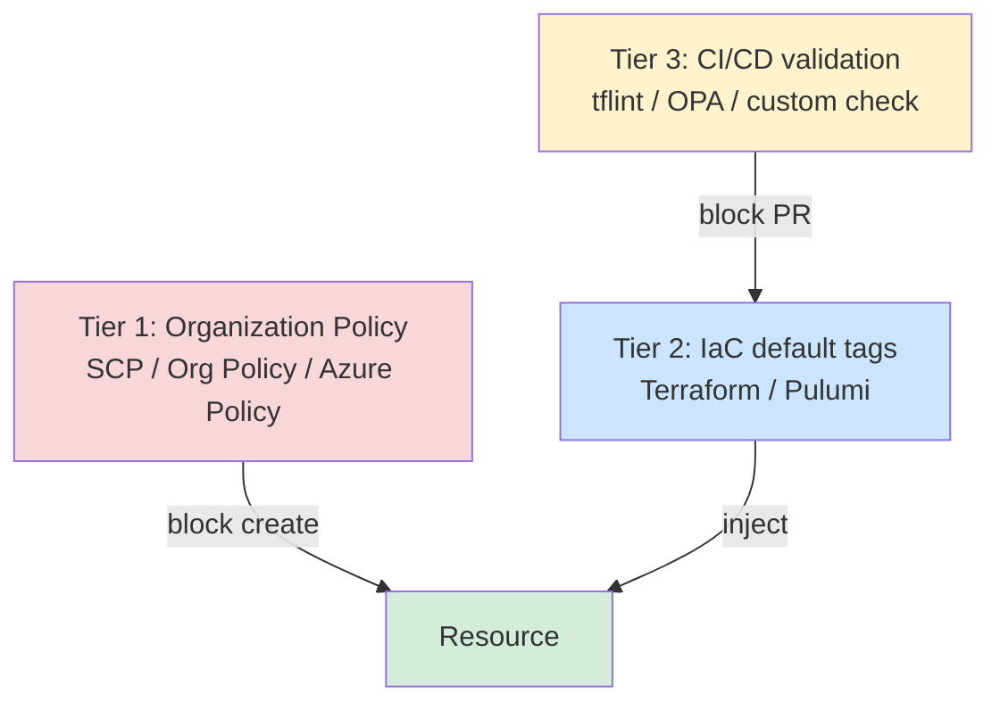
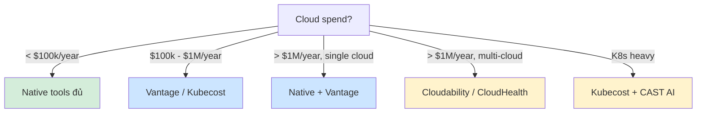

# 🎓 Tagging, Allocation & Showback Reports

> **Tác giả:** Mr.Rom\
> **Phiên bản:** v1.0.0\
> **Tạo lúc:** 24/05/2026\
> **Cập nhật:** 24/05/2026\
> **Level:** Basic\
> **Tags:** [MUST-KNOW]\
> **Thời lượng đọc:** ~20 phút\
> **Prerequisites:** [01_pricing-models-deep.md](01_pricing-models-deep.md)

> 🎯 *Bài 01 dạy "mua đúng pricing model". Nhưng nếu không biết **tiền tiêu vào đâu** thì không tối ưu được gì. Bài này dạy **tagging strategy** chuẩn (env, team, service, cost-center, owner), cách **enforce tag** bằng SCP / Org Policy / Terraform, **allocation** (kể cả shared resource pro-rata), **showback report** monthly, và overview các dashboard tool (native + 3rd-party).*

## 🎯 Sau bài này bạn sẽ

- [ ] Thiết kế **tagging strategy** chuẩn 5 trục: env, team, service, cost-center, owner
- [ ] **Enforce tag** ở tier policy (SCP AWS / Org Policy GCP / Azure Policy)
- [ ] **Enforce tag** ở tier IaC (Terraform `default_tags`, validate trong CI)
- [ ] **Allocate cost** cho shared resource (network, log, monitoring) pro-rata
- [ ] Build **showback report** monthly bằng AWS Cost Explorer / GCP Billing / Azure Cost Mgmt
- [ ] Biết khi nào cần 3rd-party tool: Cloudability / Apptio / CloudHealth / Vantage
- [ ] Tránh anti-pattern "untagged resource cost waste"

---

## Tình huống — Acme Shop báo cáo không ai chịu

CFO lại gọi sếp tech:

> *"Tháng này $52k. Tăng tiếp $2k. Bạn nói team Backend tốn $14k, team Mobile tốn $3k, team Data $18k. Còn $17k là gì? 'Shared infra' nghĩa là sao? Ai chịu trách nhiệm?"*

Sếp tech về team check Cost Explorer:
- $17k "shared": 5 EC2 không tag, 12 EBS volume orphan, 3 RDS database lạ tên `db-test-do-not-delete`, 8 NAT Gateway, 1 ALB không gắn target.
- Junior dev tạo ra resource từ 6 tháng trước, đã nghỉ việc.
- DevOps nhìn: *"Không xóa được vì không biết của ai."*

→ Đây là **classic untagged cost waste**. Không có tag = không có owner = không ai dám delete = bill tăng vĩnh viễn.

Cách giải quyết: **Tagging strategy + enforcement + allocation report**.

---

## 1️⃣ Tagging strategy — 5 trục chuẩn

🪞 **Ẩn dụ**: *Tagging như **dán nhãn lên đồ trong tủ đông** — không dán, 6 tháng sau bốc ra thấy túi trắng không biết thịt gì, vứt vì sợ. Cloud cũng vậy — không tag, không ai dám động.*

### 5 tag bắt buộc

| Tag key | Mục đích | Ví dụ value |
|---|---|---|
| `env` | Phân biệt môi trường | `prod`, `staging`, `dev`, `test`, `sandbox` |
| `team` | Team chịu trách nhiệm | `backend`, `mobile`, `data`, `ml`, `platform` |
| `service` | Service/app cụ thể | `checkout-api`, `payment-svc`, `etl-pipeline` |
| `cost-center` | Cost center kế toán | `cc-1001`, `cc-2030` |
| `owner` | Người chịu trách nhiệm cuối | `thien.le`, `team-backend` (email/Slack handle) |

### Tag optional (recommend)

| Tag key | Mục đích | Ví dụ |
|---|---|---|
| `project` | Project lớn cross-team | `q4-checkout-revamp`, `migration-2026` |
| `compliance` | Yêu cầu compliance | `pci`, `hipaa`, `gdpr`, `none` |
| `data-classification` | Phân loại data | `public`, `internal`, `confidential`, `restricted` |
| `auto-shutdown` | Schedule shutdown | `weekday-9-18`, `never`, `weekend-off` |
| `expires-at` | Resource tạm — ngày xóa | `2026-06-15` |
| `created-by` | Tool/người tạo | `terraform`, `console-manual`, `auto-pipeline` |

### Naming convention

**Quy tắc**:
- **Lowercase** key + value (tránh `Env` vs `env` confusion).
- **kebab-case** (gạch nối) cho multi-word: `cost-center`, không `CostCenter`.
- **Value enum hoặc free-form**: enum cho `env` (chỉ 5 giá trị), free-form cho `owner`.
- **Document trong wiki**: 1 page list mọi tag + value hợp lệ.

### Ví dụ resource đủ tag

```hcl
resource "aws_instance" "checkout_api" {
  ami           = "ami-abc"
  instance_type = "m6i.large"
  
  tags = {
    env          = "prod"
    team         = "backend"
    service      = "checkout-api"
    cost-center  = "cc-1001"
    owner        = "thien.le"
    project      = "q4-checkout-revamp"
    compliance   = "pci"
  }
}
```

→ Khi resource này $146/tháng, FinOps biết ngay: prod / team backend / service checkout-api / cost center 1001 / owner Thiện Lê.

---

## 2️⃣ Enforcement — 3 tier để tag không bị quên

Có strategy đẹp mà không enforce = chỉ là tài liệu. Phải bắt buộc tag ở 3 tier.



### Tier 1 — Organization policy (cứng nhất)

#### AWS — Service Control Policy (SCP)

```json
{
  "Version": "2012-10-17",
  "Statement": [
    {
      "Sid": "RequireTagsOnEC2",
      "Effect": "Deny",
      "Action": ["ec2:RunInstances"],
      "Resource": ["arn:aws:ec2:*:*:instance/*"],
      "Condition": {
        "Null": {
          "aws:RequestTag/env": "true",
          "aws:RequestTag/team": "true",
          "aws:RequestTag/owner": "true"
        }
      }
    }
  ]
}
```

→ Engineer tạo EC2 thiếu 3 tag bắt buộc → AWS API trả lỗi 403. Không lên được resource.

#### GCP — Organization Policy

```yaml
# policy.yaml
name: organizations/123/policies/compute.requireTags
spec:
  rules:
  - condition:
      expression: "!resource.matchTag('env', 'team', 'owner')"
    enforce: true
```

#### Azure — Azure Policy

```json
{
  "properties": {
    "displayName": "Require tags env, team, owner",
    "policyRule": {
      "if": {
        "anyOf": [
          { "field": "tags['env']", "exists": "false" },
          { "field": "tags['team']", "exists": "false" },
          { "field": "tags['owner']", "exists": "false" }
        ]
      },
      "then": { "effect": "deny" }
    }
  }
}
```

### Tier 2 — IaC `default_tags`

Terraform AWS provider có `default_tags` — auto inject vào mọi resource:

```hcl
provider "aws" {
  region = "us-east-1"
  default_tags {
    tags = {
      managed-by  = "terraform"
      git-repo    = "acmeshop/infra"
      env         = var.env
      cost-center = var.cost_center
    }
  }
}
```

→ Engineer quên tag → Terraform tự bổ sung 4 tag mặc định. Per-resource thì override/extend.

### Tier 3 — CI/CD validation

Trong PR pipeline, check tag trước khi apply:

```bash
# .github/workflows/terraform.yml
- name: Validate required tags
  run: |
    terraform plan -out=plan.tfplan
    terraform show -json plan.tfplan > plan.json
    
    python3 scripts/check_tags.py plan.json --required env,team,owner,service
```

`check_tags.py`:
```python
import json, sys

REQUIRED = ['env', 'team', 'owner', 'service']

with open(sys.argv[1]) as f:
    plan = json.load(f)

errors = []
for change in plan.get('resource_changes', []):
    if change['change']['actions'] != ['create']:
        continue
    after = change['change']['after']
    tags = after.get('tags', {}) or {}
    missing = [k for k in REQUIRED if k not in tags]
    if missing:
        errors.append(f"{change['address']}: missing tags {missing}")

if errors:
    print("\n".join(errors))
    sys.exit(1)
```

→ PR block ngay từ pipeline trước khi `apply`.

### Combo cuối cùng

- **Tier 1** chặn resource console (engineer click chuột).
- **Tier 2** auto-inject cho IaC chuẩn (`managed-by=terraform`).
- **Tier 3** validate logic phức tạp (tag value enum, format ngày, owner exist trong LDAP).

→ Triple defense. Khó miss tag.

---

## 3️⃣ Allocation — Chia cost cho team

Tag rồi, giờ phải **map cost → team**. Đây là việc của Phase Inform.

### Activate cost allocation tag

#### AWS

```bash
# Activate tag để hiện trong Cost Explorer
aws ce update-cost-allocation-tags-status \
  --cost-allocation-tags-status TagKey=env,Status=Active \
                                TagKey=team,Status=Active \
                                TagKey=service,Status=Active \
                                TagKey=cost-center,Status=Active
```

→ Sau 24-48h, Cost Explorer cho group by tag. Trước đó tag có nhưng Cost Explorer chưa thấy.

#### GCP — BigQuery export

GCP recommend export billing data sang BigQuery để query:

```bash
# Bật billing export
gcloud billing accounts list
# Trong Console: Billing → Billing export → BigQuery export
```

Query allocation:
```sql
SELECT
  labels.value AS team,
  service.description,
  SUM(cost) AS total_cost
FROM `myproject.billing.gcp_billing_export_v1_XXXXXX`
CROSS JOIN UNNEST(labels) AS labels
WHERE labels.key = 'team'
  AND DATE(usage_start_time) BETWEEN '2026-05-01' AND '2026-05-31'
GROUP BY team, service.description
ORDER BY total_cost DESC;
```

#### Azure

```bash
# Azure Cost Management API
az costmanagement query \
  --type Usage \
  --timeframe MonthToDate \
  --scope /subscriptions/SUB_ID \
  --dataset-grouping name=Tag value=team \
  --dataset-aggregation totalCost.function=Sum,totalCost.name=Cost
```

### Shared resource — pro-rata allocation

Vấn đề kinh điển: **shared resource** (NAT Gateway, ALB, VPC, network egress, monitoring, log aggregation) không thể tag cho 1 team duy nhất.

3 cách phân bổ:

| Cách | Cơ chế | Khi dùng |
|---|---|---|
| **Equal split** | Chia đều cho mọi team dùng | Đơn giản, đủ fair cho team gần như nhau |
| **Usage-based** | Theo % traffic / request / data | Có metric chi tiết |
| **Headcount** | Theo số engineer mỗi team | Backup khi không metric |

#### Ví dụ pro-rata theo usage

NAT Gateway $99/tháng + $0.045/GB processed.

| Team | GB processed | % | Allocation |
|---|---|---|---|
| backend | 1,800 GB | 60% | $99 × 60% = $59.40 + $1.50 traffic |
| data | 900 GB | 30% | $99 × 30% = $29.70 + $0.75 traffic |
| mobile | 300 GB | 10% | $99 × 10% = $9.90 + $0.25 traffic |

→ Chia NAT cost theo VPC flow log metric. Backend tốn nhiều nhất → biết ngay.

#### Pattern: shared cost pool

Tạo "team" giả `cost-center=shared-infra` cho:
- VPC, transit gateway, Direct Connect.
- Log aggregation (CloudWatch, Loki, Datadog log ingestion).
- Monitoring (Prometheus, DataDog).
- CI/CD (GitHub Actions runner, Jenkins, ArgoCD).
- Identity (Okta, IAM Identity Center).

Cuối tháng, FinOps practitioner chia pool này cho team theo metric:
- Logs ingestion → theo GB log mỗi team tạo.
- CI/CD → theo CI minute mỗi team consume.
- Monitoring → theo số host/service mỗi team có.

---

## 4️⃣ Untagged resource — Cost waste

Cho dù enforce mạnh đến đâu, vẫn sẽ có resource untag:
- Resource tạo bằng console (escape SCP).
- Resource tạo trước khi áp dụng policy.
- Resource có tag nhưng value rỗng / sai format.
- Resource auto-create bởi service (AWS Backup, CloudFront edge, ELB target group).

### Audit untagged

#### AWS

```bash
# Tìm EC2 không có tag `env`
aws ec2 describe-instances \
  --query 'Reservations[].Instances[?!not_null(Tags[?Key==`env`].Value)].InstanceId' \
  --output text

# Tìm EBS volume orphan (không attach)
aws ec2 describe-volumes \
  --filters Name=status,Values=available \
  --query 'Volumes[].[VolumeId,Size,CreateTime]' \
  --output table

# Tìm EIP idle
aws ec2 describe-addresses \
  --query 'Addresses[?AssociationId==null].[PublicIp,AllocationId]' \
  --output table
```

#### GCP

```bash
# VM không có label
gcloud compute instances list \
  --filter='-labels.team:*' \
  --format='table(name,zone,labels)'

# Persistent Disk không gắn
gcloud compute disks list \
  --filter='-users:*' \
  --format='table(name,zone,sizeGb,creationTimestamp)'
```

### Pattern xử lý untagged

1. **Discover**: chạy audit hàng tuần, output Slack channel `#cost-untagged`.
2. **Notify**: tag tạm `auto-tagged=true` + `owner=unknown` + Slack message *"@channel: 5 EC2 untag, 3 EBS orphan, 1 EIP idle — owner reach out trong 72h"*.
3. **Quarantine**: sau 72h không claim → tag `quarantine=true` + stop (không delete).
4. **Delete**: sau 14 ngày quarantine → delete.

→ Acme Shop $17k "shared" có thể giảm $10k khi cleanup orphan + tag retroactive.

---

## 5️⃣ Showback report monthly

Mục tiêu: mỗi tháng gửi mỗi team báo cáo *"team bạn tốn $X — phân tích đây"*.

### Format chuẩn (1 page)

```markdown
# Cost Report — Team Backend — May 2026

**Total**: $14,230 (−5% vs April $14,980 ✅)

## Breakdown
| Service | Cost | % | Trend |
|---|---|---|---|
| EC2 | $5,800 | 41% | +2% |
| RDS | $4,100 | 29% | −10% (downsize) |
| S3 | $2,100 | 15% | +1% |
| Lambda | $1,200 | 8% | +30% (new feature) |
| Others | $1,030 | 7% | flat |

## Top resources
1. EC2 checkout-api-prod (m7i.xlarge × 4): $1,200
2. RDS db.r6i.large Multi-AZ checkout-db: $890
3. S3 prod-uploads (5 TB): $480

## FinOps recommendations
- 🟢 RDS downsize r6i.2xlarge → r6i.large saved $400/month — keep monitoring CPU/memory
- 🟡 EC2 checkout-api có 60% time CPU < 30% — consider t3.xlarge (save $200/month)
- 🔴 Lambda new feature `image-resize` cost $300/month — Spot ECS could be 70% cheaper

## RI/SP coverage
- Current: 65% (target 75%)
- Recommendation: buy 5 m7i.large 1y Compute SP — add $400/month commit, save $1,200/month

## Untagged resources
- 2 EBS volume orphan (32GB total) — auto-cleanup July 1
```

### Phân phối báo cáo

- **Email** team lead + manager.
- **Slack** thread trong `#team-backend-cost` (private channel).
- **Confluence/Notion** page lưu trữ.
- **Dashboard** public link (Looker / Grafana / native).

### Cadence

| Audience | Cadence | Format |
|---|---|---|
| Engineer team lead | Weekly digest | Slack 5 dòng |
| Team lead + manager | Monthly | Full report 1 page |
| VP Engineering / CTO | Monthly | Slide 3 trang (total + top 5 issue + roadmap) |
| CFO / Board | Quarterly | Slide + chart + YoY trend |

---

## 6️⃣ Dashboard tools — Native vs 3rd-party

### Native tools (rẻ, đủ dùng cho startup-mid)

| Tool | Cloud | Tính năng | Limit |
|---|---|---|---|
| **AWS Cost Explorer** | AWS | Filter/group by tag, forecast 12 tháng, SP recommendation | UI limited, không cross-account easy |
| **AWS Budgets** | AWS | Alert vượt threshold, free 2 budget/account | Latency 8h |
| **AWS Compute Optimizer** | AWS | Right-size recommend | Cần 14-day metric |
| **GCP Cloud Billing Reports** | GCP | Built-in dashboard, BigQuery export | Slice limited |
| **GCP Recommender** | GCP | Idle VM/disk/IP, machine type recommend | Auto-apply optional |
| **Azure Cost Management** | Azure | Multi-subscription, alert, budget | UI mixed |
| **Azure Advisor** | Azure | Cost + security + perf recommend | Subset all checks |

### 3rd-party tools (đắt, mạnh, cho enterprise + multi-cloud)

| Tool | Strength | Pricing | Khi dùng |
|---|---|---|---|
| **Cloudability (Apptio)** | Multi-cloud + enterprise reporting | ~1-2% spend | $500k+/year cloud spend, multi-cloud |
| **CloudHealth (VMware)** | Strong governance + policy | ~1-2% spend | Enterprise đa BU, compliance heavy |
| **CloudCheckr (NetApp)** | Security + cost combined | ~1-2% spend | Compliance + cost cùng team |
| **Vantage** | Modern UI, fair pricing | $30-300/month flat | Startup-mid, multi-cloud |
| **Spot.io (NetApp)** | Spot automation specialist | % savings (10-15%) | Spot-heavy workload, Kubernetes |
| **Kubecost / OpenCost** | Kubernetes-native allocation | Open source / paid tier | K8s cost allocation per namespace/pod |
| **Infracost** | Cost in PR | Free / team plan | DevEx focus — preview cost trước merge |
| **CAST AI** | K8s autoscale + Spot automation | % savings | K8s cluster cost optimization |

### Decision matrix



### Native + 3rd-party tier setup typical

- **Tier 1 — Native** (always): Cost Explorer + Budgets + Billing export.
- **Tier 2 — Infracost trong PR**: ngăn cost leak trước khi deploy. Free tier đủ small team.
- **Tier 3 — Vantage/Kubecost**: dashboard tốt hơn, khi spend > $100k/year hoặc K8s.
- **Tier 4 — Apptio/CloudHealth**: enterprise governance, compliance, multi-cloud.

→ Đừng nhảy thẳng Tier 4 — overkill cho startup.

---

## 7️⃣ Acme Shop — Áp dụng end-to-end

Quay lại tình huống đầu bài. Plan 90 ngày:

### Tuần 1-2 — Foundation

1. Định nghĩa tagging policy 5 tag bắt buộc + 3 optional. Doc Confluence.
2. SCP/Org Policy deny resource thiếu tag (block console).
3. Terraform `default_tags` + Pulumi tags helper.
4. Activate cost allocation tag trong Cost Explorer.

### Tuần 3-4 — Audit + cleanup

1. Script audit untagged (EC2, EBS, RDS, S3, EIP, NAT, ELB).
2. Slack `#cost-untagged` notify weekly.
3. Quarantine + delete cycle (72h notify, 14d quarantine).
4. **Estimated saving**: $5k-$10k từ orphan + idle resource.

### Tháng 2 — Reporting

1. Build showback report monthly (Google Sheet hoặc Looker).
2. Email + Slack monthly to team lead.
3. Setup Budget alert per team.

### Tháng 3 — Tooling

1. Cài Infracost vào PR pipeline.
2. Evaluate Vantage / Kubecost trial.
3. Quarterly review meeting với leadership.

→ Sau 90 ngày: hết "untagged $17k", có showback monthly, có cost-aware culture đầu tiên.

---

## 💡 Pitfall thường gặp & Best practice

### ❌ Pitfall: Tag value tự do, không enum

- **Triệu chứng**: `env=Prod`, `env=prod`, `env=PRODUCTION`, `env=Production` — group by tag thấy 4 row khác nhau cho cùng 1 môi trường.
- **Nguyên nhân**: Không validate value, mỗi engineer tự gõ.
- **Cách tránh**: Tier 1 policy enum check. `env IN (prod, staging, dev, test, sandbox)`. Lowercase đầy đủ.

### ❌ Pitfall: Tag retrofit thủ công cho 5000+ resource

- **Triệu chứng**: FinOps practitioner mới ngồi tag tay 2 tuần.
- **Nguyên nhân**: Không có tagging strategy ngay từ đầu.
- **Cách tránh**: Setup tag enforcement **trước khi** scale. Migration tag script bulk dùng AWS Resource Groups API. Còn hơn 1 năm sau làm.

### ❌ Pitfall: 100+ tag không trục rõ ràng

- **Triệu chứng**: Có `environment`, `env`, `Env`, `stage`, `Stage` — confusion.
- **Nguyên nhân**: Tag inflation, mỗi team đặt theo ý.
- **Cách tránh**: Centralized tag taxonomy. Chỉ FinOps add tag mới (PR review).

### ✅ Best practice: Owner tag = Slack/email handle

- **Vì sao**: Khi orphan resource cần claim, FinOps biết Slack/email ngay.
- **Cách áp dụng**: `owner=thien.le@acmeshop.vn` hoặc `owner=team-backend` (cho shared team resource).

### ✅ Best practice: Showback report 1 page max

- **Vì sao**: 10 page report = không ai đọc. 1 page với top 3 issue + top 3 action = ai cũng đọc.
- **Cách áp dụng**: Total + breakdown 5 service + top 3 resource + 3 recommendation. Đủ.

---

## 🧠 Self-check

**Q1.** Engineer tạo EC2 console không tag. Tier nào catch?

<details>
<summary>💡 Đáp án</summary>

**Tier 1 — Organization policy (SCP / Azure Policy / Org Policy)**.

Tier 2 (Terraform default_tags) chỉ catch nếu engineer dùng Terraform. Console click chuột bypass Tier 2 hoàn toàn. Tier 3 (CI/CD) cũng chỉ work khi engineer push code.

→ Đó là lý do Tier 1 (deny ở API level) là defense quan trọng nhất.

</details>

**Q2.** NAT Gateway $99/tháng cho VPC dùng bởi 3 team. Allocate sao?

<details>
<summary>💡 Đáp án</summary>

Pro-rata theo **traffic** (GB processed).

Bật VPC Flow Logs → query GB egress per team theo source IP / subnet (mỗi team có subnet riêng) → chia $99 theo %.

Nếu không có VPC Flow Logs → fallback equal split ($33 mỗi team) — đỡ fair nhưng đơn giản.

</details>

**Q3.** Acme Shop multi-cloud (AWS + GCP). Cost Explorer + Billing Reports đủ chưa?

<parameter name="content_continue">

<details>
<summary>💡 Đáp án</summary>

**Không đủ** — vì cost ở 2 cloud không nhìn chung 1 dashboard.

Options:
- **Vantage** — modern UI, fair pricing, multi-cloud.
- **Cloudability / CloudHealth** — enterprise grade.
- **Tự build**: export billing data AWS CUR + GCP BigQuery → ETL về Snowflake → Looker dashboard chung.

Khi spend > $500k/year multi-cloud → đầu tư tool chuyên trả lại phần FTE đỡ phải làm.

</details>

**Q4.** Tag `auto-shutdown=weekday-9-18` để làm gì?

<details>
<summary>💡 Đáp án</summary>

Để Lambda/Cloud Function (bài 04) đọc tag và **auto-shutdown** EC2/VM ngoài giờ làm việc.

Cụ thể:
- Lambda CloudWatch event chạy 18:00 + 09:00 mỗi ngày làm việc.
- Lambda query `aws ec2 describe-instances --filters Name=tag:auto-shutdown,Values=weekday-9-18`.
- 18:00 stop instance, 09:00 start lại.

Dev/test env: chạy 9h/ngày × 5 ngày = 45h/tuần thay vì 168h/tuần → save **73%**.

</details>

**Q5.** Vì sao SCP/Org Policy không catch hết, vẫn cần CI/CD validation?

<details>
<summary>💡 Đáp án</summary>

SCP chỉ catch **presence** (tag tồn tại) — không catch logic value:
- `env=ABC` — không phải `prod/staging/dev/test/sandbox` → SCP cho qua.
- `owner=test123` — không phải email/Slack handle → SCP cho qua.
- `expires-at=tomorrow` — không phải ISO date → SCP cho qua.

CI/CD validation (Python script / OPA Gatekeeper) check:
- Value enum.
- Owner exist trong LDAP / Okta.
- Format date ISO.
- Cost-center exist trong finance system.

→ Layered defense: SCP catch coarse, CI/CD catch fine.

</details>

---

## ⚡ Cheatsheet

| Việc | Command / Pattern |
|---|---|
| Activate tag AWS | `aws ce update-cost-allocation-tags-status` |
| Audit untag EC2 | `aws ec2 describe-instances --query "...!not_null(Tags[?Key=='env'])..."` |
| Audit orphan EBS | `aws ec2 describe-volumes --filters Name=status,Values=available` |
| Audit idle EIP | `aws ec2 describe-addresses --query "Addresses[?AssociationId==null]"` |
| GCP untag VM | `gcloud compute instances list --filter='-labels.team:*'` |
| Terraform default_tags | `provider "aws" { default_tags { tags = {...} } }` |
| Block create no tag | SCP `Deny` + `Condition: Null aws:RequestTag/env` |
| BigQuery cost by team | `SELECT labels.value AS team, SUM(cost) FROM billing WHERE labels.key='team'` |

| Tag tier | Tool | Catch |
|---|---|---|
| **1. Org policy** | SCP / Org Policy / Azure Policy | Presence, deny at API |
| **2. IaC default** | Terraform default_tags, Pulumi | Inject automatically |
| **3. CI/CD validation** | Python / OPA / tflint | Value format, enum, exist check |

---

## 📚 Glossary

| EN | VN | Giải thích |
|---|---|---|
| **Tag / Label** | Nhãn | Key-value gắn với resource cloud |
| **Cost allocation tag** | Tag phân bổ cost | Tag được activate trong Cost Explorer để group |
| **SCP** | Service Control Policy | AWS Organization policy chặn API call |
| **Azure Policy** | Chính sách Azure | Tương đương SCP cho Azure |
| **Org Policy** | Chính sách Organization | Tương đương SCP cho GCP |
| **default_tags** | Tag mặc định | Terraform provider feature auto-inject tag |
| **Showback** | Báo cáo cost | Cho team biết tốn bao nhiêu, không trừ budget |
| **Chargeback** | Tính cost thật | Trừ vào budget team thật |
| **Pro-rata** | Theo tỷ lệ | Chia cost theo % usage / headcount |
| **Cost pool** | Hồ chi phí | Cost gom chung shared, chia sau |
| **Orphan resource** | Tài nguyên mồ côi | EBS không attach, EIP idle, snapshot stale |
| **Quarantine** | Cách ly | Stop resource, chờ owner claim trước khi delete |
| **CUR** | Cost & Usage Report | AWS billing data detail export to S3 |
| **Cost Explorer** | (giữ nguyên) | AWS native cost dashboard |
| **Billing export** | Export billing | GCP — export billing sang BigQuery |
| **Tag taxonomy** | Phân loại tag | Bộ tag chuẩn cả org, có document |

---

## 🔗 Liên kết & Tài nguyên

### Trong cluster
- ↶ Trước: [01_pricing-models-deep.md](01_pricing-models-deep.md)
- → Tiếp: [03_optimization-tactics-compute-storage-network.md](03_optimization-tactics-compute-storage-network.md)
- ↑ Cluster: [Cloud Cost Management README](../../README.md)

### Cross-reference
- ☁️ [AWS IAM context](../../../aws/lessons/01_basic/02_s3-deep-and-iam.md) — IAM policy
- 🏗️ [Terraform basics](../../../../10_devops/iac/) — IaC + default_tags

### Tài nguyên ngoài 2026
- 📖 [AWS Tagging Best Practices](https://docs.aws.amazon.com/whitepapers/latest/tagging-best-practices/) — official whitepaper
- 📖 [AWS Cost Allocation Tags](https://docs.aws.amazon.com/awsaccountbilling/latest/aboutv2/cost-alloc-tags.html)
- 📖 [GCP Labels best practices](https://cloud.google.com/billing/docs/onboarding-checklist#use_labels)
- 📖 [Azure tagging strategies](https://learn.microsoft.com/azure/cloud-adoption-framework/ready/azure-best-practices/resource-tagging)
- 📖 [FOCUS — Open Cost Spec](https://focus.finops.org/) — chuẩn billing đa cloud
- 📖 [Infracost docs](https://www.infracost.io/docs/) — PR cost preview
- 📖 [Vantage](https://www.vantage.sh/) — modern cost dashboard
- 📖 [Kubecost](https://www.kubecost.com/) — K8s cost allocation

---

## 📌 Changelog

- **v1.0.0 (24/05/2026)** — Bản đầu tiên. Bài 02 cluster cloud-cost-management. Tagging strategy 5 trục chuẩn (env/team/service/cost-center/owner) + enforcement 3 tier (Org policy + IaC default + CI/CD validation) + AWS SCP + GCP Org Policy + Azure Policy ví dụ + cost allocation activate + shared resource pro-rata 3 cách + untagged audit & quarantine + showback report 1-page format + native vs 3rd-party tool decision + Acme Shop 90-day plan + 5 pitfalls + 5 self-check.
