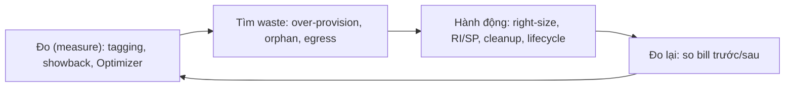

# 🎓 Optimization Tactics — Compute / Storage / Network / Database

> **Tác giả:** Mr.Rom\
> **Phiên bản:** v1.1.2\
> **Tạo lúc:** 24/05/2026\
> **Cập nhật:** 11/06/2026
> **Level:** Basic\
> **Tags:** [MUST-KNOW]\
> **Yêu cầu trước:** [Tagging, Allocation & Showback Reports](02_tagging-allocation-and-showback.md)

> 🎯 *Bài 02 dạy "thấy tiền tiêu đâu". Giờ vào Phase Optimize — **cắt cái gì, cắt sao**. Bài này gom 4 nhóm tactic kinh điển: Compute (right-sizing, ASG tune, Spot mix, schedule shutdown dev), Storage (lifecycle, orphan cleanup, S3 Intelligent Tiering), Network (egress, CDN, NAT Gateway tối ưu), Database (RI for steady, serverless for variable, drop unused index). Mỗi tactic có ROI cụ thể.*

## 🎯 Sau bài này bạn sẽ

- [ ] **Right-size** EC2/VM bằng Compute Optimizer / Recommender
- [ ] Tune **Auto Scaling Group** target tracking đúng metric
- [ ] **Mix Spot + On-demand + RI** cho ASG fault-tolerant
- [ ] **Schedule shutdown** dev/test ngoài giờ
- [ ] Lifecycle S3 / GCS / Azure Blob — Hot → Warm → Cold → Archive
- [ ] Cleanup **orphan snapshot**, **unattached disk**
- [ ] Tối ưu **egress + CDN caching** giảm 60-80% network cost
- [ ] Phân biệt **RI cho DB steady** vs **Aurora Serverless v2 cho variable**
- [ ] Drop **unused index** giảm RDS IOPS + storage

---

## Tình huống — Acme Shop đã có visibility, giờ phải cắt

Sau 30 ngày tagging + showback:
- $52k → $42k (giảm $10k từ orphan cleanup, bài 02).
- Còn $42k. CFO yêu cầu xuống **$37.5k** (giảm 25% so với baseline $50k).
- Cần cắt thêm **$4.5k/tháng**.

Sếp tech: *"Bài 01 dạy mua RI/SP — đã commit. Còn $4.5k phải optimize technical. Từ đâu cắt?"*

→ Bài này dạy 4 nhóm tactic, mỗi nhóm có potential save mấy $k. Combine vài tactic là đủ.

Tối ưu cost không phải việc làm 1 lần mà là vòng lặp liên tục — đo, tìm lãng phí, hành động, rồi đo lại để xác nhận:



→ Mỗi tactic phía dưới là 1 bước "hành động" trong vòng lặp này; điểm mấu chốt là luôn quay lại "đo lại" để chắc chắn cắt đúng chỗ, không phá perf.

---

## 1️⃣ Tối ưu compute

### Right-sizing với Compute Optimizer / Recommender

🪞 **Ẩn dụ**: *Right-sizing như **mua quần áo đúng size** — quá rộng (over-provisioned) hao vải (tiền), quá chật (under-provisioned) khó thở (perf). Compute Optimizer là máy đo cho bạn.*

#### AWS Compute Optimizer

```bash
# Bật service (free)
aws compute-optimizer update-enrollment-status --status Active

# Sau 14 ngày data, get recommendation
aws compute-optimizer get-ec2-instance-recommendations \
  --instance-arns arn:aws:ec2:us-east-1:123456789012:instance/i-abc

# Output mẫu:
# Current: m6i.2xlarge ($292/month, CPU 12% avg)
# Recommendation: m6i.large ($73/month, CPU 48% projected)
# Savings: $219/month per instance
```

→ Mỗi EC2 được phân loại:
- **Over-provisioned** (CPU/RAM/disk < 40% avg) — downsize.
- **Under-provisioned** (sustained > 80%) — upsize hoặc add instance.
- **Optimized** — giữ.

#### GCP Recommender

```bash
# List machine type recommendations
gcloud recommender recommendations list \
  --project=acmeshop-prod \
  --location=us-central1-a \
  --recommender=google.compute.instance.MachineTypeRecommender

# Apply
gcloud recommender recommendations mark-claimed RECOMMENDATION_ID \
  --location=us-central1-a \
  --recommender=google.compute.instance.MachineTypeRecommender
```

#### Azure Advisor

```bash
az advisor recommendation list \
  --filter "Category eq 'Cost'" \
  --query "[?recommendationTypeId=='c0f5316d-5e88-4f7e-b88f-...'].{Resource:resourceMetadata.resourceId, Savings:extendedProperties.annualSavingsAmount}"
```

#### Real example Acme Shop

| Instance | Current | Recommendation | Saving/month |
|---|---|---|---|
| analytics-worker-1 (m6i.2xlarge) | CPU 8%, RAM 22% | m6i.large | $219 |
| checkout-api-1 (m6i.xlarge) | CPU 35%, RAM 60% | m6i.large | $73 |
| dev-build (m5.4xlarge) | CPU 14% (only build time) | m5.large + Spot | $560 |
| ml-training-gpu (p4d.24xlarge) | GPU 5% (always-on) | On-demand only when training | $5000+ |

→ **Combined**: ~$1,500/tháng save. **Cảnh báo**: validate trên staging trước, không downsize prod mù.

### Tinh chỉnh Auto Scaling Group

#### Target tracking đúng metric

Engineer hay set:
```python
TargetTrackingConfig:
  PredefinedMetric: ASGAverageCPUUtilization
  TargetValue: 50.0  # ⚠️ default copy-paste
```

Vấn đề: 50% CPU target = quá conservative cho stateless web. App I/O-bound (chờ DB) thì CPU không bao giờ chạm 80%.

**Tune đúng**:

| Workload | Metric đúng | Target value |
|---|---|---|
| CPU-bound (encode, ML) | `CPUUtilization` | 65-75% |
| I/O-bound (web app gọi DB) | `RequestCountPerTarget` (ALB) | 1000-2000 req/min/instance |
| Memory-bound (cache, Java) | `MemoryUtilization` (custom) | 70-80% |
| Mixed | `RequestCountPerTarget` + `CPUUtilization` (combined policy) | tùy |

→ Đo trước, set sau. Default 50% CPU thường over-provision 30-40%.

#### Scale-in protection

Đừng để ASG kill instance vừa start (chưa warm up):

```bash
# Cool-down period
aws autoscaling update-auto-scaling-group \
  --auto-scaling-group-name web-asg \
  --default-cooldown 300 \
  --health-check-grace-period 180
```

→ 180s grace = đợi app warm up trước health check.

### Spot mix trong ASG

Pattern *"baseline RI/SP + burst on-demand + worker Spot"*:

```hcl
# Terraform
resource "aws_autoscaling_group" "web" {
  name = "web-asg"
  min_size = 4
  max_size = 20
  desired_capacity = 6
  
  mixed_instances_policy {
    instances_distribution {
      on_demand_base_capacity                  = 2  # always 2 on-demand
      on_demand_percentage_above_base_capacity = 25 # above 2: 25% on-demand, 75% spot
      spot_allocation_strategy                 = "capacity-optimized"
    }
    launch_template {
      launch_template_specification {
        launch_template_id = aws_launch_template.web.id
      }
      override { instance_type = "m6i.large" }
      override { instance_type = "m6a.large" }
      override { instance_type = "m7i.large" }
      override { instance_type = "m5.large" }
    }
  }
}
```

→ 4 instance type pool + capacity-optimized strategy → AWS pick pool ít interrupt nhất. Save 50-60% vs all-on-demand.

### Lên lịch tắt máy dev/test

🪞 **Ẩn dụ**: *Dev env chạy 24/7 = **bật điều hòa cả tuần dù chỉ ở nhà tối**. Schedule shutdown = lập trình điều hòa bật tắt theo giờ làm.*

#### AWS Instance Scheduler

AWS có solution chính thức [Instance Scheduler on AWS](https://aws.amazon.com/solutions/implementations/instance-scheduler/):

1. Deploy CloudFormation stack.
2. Tag instance: `Schedule=office-hours-weekday`.
3. DynamoDB schedule define `office-hours-weekday`: Mon-Fri 09:00-18:00.
4. Lambda chạy mỗi 5 phút, start/stop theo tag.

→ Dev env: 24h × 7d = 168h/tuần → 9h × 5d = 45h/tuần = **−73% effective**.

#### GCP Recommender + Cloud Scheduler

```bash
# Cloud Scheduler job stop dev VM 18:00 weekday
gcloud scheduler jobs create http stop-dev-vm \
  --schedule="0 18 * * 1-5" \
  --uri="https://compute.googleapis.com/compute/v1/projects/acme/zones/us-central1-a/instances/dev-1/stop" \
  --http-method=POST \
  --oauth-service-account-email=scheduler-sa@acme.iam.gserviceaccount.com
```

#### Azure Automation

```powershell
# Runbook stop dev VM
Stop-AzVM -ResourceGroupName "dev-rg" -Name "dev-vm-1" -Force
```

→ Schedule via Automation Account hoặc Logic App.

### Tổng tiết kiệm compute

| Tactic | Effort | Saving potential |
|---|---|---|
| Right-sizing (Compute Optimizer apply) | 🟢 Low | 15-30% compute spend |
| ASG target tune (CPU 50→70%) | 🟡 Medium | 10-20% |
| Mix Spot in ASG | 🟡 Medium | 30-50% compute spend |
| Schedule shutdown dev | 🟢 Low | 60-70% dev spend |
| Graviton/ARM migration | 🔴 High | 20-40% (per instance) |

---

## 2️⃣ Tối ưu storage

### Lifecycle policy — Hot → Warm → Cold → Archive

🪞 **Ẩn dụ**: *Storage tier như **tủ đồ trong nhà** — đồ hay dùng để bàn (Hot, đắt nhưng tiện), đồ ít dùng vào tủ kệ (Warm), đồ mùa đông gói cất gác (Cold), đồ kỷ niệm cho vào kho thuê (Archive — rẻ nhất nhưng lấy ra mất công).*

#### AWS S3 storage class

| Class | Price/GB | Retrieval | Min duration | Use |
|---|---|---|---|---|
| **S3 Standard** | $0.023 | Tức thì | None | Daily access |
| **S3 Intelligent-Tiering** | $0.023 + $0.0025 monitor | Tức thì | None | Unpredictable pattern |
| **S3 Standard-IA** | $0.0125 | Tức thì | 30 days | Backup, infrequent |
| **S3 One Zone-IA** | $0.01 | Tức thì | 30 days | Reproducible data |
| **S3 Glacier Instant** | $0.004 | Tức thì | 90 days | Long-term, rare access fast |
| **S3 Glacier Flexible** | $0.0036 | 1-5 min - 5h | 90 days | Compliance, occasional retrieval |
| **S3 Glacier Deep** | $0.00099 | 12h | 180 days | Compliance archive |

#### Lifecycle config

```json
{
  "Rules": [
    {
      "Id": "tier-down-uploads",
      "Status": "Enabled",
      "Filter": { "Prefix": "uploads/" },
      "Transitions": [
        { "Days": 30,  "StorageClass": "STANDARD_IA" },
        { "Days": 90,  "StorageClass": "GLACIER_IR" },
        { "Days": 365, "StorageClass": "DEEP_ARCHIVE" }
      ],
      "Expiration": { "Days": 2555 }
    }
  ]
}
```

```bash
aws s3api put-bucket-lifecycle-configuration \
  --bucket prod-uploads \
  --lifecycle-configuration file://lifecycle.json
```

→ Sau 30 ngày: $0.023 → $0.0125 = **−46%**.\
→ Sau 365 ngày: $0.023 → $0.00099 = **−96%**.

#### S3 Intelligent-Tiering (recommend cho 2026)

S3 Intelligent-Tiering **tự động** chuyển object giữa tier dựa access pattern, không cần lifecycle rule:
- Frequent → Infrequent (30 ngày không access).
- Infrequent → Archive Instant (90 ngày).
- Archive Instant → Archive (180 ngày).
- Archive → Deep Archive (730 ngày).

Cost: $0.0025/1000 object/tháng monitor + storage class price.

→ Khi access pattern unpredictable (UGC, log, backup) → Intelligent-Tiering tốt hơn manual lifecycle.

#### GCS storage class

| Class | Price/GB | Min duration |
|---|---|---|
| **Standard** | $0.020 | None |
| **Nearline** | $0.010 | 30 days |
| **Coldline** | $0.004 | 90 days |
| **Archive** | $0.0012 | 365 days |

```bash
# Lifecycle GCS
gcloud storage buckets update gs://prod-uploads \
  --lifecycle-file=lifecycle.json
```

#### Azure Blob tier

| Tier | Price/GB | Min duration |
|---|---|---|
| **Hot** | $0.0184 | None |
| **Cool** | $0.0100 | 30 days |
| **Cold** | $0.0036 | 90 days |
| **Archive** | $0.00099 | 180 days |

### Dọn dẹp resource orphan + unattached

#### EBS snapshot stale

Snapshot là **incremental** nhưng vẫn tốn:
- $0.05/GB/tháng.
- Acme Shop có 500 snapshot stale (>1 năm) × 50 GB = 25 TB = **$1,250/tháng** không dùng.

```bash
# List snapshot > 1 year old
aws ec2 describe-snapshots --owner-ids self \
  --query "Snapshots[?StartTime<='$(date -v-365d -u +%Y-%m-%dT%H:%M:%SZ)'].{ID:SnapshotId,Date:StartTime,Size:VolumeSize}" \
  --output table

# Bulk delete (cẩn thận!)
aws ec2 describe-snapshots --owner-ids self \
  --query "Snapshots[?StartTime<='$(date -v-365d -u +%Y-%m-%dT%H:%M:%SZ)'].SnapshotId" \
  --output text | xargs -n 1 aws ec2 delete-snapshot --snapshot-id
```

⚠️ **Trước khi delete**: confirm có **AMI backup** mới + DR plan không phụ thuộc snapshot này.

#### EBS volume unattached

```bash
aws ec2 describe-volumes \
  --filters Name=status,Values=available \
  --query "Volumes[*].[VolumeId,Size,CreateTime,Tags]" \
  --output table
```

→ Volume `available` = không gắn vào instance. Tag `Reason=detach-for-backup` nếu intentionally giữ, không thì delete.

#### GCP persistent disk unattached

```bash
gcloud compute disks list --filter='-users:*'
```

### Tổng tiết kiệm storage của Acme Shop

| Item | Action | Saving/month |
|---|---|---|
| 5 TB S3 prod-uploads | Lifecycle 30d IA + 90d Glacier IR | $80 → $20 = $60 |
| 500 orphan EBS snapshot | Delete after AMI confirm | $1,250 → $0 |
| 30 unattached EBS volume | Delete after owner notify | $200 → $0 |
| Old EC2 AMI (200 stale) | Deregister + delete snapshot | $300 → $0 |

→ **~$1,560/tháng** từ storage cleanup. Tactic dễ + ROI cao nhất.

---

## 3️⃣ Tối ưu network

### Egress giảm thông qua CDN

🪞 **Ẩn dụ**: *Egress qua Internet như **chở hàng từ kho gốc giao khách** — xa, đắt. CDN như **kho phụ ở mỗi quận** — chỉ ship lần đầu từ kho gốc, sau đó khách gần kho nào lấy kho đó. Origin egress giảm 80%.*

#### CloudFront / Cloud CDN / Azure CDN pricing

| CDN | Egress price | Free tier 2026 |
|---|---|---|
| **AWS CloudFront** | $0.085/GB (US/EU first 10 TB) | 1 TB/month + 10M requests |
| **GCP Cloud CDN** | $0.08/GB | None (paid only) |
| **Azure CDN** | $0.081/GB | None |
| **Cloudflare** | $0 (Free plan), $5-200/month plans | Generous free tier |

→ Acme Shop có 50 TB egress/tháng S3 → Internet:
- Direct S3: 50 TB × $0.09 = **$4,500/tháng**.
- Via CloudFront with cache hit 75%: Origin egress 12.5 TB × $0.02 (S3 → CloudFront free) + Edge egress 50 TB × $0.085 = **$0 + $4,250 = $4,250**.
- Wait — tổng vẫn $4,250. Lưu ý: edge → user vẫn tốn. CDN giảm nếu CloudFront price < origin price.

**Trick thật**: dùng **Cloudflare** đứng trước cho static site → Cloudflare free egress unmetered → save 70-90% so với CloudFront/Cloud CDN.

### VPC Endpoint — traffic trong AWS network

VPC Endpoint cho phép EC2 → S3 / DynamoDB / ECR mà không qua NAT, không tính egress cross-region.

#### Gateway Endpoint (free)

```bash
aws ec2 create-vpc-endpoint \
  --vpc-id vpc-abc \
  --service-name com.amazonaws.us-east-1.s3 \
  --route-table-ids rtb-xyz
```

→ S3 + DynamoDB traffic không qua NAT. Save NAT processing fee $0.045/GB.

#### Interface Endpoint ($0.01/h + $0.01/GB)

Cho service khác (SSM, ECR, KMS, Secrets Manager...):

```bash
aws ec2 create-vpc-endpoint \
  --vpc-id vpc-abc \
  --vpc-endpoint-type Interface \
  --service-name com.amazonaws.us-east-1.ecr.api \
  --subnet-ids subnet-1 subnet-2
```

→ Cost: $7.20/tháng/endpoint base + traffic. Đủ rẻ so với NAT $0.045/GB cho ECR pull image (vài GB/lần).

### Regional vs Global Load Balancer

| LB | Cost | Khi dùng |
|---|---|---|
| **AWS ALB** | $0.0225/h + $0.008/LCU-hour | Regional HTTP/S |
| **AWS NLB** | $0.0225/h + $0.006/NLCU-hour | Regional TCP/UDP, high perf |
| **AWS Global Accelerator** | $0.025/h + $0.015/GB transfer | Multi-region anycast |
| **GCP Global HTTP LB** | $0.025/h + $0.008-0.012/GB | Global anycast |
| **GCP Regional Network LB** | $0.025/h | Regional |

→ Acme Shop có 5 ALB **chỉ vài request/giây** → $0.0225 × 24 × 30 × 5 = **$81/tháng**. Consolidate xuống 2 ALB → save $48.

### Tiết kiệm network của Acme Shop

| Item | Action | Saving/month |
|---|---|---|
| S3 → Internet 50 TB | CloudFront + Cloudflare front | $4,500 → $1,500 = $3,000 |
| NAT Gateway 15 ALB | VPC Endpoint S3/DynamoDB + consolidate | $1,000 → $400 = $600 |
| 5 ALB underutilized | Consolidate 2 ALB | $80 → $32 = $48 |

→ Khoảng **$3,600/tháng**. Network thường là **biggest single saver**.

---

## 4️⃣ Tối ưu database

### RI cho RDS tải ổn định, Serverless cho tải biến động

🪞 **Ẩn dụ**: *Steady DB workload (prod transactional 24/7) như **lái xe văn phòng hàng ngày** — mua xe (RI) rẻ hơn thuê. Variable DB workload (analytics chỉ chạy giờ làm) như **đi taxi cuối tuần** — không mua xe, gọi grab khi cần (Aurora Serverless v2).*

#### RDS Reserved

| Cloud | Tên | Discount |
|---|---|---|
| **AWS RDS** | Reserved DB Instance | 1y: −30%, 3y: −60% |
| **GCP Cloud SQL** | CUD (Cloud SQL) | 1y: −25%, 3y: −52% |
| **Azure SQL DB** | Reserved Capacity | 1y: −33%, 3y: −55% |

→ Steady prod DB (db.r6i.large 24/7) — mua RI 3-year, save 60%.

#### Aurora Serverless v2 cho variable

Aurora Serverless v2 (2022 GA):
- ACU (Aurora Capacity Unit) = 2 GB RAM + CPU.
- Auto-scale 0.5 → 128 ACU trong giây.
- Pay-per-ACU-hour: $0.12/ACU-h.

Use case:
- **Dev/test DB**: ACU min 0.5 (idle = $0.06/h = $43/tháng vs db.r6i.large $192).
- **Analytics burst**: ACU min 0.5, max 16 → quiet $43, burst 1h/ngày 16 ACU × $0.12 = $1.92.

→ Save 70-90% so với provisioned cho variable workload.

#### DynamoDB On-demand vs Provisioned

| Mode | Khi dùng |
|---|---|
| **On-demand** | Traffic unpredictable, < 18% provisioned price equivalent |
| **Provisioned + Auto-scaling** | Steady traffic, > 18% utilization, dùng RI cho extra discount |

→ Quy tắc: < 5,000 WCU/tháng → On-demand. > 50,000 WCU/tháng → Provisioned + RI.

### Drop index không dùng — thủ phạm ngốn IOPS

PostgreSQL/MySQL có index không dùng:
- Slow write (mỗi insert update all index).
- Tốn disk (gp3 $0.08/GB/month + IOPS $0.005/IOPS-month).
- Backup snapshot lớn → snapshot cost cao.

```sql
-- PostgreSQL: index không dùng (idx_scan = 0)
SELECT
  schemaname || '.' || relname AS table,
  indexrelname AS index,
  pg_size_pretty(pg_relation_size(indexrelid)) AS size,
  idx_scan AS scans
FROM pg_stat_user_indexes
WHERE idx_scan = 0
  AND indexrelid NOT IN (SELECT conindid FROM pg_constraint)
ORDER BY pg_relation_size(indexrelid) DESC;
```

→ Acme Shop checkout DB có 28 unused index, total 12 GB → drop save IOPS + 12 GB storage + snapshot 5x daily.

### Tổng tiết kiệm database

| Item | Action | Saving/month |
|---|---|---|
| Prod RDS db.r6i.large × 3 (Multi-AZ) | 3-year RI All Upfront | $600 → $240 |
| Dev DB cluster 3 × db.r6i.large 24/7 | Aurora Serverless v2 (0.5-2 ACU) | $200 → $50 |
| 28 unused index checkout DB | Drop after staging test | IOPS −30%, $80 → $55 |
| DynamoDB table low traffic | Provisioned → On-demand | $120 → $40 |

→ ~**$615/tháng** từ DB.

---

## 5️⃣ Tổng tiết kiệm của Acme Shop

Tổng hợp 4 nhóm:

| Nhóm | Saving/tháng |
|---|---|
| Compute (right-size + Spot + schedule) | $1,500 |
| Storage (lifecycle + orphan cleanup) | $1,560 |
| Network (CDN + VPC Endpoint + LB consolidate) | $3,600 |
| Database (RI + Serverless v2 + index) | $615 |
| **Total** | **$7,275/tháng** |

$42k − $7.3k = **$34.7k/tháng**. Đã dưới target $37.5k (giảm 30% so với $50k baseline).

→ Vượt mục tiêu. Báo cáo CFO.

---

## 💡 Cạm bẫy thường gặp & Best practice

### ❌ Cạm bẫy: Tắt resource production lúc 2h sáng

- **Triệu chứng**: Script schedule shutdown bug, stop production EC2 đêm Chủ Nhật → mất 4h availability → mất $200k revenue.
- **Nguyên nhân**: Tag `auto-shutdown` apply nhầm cho prod, script không có safety check.
- **Cách tránh**: Schedule shutdown **chỉ apply** cho `env=dev` hoặc `env=staging`. Script có whitelist check. Test trên 1 instance trước khi roll out.

### ❌ Cạm bẫy: Apply Compute Optimizer mù

- **Triệu chứng**: Downsize m6i.xlarge → m6i.large theo recommendation, app OOM crash trong giờ peak Black Friday.
- **Nguyên nhân**: Compute Optimizer dựa 14-day data không cover peak event.
- **Cách tránh**: Apply recommendation trên staging trước. Hold recommendations cho prod 30+ days quanh peak event.

### ❌ Cạm bẫy: Delete EBS snapshot không có AMI backup

- **Triệu chứng**: Delete 500 snapshot, sau đó cần restore 1 instance → không restore được.
- **Nguyên nhân**: Snapshot là backup duy nhất.
- **Cách tránh**: Confirm AMI backup mới hoặc snapshot mới trong 7 ngày trước khi delete stale. Tag `keep=true` cho snapshot quan trọng.

### ❌ Cạm bẫy: Đổi RDS sang Aurora Serverless v2 cho prod 24/7 steady

- **Triệu chứng**: Cost tăng từ $192/tháng RDS → $400+/tháng Aurora SLS v2 (ACU peak liên tục).
- **Nguyên nhân**: Aurora SLS v2 trả per-ACU-hour. Steady prod tốn hơn provisioned + RI.
- **Cách tránh**: SLS v2 chỉ cho variable workload (idle nhiều). 24/7 steady → provisioned + RI.

### ✅ Best practice: Optimize trên staging trước, prod sau

- **Vì sao**: Right-size nhầm = prod down = mất tiền x10 saving.
- **Cách áp dụng**: Mọi change > $50/month/resource phải qua staging 1 tuần trước. Document trong PR.

### ✅ Best practice: Quarterly storage audit

- **Vì sao**: Storage cost compound theo thời gian — không audit, 2 năm sau bill x3.
- **Cách áp dụng**: Quarterly script chạy: orphan snapshot > 1 năm, unattached disk > 30 ngày, untagged bucket > 50 GB. Slack notify owner, sau 14 ngày → cleanup.

### ✅ Best practice: CDN từ tháng đầu cho static asset

- **Vì sao**: Egress cost compound nhanh, CDN setup 1h tiết kiệm $1k+/tháng từ tuần đầu.
- **Cách áp dụng**: Cloudflare free tier cho non-critical static. CloudFront/Cloud CDN cho asset cần TLS custom + WAF.

---

## 🧠 Tự kiểm tra (Self-check)

**Q1.** Compute Optimizer khuyên downsize m6i.xlarge → m6i.large. Áp dụng ngay?

<details>
<summary>💡 Đáp án</summary>

**Không** — apply trên staging trước.

Lý do:
- Compute Optimizer dựa 14-day data → có thể miss peak event (Black Friday, end-of-month batch).
- App có thể OOM khi RAM giảm 50%.
- Database connection pool có thể overflow nếu downsize app server.

Quy trình đúng: staging → load test → 1 prod instance canary → rollout phần còn lại.

</details>

**Q2.** S3 bucket có pattern access "30 ngày đầu daily, sau đó 6 tháng/lần". Lifecycle nào?

<details>
<summary>💡 Đáp án</summary>

```json
{
  "Transitions": [
    { "Days": 30,  "StorageClass": "STANDARD_IA" },
    { "Days": 180, "StorageClass": "GLACIER_IR" }
  ]
}
```

Hoặc đơn giản hơn: dùng **S3 Intelligent-Tiering** — tự auto-move dựa access pattern, không cần rule.

Không nên xuống Deep Archive vì retrieval 12h — pattern truy cập 6 tháng/lần cần data nhanh khi cần.

</details>

**Q3.** Acme Shop egress S3 → user 50 TB/month $4,500. Cách nào giảm $2k+?

<details>
<summary>💡 Đáp án</summary>

3 cách kết hợp:

1. **Cloudflare** đứng trước CDN — free unmetered egress cho non-premium plan. Save phần lớn $4,500.
2. **CloudFront** với cache TTL dài (24h+) cho static asset → cache hit rate > 80%.
3. **Image optimization** (WebP, lossless) — giảm size 30-50% → giảm egress proportionally.

Combined potential save $3,000+/month.

</details>

**Q4.** Database dev/staging chạy 24/7 db.r6i.large × 3 = $576/tháng. Tối ưu sao?

<details>
<summary>💡 Đáp án</summary>

2 lựa chọn:

**Option A — Aurora Serverless v2** (recommend):
- Min 0.5 ACU, max 4 ACU.
- Idle (đêm + cuối tuần): 0.5 ACU × $0.12 × 730h = $44/month/cluster.
- Peak (giờ làm): up to 4 ACU.
- Estimated $50-80/cluster = $150-240 total.

**Option B — Schedule stop**:
- Stop weekday 18:00-09:00 + weekend = chỉ chạy 45h/168h tuần = 27% time.
- $576 × 0.27 = $156/tháng total.

→ Option A nicer DX (không cần wait restart), Option B đơn giản hơn. Save 60-75% trong cả 2 case.

</details>

**Q5.** Drop unused index có rủi ro gì? Cách giảm rủi ro?

<details>
<summary>💡 Đáp án</summary>

Rủi ro:
- Index có thể là **constraint** ngầm (unique index) — drop = mất constraint.
- Query plan có thể đổi sau drop → slow query không phát hiện.
- Index có thể chỉ idle trong sampling window → quarterly report đùng dùng.

Cách giảm:
1. Filter `idx_scan = 0` AND `NOT IN (constraints)` (như query trong bài).
2. Drop trên **staging** trước, replay production traffic.
3. Drop với `CONCURRENTLY` (Postgres) — không lock.
4. Monitor 1 tuần sau drop, có thể `CREATE INDEX CONCURRENTLY` lại nếu cần.
5. Có script backup `CREATE INDEX` statement trước drop.

</details>

---

## ⚡ Tra cứu nhanh (Cheatsheet)

### Compute
| Việc | Command |
|---|---|
| Enable Compute Optimizer | `aws compute-optimizer update-enrollment-status --status Active` |
| Get EC2 recommendation | `aws compute-optimizer get-ec2-instance-recommendations` |
| GCP machine type recommend | `gcloud recommender recommendations list --recommender=google.compute.instance.MachineTypeRecommender` |
| ASG mixed instance Spot | Terraform `mixed_instances_policy` + `spot_allocation_strategy = "capacity-optimized"` |

### Storage
| Việc | Command |
|---|---|
| S3 lifecycle | `aws s3api put-bucket-lifecycle-configuration` |
| S3 Intelligent-Tiering | StorageClass `INTELLIGENT_TIERING` trên PutObject |
| Find orphan EBS | `aws ec2 describe-volumes --filters Name=status,Values=available` |
| Find stale snapshot | `aws ec2 describe-snapshots --owner-ids self --query "Snapshots[?StartTime<='...'].SnapshotId"` |
| GCS lifecycle | `gcloud storage buckets update gs://X --lifecycle-file=lifecycle.json` |

### Network
| Việc | Command |
|---|---|
| VPC Endpoint S3 | `aws ec2 create-vpc-endpoint --service-name com.amazonaws.us-east-1.s3` |
| CloudFront distribution | `aws cloudfront create-distribution --origin-domain-name X.s3.amazonaws.com` |

### Database
| Việc | Action |
|---|---|
| RDS Reserved | Console Billing → Reserved Instances → Purchase |
| Aurora Serverless v2 | `aws rds modify-db-cluster --serverless-v2-scaling-configuration MinCapacity=0.5,MaxCapacity=4` |
| Postgres unused index | Query `pg_stat_user_indexes WHERE idx_scan = 0` |

---

## 📚 Từ Điển Thuật Ngữ (Glossary)

| Thuật ngữ | Tiếng Việt | Giải thích |
|---|---|---|
| **Right-sizing** | Chỉnh size đúng | Chọn instance type vừa workload, không over/under |
| **Compute Optimizer** | (AWS) | Service AWS recommend right-size dựa metric |
| **Recommender** | (GCP) | Service GCP recommend right-size + idle resource |
| **Advisor** | (Azure) | Service Azure recommend cost + security + perf |
| **ACU** | Aurora Capacity Unit | 1 ACU = 2GB RAM + CPU (Aurora Serverless v2) |
| **Target tracking** | Theo dõi target | ASG scaling policy hold metric tại value |
| **Capacity-optimized** | Tối ưu capacity | Spot strategy chọn pool ít interrupt |
| **Lifecycle policy** | Chính sách vòng đời | Auto transition object giữa storage class |
| **Storage class / tier** | Lớp lưu trữ | Hot/Warm/Cold/Archive — giá khác nhau |
| **Intelligent-Tiering** | Tier thông minh | S3 auto-move tier dựa access pattern |
| **Orphan resource** | Tài nguyên mồ côi | Snapshot/volume/IP không gắn ai |
| **Egress** | Lưu lượng đi ra | Data ra Internet hoặc cross-region |
| **CDN** | Content Delivery Network | Cache edge gần user, giảm origin egress |
| **VPC Endpoint** | Điểm cuối VPC | Truy cập service AWS không qua NAT |
| **Gateway Endpoint** | Endpoint Gateway | Free type cho S3 + DynamoDB |
| **Interface Endpoint** | Endpoint Interface | Paid type ($0.01/h) cho service khác |
| **Aurora Serverless v2** | Aurora không server v2 | DB scale auto theo ACU |
| **gp3** | (volume type AWS) | EBS general-purpose v3 — rẻ + provisioned IOPS |

---

## 🔗 Liên kết & Tài nguyên

### 🧭 Định hướng lộ trình học

- ⬅️ **Bài trước:** [Tagging, Allocation & Showback Reports](02_tagging-allocation-and-showback.md)
- ➡️ **Bài tiếp theo:** [FinOps Tools & Automation](04_finops-tools-and-automation.md)
- ↑ **Về cụm:** [Cloud Cost Management (FinOps)](../../README.md)

### 🧩 Các chủ đề liên quan

- ☁️ [EC2 + EBS — Compute foundation](../../../aws/lessons/01_basic/01_ec2-and-ebs-compute.md) — bối cảnh compute
- ☁️ [S3 chuyên sâu + Nền tảng IAM](../../../aws/lessons/01_basic/02_s3-deep-and-iam.md) — S3 + lifecycle
- ☁️ [RDS + DynamoDB — Managed databases](../../../aws/lessons/01_basic/03_rds-and-dynamodb.md) — bối cảnh database

### 🌐 Tài nguyên tham khảo khác

- 📖 [AWS Compute Optimizer](https://aws.amazon.com/compute-optimizer/)
- 📖 [GCP Active Assist Recommender](https://cloud.google.com/recommender)
- 📖 [Azure Advisor](https://learn.microsoft.com/azure/advisor/)
- 📖 [S3 Storage Classes](https://aws.amazon.com/s3/storage-classes/)
- 📖 [S3 Intelligent-Tiering](https://aws.amazon.com/s3/storage-classes/intelligent-tiering/)
- 📖 [Aurora Serverless v2](https://aws.amazon.com/rds/aurora/serverless/)
- 📖 [AWS Instance Scheduler solution](https://aws.amazon.com/solutions/implementations/instance-scheduler/)
- 📖 [Cloudflare free tier](https://www.cloudflare.com/plans/free/)

---

## 📌 Nhật ký thay đổi (Changelog)

- **v1.0.0 (24/05/2026)** — Bản đầu tiên. Bài 03 cluster cloud-cost-management. 4 nhóm tactic Compute (right-size + ASG mix Spot + schedule shutdown) + Storage (lifecycle 4-tier + orphan cleanup) + Network (CDN + VPC Endpoint + LB consolidate) + Database (RI + Aurora Serverless v2 + drop unused index) + Acme Shop worked example save $7.3k/month vượt target 25% + 7 pitfalls + 5 self-check.
- **v1.1.0 (01/06/2026)** — Chuẩn hoá khung: metadata "Yêu cầu trước", header Glossary 3 cột tiếng Việt, mục Liên kết & Tài nguyên theo marker chuẩn (⬅️/➡️/↑) với link-text là tiêu đề bài đích và 3 sub 🧭/🧩/🌐.
- **v1.1.1 (11/06/2026)** — Việt hoá heading nội dung mô tả sang tiếng Việt (giữ thuật ngữ/brand/param) theo Vietnamese-first.
- **v1.1.2 (11/06/2026)** — Bổ sung sơ đồ vòng lặp tối ưu cost (đo → tìm waste → hành động → đo lại) cho trực quan.
