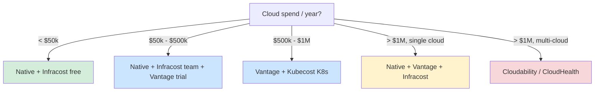
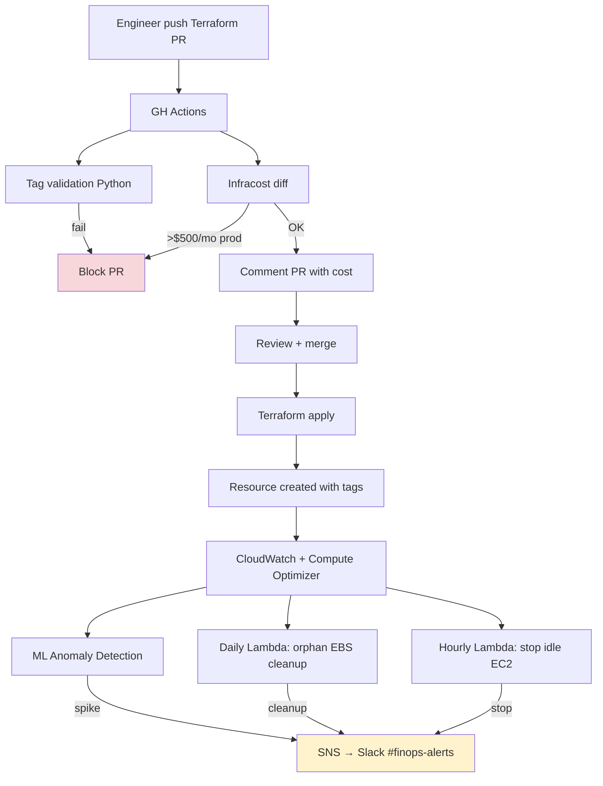

# 🎓 FinOps Tools & Automation

> **Tác giả:** Mr.Rom\
> **Phiên bản:** v2.0.0\
> **Tạo lúc:** 24/05/2026\
> **Cập nhật:** 01/06/2026\
> **Level:** Basic\
> **Tags:** [MUST-KNOW]\
> **Yêu cầu trước:** [03_optimization-tactics-compute-storage-network.md](03_optimization-tactics-compute-storage-network.md)

> [!NOTE]
> **Mục tiêu bài học:**\
> Ba bài trước đã dạy bạn *framework*, mô hình giá, tagging và các chiến thuật tối ưu — nhưng tất cả vẫn còn nặng phần "làm tay". Bài này khép lại nhóm cơ bản bằng cách trả lời câu hỏi: làm sao để máy tự lo phần việc lặp đi lặp lại? Bạn sẽ đi qua bộ công cụ *native* của AWS/GCP/Azure, cân nhắc khi nào nên trả tiền cho công cụ *3rd-party*, đưa cảnh báo chi phí vào ngay trong *pull request* với Infracost, và viết những hàm tự động dọn dẹp tài nguyên thừa. Đây chính là Phase **Operate** trong vòng lặp FinOps.

## 🎯 Sau bài này bạn sẽ

- [ ] Dùng bộ ba **AWS Cost Explorer + Budgets + Compute Optimizer** ăn ý với nhau
- [ ] Thiết lập **AWS Budget alert** gửi email và Slack webhook
- [ ] Hiểu **GCP Recommender / Active Assist** và **Azure Advisor** tương đương
- [ ] Đánh giá công cụ 3rd-party: **Cloudability vs CloudHealth vs Vantage vs Infracost**
- [ ] Đưa **Infracost** vào GitHub Actions để xem trước chi phí ngay trong PR
- [ ] Viết **Lambda** dọn orphan EBS / tắt EC2 idle (tự động khắc phục)
- [ ] Bật **Cost Anomaly Detection** cảnh báo bằng *machine learning*
- [ ] Thực hành ráp toàn bộ pipeline: ép tag + Infracost trong PR + auto-shutdown + cảnh báo bất thường

---

## 💡 Acme Shop đã có quy trình, giờ cần để máy chạy thay người

Sau nửa năm vận hành FinOps bài bản, Acme Shop đã ở một vị trí khá đẹp: tagging chuẩn chỉnh, báo cáo *showback* gửi đều mỗi tháng, mô hình giá tối ưu với combo RI và Spot, kho lưu trữ được dọn dẹp theo quý. Mọi thứ ngăn nắp.

Nhưng trong buổi review, CFO đặt một câu hỏi sắc bén:

> *"Bạn FinOps mới tuyển lương $120k/năm. Mỗi tháng bạn ấy làm gì? Hỏi tài chính, mua RI thì một quý một lần, audit tài nguyên thiếu tag thì đã có script. Mình ước chừng 50% công sức chỉ để chạy báo cáo bằng tay. Cái đó tự động hóa được không?"*

Câu hỏi đúng trọng tâm. Một practitioner đắt tiền không nên dành nửa thời gian để copy số liệu vào bảng tính. Đội tech ngồi lại và vạch ra hướng đi: dashboard tự làm mới thay vì gửi tay, pipeline tự cảnh báo chi phí ngay trước khi merge code, hàm tự dọn tài nguyên mồ côi sau 14 ngày, và *machine learning* tự phát hiện những cú nhảy chi phí bất thường.

Tất cả những điều đó gộp lại chính là Phase **Operate**: nhúng FinOps thẳng vào CI/CD và để hệ thống tự khắc phục. Khi đó người làm FinOps mới rảnh tay để lo chuyện chiến lược, thay vì suốt ngày chữa cháy.

---

## 1️⃣ Công cụ native — nền móng luôn có sẵn

Trước khi nghĩ tới việc mua công cụ ngoài, hãy tận dụng hết những gì *cloud provider* đã cho không. Bộ công cụ native của AWS, GCP, Azure tuy giao diện không lung linh nhưng miễn phí, tích hợp sâu vào hệ thống và đủ dùng cho phần lớn nhu cầu.

🪞 **Ẩn dụ**: *Công cụ native giống như **app ngân hàng** — không bóng bẩy nhưng đủ chức năng cơ bản, miễn phí, gắn liền với tài khoản. Công cụ 3rd-party giống **app fintech** — giao diện đẹp, tính năng mạnh, nhưng phải trả phí.*

### AWS Cost Explorer + Budgets + Compute Optimizer

Trên AWS, ba công cụ này tạo thành một bộ ba ăn ý: một cái để nhìn, một cái để cảnh báo, một cái để khuyên bạn nên thu nhỏ tài nguyên nào.

#### AWS Cost Explorer

Đây là dashboard chi phí mặc định, mở từ Billing Console → Cost Explorer. Nó cho phép bạn nhóm chi phí theo *service*, *region*, *tag*, *account* hay *usage type*, dự báo (*forecast*) 12 tháng tới dựa trên lịch sử, theo dõi mức sử dụng và độ phủ của Reserved Instance / Savings Plan, đề xuất *right-size* cho EC2 (liên kết chéo với Compute Optimizer), và xuất dữ liệu ra CSV hoặc qua API.

Với một tài khoản AWS đơn lẻ tiêu khoảng $10k-$100k/tháng thì Cost Explorer là quá đủ. Chỉ khi bạn bước sang môi trường *multi-account* hoặc *multi-cloud* thì mới cần nghĩ tới công cụ 3rd-party.

#### AWS Budgets — cảnh báo tự động

Cost Explorer chỉ cho bạn nhìn lại quá khứ; Budgets mới là cái canh chừng tương lai. Bạn đặt một ngưỡng ngân sách, và khi chi tiêu thực tế chạm mốc (ví dụ 80%) thì hệ thống tự bắn cảnh báo. Đoạn dưới tạo một budget $5000/tháng cho team backend, gửi cảnh báo qua email và SNS khi vượt 80%:

```bash
# Tạo budget $5000/month team backend, alert 80%
aws budgets create-budget \
  --account-id 123456789012 \
  --budget '{
    "BudgetName": "team-backend-monthly",
    "BudgetLimit": {"Amount": "5000", "Unit": "USD"},
    "TimeUnit": "MONTHLY",
    "BudgetType": "COST",
    "CostFilters": {"TagKeyValue": ["user:team$backend"]}
  }' \
  --notifications-with-subscribers '[{
    "Notification": {
      "NotificationType": "ACTUAL",
      "ComparisonOperator": "GREATER_THAN",
      "Threshold": 80
    },
    "Subscribers": [
      {"SubscriptionType": "EMAIL", "Address": "team-backend@acmeshop.vn"},
      {"SubscriptionType": "SNS", "Address": "arn:aws:sns:us-east-1:...:cost-alerts"}
    ]
  }]'
```

Luồng chạy ở đây là: vượt 80% ngân sách → bắn message vào SNS topic → Lambda nhận và đẩy tiếp vào Slack webhook. Nhờ vậy cảnh báo hiện ngay trong kênh chat của team thay vì nằm im trong hộp thư.

#### Compute Optimizer (đã nhắc ở bài 03)

Cái cuối trong bộ ba là Compute Optimizer — nó quan sát mức sử dụng thực tế rồi gợi ý bạn nên đổi sang loại máy nào cho vừa. Chỉ cần bật *enrollment* một lần:

```bash
aws compute-optimizer update-enrollment-status --status Active
```

Sau khoảng 14 ngày thu thập dữ liệu, các đề xuất *right-size* cho EC2/EBS/Lambda/ECS sẽ sẵn sàng để bạn xem.

#### Bộ ba AWS phối hợp ra sao

```mermaid
graph LR
    A[Cost Explorer<br/>dashboard + forecast] --> B[Budgets<br/>alert threshold]
    B --> C[SNS topic]
    C --> D[Lambda Slack]
    A -.--> E[Compute Optimizer<br/>right-size advice]
    E -.--> F[Engineer apply]
    F -.--> A
```

Điểm hay là cả bộ ba này **miễn phí** và đủ phục vụ khoảng 80% nhu cầu của một tài khoản AWS đơn lẻ.

### GCP — Cloud Billing + Recommender + Active Assist

GCP cũng có bộ tương đương, với điểm mạnh riêng là khả năng *export* sang BigQuery để chạy truy vấn phức tạp.

#### Cloud Billing Reports

Mở từ Billing Console, công cụ này bóc tách chi phí theo ngày theo SKU / project / label / folder, hỗ trợ cảnh báo ngân sách, và đặc biệt cho *export* sang BigQuery — rất tiện khi bạn cần viết truy vấn phân tích sâu. Cú pháp đặt cảnh báo ngân sách:

```bash
# Set up budget alert
gcloud billing budgets create \
  --billing-account=01ABCD-... \
  --display-name="team-backend-monthly" \
  --budget-amount=5000USD \
  --threshold-rule=percent=0.8 \
  --filter-projects=projects/acme-prod
```

#### Active Assist Recommender

Thay vì để bạn tự đoán tài nguyên nào lãng phí, GCP gom nhiều *recommender* lại dưới mái Active Assist, mỗi cái chuyên phát hiện một loại lãng phí:

| Recommender | Phát hiện |
|---|---|
| `google.compute.instance.MachineTypeRecommender` | Right-size VM |
| `google.compute.instance.IdleResourceRecommender` | VM idle (< 5% CPU 14 ngày) |
| `google.compute.disk.IdleResourceRecommender` | PD unattached |
| `google.compute.address.IdleResourceRecommender` | External IP idle |
| `google.cloudsql.instance.IdleRecommender` | Cloud SQL idle |
| `google.compute.commitment.UsageCommitmentRecommender` | Cần mua CUD |

Để liệt kê các tài nguyên idle mà recommender phát hiện:

```bash
# List tất cả idle resource
for recommender in IdleResourceRecommender; do
  gcloud recommender recommendations list \
    --project=acme-prod \
    --location=global \
    --recommender=google.compute.instance.$recommender
done
```

Kết hợp Recommender với Cloud Function, bạn có thể biến những đề xuất này thành hành động tự động (sẽ bàn ở phần 4).

### Azure — Cost Management + Advisor

Thế mạnh nổi bật của Azure nằm ở khả năng quản lý chi phí xuyên nhiều *subscription* cùng lúc — rất hợp với doanh nghiệp lớn có cấu trúc tài khoản phức tạp.

#### Azure Cost Management

Mở từ portal.azure.com → Cost Management. Công cụ này phân tích chi phí theo subscription / resource group / tag, đặt ngân sách theo từng phạm vi (subscription hoặc management group), áp quy tắc phân bổ chi phí (*cost allocation*), và tự động *export* CSV theo ngày/tháng vào Storage Account.

#### Azure Advisor

Advisor là dashboard gợi ý theo 5 nhóm: Cost / Security / Reliability / Operational Excellence / Performance. Để lọc riêng các đề xuất về chi phí:

```bash
az advisor recommendation list \
  --filter "Category eq 'Cost'" \
  --output table
```

#### Microsoft Cost Management for partners

Nếu reseller / CSP partner → có thêm tool aggregate billing.

### Native tier comparison

| Feature | AWS | GCP | Azure |
|---|---|---|---|
| Dashboard | Cost Explorer | Cloud Billing Reports | Cost Management |
| Budget alert | Budgets | Cloud Billing Budget | Cost Management Budget |
| Right-size | Compute Optimizer | Recommender | Advisor |
| Idle resource | Trusted Advisor (paid) | Recommender | Advisor |
| Anomaly | Cost Anomaly Detection (free) | Anomaly Recommender | Cost Management Anomaly |
| Export | CUR to S3 | BigQuery export | Storage Account export |
| Multi-account | Cost Allocation Tags + Org | Folder + Org | Management Group |

→ AWS native mạnh nhất + nhiều feature. Azure mạnh enterprise multi-sub. GCP có BigQuery export query mạnh nhất.

---

## 2️⃣ 3rd-party tools — Khi native không đủ

### Khi nào cần?

| Tình huống | Tool gợi ý |
|---|---|
| Multi-cloud > 1M USD/year | Cloudability / CloudHealth |
| K8s heavy (cost per pod/namespace) | Kubecost / OpenCost |
| Spot automation Kubernetes | CAST AI / Spot.io |
| Cost preview trong PR | Infracost |
| Modern UI fair pricing, multi-cloud | Vantage |
| Compliance + cost combined | CloudCheckr |

### Cloudability (Apptio) — Enterprise multi-cloud

**Strength**:
- Multi-cloud unified (AWS + GCP + Azure + Oracle + IBM).
- Strong reporting + customization.
- Forecasting AI-driven.
- API + integration enterprise systems (ServiceNow, Jira).

**Pricing**: ~1-2% cloud spend (vd: $1M cloud → $10-20k/year tool).

**Khi dùng**: > $500k/year cloud spend, multi-cloud, enterprise governance.

### CloudHealth (VMware/Broadcom)

**Strength**:
- Policy engine mạnh (auto-action khi violate).
- Security + cost combined.
- Multi-cloud + on-prem.

**Pricing**: Similar Cloudability.

**Khi dùng**: Enterprise có on-prem + cloud, compliance focus.

### Vantage — Modern + fair

**Strength**:
- UI hiện đại nhất.
- Pricing flat $30-300/month tier (không % spend).
- Multi-cloud support.
- Slack/Teams integration native.
- Cost report Markdown trong PR.

**Khi dùng**: Startup-mid, $50k-$500k/year cloud.

### Kubecost / OpenCost — Kubernetes-native

**Strength**:
- Cost per Pod / Namespace / Deployment / Label.
- Real-time allocation in-cluster.
- OpenCost = open source CNCF standard.

**Pricing**: OpenCost free, Kubecost free tier + paid $499+/month.

**Khi dùng**: K8s heavy team, cần allocation cost per service trong cluster.

### CAST AI — K8s autoscale + Spot

**Strength**:
- Auto-replace nodes with Spot.
- Right-size pods request/limit.
- Bin-packing optimization.

**Pricing**: % savings (10-25% of saving).

**Khi dùng**: K8s cluster > 50 nodes, willing to share saving.

### Infracost — Cost trong PR

🪞 **Ẩn dụ**: *Infracost giống **cảnh báo giá khi đặt món online** — bạn đặt rồi mới biết giao hàng $20 thì rút lại. Infracost cho biết Terraform `apply` này tốn bao nhiêu trước khi merge.*

**Tính năng**:
- Parse Terraform plan → ước tính cost từ pricing API AWS/GCP/Azure.
- GitHub/GitLab/Bitbucket integration.
- Comment trên PR: *"Monthly cost: +$430 (RDS Multi-AZ + 2 EC2)"*.
- Policy: block PR nếu cost > threshold.

**Pricing**: Free CLI + open source. Cloud paid plan có policy + team management.

### Decision matrix



---

## 3️⃣ Infracost trong PR — Cost preview trước merge

### Cài đặt

```bash
# Local
brew install infracost
infracost auth login

# Trong CI
curl -fsSL https://raw.githubusercontent.com/infracost/infracost/master/scripts/install.sh | sh
```

### Sử dụng local

```bash
cd terraform/
infracost breakdown --path .

# Output:
# Project: acmeshop/infra
# 
# Resource                            Monthly Qty  Unit       Monthly Cost
# 
# aws_instance.web                                                 $70.08
# ├─ Instance usage (Linux/UNIX, on-demand, m6i.large)   730  hours      $70.08
# 
# aws_db_instance.checkout                                       $194.18
# ├─ Database instance (on-demand, Multi-AZ, db.r6i.large)         $192.00
# └─ Storage (general purpose SSD, gp3)                  100  GB          $2.18
# 
# OVERALL TOTAL                                                $264.26
```

### Tích hợp GitHub Actions

```yaml
# .github/workflows/infracost.yml
name: Infracost

on:
  pull_request:
    paths:
      - 'terraform/**'

jobs:
  infracost:
    name: Infracost
    runs-on: ubuntu-latest
    permissions:
      contents: read
      pull-requests: write
    
    steps:
      - uses: actions/checkout@v4
        with:
          ref: ${{ github.event.pull_request.base.ref }}
      
      - name: Setup Infracost
        uses: infracost/actions/setup@v3
        with:
          api-key: ${{ secrets.INFRACOST_API_KEY }}
      
      - name: Generate baseline cost (main branch)
        run: |
          infracost breakdown \
            --path=terraform/ \
            --format=json \
            --out-file=/tmp/infracost-base.json
      
      - uses: actions/checkout@v4
      
      - name: Generate PR cost
        run: |
          infracost diff \
            --path=terraform/ \
            --compare-to=/tmp/infracost-base.json \
            --format=json \
            --out-file=/tmp/infracost.json
      
      - name: Post comment to PR
        run: |
          infracost comment github \
            --path=/tmp/infracost.json \
            --repo=$GITHUB_REPOSITORY \
            --github-token=${{ secrets.GITHUB_TOKEN }} \
            --pull-request=${{ github.event.pull_request.number }} \
            --behavior=update
```

### Output comment trên PR

```
💰 Infracost report

Monthly cost change for acmeshop/infra
Amount:  +$430 ($264 → $694)
Percent: +163%

Detail:
+ aws_db_instance.new_checkout: +$192/month (Multi-AZ db.r6i.large)
+ aws_instance.worker[0..1]: +$140/month (2 × m6i.large)
+ aws_s3_bucket.uploads: +$5/month (assumed 200GB)

  Past month estimate: $264
  New monthly estimate: $694

⚠️ Cost increase > 30% — request review from FinOps team
```

### Policy với Infracost Cloud (paid)

```yaml
# infracost-policy.yaml
version: 1
policies:
  - name: prod-cost-threshold
    description: Prod cost change > $500/month requires FinOps approval
    rule:
      - if: |
          changed.totalMonthlyCost > 500 && tags.env == "prod"
        then: warn
        message: "Cost increase > $500/month needs FinOps review"
      - if: |
          changed.totalMonthlyCost > 1000 && tags.env == "prod"
        then: block
        message: "Cost increase > $1000/month — block, request FinOps approval"
```

→ PR bị block nếu vi phạm. Engineer apply không qua được.

---

## 4️⃣ Automated remediation

### Pattern: Lambda + CloudWatch event + Slack

🪞 **Ẩn dụ**: *Automated remediation như **Roomba lau nhà** — không cần ai nhấn, định kỳ tự dọn rác (orphan resource).*

### Use case 1 — Kill orphan EBS volume

```python
# lambda/cleanup_orphan_ebs.py
import boto3, json, os, datetime
from urllib import request

ec2 = boto3.client('ec2')
sns = boto3.client('sns')
SLACK_WEBHOOK = os.environ['SLACK_WEBHOOK']
DRY_RUN = os.environ.get('DRY_RUN', 'true').lower() == 'true'
GRACE_DAYS = 14

def lambda_handler(event, context):
    # Find available (unattached) volumes
    volumes = ec2.describe_volumes(
        Filters=[{'Name': 'status', 'Values': ['available']}]
    )['Volumes']
    
    candidates = []
    now = datetime.datetime.now(datetime.timezone.utc)
    
    for vol in volumes:
        age_days = (now - vol['CreateTime']).days
        if age_days < GRACE_DAYS:
            continue
        
        # Skip if has `keep=true` tag
        tags = {t['Key']: t['Value'] for t in vol.get('Tags', [])}
        if tags.get('keep') == 'true':
            continue
        
        candidates.append({
            'id': vol['VolumeId'],
            'size': vol['Size'],
            'age': age_days,
            'owner': tags.get('owner', 'unknown'),
            'cost_estimate': vol['Size'] * 0.08  # gp3 $0.08/GB/month
        })
    
    if not candidates:
        return
    
    total_save = sum(c['cost_estimate'] for c in candidates)
    
    # Notify Slack
    text = f":wastebasket: Orphan EBS cleanup ({'DRY-RUN' if DRY_RUN else 'EXECUTED'})\n"
    text += f"Found {len(candidates)} volumes, save ${total_save:.0f}/month\n\n"
    for c in candidates[:10]:
        text += f"- {c['id']} ({c['size']}GB, {c['age']}d, owner={c['owner']}, ${c['cost_estimate']:.0f}/mo)\n"
    
    request.urlopen(SLACK_WEBHOOK, json.dumps({'text': text}).encode())
    
    # Delete if not dry-run
    if not DRY_RUN:
        for c in candidates:
            ec2.delete_volume(VolumeId=c['id'])
```

Schedule với EventBridge:

```bash
aws events put-rule \
  --name daily-orphan-ebs-cleanup \
  --schedule-expression "rate(1 day)"

aws events put-targets \
  --rule daily-orphan-ebs-cleanup \
  --targets "Id"="1","Arn"="arn:aws:lambda:us-east-1:...:function:cleanup_orphan_ebs"
```

→ Daily check, Slack notify, dry-run trước 1 tuần → bật execution sau.

### Use case 2 — Stop idle EC2

```python
# lambda/auto_stop_idle_ec2.py
import boto3, datetime

ec2 = boto3.client('ec2')
cw = boto3.client('cloudwatch')

def lambda_handler(event, context):
    # Only check instances with tag `auto-shutdown=if-idle`
    instances = ec2.describe_instances(
        Filters=[
            {'Name': 'instance-state-name', 'Values': ['running']},
            {'Name': 'tag:auto-shutdown', 'Values': ['if-idle']}
        ]
    )['Reservations']
    
    end = datetime.datetime.utcnow()
    start = end - datetime.timedelta(days=7)
    
    for r in instances:
        for inst in r['Instances']:
            iid = inst['InstanceId']
            
            metric = cw.get_metric_statistics(
                Namespace='AWS/EC2',
                MetricName='CPUUtilization',
                Dimensions=[{'Name': 'InstanceId', 'Value': iid}],
                StartTime=start, EndTime=end,
                Period=86400, Statistics=['Average']
            )
            
            avg_cpu = sum(d['Average'] for d in metric['Datapoints']) / max(len(metric['Datapoints']), 1)
            
            if avg_cpu < 5.0:
                print(f"Stopping idle {iid} (avg CPU {avg_cpu:.1f}%)")
                ec2.stop_instances(InstanceIds=[iid])
                # Notify Slack...
```

### Use case 3 — GCP Cloud Function delete idle VM

```python
# main.py — GCP Cloud Function
import google.cloud.compute_v1 as compute

def cleanup_idle_vms(request):
    client = compute.InstancesClient()
    
    for zone in ['us-central1-a', 'us-central1-b', 'asia-southeast1-a']:
        instances = client.list(project='acme-prod', zone=zone)
        
        for inst in instances:
            labels = inst.labels or {}
            if labels.get('env') != 'dev':
                continue
            if labels.get('auto-shutdown') != 'if-idle':
                continue
            
            # Check uptime > 7 days (likely forgotten)
            # ... query Monitoring API for CPU
            # ... if avg < 5% → stop
            
            client.stop(project='acme-prod', zone=zone, instance=inst.name)
    
    return 'OK'
```

### Safe pattern — Dry-run first

| Stage | Behavior |
|---|---|
| Week 1-2 | DRY_RUN=true — Slack notify only, không action |
| Week 3 | DRY_RUN=false nhưng EXCLUDE prod tag |
| Week 4+ | Full automation, monitoring tightly |

→ Mistake automation = thảm họa. Slow rollout luôn.

---

## 5️⃣ Cost Anomaly Detection — ML alert

### AWS Cost Anomaly Detection (free)

```bash
# Create anomaly detector for EC2 service
aws ce create-anomaly-monitor \
  --anomaly-monitor '{
    "MonitorName": "ec2-monitor",
    "MonitorType": "DIMENSIONAL",
    "MonitorDimension": "SERVICE"
  }'

# Subscribe to alert
aws ce create-anomaly-subscription \
  --anomaly-subscription '{
    "SubscriptionName": "daily-anomaly",
    "MonitorArnList": ["arn:aws:ce::123:anomalymonitor/..."],
    "Subscribers": [{"Type": "EMAIL", "Address": "finops@acmeshop.vn"}],
    "Threshold": 100,
    "Frequency": "DAILY"
  }'
```

→ ML learn pattern 14+ ngày, alert khi spike > threshold ($100 và > X% deviation).

### Ví dụ alert

```
🚨 Cost Anomaly Detected

Service: Amazon EC2
Date: 2026-05-22
Anomaly score: 87/100

Expected: $1,200/day
Actual:   $2,100/day  (+$900, +75%)

Likely cause: 30 new EC2 instances created in us-west-2 (m6i.4xlarge)
Account: 123456789012
Tags: project=q4-experiment, owner=ml-team
```

→ FinOps liên hệ ml-team — *"Cluster mới bật, cần $900/day?"* — maybe đúng (intentional), maybe không (bug).

### GCP Anomaly Recommender

GCP Anomaly Recommender (Active Assist):
- Detect unusual spend at SKU level.
- Suggest investigate.

### Azure Cost Management Anomaly

Built-in trong Cost Management. Email alert config được.

---

## 6️⃣ Hands-on — Full pipeline Acme Shop

### Stack đầy đủ



### Step-by-step setup

#### Step 1 — Infracost PR pipeline (1 hour)

1. Sign up Infracost free → get API key.
2. Add `INFRACOST_API_KEY` secret in GitHub repo.
3. Copy `.github/workflows/infracost.yml` from section 3.
4. Open test PR → confirm comment posts.

#### Step 2 — Tag validation in PR (30 min)

1. Add `scripts/check_tags.py` (from bài 02).
2. Extend Infracost workflow to fail if missing tag.

#### Step 3 — Lambda orphan cleanup (2 hours)

1. Deploy Lambda from section 4 code.
2. IAM role: `ec2:DescribeVolumes`, `ec2:DeleteVolume`, `sns:Publish`.
3. EventBridge daily schedule.
4. **DRY_RUN=true 1 tuần đầu** — quan sát Slack.
5. Sau OK → DRY_RUN=false, exclude `keep=true` tag.

#### Step 4 — Auto-shutdown dev EC2 (2 hours)

1. Lambda với cron 18:00 weekday stop, 09:00 weekday start.
2. Filter `auto-shutdown=weekday-9-18` tag.
3. **Whitelist**: exclude `env=prod` no matter what.

#### Step 5 — Cost Anomaly Detection (15 min)

1. AWS Console → Cost Management → Anomaly Detection.
2. Create monitor: dimensional by SERVICE.
3. Subscribe SNS topic → Lambda → Slack.

#### Step 6 — Compute Optimizer + monthly review (ongoing)

1. Enable Compute Optimizer.
2. Monthly: export recommendations → review with team.
3. Apply on staging → 1 week test → apply prod.

### Result expected

- **0 manual** orphan cleanup — Lambda tự xử lý.
- **Engineer self-service** cost preview — không cần hỏi FinOps cho mỗi PR.
- **Alert proactive** — không đợi cuối tháng mới thấy spike.
- **FinOps practitioner thời gian** chuyển sang strategic: forecast, RI renewal, multi-cloud strategy.

→ Phase **Operate** đạt được khi 80% việc routine tự động.

---

## 💡 Cạm bẫy thường gặp & Best practice

### ❌ Cạm bẫy: Bật automation production ngay từ ngày đầu

- **Triệu chứng**: Lambda kill resource sai → prod down.
- **Nguyên nhân**: Không dry-run, không whitelist prod.
- **Cách tránh**: DRY_RUN=true 2 tuần. Whitelist `env=prod` hard-coded. Slow rollout: dev → staging → prod 1 service at a time.

### ❌ Cạm bẫy: Infracost mọi PR bật policy block ngay

- **Triệu chứng**: PR cho hotfix critical bị block vì +$50/month.
- **Nguyên nhân**: Policy quá nghiêm.
- **Cách tránh**: Tier policy:
  - $0-100/month: auto-approve, comment only.
  - $100-500/month: warn, require 1 reviewer.
  - $500+/month: block, require FinOps approval.

### ❌ Cạm bẫy: Slack noise — quá nhiều alert

- **Triệu chứng**: `#finops-alerts` channel có 50 message/day → ai cũng mute.
- **Nguyên nhân**: Alert threshold quá thấp, alert dup.
- **Cách tránh**: Daily digest 1 message thay vì 50. Critical alert (anomaly score > 80) thì instant. Còn lại summary.

### ❌ Cạm bẫy: Mua 3rd-party tool quá sớm

- **Triệu chứng**: Spend $50k/year cho Cloudability khi cloud cost $200k/year → 25% overhead.
- **Nguyên nhân**: Sales pitch convinced.
- **Cách tránh**: Native + Infracost free đủ cho < $500k/year. 3rd-party khi multi-cloud hoặc > $1M/year.

### ✅ Best practice: Daily digest report

- **Vì sao**: Visibility liên tục, không chỉ cuối tháng.
- **Cách áp dụng**: Lambda chạy 9h sáng mỗi ngày, post Slack: total yesterday, % change vs avg 7 ngày, top 3 service biggest change.

### ✅ Best practice: Infracost từ tuần đầu của startup

- **Vì sao**: Setup 1 lần, save vĩnh viễn. Engineer học cost-aware ngay.
- **Cách áp dụng**: Free tier đủ. Comment mode trước (không block) → grow lên policy mode sau.

### ✅ Best practice: Anomaly Detection cho mọi service tier 1

- **Vì sao**: Catch cost leak trong 24h, không đợi cuối tháng mất $10k+.
- **Cách áp dụng**: AWS Cost Anomaly Detection free unlimited monitor. Tạo 1 monitor/service quan trọng (EC2, RDS, S3, Lambda, DataTransfer).

---

## 🧠 Tự kiểm tra (Self-check)

**Q1.** Khi nào upgrade từ AWS native sang Cloudability?

<details>
<summary>💡 Đáp án</summary>

3 trigger:

1. **Multi-cloud** — có AWS + GCP/Azure cần dashboard chung.
2. **Cloud spend > $1M/year** — overhead 1-2% ($10-20k/year) chấp nhận được.
3. **Enterprise governance** — cần policy engine, compliance audit, integration ServiceNow/Jira.

Còn lại: native + Infracost + Vantage đủ tốt hơn (rẻ + agile).

</details>

**Q2.** Infracost report PR thêm $430/month. PR là cho prod hotfix critical. Action?

<details>
<summary>💡 Đáp án</summary>

Approve nhưng:
1. Document trong PR description: *"Cost increase $430/month due to RDS Multi-AZ for prod HA. Justified by SLA 99.9% target."*
2. Tag commit `cost-impact=approved-finops`.
3. Add post-merge: *"Within 7 days, re-evaluate if right-sizing possible after observing real load."*

→ Policy không block hotfix. Nhưng cost change cần justify + follow-up.

</details>

**Q3.** Lambda orphan cleanup chạy 1 tuần, delete nhầm 3 EBS volume có data quan trọng. Recover sao?

<details>
<summary>💡 Đáp án</summary>

EBS volume đã delete = data gone permanent (không như S3 versioning).

Recovery options:
1. **AWS Backup recovery** — nếu enabled AWS Backup, có recovery point.
2. **EBS snapshot** — nếu volume có snapshot trước delete.
3. **Outside backup** — restore từ application-level backup (DB dump, S3 export).

**Prevention** (cho lần sau):
- Whitelist `keep=true` tag.
- Trước delete: tạo final snapshot tự động.
- Notify owner Slack 7 ngày trước delete.
- DRY_RUN nhiều tuần đầu.

</details>

**Q4.** Cost Anomaly Detection alert: EC2 spike +$900/day. Bước đầu tiên?

<details>
<summary>💡 Đáp án</summary>

**Investigate before action** — đừng tắt resource mù.

Bước:
1. Mở Cost Explorer → filter SERVICE=EC2, group by usage type / tag.
2. Identify resource mới: `aws ec2 describe-instances --filters "Name=launch-time,Values=>2026-05-22"`.
3. Check tag `owner` / `project` → reach out engineer.
4. Hỏi: *"30 instance m6i.4xlarge mới — intentional? Cần $27k/month?"*
5. Nếu intentional → check có dùng RI/SP cover không, có thể dùng Spot?
6. Nếu unintentional → engineer roll back, hoặc downsize.

Mistake: stop instance mà chưa biết → có thể prod hoặc batch quan trọng.

</details>

**Q5.** Acme Shop K8s cluster 100 nodes. Cần tool cost allocation per namespace?

<details>
<summary>💡 Đáp án</summary>

**Kubecost** hoặc **OpenCost**.

Native AWS Cost Explorer **không** phân biệt được cost per namespace / pod / deployment trong cluster — chỉ thấy tổng EC2 + EBS + LB cost cluster.

Kubecost/OpenCost in-cluster:
- Phân bổ EC2 cost theo CPU/RAM request mỗi pod.
- Phân bổ EBS theo PVC.
- Network theo namespace.
- Export allocation report monthly per team (mỗi team có 1 namespace).

→ Open source OpenCost free + đủ feature core. Kubecost paid có UI nicer + multi-cluster.

</details>

---

## ⚡ Tra cứu nhanh (Cheatsheet)

### AWS native tool
| Việc | Command / Location |
|---|---|
| Cost Explorer | Console → Billing → Cost Explorer |
| Create budget | `aws budgets create-budget` |
| Compute Optimizer | `aws compute-optimizer update-enrollment-status --status Active` |
| Anomaly Detection | `aws ce create-anomaly-monitor` |
| CUR export | Console → Billing → Data Exports |

### GCP native tool
| Việc | Command / Location |
|---|---|
| Billing Reports | Console → Billing → Reports |
| Budget | `gcloud billing budgets create` |
| Recommender list | `gcloud recommender recommendations list` |
| BigQuery export | Console → Billing → Billing export |

### Azure native tool
| Việc | Command / Location |
|---|---|
| Cost Management | portal.azure.com → Cost Management |
| Advisor | `az advisor recommendation list --filter "Category eq 'Cost'"` |
| Budget | Console → Cost Management → Budgets |

### Infracost
| Việc | Command |
|---|---|
| Install | `brew install infracost` |
| Login | `infracost auth login` |
| Breakdown | `infracost breakdown --path .` |
| Diff vs main | `infracost diff --compare-to=/tmp/base.json` |

### Lambda automation
| Pattern | Code skeleton |
|---|---|
| Daily orphan cleanup | `boto3 + EventBridge cron(0 9 * * ? *)` |
| Idle EC2 stop | CloudWatch metric + `ec2.stop_instances` |
| Slack notify | `urllib + SLACK_WEBHOOK env` |

---

## 📚 Từ Điển Thuật Ngữ (Glossary)

| EN | VN | Giải thích |
|---|---|---|
| **Cost Explorer** | (AWS) | Native AWS cost dashboard |
| **Budgets** | Ngân sách | AWS Budget service alert |
| **Compute Optimizer** | (AWS) | Right-size recommendations |
| **Cost Anomaly Detection** | Phát hiện bất thường | ML alert cost spike |
| **Trusted Advisor** | (AWS) | Recommendations cost + security + perf |
| **Recommender** | (GCP) | GCP recommendations service |
| **Active Assist** | (GCP) | Wrap nhiều recommender |
| **Advisor** | (Azure) | Tương đương Compute Optimizer + Recommender |
| **Cost Management** | (Azure) | Azure native cost dashboard |
| **CUR** | Cost & Usage Report | AWS billing detail export S3 |
| **Cloudability** | (Apptio) | Enterprise multi-cloud cost tool |
| **CloudHealth** | (VMware) | Enterprise cost + security |
| **Vantage** | — | Modern multi-cloud cost dashboard |
| **Kubecost / OpenCost** | — | K8s-native cost allocation |
| **CAST AI** | — | K8s Spot automation |
| **Infracost** | — | Cost preview in PR (Terraform) |
| **DRY_RUN** | Chạy thử | Mode chạy nhưng không thực sự action |
| **Anomaly score** | Điểm bất thường | 0-100 — cao = spike kỳ lạ hơn |

---

## 🔗 Liên kết & Tài nguyên

### 🧭 Định hướng lộ trình học
- ⬅️ **Bài trước:** [Optimization Tactics — Compute / Storage / Network / Database](03_optimization-tactics-compute-storage-network.md)
- ↑ **Về cụm:** [Cloud Cost Management README](../../README.md)

### 🧩 Các chủ đề có thể bạn quan tâm
- ☁️ [AWS Lambda + API Gateway](../../../aws/lessons/01_basic/04_lambda-and-api-gateway.md) — Lambda context cho automation
- 🏗️ [Terraform IaC](../../../../10_devops/iac/) — Infracost works on Terraform

### Tài nguyên ngoài 2026
- 📖 [AWS Cost Explorer](https://aws.amazon.com/aws-cost-management/aws-cost-explorer/)
- 📖 [AWS Cost Anomaly Detection](https://aws.amazon.com/aws-cost-management/aws-cost-anomaly-detection/)
- 📖 [GCP Active Assist](https://cloud.google.com/solutions/active-assist)
- 📖 [Azure Advisor](https://learn.microsoft.com/azure/advisor/)
- 📖 [Infracost docs](https://www.infracost.io/docs/)
- 📖 [Infracost GitHub Actions](https://github.com/infracost/actions)
- 📖 [Cloudability](https://www.cloudability.com/)
- 📖 [CloudHealth by VMware](https://cloudhealth.vmware.com/)
- 📖 [Vantage](https://www.vantage.sh/)
- 📖 [Kubecost docs](https://docs.kubecost.com/) | [OpenCost (CNCF)](https://www.opencost.io/)
- 📖 [CAST AI](https://cast.ai/) | [Spot.io](https://spot.io/)
- 📖 [FOCUS open spec](https://focus.finops.org/) — chuẩn billing đa cloud

---

## 📌 Nhật ký thay đổi (Changelog)

- **v1.0.0 (24/05/2026)** — Bản đầu tiên. Bài 04 cluster cloud-cost-management. Native tool (AWS Cost Explorer + Budgets + Compute Optimizer + GCP Active Assist + Azure Advisor) + 3rd-party (Cloudability/CloudHealth/Vantage/Kubecost/CAST AI/Infracost) + Infracost full GitHub Actions integration với policy + Lambda orphan cleanup + auto-stop idle EC2 + GCP Cloud Function delete idle VM + Cost Anomaly Detection ML + Acme Shop full pipeline 6-step setup + 7 pitfalls + 5 self-check.
