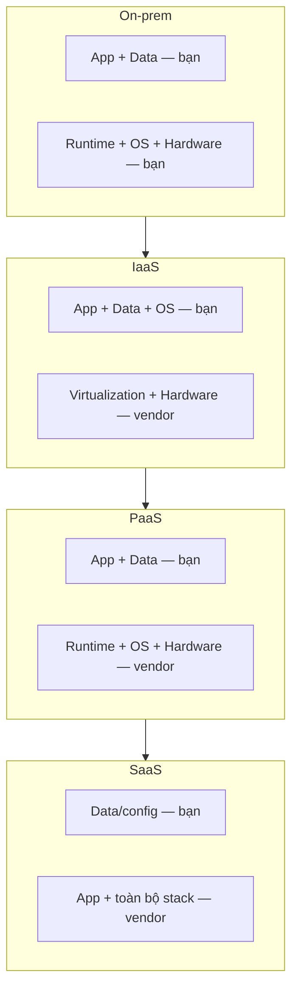

# 🎓 Cloud computing là gì? — IaaS / PaaS / SaaS + landscape 2026

> **Tác giả:** Mr.Rom\
> **Phiên bản:** v2.0.2\
> **Tạo lúc:** 24/05/2026\
> **Cập nhật:** 11/06/2026\
> **Level:** Basic\
> **Tags:** [MUST-KNOW]\
> **Yêu cầu trước:** Hiểu cơ bản server/network (xem [Networking basics](../../../../05_networking/))

> 🎯 *Bài đầu tiên của `11_cloud/`. Mục tiêu là gỡ bỏ ngộ nhận "cloud chỉ là máy của ai đó", hiểu cho đúng cloud computing theo định nghĩa NIST, phân biệt 3 service model **IaaS/PaaS/SaaS** và 4 deployment model **public/private/hybrid/multi-cloud**, nhìn lại lịch sử 1999–2026, so sánh các vendor lớn (AWS/GCP/Azure cùng các tên tuổi nhỏ hơn), và quan trọng nhất: biết **khi nào dùng cloud, khi nào không**.*

## 🎯 Sau bài này bạn sẽ

- [ ] Định nghĩa được **cloud computing** theo chuẩn NIST.
- [ ] Phân biệt **IaaS / PaaS / SaaS** kèm ví dụ thực tế.
- [ ] Hiểu 4 deployment model **public / private / hybrid / multi-cloud**.
- [ ] Nắm dòng lịch sử cloud: AWS 2006 cho tới vị thế thống trị năm 2026.
- [ ] So sánh **AWS / GCP / Azure / DigitalOcean / Cloudflare / Vercel**.
- [ ] Quyết định được khi nào chọn **cloud** vs **on-prem** vs **hybrid**.
- [ ] Hiểu các cost model: *pay-as-you-go* vs *reserved* vs *spot*.

---

## 💡 Startup chuyển từ VPS sang AWS — vì lý do gì?

Hãy hình dung bạn là dev backend, viết app bằng FastAPI và đang lo phần hosting. Câu chuyện 5 năm của hạ tầng thường diễn ra y hệt nhau, lặp đi lặp lại ở rất nhiều startup:

- **Năm 1**: một con *VPS* (máy chủ ảo riêng) DigitalOcean giá $10/tháng. App chạy ngon lành.
- **Năm 2**: traffic tăng 5 lần. Bạn thêm 3 VPS nữa, tự tay cân tải (*load balance*) bằng cơm.
- **Năm 3**: cuối tuần traffic vọt lên 10 lần. Phải thêm 5 VPS nhưng chỉ dùng Thứ Bảy – Chủ Nhật — trả tiền 7 ngày mà chỉ xài 2.
- **Năm 4**: backup database làm thủ công. Hỏi tới phương án khắc phục thảm hoạ (*disaster recovery*) thì câu trả lời duy nhất là... reboot.
- **Năm 5**: khách hàng đòi tuân thủ chuẩn (*compliance*) như SOC2, GDPR. VPS không có *audit log* lẫn tài liệu chứng minh mã hoá-khi-lưu (*encryption-at-rest*).

Đến đây thì sếp gõ đúng một câu: *"Chuyển sang AWS đi. Trả theo mức dùng, scale tự động, compliance có sẵn."*

Câu nói đó tóm gọn chính xác những gì cloud giải quyết: **năng lực co giãn (*elastic capacity*) + dịch vụ được quản lý sẵn (*managed services*) + compliance + trả theo mức dùng (*pay-as-you-go*)**.

Nhưng cloud không phải bữa trưa miễn phí. Hoá đơn AWS hoàn toàn có thể đắt gấp 10 lần VPS nếu bạn setup sai. Vậy nên trước khi gõ lệnh đầu tiên, bạn cần hiểu bản chất cloud để quyết định cho đúng — đó chính là việc của bài này.

---

## 1️⃣ Cloud computing là gì? — Định nghĩa NIST

Muốn tránh ngộ nhận thì bắt đầu từ định nghĩa chuẩn mực nhất. Viện Tiêu chuẩn Hoa Kỳ (*NIST*) đưa ra định nghĩa cloud từ năm 2011, và tới 2026 nó vẫn còn nguyên giá trị:

> Cloud computing là model cho phép **truy cập tài nguyên qua mạng theo nhu cầu** (*on-demand network access*) tới một **bể tài nguyên dùng chung** (*shared pool*) gồm các tài nguyên tính toán có thể cấu hình (server, storage, network, application) — được cấp phát và thu hồi với **tối thiểu công sức quản lý**.

Định nghĩa hơi hàn lâm, nên NIST tách nó thành 5 đặc tính cốt lõi cho dễ nhớ. Đây cũng là thước đo để phân biệt "cloud thật" với "VPS gắn mác cloud":

1. **Tự phục vụ theo nhu cầu** (*on-demand self-service*): tạo VM hay database không cần ai duyệt tay.
2. **Truy cập mạng rộng khắp** (*broad network access*): vào được qua Internet hoặc mạng riêng, từ bất kỳ đâu.
3. **Gộp chung tài nguyên** (*resource pooling*): vendor chia sẻ phần cứng vật lý cho nhiều khách (*tenant*) cùng lúc.
4. **Co giãn nhanh** (*rapid elasticity*): scale lên/xuống theo nhu cầu.
5. **Đo lường được** (*measured service*): trả tiền theo mức dùng (CPU-giờ, GB-tháng, số request).

🪞 **Ẩn dụ**: *Cloud giống như **điện lưới quốc gia**. Bạn không tự xây nhà máy điện trong nhà — chỉ cần cắm phích, dùng bao nhiêu trả bấy nhiêu. Hết dùng thì tắt, cần thêm thì scale. Không ai bắt bạn mua trước cả một nhà máy điện chỉ để bật cái quạt.*

### "The cloud is just someone else's computer" — đúng hay sai?

Câu nói cửa miệng "cloud chỉ là máy tính của người khác" nghe có vẻ tỉnh táo, nhưng nó là một nửa sự thật. Đúng là data center của AWS rốt cuộc cũng là các "máy tính". Nhưng cloud **không chỉ** là máy tính, và bốn điểm dưới đây mới là khác biệt thật sự:

- **API tự phục vụ**: tạo tài nguyên bằng lệnh, thay vì mở ticket chờ duyệt như VPS truyền thống.
- **Quy mô khổng lồ**: hàng triệu server, phân bố khắp các vùng địa lý.
- **Lớp dịch vụ được quản lý** (*managed services*): S3, Lambda, RDS — không chỉ là máy ảo trần trụi.
- **Lợi thế quy mô** (*economies of scale*): AWS mua phần cứng số lượng lớn, rồi chuyển phần tiết kiệm đó về cho bạn.

→ Nói gọn lại: cloud là **hạ tầng dưới dạng phần mềm** (*infrastructure as software*).

---

## 2️⃣ 3 service model — IaaS / PaaS / SaaS

Cloud không phải một khối thống nhất — nó được bán theo từng "tầng dịch vụ", tuỳ bạn muốn tự lo bao nhiêu phần. Ba tầng kinh điển là IaaS, PaaS và SaaS, khác nhau ở chỗ ranh giới "ai quản gì" nằm ở đâu. Ta đi từ tầng bạn tự lo nhiều nhất xuống tầng phó thác hết cho vendor.

### IaaS — Infrastructure as a Service

Đây là tầng thấp nhất, gần với tư duy on-prem nhất. **Bạn quản lý**: hệ điều hành (OS), runtime, middleware, ứng dụng và dữ liệu. **Vendor lo**: phần cứng, ảo hoá, mạng và data center.

Một vài dịch vụ IaaS tiêu biểu:

- **AWS EC2** — máy ảo.
- **AWS EBS** — block storage (ổ đĩa khối).
- **AWS VPC** — mạng ảo riêng.
- **GCP Compute Engine**.
- **Azure VMs**.

Câu bạn sẽ nói với vendor ở tầng này đại loại là: *"Cho mình một máy Linux 4 CPU, 16GB RAM."* Phần còn lại bạn tự lo:

```bash
# AWS EC2 launch
aws ec2 run-instances --image-id ami-... --instance-type t3.xlarge
# → Bạn nhận được quyền SSH vào một máy ảo Ubuntu trắng. Cài đặt mọi thứ tự lo.
```

→ **Ưu**: toàn quyền kiểm soát, mô hình tư duy giống hệt on-prem. **Nhược**: vẫn còn nguyên việc *ops* — vá OS, cấu hình DB, dựng dịch vụ... tất cả là việc của bạn.

### PaaS — Platform as a Service

Lên một tầng, bạn buông bớt phần hạ tầng. **Bạn quản lý**: ứng dụng và dữ liệu. **Vendor lo**: runtime, middleware, OS, phần cứng và mọi thứ phía dưới.

Các nền tảng PaaS phổ biến:

- **AWS Elastic Beanstalk** — bạn đẩy app lên, vendor chạy server hộ.
- **GCP App Engine** — nền tảng app *serverless* (không cần quản server).
- **Azure App Service**.
- **Heroku** (PaaS kinh điển).
- **Vercel**, **Netlify** — PaaS chuyên frontend.
- **Render** — PaaS thế hệ mới.

Ở tầng này bạn chỉ cần nói: *"Đây là app Node.js của mình, deploy hộ."* Đúng nghĩa đen:

```bash
# Heroku deploy
git push heroku main
# → Vendor tự build, chạy app Node.js, lo luôn scaling, load balancer, DB.
```

→ **Ưu**: tập trung vào code, gần như không phải *ops*. **Nhược**: ít quyền kiểm soát hơn (phiên bản runtime do vendor chốt, tuỳ biến hạn chế) và dễ bị khoá vào vendor (*lock-in*).

### SaaS — Software as a Service

Tầng cao nhất, bạn gần như không phải quản gì về kỹ thuật. **Bạn quản lý**: dữ liệu (cấu hình, nội dung). **Vendor lo**: tất cả phần còn lại — cả ứng dụng lẫn hạ tầng.

Những cái tên SaaS ai cũng dùng hằng ngày:

- **Gmail**, **Google Workspace**.
- **Salesforce**.
- **Slack**, **Notion**, **Linear**.
- **GitHub** (trang web, không phải file binary).
- **Zoom**, **Figma**.

Tinh thần ở đây là: *"Mình chỉ cần có email để dùng. Mình không muốn dựng và trông coi mail server."*

```bash
# Dùng Gmail
# → Đăng nhập tại gmail.com. Hết.
```

→ **Ưu**: không phải *ops*, có giá trị tức thì. **Nhược**: dễ bị khoá vào vendor, tuỳ biến hạn chế, và phát sinh lo ngại về chủ quyền dữ liệu (*data sovereignty* — dữ liệu được lưu ở đâu, ai có quyền).

### Các model mở rộng năm 2026

Ba model gốc IaaS/PaaS/SaaS đã được mở rộng thành nhiều nhánh con tới năm 2026 — mỗi cái phục vụ một use case riêng. Ví dụ **CaaS** dành cho team đã đóng gói sẵn container (nằm giữa IaaS và PaaS), **FaaS** cho workload kích hoạt theo sự kiện (*event-driven*), còn **DBaaS** cho team chỉ cần database mà không muốn tự vận hành. Hiểu rõ các nhánh này giúp bạn chọn đúng tầng thay vì cấp dư tài nguyên (*over-provision*):

- **CaaS — Containers as a Service**: AWS ECS/Fargate, GCP Cloud Run, Azure Container Apps. Nằm giữa IaaS và PaaS.
- **FaaS — Functions as a Service** (serverless): AWS Lambda, GCP Cloud Functions, Azure Functions. Là PaaS nhưng chạy theo sự kiện.
- **DBaaS — Database as a Service**: AWS RDS, Aurora, GCP Cloud SQL. PaaS dành riêng cho database.
- **iPaaS — Integration PaaS**: Zapier, Make, n8n. Nối các app SaaS với nhau.
- **BaaS — Backend as a Service**: Firebase, Supabase. Mobile và frontend có backend mà không phải viết code backend.

### Sơ đồ stack

Cloud stack có 9 lớp xếp chồng, từ data center dưới cùng lên tới Data trên cùng. Tuỳ model (IaaS/PaaS/SaaS) mà ranh giới "ai quản gì" dịch lên hay xuống. Sơ đồ dưới đây minh hoạ trực quan điều đó — leo càng cao bạn càng quản ít, đổi lại càng phụ thuộc vendor:

```text
                  ┌──────────────────┐
                  │     Data         │ ← bạn quản lý
                  ├──────────────────┤
                  │  Application     │
                  ├──────────────────┤
                  │   Runtime        │
SaaS              ├──────────────────┤   ─┐
                  │   Middleware     │    │
PaaS              ├──────────────────┤    │
                  │   OS             │    │ vendor quản lý
                  ├──────────────────┤    │
IaaS              │   Virtualization │    │
                  ├──────────────────┤    │
                  │   Hardware       │   ─┘
                  ├──────────────────┤
                  │   Network        │
                  ├──────────────────┤
                  │   Datacenter     │
                  └──────────────────┘
```

→ Đọc sơ đồ theo chiều dọc: leo lên tầng nào thì phần "bạn quản lý" co lại bấy nhiêu, và mức phụ thuộc vendor (*lock-in*) tăng theo.

Sơ đồ dưới gom lại cùng một ý theo 4 cột On-prem / IaaS / PaaS / SaaS, để thấy rõ ranh giới "ai quản gì" dịch dần về phía vendor khi bạn leo lên tầng cao hơn:



Đọc từ trái sang phải: phần ô "bạn" thu nhỏ dần, đổi lại bạn càng đỡ phải lo vận hành nhưng càng phụ thuộc vendor.

🪞 **Ẩn dụ**: *Các service model giống đúng các mức độ "ăn ngoài":*

- ***On-prem*** *= nấu ở nhà (tự lo từ A đến Z).*
- ***IaaS*** *= thuê bếp và mua nguyên liệu, tự nấu.*
- ***PaaS*** *= vào nhà hàng, chọn món trong menu, đầu bếp họ nấu hộ.*
- ***SaaS*** *= mua đồ ăn sẵn, bỏ vào lò vi sóng là xong.*

---

## 3️⃣ 4 deployment model — Public / Private / Hybrid / Multi-cloud

Chọn xong tầng dịch vụ, câu hỏi tiếp theo là: cloud đó nằm ở đâu và bạn chia sẻ nó với ai? Đó là chuyện của deployment model. Có 4 kiểu chính, mỗi kiểu đánh đổi giữa chi phí, quyền kiểm soát và mức tuân thủ khác nhau.

### Public cloud

Đây là kiểu phổ biến nhất: data center do vendor sở hữu, dùng chung cho hàng nghìn khách hàng (*multi-tenant* — nhiều khách cùng dùng chung hạ tầng).

Đại diện: AWS, GCP, Azure, DigitalOcean, Cloudflare.

→ **Ưu**: chi phí thấp nhất (nhờ lợi thế quy mô của vendor), dựng nhanh nhất, luôn có dịch vụ mới nhất. **Nhược**: ít quyền kiểm soát, vướng chủ quyền dữ liệu (dữ liệu lưu ở đâu), và rủi ro bị khoá vào vendor. **Hợp khi**: phần lớn workload năm 2026, từ startup tới doanh nghiệp lớn.

### Private cloud

Là cloud một-khách (*single-tenant*) — chỉ phục vụ **một tổ chức** duy nhất. Có hai biến thể:

- **Private cloud on-prem**: công ty tự chạy data center riêng nhưng dựng API giống cloud (VMware, OpenStack).
- **Private cloud được host**: vendor dành riêng phần cứng cho bạn (AWS Outposts, Azure Stack, GCP Anthos on-prem).

→ **Ưu**: toàn quyền kiểm soát, chủ quyền dữ liệu tuyệt đối, đáp ứng compliance khắt khe. **Nhược**: chi phí ban đầu cao, đổi mới chậm, khó scale. **Hợp khi**: chính phủ, quốc phòng, y tế (HIPAA nghiêm ngặt), tài chính (PCI).

### Hybrid cloud

Hybrid là kiểu **lai**: data center on-prem + public cloud, nối với nhau qua mạng riêng (VPN hoặc Direct Connect). Một số tình huống điển hình:

- Database để on-prem (dữ liệu nhạy cảm) + web app chạy trên AWS.
- "Tràn" sang cloud khi cần (*burst*): ngày thường chạy on-prem, dịp Black Friday spike thì đẩy thêm sang AWS.
- Phân tầng theo môi trường: dev trên cloud, prod on-prem.

→ **Ưu**: di chuyển dần từng phần, giữ workload nhạy cảm ở on-prem, tối ưu chi phí (phần chạy lâu dài để on-prem, phần co giãn để cloud). **Nhược**: phức tạp (phải lo 2 môi trường), độ trễ giữa on-prem ↔ cloud, và cần công cụ điều phối (K8s, Anthos, Azure Arc).

### Multi-cloud

Multi-cloud nghĩa là dùng **nhiều public cloud** cho các workload khác nhau. Vài ví dụ:

- AWS cho compute, GCP cho ML (BigQuery, Vertex AI), Cloudflare cho CDN.
- Khắc phục thảm hoạ: chính là AWS, dự phòng (*DR*) là Azure.
- Tránh bị khoá vào một vendor.

→ **Ưu**: chọn được dịch vụ tốt nhất ở mỗi cloud (*best-of-breed*), tăng vị thế đàm phán với vendor, giảm rủi ro địa lý/chính trị. **Nhược**: phức tạp gấp 3 (bề mặt vận hành nhân lên), team phải biết nhiều cloud cùng lúc, chi phí truyền dữ liệu chéo cloud (*egress*) rất đắt, và dễ rơi vào "mẫu số chung nhỏ nhất" — chỉ dám dùng những tính năng cloud nào cũng có.

**Thực tế 2026**: phần lớn công ty có multi-cloud kiểu **vô tình** (AWS là chính + Cloudflare làm CDN + GitHub) chứ không phải multi-cloud kiểu **chiến lược** (chia 50/50 giữa AWS và GCP).

→ Đừng theo đuổi multi-cloud chỉ để cho oai. Phải có lý do rõ ràng.

---

## 4️⃣ Lịch sử 1999 → 2026

### Dòng thời gian

Cloud không "tự nhiên" xuất hiện — nó nảy mầm từ năm 1999 với Salesforce (SaaS đầu tiên), rồi bùng nổ năm 2006 khi AWS mở S3 và EC2 ra công chúng. Bảng dưới trải ra 26 năm; bạn để ý 3 cột mốc lớn nhất: 2006 (AWS — khởi đầu cloud hiện đại), 2014 (Kubernetes — lớp điều phối), và 2023 (cloud AI — kỷ nguyên hiện tại):

| Năm | Sự kiện |
|---|---|
| 1999 | Salesforce — SaaS lớn đầu tiên (CRM trên cloud) |
| 2002 | Amazon ra mắt hạ tầng AWS (nội bộ) |
| 2006 | **AWS S3 + EC2 mở công khai** — khởi đầu kỷ nguyên cloud hiện đại |
| 2008 | Google App Engine (PaaS) |
| 2010 | Microsoft Azure ra mắt |
| 2010 | OpenStack thành lập (private cloud mã nguồn mở) |
| 2011 | NIST định nghĩa "cloud computing" |
| 2012 | Google Compute Engine (GCP IaaS) |
| 2014 | **Kubernetes** ra mắt (Google mở nguồn) — lớp điều phối |
| 2014 | AWS Lambda (FaaS) — serverless thành xu hướng chính |
| 2015 | CNCF thành lập |
| 2018 | Cloudflare Workers (edge computing) |
| 2019 | Multi-cloud trở thành chiến lược cho doanh nghiệp |
| 2020 | COVID đẩy nhanh làn sóng di cư lên cloud |
| 2022 | Vercel, Netlify phổ biến (cloud cho frontend) |
| 2023 | Dịch vụ cloud AI (OpenAI API, AWS Bedrock) |
| 2024 | OpenTofu (bản fork mã nguồn mở của Terraform sau khi Hashicorp đổi license) |
| 2025 | Edge computing kết hợp suy luận AI (*AI inference*) |
| **2026** | **Cloud ưu tiên AI** + chú trọng bền vững + mã hoá kháng lượng tử (*post-quantum*) |

### Thị phần 2026 (ước lượng)

Thị phần *Infrastructure-as-a-Service* (IaaS) năm 2026 vẫn đậm chất "Big 3": AWS, Azure, GCP gộp lại chiếm khoảng 70%. Các số liệu dưới đây ước lượng từ Synergy Research và Canalys — không tuyệt đối chính xác, nhưng đủ cho một cái nhìn cân đối khi học. Điều quan trọng nhất cần nhớ: chọn cloud nên dựa trên **use case + kỹ năng team**, đừng chọn chỉ vì ai đứng đầu bảng:

| Vendor | Thị phần | Thế mạnh |
|---|---|---|
| **AWS** | ~33% | Nhiều dịch vụ nhất, vận hành chín muồi |
| **Azure** | ~25% | Doanh nghiệp + hệ sinh thái Microsoft |
| **GCP** | ~12% | AI/ML + BigQuery |
| **Alibaba** | ~6% | Trung Quốc + châu Á |
| **Oracle** | ~3% | Khách hàng database + ERP |
| **IBM** | ~2% | Hybrid + RedHat |
| **DigitalOcean** | ~1% | Lập trình viên, sự đơn giản |
| **Cloudflare** | ~1% | Edge + CDN |
| Khác | ~17% | Các thị trường ngách |

→ AWS dẫn đầu, còn Azure tăng nhanh nhờ thế mạnh bán hàng vào khối doanh nghiệp của Microsoft.

---

## 5️⃣ So sánh các vendor hàng đầu

Số liệu thị phần chỉ cho biết "ai to", chưa nói "ai hợp với việc gì". Phần này đi qua từng vendor lớn, mổ xẻ thế mạnh – điểm yếu để bạn biết mỗi cái sinh ra hợp nhất cho loại workload nào.

### AWS — Kẻ dẫn đầu

→ **Thế mạnh**: nhiều dịch vụ nhất (hơn 300 dịch vụ tính tới 2026), vận hành chín muồi với bề dày lâu nhất, cộng đồng + tài liệu + công cụ bên thứ ba lớn nhất, có cả Government Cloud (FedRAMP, GovCloud). **Điểm yếu**: bảng giá phức tạp, rất dễ tiêu lố; UI chưa phải đẹp nhất; nhiều khái niệm riêng của AWS khó nhằn (ví dụ IAM policy khá rối). **Hợp khi**: phần lớn workload — lựa chọn mặc định cho production nghiêm túc.

### GCP — Cloud của data + AI

→ **Thế mạnh**: **BigQuery** là data warehouse tốt nhất 2026; **Vertex AI** là nền tảng ML tích hợp; **Kubernetes** vốn do GCP phát minh nên GKE rất mạnh; mạng toàn cầu của Google cho tốc độ liên vùng (*cross-region*) cực nhanh. **Điểm yếu**: ít dịch vụ hơn AWS; hỗ trợ bán hàng cho doanh nghiệp yếu hơn (so với Azure); chăm sóc khách hàng không phải lúc nào cũng tốt. **Hợp khi**: công ty thiên về dữ liệu, workload ML, tổ chức lấy K8s làm trung tâm.

### Azure — Cloud của doanh nghiệp

→ **Thế mạnh**: tích hợp **hệ sinh thái Microsoft** (Windows Server, AD, Office 365); **bán hàng doanh nghiệp** mạnh (có account manager, hợp đồng); câu chuyện **hybrid** tốt nhất nhờ Azure Stack, Arc. **Điểm yếu**: chất lượng tài liệu không đồng đều; mới hơn (một số mảng chưa chín bằng AWS); giá phức tạp. **Hợp khi**: doanh nghiệp vốn đã chạy trên stack Microsoft.

### DigitalOcean — Cloud của lập trình viên

→ **Thế mạnh**: **giá đơn giản**, chi phí VM dễ đoán; **thân thiện với dev**, UI gọn, tài liệu tốt; **managed DB** đơn giản (Postgres/MySQL/Redis có sẵn). **Điểm yếu**: ít dịch vụ (không có cái tương đương Lambda); hiện diện toàn cầu nhỏ hơn; ít tính năng cho doanh nghiệp. **Hợp khi**: startup, dev độc lập, team nhỏ và vừa.

### Cloudflare — Cloud của edge

→ **Thế mạnh**: **edge compute** (Workers) chạy gần người dùng nhất, độ trễ thấp; **CDN** hàng đầu ngành; **chống DDoS** quy mô lớn; **R2** tương thích S3 mà không tính phí egress. **Điểm yếu**: không phải IaaS đầy đủ (không có VM truyền thống); edge có giới hạn (Workers chạy trên V8 isolate, không phải container). **Hợp khi**: frontend + CDN + edge function, dùng bổ trợ cho AWS/GCP.

### Vercel / Netlify — Cloud cho frontend

→ **Thế mạnh**: **git push là deploy** — đơn giản tới mức tối đa; **edge function** JS độ trễ thấp; **preview deployment** (mỗi PR là một URL xem trước). **Điểm yếu**: tập trung cho frontend, không hợp backend tuỳ ý; chi phí có thể vọt khi quy mô lớn. **Hợp khi**: Next.js, các SPA frontend.

### Ma trận quyết định 2026

Đọc hết các vendor ở trên thì rút ra một điều: không có "cloud tốt nhất", chỉ có "cloud phù hợp use case". Ma trận dưới đây gom 8 tình huống điển hình kèm cloud khuyến nghị tương ứng. Hãy coi nó là điểm xuất phát; quyết định cuối cùng còn phụ thuộc kỹ năng team, ngân sách và compliance:

| Use case | Khuyến nghị |
|---|---|
| Startup phổ thông | AWS (mặc định) hoặc DigitalOcean (đơn giản hơn) |
| Frontend + edge | Vercel + Cloudflare |
| Thiên về dữ liệu / ML | GCP |
| Doanh nghiệp dùng stack Microsoft | Azure |
| Chính phủ / compliance nặng | AWS GovCloud hoặc Azure Gov |
| Hiện diện ở châu Á/Trung Quốc | Alibaba + AWS theo vùng |
| Dev nhạy cảm về chi phí | DigitalOcean / Hetzner |
| Phòng hờ multi-cloud | AWS chính + GCP làm DR |

---

## 6️⃣ Mô hình chi phí (Cost model)

Cloud hấp dẫn vì trả theo mức dùng, nhưng đúng cái đó cũng là nơi tiền âm thầm rò rỉ. Phần này gồm ba mảnh: các kiểu định giá để chọn đúng, các khoản chi phí ẩn dễ bị bỏ qua, và các đòn tối ưu chi phí cơ bản.

### Các kiểu định giá

1. **On-demand**: trả theo mức dùng, không cam kết. Giá theo đơn vị cao nhất. Hợp khi: môi trường dev, workload khó đoán.

2. **Reserved Instances (RI) / Savings Plans**: cam kết 1 hoặc 3 năm để được giảm 30–70%. Hợp khi: workload production chạy ổn định lâu dài.

3. **Spot instances**: AWS/GCP/Azure bán phần dung lượng dư với giá giảm 50–90%, nhưng **có thể bị thu hồi** kèm cảnh báo trước 2 phút. Hợp khi: tác vụ batch chịu được gián đoạn, worker không lưu trạng thái (*stateless*).

4. **Cam kết linh hoạt** (Savings Plans, sustained use discount): cam kết theo $/giờ mà không khoá cứng loại instance. Hợp khi: production cần chừa chỗ linh hoạt.

### Chi phí ẩn

Đây là phần khiến hoá đơn cuối tháng gây sốc. Những khoản dưới đây không hiện ra lúc bạn bấm "tạo tài nguyên", nhưng cộng dồn lại rất nhanh:

⚠️ Các khoản dễ bị "bonus" vào hoá đơn:

- **Egress** (dữ liệu đi ra): $0.09/GB ở AWS, $0.12/GB ở GCP. Đẩy ra 1TB là $90.
- **NAT Gateway**: $0.045/giờ + $0.045/GB xử lý.
- **Tài nguyên để không**: quên tắt EC2 = trả tiền 24/7.
- **Khối lượng log**: CloudWatch logs $0.50/GB nạp vào.
- **Traffic chéo AZ** (*cross-AZ*): $0.01/GB kể cả lưu lượng nội bộ.
- **Snapshot**: snapshot EBS tích tụ dần theo thời gian.

→ Soi hoá đơn hằng tuần. Giám sát chi phí (*FinOps*) là việc bắt buộc, không phải tuỳ chọn.

### Tối ưu chi phí cơ bản

Tin tốt là phần lớn chi phí thừa có thể cắt được bằng vài đòn quen thuộc. Bảng dưới liệt kê các chiến thuật phổ biến cùng mức tiết kiệm tham khảo:

| Chiến thuật | Tiết kiệm |
|---|---|
| Chọn đúng cỡ instance (*right-size*) — cỡ nhỏ hơn vẫn đủ | 20–40% |
| Reserved Instances (1 năm) | 30–50% |
| Spot cho workload stateless | 50–80% |
| Tắt môi trường dev ban đêm/cuối tuần | 70% trên phần dev |
| Dùng S3 lifecycle (chuyển sang Glacier) | 80% trên dữ liệu nguội |
| Tránh traffic chéo AZ khi có thể | 10–20% |
| Dùng CDN cache (giảm egress từ origin) | 50% trên egress |

→ Áp dụng một cách có hệ thống thì cắt được 50% chi phí là chuyện thường gặp.

---

## 7️⃣ Cloud vs On-prem vs Hybrid

### Chi phí theo thời gian

Trước khi quyết "lên cloud hay không", cần nhìn vào đường cong chi phí theo thời gian. Hai mô hình có cấu trúc chi phí ngược nhau, và điểm giao của chúng mới là chỗ quyết định:

```text
Cost
 │
 │      ╱─────  Cloud (scale flexible)
 │    ╱
 │  ╱
 │ ╱
 │╱     ┌──────── On-prem (high upfront, low ongoing)
 │      │
 └──────────────────────────► Time
        ↑
   Break-even ~3 years
```

→ **Cloud** nặng về OPEX (trả mãi theo mức dùng), còn **on-prem** nặng về CAPEX (tốn lớn lúc đầu, sau đó rẻ). Điểm hoà vốn rơi vào khoảng 3 năm.

### Khi nào cloud thắng

Cloud sáng giá nhất trong những tình huống mà tính co giãn và dịch vụ quản lý sẵn phát huy tối đa:

- Workload khó đoán (spike dịp Black Friday).
- Cần phân bố địa lý (region/edge toàn cầu).
- Cần dịch vụ managed mới nhất (Lambda, BigQuery, Bedrock).
- Team nhỏ, không có sysadmin chuyên trách.
- Compliance (cloud có sẵn các chứng nhận).
- Khắc phục thảm hoạ (đa vùng).

### Khi nào on-prem thắng

Ngược lại, có những tình huống mà on-prem vẫn là lựa chọn tỉnh táo hơn:

- **Workload ổn định** với chi phí dễ đoán (sau 3–5 năm, OPEX cloud vượt CAPEX on-prem).
- **Chủ quyền dữ liệu**: chính phủ, y tế, tài chính.
- **Yêu cầu độ trễ thấp** tới người dùng tại chỗ (nhà máy, bệnh viện).
- **Phần cứng chuyên dụng**: HPC, cụm GPU, ASIC tuỳ chỉnh.
- **Cách ly mạng tuyệt đối** (*air-gapped*): quốc phòng, cơ sở bảo mật.

### Khi nào hybrid thắng

Và khi không thể chọn dứt khoát một phía, hybrid là điểm cân bằng:

- Đang trong quá trình di cư (kéo dài nhiều năm).
- Cần dung lượng "tràn" (*burst*): nền tảng on-prem, spike thì đẩy lên cloud.
- Phân tầng theo độ nhạy cảm (dev cloud, prod on-prem).
- Compliance chấp nhận mô hình hybrid.

→ **Thực tế 2026**: tuyệt đại đa số workload mới đều lên public cloud. On-prem được giữ lại chủ yếu cho hệ thống cũ (*legacy*) và các lý do compliance.

---

## 8️⃣ Khi nào cloud KHÔNG đúng

Cloud là công cụ mạnh, nhưng dùng sai chỗ thì vừa tốn tiền vừa rước thêm phức tạp. Dưới đây là các *anti-pattern* (lối làm phản tác dụng) hay gặp nhất:

1. **Lên cloud chỉ để trông cho "hiện đại"**: "Chúng tôi đã lên cloud" mà không có lý do kinh doanh → chi phí vọt, phức tạp tăng.

2. **Bê nguyên xi mọi thứ lên** (*lift-and-shift*): chuyển VM y nguyên lên cloud = trả giá cloud cho một workload kiểu VM. Không thiết kế lại = không tiết kiệm được gì.

3. **Một VM lẻ trên cloud**: 1 EC2 = giống hệt 1 VPS nhưng đắt gấp 3. Hoặc dùng cloud-native (dịch vụ managed), hoặc cứ ở lại VPS.

4. **Trữ khối dữ liệu khổng lồ mà không có lifecycle**: 100TB trên S3 Standard để mãi = $2.000/tháng. Chuyển sang Glacier = $40/tháng.

5. **Đánh giá thấp chi phí egress**: app streaming kéo 1PB/tháng từ S3 = $90.000 tiền egress. Hãy dùng CDN hoặc Cloudflare R2 (không tính egress).

6. **Multi-cloud "vì nghĩ là nên"**: chi phí vận hành nhân đôi, lợi ích bằng không với phần lớn team.

7. **Quên tài nguyên test**: kỹ sư dựng cụm GPU để thử nghiệm ML rồi quên tắt. Từ Thứ Sáu tới Thứ Hai = đốt $5.000.

→ Cloud là **công cụ**, không phải chiến lược. Hãy dùng nó một cách có chủ đích.

---

## 💡 Cạm bẫy thường gặp & Best practice

Tổng hợp lại những chỗ người mới hay vấp khi bước chân vào cloud, cùng cách làm đúng thay thế.

### ❌ Cạm bẫy: Dùng tài khoản root cho việc hằng ngày

Nhiều người mới đăng ký xong là đăng nhập bằng tài khoản root (chủ tài khoản) cho mọi thao tác. Nếu credential root lộ ra, kẻ tấn công chiếm trọn tài khoản, không có cách nào giới hạn thiệt hại.

→ **Best practice**: tạo IAM user/role riêng cho công việc, bật MFA cho root rồi cất root đi, chỉ dùng cho vài thao tác bắt buộc (xem sâu hơn ở bài 04 — Cloud security).

### ❌ Cạm bẫy: Quên tắt tài nguyên test

Dựng EC2 hay cụm GPU để thử nghiệm rồi quên tắt là cách đốt tiền âm thầm phổ biến nhất — máy vẫn tính tiền 24/7 dù bạn không đụng tới.

→ **Best practice**: đặt billing alert ngay từ đầu, gắn tag cho tài nguyên test, và tập thói quen tắt sạch khi xong việc.

### ❌ Cạm bẫy: Lift-and-shift rồi tưởng đã "lên cloud"

```text
On-prem VM  ─(copy nguyên xi)─►  EC2 cùng cấu hình
```

Bê VM y nguyên lên cloud thì bạn trả giá cloud cho một kiến trúc kiểu on-prem, mà không hưởng được lợi ích nào của managed service.

→ **Best practice**: sau bước di cư ban đầu, thiết kế lại theo hướng cloud-native (dùng managed DB, object storage, serverless) thì mới có tiết kiệm thật.

### ✅ Best practice: Bắt đầu bằng free tier để học

Mọi cloud lớn đều có free tier đủ để học. Hãy tận dụng nó dựng project học tập, nhưng luôn bật cảnh báo chi phí và tắt sạch khi xong (chi tiết các free tier ở mục Tự kiểm tra bên dưới).

### ✅ Best practice: Theo dõi chi phí ngay từ ngày đầu

Đừng đợi tới khi hoá đơn gây sốc mới quan tâm. Bật Cost Explorer (AWS) hoặc billing dashboard, đặt ngân sách + cảnh báo, gắn tag để biết tiền đi đâu — đây chính là nền móng của FinOps.

---

## 🧠 Tự kiểm tra (Self-check)

Năm câu dưới đây chạm vào đúng những chỗ người mới hay nhầm về cloud. Thử tự trả lời trước khi mở đáp án — đó là cách nhanh nhất để biết mình thật sự hiểu hay chỉ mới thấy quen.

**Q1.** Free tier có dùng được thật không, hay chỉ là chiêu marketing?

<details>
<summary>💡 Đáp án</summary>

**Dùng được cho việc học, không dùng cho production.**

- **AWS free tier**: 12 tháng — 750 giờ/tháng EC2 t2.micro, 5GB S3, 750 giờ RDS micro.
- **GCP free tier**: $300 credit + tầng always-free (VM e2-micro, 5GB Cloud Storage / GCS).
- **Azure**: $200 credit + 30 ngày + tầng always-free.

→ Dựng project học tập, bật billing alert, và tắt sạch mọi thứ khi xong.
</details>

**Q2.** Dữ liệu của mình để trên cloud có an toàn không?

<details>
<summary>💡 Đáp án</summary>

**Trong phần lớn trường hợp là an toàn hơn on-prem.** Các vendor cloud đổ hàng tỷ đô vào bảo mật:

- SOC (trung tâm giám sát) 24/7, quét lỗ hổng liên tục.
- Hàng loạt chứng nhận compliance (SOC2, ISO 27001, HIPAA, PCI).
- An ninh vật lý vượt xa data center của hầu hết công ty.

**Lưu ý**: chính **bạn** phải cấu hình an toàn (IAM, mã hoá, mạng). Phần lớn sự cố rò rỉ đến từ cấu hình sai (S3 để public, IAM key bị lộ) chứ không phải lỗi của vendor. Đây chính là mô hình trách nhiệm chia sẻ (*shared responsibility*) — bài 04 mổ xẻ sâu.
</details>

**Q3.** Khi nào thì nên chuyển lên cloud?

<details>
<summary>💡 Đáp án</summary>

Các tín hiệu nên cân nhắc chuyển:

- Phần cứng đến hạn thay mới — so chi phí cloud vs mua máy mới.
- Mở rộng địa lý (thị trường mới).
- Có lỗ hổng về compliance.
- Team không theo kịp (ops mỏng, dịch vụ phình to).

Còn **đừng chuyển** khi: chưa thấy rõ lợi ích chi phí/kinh doanh, team chưa có kỹ năng cloud (đào tạo trước đã), hoặc hạ tầng hiện tại vẫn chạy ổn.
</details>

**Q4.** Startup nên chọn AWS, GCP hay Azure?

<details>
<summary>💡 Đáp án</summary>

Mặc định chọn **AWS** (cộng đồng lớn nhất, nhiều dịch vụ nhất, tuyển kỹ sư dễ hơn). Chọn **GCP** nếu thiên về dữ liệu/ML. Chọn **Azure** nếu bán hàng vào doanh nghiệp + đã dùng stack Microsoft.

→ Tránh đổi cloud giữa chừng dự án. Chọn một cái, cam kết, và học cho sâu.
</details>

**Q5.** Hoá đơn cloud đột nhiên tăng vọt — xử lý thế nào?

<details>
<summary>💡 Đáp án</summary>

Quy trình truy vết:

1. Mở **Cost Explorer** (AWS) hoặc billing dashboard.
2. Lọc theo dịch vụ: EC2? S3? Truyền dữ liệu?
3. Tìm "thủ phạm" tốn nhất: phân bổ theo tag.
4. Tối ưu: right-size, RI, spot, lifecycle.
5. Lập **đội FinOps** nếu vượt $50K/tháng.

Công cụ hữu ích: **Infracost** (ước tính ngay trong CI), **Vantage**, **CloudHealth**.
</details>

---

## ⚡ Tra cứu nhanh (Cheatsheet)

Bảng tra nhanh cho lúc cần quyết định gấp — gom theo 3 nhóm: chọn service model, chọn deployment model, và chọn kiểu định giá.

| Câu hỏi | Chọn |
|---|---|
| Cần toàn quyền kiểm soát OS, gần on-prem | **IaaS** (EC2, Compute Engine) |
| Chỉ muốn đẩy code, khỏi lo server | **PaaS** (Beanstalk, App Engine, Heroku) |
| Đã đóng gói container, không muốn quản VM | **CaaS** (Fargate, Cloud Run) |
| Workload event-driven, ngắn | **FaaS** (Lambda, Cloud Functions) |
| Chỉ cần DB, không muốn vận hành | **DBaaS** (RDS, Cloud SQL) |
| Dùng phần mềm có sẵn, zero ops | **SaaS** (Gmail, Slack, Notion) |

| Tình huống deployment | Chọn |
|---|---|
| Phần lớn workload mới | **Public cloud** |
| Compliance khắt khe, chủ quyền dữ liệu | **Private cloud** |
| Vừa di cư vừa giữ workload nhạy cảm | **Hybrid** |
| Best-of-breed, phòng hờ vendor | **Multi-cloud** (chỉ khi có lý do) |

```text
# Kiểu định giá — chọn theo tính chất workload
On-demand        → dev, workload khó đoán          (đắt nhất/đơn vị)
Reserved (RI)    → production ổn định, cam kết 1-3 năm  (giảm 30-70%)
Spot             → batch/stateless chịu gián đoạn       (giảm 50-90%)
Savings Plans    → production cần linh hoạt loại instance
```

---

## 📚 Từ Điển Thuật Ngữ (Glossary)

| Thuật ngữ | Tiếng Việt | Giải thích |
|---|---|---|
| **Cloud computing** | Điện toán đám mây | Truy cập bể tài nguyên dùng chung theo nhu cầu (định nghĩa NIST) |
| **IaaS** | Hạ tầng dạng dịch vụ | Infrastructure as a Service — VM, storage, network |
| **PaaS** | Nền tảng dạng dịch vụ | Platform as a Service — runtime + middleware được quản lý |
| **SaaS** | Phần mềm dạng dịch vụ | Software as a Service — ứng dụng đầy đủ được quản lý |
| **CaaS** | Container dạng dịch vụ | Containers as a Service (Fargate, Cloud Run) |
| **FaaS** | Hàm dạng dịch vụ | Functions as a Service / serverless (Lambda) |
| **DBaaS** | Database dạng dịch vụ | Database as a Service (RDS, Cloud SQL) |
| **BaaS** | Backend dạng dịch vụ | Backend as a Service (Firebase, Supabase) |
| **Public cloud** | Cloud công cộng | Cloud vendor nhiều khách dùng chung (AWS, GCP, Azure) |
| **Private cloud** | Cloud riêng | Cloud một-khách (on-prem hoặc được host) |
| **Hybrid cloud** | Cloud lai | Kết hợp on-prem + public cloud |
| **Multi-cloud** | Đa cloud | Dùng nhiều public cloud cùng lúc |
| **On-demand pricing** | Giá theo nhu cầu | Trả theo mức dùng, không cam kết |
| **Reserved instances (RI)** | Instance đặt trước | Cam kết 1–3 năm để được giảm giá |
| **Spot instances** | Instance giá rẻ tạm | Dung lượng dư giá rẻ (có thể bị thu hồi) |
| **Egress** | Lưu lượng đi ra | Dữ liệu rời khỏi cloud (bị tính phí) |
| **Lift-and-shift** | Bê nguyên xi | Chuyển workload lên cloud mà không thiết kế lại |
| **Cloud-native** | Thuần cloud | Kiến trúc tận dụng các dịch vụ managed |
| **Shared responsibility** | Trách nhiệm chia sẻ | Vendor bảo mật cloud, bạn bảo mật phần trong cloud (bài 04) |
| **Tenant** | Khách thuê | Khách hàng của cloud multi-tenant |
| **Region** | Vùng | Cụm data center theo địa lý (bài 01) |
| **Availability Zone (AZ)** | Vùng khả dụng | Data center bên trong một region (bài 01) |
| **FinOps** | Vận hành tài chính | Financial Operations — kỷ luật quản lý chi phí cloud |

---

## 🔗 Liên kết & Tài nguyên

### 🧭 Định hướng lộ trình học

- ➡️ **Bài tiếp theo:** [Regions, Availability Zones, Edge — Phân bố địa lý của Cloud](01_regions-availability-zones-edge.md)
- ↑ **Về cụm:** [Cloud Fundamentals](../../README.md)

Bốn bài kế tiếp trong cụm tiếp tục đào sâu từng mảng nền tảng:

| Bài | Nội dung | Bạn sẽ làm được |
|---|---|---|
| **01** Regions, AZs, Edge | Phân bố địa lý + độ trễ + CDN + các tầng độ tin cậy | Chọn đúng region + dựng CDN |
| **02** Cloud networking | VPC, subnet, peering, VPN, Direct Connect | Thiết kế VPC cho app production |
| **03** Storage + Databases | Block/object/file + managed DB + cache + queue + search | Chọn đúng storage cho từng use case |
| **04** Cloud security | IAM + mã hoá + bảo mật mạng + shared responsibility + compliance | Cấu hình cloud an toàn mặc định |

### 🧩 Các chủ đề có thể bạn quan tâm

- 🏗️ [IaC basic](../../../../10_devops/iac/lessons/01_basic/) — dùng Terraform để quản lý cloud
- 🐳 [Docker basic](../../../../10_devops/docker/lessons/01_basic/) — chạy container trên cloud
- ☸️ [K8s basic](../../../../10_devops/kubernetes/lessons/01_basic/) — chạy Kubernetes trên cloud

### 🌐 Tài nguyên tham khảo khác

- 📖 [NIST cloud computing definition](https://nvlpubs.nist.gov/nistpubs/Legacy/SP/nistspecialpublication800-145.pdf) — định nghĩa gốc
- 📖 [AWS Well-Architected](https://aws.amazon.com/architecture/well-architected/) — best practices
- 📖 [GCP Architecture Framework](https://cloud.google.com/architecture/framework)
- 📖 [Azure Cloud Adoption Framework](https://learn.microsoft.com/en-us/azure/cloud-adoption-framework/)
- 📖 [CNCF Cloud Native Definition](https://github.com/cncf/toc/blob/main/DEFINITION.md)
- 📖 [CNCF Landscape](https://landscape.cncf.io/) — bản đồ hệ sinh thái cloud-native
- 📖 [State of the Cloud Report (Flexera)](https://www.flexera.com/about-us/press-center/flexera-releases-2024-state-of-the-cloud-report) — báo cáo thường niên
- 📖 [Gartner Insights](https://www.gartner.com/en/insights) — phân tích chiến lược cloud
- 📖 [Wardley Mapping](https://learnwardleymapping.com/) — công cụ ra quyết định cloud chiến lược

---

## 📌 Nhật ký thay đổi (Changelog)

- **v1.0.0 (24/05/2026)** — Bài đầu tiên của `11_cloud/`. Cloud definition NIST + IaaS/PaaS/SaaS + 4 deployment models (public/private/hybrid/multi-cloud) + history 1999-2026 + vendor comparison (AWS/GCP/Azure/DO/Cloudflare/Vercel) + cost models + cloud vs on-prem + anti-patterns. Foundation cho 4 bài kế tiếp.
- **v1.1.0 (25/05/2026)** — Thêm lời dẫn trước phần Bonus models, Stack diagram, Timeline, Market share 2026 và Decision matrix.
- **v2.0.0 (01/06/2026)** — Viết lại toàn bộ prose sang tiếng Việt narrative (gỡ "điện tín" EN: You manage/Vendor manages, Pros/Cons/Best for, Half-truth); thêm lời dẫn trước và câu phân tích sau mỗi bảng/list/diagram, câu bắc cầu giữa các section. Bổ sung 3 section chuẩn cụm: Cạm bẫy & Best practice, Tự kiểm tra (Self-check) dạng <details>, Tra cứu nhanh (Cheatsheet). Chuẩn hoá metadata (Yêu cầu trước), Glossary 3 cột, nav (⬅️/➡️/↑ + tiêu đề thực) và bỏ nhãn "(sắp viết)". Sửa "5GB S3" của GCP thành "5GB Cloud Storage (GCS)". Giữ nguyên 100% số liệu/code/tên dịch vụ.
- **v2.0.1 (11/06/2026)** — Việt hoá heading nội dung mô tả sang tiếng Việt (giữ thuật ngữ/brand/param) theo Vietnamese-first.
- **v2.0.2 (11/06/2026)** — Bổ sung sơ đồ ranh giới "ai quản gì" theo On-prem/IaaS/PaaS/SaaS cho trực quan.
