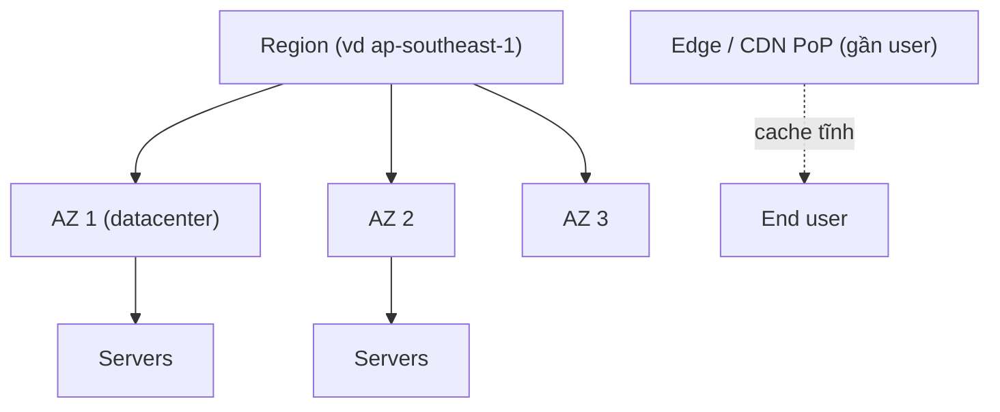

# 🎓 Regions, Availability Zones, Edge — Phân bố địa lý của Cloud

> **Tác giả:** Mr.Rom\
> **Phiên bản:** v2.0.1\
> **Tạo lúc:** 24/05/2026\
> **Cập nhật:** 10/06/2026\
> **Level:** Basic\
> **Tags:** [MUST-KNOW]\
> **Yêu cầu trước:** [00_what-is-cloud-computing.md](00_what-is-cloud-computing.md), [Networking basics](../../../../05_networking/)

> 🎯 *Cloud không phải "một server thật to". Nó là hàng trăm *datacenter* (trung tâm dữ liệu) rải khắp 30+ *region* (vùng địa lý) trên toàn cầu. Bài này đi qua: **Region**, **AZ**, **Edge**, **CDN**, cách *latency* (độ trễ) quyết định trải nghiệm, các bậc dự phòng (*redundancy tiers*), cách chọn đúng region theo vị trí khách hàng + tuân thủ pháp lý + chi phí, cùng các mô hình multi-region.*

## 🎯 Sau bài này bạn sẽ

- [ ] Phân biệt được **Region** vs **Availability Zone** vs **Edge location**.
- [ ] Hiểu **latency** đến từ đâu: khoảng cách vật lý + số chặng mạng (*network hops*) + thời gian truyền dữ liệu.
- [ ] Biết **CDN** là gì (Cloudflare, CloudFront, Fastly) và khi nào nên dùng.
- [ ] Nắm các bậc dự phòng: Single AZ → Multi-AZ → Multi-region → Multi-cloud.
- [ ] Chọn **đúng region** dựa trên vị trí khách hàng + yêu cầu tuân thủ + chi phí.
- [ ] Phân biệt các mô hình **multi-region**: active-passive, active-active, geo-routed.
- [ ] Hiểu **data residency** (chủ quyền dữ liệu) và GDPR ảnh hưởng tới việc chọn region thế nào.

---

## Tình huống — Khách ở Việt Nam, app deploy tại us-east-1

Hãy bắt đầu từ một cảnh rất hay gặp với startup. Bạn deploy một app FastAPI lên AWS, để region mặc định là `us-east-1` (Virginia, bờ Đông nước Mỹ) — vì hầu hết tutorial trên mạng đều dùng region này.

App chạy ngon trên máy bạn, demo cho sếp cũng mượt. Nhưng khi khách hàng Việt Nam bắt đầu dùng thật, phản hồi đổ về dồn dập:

- Trang tải mất 3-5 giây (trong khi khách ở Mỹ chỉ mất 800ms).
- Người dùng mobile bỏ đi giữa chừng.
- Tỷ lệ chuyển đổi (*conversion rate*) ở Việt Nam chỉ bằng 1/3 so với Mỹ.

Nguyên nhân nằm ở độ trễ mạng **Việt Nam → Virginia** — đường truyền vật lý quá xa, và mỗi bước thiết lập kết nối lại cộng thêm một vòng đi-về:

- ICMP ping: ~250-350ms.
- TCP handshake: 3 vòng đi-về = ~1 giây.
- TLS handshake: thêm 2 vòng = ~1.5 giây.
- HTTP request: thêm 1 vòng nữa.
- **Tổng thời gian trước khi app kịp phản hồi**: khoảng 2 giây cho mỗi request.

Sếp đi ngang, nhìn màn hình rồi nói: *"Cần deploy region gần users hơn, kèm CDN cho static assets. Học cách làm trong bài này đi."* — Đó chính là toàn bộ nội dung phía dưới.

---

## 1️⃣ Region — Cụm datacenter theo vùng địa lý

### Region là gì?

Khái niệm nền tảng đầu tiên là **Region** — một cụm các *datacenter* nằm trong cùng một quốc gia/khu vực địa lý. Khi nhà cung cấp cloud nói "chúng tôi có mặt ở 32 region", nghĩa là họ có 32 cụm datacenter rải khắp thế giới để bạn chọn nơi đặt ứng dụng.

Số lượng region của các nhà cung cấp lớn (tính tới 2026):

- **AWS**: 32+ region (us-east-1, eu-west-1, ap-southeast-1, ...).
- **GCP**: 40+ region.
- **Azure**: 60+ region.
- **DigitalOcean**: 15 region.
- **Cloudflare**: 300+ thành phố (đây là *edge*, không hẳn là region theo nghĩa truyền thống).

### Quy ước đặt tên region

Mỗi nhà cung cấp có cách đặt tên riêng, nhưng đều theo logic "khu vực + hướng + số thứ tự". Nhìn vào tên là đoán được vị trí địa lý. AWS dùng dạng mã ngắn:

- `us-east-1` = US East (N. Virginia)
- `us-west-2` = US West (Oregon)
- `eu-west-1` = Europe (Ireland)
- `ap-southeast-1` = Asia Pacific (Singapore)
- `ap-southeast-2` = Asia Pacific (Sydney)
- `ap-northeast-1` = Asia Pacific (Tokyo)
- `sa-east-1` = South America (São Paulo)

GCP đặt tên dễ đọc hơn một chút:

- `us-central1` = Iowa
- `europe-west1` = Belgium
- `asia-southeast1` = Singapore

Azure thì ghép liền không dấu gạch:

- `eastus` = Virginia
- `westeurope` = Netherlands
- `southeastasia` = Singapore

### Bên trong một region có gì?

Một region không phải là một toà nhà duy nhất. Nó là **cụm 3-6 datacenter** (mỗi cái gọi là một AZ) phân tán trong bán kính khoảng 100km. Các datacenter này nối với nhau bằng cáp quang tốc độ cao (độ trễ dưới 1ms). Riêng *edge location* thì nhỏ hơn nhiều, đặt rải rác gần người dùng thay vì gần region:

```text
Region (e.g., ap-southeast-1 Singapore)
├── AZ-a (datacenter 1)
├── AZ-b (datacenter 2)
├── AZ-c (datacenter 3)
└── Edge locations nearby
```

→ Nói gọn: mỗi region = **nhiều datacenter** (các AZ) nằm trong bán kính ~100km, nối với nhau bằng cáp quang tốc độ cao.

Sơ đồ dưới đây phân tầng quan hệ Region → AZ → Servers, kèm Edge nằm tách biệt và phục vụ user qua cache:



Điểm cần phân biệt: AZ là datacenter nằm bên trong region, còn Edge là điểm nhỏ đặt sát người dùng nên không thuộc cây phân cấp region — nó chỉ cache nội dung tĩnh gần user.

### Không phải region nào cũng có đủ dịch vụ

Một điểm dễ bị bỏ sót: không phải dịch vụ nào cũng có ở mọi region. Region càng mới thì càng thiếu dịch vụ — vì nhà cung cấp triển khai dần dần. Trước khi chốt region, nên kiểm tra xem nó có đủ dịch vụ bạn cần không:

```bash
# AWS — services per region
aws ec2 describe-regions --query "Regions[?RegionName=='ap-southeast-1']"
# Then check service availability:
# https://aws.amazon.com/about-aws/global-infrastructure/regional-product-services/
```

→ Quy tắc: chọn region có sẵn đầy đủ dịch vụ bạn định dùng, đừng để giữa chừng mới phát hiện thiếu.

🪞 **Ẩn dụ**: *Region giống như **bưu cục của một thành phố**. Region Singapore = bưu cục Singapore. Mỗi region có nhiều datacenter (AZ) như nhiều phòng phân loại trong cùng một bưu cục. Khách hàng ở gần bưu cục nào thì nhận hàng nhanh từ bưu cục đó.*

---

## 2️⃣ Availability Zone (AZ)

### AZ là gì?

Nếu region là "thành phố" thì **AZ** (Availability Zone) là từng "toà nhà" độc lập bên trong thành phố đó. Cụ thể: AZ là một datacenter biệt lập trong region, có nguồn điện, hệ thống làm mát và mạng riêng — để khi một AZ gặp sự cố thì các AZ khác không bị kéo theo.

```text
Region: us-east-1
├── AZ us-east-1a (~100MW power, separate building)
├── AZ us-east-1b
├── AZ us-east-1c
├── AZ us-east-1d
├── AZ us-east-1e
└── AZ us-east-1f
```

→ Region `us-east-1` có 6 AZ, mỗi AZ cách nhau khoảng 10-30km.

### Vì sao cần nhiều AZ?

Lý do cốt lõi là **cô lập sự cố** — gói gọn rủi ro trong một AZ thay vì để nó lan ra toàn region:

- AZ-a cháy → AZ-b, AZ-c không bị ảnh hưởng.
- Mất điện AZ-a → các AZ khác vẫn phục vụ bình thường.

Từ đó sinh ra hai lựa chọn deploy, đánh đổi giữa chi phí và độ an toàn:

- **Single-AZ**: chỉ 1 datacenter, rẻ hơn, nhưng là điểm chết duy nhất (*SPOF — Single Point of Failure*).
- **Multi-AZ**: trải đều qua nhiều AZ, tự động chuyển hướng (*failover*) khi một AZ sập.

### Mô hình Multi-AZ trong thực tế

Hệ thống production gần như luôn phải deploy across nhiều AZ để chịu được sự cố cấp datacenter. Pattern điển hình: Load Balancer **đứng trước cả 3 AZ**, EC2 trải đều ra từng AZ, còn RDS có Primary ở AZ-a kèm Standby đồng bộ (*synchronous*) ở AZ-b. Khi AZ-a sập, Load Balancer tự loại bỏ AZ-a và RDS tự nâng Standby lên làm Primary:

```text
Load Balancer (multi-AZ)
    ├── EC2 in AZ-a
    ├── EC2 in AZ-b
    └── EC2 in AZ-c

RDS Multi-AZ:
    ├── Primary in AZ-a
    └── Standby in AZ-b (synchronous replication)
       (failover automatic if AZ-a down)
```

→ AZ-a chết → Load Balancer ngừng đẩy traffic sang AZ-a, RDS nâng AZ-b lên. Thời gian phục hồi khoảng 60-120 giây — đủ nhanh để hầu hết người dùng không nhận ra.

### AZ name khác AZ ID

⚠️ **Bẫy**: tên AZ (`us-east-1a`) trỏ tới **vị trí vật lý khác nhau** tuỳ từng tài khoản. Đây là điểm cực kỳ dễ nhầm:

- Tài khoản của bạn: `us-east-1a` = vùng vật lý X.
- Tài khoản của đồng nghiệp: `us-east-1a` = vùng vật lý Y.

AWS cố tình làm vậy để **cân bằng tải** (*load balancing*) khi có tài khoản mới — nếu mọi người đều đổ vào "1a" thì AZ đó quá tải.

**Cách xử lý**: dùng **AZ ID** (ví dụ `use1-az1`) khi cần nhất quán giữa các tài khoản:

```bash
aws ec2 describe-availability-zones --region us-east-1
# Names + IDs
```

### Chi phí truyền dữ liệu giữa các AZ

⚠️ Một khoản chi phí ẩn hay bị quên: AWS tính phí **$0.01/GB** cho traffic đi qua giữa các AZ. Multi-AZ tăng độ an toàn, nhưng cũng tăng lượng dữ liệu chạy chéo AZ:

- 100GB/ngày chạy chéo AZ = $30/tháng cho mỗi service.
- Database multi-AZ có replication: cộng thêm chi phí chéo AZ.

→ Cần cân bằng: độ dự phòng (multi-AZ) đổi lấy chi phí (single-AZ rẻ hơn nhưng rủi ro hơn).

---

## 3️⃣ Edge locations + CDN

### Edge location

Region thì gần nhau theo cụm, nhưng vẫn có thể rất xa người dùng cuối. Đây là lúc **edge location** vào cuộc: một datacenter nhỏ đặt sát người dùng, chủ yếu để chạy **CDN** và đôi khi chạy thêm một ít *compute* (xử lý nhẹ). Sơ đồ dưới cho thấy người dùng chạm vào edge gần nhất thay vì phải đi thẳng tới region xa:

```text
                        Region us-east-1
                              ┃
                      ┏━━━━━━━┻━━━━━━━┓
                      ┃   Internet     ┃
                      ┗━━━━━━┳━━━━━━━━┛
            ┌─────────────────┼─────────────────┐
       Edge Singapore     Edge Tokyo        Edge Sydney
       (cache + compute)  (cache + compute) (cache + compute)
            ↑                  ↑                  ↑
       User Vietnam       User Japan         User Australia
       (50ms latency)     (10ms latency)     (15ms latency)
```

→ Luồng đi: User → Edge (gần) → nếu cache miss thì Edge → Region (xa). Phần lớn request dừng lại ngay ở edge.

### CDN — Content Delivery Network

**CDN** (Content Delivery Network — mạng phân phối nội dung) sinh ra để phục vụ đúng một việc: đưa các *static assets* (ảnh, JS, CSS, font, video) tới người dùng từ điểm gần nhất, thay vì kéo từ origin server ở xa.

Các nhà cung cấp CDN phổ biến tính tới 2026:

- **Cloudflare**: dẫn đầu thị trường, 300+ thành phố, có gói free.
- **AWS CloudFront**: tích hợp sẵn với AWS, nhưng bảng giá khá rối.
- **Fastly**: thiên về developer, xoá cache (*cache invalidation*) cực nhanh.
- **Akamai**: lâu đời, mạnh ở mảng enterprise/media.
- **Bunny.net**: rẻ, đang lên.
- **Google Cloud CDN**: bản native cho GCP.

### CDN hoạt động thế nào?

Cơ chế của CDN xoay quanh một câu hỏi duy nhất tại mỗi edge node: **đã có trong cache chưa?** User request một file → DNS phân giải trả về IP của edge node gần nhất → edge kiểm tra cache: nếu *hit* thì trả ngay (~10ms), nếu *miss* thì kéo từ origin server (~200ms), lưu vào cache rồi mới trả cho user. Từ request thứ hai trở đi cho cùng file đó, mọi user trong vùng đều được phục vụ từ cache:

```text
User browser → DNS resolve www.acmeshop.vn → CDN node (closest)
                                              ↓
                                              Has cache?
                                              ├── YES → return immediately
                                              └── NO → fetch from origin
                                                       ↓
                                                       Cache at edge
                                                       ↓
                                                       Return to user
```

### CDN tiết kiệm chi phí thế nào?

CDN không chỉ giúp nhanh, mà còn cắt mạnh chi phí băng thông. Lấy ví dụ 100K user, mỗi người tải một ảnh 10MB:

- **Không CDN**: 1TB/tháng kéo thẳng từ origin = $90 phí egress (AWS).
- **Có CDN**: 1TB phục vụ từ CDN (rẻ hơn nhiều), chỉ 50GB chạm origin (phần cache miss) = $5 phí egress + chi phí CDN.

→ CDN vừa giảm tải cho origin, vừa giảm chi phí băng thông.

### Edge compute (nâng cao)

Từ 2018 trở đi, edge location không chỉ làm cache nữa — chúng chạy được cả **compute** (mã thực thi), tức là logic của bạn có thể chạy ngay sát người dùng. Một số nền tảng tiêu biểu:

- **Cloudflare Workers**: dùng V8 isolates, khởi động nhanh, viết bằng JS/TS/Rust.
- **AWS Lambda@Edge**: chạy Lambda function ngay tại edge của CloudFront.
- **Fastly Compute@Edge**: dùng Rust WebAssembly.
- **Deno Deploy**: nền tảng dựa trên V8.

Những việc hay được đẩy ra edge:

- **Định tuyến A/B testing** (50% user → biến thể A).
- **Chặn bot** ngay tại edge.
- **Viết lại header**.
- **Định tuyến theo vị trí địa lý** (*geolocation routing*).
- **Xác thực tại edge** — kiểm tra JWT trước khi cho request chạm tới origin.

Ví dụ một Cloudflare Worker chặn truy cập theo quốc gia và gắn cache header — toàn bộ logic này chạy ngay tại edge gần user:

```javascript
// Cloudflare Worker
addEventListener('fetch', event => {
  event.respondWith(handleRequest(event.request));
});

async function handleRequest(request) {
  const country = request.cf.country;     // user country
  
  if (country === 'CN') {
    return new Response('Sorry, not available', { status: 451 });
  }
  
  // Cache headers
  const response = await fetch(request);
  response.headers.set('Cache-Control', 'public, max-age=3600');
  return response;
}
```

→ Code chạy tại edge sát user nên độ trễ chỉ 10-50ms, so với 200ms+ nếu phải đi tới origin.

---

## 4️⃣ Latency: vật lý + mạng

### Giới hạn tốc độ ánh sáng

Để hiểu vì sao region xa lại chậm, phải quay về vật lý. Tốc độ ánh sáng trong chân không là 300,000 km/s, nhưng **trong cáp quang chỉ còn ~200,000 km/s** (chậm hơn). Đây là trần cứng — không công nghệ nào vượt qua được. Bảng dưới cho thấy độ trễ tối thiểu một chiều chỉ tính riêng khoảng cách vật lý:

| Distance | Min latency (one-way) |
|---|---|
| Hanoi → Ho Chi Minh City (1100 km) | ~5.5ms |
| Hanoi → Singapore (3000 km) | ~15ms |
| Hanoi → Tokyo (3700 km) | ~18ms |
| Hanoi → Frankfurt (8800 km) | ~44ms |
| Hanoi → New York (13000 km) | ~65ms |

Lưu ý: đây mới là một chiều. **Round-trip** (đi và về) = gấp đôi một chiều + cộng thêm số chặng mạng + thời gian xử lý.

### Độ trễ thực tế

Con số lý thuyết ở trên là sàn lý tưởng. Thực tế luôn cao hơn vì còn router trung gian, hàng đợi, định tuyến vòng. Đo thực tế từ Việt Nam:

- Việt Nam → us-east-1: **~200-280ms RTT**.
- Việt Nam → ap-southeast-1 (Singapore): **~50-80ms RTT**.
- Việt Nam → ap-southeast-3 (Jakarta): **~40-60ms RTT**.

→ Quy tắc: chọn region gần user. Singapore tốt nhất cho Đông Nam Á, Tokyo cho Nhật/Hàn.

### TCP / TLS handshake khuếch đại độ trễ

RTT (Round-Trip Time — thời gian một vòng đi-về) nghe có vẻ nhỏ, nhưng vấn đề là việc thiết lập một kết nối mới (TCP + TLS + HTTP) tốn tới **6 RTT** trước khi byte đầu tiên về tới người dùng. Với region xa (200ms RTT), riêng request đầu tiên đã chạm ~800ms — gần ngưỡng mà user bắt đầu thấy "chậm". Đây chính là lý do *connection pooling* và HTTP/2/3 quan trọng:

```text
TCP connect:    3 packets = 1 RTT  → 200ms
TLS handshake:  2 RTTs            → 400ms more
HTTP request:   1 RTT             → 200ms more
                                  ────────────
First request total:              ~800ms-1s
```

→ Chỉ một request chậm cũng đủ làm hỏng trải nghiệm. **Ngân sách độ trễ** (*latency budget*) cho UX tốt nên dưới 500ms tổng cộng.

### Các chiến thuật giảm latency

Có nhiều cách giảm độ trễ, và chúng cộng dồn được — dùng kết hợp sẽ ra hiệu quả lớn nhất. Bảng dưới xếp theo mức tiết kiệm: **chọn region gần** là biện pháp đầu tiên và đơn giản nhất (xoá ~80% độ trễ), **CDN** giảm tới 90% cho static, phần còn lại là tinh chỉnh protocol/mạng:

| Tactic | Saving |
|---|---|
| **Pick close region** | 80% latency reduction |
| **CDN for static** | 90% on cache hit |
| **HTTP/2** (multiplexing) | reduce TLS handshakes |
| **HTTP/3 over QUIC** | 1 RTT setup vs 3 |
| **Connection pooling** | save TCP/TLS per request |
| **Edge compute** | run logic at edge |
| **Pre-warm DNS** | save DNS lookup |
| **Compression** (Brotli) | reduce payload size |

→ Hai dòng đầu (region + CDN) gần như luôn cho hiệu quả lớn nhất với công sức ít nhất, nên ưu tiên làm trước.

---

## 5️⃣ Chọn region đúng

### Các yếu tố quyết định

Chọn region không chỉ là "chọn nơi gần nhất". Có 6 yếu tố cần cân nhắc cùng lúc, và đôi khi chúng mâu thuẫn nhau (gần thì đắt, rẻ thì xa):

1. **Vị trí khách hàng**: phần lớn user ở đâu.
2. **Tuân thủ pháp lý**: yêu cầu data residency (EU → region EU, Trung Quốc → cloud Trung Quốc).
3. **Tính khả dụng của dịch vụ**: region mới thiếu một số dịch vụ.
4. **Chi phí**: giá khác nhau theo region (us-east-1 rẻ nhất, mainland China + GovCloud đắt).
5. **Độ trễ tới dependency**: nếu app dùng Stripe (Mỹ), phải tính độ trễ chéo region.
6. **Disaster recovery**: chọn region DR đủ xa (khác vùng động đất).

### Các cụm region theo địa lý

Để dễ định hướng, các region thường được nhóm theo cụm địa lý. Khi mở rộng, bạn thường chọn thêm region trong cùng cụm hoặc cụm lân cận:

| Cluster | Primary regions |
|---|---|
| **North America** | us-east-1 (Virginia), us-west-2 (Oregon), ca-central-1 (Canada) |
| **Europe** | eu-west-1 (Ireland), eu-central-1 (Frankfurt), eu-north-1 (Stockholm) |
| **Asia Pacific** | ap-southeast-1 (Singapore), ap-northeast-1 (Tokyo), ap-south-1 (Mumbai), ap-southeast-2 (Sydney) |
| **China** | cn-north-1 (Beijing — AWS China, separate account) |
| **South America** | sa-east-1 (São Paulo) |
| **Middle East** | me-south-1 (Bahrain), me-central-1 (UAE) |
| **Africa** | af-south-1 (Cape Town) |

### Với startup ở Việt Nam

Áp vào trường hợp cụ thể: một startup Việt Nam nên cân nhắc 3 lựa chọn theo thứ tự ưu tiên:

1. **ap-southeast-1 (Singapore)**: gần nhất, region trưởng thành, đủ mọi dịch vụ.
2. **ap-southeast-3 (Jakarta)**: gần hơn nhưng mới hơn (thiếu một số dịch vụ).
3. **ap-east-1 (Hong Kong)**: gần với miền Bắc Việt Nam.

→ **Singapore là lựa chọn mặc định** cho Việt Nam. Dự phòng: Tokyo hoặc Sydney.

### So sánh chi phí (tương đối)

Chi phí cũng là một yếu tố cần đưa vào bàn cân. Bảng dưới là chỉ số chi phí tương đối, lấy us-east-1 làm mốc 1.00 — region càng xa Mỹ hoặc càng đặc thù thì càng đắt:

| Region | Index |
|---|---|
| us-east-1 | 1.00 (cheapest base) |
| us-west-2 | 1.05 |
| eu-west-1 | 1.10 |
| ap-southeast-1 | 1.15 |
| ap-northeast-1 | 1.20 |
| Sydney, Brazil | 1.30 |
| Mainland China | 1.40 |
| GovCloud | 1.50 |

→ Build từ đầu phục vụ thị trường Mỹ? `us-east-1` rẻ nhất. Startup Việt Nam? `ap-southeast-1` — phần chi phí dôi ra hoàn toàn đáng để đổi lấy độ trễ thấp.

---

## 6️⃣ Các mô hình multi-region

### Khi nào cần multi-region?

Multi-region phức tạp và tốn kém, nên đừng nhảy vào sớm. Chỉ thực sự cần khi rơi vào một trong các trường hợp sau:

- **Tệp user toàn cầu**: phục vụ người dùng khắp thế giới với độ trễ thấp.
- **Disaster recovery**: chuyển hướng khi cả một region sập.
- **Tuân thủ pháp lý**: data residency theo từng region (dữ liệu EU phải ở EU).
- **HA hạng nhất**: SLA 99.99%+.

### Pattern 1: Single-region, multi-AZ (phổ biến nhất)

Đây là điểm khởi đầu hợp lý cho gần như mọi app. Một region duy nhất, nhưng trải đều qua nhiều AZ — đủ tốt cho SLA 99.9%:

```text
Region us-east-1
    ├── AZ-a  (active)
    ├── AZ-b  (active)
    └── AZ-c  (active)
Users from anywhere → us-east-1 → distributed across AZs
```

- ✅ **Ưu điểm**: đơn giản, đủ cho SLA 99.9%.
- ❌ **Nhược điểm**: cả region sập = sập hoàn toàn. Độ trễ cao với user ở xa.

### Pattern 2: Multi-region active-passive

Khi cần disaster recovery thật sự nhưng chưa muốn gánh độ phức tạp của active-active, đây là bước đi vừa phải: một region chạy thật, một region dự phòng đứng chờ:

```text
Region us-east-1 (active)    Region eu-west-1 (passive)
    ├── EC2 fleet                ├── EC2 fleet (stopped)
    ├── RDS primary  ──repl──→    ├── RDS read replica
    └── S3 (cross-region rep) ─→  └── S3 backup
                ↑
        DNS routes 100% users to us-east-1
        
If us-east-1 down → switch DNS → eu-west-1
```

- ✅ **Ưu điểm**: sẵn sàng cho DR, đơn giản hơn active-active.
- ❌ **Nhược điểm**: phải trả tiền cho capacity DR nằm không, failover chậm (5-10 phút do đổi DNS).

### Pattern 3: Multi-region active-active

Đây là cấp độ phức tạp nhất: cả hai region cùng phục vụ traffic thật cùng lúc. Đổi lại độ trễ toàn cầu thấp nhất, nhưng phải trả giá bằng bài toán đồng bộ dữ liệu:

```text
Region us-east-1                 Region eu-west-1
    ├── EC2 fleet (active)            ├── EC2 fleet (active)
    ├── RDS read+write                ├── RDS read+write
    └── S3                            └── S3
                ↑                          ↑
        Route53 latency routing
        US users → us-east-1, EU users → eu-west-1
```

- ✅ **Ưu điểm**: độ trễ toàn cầu thấp nhất; capacity DR luôn hoạt động; đáp ứng tuân thủ theo địa lý.
- ❌ **Nhược điểm**: đồng bộ database cực khó (ghi ở 2 region → xung đột); cache invalidation phức tạp; chi phí gấp đôi.

Phần khó nhất — đồng bộ database — có một vài lời giải tuỳ mức độ nhất quán bạn cần:

- **Aurora Global Database** (AWS): một region ghi, các region khác đọc, độ trễ replication < 1s.
- **Spanner** (GCP): database thật sự toàn cầu, đảm bảo nhất quán mạnh.
- **CockroachDB**: SQL phân tán, hỗ trợ multi-region.
- **DynamoDB Global Tables**: nhất quán cuối cùng (*eventually consistent*) giữa các region.

### Pattern 4: Geo-routed (mỗi region một tập user)

Cách đơn giản nhất để "multi-region" mà tránh được bài toán đồng bộ: mỗi region phục vụ đúng tập user của mình, không chia sẻ dữ liệu chéo:

```text
US users → us-east-1 (separate DB)
EU users → eu-west-1 (separate DB)
APAC users → ap-southeast-1 (separate DB)
```

Mỗi region cô lập, chỉ lo cho user thuộc về nó.

- ✅ **Ưu điểm**: multi-region đơn giản nhất; tuân thủ pháp lý có sẵn theo thiết kế.
- ❌ **Nhược điểm**: user khó chia sẻ dữ liệu xuyên region.
- 💡 **Hợp nhất với**: SaaS theo mô hình tenant-per-region, ví dụ nền tảng B2B.

---

## 7️⃣ Data residency + GDPR

### Data residency là gì?

Ngoài kỹ thuật và chi phí, có một ràng buộc pháp lý mà nhiều dev bỏ qua: **một số quốc gia bắt buộc dữ liệu phải nằm vật lý trong nước**. Đây gọi là *data residency* (chủ quyền dữ liệu):

- **EU GDPR**: dữ liệu công dân EU phải được xử lý theo luật tuân thủ GDPR.
- **Russia**: dữ liệu cá nhân phải đặt tại Nga (Federal Law 242).
- **China**: dữ liệu công dân Trung Quốc phải ở Trung Quốc (Cybersecurity Law).
- **India**: một số dữ liệu tài chính phải ở Ấn Độ.
- **Brazil LGPD**: tương tự GDPR.

→ Hệ quả trực tiếp: chọn region nằm trong đúng quốc gia mà luật yêu cầu.

### GDPR trong thực tế

Với khách hàng EU, ngoài việc chọn region EU, còn một loạt nghĩa vụ vận hành đi kèm:

- Deploy ở **eu-west-1**, **eu-central-1**, **eu-north-1**, v.v.
- Ký DPA (Data Processing Agreement — thoả thuận xử lý dữ liệu) với nhà cung cấp.
- Quyền được xoá (*right to erasure*): xoá dữ liệu user khi họ yêu cầu.
- Thông báo rò rỉ dữ liệu trong vòng 72 giờ.
- Có DPO (Data Protection Officer) nếu xử lý dữ liệu vượt một ngưỡng nhất định.

### Schrems II (chuyển dữ liệu EU-Mỹ)

Có một phán quyết khiến việc đặt dữ liệu EU trên cloud Mỹ trở nên rủi ro. Năm 2020, toà EU ra phán quyết: các công ty cloud Mỹ chịu sự giám sát của Mỹ (CLOUD Act) → dữ liệu EU đặt ở Mỹ có rủi ro pháp lý.

Các cách giảm thiểu rủi ro này:

- Lưu dữ liệu EU **vật lý trong region EU**.
- Mã hoá dữ liệu, nhà cung cấp không giữ khoá (BYOK / Customer-managed keys).
- Dùng nhà cung cấp thuần EU (OVH, Hetzner, Scaleway) cho các trường hợp nghiêm ngặt.

→ Với khách hàng EU: AWS eu-west-1 (Ireland) + mã hoá KMS + phân loại dữ liệu là combo thực dụng.

---

## 8️⃣ Các bậc độ tin cậy — cần bao nhiêu dự phòng?

### Các bậc SLA

Câu hỏi cuối cùng là: nên đầu tư bao nhiêu vào độ dự phòng? Mỗi "số 9" thêm vào SLA đòi hỏi kiến trúc phức tạp hơn hẳn. Bảng dưới quy đổi từng bậc SLA ra thời gian downtime cho phép mỗi tháng và kiến trúc tương ứng:

| SLA target | Pattern | Downtime/month |
|---|---|---|
| **99% (2 nines)** | Single AZ, single instance | 7h 18m |
| **99.5%** | Single AZ, 2+ instances + LB | 3h 39m |
| **99.9% (3 nines)** | Multi-AZ (3+ AZs) | 43m 12s |
| **99.95%** | Multi-AZ + RDS Multi-AZ + S3 cross-region | 21m 36s |
| **99.99% (4 nines)** | Multi-region active-passive | 4m 19s |
| **99.999% (5 nines)** | Multi-region active-active + extensive DR drills | 25.9s |

### Chi phí đổi lấy độ tin cậy

Vấn đề là chi phí không tăng tuyến tính — nó tăng theo cấp số nhân. Sơ đồ dưới minh hoạ đường cong dựng đứng khi tiến gần tới các bậc cao:

```text
Cost
 │
 │                            ╱  99.999%
 │                          ╱
 │                        ╱  99.99%
 │                      ╱
 │                ────╱  99.9%
 │       ────╱
 │  ────╱
 │ ╱  99%
 └──────────────────────────────► Availability
```

→ Mỗi "số 9" thêm vào tốn gấp khoảng 10 lần chi phí. Với phần lớn app, 99.9% là điểm cân bằng hợp lý nhất.

### Chọn bậc một cách chiến lược

Đừng đu theo con số chỉ vì "nghe oai". Hãy chọn bậc theo mức độ thiệt hại nếu hệ thống ngừng — bảng dưới gợi ý bậc phù hợp cho từng loại dịch vụ:

| Service | Recommend |
|---|---|
| Internal tool | 99% (single AZ) |
| Marketing site | 99.5% (CDN handles) |
| B2B SaaS | 99.9% (multi-AZ) |
| E-commerce | 99.95% (multi-AZ + RDS Multi-AZ) |
| Payment processing | 99.99% (multi-region) |
| Banking, healthcare | 99.99%+ (multi-region active-active) |
| Telco, life-critical | 99.999%+ (custom infra) |

---

## 9️⃣ Hands-on: chọn region cho startup Việt Nam

### Bối cảnh

Giờ ráp mọi thứ đã học vào một quyết định thật. Giả sử bạn cầm dự án sau:

- **App**: FastAPI + React, thương mại điện tử.
- **Khách hàng**: 90% Việt Nam, 10% Singapore.
- **Tuân thủ**: chưa nghiêm ngặt (chưa cần PCI).
- **Ngân sách**: eo hẹp.

### Quyết định

Dựa trên các yếu tố ở phần 5, đây là phương án và lý do từng lựa chọn:

**Region chính**: `ap-southeast-1` (Singapore).

- Gần Việt Nam nhất (độ trễ 50-80ms).
- Region trưởng thành, đủ mọi dịch vụ.
- Pháp lý Singapore thân thiện với Việt Nam.

**Chiến lược AZ**: Multi-AZ (3 AZ).

- LB + EC2 trải qua 3 AZ.
- RDS Multi-AZ (tự động failover).

**CDN**: Cloudflare (gói free — khá hào phóng).

- Cache static assets toàn cầu.
- User Việt Nam chạm edge Singapore (vẫn ~50ms).

**Ước tính chi phí**:

- 3x t3.medium EC2: $90/tháng.
- RDS Multi-AZ db.t3.medium: $80/tháng.
- S3 + băng thông: $30/tháng.
- Cloudflare free: $0.
- Tổng: ~$200/tháng.

### Thiết lập

Bắt tay vào cấu hình. Phần VPC sẽ được đào sâu ở bài networking, ở đây chỉ dựng khung region trước:

```bash
# AWS CLI
aws configure
# region: ap-southeast-1

# Create VPC across 3 AZs
aws ec2 create-vpc --cidr-block 10.0.0.0/16 --region ap-southeast-1

# (Bài 02 networking will deep dive)
```

### Đo thử độ trễ

Để xác nhận quyết định là đúng, đo ping từ Việt Nam tới cả hai region rồi so sánh:

```bash
# From Vietnam
ping ec2.ap-southeast-1.amazonaws.com
# 50-80ms

# Vs us-east-1
ping ec2.us-east-1.amazonaws.com
# 200-280ms
```

→ Singapore nhanh gấp 4 lần us-east-1 khi đo từ Việt Nam. Hoàn toàn đáng với mức chi phí dôi ra ~15%.

### Tương lai: mở rộng sang Tokyo, Mumbai?

Khi đã vượt 10K+ user trải khắp nhiều khu vực, lúc đó mới tính chuyện mở rộng thêm region:

- Thêm Tokyo (ap-northeast-1) cho Nhật/Hàn.
- Thêm Mumbai (ap-south-1) cho Ấn Độ.
- Multi-region active-passive với Aurora Global Database.

→ Lên kế hoạch cho tăng trưởng, đừng over-engineer ngay từ ngày đầu.

---

## 💡 Cạm bẫy thường gặp & Best practice

### ❌ Cạm bẫy: Để region mặc định `us-east-1` cho user không ở Mỹ

→ Hầu hết ví dụ AWS dùng `us-east-1`. Dev Việt copy-paste y nguyên → độ trễ cao.

→ **Fix**: chỉ định region rõ ràng cho từng project. Đặt region mặc định trong `~/.aws/config`.

### ❌ Cạm bẫy: Deploy single-AZ để "tiết kiệm"

→ Một AZ sập = sập toàn bộ. SLA bị phá vỡ.

→ **Fix**: Multi-AZ ngay cả cho staging. Chênh lệch chi phí nhỏ, nhưng độ tin cậy tăng vọt.

### ❌ Cạm bẫy: Cho rằng tên AZ là cố định giữa các tài khoản

```yaml
# Hardcoded
availability_zone: us-east-1a
```

→ "1a" trỏ tới AZ vật lý khác nhau tuỳ tài khoản.

→ **Fix**: Dùng AZ ID (`use1-az1`) hoặc truy vấn động:
```bash
aws ec2 describe-availability-zones --filters Name=zone-id,Values=use1-az1
```

### ❌ Cạm bẫy: Bất ngờ vì chi phí traffic chéo AZ

→ Kiến trúc: app ở AZ-a, cache ở AZ-b → mỗi request đều chạy chéo AZ → tốn tiền data transfer.

→ **Fix**: Đặt các service phụ thuộc nhau cùng một AZ khi có thể, HOẶC thiết kế kiến trúc nhận biết AZ (*AZ-aware*).

### ❌ Cạm bẫy: Dùng CDN nhưng không có chiến lược cache

```text
Cache-Control: no-cache
```

→ CDN trở nên vô dụng, mọi request đều chạm origin.

→ **Fix**: Đặt cache header theo từng loại asset:

- Ảnh/CSS/JS: `Cache-Control: public, max-age=31536000, immutable` (1 năm).
- HTML: `Cache-Control: public, max-age=60` (ngắn).
- API: `Cache-Control: no-cache` (đúng).

### ❌ Cạm bẫy: Multi-region nhưng không có kế hoạch đồng bộ database

→ Ghi ở region A, đọc ở region B → chưa kịp replicate → dữ liệu cũ → user bối rối.

→ **Fix**: Chọn mô hình nhất quán phù hợp:
- Eventual (DynamoDB Global Tables): ổn cho dữ liệu không quan trọng.
- Strong (Spanner, Aurora Global writer-reader): cho dữ liệu tài chính.
- Xử lý ở tầng app (ví dụ: user luôn đọc từ region ghi).

### ❌ Cạm bẫy: Không diễn tập DR

→ Dựng multi-region active-passive nhưng chưa bao giờ test failover. Khi sự cố thật xảy ra → quy trình hỏng.

→ **Fix**: Diễn tập DR định kỳ hằng quý. Ghi rõ quy trình. Test failover đầy đủ trên môi trường staging.

### ❌ Cạm bẫy: Bỏ qua Schrems II cho dữ liệu EU

→ Dữ liệu khách hàng EU nằm ở us-east-1. Audit GDPR thất bại. Bị phạt.

→ **Fix**: Lập bản đồ dữ liệu theo vùng pháp lý. Dữ liệu EU ở region EU. Hoàn tất các hợp đồng DPA.

### ✅ Best practice: Edge compute cho API toàn cầu

```text
Pattern: Cloudflare Worker entry point
    ├── Static (HTML/CSS/JS): cache at edge
    ├── API GET (read): cache at edge with short TTL
    ├── API POST (write): route to closest region
    └── Auth: validate JWT at edge before forwarding
```

→ Giảm tải origin 80%+. Độ trễ toàn cầu cắt một nửa.

### ✅ Best practice: Đặt tên tài nguyên gắn region

Gắn region vào tag của tài nguyên để dễ nhận diện trong môi trường multi-region:
```hcl
locals {
  region = "ap-southeast-1"
}

resource "aws_instance" "web" {
  tags = {
    Name = "${var.app}-${local.region}-web"
    Region = local.region
  }
}
```

→ Dễ truy ra tài nguyên thuộc region nào khi hệ thống trải nhiều region.

### ✅ Best practice: Đặt ngân sách độ trễ

Định nghĩa và thực thi *latency budget* rõ ràng cho từng tầng:
- **Ngân sách P50**: 200ms.
- **Ngân sách P99**: 1000ms.
- Theo từng thành phần: DB query < 50ms, cache < 5ms, external API < 200ms.

→ Cảnh báo khi vượt ngưỡng. Tối ưu đường đi nóng (*hot path*).

---

## 🧠 Tự kiểm tra (Self-check)

Năm câu dưới chạm vào đúng những chỗ dễ nhầm nhất của bài. Bạn thử tự trả lời trước khi mở đáp án — đây là cách nhanh nhất để biết mình thật sự hiểu hay chỉ thấy quen.

**Q1.** Vì sao nên dùng **3+ AZ** thay vì 2?

<details>
<summary>💡 Đáp án</summary>

**2 AZs**: 1 AZ fails → 1 left. Can survive 1 failure, but:
- During failover, 1 AZ handles 2x load — may overload.
- If you need quorum (RDS Multi-AZ standby, etcd 3-node), 2 = no quorum.

**3 AZs**: 1 AZ fails → 2 left. Better:
- Each AZ handles 1.5x load (better than 2x).
- Quorum: 3 → 2 = still majority for distributed systems (etcd, Postgres replicas, etc.).
- **N+1 redundancy**: lose 1, still have N capacity.

**Best practice**:
- **Stateless apps**: 2 AZs OK if traffic low.
- **Stateful (DB, K8s control plane)**: 3+ AZs for quorum.
- **Tier-1 services**: 3 AZs always.

**Quorum systems**:
- etcd: 3 nodes → tolerate 1 failure. 5 → tolerate 2.
- Postgres synchronous replication: 3 → 1 primary + 2 standby (quorum 2).
- Kafka: 3 brokers → replication factor 3.

→ 3-AZ deploy = standard for HA. AWS default for managed services (RDS, MSK).
</details>

**Q2.** Multi-region active-active — điểm phức tạp chính là gì?

<details>
<summary>💡 Đáp án</summary>

**Main complexity**: **database consistency**.

**Single-region**: 1 database, single source of truth. Reads + writes consistent (ACID).

**Multi-region active-active**:
- 2+ regions, each can write.
- Network latency between regions: 100-200ms+.
- Writes can conflict (same row updated in 2 regions simultaneously).

**Resolution strategies**:

1. **Last-write-wins (LWW)**:
   - Timestamp on each write.
   - Newer wins.
   - DynamoDB Global Tables default.
   - **Risk**: data loss on concurrent writes.

2. **Conflict-free Replicated Data Types (CRDT)**:
   - Special data structures merge automatically (counters, sets).
   - Riak, some Postgres extensions.
   - **Limited**: not all data fits CRDT.

3. **Per-region primary keys**:
   - User belongs to region. All writes for user go to that region.
   - Cross-region read OK (eventually consistent).
   - **Common in SaaS** (tenant-per-region).

4. **Synchronous multi-region**:
   - Spanner, CockroachDB, Aurora Global with strict consistency.
   - **Cost**: every write waits for cross-region ack (100-200ms write latency).

5. **Hybrid**: 
   - One region is "global writer", others read replicas.
   - Aurora Global Database default: us-east-1 primary, eu-west-1 reader.
   - Writes go to primary, reads can be local.
   - **Trade-off**: write latency high for non-primary users.

**Other complexities**:
- **Cache invalidation** cross-region.
- **Session affinity**: user sticky to region.
- **Cost**: 2-3x infra + data transfer cross-region.
- **Operational**: 2x deploys, 2x debugging.

**Recommend**:
- **< 99.99% SLA**: multi-AZ in one region is enough.
- **99.99%+**: multi-region active-passive (simpler than active-active).
- **Global low latency**: read-local + write-global pattern.

→ True active-active rare. Most "multi-region" = active-passive or geo-routed.
</details>

**Q3.** Chiến lược cache cho CDN — nên đặt các giá trị header thế nào?

<details>
<summary>💡 Đáp án</summary>

**Cache-Control header** controls CDN + browser caching.

**By asset type**:

```text
# Static assets (hash in URL, version-locked)
GET /static/js/main.abc123.js
Cache-Control: public, max-age=31536000, immutable
# 1 year cache, never re-validate

# CSS (versioned URL)
Cache-Control: public, max-age=31536000, immutable

# Images (less critical)
Cache-Control: public, max-age=86400
# 1 day, ok to re-fetch

# HTML
Cache-Control: public, max-age=60, must-revalidate
# 1 minute (UX dynamic), revalidate via 304

# API response (varies)
Cache-Control: private, max-age=10  # short, per-user
# OR
Cache-Control: no-cache, must-revalidate  # never cache

# Authenticated API
Cache-Control: private, no-store  # never cache anywhere
```

**Key directives**:
- `public`: any cache (CDN + browser).
- `private`: only browser, not CDN.
- `max-age=N`: cache N seconds.
- `s-maxage=N`: CDN-specific TTL (overrides max-age for CDN).
- `immutable`: hint that content never changes (skip revalidation).
- `must-revalidate`: re-check expired content with origin.
- `no-cache`: cache but always revalidate.
- `no-store`: don't cache at all.
- `stale-while-revalidate=N`: serve stale while fetching fresh in background.

**Versioning strategy**:
- **Hash in filename** (Vite, Webpack default): `main.abc123.js`. New version = new filename. Cache forever.
- **Query string** (`?v=2`): less effective, some CDNs ignore.
- **Versioned path**: `/v2/static/`. Clean.

**Cache invalidation**:
- Hash-based: no invalidation needed (new file = new URL).
- Manual purge: Cloudflare/CloudFront API `purge_cache(url)`.

**Stale-while-revalidate**:
```text
Cache-Control: max-age=60, stale-while-revalidate=86400
```
→ Fresh for 60s. After expiry, serve stale + fetch fresh in background. User never waits.

**Recommended**:
- Static: `max-age=31536000, immutable` (with hash filenames).
- HTML: `max-age=60, stale-while-revalidate=600`.
- API: `private, max-age=10` or `no-cache`.
- Auth: `private, no-store`.

→ Result: CDN cache hit rate 95%+, origin load 5%.
</details>

**Q4.** Schrems II + GDPR — tuân thủ thực tế cho khách hàng EU làm thế nào?

<details>
<summary>💡 Đáp án</summary>

**Schrems II** (2020 EU court ruling): US-based cloud vendors (AWS, GCP, Azure US-based) subject to **US CLOUD Act** = US government can request EU data.

This conflicts with **GDPR Article 44** (transfer outside EU only with adequate protection).

**Practical mitigations** for EU customer data:

1. **Physical region in EU**:
   - AWS: eu-west-1 (Ireland), eu-central-1 (Frankfurt), eu-west-3 (Paris), eu-north-1 (Stockholm).
   - GCP: europe-west1 (Belgium), europe-west3 (Frankfurt), europe-north1 (Finland).
   - Azure: westeurope (Netherlands), northeurope (Ireland), francecentral, germanywestcentral.

2. **Customer-managed encryption** (CMEK/BYOK):
   - Encrypt data with your keys, not vendor's.
   - Vendor accesses encrypted data only.
   - AWS KMS Customer Managed Keys + S3 SSE-KMS.

3. **Data Processing Agreement (DPA)**:
   - Sign DPA with vendor.
   - Vendors (AWS, GCP, Azure) have standard DPAs.

4. **Standard Contractual Clauses (SCC)**:
   - 2021 EU Commission updated SCCs.
   - Vendor includes SCC in terms.

5. **Transfer Impact Assessment (TIA)**:
   - Document specific data + safeguards.
   - Auditor checks at GDPR audit.

6. **EU-only vendors** (strict cases):
   - OVH (France), Hetzner (Germany), Scaleway (France).
   - IONOS, Aruba (EU-based).
   - Not subject to US CLOUD Act.

7. **Encryption-at-rest + in-transit**:
   - AES-256 default.
   - TLS 1.3 transit.

8. **Right to access + deletion**:
   - API endpoint for user to request data export.
   - Delete on user request (within 30 days typical).

**EU-only architecture**:
```text
User EU → CDN EU (Cloudflare EU) → Load Balancer EU region → App in EU AZ → DB in EU AZ → S3 EU bucket → Backups EU
```

All data stays EU. No US datacenter involved.

**Documentation needed**:
- Data flow diagram.
- DPA + SCC signed.
- DPIA (Data Protection Impact Assessment) for sensitive processing.
- Privacy policy disclosure of vendors used.
- Sub-processor list (vendors of vendors).

**Realistic challenges**:
- Some SaaS (e.g., support tools) US-only → use EU alternative or accept risk.
- Multi-region: ensure no replica in non-EU region.
- AI services: many in US (OpenAI etc.). Use EU AI services or self-host.

→ GDPR compliance = ongoing process, not one-time setup.
</details>

**Q5.** Bậc độ tin cậy 99.9% vs 99.99% — chi phí tăng thực tế bao nhiêu?

<details>
<summary>💡 Đáp án</summary>

**99.9% (3 nines)** = 43 min downtime/month allowed.

**Architecture**:
- Multi-AZ in 1 region.
- 3 EC2 instances (1 per AZ).
- RDS Multi-AZ.
- LB across AZs.
- Backups daily.

**Cost example (Singapore, small app)**:
- 3 × t3.medium EC2: $90/month.
- RDS Multi-AZ db.t3.medium: $80/month.
- ALB: $20/month.
- S3 + bandwidth: $30/month.
- **Total: ~$220/month**.

**99.99% (4 nines)** = 4.32 min downtime/month allowed.

**Architecture**:
- Multi-region active-passive.
- Primary region: us-east-1 (us-east-1 multi-AZ).
- DR region: us-west-2 (us-west-2 multi-AZ).
- Cross-region RDS replica.
- Route53 failover.
- S3 cross-region replication.
- More monitoring + alerting.

**Cost increase**:
- Duplicate infra: ~2x = $440/month.
- Cross-region data transfer: $50/month.
- Cross-region RDS replica: $80/month.
- Route53 health checks: $5/month.
- **Total: ~$580/month** (~2.6x).

**99.999% (5 nines)** = 25.9 sec downtime/month.

**Architecture**:
- Multi-region active-active.
- Spanner/Aurora Global Database.
- DNS load balancing.
- Real-time replication.
- Chaos engineering exercises.

**Cost increase**:
- Active-active infra: 3x = $660/month.
- Spanner: $300+/month minimum.
- Operations team for 24/7 watch.
- Quarterly DR drills.
- **Total: ~$2000+/month** (~10x).

→ **Pattern**: each "9" = ~3x cost.

**Other factors**:
- **Engineering time**: more 9s = more code complexity + ops time.
- **MTTR investment**: lower 9s OK with 1h MTTR; 5 nines need < 30s MTTR.
- **Chaos engineering**: 4 nines+ need active failure testing.

**Reality**:
- Most apps **don't need 99.99%**. 99.9% sufficient.
- **Spec SLO realistic**: measure actual reliability, aim 1 tier higher.
- **Customer perception**: 99.9% vs 99.99% rarely noticed unless incident concentrated (1 month all 43 min in 1 incident vs spread out).

**Recommend tier by use case**:
- **Internal tool**: 99% (single AZ OK).
- **B2B SaaS**: 99.9% (multi-AZ).
- **E-commerce**: 99.9-99.95%.
- **Payments**: 99.99% (multi-region warranted).
- **Healthcare critical**: 99.99%+.
- **Telco/utility**: 99.999%+.

→ Choose tier based on **business impact**, not engineering pride.
</details>

---

## ⚡ Tra cứu nhanh (Cheatsheet)

Phần tra nhanh cho lúc làm việc thật — gom theo nhóm: lệnh region/AZ, đo độ trễ, cấu hình CDN, định tuyến DNS, và mẫu Terraform multi-AZ.

```bash
# === Region/AZ commands ===
aws ec2 describe-regions
aws ec2 describe-availability-zones --region us-east-1
aws ec2 describe-availability-zones --filters Name=zone-id,Values=use1-az1

# Latency test
ping ec2.ap-southeast-1.amazonaws.com
mtr -r -c 10 host.example.com

# === CDN ===
# Check if cached:
curl -I https://cdn.example.com/asset.png | grep -i cache

# Cache headers:
Cache-Control: public, max-age=31536000, immutable   # static
Cache-Control: public, max-age=60                     # HTML
Cache-Control: private, no-store                      # auth
Cache-Control: max-age=60, stale-while-revalidate=600 # SWR

# Cloudflare purge:
curl -X POST "https://api.cloudflare.com/.../purge_cache" \
  -H "Authorization: Bearer $CF_TOKEN" \
  -d '{"files": ["https://example.com/asset.png"]}'

# === DNS routing (Route53) ===
# Latency-based routing
# Failover routing
# Geo routing
# Weighted routing
```

```hcl
# === Multi-AZ Terraform ===
data "aws_availability_zones" "available" {
  state = "available"
}

resource "aws_subnet" "public" {
  count = 3
  vpc_id            = aws_vpc.main.id
  cidr_block        = "10.0.${count.index}.0/24"
  availability_zone = data.aws_availability_zones.available.names[count.index]
  map_public_ip_on_launch = true
}
```

---

## 📚 Từ Điển Thuật Ngữ (Glossary)

| Thuật ngữ | Tiếng Việt | Giải thích |
|---|---|---|
| **Region** | Vùng địa lý | Cụm datacenter theo khu vực địa lý (vd us-east-1) |
| **Availability Zone (AZ)** | Vùng khả dụng | Datacenter biệt lập bên trong một region |
| **AZ ID** | Mã định danh AZ | Mã vùng nhất quán giữa các tài khoản (vd use1-az1) |
| **Edge location** | Điểm biên | Datacenter nhỏ đặt gần user (CDN + edge compute) |
| **CDN** | Mạng phân phối nội dung | Content Delivery Network — cache static tại edge |
| **Cloudflare** | — | Nhà cung cấp dẫn đầu về CDN + DDoS + edge compute |
| **CloudFront** | — | CDN của AWS |
| **Edge compute** | Tính toán tại biên | Chạy code tại edge (Workers, Lambda@Edge) |
| **RTT** | Thời gian một vòng đi-về | Round-Trip Time (độ trễ mạng) |
| **TCP handshake** | Bắt tay TCP | Trao đổi 3 gói trước khi dữ liệu chảy |
| **TLS handshake** | Bắt tay TLS | Thiết lập mã hoá (mặc định 2 RTT, 1 RTT với TLS 1.3 0-RTT) |
| **HTTP/2** | — | HTTP đa luồng (một kết nối nhiều request) |
| **HTTP/3 / QUIC** | — | Dựa trên UDP, thiết lập nhanh hơn |
| **Multi-AZ** | — | Trải tài nguyên qua nhiều AZ để có HA |
| **Multi-region** | — | Trải qua nhiều region để phục vụ toàn cầu / DR |
| **Active-passive** | Chủ động-dự phòng | Primary phục vụ, DR sẵn sàng nhưng nằm chờ |
| **Active-active** | Cùng chủ động | Nhiều region phục vụ đồng thời |
| **Geo-routing** | Định tuyến theo địa lý | DNS đưa user tới region gần nhất |
| **Latency-based routing** | Định tuyến theo độ trễ | DNS đưa theo độ trễ thấp nhất |
| **Aurora Global Database** | — | Aurora multi-region với primary + readers |
| **Spanner** | — | DB phân tán toàn cầu của GCP, nhất quán mạnh |
| **CRDT** | — | Conflict-free Replicated Data Type (kiểu dữ liệu tự hợp nhất) |
| **Data residency** | Chủ quyền dữ liệu | Yêu cầu pháp lý buộc dữ liệu đặt vật lý trong nước |
| **GDPR** | — | Quy định bảo vệ dữ liệu của EU |
| **Schrems II** | — | Phán quyết của toà EU về chuyển dữ liệu sang Mỹ |
| **CLOUD Act** | — | Luật Mỹ cho phép yêu cầu dữ liệu từ công ty Mỹ ở nước ngoài |
| **DPA** | Thoả thuận xử lý dữ liệu | Data Processing Agreement |
| **SCC** | Điều khoản hợp đồng chuẩn | Standard Contractual Clauses (cơ chế chuyển dữ liệu của EU) |
| **CMEK / BYOK** | Khoá mã hoá tự quản | Customer-managed encryption keys |
| **SLA** | Cam kết mức dịch vụ | Service Level Agreement (hợp đồng cam kết uptime) |

---

## 🔗 Liên kết & Tài nguyên

### 🧭 Định hướng lộ trình học

- ⬅️ **Bài trước:** [Cloud computing là gì? — IaaS / PaaS / SaaS + landscape 2026](00_what-is-cloud-computing.md)
- ➡️ **Bài tiếp theo:** [Cloud Networking — VPC, Subnets, Peering, VPN](02_cloud-networking.md)
- ↑ **Về cụm:** [cloud-fundamentals](../../README.md)

### 🧩 Các chủ đề có thể bạn quan tâm

- 🌐 [DNS basics](../../../../05_networking/dns/) — định tuyến DNS cho multi-region
- 🌐 [TCP/IP](../../../../05_networking/tcp-ip-fundamentals/) — vật lý của độ trễ

### 🌐 Tài nguyên tham khảo khác

- 📖 [AWS Global Infrastructure](https://aws.amazon.com/about-aws/global-infrastructure/)
- 📖 [GCP Regions and Zones](https://cloud.google.com/compute/docs/regions-zones)
- 📖 [Azure Regions](https://azure.microsoft.com/en-us/explore/global-infrastructure/geographies/)
- 📖 [Cloudflare network](https://www.cloudflare.com/network/)
- 📖 [GDPR text](https://gdpr.eu/)
- 📖 [Schrems II ruling explained](https://noyb.eu/en/schrems-ii)
- 📖 [Latency map cloud regions](https://www.cloudping.co/grid/p_99/timeframe/1Y)
- 📖 [CDN comparison 2026](https://blog.cloudflare.com/)

---

## 📌 Nhật ký thay đổi (Changelog)

- **v1.0.0 (24/05/2026)** — Bài thứ 2 cluster cloud-fundamentals. Region + AZ + Edge + CDN + latency physics + multi-region patterns (active-passive/active-active/geo-routed) + GDPR/data residency + reliability tiers + hands-on Vietnam startup region pick. Apply Schrems II context cho EU compliance.
- **v1.1.0 (25/05/2026)** — Thêm lead-in trước Region structure + Multi-AZ pattern + How CDN works + TCP/TLS handshake amplifies + Latency improvement tactics.
- **v2.0.1 (10/06/2026)** — Bổ sung sơ đồ phân cấp Region → AZ → Edge cho trực quan.
- **v2.0.0 (01/06/2026)** — Viết lại toàn bộ prose từ "điện tín EN" sang tiếng Việt narrative (WHY→WHAT→HOW, lời dẫn trước mỗi bảng/code/list + câu phân tích sau, câu bắc cầu giữa các section, giải thích thuật ngữ EN trong ngoặc lần đầu); giữ nguyên 100% code/số liệu/diagram/tên dịch vụ. Chuẩn hoá heading framework (Self-check/Cheatsheet/Cạm bẫy đã canonical); Việt hoá metadata "Yêu cầu trước"; Glossary chuyển sang 3 cột (Thuật ngữ | Tiếng Việt | Giải thích); chuẩn hoá nav (⬅️/➡️/↑ + 3 sub-heading chuẩn + link-text = tiêu đề H1 thực, gỡ nhãn "(sắp viết)" cho bài 02 đã tồn tại).
