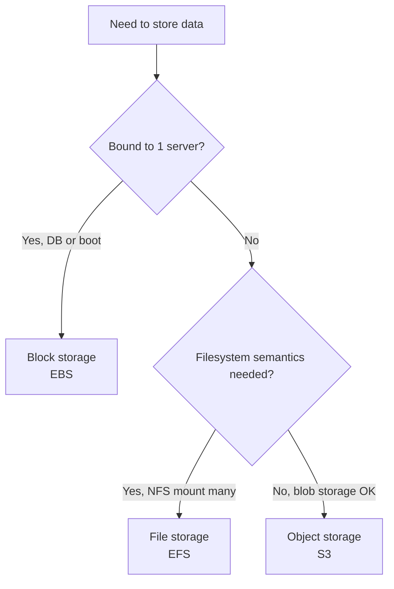

# 🎓 Cloud Storage + Databases — Chọn đúng nơi cất dữ liệu

> **Tác giả:** Mr.Rom\
> **Phiên bản:** v2.0.0\
> **Tạo lúc:** 24/05/2026\
> **Cập nhật:** 01/06/2026\
> **Level:** Basic\
> **Tags:** [MUST-KNOW]\
> **Yêu cầu trước:** [Cloud Networking — VPC, Subnets, Peering, VPN](02_cloud-networking.md), [PostgreSQL cơ bản](../../../../06_databases/postgresql/)

> 🎯 *Cloud cho bạn cả một siêu thị nơi cất dữ liệu — và chọn sai gian hàng là trả giá bằng tiền lẫn sự cố. Bài này dựng bản đồ đầy đủ: 3 kiểu storage (*block / object / file* — đĩa cứng, kho blob, ổ mạng), các họ database (*relational / NoSQL / cache / search / time-series*), cùng hàng đợi message. Với mỗi nhu cầu, bạn sẽ có một ma trận quyết định để biết nên gọi tới dịch vụ nào thay vì đoán mò.*

## 🎯 Sau bài này bạn sẽ

- [ ] Phân biệt **block / object / file storage** và biết mỗi loại dùng cho việc gì.
- [ ] Hiểu **S3** cùng các *storage class* và *lifecycle policy* để tối ưu chi phí.
- [ ] Biết khi nào chọn **EBS** (block) và khi nào chọn **EFS** (file).
- [ ] Nắm bản đồ **managed database**: RDS / Aurora / DynamoDB / Cloud SQL.
- [ ] Phân biệt **cache** (Redis, Memcached) với *CDN cache*.
- [ ] Biết khi nào cần **search engine** (OpenSearch, Algolia).
- [ ] Biết khi nào cần **time-series database** (Timestream, InfluxDB).
- [ ] Hiểu vai trò của **message queue** (SQS, SNS, EventBridge, Kafka MSK).

---

## Tình huống — App upload ảnh, lưu vào EBS, scale là vỡ

Hãy bắt đầu từ một lỗi mà rất nhiều người mới lên cloud đều vấp. Bạn có một app cho người dùng upload ảnh, kiến trúc ban đầu trông rất hợp lý:

- Một máy EC2 nhận ảnh upload rồi lưu thẳng vào ổ đĩa EBS gắn cùng máy đó.
- Tiến trình xử lý ảnh cũng đọc ngay từ ổ EBS đó ra.

Mọi thứ chạy ngon cho tới khi lượng truy cập tăng. Bạn thêm máy EC2 thứ hai để chia tải, và rắc rối ập đến:

- EC2 thứ hai **không đọc được** ảnh mà người dùng đã upload lên EC2 thứ nhất, vì mỗi ổ EBS chỉ gắn được vào đúng một máy.
- Bạn thử `rsync` thủ công ảnh giữa hai ổ — chậm và không kịp với tốc độ upload.
- Khách hàng báo lỗi: *"Ảnh em vừa đăng, lát sau xem lại thì mất tiêu."*

Một đồng nghiệp đi ngang, nhìn màn hình rồi nói gọn: *"EBS là block storage, mỗi ổ chỉ bám được một máy. Ảnh thì phải để object storage — S3 ấy. Mỗi loại storage sinh ra cho một việc khác nhau."*

→ Đúng vậy. Gốc rễ vấn đề không phải code sai, mà là chọn sai *loại* storage. Bài này sẽ đi qua từng loại để bạn không bao giờ vấp lại lỗi này.

---

## 1️⃣ Ba kiểu storage — Block, Object, File

Trước khi bàn tới dịch vụ cụ thể, cần phân biệt ba *kiểu* storage nền tảng. Cả ba đều cất dữ liệu, nhưng cách bạn truy cập và đặc tính của chúng khác hẳn nhau — chọn nhầm kiểu chính là lỗi trong tình huống mở đầu.

### Block storage — như ổ cứng cắm vào máy

**Block storage** là một ổ đĩa thô (*raw disk*) gắn trực tiếp vào một máy chủ, hệt như cái ổ cứng gắn ngoài bạn cắm vào laptop. Hệ điều hành nhìn thấy nó như một ổ đĩa thật, format rồi đọc/ghi file bình thường.

- **Cách truy cập:** qua *filesystem* — mount vào máy, đọc/ghi file như ổ đĩa local.
- **Hiệu năng:** độ trễ thấp, throughput cao.
- **Phạm vi gắn:** thường chỉ một máy chủ tại một thời điểm.
- **Đại diện:** AWS EBS, GCP Persistent Disk, Azure Managed Disk.

Dùng nó cho những việc cần một ổ đĩa thực sự gắn cứng vào máy:

- Lưu data file của database (ví dụ các file dữ liệu của PostgreSQL).
- Ổ boot chứa hệ điều hành.
- Lưu trữ của ứng dụng cần đúng nghĩa một filesystem cục bộ.

Điểm phải nhớ là các giới hạn của nó — cũng chính là thứ làm vỡ kiến trúc trong tình huống mở đầu:

- Bám chặt vào một AZ (*Availability Zone* — vùng khả dụng) duy nhất.
- Thường chỉ gắn được một máy (Multi-Attach EBS có nhưng rất hạn chế, nói ở phần sau).
- Trả tiền theo dung lượng đã cấp phát, kể cả khi ổ còn trống.

### Object storage — như kho hàng tra theo mã

**Object storage** là kho lưu các blob (khối dữ liệu bất kỳ) theo mô hình key-value. Bạn đưa một *key* (khóa), nó trả về *object* (dữ liệu) tương ứng — giống một kho hàng khổng lồ: đọc mã hàng là lấy được kiện hàng, không cần biết nó nằm ở kệ nào. Đây **không** phải filesystem.

- **Cách truy cập:** qua HTTP REST (PUT, GET, DELETE), gọi bằng SDK/CLI.
- **Hiệu năng:** độ trễ cao hơn block (cỡ 10-100ms mỗi request), nhưng throughput gần như không giới hạn khi chạy song song.
- **Phạm vi gắn:** không mount như ổ đĩa, truy cập từ bất kỳ đâu qua API.
- **Đại diện:** AWS S3, GCP GCS, Azure Blob, Cloudflare R2, MinIO.

Đây là lựa chọn cho khoảng 90% nhu cầu lưu trữ thông thường:

- Static asset (ảnh, video, JS bundle).
- Backup, archive.
- Data lake phục vụ phân tích.
- Dữ liệu cần truy cập từ nhiều region.

Sức mạnh của object storage nằm ở chỗ nó được thiết kế cho quy mô internet:

- **Mở rộng vô hạn** — không cần cấp phát trước dung lượng.
- **Trả tiền theo GB thực lưu** — không có chi phí "ổ trống nằm không".
- **Replicate đa region** sẵn có.
- **Độ bền cực cao** — *11 số 9* (99.999999999%), gần như không bao giờ mất dữ liệu.
- **Truy cập đa điểm** — từ bất kỳ máy nào, bất kỳ đâu.

### File storage — như ổ mạng dùng chung

**File storage** là một filesystem qua mạng (chuẩn NFS hoặc SMB), giống cái ổ NAS trong văn phòng mà cả phòng cùng mount và đọc/ghi. Khác block ở chỗ: nhiều máy mount **cùng lúc**.

- **Cách truy cập:** qua filesystem, mount đồng thời trên nhiều máy.
- **Hiệu năng:** độ trễ trung bình.
- **Phạm vi gắn:** nhiều máy chủ cùng lúc.
- **Đại diện:** AWS EFS (NFS), AWS FSx (Lustre, Windows), GCP Filestore.

Chỉ nên dùng khi bạn thật sự cần ngữ nghĩa filesystem chia sẻ:

- Nhiều EC2 cùng đọc/ghi một filesystem.
- App cũ (legacy) bắt buộc mount NFS mới chạy.
- Workspace dùng chung cho pipeline CI/CD.
- Dữ liệu huấn luyện ML chia sẻ giữa nhiều node.

Đổi lại, nó có cái giá của nó: đắt hơn object, chậm hơn block. Vì vậy chỉ chọn file storage khi *bắt buộc* phải có filesystem mount đồng thời.

### Ma trận quyết định

Ba kiểu storage phục vụ ba nhu cầu khác nhau, và quy tắc chọn rất gọn: cần bám cứng vào một máy (database, ổ boot) → **Block**; cần chia sẻ filesystem cho nhiều máy → **File**; còn lại (đa số trường hợp) → **Object**. Sơ đồ dưới giúp bạn ra quyết định chỉ trong vài câu hỏi:



Trong thực tế, phần lớn ứng dụng rơi vào tỉ lệ quen thuộc: ~90% dùng S3, ~10% dùng EBS (cho database), rất hiếm khi cần EFS. Nếu bạn thấy mình định dùng EFS, hãy tự hỏi lại liệu object storage có giải quyết được không trước đã.

🪞 **Ẩn dụ**:
- **Block** = ổ cứng cắm vào một máy tính cá nhân (một máy một ổ).
- **Object** = kho hàng (*warehouse*) — đưa mã hàng thì lấy được kiện hàng, không phải filesystem.
- **File** = ổ mạng NAS — cả phòng cùng mount và dùng chung.

---

## 2️⃣ S3 — Đào sâu object storage

S3 là dịch vụ object storage phổ biến nhất thế giới, và là nơi 90% dữ liệu của một app cloud điển hình sẽ nằm. Hiểu kỹ S3 nghĩa là hiểu phần lớn câu chuyện storage, nên ta sẽ mổ xẻ nó đầu tiên.

### Khái niệm nền

Hai khái niệm cốt lõi của S3 rất đơn giản. **Bucket** là container cấp cao nhất, có tên *duy nhất toàn cầu* (cả thế giới không được trùng). **Object** là dữ liệu kèm metadata, được định danh bằng một *key*.

Bốn lệnh dưới là toàn bộ những gì bạn cần để bắt đầu — tạo bucket, upload, liệt kê, xóa:

```bash
aws s3 mb s3://acme-images          # create bucket
aws s3 cp photo.jpg s3://acme-images/2026/photo.jpg
aws s3 ls s3://acme-images/2026/
aws s3 rm s3://acme-images/2026/photo.jpg
```

Mỗi object được truy cập qua một URL có dạng cố định, ghép từ tên bucket, region và key:

```text
https://acme-images.s3.us-east-1.amazonaws.com/2026/photo.jpg
```

### Storage class — các bậc giá theo tần suất truy cập

S3 không phải "một giá". AWS chia thành 7 *storage class* (bậc lưu trữ) theo tần suất truy cập — từ Standard ($0.023/GB, truy cập liên tục) xuống tới Deep Archive ($0.00099/GB, lấy ra mất tới 12 giờ). Dữ liệu một năm tuổi thường được đẩy xuống Glacier hoặc Deep Archive, tiết kiệm hơn 95% chi phí lưu trữ:

| Class | Use case | Cost/GB/month (US East) | Retrieval |
|---|---|---|---|
| **S3 Standard** | Hot data, frequent access | $0.023 | Free |
| **S3 Intelligent-Tiering** | Unknown access pattern | $0.023 + monitoring fee | Free |
| **S3 Standard-IA** (Infrequent Access) | Backup, monthly access | $0.0125 | $0.01/GB |
| **S3 One Zone-IA** | Less critical IA | $0.01 | $0.01/GB |
| **S3 Glacier Instant Retrieval** | Archive, quarterly access | $0.004 | $0.03/GB |
| **S3 Glacier Flexible Retrieval** | Archive, hours retrieval | $0.0036 | $0.03/GB |
| **S3 Glacier Deep Archive** | Long-term archive, 12h retrieval | $0.00099 | $0.02/GB |

Điểm mấu chốt: chênh lệch giữa bậc đắt nhất và rẻ nhất là hơn 20 lần. Bạn không phải chuyển bậc thủ công — chỉ cần đặt một **lifecycle policy** để S3 tự đẩy object cũ xuống bậc rẻ hơn theo tuổi:

```json
{
  "Rules": [{
    "Status": "Enabled",
    "Transitions": [
      { "Days": 30, "StorageClass": "STANDARD_IA" },
      { "Days": 90, "StorageClass": "GLACIER_IR" },
      { "Days": 365, "StorageClass": "DEEP_ARCHIVE" }
    ]
  }]
}
```

### Durability so với availability

Hai con số dễ bị nhầm là nhau, nhưng chúng đo hai thứ khác hẳn. **Durability** (độ bền) là xác suất dữ liệu *không bị mất*; **availability** (độ sẵn sàng) là xác suất bạn *truy cập được* tại một thời điểm.

- **Durability** của S3 Standard: **99.999999999%** (11 số 9) — trung bình cứ 10 tỷ object mới mất 1 object mỗi năm.
- **Availability** của S3 Standard: **99.99%** — tương đương khoảng 52 phút không truy cập được mỗi năm.

Nói cách khác, S3 gần như không bao giờ làm mất dữ liệu của bạn; thỉnh thoảng có thể tạm thời không gọi tới được, nhưng dữ liệu vẫn nguyên. Đây là mức durability cao nhất trong các dịch vụ lưu trữ thương mại hiện có.

### Mã hóa (Encryption)

S3 hỗ trợ 4 cơ chế mã hóa *at-rest* (lúc lưu trên đĩa), khác nhau ở chỗ **ai giữ key**. SSE-S3 đơn giản nhất (AWS quản key, là mặc định từ 2026). SSE-KMS bổ sung audit log và policy truy cập theo từng key — production thường chọn cái này cho dữ liệu nhạy cảm. Client-side là mức cao nhất: bạn mã hóa trước khi upload nên AWS không bao giờ thấy plaintext:

- **SSE-S3:** AWS giữ và quản key (mặc định 2026, miễn phí).
- **SSE-KMS:** dùng customer managed key qua KMS (mô hình BYOK, có audit log).
- **SSE-C:** bạn tự cung cấp key (bạn tự quản).
- **Client-side encryption:** mã hóa ngay trên máy bạn trước khi upload.

Với dữ liệu nhạy cảm, lựa chọn mặc định hợp lý là SSE-KMS vì có thêm audit log và kiểm soát truy cập theo từng key.

### S3 không chỉ là chỗ chứa file

S3 còn cả một bộ tính năng đi kèm, biến nó từ "ổ chứa file" thành nền tảng phục vụ nhiều pattern khác nhau. Dưới đây là những tính năng bạn sẽ gặp thường xuyên nhất:

- **Versioning:** giữ nhiều phiên bản của cùng một object, lỡ ghi đè hay xóa nhầm thì rollback được.
- **Object lock:** ghi-một-lần-đọc-nhiều-lần (*WORM*) — phục vụ yêu cầu compliance, dữ liệu không sửa/xóa được trong thời hạn đặt ra.
- **Cross-region replication (CRR):** tự động sao chép sang region khác, phục vụ DR (*disaster recovery* — khôi phục sau thảm họa).
- **Event notification:** mỗi khi có object upload lên, kích hoạt một Lambda xử lý.
- **Presigned URL:** tạo link truy cập tạm thời, hết hạn tự khóa — chia sẻ mà không cần cấp IAM.
- **Static website hosting:** serve thẳng file HTML từ bucket như một web tĩnh.
- **S3 Select:** chạy câu SQL ngay trên object (CSV, JSON, Parquet) mà không cần tải cả file về.

### S3 và các lựa chọn thay thế

S3 không độc quyền object storage — nhiều nhà cung cấp khác đưa ra **API tương thích S3**, nên đổi backend khá dễ. Khác biệt thực sự nằm ở giá *egress* (phí kéo dữ liệu ra) và độ phủ region. Đáng chú ý nhất là **Cloudflare R2**: giá lưu trữ ngang S3 nhưng **không tính phí egress** — rất hợp với workload phục vụ nhiều bandwidth:

| Service | Equivalent | Notes |
|---|---|---|
| AWS S3 | — | Market leader, most features |
| GCP GCS | S3-compatible | Strong with BigQuery integration |
| Azure Blob | similar | Hot/Cool/Archive tiers |
| **Cloudflare R2** | S3-compatible, **zero egress** | Great for bandwidth-heavy |
| MinIO | S3-compatible self-host | On-prem, K8s native |
| Backblaze B2 | cheap S3-compatible | $0.005/GB, $0.01 egress |

Quy tắc chọn: workload kéo data ra nhiều → R2; mặc định an toàn → S3; cần tự host on-prem → MinIO.

### Bất ngờ về chi phí S3

Đây là chỗ hóa đơn cuối tháng hay làm người ta giật mình. Tiền *lưu trữ* thường rất rẻ, nhưng tiền *kéo dữ liệu ra* (egress) và *số lượng request* mới là phần dễ vượt dự tính:

```text
1TB data stored: $23/month
But...
1TB egress: $90/month
1M GET requests: $0.40
1M PUT requests: $5

Total real cost: depends on access pattern.
```

→ Egress gần như luôn là khoản gây bất ngờ lớn nhất. Đặt một CDN (như CloudFront) trước S3 sẽ cache nội dung ở biên, giảm mạnh lượng egress phải trả — chi tiết ở phần cạm bẫy phía dưới.

---

## 3️⃣ EBS — Đào sâu block storage

Quay lại block storage — đây là nơi database của bạn thực sự cất các file dữ liệu. EBS (Elastic Block Store) là dịch vụ block storage của AWS, và chọn đúng loại volume cho EBS ảnh hưởng trực tiếp tới cả hiệu năng lẫn hóa đơn.

### Các loại EBS volume

EBS có nhiều loại volume, khác nhau ở IOPS (số thao tác đọc/ghi mỗi giây), throughput và giá. Bảng dưới giúp bạn chọn nhanh theo nhu cầu:

| Type | Use case | IOPS | Throughput |
|---|---|---|---|
| **gp3** (general purpose SSD) | Default 2026, cheap, customizable IOPS | 3,000-16,000 | 125-1000 MB/s |
| **gp2** (older) | Same use case, throughput tied to size | 100-16,000 | 128-250 MB/s |
| **io2 Block Express** | High-performance DB | up to 256,000 | 4000 MB/s |
| **st1** (HDD) | Big sequential workload, throughput-focused | — | 500 MB/s |
| **sc1** (cold HDD) | Cold data, cheapest | — | 250 MB/s |

Quy tắc gọn: **gp3** cho hầu hết trường hợp (mặc định 2026, rẻ, IOPS tùy chỉnh được độc lập với dung lượng); **io2** cho database cần hiệu năng cao; **st1/sc1** cho workload tuần tự lớn, ưu tiên throughput và chi phí thấp.

### Chi phí (us-east-1)

Giá EBS không chỉ tính theo dung lượng mà còn theo IOPS và throughput cấp thêm. Hai dòng dưới cho thấy công thức:

- gp3: $0.08/GB/month dung lượng + $0.005/IOPS-month cho phần vượt 3000 IOPS + $0.04/MB/s-month cho phần vượt 125 MB/s.
- io2: $0.125/GB/month + $0.065/IOPS-month.

Khác biệt rõ nhất khi đẩy IOPS lên cao: 100GB gp3 mặc định chỉ $8/month, nhưng 100GB io2 cấu hình 10.000 IOPS lên tới $662.50/month. Đừng bật io2 IOPS cao nếu workload không thực sự cần — đó là một trong những khoản phí EBS dễ phình to.

### EBS snapshot

Snapshot là cách backup một EBS volume. Chỉ một lệnh là tạo được:

```bash
aws ec2 create-snapshot --volume-id vol-abc --description "Daily backup"
```

Cơ chế của snapshot có vài điểm đáng chú ý, giải thích vì sao nó vừa rẻ vừa bền:

- **Incremental:** chỉ lưu các block đã thay đổi kể từ snapshot trước, không sao chép lại toàn bộ.
- **Lưu trên S3** (do AWS quản, bạn không thấy bucket) → thừa hưởng độ bền của S3.
- **Cross-region copy:** sao chép sang region khác để phục vụ DR.
- **Chi phí:** $0.05/GB/month — rẻ hơn EBS đang hoạt động.

Một chiến lược snapshot điển hình giữ nhiều mốc theo thời gian, càng cũ càng thưa:

- Snapshot hàng ngày, giữ 7 ngày.
- Snapshot hàng tuần, giữ 4 tuần.
- Snapshot hàng tháng, giữ 1 năm.

Để khỏi phải tự viết cron, hãy dùng **AWS Backup** để tự động hóa toàn bộ lịch snapshot này.

### EBS Multi-Attach

Còn một ngoại lệ với quy tắc "một ổ một máy" đã nói ở phần 1. Volume io1/io2 hỗ trợ **Multi-Attach** — gắn cùng lúc vào tối đa 16 instance ở chế độ đọc-ghi, hoạt động giống một SAN.

Đây là tính năng phục vụ trường hợp rất đặc thù: storage dùng chung cho *clustered filesystem* (như GFS, Lustre). Nhưng nó có giới hạn lớn — filesystem phải hỗ trợ ghi đồng thời an toàn, mà loại filesystem này khá hiếm.

→ Nói cách khác, Multi-Attach là trường hợp hiếm gặp. Nếu chỉ cần nhiều máy cùng đọc/ghi file chung, EFS đơn giản hơn nhiều.

---

## 4️⃣ Managed database — Họ relational

Storage là nơi cất byte thô; còn dữ liệu *có cấu trúc* thì cần database. Bắt đầu từ họ quen thuộc nhất: relational database (SQL). Cloud cho phép bạn để AWS lo phần vận hành nặng nhọc thông qua dịch vụ *managed*.

### RDS (Relational Database Service)

RDS là dịch vụ database quản lý của AWS, hỗ trợ hầu hết engine relational phổ biến:

- **PostgreSQL** — engine open source phổ biến nhất hiện nay.
- **MySQL**, **MariaDB** — cũng là OSS thông dụng.
- **Oracle**, **SQL Server** — engine thương mại.
- **Aurora** — engine độc quyền của AWS, tương thích MySQL/Postgres (nói riêng ở dưới).

Cái hay của managed là RDS gánh hộ bạn phần lớn việc vận hành — những thứ mà tự làm trên server trần sẽ ngốn rất nhiều thời gian:

- Provisioning (cấp phát hạ tầng).
- Patch OS.
- Nâng cấp engine database.
- Backup tự động (snapshot hàng ngày + transaction log).
- Failover khi sự cố (chế độ Multi-AZ).
- Read replica (bản sao chỉ-đọc).
- Monitoring và metrics.
- Mã hóa at-rest (qua KMS) và in-transit (qua TLS).

Đổi lại, bạn vẫn phải lo phần logic ứng dụng — RDS không thay bạn thiết kế dữ liệu được:

- Thiết kế schema.
- Tối ưu query.
- Quản lý connection.
- Các vấn đề ở tầng ứng dụng.

### RDS so với tự dựng Postgres trên EC2

Câu hỏi thường gặp: tại sao không tự cài Postgres lên một EC2 cho rẻ? Bảng dưới đặt hai cách cạnh nhau để thấy cái giá thật của việc "tự làm":

| Aspect | DIY on EC2 | RDS |
|---|---|---|
| Setup | Hours-days | Minutes |
| Patching | Manual | Auto (windows configurable) |
| Backup | Custom script + S3 | Built-in, point-in-time |
| Multi-AZ | Custom replication | Single setting |
| Read replicas | Manual | Single API call |
| Monitoring | Custom Prometheus | CloudWatch built-in |
| Cost | EC2 + EBS + your time | RDS premium (~30% more) |
| Flexibility | Full control | RDS API limits |

→ Kết luận: hãy dùng RDS, *trừ khi* bạn có nhu cầu thật đặc thù — cần extension tùy chỉnh, cần toàn quyền kiểm soát, hoặc cần ép chi phí xuống cực thấp. Khoản "~30% đắt hơn" của RDS thường rẻ hơn nhiều so với thời gian bạn bỏ ra tự vận hành.

### Aurora — engine độc quyền của AWS

Aurora là kết quả của việc AWS viết lại tầng storage của MySQL/Postgres để chạy cloud-native. Những con số AWS công bố cho thấy lợi thế của nó:

- Nhanh **gấp ~6 lần** RDS Postgres (theo công bố của AWS).
- Storage **tự co giãn** từ 10GB đến 128TB.
- Tối đa **15 read replica** trải trên nhiều AZ.
- **Aurora Serverless:** trả tiền theo ACU-giây khi hoạt động, rảnh thì co về 0.
- **Global Database:** replicate cross-region với độ trễ dưới 1 giây.

Aurora đáng giá khi bạn có một trong các nhu cầu sau:

- OLTP lưu lượng cao.
- Cần từ 5 read replica trở lên.
- Muốn HA (*high availability* — sẵn sàng cao) kiểu cloud-native.

Về chi phí, Aurora đắt hơn RDS khoảng 20%, nhưng phần hiệu năng tăng thêm thường bù lại được khoản chênh này.

### Cloud SQL (GCP)

Bên GCP, Cloud SQL đóng vai trò tương đương RDS:

- Hỗ trợ PostgreSQL, MySQL, SQL Server.
- Tích hợp sẵn với các dịch vụ GCP.
- Cloud Spanner là một sản phẩm *khác* — database giao dịch phân tán toàn cầu.

### Azure SQL

Bên Azure, SQL Server là át chủ bài và có nhiều biến thể:

- Azure SQL Database (bản managed).
- Azure SQL Managed Instance (đầy đủ tính năng SQL Server).
- Hyperscale (storage co giãn tách biệt khỏi compute).

---

## 5️⃣ NoSQL database — Quản lý trên cloud

Relational database mạnh ở ACID và schema chặt chẽ, nhưng không phải bài toán nào cũng hợp. NoSQL là họ database đánh đổi một số ràng buộc để lấy quy mô và sự linh hoạt.

### Vì sao cần NoSQL

NoSQL không phải một thứ duy nhất, mà là nhiều mô hình dữ liệu khác nhau, mỗi mô hình tối ưu cho một kiểu truy cập:

- **Key-value** (Redis, DynamoDB): tra cứu O(1), đơn giản, cực nhanh.
- **Document** (MongoDB, DynamoDB): lưu kiểu JSON, schema linh hoạt.
- **Column-family** (Cassandra, DynamoDB): bảng rất rộng, nhiều cột.
- **Graph** (Neo4j, Neptune): biểu diễn các mối quan hệ.

### DynamoDB (AWS)

DynamoDB là database key-value và document của AWS, sinh ra để chạy ở quy mô cực lớn mà không cần tinh chỉnh:

- Độ trễ một-chữ-số mili-giây ở mọi quy mô.
- Tự co giãn.
- **Global Tables:** triển khai đa region.
- Tính tiền theo *pay-per-request* hoặc *provisioned capacity* (cấp phát trước).

Nó hợp với các bài toán có pattern truy cập rõ ràng và cần tốc độ:

- User profile, session storage.
- Giỏ hàng (shopping cart).
- Bảng xếp hạng game (leaderboard).
- Dữ liệu IoT.

Nhưng DynamoDB có những ràng buộc bạn phải biết trước, nếu không sẽ vấp:

- Mỗi item tối đa 400KB.
- Pattern truy vấn phải được thiết kế từ đầu — không có SQL linh hoạt để query bừa.
- Chi phí có thể vọt lên nếu pattern truy cập thiết kế sai.

Giá tham khảo năm 2026 để bạn hình dung:

- On-demand: $1.25 cho mỗi triệu write request.
- Provisioned: $0.65 mỗi WCU-giờ (*Write Capacity Unit*).

### MongoDB Atlas, Firestore, Cosmos DB

Ngoài DynamoDB, còn vài lựa chọn managed NoSQL đáng biết:

- **MongoDB Atlas:** MongoDB được quản lý, chạy đa cloud.
- **GCP Firestore:** document database có đồng bộ realtime.
- **Azure Cosmos DB:** đa mô hình (document, key-value, graph, column trong một sản phẩm).

### Quyết định: chọn NoSQL nào?

Với từng nhu cầu cụ thể, dưới đây là gợi ý nhanh để bạn không phải so sánh từng dịch vụ một:

| Use case | Recommend |
|---|---|
| Simple key-value, low latency | Redis (cache) or DynamoDB (durable) |
| Flexible schema, querying | MongoDB |
| Realtime sync mobile | Firebase Firestore |
| Multi-model needs | Cosmos DB |
| Massive scale eventual consistency | DynamoDB |
| Graph relationships | Neptune (AWS) or Neo4j |

---

## 6️⃣ Cache — Redis, Memcached

Database là nguồn sự thật, nhưng truy vấn nó nhiều lần cho cùng một dữ liệu là lãng phí. Cache là lớp đệm tốc độ cao đặt trước database để trả lời nhanh những câu hỏi lặp đi lặp lại.

### Vì sao cần cache

Con số nói lên tất cả — chênh lệch tốc độ giữa đọc từ database và đọc từ cache là rất lớn:

- Một query database: 10-100ms.
- Một cache hit (lấy được từ cache): 0.1-1ms.

→ Nhanh hơn cỡ 100 lần. Cache vừa giảm tải cho database, vừa cải thiện độ trễ mà người dùng cảm nhận.

### Redis so với Memcached

Hai cache engine phổ biến nhất là Redis và Memcached. Chúng khác nhau khá nhiều về khả năng, không chỉ là "cái nào nhanh hơn":

| Aspect | Redis | Memcached |
|---|---|---|
| Data structures | Strings, lists, sets, hashes, sorted sets, streams | Strings only |
| Persistence | Optional (RDB, AOF) | None |
| Replication | Yes | No |
| Cluster | Yes (Redis Cluster) | Client-side sharding |
| Use cases | Cache + queue + pub/sub + leaderboard | Pure cache |

→ Redis là lựa chọn mặc định năm 2026 vì làm được nhiều việc hơn hẳn (cache, queue, pub/sub, leaderboard). Memcached chỉ còn hợp với hệ thống cũ hoặc vài tình huống thuần cache rất đặc thù.

### Bản managed: ElastiCache, Memorystore, Azure Cache

Cả ba cloud lớn đều có dịch vụ Redis/Memcached managed (AWS ElastiCache, GCP Memorystore, Azure Cache). Lệnh dưới dựng một Redis cluster 3 node trên ElastiCache:

```bash
aws elasticache create-replication-group \
  --replication-group-id my-redis \
  --engine redis \
  --num-cache-clusters 3 \
  --cache-node-type cache.t3.medium
```

Về chi phí, một node cache.t3.medium tốn khoảng $50/month — khá phải chăng so với lợi ích giảm tải database.

### Các pattern cache

Có cache thì phải có chiến lược đọc/ghi qua nó. Phổ biến nhất là **cache-aside**: đọc thử từ cache trước, trượt thì xuống database rồi nạp lại vào cache:

```python
def get_user(user_id):
    cached = redis.get(f"user:{user_id}")
    if cached:
        return cached
    
    user = db.query("SELECT * FROM users WHERE id = ?", user_id)
    redis.setex(f"user:{user_id}", 3600, user)   # cache 1h
    return user
```

Ngoài cache-aside còn vài pattern khác, mỗi cái đánh đổi khác nhau giữa độ tươi của dữ liệu và tốc độ ghi:

- **Write-through:** ghi đồng thời vào cả cache lẫn database → cache luôn tươi nhưng ghi chậm hơn.
- **Write-behind:** ghi vào cache ngay, đẩy xuống database sau (bất đồng bộ) → ghi cực nhanh nhưng có rủi ro mất dữ liệu nếu cache sập.

Dù dùng pattern nào, **TTL** (*time-to-live* — thời hạn sống của một key cache) cũng cực kỳ quan trọng: đặt sai là dữ liệu cũ (*stale*) phục vụ người dùng. Phần Self-check Q5 sẽ đào sâu trade-off giữa các pattern này.

---

## 7️⃣ Search — OpenSearch, Algolia

Database trả lời tốt câu hỏi "lấy bản ghi có id = X", nhưng đuối khi gặp "tìm mọi sản phẩm có chữ 'áo khoác mùa đông' trong mô tả". Đó là lúc cần search engine chuyên dụng.

### Full-text search

PostgreSQL có `tsvector` để full-text search, nhưng đuối khi quy mô lớn. Các search engine chuyên dụng giải quyết bài toán này tốt hơn nhiều:

- **Elasticsearch / OpenSearch** (bản AWS managed là OpenSearch Service).
- **Algolia:** dạng SaaS, rất nhanh nhưng đắt.
- **Meilisearch:** OSS hiện đại.
- **Typesense:** OSS hiện đại.

### Use case

Search engine xuất hiện ở nhiều chỗ hơn bạn nghĩ:

- Tìm kiếm sản phẩm (e-commerce).
- Tìm kiếm trong log (stack ELK, Loki).
- Full-text search trong app.
- Gợi ý tự động (autocomplete).

### Algolia so với OpenSearch

Hai cái tên hay được cân nhắc là Algolia và OpenSearch, đại diện cho hai triết lý khác nhau — trả tiền để khỏe so với tự chủ và rẻ:

| Algolia | OpenSearch |
|---|---|
| SaaS, hosted | Self-host or AWS managed |
| Best DX, fast | More control |
| Expensive ($10K+/year easily) | Cheaper (compute + storage) |
| 50ms search globally | Faster but need tuning |

→ Chọn Algolia cho app tìm kiếm hướng người dùng cuối (B2C) cần trải nghiệm mượt ngay; chọn OpenSearch khi cần phân tích log và sự linh hoạt với chi phí hợp lý.

### Pattern lai: Postgres + Search

Trong thực tế, ít ai bỏ hẳn database để chuyển sang search engine. Pattern phổ biến năm 2026 là dùng cả hai, mỗi cái làm đúng việc của nó:

- **Nguồn sự thật** đặt ở Postgres (ACID, dữ liệu chuẩn).
- **Search index** đặt ở OpenSearch.
- **Đồng bộ** giữa hai bên qua CDC (*Change Data Capture*, ví dụ Debezium) hoặc app ghi đồng thời (*double-write*).

→ Cách này lấy được điểm mạnh của cả hai: ACID của Postgres và sức tìm kiếm của OpenSearch.

---

## 8️⃣ Time-series database

Có một loại dữ liệu mà cả relational lẫn NoSQL thông thường đều xử lý kém hiệu quả: dữ liệu gắn theo thời gian. Time-series database sinh ra riêng cho hình thù dữ liệu này.

### Vì sao cần time-series

Metric, IoT, log, dữ liệu tài chính... có chung một hình thù đặc biệt khiến chúng cần một loại database riêng:

- Chỉ ghi thêm (*append-only*), gần như không sửa dữ liệu cũ.
- Truy vấn theo khoảng thời gian.
- Tổng hợp (*aggregation*) — ví dụ trung bình mỗi phút.
- Giảm độ phân giải dữ liệu cũ (*downsampling*).

### Các lựa chọn

Có vài lựa chọn time-series database tùy theo bạn muốn managed hay tự host, và đã quen công cụ nào:

- **AWS Timestream:** bản managed.
- **InfluxDB** (bản Cloud hoặc OSS).
- **TimescaleDB** (extension của Postgres).
- **Prometheus** (cho metric, lưu ngắn hạn).
- **VictoriaMetrics** (giải pháp thay Prometheus).

Mỗi cái mạnh ở một mảng:

- Metric ứng dụng → Prometheus là mặc định.
- Dữ liệu cảm biến IoT.
- Giao dịch tài chính.
- Giám sát máy chủ.

### TimescaleDB

Nếu team đã quen Postgres thì TimescaleDB là lựa chọn dễ vào nhất — nó là extension biến Postgres thành time-series, nên bạn viết SQL như bình thường:

```sql
SELECT time_bucket('1 hour', timestamp) AS hour,
       avg(cpu_usage)
FROM metrics
WHERE timestamp > NOW() - INTERVAL '1 day'
GROUP BY hour;
```

→ Hàm `time_bucket` gom dữ liệu theo từng giờ — việc mà SQL thuần làm rất vất vả. Vì vẫn là Postgres, bạn không phải học công cụ mới.

---

## 9️⃣ Message queue + Event streaming

Mảnh ghép cuối của bức tranh dữ liệu không phải nơi *cất* dữ liệu, mà là nơi *chuyển* dữ liệu giữa các thành phần một cách bất đồng bộ. Đó là message queue và event streaming.

### Vì sao cần queue

Tại sao không gọi thẳng từ thành phần này sang thành phần kia? Vì queue giải quyết ba vấn đề mà gọi trực tiếp không làm được:

- **Xử lý bất đồng bộ:** đơn hàng được đặt → đẩy vào queue → worker xử lý sau, người dùng không phải chờ.
- **Tách rời (decoupling):** bên gửi (*producer*) và bên nhận (*consumer*) độc lập, một bên đổi không làm bên kia hỏng.
- **Đệm (buffering):** khi tải đột biến, queue hứng bớt để consumer không bị quá tải.

### Các dịch vụ queue trên cloud

AWS có vài dịch vụ messaging, mỗi cái cho một kiểu giao tiếp khác nhau:

**SQS** (Simple Queue Service):

- Standard queue: *at-least-once* (ít nhất một lần), thứ tự gần đúng.
- FIFO queue: *exactly-once* (đúng một lần), thứ tự nghiêm ngặt.
- Giá $0.40 mỗi triệu request.

**SNS** (Simple Notification Service):

- Pub/sub: một publisher → nhiều subscriber.
- Fan-out: SNS → nhiều SQS cùng nhận.

**EventBridge** (event bus):

- Nhiều tính năng hơn: khớp pattern, schema registry.
- Tích hợp với các SaaS bên ngoài (sự kiện từ Stripe, GitHub...).

### Streaming — Kafka

Khi nhu cầu không chỉ là "gửi message rồi quên" mà là "ghi lại cả dòng sự kiện để phát lại được", bạn bước sang địa hạt event streaming. Kafka là cái tên đầu bảng, và có vài lựa chọn managed:

- **AWS MSK:** Kafka managed.
- **Confluent Cloud:** Kafka dạng SaaS.
- **Kinesis Data Streams:** giải pháp cây nhà lá vườn của AWS.
- **GCP Pub/Sub:** tương đương bên GCP.

Streaming hợp với các bài toán cần lưu lại và phát lại dòng sự kiện:

- Event sourcing.
- Tổng hợp log.
- Phân tích thời gian thực.

### SQS so với Kafka

Câu hỏi hay gặp: SQS hay Kafka? Hai thứ này khác nhau về bản chất, không phải cái nào "tốt hơn" — bảng dưới cho thấy chúng giải bài toán khác nhau:

| Aspect | SQS | Kafka |
|---|---|---|
| Model | Pull queue | Pub-sub log |
| Ordering | FIFO only | Per-partition |
| Replay | No (1 consumer takes message) | Yes (offset rewind) |
| Throughput | High | Very high (millions/sec) |
| Latency | 10-100ms | 1-10ms |
| Use case | Task queue | Event stream |

→ Điểm phân biệt mấu chốt là khả năng *replay*: SQS lấy message ra là mất, hợp cho task queue đơn giản; Kafka giữ cả dòng sự kiện và tua lại được, hợp cho kiến trúc hướng sự kiện và log streaming.

---

## 🔟 Hands-on: Thiết kế storage + DB cho app e-commerce FastAPI

Đã có đủ "nguyên liệu", giờ ghép lại thành một kiến trúc thật. Bài toán: thiết kế lớp dữ liệu cho một app e-commerce viết bằng FastAPI, ánh xạ từng nhu cầu sang đúng dịch vụ đã học.

### Yêu cầu

App cần phục vụ các nhu cầu sau, mỗi nhu cầu sẽ kéo theo một lựa chọn storage/DB khác nhau:

- Tài khoản người dùng.
- Danh mục sản phẩm (catalog).
- Đơn hàng.
- Ảnh sản phẩm.
- Tìm kiếm sản phẩm.
- Cache sản phẩm xem gần đây.

### Thiết kế

Sơ đồ dưới cho thấy cách FastAPI nằm trong subnet riêng và gọi tới từng dịch vụ dữ liệu chuyên trách — mỗi nhánh là một quyết định ta đã bàn ở các phần trên:

```text
┌─────────────────────────────────────────┐
│ Load Balancer (Public)                  │
└────────────┬────────────────────────────┘
             ↓
        ┌────────┐
        │ FastAPI│ (private subnet)
        └────┬───┘
             ↓
   ┌─────────┼─────────┬───────────┬───────────┐
   ↓         ↓         ↓           ↓           ↓
 RDS Postgres  ElastiCache  OpenSearch  S3 (images)  SQS (orders)
 (users, orders) (Redis cache) (search)
```

### Danh sách tài nguyên

Đây là bảng ánh xạ từng thành phần sang dịch vụ, kèm lý do — chính là phần "giải thích vì sao" mà bạn nên trình bày được trong một buổi thiết kế thật:

| Component | Service | Reason |
|---|---|---|
| User data | RDS Postgres (db.t3.medium, Multi-AZ) | ACID, relations |
| Product catalog | RDS Postgres + OpenSearch sync | SQL + search |
| Orders | RDS Postgres | ACID critical |
| Product images | S3 + CloudFront | Object storage, CDN |
| Recent cache | ElastiCache Redis (cache.t3.small) | Hot data fast access |
| Search index | OpenSearch (small instance) | Full-text |
| Order processing | SQS standard | Async worker |
| Image upload events | SQS → Lambda → resize | Event-driven |

### Ước tính chi phí (ap-southeast-1, quy mô nhỏ)

Cuối cùng là phần khiến mọi thiết kế trở nên thực tế — chi phí. Với quy mô nhỏ ở region Singapore, các khoản gộp lại như sau:

- RDS db.t3.medium Multi-AZ: ~$130/month.
- ElastiCache cache.t3.small: ~$45/month.
- OpenSearch t3.small.search 1 node: ~$60/month.
- S3 (100GB) + CloudFront (100GB): ~$10/month.
- SQS: free tier đủ cho workload nhỏ.
- **Tổng storage + DB:** ~$245/month.

→ Khoảng $250/month là đủ cho một lớp dữ liệu mức production, chưa tính phần compute (EC2/Lambda). Một con số rất dễ chấp nhận đổi lấy độ bền và khả năng mở rộng đã bàn xuyên suốt bài.

---

## 💡 Cạm bẫy thường gặp & Best practice

### ❌ Cạm bẫy: Để ảnh trong EBS thay vì S3

Đây chính là lỗi của tình huống mở đầu: EBS bám một EC2, không scale được, lại đắt theo GB.

→ **Fix:** dùng S3 cho object storage. EBS chỉ dành cho database.

### ❌ Cạm bẫy: Đọc read-replica mà quên độ trễ replication

App ghi xuống primary rồi đọc lại ngay từ read replica → replica chưa kịp đồng bộ → người dùng vừa ghi xong không thấy dữ liệu của mình → bối rối.

→ **Fix:**
- Read-your-writes: đọc từ primary trong vài giây ngay sau khi ghi.
- Hoặc định tuyến ở tầng ứng dụng.

### ❌ Cạm bẫy: Dùng RDS db.t3.micro cho production

Lớp T (burstable) chạy bằng CPU credit. Hết credit → database chậm → kéo theo sụp đổ dây chuyền (*cascade failure*).

→ **Fix:** dùng db.m5/m6 (hiệu năng ổn định) hoặc db.r5 (tối ưu bộ nhớ) cho production. Lớp T chỉ để cho dev/staging.

### ❌ Cạm bẫy: DynamoDB không lập kế hoạch capacity

Chế độ provisioned + lưu lượng đột biến → bị *throttling* (chặn bớt request).

→ **Fix:**
- On-demand cho tải khó đoán.
- Provisioned + auto-scaling cho tải đoán được.
- DAX cache cho các key nóng.

### ❌ Cạm bẫy: TTL cache quá dài

Dữ liệu cũ (*stale*) còn phục vụ tới 24 giờ sau khi đã cập nhật.

→ **Fix:**
- Đặt TTL theo loại dữ liệu (5 phút cho sản phẩm, 1 giờ cho user).
- Chủ động xóa cache (*invalidate*) ngay khi ghi.

### ❌ Cạm bẫy: Bất ngờ chi phí egress từ S3

App serve URL S3 thẳng cho người dùng → 1TB egress = $90/month.

→ **Fix:**
- Đặt CloudFront trước S3 (egress rẻ hơn và nhanh hơn).
- Hoặc dùng Cloudflare R2 (zero egress).

### ❌ Cạm bẫy: Multi-AZ "cho có"

Bật RDS Multi-AZ nhưng chưa bao giờ thử failover thật → tới lúc sự cố mới biết nó không hoạt động như kỳ vọng.

→ **Fix:** diễn tập failover định kỳ trên môi trường staging.

### ✅ Best practice: Chọn đúng storage tier ngay từ đầu

Lên kế hoạch lifecycle cho object ngay từ ngày đầu, thay vì để dữ liệu nằm mãi ở Standard:

- Upload mới: S3 Standard.
- Sau 30 ngày: Intelligent-Tiering (tự chuyển bậc).
- Trên 1 năm: Glacier.
- Log sau 90 ngày: Deep Archive (nếu buộc phải giữ vì compliance).

→ Rà soát lại storage class định kỳ để không trả tiền oan.

### ✅ Best practice: Gắn tag cho tài nguyên để bóc tách chi phí

Gắn tag nhất quán cho mọi tài nguyên giúp bạn biết tiền đang chảy vào đâu:

```hcl
tags = {
  Environment = "prod"
  Service     = "checkout"
  Team        = "payments"
  CostCenter  = "engineering"
}
```

→ Cost Explorer lọc được chi phí theo tag.

### ✅ Best practice: Mã hóa mọi thứ

Bật mã hóa ở mọi tầng — đây là mức nền tảng về bảo mật và compliance, gần như không tốn thêm chi phí:

- S3: mặc định SSE-KMS.
- EBS: bật mã hóa at-rest.
- RDS: bật mã hóa at-rest.
- TLS cho dữ liệu in-transit.

→ Đáp ứng compliance và là baseline bảo mật.

---

## 🧠 Tự kiểm tra (Self-check)

**Q1.** Block vs object vs file storage — ra quyết định nhanh thế nào?

<details>
<summary>💡 Đáp án</summary>

**Block (EBS, GCP PD):**
- Hành xử như một ổ đĩa, mỗi lần một máy.
- **Dùng cho:** data file của database, ổ boot OS, app cần filesystem cục bộ.
- Từ khóa: "cần filesystem trên một host duy nhất."

**Object (S3, GCS, R2):**
- Chỉ truy cập qua API (PUT/GET). Không phải filesystem.
- **Dùng cho:** ảnh/video, backup, data lake, mọi thứ cần truy cập từ nhiều máy.
- Từ khóa: "blob truy cập từ bất kỳ đâu qua API."

**File (EFS, FSx, Filestore):**
- Filesystem kiểu NFS mount được trên nhiều máy.
- **Dùng cho:** app NFS cũ, workspace dùng chung, dữ liệu huấn luyện ML.
- Từ khóa: "filesystem nhiều máy dùng chung."

**Phép thử nhanh:**
- "Cần lưu file dữ liệu của database." → Block.
- "Cần lưu ảnh cho website." → Object.
- "App cũ mount /shared rồi ghi file vào đó." → File.

**Đa số app năm 2026:**
- 70% S3 (object).
- 25% EBS (block cho database).
- 5% EFS (file cho app cũ hoặc ML).

**Anti-pattern:**
- Ảnh để trên EBS → không scale được.
- Database để trên S3 → S3 không phải filesystem.
- Static asset để trên EFS → quá đắt.

→ Chọn theo pattern truy cập, đừng chọn theo cái mình quen.
</details>

**Q2.** Chiến lược storage class của S3 — khi nào dùng bậc nào?

<details>
<summary>💡 Đáp án</summary>

**Các bậc theo lifecycle:**

**Standard** ($0.023/GB):
- Ngày 0-30: hot data, truy cập thường xuyên.
- Upload của user, backup gần đây.

**Intelligent-Tiering** ($0.023/GB + phí monitoring):
- Pattern truy cập không biết trước, để AWS tự chuyển bậc.
- Lựa chọn mặc định khuyến nghị năm 2026.

**Standard-IA** ($0.0125/GB):
- Ngày 30-90: warm data, truy cập hàng tháng.
- Log cũ, báo cáo hàng tháng.
- **Lưu ý:** phí lấy ra $0.01/GB — nếu truy cập nhiều, tổng chi phí còn cao hơn Standard.

**Glacier Instant Retrieval** ($0.004/GB):
- Ngày 90-365: archive lạnh, truy cập hàng quý.
- Log compliance, dữ liệu lịch sử.
- Lấy ra dưới 100ms.

**Glacier Flexible** ($0.0036/GB):
- Ngày 365+: rất ít truy cập.
- Lấy ra mất 1-12 giờ.
- Rẻ.

**Glacier Deep Archive** ($0.00099/GB):
- Ngày 365+: gần như không bao giờ truy cập (chỉ giữ vì compliance).
- Lấy ra mất 12 giờ.
- Rẻ nhất.

**Ví dụ chi phí** (lưu 100GB trong 1 năm):

| Strategy | Year cost |
|---|---|
| All Standard | $27.60 |
| Lifecycle to IA at 30d | $19.50 |
| Lifecycle: Standard → IA → Glacier IR → Deep | $7-12 |

→ Lifecycle tiết kiệm 50-80%.

**Anti-pattern:**
1. **Chuyển bậc thủ công:** dễ quên, dữ liệu chất đống ở Standard tốn tiền.
2. **Chuyển bậc quá hung hăng:** IA mà bị truy cập nhiều → phí lấy ra còn vượt cả chi phí Standard.
3. **Glacier cho dữ liệu đang hoạt động:** chờ 12 giờ mới lấy được.

**Cấu hình khuyến nghị:**
- Đặt lifecycle policy ngay từ ngày đầu.
- Intelligent-Tiering cho dữ liệu chưa rõ pattern.
- Lifecycle cụ thể cho pattern đã biết (log, backup).

```json
{
  "Rules": [{
    "Status": "Enabled",
    "Transitions": [
      { "Days": 30, "StorageClass": "STANDARD_IA" },
      { "Days": 90, "StorageClass": "GLACIER_IR" },
      { "Days": 365, "StorageClass": "DEEP_ARCHIVE" }
    ],
    "Expiration": { "Days": 2555 }
  }]
}
```

→ Giữ 7 năm cho compliance rồi xóa.
</details>

**Q3.** Aurora vs RDS Postgres — khi nào đáng trả thêm tiền?

<details>
<summary>💡 Đáp án</summary>

**Phần đắt thêm của Aurora:** ~20% so với RDS Postgres cùng kích cỡ.

**Aurora thắng khi:**

1. **Cần nhiều read replica (3+):**
   - RDS: tối đa 5 read replica, replication có thể trễ.
   - Aurora: tối đa 15 read replica, replicate dưới một giây.

2. **Write throughput cao:**
   - Tầng storage của Aurora được viết lại để chạy song song.
   - AWS công bố nhanh hơn 3-5 lần khi cùng cỡ instance.

3. **Storage tự co giãn:**
   - RDS: phải cấp phát storage trước.
   - Aurora: storage tự co giãn 10GB-128TB.

4. **Failover nhanh hơn:**
   - RDS Multi-AZ: failover 60-120 giây.
   - Aurora: dưới 30 giây.

5. **Replicate cross-region:**
   - Aurora Global Database: trễ dưới 1 giây cross-region.
   - RDS cross-region read replica: trễ vài phút.

6. **Aurora Serverless:**
   - Co về 0 (hoặc mức tối thiểu) khi rảnh.
   - Tốt cho dev/staging hoặc workload khó đoán.
   - RDS không có tính năng tương đương.

**Aurora không thắng khi:**

1. **DB nhỏ, lưu lượng thấp:**
   - Phần đắt thêm không đáng.
   - RDS là đủ.

2. **Cần extension Postgres đặc thù:**
   - Aurora chỉ có một tập con extension của Postgres.
   - Kiểm tra `pg_available_extensions` trước khi chọn.

3. **Cần kiểm soát chính xác phiên bản Postgres:**
   - Aurora ra phiên bản chậm hơn Postgres gốc.
   - RDS cập nhật nhanh hơn.

4. **Workload nhỏ, nhạy chi phí:**
   - 20% đắt thêm cộng dồn lại cũng đáng kể.

**Quyết định:**
- Workload **nhỏ/vừa:** RDS.
- **OLTP quy mô lớn:** Aurora.
- **Cần 5+ read replica:** Aurora.
- **Đa region:** Aurora Global.
- **Dev/staging tải giật cục:** Aurora Serverless.

**Migration:** RDS → Aurora khá dễ (restore tại chỗ từ snapshot). Aurora → loại khác thì khó hơn (vì có các tính năng riêng của Aurora).

**Thực tế 2026:** đa số workload Postgres production trên AWS đã chạy Aurora. RDS dành cho hệ thống cũ hoặc nhu cầu đặc thù.

→ Mặc định chọn Aurora cho prod Postgres mới. RDS cho trường hợp ngách.
</details>

**Q4.** DynamoDB vs RDS — khi nào chọn DynamoDB?

<details>
<summary>💡 Đáp án</summary>

**Dùng DynamoDB khi:**

1. **Pattern truy cập đoán trước được:**
   - "Lấy user theo ID."
   - "Lấy đơn hàng gần đây của user."
   - Pattern thiết kế sẵn = truy vấn nhanh.

2. **Quy mô cực lớn:**
   - Hàng triệu read/write mỗi giây.
   - Không cần tinh chỉnh database.

3. **Dữ liệu đơn giản:**
   - Key-value, document.
   - Không cần join phức tạp hay transaction.

4. **Cần độ trễ một-chữ-số mili-giây:**
   - Leaderboard game.
   - Session storage.
   - Tính năng thời gian thực.

5. **Đa region:**
   - Global Tables có sẵn.
   - Nhất quán cuối cùng (*eventually consistent*).

6. **Serverless:**
   - Pay-per-request, co về 0.
   - Không có instance để quản.

**Dùng RDS (relational) khi:**

1. **Query phức tạp:**
   - Join nhiều bảng.
   - Aggregation.
   - Phân tích tùy biến (*ad-hoc*).

2. **Transaction ACID trên nhiều bản ghi:**
   - Chuyển khoản (trừ tiền + cộng tiền).
   - Đơn hàng kèm line item (cập nhật nguyên tử).

3. **Schema tiến hóa:**
   - Thêm cột thường xuyên.
   - Migration SQL.

4. **Báo cáo:**
   - SQL là ngôn ngữ chung cho phân tích.
   - Công cụ BI tích hợp sẵn.

5. **Team rành SQL:**
   - Dễ tuyển dev SQL.
   - Nhiều công cụ hỗ trợ.

**Pattern lai (phổ biến 2026):**
- **RDS làm nguồn sự thật + báo cáo.**
- **DynamoDB cho hot path** (cache user profile, session, leaderboard).
- **Cả hai** bổ trợ nhau, không cạnh tranh.

**So sánh chi phí** (10GB, 1M read/ngày):
- RDS db.t3.small: $30/month.
- DynamoDB on-demand: $1/month (chỉ storage + ít read).
- DynamoDB provisioned: tối thiểu $30/month.

→ DynamoDB rẻ khi truy cập thưa. RDS thì chi phí đoán trước được.

**Anti-pattern:**

1. **Lấy DynamoDB làm OLTP chính mà không suy nghĩ:**
   - Cần query ad-hoc → DynamoDB scan = vừa đắt vừa chậm.
   - Đáng lẽ phải dùng RDS.

2. **Dùng RDS cho tra cứu đơn giản quy mô lớn:**
   - 1M req/s kiểu key-value → RDS đuối.
   - DynamoDB sinh ra cho việc này.

3. **Migrate RDS → DynamoDB với hy vọng "scale":**
   - Phải thiết kế lại pattern truy cập.
   - Đây là thiết kế lại toàn bộ, không phải migration.

→ Chọn theo **pattern truy cập**, đừng chọn theo "mới vs cũ".
</details>

**Q5.** Cache pattern — trade-off giữa cache-aside và write-through?

<details>
<summary>💡 Đáp án</summary>

**Cache-aside** (nạp lười - *lazy loading*):
```python
def get_user(user_id):
    cached = redis.get(f"user:{user_id}")
    if cached:
        return cached
    user = db.query(...)
    redis.setex(f"user:{user_id}", 3600, user)
    return user
```

**Ưu:**
- Chỉ cache thứ thực sự được truy cập (tiết kiệm bộ nhớ).
- Cache hỏng thì database vẫn chạy.
- Dễ triển khai.

**Nhược:**
- Request đầu chậm (cache miss).
- Dữ liệu cũ nếu cache hit nhưng database đã đổi.
- Race condition: 2 request miss đồng thời → cả hai cùng query database.

**Hợp nhất với:** đa số app, đặc biệt đọc nhiều.

**Write-through:**
```python
def update_user(user_id, data):
    db.execute(...)
    redis.setex(f"user:{user_id}", 3600, data)   # update cache too
```

**Ưu:**
- Cache luôn tươi.
- Ghi xong đọc lại = cache hit.

**Nhược:**
- Ghi chậm hơn (cả cache lẫn database).
- Cache có thể chứa dữ liệu không bao giờ được đọc (lãng phí bộ nhớ).

**Hợp nhất với:** pattern ghi rồi đọc lại ngay.

**Write-behind** (write-back):
```python
def update_user(user_id, data):
    redis.setex(f"user:{user_id}", 3600, data)   # cache first
    queue_async_db_write(user_id, data)            # DB later
```

**Ưu:**
- Ghi nhanh (chỉ ghi cache).
- Gom batch ghi xuống database.

**Nhược:**
- Rủi ro mất dữ liệu nếu cache sập trước khi ghi xuống database.
- Xử lý lỗi phức tạp.

**Hợp nhất với:** write throughput cao, chấp nhận mất chút dữ liệu (analytics, metric).

**Refresh-ahead:**
- Chủ động làm tươi cache trước khi hết hạn.
- Kết hợp cùng cache-aside.

**Anti-pattern:**

1. **Không đặt TTL:** cache phình mãi, dữ liệu cũ.
2. **TTL quá ngắn:** miss liên tục, mất tác dụng của cache.
3. **Coi cache như database:** cache không bền, mất dữ liệu.
4. **Không invalidate:** ghi xuống database mà quên cập nhật cache.

**Pattern lai (khuyến nghị):**
- **Cache-aside** cho đọc.
- **Invalidate cache** (xóa key) khi ghi.
- **TTL** làm lưới an toàn (tự làm tươi sau khi hết hạn).

```python
def update_user(user_id, data):
    db.execute(...)
    redis.delete(f"user:{user_id}")    # invalidate

def get_user(user_id):
    # cache-aside as before
```

→ Đơn giản mà hiệu quả. Đây là pattern mặc định.

**Mục tiêu tỉ lệ cache hit:**
- > 80% cho production.
- < 50% = cache không hiệu quả, cần xem lại.

→ Theo dõi `cache_hits / (cache_hits + cache_misses)` trong metric.
</details>

---

## ⚡ Tra cứu nhanh (Cheatsheet)

```bash
# === S3 ===
aws s3 mb s3://bucket
aws s3 cp file.txt s3://bucket/
aws s3 sync ./local s3://bucket/
aws s3 rm s3://bucket/file
aws s3api list-objects-v2 --bucket bucket

# Lifecycle
aws s3api put-bucket-lifecycle-configuration --bucket bucket --lifecycle-configuration file://policy.json

# Versioning
aws s3api put-bucket-versioning --bucket bucket --versioning-configuration Status=Enabled

# === EBS ===
aws ec2 describe-volumes
aws ec2 create-volume --size 100 --volume-type gp3 --availability-zone us-east-1a
aws ec2 create-snapshot --volume-id vol-abc

# === RDS ===
aws rds describe-db-instances
aws rds create-db-instance --db-instance-identifier mydb --engine postgres --db-instance-class db.t3.small ...
aws rds create-db-snapshot --db-instance-identifier mydb --db-snapshot-identifier snap-1

# === DynamoDB ===
aws dynamodb create-table --table-name users --attribute-definitions ...
aws dynamodb put-item --table-name users --item ...
aws dynamodb query --table-name users --key-condition-expression "user_id = :id" ...

# === ElastiCache ===
aws elasticache create-replication-group --replication-group-id myredis ...
aws elasticache describe-cache-clusters
```

```python
# === S3 SDK Python ===
import boto3
s3 = boto3.client('s3')
s3.upload_file('local.txt', 'bucket', 'remote.txt')
s3.download_file('bucket', 'remote.txt', 'local.txt')
url = s3.generate_presigned_url('get_object', Params={'Bucket': 'bucket', 'Key': 'remote.txt'}, ExpiresIn=3600)

# === DynamoDB SDK ===
dynamodb = boto3.resource('dynamodb')
table = dynamodb.Table('users')
table.put_item(Item={'user_id': '123', 'name': 'Nguyen Van A'})
response = table.get_item(Key={'user_id': '123'})
```

---

## 📚 Từ Điển Thuật Ngữ (Glossary)

| Thuật ngữ | Tiếng Việt | Giải thích |
|---|---|---|
| **Block storage** | Ổ đĩa khối | Ổ đĩa gắn vào một máy chủ (EBS, PD) |
| **Object storage** | Kho object | Lưu blob theo key-value (S3, GCS) |
| **File storage** | Ổ file mạng | Filesystem mạng NFS/SMB (EFS, Filestore) |
| **S3** | — | AWS Simple Storage Service |
| **Bucket** | Thùng chứa | Container cấp cao nhất của S3 (tên duy nhất toàn cầu) |
| **Object** | — | Dữ liệu + metadata lưu trên S3 |
| **Storage class** | Bậc lưu trữ | Bậc giá của S3 (Standard, IA, Glacier) |
| **Lifecycle policy** | Chính sách vòng đời | Tự chuyển object xuống bậc rẻ hơn theo tuổi |
| **EBS** | — | Elastic Block Store (block storage của AWS) |
| **gp3** | — | EBS SSD general purpose (mặc định) |
| **io2** | — | EBS SSD hiệu năng cao |
| **EBS snapshot** | Ảnh chụp EBS | Backup tăng dần (incremental) lưu trên S3 |
| **EFS** | — | Elastic File System (NFS của AWS) |
| **RDS** | — | Relational Database Service (AWS) |
| **Aurora** | — | Engine MySQL/Postgres viết lại của AWS |
| **DynamoDB** | — | NoSQL key-value/document của AWS |
| **ElastiCache** | — | Redis/Memcached managed của AWS |
| **OpenSearch** | — | Bản fork Elasticsearch managed của AWS |
| **Multi-AZ** | Đa vùng khả dụng | DB primary + standby ở 2 AZ khác nhau |
| **Read replica** | Bản sao chỉ-đọc | Bản sao DB chỉ-đọc, replicate bất đồng bộ |
| **Provisioned capacity** | Dung lượng cấp phát trước | Cấp phát trước (DynamoDB) |
| **On-demand capacity** | Dung lượng theo yêu cầu | Trả theo từng request (DynamoDB) |
| **CDN** | Mạng phân phối nội dung | Content Delivery Network |
| **Egress** | Lưu lượng ra | Dữ liệu rời khỏi cloud (bị tính phí) |
| **R2** | — | Object storage của Cloudflare (zero egress) |

---

## 🔗 Liên kết & Tài nguyên

### 🧭 Định hướng lộ trình học

- ⬅️ **Bài trước:** [Cloud Networking — VPC, Subnets, Peering, VPN](02_cloud-networking.md)
- ➡️ **Bài tiếp theo:** [Cloud Security & Shared Responsibility Model](04_cloud-security-and-shared-responsibility.md)
- ↑ **Về cụm:** [Cloud Fundamentals README](../../README.md)

### 🧩 Các chủ đề có thể bạn quan tâm

- 🗄️ [PostgreSQL cơ bản](../../../../06_databases/postgresql/) — các khái niệm Postgres nền tảng.
- 🗄️ [SQL Fundamentals](../../../../06_databases/sql-fundamentals/) — kiến thức SQL căn bản.
- ☸️ [K8s StatefulSet & Storage](../../../../10_devops/kubernetes/lessons/02_intermediate/03_statefulset-and-storage.md) — storage trong Kubernetes.

### 🌐 Tài nguyên tham khảo khác

- 📖 [AWS Storage docs](https://docs.aws.amazon.com/storage/)
- 📖 [S3 best practices](https://docs.aws.amazon.com/AmazonS3/latest/userguide/best-practices.html)
- 📖 [RDS best practices](https://docs.aws.amazon.com/AmazonRDS/latest/UserGuide/CHAP_BestPractices.html)
- 📖 [DynamoDB design patterns](https://docs.aws.amazon.com/amazondynamodb/latest/developerguide/best-practices.html)
- 📖 [Aurora vs RDS](https://aws.amazon.com/rds/aurora/faqs/)
- 📖 [Redis docs](https://redis.io/docs/)
- 📖 [Cloudflare R2](https://developers.cloudflare.com/r2/)
- 📖 [AWS Storage pricing](https://aws.amazon.com/s3/pricing/)

---

## 📌 Nhật ký thay đổi (Changelog)

- **v1.0.0 (24/05/2026)** — Bài 03 cluster cloud-fundamentals. 3 storage categories (block/object/file) + S3 deep (classes, lifecycle, durability) + EBS deep + Managed DB (RDS/Aurora/DynamoDB) + Cache Redis + Search OpenSearch + Time-series + Message queue SQS/Kafka. Hands-on FastAPI e-commerce storage+DB design.
- **v1.1.0 (25/05/2026)** — Bổ sung lời dẫn trước Decision matrix + Storage classes cost tiers + Encryption + S3 features beyond storage + S3 vs alternatives.
- **v2.0.0 (01/06/2026)** — Viết lại toàn bộ prose từ văn phong điện tín EN sang tiếng Việt narrative (lời dẫn trước/sau mỗi bảng-code-list, ẩn dụ, mạch WHY→WHAT→HOW); giữ nguyên code/số liệu/tên dịch vụ. Chuẩn hoá heading framework + nav (marker ⬅️/➡️/↑, link-text = tiêu đề bài đích, xoá nhãn "sắp viết"); đổi field metadata "Prerequisites" → "Yêu cầu trước"; Glossary chuyển sang 3 cột; Việt hoá các đề mục phụ và đáp án Self-check.
