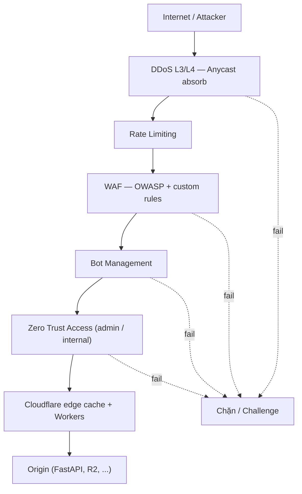

# 🛡️ Cloudflare Security — WAF, Zero Trust, DDoS, Bot, Turnstile

> **Tác giả:** Mr.Rom\
> **Phiên bản:** v1.1.2\
> **Tạo lúc:** 24/05/2026\
> **Cập nhật:** 11/06/2026
> **Level:** Basic (bài 04/5)\
> **Tags:** [MUST-KNOW]\
> **Yêu cầu trước:** Xong [00_what-is-cloudflare-overview](00_what-is-cloudflare-overview.md) đến [03_r2-and-d1-and-queues](03_r2-and-d1-and-queues.md), hiểu HTTP request anatomy, biết SQL injection / XSS cơ bản

> 🎯 *Trụ cột "Security" của Cloudflare — thứ làm Cloudflare nổi tiếng từ 2009. Bài này dạy: WAF custom rules + managed rulesets, Rate Limiting, Bot Management, DDoS protection (free unmetered), Zero Trust suite (Access + Gateway + Tunnel/cloudflared), mTLS, Turnstile (CAPTCHA-free). Cuối bài làm hands-on bảo vệ FastAPI backend của Acme Shop sau Cloudflare — chặn SQL injection, rate limit login, expose qua Tunnel không cần mở port public.*

## 🎯 Sau bài này bạn sẽ

- [ ] Hiểu **WAF custom rules** + **managed rulesets** — cú pháp expression
- [ ] Setup **Rate Limiting** theo IP / header / cookie
- [ ] Hiểu **Bot Management** + Bot Score + super bot fight
- [ ] Hiểu **DDoS protection** Cloudflare — vì sao "unmetered free"
- [ ] Phân biệt **Zero Trust**: Access (SSO) vs Gateway (DNS/HTTP filter) vs Tunnel (cloudflared)
- [ ] Setup **cloudflared tunnel** expose FastAPI không mở port public
- [ ] Setup **mTLS** + **Turnstile** trong form
- [ ] Hands-on: protect Acme Shop API qua Cloudflare full stack

---

## Tình huống — Acme Shop bị tấn công

Sáng thứ Hai, monitor báo:
- Origin server load 100% từ 4h sáng — DDoS Layer 7.
- Database thấy 50k login attempt từ 200 IP khác nhau — credential stuffing.
- SQL injection thử ở `/api/products/search`.
- Bot scrape catalog với cường độ 1000 req/s — giả browser.
- Admin panel `/admin/*` bị scan port từ Internet.

Sếp gọi:
> *"Bên mình chưa có security team. Phải có WAF, DDoS protection, rate limit, và đặc biệt phải tách admin panel ra khỏi Internet công cộng. Bạn dùng Cloudflare làm bộ giáp luôn. Tuần này phải lên."*

Bài này dạy cách bao bọc toàn bộ Acme Shop qua Cloudflare security stack — từ free (DDoS, WAF custom 5 rules) tới Zero Trust (free 50 users).

---

## 1️⃣ Cloudflare Security stack — tổng quan

🪞 **Ẩn dụ**: *Tưởng tượng Acme Shop là **biệt thự**. Cloudflare là **hệ thống bảo vệ nhiều lớp**: cổng chính kiểm thẻ căn cước (DDoS Layer 3/4), hành lang chặn người lạ (WAF Layer 7), quầy lễ tân giới hạn lượt vào (Rate Limit), nhân viên phân biệt khách thật/bot (Bot Management), ID Card cho nhân viên nội bộ (Zero Trust Access). Mọi tầng chạy tự động ở 320+ chi nhánh — attacker chưa kịp tới cửa đã bị chặn.*

### Phòng thủ nhiều lớp (layered defense)

```text
Internet
   ↓
[DDoS L3/L4] ← Free unmetered (Anycast network absorbing)
   ↓
[Rate Limiting] ← Free 10k req/tháng, Pro+ rules
   ↓
[WAF] ← Free 5 custom rules, Pro+ managed rulesets
   ↓
[Bot Management] ← Pro+
   ↓
[Zero Trust Access] ← cho admin / internal app
   ↓
Cloudflare edge cache + Workers
   ↓
Origin (FastAPI, S3, ...)
```

Sơ đồ dưới mô tả cùng ý đó dưới dạng luồng: mỗi request phải vượt lần lượt các lớp phòng thủ chồng nhau ở edge, lớp nào không qua thì bị chặn ngay, chưa kịp chạm tới origin.



Ý nghĩa của cách xếp lớp này: attacker phải qua hết mọi tầng mới tới được origin, nên chỉ cần một lớp bắt được là toàn bộ request bị loại ngay tại edge.

### Stack theo plan

| Layer | Free | Pro ($25) | Business ($250) | Enterprise |
|---|---|---|---|---|
| DDoS L3/L4 | ✅ Unmetered | ✅ | ✅ | ✅ |
| DDoS L7 | Basic | ✅ Advanced | ✅ | ✅ |
| WAF custom | 5 rules | 20 rules | 100 rules | Unlimited |
| WAF managed | ❌ | ✅ OWASP + CF | ✅ + Exposed creds | ✅ + zero-day |
| Rate Limiting | 10k req/tháng | Advanced | Advanced | Advanced |
| Bot Management | Bot Fight Mode | Super Bot Fight | Bot Management | Advanced + JS |
| Zero Trust | 50 users free | (per-user pricing) | | |
| Turnstile | ✅ Unlimited | ✅ | ✅ | ✅ |
| mTLS | ✅ 50 certs | ✅ | ✅ | ✅ |

---

## 2️⃣ WAF — Web Application Firewall

### Khái niệm

**WAF** chặn HTTP request độc hại trước khi đến origin. Cloudflare WAF có 3 lớp:

| Lớp | Mô tả |
|---|---|
| **Managed Rulesets** | Cloudflare maintain — OWASP Top 10, exposed creds, log4j, ... |
| **Custom Rules** | Bạn viết — match field + action |
| **Rate Limiting Rules** | Throttle khi vượt threshold |

### Custom Rules — cú pháp expression

`Security → WAF → Custom rules → Create rule`:

```text
Field          Operator          Value                Action
─────────────────────────────────────────────────────────
http.request.uri.path  matches  ^/admin/      →  Block
ip.src.country         in       {"RU","KP","IR"}     →  Block
http.request.uri.query contains "../../"            →  Block
cf.threat_score        gt       30                  →  Managed Challenge
http.user_agent        contains "curl"              →  JS Challenge
```

Expression compound:

```text
(http.request.uri.path matches "^/api/") and 
(http.request.method eq "POST") and 
(not http.request.headers["x-api-key"][0] eq "secret123")
→ Block
```

### Field phổ biến

| Field | Mô tả |
|---|---|
| `ip.src` | Client IP |
| `ip.src.country` | Country code (ISO 3166-1) |
| `ip.src.asnum` | ASN |
| `http.request.uri.path` | Path |
| `http.request.uri.query` | Query string |
| `http.request.method` | GET/POST/... |
| `http.user_agent` | UA string |
| `http.referer` | Referer header |
| `http.host` | Host header |
| `cf.threat_score` | Cloudflare risk score 0-100 |
| `cf.bot_management.score` | Bot score 1-99 |
| `cf.verified_bot` | Verified good bot (Google, Bing, ...) |
| `http.request.headers["xxx"]` | Bất kỳ header |
| `http.request.cookies["xxx"]` | Cookie |

### Action

| Action | Mô tả |
|---|---|
| **Block** | Trả 1020 page |
| **Skip** | Bypass các rule sau |
| **Log** | Chỉ log (audit) |
| **Managed Challenge** | Cloudflare tự chọn challenge phù hợp (rec 2026) |
| **JS Challenge** | Yêu cầu browser thực thi JS (chặn bot không headless) |
| **Interactive Challenge** | CAPTCHA visual (giảm dần, prefer Turnstile) |

### Managed Rulesets — do Cloudflare duy trì

`Security → WAF → Managed rules`:

| Ruleset | Pro+ | Mô tả |
|---|---|---|
| **Cloudflare Managed Ruleset** | ✅ | Comprehensive Layer 7 rules |
| **OWASP Core Ruleset** | ✅ | OWASP Top 10 (SQLi, XSS, ...) |
| **Cloudflare Exposed Credentials Check** | ✅ Pro | Block khi thấy creds đã leak |
| **Cloudflare Free Managed Ruleset** | ✅ | Cơ bản miễn phí (Free plan) |
| **Cloudflare WordPress Ruleset** | ✅ | Bảo vệ WordPress vuln |

Mỗi ruleset có:
- **Sensitivity**: Off / Low / Medium / High
- **Action**: Block / Challenge / Log
- **Exception**: Bỏ qua cho path/IP cụ thể

### Best practice khi deploy WAF

1. Bật **Cloudflare Free Managed Ruleset** trước (Free plan).
2. **Log mode 1 tuần** → review false positive.
3. Add **exception** cho legitimate traffic bị block.
4. Đổi sang **Managed Challenge** sau khi confident.
5. Custom Rules bổ sung cho business logic riêng.

---

## 3️⃣ Rate Limiting

### Free vs Advanced

| Tính năng | Free | Pro+ (Advanced) |
|---|---|---|
| Throttle theo IP | ✅ | ✅ |
| Theo header/cookie/path | ❌ | ✅ |
| Counter shared cross-rule | ❌ | ✅ |
| Action: Block/Challenge/Log | ✅ | ✅ |

### Cài đặt Rate Limit free tier

`Security → WAF → Rate limiting rules`:

```text
Name: Limit login attempts
If incoming requests match:
  (http.request.uri.path eq "/api/login") and
  (http.request.method eq "POST")
Then:
  - When rate exceeds: 5 requests
  - Period: 1 minute (per IP)
  - Action: Block for 10 minutes
```

→ Sau 5 lần POST `/api/login` từ cùng IP trong 1 phút → block 10 phút.

### Advanced Rate Limit (Pro+)

```text
Name: API key abuse
Match: (http.request.uri.path matches "^/api/")
Characteristics: 
  - IP address
  - Header: X-API-Key  ← per key
Counter expression: same value
Rate: 1000 req / 60s
Action: Managed Challenge
```

### Counter theo từng identity

Counter theo:
- IP only
- IP + path
- Cookie value (per user session)
- Header value (per API key, per tenant)

→ Cho phép "user A gọi nhiều OK, attacker spam nhiều thì block riêng".

---

## 4️⃣ Bot Management

### Bot Fight Mode (Free)

`Security → Bots → Bot Fight Mode = ON`

- Chặn / challenge bot rõ ràng (verified-bad-bot list).
- Giải thích simple: nếu request giống bot crawl spam → challenge.

### Super Bot Fight Mode (Pro)

`Security → Bots → Super Bot Fight Mode`

Có 4 toggle:

| Toggle | Mô tả |
|---|---|
| Definitely automated | Bot rõ ràng → action |
| Likely automated | Bot khả nghi → challenge |
| Verified bots | Google/Bing/... → allow |
| Static resources | Loại static khỏi bot check (giảm false positive) |

### Bot Score (Business+)

Mỗi request có `cf.bot_management.score` 1-99:
- 1-29: Bot
- 30-99: Human

```text
(http.request.uri.path matches "^/api/checkout/") and 
(cf.bot_management.score lt 30)
→ Block
```

### Verified Bots

Cloudflare maintain **list of good bots** (Google, Bing, Slack preview, AhrefsBot, ...). Cho phép qua dù score thấp:

```text
cf.verified_bot eq true
→ Skip rule
```

---

## 5️⃣ DDoS Protection — "Unmetered free"

🪞 **Ẩn dụ**: *DDoS như **đám đông biểu tình tràn vào cửa hàng**. AWS Shield Standard chỉ ngăn được vài người ở cửa, Shield Advanced trả nghìn USD/tháng. Cloudflare có **anycast network 320+ POP** — đám đông tự nhiên bị chia ra khắp thế giới, mỗi POP nhận 1 phần nhỏ → hoá ra không ai nguy hiểm. Anycast architecture là vũ khí — không phải vì miễn phí, vì kiến trúc đã giải quyết.*

### Vì sao "unmetered"

Cloudflare anycast: IP của bạn quảng bá từ 320+ POPs. User và attacker đều đi POP gần nhất. Botnet 1M IP từ khắp thế giới → tự chia thành 320 nhóm nhỏ, mỗi POP nhận ~3000 IP — quy mô không nguy hiểm cho POP đó.

So với origin có 1 IP (us-east-1) → 1M IP tấn công cùng 1 chỗ → sụp.

### Cloudflare đỡ DDoS layer nào

| Layer | Loại tấn công | Cloudflare giải |
|---|---|---|
| L3 (Network) | IP spoof, ICMP flood, fragmentation | ✅ Anycast absorb |
| L4 (Transport) | SYN flood, UDP amplification | ✅ SYN cookie, rate limit per IP |
| L7 (Application) | HTTP flood, slowloris, RUDY | ✅ WAF + Bot + Rate limit |

### DDoS rules (Free, tự động áp dụng)

`Security → DDoS → HTTP DDoS attack protection`:
- Sensitivity: Default High (Pro+ Adjust).
- Mode: Cloudflare auto-detect signature.

Bạn không cần config gì — DDoS protection bật mặc định khi proxy on.

### Ghi đè (override) DDoS rules

Nếu bị false positive (vd ứng dụng legitimate có pattern giống DDoS):
- `Security → DDoS → Edit rule`.
- Set sensitivity Low cho rule cụ thể.

---

## 6️⃣ Zero Trust — Access + Gateway + Tunnel

🪞 **Ẩn dụ**: *Traditional VPN như **cấp thẻ ra vào toàn toà nhà** — vào trong VPN là access tất cả. Zero Trust như **mỗi cửa phòng có khoá riêng** — nhân viên phải verify identity + device health từng lần mở cửa. Cloudflare Zero Trust 3 thành phần: Access (khoá cửa), Gateway (camera giám sát mạng), Tunnel (đường hầm bí mật ra Internet).*

### Free tier — rất hào phóng

- 50 users free.
- Mọi feature trừ Workforce-grade (1000+).

### Cloudflare Access — SSO + phân quyền theo từng app

Thay thế VPN cho internal app. Pattern:

```text
User → app.acmeshop.vn → Cloudflare Access
                          ↓ verify (Google SSO, Okta, GitHub, ...)
                          ↓ check policy (device, country, group)
                          ↓ pass → origin
                          ↓ block → 403
```

**Setup**:
1. Zero Trust Dashboard → Access → Applications → Add Application → Self-hosted.
2. App domain: `admin.acmeshop.vn`.
3. Identity provider: Google / Okta / Azure AD / GitHub OAuth.
4. Policy: 
   - Include: email ends with `@acmeshop.vn` AND group `admins`
   - Require: country = VN AND device-trust (WARP installed)
5. Save.

→ Khi user truy cập `admin.acmeshop.vn`, Cloudflare intercept → redirect login → verify → forward về origin (nếu pass).

### Cloudflare Gateway — lọc DNS + HTTP outbound

Như "DNS-level firewall" cho user company. Pattern:
- Cài WARP agent trên laptop nhân viên.
- WARP đẩy outbound traffic qua Cloudflare.
- Gateway block: malware domain, phishing, content category.
- Log mọi DNS query + HTTP để forensic.

### Cloudflare Tunnel (cloudflared) — Inverse proxy

🪞 **Ẩn dụ**: *Thay vì **mở cửa sổ** để Cloudflare vào (cần public IP + firewall rule), bạn **đẩy ống dẫn từ trong ra** đến Cloudflare. Cloudflare nhận request rồi đẩy qua ống về origin. Origin **không** cần public IP, **không** cần expose port.*

**Use case**: Expose dev/staging/internal server an toàn.

**Setup**:

```bash
# 1. Install cloudflared
brew install cloudflared           # macOS
# Hoặc download binary cho Linux/Windows

# 2. Auth (browser-based)
cloudflared tunnel login

# 3. Tạo tunnel
cloudflared tunnel create acmeshop-api-tunnel
# Output: Tunnel ID + creds file ~/.cloudflared/<uuid>.json

# 4. Tạo DNS record
cloudflared tunnel route dns acmeshop-api-tunnel api.acmeshop.vn

# 5. Config file
cat > ~/.cloudflared/config.yml << EOF
tunnel: <tunnel-uuid>
credentials-file: /Users/user/.cloudflared/<uuid>.json
ingress:
  - hostname: api.acmeshop.vn
    service: http://localhost:8000
  - hostname: admin.acmeshop.vn
    service: http://localhost:3000
  - service: http_status:404
EOF

# 6. Run tunnel
cloudflared tunnel run acmeshop-api-tunnel

# 7. Install as service (production)
cloudflared service install
```

→ FastAPI chạy `localhost:8000` bây giờ accessible qua `https://api.acmeshop.vn` toàn cầu, đi qua Cloudflare CDN + WAF + Zero Trust, không cần mở port public, không cần SSL cert origin.

### Kết hợp: Tunnel + Access

```text
External user → api.acmeshop.vn 
   → Cloudflare edge (DDoS, WAF, Rate limit)
   → Cloudflare Access (verify SSO)
   → Cloudflare Tunnel
   → Your laptop / homelab / on-prem (no public IP)
```

→ Server homelab phía sau NAT có thể public an toàn — chỉ user có quyền truy cập.

---

## 7️⃣ mTLS — xác thực bằng client certificate

🪞 **Ẩn dụ**: *Normal TLS như **khách hàng vào quán chỉ cần kiểm tra ID quán** (server cert). mTLS như **kiểm tra cả ID khách hàng** (client cert) — chỉ khách có thẻ membership mới vào. Phổ biến cho API B2B, IoT, microservice.*

### Cài đặt

1. Zone → SSL/TLS → Client Certificates → Create CA.
2. Issue cert cho client.
3. Tạo WAF rule: 
   ```text
   not cf.tls_client_auth.cert_verified
   → Block
   ```

### Use case

- API B2B mỗi đối tác 1 cert.
- IoT device authentication.
- Microservice mesh trust.

---

## 8️⃣ Turnstile — lựa chọn thay thế không cần CAPTCHA

🪞 **Ẩn dụ**: *reCAPTCHA buộc user **chọn xe đạp / chọn cột đèn** — phiền phức, kém UX. Turnstile dùng AI + browser signal — **invisible** cho user thường, chỉ challenge khi nghi ngờ. Bonus: free unlimited, không track user như Google.*

### Loại widget

| Mode | UX |
|---|---|
| **Managed** | Cloudflare tự chọn (rec) |
| **Non-Interactive** | Token tự động, no UI |
| **Invisible** | Hoàn toàn ẩn |

### Cài đặt (frontend)

```html
<!-- 1. Include script -->
<script src="https://challenges.cloudflare.com/turnstile/v0/api.js" async defer></script>

<!-- 2. Add widget in form -->
<form action="/api/contact" method="POST">
    <input name="email" type="email" required>
    <textarea name="message" required></textarea>
    
    <div class="cf-turnstile" data-sitekey="<YOUR_SITE_KEY>"></div>
    
    <button type="submit">Send</button>
</form>
```

### Xác minh (verify) ở backend (Worker)

```typescript
app.post('/api/contact', async (c) => {
    const formData = await c.req.formData();
    const token = formData.get('cf-turnstile-response');
    const ip = c.req.header('CF-Connecting-IP');

    const verifyResp = await fetch('https://challenges.cloudflare.com/turnstile/v0/siteverify', {
        method: 'POST',
        body: new URLSearchParams({
            secret: c.env.TURNSTILE_SECRET,
            response: token as string,
            remoteip: ip ?? '',
        }),
    });
    const outcome = await verifyResp.json() as { success: boolean };

    if (!outcome.success) {
        return c.json({ error: 'Bot suspected' }, 403);
    }

    // ... process form
    return c.json({ ok: true });
});
```

→ Free unlimited. Đơn giản hơn reCAPTCHA. Không track PII.

---

## 🛠️ Hands-on — Bảo vệ Acme Shop FastAPI sau Cloudflare

### Mục tiêu

- Acme Shop chạy FastAPI ở localhost (laptop dev hoặc homelab).
- Expose qua Cloudflare Tunnel (không mở port public).
- Bật WAF + Rate Limit + Bot Fight.
- Bảo vệ `/admin/*` qua Zero Trust Access (Google SSO).
- Đảm bảo SQL injection bị chặn ngay tại edge.

### Bước 1 — Chuẩn bị FastAPI

```python
# main.py
from fastapi import FastAPI, HTTPException
from pydantic import BaseModel

app = FastAPI()

@app.get("/")
def root():
    return {"service": "acmeshop-api"}

@app.get("/api/products")
def list_products():
    return [{"id": 1, "name": "iPhone 15"}]

@app.post("/api/login")
def login(creds: dict):
    return {"ok": True}

@app.get("/admin/dashboard")
def admin_dashboard():
    return {"users": 1024, "revenue": 50000}
```

```bash
pip install fastapi uvicorn
uvicorn main:app --host 127.0.0.1 --port 8000
```

### Bước 2 — Cloudflare Tunnel

```bash
brew install cloudflared
cloudflared tunnel login
cloudflared tunnel create acmeshop-api

# Route DNS
cloudflared tunnel route dns acmeshop-api api.acmeshop.vn
cloudflared tunnel route dns acmeshop-api admin.acmeshop.vn

# Config
cat > ~/.cloudflared/config.yml << EOF
tunnel: <your-tunnel-uuid>
credentials-file: /Users/user/.cloudflared/<uuid>.json
ingress:
  - hostname: api.acmeshop.vn
    service: http://localhost:8000
  - hostname: admin.acmeshop.vn
    service: http://localhost:8000
  - service: http_status:404
EOF

# Run
cloudflared tunnel run acmeshop-api
```

→ Test: `curl https://api.acmeshop.vn/` → trả `{"service":"acmeshop-api"}`. Origin chỉ chạy local, không expose.

### Bước 3 — Bật WAF managed ruleset

`Security → WAF → Managed rules`:
- Enable **Cloudflare Free Managed Ruleset** (Free plan).
- Set sensitivity Medium, action Block.

Test SQL injection:

```bash
curl "https://api.acmeshop.vn/api/products?id=1' OR '1'='1"
# Response: 403 Forbidden (Cloudflare block 1010)
```

### Bước 4 — Custom WAF rule

`Security → WAF → Custom rules → Create rule`:

```text
Name: Block non-VN admin access
Expression:
  (http.request.uri.path matches "^/admin/") and 
  (ip.src.country ne "VN")
Action: Block
```

→ Admin chỉ accessible từ Việt Nam (basic geo-fence).

### Bước 5 — Rate Limit login

`Security → WAF → Rate limiting rules → Create rule`:

```text
Name: Login throttle
Expression:
  (http.request.uri.path eq "/api/login") and 
  (http.request.method eq "POST")
Rate: 5 / 60 seconds (per IP)
Action: Block 600 seconds
```

Test:

```bash
for i in {1..10}; do
    curl -X POST https://api.acmeshop.vn/api/login -d '{}' -H "Content-Type: application/json"
done
# Sau 5 request → 429 Too Many Requests
```

### Bước 6 — Bot Fight Mode

`Security → Bots → Bot Fight Mode = ON`.

Test với UA scraper:

```bash
curl -H "User-Agent: PythonBot/1.0" https://api.acmeshop.vn/api/products
# Có thể bị JS challenge
```

### Bước 7 — Zero Trust Access cho /admin

`Zero Trust Dashboard → Access → Applications → Add → Self-hosted`:
- Application domain: `admin.acmeshop.vn` (toàn path) hoặc `acmeshop.vn/admin/*`.
- Identity provider: Google (config OAuth credentials Google Cloud Console trước).
- Policy:
  - Action: Allow
  - Include: emails ending in `@acmeshop.vn`
  - Require: country = VN

Test:

```bash
curl https://admin.acmeshop.vn/admin/dashboard
# Redirect to Cloudflare login page
# Login bằng Google account @acmeshop.vn → success
# Login bằng @gmail.com → denied
```

### Bước 8 — Turnstile cho form contact (tuỳ chọn)

Trong HTML form (nếu có frontend):

```html
<div class="cf-turnstile" data-sitekey="0x4AAA..."></div>
```

Backend verify như §8.

→ **Kết quả**: Acme Shop bảo vệ full stack — origin server không expose public, WAF chặn SQL injection ở edge, rate limit login, bot bị challenge, admin chỉ user nội bộ + country VN access. Cost: $0 nếu < 50 users.

---

## 💡 Cạm bẫy thường gặp & Best practice

### ❌ Cạm bẫy: WAF rule action Block ngay khi deploy

**Triệu chứng**: Bật managed ruleset → 30% legitimate traffic bị block → khách than phiền.

**Nguyên nhân**: False positive cao khi rule mới.

**Cách tránh**:
- Bật action **Log** trước 1 tuần.
- Review Security Events tab → tìm pattern false positive.
- Add exception (skip rule cho path/IP cụ thể).
- Đổi sang Block sau khi confident.

### ❌ Cạm bẫy: Rate Limit theo IP fail với mobile carrier NAT

**Triệu chứng**: Block 5 login/60s → nhiều user mobile dùng cùng IP carrier (CGNAT) → block oan.

**Nguyên nhân**: Mobile carrier NAT — hàng nghìn user share 1 IP.

**Cách tránh**:
- Rate limit theo cookie session + IP combined.
- Hoặc theo `cf-ipcountry + ASN + path` thay vì pure IP.
- Threshold cao hơn cho mobile UA.

### ❌ Cạm bẫy: Block country quá rộng

**Triệu chứng**: Block country X để chặn attack → user thực ở X complain.

**Nguyên nhân**: Geo-block không phân biệt good/bad.

**Cách tránh**:
- Geo-block chỉ cho admin/sensitive path, không toàn site.
- Combine với threat score thay vì pure country.

### ❌ Cạm bẫy: Cloudflare Tunnel route mất chứng chỉ

**Triệu chứng**: `cloudflared` đột nhiên không connect — "credentials not found".

**Nguyên nhân**: Quên backup file `~/.cloudflared/<uuid>.json`.

**Cách tránh**:
- Backup folder `~/.cloudflared/` lên password manager / encrypted vault.
- Hoặc dùng Tunnel API token thay credentials file.

### ❌ Cạm bẫy: Zero Trust Access policy quên Require

**Triệu chứng**: Policy chỉ có Include `@acmeshop.vn` → ai có alias forward về `@acmeshop.vn` vẫn pass.

**Nguyên nhân**: Include OR logic, dễ bypass.

**Cách tránh**:
- Combine Include + Require + Exclude.
- Test với multiple identity scenario trước go-live.

### ❌ Cạm bẫy: Bot Fight Mode block Google Search Console / SEO crawler

**Triệu chứng**: Sau bật Bot Fight, GSC báo "can't crawl". SEO traffic giảm.

**Nguyên nhân**: Bot Fight có thể nhầm verified bot.

**Cách tránh**:
- Bật **Verified Bots** = Allow.
- WAF skip rule cho `cf.verified_bot eq true`.

### ❌ Cạm bẫy: SSL Always-On với origin chưa SSL → infinite redirect

**Triệu chứng**: Trang load infinite loop.

**Nguyên nhân**: SSL mode Flexible: Cloudflare trả HTTPS → origin redirect HTTP. Cloudflare nhận HTTP → trả HTTPS → loop.

**Cách tránh**:
- Dùng **Full (Strict)** + Origin CA cert.
- Origin không redirect HTTP→HTTPS (Cloudflare đã làm).

### ❌ Cạm bẫy: Tunnel không restart sau reboot

**Triệu chứng**: Sau reboot laptop, `api.acmeshop.vn` 502.

**Nguyên nhân**: `cloudflared tunnel run` chạy trong terminal, không service.

**Cách tránh**:
- `cloudflared service install` để chạy như background service.
- Macos: LaunchAgent. Linux: systemd. Windows: Service.

---

## 🧠 Tự kiểm tra (Self-check)

**Q1.** WAF Managed Rule vs Custom Rule — khác gì? Khi nào dùng cái nào?

<details>
<summary>💡 Đáp án</summary>

- **Managed**: Cloudflare maintain, chống OWASP Top 10, log4j, exposed creds, ... Update tự động. Pro+ plan.
- **Custom**: Bạn viết theo business logic (block country X, header Y, path Z, ...). Free 5 rules.
- **Combine**: Managed làm baseline, Custom cho business rule. Cả 2 deploy cùng nhau.
</details>

**Q2.** Vì sao Cloudflare DDoS protection "unmetered free" còn AWS Shield tốn nghìn USD?

<details>
<summary>💡 Đáp án</summary>

Kiến trúc anycast 320+ POP — attack tự chia khắp thế giới, mỗi POP nhận phần nhỏ → absorb dễ. AWS region-based — 1 IP region, attack tập trung. Hai paradigm khác nhau, không phải vì "Cloudflare hào phóng".
</details>

**Q3.** Zero Trust Access vs Tunnel — chức năng khác nhau thế nào?

<details>
<summary>💡 Đáp án</summary>

- **Access**: Authentication layer — verify user/device trước khi cho vào app.
- **Tunnel**: Connectivity layer — đường hầm origin (no public IP) đến Cloudflare.
- **Combine**: Tunnel expose internal app + Access bảo vệ ai vào được. Pattern phổ biến.
</details>

**Q4.** Rate limit theo IP có nhược điểm gì khi user dùng mobile?

<details>
<summary>💡 Đáp án</summary>

Mobile carrier dùng CGNAT — hàng nghìn user share 1 IP công cộng. Rate limit pure IP → block oan nhiều user. Solution: combine với cookie/session/header để per-user thay vì per-IP.
</details>

**Q5.** Turnstile khác reCAPTCHA điểm nào?

<details>
<summary>💡 Đáp án</summary>

- **Turnstile**: AI + browser signal, **invisible** cho user thường, free unlimited, không track PII.
- **reCAPTCHA**: User phải chọn ảnh (UX kém), free có limit, Google track behavior (privacy concern).

→ Turnstile rec 2026 cho mọi public form.
</details>

---

## ⚡ Tra cứu nhanh (Cheatsheet)

| Mục đích | Cách |
|---|---|
| WAF custom rule | Security → WAF → Custom rules |
| Block country | `ip.src.country in {"RU","KP"}` → Block |
| Block path | `http.request.uri.path matches "^/admin/"` → Block |
| Rate limit | Security → WAF → Rate limiting rules |
| Bot Fight Mode | Security → Bots → Bot Fight Mode ON |
| DDoS sensitivity | Security → DDoS → Edit rule |
| Install cloudflared | `brew install cloudflared` |
| Login tunnel | `cloudflared tunnel login` |
| Create tunnel | `cloudflared tunnel create <name>` |
| Route DNS | `cloudflared tunnel route dns <name> <hostname>` |
| Run tunnel | `cloudflared tunnel run <name>` |
| Install service | `cloudflared service install` |
| Access app | Zero Trust → Access → Applications → Add |
| mTLS rule | `not cf.tls_client_auth.cert_verified` → Block |
| Turnstile verify | POST `challenges.cloudflare.com/turnstile/v0/siteverify` |
| Security events | Security → Events |

---

## 📚 Từ Điển Thuật Ngữ (Glossary)

| Thuật ngữ | Tiếng Việt | Giải thích |
|---|---|---|
| **WAF** | Tường lửa ứng dụng web | Web Application Firewall — chặn HTTP request độc hại trước khi đến origin |
| **Managed Ruleset** | Bộ rule quản lý sẵn | Bộ rule do Cloudflare maintain (OWASP, log4j, exposed creds, ...) |
| **Custom Rule** | Rule tự định nghĩa | Rule do bạn viết theo cú pháp expression cho business logic riêng |
| **Rate Limiting** | Giới hạn tần suất | Throttle request khi vượt ngưỡng trong một khoảng thời gian |
| **Bot Score** | Điểm bot | Số 1-99 đánh giá khả năng request là bot (thấp = bot, cao = human) |
| **Verified Bot** | Bot đã xác thực | Bot tốt được Cloudflare verify (Google, Bing, ...) |
| **DDoS** | Tấn công từ chối dịch vụ phân tán | Distributed Denial of Service — làm quá tải origin bằng lưu lượng giả |
| **Anycast** | Định tuyến anycast | Kiến trúc mạng nhiều POP cùng chia sẻ 1 IP, user đi POP gần nhất |
| **Zero Trust** | Không tin mặc định | Mô hình bảo mật "never trust, always verify" — xác thực mọi lần truy cập |
| **Access** | Cổng xác thực app | Cloudflare SSO + phân quyền theo từng ứng dụng, thay thế VPN |
| **Gateway** | Bộ lọc DNS/HTTP outbound | Lọc traffic đi ra cho thiết bị nhân viên (malware, phishing, content) |
| **Tunnel / cloudflared** | Đường hầm ngược | Reverse tunnel từ origin ra Cloudflare, origin không cần public IP |
| **mTLS** | TLS hai chiều | Mutual TLS — cả client cũng phải xuất trình certificate |
| **Turnstile** | CAPTCHA ẩn | Giải pháp thay reCAPTCHA dùng AI + browser signal, không track PII |
| **Managed Challenge** | Thử thách tự chọn | Cloudflare tự chọn loại challenge phù hợp với request |
| **JS Challenge** | Thử thách JavaScript | Yêu cầu browser thực thi JS để verify (chặn bot không headless) |
| **Threat Score** | Điểm rủi ro | Số 0-100 đánh giá mức độ rủi ro của request |
| **Bot Fight Mode** | Chế độ chống bot cơ bản | Bật bảo vệ chống bot mức cơ bản (có trên Free plan) |
| **CGNAT** | NAT cấp nhà mạng | Carrier-Grade NAT — hàng nghìn thiết bị mobile share chung 1 IP công cộng |

---

## 🔗 Liên kết & Tài nguyên

### 🧭 Định hướng lộ trình học

- ⬅️ **Bài trước:** [Cloudflare R2 + D1 + Queues — Storage & data layer ở edge](03_r2-and-d1-and-queues.md)
- ➡️ **Bài tiếp theo:** (bài cuối cụm Cloudflare basic)
- ↑ **Về cụm:** [Cloudflare — Tổng quan cụm](../../README.md)

### 🧩 Các chủ đề liên quan
- ☁️ [AWS Lambda + API Gateway](../../../aws/lessons/01_basic/04_lambda-and-api-gateway.md) — so sánh cách tích hợp WAF với API Gateway
- 🐍 [FastAPI](../../../../07_web/backend/python-fastapi/) — backend dùng trong phần hands-on
- 🧭 [DevOps Engineer Career Roadmap](../../../../00_roadmaps/career/devops-engineer_career-roadmap.md)
- 🧭 [Security Engineer Career Roadmap](../../../../00_roadmaps/career/security-engineer_career-roadmap.md)

### 🌐 Tài nguyên tham khảo khác
- 📖 [WAF docs](https://developers.cloudflare.com/waf/)
- 📖 [Rate Limiting docs](https://developers.cloudflare.com/waf/rate-limiting-rules/)
- 📖 [Bot Management docs](https://developers.cloudflare.com/bots/)
- 📖 [DDoS Protection docs](https://developers.cloudflare.com/ddos-protection/)
- 📖 [Zero Trust docs](https://developers.cloudflare.com/cloudflare-one/)
- 📖 [Cloudflare Tunnel docs](https://developers.cloudflare.com/cloudflare-one/connections/connect-networks/)
- 📖 [Turnstile docs](https://developers.cloudflare.com/turnstile/)
- 📖 [Cloudflare Access docs](https://developers.cloudflare.com/cloudflare-one/applications/)
- 📖 [Security Events dashboard guide](https://developers.cloudflare.com/waf/analytics/security-events/)
- 📖 [Cloudflare Radar — DDoS trends](https://radar.cloudflare.com/security)

---

## 📌 Nhật ký thay đổi (Changelog)

- **v1.0.0 (24/05/2026)** — Bản đầu tiên. Bài 04 cluster Cloudflare basic — bài cuối. WAF custom + managed rulesets + expression syntax + Rate Limiting per IP/cookie + Bot Management + Bot Score + DDoS Layer 3/4/7 unmetered free explanation (anycast) + Zero Trust suite (Access + Gateway + Tunnel/cloudflared) + mTLS + Turnstile vs reCAPTCHA + hands-on FastAPI Acme Shop full security stack + 8 pitfalls. Đóng cluster Cloudflare basic 5 bài.
- **v1.1.0 (01/06/2026)** — Chuẩn hoá QA: đổi field metadata "Prerequisites" → "Yêu cầu trước"; gắn ngôn ngữ `text` cho các code fence diagram/expression/config còn để trống; chuyển Glossary sang 3 cột "Thuật ngữ | Tiếng Việt | Giải thích"; chuẩn hoá nav (⬅️ Bài trước/➡️ Bài tiếp theo/↑ Về cụm + link-text = tiêu đề H1 thực + 3 sub-heading canonical).
- **v1.1.1 (11/06/2026)** — Việt hoá heading nội dung mô tả sang tiếng Việt (giữ thuật ngữ/brand/param) theo Vietnamese-first.
- **v1.1.2 (11/06/2026)** — Bổ sung sơ đồ các lớp phòng thủ chồng nhau (DDoS → Rate limit → WAF → Bot → Zero Trust → origin) cho trực quan.
