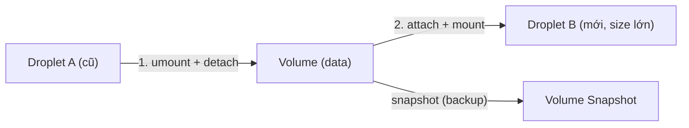

# 💧 Droplet + Block Storage Volumes — Compute cơ bản DO

> **Tác giả:** Mr.Rom\
> **Phiên bản:** v1.1.1\
> **Tạo lúc:** 24/05/2026\
> **Cập nhật:** 11/06/2026\
> **Level:** Basic (bài 01/5)\
> **Tags:** [MUST-KNOW]\
> **Yêu cầu trước:** [00_what-is-digitalocean-overview](00_what-is-digitalocean-overview.md) ✅, hiểu Linux cơ bản, SSH

> 🎯 *Bài 01 đi sâu **Droplet** (= VM của DO) và **Block Storage Volumes** (= disk attach). Bạn sẽ học: các họ Droplet CPU (Shared vs Dedicated), cloud-init metadata để bootstrap, Reserved IP để IP cố định, Volume để mở rộng disk, Snapshot/Image để backup. Hands-on: deploy FastAPI Droplet production-grade.*

## 🎯 Sau bài này bạn sẽ

- [ ] Phân biệt các **họ Droplet CPU** (Basic / Premium Intel / Premium AMD / General Purpose / CPU-Optimized / Memory-Optimized / Storage-Optimized / GPU)
- [ ] Chọn đúng size cho workload (web app / DB / ML / batch)
- [ ] Dùng **cloud-init / User Data** để bootstrap Droplet tự động
- [ ] Attach **Block Storage Volume** mở rộng disk
- [ ] Tạo **Snapshot** và **Custom Image** để backup/clone
- [ ] Setup **Reserved IP** để IP cố định (HA / DNS pointing)
- [ ] Deploy 1 **FastAPI app** production-grade trên Droplet

---

## Tình huống — Internal tool sống 24/7

Tuần trước bạn deploy Droplet $6 cho "hello world". Giờ sếp muốn:

> *"Internal dashboard FastAPI + Postgres + 20-30 user nội bộ. Deploy lên DO, app phải sống 24/7, có domain riêng, scale lên RAM được khi cần, không mất data khi destroy Droplet."*

Bạn nhận ra Droplet "default" có vấn đề:
- Restart Droplet → IP có đổi không?
- Disk 25GB hết → mở rộng kiểu gì?
- Bootstrap thủ công 10 lệnh mỗi lần tạo Droplet → mệt.
- Backup làm sao? Restore làm sao?

Bài này lấp đầy: cấu hình Droplet production + Volume + Snapshot + Reserved IP + cloud-init.

---

## 1️⃣ Droplet là gì — Anatomy

🪞 **Ẩn dụ**: *Droplet như **căn hộ studio trong building DO** — bạn có 1 phòng (Droplet) với điện-nước-internet (CPU/RAM/network) sẵn, đồ đạc cơ bản (OS image), khoá phòng (SSH key). DO là chủ tòa nhà — họ lo bảo trì hạ tầng, bạn chỉ lo nội thất bên trong.*

### Định nghĩa

**Droplet** = VM của DO chạy trên KVM hypervisor. Mỗi Droplet có:
- **CPU + RAM + SSD** (theo tier).
- **Public IPv4 + IPv6** (mặc định).
- **Private network** trong VPC region.
- **OS image** (Ubuntu, Debian, CentOS, Fedora, Rocky, AlmaLinux, FreeBSD, ...).
- **Tag + metadata** để group/automation.

### Lifecycle

```
[Create] → [Active] → [Reboot/Power-off] → [Active] ↺
                ↓
           [Resize] (CPU/RAM up — không destroy data)
                ↓
           [Snapshot] (backup point-in-time)
                ↓
           [Destroy] → bill stops, mọi data mất
```

> ⚠️ **Quan trọng**: Droplet đang Power-off **vẫn bị charge** (vì DO giữ disk + IP). Muốn dừng bill hoàn toàn → **Destroy**. Backup trước bằng Snapshot nếu cần restore sau.

---

## 2️⃣ Các họ Droplet CPU — Chọn đúng size

DO chia Droplet thành hai nhánh lớn: **Shared CPU** (chia sẻ core với neighbor) và **Dedicated CPU** (core dành riêng, premium). Từ hai nhánh này tách ra các họ tối ưu cho từng loại workload — bên dưới đi qua lần lượt từng họ, kèm slug và tình huống nên dùng.

### A. Basic (Shared CPU) — phổ biến nhất

| Đặc điểm | Mô tả |
|---|---|
| **CPU** | Share với neighbor (best-effort) |
| **Phù hợp** | Web app traffic medium, dev/staging, learning |
| **Giá** | Rẻ nhất ($4-$96/tháng) |
| **Slug** | `s-Xvcpu-Ygb` |

**Đặc thù 2025+**: DO chia Basic thành 3 sub-tier:
- **Regular** (Intel/AMD random) — `s-1vcpu-1gb`
- **Premium Intel** — `s-1vcpu-1gb-intel` — ~20% đắt hơn nhưng latency CPU ổn định
- **Premium AMD** — `s-1vcpu-1gb-amd` — EPYC AMD, cùng giá Premium Intel

### B. General Purpose (Dedicated CPU)

| Đặc điểm | Mô tả |
|---|---|
| **CPU** | Dedicated thread (không share) |
| **Ratio** | RAM:CPU = 4:1 (8GB / 2vCPU) |
| **Phù hợp** | Production app cần CPU ổn định, K8s worker |
| **Giá** | ~3x Basic, từ $63/tháng |
| **Slug** | `g-Xvcpu-Ygb` hoặc `gd-Xvcpu-Ygb` (NVMe SSD) |

### C. CPU-Optimized

| Đặc điểm | Mô tả |
|---|---|
| **CPU** | Dedicated + clock cao |
| **Ratio** | RAM:CPU = 2:1 (4GB / 2vCPU) |
| **Phù hợp** | Build server, CI runner, video encoding, scientific computing |
| **Slug** | `c-Xvcpu-Ygb`, `c2-Xvcpu-Ygb` (gen 2 mạnh hơn) |

### D. Memory-Optimized

| Đặc điểm | Mô tả |
|---|---|
| **CPU** | Dedicated |
| **Ratio** | RAM:CPU = 8:1 (16GB / 2vCPU) |
| **Phù hợp** | In-memory cache (Redis), DB heavy, analytics |
| **Slug** | `m-Xvcpu-Ygb`, `m3-Xvcpu-Ygb` (gen 3) |

### E. Storage-Optimized

| Đặc điểm | Mô tả |
|---|---|
| **Disk** | NVMe SSD super lớn (1.5TB+) |
| **Phù hợp** | DB lớn, log aggregation, search engine |
| **Slug** | `so-Xvcpu-Ygb`, `so1_5-Xvcpu-Ygb` |

### F. GPU Droplet

| Đặc điểm | Mô tả |
|---|---|
| **GPU** | NVIDIA H100 / RTX 6000 Ada / A100 |
| **Phù hợp** | ML training/inference, video processing |
| **Slug** | `gpu-h100x1-80gb`, `gpu-a100x1-40gb` |
| **Giá** | Đắt — H100 từ $2.30/giờ (~$1700/tháng) |

### Decision matrix — Khi nào dùng gì

| Workload | Tier khuyến nghị | Slug ví dụ |
|---|---|---|
| Personal blog WordPress | Basic Regular | `s-1vcpu-1gb` ($6) |
| FastAPI staging | Basic Premium Intel | `s-2vcpu-2gb-intel` (~$21) |
| FastAPI production traffic medium | General Purpose | `g-2vcpu-8gb` ($63) |
| Redis cache | Memory-Optimized | `m-2vcpu-16gb` ($90) |
| Postgres self-hosted | Storage-Optimized | `so-2vcpu-16gb` ($131) |
| CI build runner | CPU-Optimized | `c-4vcpu-8gb` ($84) |
| K8s worker node prod | General Purpose | `g-4vcpu-16gb` ($126) |
| LLM inference 7B | GPU | `gpu-a100x1-40gb` ($1.50/giờ) |

→ **Quy tắc**: Bắt đầu Basic rẻ nhất, observe CPU/RAM 1 tuần, upgrade khi cần. Resize **không destroy data** (chỉ reboot).

---

## 3️⃣ Cloud-init / User Data — Bootstrap Droplet tự động

🪞 **Ẩn dụ**: *Cloud-init như **danh sách việc cần làm bạn dán cửa căn hộ** cho người dọn nhà — họ vừa vào là làm theo: lắp wifi, đặt rèm, dọn dẹp. Bạn không phải vào tự làm.*

### Vấn đề

Mỗi lần tạo Droplet mới, bạn vào SSH gõ:
```bash
apt update && apt upgrade -y
apt install -y nginx python3-pip
useradd -m deploy
ufw allow 22,80,443
...
```

10 lệnh, làm bằng tay → mệt, dễ sai, không tái lập được.

### Cloud-init

**Cloud-init** = standard chạy 1 script bootstrap **lần đầu** Droplet boot. Pass qua **User Data** field khi tạo.

### Format YAML (cloud-config)

```yaml
#cloud-config
package_update: true
package_upgrade: true

packages:
  - nginx
  - python3-pip
  - python3-venv
  - ufw
  - fail2ban

users:
  - name: deploy
    sudo: ALL=(ALL) NOPASSWD:ALL
    shell: /bin/bash
    ssh_authorized_keys:
      - ssh-ed25519 AAAAC3...your-public-key thien@local

ssh_pwauth: false
disable_root: true

runcmd:
  - ufw default deny incoming
  - ufw default allow outgoing
  - ufw allow 22/tcp
  - ufw allow 80/tcp
  - ufw allow 443/tcp
  - ufw --force enable
  - systemctl enable --now fail2ban
  - sed -i 's/^#PermitRootLogin.*/PermitRootLogin no/' /etc/ssh/sshd_config
  - systemctl restart sshd

write_files:
  - path: /etc/motd
    content: |
      ============================================
      Acme Shop — internal Droplet
      Provisioned by cloud-init
      ============================================

final_message: "Droplet ready after $UPTIME seconds"
```

### Tạo Droplet với cloud-init

```bash
doctl compute droplet create acmeshop-web \
    --region sgp1 \
    --size s-2vcpu-4gb \
    --image ubuntu-24-04-x64 \
    --ssh-keys aa:bb:cc:dd:... \
    --user-data-file ./cloud-init.yaml \
    --tag-names env:prod,app:web \
    --wait
```

### Script Bash (alternative)

Cloud-init cũng nhận bash script thô:

```bash
#!/bin/bash
# bootstrap.sh
set -e
apt update && apt upgrade -y
apt install -y nginx python3-pip ufw
ufw allow 22,80,443
ufw --force enable
echo "Done!" > /var/log/bootstrap.log
```

```bash
doctl compute droplet create acmeshop-web \
    ... \
    --user-data-file ./bootstrap.sh
```

### Debug cloud-init

```bash
# SSH vào Droplet sau khi boot
ssh root@IP

# Xem log cloud-init
cat /var/log/cloud-init.log
cat /var/log/cloud-init-output.log

# Check status
cloud-init status
# > status: done

# Re-run (dangerous, chỉ cho debug)
cloud-init clean && cloud-init init
```

> ⚠️ Cloud-init chỉ chạy **1 lần ở boot đầu**. Reboot không re-run. Muốn idempotent → dùng Ansible/Terraform sau.

---

## 4️⃣ Block Storage Volumes — Mở rộng disk

### Vấn đề

Droplet $6 có 25GB SSD. Nếu bạn cần lưu 100GB log, 500GB media files → upgrade Droplet lên size lớn = phí cao + lãng phí CPU/RAM không cần.

→ Giải pháp: **Block Storage Volume** — disk gắn ngoài, scale độc lập với Droplet.

🪞 **Ẩn dụ**: *Volume như **ổ cứng ngoài USB** — cắm vào Droplet (= laptop), gỡ ra cắm Droplet khác cũng được. Droplet chết, Volume còn data.*

### Đặc điểm

| Đặc điểm | Mô tả |
|---|---|
| **Size** | 1 GB → 16 TB |
| **Giá** | $0.10/GB/tháng (rẻ hơn EBS gp3 nhiều) |
| **Performance** | ~5000 IOPS, 200 MB/s |
| **Attach** | 1 Volume = 1 Droplet (cùng region) |
| **Resize** | Up only (không shrink), online |
| **Snapshot** | Có (point-in-time backup) |

### Tạo Volume + Attach

```bash
# Tạo Volume 50GB
doctl compute volume create acmeshop-data \
    --region sgp1 \
    --size 50GiB \
    --fs-type ext4 \
    --desc "Production data volume"

# Get Volume ID
doctl compute volume list

# Attach vào Droplet
doctl compute volume-action attach \
    VOLUME_ID DROPLET_ID

# SSH vào Droplet → mount
ssh root@IP
lsblk
# > sda      25G  disk
# > sdb      50G  disk          ← Volume

# Mount
mkdir -p /mnt/data
mount /dev/sdb /mnt/data

# Persist mount qua reboot
echo "/dev/disk/by-id/scsi-0DO_Volume_acmeshop-data /mnt/data ext4 defaults,nofail,discard 0 0" >> /etc/fstab

# Verify
df -h /mnt/data
```

### Use cases

| Use case | Volume size |
|---|---|
| Postgres data dir | 50-500 GB |
| User uploads (nhỏ) | 100 GB |
| Log archive | 200 GB |
| Backup destination | 1 TB+ |
| Docker volume | 100 GB |

> ⚠️ **Volume KHÔNG phải shared storage**. 1 Volume = 1 Droplet tại 1 thời điểm. Cần shared → Spaces (object) hoặc self-host NFS.

### Detach + Move sang Droplet khác

```bash
# Trên Droplet cũ
umount /mnt/data

# Detach
doctl compute volume-action detach \
    VOLUME_ID DROPLET_ID

# Attach vào Droplet mới (cùng region)
doctl compute volume-action attach \
    VOLUME_ID NEW_DROPLET_ID

# Trên Droplet mới → mount
ssh root@NEW_IP
mkdir -p /mnt/data
mount /dev/sdb /mnt/data
```

→ **Use case**: nâng cấp Droplet — tạo Droplet mới size lớn → move Volume → destroy Droplet cũ. Data zero-loss.

Sơ đồ dưới tóm gọn tính "tách rời" của Volume — vòng đời của nó độc lập hoàn toàn với Droplet, attach/detach/snapshot đều không đụng tới VM.



Droplet A có bị destroy thì data trên Volume vẫn nguyên — đây chính là lý do nên đặt data quan trọng trên Volume thay vì disk gốc của Droplet.

---

## 5️⃣ Snapshot vs Image — Backup & Clone

### Khác nhau

| | Snapshot | Custom Image |
|---|---|---|
| **Mục đích** | Backup 1 Droplet/Volume point-in-time | Template tạo Droplet mới |
| **Pricing** | $0.06/GB/tháng | $0.06/GB/tháng |
| **Tạo nhanh** | Vài phút | Vài phút |
| **Restore** | Tạo Droplet/Volume mới từ Snapshot | Tạo Droplet mới từ Image |
| **Cross-region** | Không (tied region) | Có thể distribute multi-region |
| **Use case** | Daily backup, rollback | Golden image cho fleet |

### Tạo Snapshot

```bash
# Snapshot Droplet (cần power-off trước cho consistent)
doctl compute droplet-action shutdown DROPLET_ID --wait
doctl compute droplet-action snapshot DROPLET_ID \
    --snapshot-name "acmeshop-web-2026-05-24" \
    --wait
doctl compute droplet-action power-on DROPLET_ID --wait

# Snapshot Volume (live, không cần unmount)
doctl compute volume snapshot VOLUME_ID \
    --snapshot-name "acmeshop-data-2026-05-24"
```

### Auto-backup (DO managed)

```bash
# Enable weekly backup khi tạo Droplet
doctl compute droplet create acmeshop-web \
    ... \
    --enable-backups

# Hoặc enable sau:
doctl compute droplet-action enable-backups DROPLET_ID
```

- **Cost**: +20% giá Droplet (so $6 → $7.20).
- **Retention**: 4 weekly snapshots (rolling).
- **Manual snapshot** không bị xóa, tích lũy tự do.

### Restore từ Snapshot

```bash
# List snapshots
doctl compute snapshot list

# Tạo Droplet mới từ snapshot
doctl compute droplet create acmeshop-web-restored \
    --region sgp1 \
    --size s-2vcpu-4gb \
    --image SNAPSHOT_ID \
    --ssh-keys FP \
    --wait
```

### Custom Image (cho fleet)

```bash
# Upload custom image (raw/qcow2)
doctl compute image create acmeshop-base \
    --image-url https://example.com/ubuntu-custom.qcow2 \
    --region sgp1 \
    --image-distribution Ubuntu \
    --image-description "Acme baseline 2026"

# Distribute multi-region
doctl compute image-action transfer IMAGE_ID --region nyc1
```

---

## 6️⃣ Reserved IP — IP cố định

🪞 **Ẩn dụ**: *Reserved IP như **biển số xe đẹp bạn mua riêng** — xe (Droplet) đổi nhưng biển số (IP) vẫn giữ, dán biển sang xe mới được.*

### Vấn đề

Droplet xóa → IP mất → DNS phải update → downtime.

### Reserved IP (cũ gọi Floating IP)

- IP public cố định, gắn được vào Droplet bất kỳ cùng region.
- **Free khi attached**. **$4/tháng khi unassigned** (đừng quên release!).
- Use case:
  - DNS point tới Reserved IP, không trực tiếp Droplet.
  - HA failover: swap IP từ Droplet primary sang backup khi sự cố.
  - Blue/green deploy: tạo Droplet mới → test → swap IP.

### Tạo + Assign

```bash
# Tạo Reserved IP gắn vào Droplet
doctl compute reserved-ip create --droplet-id DROPLET_ID

# Hoặc tạo region rồi assign sau
doctl compute reserved-ip create --region sgp1
doctl compute reserved-ip-action assign IP_ADDR DROPLET_ID

# List
doctl compute reserved-ip list

# Unassign
doctl compute reserved-ip-action unassign IP_ADDR

# Delete (nếu không dùng nữa — TRÁNH BỊ CHARGE)
doctl compute reserved-ip delete IP_ADDR --force
```

### Swap IP (blue/green deploy)

```bash
# Droplet cũ (blue) đang dùng Reserved IP 138.68.x.x
# Tạo Droplet mới (green), test xong
# Swap IP

doctl compute reserved-ip-action unassign 138.68.x.x
doctl compute reserved-ip-action assign 138.68.x.x NEW_DROPLET_ID

# < 5 giây downtime
```

---

## 🛠️ Hands-on — Deploy FastAPI app production-grade

### Mục tiêu

Deploy 1 FastAPI app trên Droplet:
- General Purpose `g-2vcpu-8gb`.
- Bootstrap bằng cloud-init.
- Volume 20GB cho data + logs.
- Reserved IP cho DNS.
- Nginx reverse proxy + systemd service.

### Bước 1 — Chuẩn bị cloud-init

```yaml
# cloud-init.yaml
#cloud-config
package_update: true
package_upgrade: true

packages:
  - nginx
  - python3-pip
  - python3-venv
  - ufw
  - fail2ban
  - git

users:
  - name: deploy
    sudo: ALL=(ALL) NOPASSWD:ALL
    shell: /bin/bash
    ssh_authorized_keys:
      - ssh-ed25519 AAAAC3...YOUR_KEY thien@local

ssh_pwauth: false
disable_root: true

write_files:
  - path: /etc/nginx/sites-available/acmeshop
    content: |
      server {
          listen 80;
          server_name _;
          location / {
              proxy_pass http://127.0.0.1:8000;
              proxy_set_header Host $host;
              proxy_set_header X-Real-IP $remote_addr;
          }
      }
  - path: /etc/systemd/system/acmeshop.service
    content: |
      [Unit]
      Description=Acme FastAPI
      After=network.target
      [Service]
      User=deploy
      WorkingDirectory=/opt/acmeshop
      ExecStart=/opt/acmeshop/.venv/bin/uvicorn main:app --host 127.0.0.1 --port 8000
      Restart=always
      [Install]
      WantedBy=multi-user.target

runcmd:
  - ufw default deny incoming
  - ufw default allow outgoing
  - ufw allow 22/tcp
  - ufw allow 80/tcp
  - ufw allow 443/tcp
  - ufw --force enable
  - systemctl enable --now fail2ban
  - rm /etc/nginx/sites-enabled/default
  - ln -s /etc/nginx/sites-available/acmeshop /etc/nginx/sites-enabled/
  - systemctl restart nginx
  - mkdir -p /opt/acmeshop /mnt/data
  - chown -R deploy:deploy /opt/acmeshop /mnt/data
```

### Bước 2 — Tạo Volume

```bash
doctl compute volume create acmeshop-data \
    --region sgp1 \
    --size 20GiB \
    --fs-type ext4
```

### Bước 3 — Tạo Droplet

```bash
doctl compute droplet create acmeshop-web \
    --region sgp1 \
    --size g-2vcpu-8gb \
    --image ubuntu-24-04-x64 \
    --ssh-keys $(doctl compute ssh-key list --format FingerPrint --no-header) \
    --user-data-file ./cloud-init.yaml \
    --tag-names env:prod,app:acmeshop \
    --enable-monitoring \
    --enable-backups \
    --wait

# Get Droplet ID
DROPLET_ID=$(doctl compute droplet list acmeshop-web --format ID --no-header)
```

### Bước 4 — Attach Volume + Reserved IP

```bash
# Attach Volume
VOLUME_ID=$(doctl compute volume list acmeshop-data --format ID --no-header)
doctl compute volume-action attach "$VOLUME_ID" "$DROPLET_ID"

# Tạo Reserved IP
doctl compute reserved-ip create --droplet-id "$DROPLET_ID"
RES_IP=$(doctl compute reserved-ip list --format IP --no-header | head -1)
echo "Reserved IP: $RES_IP"
```

### Bước 5 — Deploy app

```bash
# SSH vào (dùng deploy user)
ssh deploy@$RES_IP

# Mount volume
sudo mount /dev/sdb /mnt/data
echo "/dev/disk/by-id/scsi-0DO_Volume_acmeshop-data /mnt/data ext4 defaults,nofail,discard 0 0" | sudo tee -a /etc/fstab

# Deploy app
cd /opt/acmeshop
git clone https://github.com/acmeshop/api.git .
python3 -m venv .venv
.venv/bin/pip install -r requirements.txt

# Test thủ công
.venv/bin/uvicorn main:app --host 127.0.0.1 --port 8000 &
curl http://localhost:8000/health
# > {"status":"ok"}
kill %1

# Start service
sudo systemctl daemon-reload
sudo systemctl enable --now acmeshop
sudo systemctl status acmeshop

# Test từ ngoài
exit
curl http://$RES_IP/health
# > {"status":"ok"}
```

### Bước 6 — Setup DNS

```
DNS provider (Cloudflare/Route53/...) → add A record:
  api.acmeshop.vn → $RES_IP (TTL 300)
```

### Bước 7 — Backup script

```bash
# Trên Droplet: cron daily snapshot
sudo tee /etc/cron.daily/do-snapshot <<'EOF'
#!/bin/bash
export DIGITALOCEAN_ACCESS_TOKEN="dop_v1_xxxxx"
DROPLET_ID="123456789"
DATE=$(date +%F)
doctl compute droplet-action snapshot $DROPLET_ID \
    --snapshot-name "acmeshop-web-$DATE" --wait
EOF
sudo chmod +x /etc/cron.daily/do-snapshot
```

→ **Kết quả**: app sống ở `http://api.acmeshop.vn`, có backup daily, Volume tách rời, IP cố định. Bill ~$80/tháng.

---

## 💡 Cạm bẫy thường gặp & Best practice

### 1. Power-off vẫn bị charge

**Bẫy**: Tắt Droplet tưởng "ngủ đông" không bị charge → cuối tháng vẫn bill.

**Fix**: Bill chỉ dừng khi **destroy**. Snapshot trước (~$1 lưu trữ) → destroy → restore khi cần.

### 2. Resize down không được

**Bẫy**: Upgrade lên $48 size test → muốn về $12 → không cho.

**Fix**: Resize **up only**. Muốn down → snapshot → tạo Droplet size nhỏ từ snapshot → destroy cái cũ.

### 3. Volume cross-region không hoạt động

**Bẫy**: Volume tạo ở `sgp1`, Droplet ở `nyc1` → attach fail.

**Fix**: Volume + Droplet phải **cùng region**. Cần move → snapshot Volume → tạo Volume mới ở region đích từ snapshot.

### 4. Quên unmount trước detach

**Bẫy**: `doctl volume-action detach` khi đang mount → data corruption.

**Fix**: 
```bash
sudo umount /mnt/data
doctl compute volume-action detach VOL_ID DROPLET_ID
```

### 5. Reserved IP unassigned bị charge $4

**Bẫy**: Tạo Reserved IP, sau xóa Droplet → IP unassigned vẫn còn → $4/tháng silent.

**Fix**: Sau khi destroy Droplet → check `doctl compute reserved-ip list` → delete IP nếu không tái sử dụng.

### 6. Cloud-init không re-run khi reboot

**Bẫy**: Sửa user-data sau khi tạo Droplet → reboot tưởng apply → không hoạt động.

**Fix**: Cloud-init chỉ chạy **1 lần boot đầu**. Sau đó dùng Ansible/Terraform/manual.

### 7. SSH key fingerprint không khớp

**Bẫy**: `--ssh-keys` cần fingerprint, không phải ID.

**Fix**:
```bash
doctl compute ssh-key list --format FingerPrint,Name
# Dùng FingerPrint trong --ssh-keys
```

### 8. UFW khoá luôn SSH

**Bẫy**: Cloud-init enable UFW nhưng quên allow port 22 → SSH bị block → mất quyền truy cập.

**Fix**: **Luôn** `ufw allow 22/tcp` **trước** `ufw enable`. Test cloud-init local bằng `cloud-init schema --config-file cloud-init.yaml`.

### 9. Backup auto không phải replacement cho disaster recovery

**Bẫy**: Bật `--enable-backups` tưởng đủ DR → khi datacenter sgp1 down, backup cùng region cũng down.

**Fix**: Backup auto = quick rollback. Cross-region DR = manual snapshot transfer hoặc Spaces backup.

### 10. Monitoring agent ăn RAM

**Bẫy**: `--enable-monitoring` thêm `do-agent` ~50-100MB RAM. Trên Droplet $4 (512MB) là gánh nặng.

**Fix**: Chỉ enable monitoring cho Droplet ≥ 1GB RAM.

---

## 🧠 Tự kiểm tra (Self-check)

**Q1.** Khi nào dùng Basic vs General Purpose Droplet?

<details>
<summary>💡 Đáp án</summary>

- **Basic Shared**: dev/staging, traffic medium, không nhạy CPU latency. Rẻ ~3x.
- **General Purpose Dedicated**: production, CPU latency ổn định, K8s worker. Khi observe Basic bị CPU steal time cao.

</details>

**Q2.** Volume mất khi Droplet destroy không?

<details>
<summary>💡 Đáp án</summary>

Không. Volume độc lập với Droplet. Destroy Droplet → Volume vẫn còn, vẫn bị charge $0.10/GB/tháng. Muốn xóa Volume → `doctl compute volume delete VOL_ID`.

</details>

**Q3.** Cloud-init re-run khi reboot Droplet không?

<details>
<summary>💡 Đáp án</summary>

Không. Cloud-init chỉ chạy 1 lần ở boot đầu (first-boot). Reboot không re-run. Muốn re-run debug → `cloud-init clean && reboot`.

</details>

**Q4.** Reserved IP free khi nào, mất phí khi nào?

<details>
<summary>💡 Đáp án</summary>

- **Free** khi attached vào Droplet active.
- **$4/tháng** khi unassigned (idle). DO charge để hạn chế hoarding IP.

</details>

**Q5.** Snapshot Droplet và Snapshot Volume khác gì?

<details>
<summary>💡 Đáp án</summary>

- Snapshot Droplet = backup toàn bộ Droplet (OS + disk system). Cần power-off để consistent. Restore = tạo Droplet mới.
- Snapshot Volume = backup riêng Volume data. Live snapshot không cần unmount. Restore = tạo Volume mới.

</details>

---

## ⚡ Tra cứu nhanh (Cheatsheet)

| Mục đích | Lệnh |
|---|---|
| Tạo Droplet | `doctl compute droplet create NAME --region sgp1 --size SIZE --image IMG --ssh-keys FP --wait` |
| Resize Droplet | `doctl compute droplet-action resize ID --size SIZE --wait` |
| Reboot | `doctl compute droplet-action reboot ID` |
| Snapshot Droplet | `doctl compute droplet-action snapshot ID --snapshot-name NAME --wait` |
| Enable backups | `doctl compute droplet-action enable-backups ID` |
| Tạo Volume | `doctl compute volume create NAME --region sgp1 --size 50GiB --fs-type ext4` |
| Attach Volume | `doctl compute volume-action attach VOL_ID DROP_ID` |
| Detach Volume | `doctl compute volume-action detach VOL_ID DROP_ID` |
| Snapshot Volume | `doctl compute volume snapshot VOL_ID --snapshot-name NAME` |
| Tạo Reserved IP | `doctl compute reserved-ip create --droplet-id ID` |
| Assign IP | `doctl compute reserved-ip-action assign IP DROP_ID` |
| Cloud-init log | `cat /var/log/cloud-init-output.log` |
| Mount Volume | `mount /dev/sdb /mnt/data` |

---

## 📚 Từ Điển Thuật Ngữ (Glossary)

| Thuật ngữ | Tiếng Việt | Giải thích |
|---|---|---|
| **Droplet** | (giữ nguyên) | VM của DO |
| **Block Storage Volume** | Khối lưu trữ rời | Disk attach Droplet, scale độc lập |
| **Reserved IP** | IP cố định | Static IP có thể remap (cũ Floating IP) |
| **Cloud-init** | (giữ nguyên) | Standard bootstrap VM lần đầu boot |
| **User Data** | Dữ liệu người dùng | Field truyền script bootstrap khi tạo |
| **Snapshot** | Ảnh chụp | Point-in-time backup Droplet/Volume |
| **Custom Image** | Ảnh tùy chỉnh | Template tạo Droplet (golden image) |
| **Shared CPU** | CPU chia sẻ | vCPU share với neighbor, best-effort |
| **Dedicated CPU** | CPU dành riêng | vCPU chỉ thuộc Droplet bạn, ổn định |
| **CPU steal time** | Thời gian CPU bị cướp | Lúc neighbor dùng nhiều, bạn không có CPU |
| **fstab** | (giữ nguyên) | `/etc/fstab` mount permanent |
| **ufw** | (giữ nguyên) | Uncomplicated Firewall (Linux) |

---

## 🔗 Liên kết & Tài nguyên

### 🧭 Định hướng lộ trình học

- ⬅️ **Bài trước:** [DigitalOcean — Tổng quan + Team/Project + doctl CLI](00_what-is-digitalocean-overview.md)
- ➡️ **Bài tiếp theo:** [Spaces — Object Storage kèm CDN miễn phí](02_spaces-object-storage-and-cdn.md)
- ↑ **Về cụm:** [DigitalOcean](../../README.md)

### 🧩 Các chủ đề có thể bạn quan tâm

- ☁️ **So sánh với AWS:** [EC2 + EBS — Compute foundation](../../../aws/lessons/01_basic/01_ec2-and-ebs-compute.md)
- 🐧 **Nền tảng OS:** [Linux](../../../../04_os/linux/) — SSH, systemd, ufw
- 🐍 **App stack:** [FastAPI](../../../../07_web/backend/python-fastapi/)

### 🌐 Tài nguyên tham khảo khác

- 📖 [DO Droplets docs](https://docs.digitalocean.com/products/droplets/)
- 📖 [DO Volumes docs](https://docs.digitalocean.com/products/volumes/)
- 📖 [Cloud-init docs](https://cloudinit.readthedocs.io/en/latest/)
- 📖 [DO Marketplace](https://marketplace.digitalocean.com/) — 1-Click apps
- 📖 [doctl compute reference](https://docs.digitalocean.com/reference/doctl/reference/compute/)
- 📖 [DO Sizing guide](https://docs.digitalocean.com/products/droplets/concepts/choosing-a-plan/)

---

## 📌 Nhật ký thay đổi (Changelog)

- **v1.0.0 (24/05/2026)** — Bản đầu. Droplet 8 loại CPU + decision matrix + cloud-init bootstrap + Volume + Snapshot + Reserved IP + hands-on FastAPI production + 10 pitfalls.
- **v1.1.0 (01/06/2026)** — Sửa lỗi QA: bỏ con số cứng "8 loại CPU" (chỉ có 6 nhóm A–F) ở tiêu đề/lời dẫn/mục tiêu, viết lại lời dẫn §2 theo nhánh Shared/Dedicated; chuẩn hoá field "Yêu cầu trước", header Glossary 3 cột, marker nav (⬅️/➡️/↑) + link-text khớp H1 thực + 3 sub-heading canonical; đồng bộ giá staging "~$21" với pricing bài 00.
- **v1.1.1 (11/06/2026)** — Bổ sung sơ đồ vòng đời Volume tách rời Droplet (detach/attach/snapshot) cho trực quan.
