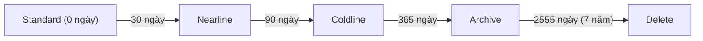

# 📦 GCP Cloud Storage + IAM

> **Tác giả:** Mr.Rom\
> **Phiên bản:** v2.0.1\
> **Tạo lúc:** 24/05/2026\
> **Cập nhật:** 11/06/2026\
> **Level:** Basic (bài 02/5)\
> **Tags:** [MUST-KNOW]\
> **Yêu cầu trước:** Bài [GCP Compute Engine + Persistent Disks](01_compute-engine-and-disks.md) ✅

> 🎯 *Sau khi đã biết cách dựng máy chủ ảo và gắn đĩa ở bài 01, câu hỏi tiếp theo luôn là: ảnh, video, file backup của ứng dụng thì để đâu cho rẻ, bền và an toàn? Bài này trả lời bằng Cloud Storage (GCS) — kho lưu trữ object của Google, song hành với hệ thống phân quyền IAM. Bạn sẽ học cách chọn storage class, quản lý quyền truy cập, cấp link tải/upload có thời hạn, tự động chuyển dữ liệu sang kho rẻ hơn theo thời gian, khoá dữ liệu phục vụ compliance, mã hoá bằng key của riêng mình, rồi tự tay dựng 3 bucket cho một cửa hàng online thật.*

## 🎯 Sau bài này bạn sẽ

- [ ] Chọn đúng **storage class** (Standard / Nearline / Coldline / Archive) cho từng kiểu dữ liệu
- [ ] Dùng **uniform bucket-level access** thay cho ACL (chuẩn khuyến nghị 2026)
- [ ] Tạo **signed URL** (link có thời hạn) cho phép upload/download trực tiếp
- [ ] Cấu hình **Object Lifecycle Management** để tự động chuyển kho theo tuổi dữ liệu
- [ ] Bật **Object Versioning** và **Retention Policy** phục vụ compliance
- [ ] Cấu hình **CORS** để web app upload thẳng lên bucket
- [ ] Mã hoá bằng **CMEK** (key tự quản qua Cloud KMS)
- [ ] Phân biệt **IAM role** với **ACL** kiểu cũ
- [ ] Dựng static website hosting đặt sau **Cloud CDN**

---

## Tình huống — Acme Shop cần một chỗ để cất dữ liệu

Cửa hàng online Acme Shop vừa lớn nhanh, và đội kỹ thuật bắt đầu đụng tường: máy chủ ứng dụng không phải là chỗ để chất hàng triệu file. Sếp gọi bạn vào và liệt kê một loạt nhu cầu rất cụ thể:

> *"Acme Shop cần: lưu ảnh sản phẩm (10M ảnh, 200 GB), cho user upload ảnh đại diện trực tiếp từ trình duyệt, backup database giữ lạnh 7 năm theo yêu cầu compliance, và một trang tĩnh `static.acmeshop.vn`. Tối ưu chi phí mạnh tay, mà audit log phải đầy đủ."*

Nghe thì nhiều, nhưng tách ra thì mỗi nhu cầu ánh xạ rất gọn vào một tính năng của Cloud Storage. Việc của bạn trong bài này là:

- Dựng 3 bucket riêng biệt: `acmeshop-products`, `acmeshop-uploads`, `acmeshop-backups`.
- Chọn storage class phù hợp cho từng bucket (Standard cho dữ liệu nóng, Coldline cho dữ liệu lạnh).
- Cấp signed URL để frontend upload thẳng, không phải gánh qua backend.
- Đặt lifecycle rule tự chuyển Standard → Coldline → Archive theo thời gian để tiết kiệm.
- Khoá retention 7 năm cho backup để không ai xoá nhầm.
- Dùng IAM giới hạn rõ ai được làm gì với từng bucket.

Toàn bộ bài này chính là lời giải cho tình huống trên — đi từ khái niệm nền tảng đến hands-on dựng đủ 3 bucket.

---

## 1️⃣ Cloud Storage cơ bản

Trước khi gõ lệnh, bạn cần một mô hình tư duy đúng về Cloud Storage. Khác với đĩa cứng ở bài 01 (gắn vào một máy, có thư mục thật), GCS là *object storage* — bạn ném file vào kèm một cái tên, và Google lo phần còn lại. Ẩn dụ dưới đây giúp định hình mô hình đó.

🪞 **Ẩn dụ**: *Cloud Storage giống một **kho hàng tự phục vụ vô hạn của Google** — bạn không cần biết kệ nào, kho nào; chỉ cần dán nhãn (object name) cho gói hàng rồi đưa vào. Kho có 4 mức giá tuỳ tần suất bạn lấy hàng ra (Standard / Nearline / Coldline / Archive): hàng lấy thường xuyên để gần cho nhanh, hàng cả năm mới đụng tới thì cất vào kho lạnh giá rẻ.*

Để nói chuyện với GCS, bạn cần thuộc vài khái niệm nền. Bảng dưới gom đúng những thứ sẽ xuất hiện lặp lại suốt phần còn lại của bài:

| Khái niệm | Mô tả |
|---|---|
| **Bucket** | Container cấp cao nhất — tên duy nhất trên toàn cầu, gắn vào 1 project |
| **Object** | Một file kèm metadata |
| **Object name** | Đường dẫn dạng path, ví dụ `products/img-1234.jpg` (không có thư mục thật bên dưới) |
| **Location** | Region (`asia-southeast1`), Dual-region (`asia1`), hoặc Multi-region (`asia`) |
| **Storage class** | Standard / Nearline / Coldline / Archive |

Điểm dễ gây bất ngờ nhất là *object name không phải thư mục thật* — dấu `/` chỉ là một phần của tên, GCS lưu phẳng tuyệt đối. Nhờ vậy bucket co giãn vô hạn mà không bị giới hạn cấu trúc cây thư mục.

### Storage class — chọn theo tần suất truy cập

Cùng một file, để ở storage class khác nhau thì giá lưu trữ và giá lấy ra chênh nhau cả chục lần. Logic nền tảng rất đơn giản: kho càng lạnh thì lưu càng rẻ nhưng lấy ra càng đắt và càng bị ràng buộc thời gian tối thiểu. Bảng dưới là khung giá tham chiếu 2026 để bạn chọn cho đúng:

| Class | Giá lưu/GB-tháng | Giá retrieval/GB | Min duration | Khi dùng |
|---|---|---|---|---|
| **Standard** | $0.020 (multi) / $0.020 (regional) | Miễn phí | None | Dữ liệu nóng, đang dùng (< 1 tháng) |
| **Nearline** | $0.010 | $0.010 | 30 ngày | Backup truy cập dưới 1 lần/tháng |
| **Coldline** | $0.004 | $0.020 | 90 ngày | Archive, truy cập dưới 1 lần/quý |
| **Archive** | $0.0012 | $0.050 | 365 ngày | Compliance, truy cập dưới 1 lần/năm |

Đọc bảng theo chiều dọc: từ Standard xuống Archive, giá lưu giảm gần 17 lần nhưng giá lấy ra lại tăng dần, kèm theo *min duration* — thời gian tối thiểu bạn phải giữ object trước khi xoá mà không bị phạt. Đây chính là lý do bạn không nên ném dữ liệu nóng vào Coldline (sẽ xem ở phần cạm bẫy). Cách dùng thông minh là để mọi thứ vào Standard rồi để **Lifecycle** tự động hạ cấp dần — phần 4 sẽ làm đúng việc này.

### Location — đánh đổi giữa giá, độ trễ và độ bền

Ngoài storage class, bạn còn chọn *vị trí địa lý* lưu dữ liệu. Quyết định này ảnh hưởng đến độ trễ khi truy cập, khả năng chịu thảm hoạ (disaster recovery), và giá. Ba kiểu location dưới đây phủ gần hết nhu cầu thực tế:

| Type | Mô tả | Giá | Use case |
|---|---|---|---|
| **Regional** | 1 region cụ thể (ví dụ `asia-southeast1`) | Rẻ nhất | Ứng dụng nhạy độ trễ, gói gọn 1 region |
| **Dual-region** | 2 region cụ thể (ví dụ `asia1` = Tokyo + Osaka) | Trung bình | Disaster recovery cross-region |
| **Multi-region** | Cả một châu lục (`asia`, `us`, `eu`) | Cao | Phục vụ toàn cầu, asset public |

Quy tắc chọn nhanh: dữ liệu chỉ một region xài thì Regional cho rẻ; cần chịu được sự cố cả một region thì Dual-region; còn asset public cần phục vụ người dùng khắp nơi thì Multi-region. Với Acme Shop, bucket backup hợp với Regional (chỉ hệ thống nội bộ đụng tới), còn ảnh sản phẩm public sẽ ghép thêm Cloud CDN ở phần 7 thay vì trả tiền Multi-region.

---

## 2️⃣ IAM — Uniform vs Fine-grained access

Có chỗ để cất dữ liệu rồi, câu hỏi sống còn tiếp theo là *ai được đụng vào*. GCS có hai mô hình phân quyền, và chọn sai mô hình từ đầu là nguồn gốc của hầu hết sự cố lộ dữ liệu. Phần này làm rõ nên chọn cái nào và vì sao.

### Uniform bucket-level access (khuyến nghị 2026)

Đây là mô hình bạn nên dùng cho gần như mọi bucket production. Triết lý của nó là *phân quyền một lần ở cấp bucket, áp dụng đồng nhất cho mọi object bên trong* — không còn ACL gắn lẻ vào từng object.

- Chỉ dùng IAM, không có ACL riêng cho từng object.
- Đồng nhất: ai có quyền trên bucket thì có quyền trên mọi object trong đó.
- Là mặc định 2026, và nên bắt buộc cho mọi bucket production mới.

Lệnh dưới bật uniform access ngay lúc tạo bucket — cách làm gọn và an toàn nhất:

```bash
# Bật uniform khi tạo
gcloud storage buckets create gs://acmeshop-products \
    --uniform-bucket-level-access \
    --location=asia-southeast1
```

### Fine-grained access (kiểu cũ)

Mô hình còn lại cho phép gắn ACL vào từng object, chồng lên IAM. Nghe linh hoạt nhưng thực tế là cái bẫy: quyền nằm rải rác khắp nơi, rất khó audit và dễ leak.

- IAM **cộng với** ACL gắn lẻ cho từng object.
- Phức tạp, dễ để lọt quyền ngoài ý muốn.
- Chỉ nên dùng khi đang migrate từ hệ thống ACL kiểu S3, ngoài ra nên tránh.

### Predefined roles của GCS

Với uniform access, bạn cấp quyền bằng các IAM role có sẵn. Thay vì tự chế quyền, hãy chọn role hẹp nhất đủ dùng — nguyên tắc *least privilege*. Bảng dưới là những role hay gặp nhất, xếp từ quyền hẹp đến rộng:

| Role | Quyền |
|---|---|
| `roles/storage.objectViewer` | Đọc object |
| `roles/storage.objectCreator` | Tạo object (không sửa, không xoá) |
| `roles/storage.objectUser` | Đọc / tạo / xoá object trong bucket |
| `roles/storage.admin` | Toàn quyền bucket và object |
| `roles/storage.legacyBucketReader` | Liệt kê object (legacy) |

Lưu ý cặp `objectCreator` và `objectUser`: backend chỉ cần ghi file mới thì cấp `objectCreator` là đủ — không cho nó quyền xoá, giảm thiệt hại nếu credential bị lộ. Đây chính là tinh thần least privilege áp vào thực tế.

Cấp quyền cho user, service account hay cả Internet đều dùng chung một cú pháp `add-iam-policy-binding`, chỉ khác ở `--member`:

```bash
# Cấp user quyền đọc object
gcloud storage buckets add-iam-policy-binding gs://acmeshop-products \
    --member="user:thien.le@acmeshop.vn" \
    --role="roles/storage.objectViewer"

# Cấp service account quyền upload
gcloud storage buckets add-iam-policy-binding gs://acmeshop-uploads \
    --member="serviceAccount:upload-sa@acmeshop-prod.iam.gserviceaccount.com" \
    --role="roles/storage.objectCreator"

# Public bucket (cẩn thận!)
gcloud storage buckets add-iam-policy-binding gs://acmeshop-static \
    --member="allUsers" \
    --role="roles/storage.objectViewer"
```

Hai member đặc biệt ở dòng cuối đáng dừng lại một chút, vì cấp nhầm chúng là cách phổ biến nhất khiến bucket lộ ra Internet:

- `allUsers` = bất kỳ ai trên Internet, không cần đăng nhập (public hoàn toàn).
- `allAuthenticatedUsers` = bất kỳ ai đã đăng nhập một tài khoản Google nào đó.

Nguyên tắc: chỉ cấp `allUsers` cho static asset (ảnh, CSS, JS công khai), tuyệt đối không cho bucket chứa dữ liệu nhạy cảm.

### Public Access Prevention — tấm lưới an toàn

Con người sẽ có lúc cấp nhầm `allUsers`. Để phòng đúng tình huống đó, GCS có một công tắc chặn cứng mọi đường public, kể cả khi ai đó lỡ tay grant:

```bash
gcloud storage buckets update gs://acmeshop-products \
    --public-access-prevention
```

Đây là mặc định 2026 cho bucket private, và là thứ bạn nên bật cho mọi bucket trừ những bucket cố tình phục vụ public. Coi nó như chốt an toàn của khẩu súng: bật sẵn thì lỡ bóp cò cũng không bắn.

---

## 3️⃣ Signed URL — upload/download trực tiếp

Quay lại nhu cầu của Acme Shop: user phải upload được ảnh đại diện từ trình duyệt. Cách ngây thơ là cho frontend đẩy file qua backend rồi backend lưu vào GCS — nhưng cách này khiến backend phải gánh toàn bộ băng thông file, không scale nổi khi user đông. Signed URL giải bài toán đó một cách thanh lịch.

🪞 **Ẩn dụ**: *Signed URL giống một **tấm vé vào kho dùng một lần, có dập giờ hết hạn** — backend phát vé cho khách, khách tự cầm vé vào lấy hoặc gửi hàng, không cần mượn thẻ nhân viên (credential) của ai cả. Vé hết giờ thì tự vô hiệu.*

Mô hình hoạt động chuẩn của signed URL gồm bốn bước, trong đó file đi thẳng từ trình duyệt lên GCS chứ không vòng qua backend:

1. Frontend báo backend: "tôi muốn upload một file".
2. Backend dùng service account sinh ra một **signed URL** hiệu lực 5 phút.
3. Frontend gửi lệnh `PUT` thẳng file lên signed URL đó (không qua backend).
4. Backend chỉ lưu metadata của file vào database.

Lợi ích rõ ràng: backend không phải tải file, nên scale rất tốt; đồng thời client không bao giờ chạm vào credential thật. Đoạn code Python dưới đây sinh signed URL cho thao tác `PUT` (upload):

```python
from datetime import timedelta
from google.cloud import storage

client = storage.Client()
bucket = client.bucket("acmeshop-uploads")
blob = bucket.blob(f"users/{user_id}/avatar.jpg")

# Signed URL cho PUT (upload)
url = blob.generate_signed_url(
    version="v4",
    expiration=timedelta(minutes=5),
    method="PUT",
    content_type="image/jpeg",
)
# → trả URL này về cho frontend
```

Hai tham số đáng chú ý: `expiration` đặt thật ngắn để vé không sống lâu, và `content_type` ràng buộc đúng loại file được phép gửi. Nếu thích thao tác nhanh bằng CLI thay vì viết code, lệnh dưới sinh signed URL cho `GET` (download). Ở đây dùng `--impersonate-service-account` để mượn quyền của service account *mà không cần file JSON key* — nhất quán với best-practice tránh lưu key đã nói ở bài 00:

```bash
gcloud storage sign-url gs://acmeshop-uploads/products/img-1.jpg \
    --duration=5m \
    --http-verb=GET \
    --impersonate-service-account=upload-signer@acmeshop-prod.iam.gserviceaccount.com
```

### CORS — cho phép web app upload thẳng

Có signed URL rồi nhưng trình duyệt vẫn sẽ chặn lệnh `PUT` từ `acmeshop.vn` lên `storage.googleapis.com` vì khác origin. Bạn phải khai báo CORS trên bucket để nói rõ domain nào được phép gọi:

```bash
cat > cors.json <<EOF
[
  {
    "origin": ["https://acmeshop.vn"],
    "method": ["GET", "PUT", "POST"],
    "responseHeader": ["Content-Type", "x-goog-meta-foo"],
    "maxAgeSeconds": 3600
  }
]
EOF

gcloud storage buckets update gs://acmeshop-uploads --cors-file=cors.json
```

Điểm cốt lõi là `origin` phải liệt kê domain cụ thể, không bao giờ để `*` ở production (lý do nằm ở phần cạm bẫy). Đến đây bạn đã có đủ mảnh ghép cho luồng upload trực tiếp; phần tiếp theo lo chuyện dữ liệu *già đi* theo thời gian.

---

## 4️⃣ Object Lifecycle Management

Dữ liệu hiếm khi nóng mãi: ảnh sản phẩm năm nay là chủ lực, sang năm gần như không ai xem, còn backup thì gần như không bao giờ mở ra trừ khi có sự cố. Nếu để tất cả nằm Standard suốt đời, bạn trả tiền kho nóng cho cả đống dữ liệu nguội. Lifecycle Management tự động hạ cấp storage class — và cuối cùng xoá — theo tuổi của object, không cần ai động tay.

Sơ đồ dưới minh hoạ vòng đời một object tự "nguội dần" theo tuổi, hạ cấp qua từng storage class rồi cuối cùng tự xoá:



Mỗi mũi tên là một rule trong lifecycle: object càng già càng dạt về kho lạnh giá rẻ, và đến hạn compliance thì tự biến mất — toàn bộ diễn ra ngầm sau khi khai báo một lần. Đoạn JSON dưới mô tả đúng lộ trình mà Acme Shop cần cho bucket backup: nóng dần thành lạnh rồi tự xoá sau 7 năm:

```json
{
  "lifecycle": {
    "rule": [
      {
        "action": {"type": "SetStorageClass", "storageClass": "NEARLINE"},
        "condition": {"age": 30}
      },
      {
        "action": {"type": "SetStorageClass", "storageClass": "COLDLINE"},
        "condition": {"age": 90}
      },
      {
        "action": {"type": "SetStorageClass", "storageClass": "ARCHIVE"},
        "condition": {"age": 365}
      },
      {
        "action": {"type": "Delete"},
        "condition": {"age": 2555}
      }
    ]
  }
}
```

Áp file rule này lên bucket bằng một lệnh duy nhất:

```bash
gcloud storage buckets update gs://acmeshop-backups \
    --lifecycle-file=lifecycle.json
```

Đọc bốn rule theo dòng đời một object: nằm Standard 30 ngày → tự sang Nearline → đủ 90 ngày → Coldline → đủ 365 ngày → Archive → đến 2555 ngày (7 năm) thì tự xoá. Toàn bộ diễn ra ngầm, bạn chỉ khai báo một lần.

Để thấy tại sao việc này đáng làm, hãy nhìn mức tiết kiệm theo từng chặng tuổi của object:

| Tuổi object | Class | Giảm chi phí so với Standard |
|---|---|---|
| 0-30 ngày | Standard | 0% |
| 30-90 ngày | Nearline | −50% |
| 90-365 ngày | Coldline | −80% |
| > 365 ngày | Archive | −94% |

Cộng dồn cả vòng đời, một backup giữ 7 năm tốn ít hơn khoảng 85% so với để nguyên Standard. Với 200 GB ảnh và nhiều TB backup của Acme Shop, đây là khoản tiết kiệm rất thật mà không phải đánh đổi gì.

---

## 5️⃣ Versioning + Retention Policy

Lifecycle lo chuyện tiết kiệm, còn hai tính năng dưới đây lo chuyện *an toàn dữ liệu* — chống ghi đè nhầm và chống xoá trái phép. Acme Shop cần cả hai: versioning cho ảnh sản phẩm (lỡ overwrite còn lấy lại được) và retention cho backup (compliance bắt giữ đủ 7 năm).

### Object Versioning — phao cứu sinh khi ghi đè

Bật versioning, GCS sẽ giữ lại bản cũ mỗi khi bạn overwrite hoặc xoá một object — giống tính năng lịch sử phiên bản của Google Docs:

```bash
gcloud storage buckets update gs://acmeshop-products --versioning
```

Khi cần khôi phục, bạn xem các bản cũ rồi copy bản mong muốn về:

- `gsutil ls -a gs://bucket` để liệt kê cả các version cũ.
- Khôi phục: `gcloud storage cp gs://bucket/file.jpg#1234567890 gs://bucket/file.jpg`.

### Retention Policy — khoá không cho xoá sớm

Versioning cứu bạn khỏi sai sót của chính mình, còn Retention Policy phục vụ một nhu cầu khác hẳn: *bắt buộc* giữ dữ liệu đủ lâu để vượt qua audit, kể cả khi chính bạn muốn xoá. Object bị khoá không thể xoá trước khi hết hạn retention:

```bash
# Đặt retention 7 năm
gcloud storage buckets update gs://acmeshop-backups \
    --retention-period=220752000  # 7 years in seconds

# Lock policy (KHÔNG hoàn tác được!)
gcloud storage buckets update gs://acmeshop-backups --lock-retention-policy
```

Đây là công cụ phục vụ các chuẩn như SOC 2, GDPR, HIPAA. Cần ghi nhớ một điều rất quan trọng: sau khi `--lock-retention-policy`, *ngay cả Org Admin cũng không xoá được* — sức mạnh này cũng chính là cái bẫy nếu lock nhầm thời hạn (xem phần cạm bẫy). Vì vậy hãy luôn test với retention ngắn trước khi lock production.

---

## 6️⃣ Encryption — Default, CMEK và CSEK

Mọi object trong GCS đều được mã hoá at-rest tự động — bạn không phải làm gì để có mức bảo vệ cơ bản. Câu hỏi thật sự là *ai giữ chìa khoá*. Tuỳ yêu cầu compliance và mức kiểm soát mong muốn, bạn có ba lựa chọn:

| Type | Mô tả | Khi dùng |
|---|---|---|
| **Google-managed (mặc định)** | GCS tự mã hoá, key do Google quản lý | 95% workload |
| **CMEK** (Customer-Managed Encryption Key) | Key nằm trong Cloud KMS, Google mã hoá bằng key đó | Compliance, cần audit việc truy cập key |
| **CSEK** (Customer-Supplied Encryption Key) | Bạn tự cung cấp key trong mỗi request | Bảo mật cực cao, không khuyến nghị (vận hành cực nhọc) |

Với phần lớn ứng dụng, mặc định Google-managed là đủ. CMEK là điểm cân bằng đẹp khi cần chứng minh với auditor rằng bạn kiểm soát được key và mọi lần truy cập key đều có log. CSEK chỉ dành cho nhu cầu rất đặc thù vì gánh nặng vận hành lớn.

Phần CMEK thực hành dưới đây gồm ba việc: tạo key trong KMS, cấp cho service agent của GCS quyền mã hoá/giải mã bằng key đó, rồi gán key làm mặc định cho bucket:

```bash
# Tạo keyring + key trong KMS
gcloud kms keyrings create acmeshop-keyring --location=asia-southeast1
gcloud kms keys create gcs-key \
    --keyring=acmeshop-keyring \
    --location=asia-southeast1 \
    --purpose=encryption

# Cấp GCS service agent quyền encrypt/decrypt
PROJECT_NUMBER=$(gcloud projects describe acmeshop-prod --format='value(projectNumber)')
gcloud kms keys add-iam-policy-binding gcs-key \
    --keyring=acmeshop-keyring \
    --location=asia-southeast1 \
    --member="serviceAccount:service-${PROJECT_NUMBER}@gs-project-accounts.iam.gserviceaccount.com" \
    --role="roles/cloudkms.cryptoKeyEncrypterDecrypter"

# Đặt key mặc định cho bucket
gcloud storage buckets update gs://acmeshop-products \
    --default-encryption-key=projects/acmeshop-prod/locations/asia-southeast1/keyRings/acmeshop-keyring/cryptoKeys/gcs-key
```

Sau bước cuối, mọi object mới ghi vào bucket sẽ tự mã hoá bằng CMEK. Sức mạnh kèm trách nhiệm: nếu bạn disable key, object sẽ không giải mã được nữa — đây vừa là *kill switch* hữu dụng khi cần cắt truy cập khẩn cấp, vừa là cách tự khoá mình ra ngoài nếu disable nhầm (xem phần cạm bẫy).

---

## 7️⃣ Static website hosting + Cloud CDN

Nhu cầu cuối của Acme Shop là trang tĩnh `static.acmeshop.vn`. GCS có thể đóng vai một web server cho nội dung tĩnh, và ghép thêm Cloud CDN ở phía trước để phục vụ nhanh trên toàn cầu — rẻ và đơn giản hơn nhiều so với dựng máy chủ riêng.

Đầu tiên dựng bucket, upload file build, mở quyền đọc public và khai báo trang chủ / trang lỗi:

```bash
# Tạo bucket
gcloud storage buckets create gs://static.acmeshop.vn \
    --location=asia-southeast1 \
    --uniform-bucket-level-access

# Upload files
gcloud storage cp -r ./build/* gs://static.acmeshop.vn/

# Mở quyền đọc public
gcloud storage buckets add-iam-policy-binding gs://static.acmeshop.vn \
    --member="allUsers" \
    --role="roles/storage.objectViewer"

# Khai báo cấu hình website
gcloud storage buckets update gs://static.acmeshop.vn \
    --web-main-page-suffix=index.html \
    --web-error-page=404.html
```

Đây là một trong số ít trường hợp `allUsers` hoàn toàn hợp lý — vì nội dung vốn để công khai. Để trang nhanh trên toàn cầu, đặt Cloud CDN trước bucket bằng cách tạo backend bucket có bật CDN:

```bash
# Backend bucket
gcloud compute backend-buckets create static-backend \
    --gcs-bucket-name=static.acmeshop.vn \
    --enable-cdn

# URL map + HTTPS LB (tương tự bài 01)
```

Phần URL map và HTTPS Load Balancer làm y như bài 01 nên không lặp lại ở đây. Kết quả: nội dung được cache ở edge khắp nơi, độ trễ thấp, và egress giữa GCS với Cloud CDN cùng region là miễn phí — vừa nhanh vừa tiết kiệm.

---

## 🛠️ Hands-on — Dựng 3 bucket cho Acme Shop

Đã đủ lý thuyết, giờ ráp tất cả lại thành lời giải hoàn chỉnh cho tình huống đầu bài. Ba bucket, ba mục đích, mỗi cái dùng đúng những tính năng vừa học.

### Mục tiêu

Dựng 3 bucket: `products` (ảnh public, đặt sau CDN), `uploads` (user upload trực tiếp qua signed URL), và `backups` (giữ 7 năm có retention).

### Bước 1 — Bucket products (public, phục vụ ảnh)

Bucket ảnh sản phẩm cần đọc được công khai và bật uniform access. Đây là dữ liệu nóng nên để Standard:

```bash
gcloud storage buckets create gs://acmeshop-products \
    --location=asia-southeast1 \
    --uniform-bucket-level-access \
    --default-storage-class=STANDARD

gcloud storage buckets add-iam-policy-binding gs://acmeshop-products \
    --member="allUsers" \
    --role="roles/storage.objectViewer"
```

### Bước 2 — Bucket uploads (private, dùng signed URL)

Bucket nhận ảnh user phải private (chặn public), khai báo CORS cho domain của shop, và có một service account chuyên đi ký signed URL với quyền chỉ-tạo:

```bash
gcloud storage buckets create gs://acmeshop-uploads \
    --location=asia-southeast1 \
    --uniform-bucket-level-access \
    --public-access-prevention

# CORS cho web upload
echo '[{"origin":["https://acmeshop.vn"],"method":["PUT","POST"],"responseHeader":["Content-Type"],"maxAgeSeconds":3600}]' > cors.json
gcloud storage buckets update gs://acmeshop-uploads --cors-file=cors.json

# Service account cho backend ký signed URL
gcloud iam service-accounts create upload-signer
gcloud storage buckets add-iam-policy-binding gs://acmeshop-uploads \
    --member="serviceAccount:upload-signer@acmeshop-prod.iam.gserviceaccount.com" \
    --role="roles/storage.objectCreator"
```

Phía backend, một endpoint nhỏ sẽ phát signed URL cho frontend mỗi khi user muốn upload — đúng mô hình 4 bước ở phần 3:

```python
from flask import Flask, jsonify
from google.cloud import storage
from datetime import timedelta

app = Flask(__name__)
client = storage.Client()

@app.route("/get-upload-url")
def get_upload_url():
    bucket = client.bucket("acmeshop-uploads")
    blob = bucket.blob(f"avatars/{user_id}.jpg")
    url = blob.generate_signed_url(
        version="v4",
        expiration=timedelta(minutes=5),
        method="PUT",
        content_type="image/jpeg",
    )
    return jsonify({"upload_url": url})
```

### Bước 3 — Bucket backups (retention 7 năm + lifecycle)

Bucket backup ghép cả ba thứ: tạo bucket Standard, gắn lifecycle (đúng file ở phần 4) để tự hạ cấp, rồi đặt retention 7 năm. Lệnh `lock` cố tình để comment vì sau khi lock là không hoàn tác:

```bash
gcloud storage buckets create gs://acmeshop-backups \
    --location=asia-southeast1 \
    --uniform-bucket-level-access \
    --default-storage-class=STANDARD

# Lifecycle (dùng file ví dụ ở phần 4)
gcloud storage buckets update gs://acmeshop-backups --lifecycle-file=lifecycle.json

# Retention 7 năm
gcloud storage buckets update gs://acmeshop-backups --retention-period=220752000
# Lock (chỉ chạy sau khi đã verify thật chính xác!)
# gcloud storage buckets update gs://acmeshop-backups --lock-retention-policy
```

### Bước 4 — Verify

Cuối cùng kiểm tra hai điều quan trọng nhất: ảnh public đọc được qua HTTPS, và backup *không* xoá được trước hạn retention (đúng như mong đợi):

```bash
# Upload test
echo "hello" > test.txt
gcloud storage cp test.txt gs://acmeshop-products/test.txt
curl https://storage.googleapis.com/acmeshop-products/test.txt
# → hello

# Thử xoá trong backups trước khi hết retention
gcloud storage cp test.txt gs://acmeshop-backups/test.txt
gcloud storage rm gs://acmeshop-backups/test.txt
# → Error: retention policy not met
```

Dòng lỗi cuối cùng không phải sự cố — nó chính là bằng chứng retention đang hoạt động: dữ liệu backup đã được khoá đúng như compliance yêu cầu. Đến đây toàn bộ nhu cầu của Acme Shop đã được giải quyết.

---

## 💡 Cạm bẫy thường gặp & Best practice

Lý thuyết và hands-on đã xong, nhưng những vết xước thực tế mới là thứ khiến hệ thống đổ trong production. Dưới đây là tám tình huống hay gặp nhất kèm cách phòng.

### 1. Tên bucket dễ đoán bị enumerate

**Bẫy**: Tên bucket là duy nhất toàn cầu, đặt tên dễ đoán (`mycompany-backup`) khiến attacker dò trúng và thử truy cập.

**Fix**: Thêm hậu tố ngẫu nhiên vào tên: `acmeshop-backups-7f3a9c`.

### 2. Cấp nhầm `allUsers`

**Bẫy**: Test public access xong quên revoke, thế là cả bucket phơi ra Internet.

**Fix**: Bật **Public Access Prevention** cho mọi bucket trừ static asset.

### 3. Trộn ACL kiểu cũ với IAM

**Bẫy**: Bucket fine-grained dùng cả ACL lẫn IAM, quyền xung đột nhau, không ai biết thực sự ai có quyền gì.

**Fix**: Chuyển sang **uniform bucket-level access**.

### 4. Sai storage class làm chi phí phình to

**Bẫy**: Để dữ liệu nóng vào Coldline (min duration 90 ngày), mỗi lần đọc tốn $0.020/GB retrieval cộng thêm phạt xoá sớm.

**Fix**: Dữ liệu nóng để Standard; dữ liệu archive để Lifecycle tự hạ cấp.

### 5. Lock Retention Policy nhầm thời hạn

**Bẫy**: Lock retention 100 năm, sau đó muốn xoá bucket cũng chịu, kể cả Org Admin.

**Fix**: Verify thật kỹ và test với retention ngắn trước khi lock production.

### 6. Signed URL bị lộ qua log

**Bẫy**: Ghi signed URL vào file log, ai đọc được log là có quyền upload/download trong suốt thời gian hiệu lực.

**Fix**: Không bao giờ log URL; đặt expiration ngắn (5-15 phút).

### 7. CMEK key bị disable hoặc xoá

**Bẫy**: Key bị disable, object không giải mã được nữa, ứng dụng sập.

**Fix**: KMS key có "Scheduled destroy delay" (mặc định 30 ngày); bật audit log để cảnh báo khi có ai disable key.

### 8. CORS mở `*`

**Bẫy**: Để `"origin": ["*"]` lúc dev rồi quên revert, biến nó thành cửa ngõ cho CSRF.

**Fix**: Production luôn whitelist domain cụ thể.

---

## 🧠 Tự kiểm tra (Self-check)

Trả lời được hết những câu dưới nghĩa là bạn đã nắm bài. Nếu vướng câu nào, quay lại đúng phần tương ứng:

- [ ] Chọn storage class cho 3 use case: ảnh sản phẩm đang nóng, backup hàng tháng, dữ liệu compliance 7 năm?
- [ ] Sinh signed URL `PUT` hiệu lực 5 phút bằng cách nào?
- [ ] Cấu hình CORS cho domain `acmeshop.vn` upload trực tiếp ra sao?
- [ ] Đặt lifecycle Standard → Nearline 30 ngày → Coldline 90 ngày → Archive 365 ngày → xoá ở 7 năm?
- [ ] Bật CMEK với Cloud KMS gồm những bước nào?
- [ ] Phân biệt Uniform với Fine-grained access?
- [ ] Retention policy 7 năm kèm lock — khi nào nên dùng và rủi ro là gì?

---

## ⚡ Tra cứu nhanh (Cheatsheet)

Bảng dưới gom những lệnh hay dùng nhất để bạn copy nhanh khi làm việc thật:

| Tác vụ | Lệnh |
|---|---|
| Tạo bucket uniform access | `gcloud storage buckets create gs://NAME --uniform-bucket-level-access --location=asia-southeast1` |
| Chặn public | `gcloud storage buckets update gs://NAME --public-access-prevention` |
| Cấp quyền đọc cho user | `gcloud storage buckets add-iam-policy-binding gs://NAME --member="user:..." --role="roles/storage.objectViewer"` |
| Upload file | `gcloud storage cp FILE gs://NAME/` |
| Liệt kê cả version cũ | `gsutil ls -a gs://NAME` |
| Áp lifecycle rule | `gcloud storage buckets update gs://NAME --lifecycle-file=lifecycle.json` |
| Bật versioning | `gcloud storage buckets update gs://NAME --versioning` |
| Đặt retention | `gcloud storage buckets update gs://NAME --retention-period=SECONDS` |
| Sinh signed URL | `gcloud storage sign-url gs://NAME/OBJ --duration=5m --http-verb=GET --impersonate-service-account=SA` |
| Đặt key CMEK mặc định | `gcloud storage buckets update gs://NAME --default-encryption-key=projects/.../cryptoKeys/KEY` |

---

## 📚 Từ Điển Thuật Ngữ (Glossary)

| Thuật ngữ | Tiếng Việt | Giải thích |
|---|---|---|
| **GCS** | Google Cloud Storage | Dịch vụ object storage của Google |
| **Bucket** | Thùng chứa | Container cấp cao nhất, tên duy nhất toàn cầu |
| **Object** | Đối tượng | Một file nằm trong bucket |
| **Storage class** | Lớp lưu trữ | Standard / Nearline / Coldline / Archive |
| **Location** | Vị trí | Regional / Dual-region / Multi-region |
| **Uniform bucket-level access** | Phân quyền cấp bucket đồng nhất | Chỉ dùng IAM, không có ACL riêng cho từng object |
| **Fine-grained access** | Phân quyền chi tiết | IAM cộng với ACL kiểu cũ |
| **Public Access Prevention** | Chặn truy cập công khai | Khoá đường public ngay cả khi lỡ tay grant |
| **Signed URL** | Link có chữ ký | URL kèm thời hạn cho upload/download trực tiếp |
| **Lifecycle** | Vòng đời object | Rule tự chuyển class / xoá object theo tuổi |
| **Object Versioning** | Lập phiên bản object | Giữ bản cũ khi overwrite hoặc xoá |
| **Retention Policy** | Chính sách lưu giữ | Khoá object không cho xoá trước N giây |
| **CMEK** | Key tự quản | Customer-Managed Encryption Key (qua KMS) |
| **CSEK** | Key tự cung cấp | Customer-Supplied Encryption Key (đưa key mỗi request) |
| **Cloud CDN** | Mạng phân phối nội dung | CDN chạy trên backbone của Google |
| **`allUsers`** | Mọi người | Bất kỳ ai trên Internet (public) |
| **`allAuthenticatedUsers`** | Mọi người đã đăng nhập | Bất kỳ tài khoản Google nào đã sign-in |

---

## 🔗 Liên kết & Tài nguyên

### 🧭 Định hướng lộ trình học

- ⬅️ **Bài trước:** [GCP Compute Engine + Persistent Disks](01_compute-engine-and-disks.md)
- ➡️ **Bài tiếp theo:** [GCP Cloud SQL + Firestore](03_cloud-sql-and-firestore.md)
- ↑ **Về cụm:** [GCP (Google Cloud Platform)](../../README.md)

### 🧩 Các chủ đề có thể bạn quan tâm

- ☁️ **Đối chiếu bên AWS:** [S3 chuyên sâu + Nền tảng IAM](../../../aws/lessons/01_basic/02_s3-deep-and-iam.md) — cùng bài toán object storage + phân quyền, nhìn từ phía AWS.
- 🔁 **Đưa vào pipeline:** [CI/CD cơ bản](../../../../10_devops/ci-cd/) — pipeline upload artifact lên GCS.

### 🌐 Tài nguyên tham khảo khác

- [Cloud Storage docs](https://cloud.google.com/storage/docs) — tài liệu gốc đầy đủ nhất.
- [Storage classes](https://cloud.google.com/storage/docs/storage-classes) — bảng giá và đặc tính từng class.
- [Uniform bucket-level access](https://cloud.google.com/storage/docs/uniform-bucket-level-access) — chi tiết mô hình phân quyền khuyến nghị.
- [Signed URLs](https://cloud.google.com/storage/docs/access-control/signed-urls) — cơ chế link có thời hạn.
- [Object Lifecycle](https://cloud.google.com/storage/docs/lifecycle) — cách viết rule vòng đời.
- [Retention Policy / Bucket Lock](https://cloud.google.com/storage/docs/bucket-lock) — khoá dữ liệu phục vụ compliance.
- [CMEK](https://cloud.google.com/storage/docs/encryption/customer-managed-keys) — mã hoá bằng key tự quản.
- [CORS config](https://cloud.google.com/storage/docs/cross-origin) — cấu hình cross-origin cho web upload.

---

## 📌 Nhật ký thay đổi (Changelog)

- **v1.0.0 (24/05/2026)** — Bản đầu tiên. Bài 02 GCP basic. Storage class 4 + location 3 type + uniform vs fine-grained + signed URL + CORS + Lifecycle + Versioning + Retention Policy + CMEK + static site + Cloud CDN + hands-on 3 bucket use case + 8 pitfalls.
- **v2.0.0 (01/06/2026)** — Viết lại toàn bộ prose sang narrative tiếng Việt theo gold-standard: thêm lời dẫn trước mỗi bảng/code và câu phân tích sau, câu bắc cầu giữa các phần, Việt hoá các đoạn điện tín (giữ nguyên code/số liệu/tên dịch vụ). Chuẩn hoá heading framework (Self-check / Glossary 3 cột); đổi field "Prerequisites" → "Yêu cầu trước"; nav sang marker ⬅️/➡️/↑ với link-text là tiêu đề H1 thực + bỏ nhãn "(sắp viết)"; bổ sung mục Cheatsheet; đổi signed URL CLI từ `--private-key-file` sang `--impersonate-service-account` cho nhất quán best-practice tránh JSON key.
- **v2.0.1 (11/06/2026)** — Bổ sung sơ đồ vòng đời storage class (Standard → Nearline → Coldline → Archive → Delete) cho trực quan.
