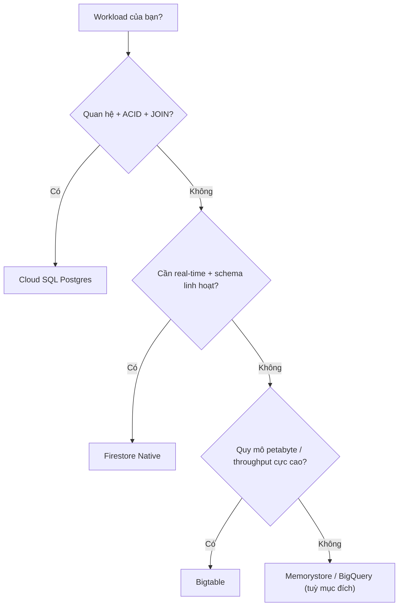

# 🗄️ GCP Cloud SQL + Firestore

> **Tác giả:** Mr.Rom\
> **Phiên bản:** v2.0.2\
> **Tạo lúc:** 24/05/2026\
> **Cập nhật:** 11/06/2026\
> **Level:** Basic (bài 03/5)\
> **Tags:** [MUST-KNOW]\
> **Yêu cầu trước:** Bài [02_cloud-storage-and-iam](02_cloud-storage-and-iam.md) ✅, biết cơ bản SQL và NoSQL

> 🎯 *Một ứng dụng thật hiếm khi sống bằng một loại cơ sở dữ liệu duy nhất. Bài này đi qua hai trụ cột lưu trữ của GCP: Cloud SQL (Postgres/MySQL được quản lý, tương đương AWS RDS) cho dữ liệu quan hệ cần ACID, và Firestore (NoSQL document được quản lý, tương đương AWS DynamoDB ở chế độ document) cho dữ liệu linh hoạt và real-time. Bạn sẽ học cách tạo instance HA, kết nối an toàn qua Cloud SQL Auth Proxy, bật IAM database authentication, backup và PITR; rồi sang Firestore với data model, Security Rules, real-time listener, Native vs Datastore mode; cuối cùng là khung quyết định khi nào nên dùng cái nào.*

## 🎯 Sau bài này bạn sẽ

- [ ] Tạo **Cloud SQL Postgres** với HA Multi-zone + read replica
- [ ] Kết nối Cloud SQL từ GCE/Cloud Run qua **Cloud SQL Auth Proxy** (không cần public IP)
- [ ] Cấu hình **IAM database authentication** (không cần mật khẩu)
- [ ] Backup tự động + **Point-in-Time Recovery** (PITR)
- [ ] Thiết kế **Firestore data model** đúng (subcollection vs flat)
- [ ] Viết **Security Rules** Firestore an toàn
- [ ] Dùng **real-time listener** của Firestore cho live update
- [ ] Phân biệt Firestore **Native mode** và **Datastore mode**
- [ ] Quyết định **Cloud SQL vs Firestore vs Spanner vs Bigtable** theo từng workload

---

## Tình huống — Acme Shop chọn database

Bạn nhận một yêu cầu nghe có vẻ đơn giản nhưng lại là cái bẫy kinh điển của người mới: "chọn database cho dự án". Người phụ trách kỹ thuật mô tả nhu cầu của Acme Shop như sau:

> *"Acme Shop cần ba thứ: bảng user/order/product (quan hệ, cần ACID), giỏ hàng và session (kiểu key-value, đọc/ghi nhanh), và chat real-time (dạng document, cần listener đẩy update). Bạn thiết kế database stack đi."*

Cái bẫy nằm ở chỗ: nếu cố nhét cả ba nhu cầu vào một database, bạn sẽ phải gồng một công cụ làm việc nó không giỏi. Ba nhu cầu này có ba bản chất khác nhau, nên lời giải tự nhiên là ba database khác nhau:

- **User/order/product** → Cloud SQL Postgres: dữ liệu quan hệ, cần ACID và truy vấn phức tạp (JOIN, GROUP BY).
- **Cart/session** → Firestore: dạng document, truy cập nhanh theo ID.
- **Chat real-time** → Firestore: có sẵn real-time listener, không cần tự dựng cơ chế đẩy.

Phần còn lại của bài sẽ giúp bạn hiểu *vì sao* lại chia như vậy, và *dùng đúng* từng loại.

---

## 1️⃣ Cloud SQL — Managed Postgres/MySQL

Bắt đầu với loại database quen thuộc nhất: cơ sở dữ liệu quan hệ. Điều bạn cần nắm trước tiên là Cloud SQL không phải một engine mới — nó vẫn là Postgres (hoặc MySQL) thật, chỉ khác là Google lo phần hạ tầng giúp bạn.

🪞 **Ẩn dụ**: *Cloud SQL như một **căn hộ dịch vụ** — Google chăm sóc hạ tầng (backup, patch, HA), bạn chỉ việc "ở" trong đó mà chạy query. Engine vẫn là 100% Postgres open-source, nên không lo bị khoá vào cú pháp riêng (vendor lock-in). So với NoSQL kiểu DynamoDB, SQL có "luật nhà" rõ ràng (schema, foreign key) — chặt chẽ hơn nhưng cũng dễ đoán hơn.*

### Engines (các engine)

Cloud SQL hỗ trợ ba engine, mỗi cái phục vụ một bối cảnh khác nhau. Mặc định nên chọn PostgreSQL trừ khi bạn đã bị ràng buộc bởi hệ sinh thái cũ.

| Engine | Use case |
|---|---|
| **PostgreSQL** | Mặc định 2026 — nhiều tính năng, hỗ trợ JSON, full-text search |
| **MySQL** | Hệ sinh thái cũ (legacy) |
| **SQL Server** | Stack Windows/.NET |

### Instance types (loại instance)

Sau khi chọn engine, bạn chọn kích thước máy (instance type). GCP cho phép cấu hình CPU/RAM khá linh hoạt — từ máy tí hon cho dev đến máy lớn cho production tải nặng.

| Tier | CPU/RAM | Khi dùng |
|---|---|---|
| `db-f1-micro` | 1/0.6 GB | Dev/test |
| `db-custom-1-3840` | 1/3.75 GB | Production nhỏ |
| `db-custom-2-7680` | 2/7.5 GB | Production trung bình |
| `db-custom-8-30720` | 8/30 GB | Production lớn |
| `db-perf-optimized-N-*` | Loại mới (2024+), NVMe local | OLTP cần IOPS cao |

### Tạo instance HA

Với production, điểm quan trọng nhất không phải kích thước mà là tính sẵn sàng cao (HA). Lệnh dưới đây tạo một instance Postgres ở chế độ HA Multi-zone, kèm backup tự động và PITR — đây là cấu hình "đủ chuẩn production" mà bạn nên dùng làm điểm khởi đầu.

```bash
gcloud sql instances create acmeshop-db \
    --database-version=POSTGRES_16 \
    --tier=db-custom-2-7680 \
    --region=asia-southeast1 \
    --availability-type=REGIONAL \
    --storage-type=SSD \
    --storage-size=100 \
    --storage-auto-increase \
    --backup \
    --backup-start-time=03:00 \
    --enable-point-in-time-recovery \
    --retained-backups-count=30
```

Hai cờ quyết định nhất ở đây là tính sẵn sàng và khả năng phục hồi:

- `--availability-type=REGIONAL` bật HA Multi-zone: có một primary và một standby ở zone khác, tự động failover trong 60-120 giây nếu primary chết.
- `--enable-point-in-time-recovery` bật PITR: cho phép restore về *bất kỳ giây nào* trong 7 ngày gần nhất.

### Read replica

Khi lượng truy vấn đọc tăng (báo cáo, analytics) bắt đầu làm chậm primary, giải pháp là tách phần đọc ra một bản sao chỉ-đọc (read replica). Replica sync dữ liệu từ primary và gánh các truy vấn nặng giúp primary tập trung phục vụ ghi.

```bash
gcloud sql instances create acmeshop-db-replica \
    --master-instance-name=acmeshop-db \
    --tier=db-custom-2-7680 \
    --region=asia-southeast1
```

Replica này là read-only, rất hợp cho các truy vấn analytics và report mà không động chạm đến tải ghi của primary.

### Connection — Cloud SQL Auth Proxy

Có một câu hỏi luôn xuất hiện: kết nối tới Cloud SQL thế nào cho an toàn mà không phải mở public IP? Câu trả lời của GCP là Cloud SQL Auth Proxy — một tiến trình trung gian dựng đường hầm mã hoá tới database và xác thực bạn qua IAM.

🪞 **Ẩn dụ**: *Auth Proxy như một **xe đưa rước có tài xế tin cậy** — bạn không cần biết đường, không cần lo giấy tờ; Proxy tự xác thực danh tính IAM của bạn rồi mở đường hầm an toàn vào tận database.*

```bash
# Cài proxy (kiểm tra release mới nhất tại github.com/GoogleCloudPlatform/cloud-sql-proxy/releases)
curl -o cloud-sql-proxy https://storage.googleapis.com/cloud-sql-connectors/cloud-sql-proxy/v2.10.0/cloud-sql-proxy.linux.amd64
chmod +x cloud-sql-proxy

# Chạy proxy ở local
./cloud-sql-proxy acmeshop-prod:asia-southeast1:acmeshop-db --port=5432 &

# Kết nối như đang gọi database local
psql "host=127.0.0.1 port=5432 user=postgres dbname=postgres"
```

Kết quả là bạn kết nối tới `127.0.0.1` như thể database nằm ngay trên máy mình, trong khi thực tế lưu lượng được mã hoá TLS, xác thực qua IAM, và Cloud SQL không cần bật public IP.

### IAM database authentication

Mật khẩu là điểm yếu cố hữu: dễ lộ, khó xoay vòng, khó audit. IAM database authentication giải quyết bằng cách để người dùng đăng nhập bằng chính danh tính Google của họ, không cần mật khẩu.

```bash
# Bật IAM auth
gcloud sql instances patch acmeshop-db --database-flags=cloudsql.iam_authentication=on

# Tạo user gắn với một IAM identity
gcloud sql users create an.nguyen@acmeshop.vn \
    --instance=acmeshop-db \
    --type=cloud_iam_user
```

Sau bước này, user đăng nhập bằng Google identity thay vì mật khẩu, và mọi truy cập đều có audit log đầy đủ — vừa an toàn hơn vừa dễ truy vết hơn.

### Backup + PITR

Một database production không có chiến lược backup là một quả bom hẹn giờ. Cloud SQL cung cấp ba lớp bảo vệ dữ liệu, từ backup hằng ngày đến phục hồi tới từng giây và lưu trữ dài hạn ra ngoài.

- **Automated backup**: chạy hằng ngày, giữ từ 7 đến 365 ngày.
- **PITR**: khi bật, có thể restore về *mọi giây* trong 7 ngày qua (dựa trên binlog/WAL).
- **Export to GCS**: dump SQL ra một bucket để lưu trữ dài hạn (archive).

```bash
# Backup thủ công
gcloud sql backups create --instance=acmeshop-db

# Phục hồi tới một thời điểm chính xác (PITR)
gcloud sql instances clone acmeshop-db acmeshop-db-restore \
    --point-in-time='2026-05-23T14:30:00.000Z'

# Export ra GCS
gcloud sql export sql acmeshop-db gs://acmeshop-backups/sql/dump-$(date +%Y%m%d).sql \
    --database=app
```

Điểm đáng nhớ: PITR cho phép "tua ngược" database về đúng giây trước khi sự cố xảy ra (ví dụ một câu `DELETE` nhầm), điều mà backup hằng ngày không làm được vì sẽ mất tới 24 giờ dữ liệu.

---

## 2️⃣ Firestore — Managed NoSQL document

Chuyển sang trụ cột thứ hai. Khi dữ liệu của bạn linh hoạt về cấu trúc, cần truy cập nhanh theo ID, hoặc cần đẩy update real-time tới frontend, thì database quan hệ không còn là lựa chọn tự nhiên nữa. Firestore sinh ra cho đúng những bài toán đó.

🪞 **Ẩn dụ**: *Firestore như một **tủ hồ sơ** — mỗi document là một hồ sơ JSON; collection là một ngăn tủ. Lấy một hồ sơ ra cực nhanh nếu bạn biết mã (ID); còn muốn tìm theo điều kiện phức tạp thì cần Index — đóng vai trò như "mục lục" của tủ.*

### Data model (mô hình dữ liệu)

Trước khi viết code, cần nắm ba khái niệm cấu trúc của Firestore. Chúng lồng nhau theo kiểu cây thư mục, nên rất dễ hình dung.

- **Collection** = thư mục chứa các document (ví dụ `users`, `orders`).
- **Document** = một object JSON có ID duy nhất trong collection.
- **Subcollection** = collection nằm bên trong một document (`users/<uid>/cart`).

Sơ đồ dưới đây minh hoạ cách một user, document con của họ và subcollection giỏ hàng lồng vào nhau:

```text
firestore
└── users (collection)
    ├── user_001 (document)
    │   ├── name: "Nguyen Van A"
    │   ├── email: "an.nguyen@acmeshop.vn"
    │   └── cart (subcollection)
    │       ├── item_001 (document)
    │       └── item_002 (document)
    └── user_002 (document)
```

### Native vs Datastore mode

Firestore có hai chế độ hoạt động, và đây là một lựa chọn *không thể đổi lại* sau khi tạo project — nên hiểu rõ trước khi chọn là rất quan trọng.

| Mode | Khi chọn |
|---|---|
| **Native** (mặc định 2026) | Real-time listener, SDK mobile/web, strong consistency, transactions |
| **Datastore** | Tương thích ngược với app App Engine cũ; throughput cao hơn |

Với dự án mới, gần như luôn chọn Native mode. Datastore mode là nhánh dành cho hệ thống cũ và đang ở trạng thái deprecated path — chỉ giữ để tương thích, không nên chọn cho cái mới.

### Quota & limit (hạn mức & giới hạn)

Firestore tính phí và giới hạn theo thao tác chứ không theo dung lượng instance. Nắm các giới hạn này từ sớm giúp bạn tránh thiết kế sai (ví dụ ghi quá nhiều vào một document).

| Item | Limit |
|---|---|
| Document size | 1 MB |
| Write rate per doc | 1 write/giây sustained |
| Read/write/delete | 50k read / 20k write / 20k delete free tier/ngày |

Lưu ý giới hạn "1 write/giây sustained" cho mỗi document — đây chính là nguồn gốc của bẫy "hot document" mà ta sẽ gặp lại ở phần cạm bẫy.

### CRUD ví dụ (Python)

Để thấy Firestore hoạt động trong code, đây là bốn thao tác cơ bản (tạo, đọc, sửa, truy vấn, xoá) qua thư viện Python. Để ý cách truy cập một document luôn đi qua cặp `collection().document()`.

```python
from google.cloud import firestore
from google.cloud.firestore_v1.base_query import FieldFilter

db = firestore.Client()

# Create
db.collection("users").document("user_001").set({
    "name": "Nguyen Van A",
    "email": "an.nguyen@acmeshop.vn",
    "created_at": firestore.SERVER_TIMESTAMP,
})

# Read
doc = db.collection("users").document("user_001").get()
print(doc.to_dict())

# Update
db.collection("users").document("user_001").update({
    "last_login": firestore.SERVER_TIMESTAMP,
})

# Query (dùng FieldFilter — cú pháp positional cũ đã deprecated)
results = db.collection("users").where(
    filter=FieldFilter("email", ">=", "an")
).limit(10).stream()

# Delete
db.collection("users").document("user_001").delete()
```

Một lưu ý quan trọng cho code 2026: cú pháp `.where("field", "op", value)` kiểu positional đã bị deprecated (SDK sẽ cảnh báo), nên ví dụ trên dùng `FieldFilter` — đây là cách viết chuẩn hiện hành.

### Real-time listener

Đây là tính năng làm nên tên tuổi của Firestore và là lý do nó hợp cho chat. Thay vì frontend phải liên tục hỏi "có gì mới không?" (polling), bạn đăng ký một listener và Firestore tự đẩy thay đổi về mỗi khi dữ liệu biến động.

```python
def on_snapshot(col_snapshot, changes, read_time):
    for change in changes:
        print(f"{change.type.name}: {change.document.id}")

db.collection("chat/room1/messages").on_snapshot(on_snapshot)
# → mỗi message mới sẽ trigger callback
```

Frontend (React, Flutter...) dùng SDK với cơ chế tương tự, nhờ vậy giao diện chat cập nhật real-time mà bạn không phải tự viết WebSocket hay hàng đợi đẩy.

### Composite Index

Firestore tự tạo index cho truy vấn một trường, nhưng khi bạn lọc/sắp xếp trên nhiều trường cùng lúc thì phải khai báo composite index — nếu không, truy vấn sẽ báo lỗi yêu cầu tạo index.

```bash
# Tạo index cho query nhiều trường
gcloud firestore indexes composite create \
    --collection-group=orders \
    --field-config=field-path=status,order=ascending \
    --field-config=field-path=created_at,order=descending
```

Quy tắc dễ nhớ: index đơn-trường được tạo tự động; còn composite (nhiều trường) thì *bạn phải khai báo* trước.

---

## 3️⃣ Firestore Security Rules

Một điểm khác biệt lớn của Firestore so với database quan hệ: client (web/mobile) có thể nói chuyện trực tiếp với database. Điều đó tiện nhưng nguy hiểm nếu không có lớp kiểm soát — và đó chính là vai trò của Security Rules.

🪞 **Ẩn dụ**: *Security Rules như **bảo vệ ở quầy lễ tân** — kiểm tra bốn thứ trước khi cho qua: ai (auth), muốn làm gì (read/write/list), với hồ sơ nào (path), trong điều kiện nào (custom condition).*

### Rules ví dụ

Bộ rules dưới đây minh hoạ ba mức truy cập thường gặp: user chỉ chạm được hồ sơ của chính mình, order có phân quyền user/admin, và product công khai cho đọc nhưng chỉ admin được ghi.

```javascript
rules_version = '2';
service cloud.firestore {
  match /databases/{database}/documents {
    // User chỉ đọc/sửa hồ sơ của chính mình
    match /users/{userId} {
      allow read, write: if request.auth.uid == userId;
    }

    // Order: user đọc của mình; admin đọc tất cả
    match /orders/{orderId} {
      allow read: if request.auth.uid == resource.data.user_id
                  || request.auth.token.admin == true;
      allow create: if request.auth != null
                    && request.resource.data.user_id == request.auth.uid;
      allow update, delete: if request.auth.token.admin == true;
    }

    // Product công khai
    match /products/{productId} {
      allow read: if true;
      allow write: if request.auth.token.admin == true;
    }
  }
}
```

### Deploy rules

Rules được deploy qua Firebase CLI. Đây là một file riêng, tách khỏi code ứng dụng, nên có thể review và version như mọi tài sản hạ tầng khác.

```bash
firebase deploy --only firestore:rules
```

### Test rules

Đừng deploy rules mà chưa test — một rule lỏng có thể mở toang database. Firestore emulator cho phép chạy rules ở local và viết unit test trước khi đưa lên production.

```bash
# Firestore emulator + unit test
firebase emulators:start --only firestore
# Viết test trong code với @firebase/rules-unit-testing
```

---

## 4️⃣ Quyết định database nào

Đến đây bạn đã thấy hai công cụ chính. Nhưng GCP còn nhiều database khác, và câu hỏi thực tế luôn là: với một workload cụ thể, nên chọn cái nào? Phần này cho bạn khung quyết định.

🪞 **Ẩn dụ**: *Chọn database như **chọn phương tiện đi lại** — Cloud SQL như **ô tô** (đa năng, biết đường rành); Firestore như **xe đạp điện** (linh hoạt, nhanh cho đoạn ngắn); Spanner như **máy bay** (mạnh, đắt, đi xuyên châu lục); Bigtable như **tàu hàng** (chở khối lượng khổng lồ, không cần SQL).*

### Ma trận quyết định (Decision matrix)

Sơ đồ dưới rút gọn lựa chọn thường gặp nhất thành một cây quyết định: bắt đầu từ bản chất dữ liệu rồi lần theo nhánh tới database phù hợp.



Cây này phủ phần lớn quyết định hằng ngày; các nhánh hiếm hơn (Spanner toàn cầu, OLAP) nằm trong bảng đầy đủ ngay bên dưới. Bảng này ánh xạ từng loại workload sang database GCP phù hợp nhất, kèm lý do ngắn gọn. Hãy đọc nó như một bảng tra: xác định workload của bạn ở cột trái rồi đối chiếu sang đề xuất.

| Workload | Đề xuất | Vì sao |
|---|---|---|
| Quan hệ, ACID, JOIN phức tạp | **Cloud SQL Postgres** | Engine chuẩn, hệ sinh thái rộng |
| Lưu document, app mobile/web | **Firestore Native** | Real-time listener, SDK đầy đủ |
| SQL toàn cầu, multi-region strong consistency | **Cloud Spanner** | Phân tán toàn cầu, hiếm khi cần |
| Wide-column throughput cao (IoT, telemetry) | **Bigtable** | Quy mô petabyte, latency < 10ms |
| Session/cache | **Memorystore (Redis)** | In-memory |
| Analytics, OLAP | **BigQuery** | Data warehouse serverless |
| Time-series (metric, log) | **Bigtable** hoặc **BigQuery** | Write throughput cao |

### So sánh Cloud SQL vs Firestore

Vì Cloud SQL và Firestore là hai lựa chọn bạn sẽ phải cân nhắc nhiều nhất, bảng dưới đặt chúng cạnh nhau theo từng khía cạnh. Điểm mấu chốt: chúng không thay thế nhau mà bù trừ — mỗi cái mạnh ở chỗ cái kia yếu.

| Khía cạnh | Cloud SQL | Firestore |
|---|---|---|
| Schema | Chặt (CREATE TABLE) | Schemaless (JSON) |
| Transactions | ACID nhiều dòng | Giới hạn (tối đa 10 docs trong một tx) |
| Query | SQL đầy đủ (JOIN, GROUP BY, window) | Giới hạn (không JOIN, không full-text) |
| Real-time | Polling/CDC | Listener có sẵn |
| Scalability | Dọc (theo kích thước instance) | Ngang, tự động |
| Latency | 5-20ms điển hình | 50-200ms (network + serverless) |
| Cost | Theo instance (flat) | Theo từng thao tác (read/write/delete) |

Tóm lại: cần JOIN, transaction nhiều dòng, truy vấn phức tạp → Cloud SQL. Cần real-time, scale ngang tự động, schema linh hoạt → Firestore.

---

## 🛠️ Hands-on — Acme Shop DB stack

### Mục tiêu

Quay lại bài toán đầu bài, giờ ta dựng thật: Cloud SQL Postgres cho user/order, và Firestore cho cart/session. Mỗi bước dưới đây tự đủ — bạn chạy lần lượt từ trên xuống.

### Bước 1 — Cloud SQL Postgres

Trước hết tạo instance Postgres HA, rồi tạo database và user, bật IAM auth, và cuối cùng kết nối qua proxy. Lưu ý cách tạo mật khẩu: không đặt mật khẩu literal thẳng trên dòng lệnh (sẽ lộ trong shell history) mà sinh ngẫu nhiên.

```bash
# Tạo instance
gcloud sql instances create acmeshop-db \
    --database-version=POSTGRES_16 \
    --tier=db-custom-2-7680 \
    --region=asia-southeast1 \
    --availability-type=REGIONAL \
    --backup --backup-start-time=03:00 \
    --enable-point-in-time-recovery

# Tạo DB + user (sinh mật khẩu ngẫu nhiên, không đặt literal trên CLI)
gcloud sql databases create app --instance=acmeshop-db
gcloud sql users create app_user --instance=acmeshop-db --password="$(openssl rand -base64 20)"

# User dùng IAM auth (không cần mật khẩu)
gcloud sql instances patch acmeshop-db --database-flags=cloudsql.iam_authentication=on
gcloud sql users create an.nguyen@acmeshop.vn \
    --instance=acmeshop-db --type=cloud_iam_user

# Kết nối qua proxy
./cloud-sql-proxy acmeshop-prod:asia-southeast1:acmeshop-db --port=5432 &
psql "host=127.0.0.1 port=5432 user=app_user dbname=app"
```

### Bước 2 — Schema

Có database rồi, dựng schema quan hệ cho user và order. Để ý `REFERENCES users(id)` tạo foreign key — đây chính là thứ database quan hệ làm tốt còn Firestore không có.

```sql
CREATE TABLE users (
    id SERIAL PRIMARY KEY,
    email VARCHAR(255) UNIQUE NOT NULL,
    name VARCHAR(100),
    created_at TIMESTAMPTZ DEFAULT NOW()
);

CREATE TABLE orders (
    id SERIAL PRIMARY KEY,
    user_id INTEGER REFERENCES users(id),
    total_cents BIGINT NOT NULL,
    status VARCHAR(20),
    created_at TIMESTAMPTZ DEFAULT NOW()
);

CREATE INDEX idx_orders_user ON orders(user_id);
```

### Bước 3 — Firestore Native

Sang phần document. Bật Firestore ở Native mode (nhớ: mode chỉ chọn được một lần cho mỗi project), rồi backend ghi giỏ hàng theo `user_id` làm document ID để truy cập nhanh.

```bash
# Bật Firestore Native (mode chỉ chọn 1 lần)
gcloud firestore databases create --location=asia-southeast1
```

```python
# Backend ghi cart
db.collection("carts").document(user_id).set({
    "items": [{"product_id": "p1", "qty": 2}],
    "updated_at": firestore.SERVER_TIMESTAMP,
})
```

### Bước 4 — Security Rules

Giỏ hàng là dữ liệu riêng tư, nên rule tối thiểu là: chỉ chính chủ mới đọc/ghi được cart của mình.

```javascript
match /carts/{userId} {
  allow read, write: if request.auth.uid == userId;
}
```

### Bước 5 — Verify

Cuối cùng, kiểm tra cả hai phía hoạt động: Cloud SQL insert/query được, và Firestore rules chạy đúng trong emulator trước khi đụng tới production.

```bash
# Cloud SQL: insert + query
psql -h 127.0.0.1 -U app_user -d app -c "INSERT INTO users (email, name) VALUES ('test@x.com', 'Test')"
psql -h 127.0.0.1 -U app_user -d app -c "SELECT * FROM users"

# Firestore: backend ghi, frontend listen
firebase emulators:start --only firestore  # test rules
```

---

## 💡 Cạm bẫy thường gặp & Best practice

Phần này gom những lỗi hay gặp nhất khi vận hành Cloud SQL và Firestore thật. Mỗi mục nêu cái bẫy trước, rồi cách xử lý.

### 1. Cloud SQL bật public IP

**Bẫy**: Cloud SQL mặc định bật public IP → ai biết user/mật khẩu là kết nối được từ Internet.

**Fix**: Tắt public IP, dùng **Cloud SQL Auth Proxy** kết hợp private IP.

### 2. Không bật PITR

**Bẫy**: Chỉ backup hằng ngày → một sự cố lúc 23h có thể làm mất tới 24 giờ dữ liệu.

**Fix**: Bật `--enable-point-in-time-recovery` để restore về đúng từng giây.

### 3. Instance single-zone cho production

**Bẫy**: `--availability-type=ZONAL` → zone đó chết là database chết theo.

**Fix**: Production luôn dùng `REGIONAL` (HA Multi-zone).

### 4. Firestore "hot document"

**Bẫy**: Ghi một bộ đếm (counter) vào đúng một document → đụng trần 1 write/giây sustained → bị throttle.

**Fix**: Dùng pattern **distributed counter** — chia counter thành N shard rồi cộng dồn.

### 5. Firestore Security Rules quá lỏng

**Bẫy**: Để `allow read, write: if true` cho tiện lúc dev → quên thay → database công khai cho cả thế giới.

**Fix**: Mặc định deny, chỉ allow khi đã auth và path đúng.

### 6. Quên tạo composite index

**Bẫy**: Query `where("status", "==", "active").orderBy("created_at")` báo lỗi "needs composite index".

**Fix**: Khai báo composite index trong `firestore.indexes.json` rồi deploy.

### 7. Khoá nhầm Firestore mode

**Bẫy**: Tạo project ở Datastore mode → muốn chuyển sang Native không được (mode bất biến với mỗi project).

**Fix**: Project mới luôn chọn Native; nếu lỡ chọn nhầm thì phải tạo project mới.

### 8. Backup mà không test restore

**Bẫy**: Backup chạy đều đặn nhưng chưa bao giờ thử restore → đến lúc cần thật mới phát hiện backup hỏng.

**Fix**: Test restore định kỳ hằng quý (DR drill).

---

## 🧠 Tự kiểm tra (Self-check)

- [ ] Tạo được Cloud SQL HA + read replica và bật PITR?
- [ ] Kết nối qua Cloud SQL Auth Proxy mà không cần public IP?
- [ ] Cấu hình IAM database authentication cho một user?
- [ ] Thiết kế Firestore subcollection cho user/cart?
- [ ] Viết Security Rules ngăn user đọc cart của user khác?
- [ ] Viết real-time listener trong Python cho collection `chat/room1/messages`?
- [ ] Quyết định Cloud SQL vs Firestore vs Spanner vs Bigtable cho 5 workload khác nhau?

---

## ⚡ Tra cứu nhanh (Cheatsheet)

Các lệnh và mốc số liệu hay dùng nhất, gom lại để tra nhanh khi làm việc thật.

```bash
# Cloud SQL — tạo instance HA + PITR
gcloud sql instances create <name> --database-version=POSTGRES_16 \
    --availability-type=REGIONAL --enable-point-in-time-recovery

# Cloud SQL — read replica
gcloud sql instances create <name>-replica --master-instance-name=<name>

# Cloud SQL — bật IAM auth + tạo IAM user
gcloud sql instances patch <name> --database-flags=cloudsql.iam_authentication=on
gcloud sql users create <email> --instance=<name> --type=cloud_iam_user

# Cloud SQL — kết nối qua proxy
./cloud-sql-proxy <project>:<region>:<name> --port=5432 &

# Cloud SQL — PITR restore
gcloud sql instances clone <name> <name>-restore --point-in-time='<RFC3339>'

# Firestore — bật Native mode
gcloud firestore databases create --location=<region>

# Firestore — tạo composite index
gcloud firestore indexes composite create --collection-group=<col> \
    --field-config=field-path=<f1>,order=ascending \
    --field-config=field-path=<f2>,order=descending

# Firestore — deploy + test rules
firebase deploy --only firestore:rules
firebase emulators:start --only firestore
```

| Cần nhớ | Giá trị |
|---|---|
| HA Cloud SQL | `--availability-type=REGIONAL` (failover 60-120s) |
| PITR window | 7 ngày |
| Firestore document size | tối đa 1 MB |
| Firestore write rate/doc | 1 write/giây sustained |
| Firestore free tier/ngày | 50k read / 20k write / 20k delete |
| Firestore transaction | tối đa 10 docs |

---

## 📚 Từ Điển Thuật Ngữ (Glossary)

| Thuật ngữ | Tiếng Việt | Giải thích |
|---|---|---|
| **Cloud SQL** | DB quan hệ được quản lý | Postgres/MySQL/SQL Server do Google vận hành |
| **HA (Regional)** | Sẵn sàng cao đa-zone | Primary + standby ở zone khác, tự động failover |
| **Read replica** | Bản sao chỉ-đọc | DB read-only sync từ primary, gánh tải đọc |
| **PITR** | Phục hồi tới thời điểm | Point-in-Time Recovery — restore về giây bất kỳ |
| **Cloud SQL Auth Proxy** | Proxy xác thực | Tiến trình trung gian kết nối Cloud SQL qua IAM |
| **IAM Database Authentication** | Xác thực DB qua IAM | Đăng nhập DB bằng Google identity, không mật khẩu |
| **Firestore** | DB document NoSQL được quản lý | Lưu document JSON, có real-time listener |
| **Native mode** | Chế độ Native | Mặc định 2026 — listener real-time, SDK đầy đủ |
| **Datastore mode** | Chế độ Datastore | Tương thích ngược với App Engine cũ |
| **Collection** | Bộ sưu tập | Container chứa các document |
| **Document** | Tài liệu | Object JSON có ID duy nhất trong collection |
| **Subcollection** | Bộ sưu tập con | Collection nằm bên trong một document |
| **Composite Index** | Chỉ mục đa-trường | Index nhiều trường, phải khai báo thủ công |
| **Security Rules** | Luật bảo mật | Logic auth/authz trên Firestore (cú pháp Firebase) |
| **Distributed counter** | Bộ đếm phân tán | Pattern chia counter ra N shard, tránh hot document |
| **Spanner** | Cloud Spanner | DB SQL phân tán toàn cầu |
| **Bigtable** | Cloud Bigtable | NoSQL wide-column, quy mô petabyte |
| **Memorystore** | Memorystore | Redis/Memcached được quản lý |

---

## 🔗 Liên kết & Tài nguyên

### 🧭 Định hướng lộ trình học

- ⬅️ **Bài trước:** [GCP Cloud Storage + IAM](02_cloud-storage-and-iam.md)
- ➡️ **Bài tiếp theo:** [GCP Cloud Functions + Cloud Run + API Gateway](04_cloud-functions-cloud-run-and-api-gateway.md)
- ↑ **Về cụm:** [GCP (Google Cloud Platform)](../../README.md)

### 🧩 Các chủ đề có thể bạn quan tâm

- ☁️ **Tương đương bên AWS:** [AWS RDS + DynamoDB](../../../aws/lessons/01_basic/03_rds-and-dynamodb.md)
- 🗄️ **Đào sâu engine:** [PostgreSQL cơ bản](../../../../06_databases/postgresql/)

### 🌐 Tài nguyên tham khảo khác

- 📖 [Cloud SQL docs](https://cloud.google.com/sql/docs) — tài liệu gốc Cloud SQL.
- 📖 [Cloud SQL Auth Proxy](https://cloud.google.com/sql/docs/postgres/sql-proxy) — hướng dẫn proxy kết nối an toàn.
- 📖 [Firestore docs](https://cloud.google.com/firestore/docs) — tài liệu gốc Firestore.
- 📖 [Firestore Security Rules](https://firebase.google.com/docs/firestore/security/get-started) — hướng dẫn viết rules.
- 📖 [Spanner docs](https://cloud.google.com/spanner/docs) — tài liệu Cloud Spanner.
- 📖 [Bigtable docs](https://cloud.google.com/bigtable/docs) — tài liệu Cloud Bigtable.
- 📖 [Distributed counter pattern](https://firebase.google.com/docs/firestore/solutions/counters) — pattern tránh hot document.

---

## 📌 Nhật ký thay đổi (Changelog)

- **v1.0.0 (24/05/2026)** — Bản đầu tiên. Bài 03 GCP basic. Cloud SQL Postgres HA + read replica + PITR + Auth Proxy + IAM DB auth + Firestore Native data model + Security Rules + real-time listener + composite index + decision matrix 7 DB GCP + hands-on Acme Shop stack + 8 pitfalls.
- **v2.0.0 (01/06/2026)** — Viết lại toàn bộ prose sang tiếng Việt narrative theo gold-standard (lời dẫn 2-3 câu trước mỗi bảng/code/list, câu phân tích sau, câu bắc cầu giữa các section, ẩn dụ giữ nguyên). Chuẩn hoá: field metadata "Yêu cầu trước"; Glossary 3 cột; nav (⬅️/➡️/↑ + tiêu đề H1 thực, bỏ nhãn "sắp viết"); bổ sung mục Cheatsheet. Sửa kỹ thuật: POSTGRES_15 → POSTGRES_16; `.where()` positional → `FieldFilter`; bỏ mật khẩu literal trên CLI (dùng `openssl rand`); thay placeholder "Mr.Rom" → "Nguyen Van A"; ghi chú kiểm tra release mới nhất cho cloud-sql-proxy.
- **v2.0.1 (11/06/2026)** — Việt hoá heading nội dung mô tả sang tiếng Việt (giữ thuật ngữ/brand/param) theo Vietnamese-first.
- **v2.0.2 (11/06/2026)** — Bổ sung sơ đồ cây quyết định chọn database (Cloud SQL vs Firestore vs Bigtable) cho trực quan.
