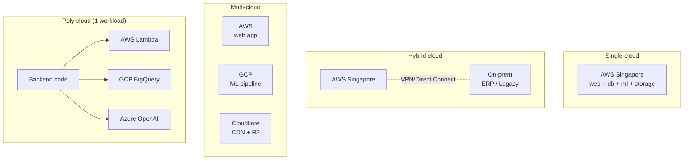
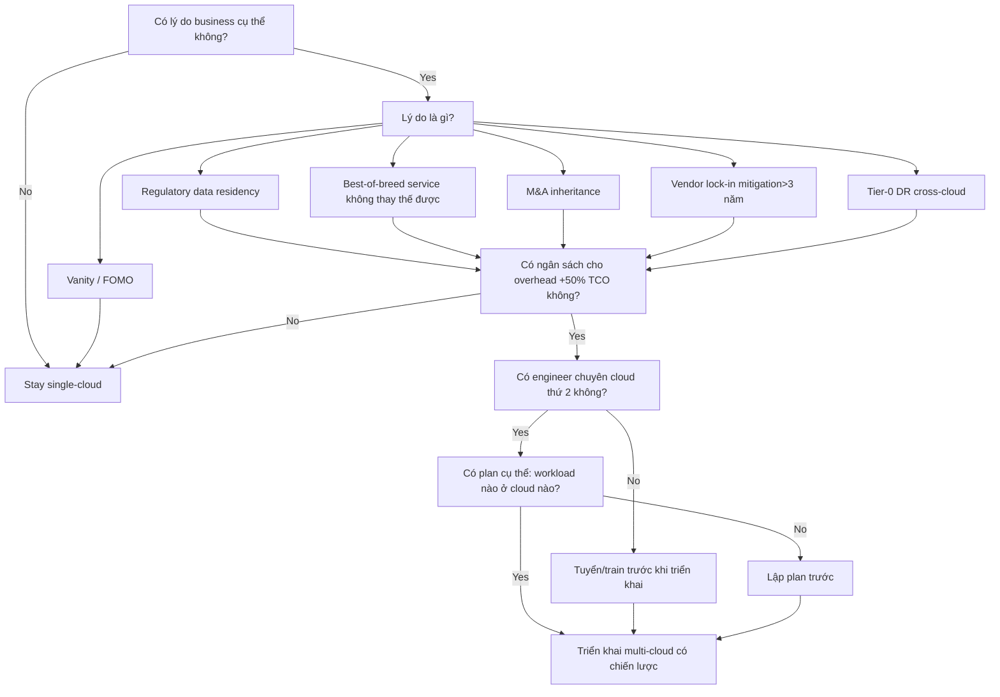

# 🎓 Multi-cloud Overview — Định nghĩa, lý do, khi nên/không nên 2026

> **Tác giả:** Mr.Rom\
> **Phiên bản:** v1.1.1\
> **Tạo lúc:** 24/05/2026\
> **Cập nhật:** 11/06/2026
> **Level:** Basic (bài 00/5)\
> **Tags:** [MUST-KNOW]\
> **Yêu cầu trước:** Đã xong [Cloud Fundamentals](../../../cloud-fundamentals/) ✅, có thực hành ít nhất 1 cloud (AWS hoặc GCP hoặc Azure)

> 🎯 *Bài đầu tiên cluster Multi-cloud. Bạn đã biết 1 cloud rồi (AWS/GCP/Azure); giờ học khi nào dùng nhiều cloud cùng lúc, lý do thật vs lý do giả, cost ops vs giảm lock-in. Bài này KHÔNG dạy lệnh — dạy chiến lược: định nghĩa, animal pattern (single/hybrid/multi/poly), số liệu 2026, anti-pattern "multi-cloud for multi-cloud sake".*

## 🎯 Sau bài này bạn sẽ

- [ ] Phân biệt **single cloud, hybrid cloud, multi-cloud, poly-cloud** rõ ràng
- [ ] Biết **5 lý do hợp lệ** áp dụng multi-cloud (regulatory, lock-in, best-of-breed, M&A, redundancy)
- [ ] Biết **3 anti-pattern** cần tránh (multi-cloud for vanity, premature multi-cloud, "lift and shift" mindset)
- [ ] Hiểu **chi phí ops thực tế** của multi-cloud (skill, tooling, network egress)
- [ ] Đọc được **survey 2026** (Flexera, Gartner) để tham chiếu khi pitch sếp
- [ ] Quyết định **có nên đi multi-cloud** cho dự án cụ thể

---

## Tình huống — Acme Shop "vô tình" thành multi-cloud

Sáng thứ Hai, sếp gọi bạn lên phòng họp:

> Sếp: *"Bạn ơi, mình vừa nhận được 1 báo cáo lo lắm. Acme Shop đang chạy production trên AWS Singapore. Nhưng tuần trước team Data ML triển khai pipeline trên **GCP** vì BigQuery + Vertex AI. Team Mobile thì xài **Firebase** (cũng GCP). Team SEO thì gắn **Cloudflare R2** để tiết kiệm egress. Đội Legal thì yêu cầu chuyển data Vietnamese customers về **VNG Cloud** hoặc **VietNam Data Lake** trong nước theo Nghị định 53. Sáng nay accounting báo Acme Shop đang trả tiền cho 4 cloud provider — mỗi tháng ~$50K. Mình hỏi bạn 2 câu: (1) Acme Shop có đang multi-cloud không? (2) Có phải mình đang lãng phí?"*

Bạn ngẩn người. Có vẻ Acme Shop đã trở thành multi-cloud mà không có chiến lược rõ ràng — đây gọi là *accidental multi-cloud* (multi-cloud "tình cờ", không chủ đích), một trong những lý do phổ biến nhất.

→ Bài này lấp đầy: định nghĩa rõ ràng, lý do hợp lệ vs accidental, framework quyết định có nên multi-cloud không, số liệu thị trường 2026.

---

## 1️⃣ Single, Hybrid, Multi, Poly — các pattern khác nhau ở đâu?

🪞 **Ẩn dụ**: *Coi mỗi cloud như **một thành phố** (Singapore = AWS, San Francisco = GCP, Seattle = Azure). Single-cloud = công ty chỉ có HQ ở 1 thành phố. Hybrid = HQ + nhà kho riêng (on-prem) tự sở hữu. Multi-cloud = mở chi nhánh ở nhiều thành phố. Poly-cloud = 1 sản phẩm dùng cùng lúc dịch vụ từ nhiều thành phố (ví dụ: thuê chef từ SF + giao hàng từ Singapore).*

### Định nghĩa chuẩn

| Pattern | Định nghĩa | Ví dụ Acme Shop |
|---|---|---|
| **Single-cloud** | Tất cả workload trên 1 public cloud provider | Acme Shop chỉ trên AWS Singapore |
| **Hybrid cloud** | Public cloud + private cloud / on-prem cùng workload | AWS + 1 server rack tại văn phòng Sài Gòn cho ERP |
| **Multi-cloud** | 2+ public cloud, workload phân tán (mỗi cloud cho workload riêng) | AWS cho web, GCP cho ML, Cloudflare cho CDN |
| **Poly-cloud** | 1 workload duy nhất dùng dịch vụ từ nhiều cloud cùng lúc | App backend chạy AWS Lambda nhưng đọc BigQuery + lưu file S3 |
| **Multi-region** | 1 cloud, 2+ region | AWS Singapore + AWS Tokyo (vẫn là single-cloud) |

> ⚠️ **Tránh nhầm**: Multi-region **KHÔNG** phải multi-cloud. Đó vẫn là 1 vendor — chỉ là khác datacenter. Multi-cloud yêu cầu 2+ **provider** khác nhau.

### Sơ đồ phân biệt

→ Pattern thường thấy: Single → Hybrid → Multi (theo thời gian khi công ty lớn lên).

### Vì sao phân biệt quan trọng

| Nếu nhầm | Hệ quả |
|---|---|
| Gọi "multi-region" là "multi-cloud" | Pitch sếp sai. Không thật sự giải quyết vendor lock-in |
| Gọi "hybrid" là "multi-cloud" | Lẫn lộn cost model. On-prem ≠ pay-as-you-go |
| Gọi "poly-cloud" là "multi-cloud" | Ops complexity khác hẳn — poly-cloud khó hơn 10x |

---

## 2️⃣ Acme Shop accidental multi-cloud — vì sao xảy ra?

Quay lại tình huống đầu bài. Acme Shop **không** có chiến lược multi-cloud — Acme Shop **trở thành** multi-cloud. Đây gọi là **accidental multi-cloud** và là pattern phổ biến nhất 2026.

### Các con đường dẫn đến accidental multi-cloud

| Con đường | Lý do | Ví dụ Acme Shop |
|---|---|---|
| **M&A** (sáp nhập) | Mua công ty đang chạy cloud khác | Acme Shop mua Foody-Clone đang trên Azure |
| **Best-of-breed** (chọn dịch vụ tốt nhất từng loại) | Team muốn 1 service đặc biệt của cloud khác | ML team thèm BigQuery |
| **Shadow IT** | Team tự đăng ký tài khoản không qua DevOps | Marketing tự xài Cloudflare Pages |
| **Compliance** | Luật yêu cầu data residency cụ thể | Vietnamese data buộc phải tại VN |
| **Free credit chase** | Startup theo $300 GCP / $1000 Azure credit | Acme Shop trial GCP cho recommendation engine |
| **SaaS lock-in** | Firebase, Auth0, Stripe đều "cloud" theo nghĩa rộng | Mobile team chọn Firebase |

→ Acme Shop có **tất cả 6** con đường trên đang xảy ra cùng lúc. Đây là điển hình của doanh nghiệp 200+ engineer.

### Số liệu 2026 (kèm nguồn)

| Source | Số liệu |
|---|---|
| **Flexera 2026 State of Cloud Report** | 89% enterprise đang multi-cloud (78% public+private hybrid, 11% multi-public only) |
| **Gartner forecast 2026** | "By 2027, 75% of enterprise will use 2+ public cloud providers" |
| **CNCF Survey 2025** | 76% K8s production workload phân bổ 2+ cloud |
| **HashiCorp State of Cloud 2026** | 72% có multi-cloud strategy chính thức, 28% accidental |

→ Nói cách khác: **đa số doanh nghiệp 2026 đã multi-cloud**, dù có chủ động hay không. Câu hỏi không còn là "có nên đi multi-cloud không" mà là **"làm sao quản lý multi-cloud cho tốt"**.

---

## 3️⃣ 5 lý do hợp lệ chọn multi-cloud

Không phải mọi lý do đều xứng đáng đánh đổi complexity. Đây là 5 lý do **hợp lệ** mà mình thấy đáng để đi multi-cloud có chiến lược.

### Lý do 1: Giảm thiểu vendor lock-in

🪞 **Ẩn dụ**: *Như chuyện không bỏ hết tiền tiết kiệm vào 1 ngân hàng — nếu ngân hàng đó tăng phí gấp 3 lần, bạn vẫn có lựa chọn rút sang chỗ khác.*

**Vì sao quan trọng**:
- AWS một sáng đẹp trời tăng giá S3 egress 30% → bạn không có leverage đàm phán nếu 100% chạy AWS.
- Hợp đồng EDP (Enterprise Discount Program) AWS thường lock 3 năm — multi-cloud cho bạn negotiating power.

**Acme Shop áp dụng**: chạy web trên AWS nhưng giữ option deploy lên GCP qua Terraform module portable. AWS biết Acme Shop có thể đi → đàm phán tốt hơn.

### Lý do 2: Service tốt nhất mỗi mảng (best-of-breed)

🪞 **Ẩn dụ**: *Như chuyện không phải mọi món ngon đều ở 1 nhà hàng. Pizza tốt nhất ở quán A, sushi tốt nhất ở quán B — bạn ăn ở 2 quán.*

**Services không thay thế được nhau (2026)**:

| Workload | Best service | Vendor |
|---|---|---|
| Data warehouse petabyte | BigQuery (serverless, pay-per-query) | GCP |
| Object storage cheap egress | R2 (zero egress fee) | Cloudflare |
| Enterprise AD integration | Entra ID + AKS | Azure |
| Most mature K8s | EKS / GKE | AWS / GCP |
| Email service | SES | AWS |
| Realtime mobile DB | Firebase Realtime DB | GCP |
| LLM inference latency | Bedrock (Claude/Llama) vs Azure OpenAI (GPT-4) | AWS / Azure |

**Acme Shop áp dụng**: ML team dùng BigQuery vì query SQL trên 500TB data còn nhanh hơn Redshift mà rẻ hơn 4x.

### Lý do 3: Quy định pháp lý / Data residency

🪞 **Ẩn dụ**: *Luật pháp như **biên giới quốc gia** — muốn bán hàng ở Trung Quốc phải mở văn phòng tại TQ; muốn lưu data Vietnamese phải tại VN.*

**Ví dụ luật 2026**:
- **Vietnam Nghị định 53/2022/NĐ-CP**: data người dùng Việt phải lưu tại VN (áp dụng cho service có 10K+ user/tháng).
- **EU GDPR + Schrems II**: data EU không được chuyển sang US nếu không có SCC + assessment.
- **China Cybersecurity Law**: data China stays in China — buộc dùng Alibaba Cloud / Tencent Cloud.
- **Russia Federal Law 242-FZ**: data Russian citizen phải lưu tại Nga.
- **India DPDP Act 2023**: data sensitive phải local.

**Acme Shop áp dụng**: 90% user là Vietnamese → Legal yêu cầu lưu PII tại VN. AWS Singapore + Tokyo không đủ. Multi-cloud với **VNG Cloud** hoặc **Viettel IDC** hoặc **CMC Cloud** (Vietnam-domiciled cloud) là bắt buộc.

### Lý do 4: Disaster Recovery (cross-cloud)

🪞 **Ẩn dụ**: *Như **2 thành phố khác nhau** — nếu Singapore mất điện toàn quốc, công ty vẫn còn HQ ở Tokyo. Single-cloud multi-region không bảo vệ được khi cloud provider sập hoàn toàn (rare nhưng có thật).*

**Sự cố lịch sử**:
- **AWS us-east-1 (2021/12/07)**: down 6h, làm Netflix, Disney+, Roku sập.
- **AWS us-east-1 (2017/02/28)**: S3 outage 4h, cả Internet "chết" (vì status page nhiều site cũng chạy S3).
- **GCP Networking (2019/06/02)**: gián đoạn 4h toàn cầu.
- **Azure (2024/07/19)**: CrowdStrike incident chéo Microsoft, 8M Windows machine ảnh hưởng.
- **Cloudflare (2025/07/14)**: DNS+Workers down 90 phút toàn cầu.

**Acme Shop áp dụng**: Tier-0 service (checkout payment) DR sang GCP. RTO 1h, RPO 5 phút (xem bài 04 chi tiết).

### Lý do 5: M&A (mua bán & sáp nhập)

🪞 **Ẩn dụ**: *Như **kết hôn** — bạn không bảo vợ/chồng "bỏ hết tài sản cũ đi" được. Cả hai có nhà cũ, ô tô cũ, sổ tiết kiệm cũ — phải tìm cách quản lý chung.*

**Vì sao quan trọng**:
- Mua công ty mới → không thể migrate cloud của họ về cloud của mình trong 6 tháng (project 12-24 tháng tốn $1M+).
- Trong thời gian transition (1-3 năm) → buộc multi-cloud.
- Có khi giữ luôn vì cost migration > giá trị consolidate.

**Acme Shop áp dụng**: Mua Foody-Clone (đang trên Azure). Migration plan 18 tháng. Trong lúc đó, Acme Shop multi-cloud AWS + Azure cho 2 codebase.

---

## 4️⃣ 3 anti-pattern multi-cloud cần TRÁNH

Sau khi đã liệt kê 5 lý do hợp lệ, giờ là 3 lý do **không** hợp lệ — đi multi-cloud vì những lý do này sẽ tốn tiền nhưng không được lợi.

### ❌ Anti-pattern 1: "Multi-cloud chỉ vì muốn multi-cloud"

🪞 **Ẩn dụ**: *Như mua nhà 3 thành phố chỉ để "khoe" có nhiều bất động sản, dù bạn chỉ sống ở 1 thành phố. Tốn tiền duy trì 3 căn, nhưng không tạo giá trị thật.*

**Triệu chứng**:
- Sếp non-technical đọc bài "multi-cloud is the future" → ép DevOps team triển khai.
- Pitch deck startup ghi "we are multi-cloud!" để gây ấn tượng investor.
- Architecture diagram có 3 cloud logo nhưng thực tế 95% workload trên 1 cloud.

**Hậu quả**:
- Ops complexity tăng 3-5x (3 IAM, 3 monitoring, 3 billing).
- Engineer phải học 3 cloud → no one is expert anywhere.
- Cost tăng 30-50% (không tận dụng được volume discount của 1 cloud).

**Fix**: Hỏi lại "lý do business hợp lệ là gì?". Nếu không trả lời được trong 1 câu (regulatory, M&A, best-of-breed cụ thể) → đừng multi-cloud.

### ❌ Anti-pattern 2: Multi-cloud quá sớm

🪞 **Ẩn dụ**: *Startup 5 người mua văn phòng 3 thành phố. Người chưa đủ, lo đi làm chi nhánh — over-engineer.*

**Triệu chứng**:
- Team <50 engineer, 1 sản phẩm chính, < $100K cloud bill/tháng.
- Chưa bị bất kỳ vấn đề vendor lock-in cụ thể nào.
- Chưa có engineer chuyên cloud thứ 2.

**Hậu quả**:
- Build abstraction layer (Terraform multi-provider, K8s cross-cloud) tốn 6 tháng engineering.
- Khi cần feature mới → phải implement 2-3 lần per cloud.
- Slower velocity 2-3x.

**Fix**: Single-cloud cho đến khi có lý do business rõ ràng. Build với portability **principle** (Terraform, K8s, S3-compatible API) — không build **infra** multi-cloud từ ngày 1.

### ❌ Anti-pattern 3: Tư duy "lift and shift" giữa các cloud

🪞 **Ẩn dụ**: *Đem nguyên cái nhà bếp Châu Á sang Texas Mỹ — gas burner không vừa, ngói không hợp, gia vị không có. Cuối cùng phá đi xây lại.*

**Triệu chứng**:
- Định migrate workload 1:1 từ AWS sang GCP (Lambda → Cloud Functions, RDS → Cloud SQL).
- Không tận dụng được service đặc trưng của cloud mới.
- Vẫn dùng AWS pattern (lifecycle policy S3, IAM role) trên GCP.

**Hậu quả**:
- Cost không giảm (vì optimize cho AWS).
- Performance kém hơn (vì không tận dụng best-of-breed).
- Engineer khó chịu (làm 2 lần workflow).

**Fix**: Multi-cloud = **best-of-breed**, không phải "lift and shift". Mỗi workload chọn cloud phù hợp nhất, embrace native service của cloud đó.

---

## 5️⃣ Multi-cloud chi phí thực — không miễn phí

Trước khi quyết định, đây là **chi phí thật** Acme Shop phải trả khi multi-cloud (so với single-cloud).

### Chi phí 1: Kỹ năng (skill) — lớn nhất

| Single-cloud | Multi-cloud |
|---|---|
| 1 senior AWS architect | 1 senior AWS + 1 senior GCP + 1 cloud-agnostic architect |
| Junior chỉ cần học AWS | Junior phải học 2-3 cloud |
| Onboard 2 tuần | Onboard 6-8 tuần |

→ Salary cost +50-100% per team.

### Chi phí 2: Phí network egress

🪞 *Như **phí qua biên giới** — chuyển hàng từ Singapore sang Tokyo (AWS region) gần như free. Nhưng chuyển từ AWS sang GCP thì giống xuất khẩu — phải đóng thuế.*

| Movement | Cost (2026) |
|---|---|
| AWS region to AWS region (same continent) | $0.02/GB |
| AWS to internet (egress) | $0.09/GB (first TB), giảm dần |
| AWS to GCP (egress to other cloud) | $0.09/GB (same as internet) |
| GCP to AWS | $0.12/GB |
| Cloudflare R2 to anywhere | **$0/GB** (no egress!) |

**Acme Shop ví dụ**: 50TB/tháng data sync AWS → GCP cho ML training:
- Cost: 50,000 GB × $0.09 = $4,500/tháng tiền egress thôi.
- 1 năm: $54,000. Tốn bằng salary 1 junior.

→ Đây là lý do nhiều công ty multi-cloud thất bại tài chính. Network cost không lường trước được.

### Chi phí 3: Chi phí tooling

| Tool | Single-cloud | Multi-cloud |
|---|---|---|
| IaC | Terraform AWS provider | Terraform multi-provider (4-5 provider blocks) |
| Monitoring | CloudWatch | Datadog / Grafana Cloud ($30K+/year) |
| Logging | CloudWatch Logs | Centralized: Loki / Elastic ($20K+/year) |
| Identity | IAM Identity Center | Okta / Entra ID + federation ($50K+/year for SSO) |
| Secrets | AWS Secrets Manager | HashiCorp Vault ($100K+/year HCP) |
| CI/CD | CodePipeline | GitHub Actions / GitLab CI |
| Security posture | AWS Security Hub | Wiz / Lacework ($200K+/year) |

→ Multi-cloud tooling cost ~$500K-1M/năm cho mid-size enterprise.

### Chi phí 4: Gánh nặng nhận thức (cognitive load) + bề mặt bug

- 3 cloud = 3 IAM model khác nhau → mistake dễ tạo lỗ hổng.
- 3 networking model (VPC AWS, VNet Azure, VPC GCP) → cross-cloud connectivity phức tạp.
- 3 billing model → ai chịu trách nhiệm cost allocation?

🪞 **Ẩn dụ**: *Như quản lý chuỗi nhà hàng franchise — mỗi thành phố luật khác, thuế khác, supplier khác. Mỗi franchise tăng overhead 30%, không phải scale linearly.*

### Tóm tắt phân tích chi phí

| Cost category | Single-cloud | Multi-cloud | Delta |
|---|---|---|---|
| Compute / storage (raw) | $1M/year | $950K/year | -5% (best-of-breed) |
| Network egress | $20K/year | $200K/year | +900% |
| Engineering salary | $1M/year | $1.6M/year | +60% |
| Tooling | $100K/year | $600K/year | +500% |
| Cognitive overhead | (intangible) | High | Risk++ |
| **Total** | **$2.12M** | **$3.35M** | **+58%** |

→ Multi-cloud **tăng 58% TCO** trong ví dụ trên. Phải có lợi ích business >$1.2M để justify.

---

## 6️⃣ Framework quyết định: Multi-cloud hay không?

Khi Acme Shop ngồi xuống review, dùng 5 câu hỏi này:

### Checklist trước khi pitch sếp

- [ ] Lý do business rõ ràng (1 câu): _______________
- [ ] Workload nào ở cloud nào (matrix): _______________
- [ ] Egress traffic ước tính: ___ TB/tháng × $0.09 = $___
- [ ] Engineer skill gap: thiếu ___ senior cloud thứ 2
- [ ] Tooling budget thêm: $___ /năm
- [ ] Timeline triển khai: ___ tháng
- [ ] Exit strategy nếu sai: nếu sau 12 tháng không thấy lợi, plan rút về single-cloud thế nào?

→ Nếu không trả lời được hết 7 câu này, **đừng** pitch sếp.

---

## 7️⃣ Lộ trình cluster Multi-cloud-strategies basic 5 bài

| Bài | Nội dung | Output |
|---|---|---|
| **00** (đang đọc) | Định nghĩa + 5 lý do + 3 anti-pattern + cost reality | Quyết định có nên multi-cloud |
| **01** Vendor lock-in + portability | 4 dimension lock-in + abstraction layer + exit cost framework | Tier services theo lock-in level |
| **02** Cross-cloud network + identity | Transit Gateway, Megaport, federated identity, secrets sync | Network/identity bridge multi-cloud |
| **03** K8s multi-cloud + Anthos/Arc | GKE multi-cloud, Anthos, Azure Arc, Cluster API, service mesh | Run K8s workload portable cross-cloud |
| **04** DR + architecture patterns | RTO/RPO, backup-restore→active-active, case study + FinOps | Pick DR pattern + cost-conscious architect |

→ Sau cluster: bạn có thể pitch sếp **có data**, design **multi-cloud architecture** với pattern phù hợp, ước tính TCO chính xác.

---

## 💡 Cạm bẫy thường gặp & Best practice

### ❌ Cạm bẫy 1: Confuse "cloud-native" với "cloud-agnostic"

- **Triệu chứng**: Team nói "we are cloud-native, so we can run anywhere".
- **Nguyên nhân**: Cloud-native = dùng managed service (containers, serverless) tốt; cloud-agnostic = chạy được trên nhiều cloud. Hai khái niệm khác nhau.
- **Cách tránh**: Phân biệt rõ. K8s workload là cloud-agnostic (mức độ); Lambda function là cloud-native AWS (lock-in).

### ❌ Cạm bẫy 2: Bỏ qua egress cost trong TCO

- **Triệu chứng**: Pitch deck multi-cloud chỉ tính compute + storage, không tính network.
- **Nguyên nhân**: Egress fee "ẩn" trong invoice, không hiển thị rõ.
- **Cách tránh**: Trước khi commit, ước tính traffic AWS→GCP→AWS round-trip cho 1 năm.

### ❌ Cạm bẫy 3: Build abstraction layer quá sớm

- **Triệu chứng**: Tốn 6 tháng xây internal cloud abstraction lib (như "MyCompany Cloud SDK") rồi không bao giờ dùng cloud thứ 2.
- **Nguyên nhân**: Premature optimization.
- **Cách tránh**: Dùng tool đã có (Terraform, Crossplane, K8s) thay vì build từ đầu. Chỉ abstract khi đã có 2 cloud thật.

### ✅ Best practice 1: Start "portable" trước "multi-cloud"

- **Vì sao**: Portability principle (Terraform, K8s, Postgres standard, S3-compatible API) cho bạn **option** multi-cloud sau này — không bắt buộc triển khai ngay.
- **Cách áp dụng**: Single-cloud nhưng tránh service lock-in cao (DynamoDB, BigQuery) nếu chưa cần absolutely.

### ✅ Best practice 2: Map workload trước, chọn cloud sau

- **Vì sao**: Đừng nói "let's use Azure" rồi tìm workload nhét vào. Hãy nói "workload X cần ___, cloud nào fit nhất?".
- **Cách áp dụng**: Tạo bảng workload × requirements × candidate clouds → score.

### ✅ Best practice 3: Multi-cloud governance từ ngày 0

- **Vì sao**: Accidental multi-cloud xảy ra vì không có gatekeeper.
- **Cách áp dụng**: Mọi cloud account mới phải qua DevOps team approve. Cloud Center of Excellence (CCoE) team central manage policy.

---

## 🧠 Tự kiểm tra (Self-check)

**Q1.** Acme Shop có 3 region AWS (Singapore, Tokyo, Sydney). Đây có phải multi-cloud không?

💡 Đáp án

**Không.** Đây là **multi-region** trong cùng 1 vendor (AWS). Multi-cloud yêu cầu 2+ vendor khác nhau (AWS + GCP, AWS + Azure, v.v.). Multi-region cho HA + latency tốt, nhưng không giải quyết được vendor lock-in hay outage của 1 cloud provider.

**Q2.** Lý do nào sau đây **không** phải lý do hợp lệ cho multi-cloud?

a) Compliance yêu cầu data Vietnamese tại VN
b) BigQuery rẻ hơn Redshift 4x cho workload analytics
c) "Multi-cloud is the future" theo blog Gartner
d) Mua công ty đang chạy Azure

💡 Đáp án

**c)** "Multi-cloud is the future" là vanity reasoning — không có business case cụ thể. Đi multi-cloud vì FOMO sẽ tăng TCO 50%+ mà không có lợi gì.

**Q3.** Egress cost AWS → GCP cho 100 TB/tháng là khoảng bao nhiêu?

💡 Đáp án

**~$9,000/tháng** (100,000 GB × $0.09/GB sau khi qua tier giảm — thực tế ~$0.085 average với volume discount). 1 năm ~$108K. Bằng salary 1.5 senior engineer Việt Nam. Đây là chi phí ẩn lớn nhất khi multi-cloud.

**Q4.** Phân biệt "cloud-agnostic" và "cloud-portable".

💡 Đáp án

- **Cloud-agnostic** (mức cao nhất): Workload chạy đồng thời trên nhiều cloud, không quan tâm cloud nào (vd: K8s workload + Terraform-managed infra).
- **Cloud-portable** (mức trung): Workload có thể move sang cloud khác trong vài tuần, nhưng không chạy multi cùng lúc (vd: Docker container + S3-compatible storage).
- Cloud-native = tận dụng managed service của 1 cloud (vd: AWS Lambda) — opposite của agnostic.

**Q5.** Acme Shop 30-engineer team, đang single-cloud AWS, sếp đọc Gartner report rồi ra lệnh "next quarter chúng ta multi-cloud". Bạn phản ứng thế nào?

💡 Đáp án

**Phản biện có data, không từ chối ngay**:

1. Hỏi sếp lý do business cụ thể (regulatory? best-of-breed? M&A?).
2. Show framework quyết định ở §6 — đi qua 5 câu hỏi.
3. Đưa cost estimate: với 30-engineer team, multi-cloud sẽ tăng TCO 50-70% (skill + tooling + egress).
4. Đề xuất alternative: build **portable principle** (Terraform, K8s, Postgres) trước. Khi có lý do thật → triển khai nhanh hơn.
5. Nếu sếp vẫn quyết → ít nhất pilot 1 workload cụ thể, đo metrics 3 tháng trước khi scale.

→ Senior cloud engineer KHÔNG nói "no" — nói "yes, but here's the trade-off".

---

## ⚡ Tra cứu nhanh (Cheatsheet)

| Pattern | Định nghĩa nhanh |
|---|---|
| Single-cloud | 1 cloud vendor |
| Multi-region | 1 cloud, nhiều datacenter |
| Hybrid cloud | Public + private/on-prem |
| Multi-cloud | 2+ public cloud, workload phân tán |
| Poly-cloud | 1 workload, dùng cùng lúc nhiều cloud |
| Accidental multi-cloud | Trở thành multi-cloud không chủ đích |

| Lý do hợp lệ | Tóm tắt |
|---|---|
| Regulatory | Data residency (VN, EU, China) |
| Best-of-breed | BigQuery, R2, Bedrock, etc. |
| M&A | Inherit từ công ty mua về |
| Vendor lock-in | Có exit option |
| DR cross-cloud | Tier-0 service backup |

| Anti-pattern | Tránh |
|---|---|
| Vanity multi-cloud | "We are multi-cloud!" pitch |
| Premature | Team <50 engineer + chưa có lý do cụ thể |
| Lift-and-shift mindset | Migrate 1:1 không tận dụng native service |

---

## 📚 Từ Điển Thuật Ngữ (Glossary)

| Thuật ngữ | Tiếng Việt | Giải thích |
|---|---|---|
| Single-cloud | Đơn cloud | Tất cả workload trên 1 vendor |
| Multi-cloud | Đa cloud | 2+ public cloud vendor |
| Hybrid cloud | Cloud lai | Public + on-prem/private |
| Poly-cloud | Cloud đa hợp | 1 workload, nhiều cloud service |
| Multi-region | Đa khu vực | 1 cloud, nhiều region |
| Vendor lock-in | Khoá nhà cung cấp | Khó rời vendor vì phụ thuộc kỹ thuật |
| Data residency | Lưu trú dữ liệu | Yêu cầu data lưu tại quốc gia/khu vực cụ thể |
| Egress fee | Phí xuất | Tiền trả khi data ra khỏi cloud |
| TCO | Total Cost of Ownership | Tổng chi phí sở hữu (compute + ops + skill) |
| CCoE | Cloud Center of Excellence | Team central manage policy cloud của enterprise |
| Best-of-breed | Lựa chọn tốt nhất | Mỗi workload chọn service tốt nhất, không bị buộc vào 1 vendor |
| Accidental multi-cloud | Multi-cloud tình cờ | Trở thành multi-cloud không chủ đích |
| Cloud-agnostic | Trung lập cloud | Chạy được trên mọi cloud |
| Cloud-portable | Có thể chuyển | Move được giữa cloud trong vài tuần |
| Cloud-native | Tận dụng cloud | Dùng sâu managed service của 1 cloud |
| EDP | Enterprise Discount Program | Hợp đồng giảm giá enterprise của AWS (3 năm) |
| Schrems II | (vụ kiện EU) | Phán quyết 2020 cấm transfer EU data sang US tự do |
| GDPR | Quy định bảo vệ dữ liệu | Luật EU về data privacy |
| NĐ 53 | Nghị định 53/2022 VN | Data residency law Vietnam |
| RTO | Recovery Time Objective | Thời gian tối đa khôi phục sau DR |
| RPO | Recovery Point Objective | Lượng data tối đa được phép mất |
| Anthos | (GCP) | Platform GCP để run workload cross-cloud |
| Azure Arc | (Azure) | Tương đương Anthos của Azure |

---

## 🔗 Liên kết & Tài nguyên

### 🧭 Định hướng lộ trình học

- ⬅️ **Bài trước:** [Cloud Fundamentals](../../../cloud-fundamentals/) — nền tảng cloud trước khi vào multi-cloud
- ➡️ **Bài tiếp theo:** [Vendor Lock-in & Portability — 4 chiều khoá, abstraction layer, exit cost](01_vendor-lock-in-and-portability.md)
- ↑ **Về cụm:** [Multi-cloud Strategies](../../README.md)

### 🧩 Các chủ đề liên quan

- ☁️ [AWS basic](../../../aws/) — vendor 1
- ☁️ [GCP basic](../../../gcp/) — vendor 2
- ☁️ [Azure basic](../../../azure/) — vendor 3
- 🏗️ [IaC Terraform](../../../../10_devops/iac/) — multi-provider Terraform
- ☸️ [Kubernetes](../../../../10_devops/kubernetes/) — portable runtime
- 🧭 [Cloud Engineer roadmap](../../../../00_roadmaps/career/cloud-engineer_career-roadmap.md)
- 💰 [Cloud Cost Management](../../../cloud-cost-management/) — FinOps

### 🌐 Tài nguyên tham khảo khác

- 📊 [Flexera 2026 State of Cloud Report](https://www.flexera.com/blog/cloud/state-of-the-cloud/)
- 📊 [Gartner Cloud Strategy & Forecast Research](https://www.gartner.com/en/information-technology/insights/cloud-strategy)
- 📊 [CNCF Cloud Native Survey 2025](https://www.cncf.io/reports/)
- 📊 [HashiCorp State of Cloud Strategy Survey](https://www.hashicorp.com/state-of-the-cloud)
- 📖 [AWS Multi-cloud whitepaper](https://docs.aws.amazon.com/whitepapers/latest/aws-multi-account-security-strategy/aws-multi-account-security-strategy.html)
- 📖 [Google Cloud Adoption Framework](https://cloud.google.com/adoption-framework)
- 📖 [Microsoft Cloud Adoption Framework](https://learn.microsoft.com/en-us/azure/cloud-adoption-framework/)
- 📖 [Crossplane.io](https://www.crossplane.io/) — multi-cloud control plane
- 📖 [Nghị định 53/2022/NĐ-CP — Bộ Công An](https://thuvienphapluat.vn/van-ban/Cong-nghe-thong-tin/Nghi-dinh-53-2022-ND-CP-huong-dan-thi-hanh-Luat-An-ninh-mang-359043.aspx)
- 📖 [GDPR + Schrems II briefing](https://gdpr.eu/)

---

## 📌 Nhật ký thay đổi (Changelog)

- **v1.0.0 (24/05/2026)** — Bài 00 cluster Multi-cloud-strategies basic. Định nghĩa single/hybrid/multi/poly cloud + 5 lý do hợp lệ (regulatory/best-of-breed/M&A/lock-in/DR) + 3 anti-pattern + cost reality (egress + skill + tooling = +58% TCO) + framework quyết định + survey 2026 (Flexera 89%, Gartner 75% by 2027). Foundation cho 4 bài kế tiếp về portability/network/K8s/DR. Acme Shop accidental multi-cloud tình huống xuyên suốt.
- **v1.1.0 (01/06/2026)** — Fix QA: đổi field metadata "Prerequisites" → "Yêu cầu trước"; sửa attribution sai loại report ("Gartner Magic Quadrant" → "Gartner forecast" vì Magic Quadrant đánh giá vendor, không phải dự báo thị phần), cập nhật link Gartner tương ứng; chuẩn hoá khối Liên kết theo canonical (marker ⬅️/➡️/↑, link-text = tiêu đề H1 thực, 3 sub-heading 🧭/🧩/🌐); header Glossary → "| Thuật ngữ | Tiếng Việt | Giải thích |"; chú thích Việt inline lần đầu cho "accidental multi-cloud" và "best-of-breed".
- **v1.1.1 (11/06/2026)** — Việt hoá heading nội dung mô tả sang tiếng Việt (giữ thuật ngữ/brand/param) theo Vietnamese-first.
