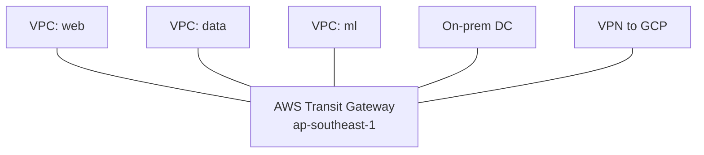
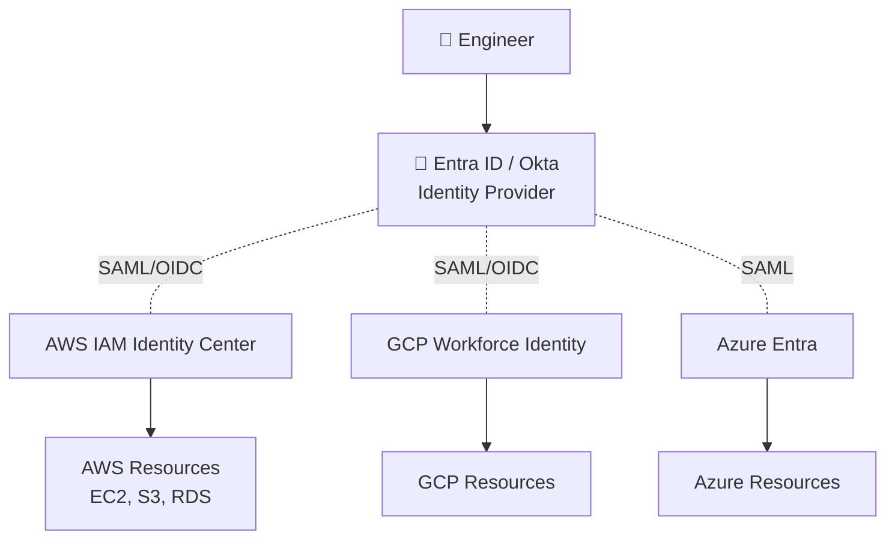
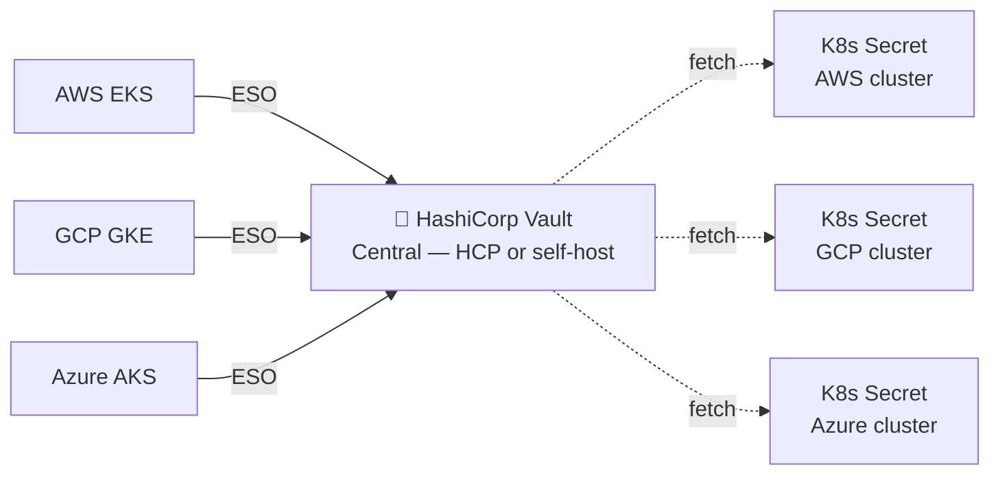

# 🎓 Cross-cloud Network & Identity — Transit, VPN, Federation, Vault sync

> **Tác giả:** Mr.Rom\
> **Phiên bản:** v1.1.0\
> **Tạo lúc:** 24/05/2026\
> **Cập nhật:** 01/06/2026\
> **Level:** Basic (bài 02/5)\
> **Tags:** [MUST-KNOW]\
> **Yêu cầu trước:** Đã đọc [Vendor Lock-in & Portability](01_vendor-lock-in-and-portability.md) ✅, biết VPC/VNet cơ bản

> 🎯 *Bài 02 cluster Multi-cloud. Khi đã quyết multi-cloud rồi, vấn đề thực thi: **2 cloud nói chuyện với nhau qua đường nào** (network) + **ai được truy cập cái gì** (identity). Bài này: cross-cloud network (VPN, Transit Gateway, Megaport, Equinix Fabric, BGP private interconnect), Identity federation (Entra ID + AWS SSO + Workforce Identity), secrets sync (Vault + External Secrets Operator). Có hands-on Terraform.*

## 🎯 Sau bài này bạn sẽ

- [ ] Phân biệt **4 kiểu cross-cloud connectivity** (Internet, VPN, Megaport, Equinix Fabric)
- [ ] Hiểu **AWS Transit Gateway + GCP Network Connectivity Center + Azure Virtual WAN**
- [ ] Setup **VPN site-to-site AWS ↔ GCP** đơn giản
- [ ] Hiểu **federated identity** (Workload Identity Federation, AWS SSO via OIDC, Entra ID central)
- [ ] Setup **External Secrets Operator** sync Vault → K8s nhiều cloud
- [ ] Biết **3 anti-pattern** network multi-cloud (Internet egress, NAT explosion, asymmetric routing)

---

## Tình huống — Acme Shop cần ML pipeline GCP đọc DB AWS

Acme Shop quyết multi-cloud có chiến lược. Use case đầu tiên:

> Sếp: *"ML team trên GCP cần đọc `orders_db` (Postgres RDS trên AWS Singapore) hàng đêm để train model recommendation. Mỗi đêm 100GB data. 2 yêu cầu: (1) data **không** đi qua Internet công cộng (Legal compliance), (2) Service Account GCP phải truy cập được vào DB AWS **không** dùng password — chứng nhận qua identity."*

Vấn đề kép:
1. **Network**: làm sao bridge VPC AWS với VPC GCP private?
2. **Identity**: làm sao GCP service authenticate vào AWS RDS không dùng static credential?

→ Bài này build solution end-to-end.

---

## 1️⃣ 4 kiểu cross-cloud connectivity — chọn theo nhu cầu

🪞 **Ẩn dụ**: *Như **đường nối 2 thành phố** — đi đường công cộng (Internet) free nhưng kẹt + nguy hiểm; xa lộ riêng (VPN) qua công cộng nhưng có hộ tống; tàu hỏa riêng (Megaport) đường riêng tốc độ cao; sân bay tư nhân (Equinix Fabric) tốt nhất + đắt nhất.*

### Option 1: Internet (mặc định, miễn phí nhưng kém)

Đây là cách dễ nhất: GCP VM gọi thẳng `https://my-aws-app.com` qua Internet công cộng. Setup tốn $0 nhưng phí *egress* (data đi ra ngoài cloud) vẫn $0.09/GB. Đổi lại sự tiện lợi, bạn phải chấp nhận hàng loạt điểm yếu:

- **Điểm cộng**: dễ nhất, dùng được ngay với *public endpoint*.
- **Điểm trừ**:
  - Data đi qua Internet → fail compliance nếu yêu cầu private routing.
  - Latency cao (10-100ms+ thay vì <5ms).
  - Throughput không được đảm bảo (*best-effort*).
  - Phải *expose* endpoint ra Internet → tăng bề mặt tấn công.

**Khi dùng**: prototype, traffic nhỏ, data không nhạy cảm, public-facing API.

### Option 2: Site-to-site VPN (IPSec over Internet)

Bước nâng cấp đầu tiên: dựng một *tunnel* IPSec mã hoá giữa 2 VPC, vẫn chạy trên hạ tầng Internet nhưng traffic được bọc kín. Chi phí khoảng $36-72/tháng cho tunnel cộng phí egress $0.09/GB (vì underlying vẫn là Internet). Đây là phương án cân bằng giữa tiện và an toàn:

- **Điểm cộng**:
  - Mã hoá khi truyền (*encrypted in transit*).
  - Setup nhanh (vài giờ).
  - Định tuyến qua private IP, không lộ ra public.
- **Điểm trừ**:
  - Vẫn đi trên Internet → latency dao động, throughput giới hạn ~1.25 Gbps mỗi tunnel.
  - Single point of failure: tunnel sập là mất kết nối.

**Khi dùng**: môi trường dev/test multi-cloud, traffic 1-10 GB/ngày, hiệu năng không phải yếu tố sống còn.

### Option 3: Dedicated interconnect qua Megaport / Equinix / PacketFabric

🪞 *Như **tàu hỏa cao tốc giữa 2 city** — đường riêng, nhanh, predictable.*

Ở tầng này, một provider thứ 3 (Megaport, Equinix Fabric, PacketFabric, AWS Direct Connect Partner) sở hữu *cable* vật lý kết nối tới mọi cloud lớn. Bạn thuê "port" trên hệ thống họ rồi tạo *Virtual Cross-Connect* (VXC) nối AWS ↔ GCP qua đường riêng đó. Cấu trúc chi phí và đánh đổi như sau:

- **Chi phí**:
  - Port: $100-1000/tháng tùy tốc độ (1G/10G).
  - VXC: $50-200/tháng mỗi kết nối.
  - Bandwidth: egress $0.01-0.04/GB (rẻ hơn Internet 50-70%).
- **Điểm cộng**:
  - Latency <5ms (cùng datacenter trong region).
  - Throughput lên tới 100 Gbps.
  - SLA 99.99%.
  - Phí egress giảm mạnh.
- **Điểm trừ**:
  - Setup mất 1-2 tuần (đi cable vật lý + thủ tục giấy tờ).
  - Thường phải cam kết tối thiểu 1 năm.
  - Phải có tài khoản bên thứ 3.

**Khi dùng**: production multi-cloud, traffic >1 TB/tháng, hiệu năng là yêu cầu sống còn.

### Option 4: Direct cloud-to-cloud interconnect

| Option | Provider |
|---|---|
| **AWS Direct Connect ↔ GCP Cloud Interconnect via partner** | Equinix, Megaport |
| **AWS Direct Connect ↔ Azure ExpressRoute via partner** | Equinix |
| **Cloud Interconnect ↔ ExpressRoute** | Megaport |
| **AWS ↔ Azure direct** (limited regions) | Microsoft ExpressRoute Global Reach + AWS DX |

→ Best practice 2026: dùng **Megaport** hoặc **Equinix Fabric** làm hub trung tâm, port vào tất cả cloud từ đó.

### Comparison matrix

| Tiêu chí | Internet | VPN | Megaport / Equinix |
|---|---|---|---|
| Setup time | Phút | Giờ | 1-2 tuần |
| Setup cost | $0 | <$100 | $500-2000 |
| Monthly | $0 + egress | $36-72 + egress | $200-1500 + cheap egress |
| Latency | 10-100ms | 5-50ms | <5ms |
| Throughput | Best-effort | 1.25 Gbps/tunnel | 1-100 Gbps |
| Encryption | TLS (app level) | IPSec | Provider option |
| Compliance | Public | Private routed | Private |

---

## 2️⃣ Hub-and-spoke với Transit Gateway / NCC / Virtual WAN

🪞 **Ẩn dụ**: *Không kết nối **mỗi VPC với mỗi VPC** (mesh — N² đường) — thay vào đó, build **1 hub trung tâm** mọi VPC kết nối vào, hub route giữa các VPC.*

### AWS Transit Gateway (TGW)



- **Pricing**: $36/tháng per attachment + $0.02/GB processed.
- **Limit**: 5000 VPC attachment per TGW.
- **Multi-region**: TGW peering cross-region.

### GCP Network Connectivity Center (NCC)

- Tương đương Transit Gateway của GCP.
- Hub spokes: VPN, Interconnect, Router Appliance.
- **Pricing**: free for hub, charged per spoke (~$0.04/h).

### Azure Virtual WAN

- Azure equivalent — hub regional.
- Tích hợp với ExpressRoute + Site-to-Site VPN.
- **Pricing**: $0.25/h per hub + bandwidth.

### Pattern: Acme Shop hub

```
        ┌────────────────────────────────────┐
        │   Megaport Cloud Router (hub)      │
        │   ap-southeast (Singapore)         │
        └──┬─────────────┬─────────────┬─────┘
           │             │             │
    ┌──────▼────┐ ┌──────▼────┐ ┌─────▼─────┐
    │ AWS TGW   │ │ GCP NCC   │ │ Azure vWAN│
    │ Singapore │ │ asia-se1  │ │ South Asia│
    └──────┬────┘ └──────┬────┘ └─────┬─────┘
           │             │             │
        VPCs           VPCs          VNets
```

→ Mọi cloud kết nối qua Megaport hub. Cloud mới = add 1 spoke. Không phải mesh.

---

## 3️⃣ Hands-on — VPN site-to-site AWS ↔ GCP qua Terraform

Đây là setup đơn giản nhất (Option 2 ở trên) — đủ cho 1-10 GB/ngày.

### Architecture

```
AWS VPC (10.0.0.0/16)           GCP VPC (10.1.0.0/16)
   ap-southeast-1                  asia-southeast1
        │                                │
   AWS VPN Gateway  ────IPSec────  GCP Cloud VPN
        │                                │
   Subnet 10.0.1.0/24              Subnet 10.1.1.0/24
   RDS Postgres                    GCE VM (ML training)
```

### File: `network.tf`

```hcl
terraform {
  required_providers {
    aws    = { source = "hashicorp/aws",    version = "~> 5.0" }
    google = { source = "hashicorp/google", version = "~> 5.0" }
  }
}

provider "aws"    { region = "ap-southeast-1" }
provider "google" {
  project = "acmeshop-prod"
  region  = "asia-southeast1"
}

# --- AWS side ---
resource "aws_vpc" "main" {
  cidr_block = "10.0.0.0/16"
  tags = { Name = "acmeshop-aws" }
}

resource "aws_subnet" "private" {
  vpc_id     = aws_vpc.main.id
  cidr_block = "10.0.1.0/24"
  availability_zone = "ap-southeast-1a"
}

resource "aws_vpn_gateway" "main" {
  vpc_id = aws_vpc.main.id
  tags = { Name = "acmeshop-vpn-gw" }
}

resource "aws_customer_gateway" "gcp" {
  bgp_asn    = 65000
  ip_address = google_compute_address.vpn_ip.address
  type       = "ipsec.1"
  tags = { Name = "gcp-side" }
}

resource "aws_vpn_connection" "to_gcp" {
  vpn_gateway_id      = aws_vpn_gateway.main.id
  customer_gateway_id = aws_customer_gateway.gcp.id
  type                = "ipsec.1"
  static_routes_only  = true
  tags = { Name = "aws-to-gcp" }
}

resource "aws_vpn_connection_route" "to_gcp" {
  destination_cidr_block = "10.1.0.0/16"  # GCP CIDR
  vpn_connection_id      = aws_vpn_connection.to_gcp.id
}

# --- GCP side ---
resource "google_compute_network" "main" {
  name                    = "acmeshop-gcp"
  auto_create_subnetworks = false
}

resource "google_compute_subnetwork" "private" {
  name          = "private"
  ip_cidr_range = "10.1.1.0/24"
  network       = google_compute_network.main.id
  region        = "asia-southeast1"
}

resource "google_compute_address" "vpn_ip" {
  name   = "vpn-static-ip"
  region = "asia-southeast1"
}

resource "google_compute_vpn_gateway" "main" {
  name    = "acmeshop-vpn-gw"
  network = google_compute_network.main.id
}

resource "google_compute_forwarding_rule" "esp" {
  name        = "fr-esp"
  ip_protocol = "ESP"
  ip_address  = google_compute_address.vpn_ip.address
  target      = google_compute_vpn_gateway.main.id
}

resource "google_compute_forwarding_rule" "udp500" {
  name        = "fr-udp500"
  ip_protocol = "UDP"
  port_range  = "500"
  ip_address  = google_compute_address.vpn_ip.address
  target      = google_compute_vpn_gateway.main.id
}

resource "google_compute_forwarding_rule" "udp4500" {
  name        = "fr-udp4500"
  ip_protocol = "UDP"
  port_range  = "4500"
  ip_address  = google_compute_address.vpn_ip.address
  target      = google_compute_vpn_gateway.main.id
}

resource "google_compute_vpn_tunnel" "to_aws" {
  name               = "to-aws"
  peer_ip            = aws_vpn_connection.to_gcp.tunnel1_address
  shared_secret      = aws_vpn_connection.to_gcp.tunnel1_preshared_key
  target_vpn_gateway = google_compute_vpn_gateway.main.id
  local_traffic_selector  = ["10.1.0.0/16"]
  remote_traffic_selector = ["10.0.0.0/16"]

  depends_on = [
    google_compute_forwarding_rule.esp,
    google_compute_forwarding_rule.udp500,
    google_compute_forwarding_rule.udp4500,
  ]
}

resource "google_compute_route" "to_aws" {
  name                = "to-aws"
  network             = google_compute_network.main.name
  dest_range          = "10.0.0.0/16"
  next_hop_vpn_tunnel = google_compute_vpn_tunnel.to_aws.id
  priority            = 1000
}
```

### Apply

```bash
terraform init
terraform plan
terraform apply
```

### Verify

Từ GCE VM (GCP):

```bash
# Ping RDS private IP trên AWS
ping 10.0.1.10  # RDS IP

# Connect Postgres
psql -h 10.0.1.10 -U readonly -d orders_db
```

Kết quả mong đợi: kết nối thành công qua tunnel IPSec, không qua Internet.

→ Note: Production cần 2 tunnel (redundancy) + BGP dynamic routing. Code trên dùng static route cho đơn giản.

---

## 4️⃣ Identity federation — đăng nhập cross-cloud không dùng static key

Giờ giải quyết phần (2) — GCP service đọc RDS AWS không dùng password.

🪞 **Ẩn dụ**: *Như **passport quốc tế** — không cần xin visa tạm trú riêng cho mỗi nước. Identity Provider trung ương (Entra ID / Okta) cấp passport; AWS/GCP đều trust passport đó.*

### Architecture 2026 — Identity hub model



- **Identity Provider central** (Entra ID, Okta, Google Workspace, Auth0, Keycloak): 1 identity store cho engineer.
- **Cloud SSO endpoints** trust IdP qua SAML 2.0 hoặc OIDC.
- Engineer login 1 lần → access cả 3 cloud.

### Setup cho human users

| Cloud | SSO entry point | Protocol |
|---|---|---|
| AWS | IAM Identity Center | SAML 2.0 / OIDC |
| GCP | Workforce Identity Federation | OIDC |
| Azure | Native Entra ID | OIDC native |

### Workload Identity Federation (W2W — workload to workload)

🪞 *Đây là phần **khó nhưng quan trọng** — service GCP authenticate vào AWS RDS không dùng password.*

**Vấn đề cũ**: GCP service account → cần AWS IAM user → ai giữ AWS Access Key? Lưu Secret Manager → key vẫn tồn tại → nguy cơ leak.

**Solution 2026: Workload Identity Federation**:
- GCP service account có **JWT token** (signed by Google).
- AWS trust Google OIDC IdP.
- Khi service GCP gọi AWS API → present JWT → AWS verify với Google → cấp **temporary STS token**.
- Không có static AWS key tồn tại.

### Setup OIDC trust AWS ← GCP

```hcl
# 1. Create OIDC identity provider in AWS trusting Google
resource "aws_iam_openid_connect_provider" "google" {
  url             = "https://accounts.google.com"
  client_id_list  = ["sts.amazonaws.com"]
  thumbprint_list = ["..."]  # Google CA thumbprint
}

# 2. IAM Role assumable by GCP service account
resource "aws_iam_role" "gcp_to_aws" {
  name = "GCPMLTrainingRole"

  assume_role_policy = jsonencode({
    Version = "2012-10-17"
    Statement = [{
      Effect = "Allow"
      Principal = {
        Federated = aws_iam_openid_connect_provider.google.arn
      }
      Action = "sts:AssumeRoleWithWebIdentity"
      Condition = {
        StringEquals = {
          "accounts.google.com:sub" = "112233445566778899"  # GCP service account numeric ID
        }
      }
    }]
  })
}

# 3. Permission for role
resource "aws_iam_role_policy_attachment" "rds_read" {
  role       = aws_iam_role.gcp_to_aws.name
  policy_arn = "arn:aws:iam::aws:policy/AmazonRDSReadOnlyAccess"
}
```

### Sử dụng từ GCP VM (Python)

```python
import google.auth
import google.auth.transport.requests
import boto3
import requests

# 1. Get GCP service account JWT
credentials, project = google.auth.default()
auth_req = google.auth.transport.requests.Request()
credentials.refresh(auth_req)

# 2. Get OIDC token from GCP metadata
metadata_url = (
    "http://metadata.google.internal/computeMetadata/v1/instance/"
    "service-accounts/default/identity?audience=sts.amazonaws.com"
)
headers = {"Metadata-Flavor": "Google"}
oidc_token = requests.get(metadata_url, headers=headers).text

# 3. Exchange for AWS STS temporary credentials
sts = boto3.client('sts', region_name='ap-southeast-1')
response = sts.assume_role_with_web_identity(
    RoleArn='arn:aws:iam::123456789012:role/GCPMLTrainingRole',
    RoleSessionName='ml-training-session',
    WebIdentityToken=oidc_token,
)

aws_creds = response['Credentials']

# 4. Use AWS RDS với temp creds
rds = boto3.client(
    'rds',
    region_name='ap-southeast-1',
    aws_access_key_id=aws_creds['AccessKeyId'],
    aws_secret_access_key=aws_creds['SecretAccessKey'],
    aws_session_token=aws_creds['SessionToken'],
)

instances = rds.describe_db_instances()
print(instances)
```

→ **Key principle**: STS token chỉ valid 1 giờ. Service GCP tự refresh qua JWT mỗi lần expire. KHÔNG có static AWS Access Key.

### Workload Identity Federation các chiều khác

| Direction | Setup |
|---|---|
| GCP → AWS | OIDC trust accounts.google.com (như trên) |
| AWS → GCP | Workload Identity Federation pool trust AWS IAM role ARN |
| Azure → AWS | OIDC trust Azure AD issuer |
| GitHub Actions → AWS | OIDC trust token.actions.githubusercontent.com |
| K8s Service Account → AWS (cross-cluster) | IRSA, EKS Pod Identity với OIDC issuer |

→ **Pattern chung 2026**: mọi workload identity là OIDC JWT. Static key chỉ dùng cho legacy.

---

## 5️⃣ Secrets management cross-cloud — Vault + External Secrets Operator

Sau identity, vấn đề: secret (API key 3rd party, DB password legacy, certificate) lưu đâu?

🪞 **Ẩn dụ**: *Như **két sắt trung tâm** thay vì mỗi nhà có két riêng — Vault là két, mỗi cloud có "tay" lấy ra khi cần.*

### Option 1: Per-cloud secret service (không khuyến nghị multi-cloud)

- AWS Secrets Manager
- GCP Secret Manager
- Azure Key Vault

**Problem**: secret duplicate 3 nơi → sync nightmare.

### Option 2: HashiCorp Vault central + External Secrets Operator



- **Vault**: central secret store. Self-host on K8s hoặc HashiCorp Cloud Platform (HCP) managed.
- **External Secrets Operator** (ESO): CNCF, K8s operator sync secret từ Vault → K8s Secret native.
- Auth giữa K8s và Vault: Kubernetes Auth Method (service account JWT) hoặc Workload Identity.

### Setup ESO trên GKE

```yaml
# 1. Install ESO
# helm repo add external-secrets https://charts.external-secrets.io
# helm install external-secrets external-secrets/external-secrets -n external-secrets-system

# 2. SecretStore — trỏ về Vault
apiVersion: external-secrets.io/v1beta1
kind: SecretStore
metadata:
  name: vault-backend
  namespace: ml-training
spec:
  provider:
    vault:
      server: "https://vault.acmeshop.io:8200"
      path: "secret"
      version: "v2"
      auth:
        kubernetes:
          mountPath: "kubernetes-gcp"
          role: "ml-training"
          serviceAccountRef:
            name: "ml-training-sa"

---
# 3. ExternalSecret — sync 1 secret
apiVersion: external-secrets.io/v1beta1
kind: ExternalSecret
metadata:
  name: aws-rds-readonly
  namespace: ml-training
spec:
  refreshInterval: 1h
  secretStoreRef:
    name: vault-backend
    kind: SecretStore
  target:
    name: aws-rds-credentials
    creationPolicy: Owner
  data:
    - secretKey: username
      remoteRef:
        key: secret/data/aws/rds/orders_db
        property: username
    - secretKey: password
      remoteRef:
        key: secret/data/aws/rds/orders_db
        property: password
```

### Vault setup auth cho mỗi cloud

```bash
# Enable K8s auth methods cho 3 cloud
vault auth enable -path=kubernetes-aws kubernetes
vault auth enable -path=kubernetes-gcp kubernetes
vault auth enable -path=kubernetes-azure kubernetes

# Config cho từng cluster
vault write auth/kubernetes-gcp/config \
  kubernetes_host="https://gke-cluster.googleapis.com" \
  kubernetes_ca_cert=@gke-ca.crt \
  token_reviewer_jwt=@gke-token

# Create role
vault write auth/kubernetes-gcp/role/ml-training \
  bound_service_account_names=ml-training-sa \
  bound_service_account_namespaces=ml-training \
  policies=ml-training \
  ttl=1h

# Policy granting access
vault policy write ml-training - <<EOF
path "secret/data/aws/rds/orders_db" {
  capabilities = ["read"]
}
EOF
```

→ Pod trong GKE namespace `ml-training` với SA `ml-training-sa` auto được Vault cấp secret. ESO sync sang K8s Secret. App đọc K8s Secret như bình thường.

### Multi-cloud secret rotation

- Vault có **dynamic secrets**: cấp DB credential expire 1h, auto rotate.
- ESO sync refresh interval 1h → app luôn có credential mới.
- Rotation event không yêu cầu deploy app — secret hot reload nếu app support, hoặc rolling restart pod.

---

## 6️⃣ DNS multi-cloud — service discovery cross-cloud

🪞 **Ẩn dụ**: *Như **danh bạ điện thoại chung** — mọi service ở mọi cloud đăng ký tên, ai cần gọi tìm trong danh bạ thay vì nhớ IP.*

### Option 1: Public DNS (Route 53, Cloud DNS, Cloudflare)

- Domain `api.acmeshop.io` → public DNS resolve.
- Cross-cloud OK nếu service expose public.
- Latency: 1 lookup ~50-200ms (cached then 0ms).

### Option 2: Private DNS shared zone

- Cloudflare Zero Trust hoặc Route 53 Resolver hoặc Cloud DNS Private Zone.
- Cross-cloud lookup qua VPN/Direct Connect.

**Acme Shop setup**:

```
acmeshop.io                   ← public (root)
├── api.acmeshop.io           ← public (CDN)
├── internal.acmeshop.io      ← private zone shared
│   ├── orders-db.internal.acmeshop.io       → 10.0.1.10 (AWS RDS)
│   ├── ml-pipeline.internal.acmeshop.io     → 10.1.1.20 (GCP GCE)
│   └── auth-redis.internal.acmeshop.io      → 10.0.2.30 (AWS ElastiCache)
```

- AWS Route 53 Resolver inbound endpoint trong VPC.
- GCP Cloud DNS forwarding zone `internal.acmeshop.io` → AWS Route 53 Resolver IP.
- Cross-cloud DNS query qua VPN.

### Service mesh (advanced)

- Istio multi-primary hoặc Cilium ClusterMesh tự build service discovery cross-cluster.
- Bài 03 sẽ deep dive.

---

## 💡 Cạm bẫy thường gặp & Best practice

### ❌ Cạm bẫy 1: CIDR overlap giữa các VPC

- **Triệu chứng**: VPN setup xong, ping không thông; route table loop.
- **Nguyên nhân**: VPC AWS `10.0.0.0/16` và VPC GCP `10.0.0.0/24` overlap.
- **Cách tránh**: Plan CIDR allocation trước: AWS `10.0.0.0/12`, GCP `10.16.0.0/12`, Azure `10.32.0.0/12`. Document trong IPAM (Cloud IPAM, Infoblox).

### ❌ Cạm bẫy 2: Asymmetric routing

- **Triệu chứng**: TCP connection hang; ping OK nhưng curl không trả response.
- **Nguyên nhân**: Outbound qua VPN, inbound qua Internet → firewall/security group block.
- **Cách tránh**: Force symmetric — route table cả 2 chiều qua VPN tunnel.

### ❌ Cạm bẫy 3: NAT explosion cost

- **Triệu chứng**: NAT Gateway cost tăng vọt khi multi-cloud.
- **Nguyên nhân**: Mỗi VPC AWS có NAT GW ($45/tháng + $0.045/GB) → 3 cloud = 9-12 NAT GW chi phí ~$500-1000/tháng.
- **Cách tránh**: Consolidate egress qua hub (Transit Gateway + central NAT), hoặc dùng PrivateLink endpoint cho AWS service.

### ❌ Cạm bẫy 4: Static AWS Access Key trong GCP secret

- **Triệu chứng**: Engineer leak key trên GitHub → AWS bill $100K/đêm (crypto mining).
- **Nguyên nhân**: Lười setup Workload Identity Federation, dùng static key.
- **Cách tránh**: Tuyệt đối KHÔNG static cross-cloud key. Dùng OIDC trust như §4.

### ❌ Cạm bẫy 5: Federated identity logout không thật sự logout

- **Triệu chứng**: User off-board, vẫn login được AWS qua SSO.
- **Nguyên nhân**: Disable user ở Entra ID nhưng AWS session token vẫn valid đến hết TTL.
- **Cách tránh**: Set session TTL ngắn (1-4h). Có script revoke active session khi off-board.

### ✅ Best practice 1: BGP dynamic routing thay vì static

- Tại sao: VPN failover tự động, không cần manual update route khi đổi tunnel.
- Cách áp dụng: AWS VPN với BGP ASN, GCP HA VPN với BGP — 2 tunnel mỗi direction.

### ✅ Best practice 2: Centralize egress

- 1 NAT GW + 1 firewall central thay vì per-VPC.
- Cost saving 60-80% khi nhiều VPC.

### ✅ Best practice 3: Workload Identity Federation cho mọi cross-cloud auth

- Không bao giờ store static cross-cloud credential.
- Token TTL 1h max.
- Audit log mọi assume-role event.

---

## 🧠 Tự kiểm tra (Self-check)

**Q1.** GCP service cần gọi AWS S3. Cách nào tốt nhất?

<details>
<summary>💡 Đáp án</summary>

**Workload Identity Federation** (OIDC trust):

1. AWS create IAM OIDC provider trust `accounts.google.com`.
2. AWS IAM Role với trust policy chỉ định GCP service account ID.
3. GCP service lấy JWT từ metadata → call AWS `sts:AssumeRoleWithWebIdentity` → nhận temporary STS credentials.
4. Use creds gọi S3.

→ Không có static AWS key. STS token expire 1h, tự refresh.

</details>

**Q2.** Acme Shop 2 VPC trùng CIDR `10.0.0.0/16`. Fix?

<details>
<summary>💡 Đáp án</summary>

**Re-IP một bên** (đau nhưng cần thiết):

1. Plan IPAM: AWS `10.0.0.0/12`, GCP `10.16.0.0/12`.
2. AWS Migration Hub hoặc manual re-create VPC mới với CIDR non-overlap.
3. Migrate workload sang VPC mới (blue-green nếu critical).
4. Decommission VPC cũ.

→ Tạm thời: NAT'd via AWS Transit Gateway hoặc tự build NAT proxy — fragile, không khuyến nghị production.

→ Bài học: plan IPAM trước khi tạo VPC. Không bao giờ default 10.0.0.0/16.

</details>

**Q3.** Megaport vs Site-to-site VPN — chọn lúc nào?

<details>
<summary>💡 Đáp án</summary>

**Megaport**:
- Production traffic >1 TB/tháng.
- Latency critical (database replication, real-time API).
- Compliance yêu cầu private routing.
- Throughput 10G+ guaranteed.

**Site-to-site VPN**:
- Dev/test environment.
- Traffic <100 GB/tháng.
- Setup nhanh (<1 ngày).
- Budget tight.

→ Rule of thumb: điểm hoà vốn Megaport vs VPN ở ~5 TB/tháng — trên ngưỡng này Megaport rẻ hơn dù phí setup cao hơn.

</details>

**Q4.** ESO refresh interval set 5 phút có vấn đề gì?

<details>
<summary>💡 Đáp án</summary>

**Vấn đề**:
1. **Vault load**: 100 ExternalSecret × 12 refresh/h = 1200 lookup/h → Vault server load tăng.
2. **K8s API rate limit**: ESO update K8s Secret object → kube-apiserver có rate limit.
3. **App reload**: nếu app tự reload trên secret change → restart thường xuyên.

**Rule**: 1h là tốt cho hầu hết case. Critical secret (DB password rotation 15 phút) thì set 5 phút nhưng accept overhead.

</details>

**Q5.** Identity Provider central down (Entra ID outage). Hậu quả + mitigate?

<details>
<summary>💡 Đáp án</summary>

**Hậu quả**:
- Engineer không login được vào AWS/GCP/Azure SSO.
- Existing session vẫn work (đến hết TTL).
- Mới deploy, mới on-call = tê liệt.

**Mitigate**:
1. **Break-glass account**: 1 IAM user (AWS) / Service Account (GCP) với hardware MFA, lưu offline. Chỉ dùng khi IdP down.
2. **Long-lived session TTL** cho production access (12h thay vì 1h).
3. **Multi-IdP**: Entra ID + Okta (failover) — phức tạp nhưng critical enterprise.
4. **Cached credentials** trong CI/CD: short-lived nhưng pre-issued.

→ Entra ID 2024/07/19 outage 8h đã làm rất nhiều enterprise tê liệt. Plan break-glass là MUST.

</details>

---

## ⚡ Tra cứu nhanh (Cheatsheet)

### Connectivity tiers

| Need | Pick |
|---|---|
| Dev / 1 GB/d / non-sensitive | Internet |
| Prod small / 1-100 GB/d | Site-to-site VPN |
| Prod / >1 TB/m / low latency | Megaport / Equinix Fabric |
| Critical compliance / 100 Gbps | Direct cloud-to-cloud interconnect |

### Hub services per cloud

| Cloud | Hub service |
|---|---|
| AWS | Transit Gateway |
| GCP | Network Connectivity Center |
| Azure | Virtual WAN |
| Cross-cloud | Megaport / Equinix Fabric |

### Identity 2026

| Direction | Mechanism |
|---|---|
| Human → multi-cloud | Entra ID / Okta + SSO via SAML/OIDC |
| Workload GCP → AWS | OIDC trust + STS:AssumeRoleWithWebIdentity |
| Workload AWS → GCP | WIF pool trust IAM role |
| GitHub Actions → cloud | OIDC trust per cloud |
| K8s pod → cloud | IRSA (AWS), WIF (GCP), Pod Identity (Azure) |

### Secrets

| Tool | Purpose |
|---|---|
| HashiCorp Vault | Central secret store |
| External Secrets Operator (ESO) | Sync Vault → K8s Secret |
| Sealed Secrets | Encrypt secret in git (alternative) |
| SOPS + age | File-based secret |

---

## 📚 Từ Điển Thuật Ngữ (Glossary)

| Thuật ngữ | Tiếng Việt | Giải thích |
|---|---|---|
| Site-to-site VPN | VPN cố định 2 site | Tunnel IPSec encrypted giữa 2 VPC |
| IPSec | Internet Protocol Security | Protocol encrypt traffic giữa 2 endpoint |
| BGP | Border Gateway Protocol | Dynamic routing protocol giữa AS |
| ASN | Autonomous System Number | ID của BGP "router cluster" |
| Transit Gateway | (AWS) | Hub network AWS connect VPC + on-prem |
| Network Connectivity Center | (GCP) | Hub network GCP, tương đương TGW |
| Virtual WAN | (Azure) | Hub network Azure |
| Megaport | (vendor) | Provider dedicated cross-cloud interconnect |
| Equinix Fabric | (vendor) | Provider cross-cloud interconnect via Equinix datacenter |
| Direct Connect | (AWS) | Dedicated AWS connection (qua partner) |
| Cloud Interconnect | (GCP) | Tương đương DX của GCP |
| ExpressRoute | (Azure) | Tương đương DX của Azure |
| OIDC | OpenID Connect | Auth protocol dựa trên OAuth2 + JWT |
| SAML | Security Assertion Markup Language | Auth protocol XML-based legacy |
| JWT | JSON Web Token | Token format có signature |
| STS | Security Token Service | (AWS) cấp temporary credential |
| WIF | Workload Identity Federation | Auth workload không dùng static key |
| IRSA | IAM Role for Service Account | (AWS EKS) pod assume role qua OIDC |
| Entra ID | (Microsoft) | (formerly Azure AD) — IdP enterprise |
| Workforce Identity Federation | (GCP) | Trust external IdP cho human users |
| ESO | External Secrets Operator | (CNCF) sync secret từ external store vào K8s |
| Vault | (HashiCorp) | Central secret management tool |
| SCC | Standard Contractual Clauses | EU legal framework cho cross-border data transfer |
| Break-glass | Tài khoản phá kính | Account dự phòng khi IdP down |
| IPAM | IP Address Management | Quản lý CIDR allocation |
| NAT Gateway | (AWS) | Egress internet cho private subnet |
| PrivateLink | (AWS) | Private endpoint cho AWS service |

---

## 🔗 Liên kết & Tài nguyên

### 🧭 Định hướng lộ trình học

- ⬅️ **Bài trước:** [Vendor Lock-in & Portability — 4 chiều khoá, abstraction layer, exit cost](01_vendor-lock-in-and-portability.md)
- ➡️ **Bài tiếp theo:** [Kubernetes Multi-cloud — Anthos, Azure Arc, Cluster API, Service Mesh](03_kubernetes-multi-cloud-and-anthos-arc.md)
- ↑ **Về cụm:** [Multi-cloud Strategies](../../README.md)

### 🧩 Các chủ đề có thể bạn quan tâm

- ☁️ [AWS VPC + Networking](../../../aws/) — kiến thức nền về VPC trên AWS.
- ☁️ [GCP Networking](../../../gcp/) — VPC và mạng trên GCP.
- 🔐 [Cloud Security](../../../../12_security/cloud-security/) — đào sâu federated identity và IAM cross-cloud.
- 🗝️ [Secrets Management](../../../../12_security/secrets-management/) — quản lý secret tập trung (Vault, ESO).
- 🏗️ [IaC Terraform](../../../../10_devops/iac/) — Terraform cho hạ tầng multi-cloud.
- ↑ **Về cụm:** [Kubernetes](../../../../10_devops/kubernetes/) — service mesh và mạng cross-cluster.

### 🌐 Tài nguyên tham khảo khác

- 📖 [AWS Transit Gateway docs](https://docs.aws.amazon.com/vpc/latest/tgw/what-is-transit-gateway.html)
- 📖 [GCP Network Connectivity Center](https://cloud.google.com/network-connectivity/docs/network-connectivity-center)
- 📖 [Megaport Cloud Router](https://www.megaport.com/services/megaport-cloud-router/)
- 📖 [Equinix Fabric](https://www.equinix.com/services/interconnection-connectivity/equinix-fabric)
- 📖 [AWS Workload Identity Federation](https://docs.aws.amazon.com/IAM/latest/UserGuide/id_roles_providers_oidc.html)
- 📖 [GCP Workload Identity Federation](https://cloud.google.com/iam/docs/workload-identity-federation)
- 📖 [HashiCorp Vault docs](https://developer.hashicorp.com/vault/docs)
- 📖 [External Secrets Operator](https://external-secrets.io/)
- 📖 [Entra ID multi-cloud federation](https://learn.microsoft.com/en-us/entra/identity/conditional-access/concept-conditional-access-cloud-apps)

---

## 📌 Nhật ký thay đổi (Changelog)

- **v1.0.0 (24/05/2026)** — Bài 02 cluster Multi-cloud basic. 4 kiểu cross-cloud connectivity (Internet, VPN, Megaport, dedicated) + hub-and-spoke pattern (TGW/NCC/vWAN) + hands-on Terraform VPN AWS↔GCP + Workload Identity Federation (OIDC trust, no static key) + HashiCorp Vault + External Secrets Operator + DNS multi-cloud + 5 pitfall (CIDR overlap, asymmetric routing, NAT explosion, static key, federated logout). Acme Shop ML pipeline GCP↔RDS AWS làm trục.
- **v1.1.0 (01/06/2026)** — Việt hoá phần so sánh 4 kiểu connectivity (Option 1-3) cho mượt văn phong; đổi field metadata "Prerequisites" → "Yêu cầu trước"; sửa typo "TGV" → "điểm hoà vốn Megaport vs VPN"; sửa link gãy 09_Security/iam → 12_security/cloud-security + bổ sung link secrets-management; chuẩn hoá nav (⬅️/➡️/↑ + link-text = tiêu đề thực + 3 sub-heading chuẩn); đổi header Glossary sang 3 cột "Thuật ngữ | Tiếng Việt | Giải thích".
