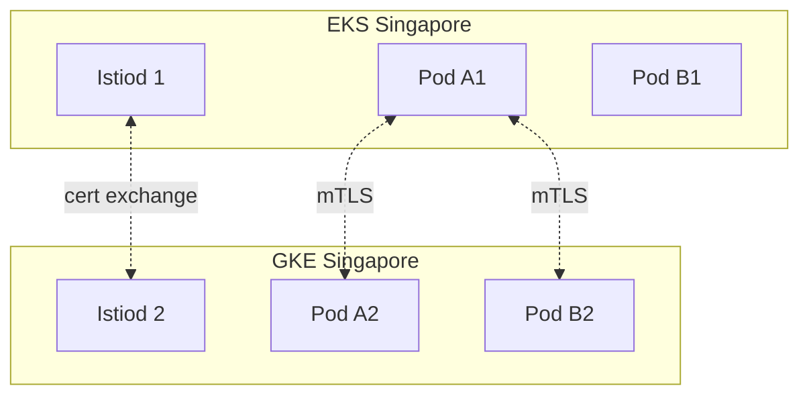
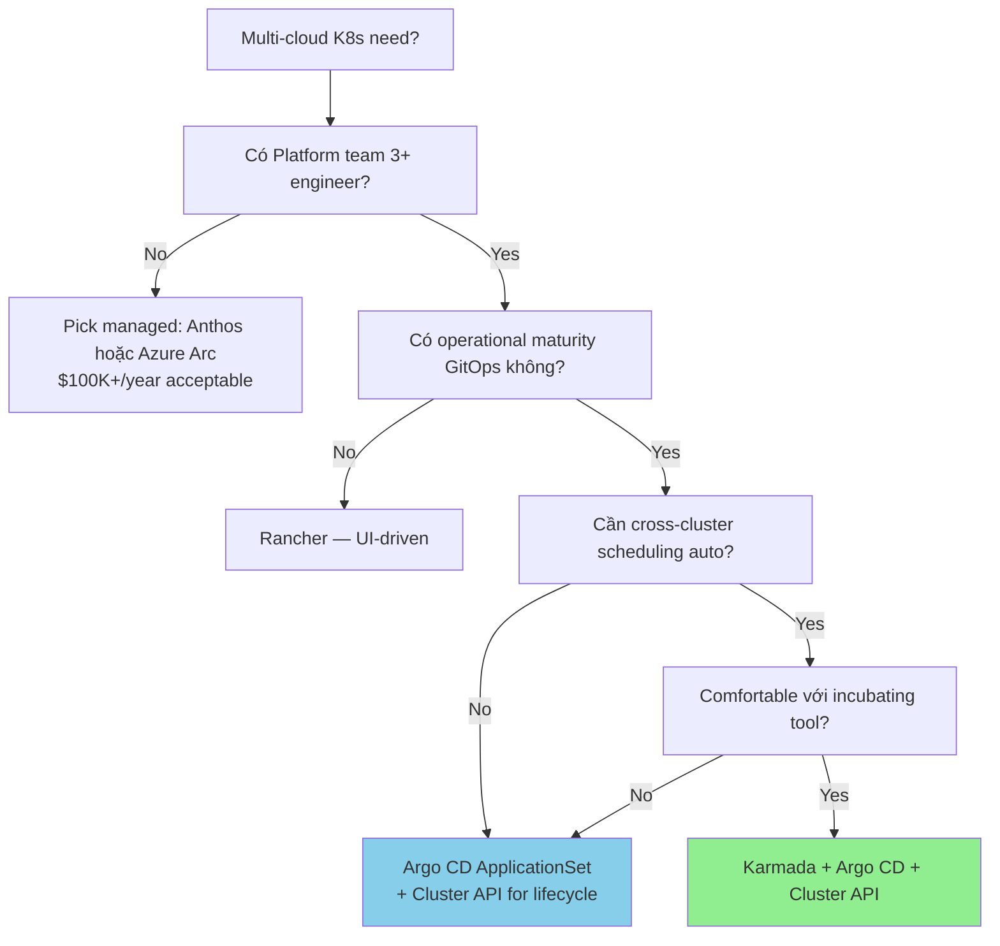

# 🎓 Kubernetes Multi-cloud — Anthos, Azure Arc, Cluster API, Service Mesh

> **Tác giả:** Mr.Rom\
> **Phiên bản:** v1.1.0\
> **Tạo lúc:** 24/05/2026\
> **Cập nhật:** 01/06/2026\
> **Level:** Basic (bài 03/5)\
> **Tags:** [MUST-KNOW]\
> **Yêu cầu trước:** Đã đọc [02_multi-cloud-network-and-identity](02_multi-cloud-network-and-identity.md) ✅, biết K8s basics (Pod/Service/Deployment), có thực hành EKS hoặc GKE

> 🎯 *Bài 03 cluster Multi-cloud. **K8s là layer portable nhất** cho multi-cloud — chính vì thế là backbone của mọi multi-cloud strategy nghiêm túc 2026. Bài này: vì sao K8s portable, multi-cluster management tools (Anthos, Azure Arc, EKS Anywhere, Cluster API, Rancher, Karmada), service mesh cross-cluster (Istio multi-primary, Cilium ClusterMesh, Linkerd), và workload portability gotchas thực tế.*

## 🎯 Sau bài này bạn sẽ

- [ ] Hiểu **vì sao K8s là portable layer** cho multi-cloud
- [ ] Phân biệt **6 multi-cluster management tool** (Anthos, Azure Arc, EKS Anywhere, Cluster API, Rancher, Karmada)
- [ ] Biết **service mesh cross-cluster** options (Istio multi-primary, Cilium ClusterMesh, Linkerd multi-cluster)
- [ ] Setup **Karmada hoặc Argo CD** cho GitOps multi-cluster
- [ ] Biết **5 workload portability gotcha** thực tế (storage class, ingress, LoadBalancer, DNS, IAM)
- [ ] Quyết định pattern fit nhất cho Acme Shop

---

## Tình huống — Acme Shop muốn deploy 1 lần, chạy 3 cloud

Sau khi Acme Shop có network bridge (bài 02) và identity federation, ML team đặt yêu cầu mới:

> ML Lead: *"Mình muốn deploy ML inference service 1 lần, K8s tự rải xuống cả EKS (AWS), GKE (GCP), AKS (Azure). Khi 1 cluster down, traffic tự rerouted sang cluster khác. Mình không muốn 3 lần `kubectl apply -f` cho 3 cluster."*

Yêu cầu:
1. **Unified deployment**: 1 manifest → spread across cluster.
2. **Service discovery cross-cluster**: pod GKE biết được pod EKS.
3. **Failover automatic**: 1 cluster down, traffic shift.
4. **Observability central**: 1 dashboard cho cả 3 cluster.

→ Bài này build solution K8s multi-cloud production-grade.

---

## 1️⃣ Vì sao K8s là **layer portable nhất** cho multi-cloud

🪞 **Ẩn dụ**: *K8s như **chuẩn container ISO** trong vận tải biển — mọi cảng (cloud) đều có cẩu tương thích. Khác với "đóng gói theo cảng riêng" (Lambda AWS, Cloud Functions GCP) — chỉ cẩu cảng đó mới bốc được.*

### Chuẩn chung do CNCF giữ

Lý do K8s portable nằm ở chỗ nó là một *chuẩn chung* chứ không phải sản phẩm riêng của hãng nào. Spec K8s do CNCF (một foundation vendor-neutral) duy trì; các API như `apps/v1`, `core/v1`, `networking.k8s.io/v1` là chuẩn mà mọi bản managed K8s (EKS, GKE, AKS, OCI, DigitalOcean, OVH, Vultr...) đều phải tuân theo. Nhờ vậy, `kubectl apply -f pod.yaml` chạy được ở mọi nơi mà không cần sửa.

### Layer portability mapping

```
┌─────────────────────────────────────────────────┐
│  Application layer (your code)                  │  ← 95% portable
├─────────────────────────────────────────────────┤
│  K8s API layer (Pod, Service, Deployment)       │  ← 90% portable
├─────────────────────────────────────────────────┤
│  K8s control plane (EKS / GKE / AKS managed)    │  ← 0% portable (vendor)
├─────────────────────────────────────────────────┤
│  Compute / network / storage (cloud-specific)   │  ← 0% portable
└─────────────────────────────────────────────────┘
```

→ App + K8s API là portable. Control plane + infra là cloud-specific. Pattern multi-cloud K8s = **giữ app layer + K8s API constant**, swap control plane.

### Những thứ KHÔNG portable (cần lưu ý)

K8s API thì portable, nhưng bên dưới vẫn có 5 thứ gắn chặt với từng vendor mà bạn phải xử lý riêng:

| Resource | Vendor-specific | Workaround |
|---|---|---|
| `LoadBalancer` Service | ALB (AWS), GLB (GCP), Azure LB | Dùng Ingress + portable controller (NGINX, Contour) |
| `StorageClass` | EBS, PD, Azure Disk | Define StorageClass per cluster, app reference `default` |
| IAM permission for pod | IRSA (AWS), WIF (GCP), Pod Identity (Azure) | Workload Identity Federation (bài 02) |
| DNS / external-dns | Route 53, Cloud DNS, Azure DNS | Use `external-dns` controller portable |
| Logging / monitoring | CloudWatch, Cloud Logging, Azure Monitor | Use Prometheus + Loki + Grafana (portable) |

→ Workload portable **nếu** abstract qua resource standard. Bám vào vendor-specific (Annotation `service.beta.kubernetes.io/aws-load-balancer-type`) sẽ không portable.

### Workload portable principles

```yaml
# ❌ NOT portable — AWS-specific annotation
apiVersion: v1
kind: Service
metadata:
  annotations:
    service.beta.kubernetes.io/aws-load-balancer-type: "nlb"
spec:
  type: LoadBalancer
  ...

# ✅ Portable — generic
apiVersion: networking.k8s.io/v1
kind: Ingress
metadata:
  name: my-app
  annotations:
    kubernetes.io/ingress.class: "nginx"   # NGINX runs everywhere
spec:
  rules:
    - host: api.acmeshop.io
      http:
        paths:
          - path: /
            pathType: Prefix
            backend:
              service:
                name: my-app
                port:
                  number: 80
```

---

## 2️⃣ Multi-cluster management — 6 tool chính 2026

Sau khi có nhiều cluster (EKS + GKE + AKS), vấn đề:
- Làm sao deploy nhất quán?
- Làm sao thấy tất cả cluster trong 1 view?
- Làm sao policy enforce (security, network) cross-cluster?

🪞 **Ẩn dụ**: *Như quản lý **chuỗi cửa hàng franchise** — không thể bay tới mỗi cửa hàng training riêng. Cần 1 hub central (multi-cluster management) để rollout policy + monitor.*

### Option 1: Google Anthos (cao cấp, trưởng thành)

Anthos là *platform* multi-cloud K8s của Google — nay đóng gói dưới tên GKE Enterprise, cho phép chạy K8s trên GCP, AWS, Azure và cả on-prem từ một mặt bằng điều khiển duy nhất.

Anthos không phải một sản phẩm đơn lẻ mà là bộ thành phần ghép lại:

- **GKE Multi-cloud**: control plane K8s do Google quản lý, chạy trên VM của AWS/Azure.
- **Anthos Config Management** (ACM): lớp GitOps + policy.
- **Anthos Service Mesh**: bản Istio được Google quản lý (managed).
- **Cloud Run for Anthos**: chạy workload serverless ngay trên K8s.

Điểm mạnh là độ chín: ra mắt từ 2019, mọi cluster đều hiện trong một màn hình Google Cloud Console duy nhất, và khả năng *enforce* policy rất mạnh. Đổi lại, Anthos đắt — khoảng $0.10/vCPU/h cho mỗi cluster managed (baseline ~$100-300/cluster/tháng), kéo theo *lock-in* với Google và quá trình *setup* khá phức tạp.

→ Hợp khi: doanh nghiệp đã đầu tư sâu vào GCP, có ngân sách Anthos $100K+/năm, và cần một giải pháp managed trọn gói thay vì tự vận hành.

### Option 2: Azure Arc (đối trọng từ Microsoft)

Azure Arc là câu trả lời tương đương của Microsoft: cho phép quản lý cluster K8s ở bất kỳ đâu (AWS, GCP, on-prem) ngay từ Azure Portal — Azure đóng vai "trung tâm điều khiển", còn cluster thì nằm ở cloud khác.

Bộ thành phần của Arc gồm:

- **Arc-enabled Kubernetes**: đăng ký (register) một cluster bất kỳ vào Azure.
- **Azure Policy for Kubernetes**: enforce policy xuyên cluster.
- **Azure Monitor for containers**: gom observability về một chỗ.
- **GitOps qua Flux**: triển khai (deployment) bằng Git.

Arc có free tier giới hạn (đến 6 cluster nhỏ), tích hợp mượt với hệ sinh thái Microsoft và mạnh về RBAC + Entra ID. Nhược điểm là vẫn *lock-in* Microsoft, và hiệu năng phụ thuộc vào chất lượng kết nối tới Azure.

→ Hợp khi: tổ chức xoay quanh Microsoft (Entra ID + Office 365) hoặc cần *hybrid* với on-prem Windows.

### Option 3: AWS EKS Anywhere

EKS Anywhere là bản phân phối (distribution) K8s của AWS dành cho on-prem hoặc bare metal, vận hành theo trải nghiệm AWS console nhưng đặt ngoài cloud AWS.

Điểm hấp dẫn là mang được trải nghiệm AWS-native xuống tận datacenter riêng, hỗ trợ cả vSphere lẫn bare metal. Tuy nhiên có một giới hạn quan trọng: **EKS Anywhere không chạy được trên GCP/Azure** — chỉ AWS + on-prem. Vì thế "multi-cloud" ở đây thực chất là *hybrid* (AWS + on-prem) chứ không phải đa public cloud.

→ Hợp khi: shop thuần AWS muốn mở rộng xuống datacenter on-prem, không có nhu cầu chạy trên cloud của hãng khác.

### Option 4: Cluster API (CAPI) — open source, vendor-neutral

🪞 **Ẩn dụ**: *Như **Terraform cho K8s cluster lifecycle** — declarative manage cluster (create/upgrade/delete) cross-provider.*

Cluster API là sub-project của Kubernetes SIG Cluster Lifecycle. Ý tưởng cốt lõi: mô tả chính bản thân cluster như một *Kubernetes resource* — bạn khai báo cluster bằng YAML giống hệt cách khai báo một Deployment. Mỗi cloud có một plugin provider riêng: CAPA (AWS), CAPG (GCP), CAPZ (Azure), CAPV (vSphere), CAPDO (DigitalOcean)...

Ví dụ một cluster AWS khai báo declarative:

```yaml
apiVersion: cluster.x-k8s.io/v1beta1
kind: Cluster
metadata:
  name: acmeshop-aws-prod
  namespace: clusters
spec:
  clusterNetwork:
    pods:
      cidrBlocks: ["192.168.0.0/16"]
  controlPlaneRef:
    apiVersion: controlplane.cluster.x-k8s.io/v1beta1
    kind: KubeadmControlPlane
    name: acmeshop-aws-prod-cp
  infrastructureRef:
    apiVersion: infrastructure.cluster.x-k8s.io/v1beta1
    kind: AWSCluster
    name: acmeshop-aws-prod
```

Thế mạnh: 100% *open source* nên không *lock-in*, hoàn toàn vendor-neutral, và đã trưởng thành (dự án Kubernetes SIG Cluster Lifecycle, ổn định ở mức production từ API `v1beta1`). Cái giá phải trả là bạn tự host một *management cluster* (1 cluster chuyên để quản các cluster còn lại), gánh thêm chi phí vận hành, và giao diện kém bóng bẩy hơn Anthos.

→ Hợp khi: tổ chức có Platform team đủ mạnh, muốn tránh *lock-in* ở tầng quản lý cluster.

### Option 5: Rancher (SUSE) — mạnh về giao diện

Rancher (do SUSE sở hữu) là công cụ quản lý multi-cluster nổi bật nhờ giao diện trực quan, hướng tới người vận hành chưa rành K8s sâu.

Điểm cộng lớn nhất là *UI* tốt bậc nhất cho operator không phải chuyên gia K8s, gom RBAC/namespace/project về một chỗ, và phần core là open source miễn phí. Bù lại, Rancher buộc bạn học thêm một số khái niệm riêng của nó (ví dụ "Project"), và gói hỗ trợ enterprise của SUSE khá đắt.

→ Hợp khi: tổ chức có nhiều admin K8s còn non kinh nghiệm cần giao diện trực quan, chưa đi hẳn theo GitOps.

### Option 6: Karmada — lập lịch xuyên cluster

Karmada là dự án CNCF (đang ở giai đoạn Incubating), thường được gọi là "Federation v2". Khác với các tool ở trên thiên về *quản lý*, Karmada tập trung vào *lập lịch* (scheduling): nó quyết định workload chạy ở cluster nào và bao nhiêu replica mỗi nơi, dựa trên policy bạn khai báo.

Ví dụ một PropagationPolicy phân bổ replica theo trọng số:

```yaml
apiVersion: policy.karmada.io/v1alpha1
kind: PropagationPolicy
metadata:
  name: ml-inference-policy
spec:
  resourceSelectors:
    - apiVersion: apps/v1
      kind: Deployment
      name: ml-inference
  placement:
    clusterAffinity:
      clusterNames:
        - eks-aws-singapore
        - gke-gcp-singapore
        - aks-azure-singapore
    replicaScheduling:
      replicaSchedulingType: Divided
      replicaDivisionPreference: Weighted
      weightPreference:
        staticWeightList:
          - targetCluster:
              clusterNames: ["eks-aws-singapore"]
            weight: 2
          - targetCluster:
              clusterNames: ["gke-gcp-singapore"]
            weight: 2
          - targetCluster:
              clusterNames: ["aks-azure-singapore"]
            weight: 1
```

→ 5 replica của ml-inference được chia: 2 trên EKS + 2 trên GKE + 1 trên AKS. Khi 1 cluster sập, Karmada tự *reschedule* phần replica đó sang cluster còn sống.

Thế mạnh: đây là *scheduler* đa cluster đúng nghĩa, phân bổ replica thông minh theo trọng số, và hoàn toàn open source. Mặt hạn chế: dự án còn ở giai đoạn Incubating (độ sẵn sàng cho production tuỳ trường hợp), và vận hành phức tạp vì phải duy trì cả control plane Karmada lẫn các member cluster.

→ Hợp khi: chạy production multi-cloud, workload cần được phân bổ lại (redistribute) một cách động khi tải hoặc khi cluster thay đổi.

### Comparison matrix

| Tool | Vendor | License | Use case | Mature 2026 |
|---|---|---|---|---|
| **Anthos** | Google | Proprietary, paid | Premium managed multi-cloud | 🟢🟢🟢 |
| **Azure Arc** | Microsoft | Proprietary, partial free | Enterprise + on-prem manage | 🟢🟢🟢 |
| **EKS Anywhere** | AWS | OSS + paid support | AWS + on-prem (not multi-cloud) | 🟢🟢 |
| **Cluster API** | CNCF | Apache 2.0 | Vendor-neutral cluster lifecycle | 🟢🟢🟢 |
| **Rancher** | SUSE | Apache 2.0 (UI free) | UI-driven multi-cluster | 🟢🟢🟢 |
| **Karmada** | CNCF | Apache 2.0 | Multi-cluster scheduling | 🟡🟡 (Incubating) |

→ Acme Shop pick: **Cluster API for lifecycle + Argo CD for app deployment + Karmada for cross-cluster scheduling** (open source, no lock-in).

---

## 3️⃣ Service mesh cross-cluster — pod GKE ↔ pod EKS

🪞 **Ẩn dụ**: *Service mesh như **mạng điện thoại nội bộ công ty** — mỗi nhân viên (pod) có sđt nội bộ, gọi nhau qua tổng đài, không cần biết người kia ở văn phòng nào.*

### Option 1: Istio multi-primary

Trong mô hình *multi-primary*, mỗi cluster có một Istiod (control plane Istio) riêng, các cluster tin nhau qua chung một root CA. Sơ đồ dưới minh hoạ hai cluster trao đổi certificate và pod gọi nhau qua mTLS:



Cách dựng gồm bốn việc chính: mỗi cluster cài Istiod riêng; tất cả tin chung một root CA; bật *endpoint discovery* xuyên cluster qua remote secret; và nối mạng bằng VPC peering hoặc *gateway mode* (đi qua public LB).

Ưu điểm là Istio cho bộ tính năng đầy đủ (mTLS, *traffic shaping*, observability) theo chuẩn CNCF. Nhược điểm: dựng khá phức tạp, thêm độ trễ 1-5ms mỗi *hop*, và Istiod tốn khoảng 500m CPU mỗi cluster.

### Option 2: Cilium ClusterMesh

Cilium là một CNI (lớp mạng cho K8s) dựa trên eBPF. Với ClusterMesh, IP của pod trở nên *routable* xuyên cluster qua VPN/Direct Connect, còn service discovery thực hiện bằng một annotation đánh dấu "global service". Ví dụ khai báo một service dùng chung giữa các cluster:

```yaml
apiVersion: v1
kind: Service
metadata:
  name: orders-api
  annotations:
    service.cilium.io/global: "true"
    service.cilium.io/shared: "true"
spec:
  selector:
    app: orders
  ports:
    - port: 8080
```

→ Service `orders-api` lúc này hiện diện ở mọi cluster, traffic được *load-balance* sang pod ở cluster bất kỳ.

Ưu điểm: hiệu năng tốt vì eBPF không cần sidecar (không có overhead của proxy phụ), kèm khả năng áp network policy xuyên cluster. Nhược điểm: bắt buộc dùng Cilium làm CNI (thay AWS VPC CNI / GKE CNI), nên gắn chặt với hệ sinh thái Cilium.

### Option 3: Linkerd multi-cluster

Linkerd là service mesh nhẹ (viết bằng Rust), nối các cluster với nhau qua *gateway mode* — mọi traffic xuyên cluster đi qua một gateway chung.

Ưu điểm: đơn giản nhất trong ba lựa chọn (cài nhanh) và *footprint* tài nguyên rất nhỏ. Nhược điểm: ít tính năng hơn Istio (không có *traffic shaping* nâng cao), và vì gateway mode dồn mọi traffic qua LB nên độ trễ cao hơn so với mô hình pod-gọi-pod trực tiếp.

### Service mesh comparison

| Aspect | Istio | Cilium | Linkerd |
|---|---|---|---|
| Sidecar | Envoy | None (eBPF) | linkerd2-proxy |
| CPU overhead per pod | 100-300m | ~0 | 50-100m |
| Memory overhead | 100-300MB | ~0 | 30-50MB |
| Cross-cluster setup | Complex | Medium | Easy |
| Feature richness | Highest | Medium-high | Medium |
| Production maturity 2026 | 🟢🟢🟢 | 🟢🟢🟢 | 🟢🟢🟢 |

→ **Acme Shop pick**: Cilium nếu greenfield (CNI replaceable), Istio nếu đã có brownfield workload + cần feature rich. Linkerd cho small team không cần advanced traffic policy.

---

## 4️⃣ GitOps multi-cluster — Argo CD ApplicationSet

🪞 **Ẩn dụ**: *Như **xuất bản 1 cuốn sách ra nhiều ngôn ngữ** — viết source 1 lần, dịch + in cho mỗi thị trường. ApplicationSet là cơ chế "publish to N clusters".*

### Argo CD ApplicationSet pattern

```yaml
apiVersion: argoproj.io/v1alpha1
kind: ApplicationSet
metadata:
  name: ml-inference
  namespace: argocd
spec:
  generators:
    - clusters: {}  # All registered cluster
  template:
    metadata:
      name: 'ml-inference-{{name}}'  # name = cluster name
    spec:
      project: default
      source:
        repoURL: https://github.com/acmeshop/k8s-manifests
        targetRevision: main
        path: apps/ml-inference
        helm:
          valueFiles:
            - 'values-{{name}}.yaml'  # cluster-specific values
      destination:
        server: '{{server}}'
        namespace: ml
      syncPolicy:
        automated:
          prune: true
          selfHeal: true
```

→ 1 ApplicationSet → 3 Application (EKS, GKE, AKS). Argo CD tự maintain sync.

### Cluster-specific values

```yaml
# values-eks-aws-singapore.yaml
image:
  repository: 123456789012.dkr.ecr.ap-southeast-1.amazonaws.com/ml-inference
replicas: 5
storageClass: gp3
serviceAccount:
  annotations:
    eks.amazonaws.com/role-arn: arn:aws:iam::123456789012:role/MLInferenceRole

---
# values-gke-gcp-singapore.yaml
image:
  repository: asia-southeast1-docker.pkg.dev/acmeshop/ml/ml-inference
replicas: 3
storageClass: standard-rwo
serviceAccount:
  annotations:
    iam.gke.io/gcp-service-account: ml-inference@acmeshop.iam.gserviceaccount.com
```

→ Manifest core giống, parameter cloud-specific tách ra values file.

### Register cluster vào Argo CD

```bash
# AWS EKS
argocd cluster add arn:aws:eks:ap-southeast-1:123456789012:cluster/acmeshop-prod --name eks-aws-singapore

# GCP GKE
argocd cluster add gke_acmeshop-prod_asia-southeast1_acmeshop-prod --name gke-gcp-singapore

# Azure AKS
argocd cluster add aks-context-name --name aks-azure-singapore
```

→ Argo CD bây giờ thấy 3 cluster, ApplicationSet generator phân phối.

---

## 5️⃣ 5 workload portability gotcha thực tế

Lý thuyết "K8s portable" đẹp, nhưng thực tế 5 chỗ đau:

### Gotcha 1: Storage class differences

| AWS | GCP | Azure |
|---|---|---|
| `gp2`, `gp3`, `io1`, `io2` | `standard`, `standard-rwo`, `premium-rwo` | `default`, `managed-premium` |

**Cách xử lý**: định nghĩa một StorageClass tên `default` ở mỗi cluster, trỏ tới loại disk tương đương của cloud đó. App khai báo PVC với `storageClassName: default` là xong. Đánh đổi: mất khả năng tinh chỉnh hiệu năng theo loại disk cụ thể.

### Gotcha 2: LoadBalancer Service không tương thích

```yaml
# Works AWS only (NLB)
spec:
  type: LoadBalancer
  annotations:
    service.beta.kubernetes.io/aws-load-balancer-type: "nlb"

# Works GCP only
  annotations:
    cloud.google.com/load-balancer-type: "Internal"
```

**Cách xử lý**: dùng Ingress với một controller portable (NGINX, Contour, Traefik) thay cho LoadBalancer Service. Chỉ giữ LoadBalancer Service cho các trường hợp cần độ trễ cực thấp.

### Gotcha 3: IAM cho pod khác nhau

| AWS EKS | GCP GKE | Azure AKS |
|---|---|---|
| IRSA (IAM Role for Service Account) | Workload Identity (GSA bind to KSA) | Azure Workload Identity (AAD app bind to SA) |

**Cách xử lý**: tạo service account riêng ở mỗi cluster kèm annotation phù hợp với cơ chế của cloud đó; phía code app cứ dùng *default credential chain* (boto3, google-cloud, azure-sdk tự nhận diện và lấy credential).

### Gotcha 4: Ingress controller behavior

- AWS ALB Ingress Controller: built-in, mature.
- GCP GKE Ingress: auto-provision GLB, latency tối ưu nhưng setup khác.
- Azure: AGIC (Application Gateway Ingress Controller).

**Cách xử lý**: chọn một ingress portable duy nhất (nginx-ingress hoặc Traefik) và cài qua Helm trên mọi cluster. Cái giá: mất các tính năng đặc thù của vendor (ví dụ tích hợp AWS WAF).

### Gotcha 5: DNS + external-dns

Khi app tạo Service/Ingress, ta mong DNS record `api.acmeshop.io` tự được sinh ra. Công cụ làm việc này là controller `external-dns` — nó đọc annotation trên Ingress rồi gọi API tạo record trên Route 53 / Cloud DNS / Azure DNS.

```yaml
apiVersion: networking.k8s.io/v1
kind: Ingress
metadata:
  name: api
  annotations:
    external-dns.alpha.kubernetes.io/hostname: api.acmeshop.io
spec:
  ...
```

→ external-dns nhận trigger, gọi Route 53 API (nếu trên AWS) hoặc Cloud DNS API (nếu trên GCP) tạo record.

**Cạm bẫy**: cả 3 cluster cùng cố tạo record `api.acmeshop.io` → xung đột (conflict)!

**Cách xử lý**:
- Cho 1 cluster làm "DNS owner" (chỉ đặt `--source service --domain-filter acmeshop.io` ở cluster đó).
- Các cluster còn lại dùng `txt-owner-id` để theo dõi ai đang sở hữu record.

---

## 6️⃣ Hands-on — Argo CD ApplicationSet deploy app 2 cluster

### Yêu cầu trước

- 2 cluster K8s (EKS + GKE, hoặc 2 kind cluster local).
- Argo CD installed trên 1 cluster (gọi là "ops cluster").
- Repo GitHub `acmeshop/k8s-manifests`.

### Bước 1: Đăng ký 2 cluster vào Argo CD

```bash
# Login Argo CD
argocd login argocd.acmeshop.io

# Get current contexts
kubectl config get-contexts

# Add cluster A
argocd cluster add eks-aws-singapore --name aws-prod

# Add cluster B
argocd cluster add gke_acmeshop_asia-southeast1_prod --name gcp-prod

# Verify
argocd cluster list
```

### Bước 2: Tạo cấu trúc repo

```
k8s-manifests/
└── apps/
    └── nginx-demo/
        ├── deployment.yaml
        ├── service.yaml
        ├── values-aws-prod.yaml
        └── values-gcp-prod.yaml
```

`apps/nginx-demo/deployment.yaml`:

```yaml
apiVersion: apps/v1
kind: Deployment
metadata:
  name: nginx-demo
spec:
  replicas: 2
  selector:
    matchLabels:
      app: nginx-demo
  template:
    metadata:
      labels:
        app: nginx-demo
    spec:
      containers:
        - name: nginx
          image: nginx:1.27
          ports:
            - containerPort: 80
          resources:
            requests: { cpu: 100m, memory: 64Mi }
            limits:   { cpu: 200m, memory: 128Mi }
```

`apps/nginx-demo/service.yaml`:

```yaml
apiVersion: v1
kind: Service
metadata:
  name: nginx-demo
spec:
  selector:
    app: nginx-demo
  ports:
    - port: 80
      targetPort: 80
  type: ClusterIP
```

### Bước 3: ApplicationSet

```yaml
apiVersion: argoproj.io/v1alpha1
kind: ApplicationSet
metadata:
  name: nginx-demo
  namespace: argocd
spec:
  generators:
    - list:
        elements:
          - cluster: aws-prod
            url: https://eks-aws-singapore.eks.amazonaws.com
          - cluster: gcp-prod
            url: https://gke-gcp-singapore.googleapis.com
  template:
    metadata:
      name: 'nginx-demo-{{cluster}}'
    spec:
      project: default
      source:
        repoURL: https://github.com/acmeshop/k8s-manifests
        targetRevision: main
        path: apps/nginx-demo
      destination:
        server: '{{url}}'
        namespace: demo
      syncPolicy:
        automated:
          prune: true
          selfHeal: true
        syncOptions:
          - CreateNamespace=true
```

### Bước 4: Apply + kiểm tra

```bash
kubectl apply -f applicationset.yaml -n argocd

# Check
argocd app list
# nginx-demo-aws-prod  Synced  Healthy
# nginx-demo-gcp-prod  Synced  Healthy

# Verify nginx running on AWS
kubectl --context=eks-aws-singapore -n demo get pods

# Verify nginx running on GCP
kubectl --context=gke-gcp-singapore -n demo get pods
```

Kết quả mong đợi: cùng nginx-demo chạy 2 cluster, GitOps managed.

### Bước 5: Thử failover

```bash
# Drain 1 cluster (simulate failure)
kubectl --context=eks-aws-singapore drain node --all

# Argo CD detect, không thay đổi (per-cluster sync)
# Để real failover: cần Karmada hoặc DNS-based routing
```

→ Đây là **baseline** GitOps. Auto-failover cross-cluster cần thêm layer (Karmada hoặc global LB + DNS).

---

## 7️⃣ Pattern decision tree cho Acme Shop



**Acme Shop final pick**:
- **Cluster lifecycle**: Cluster API (CAPA + CAPG + CAPZ).
- **App deployment**: Argo CD ApplicationSet (GitOps).
- **Cross-cluster scheduling**: Karmada (pilot for ml-inference, expand later).
- **Service mesh**: Cilium ClusterMesh (vì đã dùng Cilium làm CNI).
- **Observability**: Prometheus federation + Grafana central + Loki.
- **Identity**: Workload Identity Federation per bài 02.

---

## 💡 Cạm bẫy thường gặp & Best practice

### ❌ Cạm bẫy 1: "K8s là portable" = giữ nguyên manifest

- **Triệu chứng**: Apply manifest EKS sang GKE → bug storage class, ingress.
- **Nguyên nhân**: Underestimate vendor-specific gotcha.
- **Cách tránh**: Always test cross-cluster trước khi go production. Build CI matrix `test-eks, test-gke, test-aks`.

### ❌ Cạm bẫy 2: Multi-cluster mà không có observability central

- **Triệu chứng**: 3 cluster, 3 Grafana, debug = mở 3 tab.
- **Nguyên nhân**: Cài Prometheus per cluster, không federation.
- **Cách tránh**: 1 Grafana central + Prometheus federation hoặc Mimir (long-term storage). Cluster label trên mọi metric.

### ❌ Cạm bẫy 3: GitOps + manual `kubectl apply`

- **Triệu chứng**: State drift, Argo CD báo "OutOfSync" everywhere.
- **Nguyên nhân**: Engineer "fix nhanh" qua kubectl, Argo CD revert lại.
- **Cách tránh**: Disable kubectl write access cho non-emergency role. Emergency = "break glass" account.

### ❌ Cạm bẫy 4: Cross-cluster gossip overhead

- **Triệu chứng**: Service mesh cross-cluster làm tăng latency 30%+.
- **Nguyên nhân**: Gateway mode mọi traffic, không tận dụng locality.
- **Cách tránh**: Set locality-aware load balancing (Istio) — prefer same-cluster pod, cross-cluster chỉ khi fail.

### ❌ Cạm bẫy 5: Karmada production prematurely

- **Triệu chứng**: Karmada bug làm replicas chia sai, production down.
- **Nguyên nhân**: Karmada còn Incubating, edge case nhiều.
- **Cách tránh**: Pilot 1 non-critical workload 3-6 tháng. Production-ready criteria khắt khe.

### ✅ Best practice 1: Helm + values per cluster

- 1 chart, N values file (per cluster).
- Argo CD ApplicationSet template substitute.
- Test: `helm template --values values-aws.yaml`.

### ✅ Best practice 2: External Secrets Operator (xem bài 02)

- Secret từ Vault central, sync vào mọi cluster.
- Không hardcode credential trong manifest.

### ✅ Best practice 3: Cluster naming convention nhất quán

```
<vendor>-<env>-<region>
aws-prod-singapore
gcp-prod-singapore
azure-prod-singapore
```

→ Label resource: `cluster=aws-prod-singapore` → query metric/log đa cluster dễ.

---

## 🧠 Tự kiểm tra (Self-check)

**Q1.** Cilium ClusterMesh vs Istio multi-primary — khi nào pick cái nào?

<details>
<summary>💡 Đáp án</summary>

**Cilium ClusterMesh**:
- Greenfield (chưa có CNI commit).
- Cần performance cao (eBPF không sidecar).
- Network policy là priority chính.
- Trade-off: tied to Cilium ecosystem.

**Istio multi-primary**:
- Brownfield (đã có Istio đơn cluster).
- Cần advanced traffic shaping (canary, A/B test cross-cluster).
- Standard CNCF, ecosystem rộng.
- Trade-off: resource overhead cao (Envoy sidecar).

→ Rule: Cilium for new platform, Istio for advanced use case.

</details>

**Q2.** Argo CD ApplicationSet generator types — list 3 cái.

<details>
<summary>💡 Đáp án</summary>

1. **List**: cluster + URL liệt kê thủ công (như §6 hands-on).
2. **Cluster**: auto-detect mọi cluster đã register với Argo CD (filter qua label).
3. **Git**: generator dựa trên folder structure trong Git repo (mỗi folder = 1 App).
4. **Matrix**: combine 2 generator (vd Cluster × Git).
5. **SCM Provider**: GitHub Org / Bitbucket auto-discover repo.

→ Acme Shop pattern: Cluster generator + label filter (`env=prod, region=singapore`).

</details>

**Q3.** Acme Shop muốn migrate workload từ EKS sang GKE. 90% portable rồi, nhưng 1 service dùng AWS RDS thông qua IAM auth. Migrate thế nào?

<details>
<summary>💡 Đáp án</summary>

**Approach 2 phase**:

**Phase 1** (cross-cloud access):
- Setup WIF (bài 02): GKE service account → AWS IAM Role (RDS access).
- Service trên GKE assume role qua OIDC, generate IAM auth token cho RDS.
- Network: VPN/Megaport (bài 02).
- Test: service GKE đọc/ghi RDS qua tunnel.

**Phase 2** (full migration):
- Migrate RDS sang Cloud SQL Postgres (logical replication).
- Cutover: switch DSN trong service từ RDS to Cloud SQL.
- Update IAM: GKE SA → Cloud SQL IAM auth (native, không cần WIF nữa).
- Decommission RDS sau verify.

→ 90% portable đúng, nhưng cross-cloud data plane (DB) thường là phần khó nhất.

</details>

**Q4.** ExternalDNS conflict 3 cluster cùng tạo `api.acmeshop.io` — solution?

<details>
<summary>💡 Đáp án</summary>

**Pattern: Single source of truth**

1. **TXT owner-id**: external-dns tag mỗi record với TXT record `heritage=external-dns,external-dns/owner=<cluster-name>`. Cluster chỉ update record nếu owner-id match.
2. **Single owner cluster**: chỉ 1 cluster có external-dns chạy với domain filter `acmeshop.io`. Cluster khác disable.
3. **Global LB phía trước**: Cloudflare / Akamai global LB, point tới regional ingress IP (cluster-specific). external-dns mỗi cluster tạo `regional-aws.api.acmeshop.io`, `regional-gcp.api.acmeshop.io`. Global LB pool resolve.

→ Production best: option 3 — global LB cho HA + locality.

</details>

**Q5.** EKS Anywhere có phải multi-cloud không?

<details>
<summary>💡 Đáp án</summary>

**Không hoàn toàn** — gọi là **hybrid** chính xác hơn.

- EKS Anywhere chạy K8s cluster on-prem (vSphere, bare metal) hoặc AWS Outposts.
- KHÔNG chạy trên GCP/Azure.
- Multi-cloud yêu cầu 2+ public cloud provider.

→ EKS Anywhere phù hợp "AWS + on-prem" hybrid strategy. Cho true multi-cloud, dùng GKE Multi-cloud (Anthos), Azure Arc, hoặc Cluster API.

</details>

---

## ⚡ Tra cứu nhanh (Cheatsheet)

### Multi-cluster tool nhanh

| Tool | Strength | Khi pick |
|---|---|---|
| Anthos | Managed multi-cloud premium | Enterprise GCP-centric |
| Azure Arc | Manage anywhere from Azure | Enterprise Microsoft |
| Cluster API | Vendor-neutral OSS | Platform team mạnh |
| Rancher | UI-driven | Junior team, không GitOps |
| Karmada | Cross-cluster scheduling | Production multi-cloud serving |
| Argo CD ApplicationSet | GitOps multi-cluster | Default cho mọi case |

### Service mesh

| Tool | Best for |
|---|---|
| Istio | Feature-rich, brownfield |
| Cilium | Performance, greenfield |
| Linkerd | Simplicity, small team |

### Portable patterns

```
✅ Helm + values-<cluster>.yaml
✅ Ingress với NGINX/Contour (no LoadBalancer Service)
✅ StorageClass: default (let cluster decide)
✅ external-dns single-owner
✅ Workload Identity Federation (no static cross-cloud key)
✅ Prometheus federation + Grafana central
```

### Anti-patterns

```
❌ aws-load-balancer-controller annotations in portable workload
❌ Hardcoded vendor StorageClass (gp3, premium-rwo)
❌ kubectl apply outside GitOps
❌ Karmada in production without 3-month pilot
❌ Service mesh without locality-aware LB
```

---

## 📚 Từ Điển Thuật Ngữ (Glossary)

| Thuật ngữ | Tiếng Việt | Giải thích |
|---|---|---|
| Multi-cluster | Đa cluster | Quản lý nhiều K8s cluster |
| Anthos | (GCP) | Platform GCP để run K8s anywhere |
| Azure Arc | (Azure) | Azure manage K8s/Server anywhere |
| EKS Anywhere | (AWS) | AWS distribution K8s on-prem |
| Cluster API (CAPI) | (K8s SIG) | Declarative cluster lifecycle (sub-project Kubernetes SIG Cluster Lifecycle) |
| CAPA / CAPG / CAPZ | (CAPI providers) | AWS / GCP / Azure provider của Cluster API |
| Rancher | (SUSE) | Multi-cluster K8s UI |
| Karmada | (CNCF Incubating) | Cross-cluster scheduling federation |
| ApplicationSet | (Argo CD) | Generate multiple Application từ template |
| Istio | (CNCF) | Service mesh mature |
| Cilium | (CNCF) | CNI + service mesh eBPF-based |
| Linkerd | (CNCF) | Lightweight service mesh |
| eBPF | extended Berkeley Packet Filter | Kernel programmability |
| Service mesh | Lưới dịch vụ | Layer 7 networking giữa các microservice |
| ClusterMesh | (Cilium) | Multi-cluster networking Cilium |
| mTLS | Mutual TLS | Cả client + server xác thực bằng cert |
| Sidecar | (pattern) | Container phụ trong cùng pod |
| GitOps | Vận hành qua Git | Git là source of truth cho cluster state |
| Argo CD | (CNCF) | GitOps tool phổ biến nhất 2026 |
| Flux | (CNCF) | GitOps tool alternative |
| external-dns | (controller) | Auto-create DNS record cho K8s Service/Ingress |
| StorageClass | (K8s) | Định nghĩa kiểu volume provisioner |
| IRSA | IAM Role for Service Account | AWS EKS pod assume IAM role |
| Workload Identity | (GCP) | GKE pod bind GCP service account |
| Cluster federation | Liên đoàn cluster | Khái niệm K8s multi-cluster |
| Replica scheduling | Lập lịch replica | Quyết định pod chạy cluster nào |

---

## 🔗 Liên kết & Tài nguyên

### 🧭 Định hướng lộ trình học

- ⬅️ **Bài trước:** [Cross-cloud Network & Identity — Transit, VPN, Federation, Vault sync](02_multi-cloud-network-and-identity.md)
- ➡️ **Bài tiếp theo:** [Multi-cloud — Disaster Recovery + Architecture Patterns](04_disaster-recovery-and-architecture-patterns.md)
- ↑ **Về cụm:** [Multi-cloud Strategies](../../README.md)

### 🧩 Các chủ đề có thể bạn quan tâm

- ☸️ [Kubernetes deep](../../../../10_devops/kubernetes/) — nền tảng K8s
- ↑ **Về cụm:** [IaC Terraform](../../../../10_devops/iac/) — provisioning cho Cluster API
- ☁️ [AWS EKS](../../../aws/) — chi tiết EKS
- ☁️ [GCP GKE](../../../gcp/) — chi tiết GKE
- 🧭 [Cloud Engineer roadmap](../../../../00_roadmaps/career/cloud-engineer_career-roadmap.md)

### 🌐 Tài nguyên tham khảo khác (2026)
- ↑ **Về cụm:** [Cluster API book](https://cluster-api.sigs.k8s.io/)
- 📖 [Karmada docs](https://karmada.io/docs/)
- 📖 [Anthos overview](https://cloud.google.com/anthos/docs/concepts/overview)
- 📖 [Azure Arc-enabled Kubernetes](https://learn.microsoft.com/en-us/azure/azure-arc/kubernetes/)
- 📖 [Argo CD ApplicationSet](https://argo-cd.readthedocs.io/en/stable/operator-manual/applicationset/)
- ↑ **Về cụm:** [Istio multi-cluster guide](https://istio.io/latest/docs/setup/install/multicluster/)
- ↑ **Về cụm:** [Cilium ClusterMesh](https://docs.cilium.io/en/stable/network/clustermesh/)
- ↑ **Về cụm:** [Linkerd multi-cluster](https://linkerd.io/2/features/multicluster/)
- 📖 [Rancher docs](https://ranchermanager.docs.rancher.com/)
- ↑ **Về cụm:** [CNCF Landscape Multi-cluster Management](https://landscape.cncf.io/?group=projects-and-products&view-mode=card#provisioning--automation--configuration)

---

## 📌 Nhật ký thay đổi (Changelog)

- **v1.0.0 (24/05/2026)** — Bài 03 cluster Multi-cloud basic. K8s là layer portable nhất + 6 multi-cluster management tool (Anthos, Azure Arc, EKS Anywhere, Cluster API, Rancher, Karmada) so sánh + 3 service mesh cross-cluster (Istio multi-primary, Cilium ClusterMesh, Linkerd) + GitOps Argo CD ApplicationSet hands-on (deploy app 2 cluster) + 5 portability gotcha thực tế + decision tree Acme Shop. Pattern open-source no lock-in: Cluster API + Argo CD + Karmada + Cilium.
- **v1.1.0 (01/06/2026)** — Việt hoá các khối điện tín EN (Pros/Cons/Components/Architecture/Setup/Fix...) trong §2-§5 thành câu dẫn narrative; sửa lỗi factual Cluster API (là sub-project Kubernetes SIG Cluster Lifecycle, không phải dự án CNCF graduated) ở §2 và Glossary; chuẩn hoá metadata (Yêu cầu trước), Glossary header (Thuật ngữ/Tiếng Việt/Giải thích), nav (⬅️/➡️/↑ + link-text theo tiêu đề thực + 3 sub-heading chuẩn) và đổi "Step N" → "Bước N".
