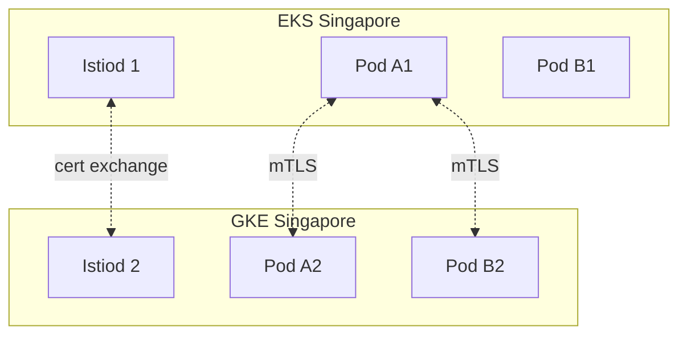
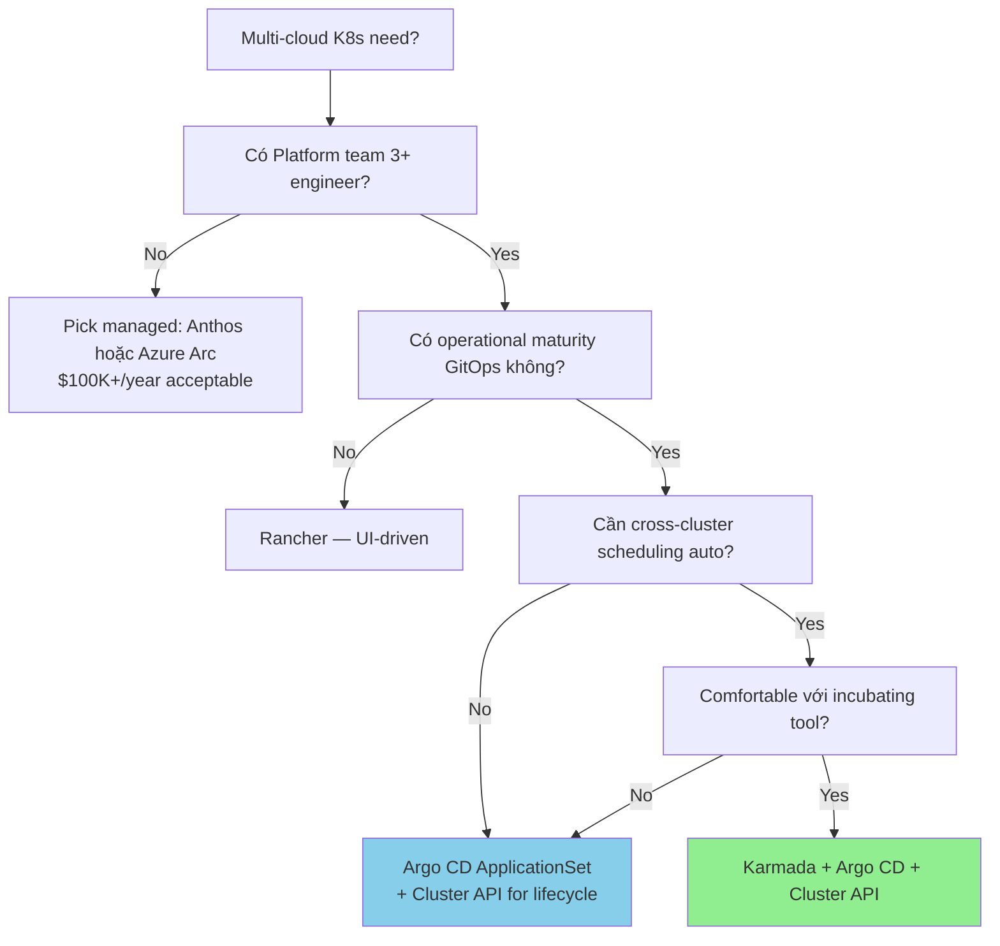

# 🎓 Kubernetes Multi-cloud — Anthos, Azure Arc, Cluster API, Service Mesh

> **Tác giả:** Mr.Rom\
> **Phiên bản:** v1.0.0\
> **Tạo lúc:** 24/05/2026\
> **Cập nhật:** 24/05/2026\
> **Level:** Basic (bài 03/5)\
> **Tags:** [MUST-KNOW]\
> **Thời lượng đọc:** ~22 phút\
> **Prerequisites:** Đã đọc [02_multi-cloud-network-and-identity](02_multi-cloud-network-and-identity.md) ✅, biết K8s basics (Pod/Service/Deployment), có thực hành EKS hoặc GKE

> 🎯 *Bài 03 cluster Multi-cloud. **K8s là layer portable nhất** cho multi-cloud — chính vì thế là backbone của mọi multi-cloud strategy nghiêm túc 2026. Bài này: vì sao K8s portable, multi-cluster management tools (Anthos, Azure Arc, EKS Anywhere, Cluster API, Rancher, Karmada), service mesh cross-cluster (Istio multi-primary, Cilium ClusterMesh, Linkerd), và workload portability gotchas thực tế.*

## 🎯 Sau bài này bạn sẽ

- [ ] Hiểu **vì sao K8s là portable layer** cho multi-cloud
- [ ] Phân biệt **6 multi-cluster management tool** (Anthos, Azure Arc, EKS Anywhere, Cluster API, Rancher, Karmada)
- [ ] Biết **service mesh cross-cluster** options (Istio multi-primary, Cilium ClusterMesh, Linkerd multi-cluster)
- [ ] Setup **Karmada hoặc Argo CD** cho GitOps multi-cluster
- [ ] Biết **5 workload portability gotcha** thực tế (storage class, ingress, LoadBalancer, DNS, IAM)
- [ ] Quyết định pattern fit nhất cho Acme Shop

---

## Tình huống — Acme Shop muốn deploy 1 lần, chạy 3 cloud

Sau khi Acme Shop có network bridge (bài 02) và identity federation, ML team đặt yêu cầu mới:

> ML Lead: *"Mình muốn deploy ML inference service 1 lần, K8s tự rải xuống cả EKS (AWS), GKE (GCP), AKS (Azure). Khi 1 cluster down, traffic tự rerouted sang cluster khác. Mình không muốn 3 lần `kubectl apply -f` cho 3 cluster."*

Yêu cầu:
1. **Unified deployment**: 1 manifest → spread across cluster.
2. **Service discovery cross-cluster**: pod GKE biết được pod EKS.
3. **Failover automatic**: 1 cluster down, traffic shift.
4. **Observability central**: 1 dashboard cho cả 3 cluster.

→ Bài này build solution K8s multi-cloud production-grade.

---

## 1️⃣ Vì sao K8s là **layer portable nhất** cho multi-cloud

🪞 **Ẩn dụ**: *K8s như **chuẩn container ISO** trong vận tải biển — mọi cảng (cloud) đều có cẩu tương thích. Khác với "đóng gói theo cảng riêng" (Lambda AWS, Cloud Functions GCP) — chỉ cẩu cảng đó mới bốc được.*

### CNCF standard

- K8s spec do CNCF maintain (vendor-neutral foundation).
- API `apps/v1`, `core/v1`, `networking.k8s.io/v1` là chuẩn — mọi managed K8s (EKS, GKE, AKS, OCI, DigitalOcean, OVH, Vultr...) đều implement.
- `kubectl apply -f pod.yaml` chạy được mọi nơi.

### Layer portability mapping

```
┌─────────────────────────────────────────────────┐
│  Application layer (your code)                  │  ← 95% portable
├─────────────────────────────────────────────────┤
│  K8s API layer (Pod, Service, Deployment)       │  ← 90% portable
├─────────────────────────────────────────────────┤
│  K8s control plane (EKS / GKE / AKS managed)    │  ← 0% portable (vendor)
├─────────────────────────────────────────────────┤
│  Compute / network / storage (cloud-specific)   │  ← 0% portable
└─────────────────────────────────────────────────┘
```

→ App + K8s API là portable. Control plane + infra là cloud-specific. Pattern multi-cloud K8s = **giữ app layer + K8s API constant**, swap control plane.

### What's NOT portable (caveats)

Mặc dù K8s API portable, có 5 thứ vendor-specific:

| Resource | Vendor-specific | Workaround |
|---|---|---|
| `LoadBalancer` Service | ALB (AWS), GLB (GCP), Azure LB | Dùng Ingress + portable controller (NGINX, Contour) |
| `StorageClass` | EBS, PD, Azure Disk | Define StorageClass per cluster, app reference `default` |
| IAM permission for pod | IRSA (AWS), WIF (GCP), Pod Identity (Azure) | Workload Identity Federation (bài 02) |
| DNS / external-dns | Route 53, Cloud DNS, Azure DNS | Use `external-dns` controller portable |
| Logging / monitoring | CloudWatch, Cloud Logging, Azure Monitor | Use Prometheus + Loki + Grafana (portable) |

→ Workload portable **nếu** abstract qua resource standard. Bám vào vendor-specific (Annotation `service.beta.kubernetes.io/aws-load-balancer-type`) sẽ không portable.

### Workload portable principles

```yaml
# ❌ NOT portable — AWS-specific annotation
apiVersion: v1
kind: Service
metadata:
  annotations:
    service.beta.kubernetes.io/aws-load-balancer-type: "nlb"
spec:
  type: LoadBalancer
  ...

# ✅ Portable — generic
apiVersion: networking.k8s.io/v1
kind: Ingress
metadata:
  name: my-app
  annotations:
    kubernetes.io/ingress.class: "nginx"   # NGINX runs everywhere
spec:
  rules:
    - host: api.acmeshop.io
      http:
        paths:
          - path: /
            pathType: Prefix
            backend:
              service:
                name: my-app
                port:
                  number: 80
```

---

## 2️⃣ Multi-cluster management — 6 tool chính 2026

Sau khi có nhiều cluster (EKS + GKE + AKS), vấn đề:
- Làm sao deploy nhất quán?
- Làm sao thấy tất cả cluster trong 1 view?
- Làm sao policy enforce (security, network) cross-cluster?

🪞 **Ẩn dụ**: *Như quản lý **chuỗi cửa hàng franchise** — không thể bay tới mỗi cửa hàng training riêng. Cần 1 hub central (multi-cluster management) để rollout policy + monitor.*

### Option 1: Google Anthos (premium, mature)

**Định nghĩa**: Google's multi-cloud K8s platform — GKE Enterprise hỗ trợ chạy K8s on GCP, AWS, Azure, on-prem.

**Components**:
- **GKE Multi-cloud**: K8s control plane managed by Google, chạy trên AWS/Azure VM.
- **Anthos Config Management** (ACM): GitOps + policy.
- **Anthos Service Mesh**: managed Istio.
- **Anthos Cloud Run for Anthos**: serverless on K8s.

**Pros**:
- Mature (since 2019).
- Single pane Google Cloud Console cho tất cả cluster.
- Policy enforcement strong.

**Cons**:
- **Đắt**: $0.10/vCPU/h cho mỗi cluster managed (~$100-300/cluster/tháng baseline).
- Lock-in lại với Google.
- Setup phức tạp (2-4 tuần).

**Khi dùng**: Enterprise đã đầu tư GCP, có $100K+/năm Anthos budget, cần managed solution.

### Option 2: Azure Arc (Microsoft equivalent)

**Định nghĩa**: Azure Arc cho phép manage K8s cluster bất kỳ đâu (AWS, GCP, on-prem) qua Azure Portal.

**Components**:
- **Arc-enabled Kubernetes**: register cluster bất kỳ vào Azure.
- **Azure Policy** for K8s: enforce policy cross-cluster.
- **Azure Monitor** for containers: observability central.
- **GitOps via Flux**: deployment qua Git.

**Pros**:
- Free tier có hạn (đến 6 cluster small).
- Tích hợp tốt với Microsoft stack.
- Strong RBAC + Entra ID integration.

**Cons**:
- Vẫn lock-in Microsoft.
- Performance lệ thuộc Azure connectivity.

**Khi dùng**: Tổ chức Microsoft-centric (Entra ID + Office 365), hybrid với on-prem Windows.

### Option 3: AWS EKS Anywhere

**Định nghĩa**: AWS distribution của K8s chạy on-prem hoặc bare metal — managed bởi AWS console.

**Pros**:
- AWS-native experience anywhere.
- vSphere + bare metal support.

**Cons**:
- **Không chạy được trên GCP/Azure** (chỉ AWS + on-prem).
- "Multi-cloud" theo nghĩa rộng = hybrid (AWS + on-prem) only.

**Khi dùng**: AWS shop muốn extend xuống on-prem datacenter.

### Option 4: Cluster API (CAPI) — open source, vendor-neutral

🪞 **Ẩn dụ**: *Như **Terraform cho K8s cluster lifecycle** — declarative manage cluster (create/upgrade/delete) cross-provider.*

**Định nghĩa**: CNCF sub-project. Define cluster as Kubernetes resource. Provider plugins: CAPA (AWS), CAPG (GCP), CAPZ (Azure), CAPV (vSphere), CAPDO (DigitalOcean), v.v.

**Example**:

```yaml
apiVersion: cluster.x-k8s.io/v1beta1
kind: Cluster
metadata:
  name: acmeshop-aws-prod
  namespace: clusters
spec:
  clusterNetwork:
    pods:
      cidrBlocks: ["192.168.0.0/16"]
  controlPlaneRef:
    apiVersion: controlplane.cluster.x-k8s.io/v1beta1
    kind: KubeadmControlPlane
    name: acmeshop-aws-prod-cp
  infrastructureRef:
    apiVersion: infrastructure.cluster.x-k8s.io/v1beta1
    kind: AWSCluster
    name: acmeshop-aws-prod
```

**Pros**:
- 100% open source (no lock-in).
- Vendor-neutral.
- Mature (graduated CNCF 2024).

**Cons**:
- Self-host management cluster (1 cluster để manage other cluster).
- Operational burden.
- Less polished UI (so với Anthos).

**Khi dùng**: Tổ chức có Platform team mạnh, muốn tránh vendor lock-in management plane.

### Option 5: Rancher (SUSE) — enterprise UI

**Định nghĩa**: Multi-cluster K8s management với UI mạnh. Owns by SUSE.

**Pros**:
- UI tốt nhất cho operator non-K8s expert.
- Centralized RBAC, namespace, project.
- Open source core (free).

**Cons**:
- Học cost cao (Rancher's own concepts như "Project").
- SUSE enterprise support đắt.

**Khi dùng**: Tổ chức nhiều junior K8s admin cần UI, không full GitOps.

### Option 6: Karmada — multi-cluster scheduling

**Định nghĩa**: CNCF project (incubating). "Federation v2" — schedule workload across multiple K8s cluster với policy.

**Example**:

```yaml
apiVersion: policy.karmada.io/v1alpha1
kind: PropagationPolicy
metadata:
  name: ml-inference-policy
spec:
  resourceSelectors:
    - apiVersion: apps/v1
      kind: Deployment
      name: ml-inference
  placement:
    clusterAffinity:
      clusterNames:
        - eks-aws-singapore
        - gke-gcp-singapore
        - aks-azure-singapore
    replicaScheduling:
      replicaSchedulingType: Divided
      replicaDivisionPreference: Weighted
      weightPreference:
        staticWeightList:
          - targetCluster:
              clusterNames: ["eks-aws-singapore"]
            weight: 2
          - targetCluster:
              clusterNames: ["gke-gcp-singapore"]
            weight: 2
          - targetCluster:
              clusterNames: ["aks-azure-singapore"]
            weight: 1
```

→ 5 replicas của ml-inference: 2 EKS + 2 GKE + 1 AKS. Khi 1 cluster down, Karmada reschedule.

**Pros**:
- True multi-cluster scheduler.
- Replica distribution intelligent.
- Open source.

**Cons**:
- Còn incubating (production-readiness varied).
- Operational complexity (Karmada control plane + member cluster).

**Khi dùng**: Production multi-cloud serving workload cần redistribute dynamic.

### Comparison matrix

| Tool | Vendor | License | Use case | Mature 2026 |
|---|---|---|---|---|
| **Anthos** | Google | Proprietary, paid | Premium managed multi-cloud | 🟢🟢🟢 |
| **Azure Arc** | Microsoft | Proprietary, partial free | Enterprise + on-prem manage | 🟢🟢🟢 |
| **EKS Anywhere** | AWS | OSS + paid support | AWS + on-prem (not multi-cloud) | 🟢🟢 |
| **Cluster API** | CNCF | Apache 2.0 | Vendor-neutral cluster lifecycle | 🟢🟢🟢 |
| **Rancher** | SUSE | Apache 2.0 (UI free) | UI-driven multi-cluster | 🟢🟢🟢 |
| **Karmada** | CNCF | Apache 2.0 | Multi-cluster scheduling | 🟡🟡 (Incubating) |

→ Acme Shop pick: **Cluster API for lifecycle + Argo CD for app deployment + Karmada for cross-cluster scheduling** (open source, no lock-in).

---

## 3️⃣ Service mesh cross-cluster — pod GKE ↔ pod EKS

🪞 **Ẩn dụ**: *Service mesh như **mạng điện thoại nội bộ công ty** — mỗi nhân viên (pod) có sđt nội bộ, gọi nhau qua tổng đài, không cần biết người kia ở văn phòng nào.*

### Option 1: Istio multi-primary

**Architecture**:



**Setup**:
- Mỗi cluster có Istiod riêng.
- Trust common root CA.
- Endpoint discovery cross-cluster qua remote secret.
- Network: VPC peering hoặc gateway mode (qua public LB).

**Pros**:
- Full feature (mTLS, traffic shaping, observability).
- Standard CNCF.

**Cons**:
- Setup phức tạp.
- Latency overhead 1-5ms per hop.
- Resource cost: Istiod ~500m CPU per cluster.

### Option 2: Cilium ClusterMesh

**Architecture**:
- Cilium là CNI dựa trên eBPF.
- ClusterMesh: pod IP routable cross-cluster qua VPN/Direct Connect.
- Service discovery: global service annotation.

```yaml
apiVersion: v1
kind: Service
metadata:
  name: orders-api
  annotations:
    service.cilium.io/global: "true"
    service.cilium.io/shared: "true"
spec:
  selector:
    app: orders
  ports:
    - port: 8080
```

→ Service `orders-api` available cross-cluster, traffic load-balanced sang pod ở cluster bất kỳ.

**Pros**:
- Performance tốt (eBPF — no sidecar overhead).
- Network policy cross-cluster.

**Cons**:
- Yêu cầu Cilium làm CNI (replace AWS VPC CNI / GKE CNI).
- Lock-in Cilium ecosystem.

### Option 3: Linkerd multi-cluster

**Architecture**:
- Linkerd: lightweight service mesh (Rust-based).
- Multi-cluster qua gateway mode.

**Pros**:
- Đơn giản nhất (cài 5 phút).
- Resource footprint nhỏ.

**Cons**:
- Ít feature hơn Istio (no advanced traffic shaping).
- Gateway mode mọi traffic qua LB → latency cao hơn.

### Service mesh comparison

| Aspect | Istio | Cilium | Linkerd |
|---|---|---|---|
| Sidecar | Envoy | None (eBPF) | linkerd2-proxy |
| CPU overhead per pod | 100-300m | ~0 | 50-100m |
| Memory overhead | 100-300MB | ~0 | 30-50MB |
| Cross-cluster setup | Complex | Medium | Easy |
| Feature richness | Highest | Medium-high | Medium |
| Production maturity 2026 | 🟢🟢🟢 | 🟢🟢🟢 | 🟢🟢🟢 |

→ **Acme Shop pick**: Cilium nếu greenfield (CNI replaceable), Istio nếu đã có brownfield workload + cần feature rich. Linkerd cho small team không cần advanced traffic policy.

---

## 4️⃣ GitOps multi-cluster — Argo CD ApplicationSet

🪞 **Ẩn dụ**: *Như **xuất bản 1 cuốn sách ra nhiều ngôn ngữ** — viết source 1 lần, dịch + in cho mỗi thị trường. ApplicationSet là cơ chế "publish to N clusters".*

### Argo CD ApplicationSet pattern

```yaml
apiVersion: argoproj.io/v1alpha1
kind: ApplicationSet
metadata:
  name: ml-inference
  namespace: argocd
spec:
  generators:
    - clusters: {}  # All registered cluster
  template:
    metadata:
      name: 'ml-inference-{{name}}'  # name = cluster name
    spec:
      project: default
      source:
        repoURL: https://github.com/acmeshop/k8s-manifests
        targetRevision: main
        path: apps/ml-inference
        helm:
          valueFiles:
            - 'values-{{name}}.yaml'  # cluster-specific values
      destination:
        server: '{{server}}'
        namespace: ml
      syncPolicy:
        automated:
          prune: true
          selfHeal: true
```

→ 1 ApplicationSet → 3 Application (EKS, GKE, AKS). Argo CD tự maintain sync.

### Cluster-specific values

```yaml
# values-eks-aws-singapore.yaml
image:
  repository: 123456789012.dkr.ecr.ap-southeast-1.amazonaws.com/ml-inference
replicas: 5
storageClass: gp3
serviceAccount:
  annotations:
    eks.amazonaws.com/role-arn: arn:aws:iam::123456789012:role/MLInferenceRole

---
# values-gke-gcp-singapore.yaml
image:
  repository: asia-southeast1-docker.pkg.dev/acmeshop/ml/ml-inference
replicas: 3
storageClass: standard-rwo
serviceAccount:
  annotations:
    iam.gke.io/gcp-service-account: ml-inference@acmeshop.iam.gserviceaccount.com
```

→ Manifest core giống, parameter cloud-specific tách ra values file.

### Register cluster vào Argo CD

```bash
# AWS EKS
argocd cluster add arn:aws:eks:ap-southeast-1:123456789012:cluster/acmeshop-prod --name eks-aws-singapore

# GCP GKE
argocd cluster add gke_acmeshop-prod_asia-southeast1_acmeshop-prod --name gke-gcp-singapore

# Azure AKS
argocd cluster add aks-context-name --name aks-azure-singapore
```

→ Argo CD bây giờ thấy 3 cluster, ApplicationSet generator phân phối.

---

## 5️⃣ 5 workload portability gotcha thực tế

Lý thuyết "K8s portable" đẹp, nhưng thực tế 5 chỗ đau:

### Gotcha 1: Storage class differences

| AWS | GCP | Azure |
|---|---|---|
| `gp2`, `gp3`, `io1`, `io2` | `standard`, `standard-rwo`, `premium-rwo` | `default`, `managed-premium` |

**Fix**: Define `default` StorageClass per cluster pointing to equivalent. App PVC reference `storageClassName: default`. Trade-off: lose specific perf tuning.

### Gotcha 2: LoadBalancer Service không tương thích

```yaml
# Works AWS only (NLB)
spec:
  type: LoadBalancer
  annotations:
    service.beta.kubernetes.io/aws-load-balancer-type: "nlb"

# Works GCP only
  annotations:
    cloud.google.com/load-balancer-type: "Internal"
```

**Fix**: Dùng Ingress với portable controller (NGINX, Contour, Traefik). LoadBalancer Service chỉ cho extreme low-latency case.

### Gotcha 3: IAM cho pod khác nhau

| AWS EKS | GCP GKE | Azure AKS |
|---|---|---|
| IRSA (IAM Role for Service Account) | Workload Identity (GSA bind to KSA) | Azure Workload Identity (AAD app bind to SA) |

**Fix**: Define service account per cluster với annotation phù hợp; app code dùng default credential chain (boto3, google-cloud, azure-sdk tự pick up).

### Gotcha 4: Ingress controller behavior

- AWS ALB Ingress Controller: built-in, mature.
- GCP GKE Ingress: auto-provision GLB, latency tối ưu nhưng setup khác.
- Azure: AGIC (Application Gateway Ingress Controller).

**Fix**: Pick 1 portable ingress (NGINX nginx-ingress hoặc Traefik) — install qua Helm trên mọi cluster. Cost: lose vendor-specific feature (AWS WAF integration).

### Gotcha 5: DNS + external-dns

App tạo Service/Ingress → mong muốn DNS record `api.acmeshop.io` tự tạo.

**Tool**: `external-dns` controller — đọc Ingress annotation, tạo Route 53 / Cloud DNS / Azure DNS record.

```yaml
apiVersion: networking.k8s.io/v1
kind: Ingress
metadata:
  name: api
  annotations:
    external-dns.alpha.kubernetes.io/hostname: api.acmeshop.io
spec:
  ...
```

→ external-dns nhận trigger, gọi Route 53 API (nếu trên AWS) hoặc Cloud DNS API (nếu trên GCP) tạo record.

**Gotcha**: 3 cluster đều tạo record `api.acmeshop.io` → conflict!

**Fix**:
- 1 cluster làm "DNS owner" (set `--source service --domain-filter acmeshop.io` chỉ ở 1 cluster).
- Cluster khác dùng `txt-owner-id` để track ownership.

---

## 6️⃣ Hands-on — Argo CD ApplicationSet deploy app 2 cluster

### Prerequisites

- 2 cluster K8s (EKS + GKE, hoặc 2 kind cluster local).
- Argo CD installed trên 1 cluster (gọi là "ops cluster").
- Repo GitHub `acmeshop/k8s-manifests`.

### Step 1: Register 2 cluster vào Argo CD

```bash
# Login Argo CD
argocd login argocd.acmeshop.io

# Get current contexts
kubectl config get-contexts

# Add cluster A
argocd cluster add eks-aws-singapore --name aws-prod

# Add cluster B
argocd cluster add gke_acmeshop_asia-southeast1_prod --name gcp-prod

# Verify
argocd cluster list
```

### Step 2: Create repo structure

```
k8s-manifests/
└── apps/
    └── nginx-demo/
        ├── deployment.yaml
        ├── service.yaml
        ├── values-aws-prod.yaml
        └── values-gcp-prod.yaml
```

`apps/nginx-demo/deployment.yaml`:

```yaml
apiVersion: apps/v1
kind: Deployment
metadata:
  name: nginx-demo
spec:
  replicas: 2
  selector:
    matchLabels:
      app: nginx-demo
  template:
    metadata:
      labels:
        app: nginx-demo
    spec:
      containers:
        - name: nginx
          image: nginx:1.27
          ports:
            - containerPort: 80
          resources:
            requests: { cpu: 100m, memory: 64Mi }
            limits:   { cpu: 200m, memory: 128Mi }
```

`apps/nginx-demo/service.yaml`:

```yaml
apiVersion: v1
kind: Service
metadata:
  name: nginx-demo
spec:
  selector:
    app: nginx-demo
  ports:
    - port: 80
      targetPort: 80
  type: ClusterIP
```

### Step 3: ApplicationSet

```yaml
apiVersion: argoproj.io/v1alpha1
kind: ApplicationSet
metadata:
  name: nginx-demo
  namespace: argocd
spec:
  generators:
    - list:
        elements:
          - cluster: aws-prod
            url: https://eks-aws-singapore.eks.amazonaws.com
          - cluster: gcp-prod
            url: https://gke-gcp-singapore.googleapis.com
  template:
    metadata:
      name: 'nginx-demo-{{cluster}}'
    spec:
      project: default
      source:
        repoURL: https://github.com/acmeshop/k8s-manifests
        targetRevision: main
        path: apps/nginx-demo
      destination:
        server: '{{url}}'
        namespace: demo
      syncPolicy:
        automated:
          prune: true
          selfHeal: true
        syncOptions:
          - CreateNamespace=true
```

### Step 4: Apply + verify

```bash
kubectl apply -f applicationset.yaml -n argocd

# Check
argocd app list
# nginx-demo-aws-prod  Synced  Healthy
# nginx-demo-gcp-prod  Synced  Healthy

# Verify nginx running on AWS
kubectl --context=eks-aws-singapore -n demo get pods

# Verify nginx running on GCP
kubectl --context=gke-gcp-singapore -n demo get pods
```

Kết quả mong đợi: cùng nginx-demo chạy 2 cluster, GitOps managed.

### Step 5: Test failover

```bash
# Drain 1 cluster (simulate failure)
kubectl --context=eks-aws-singapore drain node --all

# Argo CD detect, không thay đổi (per-cluster sync)
# Để real failover: cần Karmada hoặc DNS-based routing
```

→ Đây là **baseline** GitOps. Auto-failover cross-cluster cần thêm layer (Karmada hoặc global LB + DNS).

---

## 7️⃣ Pattern decision tree cho Acme Shop



**Acme Shop final pick**:
- **Cluster lifecycle**: Cluster API (CAPA + CAPG + CAPZ).
- **App deployment**: Argo CD ApplicationSet (GitOps).
- **Cross-cluster scheduling**: Karmada (pilot for ml-inference, expand later).
- **Service mesh**: Cilium ClusterMesh (vì đã dùng Cilium làm CNI).
- **Observability**: Prometheus federation + Grafana central + Loki.
- **Identity**: Workload Identity Federation per bài 02.

---

## 💡 Pitfall thường gặp & Best practice

### ❌ Pitfall 1: "K8s là portable" = giữ nguyên manifest

- **Triệu chứng**: Apply manifest EKS sang GKE → bug storage class, ingress.
- **Nguyên nhân**: Underestimate vendor-specific gotcha.
- **Cách tránh**: Always test cross-cluster trước khi go production. Build CI matrix `test-eks, test-gke, test-aks`.

### ❌ Pitfall 2: Multi-cluster mà không có observability central

- **Triệu chứng**: 3 cluster, 3 Grafana, debug = mở 3 tab.
- **Nguyên nhân**: Cài Prometheus per cluster, không federation.
- **Cách tránh**: 1 Grafana central + Prometheus federation hoặc Mimir (long-term storage). Cluster label trên mọi metric.

### ❌ Pitfall 3: GitOps + manual `kubectl apply`

- **Triệu chứng**: State drift, Argo CD báo "OutOfSync" everywhere.
- **Nguyên nhân**: Engineer "fix nhanh" qua kubectl, Argo CD revert lại.
- **Cách tránh**: Disable kubectl write access cho non-emergency role. Emergency = "break glass" account.

### ❌ Pitfall 4: Cross-cluster gossip overhead

- **Triệu chứng**: Service mesh cross-cluster làm tăng latency 30%+.
- **Nguyên nhân**: Gateway mode mọi traffic, không tận dụng locality.
- **Cách tránh**: Set locality-aware load balancing (Istio) — prefer same-cluster pod, cross-cluster chỉ khi fail.

### ❌ Pitfall 5: Karmada production prematurely

- **Triệu chứng**: Karmada bug làm replicas chia sai, production down.
- **Nguyên nhân**: Karmada còn Incubating, edge case nhiều.
- **Cách tránh**: Pilot 1 non-critical workload 3-6 tháng. Production-ready criteria khắt khe.

### ✅ Best practice 1: Helm + values per cluster

- 1 chart, N values file (per cluster).
- Argo CD ApplicationSet template substitute.
- Test: `helm template --values values-aws.yaml`.

### ✅ Best practice 2: External Secrets Operator (xem bài 02)

- Secret từ Vault central, sync vào mọi cluster.
- Không hardcode credential trong manifest.

### ✅ Best practice 3: Cluster naming convention nhất quán

```
<vendor>-<env>-<region>
aws-prod-singapore
gcp-prod-singapore
azure-prod-singapore
```

→ Label resource: `cluster=aws-prod-singapore` → query metric/log đa cluster dễ.

---

## 🧠 Self-check

**Q1.** Cilium ClusterMesh vs Istio multi-primary — khi nào pick cái nào?

<details>
<summary>💡 Đáp án</summary>

**Cilium ClusterMesh**:
- Greenfield (chưa có CNI commit).
- Cần performance cao (eBPF không sidecar).
- Network policy là priority chính.
- Trade-off: tied to Cilium ecosystem.

**Istio multi-primary**:
- Brownfield (đã có Istio đơn cluster).
- Cần advanced traffic shaping (canary, A/B test cross-cluster).
- Standard CNCF, ecosystem rộng.
- Trade-off: resource overhead cao (Envoy sidecar).

→ Rule: Cilium for new platform, Istio for advanced use case.

</details>

**Q2.** Argo CD ApplicationSet generator types — list 3 cái.

<details>
<summary>💡 Đáp án</summary>

1. **List**: cluster + URL liệt kê thủ công (như §6 hands-on).
2. **Cluster**: auto-detect mọi cluster đã register với Argo CD (filter qua label).
3. **Git**: generator dựa trên folder structure trong Git repo (mỗi folder = 1 App).
4. **Matrix**: combine 2 generator (vd Cluster × Git).
5. **SCM Provider**: GitHub Org / Bitbucket auto-discover repo.

→ Acme Shop pattern: Cluster generator + label filter (`env=prod, region=singapore`).

</details>

**Q3.** Acme Shop muốn migrate workload từ EKS sang GKE. 90% portable rồi, nhưng 1 service dùng AWS RDS thông qua IAM auth. Migrate thế nào?

<details>
<summary>💡 Đáp án</summary>

**Approach 2 phase**:

**Phase 1** (cross-cloud access):
- Setup WIF (bài 02): GKE service account → AWS IAM Role (RDS access).
- Service trên GKE assume role qua OIDC, generate IAM auth token cho RDS.
- Network: VPN/Megaport (bài 02).
- Test: service GKE đọc/ghi RDS qua tunnel.

**Phase 2** (full migration):
- Migrate RDS sang Cloud SQL Postgres (logical replication).
- Cutover: switch DSN trong service từ RDS to Cloud SQL.
- Update IAM: GKE SA → Cloud SQL IAM auth (native, không cần WIF nữa).
- Decommission RDS sau verify.

→ 90% portable đúng, nhưng cross-cloud data plane (DB) thường là phần khó nhất.

</details>

**Q4.** ExternalDNS conflict 3 cluster cùng tạo `api.acmeshop.io` — solution?

<details>
<summary>💡 Đáp án</summary>

**Pattern: Single source of truth**

1. **TXT owner-id**: external-dns tag mỗi record với TXT record `heritage=external-dns,external-dns/owner=<cluster-name>`. Cluster chỉ update record nếu owner-id match.
2. **Single owner cluster**: chỉ 1 cluster có external-dns chạy với domain filter `acmeshop.io`. Cluster khác disable.
3. **Global LB phía trước**: Cloudflare / Akamai global LB, point tới regional ingress IP (cluster-specific). external-dns mỗi cluster tạo `regional-aws.api.acmeshop.io`, `regional-gcp.api.acmeshop.io`. Global LB pool resolve.

→ Production best: option 3 — global LB cho HA + locality.

</details>

**Q5.** EKS Anywhere có phải multi-cloud không?

<details>
<summary>💡 Đáp án</summary>

**Không hoàn toàn** — gọi là **hybrid** chính xác hơn.

- EKS Anywhere chạy K8s cluster on-prem (vSphere, bare metal) hoặc AWS Outposts.
- KHÔNG chạy trên GCP/Azure.
- Multi-cloud yêu cầu 2+ public cloud provider.

→ EKS Anywhere phù hợp "AWS + on-prem" hybrid strategy. Cho true multi-cloud, dùng GKE Multi-cloud (Anthos), Azure Arc, hoặc Cluster API.

</details>

---

## ⚡ Cheatsheet

### Multi-cluster tool nhanh

| Tool | Strength | Khi pick |
|---|---|---|
| Anthos | Managed multi-cloud premium | Enterprise GCP-centric |
| Azure Arc | Manage anywhere from Azure | Enterprise Microsoft |
| Cluster API | Vendor-neutral OSS | Platform team mạnh |
| Rancher | UI-driven | Junior team, không GitOps |
| Karmada | Cross-cluster scheduling | Production multi-cloud serving |
| Argo CD ApplicationSet | GitOps multi-cluster | Default cho mọi case |

### Service mesh

| Tool | Best for |
|---|---|
| Istio | Feature-rich, brownfield |
| Cilium | Performance, greenfield |
| Linkerd | Simplicity, small team |

### Portable patterns

```
✅ Helm + values-<cluster>.yaml
✅ Ingress với NGINX/Contour (no LoadBalancer Service)
✅ StorageClass: default (let cluster decide)
✅ external-dns single-owner
✅ Workload Identity Federation (no static cross-cloud key)
✅ Prometheus federation + Grafana central
```

### Anti-patterns

```
❌ aws-load-balancer-controller annotations in portable workload
❌ Hardcoded vendor StorageClass (gp3, premium-rwo)
❌ kubectl apply outside GitOps
❌ Karmada in production without 3-month pilot
❌ Service mesh without locality-aware LB
```

---

## 📚 Glossary

| EN | VN | Giải thích |
|---|---|---|
| Multi-cluster | Đa cluster | Quản lý nhiều K8s cluster |
| Anthos | (GCP) | Platform GCP để run K8s anywhere |
| Azure Arc | (Azure) | Azure manage K8s/Server anywhere |
| EKS Anywhere | (AWS) | AWS distribution K8s on-prem |
| Cluster API (CAPI) | (CNCF) | Declarative cluster lifecycle |
| CAPA / CAPG / CAPZ | (CAPI providers) | AWS / GCP / Azure provider của Cluster API |
| Rancher | (SUSE) | Multi-cluster K8s UI |
| Karmada | (CNCF Incubating) | Cross-cluster scheduling federation |
| ApplicationSet | (Argo CD) | Generate multiple Application từ template |
| Istio | (CNCF) | Service mesh mature |
| Cilium | (CNCF) | CNI + service mesh eBPF-based |
| Linkerd | (CNCF) | Lightweight service mesh |
| eBPF | extended Berkeley Packet Filter | Kernel programmability |
| Service mesh | Lưới dịch vụ | Layer 7 networking giữa các microservice |
| ClusterMesh | (Cilium) | Multi-cluster networking Cilium |
| mTLS | Mutual TLS | Cả client + server xác thực bằng cert |
| Sidecar | (pattern) | Container phụ trong cùng pod |
| GitOps | Vận hành qua Git | Git là source of truth cho cluster state |
| Argo CD | (CNCF) | GitOps tool phổ biến nhất 2026 |
| Flux | (CNCF) | GitOps tool alternative |
| external-dns | (controller) | Auto-create DNS record cho K8s Service/Ingress |
| StorageClass | (K8s) | Định nghĩa kiểu volume provisioner |
| IRSA | IAM Role for Service Account | AWS EKS pod assume IAM role |
| Workload Identity | (GCP) | GKE pod bind GCP service account |
| Cluster federation | Liên đoàn cluster | Khái niệm K8s multi-cluster |
| Replica scheduling | Lập lịch replica | Quyết định pod chạy cluster nào |

---

## 🔗 Liên kết & Tài nguyên

### Trong cluster
- ← Trước: [02_multi-cloud-network-and-identity.md](02_multi-cloud-network-and-identity.md)
- → Tiếp: [04_disaster-recovery-and-architecture-patterns.md](04_disaster-recovery-and-architecture-patterns.md)
- ↑ Cluster: [Multi-cloud-strategies README](../../README.md)

### Cross-reference
- ☸️ [Kubernetes deep](../../../../10_devops/kubernetes/) — K8s fundamentals
- 🏗️ [IaC Terraform](../../../../10_devops/iac/) — Cluster API provisioning
- ☁️ [AWS EKS](../../../aws/) — EKS specifics
- ☁️ [GCP GKE](../../../gcp/) — GKE specifics
- 🧭 [Cloud Engineer roadmap](../../../../00_roadmaps/career/cloud-engineer_career-roadmap.md)

### Tài nguyên ngoài (2026)
- 📖 [Cluster API book](https://cluster-api.sigs.k8s.io/)
- 📖 [Karmada docs](https://karmada.io/docs/)
- 📖 [Anthos overview](https://cloud.google.com/anthos/docs/concepts/overview)
- 📖 [Azure Arc-enabled Kubernetes](https://learn.microsoft.com/en-us/azure/azure-arc/kubernetes/)
- 📖 [Argo CD ApplicationSet](https://argo-cd.readthedocs.io/en/stable/operator-manual/applicationset/)
- 📖 [Istio multi-cluster guide](https://istio.io/latest/docs/setup/install/multicluster/)
- 📖 [Cilium ClusterMesh](https://docs.cilium.io/en/stable/network/clustermesh/)
- 📖 [Linkerd multi-cluster](https://linkerd.io/2/features/multicluster/)
- 📖 [Rancher docs](https://ranchermanager.docs.rancher.com/)
- 📖 [CNCF Landscape Multi-cluster Management](https://landscape.cncf.io/?group=projects-and-products&view-mode=card#provisioning--automation--configuration)

---

## 📌 Changelog

- **v1.0.0 (24/05/2026)** — Bài 03 cluster Multi-cloud basic. K8s là layer portable nhất + 6 multi-cluster management tool (Anthos, Azure Arc, EKS Anywhere, Cluster API, Rancher, Karmada) so sánh + 3 service mesh cross-cluster (Istio multi-primary, Cilium ClusterMesh, Linkerd) + GitOps Argo CD ApplicationSet hands-on (deploy app 2 cluster) + 5 portability gotcha thực tế + decision tree Acme Shop. Pattern open-source no lock-in: Cluster API + Argo CD + Karmada + Cilium.
