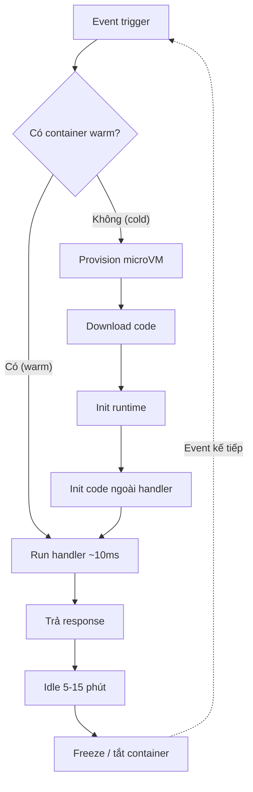

# 🎓 FaaS đào sâu — Cold start, isolate vs container, runtime & duration

> **Tác giả:** Mr.Rom\
> **Phiên bản:** v1.1.2\
> **Tạo lúc:** 24/05/2026\
> **Cập nhật:** 11/06/2026\
> **Level:** Basic\
> **Tags:** [MUST-KNOW]\
> **Yêu cầu trước:** [Serverless là gì — Bức tranh tổng thể & 4 nhà cung cấp lớn](00_what-is-serverless-overview.md)

> 🎯 *Bài 00 cho bạn bức tranh tổng. Bài này đào sâu **kiến trúc FaaS** — bên dưới Lambda/Cloud Functions/Workers thực sự chạy gì? Cold start xảy ra như nào? V8 isolate khác container ra sao? Vì sao memory tăng thì CPU tăng theo? Sau bài này bạn đủ kiến thức để chọn runtime + memory + duration đúng cho workload.*

## 🎯 Sau bài này bạn sẽ

- [ ] Hiểu **execution model** của FaaS — request đến → container start → handle → tắt
- [ ] Biết **cold start mechanics**: provision → download code → init runtime → load handler
- [ ] Phân biệt **3 sandbox engine**: container (Firecracker, gVisor) vs V8 isolate vs WebAssembly
- [ ] So sánh **runtime**: Node.js, Python, Go, Rust, Java — cold start, memory, performance
- [ ] Hiểu **memory ↔ CPU coupling** trong Lambda (CPU proportional với memory)
- [ ] Biết **concurrency limits** và sự khác nhau giữa Lambda (1 invocation/container) và Cloud Run (N concurrent/instance)
- [ ] Biết **max duration**: 15p Lambda / 60p Cloud Functions Gen2 + Cloud Run / ∞ Cloud Run Job
- [ ] Tự **đo cold start** bằng X-Ray / Cloud Trace + tối ưu cơ bản

---

## Tình huống — Acme Shop nhận complaint "API chậm sau 5 phút không dùng"

Nhóm Acme Shop đã migrate 1 vài endpoint sang Lambda. User mobile app báo:
> *"Mở app buổi sáng đầu tiên thấy spinner xoay 1-2s rồi mới ra data. Lần thứ hai trở đi thì nhanh."*

Dev điều tra:
- CloudWatch log: invocation đầu tiên `Duration: 1245ms (Init: 850ms)`.
- Invocation tiếp theo: `Duration: 120ms (Init: 0ms)`.
- → 850ms khi cold start. Sao? Vì sao chỉ lần đầu? Tối ưu được không?

Sếp: *"Sáng mai trước stand-up, bạn giải thích cold start + tối ưu. Có nên đổi sang Cloudflare Workers không? Nghe nói cold start ~5ms."*

Bài này dạy bạn trả lời cả 2 — hiểu **bên dưới ngầm chạy gì** mới đề xuất giải pháp đúng.

---

## Bên dưới Lambda thực sự chạy gì?

🪞 **Ẩn dụ**: *Lambda như **chuỗi nhà hàng fast food chuẩn hoá**. Mỗi đơn (request) cần 1 "bếp dã chiến" (container). Khi không có khách, bếp đóng (idle). Khách đến bất ngờ → AWS dựng bếp mới: kéo công thức từ kho (download code) → bật bếp + chuẩn bị nguyên liệu (init runtime) → bắt đầu nấu (run handler). Lần đầu tốn time setup. Khách thứ 2 vào ngay sau → bếp còn nóng, nấu liền. Sau 5-15 phút không khách → bếp tắt, tiết kiệm điện.*

### Giải phẫu 1 Lambda invocation

```
┌────────────────────────────────────────────────────────────┐
│  Event trigger (HTTP, S3, queue, ...)                      │
└─────────────────────┬──────────────────────────────────────┘
                      │
                      ▼
┌────────────────────────────────────────────────────────────┐
│  Lambda Service routes event đến function                  │
└─────────────────────┬──────────────────────────────────────┘
                      │
            ┌─────────┴─────────┐
            │                   │
       [Warm path]         [Cold path]
            │                   │
            ▼                   ▼
   ┌────────────────┐   ┌────────────────────────┐
   │ Existing       │   │ 1. Provision Firecracker│
   │ MicroVM exists │   │    microVM (~100ms)     │
   │ → run handler  │   │ 2. Download code zip    │
   │ ~10ms          │   │    (~50-200ms)          │
   │                │   │ 3. Init runtime         │
   │                │   │    Python/Node interp.  │
   │                │   │    (~100-300ms)         │
   │                │   │ 4. Import modules +     │
   │                │   │    init code outside    │
   │                │   │    handler (~50-500ms)  │
   │                │   │ 5. Run handler ~10ms    │
   │                │   │ Total: 300-1500ms       │
   └────────────────┘   └────────────────────────┘
                                  │
                                  ▼
                          Container stays warm
                          5-15 phút sau idle
                          → tái sử dụng cho
                          invocation kế tiếp
```

Tóm tắt vòng đời 1 lần gọi function dưới dạng sơ đồ — cùng 1 event nhưng rẽ 2 nhánh tuỳ container đã warm hay chưa:



Sơ đồ cho thấy phần đắt đỏ của cold start (4 bước init) chỉ chạy 1 lần; mọi invocation sau đó đi nhánh warm cho tới khi container bị freeze sau giai đoạn idle.

### Vì sao có 2 path?

- **Cold path**: lần đầu function chạy sau idle. AWS phải dựng môi trường mới.
- **Warm path**: container đã tồn tại → tái sử dụng → response cực nhanh.

AWS giữ container warm khoảng **5-15 phút** sau invocation cuối (con số không công khai, varies theo region, load). Sau đó tắt để giải phóng resource.

### Cold start = các bước nào?

Tổng cold start = **Init Duration** trong CloudWatch:

| Bước | Time | Bạn kiểm soát? |
|---|---|---|
| 1. MicroVM/container provisioning | 50-200ms | ❌ AWS |
| 2. Download code (zip/image) | 50-300ms | ✅ size package |
| 3. Init runtime (boot Python/Node/JVM) | 100-2000ms | ✅ chọn runtime |
| 4. Module imports + init code outside handler | 50-500ms | ✅ code structure |
| 5. Handler execution | varies | ✅ logic |

→ **Bước 3-4 là phần bạn ảnh hưởng nhiều nhất**. Bước 1 thuộc về vendor.

Hiểu các bước rồi, ta xem 3 engine sandbox khác nhau — vì sao Cloudflare Workers nhanh hơn nhiều.

---

## 3 engine sandbox — container, microVM, isolate

Tất cả FaaS đều cần **cô lập** code của user (không cho function A đọc memory function B). Có 3 cách lớn:

### 1. Container truyền thống (Docker, runc)

🪞 **Ẩn dụ**: *Như **căn hộ chung cư** — mỗi căn có cửa khoá riêng, share một số thứ với toà nhà (kernel), nhưng cách ly khá tốt. Vào ra mất time bấm thang máy.*

- **Đại diện**: Cloud Run dùng container thuần (gVisor sandbox).
- **Cách ly**: Linux namespace + cgroups + seccomp.
- **Startup**: 1-3s (kéo image + start container).
- **Footprint**: lớn (chia sẻ kernel nhưng vẫn nhiều memory).
- **Ngôn ngữ**: bất kỳ (chỉ cần image).

### 2. MicroVM (Firecracker, AWS Lambda)

🪞 **Ẩn dụ**: *Như **căn hộ studio cá nhân riêng biệt** — kernel riêng (không share với hàng xóm), nhưng được thiết kế tối giản để boot nhanh. AWS Firecracker tạo microVM trong ~100ms.*

- **Đại diện**: AWS Lambda (Firecracker), AWS Fargate.
- **Cách ly**: KVM virtualization → kernel cô lập hoàn toàn.
- **Startup**: 100-300ms cho microVM + thêm time cho runtime.
- **Footprint**: trung bình (kernel mini).
- **Bảo mật**: cao (kernel riêng).

> 💡 **Firecracker** là open source — AWS public năm 2018. 5MB binary, boot < 125ms. Tài liệu hay đọc thêm.

### 3. V8 isolate (Cloudflare Workers, Deno Deploy)

🪞 **Ẩn dụ**: *Như **hộp văn phòng chia ngăn trong cùng 1 toà** — tất cả ở chung 1 toà nhà (V8 runtime), nhưng có vách ngăn cứng. Không thang máy, mở cửa là vào. Nhược điểm: chỉ làm việc văn phòng (JS/TS/WASM), không nấu ăn được (không OS-level).*

- **Đại diện**: Cloudflare Workers, Deno Deploy.
- **Cách ly**: V8 engine isolate (cùng cơ chế Chrome dùng cô lập tab).
- **Startup**: **~5ms** — chỉ tạo isolate trong process V8 sẵn có.
- **Footprint**: cực nhỏ (~few MB/isolate).
- **Ngôn ngữ**: chủ yếu JS/TS, có WASM (Rust/Go compile xuống).
- **Hạn chế**: không có file system thực, không spawn subprocess, không nhiều Node API.

### Bảng so sánh 3 engine

| Tiêu chí | Container (Cloud Run) | MicroVM (Lambda) | V8 isolate (Workers) |
|---|---|---|---|
| **Cold start** | 1-3s | 100-1000ms | ~5ms |
| **Memory per instance** | 128MB - 32GB | 128MB - 10GB | 128MB |
| **Boot time** | Start container OS | Boot microVM kernel | Spawn isolate in V8 |
| **Ngôn ngữ** | Bất kỳ (container) | Python, Node, Go, Java, Rust, .NET, custom | JS, TS, Python beta, WASM |
| **OS access** | Đầy đủ Linux | Đầy đủ Linux | Limited (no fs/exec) |
| **CPU/mem ratio** | Cấu hình tự do | Linked (mem → cpu) | Per-request limit |
| **Cách ly bảo mật** | gVisor / seccomp | KVM (hardware) | V8 (software) |
| **Best fit** | Container app, web server | Event handler, stateless API | Edge compute, ultra-low-latency |

> ⚠️ **V8 isolate trade-off**: nhanh + nhẹ, nhưng **không chạy được mọi npm package**. Một số package dùng Node API (`fs`, `child_process`) không có ở Workers. Phải dùng `nodejs_compat` flag hoặc tìm alternative.

---

## Runtime — chọn ngôn ngữ nào cho FaaS?

Hiểu engine rồi, giờ chọn ngôn ngữ. Mỗi runtime có trade-off cold start vs ergonomic.

### Cold start theo runtime (Lambda 256MB ARM)

| Runtime | Cold start (init) | Memory baseline | Ghi chú |
|---|---|---|---|
| **Rust** (custom) | 30-150ms | ~20MB | Nhanh nhất, ít memory. Cần compile binary. |
| **Go** (custom) | 80-250ms | ~30MB | Compile binary nhỏ, nhanh. |
| **Node.js 22** | 150-400ms | ~70MB | Phổ biến, ecosystem rộng. |
| **Python 3.13** | 200-500ms | ~80MB | Phổ biến, dependency lớn dễ chậm. |
| **Ruby 3.3** | 250-600ms | ~90MB | Ít phổ biến. |
| **.NET 8** | 400-1500ms | ~150MB | JIT compile lần đầu. |
| **Java 21** (no Snapstart) | 500-3000ms | ~200MB | JVM heavy. |
| **Java 21 (Snapstart)** | 100-300ms | ~200MB | Snapshot JVM → khôi phục nhanh. |

→ **Pattern**:
- **Latency-critical** (user-facing API): Rust, Go, Node, Python.
- **Heavy business logic** (enterprise): Java + Snapstart, .NET.
- **Beginner friendly**: Python, Node — bắt đầu nhanh nhất.

### Khi nào chọn ngôn ngữ nào — hướng dẫn nhanh

| Nhu cầu | Khuyến nghị |
|---|---|
| Web API, glue code | **Node.js 22** hoặc **Python 3.13** |
| Image / video / data processing | **Python** (Pillow, NumPy) hoặc **Go** (concurrent) |
| Ultra-low cold start | **Rust** hoặc **Go** custom runtime |
| Stack enterprise Java sẵn có | **Java 21 + Snapstart** |
| Stack .NET | **.NET 8** |
| Edge compute (Cloudflare Workers) | **TypeScript** (native) hoặc **Rust → WASM** |

### Lambda runtime — kiến thức cần nhớ 2026

- **Native runtime**: Python, Node, Java, Go, .NET, Ruby — AWS quản lý.
- **Custom runtime**: viết bằng bất kỳ ngôn ngữ nào, miễn implement Lambda Runtime API (HTTP).
- **Container image**: build Docker image extends `public.ecr.aws/lambda/...` → deploy. Hỗ trợ 10GB.
- **Provided runtime**: dùng `provided.al2023` cho Go/Rust để có Linux base.

### Cloud Functions Gen2 runtime

GCP Cloud Functions Gen2 build trên Cloud Run → hỗ trợ:
- Python, Node, Go, Java, .NET, Ruby, PHP.
- Container image custom (bypass runtime).
- Concurrency per instance (1 instance xử lý nhiều request) — khác Lambda.

### Azure Functions runtime

- C#/.NET (native), JavaScript, TypeScript, Python, Java, PowerShell.
- Custom handler (HTTP-based, bất kỳ ngôn ngữ).

### Cloudflare Workers runtime

- TypeScript / JavaScript (native, V8).
- Python (beta 2026, qua Pyodide).
- Rust → WASM (production-ready).

---

## Vì sao memory tăng → CPU cũng tăng?

Đây là điều **rất nhiều người mới Lambda không biết**. Memory không chỉ là RAM — nó **scale luôn cả CPU**.

### Lambda CPU = f(memory)

| Memory | vCPU equivalent |
|---|---|
| 128 MB | ~0.07 vCPU |
| 512 MB | ~0.30 vCPU |
| 1024 MB | ~0.58 vCPU |
| 1769 MB | **1.00 vCPU full** |
| 3008 MB | ~1.70 vCPU |
| 10240 MB | 6.00 vCPU |

→ Lên memory = lên CPU. **Hệ quả quan trọng**: tăng memory đôi khi làm function **chạy nhanh hơn + RẺ HƠN** (vì duration giảm hơn cost increase).

### Ví dụ thực tế

Hash 100MB file:

```
128 MB: duration 8000ms → cost = 8 × 0.128 × $0.0000166 = $0.00001702
1024 MB: duration 800ms → cost = 0.8 × 1.024 × $0.0000166 = $0.00001360
3008 MB: duration 300ms → cost = 0.3 × 3.008 × $0.0000166 = $0.00001499
```

→ **1024 MB rẻ hơn 128 MB!** Vì CPU mạnh hơn → chạy nhanh hơn 10x → cost giảm.

### Tool: AWS Lambda Power Tuning

Open source tool tự test function ở các memory level, vẽ chart cost vs performance.

```bash
# https://github.com/alexcasalboni/aws-lambda-power-tuning
# Deploy Step Functions → invoke function với memory 128/256/512/1024/2048
# Kết quả: best memory cho cost OR speed OR balance
```

### Cloud Run / Cloud Functions Gen2 — khác

- Có thể cấu hình memory + vCPU **độc lập** (1 vCPU + 512MB, 4 vCPU + 8GB, ...).
- Concurrency per instance (1 instance xử lý nhiều request) → CPU shared.

→ Cloud Run linh hoạt hơn Lambda về resource sizing.

---

## Concurrency — Lambda khác Cloud Run như nào?

### Lambda: 1 invocation = 1 container

🪞 **Ẩn dụ**: *Lambda như **bếp dã chiến 1 đầu bếp** — 1 bếp chỉ nấu 1 món tại 1 thời điểm. Có 100 đơn cùng lúc → AWS dựng 100 bếp song song.*

- Mỗi container Lambda xử lý **1 invocation tại 1 thời điểm**.
- 1000 concurrent request → 1000 container.
- **Default account limit**: 1000 concurrent executions (raise được ticket).

```python
def lambda_handler(event, context):
    # Container này CHỈ xử lý event này. 
    # Không có event khác concurrent trong cùng container.
    process(event)
```

### Cloud Run: 1 instance = N concurrent requests

🪞 **Ẩn dụ**: *Cloud Run như **nhà hàng có nhiều bàn** — 1 đầu bếp (instance) phục vụ 80 bàn (request) cùng lúc. Đông quá thì mở thêm chi nhánh (instance).*

- 1 container instance xử lý **N concurrent requests** (default 80, max 1000).
- Auto-scale 0 → N instance theo tải.
- **Tiết kiệm cold start**: 1 instance warm cover được 80 request.

```python
# FastAPI app trên Cloud Run
@app.get("/data")
async def get_data():
    # Có thể có 80 request khác chạy concurrent trong cùng instance này
    # → cần thread-safe / async-safe
    return query_db()
```

### So sánh

| Tiêu chí | Lambda | Cloud Run |
|---|---|---|
| Concurrency per instance | 1 | 1-1000 (default 80) |
| Khi 1000 req cùng lúc | 1000 container | 13 instances (1000/80) |
| Cold start frequency | Mỗi instance mới | Mỗi instance mới (ít hơn) |
| State sharing trong instance | Không (1 req only) | Có (cần thread-safe) |
| Pricing | Per invocation + GB-s | Per instance-time (count CPU) |

→ **Cloud Run pattern**: 1 instance handle 80 req → ít cold start hơn, rẻ hơn ở moderate traffic.

### Concurrency limits (cần biết)

| Vendor | Default limit | Note |
|---|---|---|
| AWS Lambda | 1000 concurrent | Per account per region. Raise bằng ticket. |
| AWS Lambda burst | 500-3000/min | Phụ thuộc region, dần dần tăng. |
| Cloud Functions Gen2 | 1000 concurrent | Per region. |
| Cloud Run | 1000 instances × concurrency 80 = 80,000 req/s | Tunable. |
| Azure Functions | 200 (Consumption) | Premium plan: 100 per instance × N |
| Cloudflare Workers | 6 concurrent connections per Worker | Auto-scale globally |

---

## Max duration — đừng quên giới hạn này

Quan trọng nhất khi chọn vendor.

### Bảng giới hạn

| Vendor / Mode | Max duration | Khi nào quan trọng |
|---|---|---|
| **AWS Lambda** | **15 phút** | Long batch — FAIL |
| **AWS Step Functions Standard** | 1 năm (workflow) | Orchestrate nhiều Lambda |
| **AWS Fargate** | Vô hạn | Long task |
| **GCP Cloud Functions 1st gen** | 9 phút (HTTP) / 9 phút (background) | Sắp deprecate |
| **GCP Cloud Functions Gen2 (build trên Cloud Run)** | **60 phút** | Tốt hơn nhiều |
| **GCP Cloud Run HTTP** | 60 phút | Web request |
| **GCP Cloud Run Job** | **24 giờ** | Batch — tốt nhất |
| **Azure Functions Consumption** | 10 phút (default 5p) | Hạn chế |
| **Azure Functions Premium** | Unlimited (timeout config) | Long task |
| **Cloudflare Workers** | 30s CPU (wall time đến 5 phút với waitUntil) | Edge ngắn |

### Pattern xử lý task vượt giới hạn

#### Pattern 1: Step Functions / Workflows

Chia task lớn thành nhiều Lambda nhỏ liên kết:

```yaml
# Step Functions example
ProcessLargeFile:
  Type: AWS::StepFunctions::StateMachine
  Properties:
    Definition:
      States:
        SplitFile:
          Type: Task
          Resource: arn:aws:lambda:...:split
          Next: ProcessChunks
        ProcessChunks:
          Type: Map
          ItemsPath: $.chunks
          Iterator:
            States:
              ProcessChunk:
                Type: Task
                Resource: arn:aws:lambda:...:process
                End: true
          Next: Merge
```

→ Mỗi Lambda max 15p, workflow tổng có thể 1 năm.

#### Pattern 2: Cloud Run Job

```bash
gcloud run jobs create acme-batch \
  --image gcr.io/proj/batch:v1 \
  --task-timeout 24h \
  --memory 4Gi \
  --cpu 2

gcloud run jobs execute acme-batch
```

→ Container chạy được 24 giờ, scale CPU/memory tự do.

#### Pattern 3: Chunked invocation (self-recursion)

Lambda gọi lại chính nó với progress:

```python
def lambda_handler(event, context):
    items = event.get('items', load_all())
    
    start = event.get('start', 0)
    deadline = context.get_remaining_time_in_millis()
    
    for i in range(start, len(items)):
        if context.get_remaining_time_in_millis() < 60000:  # 1 min left
            # invoke self with remaining
            boto3.client('lambda').invoke(
                FunctionName=context.function_name,
                InvocationType='Event',
                Payload=json.dumps({'items': items, 'start': i})
            )
            return {'status': 'continuing', 'next': i}
        
        process(items[i])
    
    return {'status': 'done'}
```

⚠️ Pattern hacky — chỉ dùng khi không có Step Functions.

---

## Hands-on: Đo cold start + tối ưu

Thực hành để hiểu sâu.

### Bước 1: Deploy 2 function — Python + Rust

**Python function (cold start chậm hơn)**:

```python
# python-app/lambda_function.py
import json
import time

# Module-level init (chạy lần cold start)
BOOT_TIME = time.time()
print(f"Module loaded at {BOOT_TIME}")

def lambda_handler(event, context):
    return {
        'statusCode': 200,
        'body': json.dumps({
            'message': 'Hello from Python',
            'init_age_sec': time.time() - BOOT_TIME,
            'request_id': context.aws_request_id
        })
    }
```

```bash
cd python-app
zip lambda.zip lambda_function.py
aws lambda create-function \
  --function-name acme-cold-python \
  --runtime python3.13 \
  --architectures arm64 \
  --handler lambda_function.lambda_handler \
  --zip-file fileb://lambda.zip \
  --role arn:aws:iam::ACCOUNT:role/lambda-basic \
  --memory-size 256 \
  --timeout 10
```

**Rust function (cold start nhanh nhất)**:

```rust
// rust-app/src/main.rs
use lambda_runtime::{run, service_fn, Error, LambdaEvent};
use serde_json::{json, Value};

async fn handler(event: LambdaEvent<Value>) -> Result<Value, Error> {
    Ok(json!({
        "statusCode": 200,
        "message": "Hello from Rust",
        "request_id": event.context.request_id
    }))
}

#[tokio::main]
async fn main() -> Result<(), Error> {
    run(service_fn(handler)).await
}
```

```bash
cd rust-app
cargo lambda build --release --arm64
cargo lambda deploy --function-name acme-cold-rust
```

### Bước 2: Đo cold start

```bash
# Force cold start: deploy mới + chờ 30p (hoặc dùng force concurrency=0 rồi reset)
aws lambda update-function-configuration \
  --function-name acme-cold-python \
  --description "force redeploy $(date +%s)"

# Invoke + đo
time aws lambda invoke \
  --function-name acme-cold-python \
  --payload '{}' \
  /tmp/out.json

# Xem CloudWatch logs để thấy Init Duration
aws logs tail /aws/lambda/acme-cold-python --follow
```

Kết quả mong đợi:

```
START RequestId: xxx Version: $LATEST
END RequestId: xxx
REPORT RequestId: xxx Duration: 12.34 ms  Billed Duration: 13 ms  Memory Size: 256 MB  Max Memory Used: 65 MB  Init Duration: 380.21 ms
```

- **Duration**: thời gian handler (12ms).
- **Init Duration**: cold start setup (380ms).
- Lần invoke thứ 2 ngay sau: **Init Duration: 0** (warm).

Lặp với Rust function:

```
REPORT ... Duration: 1.23 ms  Init Duration: 45.67 ms
```

→ Rust cold start **~10x nhanh hơn Python**.

### Bước 3: So sánh Cloud Run

```bash
# Build Python image
cat > Dockerfile <<'EOF'
FROM python:3.13-slim
WORKDIR /app
RUN pip install flask
COPY app.py /app/
ENV PORT=8080
CMD ["python", "app.py"]
EOF

cat > app.py <<'EOF'
from flask import Flask, jsonify
import time, os
app = Flask(__name__)
BOOT = time.time()

@app.route("/")
def hello():
    return jsonify(message="Hello", init_age=time.time() - BOOT)

if __name__ == "__main__":
    app.run(host="0.0.0.0", port=int(os.environ.get("PORT", 8080)))
EOF

gcloud builds submit --tag gcr.io/PROJ/acme-cold:v1
gcloud run deploy acme-cold \
  --image gcr.io/PROJ/acme-cold:v1 \
  --min-instances 0 --max-instances 10 \
  --concurrency 80 \
  --memory 256Mi \
  --region us-central1 \
  --allow-unauthenticated

# Đo
URL=$(gcloud run services describe acme-cold --region us-central1 --format='value(status.url)')
time curl $URL
```

Cold start Cloud Run thường 1-2s (container boot + Flask init). Sau warm: ~30ms.

### Bước 4: Áp dụng mitigation

**Provisioned Concurrency (Lambda)**:

```bash
aws lambda put-provisioned-concurrency-config \
  --function-name acme-cold-python \
  --qualifier '$LATEST' \
  --provisioned-concurrent-executions 2

# Bây giờ 2 invocation đầu tiên không có cold start
```

Cost: ~$5/tháng per 1 provisioned 256MB.

**Min instances (Cloud Run)**:

```bash
gcloud run services update acme-cold \
  --min-instances 1 --region us-central1

# 1 instance luôn sẵn → no cold start cho req đầu
```

Cost: pay-per-instance-second cho min instance đang idle.

### Bước 5: Smart code structure

```python
# ❌ Init trong handler — cold start mỗi lần
def lambda_handler(event, context):
    import boto3
    client = boto3.client('s3')
    return process(event, client)

# ✅ Init ngoài handler — chỉ chạy 1 lần per cold start
import boto3
client = boto3.client('s3')

def lambda_handler(event, context):
    return process(event, client)
```

Khác biệt có thể 200-500ms cold start.

---

## 💡 Cạm bẫy thường gặp & Best practice

### ❌ Cạm bẫy: Import nặng trong handler

```python
def lambda_handler(event, context):
    import pandas as pd  # 200ms init mỗi cold start
    import numpy as np
    ...
```

→ **Fix**: import ở module level. Cold start chậm 1 lần, warm invocation không bị.

### ❌ Cạm bẫy: Quên cold start tồn tại

- **Triệu chứng**: P99 latency 2000ms trong khi P50 50ms.
- **Nguyên nhân**: 1-5% request là cold start.
- **Cách tránh**: P99 = warm latency + cold start probability. Provisioned Concurrency cho user-facing latency-sensitive API.

### ❌ Cạm bẫy: Memory 128MB cho function CPU-heavy

- **Triệu chứng**: Function chạy 8 giây cho task hash 100MB. Phải tăng timeout liên tục.
- **Nguyên nhân**: 128MB = 0.07 vCPU.
- **Cách tránh**: Lambda Power Tuning để tìm sweet spot. Thường 512-1024MB rẻ hơn 128MB.

### ❌ Cạm bẫy: Container image Lambda quá lớn

- **Triệu chứng**: Cold start 3-5s.
- **Nguyên nhân**: Image 5GB → kéo + giải nén lâu.
- **Cách tránh**: 
  - Multi-stage build, slim base image.
  - Bỏ dev dependencies.
  - Cân nhắc zip thay vì container nếu < 50MB.

### ❌ Cạm bẫy: Concurrency limit hit silently

- **Triệu chứng**: Random `429 Too Many Requests` từ Lambda.
- **Nguyên nhân**: Reached account/function concurrency limit.
- **Cách tránh**: 
  - CloudWatch metric `Throttles` → alert > 0.
  - Raise limit qua Service Quotas.
  - Reserved concurrency cho function critical.

### ❌ Cạm bẫy: Cloud Run concurrency = 1 (default ai cấu hình sai)

- **Triệu chứng**: 1000 instance cho 1000 req → cost gấp 80 lần cần thiết.
- **Nguyên nhân**: Set concurrency=1 (như Lambda) thay vì 80.
- **Cách tránh**: Default Cloud Run concurrency=80. Chỉ set =1 nếu app **không** thread-safe (hiếm).

### ✅ Best practice: Init lazy + cache

```python
_db_client = None

def get_db_client():
    global _db_client
    if _db_client is None:
        import psycopg2  # lazy import nếu chưa cần
        _db_client = psycopg2.connect(...)
    return _db_client

def lambda_handler(event, context):
    db = get_db_client()
    return query(db, event)
```

→ Module-level cache reuse giữa warm invocation, init chỉ 1 lần.

### ✅ Best practice: Chọn runtime theo workload

| Workload | Runtime tốt |
|---|---|
| Web API user-facing | Node.js, Python (Snapstart Java OK) |
| Data processing CSV/JSON | Python + Pandas hoặc Go |
| Image/video | Python + Pillow / FFmpeg layer |
| Crypto / hash heavy | Rust hoặc Go |
| Existing .NET shop | .NET 8 |
| Edge / multi-region | Cloudflare Workers (TS/Rust WASM) |

### ✅ Best practice: Đo trước, tối ưu sau

1. Deploy + chạy real traffic 1 tuần.
2. Đo P50, P95, P99 latency + Init Duration distribution.
3. Identify hot path → optimize.
4. Tránh premature optimization (vd dùng Rust khi Python đủ).

---

## 🧠 Tự kiểm tra (Self-check)

**Q1.** Cold start là gì? Liệt kê các bước AWS Lambda phải làm.

<details>
<summary>💡 Đáp án</summary>

**Cold start** = lần đầu function chạy sau idle (hoặc lần đầu sau deploy mới). AWS phải dựng môi trường thực thi từ đầu.

Các bước (theo thứ tự):

1. **Provision Firecracker microVM** (~100ms) — AWS tạo VM cô lập.
2. **Download function code** (~50-300ms) — kéo zip hoặc container image về.
3. **Init runtime** (~100-2000ms) — boot Python interpreter / Node V8 / JVM.
4. **Run init code outside handler** (~50-500ms) — import module, init DB client.
5. **Run handler** (~10-100ms) — execute logic chính.

Tổng: 300-3000ms tuỳ runtime + package size.

**Warm invocation** chỉ chạy bước 5 (Duration ~10ms typical).

Cách thấy: CloudWatch log có field `Init Duration` = thời gian bước 1-4. Warm invocation `Init Duration: 0`.
</details>

**Q2.** V8 isolate khác container ở điểm gì? Vì sao Cloudflare Workers cold start chỉ 5ms?

<details>
<summary>💡 Đáp án</summary>

**Container** (Docker, Lambda Firecracker):
- Mỗi "instance" là 1 process/VM riêng với kernel + OS userland.
- Cold start: boot kernel/process (~100ms-3s).
- Cách ly mạnh nhất (microVM = hardware-level isolation).

**V8 isolate** (Cloudflare Workers, Deno Deploy):
- 1 V8 process (Chrome engine) chạy hàng nghìn isolate.
- Mỗi isolate là 1 context cô lập trong V8 (cùng cơ chế cô lập tab Chrome).
- Cold start: chỉ tạo isolate trong V8 sẵn có (~5ms).
- Cách ly bằng software (V8) → đủ cho mọi case bình thường.

**Vì sao Workers nhanh**:
1. Không boot kernel/OS — V8 process đã chạy sẵn.
2. Không kéo image — code là JS/WASM gửi đến edge sẵn.
3. Isolate spawn cực nhanh trong V8 (~5ms).
4. Memory cực nhỏ (~few MB) → nhiều isolate trên 1 server.

**Trade-off**:
- ❌ Workers không có file system thực, không spawn process, không nhiều Node API.
- ❌ CPU time limit 30s (free 10ms).
- ❌ Memory cap 128MB.
- ❌ Runtime hạn chế (chủ yếu JS/TS + WASM).

→ V8 isolate phù hợp **edge compute** và **micro-task ngắn**. Container/microVM phù hợp **full app + ngôn ngữ đa dạng + workload nặng**.
</details>

**Q3.** Function Python 128MB chạy 8 giây để hash file. Tăng memory lên 1024MB còn 800ms. Cost thay đổi sao?

<details>
<summary>💡 Đáp án</summary>

Lambda pricing: `cost = duration × memory × $0.0000166667/GB-sec` + per-invocation fee.

**128 MB, 8s**:
- compute = 8 × (128/1024) GB-sec = 1.0 GB-sec
- cost = 1.0 × $0.0000166667 = **$0.0000166667** per invocation

**1024 MB, 0.8s**:
- compute = 0.8 × 1.0 GB-sec = 0.8 GB-sec
- cost = 0.8 × $0.0000166667 = **$0.0000133333** per invocation

→ **1024 MB RẺ HƠN 128 MB** ~20%. Vì:
- Lambda CPU proportional với memory (128MB = 0.07 vCPU, 1024MB = 0.58 vCPU).
- Function CPU-bound → 8x CPU → 10x faster.
- Cost giảm hơn cost tăng từ memory.

**Quy tắc rough**: với function CPU-bound, **đừng để memory thấp**. Test bằng Lambda Power Tuning (open source) tìm sweet spot.

**Khi nào memory thấp tốt hơn**:
- Function I/O-bound (chờ DB, chờ HTTP) — CPU không phải bottleneck → memory thấp rẻ hơn.
- Vd: simple proxy function chỉ forward request → 128MB đủ.
</details>

**Q4.** Cloud Run concurrency=80 nghĩa là gì? Khác Lambda như nào?

<details>
<summary>💡 Đáp án</summary>

**Cloud Run concurrency**: số request **đồng thời** 1 container instance có thể xử lý.

Default 80, max 1000.

**Khác Lambda**:

- **Lambda**: 1 container = 1 invocation tại 1 thời điểm. 1000 concurrent request → 1000 container.
- **Cloud Run**: 1 instance = 80 concurrent request. 1000 concurrent request → 13 instances (1000/80 ≈ 13).

**Hệ quả**:

1. **Cold start ít hơn**: 1 instance Cloud Run cover 80 request → ít trigger cold start hơn.
2. **Tiết kiệm memory**: 1 process trong instance dùng chung memory (db connection pool, cache).
3. **Yêu cầu code thread-safe / async-safe**: 80 request chạy concurrent trong cùng process → phải dùng async (FastAPI), thread pool (Flask + gunicorn), hoặc thiết kế stateless.
4. **Cost khác**: Cloud Run tính theo instance-time × CPU/mem. 13 instances × time rẻ hơn 1000 Lambda × time.

**Khi nào set concurrency=1**:
- App không thread-safe (legacy CGI script, single-threaded library).
- Cần stateful per-request (rare).

**Pattern thông thường**:
- Web API (FastAPI, Express, Spring): concurrency 80-200.
- Heavy CPU per request (image gen, ML inference): concurrency 1-5.
- Mixed: tune theo profile.
</details>

**Q5.** Workload nào KHÔNG nên dùng Lambda? Đề xuất thay thế.

<details>
<summary>💡 Đáp án</summary>

**Không nên dùng Lambda khi**:

1. **Long batch processing > 15 phút**
   - Ví dụ: process file CSV 50GB, training ML model nhỏ, video encoding.
   - **Thay thế**: AWS Fargate task, Cloud Run Job (24h limit), Step Functions chia nhỏ.

2. **Ultra-low-latency (<10ms P99 cứng)**
   - User-facing realtime (game, trading).
   - Cold start phá SLA dù provisioned.
   - **Thay thế**: EC2/VM dedicated, hoặc Cloudflare Workers (cold start ~5ms).

3. **High constant traffic (1B req/tháng +)**
   - Cost Lambda × volume → vượt EC2 nhiều.
   - **Thay thế**: ECS Fargate, EC2 ASG behind ALB, Cloud Run min_instances=N.

4. **Stateful long-running (WebSocket, video relay, game server)**
   - Function model stateless không phù hợp persistent connection.
   - **Thay thế**: ECS Fargate, EC2, hoặc dedicated service (AppSync cho GraphQL subscription).

5. **Heavy DB connection (1000+ Postgres connections)**
   - Connection storm exhaust DB.
   - **Thay thế**: RDS Proxy + Lambda; hoặc dùng ECS task có connection pool dài hạn; hoặc đổi sang DynamoDB không có connection limit.

6. **Yêu cầu OS/kernel/GPU đặc biệt**
   - Lambda không cho custom kernel, không GPU.
   - **Thay thế**: EC2 với AMI custom, ECS task trên GPU instance, SageMaker.

7. **Heavy JVM monolith chưa refactor**
   - Cold start 5-10s + connection issue.
   - **Thay thế**: Fargate / Cloud Run với container hiện có (giữ JVM warm).

8. **Memory > 10GB cần thiết**
   - Lambda max 10GB. Cloud Functions Gen2 max 32GB.
   - **Thay thế**: Fargate (vài chục GB), EC2 (TB).

**Quy tắc**: Lambda perfect cho **event-driven, short, stateless, sporadic**. Workload ngược lại → tìm option khác (container, VM, workflow).
</details>

---

## ⚡ Tra cứu nhanh (Cheatsheet)

### Mô hình thực thi FaaS

```
Cold path: provision (~100ms) → download code → init runtime → init code → handler
Warm path: handler only (~10ms)
Idle 5-15 phút → container tắt → cold start lần sau
```

### 3 engine sandbox

| Engine | Đại diện | Cold start | Use case |
|---|---|---|---|
| Container (gVisor) | Cloud Run | 1-3s | Container app, web server |
| MicroVM (Firecracker) | Lambda | 100-1000ms | Event handler, stateless API |
| V8 isolate | CF Workers | ~5ms | Edge, ultra-fast |

### Runtime cold start (Lambda 256MB)

```
Rust:   30-150ms     Node:   150-400ms
Go:     80-250ms     Python: 200-500ms
Java + Snapstart: 100-300ms     Java: 500-3000ms
```

### Memory ↔ CPU (Lambda)

```
128MB  = 0.07 vCPU
1769MB = 1.00 vCPU full
10240MB = 6.00 vCPU
```

→ Tăng memory thường rẻ hơn vì duration giảm nhanh hơn cost tăng.

### Max duration

| Vendor | Limit |
|---|---|
| Lambda | 15 phút |
| Cloud Functions Gen2 | 60 phút |
| Cloud Run HTTP | 60 phút |
| Cloud Run Job | 24 giờ |
| CF Workers | 30s CPU |
| Fargate | ∞ |

### Lệnh đo cold start

```bash
# Lambda
aws lambda invoke --function-name fn --payload '{}' /tmp/out.json
aws logs tail /aws/lambda/fn --follow   # xem Init Duration

# Cloud Run
gcloud run services logs read SVC --region us-central1
```

### Tối ưu cold start

1. **Init module-level** (import + client init ngoài handler).
2. **Runtime nhanh** (Rust/Go cho latency-critical).
3. **Smaller package** (tree-shake, .lambdaignore).
4. **Provisioned Concurrency** (Lambda) / **Min instances** (Cloud Run).
5. **Container image** thay zip nếu deps lớn.

---

## 📚 Từ Điển Thuật Ngữ (Glossary)

| Thuật ngữ | Tiếng Việt | Giải thích |
|---|---|---|
| Cold start | Khởi động lạnh | Init lần đầu sau idle, tốn 100ms-3s |
| Warm invocation | Gọi nóng | Container reused, ~10ms |
| Init Duration | Thời gian init | Bước 1-4 cold start (CloudWatch field) |
| Firecracker | — | AWS open-source microVM hypervisor (KVM-based) |
| gVisor | — | Google user-space kernel cho container isolation |
| V8 isolate | Cô lập V8 | Cách Chrome cô lập tab → CF Workers dùng cho function |
| WebAssembly (WASM) | — | Bytecode portable, chạy được trong V8/runtime nhẹ |
| Custom runtime | Runtime tự chọn | Lambda cho bring-your-own runtime qua HTTP API |
| Provisioned Concurrency | Đảm bảo concurrency | Lambda giữ N container warm sẵn |
| Reserved Concurrency | Concurrency dành riêng | Lambda giới hạn max concurrent của function |
| Concurrency (Cloud Run) | Đồng thời | Số request 1 instance xử lý song song (default 80) |
| Min instances | Số instance tối thiểu | Cloud Run giữ N instance luôn warm |
| Snapstart | — | Lambda Java: snapshot JVM state để cold start nhanh |
| Lambda Power Tuning | — | Open-source tool tìm memory size tối ưu |
| GB-second | GB-giây | Đơn vị tính cost FaaS = memory × duration |

---

## 🔗 Liên kết & Tài nguyên

### 🧭 Định hướng lộ trình học

- ⬅️ **Bài trước:** [Serverless là gì — Bức tranh tổng thể & 4 nhà cung cấp lớn](00_what-is-serverless-overview.md)
- ➡️ **Bài tiếp theo:** [Event-driven & Triggers — HTTP, Queue, Storage, Stream, Schedule](02_event-driven-and-triggers.md)
- ↑ **Về cụm:** [Serverless](../../README.md)

### 🧩 Các chủ đề có thể bạn quan tâm

- 🟧 [Lambda + API Gateway — Nhập môn Serverless](../../../aws/lessons/01_basic/04_lambda-and-api-gateway.md) — Lambda vendor deep với hands-on.
- 🟦 [GCP Cloud Functions + Cloud Run + API Gateway](../../../gcp/lessons/01_basic/04_cloud-functions-cloud-run-and-api-gateway.md) — Cloud Run + concurrency.

### 🌐 Tài nguyên tham khảo khác

- [Firecracker (GitHub)](https://github.com/firecracker-microvm/firecracker) — open source microVM hypervisor.
- [Cloudflare Workers Architecture](https://blog.cloudflare.com/cloud-computing-without-containers/) — giải thích cơ chế V8 isolate.
- [AWS Lambda Power Tuning](https://github.com/alexcasalboni/aws-lambda-power-tuning) — tool tìm memory size tối ưu.
- [Lambda runtime support](https://docs.aws.amazon.com/lambda/latest/dg/lambda-runtimes.html) — danh sách runtime AWS hỗ trợ.
- [Cloud Run concurrency](https://cloud.google.com/run/docs/about-concurrency) — tài liệu chính thức về concurrency.
- [Serverless cold start research](https://mikhail.io/serverless/coldstarts/) — đo cold start nhiều vendor.

---

## 📌 Nhật ký thay đổi (Changelog)

- **v1.0.0 (24/05/2026)** — FaaS deep cho Basic cluster. Execution model + 3 engine sandbox (container/microVM/V8 isolate) + runtime comparison + memory↔CPU coupling + concurrency Lambda vs Cloud Run + max duration + hands-on đo cold start. 6 pitfall + 3 best practice + 5 self-check. Cross-link AWS/GCP serverless lessons.
- **v1.1.0 (01/06/2026)** — Chuẩn hoá QA: đổi field metadata "Prerequisites" → "Yêu cầu trước" (link-text = tiêu đề thực); header Glossary sang `| Thuật ngữ | Tiếng Việt | Giải thích |`; chuẩn hoá nav (marker `⬅️/➡️/↑`, 3 sub `🧭/🧩/🌐`, link-text khớp H1 bài đích). Giữ nguyên toàn bộ nội dung kỹ thuật, số liệu, code.
- **v1.1.1 (11/06/2026)** — Việt hoá heading nội dung mô tả sang tiếng Việt (giữ thuật ngữ/brand/param) theo Vietnamese-first.
- **v1.1.2 (11/06/2026)** — Bổ sung sơ đồ vòng đời 1 lần gọi function (cold vs warm path) cho trực quan.
