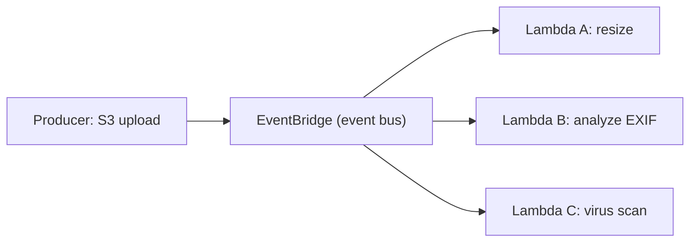

# 🎓 Event-driven & Triggers — HTTP, Queue, Storage, Stream, Schedule

> **Tác giả:** Mr.Rom\
> **Phiên bản:** v1.1.2\
> **Tạo lúc:** 24/05/2026\
> **Cập nhật:** 11/06/2026\
> **Level:** Basic\
> **Tags:** [MUST-KNOW]\
> **Yêu cầu trước:** [FaaS đào sâu — Cold start, isolate vs container, runtime & duration](01_function-as-a-service-deep.md)

> 🎯 *Serverless function chỉ giá trị khi có **trigger** gọi nó. Bài này gom hết các loại trigger phổ biến (HTTP, queue, storage, DB stream, schedule, webhook), hiểu **event source mapping** dưới capo, vì sao **idempotency** bắt buộc, và "exactly-once delivery" thực chất là gì (myth or fact?). Bạn cũng học DLQ — nơi message fail đi về.*

## 🎯 Sau bài này bạn sẽ

- [ ] Biết **6 nhóm trigger** chính: HTTP, queue/Pub-Sub, storage, DB stream, schedule, webhook
- [ ] Hiểu **event source mapping** — vendor poll event hộ function ra sao
- [ ] Phân biệt **push** trigger (sync, API Gateway) vs **pull/poll** trigger (SQS, Kinesis)
- [ ] Hiểu vì sao **idempotency** bắt buộc cho async trigger
- [ ] Hiểu "**exactly-once delivery**" là myth — chỉ có "at-least-once" + idempotency
- [ ] Cấu hình **DLQ** (Dead Letter Queue) cho message fail
- [ ] **Event filtering** ở vendor (Lambda, EventBridge) để giảm cost
- [ ] Đọc và parse được **event payload** từ S3 / SQS / API Gateway / EventBridge

---

## Tình huống — Acme Shop bị trùng order do retry

Tuần trước Acme Shop launch flash sale. Hôm sau khách báo:
> *"Tôi đặt 1 đơn ốp lưng. Tài khoản bị trừ tiền 3 lần. Đơn vẫn chỉ 1."*

Dev điều tra log:
- SQS queue có message `{order_id: 12345, amount: 200000}`.
- Lambda `charge_payment` được trigger.
- Lần 1: charge thành công, response timeout ở client (chậm network).
- SQS không nhận được ACK → re-deliver message.
- Lần 2: charge thành công lần nữa.
- Lần 3: charge thành công nữa nữa.
- Total: trừ 600.000 VND, đơn vẫn ghi 1.

Sếp: *"Khắc phục ngay + giải thích cho team vì sao SQS trùng message. Có 'exactly-once delivery' không? Phải làm thế nào?"*

Bài này giải đáp toàn bộ — bao gồm pattern idempotency + retry safety.

---

## Vậy event-driven thật sự là gì?

🪞 **Ẩn dụ**: *Event-driven serverless như **đội ngũ shipper Grab** — không ai ngồi sẵn đợi đơn. Khi có đơn (event) → Grab điều phối → 1 shipper (function) nhận đơn → giao xong báo về → đi nghỉ. Khác mô hình truyền thống "quán có nhân viên thường trực 24/7" (EC2/VM luôn chạy daemon).*

### Định nghĩa kỹ thuật

**Event-driven**: function/service chỉ chạy khi có **event** (sự kiện) đến từ event source. Function không tự poll/wait — vendor làm thay.

Mô hình ngược lại: **server polling**. Daemon trên EC2 chạy 24/7 hỏi `SELECT * FROM new_orders` mỗi giây. Tốn tiền + tốn CPU dù không có order.

### Event source mapping — bên dưới ngầm chạy gì?

```
┌─────────────────────────────────────────────────────────────┐
│  Event source (S3 bucket, SQS queue, DDB stream, ...)       │
└────────────────────────────────┬────────────────────────────┘
                                 │
                                 ▼
┌─────────────────────────────────────────────────────────────┐
│  Event source mapping (managed by AWS/GCP — invisible)      │
│  - Poll source on a schedule                                 │
│  - Batch events                                              │
│  - Filter events                                             │
│  - Invoke target Lambda/Function                             │
└────────────────────────────────┬────────────────────────────┘
                                 │
                                 ▼
┌─────────────────────────────────────────────────────────────┐
│  Function invocation (event payload)                        │
└─────────────────────────────────────────────────────────────┘
```

**2 mô hình invocation**:

| Loại | Hướng | Ví dụ trigger | Đặc điểm |
|---|---|---|---|
| **Push** (sync) | Caller → Lambda | API Gateway HTTP, ALB, SDK direct invoke | Caller chờ response |
| **Push** (async) | Caller → Lambda (queue) | S3, SNS, EventBridge | Caller không chờ, Lambda retry tự động |
| **Pull/Poll** | Lambda polls source | SQS, Kinesis, DDB Streams, MSK | Vendor poll hộ, function nhận batch |

→ **Hiểu loại invocation** = hiểu retry behavior + error handling.

Giờ đi qua từng nhóm trigger phổ biến.

---

## Nhóm 1 — HTTP trigger (API Gateway, Function URL)

Trigger phổ biến nhất: HTTP request từ user/browser/mobile app.

### AWS Lambda + API Gateway

```yaml
# SAM template
Resources:
  HelloFn:
    Type: AWS::Serverless::Function
    Properties:
      Runtime: python3.13
      Handler: app.lambda_handler
      Events:
        ApiEvent:
          Type: HttpApi
          Properties:
            Path: /hello/{name}
            Method: GET
```

**Event payload (đơn giản hoá)**:

```json
{
  "version": "2.0",
  "routeKey": "GET /hello/{name}",
  "rawPath": "/hello/alice",
  "pathParameters": {"name": "alice"},
  "queryStringParameters": {"lang": "vi"},
  "headers": {"user-agent": "curl/8.4", "content-type": "application/json"},
  "requestContext": {
    "http": {"method": "GET", "sourceIp": "1.2.3.4"},
    "requestId": "abc-123"
  },
  "body": null,
  "isBase64Encoded": false
}
```

**Handler**:

```python
def lambda_handler(event, context):
    name = event['pathParameters']['name']
    lang = (event.get('queryStringParameters') or {}).get('lang', 'en')
    
    msg = {'vi': f'Xin chào {name}', 'en': f'Hello {name}'}[lang]
    
    return {
        'statusCode': 200,
        'headers': {'Content-Type': 'application/json'},
        'body': json.dumps({'message': msg})
    }
```

### Lambda Function URL (no API Gateway)

```bash
aws lambda create-function-url-config \
  --function-name hello-fn \
  --auth-type NONE   # or AWS_IAM
```

→ Mỗi function có 1 URL `https://<id>.lambda-url.region.on.aws/`. Đơn giản nhưng thiếu features API Gateway (custom domain, JWT auth, rate limit).

### Cloud Functions / Cloud Run (HTTP native)

```python
# main.py
from flask import Flask, request, jsonify
app = Flask(__name__)

@app.route("/hello/<name>")
def hello(name):
    lang = request.args.get('lang', 'en')
    msg = {'vi': f'Xin chào {name}', 'en': f'Hello {name}'}[lang]
    return jsonify(message=msg)
```

Cloud Run nhận HTTP trực tiếp — không cần API Gateway riêng (mặc dù có nếu cần).

### Cloudflare Workers

```typescript
export default {
  async fetch(request: Request): Promise<Response> {
    const url = new URL(request.url);
    const name = url.pathname.split('/').pop();
    const lang = url.searchParams.get('lang') || 'en';
    const msg = lang === 'vi' ? `Xin chào ${name}` : `Hello ${name}`;
    return Response.json({ message: msg });
  }
};
```

→ Native HTTP Fetch API — không có wrapper event.

### Pattern thường gặp

- API REST đơn giản → API Gateway HTTP API + Lambda.
- App full-stack → Cloud Run / Fargate.
- Edge logic (geo routing, A/B test) → Cloudflare Workers.
- Webhook receiver → API Gateway + Lambda.

---

## Nhóm 2 — Queue / Pub-Sub trigger (SQS, Pub/Sub, EventBridge)

Async message processing.

### AWS SQS trigger

```yaml
ProcessOrderFn:
  Type: AWS::Serverless::Function
  Properties:
    Events:
      SQSEvent:
        Type: SQS
        Properties:
          Queue: !GetAtt OrderQueue.Arn
          BatchSize: 10
          MaximumBatchingWindowInSeconds: 5
```

**Event payload**:

```json
{
  "Records": [
    {
      "messageId": "abc-1",
      "body": "{\"order_id\": 12345, \"amount\": 200000}",
      "attributes": {
        "ApproximateReceiveCount": "1",
        "SentTimestamp": "1700000000000"
      },
      "messageAttributes": {},
      "eventSource": "aws:sqs",
      "eventSourceARN": "arn:aws:sqs:us-east-1:ACCOUNT:order-queue"
    }
  ]
}
```

**Handler — important: trả batch failures**:

```python
def lambda_handler(event, context):
    failed = []
    
    for record in event['Records']:
        try:
            order = json.loads(record['body'])
            process_order(order)
        except Exception as e:
            print(f"Error: {e}")
            failed.append({'itemIdentifier': record['messageId']})
    
    # Chỉ message fail bị retry, message thành công bị xoá khỏi queue
    return {'batchItemFailures': failed}
```

⚠️ **Quan trọng**: Nếu throw exception ở giữa batch → **toàn bộ batch bị retry**, kể cả message đã xử lý xong → trùng. Pattern `batchItemFailures` cho phép partial failure.

### AWS SNS trigger

```yaml
Events:
  SnsEvent:
    Type: SNS
    Properties:
      Topic: !Ref MyTopic
```

→ Fan-out pattern. 1 message → N Lambda subscribers song song.

### AWS EventBridge

EventBridge = event bus tổng, kết nối SaaS + AWS + custom event.

```yaml
Events:
  CronEvent:
    Type: Schedule
    Properties:
      Schedule: rate(5 minutes)
  
  S3UploadEvent:
    Type: EventBridgeRule
    Properties:
      Pattern:
        source: ["aws.s3"]
        detail-type: ["Object Created"]
        detail:
          bucket:
            name: ["my-uploads"]
```

### GCP Pub/Sub trigger

```yaml
# Cloud Functions Gen2
gcloud functions deploy process-order \
  --gen2 \
  --runtime python313 \
  --entry-point process_order \
  --trigger-topic order-events
```

```python
# main.py
from cloudevents.http import CloudEvent

def process_order(cloud_event: CloudEvent):
    import base64, json
    data = json.loads(base64.b64decode(cloud_event.data['message']['data']))
    process(data)
```

### Cloud Tasks (GCP)

Pull queue cho long-running tasks, retry mạnh:

```python
from google.cloud import tasks_v2
client = tasks_v2.CloudTasksClient()

task = {
    'http_request': {
        'http_method': 'POST',
        'url': 'https://my-cloud-run.run.app/process',
        'body': json.dumps(payload).encode()
    },
    'schedule_time': in_5_minutes
}
client.create_task(parent=queue_path, task=task)
```

---

## Nhóm 3 — Storage trigger (S3, GCS, Blob Storage)

Object upload/delete → function triggered.

### S3 → Lambda

```yaml
ResizeFn:
  Type: AWS::Serverless::Function
  Properties:
    Events:
      S3Upload:
        Type: S3
        Properties:
          Bucket: !Ref UploadsBucket
          Events: s3:ObjectCreated:*
          Filter:
            S3Key:
              Rules:
                - Name: prefix
                  Value: uploads/
                - Name: suffix
                  Value: .jpg
```

**Event payload**:

```json
{
  "Records": [
    {
      "eventSource": "aws:s3",
      "eventName": "ObjectCreated:Put",
      "s3": {
        "bucket": {"name": "my-uploads"},
        "object": {
          "key": "uploads/cat.jpg",
          "size": 245678,
          "eTag": "abc123"
        }
      }
    }
  ]
}
```

> ⚠️ **Gotcha**: Lambda S3 trigger có **at-least-once delivery** — 1 upload có thể trigger Lambda 2-3 lần. Function phải idempotent (vd: check thumbnail đã tồn tại trước khi tạo).

### S3 → SQS → Lambda (pattern tốt hơn)

```
S3 upload → S3 notification → SQS → Lambda (poll)
```

Vì sao tốt hơn:
- SQS có DLQ → message fail không mất.
- Backpressure: Lambda concurrency limit không gây mất event.
- Replay: re-poll queue khi cần.

### GCS → Cloud Functions

```bash
gcloud functions deploy resize \
  --gen2 \
  --runtime python313 \
  --entry-point resize_image \
  --trigger-event-filters="type=google.cloud.storage.object.v1.finalized" \
  --trigger-event-filters="bucket=my-uploads"
```

---

## Nhóm 4 — DB stream trigger (DynamoDB Streams, Firestore, Aurora)

Function chạy khi data thay đổi trong DB.

### DynamoDB Streams → Lambda

```yaml
Events:
  DDBEvent:
    Type: DynamoDB
    Properties:
      Stream: !GetAtt OrdersTable.StreamArn
      StartingPosition: LATEST
      BatchSize: 100
      FilterCriteria:
        Filters:
          - Pattern: '{"eventName": ["INSERT", "MODIFY"]}'
```

**Event payload**:

```json
{
  "Records": [
    {
      "eventName": "INSERT",
      "dynamodb": {
        "Keys": {"orderId": {"S": "12345"}},
        "NewImage": {
          "orderId": {"S": "12345"},
          "amount": {"N": "200000"},
          "status": {"S": "PAID"}
        },
        "SequenceNumber": "...",
        "StreamViewType": "NEW_AND_OLD_IMAGES"
      }
    }
  ]
}
```

**Use case**:
- Update search index (DDB → ElasticSearch).
- Send notification on status change.
- Replicate to data warehouse.

### Firestore trigger (GCP)

```bash
gcloud functions deploy on-order-create \
  --gen2 --runtime nodejs22 \
  --trigger-event-filters="type=google.cloud.firestore.document.v1.created" \
  --trigger-event-filters-path-pattern="document=orders/{orderId}"
```

---

## Nhóm 5 — Schedule trigger (cron)

Function chạy theo lịch — thay thế cron job trên EC2.

### EventBridge schedule

```yaml
DailyReportFn:
  Type: AWS::Serverless::Function
  Properties:
    Events:
      DailyReport:
        Type: Schedule
        Properties:
          Schedule: cron(0 7 * * ? *)   # 7 AM UTC daily
          Description: Daily sales report
```

**Cron syntax** (EventBridge):
- `rate(5 minutes)` / `rate(1 hour)` / `rate(7 days)`.
- `cron(0 12 * * ? *)` — 12:00 UTC daily.
- `cron(0 9 ? * MON *)` — 9 AM UTC every Monday.

### Cloud Scheduler (GCP)

```bash
gcloud scheduler jobs create http daily-report \
  --schedule="0 7 * * *" \
  --uri="https://daily-report.run.app/" \
  --http-method=POST \
  --time-zone="Asia/Ho_Chi_Minh"
```

### Pattern thường gặp

- Cleanup old files / DB rows.
- Daily/weekly report sinh ra.
- Sync external API → DB.
- Health check ping.

---

## Nhóm 6 — Webhook receiver

Function nhận HTTP từ external service (Stripe, GitHub, Slack, ...).

### Pattern chuẩn

```python
import hmac, hashlib, json

WEBHOOK_SECRET = os.environ['STRIPE_WEBHOOK_SECRET']

def lambda_handler(event, context):
    body = event['body']
    signature = event['headers'].get('stripe-signature', '')
    
    # 1. Verify signature
    if not verify_stripe_sig(body, signature, WEBHOOK_SECRET):
        return {'statusCode': 401, 'body': 'Invalid signature'}
    
    # 2. Parse event
    stripe_event = json.loads(body)
    event_type = stripe_event['type']
    event_id = stripe_event['id']
    
    # 3. Idempotency check
    if already_processed(event_id):
        return {'statusCode': 200, 'body': 'Already processed'}
    
    # 4. Handle
    if event_type == 'payment_intent.succeeded':
        handle_payment(stripe_event['data']['object'])
    
    # 5. Mark processed
    mark_processed(event_id)
    
    return {'statusCode': 200}

def verify_stripe_sig(body, sig_header, secret):
    # Stripe-style HMAC-SHA256 verify
    ...
```

→ Pattern này áp dụng cho mọi webhook: verify sig → parse → idempotency check → handle → mark.

---

## "Exactly-once delivery" là myth

Đây là kiến thức **rất quan trọng** mọi dev serverless phải biết.

### Sự thật về delivery semantics

| Mode | Ý nghĩa | Có thật không? |
|---|---|---|
| **At-most-once** | Mỗi event xử lý 0 hoặc 1 lần | Có (fire-and-forget, mất event OK) |
| **At-least-once** | Mỗi event xử lý 1 hoặc nhiều lần | Có (default mọi queue) |
| **Exactly-once** | Mỗi event xử lý đúng 1 lần | **Trong distributed system: gần như không thể** ở tầng infrastructure |

### Vì sao exactly-once khó?

```
1. Producer publish message
2. Broker (SQS/Kafka) lưu message
3. Consumer (Lambda) đọc message
4. Consumer process message
5. Consumer ACK broker → broker xoá
```

**Vấn đề**: bất kỳ bước nào fail giữa 4 và 5:
- Consumer process xong nhưng network rớt → broker không nhận ACK → re-deliver → trùng.
- Consumer process xong, ACK xong, nhưng nhớ trong middle: do crash → re-deliver → trùng.

→ Không có cách nào để **infrastructure** đảm bảo exactly-once tuyệt đối.

### Một số vendor quảng cáo "exactly-once" — thực ra là gì?

- **AWS SQS FIFO + Lambda**: "exactly-once processing" **trong window 5 phút** với MessageDeduplicationId. Sau 5p có thể bị retry → trùng.
- **Kafka exactly-once semantics (EOS)**: chỉ work trong cùng cluster Kafka, không cover side-effects ra ngoài (DB, HTTP).
- **GCP Pub/Sub exactly-once delivery**: cũng có giới hạn time window + cần ACK đúng cách.

→ "Exactly-once" là **lý tưởng**. Reality: **at-least-once + idempotency = exactly-once effective**.

### Pattern Idempotency — bắt buộc

Idempotency = "chạy nhiều lần cho cùng input cho cùng kết quả, không side-effect trùng".

#### Cách 1: Dedup key in DB

```python
def lambda_handler(event, context):
    for record in event['Records']:
        body = json.loads(record['body'])
        idempotency_key = body['idempotency_key']  # client-provided UUID
        
        # Atomic: insert if not exists
        try:
            ddb.put_item(
                TableName='processed_events',
                Item={'key': {'S': idempotency_key}},
                ConditionExpression='attribute_not_exists(#k)',
                ExpressionAttributeNames={'#k': 'key'}
            )
        except ConditionalCheckFailedException:
            # Already processed
            continue
        
        # Process
        charge_payment(body)
```

#### Cách 2: Stateful natural key

```python
# Update by primary key — duplicate calls overwrite, không tạo row mới
# 'status' là reserved word của DynamoDB → phải alias qua ExpressionAttributeNames
ddb.update_item(
    TableName='orders',
    Key={'order_id': order_id},
    UpdateExpression='SET #st = :paid',
    ConditionExpression='#st <> :paid',  # only if not already PAID
    ExpressionAttributeNames={'#st': 'status'},
    ExpressionAttributeValues={':paid': 'PAID'}
)
```

→ Charge lần 2 với cùng order_id → status đã PAID → condition fail → no-op.

#### Cách 3: AWS Powertools `idempotent` decorator (Python)

```python
from aws_lambda_powertools.utilities.idempotency import idempotent, DynamoDBPersistenceLayer

persistence = DynamoDBPersistenceLayer(table_name="idempotency-store")

@idempotent(persistence_store=persistence)
def lambda_handler(event, context):
    # Function only runs once per event payload hash
    charge_payment(event)
```

Decorator tự lưu hash của event vào DDB, retry skip.

### Áp dụng vào tình huống Acme Shop

```python
@idempotent(persistence_store=ddb_persistence, config=IdempotencyConfig(
    event_key_jmespath="Records[0].body"   # dedupe theo body message
))
def lambda_handler(event, context):
    for record in event['Records']:
        body = json.loads(record['body'])
        charge_payment(body['order_id'], body['amount'])
    return {'status': 'ok'}
```

→ Cùng order_id → chỉ charge 1 lần dù SQS deliver 3 lần.

Hoặc cách thủ công với DDB conditional:

```python
def charge_payment(order_id, amount):
    try:
        ddb.update_item(
            TableName='orders',
            Key={'order_id': {'S': order_id}},
            UpdateExpression='SET payment_status = :paid, paid_at = :now',
            ConditionExpression='attribute_not_exists(payment_status) OR payment_status = :pending',
            ExpressionAttributeValues={
                ':paid': {'S': 'PAID'},
                ':pending': {'S': 'PENDING'},
                ':now': {'S': now()}
            }
        )
        # Chỉ gọi Stripe nếu update DDB thành công
        stripe.charge(order_id, amount)
    except ConditionalCheckFailedException:
        # Already paid
        print(f"Order {order_id} already paid, skip")
```

---

## DLQ — Dead Letter Queue

Khi message fail mãi (vd lỗi format không sửa được, bug code), không lý do gì retry mãi → đẩy vào DLQ để debug + reprocess thủ công.

### Cấu hình DLQ cho SQS + Lambda

```yaml
MainQueue:
  Type: AWS::SQS::Queue
  Properties:
    QueueName: orders
    VisibilityTimeout: 120
    RedrivePolicy:
      deadLetterTargetArn: !GetAtt DLQ.Arn
      maxReceiveCount: 3   # 3 lần fail → đẩy vào DLQ

DLQ:
  Type: AWS::SQS::Queue
  Properties:
    QueueName: orders-dlq
    MessageRetentionPeriod: 1209600   # 14 ngày
```

### Cấu hình DLQ cho async invocation Lambda

```yaml
ProcessFn:
  Type: AWS::Serverless::Function
  Properties:
    DeadLetterQueue:
      Type: SQS
      TargetArn: !GetAtt DLQ.Arn
```

→ Lambda async (SNS/S3/EventBridge) fail 2 lần → message đẩy vào DLQ.

### Luồng xử lý DLQ

```
1. Alarm: CloudWatch alarm khi DLQ có message
2. Inspect: đọc message + error context
3. Fix code → deploy
4. Replay: dùng SQS redrive policy hoặc Lambda script để re-publish message từ DLQ về main queue
```

```bash
# AWS CLI replay DLQ về main queue
aws sqs start-message-move-task \
  --source-arn arn:aws:sqs:...:orders-dlq \
  --destination-arn arn:aws:sqs:...:orders \
  --max-number-of-messages-per-second 10
```

---

## Event filtering — giảm cost

Mặc định Lambda invoke mọi event từ source. Nhiều case bạn chỉ care 5% event.

### Filter ở event source mapping (Lambda)

```yaml
Events:
  DDBEvent:
    Type: DynamoDB
    Properties:
      Stream: !GetAtt OrdersTable.StreamArn
      FilterCriteria:
        Filters:
          - Pattern: '{"eventName": ["INSERT"], "dynamodb": {"NewImage": {"status": {"S": ["PAID"]}}}}'
```

→ Lambda chỉ invoke khi event = INSERT + status = PAID. Event khác bị skip → không trả tiền.

### EventBridge pattern

```json
{
  "source": ["myapp.orders"],
  "detail-type": ["OrderCreated"],
  "detail": {
    "amount": [{"numeric": [">=", 10000000]}]
  }
}
```

→ Chỉ event order >= 10 triệu mới invoke Lambda VIP-handler.

### Lợi ích

- Giảm invocation count → giảm cost.
- Function logic đơn giản hơn (không cần if-skip).

---

## 💡 Cạm bẫy thường gặp & Best practice

### ❌ Cạm bẫy: Không idempotent → trùng side-effect

- **Triệu chứng**: Charge user 3 lần, gửi email 5 lần.
- **Nguyên nhân**: Async trigger (SQS, S3, SNS) là **at-least-once**, retry tự động.
- **Cách tránh**: Idempotency key + dedup table, hoặc DDB conditional update, hoặc Powertools decorator.

### ❌ Cạm bẫy: Throw exception giữa batch SQS → retry toàn bộ batch

- **Triệu chứng**: 1 message fail → 9 message khác bị retry → trùng xử lý.
- **Nguyên nhân**: SQS xem cả batch là fail nếu Lambda exception.
- **Cách tránh**: Return `{batchItemFailures: [...]}` với chỉ message fail. Yêu cầu `ReportBatchItemFailures` enabled.

### ❌ Cạm bẫy: Visibility timeout < Lambda timeout

- **Triệu chứng**: SQS message re-deliver khi Lambda vẫn đang xử lý → trùng.
- **Nguyên nhân**: VisibilityTimeout SQS phải >= Lambda timeout × 6 (rule of thumb).
- **Cách tránh**: VisibilityTimeout = 6 × Lambda timeout (theo AWS doc).

### ❌ Cạm bẫy: Không có DLQ → fail message biến mất

- **Triệu chứng**: Message fail xử lý sau N retry → SQS xoá → mất data.
- **Nguyên nhân**: Không cấu hình DLQ.
- **Cách tránh**: Mọi async Lambda + queue trigger phải có DLQ. CloudWatch alarm DLQ depth > 0.

### ❌ Cạm bẫy: Webhook không verify signature

- **Triệu chứng**: Attacker giả lập Stripe webhook → trigger refund $1M.
- **Nguyên nhân**: Endpoint public không check HMAC.
- **Cách tránh**: Luôn verify webhook signature trước khi xử lý. Stripe, GitHub, Slack đều cung cấp.

### ❌ Cạm bẫy: S3 trigger filter conflict

- **Triệu chứng**: 2 Lambda đăng ký cùng prefix `uploads/` → 1 bị reject.
- **Nguyên nhân**: S3 chỉ cho phép **1 destination per prefix overlap**.
- **Cách tránh**: Dùng EventBridge thay S3 notification, hoặc tách prefix.

### ✅ Best practice: Pattern S3 → EventBridge → multiple Lambda

Mô hình fan-out: 1 event đi qua event bus rồi kích hoạt nhiều consumer chạy song song, mỗi consumer làm 1 việc độc lập.



→ EventBridge cho phép multiple targets từ 1 event nên 3 function chạy đồng thời, độc lập; S3 notification thuần không làm được fan-out này.

### ✅ Best practice: Powertools / Middy / Serverless plugins

- **AWS Lambda Powertools** (Python/Node/Java/.NET): logger, tracer, idempotency, validation, batch processing.
- **Middy** (Node): middleware framework cho Lambda.
- **Serverless Framework plugins**: nhiều plugin chuẩn (offline, prune, ...).

→ Đừng tự viết lại — dùng tool battle-tested.

---

## 🧠 Tự kiểm tra (Self-check)

**Q1.** Push trigger vs Pull/poll trigger khác nhau ở đâu? Cho 2 ví dụ mỗi loại.

<details>
<summary>💡 Đáp án</summary>

**Push trigger** (event service đẩy tới Lambda):
- API Gateway HTTP → Lambda (sync, caller chờ).
- S3 object created → Lambda (async, caller không chờ).
- SNS message → Lambda (fan-out).
- EventBridge rule match → Lambda.

Đặc điểm: Lambda được vendor "gọi" → invoke ngay khi event đến. Retry tự động cho async (2-3 lần).

**Pull/Poll trigger** (event source mapping poll dùm):
- SQS queue → vendor poll batch → invoke Lambda.
- Kinesis stream → vendor poll shard → invoke Lambda.
- DynamoDB Streams → vendor poll → invoke Lambda.
- MSK / Kafka → vendor poll → invoke Lambda.

Đặc điểm: vendor có quản lý event source mapping (ESM), poll source, batch event, invoke Lambda. Retry behavior do source quản (vd SQS visibility timeout, Kinesis checkpoint).

**Tại sao quan trọng?**:
- **Error handling khác nhau**: push async retry tự động (2 lần default), pull retry theo visibility timeout (SQS) hoặc shard iterator (Kinesis).
- **DLQ position khác**: push async dùng Lambda DLQ. Pull dùng source DLQ (SQS DLQ).
- **Throughput control khác**: push không giới hạn theo source. Pull có maxBatchSize / batchWindow.
</details>

**Q2.** Vì sao "exactly-once delivery" gần như không thể đạt được ở infrastructure?

<details>
<summary>💡 Đáp án</summary>

Trong distributed system, exactly-once tuyệt đối là không thể vì:

1. **Acknowledgment có thể mất**: consumer process xong → gửi ACK → ACK rớt giữa đường → broker không nhận → re-deliver → trùng.

2. **Crash giữa process + ACK**: consumer process xong nhưng chưa kịp ACK thì crash → broker re-deliver → trùng.

3. **Side effect không reversible**: ngay cả khi infra báo "delivered exactly once", side effect (HTTP call ra ngoài, DB write) có thể chạy 2 lần vì retry tầng app.

4. **Network partition**: producer publish, broker nhận, network rớt → producer retry publish → duplicate trong broker.

**Kết luận**: Reality = "at-least-once delivery" + idempotent processing = "exactly-once effectively".

**Cách đảm bảo "exactly-once effective"**:

1. **Idempotency key** (UUID per logical operation, dedup trong DB).
2. **Conditional writes** (DDB ConditionExpression, RDB unique constraints).
3. **Stateful natural key** (vd order_id update thay vì append).
4. **Hash event payload** rồi dedup (AWS Powertools idempotent).

**Một số vendor quảng cáo "exactly-once"**:
- SQS FIFO + Lambda: deduplication trong 5 phút window — sau đó có thể trùng.
- Kafka EOS: chỉ trong cùng Kafka cluster, không cover side effect ngoài.
- GCP Pub/Sub exactly-once: cũng có giới hạn time window.

→ Luôn thiết kế app **idempotent** dù vendor quảng cáo gì. An toàn nhất.
</details>

**Q3.** Cấu hình DLQ cho Lambda + SQS thế nào? Maxreceivecount nên đặt bao nhiêu?

<details>
<summary>💡 Đáp án</summary>

**Cấu hình DLQ ở SQS level** (recommend cho SQS trigger):

```yaml
MainQueue:
  Type: AWS::SQS::Queue
  Properties:
    QueueName: orders
    VisibilityTimeout: 120   # Lambda timeout × 6
    RedrivePolicy:
      deadLetterTargetArn: !GetAtt DLQ.Arn
      maxReceiveCount: 3

DLQ:
  Type: AWS::SQS::Queue
  Properties:
    QueueName: orders-dlq
    MessageRetentionPeriod: 1209600   # 14 ngày, max của SQS
```

**maxReceiveCount = 3** thường:
- Lần 1: fail tạm (transient error: DB busy, network) → retry.
- Lần 2: fail tiếp → retry.
- Lần 3: fail → đẩy DLQ → alert human.

**Khi nào nên cao hơn (5-10)**:
- External API có rate limit khắt khe, backoff cần nhiều lần.
- Workload tolerance retry cao.

**Khi nào nên thấp hơn (1-2)**:
- Fail hầu như là bug code → retry vô ích, đẩy DLQ sớm tốt hơn.
- Time-sensitive (fail nhanh + alert nhanh).

**Bổ sung**:

1. **VisibilityTimeout = 6 × Lambda timeout** (AWS best practice).
   - Lambda timeout 30s → VisibilityTimeout 180s.
   - Vì sao: cho Lambda thời gian retry trong cùng visibility window.

2. **CloudWatch alarm**:
   ```yaml
   DLQAlarm:
     Type: AWS::CloudWatch::Alarm
     Properties:
       MetricName: ApproximateNumberOfMessagesVisible
       Namespace: AWS/SQS
       Threshold: 1
       ComparisonOperator: GreaterThanThreshold
       Dimensions:
         - Name: QueueName
           Value: !GetAtt DLQ.QueueName
       AlarmActions: [!Ref OnCallTopic]
   ```

3. **Workflow replay**:
   ```bash
   aws sqs start-message-move-task \
     --source-arn $DLQ_ARN \
     --destination-arn $MAIN_QUEUE_ARN
   ```

4. **Async invocation Lambda DLQ** (không phải SQS trigger):
   ```yaml
   DeadLetterQueue:
     Type: SQS
     TargetArn: !GetAtt LambdaDLQ.Arn
   ```
   → Dùng cho S3, SNS, EventBridge trigger.

**Anti-pattern**:
- Không có DLQ → message fail vĩnh viễn → data loss.
- maxReceiveCount = 100 → loop fail tốn cost.
- Không monitor DLQ → message kẹt vô thời hạn.
</details>

**Q4.** Webhook security — checklist trước khi process event?

<details>
<summary>💡 Đáp án</summary>

Webhook public endpoint nhận event từ external service. Attacker có thể giả lập → cần verify:

**Checklist**:

1. **Verify HMAC signature** (bắt buộc):
   ```python
   def verify_stripe_sig(payload, sig_header, secret):
       # Stripe-Signature: t=1234567890,v1=abc123...
       parts = dict(p.split('=', 1) for p in sig_header.split(','))
       timestamp = parts['t']
       sig = parts['v1']
       
       signed_payload = f"{timestamp}.{payload}"
       expected = hmac.new(secret.encode(), signed_payload.encode(), hashlib.sha256).hexdigest()
       
       return hmac.compare_digest(expected, sig)
   ```

2. **Check timestamp freshness** (chống replay attack):
   ```python
   if int(timestamp) < time.time() - 300:   # > 5 phút cũ
       return reject('Replay attack')
   ```

3. **Idempotency check** (event delivery có thể trùng):
   ```python
   event_id = body['id']
   if already_processed(event_id):
       return ok('Already processed')
   ```

4. **Validate JSON schema**:
   ```python
   from jsonschema import validate
   validate(body, expected_schema)
   ```

5. **IP allowlist** (option):
   - Một số provider (GitHub, Stripe) public IP range.
   - Validate request.source_ip ∈ allowed_ranges.

6. **Rate limit** (defense in depth):
   - API Gateway throttle per source IP.
   - Lambda reserved concurrency cap.

7. **HTTPS only**:
   - API Gateway mặc định.
   - Reject HTTP redirect.

8. **Logging**:
   - Log mọi webhook (request_id, event_id, timestamp).
   - Mask sensitive (card number, password).

9. **Quick ACK + async process**:
   ```python
   def lambda_handler(event, context):
       # 1. Verify quick
       if not verify(event['body'], event['headers']):
           return {'statusCode': 401}
       
       # 2. Push to SQS for async processing
       sqs.send_message(QueueUrl=..., MessageBody=event['body'])
       
       # 3. Return 200 immediately (provider expects < 5s)
       return {'statusCode': 200, 'body': 'ok'}
   ```
   → Provider không lo timeout, retry. Logic phức tạp ở SQS consumer.

**Tools**:
- AWS WAF cho rate limit + IP block.
- AWS Secrets Manager cho webhook secret.
- AWS Lambda Powertools `validator` decorator.

**Real attack vectors**:
- Replay old signed event → check timestamp.
- Forge signature → HMAC compare_digest (timing-safe).
- DDoS endpoint → rate limit + WAF.
- Inject malicious payload trong body field → validate schema.
</details>

**Q5.** Acme Shop scenario đầu bài — fix thế nào để không trùng order?

<details>
<summary>💡 Đáp án</summary>

**Vấn đề**: SQS deliver message 3 lần (at-least-once + retry), Lambda charge 3 lần.

**Fix step-by-step**:

1. **Idempotent payment function** (quan trọng nhất):

   ```python
   from aws_lambda_powertools.utilities.idempotency import idempotent, DynamoDBPersistenceLayer
   
   persistence = DynamoDBPersistenceLayer(table_name='payment-idempotency')
   
   def lambda_handler(event, context):
       for record in event['Records']:
           body = json.loads(record['body'])
           process_payment_idempotent(body['order_id'], body['amount'])
       return {'batchItemFailures': []}
   
   @idempotent(persistence_store=persistence)
   def process_payment_idempotent(order_id, amount):
       # Function này chỉ chạy 1 lần per order_id
       stripe.charge(order_id, amount)
       update_order_status(order_id, 'PAID')
   ```

2. **Hoặc conditional update DB**:

   ```python
   def process_payment(order_id, amount):
       try:
           ddb.update_item(
               TableName='orders',
               Key={'order_id': {'S': order_id}},
               UpdateExpression='SET payment_status = :paid, paid_at = :now',
               ConditionExpression='payment_status = :pending',
               ExpressionAttributeValues={
                   ':paid': {'S': 'PAID'},
                   ':pending': {'S': 'PENDING'},
                   ':now': {'S': now()}
               }
           )
           # Chỉ charge nếu update DDB thành công
           stripe.charge(order_id, amount)
       except ConditionalCheckFailedException:
           print(f"Order {order_id} already paid, skip")
   ```

3. **Visibility timeout đủ lớn**:

   ```yaml
   PaymentQueue:
     Properties:
       VisibilityTimeout: 180   # Lambda timeout 30s × 6
   ```

4. **DLQ cho message fail**:

   ```yaml
   PaymentQueue:
     Properties:
       RedrivePolicy:
         deadLetterTargetArn: !GetAtt PaymentDLQ.Arn
         maxReceiveCount: 3
   ```

5. **Return batchItemFailures** (partial failure trong batch):

   ```python
   def lambda_handler(event, context):
       failed = []
       for record in event['Records']:
           try:
               process_payment(...)
           except Exception as e:
               failed.append({'itemIdentifier': record['messageId']})
       return {'batchItemFailures': failed}
   ```

6. **Stripe idempotency key** (tầng external):

   ```python
   stripe.Charge.create(
       amount=amount,
       currency='vnd',
       idempotency_key=f"order_{order_id}"   # Stripe dedup
   )
   ```

   → Stripe API tự dedup nếu cùng idempotency key.

7. **Audit log + alerting**:

   ```python
   logger.info({
       'event': 'payment_attempt',
       'order_id': order_id,
       'amount': amount,
       'idempotency_key': key
   })
   ```

   → Detect bất thường (cùng order_id charge nhiều lần) nhanh.

**Recovery cho 3 user đã bị trùng**:

```sql
-- Tìm order bị trùng
SELECT order_id, COUNT(*) as charges
FROM payment_log
GROUP BY order_id
HAVING COUNT(*) > 1;

-- Refund duplicates
```

```python
for order in duplicates:
    stripe.Refund.create(
        charge=order['charge_id_extra'],
        reason='duplicate'
    )
```

**Communication**:
- Email apology + auto refund cho 3 customer.
- Postmortem internal — fix dụ kiến + monitor cao hơn.

→ Lesson: **mọi async serverless trigger phải idempotent**. Không có ngoại lệ.
</details>

---

## ⚡ Tra cứu nhanh (Cheatsheet)

### 6 nhóm trigger

| Nhóm | AWS | GCP | Cloudflare |
|---|---|---|---|
| HTTP | API Gateway, Function URL, ALB | Cloud Run native, Cloud Functions HTTP | Workers native fetch |
| Queue / Pub-Sub | SQS, SNS, EventBridge | Pub/Sub, Cloud Tasks | Queues |
| Storage | S3 events | GCS finalized | R2 events (beta) |
| DB stream | DynamoDB Streams, Aurora | Firestore, Spanner CDC | Durable Objects |
| Schedule | EventBridge cron | Cloud Scheduler | Cron Triggers |
| Webhook | API Gateway + Lambda | Cloud Run public | Workers public |

### Push vs Pull

```
Push sync:   API GW → Lambda (caller waits)
Push async:  S3/SNS → Lambda (queue + retry 2x)
Pull/Poll:   SQS/Kinesis/DDB → ESM polls → batch invoke Lambda
```

### Delivery semantics

```
Theoretical: At-most-once / At-least-once / Exactly-once
Reality:     Exactly-once không tồn tại ở infra
Practice:    At-least-once + idempotency = Exactly-once effective
```

### Các pattern Idempotency

```python
# Pattern 1: DDB dedup
ddb.put_item(Item={'key': uuid}, ConditionExpression='attribute_not_exists(key)')

# Pattern 2: Powertools decorator
@idempotent(persistence_store=ddb_persistence)
def handler(event, context): ...

# Pattern 3: External API idempotency key
stripe.Charge.create(..., idempotency_key=f"order_{id}")

# Pattern 4: Conditional update
ddb.update_item(..., ConditionExpression='status = :pending')
```

### DLQ checklist

- [ ] SQS RedrivePolicy với maxReceiveCount 3
- [ ] DLQ MessageRetentionPeriod 14 ngày
- [ ] CloudWatch alarm DLQ depth > 0
- [ ] Lambda async DLQ (cho S3/SNS/EventBridge trigger)
- [ ] Workflow replay (start-message-move-task)

### Event filtering

```json
// Lambda SQS/DDB filter
{"eventName": ["INSERT"], "dynamodb": {"NewImage": {"status": {"S": ["PAID"]}}}}

// EventBridge pattern
{"source": ["myapp"], "detail": {"amount": [{"numeric": [">=", 10000000]}]}}
```

---

## 📚 Từ Điển Thuật Ngữ (Glossary)

| Thuật ngữ | Tiếng Việt | Giải thích |
|---|---|---|
| Event source | Nguồn sự kiện | Thứ phát event (S3, queue, DB, ...) |
| Event source mapping (ESM) | — | AWS managed poller giữa source và Lambda |
| Push invocation | Đẩy | Caller gọi Lambda trực tiếp (sync hoặc async) |
| Pull/Poll invocation | Kéo | Vendor poll source, batch event, invoke Lambda |
| Idempotency | Bất biến | Chạy nhiều lần cho cùng input → cùng kết quả |
| Idempotency key | Khoá bất biến | UUID per logical operation để dedup |
| Dedup table | Bảng dedup | DB lưu key đã xử lý |
| At-least-once | Ít nhất 1 lần | Event được giao 1+ lần (có thể trùng) |
| At-most-once | Nhiều nhất 1 lần | Event giao 0 hoặc 1 lần (có thể mất) |
| Exactly-once | Đúng 1 lần | Lý tưởng nhưng infrastructure không đạt được |
| DLQ | Dead Letter Queue | Queue chứa message fail mãi |
| Visibility timeout | Thời gian ẩn | SQS hide message khi consumer đang xử lý |
| MaxReceiveCount | Số lần nhận tối đa | SQS đẩy DLQ sau N lần fail |
| BatchItemFailures | — | Partial fail report cho batch SQS |
| Cron expression | — | Cú pháp lịch (`0 7 * * *`) |
| Webhook | — | HTTP callback từ external service |
| HMAC signature | Chữ ký HMAC | Hash + secret để verify message integrity |
| Replay attack | Tấn công phát lại | Attacker gửi lại event cũ đã ký |
| Fanout | Phân tán | 1 event → N consumer song song |
| Event filtering | Lọc sự kiện | Vendor skip event không match pattern → tiết kiệm cost |
| Powertools | — | AWS open source library middleware Lambda |

---

## 🔗 Liên kết & Tài nguyên

### 🧭 Định hướng lộ trình học

- ⬅️ **Bài trước:** [FaaS đào sâu — Cold start, isolate vs container, runtime & duration](01_function-as-a-service-deep.md)
- ➡️ **Bài tiếp theo:** [Serverless Patterns & Anti-patterns — Khi nào dùng, khi nào tránh](03_serverless-patterns-and-anti-patterns.md)
- ↑ **Về cụm:** [Serverless là gì — Bức tranh tổng thể & 4 nhà cung cấp lớn](00_what-is-serverless-overview.md)

### 🧩 Các chủ đề có thể bạn quan tâm

- 🟧 [Lambda + API Gateway — Nhập môn Serverless](../../../aws/lessons/01_basic/04_lambda-and-api-gateway.md) — SAM template chi tiết
- 🟦 [GCP Cloud Functions + Cloud Run + API Gateway](../../../gcp/lessons/01_basic/04_cloud-functions-cloud-run-and-api-gateway.md) — Pub/Sub trigger + Cloud Run
- 🟧 [RDS + DynamoDB — Managed databases](../../../aws/lessons/01_basic/03_rds-and-dynamodb.md) — DynamoDB Streams trigger

### 🌐 Tài nguyên tham khảo khác

- 📖 [AWS Lambda Event Source Mappings](https://docs.aws.amazon.com/lambda/latest/dg/invocation-eventsourcemapping.html)
- 📖 [AWS Lambda Powertools (Python)](https://docs.powertools.aws.dev/lambda/python/)
- 📖 [AWS EventBridge Pattern Matching](https://docs.aws.amazon.com/eventbridge/latest/userguide/eb-event-patterns.html)
- 📖 [SQS FIFO + Lambda exactly-once myth](https://aws.amazon.com/blogs/compute/new-for-aws-lambda-sqs-fifo-as-an-event-source/)
- 📖 [Stripe Webhook Signature Verification](https://stripe.com/docs/webhooks/signatures)
- 📖 [GCP Pub/Sub Exactly-once Delivery](https://cloud.google.com/pubsub/docs/exactly-once-delivery)

---

## 📌 Nhật ký thay đổi (Changelog)

- **v1.0.0 (24/05/2026)** — Event-driven & triggers cho Basic cluster. 6 nhóm trigger (HTTP/Queue/Storage/DB stream/Schedule/Webhook) + push vs pull invocation + exactly-once myth + idempotency patterns + DLQ + event filtering. Acme Shop scenario charge trùng + fix step-by-step. 6 pitfall + 2 best practice + 5 self-check.
- **v1.1.0 (01/06/2026)** — Sửa QA: vá lỗi code Cách 2 (ddb.update_item truyền ExpressionAttributeValues hai lần → mất ':s', và 'status' là reserved word) bằng cách gộp dict + alias #st qua ExpressionAttributeNames; đổi field "Prerequisites" → "Yêu cầu trước"; chuẩn hoá header Glossary sang "Thuật ngữ | Tiếng Việt | Giải thích"; chuẩn hoá nav (marker ⬅️/➡️/↑, link-text = tiêu đề H1 thực, 3 sub Định hướng/Chủ đề liên quan/Tài nguyên).
- **v1.1.1 (11/06/2026)** — Việt hoá heading nội dung mô tả sang tiếng Việt (giữ thuật ngữ/brand/param) theo Vietnamese-first.
- **v1.1.2 (11/06/2026)** — Bổ sung sơ đồ fan-out event (1 event → event bus → nhiều consumer song song) cho trực quan.
