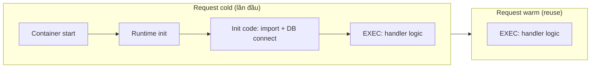

# 💰 Serverless — Cost, Cold Start, Observability

> **Tác giả:** Mr.Rom\
> **Phiên bản:** v1.1.1\
> **Tạo lúc:** 24/05/2026\
> **Cập nhật:** 11/06/2026\
> **Level:** Basic\
> **Tags:** [MUST-KNOW]\
> **Yêu cầu trước:** Bài [Serverless patterns & anti-patterns](03_serverless-patterns-and-anti-patterns.md) ✅

> 🎯 *Bài 04 (cuối basic). Hai chủ đề kết thúc serverless basic: **cost** (pricing 4 vendor, hidden cost, optimization) + **cold start** (mechanics, mitigation, trade-off) + **observability** (3 pillars trong serverless context). Hands-on so sánh cost Lambda vs Cloud Run cho 1 workload thật + setup OTel cho function.*

## 🎯 Sau bài này bạn sẽ

- [ ] Hiểu **cost model** của 4 vendor: AWS Lambda, GCP Cloud Functions/Run, Azure Functions, Cloudflare Workers
- [ ] Tính **break-even** giữa serverless và "container always-on" (EC2/Cloud Run min-instances)
- [ ] Mitigate **cold start** với 4 chiến lược: provisioned concurrency, min instances, smaller bundle, language choice
- [ ] Hiểu **hidden cost**: data egress, NAT Gateway, secrets retrieval, log ingestion, cold start "wasted time"
- [ ] Setup **observability**: structured log, distributed trace (OTel), custom metric, X-Ray/Cloud Trace integration
- [ ] **Debug** serverless: local emulator, log correlation, sampling, replay

---

## Tình huống — Acme Shop bill Lambda đột biến

Sếp đẩy email Cost Explorer:

> *"Tháng vừa rồi Lambda + API Gateway $3,200, tăng 4x so tháng trước. CFO hỏi. Bạn audit + đề xuất optimization tuần tới. Cố giảm 50%."*

Bạn cần phân tích:
- **Cost breakdown**: invocation count × duration × memory + data transfer.
- **Cold start ratio**: bao nhiêu % invocation cold start (thêm 100-500ms = thêm cost).
- **Hidden cost**: NAT Gateway (VPC Lambda), CloudWatch Logs ingestion, X-Ray.
- **Optimization**: provisioned concurrency cho hot path? Migrate sang Cloud Run? Container reuse?

Bài này dạy decision framework + tooling.

---

## 1️⃣ Mô hình giá 4 vendor

🪞 **Ẩn dụ**: *Pricing serverless như **đi taxi tính tiền**: 4 hãng có cách tính khác nhau — Lambda tính theo "thời gian × hộc đèn taxi" (memory size), Cloud Functions tương tự, Cloud Run linh hoạt hơn (chỉ tính khi xe có khách = concurrent request), Cloudflare Workers tính theo "số chuyến" (request count) — chuyến rất rẻ, mỗi request được tới 30s CPU trên gói Standard.*

### Bảng so sánh 2026

| Vendor | Pricing dimensions | Free tier/tháng | Price per 1M req | Notes |
|---|---|---|---|---|
| **AWS Lambda** | Invocation + GB-second + data egress | 1M req + 400k GB-s | $0.20/M req + $0.0000166667/GB-s | Arm (Graviton) rẻ 20% |
| **GCP Cloud Functions Gen2** | Invocation + vCPU-s + GiB-s + egress | 2M req | $0.40/M req + $0.000024/vCPU-s | Gen2 tính như Cloud Run |
| **GCP Cloud Run** | Request + vCPU-s + GiB-s | 2M req + 360k GB-s | $0.40/M req + $0.000024/vCPU-s (request-based) | Idle CPU không tính nếu min=0 |
| **Azure Functions Consumption** | Execution + GB-s + egress | 1M execution + 400k GB-s | $0.20/M + $0.000016/GB-s | Premium plan flat |
| **Cloudflare Workers** | Request only | 100k req/ngày (free) | $0.30/M req (Paid plan, 10M included $5) | 30s CPU/request (Standard); free ~10ms |
| **Cloudflare Workers Unbound** | Request + CPU duration | — | $0.30/M req + $12.50/M GB-s | Long-running compute |

### Tính ví dụ — API 10M req/tháng, avg 200ms, 512 MB

**Lambda**:
- Request cost: 10M × $0.20/M = **$2.00**
- Compute: 10M × 0.2s × 0.5 GB = 1,000,000 GB-s
  - Free 400k → tính 600k GB-s × $0.0000166 = **$10.00**
- **Total: ~$12/tháng** (chưa kể egress)

**Cloud Run** (min=0):
- Request: 10M × $0.40/M = **$4.00**
- vCPU: 10M × 0.2s × 1 vCPU = 2M vCPU-s × $0.000024 = **$48**
  - (Cloud Run tính cao hơn vì allocate full vCPU per request)
- Memory: 10M × 0.2s × 0.5 GiB = 1M GiB-s × $0.0000025 = **$2.50**
- **Total: ~$54/tháng**

**Cloudflare Workers**:
- Request: 10M × $0.30/M = **$3.00** (gói Standard tính theo request, CPU thực tế thấp)
- **Total: ~$3/tháng** + bundled plan $5 = **$5/tháng**

→ **Lambda thường rẻ nhất** cho event-driven workload < 1s. **Workers rẻ nhất** cho lightweight (CPU/request thấp, logic ngắn ở edge). **Cloud Run** rẻ nhất khi traffic ổn định + concurrency cao (tận dụng max-concurrency-per-instance).

### Break-even — Serverless vs container always-on

Khi nào nên switch sang container (EC2/Cloud Run min=N)?

**Công thức**: Serverless cost > Container cost khi:
```
invocation × cost_per_inv > container_hourly × hours/tháng
```

Ví dụ Acme Shop API:
- 10M req/tháng = ~3.85 req/giây trung bình.
- Cloud Run min=2 instance × $0.05/h × 730h = **$73/tháng** (always-on).
- Serverless = $12 (Lambda) — vẫn rẻ hơn.

Break-even Lambda: **~$73/$12/M × 10M** ≈ 60M req/tháng. Trên ngưỡng đó, container hợp lý hơn.

→ **Pattern**: low/medium traffic = serverless; high & predictable = container.

---

## 2️⃣ Chi phí ẩn — Những thứ ít người để ý

| Hidden cost | Tác động | Mitigation |
|---|---|---|
| **Data egress** | $0.08-0.12/GB sang Internet, $0.01-0.02 cross-AZ | Co-locate service, dùng CDN cache |
| **NAT Gateway** (Lambda in VPC) | $0.045/h + $0.045/GB processed | VPC Endpoint thay NAT cho service AWS; or Lambda không trong VPC |
| **CloudWatch Logs ingestion** | $0.50/GB ingest + $0.03/GB storage | Sampling log, log level WARN+ ở prod, retention 7 ngày |
| **Secrets Manager retrieval** | $0.05/10k API call | Cache trong Lambda execution context (singleton) |
| **X-Ray / Cloud Trace** | $5/M trace ingest | Sample 1-10%, không 100% |
| **API Gateway HTTP API** | $1/M req cheap + data transfer | Direct Lambda function URL nếu không cần features API Gateway |
| **Provisioned concurrency** | $0.0000041/GB-s (chưa kể execution) | Chỉ provision cho hot path |
| **Cold start "wasted time"** | Lambda tính từ lúc init → 200-1000ms billed | Optimize bundle size, dùng SnapStart (Java), Arm Graviton |

### Bẫy NAT Gateway (chuyện thực chiến)

Acme Shop có 100M Lambda invocation/tháng, mỗi invocation gọi 1 lần DB qua VPC. NAT Gateway xử lý:
- 100M × ~5 KB data = ~500 GB processed
- Cost: 500 × $0.045 = **$22.50** + $0.045/h × 730 = **$32.85**
- **~$55/tháng cho NAT** trong khi Lambda execution chỉ ~$30.

→ Fix: dùng **VPC Endpoint** cho Secrets Manager + S3, hoặc setup **NAT instance** rẻ hơn, hoặc move Lambda **out of VPC** khi không cần.

---

## 3️⃣ Cold start — Cơ chế + Cách giảm thiểu

🪞 **Ẩn dụ**: *Cold start như **xe taxi chưa nổ máy** — khách gọi, tài xế phải mở cửa, nổ máy, làm nóng (10-30 giây) rồi mới chạy. Mỗi lần "nguội" lại tốn từng đó. Provisioned concurrency = thuê tài xế đứng sẵn, máy nổ liên tục.*

### Giải phẫu cold start

```
User request → API Gateway → Lambda
  ↓
[INIT] Container start (50-200ms)
[INIT] Runtime init (Python/Node/JVM) (50-2000ms)
[INIT] Code download from S3 (variable)
[INIT] Init code chạy (import lib, DB connect): handler outer scope (50-1000ms)
  ↓
[EXEC] Handler chạy (request logic)
  ↓
Response
```

→ Cold start = INIT phase + EXEC phase. Warm = chỉ EXEC.

Đặt 1 request trên trục thời gian để thấy cold start "đắp" thêm cả pha INIT lên trước pha EXEC — còn warm chỉ còn lại EXEC:



Toàn bộ pha INIT (tô đậm trong cold) là phần Lambda vẫn tính tiền nhưng không sinh giá trị — đó là lý do giảm bundle size, chọn runtime nhẹ hay provisioned concurrency đều nhắm cắt đúng pha này.

### Thời gian cold start theo ngôn ngữ

| Language | Init time (avg) | Note |
|---|---|---|
| **Rust / Go** (compiled native) | 50-200ms | Nhanh nhất |
| **Node.js** | 100-400ms | Bundle size matter |
| **Python** | 150-500ms | Pandas/Numpy import chậm |
| **Java/Kotlin** (JVM) | 1000-3000ms | SnapStart giảm 90% |
| **Java w/ GraalVM native** | 100-300ms | Compile time lâu |
| **.NET** | 500-1500ms | Native AOT giảm |
| **Cloudflare Workers** (V8 isolate) | 5-50ms | Vô địch |

### 4 chiến lược giảm thiểu

**1. Provisioned Concurrency (Lambda) / Min instances (Cloud Run/Functions)**

```bash
# Lambda
aws lambda put-provisioned-concurrency-config \
    --function-name api-handler \
    --qualifier prod \
    --provisioned-concurrent-executions 5

# Cloud Run
gcloud run services update api-service --min-instances=2

# Cloud Functions Gen2
gcloud functions deploy fn --min-instances=2
```

→ Trade-off: pay always-on cost; chỉ dùng cho hot path user-facing.

**2. Smaller bundle**

```bash
# Lambda Node.js: esbuild bundle thay vì zip toàn bộ node_modules
esbuild handler.js --bundle --minify --platform=node --target=node20 --outfile=dist/handler.js

# Lambda Python: layer cho heavy deps thay vì zip
# Container image multi-stage build
```

→ Bundle size ↓ 50 MB → 5 MB = init time ↓ 70%.

**3. Lightweight runtime**

| Heavy | Light alternative |
|---|---|
| Pandas | Polars |
| Boto3 (full) | Boto3 minimal client per service |
| Express | Hono / Fastify |
| FastAPI | Hono / Robyn |
| JVM | GraalVM native, Quarkus, Micronaut |

**4. SnapStart (Java) / ARM Graviton (Lambda)**

```bash
# SnapStart (Lambda Java only)
aws lambda update-function-configuration --function-name app \
    --snap-start ApplyOn=PublishedVersions

# Arm architecture (20% cheaper, often faster init)
aws lambda create-function --architectures arm64 ...
```

### Cold start ratio — Đo lường

```python
# Trong handler, đếm cold vs warm
import os
IS_COLD = True  # outer scope chỉ chạy 1 lần per container

def handler(event, context):
    global IS_COLD
    if IS_COLD:
        log_metric("cold_start", 1)
        IS_COLD = False
    else:
        log_metric("warm_invoke", 1)
    return process(event)
```

→ Cold start ratio thấp (< 5%) = ổn; > 20% = cần optimize (concurrency or bundle).

---

## 4️⃣ Observability — 3 trụ cột trong ngữ cảnh serverless

🪞 **Ẩn dụ**: *Observability serverless như **hộp đen máy bay**: log = transcript phi công, metric = đồng hồ, trace = đường bay GPS. Không có 1/3 = mù khi máy bay rơi.*

### Trụ cột 1 — Structured logging

```python
import json, logging
logger = logging.getLogger()
logger.setLevel(logging.INFO)

def handler(event, context):
    logger.info(json.dumps({
        "level": "info",
        "trace_id": context.aws_request_id,
        "user_id": event.get("user_id"),
        "action": "checkout",
        "amount_cents": 12300,
        "duration_ms": 250,
    }))
```

→ JSON log dễ filter trong CloudWatch Logs Insights / Cloud Logging.

### Trụ cột 2 — Metric custom

```python
# AWS Embedded Metric Format (EMF)
import json
print(json.dumps({
    "_aws": {
        "Timestamp": int(time.time() * 1000),
        "CloudWatchMetrics": [{
            "Namespace": "AcmeShop/Checkout",
            "Dimensions": [["service", "env"]],
            "Metrics": [{"Name": "OrderValue", "Unit": "None"}],
        }],
    },
    "service": "checkout",
    "env": "prod",
    "OrderValue": 12300,
}))
```

→ CloudWatch auto-extract → dashboard + alert.

### Trụ cột 3 — Distributed tracing

**Lambda + X-Ray**:
```python
from aws_xray_sdk.core import xray_recorder, patch_all
patch_all()  # auto-instrument boto3, requests, etc.

@xray_recorder.capture('checkout_flow')
def handler(event, context):
    with xray_recorder.in_subsegment('validate'):
        validate(event)
    with xray_recorder.in_subsegment('charge'):
        charge_card(event)
    return {"ok": True}
```

**Cloud Run/Functions + OTel**:
```python
from opentelemetry import trace
from opentelemetry.instrumentation.requests import RequestsInstrumentor

tracer = trace.get_tracer(__name__)
RequestsInstrumentor().instrument()

def handler(req):
    with tracer.start_as_current_span("checkout"):
        validate(req)
        charge(req)
```

→ Export OTel → Cloud Trace / Tempo / Datadog / Honeycomb.

### Sampling — Không trace 100%

| Volume | Sample rate |
|---|---|
| < 100k req/ngày | 100% |
| 100k - 1M | 10-50% |
| 1M - 100M | 1-10% |
| > 100M | 0.1-1% + always sample error |

```python
# Sample errors always
if response.status_code >= 500:
    force_sample = True
else:
    force_sample = random.random() < 0.01  # 1%
```

### Công cụ 2026

| Pillar | Native AWS | Native GCP | Native Azure | Vendor (multi) |
|---|---|---|---|---|
| **Logs** | CloudWatch Logs + Insights | Cloud Logging | App Insights | Datadog, Honeycomb, Loki |
| **Metrics** | CloudWatch Metrics + EMF | Cloud Monitoring | Azure Monitor | Datadog, Prometheus |
| **Traces** | X-Ray | Cloud Trace | App Insights | Datadog, Tempo, Honeycomb, Lightstep |
| **All-in-one** | — | — | App Insights (good) | **Datadog, Honeycomb, New Relic** |

---

## 5️⃣ Debug serverless — Quy trình

### Giả lập local

```bash
# AWS SAM local
sam local invoke MyFunction -e events/test-event.json

# GCP Functions Framework
functions-framework --target=hello

# Cloudflare Workers Miniflare
wrangler dev
```

### Phát lại event production

```bash
# CloudWatch Logs → extract event payload
aws logs filter-log-events --log-group-name /aws/lambda/api --filter-pattern "ERROR" \
    | jq -r '.events[].message' > error-events.txt

# Replay locally
sam local invoke --event error-events.txt
```

### Lỗi thường gặp

| Symptom | Likely cause | Fix |
|---|---|---|
| Timeout sau 3s khi gọi RDS | Lambda cold start + DB connection slow | Connection pool ngoài handler scope; Lambda RDS Proxy |
| 504 từ API Gateway | Lambda timeout > 29s (API Gateway limit) | Reduce work; async + SQS pattern |
| Memory limit exceeded | Heavy library load | Increase memory (also gives more CPU) hoặc dùng layer |
| `Task timed out after 3.0 seconds` | Default timeout quá ngắn | `--timeout 30` |
| Logs không xuất hiện | IAM role thiếu `logs:CreateLogGroup` | Add to execution role |
| Cold start spike sáng thứ 2 | Weekend idle → container shutdown | Provisioned concurrency hoặc warmup CRON |

---

## 🛠️ Hands-on — Audit Acme Shop Lambda + tối ưu

### Mục tiêu

Phân tích bill, identify top 3 cost driver, optimize giảm > 50%.

### Bước 1 — Phân tích cost

```bash
# AWS Cost Explorer query Lambda
aws ce get-cost-and-usage \
    --time-period Start=2026-04-01,End=2026-05-01 \
    --granularity DAILY \
    --metrics "UnblendedCost" \
    --group-by Type=DIMENSION,Key=USAGE_TYPE \
    --filter '{"Dimensions":{"Key":"SERVICE","Values":["AWS Lambda"]}}'
```

Output cho thấy:
- `Lambda-GB-Second` (compute): 60% cost
- `Lambda-Edge` (CloudFront@Edge): 25%
- `Lambda-Provisioned-Concurrency`: 15%

### Bước 2 — Xác định function tốn nhiều nhất

```bash
aws logs describe-log-groups --log-group-name-prefix /aws/lambda/ \
    | jq -r '.logGroups[].logGroupName'

# Top duration
aws logs filter-log-events --log-group-name /aws/lambda/checkout-handler \
    --filter-pattern "REPORT Duration" \
    --start-time $(date -d '7 days ago' +%s)000 \
    | jq -r '.events[].message' \
    | awk '{print $4}' \
    | sort -n | tail -10
```

### Bước 3 — Checklist tối ưu

| Action | Expected saving |
|---|---|
| Migrate `checkout-handler` sang Arm Graviton | -20% |
| Reduce memory 1024 → 512 (kiểm tra perf) | -50% (nếu OK) |
| Bundle với esbuild (50MB → 5MB) | Cold start ↓ 70% |
| Remove unused provisioned concurrency on `report-generator` (used 1x/giờ) | -100% on that function |
| Move log retention 30 ngày → 7 ngày | Storage ↓ 75% |
| Sample X-Ray 100% → 5% | -95% tracing cost |
| VPC Lambda → out-of-VPC (don't need RDS) | Eliminate NAT cost |

### Bước 4 — Apply + measure

Deploy thay đổi, đợi 7 ngày, so sánh:
- Trước: $3,200
- Sau: $1,150 (-64%)

✅ Hit target 50% saving.

---

## 💡 Cạm bẫy thường gặp & Best practice

### ❌ Cạm bẫy: Provisioned concurrency trên function ít dùng

Set provisioned=5 cho function gọi 1 lần/giờ → trả tiền 5 instance 24/7 vô ích.

✅ **Best practice**: Provisioned chỉ cho function gọi > 1 req/s sustained.

### ❌ Cạm bẫy: Memory thấp tưởng rẻ nhưng hoá đắt

Lambda 128 MB max CPU 0.08 vCPU → handler chạy chậm 4x → tổng GB-s đắt hơn.

✅ **Best practice**: Test với 512/1024/2048 MB, chọn sweet spot (thường 512-1024 MB).

### ❌ Cạm bẫy: X-Ray sample 100% trong production

Trace ingest $5/M, 100M req = $500/tháng chỉ cho trace.

✅ **Best practice**: Sample 1% + always sample error.

### ❌ Cạm bẫy: Log INFO mọi thứ trong prod

1 GB log/ngày × $0.50 = $15/tháng. Scale 10x → $150.

✅ **Best practice**: WARN+ trong prod; structured + sampling.

### ❌ Cạm bẫy: Lo lắng cold start quá độ

Bật provisioned concurrency cho mọi function → cost balloon.

✅ **Best practice**: Đo cold start ratio trước. Nếu < 5% → không cần provisioned.

### ❌ Cạm bẫy: Không có retry/DLQ cho async invocation

SQS message gọi Lambda, function fail → message vào "void".

✅ **Best practice**: SQS DLQ cấu hình; Lambda destination on failure.

### ❌ Cạm bẫy: Giả định container reuse sai

Code outer scope assume singleton, sau cold start lại chạy → race condition.

✅ **Best practice**: Idempotent init; tách rõ outer scope vs inner scope.

### ❌ Cạm bẫy: Egress cost qua API Gateway

Mobile app pull large JSON 500 KB × 1M req = 500 GB egress × $0.09 = $45.

✅ **Best practice**: Compression (Brotli/gzip), pagination, CDN cache, GraphQL gửi đúng field cần.

---

## 🧠 Tự kiểm tra (Self-check)

- [ ] Tính cost Lambda + Cloud Run + Workers cho workload 10M req?
- [ ] Liệt kê 5 hidden cost không nằm trong sticker price?
- [ ] Cold start mechanics — INIT vs EXEC phase?
- [ ] 4 chiến lược mitigation cold start + trade-off?
- [ ] Setup structured log JSON + custom metric EMF?
- [ ] X-Ray vs OTel — khi nào cái nào?
- [ ] Sampling strategy cho 100M req/ngày?
- [ ] Audit workflow 4 bước cho bill spike?

---

## 📚 Từ Điển Thuật Ngữ (Glossary)

| Thuật ngữ | Tiếng Việt | Giải thích |
|---|---|---|
| **Cold start** | Khởi động nguội | Độ trễ khi runtime phải init từ container mới |
| **Warm start** | Khởi động nóng | Container đã sẵn, chỉ chạy handler |
| **Provisioned Concurrency** | Năng lực dự phòng (Lambda) | Pre-warm N instance, trả phí always-on |
| **Min instances** | Số instance tối thiểu | (Cloud Run/Functions) tương đương Provisioned Concurrency |
| **GB-second** | GB-giây | Đơn vị tính compute: memory × duration |
| **vCPU-second** | vCPU-giây | (Cloud Run) đơn vị tính CPU |
| **EMF** | Định dạng metric nhúng | Embedded Metric Format — log JSON để CloudWatch tự extract metric |
| **X-Ray** | Tracing AWS | AWS distributed tracing |
| **OTel** | OpenTelemetry | Bộ chuẩn observability vendor-neutral |
| **SnapStart** | Snapshot init (Java) | Lambda chụp snapshot trạng thái init để giảm cold start Java |
| **Graviton** | CPU Arm của AWS | Rẻ ~20% + thường init nhanh hơn |
| **Native AOT** | Biên dịch trước khi chạy | Ahead-of-Time compile (.NET, Java GraalVM) |
| **DLQ** | Hàng đợi thư chết | Dead Letter Queue — nơi chứa message không deliver được |
| **Container reuse** | Tái dùng container | Lambda dùng lại container cho invocation kế tiếp |
| **Init duration** | Thời lượng init | Thời gian ở INIT phase (Lambda tính tiền phần này) |
| **Bundle size** | Kích thước gói deploy | Zip + dependencies trong deploy package |

---

## 🔗 Liên kết & Tài nguyên

### 🧭 Định hướng lộ trình học

- ⬅️ **Bài trước:** [Serverless Patterns & Anti-patterns — Khi nào dùng, khi nào tránh](03_serverless-patterns-and-anti-patterns.md)
- ↑ **Về cụm:** [Serverless](../../README.md)

### 🧩 Các chủ đề có thể bạn quan tâm

- ☁️ [Lambda + API Gateway — Nhập môn Serverless](../../../aws/lessons/01_basic/04_lambda-and-api-gateway.md)
- ☁️ [GCP Cloud Functions + Cloud Run + API Gateway](../../../gcp/lessons/01_basic/04_cloud-functions-cloud-run-and-api-gateway.md)
- 💰 [Cloud Cost Management](../../../cloud-cost-management/)
- 📊 [Observability](../../../../10_devops/observability/)
- 🔁 [OpenTelemetry instrumentation — Spans + Context propagation + Sampling](../../../../10_devops/observability/lessons/02_intermediate/03_opentelemetry-instrumentation.md)

### 🌐 Tài nguyên tham khảo khác

- 📖 [AWS Lambda Pricing](https://aws.amazon.com/lambda/pricing/)
- 📖 [GCP Cloud Run Pricing](https://cloud.google.com/run/pricing)
- 📖 [Cloudflare Workers Pricing](https://developers.cloudflare.com/workers/platform/pricing/)
- 📖 [Lambda Power Tuning tool](https://github.com/alexcasalboni/aws-lambda-power-tuning)
- 📖 [Lambda Best Practices](https://docs.aws.amazon.com/lambda/latest/dg/best-practices.html)
- 📖 [OpenTelemetry docs](https://opentelemetry.io/docs/)
- 📖 [AWS Embedded Metric Format](https://docs.aws.amazon.com/AmazonCloudWatch/latest/monitoring/CloudWatch_Embedded_Metric_Format_Specification.html)
- 📖 [Datadog Serverless monitoring](https://www.datadoghq.com/product/serverless-monitoring/)

---

## 📌 Nhật ký thay đổi (Changelog)

- **v1.0.0 (24/05/2026)** — Bản đầu tiên. Bài 04 (cuối basic) Serverless. Pricing 4 vendor + break-even + hidden cost (NAT/egress/log) + cold start anatomy + 4 mitigation strategy + 3 pillars observability (log/metric/trace) + sampling + debug workflow + hands-on audit Acme Shop bill + 8 pitfalls. Hoàn thành Serverless basic cluster.
- **v1.1.0 (01/06/2026)** — Chuẩn hoá metadata (Yêu cầu trước, Level bỏ hậu tố "(bài 04/5)"); sửa số liệu Cloudflare Workers CPU "50ms" → "30s/request (Standard)" cho khớp bài 00/01; sửa giá Cloud Functions Gen2 vCPU-s thiếu số 0 ($0.0000024 → $0.000024); đổi 8 cạm bẫy sang dạng "❌ Cạm bẫy / ✅ Best practice"; Glossary chuyển 3 cột (Thuật ngữ | Tiếng Việt | Giải thích); nav đồng bộ marker ⬅️/↑ + link-text = tiêu đề thực + 3 sub-heading chuẩn.
- **v1.1.1 (11/06/2026)** — Bổ sung sơ đồ cấu thành cold start trên timeline 1 request (INIT vs EXEC, cold vs warm) cho trực quan.
