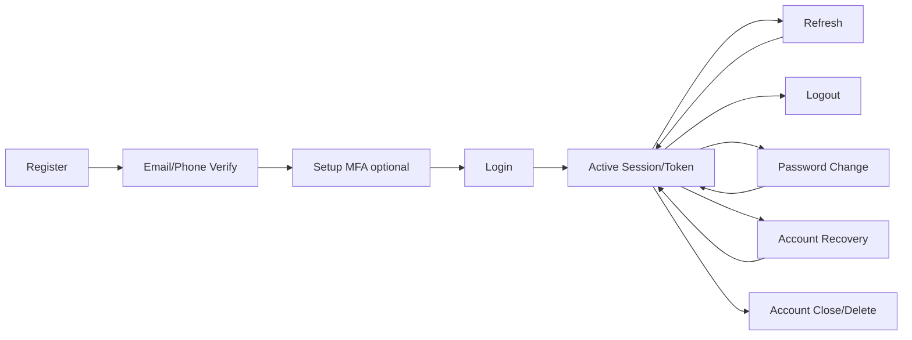

# 🔐 Authentication — Foundation

> **Tác giả:** Mr.Rom\
> **Phiên bản:** v1.0.0\
> **Tạo lúc:** 24/05/2026\
> **Cập nhật:** 24/05/2026\
> **Level:** Basic (bài 00/5)\
> **Tags:** [MUST-KNOW]\
> **Yêu cầu trước:** OWASP basic [bài 04](../../../owasp-top-10/lessons/01_basic/04_auth-failures-logging-and-ssrf.md) ✅, HTTP cơ bản

> 🎯 *Bài 00 cluster Authentication. OWASP A07 đã surface-level — cluster này deep. Bài này dạy: AuthN vs AuthZ, identity, credential, 3 factor (something you know/have/are), session vs token, lifecycle (register → login → refresh → logout), threat model. Foundation cho 4 bài deep (Password/MFA, OAuth, JWT, Federation/SSO).*

## 🎯 Sau bài này bạn sẽ

- [ ] Phân biệt rõ **AuthN** (authentication) vs **AuthZ** (authorization)
- [ ] Hiểu **identity** vs **credential** vs **factor**
- [ ] 3 factor: **knowledge** (password), **possession** (phone, key), **inherence** (biometric) + multi-factor combo
- [ ] **Session** vs **Token** (stateful vs stateless) — trade-off
- [ ] Lifecycle full: register → email verify → login → session → refresh → logout → account recovery
- [ ] Threat model authentication — top 8 attacks + mitigation map
- [ ] Roadmap 4 bài kế tiếp + decision tree chọn auth pattern

---

## Tình huống — Build auth từ đầu cho Acme Shop

Sếp:

> *"Acme Shop launch 6 tháng tới. Cần auth từ đầu: register email + password + MFA, social login (Google/Apple), admin SSO với Google Workspace, mobile app stay logged in 30 ngày, account recovery. Bạn design tuần này."*

Bạn cần quyết:
- Self-host hay dùng IdP (Auth0/Clerk)?
- Password + MFA pattern nào?
- OAuth/OIDC như thế nào cho social login?
- JWT hay session cookie cho mobile + web?
- Account recovery flow tránh phishing?

Bài này map overall picture. Bài 01-04 dạy chi tiết.

---

## 1️⃣ AuthN vs AuthZ — Không nhầm lẫn

🪞 **Ẩn dụ**: *AuthN như **check ID ở cổng**, AuthZ như **kiểm tra thẻ được vào phòng nào**. ID đúng (AuthN) nhưng không có thẻ phòng IT (AuthZ) = không vào được. 2 layer khác nhau, không trộn lẫn.*

| Aspect | AuthN (Authentication) | AuthZ (Authorization) |
|---|---|---|
| Trả lời câu hỏi | "Bạn là ai?" | "Bạn được làm gì?" |
| When | Login | Mỗi request |
| Output | Identity (user ID, claims) | Decision (allow/deny per resource) |
| Mechanism | Password, MFA, OAuth, biometric | RBAC, ABAC, policy (OPA, Casbin) |
| Cluster | **authentication/** (đây) | [authorization/](../../../authorization/) |

→ Bài này focus AuthN. AuthZ là cluster riêng.

---

## 2️⃣ Identity vs Credential vs Factor

🪞 **Ẩn dụ**: *Identity như **bạn là ai** (tên + ngày sinh + số CMND). Credential như **giấy tờ chứng minh** (CMND, hộ chiếu). Factor như **cách chứng minh** (giấy bạn cầm + dấu vân tay + mật khẩu thẻ).*

### Definitions

| Term | Description | Example |
|---|---|---|
| **Identity** | Ai là người này | user_id = `u_12345`, email = `thien.le@acmeshop.vn` |
| **Credential** | Bằng chứng identity | Password hash, TOTP secret, biometric template, certificate |
| **Factor** | Phương thức chứng minh | Knowledge / Possession / Inherence |
| **Identifier** | String unique đại diện identity | email, username, phone, UUID |
| **Authenticator** | Tool execute factor | Yubikey, Google Authenticator app, Touch ID sensor |
| **Identity provider (IdP)** | Service quản identity + issue credentials | Auth0, Keycloak, Entra ID, Google |

### 3 Authentication Factors

| Factor | What | Example | Strength |
|---|---|---|---|
| **Knowledge** (something you know) | Bí mật trong đầu | Password, PIN, security question | Weakest (phishable) |
| **Possession** (something you have) | Vật bạn cầm | Phone TOTP, Yubikey, smart card | Stronger |
| **Inherence** (something you are) | Biometric | Fingerprint, face, voice, iris | Strong (but irrevocable) |

→ **MFA** = combine ≥ 2 factor **khác loại**. "Password + security question" = chỉ 1 factor (knowledge) — KHÔNG phải MFA.

### Factor strength trend 2026

```
Weakest → Strongest
SMS OTP → Email link → TOTP → Push notification → WebAuthn/Passkey → Hardware key (FIDO2)
```

→ **WebAuthn / Passkey** = future. Phishing-resistant.

---

## 3️⃣ Session vs Token — 2 paradigm

🪞 **Ẩn dụ**: *Session như **thẻ ra vào số seri** — server giữ database thẻ ai cấp cho ai. Token (JWT) như **giấy chứng nhận có dấu mộc** — server không cần lưu, chỉ verify dấu mộc đúng. Mỗi cái có trade-off.*

### Session (stateful)

```
Login →
Server: create session_id (random), lưu vào Redis: {user_id, ttl}
Server: set cookie session_id=abc123

Subsequent request →
Cookie session_id=abc123
Server: lookup Redis → {user_id} → continue
```

**Ưu điểm**:
- Revocation: delete entry in Redis = logout instantly.
- Update permissions live (re-fetch from DB).
- Smaller cookie.

**Nhược điểm**:
- Server stateful (Redis dependency).
- Cross-domain (subdomain.acmeshop.vn) cần cookie config + CORS.

### Token (JWT — stateless)

```
Login →
Server: create JWT {sub, exp, iat, ...} signed
Client: store JWT

Subsequent request →
Header: Authorization: Bearer eyJhbGc...
Server: verify signature → trust claims (no DB lookup)
```

**Ưu điểm**:
- Stateless: scale horizontal trivial.
- Cross-domain: easy.
- Mobile/SPA-friendly.

**Nhược điểm**:
- Revocation hard (token vẫn valid đến `exp` — need allowlist/denylist).
- Cannot update permissions until re-issue.
- Larger payload (base64 JWT).

### Decision

| Use case | Pick |
|---|---|
| Traditional web app same domain | **Session** + cookie |
| SPA + REST API | **Token** (JWT in localStorage / httpOnly cookie) |
| Mobile app | **Token** (refresh + access) |
| Microservices internal | Token (no shared session store) |
| Admin panel (immediate revoke) | Session |
| Hybrid | Both: short JWT access + refresh stored DB |

### Hybrid pattern (recommend 2026)

- **Access token** (JWT, 15p exp, stateless).
- **Refresh token** (opaque random, stored DB, long TTL).
- On API call: JWT.
- On JWT expire: client call `/refresh` với refresh token → new JWT.
- Logout: delete refresh token from DB → cannot get new JWT.

→ Best of both worlds.

---

## 4️⃣ Authentication lifecycle

🪞 **Ẩn dụ**: *Auth lifecycle như **vòng đời nhân viên** — gia nhập (register), được cấp thẻ (verify), vào làm hàng ngày (login), gia hạn thẻ (refresh), nghỉ phép (logout), nghỉ việc (account close), quên mật khẩu thẻ (recovery).*

### Full lifecycle



### Each phase challenges

| Phase | Threat | Mitigation |
|---|---|---|
| **Register** | Bot signup, fake email | CAPTCHA (Turnstile), email verify |
| **Email verify** | Verify link leak | Single-use token, short TTL, IP-bound |
| **MFA setup** | Phishing setup link | Secure context only, QR code in-app, backup codes |
| **Login** | Brute force, credential stuffing | Rate limit, breach check, MFA |
| **Active session** | Session hijack, XSS steal cookie | httpOnly + SameSite=Strict + TLS |
| **Refresh** | Refresh token leak | Token rotation, family detection |
| **Logout** | Incomplete cleanup | Server-side invalidate + client clear |
| **Password change** | Session not rotated → old session still valid | Force re-login or rotate all sessions |
| **Recovery** | Phishing reset link, account takeover | MFA-required, behavioral check, cool-down |
| **Account close** | Data not deleted (GDPR) | Soft delete → hard delete cycle |

---

## 5️⃣ Threat model — Top 8 attacks on auth

| # | Attack | Description | Mitigation |
|---|---|---|---|
| 1 | **Phishing** | Fake login page steal credentials | WebAuthn (phishing-resistant), domain awareness, MFA |
| 2 | **Credential stuffing** | Use leaked credentials from breach | MFA, breach check (haveibeenpwned), behavioral |
| 3 | **Brute force** | Try many passwords | Rate limit + progressive delay, CAPTCHA, MFA |
| 4 | **Session hijacking** | Steal cookie/token, replay | TLS, httpOnly cookie, short TTL, IP binding (optional) |
| 5 | **Password reuse** | User reuses across sites → 1 breach = many compromise | Password manager, breach check, MFA |
| 6 | **SIM swap** | Telco social engineering → take phone → SMS OTP intercept | TOTP/WebAuthn instead of SMS |
| 7 | **Account recovery abuse** | Reset email/SMS social engineer | MFA mandatory in recovery, behavioral check |
| 8 | **Privilege escalation in session** | Login as user, change to admin via vuln | Rotate session on privilege change, audit |

### Combined threat model — Acme Shop checkout user

```
Asset: User account (PII + payment method + order history)

Threats (STRIDE applied to auth):
- Spoof: phishing, credential stuffing, SIM swap
- Tamper: session token modification, JWT alg=none
- Info: leak credential, leak session cookie
- DoS: lockout amplification
- Elev: switch role mid-session

Mitigations:
- Phishing-resistant MFA (WebAuthn)
- Rate limit (not lockout) + CAPTCHA
- TLS everywhere + httpOnly cookie
- Token rotation
- Audit log every auth event
- Session rotate on privilege change
```

---

## 6️⃣ Self-host vs Identity-as-a-Service

🪞 **Ẩn dụ**: *Self-host auth như **tự xây bếp ở nhà** — control, custom, nhưng phải bảo trì. IDaaS như **đặt ăn ngoài** — nhanh, ngon, nhưng chi phí + vendor lock.*

### Compare 2026

| Aspect | Self-host (Keycloak, Authelia, Casdoor) | IDaaS (Auth0, Clerk, WorkOS, Stytch) |
|---|---|---|
| Setup | Days-weeks | Minutes-hours |
| Maintenance | Yours (patch, scale, backup) | Vendor |
| Cost | Server cost + ops time | Per MAU pricing ($0.02-0.15/MAU) |
| Compliance | DIY | Often included (SOC2, HIPAA) |
| Customization | Full | Limited |
| Data residency | Your control | Vendor region |
| Lock-in | Low | High (migration painful) |
| Cost @ 100k MAU | ~$200/month server | ~$2k-15k/month |

### Decision

| Profile | Pick |
|---|---|
| Startup MVP, < 10k MAU, no security team | **IDaaS** (Clerk, Auth0) |
| Mid-size, has dev team, want flexibility | **Self-host Keycloak** |
| Enterprise, compliance + data residency | **Hybrid** (Entra ID for internal, IDaaS for customers) |
| OpenSource project | **Self-host** (Authentik, Casdoor) |
| Cost-sensitive at scale (> 1M MAU) | **Self-host** (avoid $15k+/month bill) |

### Popular IDaaS

| Provider | Strength |
|---|---|
| **Auth0** (Okta) | Mature, enterprise, expensive |
| **Clerk** | Dev-first UX, React-native |
| **WorkOS** | B2B SSO + SCIM focus |
| **Stytch** | API-first, passwordless |
| **Supabase Auth** | Bundled with Postgres |
| **Firebase Auth** | Google ecosystem, mobile |
| **AWS Cognito** | AWS-native (rough UX but cheap) |

### Popular self-host

| Tool | Strength |
|---|---|
| **Keycloak** (Red Hat) | Enterprise-grade, mature, heavy |
| **Authentik** | Modern UI, lighter than Keycloak |
| **Authelia** | Lightweight, reverse-proxy focused |
| **Casdoor** | Multi-tenant, lightweight |
| **Ory** stack (Kratos, Hydra, Keto) | Modular, cloud-native |
| **Zitadel** | Cloud-native, multi-tenant |

---

## 7️⃣ Lộ trình 4 bài kế tiếp

| Bài | Coverage | Trọng tâm |
|---|---|---|
| **01** Password + MFA deep | Knowledge + Possession factor | Argon2id full, breach check, TOTP, WebAuthn/Passkey, recovery codes |
| **02** OAuth 2.1 + OIDC | Delegated auth | 5 flows (Auth Code+PKCE, Device, Client Creds, ROPC deprecated), social login |
| **03** JWT + Sessions deep | Token + Session mgmt | Signing alg, key rotation, refresh token rotation, revocation, blacklist |
| **04** Federation + SSO + IdP | Enterprise identity | SAML 2.0, OIDC SSO, SCIM, IdP setup (Keycloak), break-glass account |

→ **Tổng ~110p đọc + 10-15h hands-on**. Sau cluster: design + implement auth production-ready.

---

## 8️⃣ Decision tree — chọn auth pattern

```
1. App type?
   - Internal tool (employee) → SSO via IdP (OIDC/SAML), bài 04
   - Consumer-facing → continue

2. Mobile / SPA / Server-rendered?
   - Server-rendered → Session + cookie (bài 03)
   - SPA / Mobile → Token (JWT access + refresh) (bài 03)

3. Social login needed?
   - Yes → OAuth 2.1 + OIDC (bài 02)

4. MFA needed?
   - PCI/HIPAA/admin → mandatory MFA (bài 01)
   - Consumer → optional MFA (bài 01)

5. Self-host or IDaaS?
   - < 10k MAU + no security team → IDaaS (Clerk/Auth0)
   - > 10k MAU or compliance → Keycloak (self-host)

6. Recovery flow?
   - Always design (bài 01): email link + secondary factor
```

---

## 🛠️ Hands-on — Acme Shop auth requirement spec

### Mục tiêu

Viết spec auth Acme Shop dựa trên framework bài này.

### Spec template

```markdown
# Acme Shop — Authentication Spec v1.0

## Goals
- Customer register/login email+password.
- Social login: Google, Apple, Facebook.
- Admin SSO via Google Workspace.
- Mobile app stay logged in 30 days.
- Phishing-resistant for admin.
- Compliant: SOC2 Type II ready.

## Decisions (per framework section 8)

### Identity
- Identifier: email (unique).
- IdP: Self-host Keycloak (cost @ 100k MAU + compliance).
- Customer realm + Admin realm separated.

### Factors
- Customer:
  - Primary: email + Argon2id password.
  - Optional MFA: TOTP, Passkey.
- Admin:
  - Mandatory MFA: WebAuthn/Passkey (phishing-resistant).
  - SSO: Google Workspace via OIDC.

### Session/Token
- Web (customer): httpOnly secure SameSite=Lax cookie + JWT session.
- Mobile: JWT access (15p) + refresh token (30 days, rotated).
- Admin: SSO session via Keycloak (short TTL 1h, refresh from Google).

### Recovery
- Email reset link (15p TTL, single-use, IP-bound).
- Require MFA verify trước accept reset (nếu user có MFA).
- Cool-down 24h sau reset (block sensitive actions like withdraw).

### Threat mitigations
- Rate limit: 5 fail/account/hour → CAPTCHA Turnstile.
- Breach check: haveibeenpwned API on register + password change.
- Audit log: register, login (success/fail), MFA enable/disable, password change, role change.
- Session rotate on: login, privilege change, password change.

### Compliance
- TLS 1.3 minimum.
- HSTS preload.
- Cookie attributes correct.
- GDPR: data export + delete endpoint.
- SOC2: audit log retention 1 year + WORM.
```

→ Spec là input cho bài 01-04 (implement detail).

---

## 💡 Cạm bẫy thường gặp & Best practice

### 1. AuthN vs AuthZ trộn lẫn

**Bẫy**: Code check role trong login function.

**Fix**: AuthN return identity; AuthZ là middleware/policy riêng.

### 2. Stateless = không revocable

**Bẫy**: Dùng JWT only → token leak = no way to revoke until exp.

**Fix**: Hybrid pattern + denylist (Redis) cho compromise event.

### 3. "MFA" = security question

**Bẫy**: Hỏi security question = MFA. KHÔNG — đó là 2 lớp knowledge (1 factor).

**Fix**: MFA = factor khác loại (knowledge + possession).

### 4. SMS = MFA strong

**Bẫy**: SMS OTP = MFA. Yes, nhưng yếu nhất (SIM swap).

**Fix**: TOTP/WebAuthn cho admin + sensitive op.

### 5. Self-host Keycloak quá sớm

**Bẫy**: Startup 100 user → setup Keycloak HA → mất 2 tuần.

**Fix**: IDaaS đầu tiên (Clerk/Auth0); migrate khi cần.

### 6. Recovery flow không MFA

**Bẫy**: Forgot password chỉ email link → email compromise = full takeover.

**Fix**: Recovery cũng cần MFA verify nếu user có.

### 7. Session không rotate

**Bẫy**: User change password, old session vẫn dùng được.

**Fix**: Force re-login hoặc invalidate other sessions.

### 8. Compliance "to be done later"

**Bẫy**: Build auth không nghĩ SOC2/GDPR → year 2 refactor.

**Fix**: Compliance từ design — audit log, retention, deletion ngay từ đầu.

---

## 🧠 Tự kiểm tra (Self-check)

- [ ] AuthN vs AuthZ — 5 điểm khác?
- [ ] 3 factor + ví dụ + strength rank?
- [ ] Session vs Token — pick cho 4 use case?
- [ ] Auth lifecycle — 9 phase + threat mỗi phase?
- [ ] Top 8 auth attacks + mitigation?
- [ ] Self-host vs IDaaS — pick cho 4 profile team?
- [ ] Hybrid token pattern (access + refresh) — sketch implementation?
- [ ] Acme Shop spec auth full?

---

## 📚 Từ Điển Thuật Ngữ (Glossary)

| Term | Vietnamese / Explanation |
|---|---|
| **AuthN** | Authentication — "ai" |
| **AuthZ** | Authorization — "làm gì được" |
| **Identity** | Người đại diện trong hệ thống |
| **Credential** | Bằng chứng identity |
| **Factor** | Phương thức chứng minh (3 type) |
| **Identifier** | String unique đại diện identity |
| **MFA** | Multi-Factor Authentication |
| **2FA** | Two-Factor (subset) |
| **Knowledge factor** | Something you know (password) |
| **Possession factor** | Something you have (phone, key) |
| **Inherence factor** | Something you are (biometric) |
| **Session** | Server-side state per user |
| **Token** | Client-side credential (often JWT) |
| **JWT** | JSON Web Token — signed claims |
| **Access token** | Short-lived token cho API |
| **Refresh token** | Long-lived token đổi access token mới |
| **IdP** | Identity Provider |
| **IDaaS** | Identity-as-a-Service (Auth0, Clerk) |
| **SSO** | Single Sign-On |
| **WebAuthn** | Web Authentication API (FIDO2) |
| **Passkey** | Branded WebAuthn (Apple/Google) |
| **Credential stuffing** | Attack: use leaked creds |
| **SIM swap** | Attack: take over phone via telco |
| **Phishing-resistant** | Auth method không bị steal via fake site |

---

## 🔗 Liên kết & Tài nguyên

### 🧭 Định hướng lộ trình học
- ➡️ **Bài tiếp theo:** [Mật khẩu + Xác thực 2 lớp (MFA)](01_password-and-mfa.md) *(sắp viết)*
- ↑ **Về cụm:** [authentication README](../../README.md)

### 🧩 Các chủ đề có thể bạn quan tâm
- 🛡️ [OWASP A07](../../../owasp-top-10/lessons/01_basic/04_auth-failures-logging-and-ssrf.md) — overview level
- 🔑 [authorization](../../../authorization/) — sibling
- 🔒 [cryptography](../../../cryptography/) — backed crypto
- 📡 [tls-ssl](../../../tls-ssl/) — transport security
- 🔐 [secrets-management](../../../secrets-management/)

### Tài nguyên ngoài (2026)
- 📖 [OWASP Authentication Cheat Sheet](https://cheatsheetseries.owasp.org/cheatsheets/Authentication_Cheat_Sheet.html)
- 📖 [NIST SP 800-63B](https://pages.nist.gov/800-63-3/sp800-63b.html)
- 📖 [auth0 docs](https://auth0.com/docs)
- 📖 [Keycloak docs](https://www.keycloak.org/documentation)
- 📖 [Clerk docs](https://clerk.com/docs)
- 📖 [FIDO Alliance](https://fidoalliance.org/)
- 📖 [Passkeys.io](https://www.passkeys.io/)
- 📖 [OAuth 2.1 draft](https://datatracker.ietf.org/doc/html/draft-ietf-oauth-v2-1)
- 📖 [OpenID Connect](https://openid.net/connect/)

---

## 📌 Nhật ký thay đổi (Changelog)

- **v1.0.0 (24/05/2026)** — Bản đầu tiên. Bài 00 cluster Authentication. AuthN vs AuthZ + identity/credential/factor + 3 factors + session vs token + hybrid pattern + lifecycle 9-phase + threat model top 8 attacks + self-host vs IDaaS + 7 popular tools + decision tree + Acme Shop spec hands-on + 8 pitfalls.
