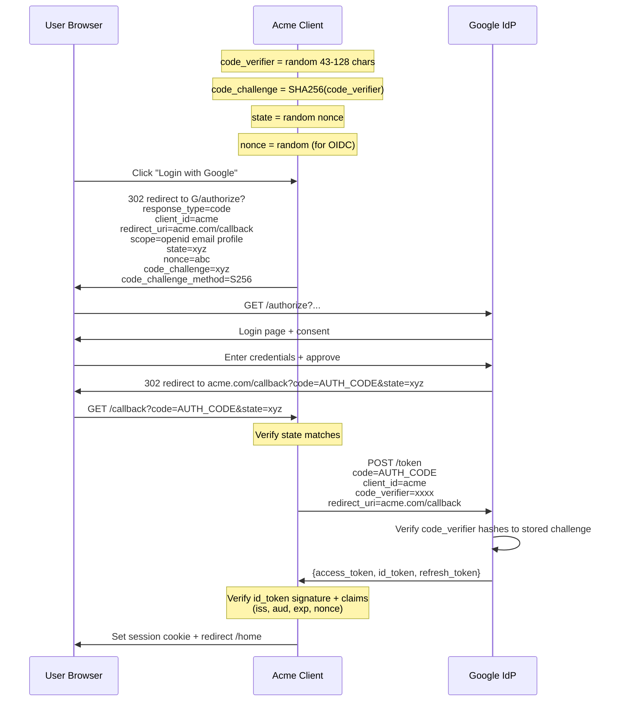
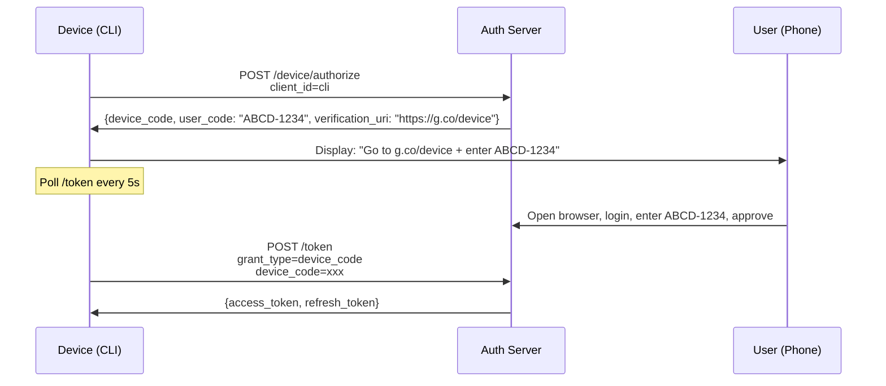

# 🔄 OAuth 2.1 + OIDC

> **Tác giả:** Mr.Rom\
> **Phiên bản:** v1.1.1\
> **Tạo lúc:** 24/05/2026\
> **Cập nhật:** 11/06/2026\
> **Level:** Basic (bài 02/5)\
> **Tags:** [MUST-KNOW]\
> **Yêu cầu trước:** Bài [01_password-and-mfa](01_password-and-mfa.md) ✅

> 🎯 *Bài 02. **OAuth 2.0/2.1** = framework delegated authorization (Login with Google). **OIDC** = OAuth + identity layer (who is the user). Bài này dạy: 5 grant flows (Auth Code+PKCE, Device, Client Credentials, ROPC deprecated, Implicit deprecated), social login implementation, IdP setup, common mistakes (state, nonce, redirect URI). Hands-on Acme Shop Google login + Apple Sign In.*

## 🎯 Sau bài này bạn sẽ

- [ ] Phân biệt **OAuth 2.0/2.1** vs **OIDC** — không nhầm
- [ ] 5 grant flows + khi nào dùng cái nào
- [ ] **Authorization Code + PKCE** end-to-end (most important 2026)
- [ ] **Device Code** cho CLI/TV
- [ ] **Client Credentials** cho M2M
- [ ] Implement "Login with Google" cho Acme Shop
- [ ] Verify **ID Token** đúng (signature, claims, JWKS)
- [ ] Tránh 8 mistakes phổ biến (state, nonce, redirect URI, scope)

---

## Tình huống — Add Google + Apple login

Sếp:

> *"User complain đăng ký mất thời gian. Add Google + Apple + Facebook login. Mobile app cũng. Admin SSO Google Workspace. Bạn implement OAuth/OIDC tuần này. Sau khoá học OWASP, bạn nên hiểu rồi."*

Cần:
- Web Google login (Auth Code + PKCE).
- Mobile Apple Sign In.
- Admin SSO Google Workspace.
- M2M (mobile backend ↔ Acme API): client credentials.
- Avoid pitfalls: state, nonce, redirect URI validation.

Bài này map.

---

## 1️⃣ OAuth 2.0 / 2.1 / OIDC — Phân biệt

🪞 **Ẩn dụ**: *OAuth như **giấy ủy quyền** — bạn cho phép app X access data ở Google (không đưa Google password cho X). OIDC như **OAuth + ID card** — không chỉ ủy quyền access, mà còn xác nhận "ai" với app X.*

### OAuth 2.0 (2012) → 2.1 (drafted 2020+)

- **OAuth 2.0** = framework cho delegated **authorization** (cho app access resource khác).
- **OAuth 2.1** = consolidate best practices, **deprecate Implicit + ROPC**.
- **OIDC** (OpenID Connect 2014) = layer on OAuth 2.0 for **authentication** (identity).

### OAuth vs OIDC

| Aspect | OAuth 2.0/2.1 | OIDC |
|---|---|---|
| Purpose | Authorization (access resources) | Authentication (identify user) |
| Returns | Access token | ID token + Access token + (Refresh token) |
| Standard | RFC 6749 + family | OIDC Core 1.0 + extensions |
| When | "Let app access my Google Drive" | "Login with Google" |
| Token format | Opaque or JWT (impl-specific) | ID token = JWT (mandatory) |
| Standard endpoints | `/authorize`, `/token`, `/revoke` | + `/userinfo`, `/.well-known/openid-configuration` |

→ **Mostly together**: "Sign in with Google" = OIDC (uses OAuth 2.0 underneath).

### Các vai trò chính

| Role | What | Example |
|---|---|---|
| **Resource Owner** | User | thien.le@acmeshop.vn |
| **Client** | App requesting access | Acme Shop web app |
| **Authorization Server** | Issue tokens | Google, Auth0, Keycloak |
| **Resource Server** | Hosts resources | Google Drive API |
| **User Agent** | Browser / mobile app | Chrome, Safari |

---

## 2️⃣ Authorization Code Flow + PKCE — Default 2026

🪞 **Ẩn dụ**: *Auth Code Flow như **3-bên hẹn nhau**: User ↔ Acme Shop ↔ Google. Google không gửi token thẳng cho browser (vì browser công khai), mà gửi 1 code; Acme Shop server đổi code lấy token (server-server, safe). PKCE = chữ ký ngăn man-in-middle steal code.*

### Luồng hoạt động (Auth Code + PKCE)



### PKCE — Proof Key for Code Exchange

PKCE protect against **authorization code interception** (mobile/SPA where redirect_uri có thể intercept).

```python
import secrets, hashlib, base64

# Client generates per-request
# token_urlsafe(96) -> ~128 ký tự, hợp lệ RFC 7636 (verifier trong [43, 128])
code_verifier = secrets.token_urlsafe(96)

# Challenge = SHA256(verifier), base64url no padding
code_challenge = base64.urlsafe_b64encode(
    hashlib.sha256(code_verifier.encode()).digest()
).rstrip(b"=").decode()

# Send challenge in /authorize
# Send verifier in /token exchange
```

→ Attacker intercept `code` but không có `code_verifier` → can't exchange.

**OAuth 2.1**: PKCE **required for all clients** (public + confidential).

### Ví dụ phía server (Python với Authlib)

```python
from authlib.integrations.starlette_client import OAuth
from starlette.requests import Request

oauth = OAuth()
oauth.register(
    name="google",
    server_metadata_url="https://accounts.google.com/.well-known/openid-configuration",
    client_id=os.environ["GOOGLE_CLIENT_ID"],
    client_secret=os.environ["GOOGLE_CLIENT_SECRET"],
    client_kwargs={"scope": "openid email profile"},
)

@app.get("/auth/google/login")
async def login(request: Request):
    redirect_uri = "https://acmeshop.vn/auth/google/callback"
    # Authlib auto-handles state + nonce + PKCE
    return await oauth.google.authorize_redirect(request, redirect_uri)

@app.get("/auth/google/callback")
async def callback(request: Request):
    # Verify state, exchange code, validate id_token
    token = await oauth.google.authorize_access_token(request)
    user_info = token["userinfo"]  # parsed id_token claims

    # user_info: {sub, email, email_verified, name, picture, ...}
    user = db.upsert_user(
        google_sub=user_info["sub"],
        email=user_info["email"],
        name=user_info["name"],
    )

    return create_session(user)
```

### Xác minh ID Token (OIDC)

```python
import jwt
from jwt import PyJWKClient

JWKS_URL = "https://www.googleapis.com/oauth2/v3/certs"
jwks_client = PyJWKClient(JWKS_URL)

# Google phát hành 2 dạng issuer cho id_token -> chấp nhận cả 2 để tránh false-reject
GOOGLE_ISSUERS = {"https://accounts.google.com", "accounts.google.com"}

def verify_google_id_token(id_token: str, client_id: str, expected_nonce: str):
    # Get public key matching kid header
    signing_key = jwks_client.get_signing_key_from_jwt(id_token)

    # Verify signature + aud; issuer check thủ công bên dưới (Google có 2 dạng iss)
    claims = jwt.decode(
        id_token,
        signing_key.key,
        algorithms=["RS256"],
        audience=client_id,    # must match
        options={"verify_iss": False},
    )

    # Verify issuer (chấp nhận cả có/không scheme)
    if claims.get("iss") not in GOOGLE_ISSUERS:
        raise InvalidToken("issuer mismatch")

    # Additional: verify nonce matches what we sent
    if claims.get("nonce") != expected_nonce:
        raise InvalidToken("nonce mismatch")

    return claims
```

→ JWKS endpoint provide rotating public keys. Cache + refresh periodically.

---

## 3️⃣ Các luồng khác

### Device Authorization Flow (CLI, TV, IoT)

For devices không có browser (smart TV, CLI tool):



→ Tool dùng: `gcloud auth login`, `aws sso login`, GitHub CLI, Anthropic CLI.

### Client Credentials Flow (M2M)

For backend ↔ backend (no user):

```python
# Service A → Service B authentication
response = requests.post(
    "https://auth.acmeshop.vn/oauth/token",
    data={
        "grant_type": "client_credentials",
        "client_id": "service-a",
        "client_secret": "...",
        "scope": "read:users",
    },
)
access_token = response.json()["access_token"]

# Use token
requests.get("https://api.acmeshop.vn/users", headers={
    "Authorization": f"Bearer {access_token}"
})
```

→ Phù hợp cron job, service mesh, scheduled task.

### Implicit Flow — DEPRECATED OAuth 2.1

❌ Don't use. Replaced by Auth Code + PKCE for SPA.

### Resource Owner Password Credentials (ROPC) — DEPRECATED

❌ Don't use. App takes user's password directly → defeats purpose of OAuth.

### Refresh Token

After token expires:

```python
response = requests.post(
    f"{token_endpoint}",
    data={
        "grant_type": "refresh_token",
        "refresh_token": stored_refresh_token,
        "client_id": "acme",
        "client_secret": "...",  # if confidential client
    },
)
new_token = response.json()
# May get new refresh_token (rotation) → save it
```

**Refresh token rotation** (security): each use → issue new refresh, invalidate old. Detect refresh token reuse → token family compromise → invalidate all.

---

## 4️⃣ Scopes + Consent

### Scope OIDC chuẩn

| Scope | Returns in ID token / userinfo |
|---|---|
| `openid` | `sub` (subject = user ID), required |
| `profile` | name, family_name, given_name, picture, locale |
| `email` | email, email_verified |
| `address` | address |
| `phone` | phone_number, phone_number_verified |
| `offline_access` | Get refresh token |

### Scope tùy chỉnh (OAuth resources)

```
read:users
write:orders
admin:everything
```

→ Define scopes for your API.

### Consent tăng dần

Don't ask for everything upfront. Request more scopes as needed.

```python
# Initial login: only "openid email"
# Later, when user clicks "Sync calendar":
oauth.google.authorize_redirect(request, redirect_uri, scope="openid email https://www.googleapis.com/auth/calendar")
```

→ Reduce friction; user gives more trust over time.

---

## 5️⃣ Định dạng token

### Access Token

- **Opaque** (random string): server verify by introspection endpoint.
- **JWT**: self-contained, server verify by signature.

```
# Opaque
access_token = "act_aBc123XyZ..."

# JWT
access_token = "eyJhbGciOiJSUzI1NiJ9.eyJzdWIiOiIxMjMiLCJzY29wZSI6InJlYWQ6dXNlciB3cml0ZTpvcmRlciIsImV4cCI6MTcxNjU1MDQwMH0.signature..."
```

### ID Token (luôn là JWT)

```json
{
  "iss": "https://accounts.google.com",
  "sub": "1234567890",
  "aud": "acme-client-id",
  "exp": 1716550400,
  "iat": 1716546800,
  "nonce": "abc",
  "email": "user@acmeshop.vn",
  "email_verified": true,
  "name": "Nguyen Van A Nguyen",
  "picture": "https://lh3.googleusercontent.com/..."
}
```

### Refresh Token

- Opaque string or JWT.
- Long-lived (30 days - infinite if not rotated).
- Store securely (httpOnly cookie or secure storage on mobile).

---

## 6️⃣ Các provider phổ biến + cài đặt

### Google

1. Console: https://console.cloud.google.com → APIs & Services → Credentials.
2. Create OAuth client ID: type "Web application".
3. Add authorized redirect URI: `https://acmeshop.vn/auth/google/callback`.
4. Get `client_id` + `client_secret`.
5. Discovery: `https://accounts.google.com/.well-known/openid-configuration`.

### Apple Sign In

1. Apple Developer → Certificates → Sign In with Apple capability.
2. Apple uses **client_secret as JWT signed with private key** (different from Google).
3. Discovery: `https://appleid.apple.com/.well-known/openid-configuration`.
4. Web flow returns user info only first time (subsequent uses `sub`).

```python
# Apple client_secret = JWT
import jwt, time

def apple_client_secret():
    now = int(time.time())
    payload = {
        "iss": APPLE_TEAM_ID,
        "iat": now,
        "exp": now + 86400 * 180,  # max 6 months
        "aud": "https://appleid.apple.com",
        "sub": APPLE_CLIENT_ID,
    }
    with open("AuthKey_xxx.p8") as f:
        key = f.read()
    return jwt.encode(payload, key, algorithm="ES256", headers={"kid": APPLE_KEY_ID})
```

### Facebook / Meta

OAuth 2.0 but NOT full OIDC. Limited info via `/me` endpoint.

### Microsoft Entra ID (Azure AD)

Full OIDC. Use for B2B enterprise SSO.

### Self-host (Keycloak, Authentik, Ory Hydra)

Same OIDC standard. Discovery: `<base>/realms/<realm>/.well-known/openid-configuration`.

---

## 7️⃣ State + Nonce + Redirect URI

🪞 **Ẩn dụ**: *State + nonce như **mã tag riêng** trên giấy ủy quyền — mỗi lần Yêu cầu mới có tag mới; nếu nhận lại tag khác = giả mạo.*

### `state` — chống CSRF

```python
# Client generates random state, stores in session
state = secrets.token_urlsafe(32)
session["oauth_state"] = state

# Send in /authorize
redirect_url = f".../authorize?...&state={state}"

# Callback verify
if request.args["state"] != session.pop("oauth_state", None):
    raise CSRFError()
```

→ Prevent attacker init OAuth flow + tricking user to callback URL.

### `nonce` — chống replay (OIDC)

```python
nonce = secrets.token_urlsafe(32)
session["oauth_nonce"] = nonce

# Send in /authorize
redirect_url = f".../authorize?...&nonce={nonce}"

# Verify in id_token
claims = decode_id_token(id_token)
if claims["nonce"] != session.pop("oauth_nonce"):
    raise ReplayError()
```

→ Prevent reuse of ID token.

### Xác minh `redirect_uri`

Server **must validate redirect_uri exactly matches registered**. Allow wildcard subdomain is dangerous.

```
Registered: https://acmeshop.vn/auth/callback
Allowed:    https://acmeshop.vn/auth/callback ✅
Rejected:   https://acmeshop.vn/auth/callback?evil=x ❌ (extra params)
Rejected:   https://attacker.com/auth/callback ❌
Rejected:   https://acmeshop.vn.attacker.com/auth/callback ❌
```

→ Strict exact match. Avoid open redirect.

---

## 🛠️ Hands-on — Acme Shop Google login

### Cài đặt

```bash
pip install authlib starlette
export GOOGLE_CLIENT_ID=xxx
export GOOGLE_CLIENT_SECRET=xxx
```

### Code

```python
from fastapi import FastAPI, Request, HTTPException
from authlib.integrations.starlette_client import OAuth
from starlette.middleware.sessions import SessionMiddleware
import os

app = FastAPI()
app.add_middleware(SessionMiddleware, secret_key=os.environ["SESSION_SECRET"])

oauth = OAuth()
oauth.register(
    name="google",
    server_metadata_url="https://accounts.google.com/.well-known/openid-configuration",
    client_id=os.environ["GOOGLE_CLIENT_ID"],
    client_secret=os.environ["GOOGLE_CLIENT_SECRET"],
    client_kwargs={"scope": "openid email profile"},
)

@app.get("/auth/google/login")
async def google_login(request: Request):
    redirect_uri = "https://acmeshop.vn/auth/google/callback"
    return await oauth.google.authorize_redirect(request, redirect_uri)

@app.get("/auth/google/callback")
async def google_callback(request: Request):
    try:
        token = await oauth.google.authorize_access_token(request)
    except Exception as e:
        raise HTTPException(400, f"OAuth error: {e}")

    user_info = token["userinfo"]
    if not user_info.get("email_verified"):
        raise HTTPException(403, "Email chưa verify ở Google")

    # Upsert user
    user = db.upsert_user(
        google_sub=user_info["sub"],
        email=user_info["email"],
        name=user_info.get("name"),
        avatar_url=user_info.get("picture"),
    )
    audit("login.google", user.id)

    # Set session
    request.session["user_id"] = str(user.id)
    return {"success": True, "user": user_info}
```

### Trừu tượng hoá đa provider

```python
oauth.register(name="google", ...)
oauth.register(name="apple", ...)
oauth.register(name="facebook", ...)

@app.get("/auth/{provider}/login")
async def login(provider: str, request: Request):
    if provider not in ("google", "apple", "facebook"):
        raise HTTPException(404)
    client = oauth.create_client(provider)
    return await client.authorize_redirect(request, f"https://acmeshop.vn/auth/{provider}/callback")
```

### Liên kết tài khoản

```python
def upsert_user_oauth(provider: str, sub: str, email: str, **kwargs):
    # Try find by oauth identity
    user = db.find_oauth_identity(provider, sub)
    if user:
        return user

    # Try find by email (link to existing)
    user = db.find_by_email(email)
    if user:
        db.add_oauth_identity(user.id, provider, sub)
        return user

    # Create new
    user = db.create_user(email=email, **kwargs)
    db.add_oauth_identity(user.id, provider, sub)
    return user
```

→ Schema:
```sql
CREATE TABLE oauth_identities (
    user_id BIGINT REFERENCES users(id),
    provider VARCHAR(50),
    sub VARCHAR(255),
    PRIMARY KEY (provider, sub),
    UNIQUE (user_id, provider)
);
```

→ One user can have multiple OAuth providers + 1 password.

---

## 💡 Cạm bẫy thường gặp & Best practice

### 1. Bỏ qua xác minh state

**Bẫy**: Library auto-handles, you skip check.

**Fix**: Always verify state on callback. (Authlib does this.)

### 2. Bỏ qua xác minh nonce

**Bẫy**: For OIDC, nonce in ID token not checked.

**Fix**: Match claims["nonce"] with session-stored nonce.

### 3. Tin claim `email` mà không xác minh

**Bẫy**: Google return email — assume verified.

**Fix**: Check `email_verified == true`.

### 4. Dùng wildcard cho redirect_uri

**Bẫy**: Register `https://*.acmeshop.vn/callback`.

**Fix**: Exact match. Multiple URIs allowed but each strict.

### 5. Dùng Implicit flow

**Bẫy**: Older tutorial say Implicit for SPA.

**Fix**: OAuth 2.1 deprecates Implicit. Use Auth Code + PKCE.

### 6. Dùng ROPC cho "tiện lợi"

**Bẫy**: App ask user enter Google password directly.

**Fix**: Never. Defeats OAuth purpose. Use Auth Code flow.

### 7. Lưu access token dài hạn trong localStorage

**Bẫy**: XSS → token leak.

**Fix**: httpOnly cookie or in-memory + refresh token in httpOnly cookie.

### 8. Refresh token không xoay vòng

**Bẫy**: Refresh token never invalidates → leak = permanent.

**Fix**: Rotate refresh token on each use; detect reuse = compromise.

---

## 🧠 Tự kiểm tra (Self-check)

- [ ] OAuth vs OIDC — 5 điểm khác?
- [ ] PKCE - tại sao required cho mobile/SPA?
- [ ] Auth Code + PKCE flow 10 step?
- [ ] Verify ID token: kiểm tra signature + claims gì?
- [ ] Device Code Flow — khi dùng?
- [ ] Client Credentials — khi dùng?
- [ ] state vs nonce — chống attack gì?
- [ ] Implement Google login Acme Shop với account linking?

---

## 📚 Từ Điển Thuật Ngữ (Glossary)

| Term | Vietnamese / Explanation |
|---|---|
| **OAuth 2.0** | Authorization framework RFC 6749 |
| **OAuth 2.1** | Consolidated version, deprecates Implicit + ROPC |
| **OIDC** | OpenID Connect — identity layer on OAuth |
| **PKCE** | Proof Key for Code Exchange |
| **code_verifier / code_challenge** | PKCE secret + hash |
| **state** | Random per-request, CSRF protect |
| **nonce** | Random per-request, replay protect (OIDC) |
| **Authorization Code Flow** | Default flow 2026 |
| **Device Code Flow** | CLI/TV |
| **Client Credentials** | M2M |
| **Implicit Flow** | DEPRECATED |
| **ROPC** | DEPRECATED Resource Owner Password |
| **Access token** | Token to access API |
| **ID token** | OIDC JWT with user identity |
| **Refresh token** | Long-lived, exchange for new access |
| **Scope** | Permission boundary |
| **Claim** | Field in JWT (sub, exp, ...) |
| **Discovery (`.well-known`)** | OIDC config endpoint |
| **JWKS** | JSON Web Key Set — public keys |
| **Account linking** | Multiple OAuth providers → one user |
| **Refresh token rotation** | Each use → new refresh, old invalidated |
| **Token family** | Group of refresh tokens detect reuse |

---

## 🔗 Liên kết & Tài nguyên

### 🧭 Định hướng lộ trình học
- ⬅️ **Bài trước:** [Mật khẩu + Xác thực 2 lớp (MFA)](01_password-and-mfa.md)
- ➡️ **Bài tiếp theo:** [JWT + Sessions Deep](03_jwt-and-sessions-deep.md) *(sắp viết)*
- ↑ **Về cụm:** [authentication README](../../README.md)

### 🧩 Các chủ đề có thể bạn quan tâm
- 🛡️ [OWASP A07](../../../owasp-top-10/lessons/01_basic/04_auth-failures-logging-and-ssrf.md)
- ↑ **Về cụm:** [HTTP cluster](../../../../05_networking/http-https/)

### Tài nguyên ngoài (2026)
- 📖 [OAuth 2.0 RFC 6749](https://datatracker.ietf.org/doc/html/rfc6749)
- 📖 [OAuth 2.1 draft](https://datatracker.ietf.org/doc/html/draft-ietf-oauth-v2-1)
- 📖 [OIDC Core](https://openid.net/specs/openid-connect-core-1_0.html)
- 📖 [PKCE RFC 7636](https://datatracker.ietf.org/doc/html/rfc7636)
- 📖 [Device Code RFC 8628](https://datatracker.ietf.org/doc/html/rfc8628)
- 📖 [Authlib](https://docs.authlib.org/)
- 📖 [auth0 OAuth playground](https://oauth.com/playground/)
- 📖 [OAuth.tools](https://oauth.tools/) — interactive
- 📖 [Google Identity OAuth](https://developers.google.com/identity/protocols/oauth2)
- 📖 [Apple Sign In docs](https://developer.apple.com/sign-in-with-apple/)
- 📖 [Keycloak docs](https://www.keycloak.org/docs/latest/server_admin/)

---

## 📌 Nhật ký thay đổi (Changelog)

- **v1.0.0 (24/05/2026)** — Bản đầu tiên. Bài 02 Authentication basic. OAuth 2.0/2.1 + OIDC + 5 flows (Auth Code+PKCE, Device, Client Creds, Implicit deprecated, ROPC deprecated) + JWKS + ID token validation + state+nonce+redirect_uri + Google/Apple setup + account linking + Acme Shop hands-on + 8 pitfalls.
- **v1.1.0 (07/06/2026)** — Fix code: PKCE `code_verifier` bỏ slice `[:128]` vô nghĩa (token_urlsafe(64) chỉ ra ~86 ký tự), đổi sang `token_urlsafe(96)` cho ~128 ký tự đúng RFC 7636. `verify_google_id_token` nhận `client_id` + `expected_nonce` qua tham số (hết biến tự do gây NameError) và chấp nhận cả 2 dạng issuer Google (`accounts.google.com` có/không scheme).
- **v1.1.1 (11/06/2026)** — Việt hoá heading nội dung mô tả sang tiếng Việt (giữ thuật ngữ/brand/param) theo Vietnamese-first.
