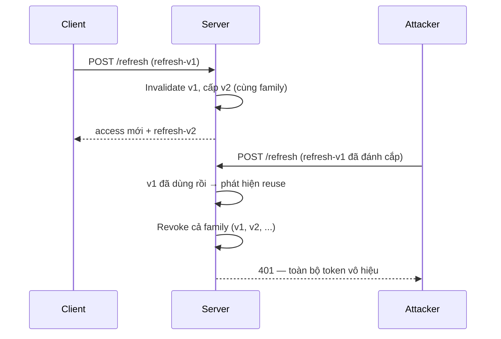

# 🎫 JWT + Sessions Deep

> **Tác giả:** Mr.Rom\
> **Phiên bản:** v1.1.2\
> **Tạo lúc:** 24/05/2026\
> **Cập nhật:** 11/06/2026\
> **Level:** Basic (bài 03/5)\
> **Tags:** [MUST-KNOW]\
> **Yêu cầu trước:** Bài [02_oauth-and-oidc](02_oauth-and-oidc.md) ✅

> 🎯 *Bài 03. JWT thực thi đúng + Session management — 2 paradigm core. Bài này dạy: JWT anatomy + JWS/JWE/JWT khác nhau, signing algorithms (RS256 vs HS256 vs ES256 vs EdDSA), key rotation + JWKS, refresh token rotation + family detection, revocation strategies (denylist/short TTL), session lifecycle production-grade. Hands-on JWT auth + session rotation Acme Shop.*

## 🎯 Sau bài này bạn sẽ

- [ ] Phân biệt **JWT vs JWS vs JWE** — không nhầm
- [ ] Chọn **signing algorithm**: HS256 vs RS256 vs ES256 vs EdDSA
- [ ] Setup **key rotation** + **JWKS** publish
- [ ] Implement **refresh token rotation** + **family detection**
- [ ] Revocation strategies: short TTL + denylist + token versioning
- [ ] Session lifecycle: create → rotate → invalidate → cleanup
- [ ] Hands-on JWT auth + refresh rotation Acme Shop

---

## Tình huống — Production-grade token system

Sếp:

> *"Mobile app dùng JWT cứng. Có vài sự cố: token leak qua log, không revoke được khi logout, refresh token bị stolen → attacker dùng vĩnh viễn. Bạn implement production-grade tuần này: JWT proper + refresh rotation + revocation + key rotation."*

Bạn cần:
- JWT format đúng (RS256, kid, jti).
- Refresh token rotation + family detection.
- Logout = invalidate effective.
- Key rotation no downtime.
- Audit log token lifecycle.

Bài này map.

---

## 1️⃣ JWT/JWS/JWE — Giải phẫu đúng

🪞 **Ẩn dụ**: *JWT như **vé** — JWS = vé có chữ ký xác thực (ai cũng đọc được nội dung); JWE = vé bỏ trong phong bì niêm phong (cần khóa giải). Người dùng thường thấy "JWT" = JWS signed.*

### Làm rõ thuật ngữ

| Term | Description |
|---|---|
| **JWT** | "JSON Web Token" — generic term cho JSON token (umbrella) |
| **JWS** | JWT **signed** (most common) — base64 sections + signature |
| **JWE** | JWT **encrypted** — encrypted payload, need key to decrypt |
| **JOSE** | "JSON Object Signing and Encryption" — framework (JWS, JWE, JWK, JWA, JWT) |
| **JWK** | JSON Web Key — public/private key in JSON format |
| **JWKS** | JSON Web Key Set — multiple JWK (for rotation) |
| **JWA** | JSON Web Algorithm — list valid algorithms |

### Cấu trúc JWS

```
header.payload.signature
↓       ↓        ↓
base64  base64   base64
```

```json
// Header
{"alg": "RS256", "typ": "JWT", "kid": "key-2026-01"}

// Payload
{
  "iss": "https://auth.acmeshop.vn",
  "sub": "u_12345",
  "aud": "api.acmeshop.vn",
  "exp": 1716550400,
  "iat": 1716549500,
  "jti": "tk_abc123",
  "scope": "read:orders write:cart",
  "roles": ["user"]
}

// Signature = sign(base64(header) + "." + base64(payload), private_key)
```

### Claims chuẩn (RFC 7519)

| Claim | Meaning |
|---|---|
| `iss` (issuer) | Who issued (URL) |
| `sub` (subject) | User ID |
| `aud` (audience) | Who can consume |
| `exp` (expiration) | Unix time expire |
| `iat` (issued at) | Unix time issued |
| `nbf` (not before) | Valid from |
| `jti` (JWT ID) | Unique token ID (revocation) |

### Claims tùy chỉnh (theo app)

```json
{
  "scope": "read:orders write:cart",
  "roles": ["user", "vip"],
  "tier": "premium",
  "ver": 1  // token version for revoke-all-old
}
```

→ Don't put sensitive data in payload — base64 = readable.

---

## 2️⃣ Signing algorithms — chọn đúng

### Compare

| Algorithm | Type | Key sizes | Speed | Use case |
|---|---|---|---|---|
| **HS256/384/512** | HMAC + SHA | 256+ bit secret | Fast | Same-service issuer + verifier |
| **RS256/384/512** | RSA + SHA | 2048+ bit | Slow sign, fast verify | Public verify (OAuth/OIDC standard) |
| **PS256/384/512** | RSA-PSS + SHA | 2048+ bit | Same as RS | More robust than RS, less adopted |
| **ES256/384/512** | ECDSA P-256/384/512 | 256/384/521 bit | Fast | Modern public verify |
| **EdDSA (Ed25519)** | Ed25519 | 256 bit | Very fast | Best modern signature |
| **`none`** | No signature | — | — | **NEVER USE** |

### Cây quyết định

```
Same service issue + verify (monolith)?
  Yes → HS256 (shared secret)
  No → continue

Need standard interop (OAuth provider, OIDC)?
  Yes → RS256 (most adopted) or ES256/EdDSA (modern)
  No → continue

Bandwidth-sensitive (mobile, low-bw)?
  Yes → ES256 (smaller signature than RS256)
  No → RS256
```

### HS256 vs RS256 — lỗi nghiêm trọng

**Vuln**: Server expects RS256, verifies với public key. Attacker craft JWT alg=HS256 + dùng public key as HMAC secret → server verify success.

**Fix**: Always pin allowed algorithms — và **không bao giờ** trộn HMAC + RSA trong cùng allowlist:

```python
import jwt

# ⚠️ PyJWT >= 2.0: `algorithms=` là tham số BẮT BUỘC.
#    Bỏ trống không "auto-detect" mà raise DecodeError ngay.

# ❌ Vulnerable: allowlist trộn HMAC + RSA
#    → attacker craft alg=HS256, dùng public_key làm HMAC secret → verify pass
claims = jwt.decode(token, public_key, algorithms=["HS256", "RS256"])

# ✅ Safe: chỉ cho đúng 1 họ thuật toán bất đối xứng
claims = jwt.decode(token, public_key, algorithms=["RS256"])
```

### Tấn công `alg=none`

```
header = {"alg": "none"}
signature = ""  // empty
```

**Fix**: Library 2026+ reject `alg=none` by default. Still — specify `algorithms=` allowlist explicit.

### Sinh khoá

```bash
# RS256 (2048-bit)
openssl genrsa -out private.pem 2048
openssl rsa -in private.pem -pubout -out public.pem

# ES256
openssl ecparam -genkey -name prime256v1 -noout -out ec-private.pem
openssl ec -in ec-private.pem -pubout -out ec-public.pem

# Ed25519
openssl genpkey -algorithm Ed25519 -out ed25519-private.pem
openssl pkey -in ed25519-private.pem -pubout -out ed25519-public.pem
```

---

## 3️⃣ Key rotation + JWKS

🪞 **Ẩn dụ**: *Key rotation như **đổi chìa khóa định kỳ** — vẫn dùng được cả 2 chìa (old + new) trong thời gian transition; sau khi mọi token cũ expire → bỏ chìa cũ.*

### Vì sao cần xoay vòng

- Compromise risk (key leak in code repo, log).
- Cryptographic hygiene (NIST recommend rotation 1-2 years).
- Forced reset of token base (force everyone re-login).

### Chiến lược xoay vòng

```
Time:    [old key only] → [old + new] → [new only]
Action:  - new key generated
         - publish in JWKS
         - new token sign with new key (kid=new)
         - verifier accept both
         - wait until all old tokens expire (refresh + access)
         - remove old from JWKS
```

### Header `kid`

Each key has unique `kid` (key ID). JWT header includes `kid` so verifier picks right key.

```json
// JWT header
{"alg": "RS256", "typ": "JWT", "kid": "key-2026-02"}
```

### JWKS endpoint

```json
// GET /.well-known/jwks.json
{
  "keys": [
    {
      "kty": "RSA",
      "use": "sig",
      "kid": "key-2026-02",
      "alg": "RS256",
      "n": "...",  // modulus
      "e": "AQAB"  // exponent
    },
    {
      "kty": "RSA",
      "use": "sig",
      "kid": "key-2026-01",
      "alg": "RS256",
      "n": "...",
      "e": "AQAB"
    }
  ]
}
```

→ Verifier fetch + cache. Refresh periodic (every hour).

### Triển khai (Python)

```python
import jwt
from jwt import PyJWKClient

JWKS_URL = "https://auth.acmeshop.vn/.well-known/jwks.json"
jwks_client = PyJWKClient(JWKS_URL, cache_keys=True, lifespan=3600)

def verify_token(token: str):
    # Get key matching kid in header
    signing_key = jwks_client.get_signing_key_from_jwt(token)
    return jwt.decode(
        token,
        signing_key.key,
        algorithms=["RS256"],
        audience="api.acmeshop.vn",
        issuer="https://auth.acmeshop.vn",
    )
```

### Phía issuer

```python
# Multiple keys for rotation
KEYS = {
    "key-2026-02": load_private("key-2026-02.pem"),  # current
    "key-2026-01": load_private("key-2026-01.pem"),  # previous (still in JWKS)
}
CURRENT_KID = "key-2026-02"

def issue_token(user):
    private_key = KEYS[CURRENT_KID]
    payload = {
        "iss": "https://auth.acmeshop.vn",
        "sub": user.id,
        "aud": "api.acmeshop.vn",
        "exp": int(time.time()) + 900,
        "iat": int(time.time()),
        "jti": secrets.token_urlsafe(16),
    }
    return jwt.encode(payload, private_key, algorithm="RS256", headers={"kid": CURRENT_KID})

# JWKS endpoint
@app.get("/.well-known/jwks.json")
def jwks():
    return {"keys": [export_public_as_jwk(kid, KEYS[kid]) for kid in KEYS]}
```

---

## 4️⃣ Refresh token rotation + family

🪞 **Ẩn dụ**: *Refresh rotation như **đổi giấy ủy quyền mỗi lần dùng** — giấy cũ vô hiệu ngay. Attacker dùng giấy stolen 1 lần → bạn dùng = giấy đã đổi → bạn fail = server detect compromise → revoke cả family.*

### Vì sao cần xoay vòng

- Refresh token long-lived (30+ days).
- Leak risk (XSS, log, browser cache).
- Need detect compromise.

### Luồng xoay vòng

```
Login → issue access (15min) + refresh-v1 (30 days)

Access expire → client POST /refresh với refresh-v1
  Server: verify refresh-v1 valid, not used
  Server: invalidate refresh-v1
  Server: issue access + refresh-v2 (same family_id, replaces v1)
  Client: store refresh-v2, discard refresh-v1

Attacker steal refresh-v1, tries /refresh
  Server: refresh-v1 already used → COMPROMISE DETECTED
  Server: invalidate entire family (refresh-v1, v2, v3...)
  Server: force user re-login
```

Sơ đồ dưới tóm tắt cơ chế rotation + phát hiện reuse khi refresh token bị đánh cắp:



→ Điểm mấu chốt: mỗi refresh token chỉ được dùng đúng 1 lần — lần dùng thứ 2 (dù từ ai) là tín hiệu compromise, server thu hồi cả family ngay lập tức.

### Schema

```sql
CREATE TABLE refresh_tokens (
    id BIGSERIAL PRIMARY KEY,
    family_id UUID NOT NULL,  -- group of rotations
    token_hash VARCHAR(64) NOT NULL,  -- SHA-256 of token
    user_id BIGINT NOT NULL,
    issued_at TIMESTAMPTZ NOT NULL,
    expires_at TIMESTAMPTZ NOT NULL,
    used_at TIMESTAMPTZ NULL,  -- when consumed
    revoked BOOLEAN DEFAULT false,
    replaced_by_id BIGINT NULL REFERENCES refresh_tokens(id)
);

CREATE INDEX ON refresh_tokens (family_id);
CREATE INDEX ON refresh_tokens (token_hash);
```

### Code

```python
import uuid, secrets, hashlib
from datetime import datetime, timedelta

def issue_refresh_token(user_id, family_id=None):
    family_id = family_id or uuid.uuid4()
    raw = secrets.token_urlsafe(32)
    token_hash = hashlib.sha256(raw.encode()).hexdigest()
    db.execute(
        "INSERT INTO refresh_tokens (family_id, token_hash, user_id, issued_at, expires_at) "
        "VALUES (%s, %s, %s, %s, %s)",
        family_id, token_hash, user_id, datetime.utcnow(), datetime.utcnow() + timedelta(days=30),
    )
    return raw, family_id

def refresh(raw_token):
    token_hash = hashlib.sha256(raw_token.encode()).hexdigest()
    rt = db.fetchone("SELECT * FROM refresh_tokens WHERE token_hash = %s", token_hash)

    if not rt:
        raise InvalidToken()
    if rt["revoked"]:
        # COMPROMISE: revoked but someone tries
        revoke_family(rt["family_id"])
        audit("token.family_compromise", rt["user_id"])
        raise CompromiseDetected()
    if rt["expires_at"] < datetime.utcnow():
        raise ExpiredToken()
    if rt["used_at"] is not None:
        # COMPROMISE: token already used = reuse
        revoke_family(rt["family_id"])
        audit("token.reuse_detected", rt["user_id"])
        raise CompromiseDetected()

    # Mark used + issue new in same family
    new_raw, _ = issue_refresh_token(rt["user_id"], family_id=rt["family_id"])
    new_hash = hashlib.sha256(new_raw.encode()).hexdigest()
    db.execute(
        "UPDATE refresh_tokens SET used_at = %s, replaced_by_id = "
        "(SELECT id FROM refresh_tokens WHERE token_hash = %s) "
        "WHERE id = %s",
        datetime.utcnow(), new_hash, rt["id"],
    )

    new_access = issue_access_token(rt["user_id"])
    return {"access_token": new_access, "refresh_token": new_raw}

def revoke_family(family_id):
    db.execute(
        "UPDATE refresh_tokens SET revoked = true WHERE family_id = %s",
        family_id,
    )
```

→ Family detection = catch refresh token theft.

---

## 5️⃣ Chiến lược thu hồi (Revocation)

### Chiến lược 1 — Chỉ dùng TTL ngắn

JWT TTL 5-15 min. No denylist. Revoke = wait for expire.

**Ưu điểm**: Simple, stateless.
**Nhược điểm**: Compromised token valid up to 15 min.

→ Phù hợp non-sensitive workload.

### Chiến lược 2 — Denylist (blacklist)

```python
# On logout
def logout(access_token, refresh_token):
    claims = jwt.decode(access_token, ...)
    redis.set(f"deny:{claims['jti']}", "1", ex=claims["exp"] - int(time.time()))
    # Also invalidate refresh family
    revoke_family(get_family(refresh_token))

# Verify
def verify(token):
    claims = jwt.decode(token, ...)
    if redis.exists(f"deny:{claims['jti']}"):
        raise Revoked()
    return claims
```

→ Add 1 Redis lookup per request — fast (~1ms).

### Chiến lược 3 — Token version theo user

```python
# In DB: users.token_version (incrementable)
# In JWT payload: include "ver" claim with user.token_version
# Verify: check ver matches DB

def revoke_all_user_tokens(user_id):
    db.execute("UPDATE users SET token_version = token_version + 1 WHERE id = %s", user_id)

def verify(token):
    claims = jwt.decode(token, ...)
    user = db.get_user(claims["sub"])
    if claims["ver"] != user.token_version:
        raise Revoked()
    return claims
```

→ 1 DB query per request (cache to mitigate).

### Chiến lược 4 — Hybrid

- **Access token**: stateless JWT 15 min TTL (no denylist check).
- **Refresh token**: opaque, DB-stored, fully revocable.
- **Logout**: invalidate refresh family + add access JTI to denylist (15 min Redis TTL).

→ Best of both worlds.

---

## 6️⃣ Quản lý session — phía server

🪞 **Ẩn dụ**: *Session như **chìa khóa khách sạn** — không phải JWT (giấy chứng nhận có dấu mộc), mà là chìa cấp từ quầy lễ tân (server-side state). Lễ tân control: cấp, rút lại, hỗ trợ.*

### Lưu trữ session

| Backend | Pros | Cons |
|---|---|---|
| **In-memory** | Fast | Single-server only, lost on restart |
| **Redis** | Fast, TTL native, replicated | Operational |
| **DB (Postgres)** | Durable, audit | Slower (consider table partitioning) |
| **Signed cookie** | No server state | Limited size; revocation impossible |
| **Encrypted cookie** | No server state, full data | Size; rotation pain |

→ **2026 default**: Redis.

### Vòng đời session

```python
# Create
def create_session(user_id, ip, user_agent):
    sid = secrets.token_urlsafe(32)
    redis.hset(f"sess:{sid}", mapping={
        "user_id": user_id,
        "ip": ip,
        "user_agent": user_agent,
        "created_at": int(time.time()),
        "last_activity": int(time.time()),
    })
    redis.expire(f"sess:{sid}", 86400 * 7)  # 7 days
    # Index by user (for "logout all devices")
    redis.sadd(f"user_sessions:{user_id}", sid)
    return sid

# Verify + sliding window
def verify_session(sid):
    data = redis.hgetall(f"sess:{sid}")
    if not data:
        raise InvalidSession()
    # Idle timeout
    if int(time.time()) - int(data[b"last_activity"]) > 1800:  # 30 min idle
        redis.delete(f"sess:{sid}")
        raise IdleTimeout()
    # Update last activity
    redis.hset(f"sess:{sid}", "last_activity", int(time.time()))
    redis.expire(f"sess:{sid}", 86400 * 7)  # extend
    return data

# Logout
def logout(sid):
    data = redis.hgetall(f"sess:{sid}")
    if data:
        redis.srem(f"user_sessions:{data[b'user_id']}", sid)
        redis.delete(f"sess:{sid}")

# Logout all devices
def logout_all(user_id):
    sids = redis.smembers(f"user_sessions:{user_id}")
    for sid in sids:
        redis.delete(f"sess:{sid.decode()}")
    redis.delete(f"user_sessions:{user_id}")
```

### Xoay vòng session

After privilege change (login, password change, role change):

```python
def rotate_session(old_sid, user_id):
    old_data = redis.hgetall(f"sess:{old_sid}")
    new_sid = create_session(user_id, ...)
    redis.delete(f"sess:{old_sid}")
    return new_sid
```

→ Prevent session fixation attack.

### Thuộc tính cookie

```python
response.set_cookie(
    "session_id", sid,
    httponly=True,        # JS can't read
    secure=True,          # HTTPS only
    samesite="strict",    # CSRF protect
    max_age=86400 * 7,    # 7 days
    domain=".acmeshop.vn",  # subdomains
    path="/",
)
```

---

## 🛠️ Hands-on — Production JWT + refresh + session Acme Shop

### Schema

```sql
-- Sessions (web)
-- Stored in Redis (volatile)

-- Refresh tokens (mobile / API)
CREATE TABLE refresh_tokens (...);  -- xem section 4

-- Token denylist (logout effective)
-- Stored in Redis as 'deny:{jti}' with TTL = remaining lifetime
```

### Dịch vụ auth

```python
from datetime import datetime, timedelta
import jwt, secrets, uuid, redis, hashlib

PRIVATE_KEY = load_private("key-2026-02.pem")
CURRENT_KID = "key-2026-02"
r = redis.Redis()

def create_access_token(user_id, scope="user"):
    now = int(time.time())
    jti = secrets.token_urlsafe(12)
    payload = {
        "iss": "https://auth.acmeshop.vn",
        "sub": str(user_id),
        "aud": "api.acmeshop.vn",
        "exp": now + 900,  # 15 min
        "iat": now,
        "jti": jti,
        "scope": scope,
    }
    return jwt.encode(payload, PRIVATE_KEY, algorithm="RS256",
                       headers={"kid": CURRENT_KID})

def login(email, password):
    user = verify_password_argon(email, password)  # bài 01
    access = create_access_token(user.id)
    refresh, family_id = issue_refresh_token(user.id)
    return {"access_token": access, "refresh_token": refresh}

def refresh_endpoint(raw_token):
    return refresh(raw_token)  # section 4

def logout(access_token, refresh_token):
    # 1. Deny current access token (until expire)
    #    Verify chữ ký TRƯỚC khi tin claims — tránh attacker gửi token tự chế
    #    (jti nạn nhân + exp xa) làm bẩn denylist. Clamp TTL theo max access TTL.
    claims = verify_token(access_token)
    ttl = max(0, min(claims["exp"] - int(time.time()), 900))
    if ttl > 0:
        r.setex(f"deny:{claims['jti']}", ttl, "1")
    # 2. Revoke refresh token family
    if refresh_token:
        rt_hash = hashlib.sha256(refresh_token.encode()).hexdigest()
        rt = db.fetchone("SELECT family_id FROM refresh_tokens WHERE token_hash = %s", rt_hash)
        if rt:
            revoke_family(rt["family_id"])
    audit("logout", claims["sub"])

def verify_token(token):
    # 1. JWT validation — verify qua JWKS (jwks_client setup ở section 3)
    #    để nhất quán + tự chọn đúng key theo kid trong header.
    signing_key = jwks_client.get_signing_key_from_jwt(token)
    claims = jwt.decode(token, signing_key.key,
                        algorithms=["RS256"],
                        audience="api.acmeshop.vn",
                        issuer="https://auth.acmeshop.vn")
    # 2. Denylist check
    if r.exists(f"deny:{claims['jti']}"):
        raise Revoked()
    return claims
```

### Middleware (FastAPI)

```python
from fastapi import Header, HTTPException

async def auth_required(authorization: str = Header(...)):
    if not authorization.startswith("Bearer "):
        raise HTTPException(401)
    token = authorization[7:]
    try:
        claims = verify_token(token)
    except (jwt.InvalidTokenError, Revoked):
        raise HTTPException(401)
    return claims

@app.get("/api/me", dependencies=[Depends(auth_required)])
def me(claims = Depends(auth_required)):
    return {"user_id": claims["sub"]}
```

### Cron xoay vòng khoá

```python
# Monthly: generate new key, add to JWKS, update CURRENT_KID
# After 30 days (longer than refresh token TTL): remove old key from JWKS
def rotate_keys():
    new_kid = f"key-{datetime.utcnow().strftime('%Y-%m')}"
    new_private, new_public = generate_rsa_keypair()
    save_to_vault(new_kid, new_private)
    update_jwks([CURRENT_KID, new_kid])  # 2 keys
    set_current_kid(new_kid)  # new issued tokens use new key
    # After 30 days: remove CURRENT_KID = old
```

---

## 💡 Cạm bẫy thường gặp & Best practice

### 1. Chấp nhận JWT alg=none

**Fix**: Always `algorithms=` allowlist.

### 2. HS256 dùng public key làm secret

**Fix**: Don't allow alg switching; key tied to algorithm.

### 3. Đặt JWT trong URL

**Fix**: Always Authorization header or httpOnly cookie. URL logged everywhere.

### 4. Thiếu `kid` trong header

**Fix**: Use `kid` for key rotation, refresh JWKS cache.

### 5. JWKS không cache → DDoS auth server

**Fix**: Cache 1h + lazy refresh on cache miss.

### 6. Refresh token không xoay vòng

**Fix**: Rotate every use + family detection.

### 7. Session không xoay vòng

**Fix**: Rotate on login + privilege change.

### 8. Dữ liệu nhạy cảm trong JWT payload

**Fix**: Payload = identity + scope only. PII/secrets → separate fetch by sub.

---

## 🧠 Tự kiểm tra (Self-check)

- [ ] JWT vs JWS vs JWE — phân biệt?
- [ ] RS256 vs HS256 vs ES256 vs EdDSA — pick cho 4 scenario?
- [ ] Key rotation flow + JWKS publish?
- [ ] Refresh token rotation + family detection code?
- [ ] 4 revocation strategy + trade-off?
- [ ] Session lifecycle (create/verify/rotate/logout/logout-all)?
- [ ] Cookie attributes for session?
- [ ] Logout sao effective với JWT?

---

## 📚 Từ Điển Thuật Ngữ (Glossary)

| Term | Vietnamese / Explanation |
|---|---|
| **JWT** | JSON Web Token (umbrella term) |
| **JWS** | JWT Signed |
| **JWE** | JWT Encrypted |
| **JOSE** | JSON Object Signing/Encryption framework |
| **JWK** | JSON Web Key |
| **JWKS** | JWK Set (multiple keys) |
| **JWA** | JSON Web Algorithm |
| **`kid`** | Key ID in header |
| **`jti`** | JWT ID — unique for revoke |
| **RS256** | RSA + SHA-256 |
| **ES256** | ECDSA P-256 |
| **EdDSA / Ed25519** | Edwards curve signature |
| **HMAC** | Symmetric MAC |
| **JWKS endpoint** | `.well-known/jwks.json` |
| **Refresh token rotation** | New refresh each use |
| **Token family** | Group share family_id |
| **Family compromise** | Reuse detected → revoke family |
| **Denylist** | Revoked JTI list (Redis) |
| **Token versioning** | `ver` claim in user table |
| **Session rotation** | New session ID on privilege change |
| **Idle timeout** | Logout after N min inactivity |
| **Absolute timeout** | Logout after N total time |
| **Sliding window** | Extend TTL on activity |

---

## 🔗 Liên kết & Tài nguyên

### 🧭 Định hướng lộ trình học
- ⬅️ **Bài trước:** [OAuth 2.1 + OIDC](02_oauth-and-oidc.md)
- ➡️ **Bài tiếp theo:** [Federation + SSO + Identity Providers](04_federation-sso-and-idp.md) *(sắp viết)*
- ↑ **Về cụm:** [authentication README](../../README.md)

### 🧩 Các chủ đề có thể bạn quan tâm
- 🛡️ [OWASP A07](../../../owasp-top-10/lessons/01_basic/04_auth-failures-logging-and-ssrf.md)
- 🛡️ [OWASP A02](../../../owasp-top-10/lessons/01_basic/02_crypto-failures-and-secure-design.md)
- 🔒 [Cryptography](../../../cryptography/)

### Tài nguyên ngoài (2026)
- 📖 [JWT RFC 7519](https://datatracker.ietf.org/doc/html/rfc7519)
- 📖 [JWS RFC 7515](https://datatracker.ietf.org/doc/html/rfc7515)
- 📖 [JWE RFC 7516](https://datatracker.ietf.org/doc/html/rfc7516)
- 📖 [JWA RFC 7518](https://datatracker.ietf.org/doc/html/rfc7518)
- 📖 [JWT.io](https://jwt.io/) — decoder
- 📖 [PyJWT docs](https://pyjwt.readthedocs.io/)
- 📖 [jose npm](https://github.com/panva/jose)
- 📖 [JWS Best Practices RFC 8725](https://datatracker.ietf.org/doc/html/rfc8725)
- 📖 [OWASP JWT Cheat Sheet](https://cheatsheetseries.owasp.org/cheatsheets/JSON_Web_Token_for_Java_Cheat_Sheet.html)
- 📖 [Refresh Token Rotation (Auth0)](https://auth0.com/docs/secure/tokens/refresh-tokens/refresh-token-rotation)

---

## 📌 Nhật ký thay đổi (Changelog)

- **v1.0.0 (24/05/2026)** — Bản đầu tiên. Bài 03 Authentication basic. JWT/JWS/JWE clarify + 5 signing algorithms (HS/RS/PS/ES/EdDSA) + key rotation + JWKS endpoint + refresh token rotation + family compromise detection + 4 revocation strategies + session lifecycle + cookie attributes + Acme Shop production-grade implementation + 8 pitfalls.
- **v1.1.0 (07/06/2026)** — Fix code Hands-on: `verify_token` dùng `jwks_client.get_signing_key_from_jwt` (gỡ `PUBLIC_KEYS`/`claims_kid_from` không tồn tại → NameError); `logout` verify chữ ký + clamp TTL thay vì decode `verify_signature=False` rồi tin claims; cập nhật ví dụ algorithm-confusion theo PyJWT >= 2.0 (`algorithms=` bắt buộc, nguy hiểm khi trộn HMAC+RSA).
- **v1.1.1 (11/06/2026)** — Việt hoá heading nội dung mô tả sang tiếng Việt (giữ thuật ngữ/brand/param) theo Vietnamese-first.
- **v1.1.2 (11/06/2026)** — Bổ sung sơ đồ sequence refresh token rotation + phát hiện reuse cho trực quan.
