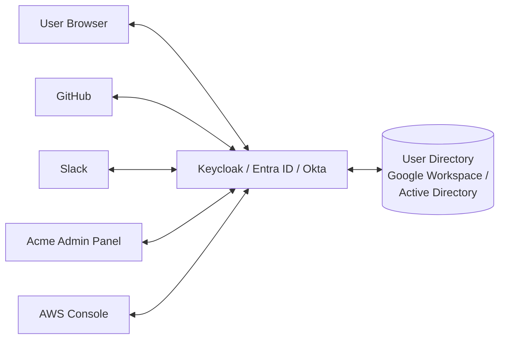

# 🏢 Federation + SSO + Identity Providers

> **Tác giả:** Mr.Rom\
> **Phiên bản:** v1.0.0\
> **Tạo lúc:** 24/05/2026\
> **Cập nhật:** 24/05/2026\
> **Level:** Basic (bài 04/5)\
> **Tags:** [MUST-KNOW]\
> **Thời lượng đọc:** ~22 phút\
> **Prerequisites:** Bài [03_jwt-and-sessions-deep](03_jwt-and-sessions-deep.md) ✅

> 🎯 *Bài 04 (cuối basic). Enterprise identity: **SAML 2.0** (legacy nhưng vẫn dominant trong enterprise) + **OIDC SSO** + **SCIM** (provisioning) + IdP setup (Keycloak, Entra ID, Okta) + Just-in-Time provisioning + **break-glass account** + audit. Hands-on Keycloak self-host + SAML/OIDC SSO Acme Shop admin. Đóng cluster Authentication basic.*

## 🎯 Sau bài này bạn sẽ

- [ ] Phân biệt **SAML 2.0** vs **OIDC** — khi nào enterprise pick cái nào
- [ ] Setup **Keycloak** self-host làm IdP
- [ ] Integrate Acme Shop admin SSO với **Google Workspace** (OIDC)
- [ ] SAML integration với **Okta / Entra ID / OneLogin**
- [ ] **SCIM** auto-provision user (create/update/deactivate from IdP)
- [ ] **JIT** (Just-In-Time) provisioning
- [ ] **Break-glass account** — emergency access khi IdP down
- [ ] Federated identity architecture cho 100+ employee
- [ ] Đóng cluster Authentication basic

---

## Tình huống — Acme Shop scale 50 → 500 employee

Sếp:

> *"6 tháng tới, công ty mở rộng lên 500 người. Mỗi người có laptop, GitHub, Jira, Slack, Notion, AWS, GCP, các tool nội bộ. Không thể manual create account mỗi tool. Cần SSO + auto-provisioning. Bạn architect."*

Bạn cần:
- 1 nơi quản identity (IdP).
- Đăng nhập 1 lần, dùng mọi tool (SSO).
- Auto-create account khi onboard, auto-disable khi offboard.
- Break-glass cho khi IdP down.
- Audit log + compliance SOC2.

Bài này map.

---

## 1️⃣ SSO architecture

🪞 **Ẩn dụ**: *SSO như **thẻ employee chung** — 1 thẻ vào mọi tòa nhà (tool). Mất thẻ = lock 1 lần, không phải lock từng cửa. IdP là **central security office** issue + revoke thẻ.*

### Architecture



### Components

| Component | Role |
|---|---|
| **User directory** | Source of truth: list employee, group, role (Active Directory, Google Workspace, Workday HR) |
| **IdP** (Identity Provider) | Authenticate user + issue assertion/token to apps |
| **SP** (Service Provider) | App that delegate auth to IdP (GitHub, Slack, Acme) |
| **SSO protocol** | SAML 2.0 / OIDC / OAuth |
| **Provisioning** | Auto-create user in SP when added to IdP (SCIM / JIT) |
| **Audit log** | All auth events (login, role change, ...) |

---

## 2️⃣ SAML 2.0 vs OIDC

### Compare

| Aspect | SAML 2.0 (2005) | OIDC (2014) |
|---|---|---|
| Format | XML | JSON (JWT) |
| Transport | HTTP-POST, HTTP-Redirect | HTTP-GET, HTTP-POST |
| Token | SAML Assertion (signed XML) | ID Token (JWT) |
| Complexity | High (XML signature, encryption, canonicalization) | Lower |
| Adoption | Enterprise dominant | Modern + mobile + API |
| Mobile-friendly | Poor | Good |
| Stateful | Often (cookie at IdP) | Stateless tokens |
| Backwards compat | Wide enterprise | Growing |

### When to use which

| Need | Pick |
|---|---|
| Modern app (web/mobile/SPA) | **OIDC** |
| Enterprise legacy app | **SAML** (often mandatory) |
| Both audiences | IdP support BOTH (Keycloak, Okta, Auth0) |
| Greenfield 2026 | **OIDC** preferred |
| Workday HR / Salesforce / SAP / Old enterprise | **SAML** (often only option) |

### SAML flow (simplified)

```mermaid
sequenceDiagram
    participant U as User
    participant SP as Service Provider
    participant IdP as Identity Provider

    U->>SP: Access protected resource
    SP->>U: 302 redirect with SAML AuthnRequest (signed XML)
    U->>IdP: GET /sso/saml with AuthnRequest
    IdP->>U: Login (if not already)
    U->>IdP: Credentials
    IdP->>U: HTML form auto-submit with SAML Response (signed XML) to SP
    U->>SP: POST /sso/acs with SAML Response
    SP: Verify signature, extract user + attributes
    SP->>U: Authenticated session
```

### SAML pitfalls

- **XML canonicalization** (c14n) — must match between IdP + SP.
- **Signature validation** — entire assertion must be verified.
- **XML signature wrapping attack** — assertion injected with multiple signatures.
- **Replay** — assertion has `NotOnOrAfter`, but no nonce; verifier must check unique ID.

→ Use **mature library** (python-saml, pysaml2). Don't roll own.

### OIDC flow (recall bài 02)

```
User → SP → Redirect to IdP → Login → Redirect to SP with code
→ SP exchange code for tokens → Verify ID token → Session
```

Simpler, JSON-based, mobile-friendly.

---

## 3️⃣ Keycloak — Self-host IdP

🪞 **Ẩn dụ**: *Keycloak như **văn phòng bảo vệ trung tâm** cho công ty bạn — bạn tự xây + kiểm soát, không phụ thuộc Auth0 ($$$). Có Realm (chia tổ chức), Client (apps), Role/Group, User Federation (LDAP/AD).*

### Why Keycloak

- **OSS** (Red Hat).
- Support **OIDC + SAML + OAuth 2.0** ra-of-the-box.
- LDAP/AD federation (sync user from existing directory).
- Built-in MFA, social login, password policy, audit.
- Production-grade scale.

### Setup (Docker)

```bash
docker run -d --name keycloak \
    -p 8080:8080 \
    -e KEYCLOAK_ADMIN=admin \
    -e KEYCLOAK_ADMIN_PASSWORD=admin-strong \
    -e KC_DB=postgres \
    -e KC_DB_URL=jdbc:postgresql://postgres/keycloak \
    -e KC_DB_USERNAME=keycloak \
    -e KC_DB_PASSWORD=... \
    quay.io/keycloak/keycloak:25.0 \
    start --optimized
```

For production: behind nginx/HAProxy with TLS, Postgres backing, multi-instance.

### Concepts

| Term | Meaning |
|---|---|
| **Realm** | Tenant boundary (e.g., `acmeshop-employees`, `acmeshop-customers`) |
| **Client** | App that integrate (e.g., `acme-admin-panel`, `github`, `slack`) |
| **User** | Member of realm |
| **Role** | RBAC role assignable to user/group |
| **Group** | User collection (e.g., `engineering`, `marketing`) |
| **Identity Provider** (inside Keycloak) | External IdP for federation (Google, Microsoft) |
| **User Federation** | Sync from LDAP/AD |

### Setup admin SSO for Acme Shop

#### 1. Create realm

```
Admin Console → Add realm → name: acmeshop-internal
```

#### 2. Federate from Google Workspace

```
Identity Providers → Add provider → OpenID Connect v1.0
  Alias: google-workspace
  Display name: Google
  Authorization URL: https://accounts.google.com/o/oauth2/v2/auth
  Token URL: https://oauth2.googleapis.com/token
  Client ID: <google client id>
  Client Secret: <google client secret>
  Default scopes: openid email profile
```

#### 3. Map Google claims to user

```
Identity Providers → google-workspace → Mappers
  - Add mapper: email → email
  - Add mapper: name → name
  - Add mapper: hd (hosted domain) check = acmeshop.vn (restrict to company domain)
```

#### 4. Create client for Acme Admin Panel

```
Clients → Create
  Client ID: acme-admin
  Client protocol: openid-connect
  Root URL: https://admin.acmeshop.vn

Settings:
  Access Type: confidential
  Standard Flow: ON
  Direct Access Grants: OFF (no ROPC)
  Valid Redirect URIs: https://admin.acmeshop.vn/auth/callback
  Web Origins: https://admin.acmeshop.vn

Credentials tab:
  Secret: <copy this>
```

#### 5. Admin Panel code

```python
# Same as bài 02 OIDC pattern, but with Keycloak as IdP
oauth.register(
    name="keycloak",
    server_metadata_url="https://auth.acmeshop.vn/realms/acmeshop-internal/.well-known/openid-configuration",
    client_id="acme-admin",
    client_secret=KEYCLOAK_SECRET,
    client_kwargs={"scope": "openid email profile"},
)
```

Now: admin click login → redirect to Keycloak → Keycloak redirect to Google → Google login → back to Keycloak (Keycloak creates/updates user) → redirect to Admin Panel with code → exchange for tokens.

→ **Benefit**: Admin Panel never sees Google directly. Keycloak abstract — tomorrow switch to Entra ID = 0 code change in Admin Panel.

---

## 4️⃣ SCIM — User provisioning

🪞 **Ẩn dụ**: *SCIM như **HR system kết nối tất cả tool** — onboard nhân viên: HR thêm tên → mọi tool tự create account; offboard: HR đánh dấu nghỉ → mọi tool tự disable.*

### SCIM (System for Cross-domain Identity Management) RFC 7643/7644

- REST API standard cho user/group sync.
- Endpoint: `/scim/v2/Users`, `/scim/v2/Groups`.
- Operations: Create, Read, Update, Delete (CRUD).

### Flow

```
IdP (Okta) ─SCIM─→ Slack
                ─SCIM─→ GitHub
                ─SCIM─→ AWS Identity Center
                ─SCIM─→ Acme Admin Panel
```

When user added to "Engineering" group in Okta → Okta SCIM POST to each SP → SP create/update user.

### Acme Admin Panel SCIM endpoint

```python
@app.post("/scim/v2/Users")
def scim_create_user(payload: dict, _auth = Depends(scim_auth)):
    user = User(
        email=payload["emails"][0]["value"],
        name=payload["name"]["givenName"] + " " + payload["name"]["familyName"],
        active=payload.get("active", True),
        external_id=payload["externalId"],  # IdP-side ID
    )
    db.save(user)
    return scim_response(user)

@app.patch("/scim/v2/Users/{user_id}")
def scim_update_user(user_id: str, ops: dict, _auth = Depends(scim_auth)):
    user = db.get_user(user_id)
    for op in ops["Operations"]:
        if op["op"] == "replace" and op["path"] == "active":
            user.active = op["value"]
            if not user.active:
                # User deactivated → revoke all sessions + tokens
                invalidate_all_sessions(user.id)
                revoke_all_refresh_tokens(user.id)
    db.save(user)

@app.delete("/scim/v2/Users/{user_id}")
def scim_delete_user(user_id: str, _auth = Depends(scim_auth)):
    user = db.get_user(user_id)
    user.deleted_at = datetime.utcnow()
    invalidate_all_sessions(user.id)
    revoke_all_refresh_tokens(user.id)
    db.save(user)
```

### Authentication

SCIM endpoint protected with Bearer token (long-lived service token from IdP).

```python
def scim_auth(authorization: str = Header(...)):
    if authorization != f"Bearer {SCIM_TOKEN}":
        raise HTTPException(401)
```

---

## 5️⃣ JIT (Just-In-Time) provisioning

Alternative to SCIM: create user **on first login** via SSO.

```python
@app.get("/auth/callback")
def callback(request):
    user_info = verify_oidc_token(token)

    # JIT: create on first login
    user = db.find_by_email(user_info["email"])
    if not user:
        user = db.create_user(
            email=user_info["email"],
            name=user_info["name"],
            external_id=user_info["sub"],
            roles=infer_roles_from_groups(user_info.get("groups", [])),
        )
    else:
        # Update from latest claims
        user.name = user_info["name"]
        user.roles = infer_roles_from_groups(user_info.get("groups", []))
        db.save(user)

    return create_session(user)
```

### SCIM vs JIT

| Aspect | SCIM | JIT |
|---|---|---|
| Trigger | IdP push (on user create/update) | SP pull (on login) |
| Deactivation | Real-time | On next login attempt |
| Setup | Requires SCIM endpoint + IdP config | Just OIDC callback |
| Coverage | All users in IdP | Only users who logged in |
| Group sync | Real-time | At login time |

→ **Best**: combine. SCIM for lifecycle (deactivation real-time). JIT for incremental enrichment.

---

## 6️⃣ Break-glass account

🪞 **Ẩn dụ**: *Break-glass account như **chìa khóa dự phòng cất tủ kính** — chỉ đập kính khi cấp cứu (IdP down, key compromised, ...). Audit log mọi lần sử dụng.*

### Scenario

- Keycloak server crash → SSO không work → admin không vào được Console để fix.
- Need backup local admin account.

### Setup

- 2-3 local admin account (not in IdP).
- Strong password + hardware MFA (Yubikey).
- Stored in **physical safe** (or HashiCorp Vault).
- Use **only emergency**.
- **Heavy audit**: every login logged + alert.

### Audit

```python
@app.post("/auth/break-glass-login")
def bg_login(email, password, hardware_mfa):
    # ... verify
    audit_critical("break_glass_login", email, ip=request.client.host)
    notify_security_team("Break-glass account used: " + email)
    return session
```

→ Notify security team + executive immediately. Investigate why needed.

---

## 7️⃣ Audit + Compliance

### Audit log events

| Event | Log |
|---|---|
| User login (success/fail) | actor, ip, user_agent, mfa_used |
| MFA enable/disable | actor, factor_type |
| Password change | actor, ip |
| Role/permission change | actor, target, before, after |
| User create/disable/delete | actor (admin or SCIM), target |
| Break-glass | actor, reason |
| Session start/end | actor, sid, ip |
| SSO callback | actor, idp, claims |

### Storage

- **WORM** (Write Once Read Many): S3 Object Lock / GCS Retention Policy.
- Retention: 1+ year (SOC2), 6+ year (SOX), 10 năm (HIPAA).
- Forward to SIEM (Splunk, Elastic, Datadog).

### Compliance frameworks 2026

| Framework | Auth requirement |
|---|---|
| **SOC2 Type II** | MFA for prod access, audit log, password policy, periodic access review |
| **PCI DSS 4.0** | MFA for cardholder env, strong password, regular review |
| **HIPAA** | Audit log retention, encryption, access control |
| **GDPR** | Data minimization, right to erasure |
| **ISO 27001** | Access control policy, periodic review |
| **FedRAMP** (US gov) | Strict CAC/PIV smartcard for fed agency |

---

## 🛠️ Hands-on — Acme Shop full SSO stack

### Architecture

```
Google Workspace (HR source) ──→ Keycloak (IdP)
                                  │
                  ┌───────────────┼────────────────┐
                  ↓               ↓                ↓
              GitHub          Slack          Acme Admin Panel
              (SCIM)          (OIDC)         (OIDC + SCIM)
```

### Steps

1. **Keycloak setup** (section 3).
2. **Realm** `acmeshop-internal` + federate Google.
3. **Group sync**: Google group `eng-team` → Keycloak group → SP role.
4. **Clients**:
   - `acme-admin` (OIDC, callback https://admin.acmeshop.vn/auth/callback)
   - `slack` (SAML, callback Slack's ACS)
   - `github-enterprise` (SAML)
5. **SCIM**:
   - Enable Keycloak SCIM client.
   - Configure each SP's SCIM endpoint.
6. **Break-glass**: local admin Keycloak with Yubikey.
7. **Audit**: Keycloak event log → Loki / Splunk.

### Verify

```bash
# Onboard new employee in Google Workspace
# Wait 30 sec
# Check Acme Admin Panel users table → user created automatically
# Check Slack → user invited automatically
# Check GitHub → user member of team automatically

# Offboard:
# Remove from Google Workspace
# Wait 30 sec
# Verify: cannot login Acme Admin / Slack / GitHub
```

---

## 🏆 Cluster wrap-up — Authentication basic ĐÓNG

| Bài | Coverage | Output |
|---|---|---|
| 00 | Foundation: AuthN/AuthZ + factors + session vs token | Auth spec template |
| 01 | Password + MFA deep | Argon2 migration + Passkey end-to-end |
| 02 | OAuth 2.1 + OIDC | Google + Apple login + account linking |
| 03 | JWT + Sessions deep | Production token system + key rotation + family detection |
| 04 | Federation + SSO + IdP | Keycloak self-host + SCIM + JIT + break-glass |

→ **5 bài, ~110p đọc, ~15-20h hands-on**. Production-ready auth design + implement.

Next:
- **Intermediate cluster**: federated identity advanced, FIDO2 enterprise, zero-trust auth.
- **Sibling clusters**: authorization (RBAC/ABAC), cryptography (algorithms deep), tls-ssl (TLS deep), compliance (SOC2/PCI/HIPAA/GDPR audit prep).

---

## ⚠️ Pitfalls

### 1. SAML signature wrapping

**Fix**: Use library (python-saml, pysaml2) — verifies entire response, not just sub-element.

### 2. SAML replay

**Fix**: Track Assertion ID in DB short-term, reject duplicate.

### 3. Open redirect after SSO callback

**Fix**: Validate post-login redirect URL allowlist.

### 4. SCIM no auth

**Fix**: Bearer token from IdP only; IP allowlist optionally.

### 5. JIT create user no role/group

**Fix**: Map IdP groups → SP roles immediately, not "user with no permission".

### 6. Break-glass account no MFA

**Fix**: Strong hardware MFA (Yubikey); 2-person access (split secret).

### 7. Federate Google but no domain restriction

**Fix**: `hd=acmeshop.vn` check; otherwise any Google account can login.

### 8. IdP single point of failure

**Fix**: HA Keycloak (multi-instance + DB cluster); break-glass for full IdP outage.

---

## 🎯 Self-check

- [ ] SAML vs OIDC — pick cho 4 scenario?
- [ ] Keycloak realm/client/group setup cho admin SSO?
- [ ] SCIM endpoint Acme Panel — implement CRUD?
- [ ] JIT provisioning vs SCIM — combine?
- [ ] Break-glass account: 4 element bảo vệ?
- [ ] Audit log: 10 events must log?
- [ ] Compliance: SOC2 vs PCI vs HIPAA auth requirement?
- [ ] Full SSO architecture diagram cho 500 employee?

---

## 📚 Glossary

| Term | Vietnamese / Explanation |
|---|---|
| **SSO** | Single Sign-On |
| **IdP** | Identity Provider |
| **SP** | Service Provider |
| **SAML** | Security Assertion Markup Language (XML) |
| **Assertion** | SAML token containing user info |
| **ACS** | Assertion Consumer Service (SP's SAML endpoint) |
| **OIDC** | OpenID Connect |
| **SCIM** | System for Cross-domain Identity Management |
| **JIT provisioning** | Create user on first login |
| **Keycloak** | Red Hat OSS IdP |
| **Realm** | Tenant in Keycloak |
| **Client** | App registered in IdP |
| **Federation** | Trust between IdP and source (LDAP/AD/Google) |
| **Active Directory (AD)** | Microsoft directory service |
| **LDAP** | Lightweight Directory Access Protocol |
| **Break-glass** | Emergency local account |
| **WORM storage** | Write Once Read Many (compliance) |
| **SIEM** | Security Information and Event Management |
| **Identity Federation** | Cross-IdP trust |
| **Workforce Identity** | Employee identity |
| **Customer Identity (CIAM)** | Consumer-facing auth |

---

## 🔗 Liên kết & Tài nguyên

### Trong cluster
- ↶ Trước: [03_jwt-and-sessions-deep](03_jwt-and-sessions-deep.md)
- ↑ Cluster Authentication: [authentication README](../../README.md)
- ↑ 12_security: [README](../../../README.md)

### Cross-reference
- 🛡️ [OWASP A07](../../../owasp-top-10/lessons/01_basic/04_auth-failures-logging-and-ssrf.md)
- 🔑 [authorization](../../../authorization/)
- 🎓 [compliance](../../../compliance/)

### Tài nguyên ngoài (2026)
- 📖 [SAML 2.0 spec](https://docs.oasis-open.org/security/saml/v2.0/saml-core-2.0-os.pdf)
- 📖 [OIDC spec](https://openid.net/connect/)
- 📖 [SCIM RFC 7643/7644](https://datatracker.ietf.org/doc/html/rfc7643)
- 📖 [Keycloak docs](https://www.keycloak.org/docs/latest/)
- 📖 [Authentik](https://goauthentik.io/)
- 📖 [Authelia](https://www.authelia.com/)
- 📖 [Casdoor](https://casdoor.org/)
- 📖 [Ory Kratos/Hydra](https://www.ory.sh/)
- 📖 [Auth0 docs](https://auth0.com/docs)
- 📖 [Entra ID (Azure AD)](https://learn.microsoft.com/azure/active-directory/)
- 📖 [Okta docs](https://developer.okta.com/docs/)
- 📖 [WorkOS](https://workos.com/) — B2B SSO/SCIM
- 📖 [python-saml](https://github.com/onelogin/python3-saml)
- 📖 [pysaml2](https://github.com/IdentityPython/pysaml2)
- 📖 [SAML XML Signature Wrapping](https://web.archive.org/web/20180214090802/https://www.usenix.org/legacy/event/sec12/tech/full_papers/Mainka.pdf) — security paper

---

## 📌 Changelog

- **v1.0.0 (24/05/2026)** — Bản đầu tiên. Bài 04 (cuối basic) Authentication. SAML vs OIDC + Keycloak self-host setup + federation Google + Client/Realm/Group/Role + SCIM provisioning + JIT + break-glass account + audit log + compliance frameworks + 500-employee SSO architecture hands-on + 8 pitfalls. **Đóng Authentication basic cluster 5/5.**
