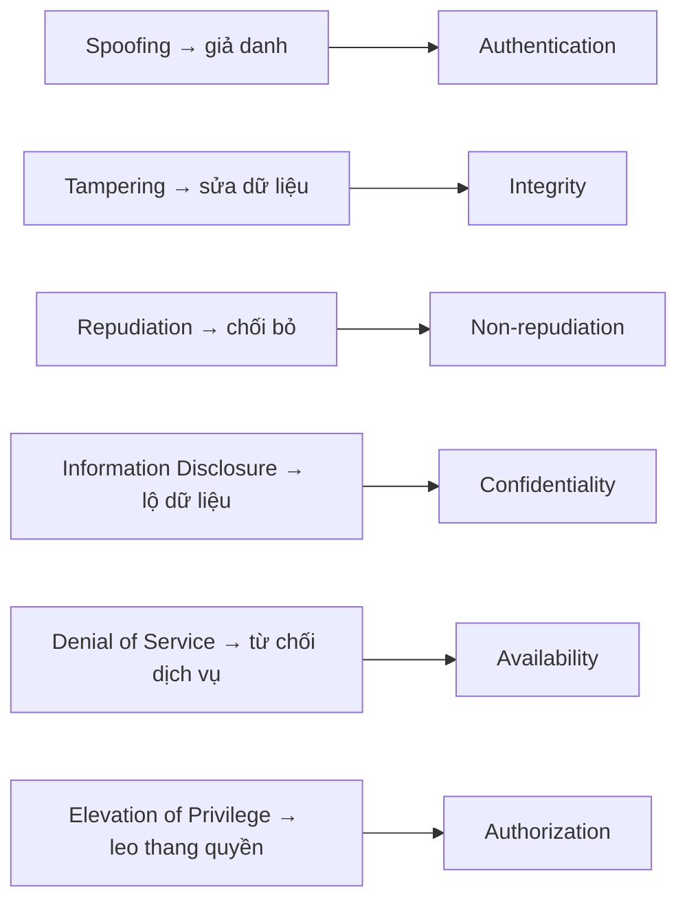
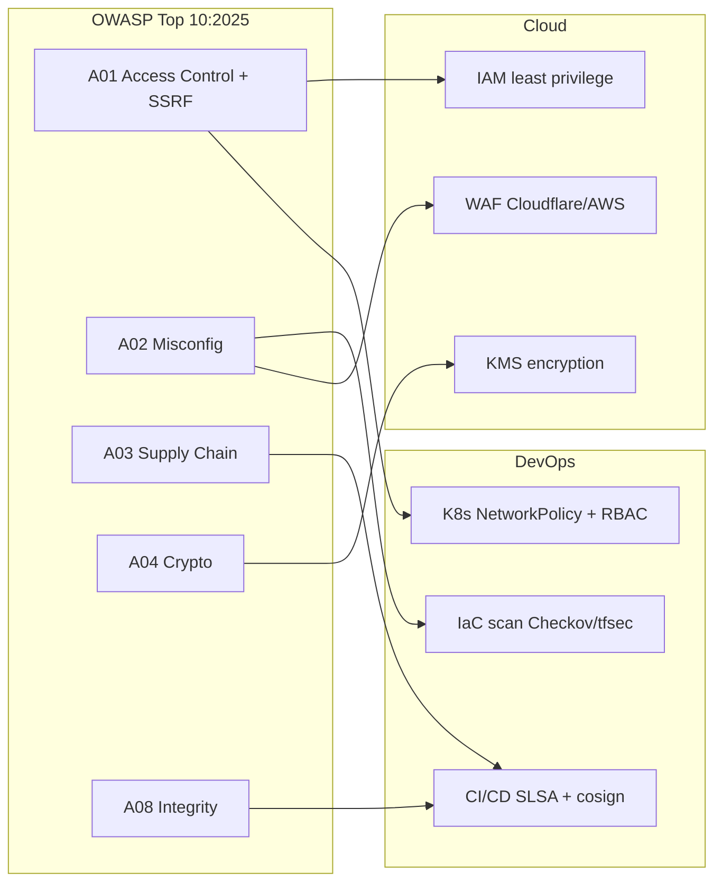
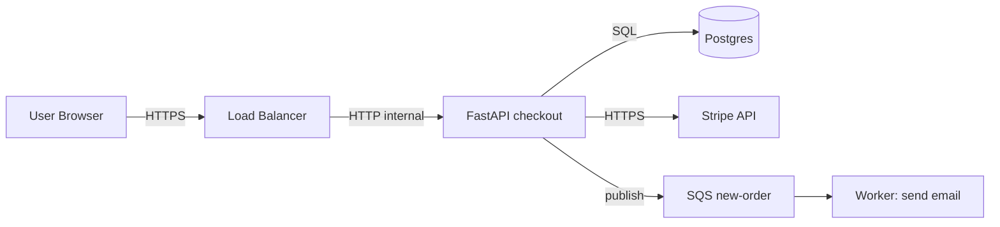

# 🛡️ OWASP Top 10 + Application Security cơ bản

> **Tác giả:** Mr.Rom\
> **Phiên bản:** v2.0.1\
> **Tạo lúc:** 24/05/2026\
> **Cập nhật:** 10/06/2026\
> **Level:** Basic (bài 00/5)\
> **Tags:** [MUST-KNOW]\
> **Yêu cầu trước:** Đã viết được app web cơ bản (FastAPI hoặc Node), hiểu HTTP request/response

> 🎯 *Bài đầu tiên của OWASP cluster. Bạn đã build app, đẩy ra production — câu hỏi tiếp theo: app này có bị hack không? Bài này dạy: OWASP là gì, vì sao Top 10, threat modeling cơ bản (STRIDE), defense-in-depth, security mindset. Không deep từng vuln (bài 01-04 sẽ làm).*

## 🎯 Sau bài này bạn sẽ

- [ ] Hiểu **OWASP** là gì, tại sao Top 10 quan trọng
- [ ] Đọc 1 lượt **A01-A10 (OWASP Top 10:2025 — bản hiện hành)** + mapping từ 2021
- [ ] Biết **threat modeling STRIDE** + **DREAD scoring**
- [ ] Áp dụng **defense-in-depth** thay vì single-layer security
- [ ] Phân biệt **OWASP Top 10** (app sec) vs **API Security Top 10** vs **Mobile Top 10**
- [ ] Có **security mindset**: assume breach, principle of least privilege
- [ ] Biết roadmap học 4 bài kế tiếp + chỗ kết nối với DevOps + Cloud

---

## Tình huống — App bạn vừa được pentest

Bạn deploy Acme Shop production 3 tháng. Sếp giao:

> *"Tuần sau team pentest external sẽ test app trong 1 tuần. Mình gửi bạn report. Bạn fix tất cả Critical + High trước Q3 audit. CFO yêu cầu zero Critical lên prod."*

Bạn nhận report 30 trang, đếm:
- 8 Critical (đa số là SQL Injection + Broken Access Control)
- 15 High (XSS, SSRF, weak crypto, exposed admin panel)
- 30 Medium (security headers thiếu, info disclosure, ...)

Bạn ngợp:
- "Từng cái cụ thể là gì?"
- "Cái nào fix trước?"
- "Làm sao chống được lần sau?"
- "Có framework học bài bản không?"

→ **OWASP Top 10** là framework đó. Bài này map đường.

---

## 1️⃣ OWASP — Foundation + Project

🪞 **Ẩn dụ**: *OWASP như **CDC y tế cộng đồng cho web** — track "dịch bệnh" (vulnerability) phổ biến nhất, công bố hằng năm, đề xuất "phác đồ phòng bệnh" (mitigation). Top 10 là **danh sách bệnh truyền nhiễm nhất** mà mọi bác sĩ (dev) đều phải biết.*

### OWASP là gì

**OWASP** = Open Worldwide Application Security Project, foundation non-profit thành lập 2001, dùng để:
- **Educate** community dev/security.
- **Publish** standards + tools (ZAP, Dependency-Check, ASVS).
- **Maintain projects**: Top 10, Cheat Sheets, Web Security Testing Guide (WSTG), Mobile Security Testing Guide (MSTG), API Security Top 10.

### Tại sao Top 10

Cộng đồng dev không cần biết 500 vulnerability — biết **10 cái phổ biến nhất** chiếm > 80% sự cố thật. Top 10 là **prioritization framework** — fix 10 trước, sau đó mới quan tâm 11+.

### Releases history

| Year | Notable changes |
|---|---|
| 2003 | First Top 10 |
| 2017 | A07 XSS demoted; XXE A4 |
| 2021 | A04 Insecure Design (new), A08 Software/Data Integrity (new), Injection demoted A1→A3 |
| **2025** (8th installment, final) | A02 Security Misconfiguration lên #2; **A03 Software Supply Chain Failures** (MỚI, mở rộng từ Vulnerable & Outdated Components); Injection rớt xuống A05; Insecure Design xuống A06; **A10 Mishandling of Exceptional Conditions** (MỚI); SSRF (cũ A10) gộp vào A01 |

→ **2026 reality**: dùng **OWASP Top 10:2025** — đây là **bản hiện hành (final release)**, công bố cuối 2025 tại Global AppSec DC. Bài 2021 đã lỗi thời. Toàn bộ bài này (và cả cluster) viết theo numbering + tên category 2025.

---

## 2️⃣ OWASP Top 10 — 2025 release (bản hiện hành)

### Một cái nhìn tổng

| Code | Category (2025) | Bài học ở |
|---|---|---|
| **A01** | Broken Access Control *(SSRF gộp vào đây)* | Bài 01 |
| **A02** | Security Misconfiguration | Bài 03 |
| **A03** | Software Supply Chain Failures *(MỚI)* | Bài 03 |
| **A04** | Cryptographic Failures | Bài 02 |
| **A05** | Injection (SQL, NoSQL, OS, LDAP) | Bài 01 |
| **A06** | Insecure Design | Bài 02 |
| **A07** | Authentication Failures | Bài 04 |
| **A08** | Software or Data Integrity Failures | Bài 03 |
| **A09** | Security Logging and Alerting Failures | Bài 04 |
| **A10** | Mishandling of Exceptional Conditions *(MỚI)* | Bài 04 |

> ⚡ **4 thay đổi then chốt 2025 so với 2021:**
> 1. **A02 Security Misconfiguration** nhảy lên #2 (2021 ở #5) — phản ánh độ phổ biến của cấu hình sai trên cloud/container.
> 2. **A03 Software Supply Chain Failures** là category **MỚI**, mở rộng từ "Vulnerable and Outdated Components" (A06:2021) — không chỉ thư viện lỗi thời mà cả build pipeline, registry, dependency confusion, typosquatting.
> 3. **Injection rớt xuống A05** (2021 ở A03) và **Insecure Design xuống A06** (2021 ở A04) — không phải vì hết nguy hiểm, mà do framework + ORM hiện đại đã chặn phần lớn injection cơ bản.
> 4. **A10 Mishandling of Exceptional Conditions** là category **MỚI** — xử lý lỗi/điều kiện ngoại lệ sai cách (nuốt exception, fail-open, leak stack trace, logic lỗi khi gặp input bất thường).
>
> Ngoài ra **SSRF không còn là category riêng** — nó được **gộp vào A01 Broken Access Control** (SSRF bản chất là server bị ép truy cập tài nguyên ngoài quyền hạn).

### Mapping 2021 ↔ 2025

| 2021 | 2025 | Ghi chú |
|---|---|---|
| A01 Broken Access Control | **A01** Broken Access Control | Giữ #1 + nuốt thêm SSRF |
| A02 Cryptographic Failures | **A04** Cryptographic Failures | Tụt 2 bậc |
| A03 Injection | **A05** Injection | Tụt 2 bậc |
| A04 Insecure Design | **A06** Insecure Design | Tụt 2 bậc |
| A05 Security Misconfiguration | **A02** Security Misconfiguration | Lên #2 |
| A06 Vulnerable and Outdated Components | **A03** Software Supply Chain Failures | Đổi tên + mở rộng phạm vi |
| A07 Identification and Authentication Failures | **A07** Authentication Failures | Rút gọn tên |
| A08 Software and Data Integrity Failures | **A08** Software or Data Integrity Failures | Giữ vị trí |
| A09 Security Logging and Monitoring Failures | **A09** Security Logging and Alerting Failures | Đổi "Monitoring" → "Alerting" |
| A10 Server-Side Request Forgery (SSRF) | *(gộp vào A01)* | Không còn category riêng |
| *(không có)* | **A10** Mishandling of Exceptional Conditions | Category MỚI |

### Real-world examples

| Vuln (2025) | Famous incident |
|---|---|
| A01 Broken Access Control | Facebook 2019 — view-as feature exposed 50M tokens |
| A01 (SSRF) | Capital One 2019 — SSRF qua metadata endpoint → 100M records |
| A02 Misconfiguration | Capital One 2019 — AWS WAF misconfigured (mở đường cho SSRF ở trên) |
| A03 Supply Chain | log4shell 2021 (log4j CVE-2021-44228); SolarWinds 2020; 3CX 2023 |
| A04 Crypto Failures | Equifax 2017 — patched Apache Struts late, weak encryption |
| A05 Injection | Magento 2015 — SQL Injection $200M loss e-commerce |
| A06 Insecure Design | Uber 2016 — password reset not in MFA design |
| A07 Auth Failures | Twitter 2020 — admin tool no MFA → high-profile hijack |
| A08 Integrity Failures | SolarWinds 2020 — build pipeline bị chèn malware |
| A09 Logging Failures | Target 2013 — alert bị ignore → 40M card data leaked |
| A10 Mishandling Exceptions | Nhiều vụ leak stack trace + fail-open trên login/payment |

→ Mỗi vuln đã có nạn nhân nổi tiếng. Top 10 không phải "academic" — là **lịch sử thật**.

---

## 3️⃣ Threat modeling — STRIDE + DREAD

🪞 **Ẩn dụ**: *Threat modeling như **kế hoạch chống trộm nhà**: STRIDE là **6 loại trộm có thể vào** (cửa chính, cửa sổ, trèo tường, ...); DREAD là **chấm điểm độ nguy hiểm** từng kẻ trộm (vào dễ không, gây thiệt hại bao nhiêu).*

### STRIDE — 6 categories Microsoft 1999

| Letter | Threat | Ví dụ |
|---|---|---|
| **S** | Spoofing identity | Giả danh user, MITM attack |
| **T** | Tampering with data | Sửa request body, sửa cookie |
| **R** | Repudiation | User chối "tôi không làm vậy" |
| **I** | Information disclosure | Leak data nhạy cảm (token, PII) |
| **D** | Denial of service | DDoS, resource exhaustion |
| **E** | Elevation of privilege | User thường → admin |

Mỗi chữ cái trong STRIDE tấn công đúng vào một thuộc tính bảo mật. Sơ đồ dưới đây map từng mối đe doạ sang thuộc tính mà nó phá vỡ:



Nhìn theo cách này, STRIDE chính là mặt trái của 6 thuộc tính bảo mật cần bảo vệ — chống lại mối đe doạ nào tức là củng cố thuộc tính tương ứng.

### DREAD scoring — 5 dimensions

| Letter | Question | Scale |
|---|---|---|
| **D**amage | Bao nhiêu thiệt hại? | 1-10 |
| **R**eproducibility | Tái hiện dễ không? | 1-10 |
| **E**xploitability | Khai thác cần skill gì? | 1-10 |
| **A**ffected users | Bao nhiêu user bị ảnh hưởng? | 1-10 |
| **D**iscoverability | Tìm thấy dễ không? | 1-10 |

→ Risk score = trung bình. Score > 7 → Critical, > 5 → High, > 3 → Medium.

### Threat modeling workflow

```
1. Inventory: liệt kê asset (user data, API, DB, ...)
2. Diagram: vẽ data flow (DFD)
3. Identify threats: với mỗi data flow, apply STRIDE → 6 threat
4. Rate: DREAD score
5. Mitigate: design control cho threat cao
6. Validate: review periodic + sau major change
```

### Tool

- **OWASP Threat Dragon** (free, web-based)
- **Microsoft Threat Modeling Tool** (free Windows)
- **IriusRisk** (commercial)
- **pytm** (Python-based, code as model)

---

## 4️⃣ Defense-in-Depth

🪞 **Ẩn dụ**: *Defense-in-Depth như **lớp phòng thủ thành cổ** — hào nước + tường thành + cửa sắt + lính gác + thư phòng vua đều khóa. Hacker vượt 1 lớp vẫn còn 4 lớp. Single-layer là **chỉ có 1 cánh cửa** — đột nhập 1 lần là vào.*

### Anti-pattern: single-layer

```
Internet → Firewall → App → DB
            (chỉ 1 lớp)
```

Nếu firewall bypass → app naked → DB exposed.

### Pattern: defense-in-depth (5+ lớp)

```
Internet
  → CDN (DDoS, rate limit, WAF managed)
  → Cloud Load Balancer (TLS, network ACL)
  → WAF (OWASP CRS, custom rules)
  → API Gateway (auth, rate limit per user, schema validation)
  → App (input validation, output encoding, parameterized query)
  → ORM (prepared statement)
  → DB (least privilege user, encryption at rest, audit log)
  → Backup (encrypted, offline copy)
```

→ 8 lớp. Hacker phải bypass nhiều lớp.

### Principles cốt lõi

| Principle | Mô tả |
|---|---|
| **Least Privilege** | User/service chỉ có quyền tối thiểu cần làm việc |
| **Separation of Duties** | Tách hành động critical thành nhiều người duyệt |
| **Fail-Safe Defaults** | Mặc định deny; explicit allow |
| **Complete Mediation** | Mỗi access đều check (không cache permission) |
| **Open Design** | Security qua design tốt, không qua obscurity |
| **Psychological Acceptability** | UX không cản trở user (MFA mượt) |
| **Assume Breach** | Thiết kế giả sử đã bị xâm nhập (zero trust) |

---

## 5️⃣ OWASP families — Top 10, API, Mobile, Cloud, LLM

OWASP không chỉ có 1 Top 10. **Web Top 10** là phổ biến nhất, nhưng còn:

| Project | Phạm vi | Khi nào học |
|---|---|---|
| **Top 10 (Web)** | Traditional web app | **Mọi dev backend/full-stack** |
| **API Security Top 10** | REST/GraphQL API | Backend dev xây API |
| **Mobile Top 10** | iOS/Android | Mobile dev |
| **Cloud-Native Security Top 10** | K8s, container, cloud | DevOps/Platform |
| **LLM Top 10** (2024+ new) | AI/LLM app | AI engineer |
| **Serverless Top 10** | FaaS-specific | Serverless dev |

### API Security Top 10 (2023 release) — đáng học cùng

| Code | Category |
|---|---|
| **API1** | Broken Object Level Authorization (BOLA) — same A01 |
| **API2** | Broken Authentication |
| **API3** | Broken Object Property Level Authorization (mass assignment) |
| **API4** | Unrestricted Resource Consumption (DoS) |
| **API5** | Broken Function Level Authorization |
| **API6** | Unrestricted Access to Sensitive Business Flows |
| **API7** | Server-Side Request Forgery |
| **API8** | Security Misconfiguration |
| **API9** | Improper Inventory Management (shadow API) |
| **API10** | Unsafe Consumption of APIs (3rd-party) |

→ Backend dev nên đọc cả 2 list.

### LLM Top 10 (2024)

| Code | Category |
|---|---|
| LLM01 | Prompt Injection |
| LLM02 | Insecure Output Handling |
| LLM03 | Training Data Poisoning |
| LLM04 | Model DoS |
| LLM05 | Supply Chain Vulnerabilities |
| LLM06 | Sensitive Information Disclosure |
| LLM07 | Insecure Plugin Design |
| LLM08 | Excessive Agency |
| LLM09 | Overreliance |
| LLM10 | Model Theft |

→ Đọc khi build AI/agent app.

---

## 6️⃣ Security mindset — "Assume Breach"

🪞 **Ẩn dụ**: *Security mindset như **bác sĩ ER**: không hỏi "có bệnh không", mà hỏi "**bệnh gì**". Hacker assume bạn đã có vuln; bạn assume hacker sẽ tìm thấy. Câu hỏi đúng: "**bao lâu mới phát hiện**" + "**ngăn đến đâu được**".*

### Mindset shift

| Mindset cũ | Mindset mới (2026) |
|---|---|
| "App tôi an toàn vì có firewall" | "App tôi đã bị tấn công — chỉ chưa biết" |
| "User trust" | "Zero trust: verify always" |
| "Security sau, ship feature trước" | "Security từ design (shift-left)" |
| "Fix khi pen-test báo" | "Continuous scanning + automated" |
| "Compliance là đủ" | "Compliance là minimum; defense in depth real" |

### Shift-left security

```
Plan → Design → Develop → Build → Test → Deploy → Operate
  ↑       ↑        ↑        ↑       ↑       ↑        ↑
  Threat  Threat   IDE      SAST    DAST    IaC      Runtime
  model   model    plugin   in CI   in CI   scan     monitor
                   (Snyk    (Semgrep)       (Checkov)(Falco)
                    Code)
```

→ Bug security tìm sớm rẻ 100x so với fix sau prod.

### Cost of bug — Theo IBM 2024 report

| Stage detect | Cost relative |
|---|---|
| Design | 1x |
| Code | 5x |
| Test | 10x |
| Production | 100x |
| Post-breach | 1000x+ (data breach avg $4.88M global, IBM 2024) |

---

## 7️⃣ Roadmap 4 bài kế tiếp

| Bài | OWASP coverage (2025) | Trọng tâm |
| --- | --- | --- |
| **01** Access Control + Injection | A01, A05 | IDOR, RBAC/ABAC, SSRF (nay thuộc A01), SQLi (param query, ORM), XSS, CSRF |
| **02** Crypto + Secure Design | A04, A06 | Symmetric vs asymmetric, KDF (Argon2/bcrypt), TLS, JWT signing, secure design pattern |
| **03** Misconfig + Supply Chain + Integrity | A02, A03, A08 | Headers (CSP, HSTS, ...), CORS, vulnerable dep (npm/pip audit, Snyk, Dependabot), software supply chain (SLSA, cosign) |
| **04** Auth + Logging + Mishandling | A07, A09, A10 | Password policy, MFA, session, OAuth2/OIDC, logging + alerting, xử lý exception an toàn (fail-safe, không leak stack trace) |


---

## 8️⃣ Cross-reference — Kết nối với DevOps + Cloud



| OWASP (2025) | Bài cluster khác đã có |
|---|---|
| A04 Crypto | [TLS/HTTPS](../../../../05_networking/http-https/lessons/01_basic/04_https-tls.md) |
| A02 Misconfig | [Container security](../../../container-security/), [Docker security](../../../../10_devops/docker/lessons/02_intermediate/02_image-security-supply-chain.md) |
| A03 Supply Chain | [CI/CD supply chain](../../../../10_devops/ci-cd/lessons/02_intermediate/02_supply-chain-security.md) |
| A08 Integrity | [Cosign + SLSA](../../../../10_devops/ci-cd/lessons/02_intermediate/02_supply-chain-security.md) |
| A07 Auth | [FastAPI auth](../../../../07_web/backend/python-fastapi/lessons/01_basic/04_auth-and-middleware.md) |

→ **OWASP không đứng riêng** — là kim chỉ nam xuyên DevOps + Cloud + Web.

---

## 🛠️ Hands-on — Threat model Acme Shop checkout

### Mục tiêu

Áp STRIDE + DREAD cho luồng checkout, tạo threat list + priority.

### Bước 1 — Asset inventory

```
- User account (email, hashed password, address)
- Cart (cart items, qty)
- Order (order_id, items, total, status)
- Payment (card token, transaction_id) — sensitive
- Admin panel (manage products, view all orders)
```

### Bước 2 — Data flow diagram (DFD)



### Bước 3 — STRIDE per flow

**Flow User → API** (POST /checkout):

| STRIDE | Threat | DREAD score | Mitigation |
|---|---|---|---|
| **S**poof | Attacker giả user khác bằng session hijack | D8 R7 E5 A6 D5 = 6.2 | TLS, secure cookie, session rotation |
| **T**amper | Sửa cart price trong request body | D9 R8 E7 A8 D6 = 7.6 | Server-side calc price, never trust client |
| **I**nfo | Response leak credit card | D9 R5 E3 A7 D6 = 6.0 | PCI tokenize; never log raw card |
| **D**oS | Bot spam checkout | D5 R9 E8 A4 D8 = 6.8 | Rate limit per user, Turnstile, WAF |
| **E**lev | Modify `is_admin` field | D10 R6 E5 A9 D5 = 7.0 | Server-side authorization check |

### Bước 4 — Prioritize

Threats score > 7 (Critical): **Tamper cart price**, **Elevate is_admin**.

### Bước 5 — Implement mitigations + verify

```python
# Anti-pattern: trust client
@app.post("/checkout")
def checkout(cart: CartIn, user: User = Depends(current_user)):
    total = cart.total  # ❌ client-provided
    return Order(user_id=user.id, total=total)

# Pattern: server-side recompute
@app.post("/checkout")
def checkout(cart: CartIn, user: User = Depends(current_user)):
    items = db.query(Product).filter(Product.id.in_(cart.item_ids)).all()
    total = sum(item.price * cart.qty[item.id] for item in items)  # ✅ server calc
    if user.is_admin and cart.discount_pct > 10:  # ❌ if check admin
        raise HTTPException(403)
    # Better: middleware authorize role
```

→ Output: 2 critical fixed, document threat model cho team.

---

## 💡 Cạm bẫy thường gặp & Best practice

### 1. "OWASP là đủ"

**Bẫy**: Fix Top 10 xong, nghĩ app secure 100%.

**Thực tế**: Top 10 chỉ phổ biến nhất. App vẫn có thể bị business logic flaw, race condition, ...

**Fix**: OWASP là baseline; thêm pen-test, bug bounty, threat model.

### 2. Security theater

**Bẫy**: Cài WAF rồi nghĩ xong. WAF chỉ block known pattern; bypass dễ.

**Fix**: WAF là 1 lớp; input validation server-side là chính.

### 3. Compliance không = security

**Bẫy**: Đạt SOC2 → tưởng safe.

**Thực tế**: Equifax pass SOC2 trước breach 2017.

**Fix**: Compliance minimum; security mindset + continuous testing.

### 4. Quá tin framework

**Bẫy**: "Django/Rails an toàn rồi" → không escape output thủ công → XSS trong template raw.

**Fix**: Đọc security guide của framework; manual review code.

### 5. Threat model 1 lần rồi quên

**Bẫy**: Threat model trong design phase, app evolve 6 tháng → model outdated.

**Fix**: Update threat model mỗi major change + quarterly review.

### 6. Bỏ qua secrets in code

**Bẫy**: Hardcode API key trong .py → commit Git public.

**Fix**: `gitleaks` pre-commit hook; secrets manager (Vault, AWS Secrets Manager).

### 7. Pen-test xong cất tủ

**Bẫy**: Report 30 trang đọc 1 lần → fix vài cái critical → ignore còn lại.

**Fix**: Tracking tool (Jira), SLA cho fix (Critical < 7 ngày, High < 30 ngày).

### 8. "Tôi không phải target"

**Bẫy**: "App nhỏ, không ai care".

**Thực tế**: 80% attack automated bot — scan tất cả IP.

**Fix**: Mọi app public Internet đều là target.

---

## 🧠 Tự kiểm tra (Self-check)

- [ ] Liệt kê A01-A10 OWASP Top 10:2025? (nhớ SSRF nay thuộc A01, A03 Supply Chain + A10 Mishandling là mới)
- [ ] STRIDE 6 categories + ví dụ mỗi cái?
- [ ] DREAD scoring cho 1 threat cụ thể?
- [ ] Defense-in-depth — 5+ lớp cho web app?
- [ ] Phân biệt OWASP Top 10 vs API Security Top 10?
- [ ] Shift-left security — 5 stage detect + cost relative?
- [ ] Threat model Acme Shop checkout — minimum 3 threat + mitigation?
- [ ] "Assume breach" mindset — 3 thay đổi trong design?

---

## 📚 Từ Điển Thuật Ngữ (Glossary)

| Term | Vietnamese / Explanation |
|---|---|
| **OWASP** | Open Worldwide Application Security Project — foundation security community |
| **Top 10** | Danh sách 10 vuln phổ biến nhất, refresh 3-4 năm. Bản hiện hành: **Top 10:2025** |
| **SSRF** | Server-Side Request Forgery — ép server gọi tài nguyên ngoài quyền hạn; từ 2025 **gộp vào A01** |
| **STRIDE** | 6 threat categories (Spoof/Tamper/Repudiate/Info/DoS/Elevate) |
| **DREAD** | 5-dimension scoring (Damage/Repro/Exploit/Affected/Discover) |
| **Threat modeling** | Process phân tích threat trong design phase |
| **Defense-in-depth** | Nhiều lớp security, không single point |
| **Shift-left** | Tích hợp security từ đầu design, không cuối cùng |
| **Assume breach** | Mindset giả định đã bị xâm nhập |
| **Zero trust** | Verify mọi access, không trust theo network position |
| **WAF** | Web Application Firewall — filter HTTP traffic |
| **SAST** | Static Application Security Testing — quét code |
| **DAST** | Dynamic Application Security Testing — test running app |
| **SCA** | Software Composition Analysis — dep vulnerability scan |
| **Pen-test** | Penetration test — simulate attack |
| **Bug bounty** | Reward chương trình tìm vuln |
| **CVE** | Common Vulnerabilities and Exposures — định danh vuln |
| **CVSS** | Common Vulnerability Scoring System — 0-10 |

---

## 🔗 Liên kết & Tài nguyên

### 🧭 Định hướng lộ trình học
- ➡️ **Bài tiếp theo:** [A01 Broken Access Control (+ SSRF) + A05 Injection](01_injection-and-access-control.md) *(sắp viết)*
- ↑ **Về cụm:** [OWASP README](../../README.md)

### 🧩 Các chủ đề có thể bạn quan tâm
- 🔐 [Authentication](../../../authentication/) — A07 deep
- 🔑 [Authorization](../../../authorization/) — A01 deep
- 🔒 [Cryptography](../../../cryptography/) — A04 deep
- 📡 [TLS/SSL](../../../tls-ssl/) — A04 transport layer
- 🐳 [Container security](../../../container-security/) — A02
- 🔁 [CI/CD Supply chain](../../../../10_devops/ci-cd/lessons/02_intermediate/02_supply-chain-security.md) — A03/A08
- 🐍 [FastAPI auth](../../../../07_web/backend/python-fastapi/lessons/01_basic/04_auth-and-middleware.md)

### Tài nguyên ngoài (2026)
- 📖 [OWASP Top 10:2025](https://owasp.org/Top10/2025/) — **bản hiện hành**
- 📖 [OWASP Top 10 2021](https://owasp.org/Top10/2021/) — bản trước (tham chiếu lịch sử)
- 📖 [OWASP API Security Top 10 2023](https://owasp.org/API-Security/editions/2023/en/0x00-header/)
- 📖 [OWASP LLM Top 10](https://owasp.org/www-project-top-10-for-large-language-model-applications/)
- 📖 [OWASP Cheat Sheets](https://cheatsheetseries.owasp.org/)
- 📖 [OWASP ASVS](https://owasp.org/www-project-application-security-verification-standard/) — Application Security Verification Standard
- 📖 [OWASP Threat Dragon](https://owasp.org/www-project-threat-dragon/) — threat modeling tool
- 📖 [Microsoft Threat Modeling Tool](https://learn.microsoft.com/en-us/azure/security/develop/threat-modeling-tool)
- 📖 [STRIDE methodology](https://learn.microsoft.com/en-us/azure/security/develop/threat-modeling-tool-threats)
- 📖 [SANS Top 25](https://www.sans.org/top25-software-errors/) — alternative
- 📖 [PortSwigger Web Security Academy](https://portswigger.net/web-security) — free hands-on labs
- 📖 [HackTheBox](https://www.hackthebox.com/) — pentest practice
- 📖 [IBM Cost of Data Breach Report](https://www.ibm.com/reports/data-breach)

---

## 📌 Nhật ký thay đổi (Changelog)

- **v1.0.0 (24/05/2026)** — Bản đầu tiên. Bài 00 cluster OWASP basic. Foundation: OWASP project + Top 10 2021 release + STRIDE + DREAD + Defense-in-depth + Shift-left + OWASP families (Web/API/Mobile/LLM/Cloud) + threat modeling hands-on Acme Shop + 8 pitfalls. Pattern theo AWS lesson 00.
- **v2.0.1 (10/06/2026)** — Bổ sung sơ đồ map STRIDE sang thuộc tính bảo mật cho trực quan.
- **v2.0.0 (07/06/2026)** — Cập nhật lên **OWASP Top 10:2025** (bản hiện hành, final release). Đổi toàn bộ numbering + tên category 2021→2025: A02 Security Misconfiguration lên #2, A03 Software Supply Chain Failures (mới), Injection→A05, Insecure Design→A06, A04 Cryptographic Failures, A07 Authentication Failures, A09 đổi Monitoring→Alerting, A10 Mishandling of Exceptional Conditions (mới), SSRF gộp vào A01. Thêm bảng mapping 2021↔2025 + box "4 thay đổi then chốt". Cập nhật real-world examples, roadmap 4 bài, mermaid + bảng cross-reference, glossary (thêm SSRF), self-check, tài nguyên ngoài (link 2025). Sửa số liệu IBM: $4.45M (2023) → $4.88M (2024) cho khớp nhãn năm. Bỏ mọi câu coi 2021 là "current"/2025 là "preview".
