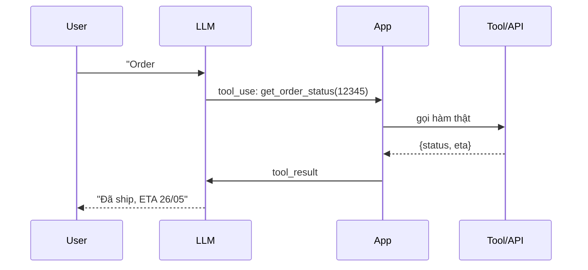
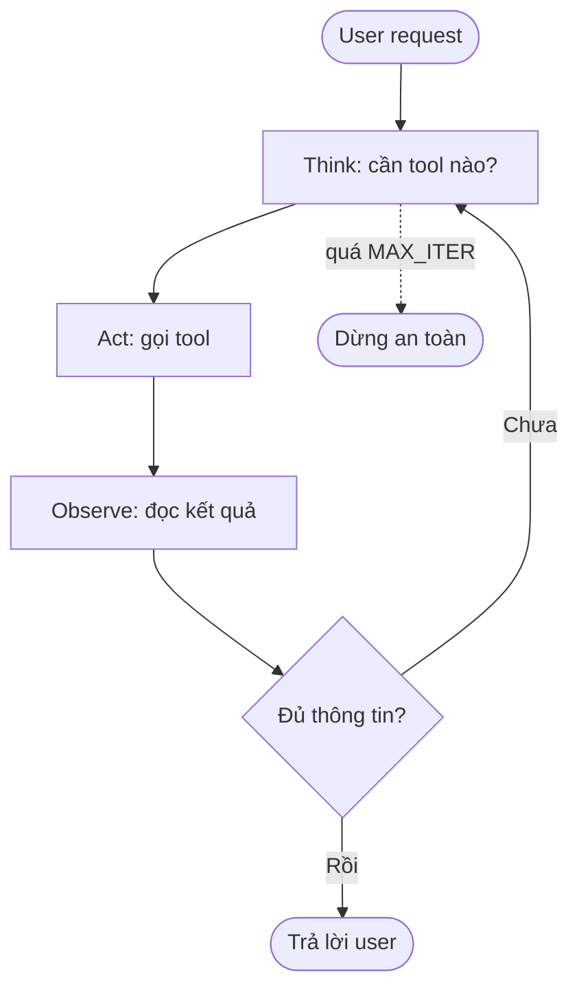

# 🛠️ Function Calling + Tool Use + Agent Loop

> **Tác giả:** Mr.Rom\
> **Phiên bản:** v1.1.2\
> **Tạo lúc:** 24/05/2026\
> **Cập nhật:** 11/06/2026\
> **Level:** Basic (bài 02/5)\
> **Tags:** [MUST-KNOW]\
> **Yêu cầu trước:** Bài [01_prompt-engineering-and-context](01_prompt-engineering-and-context.md) ✅

> 🎯 *Bài 02. LLM standalone = brain trong jar — không thể action. **Tool use / function calling** = LLM cầm điện thoại + tay → tự call API, query DB, search web, write file. Bài này dạy: schema khai báo tool, parallel calls, agentic loop ReAct, error handling, multi-step task. Foundation cho RAG + Agent (bài 03-04).*

## 🎯 Sau bài này bạn sẽ

- [ ] Hiểu **function calling / tool use** — model "request" function, app execute
- [ ] Khai báo **tool schema** JSON đúng (name, description, input_schema)
- [ ] Implement **parallel tool calls** (Claude/GPT call N function 1 lượt)
- [ ] Build **agentic loop** ReAct (Thought → Action → Observation → ...)
- [ ] Handle **error + retry + max iteration** trong loop
- [ ] Apply **MCP** (Model Context Protocol) — Anthropic standard (11/2024) cho tool
- [ ] Compare với LangChain / OpenAI Assistants / native SDK
- [ ] Hands-on: build "research agent" với web search + summarize

---

## Tình huống — Chatbot cần dữ liệu real-time

Sếp tiếp tục:

> *"Chatbot trả lời theo training data thôi không đủ. Phải:
> - Query order DB cho status real-time.
> - Check inventory.
> - Send email confirmation khi user request.
> - Search FAQ database.
> Bạn implement tool use. Tuần sau demo."*

Bạn cần:
- LLM "know" có những function nào.
- LLM decide khi nào call function nào.
- App execute function, return result.
- LLM continue conversation với result.

→ Đây là **function calling / tool use**. Bài này dạy.

---

## 1️⃣ Function calling là gì

🪞 **Ẩn dụ**: *Function calling như **trợ lý gọi cho phòng ban khác** — bạn hỏi "Sếp B đang ở đâu?", trợ lý không biết → call HR → HR trả lời → trợ lý báo lại bạn. LLM giống vậy — đối mặt câu hỏi cần data ngoài, "call" function (HR), get result, trả lời user.*

### Luồng hoạt động

```
User: "Order #12345 status?"
  ↓
LLM: "I need to call get_order_status(order_id='12345')"
  ↓ (return tool_use to app)
App: execute get_order_status("12345") → {"status": "shipped", "eta": "2026-05-26"}
  ↓ (send tool_result back to LLM)
LLM: "Order của bạn đã ship, dự kiến đến 26/05."
  ↓
User: receive answer
```

Sơ đồ dưới minh hoạ một vòng round-trip function calling — ai gửi gì cho ai qua từng bước.



Điểm mấu chốt: LLM không tự chạm vào Tool/API — App mới là bên thực thi và trả `tool_result` về cho LLM.

### Vai trò mỗi bên

| Actor | Vai trò |
|---|---|
| **Developer** | Define list tool + schema + implement function |
| **LLM** | Decide WHEN to call WHICH tool with WHAT arguments |
| **App** | Execute function với args LLM provide, return result |
| **LLM (round 2)** | Use result để reply user (or call more tools) |

→ **Key insight**: LLM **không tự execute** — chỉ "propose" function call. App control execution.

### Giải phẫu một tool definition

```python
tool = {
    "name": "get_order_status",                       # name LLM uses
    "description": "Get current shipping status of an order by ID. Returns status, ETA, tracking number.",
    "input_schema": {                                  # JSON Schema
        "type": "object",
        "properties": {
            "order_id": {
                "type": "string",
                "description": "The order ID, e.g., '12345' or 'ORD-2026-001'"
            }
        },
        "required": ["order_id"]
    }
}
```

→ Description quan trọng — LLM dựa vào để decide call hay không.

---

## 2️⃣ Anthropic tool use

### Ví dụ cơ bản

```python
import anthropic

client = anthropic.Anthropic()

# Define tool
tools = [{
    "name": "get_order_status",
    "description": "Get shipping status of order by ID",
    "input_schema": {
        "type": "object",
        "properties": {
            "order_id": {"type": "string"},
        },
        "required": ["order_id"],
    },
}]

# Implement function
def get_order_status(order_id: str) -> dict:
    # In real app: query DB
    return {
        "order_id": order_id,
        "status": "shipped",
        "eta": "2026-05-26",
        "tracking": "VN1234567",
    }

# Conversation
messages = [{"role": "user", "content": "Order #12345 ở đâu?"}]

response = client.messages.create(
    model="claude-sonnet-4-6",
    max_tokens=1024,
    tools=tools,
    messages=messages,
)

# Check stop_reason
if response.stop_reason == "tool_use":
    # Extract tool call
    tool_use = next(b for b in response.content if b.type == "tool_use")
    tool_name = tool_use.name
    tool_input = tool_use.input
    tool_use_id = tool_use.id

    # Execute
    result = get_order_status(**tool_input)

    # Send result back
    messages.append({"role": "assistant", "content": response.content})
    messages.append({
        "role": "user",
        "content": [{
            "type": "tool_result",
            "tool_use_id": tool_use_id,
            "content": str(result),  # or JSON
        }],
    })

    # Round 2
    response = client.messages.create(
        model="claude-sonnet-4-6",
        max_tokens=1024,
        tools=tools,
        messages=messages,
    )

# Final answer
print(response.content[0].text)
# → "Order #12345 của bạn đã ship, dự kiến đến 26/05/2026. Mã tracking: VN1234567."
```

### Nhiều tool

```python
tools = [
    {"name": "get_order_status", ...},
    {"name": "get_inventory", ...},
    {"name": "send_email", ...},
    {"name": "search_faq", ...},
]
```

LLM tự decide tool nào phù hợp với query.

---

## 3️⃣ OpenAI function calling

```python
import json
from openai import OpenAI
client = OpenAI()

tools = [{
    "type": "function",
    "function": {
        "name": "get_order_status",
        "description": "Get shipping status of order by ID",
        "parameters": {
            "type": "object",
            "properties": {
                "order_id": {"type": "string"},
            },
            "required": ["order_id"],
        },
    },
}]

response = client.chat.completions.create(
    model="gpt-4o",
    messages=[{"role": "user", "content": "Order #12345 ở đâu?"}],
    tools=tools,
)

message = response.choices[0].message
if message.tool_calls:
    for call in message.tool_calls:
        args = json.loads(call.function.arguments)
        result = get_order_status(**args)
        # Append result + call API again
        ...
```

### So sánh

| Aspect | Anthropic | OpenAI |
|---|---|---|
| Tool format key | `input_schema` | `parameters` |
| Response content type | `tool_use` block | `tool_calls` array |
| Result format | `tool_result` user message | `tool` role message |
| Parallel calls | ✅ default | ✅ default |
| Structured output (no tool) | Tool use forced | `response_format` |

---

## 4️⃣ Parallel tool calls

Model có thể call **multiple tools** trong 1 turn nếu independent.

```python
# User: "Status order #12345 + check stock iPhone 16"
# Model output:
[
    {"type": "tool_use", "id": "1", "name": "get_order_status", "input": {"order_id": "12345"}},
    {"type": "tool_use", "id": "2", "name": "get_inventory", "input": {"product": "iPhone 16"}},
]

# App execute both (parallel)
import asyncio
async def execute_tools(tool_uses):
    results = await asyncio.gather(*[
        execute(tu.name, tu.input) for tu in tool_uses
    ])
    return results

# Send all results back
messages.append({
    "role": "user",
    "content": [
        {"type": "tool_result", "tool_use_id": "1", "content": result1},
        {"type": "tool_result", "tool_use_id": "2", "content": result2},
    ],
})
```

→ Faster latency vs sequential.

### Ép model gọi tool

```python
# Anthropic
tool_choice={"type": "tool", "name": "get_order_status"}  # MUST call this tool
tool_choice={"type": "any"}  # MUST call some tool
tool_choice={"type": "auto"}  # LLM decide (default)

# OpenAI
tool_choice={"type": "function", "function": {"name": "..."}}
tool_choice="required"  # any tool
tool_choice="auto"
tool_choice="none"  # never call
```

---

## 5️⃣ Agentic loop — ReAct pattern

🪞 **Ẩn dụ**: *Agent loop như **detective điều tra** — không đủ data → call witness 1 → còn thiếu → call witness 2 → đủ → conclusion. Mỗi vòng loop, LLM "think next step" + "act" + "observe result".*

Sơ đồ dưới minh hoạ vòng lặp Think → Act → Observe và đường thoát an toàn khi vượt quá MAX_ITER.



Vòng lặp chỉ kết thúc khi LLM đủ thông tin để trả lời, hoặc bị chặn bởi MAX_ITER để tránh loop vô hạn.

### Mẫu code

```
while not done:
    response = llm.create(messages, tools)

    if response.stop_reason == "tool_use":
        for tool_use in response.tool_uses:
            result = execute_tool(tool_use)
            append_tool_result(messages, tool_use.id, result)
    elif response.stop_reason == "end_turn":
        done = True

    if iteration > MAX_ITER:
        break  # safety
```

### Triển khai đầy đủ

```python
import json

def agent_loop(user_query: str, tools: list, max_iter: int = 10):
    messages = [{"role": "user", "content": user_query}]
    iteration = 0

    while iteration < max_iter:
        iteration += 1
        response = client.messages.create(
            model="claude-sonnet-4-6",
            max_tokens=2048,
            tools=tools,
            messages=messages,
        )

        # Append assistant turn
        messages.append({"role": "assistant", "content": response.content})

        if response.stop_reason == "end_turn":
            # Final answer
            final = next((b.text for b in response.content if b.type == "text"), "")
            return final

        if response.stop_reason == "tool_use":
            # Execute all tool calls
            tool_results = []
            for block in response.content:
                if block.type == "tool_use":
                    try:
                        result = TOOL_HANDLERS[block.name](**block.input)
                    except Exception as e:
                        result = {"error": str(e)}
                    tool_results.append({
                        "type": "tool_result",
                        "tool_use_id": block.id,
                        "content": json.dumps(result),
                    })
            messages.append({"role": "user", "content": tool_results})

    return "Max iteration reached without conclusion."

# Usage
TOOL_HANDLERS = {
    "get_order_status": get_order_status,
    "get_inventory": get_inventory,
    "send_email": send_email,
}

answer = agent_loop(
    user_query="Order #12345 ở đâu? Nếu chưa ship, gửi email cho tôi.",
    tools=[order_tool, email_tool],
)
```

→ Loop sẽ:
1. Call `get_order_status("12345")` → `{status: "processing"}`.
2. Decide chưa ship → call `send_email(to=..., subject="Order delay")`.
3. Reply user: "Order còn processing. Mình đã gửi email update cho bạn."

### An toàn với MAX_ITER

| Reason | Mitigation |
|---|---|
| LLM stuck in loop calling same tool | MAX_ITER = 10-20 |
| Tool error retry loop | Track retry per tool, max 3 |
| Cost runaway | Budget per session ($) cap |
| User input causes long chain | Time limit (e.g., 60s) |

---

## 6️⃣ Error handling

### Lỗi tool

```python
def execute_safe(tool_name, args):
    try:
        return TOOL_HANDLERS[tool_name](**args)
    except KeyError:
        return {"error": f"Unknown tool: {tool_name}"}
    except TypeError as e:
        return {"error": f"Invalid args: {e}"}
    except Exception as e:
        log.exception(e)
        return {"error": f"Tool failed: {type(e).__name__}"}
```

LLM thấy `{"error": ...}` → understand + retry với args khác hoặc giải thích user.

### Sai schema (LLM gọi sai tham số)

```python
from jsonschema import validate, ValidationError

def execute_with_schema(tool_use, schema):
    try:
        validate(tool_use.input, schema)
        return TOOL_HANDLERS[tool_use.name](**tool_use.input)
    except ValidationError as e:
        return {"error": f"Schema violation: {e.message}. Please fix."}
```

LLM sẽ retry với args đúng.

### Timeout

```python
import asyncio

async def execute_with_timeout(tool_use, timeout=30):
    try:
        result = await asyncio.wait_for(
            asyncio.to_thread(TOOL_HANDLERS[tool_use.name], **tool_use.input),
            timeout=timeout,
        )
        return result
    except asyncio.TimeoutError:
        return {"error": "Tool execution timeout"}
```

---

## 7️⃣ MCP — Model Context Protocol (11/2024+)

🪞 **Ẩn dụ**: *MCP như **chuẩn USB cho LLM tool** — trước đây mỗi vendor tool format khác (LangChain, OpenAI Assistants, native SDK). MCP standardize → tool viết 1 lần dùng được nhiều client (Claude Desktop, Cursor, your app).*

### MCP là gì

Anthropic open standard (giới thiệu 11/2024) — protocol cho LLM client (Claude Desktop, Cursor, custom app) connect tool servers.

```
[Claude Desktop] ←--MCP--→ [filesystem MCP server]
[Claude Desktop] ←--MCP--→ [GitHub MCP server]
[Claude Desktop] ←--MCP--→ [Postgres MCP server]
[Cursor]         ←--MCP--→ [filesystem MCP server]  (reuse)
[Your app]       ←--MCP--→ [Slack MCP server]
```

### Ví dụ server (Python)

```python
from mcp.server.fastmcp import FastMCP

mcp = FastMCP("acmeshop-tools")

@mcp.tool()
def get_order_status(order_id: str) -> dict:
    """Get shipping status of order."""
    return {"status": "shipped", "eta": "..."}

@mcp.tool()
def search_products(query: str, limit: int = 10) -> list:
    """Search products by name/keyword."""
    return [...]

if __name__ == "__main__":
    mcp.run(transport="stdio")
```

### Client (cấu hình Claude Desktop)

```json
// ~/Library/Application Support/Claude/claude_desktop_config.json
{
  "mcpServers": {
    "acmeshop": {
      "command": "python",
      "args": ["/path/to/acmeshop_mcp.py"]
    }
  }
}
```

→ Restart Claude Desktop → tool auto-available trong chat.

### Các MCP server sẵn có (hệ sinh thái 2026)

- **filesystem** — read/write files
- **github** — repo, PR, issue
- **postgres** — query DB
- **slack** — send message
- **brave-search** — web search
- **puppeteer** — browser automation
- **memory** — persistent memory across conversation
- **fetch** — HTTP requests

→ Search [github.com/modelcontextprotocol/servers](https://github.com/modelcontextprotocol/servers).

---

## 8️⃣ So sánh framework

| Framework | When |
|---|---|
| **Native SDK** (Anthropic/OpenAI) | Simple app, full control |
| **LangChain** | Complex chains, many integrations, prototype fast |
| **LangGraph** | State machine + multi-agent |
| **OpenAI Assistants API** | OpenAI-only, managed thread + retrieval |
| **Pydantic AI** | Pydantic-first, typed |
| **DSPy** | Compile prompts from examples |
| **Haystack** | RAG-focused |
| **CrewAI / AutoGen** | Multi-agent orchestration |
| **MCP** | Standard tool protocol, cross-client |

→ **2026 trend**: start với native SDK + MCP, add framework only khi need.

---

## 🛠️ Hands-on — Research agent

### Mục tiêu

Agent nhận query → web search → fetch top 3 result → summarize → cite source.

### Công cụ

```python
import requests
from bs4 import BeautifulSoup

def web_search(query: str, max_results: int = 5) -> list[dict]:
    """Search web via Brave/Tavily/Serper API."""
    # Mock: replace with real API
    return [
        {"title": "Result 1", "url": "https://example.com/1", "snippet": "..."},
        {"title": "Result 2", "url": "https://example.com/2", "snippet": "..."},
    ]

def fetch_url(url: str) -> str:
    """Fetch URL content, extract text."""
    resp = requests.get(url, timeout=10, headers={"User-Agent": "research-bot"})
    soup = BeautifulSoup(resp.text, "html.parser")
    return soup.get_text()[:5000]  # limit
```

### Khai báo tool

```python
tools = [
    {
        "name": "web_search",
        "description": "Search the web. Returns list of results with title, URL, snippet.",
        "input_schema": {
            "type": "object",
            "properties": {
                "query": {"type": "string"},
                "max_results": {"type": "integer", "default": 5},
            },
            "required": ["query"],
        },
    },
    {
        "name": "fetch_url",
        "description": "Fetch full content of a URL. Use after web_search to read in detail.",
        "input_schema": {
            "type": "object",
            "properties": {
                "url": {"type": "string"},
            },
            "required": ["url"],
        },
    },
]

TOOL_HANDLERS = {"web_search": web_search, "fetch_url": fetch_url}
```

### Agent loop

```python
import json

def research_agent(query: str) -> str:
    system = """Bạn là research assistant. Workflow:
1. Search web với query phù hợp.
2. Fetch 2-3 URL hứa hẹn nhất.
3. Summarize answer + cite source (URL).
4. Reply tiếng Việt, format markdown.

Quy tắc: chỉ cite source bạn fetched. Không bịa link."""

    messages = [{"role": "user", "content": query}]
    iteration = 0

    while iteration < 10:
        iteration += 1
        response = client.messages.create(
            model="claude-sonnet-4-6",
            max_tokens=2048,
            system=system,
            tools=tools,
            messages=messages,
        )
        messages.append({"role": "assistant", "content": response.content})

        if response.stop_reason == "end_turn":
            return next((b.text for b in response.content if b.type == "text"), "")

        # Execute tools
        results = []
        for block in response.content:
            if block.type == "tool_use":
                try:
                    result = TOOL_HANDLERS[block.name](**block.input)
                except Exception as e:
                    result = {"error": str(e)}
                results.append({
                    "type": "tool_result",
                    "tool_use_id": block.id,
                    "content": json.dumps(result, ensure_ascii=False),
                })
        messages.append({"role": "user", "content": results})

    return "Max iter reached."

# Usage
answer = research_agent("Kubernetes 1.31 có tính năng mới gì?")
print(answer)
```

### Ví dụ output

> ⚠️ **Lưu ý**: đây là output **giả định (mock)** để minh hoạ format — link/ngày tháng/nội dung là minh hoạ, không phải dữ liệu thật. Khi chạy với web search API thật, agent sẽ trả về kết quả khác (và phải cite đúng nguồn nó thực sự fetch). Ví dụ: Kubernetes 1.31 thực tế phát hành 08/2024.

```markdown
# Kubernetes 1.31 — Tính năng mới

Theo [release notes](https://kubernetes.io/blog/2024/08/13/kubernetes-v1-31-release/):

1. **AppArmor support GA** — bảo mật container ở Linux.
2. **Pod-level resources** — set request/limit ở pod thay vì từng container.
3. **PersistentVolume Last Phase Transition Time** — track lifecycle.

Source:
- https://kubernetes.io/blog/2024/08/13/kubernetes-v1-31-release/
- https://github.com/kubernetes/kubernetes/releases/tag/v1.31.0
```

### Ước tính chi phí mỗi query

- Iteration ~3 (search + 2 fetch + summarize).
- Tokens per iter: ~3000 input + 500 output.
- Total: ~10k input + 2k output.
- Claude Sonnet: 10k × $3/M + 2k × $15/M ≈ **$0.06/query**.

---

## 💡 Cạm bẫy thường gặp & Best practice

### 1. Tool description quá sơ sài

**Sai**: `"description": "Get order"`.

**Đúng**: Description chi tiết — khi nào dùng, input format, output meaning.

### 2. No MAX_ITER

**Bẫy**: Loop infinite → cost exhaust + rate limit hit.

**Fix**: MAX_ITER = 10-20, budget cap, time limit.

### 3. Trust tool input from LLM

**Bẫy**: LLM call `delete_user(id="*")` → app execute.

**Fix**: Tool with destructive action → require human approve hoặc strict validation.

### 4. Sensitive tool no auth

**Bẫy**: `send_email` tool → LLM gửi spam mass.

**Fix**: Tool execute với credential limited; rate limit; audit log.

### 5. Tool result quá lớn

**Bẫy**: Tool return 100k token → context limit hit.

**Fix**: Truncate/summarize trong tool wrapper.

### 6. Schema không strict

**Bẫy**: LLM pass extra args không trong schema → app crash.

**Fix**: Validate với jsonschema; reject extras.

### 7. Sequential khi có thể parallel

**Bẫy**: Loop calls 5 tool serial → 5× latency.

**Fix**: `asyncio.gather` parallel.

### 8. Tool call retry loop infinite

**Bẫy**: Tool fail → LLM retry → fail → retry...

**Fix**: Track retry count per tool, max 3, then surface error to user.

---

## 🧠 Tự kiểm tra (Self-check)

- [ ] Flow function calling 4-step end-to-end?
- [ ] Anthropic tool definition vs OpenAI function — diff?
- [ ] Parallel tool call code Python?
- [ ] Agent loop ReAct với MAX_ITER + error handling?
- [ ] MCP là gì + tại sao standard quan trọng?
- [ ] Tool error 5 loại + mitigation?
- [ ] So sánh LangChain vs LangGraph vs native SDK?
- [ ] Research agent search + fetch + summarize cite?

---

## 📚 Từ Điển Thuật Ngữ (Glossary)

| Term | Vietnamese / Explanation |
|---|---|
| **Tool / function** | Function LLM có thể call |
| **Tool use / function calling** | Pattern LLM request function execution |
| **Tool schema** | JSON Schema describing input |
| **Tool description** | Text giúp LLM decide khi nào call |
| **stop_reason** | Why LLM stopped: `end_turn`, `tool_use`, `max_tokens` |
| **tool_use_id** | Unique ID matching tool call ↔ result |
| **Parallel tool calls** | Multiple tools in 1 turn |
| **Forced tool choice** | Required call specific/any tool |
| **Agent loop** | While loop: think → act → observe → ... |
| **ReAct** | Reasoning + Acting pattern |
| **MAX_ITER** | Safety cap iteration |
| **MCP** | Model Context Protocol — Anthropic standard tool (11/2024) |
| **MCP server** | Process exposes tools via MCP |
| **MCP client** | Claude Desktop, Cursor, app consume tools |
| **LangChain** | Python framework chain LLM ops |
| **LangGraph** | State machine multi-agent |
| **OpenAI Assistants** | Managed assistant API |
| **Tool result** | Output sent back to LLM |
| **Schema validation** | Verify input match schema |

---

## 🔗 Liên kết & Tài nguyên

### 🧭 Định hướng lộ trình học
- ⬅️ **Bài trước:** [Prompt Engineering + Context Strategies](01_prompt-engineering-and-context.md)
- ➡️ **Bài tiếp theo:** [RAG — Retrieval Augmented Generation](03_rag-fundamentals.md)
- ↑ **Về cụm:** [LLM README](../../README.md)

### 🧩 Các chủ đề có thể bạn quan tâm
- 🧠 [RAG + AI Agent](../../../rag-and-ai-agent/) — agent deep
- 🔢 [Vector search](../../../vector-search-and-embeddings/) — retrieval tool
- 🛡️ [OWASP LLM Top 10](../../../../12_security/owasp-top-10/) — tool security
- 🐍 [FastAPI](../../../../07_web/backend/python-fastapi/) — host agent endpoint

### Tài nguyên ngoài (2026)
- 📖 [Anthropic Tool Use Guide](https://docs.anthropic.com/en/docs/build-with-claude/tool-use)
- 📖 [OpenAI Function Calling Guide](https://platform.openai.com/docs/guides/function-calling)
- 📖 [MCP Specification](https://spec.modelcontextprotocol.io/)
- 📖 [MCP Servers](https://github.com/modelcontextprotocol/servers) — official + community
- 📖 [LangChain](https://python.langchain.com/)
- 📖 [LangGraph](https://langchain-ai.github.io/langgraph/)
- 📖 [OpenAI Assistants API](https://platform.openai.com/docs/assistants/overview)
- 📖 [Pydantic AI](https://ai.pydantic.dev/)
- 📖 [CrewAI](https://www.crewai.com/) — multi-agent
- 📖 [AutoGen](https://microsoft.github.io/autogen/) — Microsoft multi-agent
- 📖 [ReAct paper](https://arxiv.org/abs/2210.03629) — original

---

## 📌 Nhật ký thay đổi (Changelog)

- **v1.0.0 (24/05/2026)** — Bản đầu tiên. Bài 02 LLM basic. Function calling flow + Anthropic/OpenAI schema + parallel tool calls + force tool choice + agent loop ReAct + error handling (schema/timeout/retry/MAX_ITER) + MCP standard 2024 + framework compare (LangChain/LangGraph/Assistants/Pydantic AI/CrewAI) + hands-on research agent + 8 pitfalls.
- **v1.1.0 (07/06/2026)** — Sửa lỗi (QA audit): thêm `import json` vào 3 snippet dùng json.loads/json.dumps (OpenAI function calling, agent loop, research agent) để chạy được khi copy; ghi rõ mốc MCP là 11/2024 (thay vì "2024" chung); đánh dấu output sample K8s 1.31 là mock + sửa ngày link 2026→2024 cho hợp lý (K8s 1.31 thật phát hành 08/2024).
- **v1.1.1 (10/06/2026)** — Bổ sung sơ đồ function calling round-trip + agent loop ReAct cho trực quan.
- **v1.1.2 (11/06/2026)** — Việt hoá các heading nội dung mô tả sang tiếng Việt (giữ thuật ngữ/brand/param tiếng Anh) theo nguyên tắc Vietnamese-first.
