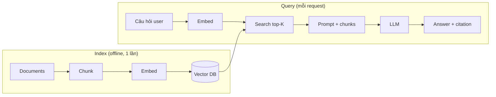

# 📚 RAG — Retrieval Augmented Generation

> **Tác giả:** Mr.Rom\
> **Phiên bản:** v1.1.1\
> **Tạo lúc:** 24/05/2026\
> **Cập nhật:** 10/06/2026\
> **Level:** Basic (bài 03/5)\
> **Tags:** [MUST-KNOW]\
> **Yêu cầu trước:** Bài [02_function-calling-and-tools](02_function-calling-and-tools.md) ✅

> 🎯 *Bài 03. LLM **không có data riêng của bạn** (Acme Shop docs, internal wiki, code) → bịa khi hỏi. **RAG** = inject relevant chunks vào prompt để LLM trả lời ground-truth + cite. Bài này dạy: embedding model, vector DB, chunking strategy, retrieval, reranking, RAG vs fine-tune trade-off. Hands-on build Q&A bot cho Acme Shop docs.*

## 🎯 Sau bài này bạn sẽ

- [ ] Hiểu **RAG** + **embedding** + **vector DB** — flow end-to-end
- [ ] Chọn **embedding model** 2026 (OpenAI text-embedding-3, Cohere, BGE, voyage-3)
- [ ] Chunking strategy: fixed-size, semantic, sentence-window, hierarchical
- [ ] Vector DB compare: Pinecone, Qdrant, Weaviate, Milvus, pgvector, Chroma
- [ ] **Hybrid search** (vector + BM25) + **reranker** (Cohere, Voyage)
- [ ] **Citation** — bot trích nguồn để verifiable
- [ ] RAG vs Fine-tune vs Long context — khi nào cái nào
- [ ] Hands-on Q&A bot Acme Shop docs

---

## Tình huống — Chatbot "không biết" về Acme Shop

Demo chatbot tuần trước:
```
User: "Acme Shop có policy return mấy ngày?"
Bot: "Thông thường e-commerce 14-30 ngày, bạn check website cụ thể nhé."
```

Sếp: *"Bot không biết policy riêng của mình. Mình có 200 trang internal doc + 5000 product. Cần inject vào bot. Đừng fine-tune (đắt + chậm update). Bạn tìm hiểu RAG."*

→ RAG = giải pháp. Bài này dạy.

---

## 1️⃣ RAG là gì

🪞 **Ẩn dụ**: *RAG như **học sinh có sách giáo khoa mở** khi làm bài thi — câu hỏi đến, em đọc nhanh chương liên quan trong sách, rồi viết đáp án. LLM không cần "thuộc lòng" toàn bộ Acme Shop data — chỉ cần biết cách tra cứu.*

### Flow

```
[Indexing — offline, chạy 1 lần / khi update]
Documents → Chunk → Embed → Store vector DB

[Query — online, mỗi user request]
User question → Embed → Search vector DB → Top K chunks
                                                ↓
                            Prompt = "Trả lời dựa vào chunks: [...]. Câu hỏi: ..."
                                                ↓
                                              LLM → Answer + citation
```

Sơ đồ dưới minh hoạ 2 pha của RAG — index offline chạy 1 lần, query online chạy mỗi request và cùng đọc từ Vector DB.



Vector DB là cầu nối giữa 2 pha: index ghi vào, query đọc ra — nên cập nhật doc chỉ cần re-index, không đụng tới LLM.

### Tại sao RAG > "stuff full doc vào prompt"

- Context window limit (200k token Claude 4) — không đủ cho 1M token doc.
- "Lost in middle" problem (bài 00).
- Cost — mọi query trả full doc tokens.
- Cập nhật doc → chỉ re-index, không cần fine-tune.

### RAG vs Long context vs Fine-tune

| Aspect | RAG | Long context (1M+) | Fine-tune |
|---|---|---|---|
| Setup cost | Medium | Low | High |
| Per-query cost | Low (small context) | High (full doc each call) | Low |
| Knowledge freshness | Real-time (re-index) | Real-time (paste full) | Stale (re-train) |
| Citation | ✅ Direct | ⚠️ Hard | ❌ No |
| Domain expertise | OK | OK | Best |
| Format/style adoption | OK | OK | Best |
| Data privacy | Tốt (your DB) | Tốt | Tốt (your model) |
| **2026 default** | ✅ Most cases | When fits + cost OK | Specialized only |

→ **2026**: RAG dominant. Long context cho 1-shot doc analysis. Fine-tune cho style/format/specialized task.

---

## 2️⃣ Embedding — Vector representation của text

🪞 **Ẩn dụ**: *Embedding như **chuyển sách thành tọa độ GPS** — mỗi đoạn text → 1 điểm trong không gian 1500D. Đoạn nghĩa giống → tọa độ gần. Tìm "similar" = tìm "near".*

### Embedding model

| Model | Dimension | Context | Notes |
|---|---|---|---|
| **text-embedding-3-large** (OpenAI) | 3072 | 8192 | Best quality |
| **text-embedding-3-small** (OpenAI) | 1536 | 8192 | Cheap, good |
| **voyage-3.5 / voyage-3-large** (Voyage AI) | 1024 | 32k | Anthropic recommend; 2025+ thay cho voyage-3 |
| **embed-multilingual-v3** (Cohere) | 1024 | 512 | Multilingual incl. Vietnamese |
| **BGE-M3** (BAAI) | 1024 | 8k | Open-source, multilingual |
| **nomic-embed-text-v1.5** | 768 | 8k | Open, on-device |
| **all-MiniLM-L6-v2** (legacy) | 384 | 512 | Tiny, on-device |

> ⚠️ Embedding/reranker model đổi nhanh — tên trong bảng là ví dụ thời điểm viết. Trước khi build, kiểm tra docs nhà cung cấp + [MTEB Leaderboard](https://huggingface.co/spaces/mteb/leaderboard) cho bản mới nhất.

### Embed text

```python
# OpenAI
from openai import OpenAI
client = OpenAI()

response = client.embeddings.create(
    model="text-embedding-3-small",
    input=["Hello world", "Xin chào thế giới"],
)
embeddings = [d.embedding for d in response.data]
# Each = list[float] length 1536
```

```python
# Voyage AI
import voyageai
vo = voyageai.Client()
result = vo.embed(["Hello"], model="voyage-3", input_type="document")
embedding = result.embeddings[0]
```

### Similarity

```python
import numpy as np

def cosine_similarity(a, b):
    return np.dot(a, b) / (np.linalg.norm(a) * np.linalg.norm(b))

q_emb = embed(["What is the return policy?"])[0]
doc_embs = embed(["Return policy: 30 days...", "Shipping costs $5", ...])

scores = [cosine_similarity(q_emb, d) for d in doc_embs]
top_idx = np.argsort(scores)[-3:]  # top 3
```

→ Production: dùng vector DB cho millions of docs, sub-millisecond search.

### Embedding dimension trade-off

- Higher dim (3072) = quality cao + storage/compute cao.
- **Matryoshka embedding** (2024+): có thể truncate dim mà ít loss quality. OpenAI `text-embedding-3` support → store 256 dim, expand khi cần.

---

## 3️⃣ Chunking strategy

🪞 **Ẩn dụ**: *Chunking như **cắt sách thành các trang nhỏ tự đứng được** — quá to → 1 trang chứa nhiều topic, search noise. Quá nhỏ → mất context. Cắt đúng = mỗi chunk là 1 "ý hoàn chỉnh".*

### Strategies

| Strategy | Mô tả | Khi dùng |
|---|---|---|
| **Fixed size** | N chars/tokens (e.g., 500) + overlap (50) | Simple, default start |
| **Sentence** | Cắt theo câu | Short docs, FAQ |
| **Paragraph** | Cắt theo đoạn | Articles, blog |
| **Semantic** | Chunk theo similarity break (embed-based) | Long-form, varied topic |
| **Sentence window** | Per sentence, retrieve N before/after | Detail QA |
| **Hierarchical** | Parent doc + child chunk | Complex doc, summarize available |
| **Code-aware** | Cắt theo function/class (AST) | Code documentation |
| **Markdown-aware** | Cắt theo heading | Structured docs |

### Fixed size + overlap (most common)

```python
def chunk_fixed(text, chunk_size=500, overlap=50):
    chunks = []
    start = 0
    while start < len(text):
        end = start + chunk_size
        chunks.append(text[start:end])
        start = end - overlap  # overlap to preserve context across boundary
    return chunks
```

→ Overlap 10-20% chunk_size = preserve context across cut.

### LangChain text splitter

```python
from langchain_text_splitters import RecursiveCharacterTextSplitter

splitter = RecursiveCharacterTextSplitter(
    chunk_size=500,
    chunk_overlap=50,
    separators=["\n\n", "\n", ".", " ", ""],  # try paragraph first
    length_function=len,
)
chunks = splitter.split_text(doc)
```

→ "Recursive" — try big separator first; nếu chunk còn quá to → split smaller.

### Chunk size choice

| Use case | Chunk size |
|---|---|
| Short FAQ | 200-300 tokens |
| Technical doc | 500-800 |
| Long-form article | 1000-1500 |
| Legal contract (need broad context) | 2000+ |

→ Test với eval set; chunk size là hyperparameter tune.

### Metadata per chunk

```python
chunk = {
    "text": "Return policy: 30 days...",
    "metadata": {
        "doc_id": "policy_001",
        "source_url": "https://acmeshop.vn/policy/returns",
        "section": "Returns",
        "last_updated": "2026-05-01",
        "tags": ["policy", "return"],
    }
}
```

→ Metadata cho filtering + citation.

---

## 4️⃣ Vector DB

🪞 **Ẩn dụ**: *Vector DB như **Google cho vector** — index hàng triệu vector, query "nearest neighbor" trong < 50ms. Khác SQL DB ở chỗ "đo distance" thay vì "match exact".*

### Compare 2026

| DB | Type | Hosted | Pros | Cons |
|---|---|---|---|---|
| **Pinecone** | Managed | ✅ | Easy, scale, fast | Đắt, vendor lock |
| **Qdrant** | OSS + managed | ✅/self-host | Rust performant, filtering | — |
| **Weaviate** | OSS + managed | ✅/self-host | Modules built-in, GraphQL | Heavier |
| **Milvus** | OSS | self-host (or Zilliz managed) | Scale to billion vectors | Complex setup |
| **Chroma** | OSS | Self-host / Chroma Cloud | Simple Python-first, dev-friendly | Less production-mature |
| **pgvector** | Postgres extension | Anywhere Postgres | Combined SQL+vector, simple ops | Slower at scale (millions+) |
| **Lance / LanceDB** | OSS embedded | Local + S3 | Serverless-friendly, fast | Newer |
| **OpenSearch / Elasticsearch** | Existing search | Managed | Hybrid search built-in | Heavyweight |
| **Vespa** | Specialized | self-host or Vespa Cloud | Hybrid + ranking at scale | Complex |

→ **2026 starter**: pgvector nếu đã có Postgres; Qdrant cho dedicated; Pinecone cho không muốn ops.

### Qdrant example

```python
from qdrant_client import QdrantClient
from qdrant_client.models import Distance, VectorParams, PointStruct

client = QdrantClient(url="http://localhost:6333")

# Create collection
client.create_collection(
    collection_name="acmeshop_docs",
    vectors_config=VectorParams(size=1536, distance=Distance.COSINE),
)

# Insert
points = [
    PointStruct(
        id=i,
        vector=embedding,
        payload={"text": chunk_text, "source": source_url, "section": section},
    )
    for i, (embedding, chunk_text, source_url, section) in enumerate(chunks_with_metadata)
]
client.upsert(collection_name="acmeshop_docs", points=points)

# Search (qdrant-client 1.10+: dùng query_points; client.search() đã deprecated)
query_emb = embed("What is return policy?")
response = client.query_points(
    collection_name="acmeshop_docs",
    query=query_emb,
    limit=5,
    query_filter={"must": [{"key": "section", "match": {"value": "Returns"}}]},  # optional filter
)
for r in response.points:
    print(r.score, r.payload["text"][:100])
```

### pgvector example

```sql
CREATE EXTENSION vector;

CREATE TABLE doc_chunks (
    id BIGSERIAL PRIMARY KEY,
    text TEXT NOT NULL,
    embedding VECTOR(1536) NOT NULL,
    source VARCHAR(255),
    section VARCHAR(100)
);

CREATE INDEX ON doc_chunks USING hnsw (embedding vector_cosine_ops);

-- Search
SELECT text, source, 1 - (embedding <=> $1::vector) AS score
FROM doc_chunks
WHERE section = 'Returns'  -- optional
ORDER BY embedding <=> $1::vector
LIMIT 5;
```

---

## 5️⃣ Retrieval — Hybrid + Reranker

🪞 **Ẩn dụ**: *Pure vector search như **tìm bằng "ý nghĩa"** — recall tốt nhưng đôi khi miss exact keyword (model name, code). **BM25** như **tìm bằng "keyword exact"** — precision tốt cho proper noun. Hybrid = combine.*

### Pure vector — Problem

```
Query: "iPhone 16 Pro Max"
Vector search: trả về iPhone 15, iPhone 14, Galaxy S24 (similar "phone" semantics)
Missing: doc nhắc exact "iPhone 16 Pro Max"
```

### Hybrid search — Vector + BM25

```python
# Pseudo-code
vector_results = vector_db.search(query_emb, top_k=20)
bm25_results = bm25_index.search(query_text, top_k=20)

# Reciprocal Rank Fusion (RRF)
def rrf_score(rank, k=60):
    return 1 / (k + rank)

scores = defaultdict(float)
for rank, r in enumerate(vector_results):
    scores[r.id] += rrf_score(rank)
for rank, r in enumerate(bm25_results):
    scores[r.id] += rrf_score(rank)

merged = sorted(scores.items(), key=lambda x: -x[1])[:10]
```

→ Hybrid recall + precision tốt hơn pure.

### Reranker (cross-encoder)

Vector search = "biencoder" — fast nhưng đôi khi noisy. **Reranker** = cross-encoder, slow nhưng accurate. Pipeline:

```
1. Vector search → top 50 chunks (fast)
2. Reranker model score each (query, chunk) → top 5 (slow but accurate)
3. Pass top 5 to LLM
```

Reranker model 2026:
- **Cohere Rerank v3.5** (managed) — `rerank-v3.5` thay cho `rerank-multilingual-v3.0` cũ
- **Voyage Rerank-2** (managed)
- **BGE-reranker-large** (open-source)
- **Jina Rerank**

```python
import cohere
co = cohere.Client()

results = co.rerank(
    model="rerank-multilingual-v3.0",
    query="What is return policy?",
    documents=[chunk.text for chunk in candidates],
    top_n=5,
)
top_chunks = [candidates[r.index] for r in results.results]
```

→ Reranking improve quality ~10-30%.

---

## 6️⃣ RAG prompt + Citation

### Standard RAG prompt

```python
def build_rag_prompt(question: str, chunks: list[dict]) -> str:
    context = "\n\n".join(
        f"[Source {i+1}: {c['source']}]\n{c['text']}"
        for i, c in enumerate(chunks)
    )
    return f"""Bạn là trợ lý support Acme Shop. Trả lời câu hỏi user dựa CHỈ trên context dưới.

QUY TẮC:
1. Nếu context không có thông tin → nói "Mình không có thông tin về vấn đề này" (KHÔNG bịa).
2. CITE source: "(theo Source N)" sau câu liên quan.
3. Trả lời tiếng Việt, ngắn gọn.

CONTEXT:
{context}

CÂU HỎI: {question}

TRẢ LỜI:"""
```

### Output có citation

```
User: "Return policy mấy ngày?"

Bot: "Acme Shop cho phép return trong 30 ngày kể từ ngày nhận hàng
     (theo Source 1: https://acmeshop.vn/policy/returns).
     Sản phẩm điện tử riêng có policy 14 ngày
     (theo Source 2: https://acmeshop.vn/policy/electronics)."
```

→ User verify được source.

### Structured citation (better)

```python
class Citation(BaseModel):
    quote: str
    source_id: int
    source_url: str

class Answer(BaseModel):
    text: str
    citations: list[Citation]

# Use structured output (bài 01)
```

---

## 7️⃣ RAG evaluation

### Metrics

| Metric | Mô tả | Tool |
|---|---|---|
| **Retrieval recall@K** | % câu hỏi có chunk đúng trong top-K | Manual + script |
| **Retrieval precision@K** | % chunk relevant trong top-K | Manual |
| **Faithfulness** | Answer dùng đúng context, không bịa | RAGAS, TruLens |
| **Answer relevance** | Answer relevant với query | RAGAS |
| **Context relevance** | Chunks chosen relevant | RAGAS |
| **Hit rate** | User satisfied (thumbs up) | Production telemetry |

### RAGAS framework

```python
# RAGAS 0.2+: context_relevancy đã đổi tên → dùng context_precision + context_recall
from ragas import evaluate
from ragas.metrics import faithfulness, answer_relevancy, context_precision, context_recall

result = evaluate(
    dataset,  # {question, contexts, answer, ground_truths}
    metrics=[faithfulness, answer_relevancy, context_precision, context_recall],
)
print(result)
```

### Eval set

Build 50-100 question + ground truth, run weekly:

```python
test_set = [
    {
        "question": "Return policy mấy ngày?",
        "ground_truth_chunks": ["policy_returns.md#section-2"],
        "expected_keywords": ["30 ngày", "policy", "return"],
    },
    # ...
]
```

---

## 🛠️ Hands-on — Acme Shop docs Q&A bot

### Mục tiêu

Index 200 trang docs vào Qdrant → bot trả Q&A với citation.

### Bước 1 — Setup Qdrant

```bash
docker run -p 6333:6333 qdrant/qdrant
```

### Bước 2 — Indexing pipeline

```python
import os
import voyageai
from qdrant_client import QdrantClient
from qdrant_client.models import Distance, VectorParams, PointStruct
from langchain_text_splitters import RecursiveCharacterTextSplitter
from pathlib import Path

vo = voyageai.Client()
qdrant = QdrantClient(url="http://localhost:6333")
COLLECTION = "acmeshop_docs"

# Create collection (recreate_collection đã deprecated → tự kiểm tra + tạo)
if qdrant.collection_exists(COLLECTION):
    qdrant.delete_collection(COLLECTION)
qdrant.create_collection(
    collection_name=COLLECTION,
    vectors_config=VectorParams(size=1024, distance=Distance.COSINE),
)

splitter = RecursiveCharacterTextSplitter(chunk_size=600, chunk_overlap=80)

points = []
pid = 0
for md_file in Path("./docs").rglob("*.md"):
    text = md_file.read_text()
    chunks = splitter.split_text(text)
    for chunk in chunks:
        emb = vo.embed([chunk], model="voyage-3", input_type="document").embeddings[0]
        points.append(PointStruct(
            id=pid,
            vector=emb,
            payload={
                "text": chunk,
                "source": str(md_file),
                "url": f"https://acmeshop.vn/docs/{md_file.stem}",
            },
        ))
        pid += 1

# Batch insert
for batch in [points[i:i+100] for i in range(0, len(points), 100)]:
    qdrant.upsert(collection_name=COLLECTION, points=batch)

print(f"Indexed {len(points)} chunks")
```

### Bước 3 — Query + RAG

```python
import anthropic
import cohere

llm = anthropic.Anthropic()
reranker = cohere.Client()

def rag_qa(question: str, top_k_vec: int = 20, top_k_rerank: int = 5) -> str:
    # 1. Embed query
    q_emb = vo.embed([question], model="voyage-3", input_type="query").embeddings[0]

    # 2. Vector search (query_points: API mới thay cho search())
    results = qdrant.query_points(
        collection_name=COLLECTION,
        query=q_emb,
        limit=top_k_vec,
    ).points

    # 3. Rerank
    docs = [r.payload["text"] for r in results]
    reranked = reranker.rerank(
        model="rerank-v3.5",
        query=question,
        documents=docs,
        top_n=top_k_rerank,
    )
    top_chunks = [results[r.index].payload for r in reranked.results]

    # 4. Build prompt
    context = "\n\n".join(
        f"[Source {i+1}: {c['url']}]\n{c['text']}"
        for i, c in enumerate(top_chunks)
    )

    # 5. LLM
    response = llm.messages.create(
        model="claude-sonnet-4-6",
        max_tokens=1024,
        system="Trợ lý support Acme Shop. Trả lời dựa CHỈ trên context. Cite source.",
        messages=[{"role": "user", "content": f"Context:\n{context}\n\nCâu hỏi: {question}"}],
    )
    return response.content[0].text

# Test
answer = rag_qa("Return policy mấy ngày?")
print(answer)
```

### Bước 4 — Evaluate

```python
test_set = [
    {"q": "Return policy mấy ngày?", "expected_keyword": "30 ngày"},
    {"q": "Phí ship Hà Nội bao nhiêu?", "expected_keyword": "ship"},
    # ... 48 more
]

correct = 0
for t in test_set:
    answer = rag_qa(t["q"])
    if t["expected_keyword"].lower() in answer.lower():
        correct += 1
print(f"Accuracy: {correct / len(test_set):.1%}")
```

### Bước 5 — Production deploy

- Cache embedding query (LRU 1000 entries).
- Async/streaming response.
- Log Q + retrieved chunks + answer + user feedback.
- Re-index nightly hoặc trigger on doc change.

---

## 💡 Cạm bẫy thường gặp & Best practice

### 1. Chunk size không tune

**Sai**: Default 1000 → mix multiple topics, retrieval noisy.

**Đúng**: Test 200/500/800/1200 với eval set, pick best.

### 2. No reranker

**Sai**: Vector top 5 → trực tiếp LLM → noisy chunks confuse.

**Đúng**: Vector top 20 → rerank top 5 → quality tăng 10-30%.

### 3. Embed query khác embed doc

**Sai**: Dùng cùng model nhưng quên `input_type="query"` vs `"document"` (Voyage, Cohere).

**Đúng**: Đúng input_type cho asymmetric query/doc.

### 4. Vietnamese-poor embedding

**Sai**: Dùng English-only embedding cho doc tiếng Việt → quality kém.

**Đúng**: Multilingual model (Cohere/Voyage/BGE-M3).

### 5. Re-index toàn bộ khi update 1 doc

**Sai**: Update 1 file → re-embed 10k chunks → slow + expensive.

**Đúng**: Incremental: chỉ re-embed file changed; ID stable.

### 6. No citation

**Sai**: Bot trả lời không reference → user không verify được.

**Đúng**: Force citation trong prompt + structured output.

### 7. Context too large

**Sai**: Pass top 50 chunks → 30k context → LLM lost.

**Đúng**: Top 3-5 chunks sau rerank.

### 8. No eval — "feels good"

**Sai**: Demo 3 query thấy ok → ship.

**Đúng**: Eval set 50-100 + RAGAS + regression test mỗi change.

---

## 🧠 Tự kiểm tra (Self-check)

- [ ] RAG flow indexing + query 6 step?
- [ ] Embedding model 2026 — pick cho tiếng Việt?
- [ ] 4 chunking strategy + use case?
- [ ] Vector DB compare pgvector vs Qdrant vs Pinecone?
- [ ] Hybrid search BM25 + vector — RRF fusion?
- [ ] Reranker workflow + benefit?
- [ ] RAG prompt + citation pattern?
- [ ] RAG vs Long context vs Fine-tune — pick cho 3 case?

---

## 📚 Từ Điển Thuật Ngữ (Glossary)

| Term | Vietnamese / Explanation |
|---|---|
| **RAG** | Retrieval Augmented Generation |
| **Embedding** | Vector representation của text |
| **Vector DB** | DB optimized for nearest neighbor search |
| **Cosine similarity** | Distance metric cho normalized vectors |
| **HNSW** | Hierarchical Navigable Small World — index algorithm |
| **Chunk** | Đoạn text sau split |
| **Chunking** | Process split doc thành chunks |
| **Overlap** | Repeat content cross chunk boundary |
| **Semantic chunking** | Cắt theo similarity break |
| **BM25** | Classic keyword search algorithm |
| **Hybrid search** | Combine vector + BM25 |
| **RRF** | Reciprocal Rank Fusion — merge ranked lists |
| **Reranker** | Cross-encoder rerank top results |
| **Citation** | Reference source trong answer |
| **Matryoshka** | Embedding truncatable dim |
| **pgvector** | Postgres extension for vector |
| **RAGAS** | Eval framework for RAG |
| **Faithfulness** | Answer grounded in context |
| **Recall@K** | % relevant in top-K |
| **Sentence window** | Retrieve N sentences before/after |

---

## 🔗 Liên kết & Tài nguyên

### 🧭 Định hướng lộ trình học
- ⬅️ **Bài trước:** [Function Calling + Tool Use + Agent Loop](02_function-calling-and-tools.md)
- ➡️ **Bài tiếp theo:** [LLM App — Cost, Evaluation, Production](04_llm-app-cost-eval-and-production.md)
- ↑ **Về cụm:** [LLM README](../../README.md)

### 🧩 Các chủ đề có thể bạn quan tâm
- 🧠 [RAG + AI Agent](../../../rag-and-ai-agent/) — sibling, agent + RAG combine
- 🔢 [Vector search + Embeddings](../../../vector-search-and-embeddings/) — sibling deep
- 🐘 [pgvector + Postgres](../../../../06_databases/postgresql/) — backend
- 🐳 [Docker](../../../../10_devops/docker/) — Qdrant container

### Tài nguyên ngoài (2026)
- 📖 [Anthropic Contextual Retrieval](https://www.anthropic.com/news/contextual-retrieval)
- 📖 [OpenAI Embeddings docs](https://platform.openai.com/docs/guides/embeddings)
- 📖 [Voyage AI](https://docs.voyageai.com/)
- 📖 [Cohere Embed](https://docs.cohere.com/docs/embeddings)
- 📖 [pgvector](https://github.com/pgvector/pgvector)
- 📖 [Qdrant docs](https://qdrant.tech/documentation/)
- 📖 [Pinecone docs](https://docs.pinecone.io/)
- 📖 [LangChain RAG tutorial](https://python.langchain.com/docs/tutorials/rag/)
- 📖 [LlamaIndex](https://docs.llamaindex.ai/) — RAG framework
- 📖 [RAGAS](https://docs.ragas.io/) — eval framework
- 📖 [MTEB Leaderboard](https://huggingface.co/spaces/mteb/leaderboard) — embedding benchmark
- 📖 [Pinecone RAG learning](https://www.pinecone.io/learn/)

---

## 📌 Nhật ký thay đổi (Changelog)

- **v1.0.0 (24/05/2026)** — Bản đầu tiên. Bài 03 LLM basic. RAG flow + embedding 2026 (text-embedding-3, voyage-3, BGE-M3, Cohere) + chunking 8 strategy + vector DB compare 9 (Pinecone/Qdrant/Weaviate/Milvus/pgvector/Chroma) + hybrid search RRF + reranker (Cohere/Voyage) + citation pattern + RAG vs Long context vs Fine-tune decision + RAGAS eval + hands-on Acme Shop Q&A bot + 8 pitfalls.
- **v1.1.0 (07/06/2026)** — Cập nhật API lỗi thời: qdrant-client `search()`→`query_points()`, `recreate_collection()`→`collection_exists`+`delete`+`create`; RAGAS `context_relevancy`→`context_precision`+`context_recall` (0.2+). Cập nhật reranker Cohere `rerank-v3.5`, embedding voyage-3.5 + thêm lưu ý kiểm tra model mới nhất.
- **v1.1.1 (10/06/2026)** — Bổ sung sơ đồ 2 pha RAG (index offline vs query online) cho trực quan.
