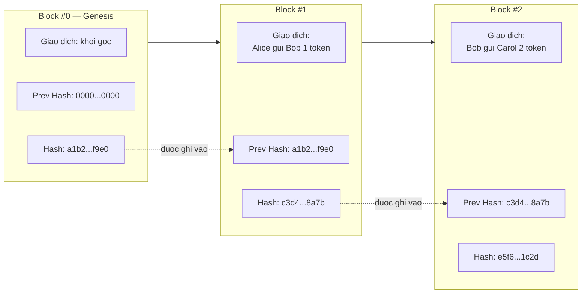
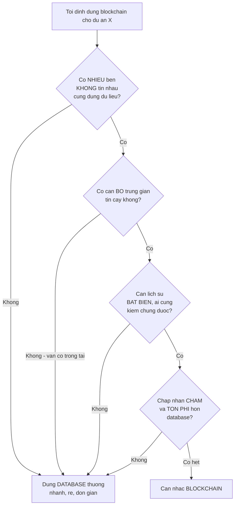

# Blockchain là gì?

> **Tác giả:** Mr.Rom\
> **Phiên bản:** v1.0.0\
> **Tạo lúc:** 22/06/2026\
> **Cập nhật:** 22/06/2026\
> **Level:** Basic\
> **Tags:** blockchain, distributed-ledger, decentralization, immutability, bitcoin, ethereum, web3\
> **Yêu cầu trước:** Không có — đây là bài đầu tiên của cụm `blockchain`

> 🎯 *Bài INTRO của cụm. Trước khi đụng tới smart contract hay đào coin, bạn cần một bức tranh tổng về **blockchain là gì** và — quan trọng hơn — **khi nào KHÔNG nên dùng nó**. Sau bài này bạn định nghĩa được blockchain như một **sổ cái phân tán bất biến**, hiểu cấu trúc block → hash → chain, nắm ba trụ cột (decentralization, immutability, transparency), phân biệt được public/private/permissioned, và tỉnh táo nhận ra đa số bài toán nên dùng database thường chứ không phải blockchain. Theo dõi xuyên suốt một ví dụ: Alice chuyển 1 token cho Bob — đối chiếu cách blockchain và cách một ngân hàng tập trung xử lý cùng giao dịch đó.*

## 🎯 Sau bài này bạn sẽ

- [ ] Định nghĩa được **blockchain** = sổ cái phân tán (distributed ledger) bất biến, và giải thích cấu trúc block → hash → chain
- [ ] Nêu **ba trụ cột**: decentralization (phi tập trung), immutability (bất biến), transparency (minh bạch)
- [ ] Giải thích vì sao blockchain ra đời — bài toán **double-spending** và **trust without intermediary**
- [ ] So sánh blockchain với **database tập trung** và biết khi nào dùng cái nào
- [ ] Phân biệt blockchain **public / private / permissioned**
- [ ] **Quan trọng nhất:** nhận ra **khi nào KHÔNG nên dùng blockchain** (đa số use case nên dùng DB thường)

---

## Tình huống — Alice muốn gửi 1 token cho Bob

Alice nợ Bob 1 token (cứ hình dung token như một "đồng xu số"). Cô muốn chuyển nó qua. Hãy nhìn hai thế giới.

**Thế giới quen thuộc — qua ngân hàng:** Alice mở app ngân hàng, bấm chuyển. Ngân hàng — một **bên trung gian** (intermediary) — kiểm tra số dư Alice, trừ 1 token bên Alice, cộng 1 token bên Bob. Toàn bộ "sổ sách" nằm trong **một database của ngân hàng**, do ngân hàng toàn quyền kiểm soát. Alice và Bob phải **tin** rằng ngân hàng ghi đúng, không sửa lén, không sập, không khoá tài khoản vô cớ.

Hệ thống này chạy ngon mỗi ngày. Nhưng nó dựa trên một giả định: **bạn tin bên trung gian**. Nếu Alice và Bob ở hai nước không có ngân hàng chung? Nếu chính ngân hàng gian lận, hoặc bị hack và sửa số dư? Nếu Alice gửi cùng 1 token cho **cả Bob lẫn Carol** cùng lúc — ai chặn?

Câu hỏi cuối cùng đó có tên riêng: **double-spending** (tiêu hai lần) — tiêu cùng một đồng tiền số ở hai chỗ. Với tiền giấy, bạn không thể đưa cùng một tờ 50k cho hai người. Nhưng "đồng xu số" chỉ là dữ liệu — copy-paste là xong. Cái duy nhất chặn double-spending trong ngân hàng là: **có một sổ cái trung tâm, và mọi người tin nó.**

Giờ đặt câu hỏi táo bạo: *Có cách nào để Alice gửi token cho Bob mà **không cần ngân hàng** — không cần bất kỳ bên trung gian nào — nhưng vẫn chống được double-spending và không ai gian lận được sổ sách?*

→ Đó chính xác là bài toán **blockchain** ra đời để giải. Cả bài này sẽ bám theo giao dịch Alice → Bob để thấy blockchain thay thế "niềm tin vào ngân hàng" bằng cái gì.

---

## 1️⃣ Vậy blockchain là gì?

Quay lại bài toán: ta muốn một cuốn **sổ cái** (ledger) ghi mọi giao dịch — Alice gửi Bob 1 token, Bob gửi Carol 2 token... — nhưng **không ai sở hữu riêng** cuốn sổ đó, và **không ai sửa được** lịch sử đã ghi.

Ý tưởng cốt lõi đơn giản đến bất ngờ: thay vì để **một** ngân hàng giữ **một** cuốn sổ, ta phát **cùng một bản sao của cuốn sổ cho hàng nghìn người** giữ. Mỗi giao dịch mới được phát đi cho tất cả, và tất cả cùng ghi vào sổ của mình. Muốn gian lận, bạn phải sửa được sổ của đa số mọi người cùng lúc — gần như bất khả thi.

**Định nghĩa kỹ thuật:** *Blockchain* (chuỗi khối) là một **sổ cái phân tán** (*distributed ledger* — cuốn sổ ghi chép được sao y và lưu trên rất nhiều máy tính) lưu dữ liệu thành các **block** (khối) **liên kết với nhau bằng mã hash** thành một **chuỗi (chain)**, sao cho một khi dữ liệu đã ghi thì **không thể sửa** (immutable) mà không bị cả mạng phát hiện.

🪞 **Ẩn dụ — cuốn sổ ghi nợ photo cho cả làng:**
> Hình dung một quán tạp hoá ở làng. Thay vì chủ quán giữ riêng một cuốn sổ ghi nợ (ngân hàng = database tập trung), cả làng thống nhất: **mỗi nhà giữ một bản photo y hệt của cuốn sổ**. Ai mua chịu một món, người đó hô to giữa làng — *"Alice nợ Bob 1 token!"* — và **mọi nhà cùng ghi dòng đó vào sổ của mình**. Muốn quỵt nợ bằng cách xé trang? Vô ích — còn vài trăm bản photo khác y nguyên. Muốn ghi khống? Cả làng đối chiếu, thấy sổ bạn lệch là loại bạn ra. Không nhà nào "sở hữu" cuốn sổ, nhưng tất cả cùng tin nó vì tất cả cùng giữ nó.

Hai từ trong định nghĩa cần làm rõ ngay, vì cả bài xoay quanh chúng:

- **Phân tán (distributed)** — cuốn sổ không nằm ở một chỗ, mà được sao chép trên rất nhiều máy (gọi là *node* — nút mạng). Không có "máy chủ trung tâm".
- **Bất biến (immutable)** — đã ghi là không sửa được. Không phải vì luật cấm, mà vì **cấu trúc kỹ thuật** khiến sửa một dòng cũ sẽ làm hỏng toàn bộ phần sau — ta sẽ thấy ở mục 2 vì sao.

> [!NOTE]
> "Blockchain" và "Bitcoin" hay bị nói lẫn. **Bitcoin** là ứng dụng **đầu tiên** dùng blockchain (Satoshi Nakamoto, 2009) — một loại tiền điện tử. **Blockchain** là **công nghệ nền** đứng sau, dùng được cho nhiều thứ khác ngoài tiền. Bitcoin là một blockchain; không phải blockchain nào cũng là Bitcoin.

→ Định nghĩa đã rõ về mặt ý tưởng. Nhưng câu hỏi hóc búa nhất là: **làm sao "đã ghi là không sửa được"?** Câu trả lời nằm ở cách block nối với nhau bằng hash — mục tiếp theo.

---

## 2️⃣ Cấu trúc: block → hash → chain

Để hiểu vì sao blockchain **bất biến**, phải hiểu ba mảnh ghép: **block**, **hash**, và cách chúng nối thành **chain**.

### Block — một trang sổ

Một **block** (khối) giống một **trang trong cuốn sổ**: nó gom một nhóm giao dịch lại với nhau. Ví dụ một block có thể chứa: *"Alice → Bob: 1 token", "Bob → Carol: 2 token", "Dave → Alice: 5 token"*. Mỗi block còn ghi thêm vài thông tin quản lý (thời gian, số thứ tự...) — quan trọng nhất là **hash của block ngay trước nó**. Giữ ý đó, ta nói về hash.

### Hash — "dấu vân tay" của dữ liệu

**Hash** (mã băm) là kết quả của một **hàm băm mật mã** (*cryptographic hash function* — hàm biến dữ liệu bất kỳ thành một chuỗi ký tự có độ dài cố định). Bitcoin dùng hàm **SHA-256**: đưa vào bất cứ thứ gì, ra một chuỗi 64 ký tự hex.

🪞 **Ẩn dụ:** hash giống **dấu vân tay** của dữ liệu. Cùng một dữ liệu → luôn ra cùng một vân tay. Nhưng **đổi dù chỉ một ký tự** → vân tay đổi hoàn toàn, không nhận ra nổi. Và từ vân tay, bạn **không lần ngược** ra được dữ liệu gốc (một chiều).

Để thấy tận mắt, hãy băm thử hai chuỗi gần như giống hệt nhau. Lệnh dưới chạy được trên Linux/macOS — `echo -n` để không thêm ký tự xuống dòng:

```bash
echo -n "Alice -> Bob: 1 token" | sha256sum
echo -n "Alice -> Bob: 2 token" | sha256sum
```

Kết quả mong đợi (hai dòng, mỗi dòng là một hash 64 ký tự — chuỗi cụ thể tuỳ máy nhưng đặc điểm thì giống):

```text
4f9a... (64 ký tự hex) ...e1c2  -
8d3b... (64 ký tự hex) ...07af  -
```

> [!TIP]
> Trên macOS nếu không có `sha256sum`, dùng `shasum -a 256` thay thế:
> `echo -n "Alice -> Bob: 1 token" | shasum -a 256`

Điều cần chú ý: chỉ đổi `1` thành `2` — một ký tự duy nhất — mà **hai hash khác nhau hoàn toàn**, không hề "gần giống". Đây chính là tính chất khiến gian lận lộ ngay: sửa một con số trong giao dịch cũ thì hash của nó đổi sạch.

### Chain — nối các block bằng hash

Đây là mảnh ghép thiên tài. **Mỗi block chứa hash của block ngay trước nó.** Block #2 ghi kèm "hash của block #1". Block #3 ghi kèm "hash của block #2". Cứ thế tạo thành một **chuỗi**, mỗi mắt xích trỏ ngược về mắt trước.

Hệ quả: nếu ai đó sửa lén một giao dịch trong **block #1**, thì hash của block #1 đổi. Nhưng block #2 đang lưu **hash cũ** của block #1 → không khớp nữa → chuỗi gãy ngay tại đó. Để che giấu, kẻ gian phải **tính lại hash của block #1, rồi block #2, rồi #3... đến tận block mới nhất** — và phải làm nhanh hơn cả mạng đang chạy, trên đa số node cùng lúc. Trên một blockchain lớn, điều này **bất khả thi về mặt tính toán**.

🪞 **Ẩn dụ nối tiếp cuốn sổ làng:** mỗi trang sổ mới ghi ở góc trên *"dấu vân tay của trang trước"*. Lén tẩy xoá một dòng ở trang 5 ư? Vân tay trang 5 đổi → ghi chú ở đầu trang 6 không còn khớp → mọi người lật tới đó là biết có người động vào. Muốn che, phải làm lại vân tay của **mọi trang từ 5 đến cuối** — trên hàng trăm bản photo của cả làng, nhanh hơn cả làng. Không tưởng.

Phần trên mô tả bằng lời. Khái niệm "mỗi block trỏ ngược về block trước bằng hash" là phần trừu tượng nhất, nên ta xem nó qua sơ đồ. Đọc từ trái sang phải — chú ý ô **Prev Hash** của mỗi block luôn chỉ về **Hash** của block bên trái:



→ Mấu chốt cần khắc sâu: **immutability không đến từ một cảnh sát hay điều luật, mà đến từ chính cấu trúc liên kết hash**. Mỗi block "niêm phong" toàn bộ lịch sử trước nó. Đổi quá khứ = phá vỡ niêm phong của tất cả tương lai. Đó là lý do người ta tin được một cuốn sổ mà không cần tin bất kỳ ai giữ nó.

> [!NOTE]
> Block đầu tiên (`#0`) không có block trước để trỏ về, nên `Prev Hash` của nó là toàn số 0. Block này có tên riêng: **Genesis block** (khối khởi thuỷ) — viên gạch nền của mọi blockchain.

---

## 3️⃣ Ba trụ cột: decentralization, immutability, transparency

Cấu trúc trên dựng nên ba tính chất làm nên giá trị của blockchain. Đây là ba từ bạn sẽ gặp ở mọi tài liệu — hiểu kỹ ba cái này là hiểu 80% blockchain.

**1. Decentralization (phi tập trung).** Không có máy chủ trung tâm, không có "ngân hàng" sở hữu cuốn sổ. Dữ liệu được sao chép trên hàng nghìn **node** rải khắp thế giới. Không có **single point of failure** (điểm sập đơn lẻ) — đập một node, mạng vẫn chạy. Không ai một mình có quyền khoá tài khoản Alice hay đảo ngược giao dịch.

**2. Immutability (bất biến).** Như mục 2 đã chỉ ra: nhờ liên kết hash, dữ liệu đã ghi vào chuỗi gần như không thể sửa. Lịch sử giao dịch là **append-only** (chỉ ghi thêm, không sửa/xoá). Điều này tạo ra một "nguồn sự thật" mà các bên không tin nhau vẫn dùng chung được.

**3. Transparency (minh bạch).** Trên blockchain **công khai** (public), bất kỳ ai cũng đọc được toàn bộ lịch sử giao dịch. Giao dịch Alice → Bob nằm đó cho cả thế giới xem (dù danh tính thường là địa chỉ ẩn danh dạng `0x9f...`, không phải tên thật). Ai cũng kiểm chứng được, không cần xin phép.

Ba trụ cột này gắn chặt nhau và tạo nên cái đích lớn nhất: **trust without intermediary** — tin được hệ thống mà **không cần tin một bên trung gian** nào cả. Niềm tin được "đẩy" từ một tổ chức (ngân hàng) sang **toán học + cấu trúc dữ liệu + đồng thuận của số đông**.

Để thấy ba trụ cột này khác ngân hàng ra sao, hãy đối chiếu trực tiếp giao dịch Alice → Bob theo từng góc. Bảng dưới đọc theo hàng:

| Góc nhìn | Ngân hàng (tập trung) | Blockchain công khai (phi tập trung) |
|---|---|---|
| Ai giữ sổ cái | Một ngân hàng giữ một database | Hàng nghìn node, mỗi node một bản sao |
| Ai duyệt giao dịch Alice → Bob | Nhân viên/hệ thống của ngân hàng | Mạng lưới đồng thuận (consensus) — số đông node |
| Sửa lịch sử được không | Được — admin DB có quyền `UPDATE` | Gần như không — phá vỡ liên kết hash, cả mạng phát hiện |
| Ai xem được giao dịch | Chỉ ngân hàng + chủ tài khoản | Bất kỳ ai (public) — dù danh tính ẩn sau địa chỉ |
| Niềm tin đặt vào | Bạn phải tin ngân hàng | Toán học + đồng thuận số đông, không cần tin một bên |
| Khi bên giữ sổ sập/gian lận | Hệ thống tê liệt / sổ bị sửa | Mạng vẫn chạy; không node nào sửa được một mình |

> ⚠️ Đừng nhầm "minh bạch" với "ẩn danh hoàn toàn". Trên blockchain công khai, **mọi giao dịch lộ thiên** — chỉ có **danh tính** sau địa chỉ là ẩn (pseudonymous — bí danh, không phải vô danh). Nếu ai đó biết địa chỉ `0x9f...` là của Alice, họ thấy **toàn bộ** lịch sử tiền của Alice. Đây là điểm khác biệt lớn so với "riêng tư".

→ Ba trụ cột giải thích blockchain **làm được gì độc đáo**. Nhưng "độc đáo" không có nghĩa "luôn nên dùng" — và đó là phần quan trọng nhất của cả bài, ở mục 5. Trước hết, ta xếp blockchain cạnh database thường để thấy ranh giới.

---

## 4️⃣ Blockchain vs database tập trung

Cả blockchain và database (vd PostgreSQL, MySQL) đều "lưu dữ liệu". Người mới hay hỏi: *"Vậy blockchain có phải database xịn hơn không, sao không dùng nó cho mọi thứ?"* Câu trả lời: **không** — chúng phục vụ hai bài toán khác hẳn, và blockchain **đắt hơn nhiều mặt**.

🪞 **Ẩn dụ:** database tập trung như **két sắt riêng trong nhà bạn** — nhanh, rẻ, bạn toàn quyền, nhưng người khác phải **tin bạn** mới gửi đồ vào. Blockchain như **hầm tiền có hàng nghìn nhân chứng** — chậm hơn, tốn kém hơn, nhưng **không ai (kể cả bạn) đổi lén được sổ**, và người lạ vẫn dám gửi đồ vì không phải tin riêng bạn.

Để chọn đúng, hãy đối chiếu theo từng tiêu chí kỹ thuật. Bảng dưới đọc theo hàng — chú ý cột cuối "ai hơn":

| Tiêu chí | Database tập trung (SQL/NoSQL) | Blockchain | Ai hơn ở điểm này |
|---|---|---|---|
| Tốc độ ghi | Hàng chục nghìn giao dịch/giây | Thường chậm (Bitcoin ~7, Ethereum ~15-30 tx/giây) | Database |
| Chi phí mỗi giao dịch | Gần như miễn phí | Tốn phí (gas/fee) cho mỗi ghi | Database |
| Sửa/xoá dữ liệu | `UPDATE`/`DELETE` tuỳ ý | Append-only, gần như không sửa được | Tuỳ nhu cầu |
| Quyền kiểm soát | Một bên (admin) | Phân tán, không ai độc quyền | Tuỳ nhu cầu |
| Cần tin bên trung gian | Có — phải tin chủ DB | Không — tin toán học + đồng thuận | Blockchain |
| Minh bạch công khai | Không (riêng tư mặc định) | Có (trên public chain) | Tuỳ nhu cầu |
| Khả năng kháng kiểm duyệt | Thấp — admin chặn được | Cao — khó kiểm duyệt | Blockchain |
| Độ phức tạp vận hành | Quen thuộc, công cụ chín | Mới, ít người thạo, khó debug | Database |

→ Quy luật rút ra: blockchain **chậm hơn, đắt hơn, phức tạp hơn** một database thường về gần như mọi mặt **kỹ thuật thuần**. Nó chỉ "thắng" ở đúng một nhóm tình huống: khi bạn cần **nhiều bên không tin nhau cùng dùng chung một sổ cái mà không có trọng tài trung gian**. Ngoài nhóm đó ra, database thường gần như luôn là lựa chọn đúng — và đó là cả nội dung mục tiếp theo.

---

## 5️⃣ Khi nào KHÔNG nên dùng blockchain (đọc kỹ phần này)

Đây là phần **quan trọng nhất** của bài, và là phần bị bỏ qua nhiều nhất trong các tài liệu "blockchain cho người mới". Sự thật phũ phàng: **đa số bài toán bạn gặp KHÔNG cần blockchain — một database thường tốt hơn về mọi mặt.** Hiểu điều này giúp bạn không lãng phí công sức xây thứ phức tạp gấp 10 lần cần thiết.

Trước khi định dùng blockchain, hãy đi qua một loạt câu hỏi sàng lọc. **Chỉ khi trả lời "Có" cho gần hết** thì blockchain mới hợp lý. Sơ đồ quyết định:



→ Mấu chốt: đường đi tới ô "blockchain" rất hẹp — phải qua **bốn cửa Có** liên tiếp. Bất kỳ câu nào trả lời "Không" là database thường thắng. Đa số dự án rớt ngay ở câu hỏi đầu tiên.

Để cụ thể, đây là những trường hợp người ta hay **lầm tưởng cần blockchain** nhưng thực ra **không**:

- **Lưu hồ sơ nội bộ công ty** (nhân sự, kho, kế toán) — chỉ một tổ chức kiểm soát, không có bên "không tin nhau" → database thường. Blockchain ở đây chỉ làm mọi thứ chậm và đắt vô ích.
- **App thông thường** (mạng xã hội, thương mại điện tử, đặt đồ ăn) — bạn là bên trung gian, người dùng tin bạn (hoặc tin luật pháp). Không cần phi tập trung.
- **Dữ liệu cần sửa/xoá thường xuyên** (hồ sơ y tế cần cập nhật, GDPR yêu cầu "quyền được lãng quên") — blockchain bất biến đi **ngược** lại nhu cầu này.
- **Cần tốc độ cao, độ trễ thấp** (giao dịch chứng khoán tần suất cao, game realtime) — blockchain quá chậm.
- **Chỉ vì "blockchain đang hot"** — lý do tệ nhất. Rất nhiều dự án "blockchain hoá" một database mà chẳng được lợi gì, chỉ tăng chi phí và độ phức tạp.

> [!WARNING]
> Câu hỏi sàng lọc kinh điển: *"Nếu bỏ chữ 'blockchain' ra, dự án này dùng database thường có chạy tốt hơn không?"* — Nếu câu trả lời là "Có", thì bạn **không cần** blockchain. Đừng chọn công nghệ vì nó "ngầu"; chọn vì bài toán thật sự cần.

Vậy **khi nào blockchain thực sự đáng dùng**? Khi cả bốn cửa ở sơ đồ đều "Có":

- **Tiền điện tử / thanh toán không trung gian** — Alice gửi Bob xuyên biên giới, không cần ngân hàng chung (Bitcoin).
- **Tài sản số cần chứng minh sở hữu công khai** — NFT, token (cần immutability + transparency).
- **Nhiều tổ chức không tin nhau cùng chia sẻ một sổ** — vd nhiều ngân hàng/công ty logistics dùng chung một sổ truy xuất nguồn gốc (thường là permissioned, mục 6).
- **Hợp đồng tự động không cần trọng tài** — smart contract (bài 02 của cụm).

→ Tóm lại quy tắc vàng cho người mới: **mặc định dùng database; chỉ đổi sang blockchain khi chứng minh được rõ ràng rằng bạn cần loại bỏ một bên trung gian giữa các bên không tin nhau.** Giữ tư duy hoài nghi này, bạn đã hơn rất nhiều người tự nhận "làm blockchain".

---

## 6️⃣ Phân loại: public / private / permissioned

Không phải blockchain nào cũng "mở cho cả thế giới". Tuỳ ai được tham gia và ai được ghi, blockchain chia thành mấy loại. Hiểu phân loại này giúp bạn không nhầm "blockchain doanh nghiệp" với "Bitcoin".

🪞 **Ẩn dụ — ba kiểu "cuốn sổ làng":**
> - **Public** = quảng trường công cộng — ai cũng vào ghi, ai cũng đọc, không cần xin phép.
> - **Private** = sổ nội bộ một công ty — chỉ nhân viên công ty đó được vào, một tổ chức kiểm soát.
> - **Permissioned** = câu lạc bộ có thành viên — nhiều tổ chức (đã được duyệt) cùng giữ sổ và ghi, người ngoài không vào được.

Để so sánh rạch ròi, đây là bảng theo các tiêu chí then chốt. Đọc theo hàng:

| Tiêu chí | Public (công khai) | Private (riêng tư) | Permissioned (cấp phép) |
|---|---|---|---|
| Ai được đọc | Bất kỳ ai | Chỉ bên trong tổ chức | Các thành viên được duyệt |
| Ai được ghi/duyệt | Bất kỳ ai (qua đồng thuận) | Một tổ chức kiểm soát | Một nhóm tổ chức được duyệt |
| Mức phi tập trung | Cao nhất | Thấp (gần như tập trung) | Trung bình (liên minh) |
| Tốc độ | Chậm hơn | Nhanh hơn | Nhanh hơn public |
| Ví dụ điển hình | Bitcoin, Ethereum | Mạng nội bộ một công ty | Hyperledger Fabric, consortium ngân hàng |
| Hợp khi | Tiền điện tử, ứng dụng mở | Thử nghiệm nội bộ | Nhiều tổ chức không tin nhau nhưng cần kiểm soát ai vào |

> [!NOTE]
> Nhiều người cho rằng "private blockchain" hơi mâu thuẫn về triết lý — nếu chỉ một tổ chức kiểm soát thì nó gần như chỉ là một database có thêm liên kết hash, mất đi cái lõi "phi tập trung". Trong thực tế, **permissioned** (liên minh nhiều tổ chức) là dạng "blockchain doanh nghiệp" thực dụng hơn, vì có nhiều bên không hoàn toàn tin nhau.

→ Khi nghe ai nói "công ty tôi làm blockchain", hãy hỏi loại nào. Phần lớn blockchain bạn nghe trên tin tức tài chính (Bitcoin, Ethereum) là **public**. Phần lớn "ứng dụng blockchain doanh nghiệp" là **permissioned**. Hai thế giới khá khác nhau.

---

## 7️⃣ Bức tranh hệ sinh thái: Bitcoin & Ethereum

Để khép lại bức tranh tổng, hãy biết hai cái tên lớn nhất — chúng đại diện cho hai "thế hệ" tư duy về blockchain.

**Bitcoin (2009)** — blockchain **đầu tiên**, do nhân vật ẩn danh **Satoshi Nakamoto** tạo ra. Mục tiêu hẹp và rõ: một loại **tiền điện tử ngang hàng** (peer-to-peer electronic cash) — đúng bài toán Alice gửi Bob không cần ngân hàng. Bitcoin làm **một việc** rất tốt: lưu và chuyển giá trị. Nó cố tình **không** lập trình phức tạp được, để giữ an toàn và đơn giản.

**Ethereum (2015)** — bước nhảy về tư duy. Người sáng lập (Vitalik Buterin và cộng sự) đặt câu hỏi: *nếu blockchain ghi được giao dịch tiền, sao không ghi được cả **chương trình**?* Ethereum đưa vào **smart contract** (hợp đồng thông minh) — đoạn code tự chạy trên blockchain, tự thực thi khi thoả điều kiện, không cần trọng tài. Nhờ đó blockchain không chỉ là "sổ tiền" mà thành một **máy tính phi tập trung**, mở ra cả thế giới ứng dụng (DeFi, NFT, DAO...).

Hai cái tên này định hình toàn bộ phần còn lại của cụm. Bảng định vị nhanh:

| Khía cạnh | Bitcoin | Ethereum |
|---|---|---|
| Ra đời | 2009 (Satoshi Nakamoto) | 2015 (Vitalik Buterin & cộng sự) |
| Mục tiêu chính | Tiền điện tử ngang hàng | Nền tảng ứng dụng phi tập trung |
| Smart contract | Rất hạn chế (cố ý) | Đầy đủ — lõi của Ethereum |
| Ẩn dụ một câu | "Vàng số" — lưu trữ giá trị | "Máy tính thế giới" — chạy code phi tập trung |
| Token gốc | BTC | ETH |

> [!NOTE]
> Ngoài hai cái tên này còn vô số blockchain khác (Solana, Polkadot, Cardano...) và một hệ sinh thái rộng gọi chung là **Web3** — thế hệ web phi tập trung. Với người mới năm 2026, hiểu Bitcoin (lưu giá trị) và Ethereum (smart contract) là đủ để bước vào toàn bộ phần còn lại của cụm.

→ Đến đây bạn đã có bức tranh tổng: blockchain là gì, cấu trúc ra sao, ba trụ cột, khi nào dùng / không dùng, các loại, và hai cái tên lớn. Quay lại Alice → Bob: bạn giờ hiểu được vì sao một dòng *"Alice gửi Bob 1 token"* có thể tồn tại an toàn mà không cần một ngân hàng nào đứng giữa. **Cơ chế cụ thể** đứng sau — block được tạo và chốt vào chuỗi ra sao — là nội dung bài kế tiếp.

---

## 💡 Cạm bẫy thường gặp & Best practice

### ❌ Cạm bẫy: nghĩ "blockchain là database tốt hơn, nên dùng cho mọi thứ"

- **Triệu chứng**: định bê toàn bộ hệ thống nội bộ (kho, nhân sự, đơn hàng) lên blockchain vì nghe "blockchain an toàn, không sửa được".
- **Nguyên nhân**: không phân biệt được bài toán blockchain giải (nhiều bên không tin nhau, không trung gian) với bài toán database giải (lưu trữ nhanh, rẻ, có kiểm soát).
- **Cách tránh**: chạy qua sơ đồ quyết định ở mục 5. Nếu chỉ một tổ chức kiểm soát dữ liệu → gần như chắc chắn dùng database thường. Blockchain chậm hơn, đắt hơn, phức tạp hơn ở hầu hết tiêu chí kỹ thuật.

### ❌ Cạm bẫy: nhầm "blockchain công khai" là "riêng tư / ẩn danh tuyệt đối"

- **Triệu chứng**: tưởng giao dịch trên public chain không ai thấy được, rồi giật mình khi biết toàn bộ lịch sử ví của mình lộ thiên.
- **Nguyên nhân**: nhầm **pseudonymous** (bí danh — địa chỉ ẩn tên thật) với **anonymous/private** (vô danh / riêng tư).
- **Cách tránh**: nhớ rằng public chain **minh bạch** — mọi giao dịch công khai; chỉ danh tính sau địa chỉ là ẩn. Một khi địa chỉ bị gắn với người thật, toàn bộ lịch sử lộ ra.

### ❌ Cạm bẫy: lẫn lộn "blockchain" với "Bitcoin" / "tiền điện tử"

- **Triệu chứng**: dùng ba từ thay nhau như đồng nghĩa, hoặc nghĩ "học blockchain = học đầu tư coin".
- **Nguyên nhân**: Bitcoin là ứng dụng nổi tiếng đầu tiên nên cái tên bị đánh đồng với cả công nghệ nền.
- **Cách tránh**: nhớ thứ bậc — **blockchain** là công nghệ nền; **Bitcoin** là một blockchain (loại tiền điện tử); **tiền điện tử** chỉ là một trong nhiều ứng dụng của blockchain.

### ✅ Best practice: mặc định dùng database, chỉ đổi sang blockchain khi chứng minh được nhu cầu

- **Vì sao**: blockchain trả giá thật về tốc độ, chi phí, độ phức tạp. Chọn nó khi không cần = lãng phí lớn.
- **Cách áp dụng**: trước khi quyết, trả lời câu hỏi vàng — *"Bỏ chữ 'blockchain' ra, database thường có làm tốt hơn không?"*. Nếu có → dùng database. Chỉ chọn blockchain khi cần loại bỏ trung gian giữa các bên không tin nhau.

### ✅ Best practice: luôn hỏi "loại blockchain nào" khi nghe về một dự án

- **Vì sao**: public, private và permissioned khác nhau căn bản về phi tập trung, tốc độ, ai được tham gia. Gộp chung sẽ hiểu sai.
- **Cách áp dụng**: khi đọc/nghe một dự án "dùng blockchain", xác định ngay nó là public (như Bitcoin/Ethereum), private (một tổ chức), hay permissioned (liên minh) — rồi mới đánh giá nó có hợp lý không.

---

## 🧠 Tự kiểm tra (Self-check)

**Q1.** Định nghĩa blockchain trong một câu, và nêu hai từ khoá quan trọng nhất trong định nghĩa đó.

<details>
<summary>💡 Xem giải thích</summary>

Blockchain là một **sổ cái phân tán** (distributed ledger) lưu dữ liệu thành các **block liên kết với nhau bằng hash** thành chuỗi, khiến dữ liệu đã ghi gần như **không thể sửa** (bất biến).

Hai từ khoá quan trọng nhất: **phân tán (distributed)** — cuốn sổ được sao chép trên rất nhiều node, không có máy chủ trung tâm; và **bất biến (immutable)** — đã ghi là không sửa được, nhờ cấu trúc liên kết hash chứ không phải nhờ luật cấm.

</details>

**Q2.** Vì sao "sửa một giao dịch cũ trong block #1" lại gần như bất khả thi?

<details>
<summary>💡 Xem giải thích</summary>

Vì mỗi block chứa **hash của block ngay trước nó**. Nếu sửa dữ liệu trong block #1, hash của block #1 đổi hoàn toàn (do tính chất hàm băm: đổi một ký tự → đổi sạch hash). Block #2 đang lưu **hash cũ** của block #1 nên không còn khớp → chuỗi gãy. Để che giấu, kẻ gian phải tính lại hash của block #1, rồi #2, rồi #3... đến block mới nhất, và phải làm nhanh hơn cả mạng trên đa số node cùng lúc — bất khả thi về mặt tính toán trên một blockchain lớn.

</details>

**Q3.** Kể ba trụ cột của blockchain và mục tiêu lớn mà chúng cùng phục vụ.

<details>
<summary>💡 Xem giải thích</summary>

Ba trụ cột: **decentralization** (phi tập trung — không máy chủ trung tâm, dữ liệu trên hàng nghìn node), **immutability** (bất biến — dữ liệu đã ghi không sửa được nhờ liên kết hash), **transparency** (minh bạch — trên public chain ai cũng đọc và kiểm chứng được).

Mục tiêu lớn chúng cùng phục vụ: **trust without intermediary** — tin được hệ thống mà không cần tin một bên trung gian nào; niềm tin chuyển từ một tổ chức sang toán học + đồng thuận số đông.

</details>

**Q4.** Một công ty muốn lưu hồ sơ nhân sự nội bộ "trên blockchain cho an toàn". Bạn khuyên gì?

<details>
<summary>💡 Xem giải thích</summary>

Khuyên **không dùng blockchain** — dùng database thường. Hồ sơ nhân sự do **một tổ chức kiểm soát**, không có nhiều bên không tin nhau, và hồ sơ thường cần **sửa/cập nhật** (đi ngược tính bất biến). Chạy qua sơ đồ quyết định ở mục 5, dự án rớt ngay câu đầu ("có nhiều bên không tin nhau không?" → Không). Blockchain ở đây chỉ làm hệ thống chậm hơn, đắt hơn, phức tạp hơn mà không được lợi gì. Áp dụng câu hỏi vàng: "bỏ chữ blockchain ra, database có làm tốt hơn không?" → Có → dùng database.

</details>

**Q5.** Phân biệt public, private và permissioned blockchain. Bitcoin thuộc loại nào?

<details>
<summary>💡 Xem giải thích</summary>

- **Public** (công khai): ai cũng đọc, ai cũng được ghi/duyệt qua đồng thuận; phi tập trung cao nhất; chậm hơn. Ví dụ: Bitcoin, Ethereum.
- **Private** (riêng tư): chỉ một tổ chức kiểm soát ai đọc/ghi; gần như tập trung; nhanh hơn. Dùng cho thử nghiệm nội bộ.
- **Permissioned** (cấp phép): một **nhóm tổ chức được duyệt** cùng giữ và ghi sổ; phi tập trung mức trung bình (liên minh); hợp khi nhiều tổ chức không hoàn toàn tin nhau nhưng vẫn cần kiểm soát ai tham gia. Ví dụ: Hyperledger Fabric.

**Bitcoin** thuộc loại **public** — bất kỳ ai cũng tham gia, đọc và ghi (qua đồng thuận) được, không cần xin phép.

</details>

**Q6.** Khác biệt cốt lõi giữa Bitcoin và Ethereum là gì?

<details>
<summary>💡 Xem giải thích</summary>

**Bitcoin** (2009) tập trung làm **một việc** rất tốt: tiền điện tử ngang hàng — lưu và chuyển giá trị, cố ý hạn chế khả năng lập trình để giữ an toàn/đơn giản ("vàng số").

**Ethereum** (2015) thêm **smart contract** — code tự chạy trên blockchain, tự thực thi khi thoả điều kiện, không cần trọng tài. Nhờ đó Ethereum thành một **nền tảng/máy tính phi tập trung** chạy được ứng dụng (DeFi, NFT, DAO...), không chỉ là "sổ tiền".

</details>

---

## ⚡ Tra cứu nhanh (Cheatsheet)

### Blockchain trong một khung

```text
Blockchain = so cai PHAN TAN + BAT BIEN
  - Du lieu gom thanh BLOCK (trang so)
  - Moi block chua HASH cua block truoc -> tao CHAIN
  - Sua 1 block cu -> gay moi block sau -> ca mang phat hien
```

### Ba trụ cột

```text
Decentralization (phi tap trung): khong may chu trung tam, du lieu tren nhieu node
Immutability     (bat bien)      : da ghi khong sua duoc (nho lien ket hash)
Transparency     (minh bach)     : public chain - ai cung doc & kiem chung duoc
-> Dich chung: TRUST WITHOUT INTERMEDIARY (tin ma khong can ben trung gian)
```

### Câu hỏi vàng trước khi chọn blockchain

```text
"Bo chu 'blockchain' ra, database thuong co lam tot hon khong?"
  - Co  -> DUNG DATABASE (da so truong hop)
  - Khong (can bo trung gian giua cac ben khong tin nhau) -> can nhac BLOCKCHAIN
```

### Blockchain vs Database — chọn nhanh

```text
Database  : nhanh, re, sua duoc, MOT ben kiem soat   -> app thuong, du lieu noi bo
Blockchain: cham, ton phi, bat bien, KHONG trung gian -> nhieu ben khong tin nhau
```

### Phân loại

```text
Public       : ai cung doc/ghi   -> Bitcoin, Ethereum
Private      : mot to chuc        -> thu nghiem noi bo
Permissioned : lien minh duyet    -> Hyperledger Fabric, consortium
```

### Tính hash thử (Linux/macOS)

```bash
echo -n "Alice -> Bob: 1 token" | sha256sum      # Linux
echo -n "Alice -> Bob: 1 token" | shasum -a 256  # macOS khong co sha256sum
```

---

## 📚 Từ Điển Thuật Ngữ (Glossary)

| EN | VN | Giải thích |
|---|---|---|
| Blockchain | Chuỗi khối | Sổ cái phân tán lưu dữ liệu thành block liên kết bằng hash, bất biến |
| Distributed ledger | Sổ cái phân tán | Cuốn sổ ghi chép được sao y và lưu trên nhiều máy, không có bản trung tâm |
| Block | Khối | Một "trang sổ" gom một nhóm giao dịch + hash của block trước |
| Hash | Mã băm | "Dấu vân tay" cố định độ dài của dữ liệu; đổi 1 ký tự → hash đổi hoàn toàn |
| SHA-256 | SHA-256 | Hàm băm mật mã Bitcoin dùng, cho ra hash 64 ký tự hex |
| Chain | Chuỗi | Các block nối nhau bằng hash của block trước, tạo lịch sử liên tục |
| Genesis block | Khối khởi thuỷ | Block đầu tiên (#0) của chuỗi, không có block trước để trỏ về |
| Node | Nút mạng | Một máy tính giữ một bản sao của blockchain trong mạng |
| Decentralization | Phi tập trung | Không có máy chủ/quyền lực trung tâm; dữ liệu rải trên nhiều node |
| Immutability | Bất biến | Dữ liệu đã ghi không sửa/xoá được; chỉ ghi thêm (append-only) |
| Transparency | Minh bạch | Trên public chain, mọi giao dịch ai cũng đọc và kiểm chứng được |
| Double-spending | Tiêu hai lần | Tiêu cùng một đồng tiền số ở hai nơi cùng lúc; blockchain chống được |
| Intermediary | Bên trung gian | Bên đứng giữa (như ngân hàng) mà blockchain muốn loại bỏ |
| Pseudonymous | Bí danh | Giao dịch lộ thiên nhưng danh tính ẩn sau địa chỉ (không phải vô danh) |
| Public blockchain | Blockchain công khai | Ai cũng đọc, ghi, tham gia — vd Bitcoin, Ethereum |
| Private blockchain | Blockchain riêng tư | Một tổ chức kiểm soát ai đọc/ghi |
| Permissioned blockchain | Blockchain cấp phép | Nhóm tổ chức được duyệt cùng giữ và ghi sổ (liên minh) |
| Smart contract | Hợp đồng thông minh | Code tự chạy trên blockchain, tự thực thi khi thoả điều kiện |
| Bitcoin | Bitcoin | Blockchain đầu tiên (2009), tiền điện tử ngang hàng — "vàng số" |
| Ethereum | Ethereum | Blockchain (2015) thêm smart contract — "máy tính phi tập trung" |
| Web3 | Web3 | Thế hệ web phi tập trung dựa trên blockchain |

---

## 🔗 Liên kết & Tài nguyên

➡️ **Bài tiếp theo:** [Blockchain hoạt động thế nào?](01_how-blockchain-works.md)\
↑ **Về cụm:** [blockchain — README cụm](../../README.md)

### 🧭 Định hướng lộ trình học

- [Blockchain hoạt động thế nào?](01_how-blockchain-works.md) — bài kế: cơ chế tạo block, đào, và chốt giao dịch vào chuỗi
- [Smart Contract & EVM](02_smart-contracts-and-evm.md) — code tự chạy trên blockchain, máy ảo Ethereum
- [Cơ chế đồng thuận & Crypto-economics](03_consensus-and-crypto-economics.md) — cách mạng lưới thống nhất "sổ nào đúng"

### 🧩 Các chủ đề có thể bạn quan tâm

- [Phát triển Web3 — bắt đầu từ đâu](04_web3-development.md) — bước vào làm thật trong hệ sinh thái blockchain
- [Smart Contract & EVM](02_smart-contracts-and-evm.md) — bước nhảy của Ethereum so với Bitcoin

### 🌐 Tài nguyên tham khảo khác

- [Bitcoin Whitepaper (Satoshi Nakamoto, 2008)](https://bitcoin.org/bitcoin.pdf) — tài liệu gốc khai sinh blockchain, 9 trang, đáng đọc một lần
- [Ethereum — What is Ethereum?](https://ethereum.org/en/what-is-ethereum/) — giới thiệu chính thức về Ethereum và smart contract
- [Bitcoin.org — How it works](https://bitcoin.org/en/how-it-works) — giải thích blockchain ở mức người mới
- [Andreas Antonopoulos — Mastering Bitcoin (free)](https://github.com/bitcoinbook/bitcoinbook) — sách kinh điển, kỹ thuật sâu nhưng vẫn dễ vào

---

> 🎯 *Sau bài này bạn đã có bức tranh tổng: blockchain là sổ cái phân tán bất biến (block → hash → chain), ba trụ cột, lý do ra đời (double-spending + trust without intermediary), so sánh với database, các loại, và — quan trọng nhất — khi nào KHÔNG nên dùng. Bài kế tiếp đi sâu **cơ chế hoạt động**: một giao dịch Alice → Bob từ lúc phát đi tới lúc được chốt vĩnh viễn vào chuỗi diễn ra qua những bước nào.*

---

## 📌 Nhật ký thay đổi (Changelog)

- **v1.0.0 (22/06/2026)** — Bản đầu tiên. Cụm `blockchain/` lesson 1/5. Cover: định nghĩa blockchain = distributed ledger bất biến + cấu trúc block → hash → chain (liên kết bằng hash block trước) + ba trụ cột (decentralization, immutability, transparency) + lý do ra đời (double-spending, trust without intermediary) + so sánh blockchain vs database tập trung + sơ đồ quyết định "khi nào KHÔNG nên dùng blockchain" + phân loại public/private/permissioned + hệ sinh thái Bitcoin/Ethereum. Bám ví dụ xuyên suốt Alice → Bob đối chiếu với ngân hàng tập trung. Kèm sơ đồ mermaid chuỗi block nối nhau bằng hash + sơ đồ quyết định.
