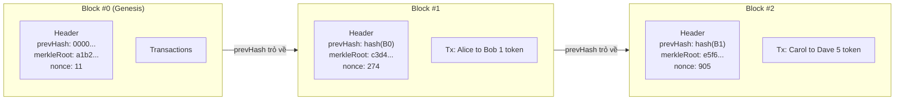
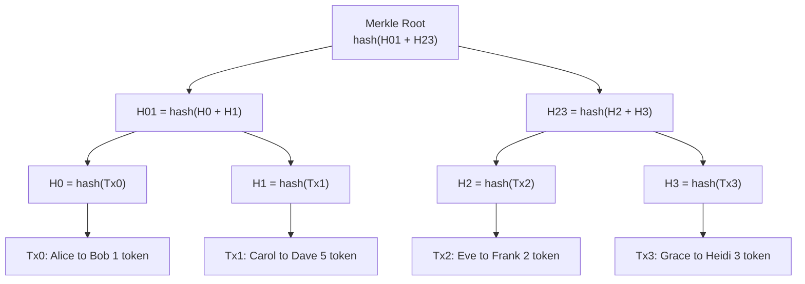
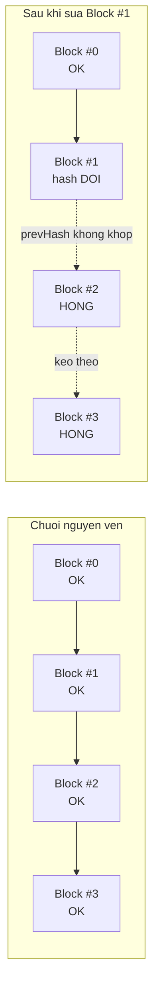
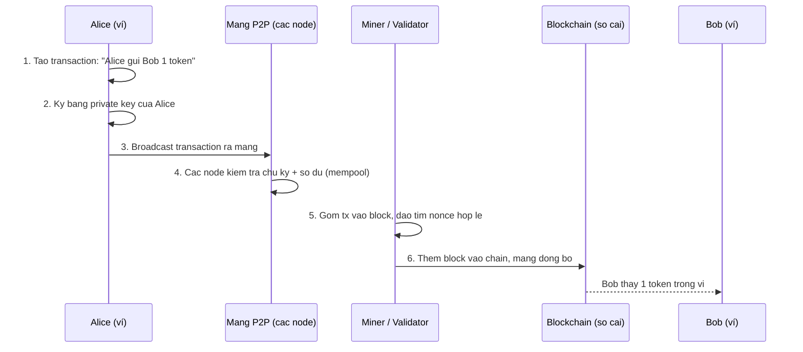

# Blockchain hoạt động thế nào?

> **Tác giả:** Mr.Rom\
> **Phiên bản:** v1.0.0\
> **Tạo lúc:** 22/06/2026\
> **Cập nhật:** 22/06/2026\
> **Level:** Basic\
> **Tags:** blockchain, hash, sha-256, merkle-tree, immutability, mining, transaction, web3\
> **Yêu cầu trước:** [Blockchain là gì?](00_what-is-blockchain.md)

> 🎯 *Bài trước bạn đã biết blockchain là "sổ cái phân tán không ai sửa được". Bài này mở nắp ra xem **bên trong** vận hành: một block gồm gì, hàm hash SHA-256 làm gì, Merkle tree giúp kiểm tra giao dịch ra sao, vì sao sửa một block là phá vỡ cả chuỗi, và một giao dịch chuyển token từ Alice sang Bob đi qua những bước nào. Cuối bài bạn hiểu mining và 51% attack ở mức tổng quan.*

## 🎯 Sau bài này bạn sẽ

- [ ] Mô tả được cấu trúc một **block**: header (prev hash, timestamp, nonce, merkle root) + danh sách transaction
- [ ] Giải thích 3 tính chất của hàm hash mật mã (**SHA-256**): deterministic, avalanche, one-way — và tự chạy được một demo hash ngắn
- [ ] Hiểu **Merkle tree** giúp kiểm tra một giao dịch có trong block mà không cần tải cả block
- [ ] Giải thích vì sao đổi một block làm hỏng **toàn bộ chuỗi** phía sau (immutability)
- [ ] Kể được vòng đời một giao dịch: tạo → ký bằng private key → broadcast → vào block → thêm vào chain
- [ ] Nắm **mining/validation** và **51% attack** ở mức tổng quan

---

## Tình huống — Alice chuyển 1 token cho Bob

Alice muốn gửi Bob **1 token**. Có hai thế giới xử lý chuyện này rất khác nhau.

**Thế giới 1 — ngân hàng tập trung.** Alice mở app ngân hàng, gõ "chuyển 1 triệu cho Bob". Ngân hàng là **một bên duy nhất giữ sổ cái**: nó kiểm tra Alice còn tiền không, trừ tài khoản Alice, cộng tài khoản Bob, ghi vào database của riêng nó. Cả Alice lẫn Bob đều **phải tin** rằng ngân hàng ghi đúng và không tự sửa số dư. Nếu database ngân hàng bị sửa lén (hoặc nhân viên gian lận), không ai bên ngoài biết.

**Thế giới 2 — blockchain công khai.** Không có "ngân hàng". Thay vào đó là **hàng nghìn máy tính** (node) trên khắp thế giới, mỗi máy giữ **một bản sao y hệt** của cùng một cuốn sổ cái. Alice ký lệnh chuyển bằng "chữ ký số" của riêng mình, phát lệnh đó ra mạng, các máy cùng kiểm tra và cùng ghi vào sổ. Một khi đã ghi, **không máy nào sửa được** mà không bị cả mạng phát hiện ngay.

Một loạt câu hỏi hiện ra — và chính là bài hôm nay:

- Cái "sổ cái" đó cấu trúc thế nào để "không sửa được"? (→ block + hash)
- "Chữ ký số của Alice" là gì, sao Bob tin được mà không cần ngân hàng làm trọng tài? (→ private key)
- Hàng nghìn máy làm sao **đồng ý** với nhau cùng một sổ? (→ mining/validation)
- Nếu kẻ xấu muốn sửa sổ thì cần gì? (→ 51% attack)

→ Ta đi từ viên gạch nhỏ nhất — một **block** — rồi ghép dần lên thành chuỗi, cuối cùng theo chân giao dịch của Alice từ đầu tới cuối.

---

## 1️⃣ Một block chứa gì bên trong?

Blockchain, đúng như tên gọi, là **chuỗi các block** (khối) nối nhau. Mỗi block là một "trang sổ" ghi một nhóm giao dịch. Nhưng nó không chỉ có giao dịch — phần "đầu trang" (header) chứa vài thông tin nhỏ mà toàn bộ tính bất biến của blockchain dựa vào.

🪞 **Ẩn dụ — block như một trang nhật ký niêm phong:**
> Tưởng tượng một cuốn nhật ký mà mỗi trang, sau khi viết xong, bị **niêm phong bằng sáp** và đóng một con dấu độc nhất. Con dấu đó được tính từ **toàn bộ nội dung trang này** *cộng với* con dấu của **trang ngay trước**. Ai lén sửa một chữ trên trang cũ → con dấu trang đó sai → con dấu mọi trang sau cũng sai theo. Cả cuốn sổ "tự tố cáo" chỗ bị sửa.

Một block gồm hai phần: **header** (đầu khối) và **danh sách transaction** (thân khối). Header chứa bốn trường quan trọng — đây là nhóm thông tin quyết định, nên ta xem từng trường một:

- **`prevHash`** (hash của block trước) — con dấu của trang ngay trước. Đây chính là "sợi xích" nối các block thành chuỗi.
- **`timestamp`** (mốc thời gian) — thời điểm block được tạo, thường tính bằng giây Unix.
- **`nonce`** (số dùng một lần) — một con số mà thợ đào (miner) thay đổi liên tục để tìm ra hash hợp lệ. Sẽ rõ ở mục mining.
- **`merkleRoot`** (gốc cây Merkle) — một hash duy nhất "tóm tắt" **toàn bộ** danh sách giao dịch trong block. Sửa bất kỳ giao dịch nào → merkleRoot đổi.

Phần thân là **danh sách transaction** — các giao dịch thực sự (Alice gửi Bob 1 token, Carol gửi Dave 5 token...).

Để hình dung block và sợi xích nối chúng, đây là sơ đồ ba block đầu tiên. Lưu ý mũi tên `prevHash` luôn trỏ ngược về block trước:



→ Điểm cốt lõi cần khắc sâu từ sơ đồ: mỗi block **ôm theo hash của block trước** trong header của mình. Nhờ đó các block không chỉ "xếp cạnh nhau" mà bị **khoá chặt vào nhau** theo thứ tự — đụng vào một mắt xích là cả chuỗi phía sau gãy theo. Vì sao "gãy"? Câu trả lời nằm ở hàm hash, ta xem ngay.

> [!NOTE]
> Block đầu tiên của mọi blockchain gọi là **genesis block** (block khởi thuỷ). Nó đặc biệt vì không có block nào trước nó, nên `prevHash` của nó là một giá trị quy ước (thường là toàn số 0). Mọi block khác đều dây chuyền ngược về tới đây.

---

## 2️⃣ Hàm hash mật mã — "con dấu niêm phong" SHA-256

Toàn bộ phép màu "không sửa được" dựa trên một thứ: **hàm hash mật mã** (cryptographic hash function). Bitcoin và rất nhiều blockchain dùng **SHA-256** — một hàm nhận vào dữ liệu bất kỳ (một chữ, một file, cả triệu giao dịch) và trả ra một chuỗi **256 bit** (thể hiện dưới dạng 64 ký tự hex).

🪞 **Ẩn dụ — máy xay sinh tố một chiều:**
> Hash giống như cho trái cây vào máy xay. Cùng một công thức trái cây → luôn ra **đúng một ly sinh tố** màu sắc y hệt. Nhưng nhìn ly sinh tố, bạn **không thể** tách ngược lại ra từng quả ban đầu. Và chỉ cần thêm **một hạt muối**, ly sinh tố đổi vị hoàn toàn so với ly cũ.

Ba tính chất của SHA-256 mà ta cần nắm — và cả ba đều minh hoạ được bằng máy xay sinh tố trên:

- **Deterministic** (xác định) — cùng input → **luôn luôn** cùng output. Hash chữ `"hello"` hôm nay, năm sau, trên máy nào cũng ra y hệt. (Cùng công thức trái cây → cùng ly sinh tố.)
- **Avalanche** (hiệu ứng thác đổ) — đổi input **một chút xíu** → output đổi **hoàn toàn**, không liên quan gì tới output cũ. (Thêm một hạt muối → đổi vị cả ly.)
- **One-way** (một chiều) — từ output **không** suy ngược ra input được; cách duy nhất là thử mò từng input. (Nhìn ly sinh tố không đoán được công thức.)

Tính chất một-chiều này nghe đơn giản nhưng cực mạnh: nó cho phép "niêm phong" dữ liệu mà ai cũng kiểm chứng được, nhưng không ai giả mạo được.

### Thử SHA-256 ngay trên máy bạn

Đoạn code dưới đây dùng module `crypto` có sẵn trong **Node.js** (không cần cài gì thêm) để hash vài chuỗi. Mục tiêu là **tận mắt thấy** ba tính chất trên: lần lượt hash `"hello"`, rồi `"hello"` lần nữa (xem có giống lần đầu — deterministic), rồi `"hellp"` (đổi đúng 1 chữ cái cuối — xem avalanche). Lưu vào file `hash-demo.js`:

```javascript
// hash-demo.js — chạy bằng: node hash-demo.js
const crypto = require("crypto");

// Hàm tiện ích: nhận chuỗi, trả về hash SHA-256 dạng hex
function sha256(text) {
  return crypto.createHash("sha256").update(text).digest("hex");
}

// 1. Deterministic — hash "hello" hai lần, kết quả phải y hệt
console.log("hello  ->", sha256("hello"));
console.log("hello  ->", sha256("hello"));

// 2. Avalanche — đổi đúng 1 ký tự cuối (o -> p), hash đổi hoàn toàn
console.log("hellp  ->", sha256("hellp"));

// 3. Input rỗng cũng ra một hash hợp lệ 64 ký tự hex
console.log("(rong) ->", sha256(""));
```

Chạy lệnh:

```bash
node hash-demo.js
```

Kết quả mong đợi (hash là giá trị cố định của SHA-256, máy bạn sẽ ra **y hệt**):

```text
hello  -> 2cf24dba5fb0a30e26e83b2ac5b9e29e1b161e5c1fa7425e73043362938b9824
hello  -> 2cf24dba5fb0a30e26e83b2ac5b9e29e1b161e5c1fa7425e73043362938b9824
hellp  -> fdd7585e08c4e2afd71dcabdb4636c89d557a3f42db9e2040c8bbd1708aa4ce7
(rong) -> e3b0c44298fc1c149afbf4c8996fb92427ae41e4649b934ca495991b7852b855
```

Đối chiếu output để thấy rõ ba tính chất:

- **Dòng 1 và dòng 2 giống hệt** — cùng input `"hello"` ra cùng hash. Đó là **deterministic**. Nhờ vậy mọi node trên mạng hash cùng một block sẽ ra cùng kết quả, đối chiếu được với nhau.
- **Dòng 3 (`hellp`) hoàn toàn khác dòng 1** dù chỉ đổi `o` thành `p`. Đó là **avalanche** — không có cách nào "đoán" hash mới từ hash cũ.
- **Dòng 4** cho thấy ngay cả chuỗi rỗng cũng ra đúng 64 ký tự hex. SHA-256 **luôn** trả về 256 bit, bất kể input dài ngắn ra sao.

> [!TIP]
> Bạn cũng kiểm chứng nhanh không cần viết file: trên macOS/Linux gõ `printf 'hello' | shasum -a 256` sẽ ra đúng chuỗi `2cf24dba...` ở trên. Dùng `printf` (không phải `echo`) để tránh ký tự xuống dòng làm sai hash.

---

## 3️⃣ Merkle tree — kiểm tra một giao dịch mà không cần tải cả block

Một block thật của Bitcoin có thể chứa **vài nghìn giao dịch**. Giả sử điện thoại của Bob muốn xác minh "giao dịch Alice gửi mình 1 token đã thực sự nằm trong block #1 chưa". Cách ngây thơ là tải **toàn bộ** vài nghìn giao dịch về rồi dò — quá nặng với một chiếc điện thoại.

**Merkle tree** (cây Merkle, đặt theo tên Ralph Merkle) giải quyết đúng việc này. Ý tưởng: thay vì hash cả đống giao dịch thành một cục, ta hash **từng cặp** rồi gộp dần lên thành cây, cho tới khi còn **một hash duy nhất** ở đỉnh — gọi là **merkle root**. Chính merkle root này được nhét vào header block (mục 1).

🪞 **Ẩn dụ — cây gia phả của các hash:**
> Mỗi giao dịch như một người ở **hàng dưới cùng** của cây gia phả. Hai người ghép lại "sinh ra" một nút cha (hash của cặp đó). Hai nút cha lại ghép thành ông bà... cứ thế lên tới **một tổ tiên chung duy nhất** (merkle root). Muốn chứng minh một người thuộc dòng họ này, bạn không cần liệt kê cả họ — chỉ cần chỉ ra **đường nối** từ người đó lên tới tổ tiên chung.

Sơ đồ dưới minh hoạ cây Merkle cho một block có **4 giao dịch** (Tx0..Tx3). Đọc từ dưới lên: lá là hash từng giao dịch, mỗi tầng ghép cặp rồi hash lại, đỉnh là merkle root:



→ Điều kỳ diệu: để chứng minh **Tx0 thuộc block**, Bob chỉ cần `H1` và `H23` (hai "anh em họ" trên đường lên đỉnh). Anh tự tính `H0 = hash(Tx0)`, ghép thành `H01 = hash(H0 + H1)`, rồi `hash(H01 + H23)` — nếu ra đúng merkle root trong header thì Tx0 chắc chắn nằm trong block. Với 4 giao dịch chỉ cần 2 hash phụ; với **một triệu** giao dịch cũng chỉ cần khoảng **20 hash** — thay vì tải cả triệu. Đây chính là nền tảng của **light client** (ví nhẹ trên điện thoại).

Hãy tự dựng một merkle root 4 giao dịch để thấy nó chỉ là "hash chồng hash". Lưu vào `merkle-demo.js`:

```javascript
// merkle-demo.js — dựng merkle root cho 4 giao dịch
const crypto = require("crypto");

function sha256(text) {
  return crypto.createHash("sha256").update(text).digest("hex");
}

// 1. Bốn giao dịch trong block (rút gọn cho dễ đọc)
const txs = [
  "Alice->Bob:1",
  "Carol->Dave:5",
  "Eve->Frank:2",
  "Grace->Heidi:3",
];

// 2. Tầng lá: hash từng giao dịch
let level = txs.map(sha256);

// 3. Ghép cặp và hash lên cho tới khi còn 1 nút (merkle root)
while (level.length > 1) {
  const next = [];
  for (let i = 0; i < level.length; i += 2) {
    const left = level[i];
    const right = level[i + 1] ?? left; // lẻ thì nhân đôi nút cuối
    next.push(sha256(left + right));
  }
  level = next;
}

console.log("Merkle root:", level[0]);
```

Chạy:

```bash
node merkle-demo.js
```

Kết quả mong đợi (cố định vì SHA-256 deterministic):

```text
Merkle root: 5212e058876b1b5eab751c5e853ae141b137abec1b68b9ba4da999d1e7e298c5
```

> [!NOTE]
> Giá trị merkle root cụ thể phụ thuộc vào **đúng từng ký tự** của các chuỗi giao dịch và cách ghép cặp. Điểm cần nhớ không phải con số này, mà là: chỉ cần **đổi một ký tự** trong bất kỳ giao dịch nào (ví dụ `1` thành `2`), merkle root sẽ đổi hoàn toàn — kéo theo header block đổi. Đó là cách block "khoá" toàn bộ giao dịch bên trong.

---

## 4️⃣ Vì sao sửa một block phá vỡ cả chuỗi? (immutability)

Giờ ta ghép hai mảnh đã học — **hash** (mục 2) và **prevHash trong header** (mục 1) — để hiểu tính chất danh tiếng nhất của blockchain: **immutability** (bất biến, không sửa được).

Nhắc lại: hash của một block được tính từ **toàn bộ header** của nó, mà header lại chứa `prevHash` (hash block trước) và `merkleRoot` (tóm tắt mọi giao dịch). Tức là:

```text
hash(Block) = SHA-256( prevHash + timestamp + nonce + merkleRoot )
```

Bây giờ giả sử kẻ xấu muốn sửa một giao dịch ở **Block #1** (ví dụ đổi "Alice gửi Bob 1 token" thành "10 token"). Chuỗi phản ứng dây chuyền xảy ra:

1. Sửa giao dịch → `merkleRoot` của Block #1 **đổi** (mục 3).
2. `merkleRoot` đổi → **hash của Block #1 đổi** (vì hash tính từ header chứa merkleRoot).
3. Nhưng **Block #2** đang lưu `prevHash = hash cũ của Block #1`. Giờ hash Block #1 đã khác → `prevHash` của Block #2 **không còn khớp** → Block #2 hỏng.
4. Để "chữa", kẻ xấu phải tính lại hash Block #2 → nhưng việc đó lại làm hash Block #2 đổi → Block #3 hỏng theo... cứ thế **tới tận block cuối cùng**.

Sơ đồ dưới minh hoạ hiệu ứng domino đó. So sánh hàng trên (chuỗi nguyên vẹn) với hàng dưới (sau khi sửa Block #1):



→ Đây là lý do "blockchain không sửa được": sửa một block buộc phải **tính lại hash của nó và mọi block sau nó**. Trên một mạng mà hàng nghìn node cùng giữ bản sao và việc tính hash hợp lệ rất tốn công (mục 5), làm lại cả chuỗi nhanh hơn cả mạng cộng lại là điều **gần như bất khả thi**. Đối chiếu với ngân hàng tập trung: sửa một dòng trong database chỉ là một câu `UPDATE` — không có cơ chế domino nào tố cáo.

> [!IMPORTANT]
> "Bất biến" ở đây nghĩa là **không sửa được mà không bị phát hiện**, chứ không phải "dữ liệu được khoá vật lý". Bất kỳ ai cũng có thể sửa bản sao sổ cái **trên máy của riêng họ** — nhưng bản sao đó lập tức lệch khỏi phần còn lại của mạng và bị từ chối. Sức mạnh nằm ở chỗ **đông người cùng giữ một bản giống nhau**, không phải ở chỗ file bị khoá.

---

## 5️⃣ Vòng đời một giao dịch — theo chân Alice gửi Bob 1 token

Giờ ta ráp tất cả lại bằng chính tình huống đầu bài: Alice gửi Bob 1 token trên blockchain công khai. Trước khi xem từng bước, cần làm rõ hai khái niệm chìa khoá về **chữ ký số** — thứ thay thế vai trò "ngân hàng làm trọng tài":

- **Private key** (khoá riêng) — một con số bí mật **chỉ Alice giữ**. Dùng nó để **ký** giao dịch. Mất private key = mất quyền kiểm soát tiền; lộ nó = người khác tiêu tiền của bạn.
- **Public key / address** (khoá công khai / địa chỉ) — công khai cho cả thế giới, là "địa chỉ ví" để nhận tiền. Bất kỳ ai cũng dùng public key của Alice để **kiểm chứng** chữ ký là thật, nhưng **không** từ đó suy ngược ra private key (lại là tính một-chiều của mật mã).

🪞 **Ẩn dụ — con dấu khắc riêng:**
> Private key như **con dấu khắc riêng** chỉ Alice có, đóng lên giao dịch để nói "tôi đồng ý chi". Public key như **mẫu dấu** Alice dán công khai ở quảng trường — ai cũng đối chiếu được "dấu trên giao dịch khớp mẫu dấu của Alice", nhưng không ai khắc lại được con dấu gốc từ mẫu in.

Vòng đời giao dịch đi qua sáu bước. Sơ đồ tuần tự dưới đây cho thấy ai làm gì, theo thứ tự thời gian:



Đi qua từng bước cho rõ:

1. **Tạo transaction.** Ví của Alice soạn một bản ghi: "từ địa chỉ Alice → địa chỉ Bob, số lượng 1 token", kèm một khoản phí nhỏ cho miner.
2. **Ký bằng private key.** Alice dùng private key tạo **chữ ký số** trên nội dung giao dịch. Chữ ký này chứng minh hai điều: giao dịch đúng là Alice phát ra, và nội dung **không bị sửa** sau khi ký (đổi một chữ → chữ ký sai).
3. **Broadcast.** Giao dịch đã ký được phát ra **mạng ngang hàng** (P2P) — mỗi node nhận được lại chuyển tiếp cho hàng xóm, lan ra cả mạng.
4. **Vào mempool & kiểm tra.** Mỗi node kiểm tra: chữ ký có khớp public key của Alice không? Alice có đủ số dư không? Hợp lệ thì giao dịch nằm chờ trong **mempool** (bể giao dịch chưa xác nhận).
5. **Đưa vào block (mining/validation).** Một miner gom các giao dịch trong mempool thành một block ứng viên, rồi làm "công việc đào" để tìm block hợp lệ (mục 6 giải thích).
6. **Thêm vào chain.** Block hợp lệ được phát ra, các node khác **kiểm tra lại** rồi gắn vào bản sao sổ cái của mình. Lúc này Bob thấy 1 token trong ví. Block càng được nhiều block khác chồng lên (gọi là **confirmations** — số xác nhận), giao dịch càng chắc chắn.

Để thấy rõ blockchain "phân tán" khác ngân hàng "tập trung" ở đâu, đặt cùng giao dịch này lên bảng so sánh — đọc theo từng đầu việc:

| Đầu việc | Ngân hàng tập trung | Blockchain công khai |
|---|---|---|
| Ai giữ sổ cái | Một bên duy nhất (ngân hàng) | Hàng nghìn node, mỗi node một bản sao y hệt |
| Ai duyệt giao dịch | Hệ thống nội bộ ngân hàng | Cả mạng cùng kiểm tra + cơ chế đồng thuận |
| Căn cứ tin tưởng | Tin vào uy tín ngân hàng | Tin vào toán học (chữ ký + hash) + số đông |
| Sửa lén sổ cái | Một câu `UPDATE`, khó phát hiện | Phá vỡ cả chuỗi, cả mạng phát hiện ngay |
| Hoạt động ngoài giờ | Có thể bị giới hạn (giờ làm việc, ngày lễ) | 24/7, không nghỉ |
| Cần trung gian | Có (ngân hàng làm trọng tài) | Không — chữ ký số thay vai trò trọng tài |

→ Điểm rút ra: blockchain **thay người trung gian bằng toán học và số đông**. Không cần tin một bên nào cụ thể, vì gian lận sẽ bị chính cấu trúc dữ liệu và cả mạng tố cáo. Đây là lý do người ta gọi nó là hệ thống "trustless" — không phải "không có niềm tin", mà là "không cần đặt niềm tin vào một bên riêng lẻ".

---

## 6️⃣ Mining & validation — làm sao cả mạng đồng ý một sổ?

Còn một câu hỏi treo: hàng nghìn node, ai cũng có quyền đề xuất block — vậy làm sao tất cả **đồng ý** dùng chung một chuỗi, không loạn? Đây là việc của **cơ chế đồng thuận** (consensus). Bài này chỉ nhìn ở mức tổng quan; cơ chế chi tiết để dành cho bài sau.

Cách kinh điển (Bitcoin) là **Proof of Work** (PoW — bằng chứng công việc), thực hiện qua **mining** (đào). Quy tắc: một block chỉ hợp lệ nếu **hash của nó nhỏ hơn một ngưỡng** nào đó — cụ thể là bắt đầu bằng một số lượng số 0 nhất định. Vì hash có tính avalanche (không đoán trước được), cách duy nhất để đạt là **thử đi thử lại**: miner thay đổi trường `nonce` trong header, hash lại, kiểm tra, đổi nonce khác, hash lại... cho tới khi may mắn ra một hash đủ nhỏ.

🪞 **Ẩn dụ — tung xúc xắc khổng lồ:**
> Mining như yêu cầu "tung xúc xắc tới khi ra 6 số 6 liên tiếp". Không có mẹo, chỉ có tung thật nhiều lần. Ai có nhiều tay tung (nhiều sức tính toán) hơn thì có cơ hội ra trước. Nhưng một khi có người la lên "ra rồi!", **mọi người khác chỉ cần liếc mắt là xác nhận được ngay** — kiểm tra một kết quả thì tức thì, còn tìm ra nó thì cực tốn công.

Đó là bản chất bất đối xứng của PoW: **khó tìm, dễ kiểm tra**. Miner tốn rất nhiều điện và máy để tìm nonce; nhưng node nào cũng kiểm tra "hash này có thật sự nhỏ hơn ngưỡng không" chỉ trong tích tắc.

Ta thử mô phỏng "đào" ở quy mô tí hon — tìm nonce sao cho hash bắt đầu bằng `0000`. Đây chính là PoW thu nhỏ. Lưu vào `mining-demo.js`:

```javascript
// mining-demo.js — mô phỏng Proof of Work tí hon
const crypto = require("crypto");

function sha256(text) {
  return crypto.createHash("sha256").update(text).digest("hex");
}

// Dữ liệu block (rút gọn): prevHash + merkleRoot, cố định
const blockData = "prev:abc123|merkle:def456";

// Độ khó: hash phải bắt đầu bằng 4 số 0
const target = "0000";

let nonce = 0;
let hash = "";

// Đào: tăng nonce tới khi hash đạt độ khó
while (true) {
  hash = sha256(blockData + nonce);
  if (hash.startsWith(target)) break;
  nonce++;
}

console.log("Tim thay nonce:", nonce);
console.log("Hash hop le   :", hash);
```

Chạy:

```bash
node mining-demo.js
```

Kết quả mẫu (giá trị `nonce` cụ thể tuỳ `blockData`, nhưng hash luôn bắt đầu bằng `0000`):

```text
Tim thay nonce: 2327
Hash hop le   : 000033dc6accde8e3a79d7b27eb758fcb4455eac762c5b6066d640aa2c6217fe
```

Phân tích kết quả:

- Máy phải thử hơn **2.300** giá trị nonce trước khi trúng một hash bắt đầu bằng `0000` — đó là "công việc" trong Proof of Work. Mỗi số 0 thêm vào `target` làm độ khó tăng trung bình ~16 lần (đòi `00000` thì phải thử cỡ vài chục nghìn lần).
- Một khi có nonce, **bất kỳ ai** chỉ cần `sha256(blockData + 2327)` một lần là xác nhận hash đúng. Khó tìm, dễ kiểm tra — đúng như ẩn dụ xúc xắc.
- Bitcoin thật yêu cầu hash nhỏ hơn nhiều, nên cả mạng phải thử **hàng tỷ tỷ** lần mỗi giây. Mạng tự điều chỉnh độ khó để trung bình ~10 phút ra một block.

> [!NOTE]
> Không phải blockchain nào cũng dùng PoW tốn điện. Ethereum từ 2022 đã chuyển sang **Proof of Stake** (PoS — bằng chứng cổ phần): thay vì "đua sức tính toán", validator phải **khoá (stake)** một lượng tiền làm cọc; gian lận thì bị tịch thu cọc. Chi tiết các cơ chế đồng thuận để dành cho bài sau trong cụm.

---

## 7️⃣ 51% attack — điểm yếu của số đông

Vì cả mạng tin vào "chuỗi dài nhất hợp lệ" và việc tạo block cần sức tính toán, một câu hỏi tự nhiên: nếu **một kẻ nắm hơn nửa sức tính toán** của cả mạng thì sao?

Đó chính là **51% attack** (tấn công 51%). Nếu một thực thể kiểm soát **> 50%** sức đào (với PoW) hoặc cổ phần (với PoS), về lý thuyết họ có thể:

- **Đào nhanh hơn phần còn lại của mạng cộng lại** → tự tạo một nhánh chuỗi dài hơn, rồi "thay thế" lịch sử gần đây bằng nhánh của mình.
- **Double-spend** (tiêu hai lần) — tiêu một số tiền, chờ giao dịch được xác nhận để nhận hàng, rồi viết lại lịch sử để xoá giao dịch đó, lấy lại tiền.

🪞 **Ẩn dụ — bỏ phiếu mà một người cầm quá nửa số phiếu:**
> Cả mạng giống như một cuộc biểu quyết "phiên bản sổ cái nào đúng", bỏ phiếu bằng sức tính toán. Nếu một người cầm hơn nửa số phiếu, họ luôn thắng — và có thể ép thông qua phiên bản sổ cái có lợi cho mình.

Nhưng thực tế khó hơn nhiều, và đây là phần trấn an quan trọng:

- Với mạng lớn như Bitcoin, gom được > 50% sức đào tốn **chi phí khổng lồ** (điện, phần cứng) — thường lớn hơn nhiều so với số tiền cướp được.
- Kẻ tấn công **không** thể tiêu tiền của người khác hay tạo token từ không khí (chữ ký số vẫn chặn việc đó). Họ chỉ có thể viết lại **lịch sử giao dịch gần đây của chính họ**.
- Tấn công thành công sẽ làm sụp niềm tin vào đồng coin đó → giá giảm → chính kẻ tấn công (đã đầu tư cả núi phần cứng) cũng thiệt.

> [!WARNING]
> 51% attack là rủi ro **thật** với các blockchain nhỏ, ít node, sức đào thấp — đã có vài đồng coin nhỏ bị tấn công kiểu này. Với mạng lớn (Bitcoin, Ethereum) thì gần như bất khả thi về mặt kinh tế. Quy tắc rút gọn: **mạng càng đông và càng phi tập trung thì càng an toàn** trước 51% attack.

→ Đây cũng là lý do vì sao "số node" và "mức độ phi tập trung" của một blockchain quan trọng đến vậy — chúng chính là hàng rào chống lại kiểu tấn công này.

---

## 💡 Cạm bẫy thường gặp & Best practice

### ❌ Cạm bẫy: nghĩ "hash là mã hoá, giải mã được"

- **Triệu chứng**: cho rằng hash một giao dịch xong thì "giải ngược" lại được nội dung, hoặc nhầm hash với mã hoá (encryption).
- **Nguyên nhân**: cả hash lẫn mã hoá đều biến dữ liệu thành chuỗi khó đọc, dễ gộp làm một.
- **Cách tránh**: nhớ hash là **một chiều** — không có "khoá giải" nào lấy lại input. Mã hoá thì có khoá để giải ngược. Blockchain dùng hash để **niêm phong và kiểm tra**, không để giấu rồi mở lại.

### ❌ Cạm bẫy: tin "blockchain bất biến nên dữ liệu trên đó luôn đúng"

- **Triệu chứng**: nghĩ "đã ghi lên blockchain thì chắc chắn là sự thật".
- **Nguyên nhân**: lẫn lộn giữa "không sửa được sau khi ghi" với "nội dung ghi vào là đúng".
- **Cách tránh**: blockchain chỉ đảm bảo dữ liệu **không bị sửa sau khi đã ghi** và **đúng quy tắc** (chữ ký hợp lệ, đủ số dư). Nó **không** kiểm chứng dữ liệu đó có phản ánh đúng thế giới thực hay không. Rác ghi vào vẫn là rác — chỉ là rác bất biến.

### ✅ Best practice: bảo vệ private key như bảo vệ két sắt

- **Vì sao**: trên blockchain không có "ngân hàng" để gọi khi mất khoá hay bị trộm. Ai giữ private key, người đó kiểm soát tiền — tuyệt đối, không thể đảo ngược.
- **Cách áp dụng**: không bao giờ chia sẻ private key / seed phrase; lưu offline (hardware wallet, giấy cất kỹ); cảnh giác mọi trang/app hỏi private key (gần như chắc chắn là lừa đảo).

### ✅ Best practice: chờ đủ số xác nhận (confirmations) trước khi coi giao dịch là chắc chắn

- **Vì sao**: một block vừa được đào vẫn có thể bị thay thế nếu xuất hiện nhánh dài hơn (nhất là khi có ai đó cố 51% attack). Càng nhiều block chồng lên, càng khó đảo ngược.
- **Cách áp dụng**: với giao dịch giá trị lớn, chờ nhiều confirmations (ví dụ Bitcoin thường khuyến nghị ~6 block) rồi mới giao hàng/coi là xong, thay vì tin ngay block đầu tiên.

---

## 🧠 Tự kiểm tra (Self-check)

**Q1.** Header của một block gồm những trường chính nào? Mỗi trường để làm gì?

<details>
<summary>💡 Xem giải thích</summary>

Bốn trường chính trong header:

- **`prevHash`** — hash của block ngay trước; là "sợi xích" nối các block thành chuỗi.
- **`timestamp`** — mốc thời gian tạo block.
- **`nonce`** — số miner thay đổi liên tục để tìm hash hợp lệ (Proof of Work).
- **`merkleRoot`** — một hash tóm tắt toàn bộ danh sách giao dịch trong block.

Thân block là **danh sách transaction** thật sự. Hash của cả block được tính từ header, mà header chứa cả `prevHash` lẫn `merkleRoot` — nên đụng vào bất cứ thứ gì cũng làm hash đổi.

</details>

**Q2.** Nêu ba tính chất của hàm hash mật mã SHA-256 và giải thích mỗi tính chất giúp gì cho blockchain.

<details>
<summary>💡 Xem giải thích</summary>

1. **Deterministic** — cùng input luôn ra cùng output. Giúp mọi node hash cùng một block ra cùng kết quả, đối chiếu được với nhau.
2. **Avalanche** — đổi input một chút → output đổi hoàn toàn. Khiến không thể "đoán" hash mới từ hash cũ, và mọi thay đổi nhỏ trong dữ liệu đều bị phát hiện.
3. **One-way** — không suy ngược output ra input. Cho phép niêm phong dữ liệu mà ai cũng kiểm chứng được nhưng không ai giả mạo được; cũng là nền tảng để public key không lộ private key.

</details>

**Q3.** Bob muốn xác minh giao dịch của mình nằm trong một block 1 triệu giao dịch, nhưng điện thoại không tải nổi cả block. Merkle tree giúp gì?

<details>
<summary>💡 Xem giải thích</summary>

Merkle tree gộp hash của các giao dịch thành cây, đỉnh là **merkle root** (nằm trong header block). Để chứng minh một giao dịch thuộc block, Bob chỉ cần **các hash trên đường nối** từ giao dịch đó lên đỉnh — khoảng **20 hash** cho một triệu giao dịch (thay vì tải cả triệu). Bob tự hash giao dịch của mình, ghép dần với các hash phụ, nếu ra đúng merkle root thì giao dịch chắc chắn nằm trong block. Đây là nền tảng của **light client** (ví nhẹ trên điện thoại).

</details>

**Q4.** Vì sao sửa một giao dịch ở Block #1 lại làm hỏng Block #2, #3, ...?

<details>
<summary>💡 Xem giải thích</summary>

Chuỗi domino: sửa giao dịch → `merkleRoot` của Block #1 đổi → **hash của Block #1 đổi**. Nhưng Block #2 lưu `prevHash = hash cũ của Block #1`, giờ không còn khớp → Block #2 hỏng. Muốn chữa phải tính lại hash Block #2 → lại làm hash Block #2 đổi → Block #3 hỏng... lan tới block cuối. Trên mạng nhiều node với hash hợp lệ rất tốn công, làm lại cả chuỗi nhanh hơn cả mạng là gần như bất khả thi. Đó là **immutability**.

</details>

**Q5.** Mining (Proof of Work) "khó tìm, dễ kiểm tra" nghĩa là gì? 51% attack lợi dụng điều gì?

<details>
<summary>💡 Xem giải thích</summary>

**Khó tìm, dễ kiểm tra**: miner phải thử rất nhiều `nonce` để tìm ra hash đủ nhỏ (bắt đầu bằng nhiều số 0) — tốn điện và máy. Nhưng bất kỳ node nào chỉ cần hash **một lần** là xác nhận được kết quả đúng hay sai.

**51% attack**: nếu một thực thể nắm > 50% sức đào, họ có thể đào nhanh hơn cả phần còn lại → tạo nhánh dài hơn, viết lại lịch sử gần đây và thực hiện double-spend (tiêu hai lần). Họ **không** tạo được tiền từ không khí hay tiêu tiền người khác (chữ ký vẫn chặn). Mạng càng lớn và phi tập trung thì tấn công này càng tốn kém tới mức bất khả thi.

</details>

---

## ⚡ Tra cứu nhanh (Cheatsheet)

### Cấu trúc một block

```text
Block
├── Header
│   ├── prevHash    : hash của block trước (sợi xích nối chuỗi)
│   ├── timestamp   : mốc thời gian tạo block
│   ├── nonce       : số miner đổi để tìm hash hợp lệ (PoW)
│   └── merkleRoot  : hash tóm tắt toàn bộ giao dịch
└── Transactions    : danh sách giao dịch thật sự
```

### Ba tính chất hàm hash (SHA-256)

```text
Deterministic : cùng input  -> luôn cùng output
Avalanche     : đổi 1 bit    -> output đổi hoàn toàn
One-way       : output       -> KHÔNG suy ngược ra input
```

### Tính hash nhanh trên Terminal

| Mục đích | Lệnh |
|---|---|
| Hash một chuỗi (macOS/Linux) | `printf 'hello' \| shasum -a 256` |
| Hash một file | `shasum -a 256 file.txt` |
| Hash bằng Node.js | `node -e "console.log(require('crypto').createHash('sha256').update('hello').digest('hex'))"` |

### Vòng đời giao dịch (6 bước)

```text
1. Tạo transaction      -> ví soạn "Alice gửi Bob 1 token" + phí
2. Ký bằng private key  -> chữ ký số chứng minh chủ + chống sửa
3. Broadcast            -> phát ra mạng P2P
4. Vào mempool          -> các node kiểm tra chữ ký + số dư
5. Đưa vào block        -> miner gom tx + đào tìm nonce
6. Thêm vào chain       -> cả mạng đồng bộ; chờ confirmations
```

---

## 📚 Từ Điển Thuật Ngữ (Glossary)

| EN | VN | Giải thích |
|---|---|---|
| Block | Khối | Một "trang sổ" chứa header + danh sách giao dịch |
| Block header | Đầu khối | Phần đầu block: prevHash, timestamp, nonce, merkleRoot |
| prevHash | Hash block trước | Hash của block ngay trước, dùng nối các block thành chuỗi |
| Timestamp | Mốc thời gian | Thời điểm block được tạo |
| Nonce | Số dùng một lần | Số miner thay đổi liên tục để tìm hash hợp lệ trong PoW |
| Hash function | Hàm băm | Hàm biến dữ liệu bất kỳ thành chuỗi cố định, một chiều |
| SHA-256 | SHA-256 | Hàm hash 256-bit (64 ký tự hex) Bitcoin và nhiều chain dùng |
| Deterministic | Tính xác định | Cùng input luôn cho cùng output |
| Avalanche effect | Hiệu ứng thác đổ | Đổi input một chút → output đổi hoàn toàn |
| One-way | Một chiều | Không thể suy ngược output ra input |
| Merkle tree | Cây Merkle | Cây hash gộp các giao dịch lên một đỉnh duy nhất |
| Merkle root | Gốc cây Merkle | Hash đỉnh của Merkle tree, đặt trong header block |
| Light client | Ví nhẹ | Client chỉ tải header, xác minh giao dịch qua Merkle proof |
| Immutability | Tính bất biến | Không sửa được sau khi ghi mà không bị cả mạng phát hiện |
| Transaction (tx) | Giao dịch | Một lệnh chuyển giá trị giữa hai địa chỉ |
| Private key | Khoá riêng | Số bí mật chỉ chủ ví giữ, dùng để ký giao dịch |
| Public key / Address | Khoá công khai / Địa chỉ | Công khai, dùng nhận tiền và kiểm chứng chữ ký |
| Digital signature | Chữ ký số | Bằng chứng giao dịch do đúng chủ ký và không bị sửa |
| Broadcast | Phát tán | Gửi giao dịch ra mạng để các node lan truyền |
| P2P network | Mạng ngang hàng | Mạng các node bình đẳng, không có server trung tâm |
| Mempool | Bể giao dịch chờ | Nơi chứa giao dịch hợp lệ chưa được vào block |
| Mining | Đào | Tìm nonce để tạo block hợp lệ (Proof of Work) |
| Validator | Người xác thực | Node xác thực + đề xuất block (thường trong Proof of Stake) |
| Proof of Work (PoW) | Bằng chứng công việc | Cơ chế đòi sức tính toán để tạo block (Bitcoin) |
| Proof of Stake (PoS) | Bằng chứng cổ phần | Cơ chế đòi khoá tiền làm cọc thay vì sức tính toán |
| Consensus | Đồng thuận | Cơ chế giúp cả mạng đồng ý một sổ cái duy nhất |
| Confirmations | Số xác nhận | Số block đã chồng lên block chứa giao dịch của bạn |
| Double-spend | Tiêu hai lần | Tiêu một số tiền hai lần bằng cách viết lại lịch sử |
| 51% attack | Tấn công 51% | Kẻ nắm > 50% sức mạng có thể viết lại lịch sử gần đây |
| Genesis block | Block khởi thuỷ | Block đầu tiên của chuỗi, không có block trước |

---

## 🔗 Liên kết & Tài nguyên

⬅️ **Bài trước:** [Blockchain là gì?](00_what-is-blockchain.md)\
➡️ **Bài tiếp theo:** [Smart Contract & EVM](02_smart-contracts-and-evm.md)\
↑ **Về cụm:** [Blockchain — README cụm](../../README.md)

### 🧭 Định hướng lộ trình học

- [Blockchain là gì?](00_what-is-blockchain.md) — bài trước, nền tảng khái niệm sổ cái phân tán
- [Smart Contract & EVM](02_smart-contracts-and-evm.md) — bài kế: code chạy trên blockchain, máy ảo EVM
- [Cơ chế đồng thuận & Crypto-economics](03_consensus-and-crypto-economics.md) — đào sâu PoW/PoS và động lực kinh tế

### 🧩 Các chủ đề có thể bạn quan tâm

- [Phát triển Web3 — bắt đầu từ đâu](04_web3-development.md) — bắt tay viết app tương tác blockchain
- [Cơ chế đồng thuận & Crypto-economics](03_consensus-and-crypto-economics.md) — vì sao node trung thực có lợi hơn gian lận

### 🌐 Tài nguyên tham khảo khác

- [Bitcoin whitepaper (Satoshi Nakamoto)](https://bitcoin.org/bitcoin.pdf) — bản gốc mô tả block, hash, Proof of Work
- [Anders Brownworth — Blockchain Demo](https://andersbrownworth.com/blockchain/) — demo tương tác: sửa một block, xem cả chuỗi đỏ rực
- [Node.js crypto docs](https://nodejs.org/api/crypto.html) — tài liệu module `crypto` dùng trong các demo SHA-256
- [Merkle tree (Wikipedia)](https://en.wikipedia.org/wiki/Merkle_tree) — chi tiết cấu trúc và Merkle proof

---

> 🎯 *Sau bài này bạn đã mở nắp blockchain: cấu trúc block, hàm hash SHA-256 và ba tính chất, Merkle tree để kiểm tra giao dịch hiệu quả, vì sao chuỗi bất biến, vòng đời một giao dịch của Alice, cùng mining và 51% attack ở mức tổng quan. Bài kế tiếp lên một tầng nữa: **smart contract** — code tự chạy trên blockchain — và **EVM**, cỗ máy ảo thực thi chúng.*

---

## 📌 Nhật ký thay đổi (Changelog)

- **v1.0.0 (22/06/2026)** — Bản đầu tiên. Cụm `blockchain/` lesson 1/5. Cover: cấu trúc block (header prevHash/timestamp/nonce/merkleRoot + danh sách transaction) + hàm hash SHA-256 và 3 tính chất (deterministic, avalanche, one-way) kèm demo Node.js chạy được + Merkle tree và Merkle proof cho light client + immutability (hiệu ứng domino khi sửa 1 block) + vòng đời giao dịch 6 bước (tạo → ký private key → broadcast → mempool → block → chain) đối chiếu ngân hàng tập trung + mining/Proof of Work (demo đào nonce) + Proof of Stake tổng quan + 51% attack. Kèm 4 sơ đồ mermaid (chuỗi block, Merkle tree, hiệu ứng domino, sequence vòng đời giao dịch) và 3 demo JavaScript verify chạy đúng.
