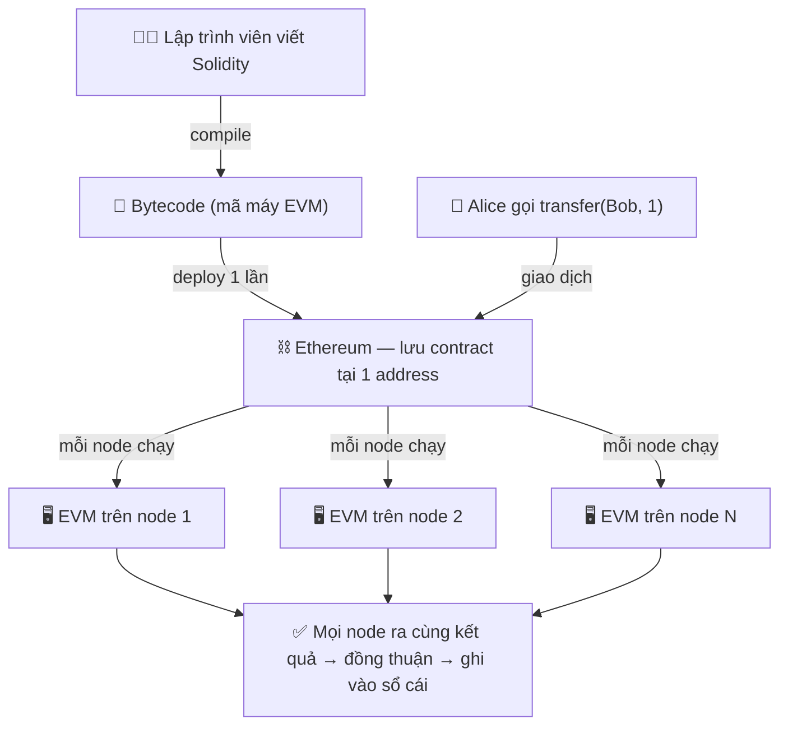
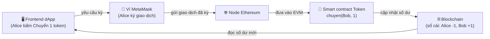

# Smart Contract & EVM

> **Tác giả:** Mr.Rom\
> **Phiên bản:** v1.0.0\
> **Tạo lúc:** 22/06/2026\
> **Cập nhật:** 22/06/2026\
> **Level:** Basic\
> **Tags:** blockchain, smart-contract, ethereum, evm, solidity, gas, erc-20, erc-721, dapp\
> **Yêu cầu trước:** [Blockchain hoạt động thế nào?](01_how-blockchain-works.md)

> 🎯 *Bài trước bạn đã thấy blockchain ghi giao dịch vào các block nối nhau và mạng đồng thuận về một sổ cái chung. Nhưng nếu sổ cái chỉ ghi được "Alice gửi Bob 1 đồng" thì nó vẫn chỉ là một cuốn sổ. Bài này trả lời câu hỏi: làm sao đặt **chương trình** chạy thẳng trên sổ cái đó? Sau bài này bạn hiểu smart contract là gì, EVM thực thi nó ra sao, vì sao phải trả gas, đọc được một contract Solidity đơn giản (đúng cú pháp), phân biệt ERC-20 với ERC-721, và biết một dApp ghép frontend với contract như thế nào.*

## 🎯 Sau bài này bạn sẽ

- [ ] Giải thích được **smart contract** là code chạy trên blockchain, tự động thực thi khi điều kiện thoả
- [ ] Hiểu **EVM** (Ethereum Virtual Machine) là máy ảo chạy bytecode, và vì sao nó là "máy tính dùng chung của cả mạng"
- [ ] Nói rõ **gas** là gì, tính phí ra sao, và vì sao gas tồn tại (chống vòng lặp vô hạn)
- [ ] Đọc được một contract **Solidity** đơn giản: `pragma`, SPDX, biến trạng thái, hàm
- [ ] Phân biệt **ERC-20** (token đồng nhất) với **ERC-721** (NFT) qua bảng so sánh
- [ ] Phân biệt **address ví** với **contract address**, và hiểu một **dApp** = frontend + smart contract

---

## Tình huống — chuyển 1 token cho Bob mà không cần ai "bấm nút duyệt"

Lấy đúng tình huống xuyên suốt cụm này: **Alice muốn chuyển 1 token cho Bob.**

Hãy nhìn cách một **ngân hàng tập trung** xử lý việc đó trước. Alice mở app, bấm "chuyển 1 đồng cho Bob". Yêu cầu này bay về **máy chủ của ngân hàng**. Ở đó có một phần mềm nội bộ kiểm tra: Alice có đủ số dư không? Tài khoản có bị khoá không? Có vượt hạn mức ngày không? Nếu mọi thứ ổn, phần mềm **trừ 1 đồng ở dòng của Alice, cộng 1 đồng ở dòng của Bob** trong database riêng của ngân hàng. Cái phần mềm "kiểm tra điều kiện rồi đổi số dư" đó — nó là một **chương trình**. Nhưng chương trình này nằm trong tay ngân hàng: chỉ ngân hàng thấy code, chỉ ngân hàng chạy nó, và bạn phải **tin** rằng họ chạy đúng.

Bây giờ qua blockchain. Bài trước bạn đã thấy mạng đồng thuận được về một sổ cái chung "ai có bao nhiêu". Nhưng nếu blockchain chỉ biết ghi "Alice -1, Bob +1" thì nó vẫn là một cuốn sổ thụ động — ai sẽ kiểm tra "Alice có đủ token không", "token này có quy tắc gì khi chuyển"? Một loạt câu hỏi lớn:

- Làm sao đặt **cái chương trình kiểm tra-và-đổi-số-dư đó** lên thẳng blockchain, để **không ai sở hữu riêng nó**, mọi người đều thấy code, và mạng tự chạy đúng như nhau?
- Nếu code chạy trên cả nghìn máy, ai trả tiền điện cho việc tính toán đó? Làm sao chặn một kẻ viết `while(true)` treo cả mạng?
- Code đó viết bằng ngôn ngữ gì, máy nào thực thi nó?

Lời giải cho tất cả những câu này có một cái tên: **smart contract**, chạy trên một máy ảo tên **EVM**, trả phí bằng **gas**, viết bằng **Solidity**. Ta đi từng cái.

---

## 1️⃣ Smart contract là gì?

Quay lại cái chương trình "kiểm tra điều kiện rồi đổi số dư" của ngân hàng. Ý tưởng của smart contract là: **lấy đúng chương trình đó, đặt nó lên blockchain, để cả mạng cùng chạy thay vì một công ty chạy riêng.**

**Định nghĩa kỹ thuật:** *Smart contract* (hợp đồng thông minh) là **một đoạn code được lưu thẳng trên blockchain**, có địa chỉ riêng, tự động thực thi logic của nó khi có người gọi tới và **điều kiện trong code được thoả**. Một khi đã deploy (triển khai), code đó **không ai sửa được** (bất biến), và **ai cũng đọc được** nó trên mạng.

🪞 **Ẩn dụ — máy bán nước tự động:**
> Smart contract giống một **máy bán nước tự động** đặt giữa quảng trường. Quy tắc của nó in rõ và ai cũng thấy: "bỏ vào 10 nghìn → nhả ra 1 chai". Không cần nhân viên đứng canh, không cần xin phép ai. Bạn bỏ tiền đủ và đúng điều kiện → máy **tự** nhả nước, không thể "đổi ý". Bỏ thiếu → máy không nhả, cũng không giữ tiền sai luật. Cái máy không thiên vị ai, không "nghỉ trưa", và chạy y hệt cho mọi người. Đó chính là tinh thần "*code is law*" — code chính là luật.

Điểm mấu chốt phân biệt với chương trình ngân hàng — gói gọn trong bảng dưới. Cùng một việc "chuyển 1 token", hai cách xử lý khác nhau ở chỗ **ai chạy code và ai kiểm soát**:

| Khía cạnh | Phần mềm ngân hàng (tập trung) | Smart contract (blockchain) |
|---|---|---|
| Ai giữ code | Ngân hàng giữ riêng, bạn không thấy | Công khai trên mạng, ai cũng đọc được |
| Ai chạy code | Máy chủ của ngân hàng | **Mọi node** trong mạng cùng chạy, kết quả phải khớp |
| Có thể sửa lén không | Có — ngân hàng đổi logic bất cứ lúc nào | Không — deploy xong là bất biến |
| Cần tin ai | Tin ngân hàng làm đúng | Tin vào **code** (đọc được) + đồng thuận mạng |
| Có cần con người duyệt không | Có (xử lý, đối soát) | Không — tự chạy khi điều kiện thoả |

→ Khác biệt lớn nhất: với smart contract, bạn không phải tin **một bên trung gian**, bạn tin vào **đoạn code công khai** mà cả mạng cùng thực thi. Nhưng "cả mạng cùng chạy code" đặt ra một câu hỏi kỹ thuật ngay lập tức: chạy ở **đâu**, bằng **máy gì**? Đó là EVM.

---

## 2️⃣ Ethereum và EVM — "máy tính dùng chung của cả thế giới"

Bài trước nói về blockchain nói chung. Smart contract cần một blockchain **biết chạy chương trình** chứ không chỉ ghi số dư. Blockchain phổ biến nhất cho việc này là **Ethereum** — ra mắt 2015, được thiết kế từ đầu để chạy code, không chỉ chuyển tiền như Bitcoin.

Trái tim của Ethereum là **EVM — Ethereum Virtual Machine** (máy ảo Ethereum).

**Định nghĩa:** *EVM* là một **máy ảo** (virtual machine — một "máy tính giả lập bằng phần mềm") chạy trên **mọi node** của mạng Ethereum. Nó nhận **bytecode** (mã máy của smart contract) và thực thi từng lệnh một. Vì mọi node chạy **cùng một EVM** trên **cùng một input**, tất cả phải ra **cùng một kết quả** — đó là cách mạng đồng thuận được về trạng thái sau khi chạy contract.

🪞 **Ẩn dụ — một chiếc máy tính, nhân bản trên cả nghìn máy:**
> Hãy tưởng tượng có **một chiếc máy tính duy nhất** mà cả thế giới dùng chung — gọi nó là "máy tính thế giới" (*world computer*). Khi Alice gọi smart contract để chuyển token cho Bob, **cả nghìn node** đều mở "chiếc máy tính" đó ra, chạy đúng đoạn code đó, và đối chiếu kết quả. Vì code giống nhau và input giống nhau, kết quả phải giống nhau. Không node nào "tự chế biến" được, vì các node khác sẽ phát hiện kết quả lệch và từ chối.

Để tránh nhầm lẫn các tầng khái niệm, ghim sẵn ba lớp này — chúng lồng vào nhau từ ngoài vào trong:

- **Ethereum** — *cái blockchain*: mạng các node, sổ cái, đồng thuận (đã học bài trước).
- **EVM** — *cái máy ảo bên trong* mỗi node, chuyên việc chạy bytecode của contract.
- **Smart contract** — *chương trình* mà EVM chạy, do bạn viết và deploy lên.

> [!NOTE]
> EVM không chỉ là chuyện riêng của Ethereum. Rất nhiều blockchain khác (Polygon, BNB Chain, Avalanche C-Chain, Arbitrum...) cũng chạy EVM hoặc tương thích EVM — gọi là *EVM-compatible*. Nghĩa là một smart contract viết cho Ethereum thường deploy lại được trên các mạng đó gần như nguyên xi. Học EVM một lần, dùng được nhiều nơi.

Sơ đồ dưới đặt ba lớp đó cạnh dòng đời một lời gọi từ Alice — đọc từ trên xuống để thấy code của bạn cuối cùng được chạy ở đâu:



→ Điều cần khắc sâu từ sơ đồ: code Solidity bạn viết được **biên dịch ra bytecode**, deploy **một lần** lên chain, nhưng mỗi lần ai đó gọi nó thì **mọi node đều chạy lại** trên EVM của mình. Chính vì "mọi node đều chạy" mà nảy sinh vấn đề chi phí — dẫn ta tới gas.

---

## 3️⃣ Gas — vì sao mỗi phép tính đều tốn phí

Đây là phần dễ gây "sốc" nhất với người mới: trên Ethereum, **gần như mọi thao tác đều mất phí**, kể cả chỉ cộng hai số. Vì sao?

Nhớ lại mục 2: khi Alice gọi contract, **cả nghìn node** phải chạy lại đoạn code đó. Đó là **công sức tính toán thật** — tốn CPU, tốn điện của hàng nghìn máy. Nếu việc chạy code **miễn phí**, sẽ có hai thảm hoạ:

1. Một kẻ ác ý viết contract có vòng lặp vô hạn `while(true) {}` và gọi nó → mọi node trên thế giới **kẹt mãi mãi** trong vòng lặp đó, cả mạng đứng hình.
2. Ai cũng spam giao dịch rác miễn phí → mạng nghẽn.

Giải pháp của Ethereum là **gas**.

**Định nghĩa:** *Gas* là **đơn vị đo lượng công tính toán** mà một thao tác tiêu tốn trên EVM. Mỗi lệnh EVM có một "giá gas" cố định (cộng số tốn ít gas, lưu dữ liệu vào storage tốn nhiều gas hơn). Khi gửi giao dịch, bạn **trả phí = lượng gas dùng × giá mỗi đơn vị gas**, thanh toán bằng **ETH** (đồng tiền gốc của Ethereum).

🪞 **Ẩn dụ — đổ xăng cho một chuyến đi:**
> "Gas" trong tiếng Anh nghĩa là **xăng** — và ẩn dụ chuẩn luôn. Chạy contract giống lái xe đi một quãng đường: quãng càng dài, càng nhiều "đoạn dốc" (phép tính nặng) thì càng tốn xăng. Trước khi đi, bạn đổ sẵn một bình (đặt *gas limit* — lượng gas tối đa sẵn lòng trả). Đi hết quãng mà còn xăng → được hoàn lại phần thừa. Nhưng nếu **giữa đường hết xăng** (chạy quá gas limit), xe **chết máy ngay tại chỗ**: giao dịch bị huỷ (*revert*), mọi thay đổi bị hoàn tác — **nhưng phần xăng đã đốt thì không đòi lại được**.

Chính cái "hết xăng thì chết máy" đó là **lá chắn chống vòng lặp vô hạn**. Kẻ viết `while(true)` không treo được mạng, vì vòng lặp chỉ chạy tới khi **đốt hết gas limit** rồi tự dừng — và chính kẻ đó phải trả tiền cho từng vòng đã chạy. Phá hoại trở nên **tốn kém vô lý**, nên không ai làm.

Ba khái niệm gas hay nhầm, đặt cạnh nhau cho rõ:

| Khái niệm | Nghĩa | Ẩn dụ xe |
|---|---|---|
| **Gas used** | Lượng gas thực tế thao tác đã tiêu | Số xăng thực sự đốt cho chuyến đi |
| **Gas limit** | Mức gas tối đa bạn cho phép tiêu | Dung tích bình xăng đổ sẵn |
| **Gas price** (hay *base fee* + *tip*) | Giá mỗi đơn vị gas (tính bằng ETH) | Giá mỗi lít xăng hôm đó |

→ Hệ quả thực tế cho người viết contract: **mọi dòng code đều có giá**. Một vòng lặp chạy 10.000 lần, hay lưu một mảng khổng lồ vào storage, có thể đắt tới mức không ai gọi nổi. "Viết code tiết kiệm gas" là một kỹ năng riêng của lập trình blockchain — khác hẳn lập trình web nơi một vòng lặp thừa chỉ tốn vài mili-giây vô hại.

---

## 4️⃣ Solidity — viết smart contract đầu tiên

Giờ tới phần "tay gõ mắt thấy". Smart contract trên Ethereum thường được viết bằng **Solidity** — ngôn ngữ lập trình giống Java/JavaScript về cú pháp, biên dịch ra bytecode cho EVM chạy. Ta sẽ đọc hai contract, từ đơn giản nhất tới gần với tình huống Alice–Bob.

### 4a. Contract đầu tiên — lưu một con số

Trước khi đụng tới token, hãy xem contract "Hello World" của blockchain: nó chỉ **lưu một con số** và cho phép đọc/ghi con số đó. Mục đích là làm quen với khung sườn một file Solidity — mỗi dòng đầu file có lý do của nó:

```solidity
// SPDX-License-Identifier: MIT
pragma solidity ^0.8.0;

// Contract lưu trữ một con số, ai cũng đọc và ghi được
contract LuuTruSo {
    // 1. Biến trạng thái — lưu thẳng trên blockchain (storage)
    uint256 private soLuuTru;

    // 2. Hàm ghi: nhận một số mới và lưu vào storage
    function ghi(uint256 soMoi) public {
        soLuuTru = soMoi;
    }

    // 3. Hàm đọc: trả về số đang lưu (view = chỉ đọc, gọi từ ngoài không tốn gas)
    function doc() public view returns (uint256) {
        return soLuuTru;
    }
}
```

Đừng vội đọc lướt — bốn dòng "lạ" ở đầu là phần quan trọng nhất với người mới, giải thích ngay dưới đây:

- **`// SPDX-License-Identifier: MIT`** — dòng khai báo **giấy phép mã nguồn** (license). Vì smart contract là code công khai, trình biên dịch Solidity nhắc bạn ghi rõ license. `MIT` là giấy phép mở phổ biến. Thiếu dòng này, compiler chỉ cảnh báo chứ không lỗi — nhưng quy ước là luôn có.
- **`pragma solidity ^0.8.0;`** — khai báo **phiên bản compiler** mà code này tương thích. Dấu `^0.8.0` nghĩa "từ 0.8.0 trở lên, nhưng dưới 0.9.0". Khoá phiên bản để code không bị biên dịch bằng compiler quá mới/quá cũ gây lỗi.
- **`contract LuuTruSo { ... }`** — định nghĩa một contract tên `LuuTruSo`, giống như `class` trong lập trình hướng đối tượng.
- **`uint256 private soLuuTru;`** — một **biến trạng thái** (*state variable*). `uint256` là số nguyên không dấu 256-bit (kiểu số chủ đạo của EVM). Vì là biến trạng thái, giá trị của nó **lưu thẳng trên blockchain** và tồn tại mãi giữa các lần gọi.

Còn về hàm, hai từ khoá đáng nhớ: `public` nghĩa là **ai cũng gọi được** hàm này; `view` đánh dấu hàm **chỉ đọc, không thay đổi trạng thái** — gọi `doc()` từ bên ngoài để xem số thì **không tốn gas**, vì không cần các node ghi gì cả. Ngược lại, gọi `ghi()` **làm thay đổi storage** → tốn gas (nhớ mục 3: ghi vào storage là thao tác đắt).

→ Contract này đã đủ minh hoạ khung sườn. Nhưng nó chưa "chuyển token cho Bob". Ta nâng lên một contract sát tình huống xuyên suốt.

### 4b. Contract token mini — chuyển token từ Alice sang Bob

Đây là phiên bản rút gọn của một token: một cuốn sổ ghi "ai có bao nhiêu" (`soDu`) và một hàm `chuyen()` để chuyển token. Đọc kỹ hàm `chuyen` — nó chính là cái "chương trình kiểm tra-rồi-đổi-số-dư" của ngân hàng ở đầu bài, nhưng giờ sống trên blockchain:

```solidity
// SPDX-License-Identifier: MIT
pragma solidity ^0.8.0;

// Token mini: lưu số dư của từng địa chỉ và cho phép chuyển token
contract TokenMini {
    // Sổ cái số dư: địa chỉ ví -> số token đang giữ
    mapping(address => uint256) public soDu;

    // Khi deploy, dồn toàn bộ nguồn cung ban đầu cho người tạo contract
    constructor(uint256 nguonCungBanDau) {
        soDu[msg.sender] = nguonCungBanDau;
    }

    // Chuyển token từ người gọi (Alice) sang địa chỉ nhận (Bob)
    function chuyen(address nguoiNhan, uint256 soLuong) public {
        // 1. Kiểm tra điều kiện: người gọi phải đủ số dư
        require(soDu[msg.sender] >= soLuong, "So du khong du");

        // 2. Trừ token o nguoi gui
        soDu[msg.sender] -= soLuong;

        // 3. Cộng token cho người nhận
        soDu[nguoiNhan] += soLuong;
    }
}
```

Vài thứ mới so với contract trước, giải thích từng cái:

- **`mapping(address => uint256) public soDu;`** — một **mapping** (bảng tra) ánh xạ từ `address` (địa chỉ ví) sang `uint256` (số token). Đây chính là "sổ cái số dư": `soDu[Alice]` cho biết Alice có bao nhiêu. Từ khoá `public` tự sinh ra một hàm đọc, nên ai cũng tra được số dư của bất kỳ địa chỉ nào.
- **`constructor(...)`** — hàm **chạy đúng một lần lúc deploy**. Ở đây nó dồn toàn bộ nguồn cung ban đầu cho `msg.sender`.
- **`msg.sender`** — một biến đặc biệt của Solidity: **địa chỉ của người đang gọi giao dịch**. Khi Alice gọi `chuyen()`, `msg.sender` chính là địa chỉ của Alice. Đây là cách contract biết "ai đang gọi" mà không thể giả mạo.
- **`require(điều_kiện, "thông báo lỗi")`** — chốt chặn an toàn: nếu điều kiện **sai**, giao dịch bị **revert** (huỷ, hoàn tác mọi thay đổi) kèm thông báo lỗi. Ở đây nó đảm bảo Alice không chuyển nhiều hơn số mình có — đúng việc mà phần mềm ngân hàng làm, nhưng giờ **ai cũng kiểm chứng được**.

Đối chiếu lại tình huống đầu bài: khi Alice gọi `chuyen(Bob, 1)`, EVM trên mọi node chạy ba bước — kiểm tra số dư (`require`), trừ của Alice, cộng cho Bob — y hệt logic ngân hàng. Khác biệt: **không máy chủ riêng nào** làm việc này, **không nhân viên** nào duyệt, và **bất kỳ ai** cũng đọc được đúng ba dòng code đó để biết chắc luật chơi. Đó là lúc câu "code is law" trở nên cụ thể.

> [!WARNING]
> Contract `TokenMini` ở trên là **bản dạy học rút gọn**, thiếu nhiều thứ của token thật (sự kiện `event`, kiểm tra địa chỉ `0`, chuẩn giao tiếp chung...). May là từ Solidity 0.8 trở lên, tràn số (overflow) đã tự động revert nên phép `+=`/`-=` an toàn hơn xưa — nhưng đừng dùng contract dạy học này cho tiền thật. Token thật tuân theo **chuẩn ERC-20** đầy đủ.

---

## 5️⃣ Token standard — ERC-20 và ERC-721 (NFT)

Contract `TokenMini` tự bịa hàm `chuyen`, biến `soDu`. Nhưng nếu mỗi token tự đặt tên hàm khác nhau, thì ví (như MetaMask) và sàn giao dịch sẽ **không biết cách nói chuyện** với token nào. Cần một **chuẩn giao tiếp chung** — và đó là các **ERC standard**.

**Định nghĩa:** *ERC* (Ethereum Request for Comments) là các **chuẩn quy ước** mô tả "một loại token phải có những hàm nào, tên gì, hành xử ra sao". Contract nào cài đủ các hàm theo chuẩn thì mọi ví/sàn đều dùng được ngay.

🪞 **Ẩn dụ — ổ cắm điện chuẩn:**
> ERC giống **chuẩn ổ cắm điện**. Mọi nhà sản xuất phích cắm đều theo cùng một chuẩn (cùng số chân, cùng khoảng cách) → cắm vào ổ nào cũng được. Nếu mỗi hãng tự chế một kiểu phích, bạn sẽ không cắm nổi cái nào. ERC-20 là "chuẩn ổ cắm" cho token đồng nhất; ERC-721 là chuẩn cho token độc nhất.

Hai chuẩn quan trọng nhất với người mới:

- **ERC-20 — token đồng nhất (*fungible*):** mọi đơn vị **giống hệt nhau và thay thế được cho nhau**, như tiền. 1 token USDC của bạn y hệt 1 token USDC của tôi. Dùng cho tiền mã hoá, điểm thưởng, token tiện ích. Token `TokenMini` ở mục 4b chính là một ERC-20 "thu nhỏ".
- **ERC-721 — token độc nhất (*non-fungible*, tức **NFT**):** mỗi token có một **ID riêng và là duy nhất**, không cái nào giống cái nào. Dùng cho vật phẩm sưu tầm, tác phẩm số, vé sự kiện, vật phẩm game. NFT #1 và NFT #2 trong cùng bộ sưu tập là **hai thứ khác nhau**.

🪞 **Ẩn dụ phân biệt fungible vs non-fungible:**
> *Fungible* (ERC-20) giống **tờ tiền mệnh giá 50 nghìn**: tờ của bạn và tờ của tôi đổi cho nhau thoải mái, giá trị y hệt. *Non-fungible* (ERC-721) giống **vé xem phim ghi rõ ghế A12, suất 19h**: mỗi vé là một chỗ ngồi riêng — đổi vé ghế A12 lấy vé ghế Z99 là **chuyện hoàn toàn khác**.

Bảng dưới so sánh hai chuẩn cạnh nhau để bạn chốt được sự khác biệt cốt lõi:

| Tiêu chí | **ERC-20** (token đồng nhất) | **ERC-721** (NFT) |
|---|---|---|
| Tính chất | Fungible — các đơn vị giống hệt nhau | Non-fungible — mỗi token là duy nhất |
| Định danh | Chỉ có **số lượng** (vd: 100 token) | Mỗi token có **ID riêng** (`tokenId`) |
| Có thể chia nhỏ | Có (vd: 0.5 token) | Không — nguyên một cái |
| Ẩn dụ | Tờ tiền 50 nghìn | Vé ghế A12 |
| Dùng cho | Tiền mã hoá, điểm thưởng, token tiện ích | Tranh số, vật phẩm game, vé, sưu tầm |
| Hàm chuyển tiêu biểu | `transfer(nguoiNhan, soLuong)` | `transferFrom(tu, den, tokenId)` |
| Ví dụ thực tế | USDC, DAI, UNI | CryptoPunks, Bored Ape, vé NFT |

> [!TIP]
> Trong thực tế, gần như không ai viết ERC-20/ERC-721 từ đầu. Thư viện **OpenZeppelin** cung cấp các contract chuẩn đã được kiểm thử và audit kỹ — bạn chỉ cần kế thừa (`is ERC20`, `is ERC721`) và đặt tên/nguồn cung. Tự viết lại từ con số 0 rất dễ dính lỗ hổng bảo mật.

→ Hiểu được "token chỉ là một smart contract tuân theo chuẩn ERC", bạn đã gỡ được phần lớn sự huyền bí quanh tiền mã hoá và NFT. Bước cuối: làm sao người dùng bình thường **bấm nút** để gọi những contract này?

---

## 6️⃣ dApp — ghép frontend với smart contract

Người dùng cuối không gõ lệnh gọi contract bằng tay. Họ cần một **giao diện** — và đó là phần frontend của một **dApp**.

**Định nghĩa:** *dApp* (decentralized application — ứng dụng phi tập trung) = **frontend (web/app thông thường) + một hay nhiều smart contract** làm phần "backend" chạy trên blockchain. Frontend lo giao diện và trải nghiệm; smart contract lo logic và dữ liệu cần **bất biến, công khai, không cần tin trung gian**.

🪞 **Ẩn dụ — mặt tiền cửa hàng và máy bán nước:**
> Frontend của dApp giống **mặt tiền đẹp đẽ của cửa hàng** — nút bấm, hình ảnh, hiệu ứng. Còn smart contract là **cái máy bán nước tự động** đặt bên trong (mục 1). Khách bấm nút trên mặt tiền, nhưng việc "nhận tiền và nhả hàng theo luật" là do cái máy bên trong làm — không ai can thiệp được. Đổi mặt tiền cho đẹp hơn lúc nào cũng được; nhưng cái máy (luật chơi) thì bất biến.

So với web app truyền thống, điểm khác nằm ở chỗ "backend" thay bằng blockchain:

| Tầng | Web app truyền thống | dApp |
|---|---|---|
| Frontend | React/Vue... chạy trên trình duyệt | React/Vue... chạy trên trình duyệt (giống hệt) |
| "Backend" / logic | Server riêng + database của công ty | **Smart contract** trên blockchain |
| Người dùng đăng nhập bằng | Email + mật khẩu | **Ví** (vd MetaMask) ký giao dịch |
| Ai kiểm soát dữ liệu lõi | Công ty | Không ai — công khai trên chain |

Luồng một lần Alice chuyển token cho Bob qua dApp — sơ đồ dưới nối frontend ↔ contract ↔ blockchain để bạn thấy "bấm nút" cuối cùng biến thành "ghi vào sổ cái" ra sao:



→ Đọc sơ đồ: frontend **không tự đổi số dư** được — nó chỉ **yêu cầu Alice ký** bằng ví, rồi gửi giao dịch đã ký tới node. Chính smart contract trên EVM mới thật sự thực thi `chuyen(Bob, 1)` và ghi vào sổ cái. Cuối cùng frontend đọc lại số dư mới để hiển thị. Vai trò của từng tầng tách bạch rõ ràng — và "ký bằng ví" dẫn ta tới khái niệm cuối: address.

---

## 7️⃣ Address ví vs Contract address — hai loại địa chỉ

Trong sơ đồ trên xuất hiện hai thứ đều có "địa chỉ": **ví của Alice** và **smart contract token**. Người mới rất hay nhầm hai loại này. Cùng là một chuỗi 42 ký tự bắt đầu bằng `0x` (vd `0x71C7656EC7ab88b098defB751B7401B5f6d8976F`), nhưng bản chất khác hẳn.

- **Address ví (*Externally Owned Account* — EOA):** địa chỉ thuộc về **một người**, được kiểm soát bằng **private key** (khoá riêng). Có người (qua ví như MetaMask) **chủ động ký** và **khởi tạo** giao dịch. Alice và Bob mỗi người có một address kiểu này. Nó **không chứa code**.
- **Contract address:** địa chỉ của **một smart contract** đã deploy. Nó **chứa code** (bytecode) và biến trạng thái. Nó **không có private key**, **không tự khởi tạo giao dịch** — nó chỉ "thức dậy chạy" khi **được ai đó gọi tới**.

🪞 **Ẩn dụ — số điện thoại người vs tổng đài tự động:**
> Address ví giống **số điện thoại của một người**: có người thật cầm máy, chủ động gọi đi cho ai đó. Contract address giống **số tổng đài tự động** (kiểu "bấm 1 để tra cứu"): không có người ngồi đó, nó chỉ **phản hồi theo kịch bản lập sẵn** khi có người gọi vào — và kịch bản đó ai cũng đọc được.

Phân biệt nhanh trong bảng:

| Tiêu chí | **Address ví (EOA)** | **Contract address** |
|---|---|---|
| Thuộc về | Một người (qua private key) | Một smart contract đã deploy |
| Có private key không | Có — dùng để ký giao dịch | Không |
| Có chứa code không | Không | Có (bytecode + state) |
| Tự khởi tạo giao dịch | Có | Không — chỉ chạy khi bị gọi |
| Tạo ra bằng cách | Sinh từ một cặp khoá | Sinh ra khi deploy contract |
| Trong tình huống của ta | Address của Alice, của Bob | Address của contract `TokenMini` |

> [!CAUTION]
> Cực kỳ nguy hiểm: nếu bạn vô tình **gửi token sang một địa chỉ không ai kiểm soát** (gõ sai, hoặc gửi vào một contract không hỗ trợ nhận lại), số token đó có thể **mất vĩnh viễn** — không ai hoàn tác được vì blockchain bất biến. Luôn kiểm tra kỹ địa chỉ nhận trước khi chuyển.

→ Tóm lại: trong dApp ở mục 6, **Alice (EOA) chủ động gọi** tới **contract address của token (contract)**, contract thức dậy chạy `chuyen()`, đổi số dư, rồi "ngủ lại". Hai loại địa chỉ, hai vai trò — nắm được điều này là bạn đã ghép xong toàn bộ bức tranh từ code tới người dùng.

---

## 💡 Cạm bẫy thường gặp & Best practice

### ❌ Cạm bẫy: nghĩ smart contract "thông minh" và sửa được sau khi deploy

- **Triệu chứng**: deploy contract có bug (vd hàm `chuyen` quên `require` kiểm tra số dư), rồi hốt hoảng vì không "vào sửa một dòng" được như web app.
- **Nguyên nhân**: nhầm chữ "smart" là thông minh/linh hoạt. Thực ra smart contract **bất biến** sau deploy — và "smart" chỉ nghĩa "tự động thực thi", không phải "thông minh".
- **Cách tránh**: test cực kỹ **trước khi** deploy (chạy trên testnet trước khi lên mainnet); dùng thư viện đã audit như OpenZeppelin; với contract phức tạp dùng pattern *proxy* để nâng cấp (mức nâng cao). Coi mỗi lần deploy như "đổ bê tông" — sửa rất tốn.

### ❌ Cạm bẫy: bỏ qua chi phí gas khi viết logic

- **Triệu chứng**: viết vòng lặp duyệt một mảng dài, hoặc lưu nhiều dữ liệu vào storage, rồi giao dịch bị revert vì "out of gas" hoặc phí cao tới mức không ai gọi nổi.
- **Nguyên nhân**: mang tư duy lập trình web (CPU gần như miễn phí) sang blockchain (mỗi thao tác đều tốn gas, ghi storage rất đắt).
- **Cách tránh**: hạn chế vòng lặp không giới hạn, hạn chế ghi storage, ưu tiên `view` cho phần chỉ đọc. Luôn ước lượng gas khi thiết kế hàm.

### ✅ Best practice: kế thừa chuẩn ERC từ thư viện đã audit thay vì tự viết

- **Vì sao**: ERC-20/ERC-721 nhìn đơn giản nhưng đầy "góc khuất" bảo mật (reentrancy, kiểm tra địa chỉ `0`, quản lý quyền...). Lỗ hổng trong contract token có thể khiến **mất toàn bộ tiền** không cứu lại được.
- **Cách áp dụng**: kế thừa từ OpenZeppelin — `contract MyToken is ERC20 { ... }` — chỉ cấu hình tên, ký hiệu, nguồn cung. Để code cốt lõi cho thư viện đã được cộng đồng kiểm thử.

### ✅ Best practice: phân biệt rõ "chỉ đọc" và "ghi" để tiết kiệm gas cho người dùng

- **Vì sao**: gọi hàm `view` (chỉ đọc) từ bên ngoài **không tốn gas**; gọi hàm làm thay đổi trạng thái thì tốn. Phân biệt sai khiến người dùng trả phí oan cho thao tác chỉ cần xem.
- **Cách áp dụng**: đánh dấu mọi hàm chỉ đọc bằng `view` (hoặc `pure` nếu không đụng cả state); chỉ để các hàm thật sự cần ghi (chuyển, mint, cập nhật) là hàm tốn gas.

---

## 🧠 Tự kiểm tra (Self-check)

**Q1.** Smart contract khác phần mềm của ngân hàng tập trung ở những điểm cốt lõi nào?

<details>
<summary>💡 Xem giải thích</summary>

- **Ai giữ/chạy code**: phần mềm ngân hàng do ngân hàng giữ riêng và chạy trên máy chủ của họ; smart contract công khai trên mạng, **mọi node cùng chạy** và phải ra cùng kết quả.
- **Sửa được không**: ngân hàng đổi logic lúc nào cũng được; smart contract **bất biến** sau deploy.
- **Tin ai**: ngân hàng → tin một bên trung gian; smart contract → tin vào **code đọc được** + đồng thuận mạng.
- **Cần con người duyệt không**: ngân hàng cần xử lý/đối soát; smart contract **tự chạy** khi điều kiện thoả.

</details>

**Q2.** EVM là gì, và vì sao "mọi node chạy cùng một EVM" lại quan trọng?

<details>
<summary>💡 Xem giải thích</summary>

**EVM (Ethereum Virtual Machine)** là máy ảo chạy trên mọi node Ethereum, thực thi **bytecode** của smart contract. Vì mọi node chạy **cùng một EVM** trên **cùng một input**, tất cả phải ra **cùng một kết quả** — đó là cách mạng đồng thuận được về trạng thái sau khi chạy contract, và không node nào tự "chế biến" kết quả được (các node khác sẽ phát hiện và từ chối).

</details>

**Q3.** Vì sao cần gas? Nó chống vòng lặp vô hạn bằng cách nào?

<details>
<summary>💡 Xem giải thích</summary>

Vì mọi node phải chạy lại code khi có người gọi contract → đó là công sức tính toán thật (CPU, điện) của hàng nghìn máy. Nếu miễn phí, kẻ xấu viết `while(true)` sẽ treo cả mạng, và spam giao dịch rác sẽ làm nghẽn.

**Gas** đo lượng công tính toán; người gọi đặt **gas limit** (mức gas tối đa) và trả phí = gas dùng × giá gas. Một vòng lặp vô hạn chỉ chạy được tới khi **đốt hết gas limit** rồi **tự dừng (revert)** — kẻ phá hoại phải trả tiền cho từng vòng đã chạy, nên phá hoại trở nên quá tốn kém.

</details>

**Q4.** Trong contract `TokenMini`, `msg.sender` và `require(...)` làm gì?

<details>
<summary>💡 Xem giải thích</summary>

- **`msg.sender`** là biến đặc biệt cho biết **địa chỉ của người đang gọi giao dịch**. Khi Alice gọi `chuyen()`, `msg.sender` chính là address của Alice — contract dùng nó để biết "ai đang chuyển" mà không thể giả mạo.
- **`require(điều_kiện, "lỗi")`** là chốt chặn: nếu điều kiện sai, giao dịch bị **revert** (huỷ, hoàn tác mọi thay đổi) kèm thông báo. Ở đây `require(soDu[msg.sender] >= soLuong, ...)` đảm bảo người gửi đủ số dư trước khi trừ/cộng.

</details>

**Q5.** ERC-20 khác ERC-721 ở đâu? Cho một ví dụ mỗi loại.

<details>
<summary>💡 Xem giải thích</summary>

- **ERC-20** là token **fungible** (đồng nhất): mọi đơn vị giống hệt nhau, thay thế được cho nhau, chia nhỏ được — như tiền. Ví dụ: USDC, DAI, UNI.
- **ERC-721** là token **non-fungible** (NFT — độc nhất): mỗi token có một `tokenId` riêng, là duy nhất, không chia nhỏ. Ví dụ: CryptoPunks, Bored Ape, vé sự kiện dạng NFT.

Ẩn dụ: ERC-20 như tờ tiền 50 nghìn (đổi cho nhau thoải mái); ERC-721 như vé ghế A12 (mỗi vé một chỗ riêng).

</details>

**Q6.** Phân biệt address ví (EOA) với contract address. Trong tình huống Alice chuyển token cho Bob, mỗi loại ứng với cái gì?

<details>
<summary>💡 Xem giải thích</summary>

- **Address ví (EOA)**: thuộc về một người, có **private key**, **chủ động khởi tạo** giao dịch, **không chứa code**. Ở đây: address của Alice và của Bob.
- **Contract address**: của một smart contract đã deploy, **chứa code + state**, **không có private key**, chỉ **chạy khi bị gọi**. Ở đây: address của contract `TokenMini`.

Luồng: Alice (EOA) ký và gọi tới contract address của token → contract chạy `chuyen(Bob, 1)` → đổi số dư → "ngủ lại".

</details>

---

## ⚡ Tra cứu nhanh (Cheatsheet)

### Bốn khái niệm cốt lõi — một dòng mỗi cái

```text
Smart contract : code lưu trên blockchain, tự chạy khi điều kiện thoả, bất biến
EVM            : máy ảo chạy bytecode trên MỌI node → cùng input ra cùng kết quả
Gas            : phí tính toán (trả bằng ETH); hết gas limit → revert (chống loop vô hạn)
Solidity       : ngôn ngữ viết smart contract, compile ra bytecode cho EVM
```

### Khung sườn một file Solidity

```text
// SPDX-License-Identifier: MIT   ← khai báo giấy phép
pragma solidity ^0.8.0;           ← khoá phiên bản compiler
contract Ten { ... }              ← định nghĩa contract (giống class)
   uint256 x;                     ← biến trạng thái (lưu trên chain)
   function f() public { }        ← hàm ghi (tốn gas)
   function g() public view { }   ← hàm chỉ đọc (gọi ngoài không tốn gas)
```

### Gas — ba con số hay nhầm

```text
Gas used   = lượng gas thực tế đã đốt          (xăng thực sự dùng)
Gas limit  = mức tối đa cho phép đốt            (dung tích bình xăng)
Gas price  = giá mỗi đơn vị gas (ETH)           (giá xăng hôm đó)
Hết gas limit giữa chừng → revert, KHÔNG hoàn lại phần đã đốt
```

### ERC-20 vs ERC-721

```text
ERC-20  = fungible    : các đơn vị giống nhau, chia nhỏ được   → tiền (USDC, DAI)
ERC-721 = non-fungible: mỗi token có ID riêng, là duy nhất     → NFT (CryptoPunks, vé)
```

### Address ví vs contract address

```text
Address ví (EOA)  : có private key, người dùng ký, KHÔNG có code, chủ động gọi
Contract address  : KHÔNG có private key, CÓ code, chỉ chạy khi bị gọi
```

---

## 📚 Từ Điển Thuật Ngữ (Glossary)

| EN | VN | Giải thích |
|---|---|---|
| Smart contract | Hợp đồng thông minh | Code lưu trên blockchain, tự thực thi khi điều kiện thoả, bất biến sau deploy |
| Ethereum | Ethereum | Blockchain thiết kế để chạy smart contract, không chỉ chuyển tiền |
| EVM (Ethereum Virtual Machine) | Máy ảo Ethereum | Máy ảo chạy bytecode contract trên mọi node, cho cùng kết quả |
| Bytecode | Mã máy | Dạng đã biên dịch của contract mà EVM thực thi |
| Virtual machine | Máy ảo | Máy tính giả lập bằng phần mềm, chạy trên máy thật |
| Deploy | Triển khai | Đưa contract lên blockchain, tạo ra một contract address |
| Gas | Gas (phí tính toán) | Đơn vị đo công tính toán trên EVM; phí trả bằng ETH |
| Gas limit | Hạn mức gas | Lượng gas tối đa người gọi cho phép tiêu cho một giao dịch |
| Gas price | Giá gas | Giá mỗi đơn vị gas, tính bằng ETH |
| Revert | Hoàn tác | Huỷ giao dịch và hoàn tác mọi thay đổi (vd khi `require` sai hoặc hết gas) |
| ETH | ETH | Đồng tiền gốc của Ethereum, dùng trả gas |
| Solidity | Solidity | Ngôn ngữ chính để viết smart contract trên Ethereum |
| Pragma | Pragma | Dòng khai báo phiên bản compiler tương thích trong Solidity |
| SPDX | SPDX | Quy ước khai báo giấy phép mã nguồn ở đầu file |
| State variable | Biến trạng thái | Biến lưu thẳng trên blockchain, tồn tại giữa các lần gọi |
| Mapping | Bảng tra | Cấu trúc ánh xạ khoá → giá trị trong Solidity (vd địa chỉ → số dư) |
| `msg.sender` | Người gọi | Biến đặc biệt: địa chỉ của người đang gọi giao dịch |
| `require` | Yêu cầu | Hàm kiểm tra điều kiện; sai thì revert giao dịch |
| ERC | Chuẩn ERC | Quy ước token trên Ethereum (Ethereum Request for Comments) |
| ERC-20 | Token đồng nhất | Chuẩn token fungible — các đơn vị giống nhau, chia nhỏ được |
| ERC-721 | NFT | Chuẩn token non-fungible — mỗi token có ID riêng, là duy nhất |
| Fungible | Đồng nhất / thay thế được | Các đơn vị giống hệt nhau, đổi cho nhau được (như tiền) |
| Non-fungible | Độc nhất | Mỗi đơn vị là duy nhất, không thay thế được (như vé ghế riêng) |
| NFT (Non-Fungible Token) | Token độc nhất | Token đại diện một vật phẩm duy nhất (sưu tầm, tranh số, vé) |
| OpenZeppelin | OpenZeppelin | Thư viện contract chuẩn đã audit, dùng để kế thừa ERC-20/721 an toàn |
| dApp | Ứng dụng phi tập trung | Frontend thông thường + smart contract làm "backend" trên blockchain |
| Wallet | Ví | Phần mềm giữ private key, ký giao dịch (vd MetaMask) |
| MetaMask | MetaMask | Ví Ethereum phổ biến chạy trên trình duyệt |
| EOA (Externally Owned Account) | Tài khoản người dùng | Address ví do người kiểm soát qua private key, chủ động gọi giao dịch |
| Contract address | Địa chỉ contract | Address của một smart contract đã deploy, chứa code, chỉ chạy khi bị gọi |
| Private key | Khoá riêng | Khoá bí mật dùng để ký giao dịch, chứng minh sở hữu address ví |
| Testnet | Mạng thử | Mạng blockchain để test contract miễn phí trước khi lên mainnet |
| Mainnet | Mạng chính | Mạng blockchain thật, nơi token và ETH có giá trị thật |

---

## 🔗 Liên kết & Tài nguyên

⬅️ **Bài trước:** [Blockchain hoạt động thế nào?](01_how-blockchain-works.md)\
➡️ **Bài tiếp theo:** [Cơ chế đồng thuận & Crypto-economics](03_consensus-and-crypto-economics.md)\
↑ **Về cụm:** [blockchain — README cụm](../../README.md)

### 🧭 Định hướng lộ trình học

- [Blockchain hoạt động thế nào?](01_how-blockchain-works.md) — bài trước: block, hash, sổ cái phân tán làm nền cho smart contract
- [Cơ chế đồng thuận & Crypto-economics](03_consensus-and-crypto-economics.md) — bài kế: vì sao mạng tin được kết quả EVM, ai trả phí cho ai
- [Phát triển Web3 — bắt đầu từ đâu](04_web3-development.md) — bắt tay viết và deploy contract, dựng dApp thật

### 🧩 Các chủ đề có thể bạn quan tâm

- [Blockchain là gì?](00_what-is-blockchain.md) — quay lại nền tảng nhất nếu cần ôn khái niệm gốc

### 🌐 Tài nguyên tham khảo khác

- [Solidity docs (chính thức)](https://docs.soliditylang.org/) — tài liệu gốc của ngôn ngữ Solidity
- [Ethereum.org — Smart contracts](https://ethereum.org/en/developers/docs/smart-contracts/) — giải thích smart contract và EVM của Ethereum Foundation
- [Ethereum.org — Gas and fees](https://ethereum.org/en/developers/docs/gas/) — chi tiết cơ chế gas
- [ERC-20 standard (EIP-20)](https://eips.ethereum.org/EIPS/eip-20) — văn bản chuẩn token đồng nhất
- [ERC-721 standard (EIP-721)](https://eips.ethereum.org/EIPS/eip-721) — văn bản chuẩn NFT
- [OpenZeppelin Contracts](https://docs.openzeppelin.com/contracts/) — thư viện contract chuẩn đã audit để kế thừa

---

> 🎯 *Sau bài này bạn đã ghép được bức tranh từ code tới người dùng: smart contract là chương trình chạy trên EVM, trả phí bằng gas, viết bằng Solidity, đóng gói thành token theo chuẩn ERC, và đưa tới người dùng qua dApp. Bài kế tiếp lùi lại một bước để trả lời câu hỏi nền: vì sao cả mạng lại tin được kết quả EVM, và ai có động lực chạy node, xác thực giao dịch — đó là cơ chế đồng thuận và crypto-economics.*

---

## 📌 Nhật ký thay đổi (Changelog)

- **v1.0.0 (22/06/2026)** — Bản đầu tiên. Cụm `blockchain/` lesson 2/5. Cover: smart contract (code tự thực thi trên blockchain, bất biến, đối chiếu phần mềm ngân hàng tập trung) + Ethereum & EVM (máy ảo chạy bytecode trên mọi node) + gas (phí tính toán, chống vòng lặp vô hạn, ẩn dụ đổ xăng, gas used/limit/price) + Solidity nhập môn (2 contract đúng cú pháp: LuuTruSo và TokenMini với pragma/SPDX/state variable/mapping/msg.sender/require) + chuẩn ERC-20 vs ERC-721 (bảng so sánh fungible/non-fungible) + dApp (frontend + smart contract) + address ví (EOA) vs contract address. Kèm 2 sơ đồ mermaid (vòng đời lời gọi qua EVM trên nhiều node; luồng frontend ↔ ví ↔ contract ↔ blockchain).
