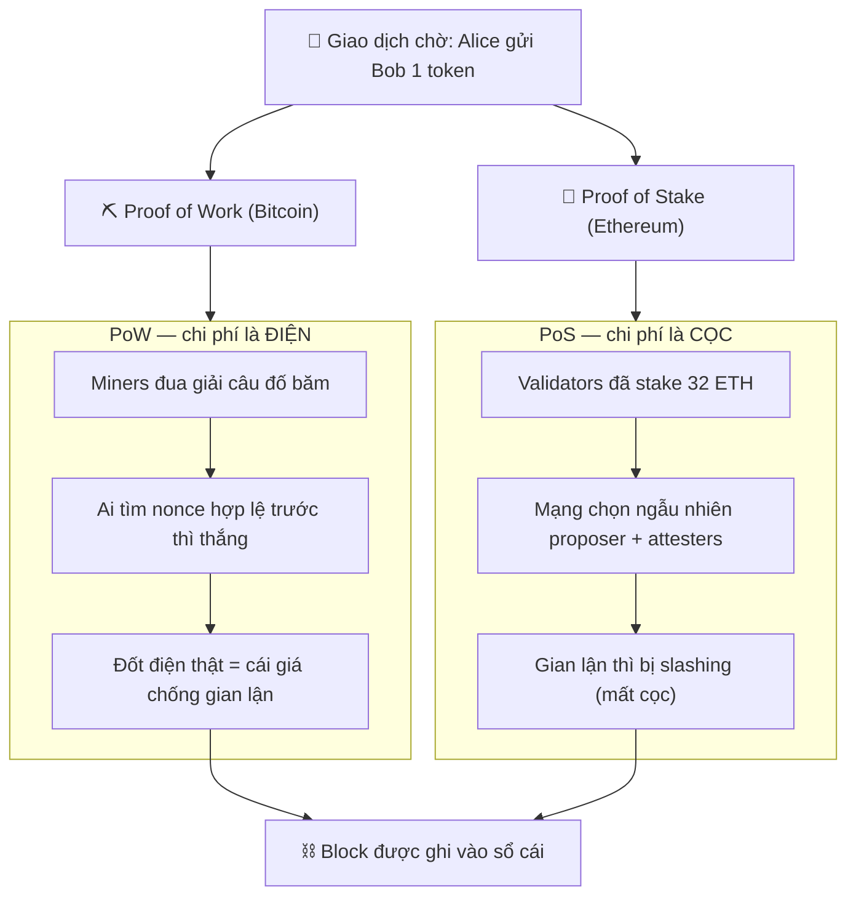

# Cơ chế đồng thuận & Crypto-economics

> **Tác giả:** Mr.Rom\
> **Phiên bản:** v1.0.0\
> **Tạo lúc:** 22/06/2026\
> **Cập nhật:** 22/06/2026\
> **Level:** Basic\
> **Tags:** blockchain, consensus, proof-of-work, proof-of-stake, crypto-economics, bitcoin, ethereum, gas-fee\
> **Yêu cầu trước:** [Smart Contract & EVM](02_smart-contracts-and-evm.md)

> 🎯 *Ba bài trước bạn đã biết blockchain là một sổ cái phân tán, chạy code bằng EVM. Nhưng còn một câu hỏi nhức nhối: hàng nghìn máy không quen biết, không ai làm sếp — vậy chúng **thống nhất** với nhau "ai đang giữ bao nhiêu tiền" bằng cách nào? Và quan trọng hơn: vì sao chúng **chịu trung thực** thay vì gian lận? Sau bài này bạn sẽ hiểu bài toán đồng thuận (Byzantine fault), phân biệt được **Proof of Work** (Bitcoin) với **Proof of Stake** (Ethereum sau The Merge), nắm finality, fork, và "crypto-economics" — môn kinh tế gài thưởng/phạt để mạng tự bảo vệ chính nó.*

## 🎯 Sau bài này bạn sẽ

- [ ] Giải thích được **bài toán đồng thuận** trong hệ phân tán và **Byzantine fault** (lỗi do thành viên gian lận/dối trá)
- [ ] Mô tả cách **Proof of Work (PoW)** hoạt động — mining, độ khó, vì sao tốn điện — qua ví dụ Bitcoin
- [ ] Mô tả cách **Proof of Stake (PoS)** hoạt động — staking, validator, slashing — qua Ethereum sau The Merge
- [ ] So sánh PoW vs PoS trên ba trục: năng lượng, bảo mật, mức phi tập trung
- [ ] Phân biệt **finality** xác suất (probabilistic) với finality dứt khoát (deterministic), và hiểu **fork** (soft/hard)
- [ ] Hiểu **crypto-economics**: vì sao incentive (thưởng/phạt) khiến đa số người tham gia chọn trung thực, và **gas fee** vận hành như một thị trường

---

## Tình huống — Alice gửi 1 token cho Bob, ai "duyệt"?

Xuyên suốt cụm này ta theo dõi một việc rất đời thường: **Alice gửi 1 token cho Bob**. Hãy đặt cạnh nhau hai thế giới.

Trong **ngân hàng tập trung**, mọi chuyện đơn giản về mặt "ai quyết định". Alice mở app, bấm chuyển. Máy chủ của ngân hàng — *một cuốn sổ cái duy nhất, do ngân hàng sở hữu* — kiểm tra số dư Alice, trừ tiền Alice, cộng tiền Bob, ghi xong. Có **một bên có thẩm quyền** chốt sự thật. Nếu có tranh chấp, bạn gọi tổng đài, ngân hàng tra sổ của họ và phán. Đơn giản vì **có sếp**.

Trên một **blockchain công khai** thì... không có sếp. Sổ cái không nằm ở một máy chủ mà được **sao y trên hàng nghìn máy** (node) rải khắp thế giới, không ai quen ai, không ai có quyền cao hơn ai. Khi Alice ký giao dịch "gửi 1 token cho Bob" và phát ra mạng, một loạt câu hỏi hóc búa hiện ra:

- Hàng nghìn máy đều nghe được giao dịch này. Nhưng **máy nào được quyền ghi nó vào sổ**? Nếu ai cũng tự ghi theo ý mình, mỗi máy một cuốn sổ khác nhau thì còn gì là "sổ cái chung"?
- Lỡ có một máy gian lận, cố ghi "Alice gửi Bob 1 token" **hai lần** để tiêu một đồng tiền hai lần (double-spend) thì sao? Ai chặn?
- Không có sếp phân xử, vậy **làm sao hàng nghìn máy cùng đồng ý** một thứ tự giao dịch duy nhất — Alice trả Bob *trước* hay *sau* khi cô ấy trả cho người khác?
- Và sâu xa nhất: các máy này là người lạ, có thể tham lam. **Vì sao chúng chịu chơi đẹp** thay vì hùa nhau gian lận?

Cả bốn câu hỏi đều quy về một bài toán duy nhất, gọi là **bài toán đồng thuận** (consensus). Đây chính là trái tim của blockchain — và là thứ ngân hàng không cần vì họ có sẵn một ông sếp. Bài này giải thích blockchain thay thế "ông sếp" đó bằng cái gì.

---

## 1️⃣ Bài toán đồng thuận và Byzantine fault

Trước khi nói cách giải, phải hiểu bài toán khó tới mức nào.

**Đồng thuận** (consensus) nghĩa là: nhiều máy độc lập trong một mạng cùng **thống nhất một giá trị chung** — ở đây là "thứ tự và nội dung các giao dịch trong cuốn sổ cái". Nghe đơn giản, nhưng nó khó vì hai lý do: mạng không đáng tin (tin nhắn có thể trễ, mất, đến lệch thứ tự) và **một số thành viên có thể nói dối**.

Cái khó "nói dối" này có một cái tên kinh điển trong khoa học máy tính: **Byzantine fault** (lỗi Byzantine).

🪞 **Ẩn dụ — bài toán các vị tướng Byzantine:**
> Tưởng tượng nhiều cánh quân Byzantine vây một thành, mỗi cánh do một vị tướng chỉ huy, đóng ở các hướng khác nhau. Họ chỉ thắng nếu **cùng tấn công** hoặc **cùng rút**, nửa đánh nửa rút là thua. Họ liên lạc bằng cách cử lính chạy thư qua lại. Vấn đề: trong đám tướng đó có thể có **kẻ phản bội** cố tình gửi thư mâu thuẫn — bảo cánh A "tấn công", bảo cánh B "rút" — để phá vỡ thống nhất. Câu hỏi: các tướng *trung thành* có cách nào vẫn đi đến một quyết định chung dù có kẻ phản bội trà trộn không?

Một hệ thống chịu được loại "kẻ phản bội" này — tức vẫn đạt đồng thuận dù một phần thành viên cố tình gian lận — được gọi là **Byzantine Fault Tolerant (BFT)**, chịu lỗi Byzantine. Đây chính xác là tình huống của blockchain công khai: bất kỳ ai cũng tham gia được, nên chắc chắn có kẻ muốn gian lận.

> [!NOTE]
> Phân biệt hai mức "lỗi": lỗi *crash* (một máy đơn giản là tắt/mất kết nối — vô hại, chỉ im lặng) dễ xử lý hơn nhiều so với lỗi *Byzantine* (một máy còn sống nhưng **chủ động nói dối** để phá hoại). Blockchain công khai phải chống được loại sau — khó hơn hẳn.

Một kết quả kinh điển của lý thuyết BFT: nếu **dưới một phần ba** số thành viên là kẻ gian, các thành viên trung thực vẫn có thể đi đến đồng thuận đúng; vượt ngưỡng đó thì không còn đảm bảo. Con số "một phần ba" này là lý do nhiều hệ PoS hiện đại đặt mục tiêu giữ phần token gian lận luôn dưới ngưỡng — vượt qua nó đòi hỏi nắm tỷ lệ cổ phần rất lớn, mà như ta sẽ thấy ở mục crypto-economics, làm vậy là tự bắn vào chân về mặt tài chính.

So với ngân hàng, đây là chỗ khác biệt căn bản: ngân hàng **không có** bài toán Byzantine, vì sổ cái chỉ có một và do một bên kiểm soát — không tồn tại "thành viên lạ có thể nói dối". Blockchain trả giá cho việc bỏ "ông sếp" bằng cách phải giải bài toán khó hơn nhiều này.

Vậy blockchain chống kẻ gian bằng cách nào, khi không thể "đuổi việc" ai (ai cũng tham gia tự do)? Câu trả lời rất thông minh: thay vì cố *phát hiện* kẻ gian, ta khiến **việc gian lận trở nên cực kỳ tốn kém**, còn **việc trung thực thì được trả công**. Đó là tinh thần của hai cơ chế đồng thuận phổ biến nhất: **Proof of Work** và **Proof of Stake** — ta đi vào từng cái.

---

## 2️⃣ Proof of Work (PoW) — "ai làm nhiều việc nhất được ghi sổ"

Đây là cơ chế đồng thuận đầu tiên của blockchain, do Bitcoin giới thiệu năm 2009.

Quay lại tình huống: hàng nghìn máy đều muốn được quyền ghi block giao dịch của Alice → Bob vào sổ. Phải có cách chọn ra **một** máy, công bằng và khó gian lận. PoW chọn bằng cách bắt mọi máy **giải một câu đố tốn sức tính toán** — ai giải xong trước thì người đó được ghi.

**Proof of Work** (bằng chứng công việc) — máy muốn được ghi block phải chứng minh nó đã *thực sự bỏ ra công sức tính toán*. "Công sức" ở đây là việc thử đi thử lại hàng tỷ phép băm (hash) cho tới khi tìm ra một con số thoả điều kiện.

🪞 **Ẩn dụ — cuộc thi giải Sudoku để giành quyền phát biểu:**
> Tưởng tượng một phòng họp đông người, ai cũng muốn được quyền ghi biên bản. Thay vì cãi nhau, cả phòng thống nhất luật: phát cho mỗi người một quyển Sudoku siêu khó, **ai giải xong trước được cầm bút ghi**. Giải Sudoku rất tốn công (phải thử nhiều), nhưng người khác **kiểm tra đáp án đúng/sai lại cực nhanh**. Muốn gian lận "giành bút" bạn phải giải nhanh hơn cả phòng cộng lại — gần như bất khả thi nếu bạn không có sức tính áp đảo.

### Mining hoạt động ra sao?

Quá trình "đua giải câu đố" này gọi là **mining** (đào). Máy tham gia gọi là **miner** (thợ đào). Một vòng mining đại khái gồm các bước sau:

```text
1. Miner gom các giao dịch đang chờ (gồm "Alice gửi Bob 1 token") vào 1 block ứng viên.
2. Miner thử ghép vào block một con số ngẫu nhiên gọi là "nonce".
3. Miner băm (hash) toàn bộ block bằng SHA-256 → ra một chuỗi hex.
4. Kiểm tra: chuỗi hash đó có bắt đầu bằng đủ số chữ số 0 yêu cầu không?
     - CHƯA đạt → đổi nonce khác, quay lại bước 2 (lặp hàng tỷ lần).
     - ĐẠT     → thắng! Phát block ra mạng cho mọi máy kiểm tra.
5. Các máy khác băm lại block đó 1 lần để xác minh — đúng thì ghi vào sổ, sai thì bỏ.
```

Điểm cốt lõi: hàm băm (như **SHA-256** mà Bitcoin dùng) là một chiều — không có cách "tính ngược" ra nonce, chỉ có cách **thử mò**. Vì thế tìm được nonce hợp lệ chứng tỏ miner đã bỏ ra công tính thật. Nhưng kiểm tra thì chỉ cần băm 1 lần.

Để thấy "câu đố" cụ thể trông thế nào, hãy mô phỏng bằng Python — đây không phải Bitcoin thật mà là một PoW thu nhỏ để bạn cảm nhận:

```python
import hashlib

def mine(block_data: str, kho_0: int) -> tuple[int, str]:
    """Tìm nonce sao cho hash của (block_data + nonce) bắt đầu bằng `kho_0` số 0."""
    prefix = "0" * kho_0       # vd kho_0=4 -> cần hash bắt đầu bằng "0000"
    nonce = 0

    while True:
        # 1. Ghép dữ liệu block với nonce hiện tại
        chuoi = f"{block_data}{nonce}".encode()

        # 2. Băm bằng SHA-256, lấy dạng hex
        h = hashlib.sha256(chuoi).hexdigest()

        # 3. Đạt điều kiện chưa? Đạt thì trả về, chưa thì tăng nonce thử tiếp
        if h.startswith(prefix):
            return nonce, h
        nonce += 1


# Block chứa giao dịch của Alice -> Bob
block = "Alice->Bob:1"
nonce, h = mine(block, kho_0=4)   # độ khó = 4 số 0 đầu
print(f"Tim thay nonce = {nonce}")
print(f"Hash = {h}")
```

Chạy đoạn này, kết quả mẫu (nonce sẽ khác nhau mỗi lần đổi `block_data`, nhưng hash luôn bắt đầu bằng 4 số 0):

```text
Tim thay nonce = 3725
Hash = 00003785e5e9b4c53600b6a30047801fcff23ca50a97b7b7e3ace54890dc222c
```

Hãy để ý: máy phải thử tới **3725 nonce** mới tìm ra một hash bắt đầu bằng `0000` (số này ngẫu nhiên — chạy lại với dữ liệu khác sẽ ra con số khác, trung bình cần khoảng 65536 lần thử cho 4 số 0). Đó chính là "công việc". Nếu bạn tăng `kho_0` từ 4 lên 5, số lần thử trung bình tăng **khoảng 16 lần** (mỗi chữ số hex có 16 khả năng) — đây là cơ chế điều chỉnh **độ khó**.

### Độ khó (difficulty) — vì sao Bitcoin ra block đều đặn

Nếu máy đào ngày càng mạnh, câu đố cũ sẽ bị giải quá nhanh, block ra dồn dập. Bitcoin không muốn vậy — nó muốn trung bình **một block khoảng 10 phút**. Cách giữ nhịp: cứ định kỳ, mạng **tự điều chỉnh độ khó** (số chữ số 0 yêu cầu) theo tổng sức đào hiện tại.

- Tổng sức đào (hashrate) **tăng** → block ra nhanh hơn 10 phút → mạng **tăng** độ khó để chậm lại.
- Tổng sức đào **giảm** → block ra chậm hơn → mạng **giảm** độ khó để nhanh lại.

→ Nhờ vậy nhịp ra block ổn định bất kể có bao nhiêu miner tham gia. Độ khó là một "van điều áp" tự động.

### Vì sao PoW tốn điện?

Đây là điểm thường bị hiểu sai, nên nói cho rõ. PoW tốn điện **không phải vì lỗi thiết kế** — mà vì *tốn điện chính là cơ chế bảo mật*. Hàng triệu máy trên thế giới cùng đua thử nonce suốt ngày đêm; tuyệt đại đa số phép thử là "trượt", bị vứt đi, nhưng vẫn ngốn điện CPU/GPU/ASIC. Chính khoản điện-đốt-ra-thật đó là "cái giá" khiến tấn công mạng trở nên đắt đỏ: muốn viết lại lịch sử, kẻ tấn công phải bỏ ra lượng điện ngang hoặc hơn cả mạng.

> [!NOTE]
> Có nhiều con số ước tính về lượng điện Bitcoin tiêu thụ, nhưng chúng dao động mạnh theo nguồn và thời điểm, và một phần điện đó đến từ năng lượng tái tạo/dư thừa. Vì vậy ở mức Basic ta chỉ khẳng định **định tính**: PoW tiêu thụ năng lượng **đáng kể** và rõ rệt hơn PoS — chứ không đóng đinh một con số tuyệt đối.

Với Alice → Bob: giao dịch của họ được một miner nào đó (giải câu đố nhanh nhất) gói vào block, cả mạng xác minh, rồi ghi vào sổ. Miner thắng được thưởng (mục 5 sẽ nói). Không có "ông sếp ngân hàng" nào cả — chỉ có luật chơi tính toán.

---

## 3️⃣ Proof of Stake (PoS) — "ai đặt cọc nhiều nhất, gánh trách nhiệm nhiều nhất"

Năm 2022, Ethereum thực hiện một sự kiện lịch sử gọi là **The Merge** — chuyển từ PoW sang **Proof of Stake**. Lý do? Tìm một cách đồng thuận **không phải đốt điện** mà vẫn an toàn.

PoS xuất phát từ một câu hỏi: thay vì bắt máy chứng minh "tôi đã đốt nhiều điện" (work), sao không bắt máy chứng minh "tôi đã **đặt cọc nhiều tiền** vào hệ thống này, nên tôi có động cơ giữ nó trung thực"?

**Proof of Stake** (bằng chứng cổ phần) — quyền được ghi block không thuộc về ai đốt điện nhiều nhất, mà được giao cho các **validator** (người xác thực) đã **khoá (stake) một lượng token** làm tiền đặt cọc. Mạng chọn validator (phần lớn ngẫu nhiên có trọng số theo lượng stake) để đề xuất và xác nhận block.

🪞 **Ẩn dụ — đặt cọc để được làm trọng tài:**
> Quay lại phòng họp. Lần này, thay vì thi giải Sudoku tốn sức, luật mới là: *ai muốn làm trọng tài ghi biên bản phải đặt một khoản tiền cọc lên bàn*. Hệ thống quay số chọn một người trong những người đã đặt cọc để ghi. Nếu người đó ghi gian (chép sai biên bản), cả phòng phát hiện và **tịch thu tiền cọc** của họ. Vì tiền cọc là tiền thật của chính họ, không ai dại gian lận để mất cọc. Trung thực thì được trả công nhỏ đều đặn; gian lận thì mất cọc lớn.

### Staking và validator

Trên Ethereum, để trở thành validator bạn phải **stake 32 ETH** (khoá vào một hợp đồng đặc biệt). Khi đã là validator:

- Mạng **ngẫu nhiên** chọn bạn để **đề xuất** block mới (proposer) hoặc **chứng thực** (attest) block do người khác đề xuất là hợp lệ.
- Làm đúng (online, xác thực trung thực) → nhận **phần thưởng staking** đều đặn (lãi trên số ETH đã stake).
- Làm sai/offline → bị **phạt** (mục dưới).

### Slashing — cây gậy thay cho điện đốt

Đây là phần thay thế trực tiếp cho "điện đốt" của PoW. **Slashing** (cắt cọc) là cơ chế **tịch thu một phần (hoặc phần lớn) số ETH đã stake** của validator nếu họ làm điều gây hại cho mạng — ví dụ chứng thực hai block mâu thuẫn cùng lúc (cố gây chia rẽ), hay ký các thông điệp tự mâu thuẫn.

- Lỗi nhẹ (chỉ offline, không xác thực kịp) → bị trừ thưởng nhỏ ("leak"), không phải slashing nặng.
- Lỗi nặng (cố tình gian lận, ký hai chiều) → **slashing**: mất một phần lớn cọc và bị **đuổi khỏi tập validator**.

> [!WARNING]
> Slashing là rủi ro thật khi tự vận hành validator. Một lỗi cấu hình phổ biến: chạy **cùng một khoá validator trên hai máy** (định để "dự phòng") — hai máy cùng ký sẽ bị mạng coi là hành vi gian lận (double-signing) và **bị slashing**, dù bạn không hề có ý gian. Validator phải đảm bảo mỗi khoá chỉ ký từ **đúng một** instance.

### Vì sao PoS tốn ít năng lượng hơn

Mấu chốt: PoS **không có cuộc đua thử-nonce** nào cả. Validator chỉ cần một máy bình thường online để đề xuất/xác thực block khi tới lượt — không cần đốt điện cho hàng tỷ phép băm trượt. "Cái giá để gian lận" không còn là điện đã đốt, mà là **số token có thể bị slashing**. Vì thế tiêu thụ năng lượng của PoS **thấp hơn rõ rệt** so với PoW.

> [!NOTE]
> Mức chênh năng lượng giữa PoS và PoW là **rất lớn** và nhiều nguồn nói tới mức "giảm hơn 99%" sau The Merge của Ethereum. Con số chính xác tuỳ cách đo, nhưng chiều hướng thì không tranh cãi: bỏ cuộc đua tính toán đi thì điện tiêu thụ tụt mạnh. Ở mức Basic, nhớ chiều hướng định tính là đủ.

Với Alice → Bob trên Ethereum hôm nay: giao dịch của họ được một validator (được chọn ngẫu nhiên trong tập đã stake) đề xuất vào block, các validator khác chứng thực, rồi block được ghi. Không ai đốt điện đua nhau; thay vào đó mọi validator đều có 32 ETH "làm con tin" cho sự trung thực của chính mình.

---

## 4️⃣ PoW vs PoS — đặt cạnh nhau

Hai cơ chế cùng giải một bài toán (chọn ai được ghi sổ + chống gian lận) nhưng bằng hai "đòn bẩy" khác nhau: PoW dùng **chi phí vật lý** (điện), PoS dùng **chi phí tài chính** (cọc bị slashing). Sơ đồ dưới đặt hai luồng cạnh nhau, cùng xuất phát từ "giao dịch Alice → Bob đang chờ" và cùng kết thúc ở "block được ghi vào sổ":



→ Đọc sơ đồ: cả hai nhánh đều dẫn tới cùng một đích (block vào sổ), nhưng "rào chắn gian lận" khác nhau — một bên là **điện đã đốt không lấy lại được**, một bên là **tiền cọc có thể bị tịch thu**. Hiểu khác biệt đó là hiểu toàn bộ tranh luận PoW vs PoS.

Đặt thành bảng để so ba trục mà người mới hay hỏi nhất — năng lượng, bảo mật, và mức phi tập trung:

| Trục so sánh | **Proof of Work (Bitcoin)** | **Proof of Stake (Ethereum sau The Merge)** |
|---|---|---|
| Cơ chế chọn người ghi block | Đua giải câu đố băm (mining) | Chọn ngẫu nhiên trong validator đã stake |
| "Cái giá" để gian lận | Phải có sức tính áp đảo (điện + phần cứng) | Phải nắm phần lớn token bị đem ra stake (và sẽ bị slashing) |
| Năng lượng tiêu thụ | **Đáng kể** (đốt điện là một phần thiết kế) | **Thấp hơn rõ rệt** (không có cuộc đua tính toán) |
| Bảo mật chống tấn công | Tấn công 51% sức đào — tốn điện/phần cứng khổng lồ | Tấn công cần ~đa số token bị stake; gian lận bị slashing mất cọc |
| Rào cản tham gia | Mua phần cứng đào (ASIC), tiền điện | Có đủ token để stake (Ethereum: 32 ETH cho 1 validator độc lập) |
| Rủi ro tập trung hoá | Tập trung vào vài mỏ đào lớn / vùng điện rẻ | Tập trung vào các dịch vụ staking lớn (staking pool) |
| Finality (xem mục 5) | Probabilistic (xác suất, càng nhiều block sau càng chắc) | Tiến tới deterministic (có cơ chế "finalized" dứt khoát) |

> [!IMPORTANT]
> Không có cơ chế nào "thắng tuyệt đối". PoW đã được kiểm chứng an toàn lâu nhất (Bitcoin từ 2009) nhưng tốn điện; PoS tiết kiệm năng lượng và cho finality dứt khoát nhanh hơn nhưng mô hình bảo mật mới hơn và đặt ra câu hỏi "người giàu token có lợi thế tích luỹ". Mỗi mạng chọn theo ưu tiên của nó.

---

## 5️⃣ Finality và Fork — "khi nào giao dịch chắc chắn không bị đảo?"

Sau khi block chứa giao dịch Alice → Bob được ghi, Bob có nên giao hàng ngay không? Câu trả lời phụ thuộc vào **finality** (tính chung cuộc) — mức độ chắc chắn rằng giao dịch sẽ **không bao giờ bị đảo ngược**.

### Vì sao có thể bị đảo? — Fork

Vì sổ cái sao y trên nhiều máy với độ trễ mạng, đôi khi **hai miner/validator cùng tạo block hợp lệ gần như đồng thời**. Mạng tạm thời có **hai nhánh** — gọi là **fork** (rẽ nhánh). Một thời gian sau, mạng phải chọn một nhánh làm "chính thức" và bỏ nhánh kia; giao dịch nằm trong nhánh bị bỏ coi như chưa từng xảy ra.

Có hai loại fork rất khác nhau, đừng nhầm:

| Loại fork | Bản chất | Tương thích ngược? | Ví dụ |
|---|---|---|---|
| **Soft fork** (rẽ nhánh mềm) | Siết chặt luật — block theo luật mới vẫn hợp lệ với node cũ | ✅ Có (node chưa nâng cấp vẫn chạy được) | Một nâng cấp giới hạn kích thước/định dạng giao dịch |
| **Hard fork** (rẽ nhánh cứng) | Đổi luật theo cách node cũ **không chấp nhận** | ❌ Không (node phải nâng cấp, nếu không sẽ tách mạng) | Tách thành hai chuỗi riêng nếu cộng đồng bất đồng |

> [!NOTE]
> Phân biệt "fork tạm thời do trễ mạng" (hai block cùng lúc, mạng tự chọn một, vài giây là xong) với "fork do thay đổi luật" (soft/hard fork — là một sự kiện nâng cấp giao thức có chủ đích). Cả hai đều gọi là "fork" nhưng nguyên nhân khác hẳn.

### Probabilistic vs deterministic finality

Đây là khác biệt then chốt giữa PoW và PoS đời mới:

- **Probabilistic finality** (chung cuộc theo xác suất) — kiểu của PoW/Bitcoin. Một giao dịch **không bao giờ "chắc chắn 100%"** về mặt lý thuyết, nhưng **càng có nhiều block nối thêm phía sau, xác suất bị đảo càng tiệm cận 0**. Vì muốn đảo block cũ, kẻ tấn công phải đào lại nhanh hơn cả mạng — càng sâu càng vô vọng. Thực tế người ta chờ một số "xác nhận" (confirmations) cho an tâm.
- **Deterministic finality** (chung cuộc dứt khoát) — kiểu Ethereum PoS hướng tới. Sau khi đủ tỷ lệ validator chứng thực, block được đánh dấu **"finalized"** — đảo ngược nó đồng nghĩa một lượng cực lớn ETH bị slashing, nên về kinh tế là **gần như không thể**. Đây là một mốc *dứt khoát* hơn, không phải "xác suất tăng dần".

🪞 **Ẩn dụ — mực viết khô dần vs đóng dấu đỏ:**
> Probabilistic finality như **mực viết đang khô dần** — mới viết thì còn nhoè được (đảo được), để càng lâu mực càng khô, gần như không tẩy nổi. Deterministic finality như **đóng một con dấu đỏ "ĐÃ DUYỆT"** — tới một thời điểm rõ ràng, văn bản được niêm phong; muốn gỡ dấu phải trả một cái giá khủng khiếp.

→ Với Bob: trên Bitcoin, nên **đợi vài xác nhận** (block nối thêm) trước khi giao món hàng giá trị cao; trên Ethereum, có thể đợi tới khi block được đánh dấu "finalized" để chắc chắn dứt khoát. So với ngân hàng (giao dịch "xong là xong" vì có sếp chốt), blockchain trả tính chắc chắn đó bằng **thời gian chờ** thay vì bằng một bên có thẩm quyền.

---

## 6️⃣ Crypto-economics — vì sao người ta chịu trung thực?

Tới đây ta chạm vào câu hỏi sâu nhất của bài. Cơ chế đồng thuận chỉ là *luật chơi kỹ thuật*. Nhưng luật chơi nào cũng vô dụng nếu người chơi không có **động cơ tuân thủ**. Môn học gài động cơ đó vào hệ thống gọi là **crypto-economics**.

**Crypto-economics** (kinh tế học mật mã) — kết hợp giữa *mật mã* (cryptography, đảm bảo không ai giả mạo/làm giả được) và *kinh tế học khuyến khích* (economic incentive, thiết kế thưởng/phạt sao cho **lựa chọn ích kỷ nhất của mỗi cá nhân lại trùng với lợi ích chung của mạng**). Nói cách khác: làm cho **trung thực có lợi hơn gian lận**, để mạng tự bảo vệ chính nó mà không cần cảnh sát.

🪞 **Ẩn dụ — đặt phần thưởng đúng chỗ để không cần giám sát:**
> Bạn không thể đứng canh hàng nghìn người lạ. Nhưng nếu bạn thiết kế luật chơi sao cho *"chơi đẹp được thưởng tiền, chơi gian mất tiền nhiều hơn"*, thì ngay cả người ích kỷ nhất cũng tự chọn chơi đẹp — không phải vì đạo đức, mà vì **tính ra có lợi hơn**. Đó là toàn bộ nghệ thuật của crypto-economics.

### Incentive — thưởng cho người ghi sổ trung thực

Cả PoW lẫn PoS đều trả công cho người làm đúng việc ghi sổ:

- **PoW (Bitcoin):** miner đào được block nhận **block reward** (token mới phát hành) + **phí giao dịch** (fee) của các giao dịch trong block. Nhưng nếu cố gian lận (ghi block sai luật), cả mạng từ chối block đó → công đào (điện) **mất trắng**. Trung thực = được thưởng; gian lận = đốt điện vô ích.
- **PoS (Ethereum):** validator làm đúng nhận **staking reward** đều đặn; làm sai bị **slashing** mất cọc. Trung thực = lãi nhỏ ổn định; gian lận = mất phần lớn 32 ETH.

→ Cùng một logic: **phần thưởng (token reward) kéo người ta về phía trung thực, hình phạt (mất điện / mất cọc) đẩy người ta khỏi gian lận.** Đây là lý do "vì sao người lạ trên mạng chịu chơi đẹp" — không phải vì họ tốt, mà vì luật chơi khiến gian lận không đáng.

### Token reward và lạm phát có kiểm soát

Token thưởng cho người ghi sổ đến từ đâu? Thường là **token mới được phát hành** theo lịch định sẵn (Bitcoin giảm một nửa phần thưởng mỗi ~4 năm — gọi là "halving"; Ethereum phát hành theo công thức staking). Đây là một dạng "in tiền có luật", và chính khoản này trả công cho việc giữ mạng an toàn.

### Tấn công 51% — vì sao tốn kém tới mức không đáng làm

Lý thuyết, nếu một bên nắm **trên 50%** sức mạnh quyết định (sức đào trong PoW, hoặc token stake trong PoS), họ có thể thao túng (vd cố double-spend). Nhưng crypto-economics khiến điều này **tự-vô-hiệu về mặt kinh tế**:

- Trong PoW: gom trên 50% hashrate đòi lượng phần cứng + điện **khổng lồ** — và nếu họ tấn công, niềm tin sụp đổ, giá token rớt, chính tài sản của họ mất giá.
- Trong PoS: gom trên 50% token stake nghĩa là bỏ ra số tiền **cực lớn** mua token — và nếu gian lận, họ bị **slashing** chính số token đó. Tự bắn vào chân.

→ Điểm tinh tế: hệ thống không cần *chứng minh* không ai tấn công được — nó chỉ cần làm cho tấn công **đắt hơn lợi thu được**. Kẻ tấn công lý trí sẽ không làm. Đó là crypto-economics ở dạng thuần khiết nhất.

---

## 7️⃣ Gas fee — một thị trường, không phải bảng giá cố định

Còn một mảnh ghép kinh tế nữa người mới hay vấp: **vì sao phí giao dịch (gas fee) lúc rẻ lúc đắt?**

Quay lại Alice → Bob. Mỗi block chỉ chứa được **một lượng giao dịch giới hạn** (block có "sức chứa" hữu hạn). Nhưng tại một thời điểm có thể có **rất nhiều người** cùng muốn giao dịch. Vậy ai được vào block trước?

Câu trả lời: **một thị trường đấu giá**. Người gửi giao dịch **trả phí (gas fee)** để "mua chỗ" trong block. Người ghi block (miner/validator) ưu tiên các giao dịch trả phí cao hơn (vì họ được hưởng phí).

🪞 **Ẩn dụ — gửi xe ngày lễ:**
> Bãi gửi xe có số chỗ cố định. Ngày thường vắng → gửi rẻ, vào liền. Ngày lễ đông nghẹt → bãi đấu giá: ai trả nhiều hơn được vào trước, người trả ít phải chờ vòng sau (block sau) hoặc trả thêm. **Phí không phải bảng giá niêm yết, mà do cung-cầu thời điểm quyết định.**

Cơ chế **gas fee thị trường** vì thế hành xử như sau:

- Mạng **vắng** (ít giao dịch chờ) → phí **thấp**, giao dịch vào block nhanh.
- Mạng **tắc** (nhiều người tranh nhau) → phí **tăng vọt**, ai trả thấp phải chờ.

→ So với ngân hàng (phí chuyển khoản thường là **con số cố định** ngân hàng quy định), gas fee blockchain là **giá thị trường động**. Đây cũng là một mảnh của crypto-economics: phí vừa trả công cho người ghi sổ, vừa **chống spam** (gửi rác phải trả tiền) và **phân bổ sức chứa khan hiếm** cho ai cần gấp nhất.

> [!NOTE]
> Cách tính gas fee cụ thể (base fee, priority fee/tip, đơn vị gwei...) khá kỹ thuật và khác nhau giữa các mạng — bài này chỉ cần bạn nắm **ý tưởng thị trường**: phí do cung-cầu sức chứa block quyết định, không phải bảng giá cố định. Chi tiết cách đặt gas khi gửi giao dịch sẽ gặp ở bài Web3 tiếp theo.

---

## 💡 Cạm bẫy thường gặp & Best practice

### ❌ Cạm bẫy: nghĩ "PoW tốn điện là lỗi thiết kế cần sửa"

- **Triệu chứng**: kết luận "PoW ngu ngốc vì phí phạm điện, PoS đúng đắn vì tiết kiệm" như thể PoW là một sai lầm.
- **Nguyên nhân**: không thấy rằng *điện đốt ra chính là cơ chế bảo mật* của PoW — nó là "cái giá" khiến tấn công đắt đỏ, không phải hiệu ứng phụ.
- **Cách tránh**: hiểu hai cơ chế dùng hai loại "cái giá" khác nhau (điện vật lý vs cọc tài chính). PoS tiết kiệm năng lượng thật, nhưng nói PoW "sai" là hiểu lệch — nó là một đánh đổi có chủ đích, đã được kiểm chứng an toàn lâu nhất.

### ❌ Cạm bẫy: coi giao dịch "đã lên block" là "không thể đảo"

- **Triệu chứng**: thấy giao dịch Alice → Bob vừa vào một block là Bob giao hàng giá trị cao ngay, rồi gặp rủi ro nhánh đó bị bỏ (fork).
- **Nguyên nhân**: nhầm "được ghi vào block" với "đã finalized". Trên PoW, block mới nhất vẫn có thể bị đảo nếu một fork dài hơn xuất hiện.
- **Cách tránh**: với giá trị lớn, **đợi finality** — vài xác nhận (confirmations) trên Bitcoin, hoặc trạng thái "finalized" trên Ethereum. Probabilistic finality nghĩa là chắc chắn *tăng dần*, không phải tức thì.

### ✅ Best practice: phân tích mọi cơ chế đồng thuận qua câu hỏi "gian lận tốn gì?"

- **Vì sao**: bản chất mọi cơ chế (PoW, PoS, và các biến thể) đều quy về crypto-economics — làm cho gian lận đắt hơn lợi. Hỏi "kẻ gian phải trả giá gì?" cho bạn hiểu nhanh hơn là học thuộc thuật ngữ.
- **Cách áp dụng**: gặp một cơ chế đồng thuận lạ, hỏi ba câu — *(1) ai được quyền ghi block và chọn bằng tiêu chí gì? (2) gian lận thì mất gì (điện? cọc? danh tiếng?)? (3) finality là xác suất hay dứt khoát?* Trả lời được ba câu là nắm được cốt lõi.

### ✅ Best practice: ước lượng gas fee theo tình trạng mạng, đừng coi là số cố định

- **Vì sao**: gas fee là **giá thị trường động**. Coi nó như phí ngân hàng cố định sẽ dẫn tới hoặc trả thừa (lúc vắng), hoặc giao dịch kẹt mãi không lên (lúc tắc mà trả thấp).
- **Cách áp dụng**: trước khi gửi giao dịch, xem tình trạng mạng (công cụ theo dõi gas) — mạng vắng thì hạ phí, mạng tắc và cần gấp thì tăng phí; không gấp thì chờ giờ thấp điểm.

---

## 🧠 Tự kiểm tra (Self-check)

**Q1.** "Byzantine fault" là loại lỗi gì, và vì sao blockchain công khai bắt buộc phải chống được nó?

<details>
<summary>💡 Xem giải thích</summary>

**Byzantine fault** là lỗi do một thành viên trong mạng **chủ động nói dối / gửi thông điệp mâu thuẫn** để phá hoại đồng thuận — khác với lỗi crash (máy chỉ tắt/im lặng, vô hại). Tên gọi đến từ bài toán "các vị tướng Byzantine".

Blockchain công khai **phải** chống được vì ai cũng tham gia tự do, nên chắc chắn có người muốn gian lận (vd double-spend). Một hệ vẫn đạt đồng thuận dù có thành viên gian lận được gọi là **Byzantine Fault Tolerant (BFT)**.

</details>

**Q2.** Trong PoW, "công việc" (work) mà miner phải chứng minh là gì? Vì sao kiểm tra lại dễ trong khi tìm ra lại khó?

<details>
<summary>💡 Xem giải thích</summary>

"Công việc" là việc **thử đi thử lại hàng tỷ nonce** cho tới khi tìm được một nonce khiến hash của block (vd qua SHA-256) bắt đầu bằng đủ số chữ số 0 theo độ khó yêu cầu.

**Tìm thì khó** vì hàm băm một chiều — không tính ngược được, chỉ thử mò. **Kiểm tra thì dễ** vì người khác chỉ cần băm block đúng **một lần** để xác nhận hash có thoả điều kiện không. Bất đối xứng "khó tạo, dễ kiểm tra" này là nền tảng của PoW.

</details>

**Q3.** Slashing trong PoS đóng vai trò gì? Nó thay thế cho thứ gì của PoW?

<details>
<summary>💡 Xem giải thích</summary>

**Slashing** là việc mạng **tịch thu một phần (hoặc phần lớn) số token đã stake** của validator nếu họ làm điều gây hại (vd ký hai block mâu thuẫn). Nó là **cây gậy** đảm bảo validator có động cơ trung thực.

Nó thay thế cho **"điện đã đốt" của PoW** với vai trò "cái giá của gian lận": PoW khiến gian lận tốn điện vật lý; PoS khiến gian lận tốn cọc tài chính (token bị slashing). Cả hai đều làm gian lận đắt hơn lợi.

</details>

**Q4.** Phân biệt probabilistic finality và deterministic finality. Với Bob, điều này ảnh hưởng gì tới việc giao hàng?

<details>
<summary>💡 Xem giải thích</summary>

- **Probabilistic finality** (PoW/Bitcoin): không bao giờ chắc 100% về lý thuyết, nhưng **càng nhiều block nối thêm phía sau, xác suất bị đảo càng tiệm cận 0**. Chắc chắn *tăng dần*.
- **Deterministic finality** (Ethereum PoS hướng tới): sau khi đủ validator chứng thực, block được đánh dấu **"finalized"** — đảo ngược đồng nghĩa lượng ETH cực lớn bị slashing, gần như không thể. Là một mốc *dứt khoát*.

Với Bob: trên Bitcoin nên **đợi vài xác nhận** trước khi giao hàng giá trị cao; trên Ethereum đợi tới khi "finalized". Đổi lại sự chắc chắn bằng **thời gian chờ**, thay vì bằng một bên có thẩm quyền như ngân hàng.

</details>

**Q5.** Vì sao gas fee lúc rẻ lúc đắt, khác với phí chuyển khoản ngân hàng?

<details>
<summary>💡 Xem giải thích</summary>

Vì mỗi block chỉ chứa được **một lượng giao dịch giới hạn**, còn nhu cầu giao dịch thì biến động. Người gửi **trả gas fee để "mua chỗ"** trong block; người ghi block ưu tiên giao dịch trả phí cao hơn. Đây là một **thị trường đấu giá** theo cung-cầu:

- Mạng vắng → phí thấp, vào block nhanh.
- Mạng tắc → phí tăng vọt, trả thấp phải chờ.

Khác phí ngân hàng (con số **cố định** do ngân hàng quy định), gas fee là **giá thị trường động**. Nó còn giúp chống spam (gửi rác phải trả tiền) và phân bổ sức chứa khan hiếm.

</details>

**Q6.** Crypto-economics khiến "tấn công 51%" trở nên không đáng làm như thế nào?

<details>
<summary>💡 Xem giải thích</summary>

Nó không cần *chứng minh* không ai tấn công được — chỉ cần làm tấn công **đắt hơn lợi thu được**:

- **PoW**: gom trên 50% hashrate đòi phần cứng + điện khổng lồ; nếu tấn công, niềm tin sụp, giá token rớt → tài sản của chính kẻ tấn công mất giá.
- **PoS**: gom trên 50% token stake tốn số tiền cực lớn; nếu gian lận, chính số token đó bị **slashing**.

Kẻ tấn công lý trí tính ra "không đáng" nên không làm. Đó là tinh thần crypto-economics: căn chỉnh thưởng/phạt sao cho lựa chọn ích kỷ trùng với lợi ích chung của mạng.

</details>

---

## ⚡ Tra cứu nhanh (Cheatsheet)

### PoW vs PoS — nhớ nhanh

```text
PoW (Bitcoin)  : đua giải câu đố băm → ai tốn ĐIỆN nhiều/nhanh nhất được ghi block
                 cái giá gian lận = điện + phần cứng đã bỏ ra (mất trắng nếu sai)
PoS (Ethereum) : stake token làm cọc → mạng chọn ngẫu nhiên validator được ghi block
                 cái giá gian lận = cọc bị SLASHING (tịch thu token)
```

### Ba câu "đọc vị" một cơ chế đồng thuận

```text
1. Ai được ghi block, chọn bằng tiêu chí gì?   (work? stake? khác?)
2. Gian lận thì mất gì?                          (điện? cọc? bị đuổi?)
3. Finality là xác suất hay dứt khoát?           (probabilistic vs deterministic)
```

### Finality

```text
Probabilistic (PoW): càng nhiều block nối sau → xác suất đảo càng tiệm cận 0
                     → ĐỢI vài xác nhận (confirmations) cho giá trị lớn
Deterministic (PoS): đủ validator chứng thực → block "finalized" → gần như không đảo nổi
```

### Fork — phân biệt

```text
Soft fork: siết luật, tương thích ngược (node cũ vẫn chạy được)
Hard fork: đổi luật, KHÔNG tương thích ngược (node phải nâng cấp, không thì tách mạng)
Fork tạm thời: 2 block cùng lúc do trễ mạng → mạng tự chọn 1 nhánh, vài giây là xong
```

### Gas fee là thị trường

```text
Mạng vắng → phí thấp, vào block nhanh
Mạng tắc  → phí tăng vọt, trả thấp phải chờ (đấu giá mua chỗ trong block)
≠ phí ngân hàng (số cố định)
```

---

## 📚 Từ Điển Thuật Ngữ (Glossary)

| EN | VN | Giải thích |
|---|---|---|
| Consensus | Đồng thuận | Cơ chế để nhiều máy độc lập cùng thống nhất một sổ cái chung |
| Byzantine fault | Lỗi Byzantine | Lỗi do thành viên chủ động nói dối/gửi thông điệp mâu thuẫn để phá hoại |
| Byzantine Fault Tolerant (BFT) | Chịu lỗi Byzantine | Hệ vẫn đạt đồng thuận dù một phần thành viên cố tình gian lận |
| Proof of Work (PoW) | Bằng chứng công việc | Cơ chế đồng thuận: phải chứng minh đã bỏ công tính toán mới được ghi block |
| Mining | Đào | Quá trình đua thử nonce để giải câu đố băm trong PoW |
| Miner | Thợ đào | Máy/người tham gia mining trong PoW |
| Nonce | Nonce | Con số ngẫu nhiên miner thử ghép vào block để tìm hash hợp lệ |
| Hash | Băm | Hàm một chiều biến dữ liệu thành chuỗi cố định (Bitcoin dùng SHA-256) |
| Difficulty | Độ khó | Mức yêu cầu của câu đố băm, mạng tự điều chỉnh để giữ nhịp ra block |
| Hashrate | Sức đào | Tổng tốc độ băm của toàn mạng PoW |
| Proof of Stake (PoS) | Bằng chứng cổ phần | Cơ chế đồng thuận: quyền ghi block dựa trên lượng token đã đặt cọc (stake) |
| Staking | Đặt cọc | Khoá token để đủ điều kiện làm validator và nhận thưởng |
| Validator | Người xác thực | Node đã stake token, được chọn để đề xuất/chứng thực block trong PoS |
| Slashing | Cắt cọc | Tịch thu phần token đã stake của validator nếu họ gian lận/gây hại |
| The Merge | The Merge | Sự kiện 2022 Ethereum chuyển từ PoW sang PoS |
| Finality | Tính chung cuộc | Mức độ chắc chắn rằng giao dịch không bị đảo ngược |
| Probabilistic finality | Chung cuộc theo xác suất | Chắc chắn tăng dần theo số block nối thêm (kiểu PoW) |
| Deterministic finality | Chung cuộc dứt khoát | Có mốc "finalized" rõ ràng, đảo ngược gần như bất khả (kiểu PoS) |
| Fork | Rẽ nhánh | Mạng tạm có hai nhánh chuỗi; hoặc một thay đổi luật giao thức |
| Soft fork | Rẽ nhánh mềm | Siết luật, tương thích ngược với node cũ |
| Hard fork | Rẽ nhánh cứng | Đổi luật, node cũ không chấp nhận → phải nâng cấp |
| Crypto-economics | Kinh tế học mật mã | Thiết kế thưởng/phạt + mật mã để lợi ích cá nhân trùng lợi ích mạng |
| Incentive | Khuyến khích | Thưởng/phạt định hướng người tham gia hành xử trung thực |
| Block reward | Thưởng block | Token mới phát hành thưởng cho người ghi block (PoW) |
| Staking reward | Thưởng staking | Lãi đều đặn trả cho validator làm đúng (PoS) |
| 51% attack | Tấn công 51% | Tấn công khi một bên nắm trên nửa sức quyết định của mạng |
| Gas fee | Phí gas | Phí trả để "mua chỗ" cho giao dịch trong block, theo giá thị trường |

---

## 🔗 Liên kết & Tài nguyên

⬅️ **Bài trước:** [Smart Contract & EVM](02_smart-contracts-and-evm.md)\
➡️ **Bài tiếp theo:** [Phát triển Web3 — bắt đầu từ đâu](04_web3-development.md)\
↑ **Về cụm:** [Blockchain — README cụm](../../README.md)

### 🧭 Định hướng lộ trình học

- [Blockchain hoạt động thế nào?](01_how-blockchain-works.md) — nền tảng về block, chuỗi, sổ cái phân tán trước khi hiểu đồng thuận
- [Smart Contract & EVM](02_smart-contracts-and-evm.md) — bài trước: code chạy trên blockchain, nơi gas fee phát sinh
- [Phát triển Web3 — bắt đầu từ đâu](04_web3-development.md) — bài kế: bắt tay làm thật, gửi giao dịch và đặt gas

### 🧩 Các chủ đề có thể bạn quan tâm

- [Blockchain là gì?](00_what-is-blockchain.md) — khái niệm sổ cái phân tán, điểm khởi đầu của cụm

### 🌐 Tài nguyên tham khảo khác

- [Ethereum — Proof of Stake](https://ethereum.org/developers/docs/consensus-mechanisms/pos/) — tài liệu gốc về PoS và The Merge
- [Ethereum — Proof of Work](https://ethereum.org/developers/docs/consensus-mechanisms/pow/) — giải thích PoW và vì sao Ethereum rời bỏ nó
- [Bitcoin Whitepaper (Satoshi Nakamoto)](https://bitcoin.org/bitcoin.pdf) — bản gốc mô tả PoW và bài toán double-spend
- [Ethereum — Gas and fees](https://ethereum.org/developers/docs/gas/) — cơ chế gas fee thị trường chi tiết

---

> 🎯 *Sau bài này bạn đã hiểu blockchain thay "ông sếp ngân hàng" bằng cái gì: một cơ chế đồng thuận (PoW hoặc PoS) cộng với crypto-economics gài thưởng/phạt để mạng tự trung thực. Bài kế tiếp chuyển từ lý thuyết sang thực hành — **bắt đầu phát triển Web3**: kết nối ví, đọc dữ liệu on-chain, và gửi giao dịch thật (lúc này gas fee và finality bạn vừa học sẽ trở thành chuyện hằng ngày).*

---

## 📌 Nhật ký thay đổi (Changelog)

- **v1.0.0 (22/06/2026)** — Bản đầu tiên. Cụm `blockchain/` lesson 3/5 (01_basic). Cover: bài toán đồng thuận trong hệ phân tán + Byzantine fault/BFT; Proof of Work (mining, nonce, độ khó, vì sao tốn điện — Bitcoin) với mô phỏng PoW bằng Python; Proof of Stake (staking, validator, slashing — Ethereum sau The Merge); bảng so sánh PoW vs PoS theo năng lượng/bảo mật/phi tập trung; finality (probabilistic vs deterministic) + fork (soft/hard + fork tạm thời); crypto-economics (incentive, token reward, tấn công 51% tự-vô-hiệu kinh tế); gas fee như thị trường đấu giá. Kèm sơ đồ mermaid so sánh hai luồng PoW vs PoS cùng xử lý giao dịch Alice → Bob. Số liệu năng lượng giữ ở mức định tính theo yêu cầu chuẩn kho.
