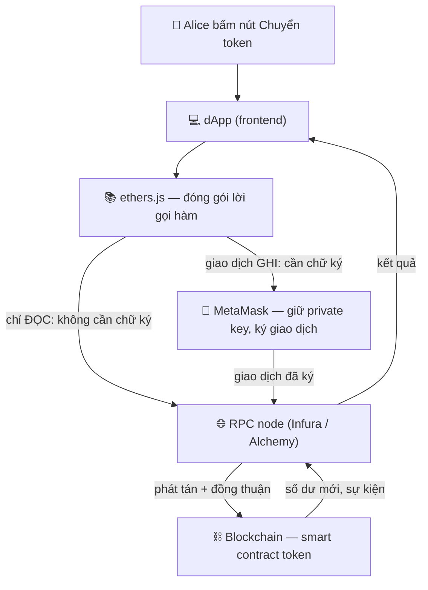

# Phát triển Web3 — bắt đầu từ đâu

> **Tác giả:** Mr.Rom\
> **Phiên bản:** v1.0.0\
> **Tạo lúc:** 22/06/2026\
> **Cập nhật:** 22/06/2026\
> **Level:** Basic\
> **Tags:** blockchain, web3, ethers, metamask, smart-contract, ethereum, security\
> **Yêu cầu trước:** [Cơ chế đồng thuận & Crypto-economics](03_consensus-and-crypto-economics.md)

> 🎯 *Ba bài trước bạn đã hiểu blockchain là gì, hoạt động ra sao, smart contract chạy trên EVM, và mạng tự đồng thuận bằng cơ chế kinh tế. Giờ là lúc **động tay**: bài này dựng bức tranh **Web3 stack** — wallet, RPC node, thư viện ethers.js — để bạn đọc/ghi một smart contract từ code JavaScript thật, biết test trên **testnet** trước khi đụng tiền thật, nắm quy trình **deploy** tổng quan, và quan trọng nhất — tránh hai lỗ hổng bảo mật kinh điển đã làm bốc hơi hàng trăm triệu USD.*

## 🎯 Sau bài này bạn sẽ

- [ ] Vẽ được **Web3 stack** từ wallet → RPC node → thư viện → smart contract, hiểu mỗi mảnh làm gì
- [ ] Dùng **ethers.js v6** đọc và ghi một contract (`BrowserProvider`, `Contract`, `await tx.wait()`)
- [ ] Phân biệt **testnet** (Sepolia) với **mainnet**, và vì sao luôn test trên testnet trước
- [ ] Mô tả quy trình **deploy contract** tổng quan với Hardhat / Foundry
- [ ] Nhận diện hai lỗ hổng kinh điển — **reentrancy** và **integer overflow** — và cách phòng
- [ ] Quyết định tỉnh táo **khi nào nên / không nên** build dApp

---

## Tình huống — Alice chuyển 1 token cho Bob

Bám theo ví dụ xuyên suốt cụm này: **Alice muốn chuyển 1 token cho Bob**. Hãy đặt cạnh nhau hai thế giới.

**Cách ngân hàng tập trung làm.** Alice mở app ngân hàng, nhập số tài khoản Bob, bấm "Chuyển". Đằng sau, một **máy chủ trung tâm** của ngân hàng nhận lệnh, kiểm tra số dư Alice trong **cơ sở dữ liệu nội bộ**, trừ 1 ở dòng của Alice, cộng 1 ở dòng của Bob, ghi log. Toàn bộ "sổ cái" nằm trong tay ngân hàng — họ là **người gác cổng duy nhất**, và bạn phải tin họ.

**Cách blockchain làm.** Không có máy chủ trung tâm nào cả. "Số dư token" của Alice nằm trong một **smart contract** (như bài 02 đã học) chạy trên hàng nghìn node. Để chuyển token, Alice phải:

1. Ký một **giao dịch** bằng *private key* (khoá riêng) của mình — chứng minh "đúng là tôi muốn chuyển".
2. Gửi giao dịch đó vào mạng qua một **node**.
3. Mạng **đồng thuận** (bài 03) đưa giao dịch vào block; smart contract tự trừ số dư Alice, cộng cho Bob.

Câu hỏi nảy ra ngay: làm sao **code của Alice** (một trang web, một app) thực hiện được ba bước trên? Cô ấy giữ private key ở đâu cho an toàn? App nói chuyện với "hàng nghìn node" kiểu gì? Và làm sao gọi đúng hàm `transfer` trong smart contract?

→ Trả lời ba câu đó chính là **Web3 stack**. Mỗi câu hỏi tương ứng một mảnh ghép: **wallet** giữ khoá và ký, **RPC node** là cửa vào mạng, **thư viện (ethers.js)** dịch lời gọi hàm của bạn thành giao dịch. Ta đi từng mảnh.

---

## 1️⃣ Web3 stack gồm những gì?

Khi viết app web truyền thống (Web2), stack quen thuộc là: trình duyệt → server của bạn → database. Mọi thứ bạn kiểm soát.

Web3 đổi mô hình đó. App của bạn (gọi là **dApp** — *decentralized application*, ứng dụng phi tập trung) không có database riêng và không có server giữ tiền của user. Thay vào đó nó nói chuyện với **blockchain** qua một chuỗi thành phần.

🪞 **Ẩn dụ — gửi thư quốc tế qua bưu điện:**
> Bạn (dApp) muốn gửi một bức thư có chữ ký (giao dịch) tới một toà nhà công cộng (smart contract trên blockchain). Bạn không tự chạy tới toà nhà đó — bạn:
> - Ký tên vào thư bằng **con dấu cá nhân** giữ trong két (đó là **wallet**).
> - Mang thư ra **bưu cục** gần nhất (đó là **RPC node** — cửa vào mạng).
> - Nhưng thư phải viết đúng "định dạng phong bì" mà bưu điện hiểu — việc đóng gói đúng định dạng đó do **thư ký riêng** lo (đó là **thư viện ethers.js**).

Bốn mảnh ghép của Web3 stack, theo thứ tự từ phía người dùng vào tới blockchain:

| Mảnh | Vai trò | Đại diện phổ biến |
|---|---|---|
| **Wallet** (ví) | Giữ *private key*, ký giao dịch, hỏi user xác nhận | MetaMask, Rabby, Coinbase Wallet |
| **Thư viện** | Dịch lời gọi hàm trong code thành giao dịch / lệnh đọc | ethers.js, viem, web3.js |
| **Provider / RPC node** | Cửa vào mạng — gửi giao dịch, đọc dữ liệu chain | Infura, Alchemy, node tự chạy |
| **Smart contract** | Logic + dữ liệu sống trên blockchain | Contract token của Alice/Bob |

> 💡 Bốn mảnh này nối thành một chuỗi. Để hình dung dữ liệu chảy qua chúng thế nào, ta xem sơ đồ ở mục tiếp theo trước khi đụng code.

---

## 2️⃣ Sơ đồ Web3 stack — dữ liệu chảy thế nào

Phần trên mô tả từng mảnh bằng lời. Mảnh trừu tượng nhất là **đường đi của một giao dịch** từ lúc Alice bấm nút tới lúc nó nằm trong block. Sơ đồ dưới đặt cả chuỗi cạnh nhau — đọc từ trên (dApp + người dùng) xuống dưới (blockchain):



→ Điểm mấu chốt đọc ra từ sơ đồ: có **hai loại thao tác** với chain. Thao tác **đọc** (xem số dư) đi thẳng qua RPC node, không cần ký, **miễn phí**. Thao tác **ghi** (chuyển token) bắt buộc qua **wallet** để Alice ký bằng private key và **trả phí gas** — rồi mới ra RPC node. Phân biệt đọc/ghi này là nền tảng cho mọi dòng code phía dưới.

---

## 3️⃣ Wallet — MetaMask giữ chìa khoá

Quay lại câu hỏi đầu bài: "Alice giữ private key ở đâu cho an toàn?". Đáp án là **wallet**.

**Wallet** (ví) không "chứa tiền" theo nghĩa đen — tiền (token) luôn nằm trên blockchain. Wallet chỉ giữ **private key** (khoá riêng) tương ứng với địa chỉ của Alice, và dùng khoá đó **ký** giao dịch để chứng minh "lệnh này do chủ địa chỉ phát ra".

🪞 **Ẩn dụ — con dấu khắc tên:** private key giống con dấu khắc tên riêng của Alice. Bất kỳ ai cầm con dấu đều "đóng dấu" được thay cô — nên mất private key = mất sạch tài sản, không có "quên mật khẩu thì lấy lại" như ngân hàng.

**MetaMask** là wallet phổ biến nhất, chạy dạng **extension trình duyệt** hoặc app mobile. Với dApp chạy trên web, MetaMask "tiêm" một đối tượng JavaScript là `window.ethereum` vào trang — đó là **cánh cửa** để code của bạn xin kết nối và yêu cầu ký.

Một dApp xin kết nối ví theo trình tự rất chuẩn:

```js
// Kiểm tra trình duyệt đã cài MetaMask chưa
if (typeof window.ethereum === "undefined") {
  alert("Bạn cần cài MetaMask để dùng dApp này.");
} else {
  // Mở popup MetaMask xin Alice cho phép kết nối tài khoản
  const taiKhoan = await window.ethereum.request({
    method: "eth_requestAccounts",
  });
  console.log("Đã kết nối địa chỉ:", taiKhoan[0]);
}
```

→ Sau lệnh trên, MetaMask bật popup hỏi Alice "Trang này muốn kết nối ví — đồng ý?". Đây là điểm cốt lõi của Web3: **mọi giao dịch ghi đều phải qua sự đồng ý tường minh của user trong wallet**, dApp không bao giờ tự ý ký thay. Có địa chỉ rồi, ta cần một cách lập trình để nói chuyện với chain — đó là `provider`.

> [!WARNING]
> Private key và *seed phrase* (12-24 từ khôi phục ví) là bí mật tối thượng. Không bao giờ gõ chúng vào website, không lưu vào ảnh/email, không hardcode trong code. Ai có chúng = sở hữu toàn bộ tài sản, không thể đảo ngược.

---

## 4️⃣ Provider / RPC node — cửa vào mạng

Câu hỏi thứ hai đầu bài: "App nói chuyện với hàng nghìn node kiểu gì?". Bạn **không** kết nối tới hàng nghìn node — bạn đi qua **một** cửa: một **RPC node**.

**RPC** (*Remote Procedure Call* — gọi thủ tục từ xa) là giao thức để app gửi yêu cầu tới một node blockchain: "cho tôi số dư địa chỉ X", "gửi giúp giao dịch này". Node đó đã kết nối sẵn vào mạng và lo phần phát tán.

Tự chạy một node Ethereum đầy đủ rất nặng (cần lưu hàng trăm GB dữ liệu chain, đồng bộ liên tục). Vì thế đa số dApp dùng **node-as-a-service** — dịch vụ chạy node hộ bạn và cho một **endpoint URL**:

- **Infura** (của Consensys) và **Alchemy** là hai nhà cung cấp phổ biến nhất. Bạn đăng ký, lấy một URL kèm API key, trỏ thư viện vào đó là xong.

🪞 **Ẩn dụ — tổng đài:** RPC node như tổng đài điện thoại. Bạn không cần biết "người cần gặp" đang ở thành phố nào — gọi tổng đài, nói tên, tổng đài nối máy. Infura/Alchemy là tổng đài chạy 24/7 để bạn khỏi tự dựng.

Trong code, đối tượng đại diện cho cửa vào mạng gọi là **provider**. ethers.js có hai loại provider hay dùng — chọn loại nào tuỳ bạn chỉ đọc hay cần ghi:

| Loại provider | Nguồn kết nối | Dùng khi |
|---|---|---|
| `JsonRpcProvider` | URL của Infura/Alchemy | Chỉ **đọc** chain (xem số dư, gọi hàm `view`) — không cần wallet |
| `BrowserProvider` | `window.ethereum` (MetaMask) | Cần **ghi** (gửi giao dịch) — vì phải xin user ký |

→ Đã có wallet (để ký) và provider (cửa vào mạng), còn thiếu mảnh cuối: thứ "dịch" lời gọi hàm Solidity của bạn thành định dạng chain hiểu. Đó là việc của ethers.js, phần lớn nhất của bài.

---

## 5️⃣ ethers.js — đọc và ghi smart contract

Đây là trái tim thực hành. **ethers.js** là thư viện JavaScript gọn nhẹ để nói chuyện với Ethereum (và mọi chain tương thích EVM). Bài này dùng **ethers v6** — bản hiện hành, **khác cú pháp đáng kể so với v5** (xem cảnh báo cuối mục).

Trước khi viết code, cần ba khái niệm nền:

- **Provider** — cửa vào mạng (mục 4). Chỉ đọc được.
- **Signer** — đối tượng "người ký", lấy từ wallet. Có Signer mới **ghi** được.
- **ABI** (*Application Binary Interface*) — bản "danh bạ hàm" của contract: liệt kê tên hàm, tham số, kiểu trả về. ethers cần ABI để biết contract có hàm `transfer`, `balanceOf`... và cách gọi.

### 🛠️ Bước 1: Cài đặt và import

Cài ethers vào project Node/frontend bằng npm. Lệnh dưới thêm ethers v6 vào dự án:

```bash
npm install ethers
```

Kết quả mong đợi (rút gọn):

```
added 1 package, and audited 2 packages in 2s
found 0 vulnerabilities
```

Trong code, import ethers. Với v6, mọi thứ nằm ở `ethers` top-level, không còn `ethers.utils.*` như v5:

```js
import { ethers } from "ethers";
```

### 🛠️ Bước 2: Đọc số dư token của Alice (chỉ đọc — không tốn gas)

Thao tác đọc không cần ký, không tốn phí. Ta dùng `JsonRpcProvider` trỏ vào Infura/Alchemy, tạo một `Contract` ở chế độ **chỉ đọc** (truyền `provider`), rồi gọi hàm `balanceOf`. ABI chỉ cần khai phần hàm mình dùng:

```js
import { ethers } from "ethers";

// 1. Provider chỉ-đọc — trỏ vào endpoint Infura/Alchemy (testnet Sepolia)
const provider = new ethers.JsonRpcProvider(
  "https://sepolia.infura.io/v3/YOUR_API_KEY"
);

// 2. ABI tối thiểu — chỉ khai 2 hàm view ta cần
const tokenAbi = [
  "function balanceOf(address chu) view returns (uint256)",
  "function decimals() view returns (uint8)",
];

// 3. Tạo contract ở chế độ CHỈ ĐỌC (truyền provider, không phải signer)
const tokenAddress = "0xYourTokenContractAddress";
const token = new ethers.Contract(tokenAddress, tokenAbi, provider);

// 4. Gọi hàm view — đọc số dư Alice (mọi lời gọi chain đều bất đồng bộ → await)
const aliceAddress = "0xAliceAddress";
const soDuTho = await token.balanceOf(aliceAddress); // dạng wei (số nguyên lớn)
const decimals = await token.decimals();

// 5. Đổi từ "wei" sang số người đọc được (vd 18 chữ số thập phân)
const soDu = ethers.formatUnits(soDuTho, decimals);
console.log(`Số dư Alice: ${soDu} token`);
```

Kết quả mong đợi (ví dụ Alice có 5 token):

```
Số dư Alice: 5.0 token
```

Vài điểm quan trọng về output và cú pháp:

- `balanceOf` trả về một **`BigInt`** (ethers v6 dùng `BigInt` gốc của JavaScript, không còn `BigNumber` như v5). Số dư trên chain luôn là **số nguyên rất lớn** tính theo đơn vị nhỏ nhất (giống "xu" so với "đồng").
- `ethers.formatUnits(value, decimals)` đổi số nguyên lớn đó sang chuỗi người đọc được. Token thường có `decimals = 18`, nên 5 token thật = `5000000000000000000` trên chain.
- Mọi lời gọi ra chain đều **bất đồng bộ** → phải `await`. Quên `await` sẽ nhận về một `Promise` thay vì giá trị.

### 🛠️ Bước 3: Ghi — Alice chuyển 1 token cho Bob (tốn gas, cần ký)

Đây là thao tác **ghi**: thay đổi trạng thái chain, nên bắt buộc có **Signer** và Alice phải ký + trả gas. Ta dùng `BrowserProvider` (bọc MetaMask), lấy `signer`, tạo contract ở chế độ **ghi** (truyền `signer`):

```js
import { ethers } from "ethers";

async function chuyenTokenChoBob() {
  // 1. Provider bọc MetaMask (window.ethereum) — đường để ghi
  const provider = new ethers.BrowserProvider(window.ethereum);

  // 2. Lấy Signer (người ký). Ở v6 getSigner() là BẤT ĐỒNG BỘ → phải await
  const signer = await provider.getSigner();

  // 3. ABI gồm hàm GHI transfer + view decimals
  const tokenAbi = [
    "function transfer(address den, uint256 soLuong) returns (bool)",
    "function decimals() view returns (uint8)",
  ];
  const tokenAddress = "0xYourTokenContractAddress";

  // 4. Contract ở chế độ GHI — truyền SIGNER (không phải provider)
  const token = new ethers.Contract(tokenAddress, tokenAbi, signer);

  // 5. Đổi "1 token" sang đơn vị nhỏ nhất theo decimals của token
  const decimals = await token.decimals();
  const soLuong = ethers.parseUnits("1", decimals); // 1 token → wei

  // 6. Gửi giao dịch — MetaMask bật popup cho Alice ký + xem phí gas
  const bobAddress = "0xBobAddress";
  const tx = await token.transfer(bobAddress, soLuong);
  console.log("Đã gửi giao dịch, hash:", tx.hash);

  // 7. CHỜ giao dịch được đóng vào block (xác nhận) rồi mới coi là xong
  const bienLai = await tx.wait();
  console.log("Đã xác nhận trong block:", bienLai.blockNumber);
}
```

Kết quả mong đợi trên console:

```
Đã gửi giao dịch, hash: 0x9f2c...a4b1
Đã xác nhận trong block: 6182043
```

Đây là đoạn quan trọng nhất bài — phân tích kỹ:

- Bước 6 trả về `tx` **ngay khi giao dịch được gửi vào mạng**, kèm `tx.hash` (mã giao dịch để tra trên explorer). Lúc này giao dịch **chưa chắc thành công** — nó mới "đang chờ".
- Bước 7 `await tx.wait()` mới **chờ mạng đóng giao dịch vào block** và xác nhận. Đây là điểm khác hẳn Web2: ở ngân hàng, bấm xong là xong tức thì; trên blockchain, bạn phải **chờ đồng thuận** (bài 03) — thường vài giây tới vài chục giây. Bỏ qua `tx.wait()` mà báo "thành công" ngay là lỗi logic phổ biến.
- `ethers.parseUnits("1", decimals)` là **ngược** của `formatUnits`: đổi "1 token" người dùng nhập thành số nguyên lớn cho chain.

> [!CAUTION]
> ethers **v6 khác v5 ở nhiều chỗ chí mạng**. v5: `new ethers.providers.Web3Provider(...)`, `provider.getSigner()` đồng bộ, `ethers.utils.parseUnits`, dùng `BigNumber`. v6: `new ethers.BrowserProvider(...)`, `getSigner()` **trả Promise (phải await)**, `ethers.parseUnits` (bỏ `.utils`), dùng `BigInt`. Copy code v5 vào project v6 sẽ lỗi ngay — luôn kiểm tra phiên bản.

→ Bạn vừa đọc và ghi được contract bằng vài chục dòng. Nhưng tất cả nên chạy ở đâu cho an toàn? Câu trả lời: **testnet** trước đã.

---

## 6️⃣ Testnet vs Mainnet — luôn tập trên sân tập trước

Ở các ví dụ trên, endpoint Infura là `sepolia.infura.io` — **không** phải mạng chính. Đây là chủ ý.

- **Mainnet** (mạng chính) — blockchain thật, token thật, tiền thật. Sai một dòng code chuyển nhầm là **mất tiền vĩnh viễn**, không hoàn tác.
- **Testnet** (mạng thử) — bản sao gần như y hệt mainnet về cơ chế, nhưng token **không có giá trị**. Ethereum hiện dùng **Sepolia** là testnet chính. Bạn xin "tiền giả" (Sepolia ETH) miễn phí từ một **faucet** (vòi nước) để trả gas khi test.

🪞 **Ẩn dụ — bay thật vs buồng lái mô phỏng:** phi công không học bay bằng máy bay chở khách thật. Họ tập hàng trăm giờ trong **buồng lái mô phỏng** — sai thì reset, không ai chết. Testnet là buồng lái mô phỏng của dApp: sai thoải mái, không mất tiền thật.

So sánh để chọn đúng mạng:

| Tiêu chí | Testnet (Sepolia) | Mainnet |
|---|---|---|
| Giá trị token | Không (giả) | Thật — tiền thật |
| Lấy ETH để trả gas | Miễn phí qua faucet | Phải mua bằng tiền thật |
| Hậu quả khi sai | Reset, làm lại | Mất tiền vĩnh viễn |
| Dùng khi | Phát triển, kiểm thử | Chỉ khi đã test kỹ trên testnet |

> [!IMPORTANT]
> Quy tắc bất di bất dịch: **mọi contract và dApp phải chạy đúng trên testnet trước khi lên mainnet**. Deploy thẳng lên mainnet để "tiết kiệm thời gian" là cách nhanh nhất mất tiền — của bạn và của user.

→ Để đưa contract của mình lên mạng (dù testnet hay mainnet), bạn cần một quy trình **deploy**. Ta xem tổng quan.

---

## 7️⃣ Quy trình deploy contract — nhìn tổng quan

Ở các mục trước Alice gọi một contract **đã có sẵn** trên chain. Nhưng nếu bạn là người **viết** contract token đó, làm sao đưa nó lên chain? Đó là **deploy** (triển khai).

Bài 02 đã giới thiệu Solidity và EVM bytecode. Deploy là quy trình biến file `.sol` thành một contract sống trên chain, gồm các bước tổng quát:

1. **Viết** contract bằng Solidity (file `.sol`).
2. **Compile** — biên dịch Solidity ra **EVM bytecode** + **ABI**.
3. **Test** — chạy test tự động kiểm tra logic (cực kỳ quan trọng với code giữ tiền).
4. **Deploy lên testnet** — gửi bytecode lên Sepolia, nhận về **địa chỉ contract**, kiểm tra thật.
5. **Deploy lên mainnet** — chỉ khi mọi thứ đã chắc.

Bạn không làm năm bước này thủ công. Có hai bộ công cụ (*framework*) thống lĩnh năm 2026 — bạn sẽ gặp tên chúng khắp nơi:

| Công cụ | Ngôn ngữ viết test/script | Định vị một câu |
|---|---|---|
| **Hardhat** | JavaScript / TypeScript | Phổ biến nhất, hợp dân JS/web, hệ sinh thái plugin lớn |
| **Foundry** | Solidity (test viết bằng chính Solidity) | Nhanh, dân Solidity thuần ưa chuộng, test cực mạnh |

> [!NOTE]
> Bài Basic này chỉ **nêu tên** Hardhat và Foundry để bạn biết bức tranh — cách dùng chi tiết (cài đặt, viết script deploy, cấu hình mạng) thuộc về các bài Intermediate. Việc cần nhớ bây giờ: deploy luôn đi qua **compile → test → testnet → mainnet**, không bao giờ nhảy thẳng.

→ Deploy được rồi, nhưng contract giữ tiền mà có lỗ hổng thì thảm hoạ. Phần tiếp theo là phần **không được phép sai**: bảo mật.

---

## 8️⃣ Bảo mật smart contract — hai lỗ hổng kinh điển

Smart contract khác app thường ở một điểm sống còn: **một khi deploy, code thường không sửa được**, và nó **giữ tiền thật**. Một lỗ hổng = mất tiền không đảo ngược. Hai lỗi dưới đây đã gây ra những vụ mất mát lớn nhất lịch sử — bạn phải nhận diện được.

### 8a. Reentrancy — "rút tiền trước khi kịp trừ sổ"

**Reentrancy** (tái nhập) là lỗ hổng kinh điển nhất. Ý tưởng: khi contract A gửi tiền cho một địa chỉ, nếu địa chỉ đó là **một contract khác** (của kẻ tấn công), việc nhận tiền có thể **kích hoạt code của kẻ tấn công**, và code đó **gọi ngược lại** hàm rút tiền của A — trước khi A kịp cập nhật số dư.

🪞 **Ẩn dụ — máy ATM lỗi:** bạn rút 1 triệu. Máy nhả tiền **trước**, rồi mới trừ vào sổ. Nhưng ngay lúc nhả tiền, bạn bấm "rút" lần nữa — sổ vẫn chưa trừ nên máy lại nhả tiếp. Lặp lại cho tới khi rút sạch két, dù tài khoản chỉ có 1 triệu.

Xem một hàm rút tiền **viết sai** — đây chính là mẫu lỗ hổng đã làm nên vụ DAO 2016 (mất ~60 triệu USD thời điểm đó):

```solidity
// ❌ SAI — dính reentrancy
function rutTien() public {
    uint256 soDu = balances[msg.sender];
    require(soDu > 0, "Khong co so du");

    // 1. GỬI tiền trước — nếu người nhận là contract, dòng này
    //    kích hoạt code của họ, và họ gọi NGƯỢC lại rutTien()...
    (bool ok, ) = msg.sender.call{value: soDu}("");
    require(ok, "Gui that bai");

    // 2. ...lúc gọi ngược, balances CHƯA bị trừ → rút lại được!
    balances[msg.sender] = 0;
}
```

→ Lỗ hổng nằm ở **thứ tự**: gửi tiền (bước 1) **trước khi** trừ sổ (bước 2). Cách phòng là **Checks-Effects-Interactions** — kiểm tra điều kiện, **cập nhật trạng thái trước**, gọi ra ngoài **sau cùng**:

```solidity
// ✅ ĐÚNG — pattern Checks-Effects-Interactions
function rutTien() public {
    uint256 soDu = balances[msg.sender];
    require(soDu > 0, "Khong co so du");

    // 1. EFFECTS: trừ sổ TRƯỚC khi gửi tiền ra ngoài
    balances[msg.sender] = 0;

    // 2. INTERACTIONS: giờ mới gửi — kẻ gọi ngược cũng vô ích vì sổ đã 0
    (bool ok, ) = msg.sender.call{value: soDu}("");
    require(ok, "Gui that bai");
}
```

Ngoài ra có thể thêm một **reentrancy guard** (khoá chống tái nhập) — thư viện **OpenZeppelin** cung cấp sẵn `ReentrancyGuard` với modifier `nonReentrant`, khoá hàm lại trong khi nó đang chạy.

### 8b. Integer overflow — và vì sao Solidity 0.8 đã đỡ giúp

**Integer overflow/underflow** (tràn số) xảy ra khi một biến số nguyên vượt quá giới hạn của nó và "quay vòng". Ví dụ một biến `uint8` chứa tối đa 255; cộng 1 vào 255 sẽ quay về 0. Với số dư token, một phép trừ `0 - 1` (underflow) có thể biến số dư từ 0 thành con số khổng lồ — kẻ tấn công "tạo" token từ hư không.

🪞 **Ẩn dụ — đồng hồ đo số:** đồng hồ công-tơ-mét chỉ có 6 chữ số (tối đa 999999 km). Đi thêm 1 km nữa, nó **quay về 000000**. Số nguyên trong máy tính cũng "quay vòng" như vậy khi tràn.

Tin tốt: từ **Solidity 0.8.0** (2020), trình biên dịch **tự động kiểm tra tràn số** và **revert** (huỷ giao dịch) nếu phát hiện — không cần thư viện ngoài nữa. So sánh hai thời kỳ:

```solidity
// Solidity < 0.8: phép tính dưới đây ÂM THẦM tràn, không báo lỗi
//   uint8 x = 255; x = x + 1;  →  x == 0   (nguy hiểm!)
// Ngày đó phải dùng thư viện SafeMath để tự kiểm.

// Solidity >= 0.8: cùng phép tính đó TỰ ĐỘNG revert khi tràn
pragma solidity ^0.8.20;

contract ViDu {
    function congQuaGioiHan() public pure returns (uint8) {
        uint8 x = 255;
        return x + 1; // ❌ Tự động revert: "arithmetic overflow"
    }
}
```

→ Bài học: **luôn dùng Solidity >= 0.8** (khai `pragma solidity ^0.8.20;` ở đầu file) để được bảo vệ tràn số miễn phí. Nhưng đừng chủ quan — overflow chỉ là **một** loại lỗi; reentrancy và nhiều lỗ hổng khác (access control, oracle...) thì 0.8 không tự đỡ.

### Rút bài học từ các vụ audit

Hai lỗi trên dẫn tới ba bài học mà mọi *audit* (kiểm toán bảo mật) đều nhắc:

1. **Code giữ tiền phải được audit độc lập.** Bên thứ ba (công ty audit) đọc lại code tìm lỗ hổng trước khi lên mainnet. Đừng tự tin tự kiểm.
2. **Đừng phát minh lại bánh xe.** Dùng thư viện đã được audit kỹ như **OpenZeppelin** cho token chuẩn (ERC-20, ERC-721), `ReentrancyGuard`, `Ownable`... thay vì tự viết.
3. **Giả định mọi địa chỉ gọi vào đều có thể là kẻ tấn công.** Áp `Checks-Effects-Interactions`, kiểm tra quyền (access control), và test kỹ các "đường biên" (số 0, số cực lớn, gọi lại nhiều lần).

> [!WARNING]
> "Code chạy đúng trên testnet" **không** đồng nghĩa "an toàn". Testnet kiểm tra **logic chạy được**; audit kiểm tra **kẻ xấu có khai thác được không**. Hai việc khác nhau — đừng nhầm.

---

## 9️⃣ Khi nào nên / không nên build dApp?

Web3 hấp dẫn, nhưng nó là **công cụ**, không phải "luôn tốt hơn". Quay lại Alice và Bob: nếu cả hai cùng tin một ngân hàng, thì chuyển tiền qua app ngân hàng **nhanh, rẻ, có thể hoàn tác** — hơn hẳn blockchain. Blockchain chỉ thắng khi **không tồn tại một bên trung gian đáng tin**.

Khung quyết định nhanh:

| Build dApp **đáng cân nhắc** khi… | **Không nên** build dApp khi… |
|---|---|
| Cần nhiều bên **không tin nhau** giao dịch mà không qua trung gian | Đã có một bên trung gian đáng tin (ngân hàng, công ty) làm tốt rồi |
| Cần **minh bạch công khai** + không ai sửa được lịch sử | Dữ liệu phải **riêng tư** (chain công khai = ai cũng đọc được) |
| Tài sản số cần **chứng minh sở hữu** không qua trung gian | Cần hiệu năng cao, độ trễ thấp, phí giao dịch ~0 |
| Logic cần **tự động chạy, không ai can thiệp** được (smart contract) | Logic cần sửa/cập nhật thường xuyên (contract khó sửa sau deploy) |

→ Tiêu chí lõi: hỏi *"vấn đề của mình có thật sự cần loại bỏ bên trung gian đáng tin không?"*. Nếu câu trả lời là không, một database Web2 truyền thống gần như luôn rẻ hơn, nhanh hơn, dễ sửa hơn. Đừng "dùng blockchain vì nó hot".

---

## 🔟 Lộ trình học tiếp

Bài này là **cánh cửa** vào Web3 — đủ để bạn đọc/ghi contract và hiểu các rủi ro. Để đi xa hơn, hướng đi tự nhiên:

- **Solidity sâu hơn** — viết contract của riêng bạn (token ERC-20, NFT ERC-721), dùng OpenZeppelin.
- **Hardhat hoặc Foundry** — học một bộ công cụ deploy + test hoàn chỉnh (bài này mới nêu tên).
- **viem + wagmi** — thế hệ thư viện/React hook mới, nhiều dApp 2026 chuyển sang; nắm ethers rồi học viem rất nhanh.
- **Bảo mật chuyên sâu** — đọc các bản audit công khai, làm các thử thách như Ethernaut để học tư duy tấn công.
- **L2 (Layer 2)** — Arbitrum, Optimism, Base... nơi phí rẻ hơn mainnet, phần lớn dApp thật chạy ở đây.

---

## 💡 Cạm bẫy thường gặp & Best practice

### ❌ Cạm bẫy: trộn cú pháp ethers v5 và v6

- **Triệu chứng**: copy code mẫu trên mạng vào project, gặp lỗi `ethers.providers is undefined` hoặc `getSigner is not a function` / `signer.address is undefined`.
- **Nguyên nhân**: code mẫu viết cho **v5** nhưng project cài **v6** (hoặc ngược lại). v6 đổi `Web3Provider` → `BrowserProvider`, bỏ `.utils`, `getSigner()` thành bất đồng bộ, `BigNumber` → `BigInt`.
- **Cách tránh**: kiểm tra phiên bản bằng `npm list ethers` trước. Đọc đúng tài liệu phiên bản. Trong bài này mọi ví dụ là **v6**.

### ❌ Cạm bẫy: coi giao dịch "xong" ngay khi gửi

- **Triệu chứng**: dApp báo "Chuyển thành công!" nhưng số dư Bob chưa đổi, hoặc lát sau giao dịch bị huỷ.
- **Nguyên nhân**: chỉ `await token.transfer(...)` rồi báo xong, **bỏ `await tx.wait()`**. Lúc đó giao dịch mới được *gửi*, chưa được mạng xác nhận vào block.
- **Cách tránh**: luôn `const bienLai = await tx.wait();` rồi mới coi là hoàn tất. Hiển thị trạng thái "đang chờ xác nhận" trong lúc chờ.

### ✅ Best practice: luôn test trên testnet, dùng thư viện đã audit

- **Vì sao**: contract giữ tiền thật, lỗi không đảo ngược. Testnet cho phép sai miễn phí; thư viện như OpenZeppelin đã qua hàng nghìn giờ audit, an toàn hơn code tự viết.
- **Cách áp dụng**: phát triển và kiểm thử trọn vẹn trên **Sepolia** trước. Token/quyền sở hữu/guard chống reentrancy → dùng OpenZeppelin thay vì tự viết. Pin `pragma solidity ^0.8.20;`.

### ✅ Best practice: phân biệt rõ thao tác đọc và ghi

- **Vì sao**: nhầm lẫn dẫn tới hoặc bắt user ký một việc lẽ ra miễn phí, hoặc cố ghi mà không có signer → lỗi.
- **Cách áp dụng**: **đọc** (`view`, `balanceOf`) → dùng `JsonRpcProvider`, không cần wallet, không gas. **Ghi** (`transfer`, đổi state) → dùng `BrowserProvider` + `signer`, cần user ký + gas.

---

## 🧠 Tự kiểm tra (Self-check)

**Q1.** Kể bốn mảnh của Web3 stack và vai trò mỗi mảnh.

<details>
<summary>💡 Xem giải thích</summary>

1. **Wallet** (MetaMask) — giữ *private key*, ký giao dịch, hỏi user xác nhận.
2. **Thư viện** (ethers.js) — dịch lời gọi hàm trong code thành giao dịch / lệnh đọc.
3. **Provider / RPC node** (Infura, Alchemy) — cửa vào mạng: gửi giao dịch, đọc dữ liệu chain.
4. **Smart contract** — logic + dữ liệu sống trên blockchain.

Thao tác **đọc** đi thẳng qua RPC node (miễn phí); thao tác **ghi** phải qua wallet để user ký + trả gas.

</details>

**Q2.** Trong ethers v6, tạo provider và signer để **ghi** (gửi giao dịch) như thế nào? Nêu đúng cú pháp.

<details>
<summary>💡 Xem giải thích</summary>

```js
const provider = new ethers.BrowserProvider(window.ethereum);
const signer = await provider.getSigner(); // v6: getSigner() bất đồng bộ → await
const contract = new ethers.Contract(address, abi, signer); // truyền signer để ghi
```

Khác v5: v5 dùng `new ethers.providers.Web3Provider(...)` và `provider.getSigner()` đồng bộ (không await).

</details>

**Q3.** Vì sao luôn phải test trên testnet (Sepolia) trước khi lên mainnet?

<details>
<summary>💡 Xem giải thích</summary>

Mainnet dùng **tiền thật** — sai một dòng có thể mất tiền **vĩnh viễn, không đảo ngược** được. Testnet có cơ chế gần y hệt nhưng token **không có giá trị**, lấy ETH miễn phí qua faucet để trả gas. Sai trên testnet thì reset, làm lại — như phi công tập trong buồng lái mô phỏng trước khi bay thật.

</details>

**Q4.** Reentrancy là gì? Cách phòng cốt lõi là gì?

<details>
<summary>💡 Xem giải thích</summary>

**Reentrancy** (tái nhập): khi contract gửi tiền cho một địa chỉ là contract khác, việc nhận tiền kích hoạt code kẻ tấn công, code đó **gọi ngược** hàm rút tiền **trước khi** số dư được cập nhật → rút lặp lại (như ATM nhả tiền trước khi trừ sổ). Vụ DAO 2016 là ví dụ kinh điển.

Cách phòng: pattern **Checks-Effects-Interactions** — kiểm tra điều kiện, **cập nhật trạng thái (trừ sổ) TRƯỚC**, gọi ra ngoài **sau cùng**. Bổ sung `ReentrancyGuard` (`nonReentrant`) của OpenZeppelin.

</details>

**Q5.** Integer overflow là gì, và Solidity 0.8 đã thay đổi điều gì?

<details>
<summary>💡 Xem giải thích</summary>

**Integer overflow/underflow** (tràn số): biến số nguyên vượt giới hạn và "quay vòng" — vd `uint8` từ 255 + 1 quay về 0, hoặc số dư `0 - 1` thành con số khổng lồ (giống đồng hồ công-tơ-mét quay về 000000).

Từ **Solidity 0.8.0**, trình biên dịch **tự động kiểm tra tràn số** và **revert** giao dịch khi phát hiện — không cần thư viện `SafeMath` như trước. Bài học: luôn dùng `pragma solidity ^0.8.20;`. Nhưng 0.8 chỉ đỡ tràn số, **không** đỡ reentrancy hay các lỗ hổng khác.

</details>

**Q6.** Khi nào **không** nên build dApp?

<details>
<summary>💡 Xem giải thích</summary>

Không nên khi: đã có một **bên trung gian đáng tin** làm tốt; dữ liệu cần **riêng tư** (chain công khai ai cũng đọc được); cần **hiệu năng cao / phí ~0**; logic cần **sửa thường xuyên** (contract khó sửa sau deploy).

Tiêu chí lõi: blockchain chỉ thắng khi vấn đề **thật sự cần loại bỏ bên trung gian đáng tin**. Nếu không, database Web2 truyền thống thường rẻ hơn, nhanh hơn, dễ sửa hơn.

</details>

---

## ⚡ Tra cứu nhanh (Cheatsheet)

### ethers v6 — đọc (chỉ-đọc, không gas)

```js
const provider = new ethers.JsonRpcProvider("https://sepolia.infura.io/v3/KEY");
const c = new ethers.Contract(address, abi, provider); // provider = chỉ đọc
const soDu = await c.balanceOf(addr);                   // trả BigInt
const dep = ethers.formatUnits(soDu, 18);               // BigInt → chuỗi người đọc
```

### ethers v6 — ghi (cần ký + gas)

```js
const provider = new ethers.BrowserProvider(window.ethereum);
const signer = await provider.getSigner();              // v6: phải await
const c = new ethers.Contract(address, abi, signer);    // signer = ghi được
const soLuong = ethers.parseUnits("1", 18);             // "1" → BigInt
const tx = await c.transfer(toAddr, soLuong);           // gửi giao dịch
const bienLai = await tx.wait();                        // CHỜ xác nhận vào block
```

### v5 → v6 — khác biệt hay vấp

```text
v5                                  v6
ethers.providers.Web3Provider   →   ethers.BrowserProvider
ethers.providers.JsonRpcProvider →  ethers.JsonRpcProvider
provider.getSigner()  (đồng bộ)  →  await provider.getSigner()
ethers.utils.parseUnits         →   ethers.parseUnits
ethers.utils.formatUnits        →   ethers.formatUnits
BigNumber                       →   BigInt (gốc JS)
```

### An toàn smart contract — nhớ nhanh

```text
Reentrancy   : trừ sổ TRƯỚC, gọi ra ngoài SAU (Checks-Effects-Interactions)
               + ReentrancyGuard (OpenZeppelin)
Overflow     : dùng Solidity >= 0.8 (pragma ^0.8.20) → tự revert khi tràn
Code giữ tiền: audit độc lập + dùng thư viện đã audit (OpenZeppelin)
Mọi dApp     : test TRÊN TESTNET (Sepolia) trước, không nhảy thẳng mainnet
```

---

## 📚 Từ Điển Thuật Ngữ (Glossary)

| EN | VN | Giải thích |
|---|---|---|
| Web3 | Web3 | Web phi tập trung dựa trên blockchain, không cần server trung tâm giữ tài sản |
| dApp (decentralized app) | Ứng dụng phi tập trung | App nói chuyện với smart contract trên blockchain thay vì server riêng |
| Wallet | Ví | Phần mềm giữ private key và ký giao dịch (MetaMask, Rabby) |
| MetaMask | MetaMask | Wallet extension/app phổ biến nhất; tiêm `window.ethereum` vào trang |
| Private key | Khoá riêng | Bí mật dùng ký giao dịch; mất là mất sạch tài sản, không lấy lại được |
| Seed phrase | Cụm từ khôi phục | 12-24 từ để khôi phục ví; bí mật tối thượng, không chia sẻ |
| Provider | Provider | Đối tượng đại diện kết nối tới chain trong ethers.js |
| RPC node | Node RPC | Node blockchain nhận yêu cầu từ app (gửi giao dịch / đọc dữ liệu) |
| Infura / Alchemy | Infura / Alchemy | Dịch vụ chạy node hộ, cấp endpoint URL để dApp kết nối |
| ethers.js | ethers.js | Thư viện JS gọn nhẹ để tương tác với Ethereum và chain tương thích EVM |
| Signer | Người ký | Đối tượng (từ wallet) ký được giao dịch; cần để ghi lên chain |
| ABI | Giao diện nhị phân ứng dụng | "Danh bạ hàm" của contract: tên hàm, tham số, kiểu trả về |
| Gas | Phí gas | Phí trả cho mạng để thực thi giao dịch ghi |
| Transaction (tx) | Giao dịch | Lệnh thay đổi trạng thái chain, phải ký + trả gas |
| Testnet | Mạng thử | Bản sao cơ chế mainnet, token không có giá trị (vd Sepolia) |
| Mainnet | Mạng chính | Blockchain thật, token có giá trị thật |
| Faucet | Vòi nước | Dịch vụ phát ETH testnet miễn phí để test |
| Deploy | Triển khai | Đưa contract đã compile lên chain, nhận về địa chỉ contract |
| Hardhat | Hardhat | Framework deploy/test contract dùng JS/TS |
| Foundry | Foundry | Framework deploy/test contract, test viết bằng Solidity |
| Reentrancy | Tái nhập | Lỗ hổng: bị gọi ngược hàm rút tiền trước khi cập nhật số dư |
| Checks-Effects-Interactions | Kiểm tra–Cập nhật–Tương tác | Pattern chống reentrancy: cập nhật trạng thái trước, gọi ngoài sau |
| Integer overflow | Tràn số nguyên | Số nguyên vượt giới hạn rồi "quay vòng"; Solidity ≥ 0.8 tự revert |
| Revert | Huỷ giao dịch | Dừng và hoàn tác giao dịch khi gặp lỗi/điều kiện sai |
| OpenZeppelin | OpenZeppelin | Thư viện contract chuẩn đã audit kỹ (ERC-20, ReentrancyGuard...) |
| Audit | Kiểm toán bảo mật | Bên thứ ba đọc lại code tìm lỗ hổng trước khi lên mainnet |
| L2 (Layer 2) | Tầng 2 | Mạng chạy trên Ethereum cho phí rẻ hơn (Arbitrum, Optimism, Base) |

---

## 🔗 Liên kết & Tài nguyên

⬅️ **Bài trước:** [Cơ chế đồng thuận & Crypto-economics](03_consensus-and-crypto-economics.md)\
↑ **Về cụm:** [blockchain — README cụm](../../README.md)

### 🧭 Định hướng lộ trình học

- [Smart Contract & EVM](02_smart-contracts-and-evm.md) — nền Solidity/EVM đứng sau contract bạn vừa gọi
- [Cơ chế đồng thuận & Crypto-economics](03_consensus-and-crypto-economics.md) — vì sao phải `await tx.wait()`: mạng cần thời gian đồng thuận

### 🧩 Các chủ đề có thể bạn quan tâm

- [Blockchain là gì?](00_what-is-blockchain.md) — quay lại nền tảng sổ cái phân tán
- [Blockchain hoạt động thế nào?](01_how-blockchain-works.md) — block, hash, giao dịch ở mức cơ chế

### 🌐 Tài nguyên tham khảo khác

- [ethers.js v6 docs (chính thức)](https://docs.ethers.org/v6/) — tài liệu gốc, luôn kiểm tra đúng phiên bản v6
- [MetaMask docs](https://docs.metamask.io/) — cách dApp tương tác `window.ethereum`
- [Infura docs](https://docs.infura.io/) / [Alchemy docs](https://docs.alchemy.com/) — lấy endpoint RPC
- [OpenZeppelin Contracts](https://docs.openzeppelin.com/contracts) — thư viện contract chuẩn đã audit
- [Sepolia faucet (Alchemy)](https://www.alchemy.com/faucets/ethereum-sepolia) — xin ETH testnet để test
- [Ethernaut (OpenZeppelin)](https://ethernaut.openzeppelin.com/) — thử thách học tư duy tấn công smart contract

---

> 🎯 *Sau bài này bạn đã nối được Web3 stack — wallet, RPC node, ethers.js — và đọc/ghi một smart contract từ JavaScript thật, biết test trên Sepolia trước, hiểu quy trình deploy, và phòng được reentrancy lẫn integer overflow. Đây là bài cuối cụm `blockchain` cơ bản; lộ trình tiếp theo ở mục 🔟 dẫn bạn sang Solidity sâu, Hardhat/Foundry, viem/wagmi và bảo mật chuyên sâu.*

---

## 📌 Nhật ký thay đổi (Changelog)

- **v1.0.0 (22/06/2026)** — Bản đầu tiên. Cụm `blockchain/` lesson 5/5 (bài cuối). Cover: Web3 stack (wallet MetaMask, provider/RPC node Infura/Alchemy, thư viện ethers.js v6, smart contract) + đọc/ghi contract bằng ethers v6 đúng cú pháp (`JsonRpcProvider`/`BrowserProvider`, `await getSigner()`, `Contract`, `parseUnits`/`formatUnits`, `await tx.wait()`, BigInt) + testnet (Sepolia) vs mainnet + faucet + quy trình deploy tổng quan (compile→test→testnet→mainnet, nêu tên Hardhat/Foundry) + bảo mật: reentrancy (vụ DAO, Checks-Effects-Interactions, ReentrancyGuard) và integer overflow (Solidity 0.8 tự revert, pragma ^0.8.20) + rút bài học audit (OpenZeppelin) + khi nào nên/không nên build dApp + lộ trình học tiếp. Kèm sơ đồ mermaid Web3 stack (luồng đọc vs ghi). Bám ví dụ xuyên suốt Alice chuyển 1 token cho Bob, đối chiếu ngân hàng tập trung.
