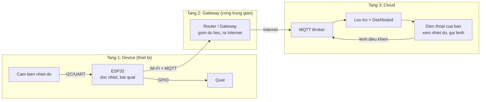
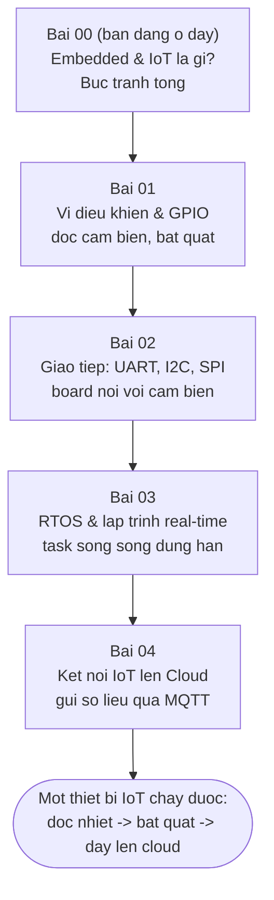

# Embedded & IoT là gì?

> **Tác giả:** Mr.Rom\
> **Phiên bản:** v1.0.0\
> **Tạo lúc:** 22/06/2026\
> **Cập nhật:** 22/06/2026\
> **Level:** Basic\
> **Tags:** embedded, iot, microcontroller, mcu, esp32, arduino, stm32, raspberry-pi, rtos, gpio, mqtt\
> **Yêu cầu trước:** Không có — đây là bài đầu tiên của cụm `embedded-iot`

> 🎯 *Bài INTRO của cụm. Trước khi cắm board hay viết dòng code đầu tiên, bạn cần một bức tranh tổng: **lập trình thiết bị khác lập trình PC ở chỗ nào**, phân biệt **embedded** (hệ nhúng — máy tính chuyên dụng nằm trong thiết bị) với **IoT** (hệ nhúng + kết nối mạng), vì sao tài nguyên tính bằng KB/MB chứ không phải GB, phổ thiết bị từ vi điều khiển (Arduino/ESP32/STM32) tới máy có hệ điều hành (Raspberry Pi), vì sao C/C++ thống trị, ba tầng phần mềm (bare-metal vs RTOS vs Linux nhúng), và kiến trúc IoT device → gateway → cloud. Cả bài bám theo một dự án nhỏ xuyên suốt: **đọc nhiệt độ từ cảm biến trên một board, bật quạt khi quá nóng, rồi gửi số liệu lên cloud qua MQTT** — dùng nó để chạm vào GPIO, vi điều khiển, giao tiếp, RTOS và kết nối IoT.*

## 🎯 Sau bài này bạn sẽ

- [ ] Phân biệt được **embedded system** (hệ nhúng) với **IoT** — IoT về bản chất là hệ nhúng cộng thêm khả năng kết nối mạng
- [ ] Kể được những đặc trưng khiến lập trình thiết bị **khác hẳn PC**: tài nguyên hạn chế (RAM/flash tính bằng KB/MB), real-time, chạy 24/7, nguồn pin
- [ ] Phân biệt **vi điều khiển** (MCU — Arduino/ESP32/STM32) với **vi xử lý có hệ điều hành** (Raspberry Pi chạy Linux), và biết khi nào dùng cái nào
- [ ] Hiểu vì sao **C/C++** là ngôn ngữ chủ đạo của thế giới nhúng
- [ ] So sánh ba tầng phần mềm — **bare-metal**, **RTOS**, **Linux nhúng** — qua một bảng và biết khi nào chọn cái nào
- [ ] Vẽ được **kiến trúc IoT** ba tầng device → gateway → cloud và biết bài này dẫn tới đâu trong cụm

---

## Tình huống — cái máy điều hoà của bạn cũng là một "máy tính"

Hãy để ý một điều quanh bạn mà ít ai nghĩ tới.

Khi bạn lập trình web hay app, "máy tính" trong đầu bạn là một cái laptop: màn hình, bàn phím, vài chục GB RAM, ổ cứng cả nghìn GB, cắm điện liên tục, chạy Windows/macOS/Linux. Bạn gõ code, nhấn run, có terminal in log ra cho xem.

Giờ nhìn cái **máy điều hoà** trên tường. Nó không có màn hình để gõ lệnh, không có terminal, không cắm chuột. Nhưng bên trong nó **có một con chip** đang chạy chương trình: đọc nhiệt độ phòng từ một cảm biến, so với mức bạn đặt trên remote, rồi quyết định bật/tắt máy nén, quay cánh đảo gió, nhấp nháy đèn LED. Con chip đó **không bao giờ tắt** chừng nào còn điện, không chạy hệ điều hành đồ sộ, và toàn bộ chương trình của nó nhỏ tới mức nhét vừa trong vài chục KB.

Cái máy giặt, cái lò vi sóng, cái remote TV, cái đồng hồ thông minh, cái khoá cửa vân tay, thậm chí cái bàn chải điện — tất cả đều giấu bên trong một "máy tính tí hon" như thế. Đó là **embedded system** (hệ nhúng): một máy tính **chuyên dụng**, làm đúng một việc, **nằm ẩn bên trong** một thiết bị lớn hơn.

Và khi cái máy điều hoà đó **kết nối được vào Wi-Fi** — để bạn bật/tắt nó từ điện thoại lúc còn ở công ty, hay để nó gửi nhiệt độ phòng lên một dashboard trên cloud — thì nó vừa bước thêm một bước nữa, thành **IoT** (Internet of Things — Internet vạn vật).

→ Cả bài này mở dần ra từ hai khái niệm đó: hệ nhúng là gì, IoT thêm gì vào, vì sao lập trình chúng đòi một lối tư duy rất khác lập trình PC, và một người mới bắt đầu từ đâu. Xuyên suốt, ta bám một dự án cụ thể: **đọc nhiệt độ → quá nóng thì bật quạt → đẩy số liệu lên cloud**.

---

## 1️⃣ Embedded là gì? IoT thêm gì vào?

Quay lại cái máy điều hoà: con chip bên trong nó là một máy tính, nhưng là một máy tính **rất khác** cái laptop của bạn. Nó sinh ra để làm **đúng một việc** (điều khiển điều hoà), nhúng sẵn vào thiết bị, và chạy mãi không nghỉ.

**Định nghĩa — Embedded system (hệ nhúng):** một hệ thống máy tính **chuyên dụng** được tích hợp (nhúng) vào bên trong một thiết bị lớn hơn, để điều khiển thiết bị đó. Khác với máy tính đa dụng (PC) chạy đủ thứ phần mềm tuỳ ý người dùng, hệ nhúng thường chỉ chạy **một chương trình cố định** (gọi là *firmware* — phần mềm gắn liền phần cứng), được nạp sẵn từ nhà sản xuất.

🪞 **Ẩn dụ — embedded như một người gác cổng tận tuỵ:**
> Một chiếc PC giống như một **nhân viên đa năng** — sáng làm kế toán, chiều thiết kế, tối chơi game, ai giao gì làm nấy. Một hệ nhúng giống như một **người gác cổng** chỉ làm đúng một việc suốt 24 giờ: ngồi đó, ai tới thì mở cổng, không ai tới thì vẫn ngồi canh. Anh ta không cần biết Photoshop, không cần màn hình to — chỉ cần làm thật chuẩn, thật bền, một nhiệm vụ duy nhất, không nghỉ.

Vậy còn **IoT**? Nó không phải một loại máy tính khác — nó là **hệ nhúng cộng thêm một thứ**: khả năng **kết nối mạng**.

**Định nghĩa — IoT (Internet of Things — Internet vạn vật):** mạng lưới các thiết bị nhúng có khả năng **kết nối Internet** (qua Wi-Fi, Bluetooth, di động, hoặc các mạng tầm xa), để **gửi dữ liệu lên** (số liệu cảm biến) và **nhận lệnh xuống** (điều khiển từ xa), thường thông qua một dịch vụ trên **cloud**.

🪞 **Ẩn dụ — IoT là người gác cổng được phát một bộ đàm:**
> Người gác cổng (hệ nhúng) ở ẩn dụ trên vẫn làm việc của mình. Nhưng giờ bạn phát cho anh ta một **chiếc bộ đàm**. Anh ta vừa canh cổng, vừa **báo cáo về trung tâm** ("hiện có 3 người vào"), và **nhận lệnh từ trung tâm** ("mở cổng cho xe sắp tới"). Chính chiếc bộ đàm — khả năng nói chuyện với thế giới bên ngoài — biến một hệ nhúng cô lập thành một thiết bị IoT.

Mối quan hệ gọn lại trong một dòng:

> **IoT = Embedded system + kết nối mạng + (thường) cloud.**

Mọi thiết bị IoT đều là hệ nhúng. Nhưng không phải hệ nhúng nào cũng là IoT — cái lò vi sóng đời cũ không nối mạng vẫn là hệ nhúng, chỉ là không phải IoT.

Để thấy rõ ranh giới và cũng đặt nền cho dự án xuyên suốt, đối chiếu hai phiên bản cùng một thiết bị qua bảng — đọc theo từng hàng:

| Khía cạnh | Hệ nhúng "thuần" (không mạng) | Thiết bị IoT (có mạng) |
|---|---|---|
| Ví dụ trong dự án của ta | Board đọc nhiệt độ, quá nóng thì **bật quạt tại chỗ** | Board làm y vậy, **cộng thêm** gửi nhiệt độ lên cloud, nhận lệnh từ xa |
| Kết nối ra ngoài | Không, hoạt động cô lập | Có — Wi-Fi/Bluetooth/di động |
| Dữ liệu đi đâu | Ở lại trong thiết bị | Đẩy lên cloud, xem được từ điện thoại |
| Điều khiển từ xa | Không | Có — gửi lệnh xuống qua mạng |
| Ví dụ đời thường | Lò vi sóng, remote TV cũ | Điều hoà thông minh, đồng hồ thể thao, khoá cửa app |

> [!NOTE]
> Đừng để chữ "Internet" trong IoT đánh lừa rằng mọi thiết bị IoT đều cắm thẳng vào Internet. Rất nhiều thiết bị IoT nhỏ (cảm biến chạy pin) chỉ nói chuyện tầm gần với một **gateway** (cổng trung gian) bằng Bluetooth hay Zigbee, rồi chính gateway mới ra Internet. Ta sẽ gặp lại kiến trúc này ở mục cuối bài.

→ Định nghĩa đã rõ. Nhưng điều khiến lập trình embedded/IoT thật sự **khác** lập trình PC không nằm ở chỗ "nó nhỏ", mà ở bốn ràng buộc cụ thể về tài nguyên, thời gian, độ bền và nguồn điện — mục tiếp theo.

---

## 2️⃣ Vì sao lập trình thiết bị khác hẳn lập trình PC?

Khi viết web/app, bạn được nuông chiều: RAM mấy GB, CPU mạnh, điện cắm liên tục, lỡ chậm một chút cũng không sao. Bước vào thế giới nhúng, bốn ràng buộc dưới đây đảo ngược gần hết thói quen đó. Đây là nhóm khái niệm nền tảng nhất của cả cụm, nên ta đi từng cái một:

- **Tài nguyên cực hạn chế** — đây là cú sốc đầu tiên. Một con vi điều khiển phổ thông chỉ có RAM tính bằng **KB** và bộ nhớ chương trình (*flash*) tính bằng **KB tới vài MB** — không phải GB. Một con ESP32 có ~520 KB RAM; một con Arduino Uno chỉ vỏn vẹn **2 KB RAM** và 32 KB flash. Bạn không thể "cứ tạo mảng to thoải mái" như trên PC; mỗi byte đều đáng giá.
- **Real-time (thời gian thực)** — nhiều tác vụ nhúng phải phản hồi **đúng hạn**, không được trễ. Túi khí xe hơi phải nổ trong vài mili-giây sau va chạm; trễ là vô dụng. Trên PC, một video lag nửa giây chỉ khó chịu; trong nhúng, trễ hạn có thể là hỏng việc hoặc nguy hiểm.
- **Chạy 24/7, độ tin cậy cao** — thiết bị nhúng thường **không bao giờ được tắt và reboot** như khi bạn khởi động lại laptop. Cái router Wi-Fi, cái máy tạo nhịp tim, cái cảm biến trong nhà máy phải chạy liên tục hàng tháng, hàng năm. Một lỗi rò rỉ bộ nhớ (*memory leak*) trên PC reboot là hết; trên thiết bị chạy 24/7, nó tích tụ tới ngày treo máy.
- **Nguồn pin, tiết kiệm điện** — rất nhiều thiết bị IoT chạy bằng **pin** và phải sống nhiều tháng tới nhiều năm với một viên pin. Điều này định hình cả cách lập trình: thiết bị **ngủ** phần lớn thời gian (chế độ *sleep* tiêu thụ vài micro-ampe), chỉ **thức dậy** vài mili-giây để đo và gửi rồi ngủ tiếp.

🪞 **Ẩn dụ — PC là biệt thự, vi điều khiển là cái lều cắm trại:**
> Lập trình PC như sống trong **biệt thự**: điện nước thả ga, phòng thừa mứa, bừa bộn cũng chẳng sao. Lập trình vi điều khiển như **đi cắm trại trong rừng dài ngày**: mang được bao nhiêu đồ thì dùng bấy nhiêu (RAM/flash hạn chế), pin sạc dự phòng phải dùng dè (tiết kiệm điện), việc gì cần làm gấp thì phải làm ngay không trễ (real-time), và bạn phải sống sót cả chuyến đi mà không "về nhà reboot" (chạy 24/7). Chính sự khan hiếm đó buộc bạn lập trình **gọn, chặt, tỉnh táo**.

Để cảm nhận khoảng cách tài nguyên cho cụ thể, đặt một board nhúng điển hình cạnh một chiếc laptop — đối chiếu theo hàng:

| Tài nguyên | Laptop điển hình 2026 | Vi điều khiển (vd ESP32) | Arduino Uno (AVR) |
|---|---|---|---|
| RAM | 16 GB | ~520 KB | **2 KB** |
| Bộ nhớ chương trình | SSD 512 GB | flash 4 MB | flash 32 KB |
| Xung nhịp CPU | ~3 GHz, nhiều nhân | ~240 MHz, 2 nhân | 16 MHz |
| Nguồn | Cắm điện / pin lớn | USB / pin nhỏ | USB / pin |
| Hệ điều hành | Có (Windows/macOS/Linux) | Thường không, hoặc RTOS nhỏ | Không (bare-metal) |
| Lệch về RAM | — | nhỏ hơn ~30.000 lần | nhỏ hơn ~8 triệu lần |

> [!IMPORTANT]
> Con số "2 KB RAM" của Arduino Uno không phải lỗi đánh máy. Để dễ hình dung: 2 KB là khoảng **hai nghìn ký tự** — chưa bằng một tin nhắn dài. Toàn bộ biến, bộ đệm, ngăn xếp của chương trình phải nhét vừa trong đó. Đây là lý do lập trình nhúng coi trọng từng byte, và là lý do các ngôn ngữ "ngốn RAM" (như chạy một máy ảo to) thường không hợp với MCU nhỏ — dẫn thẳng tới câu hỏi "vậy dùng ngôn ngữ gì" ở mục 4.

→ Bốn ràng buộc này không chỉ là lý thuyết — chúng chia luôn thế giới thiết bị thành hai nhánh lớn: loại "siêu tiết kiệm, không có OS" và loại "mạnh hơn, chạy cả Linux". Mục tiếp theo phân biệt hai nhánh đó.

---

## 3️⃣ Vi điều khiển (MCU) vs vi xử lý có OS (Raspberry Pi)

Nói "thiết bị nhúng" nghe như một khối, nhưng thực ra có một **phổ** từ tí hon tới gần như một máy tính nhỏ. Hai cực của phổ này là **vi điều khiển** và **vi xử lý chạy hệ điều hành** — và phân biệt được chúng là chìa khoá để chọn đúng phần cứng cho dự án.

🪞 **Ẩn dụ — con dao Thuỵ Sĩ vs chiếc bếp đa năng:**
> Một *vi điều khiển* (MCU) như một **con dao Thuỵ Sĩ** — nhỏ gọn, làm vài việc thật tốt, bỏ túi mang đi đâu cũng được, không cần điện. Một *vi xử lý chạy OS* (như Raspberry Pi) như một **chiếc bếp đa năng có cả lò, có màn hình điều khiển** — làm được nhiều việc phức tạp cùng lúc, nhưng to hơn, ăn điện hơn, và cần "khởi động lò" (boot hệ điều hành) trước khi nấu.

Khác biệt cốt lõi gói trong hai khái niệm:

- **MCU (microcontroller — vi điều khiển)** — một con chip **tích hợp tất cả trong một**: CPU + RAM + flash + các chân giao tiếp (*GPIO*) nằm chung trên một con chip duy nhất. Nó **thường không chạy hệ điều hành** — chương trình của bạn chạy thẳng trên phần cứng. Bật điện là chạy **tức thì** (không có cảnh "đang khởi động..."). Cực tiết kiệm điện. Ví dụ: Arduino (chip AVR/ATmega), **ESP32**, **STM32**.
- **MPU (microprocessor — vi xử lý) chạy OS** — mạnh hơn nhiều, nhưng RAM và bộ nhớ thường nằm rời thành các chip riêng, và nó **chạy cả một hệ điều hành** (thường là Linux). Ví dụ điển hình: **Raspberry Pi**. Nó giống một chiếc máy tính Linux thu nhỏ — có thể chạy Python, mở nhiều tiến trình, cắm màn hình, lướt web.

Để chọn đúng cho dự án "đọc nhiệt độ → bật quạt → gửi cloud", hãy đối chiếu hai loại theo các tiêu chí quan trọng nhất. Đọc theo hàng:

| Tiêu chí | Vi điều khiển (MCU) — ESP32, Arduino, STM32 | Vi xử lý + OS — Raspberry Pi |
|---|---|---|
| Có hệ điều hành? | Thường không (bare-metal) hoặc RTOS nhỏ | Có — Linux đầy đủ |
| RAM điển hình | KB tới vài trăm KB | GB |
| Khởi động | Tức thì (mili-giây) | Boot OS (vài chục giây) |
| Tiêu thụ điện | Rất thấp — hợp chạy pin | Cao hơn nhiều — thường cần cắm điện |
| Lập trình bằng | Chủ yếu C/C++ | C/C++, Python, gì cũng được |
| Mạnh ở việc | Điều khiển phần cứng real-time, đọc cảm biến, tiết kiệm điện | Xử lý nặng: camera, AI, web server, nhiều việc cùng lúc |
| Hợp khi bạn cần | Một thiết bị nhỏ, chạy pin, làm vài việc cố định | Một "máy tính nhỏ" làm việc phức tạp, không quá lo điện |
| Ví dụ trong dự án | Board đọc cảm biến + bật quạt + gửi MQTT | Một gateway thu thập dữ liệu nhiều cảm biến, chạy dashboard |

> [!TIP]
> Cho người mới làm dự án IoT đầu tay, **ESP32** là điểm xuất phát tuyệt vời: nó là một MCU nhưng **có sẵn Wi-Fi và Bluetooth tích hợp**, giá rẻ, cộng đồng cực đông, lập trình được bằng cả C/C++ (Arduino framework, ESP-IDF) lẫn MicroPython. Chính vì vừa nhỏ-tiết-kiệm-điện vừa nối-mạng-sẵn, ESP32 là board ta dùng cho dự án xuyên suốt của cụm. Arduino Uno hợp để học GPIO cơ bản (nhưng không có Wi-Fi); Raspberry Pi hợp khi bạn cần một "máy tính nhỏ" làm gateway.

→ Một điểm chung nổi lên từ bảng: dù MCU hay MPU, dòng "lập trình bằng" gần như luôn có **C/C++**. Vì sao một ngôn ngữ ra đời từ thập niên 1970 lại thống trị thế giới thiết bị tới tận 2026? Mục tiếp theo trả lời.

---

## 4️⃣ Vì sao C/C++ thống trị thế giới nhúng?

Khi học web bạn quen với JavaScript, Python, hay Go. Bước vào nhúng, gần như mọi tài liệu, mọi thư viện, mọi firmware đều viết bằng **C** hoặc **C++**. Đây không phải vì dân nhúng "bảo thủ", mà vì bốn ràng buộc ở mục 2 đẩy lựa chọn về đúng ngôn ngữ này.

Đây là nhóm lý do, nên ta điểm qua từng cái:

- **Gần phần cứng, kiểm soát từng byte** — C cho phép đọc/ghi trực tiếp vào **thanh ghi** (*register* — ô nhớ điều khiển phần cứng) và quản lý bộ nhớ thủ công. Khi RAM chỉ có 2 KB, bạn cần biết **chính xác** mỗi byte nằm ở đâu — điều mà các ngôn ngữ "dọn rác tự động" che giấu đi.
- **Không cần runtime nặng** — Python cần một trình thông dịch, Java cần máy ảo JVM — những thứ ngốn hàng MB RAM. C/C++ biên dịch **thẳng ra mã máy** chạy trực tiếp trên chip, gần như không tốn phụ phí. Trên một MCU vài KB RAM, đây là khác biệt sống còn.
- **Có sẵn cho mọi con chip** — gần như mọi nhà sản xuất chip đều cung cấp trình biên dịch C cho sản phẩm của họ. Code C viết cho một dòng chip thường chuyển sang dòng khác dễ hơn nhiều so với các ngôn ngữ kén nền tảng.
- **Hiệu năng và tính tiên đoán** — C không có "lúc nhanh lúc chậm bất ngờ" do bộ dọn rác chạy nền (*garbage collector*). Với tác vụ real-time cần đúng hạn, sự tiên đoán được này là bắt buộc.

🪞 **Ẩn dụ — C là chiếc xe số sàn:**
> Các ngôn ngữ cấp cao (Python, JavaScript) như **xe số tự động** — dễ lái, máy tự lo chuyện sang số, nhưng bạn không kiểm soát từng vòng tua. C như **xe số sàn**: bạn tự đạp côn, tự sang số, mệt hơn và dễ chết máy nếu non tay — nhưng bạn **toàn quyền điều khiển** chính xác từng động tác. Trên một con đường hiểm trở khan hiếm nhiên liệu (con chip vài KB RAM, chạy pin), người ta cần chiếc xe số sàn đó.

> [!NOTE]
> C/C++ thống trị nhưng **không độc quyền**. Trên các MCU mạnh hơn như ESP32, **MicroPython** (một bản Python rút gọn cho vi điều khiển) rất phổ biến cho người mới và làm nguyên mẫu nhanh — đổi lại tốn RAM hơn và chậm hơn C. **Rust** cũng đang lên trong nhúng nhờ an toàn bộ nhớ. Còn trên Raspberry Pi (chạy Linux đầy đủ) thì Python là lựa chọn thoải mái. Quy luật chung: **chip càng nhỏ, áp lực dùng C/C++ càng lớn.**

→ Biết ngôn ngữ rồi, còn một câu hỏi lớn: chương trình C đó chạy **trên nền gì**? Chạy thẳng trên phần cứng trần trụi, hay có một "người quản lý" điều phối nhiều việc? Đó là ba tầng phần mềm nhúng — mục tiếp theo, cũng là phần trừu tượng nhất của bài.

---

## 5️⃣ Ba tầng phần mềm: bare-metal, RTOS, Linux nhúng

Cùng một dự án "đọc nhiệt độ → bật quạt → gửi cloud" có thể chạy trên ba "nền" phần mềm rất khác nhau về độ phức tạp. Hiểu ba nền này giúp bạn biết khi nào cần cái nào — và đây là khái niệm trừu tượng nhất của bài, nên ta xem sơ đồ trước khi đào chi tiết.

Ba tầng xếp từ "trần trụi nhất" tới "đầy đủ nhất":

- **Bare-metal** (chạy trần trên phần cứng) — **không có hệ điều hành**. Chương trình của bạn chạy thẳng trên chip, thường là một vòng lặp vô tận (gọi là *super-loop*): đọc cảm biến → xử lý → lặp lại, mãi mãi. Đơn giản nhất, nhẹ nhất, kiểm soát tối đa — nhưng tự bạn lo mọi thứ, và khó khi cần làm **nhiều việc song song**.
- **RTOS** (Real-Time Operating System — hệ điều hành thời gian thực) — một "người quản lý" tí hon (chỉ vài KB) chạy trên MCU, cho phép chia chương trình thành nhiều **task** (tác vụ) chạy song song theo lịch, với đảm bảo về **thời gian đáp ứng**. Ví dụ: một task đọc cảm biến mỗi giây, một task khác lo gửi Wi-Fi, một task nữa nhấp nháy đèn — RTOS điều phối chúng. Ví dụ phổ biến: **FreeRTOS** (ESP32 chạy sẵn FreeRTOS bên dưới).
- **Linux nhúng** (Embedded Linux) — một hệ điều hành Linux đầy đủ chạy trên phần cứng mạnh (như Raspberry Pi). Có tiến trình, file system, mạng đầy đủ, chạy được Python/Node.js, nhiều chương trình cùng lúc. Mạnh nhất nhưng cũng **nặng nhất**: cần nhiều RAM, tốn điện, và **không real-time cứng** (Linux thường không đảm bảo đúng hạn từng mili-giây).

🪞 **Ẩn dụ — một người, một quản đốc, một tổng công ty:**
> **Bare-metal** như **một người tự làm tất cả** trong một xưởng nhỏ — tự cắt, tự hàn, tự quét nhà, làm tuần tự việc nào ra việc nấy. **RTOS** như có thêm một **quản đốc** điều phối vài công nhân làm song song, đảm bảo việc gấp được ưu tiên đúng giờ. **Linux nhúng** như cả một **tổng công ty** với phòng ban, quy trình, hệ thống — làm được mọi thứ phức tạp, nhưng cồng kềnh và tốn nuôi bộ máy.

Ba tầng này xếp chồng lên phần cứng theo thứ tự độ trừu tượng tăng dần. Sơ đồ dưới cho thấy ứng dụng của bạn ngồi ở đâu trên mỗi tầng — đọc từ dưới (phần cứng) lên trên (ứng dụng):

```mermaid
graph TD
    subgraph BareMetal["Bare-metal (don gian nhat)"]
        BM_App["Ung dung: super-loop<br/>doc cam bien -> xu ly -> lap"]
        BM_HW["Phan cung (MCU)"]
        BM_App --> BM_HW
    end
    subgraph RTOS["RTOS (vd FreeRTOS)"]
        RT_App["Nhieu task song song:<br/>task doc cam bien | task gui Wi-Fi"]
        RT_Kernel["Nhan RTOS: lap lich + uu tien task"]
        RT_HW["Phan cung (MCU)"]
        RT_App --> RT_Kernel --> RT_HW
    end
    subgraph Linux["Linux nhung (vd Raspberry Pi)"]
        LX_App["Nhieu chuong trinh:<br/>Python, web server, dashboard"]
        LX_Kernel["Nhan Linux: tien trinh, file, mang"]
        LX_HW["Phan cung (MPU + RAM roi)"]
        LX_App --> LX_Kernel --> LX_HW
    end
```



→ Mấu chốt từ sơ đồ: càng lên tầng cao, bạn càng **ít phải tự lo** (RTOS lo lập lịch, Linux lo cả tiến trình lẫn mạng) nhưng càng **tốn tài nguyên** và càng **xa phần cứng**. Không có tầng nào "tốt nhất tuyệt đối" — chọn theo độ phức tạp của việc và tài nguyên của chip.

Để chọn đúng cho từng tình huống, đối chiếu ba tầng qua bảng dưới — đọc theo từng tiêu chí (hàng):

| Tiêu chí | Bare-metal | RTOS (FreeRTOS) | Linux nhúng |
|---|---|---|---|
| Có hệ điều hành? | Không | Có (nhân tí hon, vài KB) | Có (Linux đầy đủ) |
| Làm nhiều việc song song | Khó — tự xoay trong một vòng lặp | Dễ — chia thành nhiều task | Dễ — nhiều tiến trình |
| Real-time đúng hạn | Tốt (bạn kiểm soát hết) | Tốt — thiết kế cho real-time | Yếu (không đảm bảo cứng) |
| Tốn RAM | Cực ít | Ít (vài KB cho nhân) | Nhiều (hàng chục–trăm MB) |
| Độ phức tạp lập trình | Đơn giản nhất | Trung bình | Cao nhất |
| Chạy trên | MCU nhỏ tới lớn | MCU vừa–lớn (ESP32, STM32) | MPU mạnh (Raspberry Pi) |
| Hợp khi việc cần làm | Vài việc đơn giản, tuần tự | Nhiều việc song song có hạn thời gian | Việc nặng: AI, camera, web, dashboard |
| Trong dự án của ta | Bài đầu: chỉ đọc nhiệt + bật quạt | Khi thêm gửi Wi-Fi song song với đọc cảm biến | Khi dựng một gateway thu thập nhiều cảm biến |

> [!NOTE]
> Một điều người mới hay bất ngờ: **ESP32 chạy FreeRTOS sẵn bên dưới**, ngay cả khi bạn viết code kiểu Arduino tưởng như "bare-metal". Nghĩa là khi học tới bài RTOS của cụm, bạn không phải đổi board — chỉ là khai thác cái nhân RTOS vốn đã có. Cụm này đi theo trình tự tự nhiên đó: bài đầu làm kiểu super-loop đơn giản, tới bài RTOS mới chia thành các task song song.

---

## 6️⃣ Dự án xuyên suốt & kiến trúc IoT ba tầng

Giờ ta ráp tất cả khái niệm lại bằng chính dự án xuyên suốt của cụm, và đặt nó vào **bức tranh kiến trúc IoT** tổng quát.

Nhắc lại dự án: một board (ESP32) **đọc nhiệt độ** từ một cảm biến, **bật quạt** khi vượt ngưỡng, rồi **gửi số liệu lên cloud** qua giao thức MQTT. Dự án nhỏ này lại chạm vào đủ mọi khái niệm chính của cụm, nên ta dùng nó làm sợi chỉ đỏ:

- **GPIO** (chân vào/ra) — board đọc tín hiệu từ cảm biến và bật/tắt quạt qua các chân GPIO (bài 01 của cụm).
- **Vi điều khiển** — ESP32 chính là MCU điều phối mọi thứ (mục 3 ở trên).
- **Giao tiếp** — cảm biến nhiệt độ thường nói chuyện với board qua các giao thức như I2C hoặc UART (bài 02).
- **RTOS** — khi vừa phải đọc cảm biến đều đặn vừa phải gửi Wi-Fi, ta chia thành các task song song (bài 03).
- **Kết nối IoT** — board đẩy số liệu lên cloud qua **MQTT** (bài 04).

Trước khi xem demo và kiến trúc, ta thử **mô phỏng phần "lõi" của firmware** ở mức đơn giản nhất bằng một đoạn `bash` — không phải code chạy trên board thật, chỉ để thấy ý tưởng vòng lặp điều khiển: đọc một loạt giá trị nhiệt độ, so ngưỡng, quyết định bật/tắt quạt. Đây đúng tinh thần "super-loop" của bare-metal ở mục 5. Lưu vào file `control-loop.sh`:

```bash
#!/usr/bin/env bash
# Mo phong vong lap dieu khien cua mot board: doc nhiet do gia lap, bat/tat quat
nguong=30
for nhiet in 25 28 31 34 29; do
    # 1. "Doc" mot gia tri nhiet do (o board that la doc tu cam bien qua GPIO/I2C)
    # 2. So voi nguong roi quyet dinh bat hay tat quat
    if [ "$nhiet" -ge "$nguong" ]; then
        trang_thai="QUAT: BAT"
    else
        trang_thai="QUAT: TAT"
    fi
    # 3. "Ve" trang thai ra (o board that la bat chan GPIO + gui MQTT)
    echo "Nhiet do = ${nhiet}C (nguong ${nguong}C) -> ${trang_thai}"
done
echo "Het 5 lan doc, ket thuc demo."
```

Chạy nó:

```bash
bash control-loop.sh
```

Kết quả mong đợi (năm lần đọc, quạt bật khi nhiệt ≥ 30):

```text
Nhiet do = 25C (nguong 30C) -> QUAT: TAT
Nhiet do = 28C (nguong 30C) -> QUAT: TAT
Nhiet do = 31C (nguong 30C) -> QUAT: BAT
Nhiet do = 34C (nguong 30C) -> QUAT: BAT
Nhiet do = 29C (nguong 30C) -> QUAT: TAT
Het 5 lan doc, ket thuc demo.
```

Đọc kỹ output để thấy đúng logic điều khiển:

- **Hai dòng đầu** (25C, 28C) dưới ngưỡng 30 → quạt **tắt**. Đây là trạng thái bình thường, board chỉ ngồi đo.
- **Hai dòng giữa** (31C, 34C) vượt ngưỡng → quạt **bật**. Đây là lúc firmware ra lệnh bật một chân GPIO nối với quạt.
- **Dòng cuối** (29C) tụt xuống dưới ngưỡng → quạt **tắt** lại. Vòng lặp tự điều chỉnh theo nhiệt độ thực.

Đoạn trên cố tình dừng sau 5 lần đọc cho gọn. Firmware thật khác đúng một điểm: thay vì `for ... in 25 28 31 34 29`, vòng lặp là **vô tận** — board đọc cảm biến đều đặn (ví dụ mỗi giây) **mãi mãi** cho tới khi mất điện. Mỗi vòng lặp ở board thật làm ba việc thật (đọc cảm biến qua I2C → so ngưỡng → bật GPIO + gửi MQTT) thay vì chỉ in một dòng chữ.

Còn cái "gửi số liệu lên cloud" thì đi đâu? Đây là lúc cần nhìn **kiến trúc IoT** tổng quát. Hầu hết hệ thống IoT có **ba tầng**, dữ liệu chảy từ dưới lên trên. Sơ đồ dưới đặt board ESP32 của ta vào đúng vị trí — đọc từ trái (thiết bị) sang phải (cloud):



→ Mấu chốt từ sơ đồ: dữ liệu đi từ **device** (ESP32 đọc nhiệt) qua **gateway** (router/cổng ra Internet) lên **cloud** (broker MQTT lưu trữ và phục vụ dashboard) — và lệnh điều khiển từ điện thoại bạn đi **ngược lại** xuống thiết bị. Ba tầng này là khuôn mẫu của hầu hết hệ thống IoT. Trong dự án nhỏ của ta, ESP32 có Wi-Fi sẵn nên đôi khi tự ra Internet luôn (đóng cả vai gateway), nhưng ở quy mô lớn, gateway là tầng riêng gom dữ liệu từ nhiều thiết bị nhỏ.

> [!NOTE]
> **MQTT** (Message Queuing Telemetry Transport) là giao thức nhắn tin **siêu nhẹ** sinh ra cho IoT: thiết bị "đăng" (publish) số liệu lên các "chủ đề" (topic), còn ai quan tâm thì "đăng ký" (subscribe) nhận. Nó nhẹ tới mức chạy tốt trên cả MCU vài KB RAM và đường mạng yếu — lý do nó gần như là giao thức mặc định của IoT. Ta sẽ đào sâu MQTT ở bài cuối của cụm.

---

## 7️⃣ Con đường học cho người mới (và bài này dẫn tới đâu)

Đến đây bạn đã có bức tranh tổng. Vậy một người mới nên đi theo trình tự nào? Nguyên tắc xuyên suốt giống mọi lĩnh vực thực hành: **học vừa đủ để cho một thiết bị thật làm được một việc thật, rồi mới mở rộng** — đừng cố hiểu hết lý thuyết phần cứng trước khi cắm board.

Trình tự hợp lý cho người mới:

1. **Nắm bức tranh tổng** (bài này) — embedded vs IoT, ràng buộc tài nguyên, phổ thiết bị, ba tầng phần mềm, kiến trúc IoT.
2. **Điều khiển phần cứng cơ bản** — GPIO: đọc nút bấm, bật đèn LED, đọc cảm biến đơn giản. Đây là "hello world" của nhúng.
3. **Cho thiết bị nói chuyện** — các giao thức giao tiếp UART, I2C, SPI để board nói với cảm biến và module.
4. **Làm nhiều việc đúng hạn** — RTOS và tư duy real-time: chia chương trình thành các task song song.
5. **Kết nối lên cloud** — đưa số liệu ra Internet qua MQTT, hoàn thiện vòng tròn IoT.

Đây chính xác là lộ trình của cụm `embedded-iot` này. Sơ đồ dưới cho thấy bài bạn đang đọc nằm ở đâu và năm bài nối nhau ra sao — đọc từ trên xuống theo mũi tên:



→ Mấu chốt: bốn bài sau **mỗi bài lắp một mảnh** vào dự án "đọc nhiệt → bật quạt → gửi cloud" — bài 01 cho board đọc cảm biến và bật quạt qua GPIO, bài 02 dạy board nói chuyện với cảm biến qua I2C/UART, bài 03 cho board làm nhiều việc song song bằng RTOS, để **bài 04 đẩy số liệu lên cloud** hoàn tất một thiết bị IoT thật. Bạn không học rời rạc; bạn xây dần một thứ chạy được trên phần cứng thật. Đó là cách học nhúng hiệu quả nhất: luôn có một thiết bị cụ thể nhúc nhích trong tầm tay.

---

## 💡 Cạm bẫy thường gặp & Best practice

### ❌ Cạm bẫy: mang thói quen "tài nguyên thừa thãi" từ PC sang MCU

- **Triệu chứng**: tạo mảng lớn, dùng chuỗi thoải mái, nạp thư viện nặng — rồi board treo, reset liên tục, hoặc không nạp nổi firmware vì hết flash.
- **Nguyên nhân**: chưa thấm con số "2 KB / vài trăm KB RAM". Trên PC mấy KB là vô nghĩa; trên MCU đó là **toàn bộ** ngân sách.
- **Cách tránh**: luôn nghĩ theo byte. Ưu tiên kiểu dữ liệu nhỏ, tránh cấp phát động bừa bãi, dùng bộ đệm cố định, đọc kỹ dung lượng RAM/flash của chip trước khi chọn thư viện. Bài 01 của cụm sẽ chạm tay vào ràng buộc này.

### ❌ Cạm bẫy: nhầm "IoT" với "phải cắm thẳng vào Internet và phải có cloud"

- **Triệu chứng**: nghĩ mọi thiết bị IoT đều phải tự nối Internet, hoặc cho rằng không có cloud thì không phải IoT; rồi chọn sai phần cứng (ép một cảm biến pin tí hon tự chạy Wi-Fi).
- **Nguyên nhân**: hiểu chữ "Internet" trong IoT quá hẹp.
- **Cách tránh**: nhớ kiến trúc ba tầng device → gateway → cloud. Nhiều thiết bị nhỏ chỉ nói tầm gần với một **gateway** (Bluetooth/Zigbee) cho tiết kiệm điện, rồi gateway mới ra Internet. "Có kết nối mạng" mới là cốt lõi của IoT, không nhất thiết là "tự cắm thẳng Internet".

### ✅ Best practice: chọn phần cứng theo việc cần làm, không theo "mạnh nhất"

- **Vì sao**: một con MCU rẻ chạy pin nhiều tháng có thể hợp việc hơn hẳn một Raspberry Pi mạnh nhưng ngốn điện. Chọn sai làm dự án vừa đắt vừa tốn điện vô ích.
- **Cách áp dụng**: việc đơn giản, chạy pin, real-time → MCU (ESP32/Arduino/STM32). Việc nặng (camera, AI, dashboard, nhiều việc cùng lúc) → vi xử lý chạy Linux (Raspberry Pi). Với dự án IoT đầu tay cần Wi-Fi, ESP32 thường là điểm cân bằng tốt nhất.

### ✅ Best practice: bắt đầu nhỏ, cho một thiết bị làm XONG một việc trên phần cứng thật

- **Vì sao**: một thiết bị tí hon **chạy thật** (đọc nhiệt, bật một con LED hay quạt) dạy bạn nhiều hơn hàng giờ đọc lý thuyết. Nhúng có quá nhiều thứ chỉ "ngấm" khi tay bạn chạm vào dây và board.
- **Cách áp dụng**: chọn phạm vi cực nhỏ (đúng như dự án của cụm: đọc nhiệt → bật quạt → gửi cloud), làm cho nó chạy được từng mảnh một, rồi mới thêm thắt (thêm cảm biến, thêm dashboard). Cắt tham vọng trước, mở rộng sau.

---

## 🧠 Tự kiểm tra (Self-check)

**Q1.** Phân biệt embedded system với IoT. Cho một ví dụ là embedded nhưng không phải IoT, và một ví dụ là IoT.

<details>
<summary>💡 Xem giải thích</summary>

**Embedded system (hệ nhúng)** là một máy tính **chuyên dụng** được nhúng vào bên trong một thiết bị lớn hơn để điều khiển nó, thường chỉ chạy một chương trình (firmware) cố định.

**IoT** về bản chất là **embedded cộng thêm khả năng kết nối mạng** (Wi-Fi/Bluetooth/di động) để gửi dữ liệu lên và nhận lệnh xuống, thường qua cloud. Công thức gọn: *IoT = embedded + kết nối mạng (+ cloud)*.

- Ví dụ embedded **không phải** IoT: lò vi sóng đời cũ — có con chip điều khiển nhưng không nối mạng.
- Ví dụ IoT: điều hoà thông minh điều khiển từ điện thoại, đồng hồ thể thao gửi dữ liệu lên app.

Mọi thiết bị IoT đều là embedded; không phải embedded nào cũng là IoT.

</details>

**Q2.** Kể bốn đặc trưng khiến lập trình embedded/IoT khác hẳn lập trình PC.

<details>
<summary>💡 Xem giải thích</summary>

1. **Tài nguyên cực hạn chế** — RAM và flash tính bằng **KB tới vài MB**, không phải GB (Arduino Uno chỉ 2 KB RAM; ESP32 ~520 KB). Mỗi byte đáng giá.
2. **Real-time (thời gian thực)** — nhiều tác vụ phải phản hồi **đúng hạn**, trễ là hỏng việc (vd túi khí xe hơi).
3. **Chạy 24/7, độ tin cậy cao** — thiết bị thường không được tắt/reboot tuỳ tiện, phải chạy liên tục hàng tháng/năm; một lỗi rò rỉ bộ nhớ tích tụ tới treo máy.
4. **Nguồn pin, tiết kiệm điện** — nhiều thiết bị chạy pin nhiều tháng/năm, nên phần lớn thời gian **ngủ** (sleep), chỉ thức dậy vài mili-giây để đo và gửi.

</details>

**Q3.** Vi điều khiển (MCU) khác vi xử lý chạy OS (Raspberry Pi) ở những điểm cốt lõi nào? Cho dự án "đọc nhiệt → bật quạt → gửi MQTT" chạy pin, nên chọn loại nào, vì sao?

<details>
<summary>💡 Xem giải thích</summary>

**MCU** (ESP32/Arduino/STM32): tích hợp CPU + RAM + flash + GPIO trên một chip, **thường không chạy OS**, bật là chạy tức thì, RAM tính bằng KB, **rất tiết kiệm điện**, lập trình chủ yếu bằng C/C++.

**MPU chạy OS** (Raspberry Pi): mạnh hơn nhiều, RAM tính bằng GB, **chạy Linux đầy đủ**, boot mất vài chục giây, tốn điện hơn, làm được việc nặng (camera, AI, web server, nhiều việc cùng lúc).

Cho dự án nhỏ chạy pin chỉ đọc nhiệt + bật quạt + gửi MQTT, nên chọn **MCU**, cụ thể là **ESP32**: nó có Wi-Fi/Bluetooth tích hợp sẵn, tiết kiệm điện, đủ sức cho việc này, giá rẻ. Raspberry Pi sẽ thừa thãi và ngốn điện cho một việc đơn giản như vậy.

</details>

**Q4.** Vì sao C/C++ thống trị thế giới nhúng? Có ngôn ngữ nào khác dùng được không?

<details>
<summary>💡 Xem giải thích</summary>

C/C++ thống trị vì bốn lý do bám sát ràng buộc của nhúng:

1. **Gần phần cứng** — đọc/ghi trực tiếp thanh ghi, quản lý bộ nhớ thủ công, cần thiết khi RAM chỉ vài KB.
2. **Không cần runtime nặng** — biên dịch thẳng ra mã máy, không như Python (cần trình thông dịch) hay Java (cần JVM) ngốn hàng MB RAM.
3. **Có sẵn cho mọi chip** — gần như mọi nhà sản xuất chip đều cung cấp trình biên dịch C.
4. **Hiệu năng tiên đoán được** — không có bộ dọn rác chạy nền gây "lúc nhanh lúc chậm", quan trọng cho real-time.

Ngôn ngữ khác: **MicroPython** phổ biến trên MCU mạnh (như ESP32) cho người mới và làm nguyên mẫu nhanh; **Rust** đang lên nhờ an toàn bộ nhớ; trên Raspberry Pi (Linux) thì Python rất thoải mái. Quy luật: **chip càng nhỏ, áp lực dùng C/C++ càng lớn.**

</details>

**Q5.** So sánh bare-metal, RTOS và Linux nhúng. Trong dự án của cụm, mỗi tầng hợp với giai đoạn nào?

<details>
<summary>💡 Xem giải thích</summary>

- **Bare-metal** — không có OS, chương trình chạy thẳng trên chip dưới dạng vòng lặp vô tận (super-loop). Đơn giản nhất, nhẹ nhất, kiểm soát tối đa; khó làm nhiều việc song song. → Hợp **bài đầu**: chỉ đọc nhiệt + bật quạt tuần tự.
- **RTOS** (vd FreeRTOS) — nhân tí hon (vài KB) chia chương trình thành nhiều **task** song song có đảm bảo thời gian. Trung bình về độ phức tạp. → Hợp khi **vừa đọc cảm biến vừa gửi Wi-Fi song song** (bài 03). Lưu ý ESP32 chạy FreeRTOS sẵn bên dưới.
- **Linux nhúng** — Linux đầy đủ trên phần cứng mạnh (Raspberry Pi), nhiều tiến trình, chạy được Python/web server; nặng RAM, tốn điện, **không real-time cứng**. → Hợp khi dựng một **gateway** thu thập nhiều cảm biến và chạy dashboard.

Quy luật: việc càng phức tạp/song song thì lên tầng cao hơn, đổi lại tốn tài nguyên hơn và xa phần cứng hơn.

</details>

**Q6.** Mô tả kiến trúc IoT ba tầng device → gateway → cloud, gắn vào dự án "đọc nhiệt → bật quạt → gửi MQTT". Gateway luôn là một thiết bị riêng phải không?

<details>
<summary>💡 Xem giải thích</summary>

Ba tầng, dữ liệu chảy từ dưới lên:

- **Device (thiết bị)** — ESP32 đọc nhiệt độ từ cảm biến (qua I2C/UART), bật quạt qua GPIO khi quá nóng.
- **Gateway (cổng trung gian)** — gom dữ liệu từ (nhiều) thiết bị và đưa ra Internet (vd router).
- **Cloud** — broker **MQTT** nhận số liệu, lưu trữ, phục vụ dashboard; điện thoại bạn xem nhiệt độ và gửi lệnh điều khiển ngược xuống.

Gateway **không bắt buộc** là thiết bị riêng. Vì ESP32 có Wi-Fi tích hợp, nó có thể tự ra Internet, đóng luôn vai gateway. Tầng gateway riêng chỉ thật sự cần ở quy mô lớn — gom nhiều thiết bị nhỏ (nói tầm gần qua Bluetooth/Zigbee để tiết kiệm điện) rồi mới ra Internet.

</details>

---

## ⚡ Tra cứu nhanh (Cheatsheet)

### Embedded vs IoT

```text
Embedded : may tinh CHUYEN DUNG nhung trong thiet bi, chay firmware co dinh
IoT      : Embedded + KET NOI MANG (+ cloud) -> gui du lieu len, nhan lenh xuong
-> Moi IoT deu la embedded; khong phai embedded nao cung la IoT
```

### Bốn ràng buộc khác PC

```text
1. Tai nguyen han che : RAM/flash tinh bang KB/MB (Arduino Uno = 2 KB RAM!)
2. Real-time          : phai phan hoi DUNG HAN, tre la hong viec
3. Chay 24/7          : khong reboot tuy tien, do tin cay cao
4. Nguon pin          : ngu phan lon thoi gian, thuc day vai ms de do + gui
```

### Phổ thiết bị — chọn nhanh

```text
Viec don gian + chay pin + real-time  -> MCU (ESP32 / Arduino / STM32)
ESP32: MCU co san Wi-Fi + Bluetooth   -> dien khoi dau IoT tot nhat cho nguoi moi
Viec nang (camera/AI/web/dashboard)   -> MPU chay Linux (Raspberry Pi)
```

### Ba tầng phần mềm — chọn nhanh

| Tầng | Có OS? | Song song | Real-time | Hợp khi |
|---|---|---|---|---|
| Bare-metal | Không | Khó | Tốt | Vài việc đơn giản, tuần tự |
| RTOS (FreeRTOS) | Nhân tí hon | Dễ (task) | Tốt | Nhiều việc song song đúng hạn |
| Linux nhúng | Linux đầy đủ | Dễ (tiến trình) | Yếu | Việc nặng: AI, camera, dashboard |

### Kiến trúc IoT ba tầng

```text
Device  -> Gateway -> Cloud
(ESP32     (router/   (MQTT broker + luu tru
 doc nhiet, cong ra    + dashboard; dien thoai
 bat quat)  Internet)  xem & gui lenh nguoc xuong)
```

---

## 📚 Từ Điển Thuật Ngữ (Glossary)

| EN | VN | Giải thích |
|---|---|---|
| Embedded system | Hệ nhúng | Máy tính chuyên dụng nhúng trong thiết bị, chạy firmware cố định |
| IoT (Internet of Things) | Internet vạn vật | Mạng thiết bị nhúng có kết nối mạng, gửi dữ liệu lên và nhận lệnh xuống |
| Firmware | Phần mềm gắn liền phần cứng | Chương trình nạp sẵn trong thiết bị nhúng, ít khi đổi |
| MCU (microcontroller) | Vi điều khiển | Chip tích hợp CPU + RAM + flash + GPIO, thường không chạy OS |
| MPU (microprocessor) | Vi xử lý | CPU mạnh, RAM/bộ nhớ rời, thường chạy hệ điều hành (Linux) |
| Flash | Bộ nhớ flash | Bộ nhớ lưu chương trình (firmware), giữ dữ liệu khi mất điện |
| RAM | RAM | Bộ nhớ làm việc tạm thời, mất khi cắt điện |
| Real-time | Thời gian thực | Tác vụ phải phản hồi đúng hạn định, trễ là hỏng |
| GPIO | Chân vào/ra đa dụng | Chân của MCU để đọc tín hiệu vào hoặc xuất tín hiệu ra |
| Register | Thanh ghi | Ô nhớ điều khiển phần cứng, C đọc/ghi trực tiếp được |
| Arduino | Arduino | Nền tảng MCU phổ thông cho người mới (chip AVR/ATmega) |
| AVR | AVR | Dòng vi điều khiển của Microchip dùng trong Arduino Uno |
| ESP32 | ESP32 | MCU phổ biến có sẵn Wi-Fi + Bluetooth, mạnh cho IoT |
| STM32 | STM32 | Dòng MCU mạnh, phổ biến trong công nghiệp (lõi ARM Cortex-M) |
| Raspberry Pi | Raspberry Pi | Máy tính nhỏ chạy Linux, dùng vi xử lý, làm gateway/việc nặng |
| Bare-metal | Chạy trần trên phần cứng | Không có OS; chương trình chạy thẳng trên chip, thường là super-loop |
| Super-loop | Vòng lặp vô tận | Kiểu lập trình bare-metal: lặp đọc → xử lý → lặp lại mãi |
| RTOS | Hệ điều hành thời gian thực | Nhân tí hon lập lịch nhiều task song song, đảm bảo thời gian |
| FreeRTOS | FreeRTOS | RTOS mã nguồn mở phổ biến; ESP32 chạy sẵn bên dưới |
| Task | Tác vụ | Một mạch công việc chạy song song dưới sự điều phối của RTOS |
| Embedded Linux | Linux nhúng | Hệ điều hành Linux đầy đủ chạy trên phần cứng nhúng mạnh |
| MicroPython | MicroPython | Bản Python rút gọn chạy trên vi điều khiển (như ESP32) |
| Gateway | Cổng trung gian | Thiết bị gom dữ liệu từ các thiết bị IoT rồi đưa ra Internet |
| Cloud | Cloud | Hạ tầng máy chủ trên Internet: lưu trữ, xử lý, phục vụ dashboard |
| MQTT | MQTT | Giao thức nhắn tin siêu nhẹ cho IoT: publish/subscribe theo topic |
| Broker | Broker (môi giới tin) | Máy chủ trung tâm của MQTT, nhận và phân phối tin theo topic |
| Sleep mode | Chế độ ngủ | Trạng thái tiêu thụ điện cực thấp để kéo dài tuổi thọ pin |
| Garbage collector | Bộ dọn rác | Cơ chế tự thu hồi bộ nhớ; gây độ trễ khó tiên đoán, ít hợp real-time |
| I2C / UART / SPI | Giao thức giao tiếp | Các chuẩn để MCU nói chuyện với cảm biến/module (bài 02 của cụm) |

---

## 🔗 Liên kết & Tài nguyên

➡️ **Bài tiếp theo:** [Vi điều khiển & GPIO](01_microcontrollers-and-gpio.md)\
↑ **Về cụm:** [embedded-iot — README cụm](../../README.md)

### 🧭 Định hướng lộ trình học

- [Vi điều khiển & GPIO](01_microcontrollers-and-gpio.md) — bài kế: cho board đọc cảm biến và bật quạt qua các chân GPIO
- [Giao tiếp: UART, I2C, SPI](02_communication-protocols.md) — dạy board nói chuyện với cảm biến và module
- [Kết nối IoT lên Cloud](04_connecting-to-the-cloud.md) — đích đến của cụm: đẩy số liệu lên cloud qua MQTT

### 🧩 Các chủ đề có thể bạn quan tâm

- [RTOS & lập trình real-time](03_rtos-and-realtime.md) — chia chương trình thành các task song song đúng hạn
- [Kết nối IoT lên Cloud](04_connecting-to-the-cloud.md) — hoàn tất vòng tròn IoT với giao thức MQTT

### 🌐 Tài nguyên tham khảo khác

- [Arduino — trang chủ](https://www.arduino.cc/) — nền tảng vào nhúng dễ nhất cho người mới, nhiều board và tài liệu
- [Espressif ESP32 — tài liệu chính thức](https://docs.espressif.com/projects/esp-idf/en/stable/esp32/) — board dùng cho dự án xuyên suốt của cụm
- [Raspberry Pi — trang chủ](https://www.raspberrypi.com/) — máy tính nhỏ chạy Linux, hợp làm gateway/việc nặng
- [FreeRTOS — trang chủ](https://www.freertos.org/) — RTOS mã nguồn mở phổ biến, nền của bài RTOS trong cụm
- [MQTT — trang chủ chuẩn giao thức](https://mqtt.org/) — giao thức nhắn tin nhẹ mặc định của IoT, dùng ở bài cuối cụm

---

> 🎯 *Sau bài này bạn đã có bức tranh tổng về embedded & IoT: hệ nhúng là máy tính chuyên dụng trong thiết bị, IoT là hệ nhúng cộng kết nối mạng; bốn ràng buộc khác PC (tài nguyên KB/MB, real-time, chạy 24/7, nguồn pin); phổ thiết bị từ MCU (Arduino/ESP32/STM32) tới vi xử lý chạy Linux (Raspberry Pi); vì sao C/C++ thống trị; ba tầng phần mềm bare-metal/RTOS/Linux nhúng; và kiến trúc IoT device → gateway → cloud. Bài kế tiếp xắn tay vào phần cứng thật — **vi điều khiển & GPIO** — cho board đọc cảm biến và bật quạt, viên gạch đầu tiên của dự án xuyên suốt.*

---

## 📌 Nhật ký thay đổi (Changelog)

- **v1.0.0 (22/06/2026)** — Bản đầu tiên. Cụm `embedded-iot/` lesson 0/5 (bài INTRO). Cover: phân biệt embedded system vs IoT (IoT = embedded + kết nối mạng + cloud) + bốn đặc trưng khác PC (tài nguyên RAM/flash tính bằng KB/MB, real-time, chạy 24/7, nguồn pin) kèm bảng đối chiếu laptop/ESP32/Arduino Uno + phổ thiết bị MCU (Arduino/ESP32/STM32) vs vi xử lý chạy Linux (Raspberry Pi) + vì sao C/C++ thống trị (gần phần cứng, không runtime nặng, có cho mọi chip, hiệu năng tiên đoán) + ba tầng phần mềm bare-metal/RTOS/Linux nhúng (bảng so sánh) + dự án xuyên suốt đọc nhiệt → bật quạt → gửi MQTT + kiến trúc IoT ba tầng device → gateway → cloud + con đường học. Kèm 3 sơ đồ mermaid (ba tầng phần mềm, kiến trúc IoT ba tầng, lộ trình 5 bài của cụm) và 1 demo bash mô phỏng vòng lặp điều khiển chạy đúng (bash -n verified).
