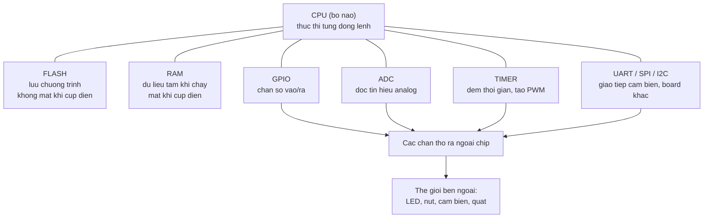

# Vi điều khiển & GPIO

> **Tác giả:** Mr.Rom\
> **Phiên bản:** v1.0.0\
> **Tạo lúc:** 22/06/2026\
> **Cập nhật:** 22/06/2026\
> **Level:** Basic\
> **Tags:** embedded, iot, microcontroller, mcu, gpio, arduino, esp32, adc, pwm, pull-up\
> **Yêu cầu trước:** [Embedded & IoT là gì?](00_what-is-embedded-iot.md)

> 🎯 *Bài trước bạn đã biết embedded/IoT là gì và dự án xuyên suốt cụm: một board đọc nhiệt độ, bật quạt khi quá nóng, rồi gửi số liệu lên cloud. Bài này mở nắp con chip ra xem **vi điều khiển (MCU)** bên trong gồm những gì, **GPIO** là gì, vì sao cần điện trở pull-up/pull-down, đọc nút bấm và điều khiển LED, phân biệt analog vs digital (ADC để đọc cảm biến, PWM để chỉnh độ sáng/tốc độ) — và bạn tự viết được code Arduino chớp tắt LED + đọc nút bấm.*

## 🎯 Sau bài này bạn sẽ

- [ ] Kể được các khối bên trong một **MCU**: CPU + flash + RAM + ngoại vi (GPIO, ADC, timer, UART/SPI/I2C) gói trên một chip
- [ ] Giải thích **GPIO** là gì, mức logic HIGH/LOW, và vì sao cần **pull-up/pull-down resistor**
- [ ] Viết được code Arduino (C++) chớp tắt LED và đọc nút bấm bằng `pinMode` / `digitalWrite` / `digitalRead`
- [ ] Phân biệt **analog vs digital**, biết khi nào cần **ADC** để đọc cảm biến và **PWM** để chỉnh độ sáng/tốc độ
- [ ] Nối được mạch LED + nút bấm đúng, biết quy tắc an toàn điện cơ bản (dòng tối đa mỗi chân, luôn có điện trở hạn dòng)

---

## Tình huống — quạt phải tự bật khi phòng nóng

Quay lại dự án của cụm: ta muốn một board nhỏ **tự đo nhiệt độ phòng, nóng quá thì bật quạt**. Bóc tách yêu cầu đó ra, board phải làm được bốn việc rất cơ bản:

1. **Đọc** một con số nhiệt độ từ cảm biến (cảm biến cho ra một điện áp thay đổi theo nhiệt).
2. **Nghĩ**: so con số đó với ngưỡng, ví dụ "nếu > 30°C thì bật quạt".
3. **Bật/tắt** một thiết bị ngoài (relay điều khiển quạt) bằng cách cấp hoặc cắt điện một chân.
4. Cho ta **một nút bấm** để chỉnh tay (ví dụ bấm để bật quạt thủ công bất kể nhiệt độ).

Cả bốn việc đó — đọc tín hiệu vào, xử lý, xuất tín hiệu ra — diễn ra bên trong **đúng một con chip** nhỏ bằng móng tay, gọi là **vi điều khiển**. Không có máy tính cồng kềnh, không hệ điều hành nặng nề; chỉ một con chip cắm điện vào là chạy.

→ Để làm được dự án, trước hết phải hiểu con chip đó bên trong có gì, và làm sao nó "chạm" được ra thế giới bên ngoài (cảm biến, nút, quạt). Ta bắt đầu từ chính con chip.

---

## 1️⃣ Vi điều khiển (MCU) là gì — cả một máy tính trên một con chip

Máy tính bàn của bạn là nhiều linh kiện rời ghép lại: CPU một nơi, RAM thanh khác, ổ cứng nơi khác, card mạng nơi khác nữa. Một **vi điều khiển** (*microcontroller*, viết tắt **MCU**) gom **tất cả** những thứ đó vào **một con chip duy nhất** — vì nó không cần mạnh, nó cần **nhỏ, rẻ, ít tốn điện** để nhét vào lò vi sóng, đồ chơi, cảm biến.

🪞 **Ẩn dụ — MCU như một căn bếp mini di động trong một chiếc vali:**
> Một căn bếp nhà bạn có bếp, tủ lạnh, bồn rửa, tủ đựng đồ ở các vị trí rời. MCU giống như người ta nhét **tất cả** vào một chiếc vali xách tay: bếp nhỏ (CPU để tính toán), một ngăn đá giữ công thức nấu cố định (flash chứa chương trình), một mặt bàn trống để sơ chế (RAM tạm), và vài ổ cắm/vòi nước thò ra ngoài vali để nối với thế giới (các chân — ngoại vi). Mở vali ra là nấu được ngay, không cần lắp ráp gì thêm.

**Định nghĩa:** một *microcontroller* (MCU) là một con chip tích hợp sẵn trên cùng một miếng silicon: một **CPU** (bộ xử lý), bộ nhớ **flash** (lưu chương trình, không mất khi cúp điện), bộ nhớ **RAM** (lưu dữ liệu tạm khi chạy), và một loạt **ngoại vi** (*peripheral* — các khối phần cứng chuyên dụng để giao tiếp với bên ngoài). Cắm nguồn vào là CPU đọc chương trình trong flash và chạy ngay.

Đây là nhóm khái niệm nền tảng, nên ta điểm qua từng khối một:

- **CPU** (bộ xử lý) — "bộ não" thực thi từng dòng lệnh trong chương trình. MCU phổ thông thường chạy vài chục tới vài trăm MHz (chậm hơn CPU PC hàng chục lần — nhưng quá đủ để bật/tắt quạt).
- **Flash** (bộ nhớ chương trình) — nơi lưu code bạn nạp vào. Giống ổ cứng: **không mất** khi cúp điện. Đo bằng KB tới vài MB.
- **RAM** (bộ nhớ tạm) — nơi chứa biến, dữ liệu khi chương trình đang chạy. **Mất sạch** khi cúp điện. Thường rất nhỏ, vài KB tới vài trăm KB.
- **Ngoại vi** (*peripheral*) — các khối phần cứng để "chạm" ra thế giới: **GPIO** (chân vào/ra số), **ADC** (đọc tín hiệu analog), **timer** (đếm thời gian, tạo PWM), và các bộ giao tiếp **UART / SPI / I2C** (nói chuyện với cảm biến, màn hình, board khác).

Để thấy các khối này nằm chung trên một chip và nối với nhau ra sao, đây là sơ đồ bên trong một MCU. Đọc từ "bộ não" CPU ở giữa toả ra các khối nhớ và các ngoại vi nối ra chân ngoài:



→ Mấu chốt cần khắc sâu: tất cả các khối trên **nằm trong một con chip**, và cách duy nhất để chip "chạm" ra ngoài là qua các **chân** (pin). Trong dự án quạt: CPU chạy luật "nóng thì bật", flash giữ chương trình đó, ADC đọc cảm biến nhiệt, một chân GPIO bật relay quạt, một chân GPIO khác đọc nút bấm. Bài này tập trung vào hai ngoại vi cơ bản nhất mà mọi dự án đều dùng: **GPIO** và **ADC** (cùng **PWM** sinh ra từ timer). Các bộ giao tiếp UART/SPI/I2C dành cho bài kế.

> [!NOTE]
> Hai cái tên bạn sẽ gặp suốt cụm này: **Arduino** (board phổ thông dùng chip AVR như ATmega328, cực dễ học, cộng đồng khổng lồ) và **ESP32** (board mạnh hơn, có sẵn Wi-Fi + Bluetooth — chính vì có Wi-Fi nên ta chọn ESP32 để cuối cụm gửi dữ liệu lên cloud). Điều hay là cả hai đều lập trình được bằng **cùng một ngôn ngữ Arduino (C++)**, nên code trong bài chạy được trên cả hai với rất ít thay đổi.

---

## 2️⃣ GPIO — cánh cửa giữa chip và thế giới

Ở mục trên ta nói chip "chạm" ra ngoài qua các chân. Loại chân cơ bản và linh hoạt nhất là **GPIO**.

**GPIO** viết tắt của *General-Purpose Input/Output* — "chân vào/ra đa dụng". Mỗi chân GPIO là một chân kim loại trên board mà bạn lập trình được cho nó làm **một trong hai vai**:

- **OUTPUT** (đầu ra) — chip *xuất* điện áp ra chân, để **điều khiển** thiết bị ngoài (bật LED, kích relay quạt).
- **INPUT** (đầu vào) — chip *đọc* điện áp ở chân, để **biết** trạng thái bên ngoài (nút có đang bấm không).

🪞 **Ẩn dụ — GPIO như một công tắc đèn hai chiều thông minh:**
> Hình dung mỗi chân GPIO là một ô cửa nhỏ trên tường nhà bạn. Bạn bảo nó làm "cửa ra" (OUTPUT) thì nó **đẩy** một thứ ra ngoài — như bật/tắt một bóng đèn ngoài hiên. Bạn bảo nó làm "cửa vào" (INPUT) thì nó **nhìn** xem bên ngoài có ai đang đứng (có người bấm chuông không). Cùng một ô cửa, nhưng bạn quyết định nó "đẩy ra" hay "nhìn vào" bằng phần mềm.

Vì GPIO là **digital** (số), nó chỉ hiểu **hai mức điện áp**, không có ở giữa:

- **HIGH** (mức cao, logic `1`) — có điện áp, thường là điện áp nguồn của board: **5V** (Arduino Uno) hoặc **3.3V** (ESP32).
- **LOW** (mức thấp, logic `0`) — gần **0V**, tức nối đất (*GND* — ground, cực âm/mass của mạch).

> [!CAUTION]
> Mức HIGH của Arduino Uno là **5V**, nhưng của ESP32 là **3.3V**. Cắm thẳng 5V vào một chân của ESP32 (vốn chỉ chịu 3.3V) có thể **làm hỏng chip vĩnh viễn**. Luôn kiểm tra điện áp board trước khi đấu nối — đây là lỗi đốt board phổ biến nhất của người mới.

→ Vậy GPIO chỉ là chân đọc/ghi mức cao-thấp. Nghe đơn giản, nhưng có một cái bẫy: khi chân làm INPUT mà **không nối gì cả**, nó đọc ra mức gì? Câu trả lời dẫn tới khái niệm quan trọng nhất bài — điện trở pull-up/pull-down.

---

## 3️⃣ Pull-up / pull-down resistor — vì sao chân "lửng lơ" lại nguy hiểm

Giả sử bạn nối một nút bấm thế này: một đầu nút nối vào chân GPIO (đặt INPUT), đầu kia nối **3.3V**. Ý tưởng: bấm nút → chân thấy 3.3V → đọc HIGH; nhả nút → chân thấy... gì?

Khi nhả nút, chân GPIO **không nối vào đâu cả** — nó "lửng lơ" (*floating* — trôi nổi). Một chân floating giống như một ăng-ten tí hon: nó hứng nhiễu điện từ môi trường (đèn, dây điện, sóng) và đọc ra lúc HIGH lúc LOW **ngẫu nhiên**. Kết quả: nút của bạn lúc bấm lúc không dù bạn không hề chạm — chương trình loạn.

🪞 **Ẩn dụ — pull resistor như một sợi dây thun kéo cửa về vị trí mặc định:**
> Hình dung chân INPUT là một cánh cửa lò xo. Nếu không có gì giữ, gió thổi qua làm cửa đập lung tung (floating đọc nhiễu). Ta gắn một **sợi dây thun nhẹ** kéo cửa về một phía cố định khi không ai động vào: dây kéo cửa **đóng về GND** (pull-down → mặc định LOW), hoặc kéo cửa **mở về nguồn** (pull-up → mặc định HIGH). Khi bạn bấm nút, bạn dùng lực mạnh hơn dây thun để đẩy cửa về phía ngược lại — chân đọc ra mức rõ ràng. Buông tay, dây thun lại kéo về mặc định. Hết "đập lung tung".

Cụ thể hai loại điện trở "kéo":

- **Pull-down resistor** — một điện trở (thường ~10kΩ) nối chân INPUT xuống **GND**. Khi không bấm, điện trở "kéo" chân về **LOW** (0). Bấm nút (nối chân lên nguồn) thì chân lên **HIGH** (1).
- **Pull-up resistor** — một điện trở nối chân INPUT lên **nguồn** (3.3V/5V). Khi không bấm, điện trở "kéo" chân về **HIGH** (1). Bấm nút (nối chân xuống GND) thì chân về **LOW** (0).

Điều cực kỳ tiện: **MCU có sẵn pull-up bên trong chip** (*internal pull-up*), bật bằng phần mềm — không cần hàn thêm điện trở. Vì thế cách đấu nút phổ biến nhất là dùng `INPUT_PULLUP`: nối một đầu nút vào chân GPIO, đầu kia vào **GND**, rồi bật pull-up nội. Lúc đó **logic bị đảo**: không bấm = HIGH, bấm = LOW. Nhớ điều này để không bị lẫn khi đọc nút.

Bảng dưới tóm tắt sự khác nhau — đọc theo từng hàng:

| Cấu hình | Khi KHÔNG bấm | Khi BẤM | Cần linh kiện ngoài? |
|---|---|---|---|
| Không có pull (floating) | Nhiễu ngẫu nhiên ❌ | Tuỳ đấu nối | Không — nhưng KHÔNG dùng được |
| Pull-down ngoài (10kΩ → GND) | LOW (0) | HIGH (1) | Có (1 điện trở) |
| Pull-up ngoài (10kΩ → nguồn) | HIGH (1) | LOW (0) | Có (1 điện trở) |
| `INPUT_PULLUP` (pull-up nội) | HIGH (1) | LOW (0) | **Không** — dùng điện trở sẵn trong chip |

→ Quy tắc vàng: **chân INPUT đọc nút bấm phải LUÔN có pull-up hoặc pull-down**, không bao giờ để floating. Cách gọn nhất cho người mới là `INPUT_PULLUP` (nút nối GND), chỉ cần nhớ logic đảo: bấm = LOW. Giờ ta ráp mạch thật và viết code.

---

## 4️⃣ Nối mạch: LED + nút bấm

Trước khi viết code, phải biết dây nối ở đâu. Ta đấu hai thứ đơn giản nhất: một **LED** (đèn để chân OUTPUT điều khiển) và một **nút bấm** (cho chân INPUT đọc). Đây là "phần cứng" của bài.

Một điều bắt buộc với LED: **luôn nối LED qua một điện trở hạn dòng** (*current-limiting resistor*, thường 220Ω hoặc 330Ω). Vì sao? LED là một diode — nếu nối thẳng vào chân 3.3V/5V không qua điện trở, dòng điện chạy qua nó **vọt lên quá lớn**, đốt cháy cả LED lẫn chân GPIO của chip.

> [!CAUTION]
> Mỗi chân GPIO chỉ chịu được một dòng điện **tối đa rất nhỏ** — với ESP32 khoảng **12mA mỗi chân** (an toàn), Arduino Uno khoảng **20mA** (tuyệt đối tối đa 40mA). Nối LED không qua điện trở, hoặc nối thẳng một động cơ/quạt vào chân GPIO, sẽ kéo dòng vượt ngưỡng và **đốt chân hoặc cả chip**. Tải nặng như quạt/relay phải điều khiển **gián tiếp** qua transistor hoặc module relay, không bao giờ cắm thẳng.

Sơ đồ nối dây dưới đây mô tả LED ở chân số 2 (qua điện trở 220Ω về GND) và nút bấm ở chân số 4 (nối GND, dùng pull-up nội). Đọc từ chân GPIO của board ra linh kiện rồi về GND:

```text
   BOARD (ESP32 / Arduino)
   +-------------------------+
   |                         |
   |  GPIO 2 (OUTPUT) o------+----[ 220 ohm ]----|>|----+   (|>| = LED, chan dai = cuc duong)
   |                         |                   LED    |
   |                         |                          |
   |  GPIO 4 (INPUT_PULLUP) o-------------[ NUT BAM ]----+
   |                         |                          |
   |  GND o------------------+--------------------------+
   |                         |
   +-------------------------+

   - LED:  GPIO 2 -> dien tro 220 ohm -> cuc duong LED -> cuc am LED -> GND
   - NUT:  GPIO 4 -> mot dau nut ; dau kia nut -> GND  (pull-up noi bật trong code)
```

→ Hai điểm cần nhớ từ sơ đồ. Một: LED **luôn** đi qua điện trở 220Ω trước khi về GND — đây là điện trở hạn dòng bắt buộc. Hai: nút nối thẳng GPIO ↔ GND, không cần điện trở ngoài vì ta dùng pull-up **bên trong** chip. Mạch xong rồi, giờ thổi hồn vào nó bằng code.

---

## 5️⃣ Code Arduino: chớp tắt LED + đọc nút bấm

Chương trình Arduino (viết bằng **C++**) luôn có đúng hai hàm bắt buộc, và hiểu hai hàm này là hiểu mọi chương trình embedded:

- **`setup()`** — chạy **một lần** khi board vừa khởi động. Đây là nơi khai báo chân nào là INPUT, chân nào là OUTPUT.
- **`loop()`** — chạy **lặp đi lặp lại mãi mãi** ngay sau `setup()`. Đây chính là *game loop* của thế giới embedded: đọc input → xử lý → xuất output, vòng này qua vòng khác cho tới khi cúp điện.

Ba lệnh GPIO cốt lõi bạn sẽ dùng cả đời làm embedded:

- **`pinMode(pin, mode)`** — khai báo vai của một chân: `OUTPUT`, `INPUT`, hoặc `INPUT_PULLUP`.
- **`digitalWrite(pin, value)`** — xuất ra chân OUTPUT mức `HIGH` hoặc `LOW`.
- **`digitalRead(pin)`** — đọc mức (`HIGH`/`LOW`) ở một chân INPUT.

### Ví dụ 1 — Chớp tắt LED (Blink)

Bài "Hello World" của embedded: cho LED ở chân 2 sáng 1 giây, tắt 1 giây, lặp mãi. Hàm `delay(ms)` tạm dừng chương trình đúng số mili-giây cho trước. Lưu vào file `blink.ino`:

```cpp
// blink.ino — Chop tat LED o chan 2, chu ky sang 1s / tat 1s

const int LED_PIN = 2;   // LED noi o chan GPIO so 2 (qua dien tro 220 ohm)

void setup() {
  // 1. Khai bao chan LED la OUTPUT (chip se XUAT dien ap ra chan nay)
  pinMode(LED_PIN, OUTPUT);
}

void loop() {
  // 2. Bat LED: xuat muc HIGH (3.3V/5V) ra chan -> co dong qua LED -> sang
  digitalWrite(LED_PIN, HIGH);
  delay(1000);            // giu sang trong 1000 mili-giay = 1 giay

  // 3. Tat LED: xuat muc LOW (0V) ra chan -> khong co dong -> tat
  digitalWrite(LED_PIN, LOW);
  delay(1000);            // giu tat trong 1 giay
}
```

Nạp chương trình lên board (qua Arduino IDE), bạn sẽ thấy LED **chớp tắt đều đặn 1 giây một nhịp**. Phân tích flow: `setup()` khai báo chân LED là OUTPUT một lần duy nhất; rồi `loop()` lặp mãi bốn bước bật-chờ-tắt-chờ. Vì `loop()` không bao giờ kết thúc, LED chớp tắt vĩnh viễn — đúng tinh thần "chương trình embedded chạy hoài cho tới khi cúp điện".

### Ví dụ 2 — Đọc nút bấm để bật/tắt LED

Giờ thêm tương tác: **bấm nút thì LED sáng, nhả nút thì LED tắt**. Nút ở chân 4, dùng `INPUT_PULLUP` (nút nối GND) — nhớ logic đảo: **không bấm = HIGH, bấm = LOW**. Lưu vào file `button_led.ino`:

```cpp
// button_led.ino — Bam nut (chan 4) thi LED (chan 2) sang

const int LED_PIN    = 2;   // LED o chan 2
const int BUTTON_PIN = 4;   // Nut bam o chan 4 (dau con lai cua nut noi GND)

void setup() {
  // 1. Chan LED la OUTPUT de dieu khien den
  pinMode(LED_PIN, OUTPUT);

  // 2. Chan nut la INPUT_PULLUP: bat dien tro pull-up NOI trong chip
  //    -> khong bam = HIGH, bam = LOW (logic bi DAO)
  pinMode(BUTTON_PIN, INPUT_PULLUP);
}

void loop() {
  // 3. Doc trang thai nut. Vi pull-up: bam nut keo chan ve LOW
  int trangThai = digitalRead(BUTTON_PIN);

  // 4. Neu chan = LOW nghia la nut DANG bi bam
  if (trangThai == LOW) {
    digitalWrite(LED_PIN, HIGH);   // dang bam -> bat LED
  } else {
    digitalWrite(LED_PIN, LOW);    // nha nut -> tat LED
  }
}
```

Nạp lên board: giữ nút thì LED sáng, buông tay thì LED tắt. Điểm dễ vấp nhất nằm ở bước 4 — vì dùng `INPUT_PULLUP`, **`LOW` mới là "đang bấm"**, không phải `HIGH` như trực giác. Nếu bạn nối nút theo kiểu pull-down ngoài thì logic ngược lại (bấm = HIGH). Luôn khớp điều kiện `if` với kiểu đấu nối bạn chọn.

> [!TIP]
> Nút bấm cơ học có hiện tượng **dội phím** (*debounce* — tiếp điểm rung vài mili-giây lúc bấm/nhả, khiến MCU đọc thành nhiều lần bấm liên tiếp). Với ví dụ "giữ để sáng" ở trên thì không sao, nhưng nếu bạn đếm số lần bấm, cần chống dội: chờ ~20-50ms rồi đọc lại, hoặc dùng thư viện như `Bounce2`. Sẽ gặp lại khi làm logic phức tạp hơn.

---

## 6️⃣ Analog vs Digital — và ADC để đọc cảm biến nhiệt

Cả `digitalRead` lẫn `digitalWrite` ở trên chỉ biết hai mức: HIGH hoặc LOW, 1 hoặc 0. Nhưng thế giới thật **không** chỉ có bật/tắt. Quay lại dự án: cảm biến nhiệt độ không cho ra "nóng/lạnh", nó cho ra một **điện áp thay đổi mượt** theo nhiệt — 0.5V ở 25°C, 0.6V ở 35°C... Đây là tín hiệu **analog** (tương tự).

🪞 **Ẩn dụ — digital như công tắc đèn, analog như núm chỉnh độ sáng:**
> **Digital** giống công tắc đèn thường: chỉ **bật** hoặc **tắt**, không có ở giữa. **Analog** giống cái **núm vặn dimmer** chỉnh độ sáng: xoay được mượt qua **vô số mức** từ tối thui tới sáng trưng. Cảm biến nhiệt, quang trở, micro... đều "nói" bằng ngôn ngữ núm vặn analog. Nhưng CPU chỉ hiểu số 0/1 — nên cần một "người phiên dịch" biến mức núm vặn thành con số. Người phiên dịch đó là **ADC**.

**ADC** viết tắt *Analog-to-Digital Converter* — bộ chuyển đổi tương tự sang số. Nó đo điện áp analog ở một chân và trả về một **số nguyên**. Độ chi tiết của con số phụ thuộc *độ phân giải* (*resolution*) của ADC:

- ADC **10-bit** (Arduino Uno) trả về số từ **0 đến 1023** (tức 2¹⁰ = 1024 mức).
- ADC **12-bit** (ESP32) trả về số từ **0 đến 4095** (tức 2¹² = 4096 mức).

Trong code Arduino, hàm đọc ADC là **`analogRead(pin)`**. Nó ánh xạ dải điện áp 0V → điện áp tham chiếu (3.3V trên ESP32) thành dải 0 → giá trị tối đa.

Đoạn dưới đọc một cảm biến nhiệt analog ở chân `34` của ESP32 (ESP32 có các chân ADC riêng; chân 34 là chân chỉ-đọc analog), đổi giá trị ADC thành điện áp, rồi gửi ra **Serial Monitor** (cửa sổ xem số liệu qua cáp USB). `Serial.begin(115200)` mở kênh truyền, `Serial.println()` in một dòng. Lưu vào file `read_temp.ino`:

```cpp
// read_temp.ino — Doc cam bien nhiet analog o chan 34 (ESP32), in ra Serial

const int SENSOR_PIN = 34;   // Chan ADC chi-doc cua ESP32

void setup() {
  // 1. Mo kenh Serial de gui so lieu ve may tinh qua cap USB
  Serial.begin(115200);
}

void loop() {
  // 2. Doc gia tri ADC: ESP32 12-bit -> so nguyen 0..4095
  int giaTriADC = analogRead(SENSOR_PIN);

  // 3. Doi gia tri ADC sang dien ap thuc (0..3.3V)
  float dienAp = giaTriADC * (3.3 / 4095.0);

  // 4. In ca hai con so ra Serial Monitor
  Serial.print("ADC = ");
  Serial.print(giaTriADC);
  Serial.print("  |  Dien ap = ");
  Serial.print(dienAp);
  Serial.println(" V");

  delay(1000);   // doc moi giay mot lan
}
```

Mở Serial Monitor (đặt baud 115200) bạn sẽ thấy mỗi giây một dòng, ví dụ:

```text
ADC = 1860  |  Dien ap = 1.50 V
ADC = 1872  |  Dien ap = 1.51 V
ADC = 2480  |  Dien ap = 2.00 V
```

Đọc kết quả: cột `ADC` là con số thô (0..4095) mà bộ ADC trả về; cột `Dien ap` là điện áp thực sau khi quy đổi. Khi bạn áp tay làm ấm cảm biến, con số tăng dần — đó chính là tín hiệu để luật "nóng thì bật quạt" hoạt động. Bước cuối (đổi điện áp sang °C) phụ thuộc loại cảm biến cụ thể (LM35, NTC, DHT...), nhưng nguyên lý đọc analog luôn là: `analogRead` → quy đổi → so ngưỡng.

> [!NOTE]
> Trên ESP32, `analogRead` mặc định trả 12-bit (0..4095). Trên Arduino Uno, `analogRead` luôn là 10-bit (0..1023) và điện áp tham chiếu là 5V, nên công thức quy đổi đổi thành `giaTriADC * (5.0 / 1023.0)`. Luôn dùng đúng độ phân giải và điện áp của board bạn đang chạy.

---

## 7️⃣ PWM — "giả lập analog" để chỉnh độ sáng / tốc độ

Ta đã *đọc* analog bằng ADC. Còn chiều ngược lại: làm sao **xuất** ra một mức "ở giữa" để LED **mờ vừa** thay vì chỉ sáng/tắt, hay cho quạt quay **chậm** thay vì full tốc? GPIO digital chỉ có HIGH/LOW, không có "nửa sáng". Giải pháp là một mẹo thông minh: **PWM**.

**PWM** viết tắt *Pulse-Width Modulation* — điều chế độ rộng xung. Ý tưởng: thay vì giữ chân HIGH liên tục, ta **bật-tắt chân cực nhanh** (hàng trăm tới hàng nghìn lần mỗi giây), và điều chỉnh **tỉ lệ thời gian bật so với tắt** trong mỗi chu kỳ. Tỉ lệ đó gọi là *duty cycle* (chu kỳ làm việc).

🪞 **Ẩn dụ — PWM như nhấp nháy công tắc nhanh đến mức mắt không kịp thấy:**
> Bạn không thể "vặn mờ" một công tắc bật-tắt. Nhưng nếu bạn **nhấp công tắc đèn cực nhanh** — bật 1 phần, tắt 9 phần, lặp hàng nghìn lần mỗi giây — mắt người không kịp thấy nhấp nháy mà chỉ thấy đèn **sáng mờ đi** (vì trung bình đèn chỉ sáng 10% thời gian). Bật 5 phần tắt 5 phần → sáng nửa. Bật 9 phần tắt 1 phần → gần như sáng full. Đó chính xác là cách PWM "giả" ra các mức trung gian từ một chân chỉ biết bật/tắt.

Duty cycle quyết định "mức trung bình" — đọc bảng theo từng hàng để thấy quan hệ:

| Duty cycle | Thời gian bật trong mỗi chu kỳ | LED trông như | Quạt quay |
|---|---|---|---|
| 0% | Tắt hoàn toàn | Tắt | Đứng yên |
| 25% | Bật 1/4 thời gian | Mờ | Chậm |
| 50% | Bật nửa thời gian | Sáng vừa | Trung bình |
| 100% | Bật liên tục | Sáng full | Full tốc |

Trong code Arduino, hàm xuất PWM đơn giản nhất là **`analogWrite(pin, value)`**, với `value` từ **0** (0% — tắt) tới **255** (100% — full), tương ứng độ phân giải 8-bit. Đoạn dưới cho LED ở chân 2 **sáng dần rồi tắt dần** (hiệu ứng "thở"). Lưu vào file `fade.ino`:

```cpp
// fade.ino — LED o chan 2 sang dan roi tat dan bang PWM (hieu ung "tho")

const int LED_PIN = 2;   // LED noi chan 2 (chan ho tro PWM)

void setup() {
  pinMode(LED_PIN, OUTPUT);
}

void loop() {
  // 1. Sang dan: tang duty tu 0 (tat) len 255 (full)
  for (int duty = 0; duty <= 255; duty++) {
    analogWrite(LED_PIN, duty);   // xuat PWM voi do rong xung = duty/255
    delay(5);                     // cho 5ms moi buoc cho mat kip thay
  }

  // 2. Tat dan: giam duty tu 255 ve 0
  for (int duty = 255; duty >= 0; duty--) {
    analogWrite(LED_PIN, duty);
    delay(5);
  }
}
```

Nạp lên board: LED sẽ **sáng dần lên rồi mờ dần đi** liên tục như đang "thở", thay vì chớp tắt cứng. Chính cơ chế PWM này, áp lên một chân điều khiển động cơ (qua transistor/driver), cho phép chỉnh **tốc độ quạt** mượt mà — bật quạt chạy 60% khi hơi nóng, 100% khi rất nóng — thay vì chỉ bật/tắt cứng. Đó là mảnh ghép cuối để dự án "quạt theo nhiệt độ" thông minh hơn.

> [!NOTE]
> Hàm `analogWrite()` chuẩn dùng tốt trên Arduino Uno và nhiều board. Trên ESP32, các phiên bản core mới đã hỗ trợ `analogWrite()`, nhưng cách "chính gốc" của ESP32 là dùng bộ PWM phần cứng **LEDC** (`ledcSetup` / `ledcAttachPin` / `ledcWrite`) cho điều khiển mượt và linh hoạt hơn. Người mới cứ bắt đầu với `analogWrite()` cho dễ, nâng cấp sang LEDC khi cần.

---

## 💡 Cạm bẫy thường gặp & Best practice

### ❌ Cạm bẫy: để chân INPUT "floating" khi đọc nút

- **Triệu chứng**: nút lúc nhận lúc không, hoặc LED nhấp nháy ngẫu nhiên dù bạn không chạm vào nút.
- **Nguyên nhân**: chân INPUT không nối pull-up/pull-down nên "lửng lơ", hứng nhiễu điện từ và đọc HIGH/LOW ngẫu nhiên.
- **Cách tránh**: luôn cho chân đọc nút một điện trở kéo. Cách gọn nhất: `pinMode(pin, INPUT_PULLUP)` rồi nối đầu kia của nút xuống GND — nhớ logic đảo (bấm = LOW).

### ❌ Cạm bẫy: nối LED hoặc tải nặng thẳng vào chân GPIO

- **Triệu chứng**: LED cháy ngay, chân GPIO chết (không xuất được nữa), hoặc cả chip hỏng — kèm mùi khét.
- **Nguyên nhân**: không có điện trở hạn dòng nên dòng qua LED vọt quá ngưỡng; hoặc nối thẳng quạt/relay/động cơ kéo dòng vượt giới hạn vài chục mA mỗi chân.
- **Cách tránh**: LED **luôn** đi qua điện trở 220-330Ω. Tải nặng (quạt, motor, relay) điều khiển **gián tiếp** qua transistor hoặc module relay, không cắm thẳng vào chân.

### ❌ Cạm bẫy: nhầm điện áp 5V (Arduino) với 3.3V (ESP32)

- **Triệu chứng**: ESP32 chết hoặc đọc cảm biến sai be bét sau khi đấu với linh kiện 5V.
- **Nguyên nhân**: chân ESP32 chỉ chịu 3.3V; cấp 5V vào làm hỏng chip hoặc lệch thang đo ADC.
- **Cách tránh**: luôn biết board mình chạy ở mức nào. Khi ghép linh kiện 5V với ESP32 dùng *level shifter* (mạch chuyển mức điện áp), và quy đổi ADC theo đúng điện áp tham chiếu của board.

### ✅ Best practice: dùng hằng số đặt tên cho số chân, không hard-code

- **Vì sao**: viết `digitalWrite(2, HIGH)` rải rác khắp code, đến khi đổi LED sang chân khác bạn phải sửa từng chỗ, dễ sót. Đặt `const int LED_PIN = 2;` thì đổi một chỗ là xong, và đọc code cũng rõ nghĩa hơn.
- **Cách áp dụng**: khai báo `const int TEN_CHAN = soChan;` ở đầu file cho mọi chân, rồi dùng tên đó trong `pinMode`/`digitalWrite`/`digitalRead`/`analogRead`.

---

## 🧠 Tự kiểm tra (Self-check)

**Q1.** Kể các khối chính bên trong một MCU và việc của từng khối.

<details>
<summary>💡 Xem giải thích</summary>

Một MCU gói trên một chip: **CPU** (bộ não thực thi lệnh), **flash** (lưu chương trình, không mất khi cúp điện), **RAM** (dữ liệu tạm khi chạy, mất khi cúp điện), và các **ngoại vi** (peripheral) để chạm ra ngoài: **GPIO** (chân số vào/ra), **ADC** (đọc analog), **timer** (đếm thời gian, tạo PWM), và bộ giao tiếp **UART/SPI/I2C** (nói chuyện với cảm biến, board khác). Cắm nguồn là CPU đọc chương trình trong flash và chạy ngay.

</details>

**Q2.** GPIO là gì? Mức HIGH và LOW tương ứng điện áp nào trên Arduino Uno và ESP32?

<details>
<summary>💡 Xem giải thích</summary>

**GPIO** (General-Purpose Input/Output) là chân vào/ra đa dụng, lập trình được làm **OUTPUT** (chip xuất điện áp điều khiển thiết bị) hoặc **INPUT** (chip đọc điện áp để biết trạng thái ngoài). Nó là tín hiệu **digital**, chỉ hai mức:
- **HIGH** (logic 1): điện áp nguồn — **5V** trên Arduino Uno, **3.3V** trên ESP32.
- **LOW** (logic 0): gần **0V** (nối GND).

</details>

**Q3.** Vì sao chân INPUT đọc nút bấm phải có pull-up hoặc pull-down? `INPUT_PULLUP` làm logic nút thay đổi thế nào?

<details>
<summary>💡 Xem giải thích</summary>

Vì nếu để chân "floating" (không nối gì), nó hứng nhiễu và đọc HIGH/LOW ngẫu nhiên → nút loạn. Điện trở **pull-down** kéo chân về LOW mặc định (bấm = HIGH); **pull-up** kéo về HIGH mặc định (bấm = LOW).

`INPUT_PULLUP` bật điện trở pull-up **bên trong chip** (không cần linh kiện ngoài), nút nối GND. Khi đó logic bị **đảo**: không bấm = HIGH, **bấm = LOW**. Trong code phải kiểm tra `if (digitalRead(pin) == LOW)` để biết nút đang bấm.

</details>

**Q4.** Phân biệt analog và digital. Vì sao đọc cảm biến nhiệt cần ADC? Giá trị `analogRead` trên ESP32 nằm trong dải nào?

<details>
<summary>💡 Xem giải thích</summary>

**Digital** chỉ có hai mức (bật/tắt, 0/1) như công tắc đèn. **Analog** thay đổi mượt qua vô số mức như núm vặn dimmer. Cảm biến nhiệt cho ra **điện áp analog** thay đổi theo nhiệt, nhưng CPU chỉ hiểu số — nên cần **ADC** (Analog-to-Digital Converter) đo điện áp và trả về số nguyên.

Trên **ESP32**, ADC 12-bit nên `analogRead` trả về **0..4095**. (Arduino Uno ADC 10-bit → 0..1023.)

</details>

**Q5.** GPIO digital chỉ có HIGH/LOW, vậy làm sao chỉnh được độ sáng LED hay tốc độ quạt? Giá trị PWM trong `analogWrite` nằm trong dải nào?

<details>
<summary>💡 Xem giải thích</summary>

Dùng **PWM** (Pulse-Width Modulation): bật-tắt chân cực nhanh và điều chỉnh **tỉ lệ thời gian bật/tắt** (duty cycle) trong mỗi chu kỳ. Mắt/quạt chỉ cảm nhận **mức trung bình** — duty 25% thì LED mờ/quạt chậm, 100% thì full. Đây là cách "giả lập analog" từ một chân chỉ biết bật/tắt.

Trong Arduino, `analogWrite(pin, value)` với `value` từ **0** (0%, tắt) tới **255** (100%, full) — độ phân giải 8-bit.

</details>

**Q6.** Hai quy tắc an toàn điện cơ bản khi nối LED và tải nặng (như quạt) vào chân GPIO là gì?

<details>
<summary>💡 Xem giải thích</summary>

1. **LED luôn nối qua điện trở hạn dòng** (220-330Ω). Nối thẳng làm dòng vọt quá lớn, đốt LED và chân GPIO.
2. **Không nối tải nặng thẳng vào chân GPIO.** Mỗi chân chỉ chịu dòng rất nhỏ (~12mA ESP32, ~20mA Arduino Uno). Quạt/motor/relay phải điều khiển **gián tiếp** qua transistor hoặc module relay, không cắm thẳng — nếu không sẽ đốt chân hoặc cả chip.

</details>

---

## ⚡ Tra cứu nhanh (Cheatsheet)

### Các khối trong MCU

```text
CPU         -> bo nao, thuc thi lenh
FLASH       -> luu chuong trinh (khong mat khi cup dien)
RAM         -> du lieu tam (mat khi cup dien)
NGOAI VI    -> GPIO | ADC | TIMER | UART/SPI/I2C
```

### Lệnh GPIO cốt lõi (Arduino C++)

| Mục đích | Lệnh |
|---|---|
| Khai báo chân OUTPUT | `pinMode(pin, OUTPUT);` |
| Khai báo chân INPUT | `pinMode(pin, INPUT);` |
| Khai báo INPUT có pull-up nội | `pinMode(pin, INPUT_PULLUP);` |
| Xuất HIGH ra chân | `digitalWrite(pin, HIGH);` |
| Xuất LOW ra chân | `digitalWrite(pin, LOW);` |
| Đọc mức chân (HIGH/LOW) | `digitalRead(pin);` |
| Đọc analog (ADC) | `analogRead(pin);` |
| Xuất PWM (0..255) | `analogWrite(pin, value);` |
| Tạm dừng (mili-giây) | `delay(ms);` |

### Mức logic & dải giá trị

```text
HIGH = 1 = dien ap nguon (5V Arduino Uno / 3.3V ESP32)
LOW  = 0 = ~0V (GND)

analogRead : Arduino Uno (10-bit) -> 0..1023 ; ESP32 (12-bit) -> 0..4095
analogWrite (PWM 8-bit)           -> 0 (0%, tat) .. 255 (100%, full)
```

### Logic nút theo kiểu đấu

```text
INPUT_PULLUP (nut noi GND) : khong bam = HIGH , bam = LOW   (logic DAO)
Pull-down ngoai (-> GND)   : khong bam = LOW  , bam = HIGH
```

### An toàn điện — nhớ nằm lòng

```text
- LED LUON qua dien tro 220-330 ohm
- Chan GPIO chiu dong nho (~12mA ESP32 / ~20mA Arduino Uno)
- Tai nang (quat, motor, relay) -> qua transistor/relay, KHONG cam thang
- Khong nham 5V vs 3.3V -> dot chip
```

---

## 📚 Từ Điển Thuật Ngữ (Glossary)

| EN | VN | Giải thích |
|---|---|---|
| Microcontroller (MCU) | Vi điều khiển | Chip gói sẵn CPU + flash + RAM + ngoại vi, chạy độc lập khi cấp nguồn |
| CPU | Bộ xử lý | "Bộ não" thực thi từng dòng lệnh của chương trình |
| Flash | Bộ nhớ chương trình | Lưu code đã nạp; không mất khi cúp điện |
| RAM | Bộ nhớ tạm | Lưu dữ liệu khi chạy; mất sạch khi cúp điện |
| Peripheral | Ngoại vi | Khối phần cứng chuyên dụng để chip giao tiếp với bên ngoài |
| GPIO | Chân vào/ra đa dụng | Chân lập trình được làm INPUT (đọc) hoặc OUTPUT (xuất) |
| HIGH / LOW | Mức cao / mức thấp | Hai mức điện áp số: HIGH = điện áp nguồn, LOW = ~0V (GND) |
| GND (ground) | Đất / mass | Cực âm/0V tham chiếu của mạch |
| Floating | Lửng lơ / trôi nổi | Chân INPUT không nối gì, đọc nhiễu ngẫu nhiên — phải tránh |
| Pull-up resistor | Điện trở kéo lên | Kéo chân INPUT về HIGH mặc định khi không có tín hiệu |
| Pull-down resistor | Điện trở kéo xuống | Kéo chân INPUT về LOW mặc định khi không có tín hiệu |
| INPUT_PULLUP | Đầu vào dùng pull-up nội | Chế độ bật điện trở pull-up sẵn trong chip; nút nối GND, logic đảo |
| Current-limiting resistor | Điện trở hạn dòng | Điện trở nối tiếp LED để giới hạn dòng, tránh cháy LED và chân |
| Debounce | Chống dội phím | Lọc rung tiếp điểm nút khi bấm/nhả để không bị đọc nhiều lần |
| Analog | Tương tự | Tín hiệu thay đổi mượt qua vô số mức (như núm vặn) |
| Digital | Số | Tín hiệu chỉ có hai mức 0/1 (như công tắc bật/tắt) |
| ADC | Bộ chuyển analog sang số | Đo điện áp analog ở chân, trả về số nguyên |
| Resolution | Độ phân giải | Số mức ADC phân biệt được: 10-bit = 0..1023, 12-bit = 0..4095 |
| PWM | Điều chế độ rộng xung | Bật-tắt chân cực nhanh, chỉnh tỉ lệ bật/tắt để "giả" mức analog |
| Duty cycle | Chu kỳ làm việc | Tỉ lệ thời gian chân ở HIGH trong mỗi chu kỳ PWM (0-100%) |
| Arduino | Arduino | Board/ngôn ngữ lập trình embedded phổ thông, dễ học, cộng đồng lớn |
| ESP32 | ESP32 | Board MCU mạnh, tích hợp sẵn Wi-Fi + Bluetooth, chạy 3.3V |
| Serial Monitor | Cửa sổ Serial | Cửa sổ trên máy tính xem số liệu board gửi về qua cáp USB |
| Sketch (.ino) | Chương trình Arduino | File code Arduino, luôn có hai hàm `setup()` và `loop()` |

---

## 🔗 Liên kết & Tài nguyên

⬅️ **Bài trước:** [Embedded & IoT là gì?](00_what-is-embedded-iot.md)\
➡️ **Bài tiếp theo:** [Giao tiếp: UART, I2C, SPI](02_communication-protocols.md)\
↑ **Về cụm:** [embedded-iot — README cụm](../../README.md)

### 🧭 Định hướng lộ trình học

- [Giao tiếp: UART, I2C, SPI](02_communication-protocols.md) — bài kế: cách MCU "nói chuyện" với cảm biến/màn hình/board khác qua các giao thức nối tiếp
- [RTOS & lập trình real-time](03_rtos-and-realtime.md) — chạy nhiều việc "cùng lúc" trên MCU (đọc cảm biến + chớp LED + gửi mạng)
- [Kết nối IoT lên Cloud](04_connecting-to-the-cloud.md) — đích đến của cụm: gửi số liệu nhiệt độ lên cloud qua MQTT

### 🧩 Các chủ đề có thể bạn quan tâm

- [Embedded & IoT là gì?](00_what-is-embedded-iot.md) — bức tranh tổng và dự án xuyên suốt cụm
- [Giao tiếp: UART, I2C, SPI](02_communication-protocols.md) — sau khi biết GPIO/ADC, bước tiếp là ghép cảm biến số qua I2C/SPI

### 🌐 Tài nguyên tham khảo khác

- [Arduino — Language Reference](https://docs.arduino.cc/language-reference/) — tra cứu chính thức `pinMode`, `digitalWrite`, `analogRead`, `analogWrite`
- [Arduino — Built-in Examples (Blink, Button)](https://docs.arduino.cc/built-in-examples/) — ví dụ gốc chớp LED và đọc nút
- [ESP32 Arduino Core — Documentation](https://docs.espressif.com/projects/arduino-esp32/en/latest/) — chi tiết GPIO, ADC, PWM (LEDC) trên ESP32
- [SparkFun — Pull-up Resistors](https://learn.sparkfun.com/tutorials/pull-up-resistors) — giải thích trực quan pull-up/pull-down

---

> 🎯 *Sau bài này bạn đã mở nắp con chip: hiểu MCU gói CPU + flash + RAM + ngoại vi trên một chip, GPIO đọc/ghi mức HIGH/LOW, vì sao cần pull-up/pull-down, viết được code Arduino chớp LED + đọc nút, dùng ADC đọc cảm biến analog và PWM chỉnh độ sáng/tốc độ, cùng quy tắc an toàn điện. Bài kế tiếp cho MCU "biết nói" — các giao thức giao tiếp UART, I2C, SPI để ghép cảm biến số và board khác vào dự án.*

---

## 📌 Nhật ký thay đổi (Changelog)

- **v1.0.0 (22/06/2026)** — Bản đầu tiên. Cụm `embedded-iot/` lesson 1/5. Cover: cấu tạo MCU (CPU + flash + RAM + ngoại vi GPIO/ADC/timer/UART/SPI/I2C trên một chip) + GPIO là gì, mức logic HIGH/LOW, pull-up/pull-down resistor và vì sao chân floating nguy hiểm + sơ đồ nối mạch LED (qua điện trở hạn dòng) + nút bấm (INPUT_PULLUP) + 4 ví dụ code Arduino chạy đúng (blink, đọc nút, đọc ADC cảm biến nhiệt, PWM fade) + phân biệt analog vs digital, ADC đọc cảm biến, PWM/duty cycle chỉnh độ sáng/tốc độ + cảnh báo an toàn điện (dòng tối đa mỗi chân, điện trở hạn dòng, 5V vs 3.3V). Bám dự án xuyên suốt: đọc nhiệt độ → bật quạt. Kèm 1 sơ đồ mermaid (cấu tạo MCU) + 1 sơ đồ ASCII nối mạch LED/nút.
</content>
</invoke>
