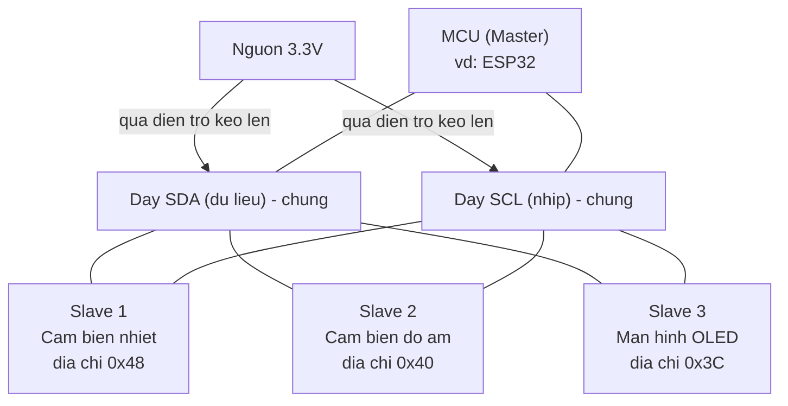

# Giao tiếp: UART, I2C, SPI

> **Tác giả:** Mr.Rom\
> **Phiên bản:** v1.0.0\
> **Tạo lúc:** 22/06/2026\
> **Cập nhật:** 22/06/2026\
> **Level:** Basic\
> **Tags:** embedded, iot, uart, i2c, spi, serial, arduino, wire, communication-protocols, sensors\
> **Yêu cầu trước:** [Vi điều khiển & GPIO](01_microcontrollers-and-gpio.md)

> 🎯 *Bài trước bạn đã bật/tắt được chân GPIO — đủ để nhấp nháy đèn LED. Nhưng chân GPIO chỉ nói được "có điện / không điện", không tải nổi một con số như "nhiệt độ 31.5°C". Bài này dạy ba "ngôn ngữ" mà vi điều khiển dùng để **trò chuyện** với cảm biến, màn hình và board khác: **UART**, **I2C** và **SPI**. Cuối bài bạn hiểu mỗi chuẩn hợp với việc gì, đọc được sơ đồ bus I2C nhiều thiết bị, và tự tay viết code Arduino đọc nhiệt độ từ một cảm biến I2C — đúng mảnh ghép cho dự án "đọc nhiệt → bật quạt → gửi lên cloud" của cả cụm.*

## 🎯 Sau bài này bạn sẽ

- [ ] Giải thích được vì sao GPIO không đủ và khi nào MCU cần một **giao thức giao tiếp** thực sự
- [ ] Nắm **UART** (nối tiếp bất đồng bộ): TX/RX, baud rate, vì sao nó là cửa ngõ debug qua `Serial`
- [ ] Hiểu **I2C** (2 dây SDA/SCL): vai trò master/slave, địa chỉ thiết bị, vì sao nhiều cảm biến dùng chung 2 dây
- [ ] Hiểu **SPI** (4 dây): full-duplex, vì sao nó nhanh và hợp với SD card / màn hình
- [ ] So sánh **UART vs I2C vs SPI** để chọn đúng chuẩn theo tình huống
- [ ] Viết được code Arduino dùng thư viện `Wire` đọc nhiệt độ từ cảm biến I2C đúng cú pháp

---

## Tình huống — board của bạn cần "đọc" nhiệt độ, không chỉ "bật/tắt"

Quay lại dự án xuyên suốt cả cụm: một board (ESP32 hoặc Arduino) đọc nhiệt độ phòng, nóng quá thì bật quạt, rồi gửi số liệu lên cloud. Bài trước bạn đã làm chủ **GPIO** — bật/tắt được một chân, đủ để điều khiển relay quạt (chân `HIGH` → quạt chạy, `LOW` → quạt tắt).

Giờ tới phần khó hơn: **làm sao board biết nhiệt độ hiện tại là bao nhiêu?**

Thử nghĩ xem dùng GPIO thuần được không. Một chân GPIO chỉ đọc được hai trạng thái: có điện (`HIGH`) hoặc không (`LOW`) — đúng một bit thông tin. Nhưng "nhiệt độ 31.5°C" là một con số có lẻ, cần cả chục bit để biểu diễn. Bạn không thể nhét con số đó qua một sợi dây mang đúng một bit.

Có hai hướng xử lý:

- **Mỗi giá trị một dây** — muốn truyền 16 bit thì kéo 16 sợi dây song song. Tốn chân khủng khiếp: một con MCU nhỏ chỉ có chừng 20-30 chân, vài cảm biến là hết.
- **Một-hai dây, gửi từng bit nối đuôi nhau theo thời gian** — như đọc chính tả: thay vì hét cả câu cùng lúc, ta đọc từng chữ một, người kia ghép lại. Đây gọi là **giao tiếp nối tiếp** (*serial communication*) — gửi bit nối tiếp nhau trên ít dây.

Gần như mọi cảm biến, màn hình, thẻ nhớ ngày nay đều chọn hướng thứ hai. Và để hai con chip "ghép chữ" đúng nhau, chúng phải nói chung một **giao thức** (*protocol*) — bộ luật quy định: gửi bit nào trước, nhanh chậm ra sao, làm sao biết "đã hết một con số". Ba giao thức phổ biến nhất trong thế giới embedded là **UART**, **I2C** và **SPI**.

🪞 **Ẩn dụ — ba kiểu trò chuyện giữa người với người:**
> - **UART** như **hai người nói chuyện điện thoại** trực tiếp: chỉ hai người (board A ↔ board B), không cần "đồng hồ chung", nhưng cả hai phải **thoả thuận trước tốc độ nói** (baud rate) — nói nhanh quá người kia nghe không kịp.
> - **I2C** như **một cuộc họp có chủ toạ**: nhiều người ngồi chung hai sợi dây (một dây nói, một dây nhịp), chủ toạ (master) gọi tên (địa chỉ) ai thì người đó mới được nói. Tiết kiệm dây nhưng nói chậm hơn.
> - **SPI** như **đường dây nóng riêng tốc độ cao**: tốn nhiều dây hơn, nhưng nói cực nhanh và hai chiều cùng lúc — hợp khi cần chuyển khối dữ liệu lớn (ảnh màn hình, file trên thẻ nhớ).

→ Ba ẩn dụ này sẽ theo ta suốt bài. Ta đi từng giao thức một, bắt đầu bằng cái đơn giản và quen mặt nhất — UART, chính là thứ in ra dòng chữ trên Serial Monitor mà bạn đã thấy ở bài trước.

---

## 1️⃣ UART — nối tiếp bất đồng bộ, cửa ngõ debug

Mỗi lần bạn gọi `Serial.println("Hello")` và thấy chữ hiện trên Serial Monitor của Arduino IDE, bạn đang dùng **UART** mà có thể chưa biết tên nó. UART là giao thức đầu tiên ai làm embedded cũng gặp, vì nó là **cách board nói chuyện với máy tính** để bạn debug.

**Định nghĩa:** *UART* (*Universal Asynchronous Receiver/Transmitter* — bộ thu/phát nối tiếp bất đồng bộ) là một giao thức nối tiếp dùng **hai dây dữ liệu** để hai thiết bị trao đổi: một dây gửi, một dây nhận. Đặc trưng quan trọng nhất là **bất đồng bộ** (*asynchronous*) — không có dây "đồng hồ" (clock) chung; thay vào đó hai bên **thoả thuận trước một tốc độ** (baud rate) rồi tự canh nhịp theo tốc độ đó.

Hai dây của UART có tên rất dễ nhớ:

- **TX** (*Transmit* — chân phát) — chân **gửi** dữ liệu đi.
- **RX** (*Receive* — chân nhận) — chân **nhận** dữ liệu vào.

Điểm hay nhầm: nối hai board qua UART thì phải **bắt chéo** — TX của board này nối vào RX của board kia, và ngược lại. Vì "miệng" của tôi (TX) phải nối vào "tai" của bạn (RX) thì bạn mới nghe được.

🪞 **Ẩn dụ — gọi điện thoại không có người tổng đài bấm giờ:**
> Hai người gọi điện cho nhau, không có ai đếm nhịp "1-2-3" chung. Để hiểu nhau, cả hai **ngầm thống nhất trước** tốc độ nói (ví dụ "mỗi giây 9600 từ"). Nếu một người chỉnh sang tốc độ khác, đầu kia nghe ra **chữ rác** — đúng như khi bạn để sai baud rate, Serial Monitor hiện một mớ ký tự loạn xạ.

### Baud rate — con số phải khớp hai đầu

**Baud rate** (tốc độ baud) là số tín hiệu (xấp xỉ số bit) truyền mỗi giây. Vì UART không có dây clock chung, đây là **thoả thuận sống còn**: hai đầu phải đặt **cùng** một baud rate, lệch là hỏng. Vài giá trị chuẩn thường gặp, kèm bối cảnh dùng:

| Baud rate | Tốc độ | Khi nào gặp |
|---|---|---|
| 9600 | Chậm, rất ổn định | Mặc định cũ, cảm biến đơn giản, môi trường nhiễu |
| 115200 | Nhanh, phổ biến nhất hiện nay | Serial debug ESP32/Arduino đời mới, log nhiều |
| 921600 | Rất nhanh | Nạp firmware, truyền log khối lượng lớn |

→ Quy tắc nhớ: baud rate bạn đặt trong code (`Serial.begin(115200)`) **phải khớp** với ô chọn tốc độ ở góc dưới Serial Monitor. Lệch hai con số này là nguyên nhân số một của lỗi "màn hình toàn ký tự rác".

### Một byte đi qua dây như thế nào?

Vì không có dây clock, làm sao bên nhận biết "một byte bắt đầu từ đâu" trên một dây luôn luôn có điện? UART giải quyết bằng cách bọc mỗi byte trong một **khung** (*frame*) có dấu mở và dấu đóng. Khi dây đang rảnh, nó giữ mức `HIGH`. Để báo "byte sắp tới", bên gửi kéo dây xuống `LOW` đúng một nhịp — đó là **start bit**. Sau đó tới 8 bit dữ liệu (gửi từ bit thấp lên), rồi một **stop bit** kéo dây về `HIGH` để báo hết. Bên nhận thấy cạnh xuống của start bit là biết "đếm giờ bắt đầu", rồi dựa vào baud rate đã thoả thuận mà lấy mẫu từng bit đúng nhịp.

```text
Day ranh   Start   <-------- 8 bit du lieu -------->   Stop   Day ranh
  HIGH  ->  LOW  ->  D0 D1 D2 D3 D4 D5 D6 D7  ->  HIGH  ->  HIGH
            (bao             (gui bit thap            (bao
            bat dau)          truoc tien)              ket thuc)
```

→ Đây chính là lý do baud rate phải khớp: bên nhận không có nhịp chung để dựa vào, nó **tự đếm thời gian** theo baud rate để biết khi nào lấy mẫu D0, D1, D2... Sai baud rate là lấy mẫu sai chỗ → ghép ra byte rác. Bạn không cần tự xử lý start/stop bit — phần cứng UART trong MCU lo hết; nhưng hiểu khung này giúp bạn biết vì sao "chỉ cần đúng một con số baud rate" là đủ để hai đầu hiểu nhau.

### Thử ngay — UART chính là `Serial` bạn đã dùng

Đoạn code dưới đây không cần phần cứng gì thêm ngoài chính board (ESP32 hoặc Arduino Uno) cắm vào máy qua cáp USB. Cáp USB đó bên trong board được nối tới một mạch chuyển USB↔UART, nên khi bạn `Serial.print`, dữ liệu đi qua **UART** rồi mới lên máy tính. Mục tiêu: thấy tận mắt UART hoạt động và in ra baud rate đang dùng. Lưu vào file `uart_demo.ino`:

```cpp
// uart_demo.ino — minh hoạ UART chính là Serial
// Nap vao Arduino Uno hoac ESP32, mo Serial Monitor o 115200 baud

void setup() {
  // 1. Mo cong UART (Serial) o toc do 115200 baud
  //    Con so nay PHAI khop voi Serial Monitor
  Serial.begin(115200);

  // 2. Cho cong serial san sang (can cho mot so board nhu Leonardo/ESP32)
  while (!Serial) {
    ; // doi cho toi khi cong serial mo
  }

  Serial.println("UART da san sang!");
}

void loop() {
  // 3. Cu moi 1 giay, gui mot dong qua UART len may tinh
  Serial.println("Xin chao tu board qua UART");
  delay(1000); // dung 1000ms = 1 giay
}
```

Sau khi nạp code (nút Upload trên Arduino IDE), mở Serial Monitor và **chọn 115200 baud** ở góc dưới phải. Kết quả mong đợi:

```text
UART da san sang!
Xin chao tu board qua UART
Xin chao tu board qua UART
Xin chao tu board qua UART
```

Phân tích kết quả để nắm chắc ý nghĩa:

- **Dòng đầu** in ra đúng một lần vì `Serial.println` trong `setup()` chỉ chạy một lần lúc khởi động.
- **Các dòng sau** lặp lại mỗi giây — đó là `loop()` chạy vòng lặp vô tận, cứ 1000ms in một dòng.
- Nếu Serial Monitor hiện **ký tự loạn** (`⸮⸮x?@`) thay vì chữ rõ → gần như chắc chắn baud rate ở Monitor đang lệch với `Serial.begin(115200)` trong code. Chỉnh lại cho khớp là hết.

> [!TIP]
> UART là **người bạn debug số một** trong embedded. Khi code chạy sai mà không có màn hình, bạn rải `Serial.println("toi day roi")` ở các điểm nghi ngờ để xem chương trình chạy tới đâu — y như đặt "máy quay lén" trong code. Đây là kỹ thuật `printf`-debugging, dùng tới mòn trong thế giới vi điều khiển.

UART tuyệt cho debug và nối **hai** thiết bị, nhưng nó có giới hạn: về cơ bản chỉ là cuộc nói chuyện **một-đối-một**. Muốn cắm năm cảm biến vào một board mà không tốn mười sợi dây thì sao? Đó là lúc cần I2C.

---

## 2️⃣ I2C — hai dây, nhiều thiết bị chung một bus

Hãy quay lại bài toán thật: dự án của ta cần một cảm biến nhiệt độ, có thể thêm cảm biến độ ẩm, một đồng hồ thời gian thực, một màn hình OLED nhỏ. Nếu mỗi thiết bị đòi hai dây UART riêng, board hết chân ngay. **I2C** sinh ra để giải đúng bài này.

**Định nghĩa:** *I2C* (*Inter-Integrated Circuit* — đọc là "I-bình-phương-C" hoặc "I-hai-C") là giao thức nối tiếp **đồng bộ** dùng đúng **hai dây** cho **nhiều thiết bị** dùng chung. Đồng bộ nghĩa là có một dây nhịp (clock) do master phát ra, nên hai bên không cần thoả thuận tốc độ trước như UART.

Hai dây đó là:

- **SDA** (*Serial Data* — dữ liệu nối tiếp) — dây tải dữ liệu (cả gửi lẫn nhận đi chung dây này).
- **SCL** (*Serial Clock* — xung nhịp nối tiếp) — dây nhịp, do master "gõ phách" để cả bus chạy đồng bộ.

Điều kỳ diệu: **dù cắm bao nhiêu thiết bị, vẫn chỉ hai dây đó**. Tất cả nối song song chung vào SDA và SCL.

🪞 **Ẩn dụ — cuộc họp có chủ toạ điểm danh:**
> Tưởng tượng một phòng họp, mọi người ngồi chung một micro (dây SDA) và nghe chung một tiếng gõ búa nhịp (dây SCL). Để không ai nói chồng lên ai, có **một chủ toạ** (master). Mỗi người dự họp đeo một bảng tên có **số riêng** (địa chỉ). Chủ toạ muốn nghe ai thì **gọi đúng số** người đó trước, người được gọi mới được cầm micro nói; những người khác im lặng. Nhờ vậy hàng chục người dùng chung đúng một cái micro mà không loạn.

### Master, slave và địa chỉ

Hai khái niệm cốt lõi của I2C, ta làm rõ từng cái:

- **Master** (chủ bus) — thường chính là MCU. Nó **khởi xướng** mọi cuộc trò chuyện, phát xung nhịp trên SCL và quyết định nói với ai.
- **Slave** (thiết bị tớ) — các cảm biến, màn hình... Mỗi slave có một **địa chỉ** riêng (thường là số 7-bit, từ `0x08` tới `0x77`), in sẵn trong datasheet. Slave chỉ "lên tiếng" khi master gọi đúng địa chỉ của nó.

Vì mỗi slave một địa chỉ khác nhau nên cả đám dùng chung hai dây mà master vẫn phân biệt được "đang nói với ai" — y như chủ toạ gọi đúng số bảng tên.

Sơ đồ dưới đây là phần trừu tượng nhất của I2C, nên ta xem để hình dung: một master và ba slave cùng treo lên đúng hai dây SDA/SCL. Để ý hai điện trở kéo lên (pull-up) — chúng cần thiết để bus hoạt động:



→ Mấu chốt từ sơ đồ: **chỉ hai dây dữ liệu** (SDA, SCL) chạy ngang qua tất cả thiết bị, mỗi slave nhận diện bằng **địa chỉ** riêng. Thêm một cảm biến mới chỉ là treo nó lên đúng hai dây đó và biết địa chỉ của nó — không tốn thêm chân nào trên MCU. Đó chính là sức mạnh tiết kiệm dây của I2C.

> [!IMPORTANT]
> Bus I2C **bắt buộc** có hai điện trở kéo lên (*pull-up resistor*, thường 4.7kΩ) nối từ SDA và SCL lên nguồn. Nếu thiếu, bus không hoạt động (treo, đọc ra rác). Tin tốt: hầu hết module cảm biến bán sẵn (loại có gắn trên board nhỏ kiểu "breakout") **đã hàn sẵn** pull-up, nên người mới thường không phải lo. Nhưng nếu cắm nhiều module có pull-up cùng lúc, đôi khi phải gỡ bớt — đó là chuyện nâng cao, để dành sau.

I2C tuyệt vời cho nhiều cảm biến chậm-vừa dùng chung dây. Nhưng nó **chậm hơn** SPI và mỗi lần truyền tốn thêm thao tác gọi địa chỉ. Khi cần tống một khối dữ liệu lớn thật nhanh — ví dụ vẽ cả màn hình màu hay đọc file trên thẻ nhớ — ta cần chuẩn thứ ba.

---

## 3️⃣ SPI — bốn dây, nhanh, full-duplex

Khi dự án của bạn lớn lên: thêm một màn hình TFT màu để hiển thị biểu đồ nhiệt độ, hoặc một thẻ nhớ microSD để ghi log. Hai việc này đẩy **khối lượng dữ liệu lớn** qua dây, và cần **tốc độ cao**. Đây là sân nhà của **SPI**.

**Định nghĩa:** *SPI* (*Serial Peripheral Interface* — giao tiếp ngoại vi nối tiếp) là giao thức nối tiếp **đồng bộ, tốc độ cao**, dùng **bốn dây** và là **full-duplex** — gửi và nhận **cùng một lúc**. UART cũng full-duplex (TX/RX riêng), nhưng SPI **nhanh hơn nhiều** và **đồng bộ** (có clock chung) nên hợp với khối dữ liệu lớn; điểm full-duplex chỉ là khác biệt thực so với **I2C** (I2C chỉ truyền một chiều tại một thời điểm).

Bốn dây của SPI:

- **SCK** (*Serial Clock* — xung nhịp) — dây nhịp do master phát, như SCL của I2C.
- **MOSI** (*Master Out, Slave In* — master gửi, slave nhận) — dây dữ liệu **từ master ra slave**.
- **MISO** (*Master In, Slave Out* — master nhận, slave gửi) — dây dữ liệu **từ slave về master**.
- **CS** / **SS** (*Chip Select / Slave Select* — chọn chip) — dây để master "chỉ tay" chọn slave nào đang nói chuyện.

Vì có **hai dây dữ liệu riêng** (MOSI và MISO), SPI gửi và nhận song song — đó là ý nghĩa "full-duplex" và là lý do nó nhanh.

🪞 **Ẩn dụ — đường dây nóng hai chiều có công tắc chọn người:**
> Nếu I2C là cuộc họp dùng chung một micro (phải gọi tên lần lượt), thì SPI giống mỗi cặp có **hai đường ống nói riêng** — một ống tôi nói cho bạn (MOSI), một ống bạn nói cho tôi (MISO) — nên cả hai **nói cùng lúc** không phải chờ. Muốn nói với ai, master gạt **công tắc chọn người** (CS) của đúng người đó xuống. Nhanh, nhưng mỗi người thêm vào lại cần thêm một công tắc CS riêng — nên tốn chân hơn I2C.

Để thấy rõ bốn dây nối ra sao, đây là sơ đồ một master nối tới một slave SPI. Để ý SCK/MOSI/MISO đi chung, riêng CS là dây "chọn người":

```text
        MCU (Master)                 SPI Slave (vd: the nho microSD)
   ┌──────────────────┐             ┌──────────────────┐
   │            SCK   │ ──────────> │ SCK  (nhip)       │
   │            MOSI  │ ──────────> │ MOSI (nhan tu M)  │
   │            MISO  │ <────────── │ MISO (gui ve M)   │
   │            CS    │ ──────────> │ CS   (chon chip)  │
   └──────────────────┘             └──────────────────┘
       MOSI va MISO chay cung luc  =>  full-duplex (song cong)
```

→ Điểm đánh đổi của SPI lộ ra ngay từ sơ đồ: mỗi slave cần một dây **CS riêng**. Một slave thì 4 dây, hai slave thì 5 dây (3 dây chung SCK/MOSI/MISO + 2 dây CS), ba slave thì 6 dây... Càng nhiều thiết bị càng tốn chân — ngược hẳn với I2C luôn chỉ 2 dây.

Vì lý do đó, người ta thường phân vai:

- **SPI** cho thiết bị **cần tốc độ / dữ liệu lớn**: màn hình TFT/OLED màu, thẻ nhớ microSD, một số cảm biến tốc độ cao.
- **I2C** cho thiết bị **chậm-vừa, ít dữ liệu, cần nhiều con**: cảm biến nhiệt độ/độ ẩm, đồng hồ thời gian thực, cảm biến gia tốc.

> [!NOTE]
> Bạn có thể gặp thuật ngữ cũ "Master/Slave" và thuật ngữ mới "Controller/Peripheral" cho cùng khái niệm — ngành công nghiệp đang dần đổi từ ngữ. Tương tự, chân `SS` (Slave Select) và `CS` (Chip Select) là **một thứ**, chỉ khác tên gọi theo nhà sản xuất. Datasheet ghi sao thì cứ theo vậy, đừng bối rối khi thấy hai tên cho cùng một chân.

---

## 4️⃣ Chọn cái nào? — Bảng so sánh UART vs I2C vs SPI

Ba giao thức không có cái nào "tốt nhất" tuyệt đối — mỗi cái thắng ở một tình huống. Để quyết nhanh khi thiết kế mạch, đặt cả ba lên một bảng theo các tiêu chí quan trọng nhất: số dây, tốc độ, số thiết bị nối được, và khi nào nên chọn:

| Tiêu chí | UART | I2C | SPI |
|---|---|---|---|
| Số dây dữ liệu | 2 (TX, RX) | 2 (SDA, SCL) | 4+ (SCK, MOSI, MISO, + 1 CS mỗi slave) |
| Đồng bộ? | Bất đồng bộ (không clock) | Đồng bộ (có clock SCL) | Đồng bộ (có clock SCK) |
| Hướng truyền | Hai chiều cùng lúc (full-duplex, 2 dây TX/RX riêng) | Hai chiều, mỗi lúc một chiều | Hai chiều **cùng lúc** (full-duplex) |
| Tốc độ điển hình | Thấp-vừa (≤ ~1 Mbps) | Vừa (100kHz / 400kHz, lên tới ~3.4MHz) | Cao (vài tới hàng chục MHz) |
| Số thiết bị | Thường 2 (một-đối-một) | Nhiều (phân biệt bằng địa chỉ) | Nhiều (mỗi con tốn 1 chân CS) |
| Cần địa chỉ? | Không | Có (mỗi slave 1 địa chỉ) | Không (chọn bằng chân CS) |
| Khi nào chọn | Debug, nối board↔máy tính, module GPS/Bluetooth | Nhiều cảm biến chậm dùng chung dây | Màn hình màu, thẻ nhớ, dữ liệu lớn tốc độ cao |

→ Cách đọc bảng cho dự án của ta: nhiệt độ chỉ là một con số nhỏ, đọc vài lần mỗi giây là đủ → **I2C** quá hợp (tiết kiệm dây, dễ thêm cảm biến khác sau này). Để in log debug lên máy tính → dùng **UART** (`Serial`). Nếu sau này gắn màn hình màu hiển thị biểu đồ → lúc đó mới cần **SPI**. Một board thật thường dùng **cả ba** cùng lúc, mỗi chuẩn cho một việc.

> [!TIP]
> Mẹo nhớ nhanh khi phân vân: **"Ít dây, nhiều con, chậm → I2C. Nhiều dây, nhanh, dữ liệu lớn → SPI. Nói với máy tính / một board khác → UART."** Ba câu này phủ gần hết quyết định của người mới.

---

## 5️⃣ Hands-on — đọc nhiệt độ từ cảm biến I2C bằng Arduino

Giờ ta ráp kiến thức I2C thành mảnh ghép đầu tiên của dự án: **đọc nhiệt độ thật từ một cảm biến I2C**. Ta dùng cảm biến **LM75** (một cảm biến nhiệt I2C rất phổ biến, rẻ, có sẵn module breakout) làm ví dụ. Trên Arduino, giao tiếp I2C được lo bởi thư viện **`Wire`** — đã tích hợp sẵn trong Arduino IDE, **không cần cài thêm**.

### Đấu nối phần cứng

Trước khi viết code, nối dây theo đúng tinh thần I2C "hai dây chung" ở mục 2. Bảng dưới là cách nối LM75 vào Arduino Uno (với ESP32 thì SDA/SCL ở chân khác, xem ghi chú sau):

| Chân cảm biến LM75 | Nối vào Arduino Uno | Vai trò |
|---|---|---|
| VCC | 3.3V (hoặc 5V tuỳ module) | Cấp nguồn |
| GND | GND | Nối đất chung |
| SDA | A4 | Dây dữ liệu I2C |
| SCL | A5 | Dây nhịp I2C |

Trên Arduino Uno, hai chân I2C cố định là **A4 (SDA)** và **A5 (SCL)**. Module LM75 breakout thường đã có sẵn điện trở pull-up, nên cứ nối thẳng bốn dây trên là chạy.

### Bước 1 — Quét bus tìm địa chỉ cảm biến (I2C scanner)

Trước khi đọc dữ liệu, việc đầu tiên người làm embedded luôn làm là **quét bus** để chắc chắn cảm biến được nhận diện và in ra **địa chỉ** của nó. Đoạn code này dùng `Wire` thử "gọi" lần lượt mọi địa chỉ, địa chỉ nào có thiết bị trả lời thì in ra. Lưu vào `i2c_scanner.ino`:

```cpp
// i2c_scanner.ino — quet bus I2C tim dia chi cac thiet bi
#include <Wire.h>

void setup() {
  Wire.begin();          // 1. Khoi dong I2C voi vai tro master
  Serial.begin(115200);  // 2. Mo UART de in ket qua len Serial Monitor
  while (!Serial) { ; }
  Serial.println("Bat dau quet bus I2C...");
}

void loop() {
  byte count = 0;

  // 3. Thu lan luot moi dia chi hop le tu 0x08 toi 0x77
  for (byte addr = 8; addr < 120; addr++) {
    Wire.beginTransmission(addr);          // mo phien voi dia chi addr
    byte error = Wire.endTransmission();   // 0 = co thiet bi tra loi

    if (error == 0) {
      Serial.print("Tim thay thiet bi tai dia chi 0x");
      if (addr < 16) Serial.print("0");    // chen so 0 cho dep (vd 0x08)
      Serial.println(addr, HEX);           // in dia chi dang hex
      count++;
    }
  }

  if (count == 0) {
    Serial.println("Khong tim thay thiet bi nao - kiem tra day noi!");
  }

  delay(5000); // quet lai sau 5 giay
}
```

Mở Serial Monitor ở 115200 baud. Với LM75 nối đúng, kết quả mong đợi:

```text
Bat dau quet bus I2C...
Tim thay thiet bi tai dia chi 0x48
```

Phân tích kết quả:

- **`0x48`** chính là địa chỉ mặc định của LM75. Đây là con số bạn sẽ dùng trong bước đọc nhiệt độ tiếp theo.
- Nếu in ra **"Khong tim thay thiet bi nao"** → dây SDA/SCL đang nối sai (hay lẫn nhau), thiếu nguồn, hoặc thiếu pull-up. Sửa dây rồi quét lại.
- Nếu thấy địa chỉ **khác** `0x48` → module của bạn có thể đặt địa chỉ khác bằng các chân cấu hình (A0/A1/A2 trên LM75). Ghi lại con số thật và dùng nó ở bước sau.

> [!IMPORTANT]
> `Wire.endTransmission()` trả về `0` khi địa chỉ có thiết bị **ACK** (trả lời). Đây là cách chuẩn để dò thiết bị I2C — không có cảm biến nào "tự khai" địa chỉ, ta phải gọi thử và xem ai đáp. Luôn chạy scanner đầu tiên khi cảm biến mới về, trước khi nghi ngờ code đọc dữ liệu.

### Bước 2 — Đọc nhiệt độ từ LM75

Có địa chỉ `0x48` rồi, giờ đọc nhiệt độ thật. Cách đọc LM75 theo đúng datasheet: trỏ tới **thanh ghi nhiệt độ** (register `0x00`), rồi yêu cầu cảm biến gửi về **2 byte**. Byte đầu (MSB) là phần nguyên độ C; bit cao nhất của byte sau (LSB) cho biết có nửa độ (0.5°C) hay không. Ta ghép hai byte lại thành nhiệt độ. Lưu vào `read_lm75.ino`:

```cpp
// read_lm75.ino — doc nhiet do tu cam bien I2C LM75 bang thu vien Wire
#include <Wire.h>

const byte LM75_ADDR = 0x48;  // dia chi I2C (lay tu buoc scanner)
const byte TEMP_REG  = 0x00;  // thanh ghi chua nhiet do trong LM75

void setup() {
  Wire.begin();          // khoi dong I2C voi vai tro master
  Serial.begin(115200);  // mo UART de in nhiet do
  while (!Serial) { ; }
  Serial.println("Doc nhiet do tu LM75...");
}

void loop() {
  // 1. Tro toi thanh ghi nhiet do (0x00) cua cam bien
  Wire.beginTransmission(LM75_ADDR);
  Wire.write(TEMP_REG);
  Wire.endTransmission();

  // 2. Yeu cau cam bien gui ve 2 byte du lieu nhiet do
  Wire.requestFrom(LM75_ADDR, (byte)2);

  if (Wire.available() >= 2) {
    byte msb = Wire.read();  // byte cao: phan nguyen do C
    byte lsb = Wire.read();  // byte thap: bit cao = co nua do hay khong

    // 3. Ghep 2 byte thanh nhiet do (LM75 do phan giai 9-bit mac dinh)
    //    msb = so do nguyen, bit 7 cua lsb = 0.5 do C
    float tempC = msb + ((lsb >> 7) * 0.5);

    Serial.print("Nhiet do: ");
    Serial.print(tempC);
    Serial.println(" do C");
  } else {
    Serial.println("Loi: khong nhan du du lieu tu cam bien");
  }

  delay(1000); // doc lai moi 1 giay
}
```

Mở Serial Monitor ở 115200 baud, đặt cảm biến ở nhiệt độ phòng. Kết quả mong đợi:

```text
Doc nhiet do tu LM75...
Nhiet do: 28.50 do C
Nhiet do: 28.50 do C
Nhiet do: 29.00 do C
```

Phân tích từng phần để hiểu code đã làm gì:

- **`Wire.beginTransmission` + `Wire.write` + `Wire.endTransmission`** — đây là bước "nói với cảm biến: tôi muốn đọc thanh ghi `0x00`". Master gọi địa chỉ `0x48`, gửi số thanh ghi, rồi đóng phiên ghi.
- **`Wire.requestFrom(LM75_ADDR, (byte)2)`** — master quay lại bảo cảm biến "gửi cho tôi 2 byte". Số `2` đúng vì thanh ghi nhiệt độ LM75 rộng 2 byte.
- **`Wire.available()` và `Wire.read()`** — `available()` cho biết đã có bao nhiêu byte về; `read()` lấy từng byte ra theo thứ tự đến.
- **Phép ghép `msb + ((lsb >> 7) * 0.5)`** — `msb` là phần nguyên, dịch `lsb` sang phải 7 bit để lấy đúng bit cao nhất (giá trị 0 hoặc 1), nhân 0.5 thành phần lẻ nửa độ. Nếu nhiệt độ nhích lên 0.5°C, bạn sẽ thấy `.50` xuất hiện.

> [!NOTE]
> Nếu bạn thấy cú pháp `Wire.write(TEMP_REG)` và `Wire.read()` quen quen — đúng vậy, mọi cảm biến I2C trên Arduino đều theo **cùng một khuôn**: mở phiên → chọn thanh ghi → yêu cầu byte → đọc. Chỉ khác địa chỉ, số thanh ghi và cách ghép byte (đọc trong datasheet từng cảm biến). Học một con là gần như biết cách đọc mọi con I2C khác.

### Ráp vào dự án — đọc nhiệt rồi quyết định bật quạt

Có nhiệt độ rồi, mảnh ghép cuối của bài là dùng nó cùng **GPIO** (bài trước) để bật quạt khi quá nóng. Ý tưởng: nối relay quạt vào một chân GPIO, đọc nhiệt qua I2C, nếu vượt ngưỡng thì kéo chân lên `HIGH`. Đây là phần lõi (giả định đã có hàm `docNhietDo()` gói lại logic đọc LM75 ở trên):

```cpp
// Phan lai cua dieu khien quat theo nhiet do (gop GPIO + I2C)
const int CHAN_QUAT = 7;       // chan GPIO noi relay quat
const float NGUONG_NONG = 30.0; // bat quat khi > 30 do C

void dieuKhienQuat(float tempC) {
  // 1. So sanh nhiet do voi nguong da dat
  if (tempC > NGUONG_NONG) {
    digitalWrite(CHAN_QUAT, HIGH); // 2. Nong qua -> bat quat
    Serial.println(">> Nong! Bat quat.");
  } else {
    digitalWrite(CHAN_QUAT, LOW);  // 3. Du mat -> tat quat
    Serial.println(">> Mat. Tat quat.");
  }
}
```

→ Đây chính là trái tim của dự án cụm: **I2C đọc số liệu → logic so sánh → GPIO ra hành động**. Bài kế tiếp về **RTOS** sẽ giúp ta làm nhiều việc này "song song" (đọc cảm biến, điều khiển quạt, chuẩn bị gửi dữ liệu) mà không cái nào chặn cái nào. Còn việc đẩy con số nhiệt độ lên cloud qua MQTT là bài cuối của cụm.

---

## 💡 Cạm bẫy thường gặp & Best practice

### ❌ Cạm bẫy: baud rate trong code lệch với Serial Monitor

- **Triệu chứng**: Serial Monitor hiện một mớ ký tự rác (`⸮@?x⸮`) thay vì chữ rõ ràng, dù code đúng.
- **Nguyên nhân**: UART bất đồng bộ — hai đầu phải cùng baud rate. `Serial.begin(115200)` trong code nhưng Serial Monitor đang để 9600 (hoặc ngược lại) → hai bên "nói" khác tốc độ, đầu kia ghép bit sai.
- **Cách tránh**: luôn kiểm tra con số ở góc dưới phải Serial Monitor **khớp** với số trong `Serial.begin()`. Đây là lỗi số một của người mới.

### ❌ Cạm bẫy: nối UART thẳng TX-TX, RX-RX

- **Triệu chứng**: nối hai board qua UART nhưng không bên nào nhận được gì.
- **Nguyên nhân**: nối thẳng TX board A vào TX board B. Hai "cái miệng" nói vào nhau thì không ai nghe.
- **Cách tránh**: UART phải **bắt chéo** — TX của board này nối vào RX của board kia, và RX nối vào TX. "Miệng" của tôi nối vào "tai" của bạn.

### ❌ Cạm bẫy: quên pull-up hoặc đảo SDA/SCL trên I2C

- **Triệu chứng**: I2C scanner không tìm thấy thiết bị nào, hoặc đọc ra giá trị vô lý.
- **Nguyên nhân**: thiếu điện trở pull-up trên SDA/SCL, hoặc nối nhầm SDA vào SCL.
- **Cách tránh**: dùng module breakout đã có sẵn pull-up; kiểm tra kỹ SDA↔SDA, SCL↔SCL không bị tráo. Chạy I2C scanner để xác nhận thiết bị được nhận diện **trước** khi nghi ngờ code đọc.

### ✅ Best practice: luôn chạy I2C scanner khi gắn cảm biến mới

- **Vì sao**: bạn không thể đọc một cảm biến nếu chưa biết chắc nó được nhận diện và ở địa chỉ nào. Scanner tách bạch hai vấn đề "phần cứng có chạy không" và "code đọc có đúng không".
- **Cách áp dụng**: nạp scanner trước tiên, xác nhận in ra đúng địa chỉ (vd `0x48`), rồi mới chuyển sang code đọc dữ liệu. Tiết kiệm rất nhiều thời gian dò lỗi mù.

### ✅ Best practice: dùng đúng giao thức cho đúng việc, một board dùng cả ba

- **Vì sao**: không có chuẩn nào "thắng tất cả". Ép SPI cho cảm biến nhiệt là phí dây; ép I2C cho màn hình màu là quá chậm.
- **Cách áp dụng**: UART cho debug/log lên máy tính; I2C cho các cảm biến chậm dùng chung dây; SPI cho màn hình màu / thẻ nhớ cần tốc độ. Một dự án embedded chuẩn dùng cả ba cùng lúc.

---

## 🧠 Tự kiểm tra (Self-check)

**Q1.** Vì sao một chân GPIO không đủ để đọc nhiệt độ "31.5°C", trong khi đủ để điều khiển relay quạt?

<details>
<summary>💡 Xem giải thích</summary>

Một chân GPIO chỉ biểu diễn được **một bit** — `HIGH` hoặc `LOW`. Điều khiển relay quạt chỉ cần một bit (bật/tắt) nên GPIO đủ. Nhưng "31.5°C" là một con số có lẻ, cần cả chục bit để biểu diễn. Để truyền con số đó qua ít dây, ta gửi các bit **nối tiếp nhau theo thời gian** — đó là giao tiếp nối tiếp (serial), và cần một **giao thức** (UART/I2C/SPI) để hai đầu ghép bit lại đúng.

</details>

**Q2.** UART là "bất đồng bộ". Điều đó nghĩa là gì, và hệ quả thực tế quan trọng nhất là gì?

<details>
<summary>💡 Xem giải thích</summary>

"Bất đồng bộ" (asynchronous) nghĩa là UART **không có dây đồng hồ (clock) chung**. Hệ quả: hai đầu phải **thoả thuận trước cùng một baud rate** rồi tự canh nhịp theo đó. Nếu hai đầu để baud rate khác nhau, bên nhận ghép bit sai → ra ký tự rác. Đó là lý do con số trong `Serial.begin(115200)` phải khớp với tốc độ chọn ở Serial Monitor.

</details>

**Q3.** I2C dùng đúng 2 dây nhưng nối được nhiều thiết bị. Cơ chế nào giúp master phân biệt "đang nói với ai"?

<details>
<summary>💡 Xem giải thích</summary>

Mỗi thiết bị slave có một **địa chỉ** riêng (số 7-bit, thường từ `0x08` tới `0x77`), in trong datasheet. Tất cả slave treo chung lên hai dây SDA (dữ liệu) và SCL (nhịp), nhưng master luôn **gọi đúng địa chỉ** trước khi nói; chỉ slave có địa chỉ trùng mới đáp lời, các slave khác im lặng. Nhờ địa chỉ, nhiều thiết bị dùng chung đúng 2 dây mà không loạn.

</details>

**Q4.** SPI "full-duplex" khác I2C/UART ở chỗ nào, và cái giá phải trả là gì?

<details>
<summary>💡 Xem giải thích</summary>

SPI có **hai dây dữ liệu riêng** — MOSI (master gửi slave) và MISO (slave gửi master) — nên gửi và nhận **cùng một lúc** (full-duplex), giúp nó nhanh. UART và I2C chỉ truyền một chiều tại một thời điểm. Cái giá: mỗi slave cần thêm một dây **CS (Chip Select)** riêng để master chọn, nên càng nhiều thiết bị càng tốn chân — ngược với I2C luôn chỉ 2 dây.

</details>

**Q5.** Bạn cần gắn 4 cảm biến nhiệt độ/độ ẩm rẻ tiền và 1 màn hình màu vào một ESP32. Chuẩn nào cho cái gì? Vì sao?

<details>
<summary>💡 Xem giải thích</summary>

- **4 cảm biến nhiệt độ/độ ẩm** → dùng **I2C**: dữ liệu nhỏ, đọc chậm, lại cần nhiều con — I2C cho cả 4 dùng chung đúng 2 dây, phân biệt bằng địa chỉ, tiết kiệm chân.
- **Màn hình màu** → dùng **SPI**: vẽ cả màn hình là khối dữ liệu lớn, cần tốc độ cao và full-duplex.
- Ngoài ra dùng **UART** (`Serial`) để in log debug lên máy tính.

Một board thật thường dùng cả ba chuẩn song song, mỗi chuẩn cho đúng việc.

</details>

---

## ⚡ Tra cứu nhanh (Cheatsheet)

### So sánh ba giao thức trong một liếc mắt

```text
UART : 2 day (TX, RX)    | bat dong bo | 1-doi-1   | debug, board<->may tinh
I2C  : 2 day (SDA, SCL)  | dong bo     | nhieu con | cam bien cham, dung chung day
SPI  : 4+ day (SCK/MOSI/ | dong bo     | nhieu con | man hinh, the nho, toc do cao
       MISO + CS moi con)| full-duplex |           |
```

### UART trên Arduino

| Mục đích | Cú pháp |
|---|---|
| Mở cổng UART | `Serial.begin(115200);` |
| Gửi một dòng | `Serial.println("text");` |
| Gửi không xuống dòng | `Serial.print(value);` |
| Đọc dữ liệu vào | `Serial.read();` |

### I2C trên Arduino (thư viện `Wire`)

| Mục đích | Cú pháp |
|---|---|
| Khởi động I2C (master) | `Wire.begin();` |
| Mở phiên ghi tới slave | `Wire.beginTransmission(addr);` |
| Gửi 1 byte | `Wire.write(value);` |
| Kết thúc phiên ghi | `Wire.endTransmission();` |
| Yêu cầu n byte từ slave | `Wire.requestFrom(addr, n);` |
| Số byte đã nhận | `Wire.available();` |
| Đọc 1 byte | `Wire.read();` |

---

## 📚 Từ Điển Thuật Ngữ (Glossary)

| EN | VN | Giải thích |
|---|---|---|
| Protocol | Giao thức | Bộ luật quy định cách hai thiết bị trao đổi dữ liệu |
| Serial communication | Giao tiếp nối tiếp | Gửi các bit nối tiếp nhau theo thời gian trên ít dây |
| UART | UART | Bộ thu/phát nối tiếp bất đồng bộ — 2 dây TX/RX, không clock |
| Asynchronous | Bất đồng bộ | Không có dây clock chung; hai đầu tự canh nhịp theo baud rate |
| TX | Chân phát | Chân gửi dữ liệu đi (Transmit) |
| RX | Chân nhận | Chân nhận dữ liệu vào (Receive) |
| Baud rate | Tốc độ baud | Số tín hiệu/bit truyền mỗi giây; hai đầu UART phải đặt bằng nhau |
| Serial Monitor | Cửa sổ Serial | Cửa sổ trong Arduino IDE để xem dữ liệu UART từ board |
| I2C | I2C | Giao thức 2 dây (SDA/SCL) đồng bộ, nhiều thiết bị dùng chung |
| SDA | Dây dữ liệu | Serial Data — dây tải dữ liệu của bus I2C |
| SCL | Dây nhịp | Serial Clock — dây xung nhịp của bus I2C |
| Master | Chủ bus | Thiết bị khởi xướng giao tiếp và phát xung nhịp (thường là MCU) |
| Slave | Thiết bị tớ | Thiết bị chỉ đáp khi được master gọi đúng địa chỉ |
| Address (I2C) | Địa chỉ | Số riêng (7-bit) định danh từng slave trên bus I2C |
| Pull-up resistor | Điện trở kéo lên | Điện trở nối SDA/SCL lên nguồn, bắt buộc để bus I2C chạy |
| SPI | SPI | Giao tiếp ngoại vi nối tiếp — 4 dây, đồng bộ, full-duplex, tốc độ cao |
| Full-duplex | Song công | Gửi và nhận cùng một lúc trên hai dây dữ liệu riêng |
| SCK | Xung nhịp SPI | Serial Clock của bus SPI, do master phát |
| MOSI | Master gửi slave | Master Out Slave In — dây dữ liệu từ master ra slave |
| MISO | Slave gửi master | Master In Slave Out — dây dữ liệu từ slave về master |
| CS / SS | Chọn chip | Chip/Slave Select — chân master dùng chọn slave nào đang nói |
| Register | Thanh ghi | Ô nhớ bên trong cảm biến chứa dữ liệu hoặc cấu hình |
| LM75 | LM75 | Một cảm biến nhiệt độ giao tiếp qua I2C, địa chỉ mặc định 0x48 |
| Wire library | Thư viện Wire | Thư viện I2C có sẵn trong Arduino IDE |
| MCU | Vi điều khiển | Microcontroller — con chip chạy chương trình điều khiển |

---

## 🔗 Liên kết & Tài nguyên

⬅️ **Bài trước:** [Vi điều khiển & GPIO](01_microcontrollers-and-gpio.md)\
➡️ **Bài tiếp theo:** [RTOS & lập trình real-time](03_rtos-and-realtime.md)\
↑ **Về cụm:** [Embedded & IoT — README cụm](../../README.md)

### 🧭 Định hướng lộ trình học

- [Embedded & IoT là gì?](00_what-is-embedded-iot.md) — bức tranh tổng của cả cụm, nơi định hình dự án xuyên suốt
- [Vi điều khiển & GPIO](01_microcontrollers-and-gpio.md) — bài trước: bật/tắt chân, nền tảng trước khi giao tiếp dữ liệu
- [RTOS & lập trình real-time](03_rtos-and-realtime.md) — bài kế: làm nhiều việc song song trên cùng một board

### 🧩 Các chủ đề có thể bạn quan tâm

- [Kết nối IoT lên Cloud](04_connecting-to-the-cloud.md) — đẩy con số nhiệt độ vừa đọc được lên cloud qua MQTT
- [RTOS & lập trình real-time](03_rtos-and-realtime.md) — đọc cảm biến và điều khiển quạt mà không cái nào chặn cái nào

### 🌐 Tài nguyên tham khảo khác

- [Arduino Wire library reference](https://docs.arduino.cc/language-reference/en/functions/communication/wire/) — tài liệu chính thức các hàm `Wire` dùng trong bài
- [SparkFun — I2C tutorial](https://learn.sparkfun.com/tutorials/i2c) — giải thích trực quan bus I2C, địa chỉ, pull-up
- [SparkFun — Serial Peripheral Interface (SPI)](https://learn.sparkfun.com/tutorials/serial-peripheral-interface-spi) — chi tiết 4 dây SPI và full-duplex
- [Arduino I2C Scanner (Playground)](https://playground.arduino.cc/Main/I2cScanner/) — bản scanner gốc để dò địa chỉ thiết bị I2C

---

> 🎯 *Sau bài này bạn đã có ba "ngôn ngữ" để board trò chuyện với thế giới: UART (debug, board↔máy tính), I2C (nhiều cảm biến chung 2 dây) và SPI (màn hình/thẻ nhớ tốc độ cao) — và đã tự tay đọc nhiệt độ thật từ cảm biến I2C bằng thư viện `Wire`. Mảnh ghép "đọc nhiệt → bật quạt" đã thành hình. Bài kế tiếp: **RTOS** — cách để board làm nhiều việc cùng lúc mà không cái nào chặn cái nào.*

---

## 📌 Nhật ký thay đổi (Changelog)

- **v1.0.0 (22/06/2026)** — Bản đầu tiên. Cụm `embedded-iot/` lesson 2/5. Cover: vì sao GPIO không đủ và cần giao tiếp nối tiếp + UART (TX/RX, baud rate, bất đồng bộ, dùng cho serial debug) kèm demo `Serial` chạy được + I2C (2 dây SDA/SCL, master/slave, địa chỉ, pull-up) kèm sơ đồ bus nhiều thiết bị + SPI (4 dây SCK/MOSI/MISO/CS, full-duplex, dùng cho SD card/màn hình) + bảng so sánh UART vs I2C vs SPI (số dây, tốc độ, số thiết bị, khi nào dùng) + hands-on đọc nhiệt độ từ cảm biến I2C LM75 bằng thư viện Wire (I2C scanner + đọc thanh ghi nhiệt độ) + ráp vào dự án điều khiển quạt theo nhiệt độ (gộp GPIO + I2C). Kèm 1 sơ đồ mermaid bus I2C nhiều thiết bị và code Arduino đúng cú pháp.
