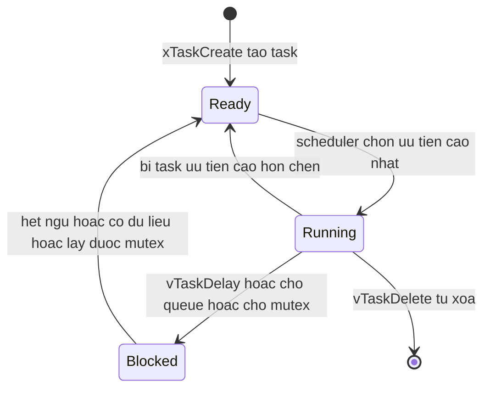
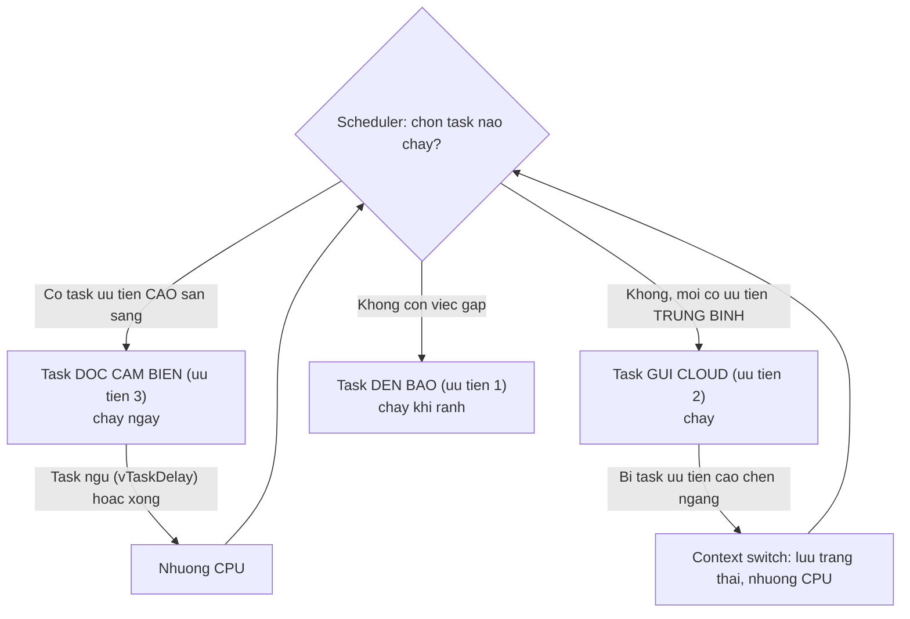

# RTOS & lập trình real-time

> **Tác giả:** Mr.Rom\
> **Phiên bản:** v1.0.0\
> **Tạo lúc:** 22/06/2026\
> **Cập nhật:** 22/06/2026\
> **Level:** Basic\
> **Tags:** embedded-iot, rtos, freertos, esp32, real-time, scheduler, task, mutex, semaphore, queue\
> **Yêu cầu trước:** [Giao tiếp: UART, I2C, SPI](02_communication-protocols.md)

> 🎯 *Ba bài trước bạn đã cho ESP32 đọc một cảm biến nhiệt độ qua I2C và bật quạt qua GPIO — tất cả nhét trong một vòng `loop()` chạy nối đuôi nhau. Bài này trả lời câu hỏi: khi dự án phình ra (vừa đọc cảm biến đều đặn, vừa điều khiển quạt, vừa gửi số liệu lên cloud, vừa nhận lệnh từ xa), cái vòng `loop()` ấy bắt đầu **vỡ trận** ở đâu, và vì sao ta cần một **RTOS**. Bạn sẽ hiểu real-time là gì, RTOS giải quyết gì (task, scheduler, context switch), ba cơ chế đồng bộ cốt lõi (semaphore, mutex, queue), viết được đoạn FreeRTOS tạo 2 task trên ESP32 đúng API, và né được ba cạm bẫy kinh điển: priority inversion, deadlock, và dùng `delay()` chặn.*

## 🎯 Sau bài này bạn sẽ

- [ ] Giải thích được vì sao **super loop** (bare-metal) đuối khi cần nhiều việc song song + đúng hạn thời gian
- [ ] Phân biệt **hard real-time** và **soft real-time** — vì sao "đúng hạn" quan trọng ngang "đúng kết quả"
- [ ] Hiểu RTOS cung cấp gì: **task**, **scheduler** (preemptive, theo ưu tiên), **context switch**
- [ ] Biết khi nào dùng **semaphore**, **mutex**, **queue** — và vì sao không xài biến chung trần trụi
- [ ] Viết được đoạn **FreeRTOS** trên ESP32 tạo 2 task bằng `xTaskCreate()` đúng cú pháp
- [ ] Nhận diện và tránh ba cạm bẫy: **priority inversion**, **deadlock**, **dùng `delay()` chặn**

---

## Tình huống — cái `loop()` bắt đầu vỡ trận

Quay lại dự án xuyên suốt cụm: một ESP32 đọc nhiệt độ từ cảm biến, bật quạt khi quá nóng. Tới giờ code của bạn trông gọn gàng như này:

```cpp
void loop() {
  float t = docNhietDo();   // đọc cảm biến qua I2C
  if (t > 30.0) batQuat();
  else          tatQuat();
  delay(1000);              // nghỉ 1 giây rồi đọc lại
}
```

Một việc, một nhịp — chạy ngon. Nhưng sếp giao thêm yêu cầu, và mọi thứ bắt đầu rối:

- Mỗi **giây** phải đọc nhiệt độ một lần (không được trễ, kẻo điều khiển quạt giật cục).
- Mỗi **10 giây** gửi số liệu lên cloud qua MQTT — nhưng việc gửi mạng có thể **mất 2-3 giây** nếu wifi chậm.
- Bất cứ lúc nào người dùng bấm nút trên app, ESP32 phải phản hồi trong **vòng 100 mili-giây** kẻo cảm giác "lag".

Giờ thử nhét hết vào một `loop()`:

```cpp
void loop() {
  doc_va_dieu_khien_quat();   // ~5 ms
  gui_len_cloud();            // CÓ THỂ kẹt ở đây 2-3 GIÂY khi wifi chậm!
  kiem_tra_nut_bam();         // muốn phản hồi < 100 ms
}
```

Thấy vấn đề chưa? Khi `gui_len_cloud()` kẹt 3 giây chờ mạng, **mọi thứ khác đứng hình**: nhiệt độ không được đọc, nút bấm không ai nghe. Quạt có thể đang cần tắt gấp mà phải đợi gửi cloud xong mới tới lượt. Một việc chậm **kéo cả hệ thống chậm theo** — vì chúng xếp hàng nối đuôi trên cùng một dòng thực thi.

→ Đây là lúc *super loop* (vòng lặp đơn, làm tuần tự) hết đủ sức. Bài này mở ra lối thoát: chẻ chương trình thành nhiều **task** chạy "song song", có **độ ưu tiên** rõ ràng, và một bộ điều phối (RTOS) tự cắt giờ CPU cho từng task — để việc gấp luôn được làm trước, việc chậm không chặn việc nhanh.

---

## 1️⃣ Vì sao super loop hết đủ khi cần nhiều việc đúng hạn?

Mô hình code ở trên có tên hẳn hoi: **super loop** (vòng lặp tổng) — còn gọi là lập trình **bare-metal** (chạy trần trên phần cứng, không có hệ điều hành). CPU chạy `setup()` một lần, rồi quay `loop()` mãi mãi, làm từng việc **nối đuôi nhau** từ trên xuống.

🪞 **Ẩn dụ — một đầu bếp duy nhất làm mọi món theo thứ tự cứng:**
> Hình dung một quán ăn chỉ có **một đầu bếp**, và anh ta phải làm các món **đúng theo một danh sách cố định, hết món này mới sang món kia**. Nếu món thứ hai là "hầm xương 3 tiếng", thì khách gọi món thứ ba (chỉ cần 2 phút) vẫn phải **chờ hết 3 tiếng**. Đầu bếp không tệ — vấn đề là anh ta không được phép *gác món hầm lại để làm nhanh món khác rồi quay lại*. Super loop chính là vậy: một dòng thực thi, làm tuần tự, không ai chen ngang được.

Với một việc đơn giản, super loop là lựa chọn tốt: nhẹ, dễ hiểu, không tốn tài nguyên. Nó **đuối** khi gặp đồng thời hai sức ép:

- **Nhiều việc cần làm "cùng lúc"** — đọc cảm biến, điều khiển, gửi mạng, nghe nút. Chúng không thật sự song song trên một lõi CPU, nhưng cần *cảm giác như* song song.
- **Mỗi việc có hạn thời gian (deadline) riêng** — đọc cảm biến mỗi giây, phản hồi nút trong 100 ms. Một việc chậm (gửi mạng) làm **trễ hạn** của mọi việc còn lại.

Khi chỉ một trong hai sức ép xuất hiện, super loop vẫn gắng được (có những kỹ thuật như *state machine* — máy trạng thái, hay xé nhỏ tác vụ). Nhưng khi cả hai cùng tới, code super loop nhanh chóng biến thành mớ bòng bong khó bảo trì. Đó là ranh giới ta cần một công cụ khác.

Để thấy rõ "nối đuôi" khác "song song có ưu tiên" thế nào, hãy so sánh hai mô hình. Bảng dưới đọc theo từng tiêu chí:

| Tiêu chí | Super loop (bare-metal) | Có RTOS |
|---|---|---|
| Số dòng thực thi | Một, chạy tuần tự | Nhiều task, luân phiên trên CPU |
| Việc chậm chặn việc nhanh? | Có — một việc kẹt là cả hệ đứng | Không — task ưu tiên cao chen vào được |
| Độ ưu tiên giữa các việc | Không có (thứ tự = thứ tự code) | Có — gán số ưu tiên rõ ràng cho từng task |
| Đáp ứng hạn thời gian | Khó đảm bảo khi tải nặng | Dễ hơn nhiều nhờ scheduler ưu tiên |
| Độ phức tạp & tài nguyên | Rất nhẹ, đơn giản | Nặng hơn (RAM cho stack mỗi task), cần học |
| Khi nên dùng | Ít việc, không gắt deadline | Nhiều việc song song + có deadline |

→ Quy luật rút ra: super loop không "sai" — nó là điểm khởi đầu tốt và đủ dùng cho rất nhiều thiết bị nhỏ. Chỉ khi bài toán có **đồng thời nhiều việc + có hạn thời gian** thì RTOS mới đáng công sức. Trước khi xem RTOS là gì, ta cần làm rõ một từ vừa nhắc nhiều lần mà chưa định nghĩa: "đúng hạn thời gian" — tức **real-time**.

---

## 2️⃣ Real-time là gì? Hard vs soft real-time

Người mới hay nghĩ "real-time = nhanh". Sai một cách tinh tế. **Real-time** (thời gian thực) không nói về *nhanh*, mà nói về *đúng hạn* — hệ thống phải cho ra kết quả **trong một thời hạn (deadline) đã định**, và **đúng hạn quan trọng ngang với đúng kết quả**.

🪞 **Ẩn dụ — túi khí ô tô:**
> Túi khí xe hơi phải bung trong khoảng **vài chục mili-giây** sau khi cảm biến phát hiện va chạm. Bung **đúng** nhưng **trễ 1 giây** thì đầu người lái đã đập vào vô-lăng rồi — kết quả đúng nhưng vô dụng. Ngược lại, một hệ thống tính ra một con số *cực kỳ chính xác* nhưng *trễ hạn* cũng coi như hỏng. Với real-time, **trễ hạn = sai**, dù phép tính có đúng tới đâu.

Một đáp số đúng nhưng đến muộn, trong nhiều hệ thống, **tệ ngang một đáp số sai**. Đó là tinh thần cốt lõi của real-time. Từ đây sinh ra hai mức độ khắt khe, phân biệt bằng **hậu quả khi lỡ hạn**:

- **Hard real-time** (thời gian thực cứng) — lỡ hạn **một lần** là thảm hoạ: hệ thống coi như hỏng, có thể gây tai nạn, hư hại. Ví dụ: điều khiển túi khí, phanh ABS, máy tạo nhịp tim, hệ thống điều khiển động cơ máy bay. Deadline ở đây là **tuyệt đối**.
- **Soft real-time** (thời gian thực mềm) — lỡ hạn thỉnh thoảng thì **chất lượng giảm** nhưng không thảm hoạ. Ví dụ: phát video (lỡ vài frame thì giật nhẹ, vẫn xem được), gửi số liệu cảm biến lên cloud (trễ vài giây thì biểu đồ cập nhật muộn, không chết ai).

Để chọn đúng mức khắt khe cho từng việc trong dự án, đối chiếu qua bảng — đọc theo hàng:

| Khía cạnh | Hard real-time | Soft real-time |
|---|---|---|
| Hậu quả khi lỡ hạn | Thảm hoạ, hệ thống hỏng | Giảm chất lượng, vẫn chạy |
| Deadline | Tuyệt đối, không được phá | Mong muốn, lỡ ít thì chấp nhận |
| Ví dụ | Túi khí, phanh ABS, máy tạo nhịp tim | Phát video, gửi cloud, cập nhật UI |
| Trong dự án của ta | Hiếm gặp ở mức người mới | Đọc cảm biến & gửi MQTT thuộc nhóm này |

> [!NOTE]
> Phần lớn dự án IoT của người mới (như cái máy đọc nhiệt độ — bật quạt — gửi cloud của ta) thuộc **soft real-time**: gửi cloud trễ vài giây không sao, miễn quạt phản ứng đủ nhanh. Bạn hiếm khi đụng hard real-time thật sự trừ khi làm thiết bị y tế, ô tô, hàng không. Nhưng hiểu sự khác biệt giúp bạn **đặt độ ưu tiên đúng** cho các task — việc nào gắt deadline hơn thì ưu tiên cao hơn.

→ Trong dự án của ta, "đọc cảm biến và điều khiển quạt" cần đúng nhịp (soft real-time khá gắt), còn "gửi MQTT" thì lỏng hơn nhiều. Vấn đề là: làm sao để việc gắt nhịp **không bị việc lỏng nhịp chặn lại**? Đó chính xác là thứ RTOS sinh ra để giải quyết — mục tiếp theo.

---

## 3️⃣ RTOS giải quyết gì? Task, scheduler, context switch

**RTOS** (*Real-Time Operating System* — hệ điều hành thời gian thực) là một hệ điều hành **tí hon** nhúng vào vi điều khiển, có một việc cốt lõi: chia nhỏ CPU theo thời gian để **nhiều task luân phiên chạy**, đồng thời **đảm bảo task quan trọng (gắt deadline) luôn được chạy trước**.

🪞 **Ẩn dụ — quán ăn thuê thêm một quản lý điều phối:**
> Quay lại quán ăn một đầu bếp. RTOS giống như thuê một **quản lý** đứng cạnh, tay cầm đồng hồ bấm giờ. Quản lý chia công việc thành các **đầu việc rời** (task), gán mỗi việc một **mức ưu tiên**, rồi liên tục bảo đầu bếp: *"Gác món hầm lại, có khách VIP gọi món gấp — làm cái này trước, 10 mili-giây nữa quay lại món hầm."* Đầu bếp (CPU) vẫn chỉ có một, nhưng nhờ quản lý cắt giờ và xếp ưu tiên, **việc gấp không bao giờ phải chờ việc chậm**.

RTOS cung cấp ba khái niệm nền — đây là nhóm khái niệm cốt lõi, nên ta đi từng cái:

- **Task** (tác vụ / luồng) — một mẩu chương trình chạy *gần như độc lập*, có vòng lặp riêng và **stack (ngăn xếp) riêng**. Trong dự án của ta: một task "đọc cảm biến & điều khiển quạt", một task khác "gửi MQTT lên cloud". Mỗi task viết như thể nó là một chương trình nhỏ chạy một mình.
- **Scheduler** (bộ lập lịch) — "người quản lý" quyết định *lúc nào task nào được chạy*. RTOS dùng kiểu **preemptive** (chiếm quyền): scheduler có quyền **ngắt ngang** task đang chạy để nhường CPU cho task ưu tiên cao hơn vừa sẵn sàng. Đây là điểm khác cốt lõi so với super loop — ở super loop không ai ngắt ngang được ai.
- **Độ ưu tiên (priority)** — mỗi task mang một con số ưu tiên. Scheduler luôn cho task **ưu tiên cao nhất đang sẵn sàng** chạy. Trong FreeRTOS, số càng lớn = ưu tiên càng cao.

Khi scheduler chuyển từ task này sang task khác, nó làm một động tác gọi là **context switch** (chuyển ngữ cảnh):

- **Context switch** — lưu lại toàn bộ "trạng thái" của task đang chạy (giá trị các thanh ghi CPU, con trỏ stack...) vào bộ nhớ, rồi nạp trạng thái của task sắp chạy vào. Nhờ vậy task bị ngắt giữa chừng, khi quay lại, *tiếp tục đúng chỗ vừa dừng* như chưa hề bị gián đoạn. Mỗi lần switch tốn một chút thời gian — nên RTOS cố giữ nó thật nhanh (cỡ micro-giây).

Một task không phải lúc nào cũng "đang chạy". Tại mỗi thời điểm, nó nằm ở một trong vài **trạng thái**, và scheduler chính là cái chuyển task qua lại giữa các trạng thái đó. Hiểu vòng đời này giúp bạn lý giải vì sao một task "biến mất" khỏi CPU (nó đang ngủ chờ), và vì sao chỉ một task được chạy mỗi lúc (trên một lõi). Đây là mô hình trạng thái chuẩn của FreeRTOS — đọc sơ đồ theo mũi tên để thấy task đi vòng qua các trạng thái ra sao:



- **Ready** (sẵn sàng) — task đã sẵn sàng chạy nhưng đang chờ tới lượt vì có task khác ưu tiên cao hơn đang chiếm CPU.
- **Running** (đang chạy) — task đang thực sự dùng CPU. Trên một lõi, **chỉ một task** ở trạng thái này mỗi lúc.
- **Blocked** (bị chặn / ngủ) — task tự nguyện chờ một sự kiện: hết giờ `vTaskDelay`, có dữ liệu trong queue, hay lấy được mutex. **Task ở Blocked không tốn CPU** — đây là điều cốt lõi giúp các task khác được chạy.

Phần trừu tượng nhất là *cách scheduler chọn task theo ưu tiên* — nên ta xem tiếp qua sơ đồ. Tình huống: có 3 task (đọc cảm biến ưu tiên cao nhất, gửi cloud trung bình, đèn báo nhấp nháy ưu tiên thấp). Đọc theo chiều mũi tên, từ lúc scheduler quyết định cho tới khi nhường CPU:



→ Mấu chốt từ sơ đồ: scheduler **không** chạy task theo thứ tự code, mà theo **ưu tiên**. Hễ task "đọc cảm biến" (ưu tiên cao) sẵn sàng, nó được chạy ngay — kể cả khi task "gửi cloud" đang giữa chừng (task gửi cloud bị *preempt*, lưu trạng thái lại, chờ tới lượt sau). Đây chính là lời giải cho tình huống đầu bài: việc gấp không còn bị việc chậm chặn. Một chi tiết quan trọng: task ưu tiên cao phải biết **tự ngủ** (nhường CPU) khi chưa cần làm gì, nếu không nó ôm CPU mãi và các task thấp hơn **chết đói** — ta sẽ thấy `vTaskDelay()` lo việc này trong code mục 5.

> [!NOTE]
> ESP32 đặc biệt ở chỗ nó có **hai lõi CPU** và chạy sẵn một bản FreeRTOS bên dưới — ngay cả `setup()`/`loop()` của Arduino thực ra cũng là một task FreeRTOS. Nên trên ESP32, các task *có thể* chạy thật sự song song trên hai lõi. Nhưng để hiểu khái niệm, cứ hình dung "một lõi, scheduler luân phiên" trước đã — đó là mô hình đúng cho hầu hết vi điều khiển một lõi.

---

## 4️⃣ Đồng bộ giữa các task: semaphore, mutex, queue

Chẻ chương trình thành nhiều task xong, một vấn đề mới nảy sinh: các task **dùng chung dữ liệu và tài nguyên**. Task "đọc cảm biến" ghi nhiệt độ vào một biến; task "gửi cloud" đọc biến đó. Hai task chạy luân phiên, bị ngắt ngang bất cứ lúc nào — điều gì xảy ra nếu một task bị chen ngang **đang giữa chừng** lúc cập nhật dữ liệu?

🪞 **Ẩn dụ — một nhà vệ sinh, nhiều người dùng chung:**
> Tưởng tượng một nhà vệ sinh chung mà **không có chốt cửa**. Người A vào, đang dùng dở thì bị người B (ưu tiên cao hơn) đẩy cửa xông vào — hỗn loạn. Các cơ chế đồng bộ chính là **cái chốt cửa và tấm biển "có người / trống"**: đảm bảo mỗi lúc chỉ một người dùng, người sau phải chờ người trước xong. Không có chốt, dữ liệu dùng chung bị hai task giẫm lên nhau, sinh lỗi cực khó tìm.

Lỗi sinh ra khi nhiều task giẫm lên cùng dữ liệu gọi là **race condition** (đua tranh) — kết quả phụ thuộc vào *task nào chạy trước*, lúc đúng lúc sai, rất khó tái hiện để debug. Vì sao không xài biến chung trần trụi? Vì một thao tác tưởng "một bước" như `dem = dem + 1` thực ra là **ba bước máy** (đọc `dem`, cộng 1, ghi lại) — nếu bị ngắt giữa ba bước đó, hai task có thể cùng đọc giá trị cũ rồi ghi đè nhau, mất mát dữ liệu.

RTOS cho ba công cụ đồng bộ. Đây là nhóm khái niệm quan trọng, ta đi từng cái kèm "dùng khi nào":

- **Mutex** (*mutual exclusion* — loại trừ tương hỗ) — đúng là "cái chốt cửa". Một task muốn dùng tài nguyên chung (vd biến nhiệt độ, hay bus I2C) phải **lấy chốt (take)** trước; dùng xong **trả chốt (give)**. Task khác muốn vào phải chờ chốt được trả. **Dùng khi:** bảo vệ một tài nguyên dùng chung để mỗi lúc chỉ một task chạm vào.
- **Semaphore** (cờ hiệu / đèn báo) — như một cái "vé". *Binary semaphore* (cờ nhị phân, 0 hoặc 1) thường dùng để **báo hiệu sự kiện** giữa các task: ví dụ ngắt (interrupt) từ nút bấm "give" một semaphore, task đang chờ "take" được nó thì thức dậy xử lý. *Counting semaphore* (cờ đếm) quản lý một nhóm tài nguyên có hạn (vd 3 chỗ đỗ xe). **Dùng khi:** một bên báo cho bên kia "có việc rồi, dậy làm đi", hoặc giới hạn số lượng truy cập.
- **Queue** (hàng đợi) — một đường ống **truyền dữ liệu an toàn** giữa các task theo kiểu vào trước ra trước (FIFO). Task A bỏ dữ liệu vào queue, task B lấy ra — RTOS lo việc khoá/mở để không ai giẫm lên ai. **Dùng khi:** chuyển *dữ liệu* (không chỉ tín hiệu) từ task này sang task khác — đây là cách *được khuyến nghị nhất* để task nói chuyện với nhau, vì nó tránh hẳn việc chia sẻ biến chung.

Áp dụng vào dự án của ta: thay vì cho task cảm biến và task cloud cùng đọc/ghi một biến `nhietDo` chung (dễ race condition), ta dựng một queue ở giữa làm "đường ống". Hình dung như sau:

```text
  Task DOC CAM BIEN                QUEUE (FIFO)              Task GUI CLOUD
  ┌──────────────────┐         ┌───┬───┬───┬───┐         ┌──────────────────┐
  │ doc nhiet do     │ ──put──>│ 31│ 30│ 29│   │ ──get──>│ lay ra, gui MQTT │
  │ xQueueSend(...)  │         └───┴───┴───┴───┘         │ xQueueReceive(...)│
  └──────────────────┘     (RTOS tu khoa/mo an toan)      └──────────────────┘
```

Task cảm biến chỉ biết "bỏ số vào ống", task cloud chỉ biết "lấy số ra khỏi ống" — không task nào chạm vào biến của task kia, nên không thể giẫm lên nhau. Nếu task cloud đang kẹt chờ wifi, các số đọc được cứ xếp hàng trong queue, không mất.

> [!TIP]
> Quy tắc chọn nhanh: cần **chuyển dữ liệu** giữa task → dùng **queue** (an toàn nhất, tránh biến chung). Cần **bảo vệ một tài nguyên** dùng chung → dùng **mutex**. Cần **báo hiệu sự kiện** (đánh thức task) → dùng **semaphore**. Trong dự án đọc cảm biến của ta, cách sạch nhất là: task đọc cảm biến bỏ giá trị nhiệt độ vào một **queue**, task gửi cloud lấy ra — không task nào đụng vào biến chung của task kia.

Sự khác nhau giữa mutex và semaphore tinh tế nhưng quan trọng — sẽ rõ hơn khi ta gặp **priority inversion** ở mục cạm bẫy. Giờ, đủ lý thuyết rồi, ta viết code thật.

---

## 5️⃣ FreeRTOS trên ESP32: tạo 2 task bằng `xTaskCreate()`

**FreeRTOS** là RTOS mã nguồn mở phổ biến nhất cho vi điều khiển, và nó **chạy sẵn bên dưới ESP32** — bạn không cần cài thêm gì, chỉ cần gọi API của nó ngay trong Arduino IDE. Ta sẽ dựng đúng tình huống đầu bài: **task 1** đọc cảm biến & điều khiển quạt (ưu tiên cao, nhịp 1 giây), **task 2** gửi số liệu lên cloud (ưu tiên thấp, nhịp 10 giây, lâu lâu kẹt cũng không sao).

Trước khi xem code, cần nắm chữ ký (signature) của hàm tạo task — đây là API trung tâm của cả bài. `xTaskCreate()` nhận sáu tham số, mỗi tham số có vai trò rõ ràng:

```c
BaseType_t xTaskCreate(
    TaskFunction_t pxTaskCode,    // 1. ham chua than task (vong lap rieng cua task)
    const char * const pcName,    // 2. ten task (de debug, in log)
    const uint32_t usStackDepth,  // 3. kich thuoc stack cap cho task (don vi: word/byte tuy port)
    void * const pvParameters,    // 4. tham so truyen vao task (NULL neu khong can)
    UBaseType_t uxPriority,       // 5. uu tien — so cang LON, uu tien cang CAO
    TaskHandle_t * const pxCreatedTask  // 6. "the" de quan ly task sau nay (NULL neu khong can)
);
```

Hai điểm dễ sai cần nhớ ngay: thân task **không bao giờ được `return`** (một task RTOS phải là vòng lặp vô tận, hoặc tự xoá mình bằng `vTaskDelete(NULL)`); và trong vòng lặp **phải có một lệnh "ngủ"** (`vTaskDelay`) để nhường CPU, nếu không task ôm CPU mãi và làm các task khác chết đói.

Giờ là đoạn code đầy đủ, dán thẳng vào Arduino IDE (chọn board ESP32) là biên dịch được. Comment đánh số từng bước cho dễ theo:

```cpp
// esp32_two_tasks.ino — chay 2 task FreeRTOS song song tren ESP32
// Task 1: doc cam bien & dieu khien quat (uu tien cao, nhip 1 giay)
// Task 2: gui so lieu len cloud (uu tien thap, nhip 10 giay)

// Than cua task 1: doc cam bien, dieu khien quat
void taskDocCamBien(void *pvParameters) {
  // 1. Task phai la vong lap VO TAN — khong bao gio return
  for (;;) {
    float t = docNhietDo();          // doc nhiet do (gia lap qua ham rieng)
    if (t > 30.0) batQuat();
    else          tatQuat();
    Serial.printf("[cam bien] nhiet do = %.1f\n", t);

    // 2. NGU 1 giay — nhuong CPU cho task khac trong luc cho
    //    pdMS_TO_TICKS doi mili-giay sang "tick" cua RTOS
    vTaskDelay(pdMS_TO_TICKS(1000));
  }
}

// Than cua task 2: gui so lieu len cloud
void taskGuiCloud(void *pvParameters) {
  for (;;) {
    Serial.println("[cloud] dang gui so lieu len MQTT...");
    guiLenCloud();                   // co the cham (cho wifi) — nhung KHONG chan task 1
    Serial.println("[cloud] gui xong.");

    // Nhip 10 giay
    vTaskDelay(pdMS_TO_TICKS(10000));
  }
}

void setup() {
  Serial.begin(115200);

  // 3. Tao task 1 — uu tien CAO (so 3)
  xTaskCreate(
    taskDocCamBien,     // ham than task
    "DocCamBien",       // ten (debug)
    2048,               // stack 2048 byte (tren ESP32/ESP-IDF, don vi la byte; FreeRTOS goc dung word)
    NULL,               // khong truyen tham so
    3,                  // uu tien 3 (cao)
    NULL                // khong can the quan ly
  );

  // 4. Tao task 2 — uu tien THAP (so 1)
  xTaskCreate(
    taskGuiCloud,
    "GuiCloud",
    4096,               // stack 4096 byte — gui mang can stack lon hon (tren ESP32 don vi la byte)
    NULL,
    1,                  // uu tien 1 (thap)
    NULL
  );
}

void loop() {
  // 5. Khong can lam gi o day — moi viec da nam trong 2 task tren.
  //    Ban than loop() cung la mot task FreeRTOS, cu de no ngu.
  vTaskDelay(pdMS_TO_TICKS(1000));
}
```

Mở **Serial Monitor** ở tốc độ 115200, kết quả mong đợi trông như thế này (task cảm biến in mỗi giây, task cloud chen vào mỗi 10 giây):

```text
[cam bien] nhiet do = 28.5
[cam bien] nhiet do = 29.1
[cloud] dang gui so lieu len MQTT...
[cloud] gui xong.
[cam bien] nhiet do = 31.2
[cam bien] nhiet do = 30.8
```

Đọc kỹ output để thấy điều cốt lõi: dòng `[cam bien]` xuất hiện **đều đặn mỗi giây**, **không bị gián đoạn** dù task cloud đang chạy xen vào. Nếu code này viết kiểu super loop, lúc `guiLenCloud()` kẹt chờ wifi thì các dòng `[cam bien]` sẽ **biến mất vài giây** — đúng cái vỡ trận ở đầu bài. Nhờ task cảm biến ưu tiên cao hơn (3 > 1) và biết tự `vTaskDelay`, scheduler luôn ưu tiên cho nó chạy đúng nhịp.

Hai điều giải thích thêm về output và code:

- **Tại sao task cảm biến không bị chặn?** Vì nó ưu tiên 3, task cloud ưu tiên 1. Khi task cảm biến hết ngủ (sau 1 giây) và sẵn sàng, scheduler **preempt** task cloud (kể cả đang giữa chừng) để cho task cảm biến chạy trước, rồi mới quay lại task cloud.
- **`vTaskDelay` khác `delay()` ở đâu?** `vTaskDelay` đặt task vào trạng thái "ngủ" và **trả CPU cho task khác** trong lúc chờ. Còn `delay()` của Arduino (kiểu busy-wait) thì *giữ CPU quay vòng vô ích* — đây là một cạm bẫy lớn, ta nói ngay ở mục dưới.

### Cho hai task nói chuyện qua queue

Đoạn trên hai task chạy độc lập, chưa trao dữ liệu cho nhau. Giờ ta nối chúng đúng theo "đường ống" đã vẽ ở mục 4: task cảm biến **đẩy** giá trị nhiệt độ vào queue, task cloud **lấy ra** để gửi đi — không task nào chạm vào biến chung. Khác biệt so với code trước chỉ ở ba chỗ: tạo queue trong `setup()`, dùng `xQueueSend` ở task cảm biến, `xQueueReceive` ở task cloud:

```cpp
// esp32_queue.ino — 2 task noi chuyen qua queue (an toan, khong bien chung)

// 1. Bien handle cua queue, dung chung cho ca 2 task
QueueHandle_t hangDoiNhietDo;

// Task san xuat: doc cam bien, day vao queue
void taskDocCamBien(void *pvParameters) {
  for (;;) {
    float t = docNhietDo();
    if (t > 30.0) batQuat();
    else          tatQuat();

    // 2. Bo gia tri vao queue (cho toi 10 tick neu queue day)
    xQueueSend(hangDoiNhietDo, &t, pdMS_TO_TICKS(10));

    vTaskDelay(pdMS_TO_TICKS(1000));   // nhip 1 giay
  }
}

// Task tieu thu: lay tu queue ra, gui len cloud
void taskGuiCloud(void *pvParameters) {
  float t;
  for (;;) {
    // 3. Cho lay 1 gia tri tu queue — cho vo han (portMAX_DELAY)
    //    Task NGU o day cho toi khi co du lieu, KHONG ton CPU
    if (xQueueReceive(hangDoiNhietDo, &t, portMAX_DELAY) == pdTRUE) {
      Serial.printf("[cloud] gui len MQTT: %.1f\n", t);
      guiLenCloud();
    }
  }
}

void setup() {
  Serial.begin(115200);

  // 4. Tao queue chua toi da 10 gia tri kieu float
  hangDoiNhietDo = xQueueCreate(10, sizeof(float));

  xTaskCreate(taskDocCamBien, "DocCamBien", 2048, NULL, 3, NULL);
  xTaskCreate(taskGuiCloud,   "GuiCloud",   4096, NULL, 1, NULL);
}

void loop() {
  vTaskDelay(pdMS_TO_TICKS(1000));
}
```

Điểm hay nằm ở `xQueueReceive(..., portMAX_DELAY)`: task cloud **tự động ngủ** (trạng thái Blocked ở sơ đồ mục 3) cho tới khi queue có dữ liệu — nó không phải "hỏi liên tục có số chưa" (polling tốn CPU). Khi task cảm biến đẩy một giá trị vào, RTOS đánh thức task cloud dậy lấy. Đây chính là kiểu phối hợp **producer–consumer** (sản xuất–tiêu thụ) sạch sẽ nhất giữa hai task.

> [!IMPORTANT]
> Tham số `usStackDepth` (kích thước stack) là chỗ người mới hay sập. Cấp **quá ít** → task tràn stack (*stack overflow*) → ESP32 reset liên tục. Cấp dư một chút cho an toàn (như 2048-4096 cho task có in log/dùng mạng). Khi nghi tràn stack, dùng `uxTaskGetStackHighWaterMark(NULL)` để đo mức stack còn lại rồi chỉnh.

---

## 💡 Cạm bẫy thường gặp & Best practice

### ❌ Cạm bẫy: dùng `delay()` chặn trong task RTOS

- **Triệu chứng**: các task khác bị khựng, hệ thống "lag" đúng bằng khoảng `delay()` bạn đặt; watchdog có thể reset board.
- **Nguyên nhân**: `delay()` của Arduino (trên nhiều nền) là **busy-wait** — CPU quay vòng đếm cho hết thời gian, **không nhường** cho task khác. Trong RTOS, điều bạn cần là "ngủ và trả CPU".
- **Cách tránh**: trong task FreeRTOS, **luôn dùng `vTaskDelay(pdMS_TO_TICKS(ms))`** thay cho `delay()`. Nó đặt task vào trạng thái chờ và nhường CPU cho task khác chạy trong lúc đó. Đây là khác biệt một-dòng nhưng quyết định cả hệ thống có "real-time" hay không.

### ❌ Cạm bẫy: deadlock (kẹt khoá chéo)

- **Triệu chứng**: hai task **đứng hình vĩnh viễn**, cùng treo, không task nào tiến lên được.
- **Nguyên nhân**: task A giữ mutex X rồi chờ mutex Y; cùng lúc task B giữ mutex Y rồi chờ mutex X. Mỗi bên ôm một khoá và chờ khoá bên kia → **chờ nhau mãi mãi**. Giống hai người ở hai đầu hành lang hẹp, ai cũng đợi người kia lùi trước.
- **Cách tránh**: (1) **luôn lấy nhiều mutex theo cùng một thứ tự** ở mọi task (vd luôn X trước, Y sau); (2) giữ mutex **càng ngắn càng tốt**, trả ngay khi xong; (3) khi `xSemaphoreTake` dùng **timeout** thay vì chờ vô hạn (`portMAX_DELAY`) để phát hiện kẹt.

### ❌ Cạm bẫy: priority inversion (đảo ngược ưu tiên)

- **Triệu chứng**: một task **ưu tiên cao** bị trễ hạn một cách khó hiểu, dù nó đáng lẽ được chạy trước.
- **Nguyên nhân**: task ưu tiên thấp đang giữ một mutex mà task ưu tiên cao cần. Task cao phải chờ task thấp trả mutex — nhưng task thấp lại bị một task **ưu tiên trung bình** (không liên quan) chen ngang chiếm CPU. Kết quả: task ưu tiên cao gián tiếp bị task trung bình chặn — *ưu tiên bị đảo lộn*.
- **Cách tránh**: dùng **mutex** (không phải binary semaphore) cho việc bảo vệ tài nguyên, vì mutex của FreeRTOS hỗ trợ **priority inheritance** (kế thừa ưu tiên) — task thấp đang giữ mutex được *tạm nâng* lên bằng ưu tiên của task cao đang chờ, để nó chạy xong và trả khoá nhanh. Đây chính là lý do mutex và semaphore *không* thay thế cho nhau dù nhìn giống.

### ✅ Best practice: truyền dữ liệu giữa task bằng queue, không bằng biến chung

- **Vì sao**: biến chung trần trụi dễ sinh **race condition** (hai task giẫm lên nhau lúc đọc/ghi), lỗi xuất hiện ngẫu nhiên, cực khó debug. Queue đã được RTOS khoá/mở an toàn sẵn.
- **Cách áp dụng**: task đọc cảm biến `xQueueSend(queue, &nhietDo, ...)`, task gửi cloud `xQueueReceive(queue, &nhietDo, ...)`. Hai task không chạm vào biến của nhau — sạch và an toàn. Nếu buộc phải chia sẻ biến chung, bọc mọi lần đọc/ghi bằng mutex.

### ✅ Best practice: gán ưu tiên theo độ gắt của deadline, và luôn cho task biết "ngủ"

- **Vì sao**: scheduler chỉ phát huy tác dụng khi ưu tiên phản ánh đúng mức gắt hạn thời gian. Và task ưu tiên cao mà không bao giờ ngủ sẽ làm task thấp **chết đói** (*starvation*).
- **Cách áp dụng**: việc gắt nhịp (đọc cảm biến, điều khiển) → ưu tiên cao; việc lỏng (gửi cloud, blink LED) → ưu tiên thấp. Mỗi task phải có điểm nhường CPU (`vTaskDelay`, chờ queue/semaphore). Không có task nào được "ôm CPU" trong một vòng lặp không nghỉ.

---

## 🧠 Tự kiểm tra (Self-check)

**Q1.** Vì sao super loop (bare-metal) đuối khi vừa phải đọc cảm biến mỗi giây, vừa gửi cloud (có thể kẹt 3 giây), vừa nghe nút bấm phản hồi trong 100 ms?

<details>
<summary>💡 Xem giải thích</summary>

Super loop chỉ có **một dòng thực thi**, làm các việc **nối đuôi nhau**. Khi `gui_len_cloud()` kẹt 3 giây chờ wifi, mọi việc khác (đọc cảm biến, nghe nút) **đứng hình** trong 3 giây đó vì phải đợi tới lượt. Một việc chậm kéo cả hệ thống chậm theo. Nó đuối vì hai sức ép cùng tới: **nhiều việc cần "song song"** và **mỗi việc có deadline riêng** — super loop không có cơ chế ngắt ngang việc chậm để ưu tiên việc gấp.

</details>

**Q2.** Real-time nghĩa là "nhanh" đúng không? Phân biệt hard và soft real-time.

<details>
<summary>💡 Xem giải thích</summary>

**Không** — real-time không phải "nhanh" mà là **đúng hạn (deadline)**: kết quả phải đến trong thời hạn đã định, và *trễ hạn coi như sai* dù kết quả đúng (như túi khí bung trễ 1 giây thì vô dụng).

- **Hard real-time**: lỡ hạn một lần là thảm hoạ (túi khí, phanh ABS, máy tạo nhịp tim) — deadline tuyệt đối.
- **Soft real-time**: lỡ hạn thỉnh thoảng thì giảm chất lượng nhưng không thảm hoạ (phát video, gửi cloud) — deadline mong muốn.

Phần lớn dự án IoT người mới thuộc soft real-time.

</details>

**Q3.** Scheduler preemptive chọn task để chạy dựa vào gì? "Context switch" là gì?

<details>
<summary>💡 Xem giải thích</summary>

Scheduler **preemptive** luôn cho task có **ưu tiên cao nhất đang sẵn sàng** chạy — và có quyền **ngắt ngang (preempt)** task đang chạy để nhường CPU cho task ưu tiên cao hơn vừa sẵn sàng. Nó **không** chạy theo thứ tự code.

**Context switch** (chuyển ngữ cảnh): khi đổi từ task này sang task khác, RTOS **lưu trạng thái** task đang chạy (thanh ghi CPU, con trỏ stack...) vào bộ nhớ rồi **nạp trạng thái** task sắp chạy. Nhờ vậy task bị ngắt giữa chừng khi quay lại tiếp tục đúng chỗ vừa dừng. Mỗi lần switch tốn một chút thời gian (cỡ micro-giây).

</details>

**Q4.** Khi nào dùng mutex, semaphore, queue?

<details>
<summary>💡 Xem giải thích</summary>

- **Mutex** — **bảo vệ một tài nguyên dùng chung** (biến, bus I2C): task phải "lấy chốt" trước khi dùng, "trả chốt" sau khi xong, đảm bảo mỗi lúc chỉ một task chạm vào.
- **Semaphore** — **báo hiệu sự kiện** giữa các task (binary: 0/1, vd ngắt đánh thức task chờ) hoặc **giới hạn số lượng** truy cập (counting, vd 3 chỗ).
- **Queue** — **truyền dữ liệu an toàn** giữa task theo FIFO; được khuyến nghị nhất vì tránh hẳn việc chia sẻ biến chung.

Quy tắc nhanh: chuyển *dữ liệu* → queue; bảo vệ *tài nguyên* → mutex; báo *sự kiện* → semaphore.

</details>

**Q5.** Vì sao trong task FreeRTOS phải dùng `vTaskDelay()` thay cho `delay()`?

<details>
<summary>💡 Xem giải thích</summary>

`delay()` của Arduino là **busy-wait**: CPU quay vòng đếm cho hết thời gian, **không nhường** CPU cho task khác — làm các task khác bị khựng và phá vỡ tính real-time.

`vTaskDelay(pdMS_TO_TICKS(ms))` đặt task vào trạng thái **ngủ** và **trả CPU cho task khác** trong lúc chờ. Đây là cách đúng để một task "nghỉ" mà không chiếm CPU. `pdMS_TO_TICKS` đổi mili-giây sang đơn vị tick của RTOS.

</details>

**Q6.** Priority inversion là gì, và vì sao dùng mutex (chứ không phải binary semaphore) giúp tránh nó?

<details>
<summary>💡 Xem giải thích</summary>

**Priority inversion** (đảo ngược ưu tiên): task ưu tiên thấp đang giữ mutex mà task ưu tiên cao cần; task thấp lại bị một task ưu tiên trung bình (không liên quan) chen ngang chiếm CPU → task ưu tiên cao gián tiếp bị task trung bình chặn, trễ hạn khó hiểu.

**Mutex** của FreeRTOS hỗ trợ **priority inheritance** (kế thừa ưu tiên): task thấp đang giữ mutex được *tạm nâng* lên bằng ưu tiên của task cao đang chờ, để nó chạy xong và trả khoá nhanh, rồi hạ lại. **Binary semaphore không có** cơ chế này — nên dù nhìn giống, mutex và semaphore không thay thế cho nhau khi bảo vệ tài nguyên.

</details>

---

## ⚡ Tra cứu nhanh (Cheatsheet)

### Super loop vs RTOS — chọn nhanh

```text
It viec, khong gat deadline       -> SUPER LOOP (nhe, don gian)
Nhieu viec song song + co deadline -> RTOS (task + uu tien + scheduler)
```

### API FreeRTOS hay dùng (ESP32 / Arduino)

| Mục đích | API |
|---|---|
| Tạo một task | `xTaskCreate(ham, "ten", stack, param, uuTien, &handle)` |
| Task ngủ (nhường CPU) | `vTaskDelay(pdMS_TO_TICKS(ms))` |
| Xoá task hiện tại | `vTaskDelete(NULL)` |
| Tạo mutex | `SemaphoreHandle_t m = xSemaphoreCreateMutex();` |
| Lấy / trả mutex | `xSemaphoreTake(m, portMAX_DELAY);` ... `xSemaphoreGive(m);` |
| Tạo binary semaphore | `SemaphoreHandle_t s = xSemaphoreCreateBinary();` |
| Tạo queue | `QueueHandle_t q = xQueueCreate(soPhanTu, sizeof(KieuDuLieu));` |
| Gửi / nhận qua queue | `xQueueSend(q, &data, timeout);` ... `xQueueReceive(q, &data, timeout);` |
| Đo stack còn lại của task | `uxTaskGetStackHighWaterMark(NULL)` |

### Chọn cơ chế đồng bộ — chọn nhanh

```text
Chuyen DU LIEU giua task   -> QUEUE     (an toan nhat, tranh bien chung)
Bao ve TAI NGUYEN dung chung -> MUTEX    (co priority inheritance)
Bao hieu SU KIEN / danh thuc -> SEMAPHORE (binary) hoac counting de gioi han so luong
```

### Ba cạm bẫy phải nhớ

```text
delay() chan       -> dung vTaskDelay() de nhuong CPU
deadlock           -> lay nhieu mutex theo CUNG thu tu + giu ngan + dung timeout
priority inversion -> dung MUTEX (priority inheritance), khong dung binary semaphore de bao ve tai nguyen
```

---

## 📚 Từ Điển Thuật Ngữ (Glossary)

| EN | VN | Giải thích |
|---|---|---|
| RTOS (Real-Time Operating System) | Hệ điều hành thời gian thực | Hệ điều hành tí hon điều phối nhiều task có deadline trên vi điều khiển |
| Super loop | Vòng lặp tổng | Mô hình bare-metal: một vòng `loop()` làm mọi việc tuần tự |
| Bare-metal | Chạy trần | Lập trình trực tiếp trên phần cứng, không có hệ điều hành |
| Real-time | Thời gian thực | Phải cho kết quả trong thời hạn (deadline), trễ hạn coi như sai |
| Hard real-time | Thời gian thực cứng | Lỡ hạn một lần là thảm hoạ (túi khí, phanh ABS) |
| Soft real-time | Thời gian thực mềm | Lỡ hạn thỉnh thoảng thì giảm chất lượng, không thảm hoạ |
| Deadline | Hạn thời gian | Thời điểm trễ nhất mà kết quả phải có |
| Task | Tác vụ / luồng | Mẩu chương trình chạy gần độc lập, có stack riêng |
| Scheduler | Bộ lập lịch | Phần RTOS quyết định lúc nào task nào được chạy |
| Preemptive | Chiếm quyền | Scheduler có quyền ngắt ngang task đang chạy để nhường task ưu tiên cao hơn |
| Priority | Độ ưu tiên | Con số xếp hạng task; trong FreeRTOS số lớn = ưu tiên cao |
| Context switch | Chuyển ngữ cảnh | Lưu trạng thái task cũ, nạp trạng thái task mới khi đổi task |
| Ready / Running / Blocked | Sẵn sàng / Đang chạy / Bị chặn | Ba trạng thái chính của task; Blocked không tốn CPU |
| Stack | Ngăn xếp | Vùng nhớ riêng mỗi task dùng cho biến cục bộ và lời gọi hàm |
| Stack overflow | Tràn ngăn xếp | Task dùng quá stack được cấp, gây lỗi/reset |
| Mutex | Khoá loại trừ | "Chốt cửa" bảo vệ tài nguyên dùng chung, có priority inheritance |
| Semaphore | Cờ hiệu | Cơ chế báo hiệu sự kiện (binary) hoặc đếm tài nguyên (counting) |
| Queue | Hàng đợi | Đường ống truyền dữ liệu an toàn giữa task theo FIFO |
| FIFO (First In First Out) | Vào trước ra trước | Quy tắc của queue: phần tử vào trước được lấy ra trước |
| Producer–consumer | Sản xuất–tiêu thụ | Mẫu phối hợp: một task tạo dữ liệu, task kia lấy ra xử lý, nối qua queue |
| Polling | Hỏi vòng | Liên tục hỏi "có việc chưa", tốn CPU; trái với cách ngủ chờ sự kiện |
| Race condition | Đua tranh | Lỗi khi nhiều task giẫm lên cùng dữ liệu, kết quả phụ thuộc thứ tự chạy |
| Deadlock | Kẹt khoá | Các task chờ khoá của nhau mãi mãi, không bên nào tiến được |
| Priority inversion | Đảo ngược ưu tiên | Task cao bị chặn gián tiếp vì task thấp giữ khoá lại bị task trung bình chen |
| Priority inheritance | Kế thừa ưu tiên | Task giữ mutex được tạm nâng ưu tiên để trả khoá nhanh, chống priority inversion |
| Starvation | Chết đói | Task ưu tiên thấp không bao giờ được chạy vì task cao ôm CPU |
| FreeRTOS | FreeRTOS | RTOS mã nguồn mở phổ biến, chạy sẵn dưới ESP32 |
| Tick | Tick | Nhịp thời gian cơ bản của RTOS; `pdMS_TO_TICKS` đổi ms sang tick |

---

## 🔗 Liên kết & Tài nguyên

⬅️ **Bài trước:** [Giao tiếp: UART, I2C, SPI](02_communication-protocols.md)\
➡️ **Bài tiếp theo:** [Kết nối IoT lên Cloud](04_connecting-to-the-cloud.md)\
↑ **Về cụm:** [Embedded & IoT — README cụm](../../README.md)

### 🧭 Định hướng lộ trình học

- [Vi điều khiển & GPIO](01_microcontrollers-and-gpio.md) — nền tảng: con chip chạy code và cách bật/đọc chân
- [Giao tiếp: UART, I2C, SPI](02_communication-protocols.md) — bài trước: cách ESP32 nói chuyện với cảm biến, dữ liệu mà task sẽ xử lý
- [Kết nối IoT lên Cloud](04_connecting-to-the-cloud.md) — bài kế: task gửi cloud sẽ thực sự đẩy số liệu lên MQTT

### 🧩 Các chủ đề có thể bạn quan tâm

- [Embedded & IoT là gì?](00_what-is-embedded-iot.md) — bức tranh tổng của cả cụm, đặt RTOS vào đúng chỗ
- [Kết nối IoT lên Cloud](04_connecting-to-the-cloud.md) — ghép nốt mảnh cuối: task ưu tiên thấp đẩy dữ liệu lên cloud

### 🌐 Tài nguyên tham khảo khác

- [FreeRTOS — trang chủ](https://www.freertos.org/) — tài liệu gốc về task, scheduler, mutex/semaphore/queue
- [ESP-IDF FreeRTOS docs](https://docs.espressif.com/projects/esp-idf/en/latest/esp32/api-reference/system/freertos.html) — FreeRTOS như Espressif port cho ESP32
- [Arduino-ESP32 — FreeRTOS](https://docs.espressif.com/projects/arduino-esp32/en/latest/) — dùng FreeRTOS ngay trong Arduino IDE trên ESP32
- [FreeRTOS — Mastering the FreeRTOS Kernel (sách miễn phí)](https://www.freertos.org/Documentation/RTOS_book.html) — đào sâu scheduler, priority inheritance, đồng bộ

---

> 🎯 *Sau bài này bạn đã hiểu vì sao super loop đuối khi cần nhiều việc đúng hạn, real-time là đúng hạn (hard vs soft), RTOS cung cấp task + scheduler preemptive theo ưu tiên + context switch, ba cơ chế đồng bộ (mutex bảo vệ tài nguyên, semaphore báo hiệu, queue truyền dữ liệu), viết được 2 task FreeRTOS trên ESP32 bằng `xTaskCreate()`, và né ba cạm bẫy priority inversion / deadlock / `delay()` chặn. Bài kế tiếp dùng đúng task ưu tiên thấp này để thật sự đẩy số liệu nhiệt độ lên cloud qua MQTT — khép lại dự án xuyên suốt cụm.*

---

## 📌 Nhật ký thay đổi (Changelog)

- **v1.0.0 (22/06/2026)** — Bản đầu tiên. Cụm `embedded-iot/` lesson 3/5. Cover: vì sao super loop (bare-metal) đuối khi nhiều việc song song + có deadline (tình huống đọc cảm biến / điều khiển quạt / gửi cloud / nghe nút) + real-time là đúng hạn (hard vs soft real-time) + RTOS cung cấp task / scheduler preemptive theo ưu tiên / context switch + ba cơ chế đồng bộ (mutex, semaphore, queue) và khi nào dùng cái nào + đoạn FreeRTOS trên ESP32 tạo 2 task bằng `xTaskCreate()` đúng API (kèm `vTaskDelay`/`pdMS_TO_TICKS`) + ba cạm bẫy (priority inversion, deadlock, `delay()` chặn). Kèm 2 sơ đồ mermaid (vòng đời trạng thái task + scheduler chọn task theo ưu tiên) và code C/FreeRTOS đúng cú pháp cơ bản.
