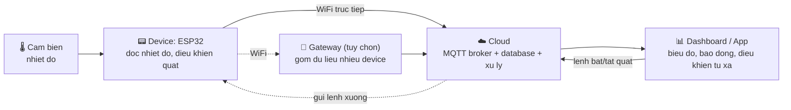
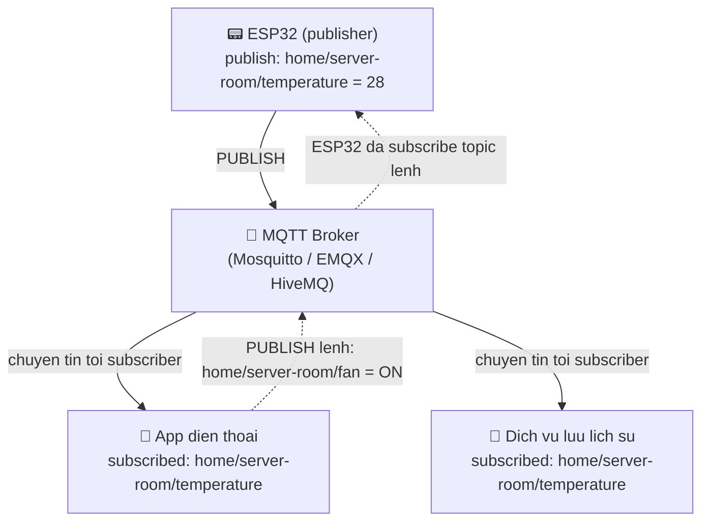

# Kết nối IoT lên Cloud

> **Tác giả:** Mr.Rom\
> **Phiên bản:** v1.0.0\
> **Tạo lúc:** 22/06/2026\
> **Cập nhật:** 22/06/2026\
> **Level:** Basic\
> **Tags:** embedded-iot, mqtt, esp32, cloud, tls, ota, security, publish-subscribe, arduino\
> **Yêu cầu trước:** [RTOS & lập trình real-time](03_rtos-and-realtime.md)

> 🎯 *Bài trước bạn đã dùng RTOS để chạy nhiều việc song song trên board: một task đọc nhiệt độ, một task điều khiển quạt. Nhưng tất cả vẫn nằm gọn trong board — bạn phải đứng cạnh nó mới biết nhiệt độ. Bài này là mảnh ghép cuối: đưa số liệu **ra khỏi board, lên cloud**, để bạn xem nhiệt độ từ điện thoại ở bất cứ đâu. Bạn sẽ hiểu chuỗi giá trị IoT (device → gateway → cloud → dashboard), vì sao HTTP nặng với thiết bị nhỏ nên IoT chuộng **MQTT**, tự viết code ESP32 nối WiFi rồi `publish` nhiệt độ lên một MQTT broker, và nắm các nguyên tắc bảo mật IoT sống còn (TLS, đừng hard-code mật khẩu, cập nhật firmware OTA).*

## 🎯 Sau bài này bạn sẽ

- [ ] Vẽ được **chuỗi giá trị IoT**: device → (gateway) → cloud → dashboard, và biết mỗi mắt xích làm gì
- [ ] Giải thích vì sao **HTTP nặng** với thiết bị nhỏ và **MQTT** nhẹ hơn ở đâu (publish/subscribe, broker, topic, QoS)
- [ ] Đối chiếu được **MQTT vs HTTP** qua một bảng, biết khi nào chọn cái nào
- [ ] Tự viết code **ESP32** nối WiFi và `publish` nhiệt độ lên một MQTT broker bằng `WiFi.h` + `PubSubClient`
- [ ] Nắm **bảo mật IoT** cốt lõi: TLS, không hard-code mật khẩu, cập nhật firmware (OTA) là gì và vì sao IoT hay bị tấn công
- [ ] Kể tên các **nền tảng cloud IoT** lớn (AWS IoT, Azure IoT) và biết bước học tiếp theo

---

## Tình huống — chiếc quạt thông minh chỉ "thông minh" trong phòng đó

Suốt ba bài vừa qua, ta dựng dần một dự án nhỏ trên board ESP32: một cảm biến đọc nhiệt độ, một con quạt tự bật khi quá nóng, và ở bài RTOS ta tách chúng thành hai task chạy song song. Mạch hoạt động ngon — quá nóng thì quạt quay, mát thì quạt tắt.

Nhưng có một giới hạn lớn: **mọi thứ đóng kín trong board**. Muốn biết phòng máy chủ giờ bao nhiêu độ, bạn phải **đi tới tận nơi** cắm màn hình Serial vào xem. Sếp hỏi "tối qua lúc 3 giờ sáng nhiệt độ bao nhiêu?" — bạn chịu, vì board không lưu, không gửi đi đâu cả. Con quạt "thông minh" hoá ra chỉ thông minh trong đúng cái phòng nó đứng.

Giờ hình dung phiên bản đầy đủ: board cứ mỗi 10 giây gửi nhiệt độ **lên internet**; bạn mở app trên điện thoại ở Sài Gòn vẫn thấy phòng máy chủ ở Hà Nội đang 28°C; có biểu đồ nhiệt độ 24 giờ qua; nóng quá ngưỡng thì điện thoại **báo động** dù bạn đang ngủ. Đó chính là chữ "I" trong IoT — *Internet* of Things: đồ vật **nối internet** để gửi/nhận dữ liệu.

Một loạt câu hỏi hiện ra — và đó là bài hôm nay:

- Dữ liệu từ board đi qua những chặng nào để tới được app điện thoại? (→ chuỗi giá trị IoT)
- Board chỉ có vài trăm KB RAM, pin yếu, mạng chập chờn — gửi kiểu gì cho hiệu quả? (→ vì sao MQTT, không phải HTTP)
- Viết code thật trên ESP32 để gửi nhiệt độ lên cloud ra sao? (→ `WiFi.h` + `PubSubClient`)
- Nối internet rồi thì kẻ xấu có vào được board không? (→ bảo mật IoT, TLS, OTA)

→ Ta đi từ bức tranh tổng — dữ liệu chảy từ board lên cloud thế nào — rồi mới mổ xẻ giao thức MQTT, viết code, và cuối cùng là khoá cửa bảo mật lại cho chắc.

---

## 1️⃣ Chuỗi giá trị IoT: dữ liệu chảy từ board lên màn hình bạn thế nào?

Trước khi bàn giao thức hay code, cần thấy **toàn cảnh đường đi của dữ liệu**. Một hệ thống IoT hoàn chỉnh hiếm khi chỉ có "board và app" — giữa chúng là một chuỗi mắt xích, mỗi mắt xích một nhiệm vụ. Hiểu chuỗi này giúp bạn biết mình đang viết code cho **chặng nào** và phần còn lại ai lo.

🪞 **Ẩn dụ — chuyển phát một bưu kiện:**
> Board ESP32 như **người gửi** ở một thị trấn nhỏ, viết một mẩu tin ("28°C"). Đôi khi thị trấn không có bưu điện lớn, phải đưa qua **một trạm trung chuyển địa phương** (gateway) gom hàng nhiều nhà rồi mới chuyển đi. Mẩu tin được đưa lên **bưu điện trung tâm khổng lồ** (cloud) — nơi lưu kho, phân loại, xử lý. Cuối cùng người nhận mở **hộp thư của mình** (dashboard/app) ra đọc. Mỗi chặng chuyên một việc; bưu kiện đi xuyên suốt từ tay người gửi tới tay người nhận.

Chuỗi giá trị IoT (IoT value chain) gồm bốn mắt xích chính. Đây là nhóm khái niệm nền của cả bài, nên ta điểm từng cái:

- **Device** (thiết bị) — board cảm biến/chấp hành ở "hiện trường". Trong dự án của ta: ESP32 đọc nhiệt độ, điều khiển quạt. Đây là nơi dữ liệu **sinh ra**.
- **Gateway** (cổng kết nối) — thiết bị trung gian gom dữ liệu từ nhiều device rồi đẩy lên cloud. Cần khi device dùng giao thức tầm ngắn (Zigbee, Bluetooth, LoRa) **không nối thẳng internet được**. ESP32 có WiFi sẵn nên trong dự án của ta **không bắt buộc** có gateway — board nối thẳng lên cloud. Vì vậy ở sơ đồ ta để gateway trong ngoặc (tuỳ chọn).
- **Cloud** (đám mây) — máy chủ trên internet nhận, lưu trữ, xử lý dữ liệu. Ở đây thường có một **MQTT broker** (sẽ rõ ở mục 2), database lưu lịch sử, và logic xử lý (báo động khi quá ngưỡng).
- **Dashboard / App** (bảng điều khiển) — giao diện cho con người: biểu đồ nhiệt độ, nút bật/tắt quạt từ xa, thông báo. Đây là nơi dữ liệu **được tiêu thụ**.

Bốn mắt xích này nối thành một đường đi, và đó cũng là phần trừu tượng nhất của bài, nên ta xem qua sơ đồ. Đọc theo chiều mũi tên, dữ liệu nhiệt độ đi từ cảm biến cho tới màn hình điện thoại:



→ Mấu chốt cần khắc sâu: dữ liệu **đi cả hai chiều**. Chiều lên (board → cloud → app) gửi số liệu nhiệt độ; chiều xuống (app → cloud → board) gửi **lệnh điều khiển** (bật/tắt quạt từ xa). Mũi tên đứt nét tới gateway cho thấy nó **tuỳ chọn** — với ESP32 có WiFi, board nối thẳng cloud. Câu hỏi tiếp theo: ở chặng "Device → Cloud", board nói chuyện với cloud bằng **ngôn ngữ (giao thức)** nào cho hiệu quả? Đó là lúc MQTT bước vào.

---

## 2️⃣ Vì sao IoT chuộng MQTT, không phải HTTP?

Bạn đã quen HTTP — giao thức mọi trang web dùng. Hướng đầu tiên ai cũng nghĩ tới là: *"cứ cho board gửi HTTP request lên server như app web là xong?"*. Làm được, nhưng với một thiết bị nhỏ như ESP32, HTTP **nặng một cách không cần thiết**. Hãy thấy vì sao.

Một board IoT điển hình có ba ràng buộc khắc nghiệt mà server hay điện thoại không có:

- **Ít tài nguyên** — ESP32 chỉ vài trăm KB RAM, không phải vài GB như điện thoại. Mỗi byte đều quý.
- **Pin yếu / chạy pin** — nhiều thiết bị chạy pin nhiều tháng. Bật radio WiFi tốn điện; gửi càng nhiều byte, mở kết nối càng lâu thì càng hao pin.
- **Mạng chập chờn** — cảm biến đặt ở góc nhà máy, sóng yếu, rớt mạng liên tục. Giao thức phải chịu được mất kết nối rồi nối lại.

HTTP sinh ra cho **trang web**, không cho ràng buộc trên. Mỗi lần gửi một con số nhiệt độ (vài byte), HTTP buộc board phải: mở kết nối mới, gửi cả một mớ **header dài** (`GET /... HTTP/1.1`, `Host`, `User-Agent`, `Content-Type`...), chờ server trả lời, rồi đóng kết nối. Gửi 5 byte dữ liệu mà tốn hàng trăm byte "bao bì". Tệ hơn, HTTP là kiểu **request–response**: board phải **chủ động hỏi** server mới biết có lệnh mới — muốn server đẩy lệnh "bật quạt" xuống tức thì thì HTTP làm rất vụng.

🪞 **Ẩn dụ — gửi thư tay vs đăng báo theo chuyên mục:**
> HTTP như **gửi thư tay**: mỗi lần báo tin, bạn viết một phong bì đầy đủ (địa chỉ, tem, người gửi, người nhận) chỉ để nhét vào trong đúng một dòng "28°C", rồi gửi đi, rồi chờ thư hồi âm. Tốn giấy, tốn công, mỗi lần lại làm lại từ đầu. **MQTT** như **đăng tin lên một bảng tin theo chuyên mục** (topic): bạn nối vào bảng tin **một lần**, rồi cứ "dán" số liệu vào đúng chuyên mục `phong-may-chu/nhiet-do`; ai quan tâm chuyên mục đó **tự động** nhận được — không cần hỏi đi hỏi lại, không phong bì cồng kềnh.

### MQTT là gì và bốn khái niệm cốt lõi

**MQTT** (*Message Queuing Telemetry Transport* — giao thức truyền tin từ xa nhẹ) là một giao thức nhắn tin **publish/subscribe** thiết kế riêng cho thiết bị yếu, mạng kém. Nó chạy trên TCP, nhưng phần "bao bì" cực nhỏ (header tối thiểu chỉ **2 byte**). Bốn khái niệm bạn phải nắm:

- **Broker** (máy môi giới) — máy chủ trung tâm đứng giữa, **nhận mọi tin và phân phát lại**. Thiết bị không nói chuyện trực tiếp với nhau; tất cả đi qua broker. Trong dự án của ta, broker chạy trên cloud. Phần mềm broker phổ biến: **Mosquitto**, **EMQX**, **HiveMQ**.
- **Publish** (đăng tin) — hành động một thiết bị **gửi** một thông điệp vào một topic. ESP32 *publish* nhiệt độ lên topic `home/server-room/temperature`.
- **Subscribe** (đăng ký nhận) — hành động **đăng ký** một topic để **tự động nhận** mọi tin đăng vào đó. App điện thoại *subscribe* topic nhiệt độ để cập nhật biểu đồ; ESP32 *subscribe* topic lệnh để nhận lệnh bật/tắt quạt.
- **Topic** (chủ đề) — "địa chỉ" của thông điệp, dạng đường dẫn phân cấp ngăn bằng dấu `/`, ví dụ `home/server-room/temperature`. Publisher và subscriber **khớp nhau qua topic**, không cần biết nhau là ai.

Cơ chế publish/subscribe qua broker là phần trừu tượng nhất, nên ta xem sơ đồ. ESP32 publish nhiệt độ; broker phát lại cho mọi bên đã subscribe topic đó:



→ Điểm cốt lõi từ sơ đồ: ESP32 và app điện thoại **không hề biết nhau** — chúng chỉ cùng nói chuyện với broker qua một topic chung. ESP32 "đăng tin" một lần, broker tự lo phát cho **mọi** bên đang subscribe (app, dịch vụ lưu lịch sử...). Muốn thêm một subscriber mới (ví dụ thêm một màn hình lớn ở phòng giám sát) thì **không phải sửa code ESP32** — chỉ cần subscriber mới đó tự đăng ký topic. Đây là cái uyển chuyển mà HTTP request–response không có.

### QoS — đảm bảo tin tới nơi tới mức nào

MQTT cho bạn chọn **độ tin cậy** khi gửi tin, gọi là **QoS** (*Quality of Service* — mức chất lượng dịch vụ). Có ba mức, đánh đổi giữa "chắc chắn tới" và "tốn tài nguyên/băng thông":

- **QoS 0** — "gửi rồi quên" (at most once). Gửi một phát, không xác nhận. Nhanh, nhẹ nhất, nhưng tin có thể mất nếu rớt mạng. Hợp cho dữ liệu gửi liên tục, mất một mẫu không sao (nhiệt độ mỗi 10 giây).
- **QoS 1** — "ít nhất một lần" (at least once). Có xác nhận; nếu chưa nhận xác nhận thì gửi lại — nên tin **chắc chắn tới**, nhưng **có thể tới trùng**. Hợp cho lệnh quan trọng.
- **QoS 2** — "đúng một lần" (exactly once). Bắt tay bốn bước để đảm bảo tin tới **đúng một lần, không trùng**. Tin cậy nhất nhưng tốn nhất. Hợp cho lệnh không được phép lặp (ví dụ "trừ tiền").

> [!TIP]
> Với dữ liệu telemetry gửi đều đặn (nhiệt độ mỗi vài giây), **QoS 0** thường là lựa chọn đúng: nhẹ, ít hao pin, và mất một mẫu lẻ chẳng ảnh hưởng gì vì mẫu sau lại tới ngay. Để dành QoS 1/2 cho **lệnh điều khiển** (bật/tắt quạt) — nơi mất lệnh mới là vấn đề.

### Bảng đối chiếu MQTT vs HTTP

Hai giao thức sinh ra cho hai mục đích khác nhau. Bảng dưới đối chiếu theo các tiêu chí quan trọng nhất với IoT — đọc theo từng hàng:

| Tiêu chí | HTTP | MQTT |
|---|---|---|
| Mô hình giao tiếp | Request–response (hỏi mới trả) | Publish/subscribe (đăng tin, ai quan tâm tự nhận) |
| Kích thước "bao bì" (overhead) | Header dài (hàng trăm byte) | Header tối thiểu (2 byte) |
| Server đẩy dữ liệu xuống device | Khó — device phải hỏi liên tục (polling) | Dễ — broker đẩy tức thì tới subscriber |
| Kết nối | Thường mở–đóng mỗi request | Mở **một lần**, giữ liên tục |
| Hao pin / băng thông | Cao | Thấp |
| Chịu mạng chập chờn | Kém | Tốt (có cơ chế nối lại, QoS) |
| Hợp với | API web, tải trang, REST | Telemetry IoT, hàng nghìn thiết bị nhỏ |
| Khi nên dùng | Gọi API, upload file lớn, web app | Cảm biến gửi số liệu đều, điều khiển từ xa |

> [!NOTE]
> HTTP **không sai** trong IoT — nhiều thiết bị mạnh (như camera gửi ảnh, hay cập nhật firmware tải file lớn) vẫn dùng HTTP rất hợp lý. Nguyên tắc: gửi **dữ liệu nhỏ, thường xuyên, nhiều thiết bị** → MQTT; tải **file lớn, thi thoảng** → HTTP. Một hệ thống thật thường dùng **cả hai**.

→ Tóm lại: MQTT thắng ở đúng kịch bản IoT điển hình — vô số thiết bị nhỏ gửi mẩu dữ liệu li ti, liên tục, qua mạng yếu, và đôi khi cần nhận lệnh tức thì. Giờ đã hiểu giao thức, ta viết code thật cho ESP32 publish nhiệt độ lên broker.

---

## 3️⃣ Hands-on — ESP32 nối WiFi và publish nhiệt độ lên MQTT broker

Đến phần tay gõ mắt thấy. Ta sẽ viết một chương trình Arduino cho ESP32 làm đúng việc của dự án: nối WiFi, kết nối MQTT broker, rồi cứ mỗi 10 giây đọc nhiệt độ và `publish` lên topic. Code này nối tiếp đúng dự án ba bài trước — chỉ là giờ thêm "cái miệng" để board nói chuyện với cloud.

### 🛠️ Bước 1: Cài thư viện và chọn broker thử nghiệm

Code dùng hai thư viện: **`WiFi.h`** (có sẵn khi cài ESP32 board trong Arduino IDE — lo việc nối WiFi) và **`PubSubClient`** (thư viện MQTT phổ biến của Nick O'Leary — cài qua Library Manager). Trong Arduino IDE: vào **Tools → Manage Libraries**, gõ `PubSubClient`, cài bản của *Nick O'Leary*.

Để thử nghiệm mà không phải dựng broker riêng, ta dùng một **public test broker** miễn phí — `test.mosquitto.org` (của dự án Mosquitto). Nó cho phép kết nối ẩn danh ở cổng `1883` (chưa mã hoá — chỉ dùng để **học/thử**, tuyệt đối không cho dữ liệu thật).

> [!WARNING]
> Public test broker như `test.mosquitto.org` là **dùng chung cho cả thế giới** và **không mã hoá** ở cổng 1883. Ai cũng đọc được tin bạn gửi. Chỉ dùng nó để học. Với hệ thống thật, bạn phải dùng broker riêng có **TLS** và xác thực (xem mục 4).

### 🛠️ Bước 2: Code ESP32 publish nhiệt độ

Đây là toàn bộ chương trình. Nó được chia thành các phần rõ ràng: khai báo cấu hình, hàm nối WiFi, hàm nối lại MQTT, `setup()` chạy một lần, và `loop()` chạy mãi. Đọc kỹ phần comment đánh số bước trong từng hàm:

```cpp
#include <WiFi.h>           // Thu vien WiFi cua ESP32
#include <PubSubClient.h>   // Thu vien MQTT (Nick O'Leary)

// === Cau hinh: trong du an that, KHONG hard-code nhu the nay (xem muc 4) ===
const char* WIFI_SSID     = "TEN_WIFI_CUA_BAN";
const char* WIFI_PASSWORD = "MAT_KHAU_WIFI";

const char* MQTT_BROKER   = "test.mosquitto.org";  // broker thu nghiem cong cong
const int   MQTT_PORT     = 1883;                  // cong MQTT chua ma hoa (chi de hoc)
const char* TOPIC_TEMP    = "romlab/server-room/temperature";  // topic publish nhiet do
const char* TOPIC_FAN     = "romlab/server-room/fan";          // topic nhan lenh quat

// Chan dieu khien quat (noi tiep du an cac bai truoc)
const int FAN_PIN = 5;

WiFiClient   wifiClient;             // tang TCP cho MQTT chay len tren
PubSubClient mqtt(wifiClient);       // doi tuong MQTT, dung wifiClient lam transport

unsigned long lastPublish = 0;       // moc thoi gian lan publish gan nhat
const unsigned long PUBLISH_INTERVAL = 10000;  // 10 giay (mili-giay)

// Doc nhiet do — o day gia lap; thuc te doc tu cam bien nhu bai truoc
float docNhietDo() {
  // Thay bang doc cam bien that (DHT22, DS18B20...) o du an cua ban
  return 25.0 + (millis() % 1000) / 200.0;  // gia tri gia lap dao quanh 25-30
}

// Ham xu ly khi co tin den tren topic da subscribe (lenh xuong)
void onMessage(char* topic, byte* payload, unsigned int length) {
  // 1. Doc payload thanh chuoi
  String msg;
  for (unsigned int i = 0; i < length; i++) {
    msg += (char)payload[i];
  }

  // 2. Neu la topic lenh quat -> bat/tat chan FAN_PIN
  if (String(topic) == TOPIC_FAN) {
    if (msg == "ON") {
      digitalWrite(FAN_PIN, HIGH);
    } else if (msg == "OFF") {
      digitalWrite(FAN_PIN, LOW);
    }
  }
}

// Noi WiFi (chan cho toi khi noi duoc)
void noiWiFi() {
  // 1. Bat che do client va bat dau ket noi
  WiFi.mode(WIFI_STA);
  WiFi.begin(WIFI_SSID, WIFI_PASSWORD);

  // 2. Cho toi khi co dia chi IP
  while (WiFi.status() != WL_CONNECTED) {
    delay(500);
    Serial.print(".");
  }
  Serial.println();
  Serial.print("Da noi WiFi, IP: ");
  Serial.println(WiFi.localIP());
}

// Noi (hoac noi lai) toi MQTT broker
void noiMQTT() {
  // Lap toi khi ket noi broker thanh cong
  while (!mqtt.connected()) {
    // 1. Tao mot client ID duy nhat (tranh trung tren broker)
    String clientId = "esp32-" + String((uint32_t)ESP.getEfuseMac(), HEX);

    Serial.print("Dang noi MQTT broker...");
    // 2. Goi connect() — voi broker that se them username/password (xem muc 4)
    if (mqtt.connect(clientId.c_str())) {
      Serial.println(" OK");
      // 3. Da noi xong -> subscribe topic lenh de nhan lenh bat/tat quat
      mqtt.subscribe(TOPIC_FAN);
    } else {
      // 4. That bai -> in ma loi roi cho 2 giay thu lai
      Serial.print(" that bai, rc=");
      Serial.print(mqtt.state());
      Serial.println(" — thu lai sau 2s");
      delay(2000);
    }
  }
}

void setup() {
  Serial.begin(115200);
  pinMode(FAN_PIN, OUTPUT);

  // 1. Noi WiFi truoc
  noiWiFi();

  // 2. Khai bao broker + ham callback nhan tin, roi noi MQTT
  mqtt.setServer(MQTT_BROKER, MQTT_PORT);
  mqtt.setCallback(onMessage);
  noiMQTT();
}

void loop() {
  // 1. Neu rot ket noi MQTT thi noi lai
  if (!mqtt.connected()) {
    noiMQTT();
  }
  // 2. Bat buoc goi loop() — de PubSubClient xu ly tin den/di + giu ket noi
  mqtt.loop();

  // 3. Cu moi 10 giay thi publish nhiet do mot lan (khong dung delay de khong chan loop)
  unsigned long now = millis();
  if (now - lastPublish >= PUBLISH_INTERVAL) {
    lastPublish = now;

    float nhietDo = docNhietDo();

    // 4. Doi so float thanh chuoi de publish (vd "27.35")
    char payload[16];
    dtostrf(nhietDo, 1, 2, payload);  // (gia tri, do rong toi thieu, so chu so thap phan, buffer)

    // 5. Publish len topic nhiet do
    mqtt.publish(TOPIC_TEMP, payload);
    Serial.print("Da publish nhiet do: ");
    Serial.println(payload);
  }
}
```

Nạp code lên ESP32 (chọn đúng board ESP32 và cổng COM trong Arduino IDE, bấm Upload), rồi mở **Serial Monitor** ở baud `115200`.

Kết quả mong đợi trên Serial Monitor:

```text
.....
Da noi WiFi, IP: 192.168.1.42
Dang noi MQTT broker... OK
Da publish nhiet do: 25.30
Da publish nhiet do: 27.85
Da publish nhiet do: 26.10
```

Giải thích các dòng quan trọng để bạn đối chiếu trên máy mình:

- **Hàng các dấu `.`** — board đang chờ nối WiFi; mỗi dấu chấm là một lần thử cách nhau 0,5 giây. Nếu chấm mãi không dừng → sai SSID/mật khẩu hoặc sóng yếu.
- **`Da noi WiFi, IP: ...`** — board đã có địa chỉ IP trong mạng LAN, tức nối WiFi thành công.
- **`Dang noi MQTT broker... OK`** — đã bắt tay được với broker. Nếu thấy `that bai, rc=-2` thì board nối được WiFi nhưng **không tới được broker** (sai địa chỉ broker, hoặc mạng chặn cổng 1883).
- **`Da publish nhiet do: ...`** — mỗi 10 giây một dòng, là số nhiệt độ vừa gửi lên topic.

### 🛠️ Bước 3: Kiểm chứng tin đã lên broker (từ máy tính)

Board báo "đã publish" — nhưng tin có thật sự lên broker không? Ta kiểm chứng bằng cách **subscribe cùng topic** từ máy tính. Cài Mosquitto client (macOS: `brew install mosquitto`; Ubuntu: `sudo apt install mosquitto-clients`), rồi chạy:

```bash
mosquitto_sub -h test.mosquitto.org -p 1883 -t "romlab/server-room/temperature" -v
```

Lệnh này nối tới cùng broker, subscribe đúng topic ESP32 đang publish, cờ `-v` in cả tên topic lẫn nội dung. Kết quả mong đợi (mỗi 10 giây một dòng mới, khớp với Serial Monitor của board):

```text
romlab/server-room/temperature 25.30
romlab/server-room/temperature 27.85
romlab/server-room/temperature 26.10
```

Thấy đúng số liệu nghĩa là **toàn bộ chuỗi đã thông**: ESP32 → broker → máy tính của bạn (đóng vai một subscriber, y như app điện thoại sẽ làm). Giờ thử chiều ngược lại — gửi **lệnh bật quạt** xuống board từ máy tính:

```bash
mosquitto_pub -h test.mosquitto.org -p 1883 -t "romlab/server-room/fan" -m "ON"
```

Lệnh `mosquitto_pub` publish chuỗi `ON` lên topic lệnh quạt. Vì ESP32 đã `subscribe` topic này (trong hàm `noiMQTT`), broker đẩy tin xuống board, hàm `onMessage` chạy và bật chân `FAN_PIN` → quạt quay. Đây chính là điều khiển từ xa hai chiều mà ở mục 2 ta nói HTTP làm vụng.

> [!IMPORTANT]
> `topic` ở ví dụ này dùng tiền tố `romlab/` để **tránh đụng** với người khác trên broker công cộng. Khi tự thử, hãy **đổi tiền tố thành chuỗi riêng của bạn** (ví dụ tên + số ngẫu nhiên) — nếu không, người lạ cũng đang publish lên cùng topic và bạn sẽ thấy lẫn số liệu của họ.

→ Đến đây dự án đã hoàn chỉnh về mặt chức năng: board đọc nhiệt độ, đẩy lên cloud, nhận lệnh điều khiển từ xa. Nhưng có một lỗ hổng to bằng cái cửa: ta đang gửi **không mã hoá** và **hard-code mật khẩu trong code**. Mục tiếp theo khoá cửa đó lại.

---

## 4️⃣ Bảo mật IoT — vì sao "đồ vật nối mạng" hay bị tấn công

Khoảnh khắc board nối internet, nó trở thành một **mục tiêu**. IoT nổi tiếng là mảng dễ bị tấn công, và có lý do hệ thống cho điều đó. Hiểu vì sao trước, rồi mới biết phải làm gì.

🪞 **Ẩn dụ — căn nhà quên khoá cửa:**
> Một board IoT bảo mật kém như **căn nhà để cửa không khoá, dùng đúng cái chìa "1234" mà nhà nào cũng dùng**. Tệ hơn: chủ nhà mua xong **không bao giờ sửa khoá** (không cập nhật firmware), nên một lỗ hổng phát hiện năm nay vẫn mở toang nhiều năm sau. Kẻ trộm không cần phá — chỉ cần đi gõ cửa hàng loạt nhà, gặp cái nào không khoá thì vào.

Vì sao IoT đặc biệt dễ bị tấn công, gom thành mấy lý do gốc:

- **Mật khẩu mặc định không đổi** — vô số thiết bị xuất xưởng với mật khẩu admin in sẵn (`admin/admin`). Botnet **Mirai** (2016) đã chiếm hàng trăm nghìn camera/router chỉ bằng cách thử một danh sách mật khẩu mặc định, rồi dùng chúng đánh sập nhiều dịch vụ lớn.
- **Hiếm khi được cập nhật** — máy tính/điện thoại tự cập nhật vá lỗi đều đặn; còn cái camera giá rẻ thì cắm điện rồi quên luôn nhiều năm, lỗ hổng cũ vẫn nguyên.
- **Tài nguyên yếu nên hay cắt xén bảo mật** — vì board nhỏ, nhà sản xuất đôi khi bỏ qua mã hoá cho "nhẹ", để lộ dữ liệu trên đường truyền.
- **Số lượng khổng lồ, đặt khắp nơi** — hàng tỷ thiết bị, nhiều cái ở chỗ không ai để ý, là bề mặt tấn công mơ ước.

Bốn nguyên tắc bảo mật cốt lõi bạn phải làm cho dự án của mình:

### TLS — mã hoá đường truyền

Ở mục 3 ta gửi qua cổng `1883` **không mã hoá**: ai bắt được gói tin trên đường đều đọc được "28°C", thậm chí giả mạo lệnh bật quạt. **TLS** (*Transport Layer Security* — bảo mật tầng giao vận, chính là chữ "S" trong HTTP**S**) mã hoá toàn bộ đường truyền: dữ liệu thành chuỗi vô nghĩa với kẻ nghe lén, và board còn kiểm chứng được "broker này đúng là broker thật, không phải kẻ giả mạo".

MQTT có TLS chạy ở **cổng 8883** (thay cho 1883). Trên ESP32, bạn đổi `WiFiClient` thành **`WiFiClientSecure`** và nạp chứng chỉ CA của broker:

```cpp
#include <WiFiClientSecure.h>

WiFiClientSecure wifiClient;       // thay WiFiClient bang ban co ma hoa
PubSubClient     mqtt(wifiClient);

// Trong setup(), truoc khi noi MQTT:
wifiClient.setCACert(ca_cert);     // ca_cert = chung chi CA cua broker (chuoi PEM)
mqtt.setServer(MQTT_BROKER, 8883); // dung cong TLS 8883 thay vi 1883
```

Đoạn trên là phần khác biệt cốt lõi so với bản không mã hoá: dùng `WiFiClientSecure`, nạp chứng chỉ CA để xác thực broker, và nối qua cổng `8883`. Phần còn lại của chương trình (publish, subscribe) **giữ nguyên** — TLS chỉ bọc một lớp mã hoá bên dưới.

### Đừng hard-code mật khẩu trong code

Ở mục 3 ta viết thẳng `WIFI_PASSWORD = "..."` trong code cho dễ học — nhưng đó là **thói quen nguy hiểm**. Code thường được commit lên Git, chia sẻ, đẩy lên GitHub; mật khẩu nằm trong đó là lộ ngay. Đối chiếu hai cách:

❌ **Anti-pattern** — mật khẩu nằm thẳng trong code, commit lên Git là lộ:
```cpp
const char* WIFI_PASSWORD = "MatKhauThat123";   // ai doc code/Git cung thay
const char* MQTT_PASSWORD = "broker_secret";
```
→ Một khi đẩy lên GitHub (kể cả xoá sau), mật khẩu vẫn nằm trong lịch sử commit mãi mãi. Bot quét GitHub tìm secret lộ chỉ trong vài phút.

✅ **Pattern đúng** — tách bí mật ra file cấu hình riêng, **không** commit lên Git:
```cpp
#include "secrets.h"   // file rieng, da them vao .gitignore
// secrets.h chua: #define WIFI_PASSWORD_SECRET "..."  /  #define MQTT_PASSWORD_SECRET "..."
const char* WIFI_PASSWORD = WIFI_PASSWORD_SECRET;
```
→ File `secrets.h` (hoặc dùng biến môi trường / secrets manager khi build) chứa bí mật và được liệt kê trong `.gitignore`, nên không bao giờ lên Git. Code chia sẻ được mà không lộ mật khẩu.

> [!CAUTION]
> Đừng bao giờ commit WiFi password, MQTT password, hay API key thật lên Git/GitHub — kể cả repo private. Bot tự động quét secret lộ liên tục, và xoá file **không** xoá khỏi lịch sử commit. Lộ rồi thì phải **đổi mật khẩu/khoá** ngay, không chỉ xoá file.

### OTA — cập nhật firmware từ xa

**Firmware** là phần mềm chạy bên trong board (chính là code Arduino bạn nạp lên). Khi phát hiện lỗ hổng bảo mật hay muốn sửa lỗi, bạn cần **cập nhật firmware**. Với một board trên bàn thì cắm cáp nạp lại là xong — nhưng nếu bạn có **500 cảm biến** rải khắp nhà máy thì không thể đi cắm cáp từng cái.

**OTA** (*Over-The-Air* — cập nhật qua sóng/không dây) là cơ chế đẩy firmware mới xuống board **qua WiFi/internet**, không cần chạm tay vào thiết bị. ESP32 hỗ trợ OTA sẵn (thư viện `ArduinoOTA`, hoặc tải firmware mới qua HTTPS). Vì sao OTA quan trọng với bảo mật: thiết bị **cập nhật được** thì lỗ hổng vá được; thiết bị "cắm rồi quên" thì lỗ hổng mở mãi — đúng cái lý do IoT hay bị tấn công ở trên.

> [!WARNING]
> OTA là con dao hai lưỡi: nếu kênh OTA **không bảo mật**, kẻ tấn công có thể đẩy firmware độc hại xuống board của bạn. Luôn ký số (sign) firmware và tải qua kênh mã hoá (HTTPS/TLS) để board chỉ nhận bản cập nhật **đúng từ bạn**.

### Bốn nguyên tắc — tóm tắt

Gom lại thành checklist cho mọi thiết bị IoT trước khi đưa vào dùng thật:

| Nguyên tắc | Vì sao | Cách làm trong dự án ESP32 |
|---|---|---|
| Mã hoá đường truyền (TLS) | Chống nghe lén, giả mạo lệnh | `WiFiClientSecure` + cổng 8883 + chứng chỉ CA |
| Không hard-code bí mật | Tránh lộ mật khẩu khi chia sẻ code | Tách ra `secrets.h`, thêm vào `.gitignore` |
| Đổi mật khẩu mặc định | Chống botnet quét mật khẩu mặc định | Đặt username/password riêng cho MQTT, mật khẩu mạnh |
| Cập nhật được (OTA) | Vá lỗ hổng sau khi đã triển khai | `ArduinoOTA`, firmware ký số, tải qua HTTPS |

→ Bảo mật không phải "thêm sau cho vui" — với thiết bị nối internet, nó là điều kiện để được phép chạy thật. Giờ board đã gửi dữ liệu an toàn lên cloud, câu hỏi cuối: cái "cloud" đó cụ thể là gì, và học tiếp gì?

---

## 5️⃣ Nền tảng cloud IoT và bước học tiếp theo

Ở mục 3 ta dùng một broker test công cộng cho gọn. Hệ thống thật thì chạy broker trên một **nền tảng cloud IoT** — dịch vụ được hãng lớn vận hành sẵn, lo giúp bạn broker, lưu trữ, bảo mật, và quản lý hàng triệu thiết bị. Bạn không cần dựng và canh server thủ công.

Hai nền tảng lớn nhất bạn nên biết tên:

- **AWS IoT Core** (của Amazon) — broker MQTT có TLS sẵn, quản lý thiết bị, nối thẳng vào hệ sinh thái AWS (database, hàm xử lý, dashboard).
- **Azure IoT Hub** (của Microsoft) — tương tự, mạnh ở tích hợp với hệ sinh thái Azure và doanh nghiệp.

Ngoài ra còn **Google Cloud IoT** (đã ngừng dịch vụ riêng, chuyển sang đối tác), và các lựa chọn nhẹ/tự host như **HiveMQ Cloud**, **EMQX Cloud** hay tự dựng **Mosquitto** trên một VPS. Với người mới, một broker Mosquitto tự host trên VPS giá rẻ (có bật TLS) là cách học rẻ và rõ ràng nhất trước khi đụng tới nền tảng lớn.

Bạn đã đi trọn cụm `embedded-iot`: từ "IoT là gì", vi điều khiển & GPIO, các giao thức giao tiếp (UART/I2C/SPI), RTOS để chạy đa nhiệm, và bài này — đưa dữ liệu lên cloud. Dự án xuyên suốt (đọc nhiệt độ → bật quạt → gửi lên cloud qua MQTT) giờ đã hoàn chỉnh từ cảm biến tới dashboard. Hướng đi tiếp theo gợi ý cho bạn:

- **Dựng broker riêng có TLS** — cài Mosquitto trên một VPS, bật cổng 8883, tạo username/password, rồi sửa code ESP32 ở mục 3 để dùng `WiFiClientSecure`.
- **Làm dashboard thật** — dùng **Node-RED** (kéo-thả luồng dữ liệu) hoặc **Grafana** + database time-series (InfluxDB) để vẽ biểu đồ nhiệt độ theo thời gian.
- **Thử một nền tảng cloud lớn** — tạo tài khoản miễn phí AWS IoT Core, nối ESP32 qua chứng chỉ, thấy thiết bị xuất hiện trên console.
- **Áp dụng OTA** — thêm `ArduinoOTA` để nạp lại firmware qua WiFi, không cần cắm cáp.

→ Kỹ năng bạn vừa học chuyển thẳng sang mọi nền tảng: dù là AWS, Azure hay Mosquitto tự dựng, đằng sau vẫn là **MQTT — publish/subscribe qua broker, topic, QoS, bọc TLS**. Đổi nền tảng chỉ là đổi địa chỉ broker và cách xác thực; tư duy thì giữ nguyên.

---

## 💡 Cạm bẫy thường gặp & Best practice

### ❌ Cạm bẫy: quên gọi `mqtt.loop()` trong `loop()` chính

- **Triệu chứng**: board publish được vài giây rồi **tự rớt kết nối**, hoặc subscribe rồi mà **không bao giờ nhận được lệnh** xuống.
- **Nguyên nhân**: `PubSubClient` cần được "bơm" đều bằng `mqtt.loop()` — đó là nơi nó gửi keep-alive giữ kết nối, đọc tin đến và gọi callback. Quên gọi → broker tưởng board chết và ngắt; tin đến cũng không ai xử lý.
- **Cách tránh**: gọi `mqtt.loop()` ở **mỗi vòng** của `loop()`, và **đừng** dùng `delay()` dài chặn vòng lặp (như mục 3 dùng `millis()` để đếm 10 giây thay vì `delay(10000)`).

### ❌ Cạm bẫy: dùng QoS 0 cho lệnh điều khiển quan trọng

- **Triệu chứng**: bấm "tắt quạt" trên app nhưng thi thoảng quạt vẫn quay — lệnh "mất tích" không tới board.
- **Nguyên nhân**: QoS 0 là "gửi rồi quên", mất mạng đúng lúc đó là tin bay mất, không gửi lại.
- **Cách tránh**: dữ liệu telemetry gửi liên tục thì QoS 0 ổn (mất một mẫu không sao); nhưng **lệnh điều khiển** nên dùng QoS 1 để chắc chắn tới (chấp nhận có thể tới trùng, nên thiết kế lệnh chịu được lặp lại).

### ✅ Best practice: đặt topic theo cây phân cấp có ý nghĩa

- **Vì sao**: topic phẳng kiểu `temp1`, `temp2` rất khó quản lý khi có hàng trăm thiết bị; cây phân cấp cho phép subscribe theo nhóm bằng wildcard.
- **Cách áp dụng**: đặt topic dạng `khu-vuc/thiet-bi/loai-du-lieu`, ví dụ `home/server-room/temperature`. Sau này subscribe `home/server-room/#` là nhận **mọi** dữ liệu của phòng đó (`#` là wildcard nhiều cấp), `home/+/temperature` là nhận nhiệt độ của **mọi** phòng (`+` là wildcard một cấp).

### ✅ Best practice: client ID phải duy nhất trên broker

- **Vì sao**: MQTT broker dùng client ID để phân biệt thiết bị. Hai board cùng một client ID → broker đá con này ra để nhận con kia, hai con thi nhau nối lại, rớt liên tục.
- **Cách áp dụng**: tạo client ID gắn với thứ duy nhất của board — như mục 3 dùng địa chỉ MAC (`ESP.getEfuseMac()`), đảm bảo mỗi board một ID khác nhau.

---

## 🧠 Tự kiểm tra (Self-check)

**Q1.** Kể bốn mắt xích của chuỗi giá trị IoT và việc của mỗi mắt xích. Trong dự án ESP32 đọc nhiệt độ, mắt xích nào là tuỳ chọn, vì sao?

<details>
<summary>💡 Xem giải thích</summary>

Bốn mắt xích: **Device** (board sinh dữ liệu — ESP32 đọc nhiệt độ), **Gateway** (gom dữ liệu nhiều device đẩy lên cloud — cần khi device không nối thẳng internet được), **Cloud** (nhận/lưu/xử lý — thường có MQTT broker + database), **Dashboard/App** (con người xem biểu đồ, điều khiển từ xa).

**Gateway là tuỳ chọn** trong dự án này vì ESP32 có WiFi sẵn nên nối **thẳng** lên cloud, không cần thiết bị trung gian. Gateway chỉ cần khi device dùng giao thức tầm ngắn (Zigbee, Bluetooth, LoRa) không nối thẳng internet.

</details>

**Q2.** Vì sao HTTP "nặng" với một board IoT nhỏ, còn MQTT nhẹ hơn ở đâu?

<details>
<summary>💡 Xem giải thích</summary>

HTTP sinh ra cho web: mỗi lần gửi phải mở kết nối mới, kèm **header dài hàng trăm byte** chỉ để gửi vài byte dữ liệu, rồi đóng kết nối; lại là kiểu request–response nên board phải **chủ động hỏi** mới biết có lệnh mới (polling). Với board ít RAM, chạy pin, mạng chập chờn thì rất lãng phí.

MQTT nhẹ vì: header tối thiểu chỉ **2 byte**; mở kết nối **một lần** rồi giữ liên tục; mô hình **publish/subscribe** cho broker **đẩy** tin tới subscriber tức thì (không cần hỏi đi hỏi lại); có cơ chế nối lại và QoS chịu được mạng yếu.

</details>

**Q3.** Giải thích vai trò của broker, publish, subscribe, topic trong MQTT bằng dự án nhiệt độ.

<details>
<summary>💡 Xem giải thích</summary>

- **Broker** — máy chủ trung tâm (Mosquitto/EMQX/HiveMQ) đứng giữa nhận mọi tin và phát lại. ESP32 và app không nói chuyện trực tiếp, tất cả qua broker.
- **Publish** — ESP32 *publish* (gửi) nhiệt độ lên topic `home/server-room/temperature`.
- **Subscribe** — app điện thoại *subscribe* topic đó để tự động nhận mọi tin; ESP32 *subscribe* topic lệnh để nhận lệnh bật/tắt quạt.
- **Topic** — "địa chỉ" dạng đường dẫn (`home/server-room/temperature`) để publisher và subscriber khớp nhau mà không cần biết nhau là ai.

</details>

**Q4.** Ba mức QoS của MQTT khác nhau thế nào? Telemetry nhiệt độ mỗi 10 giây nên dùng mức nào, lệnh bật/tắt quạt nên dùng mức nào?

<details>
<summary>💡 Xem giải thích</summary>

- **QoS 0** — "gửi rồi quên" (at most once): nhanh, nhẹ, có thể mất tin.
- **QoS 1** — "ít nhất một lần" (at least once): chắc chắn tới nhưng có thể tới trùng.
- **QoS 2** — "đúng một lần" (exactly once): tin cậy nhất, tốn nhất.

**Telemetry nhiệt độ mỗi 10 giây → QoS 0**: gửi liên tục, mất một mẫu lẻ không sao vì mẫu sau lại tới, và QoS 0 nhẹ/ít hao pin. **Lệnh bật/tắt quạt → QoS 1** (hoặc 2): mất lệnh là vấn đề thật, cần đảm bảo tới.

</details>

**Q5.** Vì sao thiết bị IoT đặc biệt hay bị tấn công? Nêu ba nguyên tắc bảo mật cốt lõi cho board ESP32 nối cloud.

<details>
<summary>💡 Xem giải thích</summary>

IoT hay bị tấn công vì: nhiều thiết bị dùng **mật khẩu mặc định không đổi** (botnet Mirai từng chiếm hàng trăm nghìn thiết bị kiểu này); **hiếm khi được cập nhật** nên lỗ hổng mở nhiều năm; tài nguyên yếu nên hay **cắt xén bảo mật** (bỏ mã hoá); số lượng khổng lồ đặt khắp nơi tạo bề mặt tấn công lớn.

Ba nguyên tắc cốt lõi: (1) **TLS** — mã hoá đường truyền (cổng 8883, `WiFiClientSecure`, chứng chỉ CA) chống nghe lén/giả mạo; (2) **Không hard-code mật khẩu** trong code (tách ra `secrets.h`, thêm `.gitignore`) tránh lộ khi chia sẻ/commit; (3) **OTA** — cập nhật firmware từ xa để vá lỗ hổng sau khi triển khai. (Cộng thêm: đổi mật khẩu mặc định, đặt mật khẩu mạnh.)

</details>

**Q6.** `mqtt.loop()` để làm gì, và điều gì xảy ra nếu quên gọi nó trong `loop()` chính?

<details>
<summary>💡 Xem giải thích</summary>

`mqtt.loop()` là nơi thư viện `PubSubClient` gửi **keep-alive** giữ kết nối với broker, **đọc tin đến** và **gọi hàm callback** xử lý tin. Phải gọi nó đều đặn ở mỗi vòng của `loop()` chính.

Quên gọi → broker tưởng board đã chết và **ngắt kết nối** sau một khoảng; đồng thời tin gửi xuống (lệnh bật/tắt quạt) **không bao giờ được xử lý** vì callback không chạy. Cũng vì vậy không nên dùng `delay()` dài chặn `loop()` — dùng `millis()` để đếm thời gian thay thế.

</details>

---

## ⚡ Tra cứu nhanh (Cheatsheet)

### Chuỗi giá trị IoT

```text
Device  -> (Gateway)  -> Cloud           -> Dashboard/App
ESP32      tuy chon      MQTT broker +DB     bieu do, dieu khien tu xa
```

### MQTT vs HTTP — chọn nhanh

```text
Du lieu nho, thuong xuyen, nhieu thiet bi, can day lenh xuong  -> MQTT
Tai file lon, goi API, thi thoang                              -> HTTP
```

### Bốn khái niệm MQTT

```text
Broker    : may chu trung tam nhan + phat lai tin (Mosquitto/EMQX/HiveMQ)
Publish   : gui tin len mot topic
Subscribe : dang ky topic de tu dong nhan tin
Topic     : "dia chi" dang duong dan: home/server-room/temperature
```

### Ba mức QoS

```text
QoS 0 : at most once  -> gui roi quen   (telemetry nhiet do)
QoS 1 : at least once -> chac chan toi, co the trung  (lenh dieu khien)
QoS 2 : exactly once  -> dung 1 lan, ton nhat
```

### PubSubClient — các hàm hay dùng

| Mục đích | Hàm |
|---|---|
| Khai báo broker | `mqtt.setServer(host, port)` |
| Đăng ký hàm nhận tin | `mqtt.setCallback(onMessage)` |
| Kết nối broker | `mqtt.connect(clientId)` |
| Publish lên topic | `mqtt.publish(topic, payload)` |
| Subscribe topic | `mqtt.subscribe(topic)` |
| Giữ kết nối + xử lý tin (gọi mỗi vòng) | `mqtt.loop()` |

### Mosquitto client — kiểm chứng từ máy tính

| Mục đích | Lệnh |
|---|---|
| Subscribe (xem tin board gửi lên) | `mosquitto_sub -h HOST -p 1883 -t "topic" -v` |
| Publish (gửi lệnh xuống board) | `mosquitto_pub -h HOST -p 1883 -t "topic" -m "ON"` |

### Bảo mật IoT — checklist

```text
[ ] TLS: WiFiClientSecure + cong 8883 + chung chi CA
[ ] Khong hard-code mat khau: tach ra secrets.h, them .gitignore
[ ] Doi mat khau mac dinh, dat mat khau manh
[ ] OTA: cap nhat firmware tu xa (ky so + tai qua HTTPS)
```

---

## 📚 Từ Điển Thuật Ngữ (Glossary)

| EN | VN | Giải thích |
|---|---|---|
| IoT (Internet of Things) | Vạn vật kết nối | Đồ vật gắn cảm biến/board nối internet để gửi/nhận dữ liệu |
| IoT value chain | Chuỗi giá trị IoT | Đường đi dữ liệu: device → (gateway) → cloud → dashboard |
| Device | Thiết bị | Board cảm biến/chấp hành ở hiện trường, nơi dữ liệu sinh ra |
| Gateway | Cổng kết nối | Thiết bị trung gian gom dữ liệu nhiều device đẩy lên cloud |
| Cloud | Đám mây | Máy chủ trên internet nhận, lưu, xử lý dữ liệu |
| Dashboard | Bảng điều khiển | Giao diện cho người xem biểu đồ, điều khiển từ xa |
| MQTT | MQTT | Giao thức nhắn tin nhẹ publish/subscribe cho IoT |
| HTTP | HTTP | Giao thức web request–response, "nặng" với thiết bị nhỏ |
| Broker | Máy môi giới | Máy chủ trung tâm nhận mọi tin MQTT và phát lại |
| Publish | Đăng tin | Gửi một thông điệp vào một topic |
| Subscribe | Đăng ký nhận | Đăng ký một topic để tự động nhận mọi tin đăng vào đó |
| Topic | Chủ đề | "Địa chỉ" thông điệp dạng đường dẫn ngăn bằng `/` |
| QoS (Quality of Service) | Mức chất lượng dịch vụ | Độ tin cậy khi gửi tin MQTT: 0/1/2 |
| Payload | Nội dung tin | Phần dữ liệu thật của một thông điệp MQTT |
| Mosquitto | Mosquitto | Phần mềm MQTT broker mã nguồn mở phổ biến |
| Telemetry | Dữ liệu đo từ xa | Số liệu cảm biến gửi đều đặn lên cloud (nhiệt độ...) |
| WiFiClient | WiFiClient | Lớp TCP của ESP32, làm tầng vận chuyển cho MQTT |
| PubSubClient | PubSubClient | Thư viện MQTT cho Arduino/ESP32 (Nick O'Leary) |
| Firmware | Phần mềm nhúng | Phần mềm chạy bên trong board (code Arduino đã nạp) |
| OTA (Over-The-Air) | Cập nhật qua sóng | Nạp firmware mới qua WiFi/internet, không cần cắm cáp |
| TLS (Transport Layer Security) | Bảo mật tầng giao vận | Mã hoá đường truyền (chữ "S" trong HTTPS) |
| CA certificate | Chứng chỉ CA | Chứng chỉ để board xác thực broker là thật, không bị giả mạo |
| Client ID | Định danh client | Chuỗi duy nhất broker dùng để phân biệt từng thiết bị |
| Wildcard | Ký tự đại diện | `+` (một cấp) và `#` (nhiều cấp) để subscribe nhóm topic |
| Mirai | Mirai | Botnet 2016 chiếm hàng trăm nghìn thiết bị IoT qua mật khẩu mặc định |
| AWS IoT Core | AWS IoT Core | Nền tảng cloud IoT của Amazon (broker MQTT có TLS, quản lý thiết bị) |
| Azure IoT Hub | Azure IoT Hub | Nền tảng cloud IoT của Microsoft |
| Node-RED | Node-RED | Công cụ kéo-thả dựng luồng dữ liệu, hay dùng làm dashboard IoT |

---

## 🔗 Liên kết & Tài nguyên

⬅️ **Bài trước:** [RTOS & lập trình real-time](03_rtos-and-realtime.md)\
↑ **Về cụm:** [Embedded & IoT — README cụm](../../README.md)

### 🧭 Định hướng lộ trình học

- [RTOS & lập trình real-time](03_rtos-and-realtime.md) — bài trước: chạy đa nhiệm trên board (task đọc nhiệt độ + task điều khiển quạt song song)
- [Embedded & IoT là gì?](00_what-is-embedded-iot.md) — quay lại bức tranh tổng của cả cụm
- [Embedded & IoT — README cụm](../../README.md) — toàn bộ lộ trình cụm và các tài nguyên kèm theo

### 🧩 Các chủ đề có thể bạn quan tâm

- [Vi điều khiển & GPIO](01_microcontrollers-and-gpio.md) — chân điều khiển quạt (`FAN_PIN`) dùng trong code bài này
- [Giao tiếp: UART, I2C, SPI](02_communication-protocols.md) — cách board nói chuyện với cảm biến nhiệt độ trước khi gửi lên cloud

### 🌐 Tài nguyên tham khảo khác

- [MQTT — trang chủ giao thức](https://mqtt.org/) — đặc tả và giới thiệu chính thức về MQTT
- [Eclipse Mosquitto](https://mosquitto.org/) — broker MQTT mã nguồn mở, có client `mosquitto_sub`/`mosquitto_pub` dùng ở bài
- [PubSubClient (GitHub — Nick O'Leary)](https://github.com/knolleary/pubsubclient) — thư viện MQTT cho Arduino/ESP32 dùng trong code
- [ESP32 Arduino Core — tài liệu](https://docs.espressif.com/projects/arduino-esp32/en/latest/) — tài liệu chính thức `WiFi.h`, `WiFiClientSecure`, OTA cho ESP32
- [AWS IoT Core — getting started](https://docs.aws.amazon.com/iot/latest/developerguide/iot-gs.html) — hướng dẫn chính thức nối thiết bị lên nền tảng cloud IoT lớn

---

> 🎯 *Sau bài này bạn đã khép kín dự án xuyên suốt cụm: board ESP32 không còn "thông minh trong một phòng" mà đọc nhiệt độ rồi đẩy lên cloud qua MQTT, nhận lệnh điều khiển quạt từ xa. Bạn nắm chuỗi giá trị IoT, vì sao MQTT hợp IoT hơn HTTP (publish/subscribe, broker, topic, QoS), viết được code `WiFi.h` + `PubSubClient` chạy thật, và các nguyên tắc bảo mật sống còn (TLS, không hard-code bí mật, OTA). Đây là bài cuối của cụm — bước tiếp theo là dựng broker riêng có TLS, làm dashboard với Node-RED/Grafana, hoặc thử một nền tảng cloud lớn như AWS IoT Core.*

---

## 📌 Nhật ký thay đổi (Changelog)

- **v1.0.0 (22/06/2026)** — Bản đầu tiên. Cụm `embedded-iot/` lesson 4/4 (bài cuối). Cover: chuỗi giá trị IoT (device → gateway tuỳ chọn → cloud → dashboard, dữ liệu hai chiều) + vì sao HTTP nặng với thiết bị nhỏ và MQTT nhẹ hơn (publish/subscribe, broker, topic, QoS 0/1/2) kèm bảng MQTT vs HTTP + hands-on ESP32 `WiFi.h` + `PubSubClient` publish nhiệt độ mỗi 10 giây và nhận lệnh bật/tắt quạt, kiểm chứng bằng `mosquitto_sub`/`mosquitto_pub` + bảo mật IoT (TLS qua `WiFiClientSecure` cổng 8883, không hard-code mật khẩu, OTA, vì sao IoT hay bị tấn công, botnet Mirai) + nền tảng cloud IoT (AWS IoT Core, Azure IoT Hub) + lộ trình học tiếp. Kèm 2 sơ đồ mermaid (chuỗi giá trị IoT hai chiều, publish/subscribe qua broker) và code ESP32 (`WiFi.h` + `PubSubClient`) cùng các lệnh `mosquitto_sub`/`mosquitto_pub` chạy đúng cú pháp.
