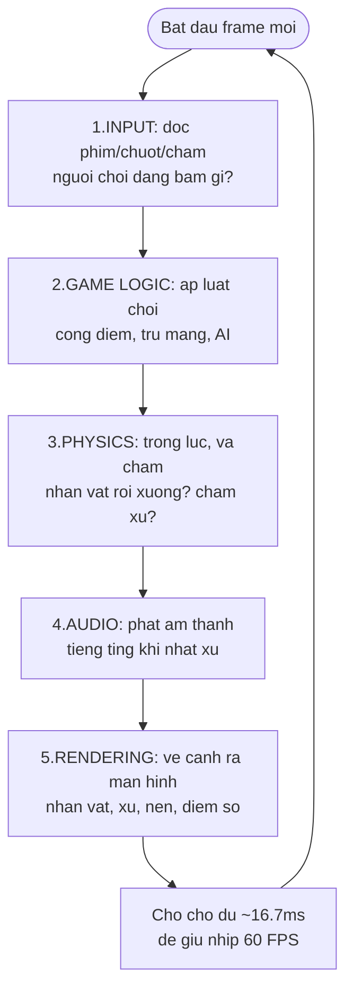
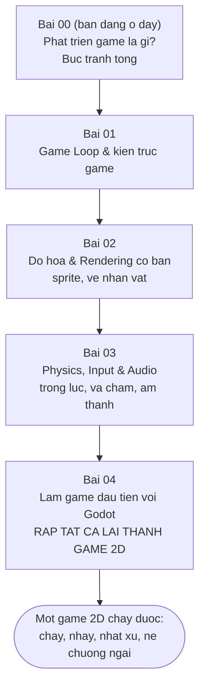

# Phát triển game là gì?

> **Tác giả:** Mr.Rom\
> **Phiên bản:** v1.0.0\
> **Tạo lúc:** 22/06/2026\
> **Cập nhật:** 22/06/2026\
> **Level:** Basic\
> **Tags:** game-dev, game-loop, rendering, physics, game-engine, unity, unreal, godot, 2d, 3d\
> **Yêu cầu trước:** Không có — đây là bài đầu tiên của cụm `game-dev`

> 🎯 *Bài INTRO của cụm. Trước khi cài engine hay viết dòng code đầu tiên, bạn cần một bức tranh tổng: **làm game khác làm app thường ở chỗ nào**, một game gồm những thành phần cốt lõi gì (rendering, physics, input, audio, game logic), năm 2026 nên chọn engine nào (Unity / Unreal / Godot), 2D khác 3D ra sao, trong một studio có những vai trò gì, và người mới nên đi theo con đường nào. Cả bài bám theo một ví dụ xuyên suốt: ta sẽ dựng dần một **game 2D nhỏ** — một nhân vật chạy trái/phải, nhảy, nhặt xu và né chướng ngại — và tới bài cuối của cụm sẽ thật sự ráp nó lại bằng Godot.*

## 🎯 Sau bài này bạn sẽ

- [ ] Giải thích được vì sao game là một **vòng lặp thời gian thực** (real-time loop) — và nó khác app thường (event-driven) ở chỗ vẽ lại liên tục ~60 FPS
- [ ] Kể được **5 thành phần cốt lõi** của một game: rendering, physics, input, audio, game logic — và việc của từng cái
- [ ] So sánh được ba engine lớn 2026 — **Unity** (C#), **Unreal** (C++/Blueprint), **Godot** (GDScript) — và biết khi nào chọn cái nào
- [ ] Phân biệt **2D vs 3D** ở mức bản chất, không chỉ "nhìn phẳng hay nổi"
- [ ] Nêu được các **vai trò trong một team làm game** (gameplay/engine/graphics programmer, designer, artist...)
- [ ] Vẽ được con đường học cho người mới và biết bài này dẫn tới đâu trong cụm

---

## Tình huống — bạn vừa mở một app, và vừa mở một game

Hãy để ý một điều bạn làm mỗi ngày mà chưa từng nghĩ tới.

Mở app ghi chú trên điện thoại: màn hình **đứng yên**. Bạn không gõ, không chạm — nó cứ thế nằm im, không tốn pin cho việc vẽ. App chỉ "thức dậy" khi có **sự kiện**: bạn chạm một nút, gõ một chữ, app xử lý sự kiện đó rồi vẽ lại đúng phần thay đổi, xong lại ngủ. Đây gọi là mô hình **event-driven** (hướng sự kiện) — *không có việc gì xảy ra thì không vẽ lại*.

Giờ mở một game đua xe. Kể cả khi bạn **không bấm gì cả**, chiếc xe vẫn chạy theo quán tính, mây vẫn trôi, đối thủ vẫn vượt lên, đồng hồ vẫn đếm. Màn hình **vẽ lại liên tục** — khoảng **60 lần mỗi giây** — dù tay bạn rời khỏi phím. Game không "ngủ chờ sự kiện"; nó **luôn chạy**.

Khác biệt nghe nhỏ đó lại là cái lằn ranh chia đôi hai thế giới lập trình. Một app thường hỏi *"có ai chạm vào không? Không à, vậy tôi nghỉ."* Một game thì mỗi giây tự hỏi 60 lần: *"thời gian vừa trôi qua một nhịp — thế giới trong game giờ phải trông như thế nào?"* — rồi vẽ ra nhịp đó, rồi lặp lại, mãi mãi cho tới khi bạn thoát.

→ Chính cái **vòng lặp luôn chạy** này là trái tim của mọi game, và là lý do làm game đòi hỏi một lối tư duy riêng. Cả bài này sẽ mở dần ra từ đó: vòng lặp ấy bên trong gồm những gì, cần công cụ (engine) nào để khỏi tự viết lại từ số 0, và một người mới bắt đầu từ đâu.

---

## 1️⃣ Vậy "phát triển game" thực ra là gì?

Quay lại khác biệt trên: app thường ngủ chờ sự kiện, còn game **luôn vẽ lại**. Phát triển game, nói gọn, là **xây một thế giới ảo chạy theo thời gian thực và phản hồi lại người chơi trong từng khoảnh khắc**.

**Định nghĩa kỹ thuật:** *Game development* (phát triển game) là quá trình tạo ra một phần mềm tương tác mô phỏng một thế giới (2D hoặc 3D), trong đó một **vòng lặp game** (*game loop*) chạy liên tục — mỗi vòng đọc input người chơi, cập nhật trạng thái thế giới (vật lý, AI, luật chơi), rồi vẽ kết quả ra màn hình — đủ nhanh để mắt người thấy là **chuyển động mượt** (thường ≥ 30, lý tưởng 60 hình mỗi giây).

🪞 **Ẩn dụ — game như một bộ phim hoạt hình do bạn đạo diễn theo thời gian thực:**
> Phim hoạt hình truyền thống là một xấp tranh vẽ sẵn (frame), lật thật nhanh (24 tranh/giây) nên mắt ta thấy nhân vật cử động. Game cũng là những tranh lật nhanh — nhưng **không vẽ sẵn**. Mỗi tranh được **tính ra ngay tại chỗ, 60 lần mỗi giây**, dựa trên việc bạn đang bấm phím nào. Bạn không xem một bộ phim cố định; bạn vừa là khán giả, vừa là người điều khiển diễn viên chính, và cỗ máy game phải vẽ kịp từng khung hình theo ý bạn.

Vài từ trong định nghĩa cần làm rõ ngay, vì cả cụm xoay quanh chúng:

- **Frame** (khung hình) — một "tấm tranh" được vẽ ra màn hình tại một thời điểm. Game là một chuỗi frame nối tiếp nhau.
- **FPS** (*frames per second* — số khung hình mỗi giây) — bao nhiêu frame được vẽ trong một giây. 60 FPS nghĩa là cứ ~16,7 mili-giây vẽ một frame mới.
- **Real-time** (thời gian thực) — game phải tính-và-vẽ kịp trong thời hạn của một frame; trễ là người chơi thấy giật (lag).

> [!NOTE]
> Vì sao là 60 chứ không phải 1000? Hầu hết màn hình phổ thông làm tươi 60 lần mỗi giây (60 Hz), nên vẽ nhanh hơn 60 FPS thường không thấy mượt thêm. Mắt người bắt đầu thấy "mượt" từ khoảng 24-30 FPS (đúng tốc độ phim chiếu rạp), nhưng game tương tác cần cao hơn để cảm giác điều khiển nhạy. Màn hình gaming đời mới (120/144 Hz) đẩy mục tiêu lên cao hơn nữa.

→ Định nghĩa đã rõ về ý tưởng. Nhưng nói "vòng lặp đọc input, cập nhật, rồi vẽ" thì bên trong mỗi bước đó là cái gì? Đó chính là 5 thành phần cốt lõi — mục tiếp theo.

---

## 2️⃣ Năm thành phần cốt lõi của một game

Mọi game — từ cờ caro tới game thế giới mở khổng lồ — đều dựng trên năm khối chức năng giống nhau. Hiểu năm khối này là hiểu "bộ xương" của mọi game. Ta sẽ gắn từng khối vào **game 2D nhỏ** của cụm: một nhân vật chạy trái/phải, nhảy, nhặt xu, né chướng ngại.

Đây là nhóm khái niệm nền, nên ta đi từng cái một:

- **Input** (đầu vào) — đọc người chơi đang làm gì: bấm phím, di chuột, chạm màn hình, nghiêng tay cầm. Trong game của ta: phím `←`/`→` để chạy, phím `Space` để nhảy.
- **Game logic** (luật chơi / trạng thái game) — bộ não quyết định "chuyện gì xảy ra": nhặt xu thì +10 điểm, chạm chướng ngại thì mất một mạng, hết mạng thì Game Over. Đây là phần **luật riêng** của từng game.
- **Physics** (vật lý) — mô phỏng chuyển động và va chạm: trọng lực kéo nhân vật rơi xuống sau khi nhảy, phát hiện nhân vật **chạm vào** xu hay chướng ngại (*collision detection* — phát hiện va chạm).
- **Audio** (âm thanh) — nhạc nền và hiệu ứng: tiếng "ting" khi nhặt xu, tiếng "bụp" khi đụng chướng ngại.
- **Rendering** (kết xuất / vẽ hình) — biến trạng thái thế giới thành hình ảnh trên màn hình: vẽ nhân vật, xu, nền, điểm số — mỗi frame một lần.

🪞 **Ẩn dụ — một vở kịch sân khấu trực tiếp:**
> Hình dung mỗi frame của game như một **khoảnh khắc trên sân khấu**. **Input** là khán giả hô điều khiển diễn viên chính. **Game logic** là kịch bản và đạo diễn — quyết định ai làm gì, ai được điểm, khi nào hạ màn. **Physics** là trọng lực và quy luật vật lý thật của sân khấu — diễn viên nhảy lên thì phải rơi xuống, hai người đụng nhau thì không xuyên qua nhau. **Audio** là dàn nhạc và hiệu ứng tiếng. **Rendering** là ánh đèn chiếu ra cho khán giả nhìn thấy toàn bộ cảnh. Cả năm phối hợp 60 lần mỗi giây để vở kịch trôi mượt.

Thứ tự năm khối này phối hợp trong một vòng lặp rất quan trọng — và nó cũng là phần trừu tượng nhất của bài, nên ta xem qua sơ đồ. Đọc theo chiều mũi tên, một vòng đi từ đọc input cho tới vẽ ra màn hình rồi quay lại từ đầu:



→ Mấu chốt cần khắc sâu: năm khối này **không chạy một lần rồi thôi** — chúng quay vòng **60 lần mỗi giây**, mãi mãi cho tới khi người chơi thoát. Mỗi vòng là một frame. Một game "lag" thường là vì một trong các khối (hay vẽ quá nặng) tốn quá nhiều thời gian, khiến một vòng không kịp xong trong 16,7 mili-giây. Vòng lặp này quan trọng tới mức cả **bài kế tiếp** của cụm dành riêng cho nó.

Để cảm nhận "vòng lặp quay liên tục" cụ thể ra sao, ta mô phỏng nó ở mức đơn giản nhất bằng một đoạn `bash` — không phải game thật, chỉ để thấy ý tưởng "lặp một số frame rồi dừng". Lưu vào file `loop-demo.sh`:

```bash
#!/usr/bin/env bash
# Mo phong vong lap game o muc don gian nhat: lap lien tuc, in 5 frame roi dung
frame=0
while [ "$frame" -lt 5 ]; do
    # Moi vong lap = 1 frame: doc input -> cap nhat -> ve lai
    echo "Frame $frame: xu ly input -> cap nhat -> ve lai"
    frame=$((frame + 1))
done
echo "Da chay 5 frame, ket thuc."
```

Chạy nó:

```bash
bash loop-demo.sh
```

Kết quả mong đợi (năm dòng frame rồi dòng kết thúc):

```text
Frame 0: xu ly input -> cap nhat -> ve lai
Frame 1: xu ly input -> cap nhat -> ve lai
Frame 2: xu ly input -> cap nhat -> ve lai
Frame 3: xu ly input -> cap nhat -> ve lai
Frame 4: xu ly input -> cap nhat -> ve lai
Da chay 5 frame, ket thuc.
```

Đoạn trên cố tình dừng sau 5 frame cho gọn. Game thật khác đúng một điểm: thay vì `frame < 5`, điều kiện vòng lặp là *"tới khi người chơi thoát"* — nên nó quay hàng triệu frame trong một phiên chơi. Mỗi dòng `echo` ở đây tương ứng với một frame mà game thật sẽ làm năm việc (input → logic → physics → audio → render) thay vì chỉ in một dòng chữ.

---

## 3️⃣ Vì sao cần "engine"? (đừng tự viết lại từ số 0)

Nhìn năm khối ở mục 2, bạn có thể nghĩ: *"vậy tôi tự viết hết là xong?"*. Về lý thuyết thì được — nhưng hãy thấy khối lượng công việc thật.

Để vẽ một nhân vật lên màn hình, bạn phải nói chuyện trực tiếp với card đồ hoạ (GPU) qua những API cấp thấp như **OpenGL**, **Vulkan**, **DirectX** hay **Metal** — hàng trăm dòng code chỉ để hiện **một hình vuông**. Rồi bạn phải tự viết: phát hiện va chạm, trọng lực, đọc tay cầm đủ loại, phát âm thanh, nạp ảnh/model từ ổ cứng, quản lý bộ nhớ... Tự làm hết, bạn tốn hàng tháng trước khi nhân vật **nhúc nhích** được một bước.

🪞 **Ẩn dụ — engine như một căn bếp dựng sẵn:**
> Tự viết game từ số 0 giống như muốn nấu một bữa tối mà phải **tự rèn dao, tự đúc nồi, tự kéo đường điện cho bếp** trước đã. Một *game engine* (động cơ game) là một **căn bếp dựng sẵn** — đã có bếp, nồi, dao, tủ lạnh. Bạn bước vào là nấu được ngay; việc của bạn là **công thức món ăn** (luật chơi, nội dung), không phải đi rèn dao.

**Định nghĩa:** một *game engine* là một bộ phần mềm cung cấp sẵn các khối cốt lõi (rendering, physics, input, audio, quản lý tài nguyên...) cùng công cụ trực quan (trình soạn cảnh, kéo-thả đối tượng), để bạn tập trung làm **nội dung và luật chơi** thay vì xây lại hạ tầng.

Cùng một việc "cho nhân vật rơi do trọng lực và dừng khi chạm đất", hãy đối chiếu hai con đường. Bảng dưới đọc theo từng đầu việc:

| Đầu việc | Tự viết từ số 0 (không engine) | Dùng engine |
|---|---|---|
| Vẽ một hình lên màn hình | Tự gọi OpenGL/Vulkan, hàng trăm dòng | Kéo-thả một *sprite* (hình 2D) vào cảnh |
| Trọng lực + va chạm | Tự viết công thức vật lý, tự dò va chạm | Bật sẵn physics body, gắn collider |
| Đọc phím / tay cầm | Tự xử lý từng nền tảng (Windows/Mac/console) | Một API input chung, map phím trong editor |
| Phát âm thanh | Tự nói chuyện với card âm thanh | Gọi một hàm `play()` |
| Chạy trên nhiều máy | Tự build lại cho từng nền tảng | Đổi mục tiêu build, engine lo phần còn lại |
| Thời gian để nhân vật nhúc nhích | Hàng tuần tới hàng tháng | Vài phút tới vài giờ |

→ Quy luật rút ra: trừ khi bạn đang **học cách máy hoạt động bên dưới** (rất đáng làm một lần, cụm này sẽ chạm tới ở bài rendering/physics), còn lại gần như luôn nên đứng trên vai một engine. Câu hỏi thực tế của người mới do đó không phải "có nên dùng engine không", mà là **"chọn engine nào"** — mục tiếp theo.

---

## 4️⃣ Bức tranh engine 2026: Unity, Unreal, Godot

Năm 2026, ba cái tên thống trị lựa chọn của người mới lẫn studio. Chúng khác nhau ở ngôn ngữ lập trình, thế mạnh đồ hoạ, mô hình chi phí và độ "nặng". Hiểu ba cái này là đủ để chọn đúng điểm xuất phát.

🪞 **Ẩn dụ — ba căn bếp với ba phong cách:**
> - **Unity** = căn bếp gia dụng phổ thông — dụng cụ đủ cả, tài liệu/video dạy nấu ở khắp nơi, hợp cho hầu hết món, đặc biệt là món "vừa và nhỏ" (mobile, indie).
> - **Unreal** = bếp nhà hàng cao cấp — mạnh khủng khiếp cho món "trình bày đẹp lộng lẫy" (đồ hoạ 3D AAA), nhưng đồ nghề nặng và cần tay nghề cao.
> - **Godot** = căn bếp tự lắp, **miễn phí hoàn toàn và mã nguồn mở** — gọn nhẹ, khởi động nhanh, ngày càng đông người dùng, tuyệt cho người mới và game 2D.

Trước khi xem bảng, làm rõ vài thuật ngữ sẽ xuất hiện:

- **C#** — ngôn ngữ lập trình của Unity, khá dễ học, an toàn bộ nhớ.
- **C++** — ngôn ngữ chính của Unreal, mạnh và nhanh nhưng khó hơn nhiều cho người mới.
- **Blueprint** — hệ thống lập trình **kéo-thả bằng các khối nối dây** của Unreal, làm được nhiều thứ mà **không cần gõ code** C++.
- **GDScript** — ngôn ngữ riêng của Godot, cú pháp rất giống Python, sinh ra để học nhanh.
- **AAA** — cách gọi các game "bom tấn" ngân sách khổng lồ (như các game đua xe, bắn súng đồ hoạ cực đẹp trên console).

Để chọn đúng, đây là bảng đối chiếu theo các tiêu chí quan trọng nhất với người mới. Đọc theo hàng:

| Tiêu chí | Unity | Unreal Engine | Godot |
|---|---|---|---|
| Ngôn ngữ chính | C# | C++ và/hoặc Blueprint (kéo-thả) | GDScript (giống Python), có C# |
| Độ dễ cho người mới | Dễ vừa — tài liệu nhiều nhất | Khó hơn — nặng, C++ khó | Dễ nhất — nhẹ, GDScript đơn giản |
| Thế mạnh | 2D & 3D, mobile, indie, đa nền tảng | 3D đỉnh cao, đồ hoạ AAA, điện ảnh | 2D xuất sắc, 3D đang lên nhanh |
| Chi phí | Miễn phí tới một ngưỡng doanh thu, sau đó trả phí | Miễn phí, chia % doanh thu khi game lớn | **Miễn phí 100%, mã nguồn mở (MIT)** — không phí, không chia % |
| Độ "nặng" cài đặt | Trung bình | Nặng (vài chục GB) | Rất nhẹ (vài trăm MB) |
| Cộng đồng / việc làm | Rất lớn, nhiều việc | Lớn, mạnh ở studio AAA | Đang lớn nhanh, nhiều ở indie |
| Hợp khi bạn muốn | Làm game mobile/indie, nhiều tài nguyên học | Làm game 3D đồ hoạ cao, vào studio lớn | Học nền tảng, làm game 2D, ghét ràng buộc giấy phép |

> [!TIP]
> Với **người mới hoàn toàn** muốn hiểu bản chất và làm game 2D, **Godot** là điểm xuất phát rất tốt: cài đặt nhẹ, miễn phí trọn đời không lo phí bản quyền, GDScript dễ như Python, và editor đủ trực quan. Đó chính là lý do cụm này chọn Godot để ráp game 2D ở bài cuối — không phải vì nó "tốt nhất tuyệt đối", mà vì nó **ít rào cản nhất để bắt đầu**.

→ Đừng sa vào "engine nào tốt nhất" — câu hỏi đó không có đáp án chung. Đáp án đúng tuỳ **bạn muốn làm game gì** và **đang ở đâu trên đường học**. Người mới làm 2D: Godot. Làm mobile/indie và muốn nhiều tài liệu: Unity. Mơ làm 3D bom tấn ở studio lớn: Unreal. Quan trọng hơn engine là **làm xong một game nhỏ trọn vẹn** — kỹ năng đó chuyển được sang mọi engine.

---

## 5️⃣ 2D và 3D khác nhau ở đâu (không chỉ là "phẳng hay nổi")

Người mới hay nghĩ "2D là nhìn phẳng, 3D là nhìn nổi". Đúng, nhưng đó là phần ngọn. Khác biệt bản chất nằm ở **không gian toạ độ** và **cách vẽ hình**, và nó quyết định độ khó của cả dự án.

- Trong **game 2D**, mọi thứ sống trong một mặt phẳng hai trục: **X** (ngang) và **Y** (dọc). Hình ảnh thường là **sprite** — những bức ảnh 2D vẽ sẵn (nhân vật, xu, nền) dán lên màn hình. Game 2D của cụm ta là kiểu này: nhân vật trượt trái/phải trên trục X, nhảy lên/rơi xuống trên trục Y.
- Trong **game 3D**, có thêm trục thứ ba: **Z** (chiều sâu). Vật thể là **mesh** — mô hình ba chiều ghép từ vô số tam giác, được phủ **texture** (ảnh bề mặt) và chiếu sáng bằng đèn ảo. Có thêm **camera** (máy quay ảo) di chuyển trong không gian, đổ bóng, phối cảnh xa-gần.

🪞 **Ẩn dụ — sân khấu rối bóng vs sân khấu kịch thật:**
> Game 2D như **múa rối bóng** sau tấm màn — các hình dẹt trượt qua lại trên một mặt phẳng. Game 3D như một **sân khấu kịch thật** — diễn viên có khối, đứng trước/sau nhau, ánh đèn tạo bóng đổ, và bạn (camera) có thể đi vòng quanh để nhìn từ góc khác. Thêm một chiều không gian nghe đơn giản, nhưng nó kéo theo cả tá thứ mới: ánh sáng, bóng đổ, góc máy.

Khác biệt này ảnh hưởng trực tiếp tới độ khó và nhân lực. Bảng dưới đối chiếu theo từng khía cạnh — đọc theo hàng:

| Khía cạnh | Game 2D | Game 3D |
|---|---|---|
| Không gian toạ độ | 2 trục: X (ngang), Y (dọc) | 3 trục: X, Y, Z (thêm chiều sâu) |
| Tài nguyên hình ảnh | Sprite — ảnh 2D vẽ sẵn | Mesh 3D + texture + vật liệu |
| Ánh sáng / bóng đổ | Thường không cần (hoặc đơn giản) | Phức tạp — đèn, bóng, phản chiếu |
| Camera | Thường cố định / cuộn 2 chiều | Di chuyển tự do trong không gian 3 chiều |
| Độ khó tổng thể cho người mới | Thấp hơn — ít khái niệm hơn | Cao hơn — nhiều toán, nhiều nghệ thuật |
| Chi phí làm asset | Rẻ hơn, ít người hơn | Đắt hơn, cần modeler/animator 3D |
| Ví dụ quen thuộc | Game đi cảnh ngang, xếp hình, cổ điển | Game đua xe, bắn súng góc nhìn thứ nhất |

> [!IMPORTANT]
> Lời khuyên cho người mới: **bắt đầu bằng 2D**. Không phải vì 2D "kém sang", mà vì nó cắt bỏ hàng loạt khái niệm khó (camera 3D, ánh sáng, mô hình hoá) để bạn tập trung vào thứ cốt lõi nhất — **game loop, input, va chạm, luật chơi**. Mọi kỹ năng đó chuyển thẳng sang 3D sau này. Đi 3D ngay từ đầu là cách nhanh nhất để bỏ cuộc.

→ Đây cũng là lý do game xuyên suốt của cụm là **2D**: một nhân vật chạy/nhảy/nhặt xu trên mặt phẳng X-Y đủ để chạm vào cả năm thành phần cốt lõi, mà không bắt người mới gánh thêm gánh nặng của thế giới ba chiều.

---

## 6️⃣ Ai làm gì trong một team làm game?

Một game nhỏ có thể do **một người** làm hết (gọi là *solo developer*). Nhưng một game cỡ studio cần nhiều vai trò phối hợp. Biết các vai trò này giúp bạn hình dung mình hợp với phần nào, và hiểu khi đọc tin tuyển dụng người ta tìm gì.

Các vai trò chia làm hai nhóm lớn: **người viết code** (programmer) và **người làm nội dung/thiết kế** (designer, artist...). Đây là nhóm khái niệm nghề nghiệp, nên ta điểm qua từng vai:

- **Gameplay programmer** — lập trình **luật chơi** và cảm giác điều khiển: nhân vật nhảy cao bao nhiêu, nhặt xu cộng mấy điểm, quái di chuyển ra sao. Đây thường là cửa ngõ dễ vào nhất cho người mới.
- **Engine / systems programmer** — viết và tối ưu các **hệ thống nền** (rendering, physics, networking, bộ nhớ). Cần nền tảng khoa học máy tính sâu, thường dùng C++.
- **Graphics programmer** — chuyên về **vẽ hình và hiệu ứng**: shader (đoạn code chạy trên GPU), ánh sáng, hiệu ứng hạt. Giao thoa giữa lập trình và toán/đồ hoạ.
- **Game designer** — thiết kế **trải nghiệm và luật chơi** trên giấy/công cụ: màn chơi, độ khó, cân bằng. Không nhất thiết viết code, nhưng phải hiểu game vận hành.
- **Artist** (2D/3D) — tạo **hình ảnh**: vẽ sprite, dựng mesh 3D, làm animation, thiết kế giao diện.
- **Sound designer / composer** — làm **âm thanh và nhạc**: hiệu ứng, nhạc nền, lồng tiếng.
- **QA / tester** — **chơi thử để tìm lỗi** (bug), kiểm tra cân bằng, đảm bảo game chạy ổn trước khi phát hành.

Để thấy bức tranh tổng và biết vai nào "chạm" vào thành phần cốt lõi nào, đối chiếu qua bảng — đọc theo hàng:

| Vai trò | Việc chính | Chạm vào thành phần nào | Cần code nhiều? |
|---|---|---|---|
| Gameplay programmer | Luật chơi, điều khiển, cảm giác chơi | Game logic, input | Có |
| Engine / systems programmer | Hệ thống nền, tối ưu hiệu năng | Rendering, physics, bộ nhớ | Có (sâu, C++) |
| Graphics programmer | Shader, ánh sáng, hiệu ứng | Rendering | Có (nặng toán/GPU) |
| Game designer | Thiết kế màn chơi, độ khó, cân bằng | Game logic (ở mức thiết kế) | Ít / không bắt buộc |
| Artist 2D/3D | Sprite, mesh, animation, UI | Rendering (đầu vào hình ảnh) | Không |
| Sound designer | Hiệu ứng âm thanh, nhạc nền | Audio | Không |
| QA / tester | Tìm lỗi, kiểm cân bằng | Toàn bộ (góc người chơi) | Ít |

> [!NOTE]
> Với người tự học và làm game nhỏ, bạn sẽ **đóng nhiều vai cùng lúc** — vừa code gameplay, vừa kiếm sprite miễn phí, vừa tự test. Điều đó hoàn toàn bình thường và là cách học nhanh nhất: tự tay chạm vào cả năm thành phần. Việc chuyên sâu một vai (như graphics programmer) là chuyện về sau, khi bạn vào team lớn.

→ Nếu bạn đang phân vân "mình hợp vai nào", với người mới đến từ lập trình, **gameplay programmer** là điểm vào tự nhiên nhất — và đó cũng đúng là góc nhìn mà cả cụm này dạy bạn: viết luật chơi, xử lý input, dựng game loop.

---

## 7️⃣ Con đường học cho người mới (và bài này dẫn tới đâu)

Đến đây bạn đã có bức tranh tổng. Vậy một người mới nên đi theo trình tự nào để không lạc? Nguyên tắc xuyên suốt: **học vừa đủ để làm xong một game nhỏ trọn vẹn, rồi mới mở rộng** — đừng cố hiểu hết lý thuyết trước khi chạm tay.

Trình tự hợp lý cho người mới:

1. **Hiểu game loop** — nắm cái vòng lặp đọc input → cập nhật → vẽ, vì mọi thứ khác gắn vào nó.
2. **Hiểu rendering cơ bản** — sprite, toạ độ, vẽ hình lên màn hình mỗi frame.
3. **Hiểu input, physics, audio** — đọc phím, trọng lực và va chạm, phát âm thanh.
4. **Ráp lại bằng một engine** — dùng Godot dựng game 2D thật: nhân vật chạy, nhảy, nhặt xu, né chướng ngại.
5. **Mở rộng** — màn chơi, menu, lưu điểm; rồi dần tới 3D, networking, tối ưu... khi đã vững.

Đây chính xác là lộ trình của cụm `game-dev` này. Sơ đồ dưới cho thấy bài bạn đang đọc nằm ở đâu và năm bài nối nhau ra sao. Đọc từ trên xuống theo mũi tên:



→ Mấu chốt: bốn bài đầu **mỗi bài lắp một mảnh** vào game 2D của ta — bài 01 dựng bộ xương (game loop), bài 02 vẽ nhân vật ra (rendering), bài 03 cho nhân vật cử động và va chạm (input/physics/audio) — để **bài 04 ráp tất cả lại** thành một game chạy được bằng Godot. Bạn không học rời rạc; bạn xây dần một thứ chơi được. Đó là cách học game hiệu quả nhất: luôn có một sản phẩm cụ thể trong tầm tay.

---

## 💡 Cạm bẫy thường gặp & Best practice

### ❌ Cạm bẫy: nghĩ "làm game giống làm app, chỉ thêm hình đẹp"

- **Triệu chứng**: bê tư duy app event-driven (chỉ xử lý khi có sự kiện) sang game, rồi bối rối vì sao "không bấm gì mà mọi thứ vẫn phải chạy".
- **Nguyên nhân**: chưa nắm bản chất **vòng lặp thời gian thực** — game tự cập nhật và vẽ lại ~60 lần/giây bất kể có input hay không.
- **Cách tránh**: luôn nghĩ theo frame. Mỗi frame tự hỏi: *"thời gian vừa trôi một nhịp, thế giới giờ phải trông thế nào?"* — rồi đọc input, cập nhật, vẽ. Bài 01 của cụm dựng chắc tư duy này.

### ❌ Cạm bẫy: chọn engine sai trước khi biết mình muốn làm game gì

- **Triệu chứng**: nhảy thẳng vào Unreal vì "đồ hoạ đẹp nhất" trong khi chỉ muốn làm game 2D nhỏ, rồi ngợp vì C++ và editor nặng nề.
- **Nguyên nhân**: chọn theo "engine mạnh nhất" thay vì "engine hợp việc của mình và hợp trình độ hiện tại".
- **Cách tránh**: người mới làm 2D → Godot; làm mobile/indie cần nhiều tài liệu → Unity; mơ 3D bom tấn ở studio → Unreal. Kỹ năng làm xong một game nhỏ quan trọng hơn engine, và nó chuyển được sang mọi engine.

### ✅ Best practice: bắt đầu nhỏ và 2D, làm cho XONG một game

- **Vì sao**: một game 2D tí hon **hoàn chỉnh** dạy bạn nhiều hơn một game 3D khổng lồ **bỏ dở**. Làm xong dạy bạn cả vòng đời: ý tưởng → dựng → test → đóng gói.
- **Cách áp dụng**: chọn phạm vi cực nhỏ (đúng như game của cụm: chạy, nhảy, nhặt xu, né chướng ngại), làm cho nó chạy được từ đầu tới Game Over, rồi mới thêm thắt. Cắt tham vọng trước, mở rộng sau.

### ✅ Best practice: học bằng cách chạm tay vào cả năm thành phần

- **Vì sao**: lý thuyết về rendering/physics/input chỉ "ngấm" khi bạn tự tay cho một nhân vật nhảy lên và rơi xuống. Đọc suông rất nhanh quên.
- **Cách áp dụng**: với mỗi khái niệm trong cụm, mở engine lên thử ngay — đổi một con số (trọng lực, lực nhảy), chạy, xem khác gì. Vòng lặp "đọc → thử → thấy" là cách học game nhanh nhất.

---

## 🧠 Tự kiểm tra (Self-check)

**Q1.** Vì sao game được gọi là "vòng lặp thời gian thực", và nó khác app thường (event-driven) ở điểm cốt lõi nào?

<details>
<summary>💡 Xem giải thích</summary>

App thường theo mô hình **event-driven**: chỉ xử lý và vẽ lại khi có **sự kiện** (chạm, gõ); không có gì xảy ra thì màn hình đứng yên, không tốn công vẽ.

Game theo mô hình **vòng lặp thời gian thực**: một **game loop** chạy liên tục, mỗi vòng (mỗi frame) đọc input → cập nhật trạng thái thế giới → vẽ lại — khoảng **60 lần mỗi giây** — **bất kể** người chơi có bấm gì hay không. Đó là lý do "không bấm gì mà mọi thứ trong game vẫn chuyển động". Điểm cốt lõi khác biệt: app *ngủ chờ sự kiện*, game *luôn vẽ lại theo nhịp thời gian*.

</details>

**Q2.** Kể năm thành phần cốt lõi của một game và gắn mỗi cái vào game 2D "chạy, nhảy, nhặt xu, né chướng ngại".

<details>
<summary>💡 Xem giải thích</summary>

- **Input** — đọc phím `←`/`→` để chạy, `Space` để nhảy.
- **Game logic** — luật chơi: nhặt xu +điểm, chạm chướng ngại mất mạng, hết mạng thì Game Over.
- **Physics** — trọng lực kéo nhân vật rơi sau khi nhảy; phát hiện va chạm (collision) với xu và chướng ngại.
- **Audio** — tiếng "ting" khi nhặt xu, tiếng đụng khi chạm chướng ngại, nhạc nền.
- **Rendering** — vẽ nhân vật, xu, nền, điểm số ra màn hình mỗi frame.

Cả năm quay vòng ~60 lần/giây trong game loop.

</details>

**Q3.** Vì sao gần như luôn nên dùng một game engine thay vì tự viết mọi thứ từ số 0?

<details>
<summary>💡 Xem giải thích</summary>

Vì engine cung cấp sẵn các khối cốt lõi (rendering, physics, input, audio, quản lý tài nguyên) cùng công cụ trực quan. Tự viết từ số 0 buộc bạn nói chuyện trực tiếp với GPU qua API cấp thấp (OpenGL/Vulkan/DirectX/Metal) — hàng trăm dòng chỉ để hiện một hình — rồi tự làm va chạm, trọng lực, đọc thiết bị, âm thanh... tốn hàng tuần tới hàng tháng trước khi nhân vật nhúc nhích. Dùng engine, bạn tập trung vào **nội dung và luật chơi**. Ngoại lệ: khi mục tiêu là **học cách máy hoạt động bên dưới** thì tự viết một lần rất đáng.

</details>

**Q4.** Một người mới hoàn toàn, muốn làm một game 2D nhỏ và ghét lo chuyện phí bản quyền. Bạn khuyên engine nào, vì sao?

<details>
<summary>💡 Xem giải thích</summary>

Khuyên **Godot**: miễn phí 100%, mã nguồn mở (giấy phép MIT) nên không có phí hay chia % doanh thu; cài đặt rất nhẹ; ngôn ngữ **GDScript** cú pháp giống Python nên dễ học; thế mạnh đặc biệt ở **2D**. Đúng hồ sơ "người mới + 2D + ngại ràng buộc giấy phép". Unity hợp khi cần thật nhiều tài liệu/mobile; Unreal hợp khi mơ 3D bom tấn ở studio lớn.

</details>

**Q5.** 2D khác 3D ở bản chất nào (không chỉ "phẳng hay nổi"), và vì sao người mới nên bắt đầu bằng 2D?

<details>
<summary>💡 Xem giải thích</summary>

Bản chất nằm ở **không gian toạ độ và cách vẽ**: 2D dùng 2 trục X-Y với **sprite** (ảnh 2D vẽ sẵn); 3D thêm trục **Z** (chiều sâu), dùng **mesh** 3D + texture, kèm camera di chuyển trong không gian, ánh sáng và bóng đổ.

Người mới nên bắt đầu 2D vì nó cắt bỏ hàng loạt khái niệm khó (camera 3D, ánh sáng, mô hình hoá) để tập trung vào cốt lõi: **game loop, input, va chạm, luật chơi**. Các kỹ năng đó chuyển thẳng sang 3D về sau. Lao vào 3D ngay từ đầu là cách nhanh nhất để ngợp và bỏ cuộc.

</details>

**Q6.** Với người mới đến từ lập trình, vai trò nào trong team thường là cửa vào tự nhiên nhất, và nó chạm vào thành phần cốt lõi nào?

<details>
<summary>💡 Xem giải thích</summary>

**Gameplay programmer** — lập trình luật chơi và cảm giác điều khiển (nhân vật nhảy cao bao nhiêu, nhặt xu cộng mấy điểm, quái di chuyển ra sao). Nó chạm chủ yếu vào **game logic** và **input**. Đây là cửa vào dễ nhất cho người biết code, và cũng là góc nhìn cả cụm này dạy. Các vai sâu hơn như engine/systems programmer (C++, rendering/physics) hay graphics programmer (shader, GPU) đòi nền tảng nặng hơn, để dành về sau.

</details>

---

## ⚡ Tra cứu nhanh (Cheatsheet)

### Game vs App thường

```text
App thuong  : EVENT-DRIVEN  -> chi ve lai khi co su kien (cham, go); khong thi nghi
Game        : REAL-TIME LOOP -> ve lai ~60 lan/giay du co bam hay khong
```

### Năm thành phần cốt lõi (mỗi frame)

```text
1. INPUT      -> doc nguoi choi: phim, chuot, cham, tay cam
2. GAME LOGIC -> luat choi: cong diem, tru mang, AI, Game Over
3. PHYSICS    -> trong luc + va cham (collision detection)
4. AUDIO      -> nhac nen + hieu ung am thanh
5. RENDERING  -> ve canh ra man hinh moi frame
-> Cả 5 quay vong ~60 lan/giay trong GAME LOOP
```

### Chọn engine 2026 — chọn nhanh

```text
Nguoi moi + 2D + ghet phi ban quyen   -> GODOT   (mien phi, ma nguon mo, GDScript)
Mobile/indie + can nhieu tai lieu      -> UNITY   (C#, cong dong lon nhat)
3D bom tan + studio lon                -> UNREAL  (C++/Blueprint, do hoa AAA)
```

### 2D vs 3D — chọn nhanh

```text
2D: 2 truc X-Y, sprite, it khai niem  -> NEN BAT DAU O DAY
3D: them truc Z, mesh + anh sang/bong -> kho hon, de sau
```

### Vai trò trong team — ai chạm thành phần nào

| Vai trò | Chạm vào |
|---|---|
| Gameplay programmer | Game logic, input |
| Engine/systems programmer | Rendering, physics, bộ nhớ |
| Graphics programmer | Rendering (shader, GPU) |
| Game designer | Game logic (thiết kế) |
| Artist | Rendering (sprite/mesh) |
| Sound designer | Audio |

---

## 📚 Từ Điển Thuật Ngữ (Glossary)

| EN | VN | Giải thích |
|---|---|---|
| Game development | Phát triển game | Tạo phần mềm tương tác mô phỏng thế giới chạy theo thời gian thực |
| Game loop | Vòng lặp game | Vòng chạy liên tục: đọc input → cập nhật → vẽ, mỗi vòng một frame |
| Real-time | Thời gian thực | Phải tính-và-vẽ kịp trong thời hạn một frame, trễ là thấy giật |
| Event-driven | Hướng sự kiện | Mô hình app thường: chỉ xử lý/vẽ lại khi có sự kiện |
| Frame | Khung hình | Một "tấm tranh" được vẽ ra màn hình tại một thời điểm |
| FPS (frames per second) | Số khung hình mỗi giây | Bao nhiêu frame được vẽ trong một giây; mục tiêu phổ biến 60 |
| Rendering | Kết xuất / vẽ hình | Biến trạng thái thế giới thành hình ảnh trên màn hình |
| Physics | Vật lý | Mô phỏng chuyển động, trọng lực, va chạm |
| Collision detection | Phát hiện va chạm | Xác định khi hai vật thể chạm nhau (nhân vật chạm xu) |
| Input | Đầu vào | Đọc hành động người chơi: phím, chuột, chạm, tay cầm |
| Audio | Âm thanh | Nhạc nền và hiệu ứng tiếng trong game |
| Game logic | Luật chơi | Bộ não quyết định chuyện gì xảy ra: điểm, mạng, thắng/thua |
| Game engine | Động cơ game | Bộ phần mềm cung cấp sẵn các khối cốt lõi + công cụ làm game |
| Sprite | Sprite | Một bức ảnh 2D vẽ sẵn (nhân vật, xu, nền) dán lên màn hình |
| Mesh | Lưới đa giác | Mô hình 3D ghép từ các tam giác, dùng trong game 3D |
| Texture | Ảnh bề mặt | Ảnh phủ lên mesh để tạo màu sắc/chi tiết bề mặt |
| Camera | Máy quay ảo | Góc nhìn vào thế giới game, đặc biệt quan trọng trong 3D |
| Unity | Unity | Engine phổ thông, dùng C#, mạnh ở mobile/indie và đa nền tảng |
| Unreal Engine | Unreal Engine | Engine mạnh ở 3D đồ hoạ cao, dùng C++ và Blueprint |
| Godot | Godot | Engine miễn phí, mã nguồn mở, dùng GDScript, mạnh ở 2D |
| C# | C# | Ngôn ngữ chính của Unity, dễ học, an toàn bộ nhớ |
| C++ | C++ | Ngôn ngữ chính của Unreal, mạnh và nhanh nhưng khó hơn |
| Blueprint | Blueprint | Hệ thống lập trình kéo-thả bằng khối nối dây của Unreal |
| GDScript | GDScript | Ngôn ngữ riêng của Godot, cú pháp giống Python, dễ học |
| AAA | AAA | Game "bom tấn" ngân sách khổng lồ, đồ hoạ cực cao |
| Shader | Shader | Đoạn code chạy trên GPU để vẽ hình và tạo hiệu ứng |
| OpenGL / Vulkan / DirectX / Metal | API đồ hoạ | Giao diện cấp thấp để ra lệnh cho card đồ hoạ (GPU) vẽ hình |
| Solo developer | Lập trình viên đơn độc | Một người làm hết mọi vai của một game nhỏ |

---

## 🔗 Liên kết & Tài nguyên

➡️ **Bài tiếp theo:** [Game Loop & kiến trúc game](01_game-loop-and-architecture.md)\
↑ **Về cụm:** [game-dev — README cụm](../../README.md)

### 🧭 Định hướng lộ trình học

- [Game Loop & kiến trúc game](01_game-loop-and-architecture.md) — bài kế: đào sâu cái vòng lặp đọc input → cập nhật → vẽ và cách tổ chức code game
- [Đồ hoạ & Rendering cơ bản](02_graphics-and-rendering-basics.md) — sprite, toạ độ, vẽ nhân vật ra màn hình mỗi frame
- [Làm game đầu tiên với Godot](04_building-a-game-with-an-engine.md) — đích đến của cụm: ráp tất cả thành game 2D chạy được

### 🧩 Các chủ đề có thể bạn quan tâm

- [Physics, Input & Audio](03_physics-input-and-audio.md) — cho nhân vật cử động, va chạm và phát âm thanh
- [Làm game đầu tiên với Godot](04_building-a-game-with-an-engine.md) — dùng engine miễn phí Godot dựng game 2D đầu tay

### 🌐 Tài nguyên tham khảo khác

- [Godot Engine — trang chủ](https://godotengine.org/) — engine miễn phí, mã nguồn mở dùng ở bài cuối của cụm
- [Godot Docs — Your first 2D game](https://docs.godotengine.org/en/stable/getting_started/first_2d_game/index.html) — hướng dẫn chính thức làm game 2D đầu tiên
- [Unity Learn](https://learn.unity.com/) — kho học chính thức của Unity, nhiều khoá cho người mới
- [Unreal Engine — Learning](https://dev.epicgames.com/community/unreal-engine/learning) — tài nguyên học chính thức của Unreal
- [Game Programming Patterns (Robert Nystrom, đọc free online)](https://gameprogrammingpatterns.com/) — sách kinh điển về kiến trúc code game, có chương riêng về game loop

---

> 🎯 *Sau bài này bạn đã có bức tranh tổng về làm game: game là vòng lặp thời gian thực vẽ lại ~60 FPS (khác app event-driven), năm thành phần cốt lõi (input, game logic, physics, audio, rendering), vì sao cần engine, ba lựa chọn 2026 (Unity/Unreal/Godot), 2D vs 3D, các vai trò trong team, và lộ trình học. Bài kế tiếp mổ xẻ trái tim của mọi game — **game loop** — và cách tổ chức code một game cho gọn gàng, để từ đó ta bắt đầu dựng game 2D xuyên suốt cụm.*

---

## 📌 Nhật ký thay đổi (Changelog)

- **v1.0.0 (22/06/2026)** — Bản đầu tiên. Cụm `game-dev/` lesson 0/5 (bài INTRO). Cover: game là vòng lặp thời gian thực vẽ lại ~60 FPS đối chiếu app event-driven + năm thành phần cốt lõi (input, game logic, physics, audio, rendering) gắn vào game 2D xuyên suốt (chạy/nhảy/nhặt xu/né chướng ngại) + vì sao cần game engine + bảng so sánh Unity/Unreal/Godot 2026 và khi nào chọn cái nào + phân biệt 2D vs 3D (toạ độ X-Y vs X-Y-Z, sprite vs mesh) + các vai trò trong team (gameplay/engine/graphics programmer, designer, artist, sound, QA) + con đường học cho người mới. Kèm 2 sơ đồ mermaid (vòng lặp game năm thành phần, lộ trình 5 bài của cụm) và 1 demo bash mô phỏng game loop chạy đúng (bash -n verified).
