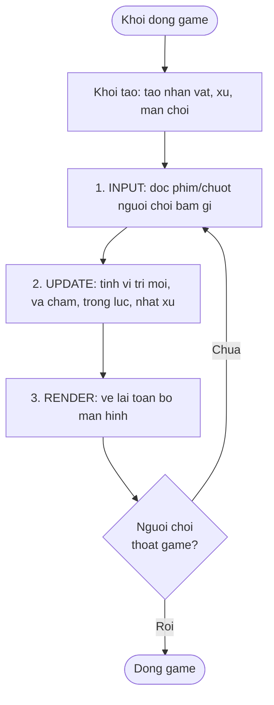

# Game Loop & kiến trúc game

> **Tác giả:** Mr.Rom\
> **Phiên bản:** v1.0.0\
> **Tạo lúc:** 22/06/2026\
> **Cập nhật:** 22/06/2026\
> **Level:** Basic\
> **Tags:** game-dev, game-loop, delta-time, fixed-timestep, fps, ecs, godot, unity, architecture\
> **Yêu cầu trước:** [Phát triển game là gì?](00_what-is-game-development.md)

> 🎯 *Bài trước bạn đã biết "phát triển game là gì" và một engine làm những việc gì. Bài này mở nắp ra xem **trái tim** của mọi game: cái vòng lặp chạy mãi không nghỉ — input → update → render — và lý do vì sao mọi chuyển động phải nhân với **delta time** thì game mới chạy giống nhau trên máy mạnh lẫn máy yếu. Xuyên suốt cụm này ta dựng một game 2D nhỏ: một nhân vật chạy trái/phải, nhảy, nhặt xu, né chướng ngại — và bài hôm nay là lúc ta hiểu "khung xương" giữ cho nhân vật đó sống và chuyển động mượt.*

## 🎯 Sau bài này bạn sẽ

- [ ] Giải thích được **game loop** = vòng lặp `input → update → render` chạy lặp mãi, và vì sao game cần nó thay vì code "chạy một lần rồi xong"
- [ ] Hiểu **delta time (dt)** là gì và vì sao **bắt buộc nhân chuyển động với dt** để game độc lập frame rate
- [ ] Phân biệt **fixed timestep** vs **variable timestep**, và biết vì sao **physics nên dùng fixed**
- [ ] Nắm khái niệm **frame rate (FPS)** và **vsync** ở mức tổng quan
- [ ] So sánh hai cách tổ chức đối tượng game: **scene tree / node** (Godot) và **GameObject + Component** (Unity)
- [ ] Hiểu **Entity-Component-System (ECS)** là gì và vì sao game lớn hay dùng nó

---

## Tình huống — nhân vật chạy nhanh gấp đôi trên máy của bạn

Hình dung bạn vừa viết xong đoạn code đầu tiên cho nhân vật trong game 2D: nhấn phím phải thì nhân vật trượt sang phải. Code đơn giản: *"mỗi vòng lặp, cộng vị trí thêm 5 pixel"*. Trên laptop của bạn — màn hình 60 Hz, game chạy 60 vòng/giây — nhân vật đi đúng tốc độ bạn mong muốn.

Rồi bạn gửi game cho một người bạn. Máy người đó mạnh hơn, màn hình 144 Hz, game chạy 144 vòng/giây. Kết quả: nhân vật **lao đi nhanh gấp hơn hai lần**, vọt khỏi màn hình trước khi kịp né chướng ngại. Một người bạn khác máy yếu, chạy 30 vòng/giây — nhân vật **bò chậm như rùa**.

Cùng một dòng code, ba máy ba tốc độ khác nhau. Đây không phải bug ngẫu nhiên — đó là hậu quả của việc **chưa hiểu game loop và delta time**. Một loạt câu hỏi hiện ra, và chính là bài hôm nay:

- Cái "vòng lặp chạy mãi" đó là gì, vì sao game phải có nó? (→ game loop)
- Làm sao để nhân vật đi **cùng một tốc độ** trên mọi máy bất kể nhanh chậm? (→ delta time)
- Phần va chạm, trọng lực (physics) có nên chạy chung nhịp với phần vẽ không? (→ fixed vs variable timestep)
- Khi game lớn dần với hàng trăm xu, chướng ngại, kẻ địch — tổ chức tất cả ra sao cho không loạn? (→ scene tree / GameObject / ECS)

→ Ta bắt đầu từ viên gạch nền: cái vòng lặp giữ cho game "sống".

---

## 1️⃣ Game loop là gì, vì sao game cần nó?

Một chương trình bình thường (vd script tính tiền, công cụ đổi tên file) chạy theo kiểu: bắt đầu → làm vài việc → in kết quả → **kết thúc**. Nó chạy **một lần** rồi thoát.

Game thì khác hẳn. Game phải **liên tục** lắng nghe bạn bấm phím, cập nhật vị trí nhân vật, vẽ lại màn hình — nhiều chục lần mỗi giây, **không ngừng** cho tới khi bạn tắt game. Nếu game chỉ "chạy một lần rồi thoát", bạn sẽ thấy đúng **một khung hình tĩnh** rồi cửa sổ đóng lại.

Chính vì thế mọi game đều có một thứ gọi là **game loop** (vòng lặp game): một vòng lặp `while` chạy mãi, mỗi vòng làm đúng ba việc theo thứ tự — **đọc input, cập nhật trạng thái, vẽ màn hình** — rồi quay lại từ đầu.

🪞 **Ẩn dụ — người quay phim hoạt hình lật giấy:** Hình dung một hoạ sĩ làm phim hoạt hình kiểu cũ. Anh ta lặp đi lặp lại đúng ba việc: (1) nhìn xem đạo diễn ra hiệu gì (input), (2) tính xem nhân vật giờ phải ở tư thế nào (update), (3) vẽ tờ giấy mới đúng tư thế đó (render), rồi lật sang tờ tiếp theo. Lật đủ nhanh — 60 tờ mỗi giây — mắt người xem thấy nhân vật **chuyển động liên tục**. Game loop chính là người hoạ sĩ đó, chỉ khác là nó lật giấy hàng chục lần mỗi giây, mãi mãi.

Ba việc trong mỗi vòng lặp, hiểu cho rõ từng cái:

- **Input** (đầu vào) — đọc xem người chơi đang bấm/chạm/click gì. Trong game ví dụ: phím trái/phải để di chuyển, phím cách (space) để nhảy.
- **Update** (cập nhật) — tính lại **trạng thái game**: vị trí mới của nhân vật, có va vào chướng ngại không, có nhặt được xu không, trọng lực kéo xuống bao nhiêu.
- **Render** (vẽ) — dựa trên trạng thái vừa tính, **vẽ** mọi thứ lên màn hình: nhân vật ở vị trí mới, xu còn lại, điểm số.

Đây là phần trừu tượng nhất của cả bài, nên ta xem nó qua sơ đồ. Đọc vòng tròn theo chiều mũi tên — chú ý nó **không có điểm kết thúc**, chỉ quay lại đầu cho tới khi người chơi thoát game:



→ Mấu chốt từ sơ đồ: ba bước **luôn theo đúng thứ tự** input → update → render, và vòng lặp **quay lại đầu** thay vì kết thúc. Một lượt đi qua đủ ba bước gọi là một **frame** (khung hình). Game chạy "60 FPS" nghĩa là vòng lặp này quay đủ 60 lần mỗi giây. Giờ ta viết thử nó bằng code thật.

---

## 2️⃣ Viết một game loop tối giản bằng JavaScript

Để thấy game loop chạy thật, ta viết một phiên bản tối giản bằng **Node.js** (chạy được ngay, không cần engine hay đồ hoạ). Thay vì vẽ lên màn hình, ta sẽ in vị trí nhân vật ra console — đủ để thấy nó **chuyển động qua từng frame**.

Tình huống: nhân vật bắt đầu ở vị trí `x = 0`, có **vận tốc** `vx = 100` (đơn vị: pixel **mỗi giây**). Mỗi frame ta cập nhật vị trí rồi in ra. Lưu vào file `game-loop-demo.js`:

```javascript
// game-loop-demo.js — chạy bằng: node game-loop-demo.js

// Trạng thái game: nhân vật ở vị trí x, di chuyển sang phải 100 px/giây
const player = { x: 0, vx: 100 };   // vx = vận tốc (pixel mỗi GIÂY)

let lastTime = Date.now();          // mốc thời gian frame trước (millisecond)
let frame = 0;

const timer = setInterval(() => {
  const now = Date.now();
  const dt = (now - lastTime) / 1000;  // delta time, đổi ra GIÂY
  lastTime = now;

  // UPDATE: vị trí mới = vị trí cũ + vận tốc * dt
  player.x += player.vx * dt;

  // RENDER (ở đây chỉ in ra console thay cho vẽ màn hình)
  console.log(`frame ${frame}: dt=${dt.toFixed(3)}s, x=${player.x.toFixed(1)}`);

  frame++;
  if (frame >= 5) clearInterval(timer);
}, 200);  // ~5 frame mỗi giây cho dễ đọc
```

Chạy file và quan sát:

```bash
node game-loop-demo.js
```

Kết quả mong đợi (con số `dt` xê dịch chút ít tuỳ máy, nhưng `x` luôn tăng đều về phía ~100):

```text
frame 0: dt=0.201s, x=20.1
frame 1: dt=0.202s, x=40.3
frame 2: dt=0.202s, x=60.5
frame 3: dt=0.200s, x=80.5
frame 4: dt=0.201s, x=100.6
```

Đọc kỹ output này — nó hé lộ điều quan trọng nhất của bài:

- Cột `dt` cho biết **mỗi frame cách frame trước bao nhiêu giây** (ở đây ~0.2s vì ta đặt `setInterval` 200ms).
- Cột `x` tăng đều ~20 mỗi frame: vì `vx * dt = 100 * 0.2 = 20`.
- Sau 5 frame (≈ 1 giây), nhân vật đi được ~100 px — **đúng bằng vận tốc 100 px/giây** ta khai báo.

→ Điểm thần kỳ: dù máy chạy nhanh (frame dày, `dt` nhỏ) hay chậm (frame thưa, `dt` lớn), sau **đúng 1 giây thực** nhân vật vẫn đi được ~100 px. Đó là nhờ dòng `player.x += player.vx * dt`. Vì sao phép nhân với `dt` lại quan trọng đến vậy? Đây là phần cốt lõi, ta mổ xẻ ngay.

### Vì sao thứ tự ba bước không được đảo

Có một chi tiết dễ bị xem nhẹ: input → update → render **phải đúng thứ tự đó**. Lý do rất đời thường — bạn không thể chụp ảnh một cảnh trước khi cảnh đó được dàn dựng. Trong game ví dụ, nếu người chơi bấm phím nhảy ngay frame này:

| Thứ tự | Việc xảy ra trong frame |
|---|---|
| 1. Input | Ghi nhận "người chơi đang bấm phím nhảy" |
| 2. Update | Dựa trên input đó, đặt nhân vật vào trạng thái "đang bật lên", tính vị trí mới cao hơn |
| 3. Render | Vẽ nhân vật ở vị trí cao mới — người chơi thấy nó nhảy |

Nếu đảo thành render → update, màn hình sẽ vẽ vị trí **cũ** (chưa cập nhật cú nhảy), trễ một frame so với thao tác — game thấy "ì", phản hồi chậm. Đảo input xuống cuối thì cú bấm phím của frame này phải đợi tận frame sau mới có tác dụng. Vì thế thứ tự là **luật bất di bất dịch** của mọi game loop.

---

## 3️⃣ Delta time — vì sao PHẢI nhân chuyển động với dt

Đây là khái niệm mà **mọi người mới làm game đều vấp**, và là nguyên nhân của tình huống "nhân vật chạy nhanh gấp đôi" ở đầu bài. Hiểu chắc phần này là hiểu được 80% lý do game loop tồn tại.

**Delta time** (viết tắt **`dt`**, nghĩa "khoảng chênh thời gian") — *là khoảng thời gian, tính bằng giây, đã trôi qua kể từ frame trước đến frame hiện tại.* Nếu game chạy 60 FPS, mỗi frame cách nhau ~1/60 ≈ 0.0167 giây, nên `dt ≈ 0.0167`. Nếu game chạy 30 FPS, `dt ≈ 0.033`.

🪞 **Ẩn dụ — tính quãng đường đi xe:** Bạn lái xe 60 km/h. Hỏi đi được bao xa? Không trả lời được, vì còn thiếu **thời gian**. Đi 60 km/h trong **2 giờ** = 120 km; trong **0.5 giờ** = 30 km. Công thức quen thuộc: **quãng đường = vận tốc × thời gian**. Trong game cũng y hệt: vị trí mới = vị trí cũ + **vận tốc × dt**. Vận tốc là "km/h", `dt` là "số giờ" của frame này. Bỏ `dt` đi cũng như nói "đi 60 km/h thì được 60 km" mà không quan tâm đi bao lâu — vô nghĩa.

### Cái sai khi KHÔNG dùng dt

Hãy xem chính xác điều gì xảy ra nếu ta cộng cứng một con số mỗi frame, **không nhân dt**. Đây là lỗi kinh điển. Đoạn dưới giả lập hai máy: một máy chạy 60 frame trong 1 giây, một máy chạy 30 frame trong 1 giây, cùng "cộng 5 mỗi frame". Lưu vào `buggy-no-dt.js`:

```javascript
// buggy-no-dt.js — minh hoạ LỖI: cộng cứng mỗi frame, KHÔNG nhân dt
let x30 = 0, x60 = 0;
const SPEED = 5;  // px mỗi FRAME (sai lầm: gắn chặt vào frame rate)

for (let f = 0; f < 60; f++) x60 += SPEED;        // máy 60 FPS: 60 frame trong 1 giây
for (let f = 0; f < 30; f++) x30 += SPEED;        // máy 30 FPS: 30 frame trong 1 giây

console.log(`May 60 FPS sau 1 giay: x = ${x60}`);
console.log(`May 30 FPS sau 1 giay: x = ${x30}`);
```

Chạy lên:

```bash
node buggy-no-dt.js
```

Kết quả:

```text
May 60 FPS sau 1 giay: x = 300
May 30 FPS sau 1 giay: x = 150
```

Hai máy, sau cùng **1 giây thực**, nhân vật ở hai vị trí khác hẳn: máy nhanh đi 300 px, máy chậm chỉ 150 px — **gấp đôi**. Đây chính xác là bug "nhân vật chạy nhanh gấp đôi trên máy bạn bè". Lý do: `SPEED` được tính theo "mỗi **frame**", mà số frame mỗi giây lại khác nhau trên mỗi máy.

### Cách đúng — luôn nhân với dt

✅ **Pattern đúng** — vận tốc tính theo **giây**, nhân với `dt`:

```javascript
// vx = pixel mỗi GIÂY (không phụ thuộc frame rate)
player.x += player.vx * dt;
```

❌ **Anti-pattern** — cộng cứng theo frame:

```javascript
// SPEED = pixel mỗi FRAME -> máy nhanh đi xa hơn, sai
player.x += SPEED;
```

Khi nhân với `dt`: máy nhanh có `dt` nhỏ nên mỗi frame đi một bước **ngắn** nhưng đi **nhiều frame**; máy chậm có `dt` lớn nên mỗi frame đi bước **dài** nhưng **ít frame**. Nhân lại, tổng quãng đường sau 1 giây **bằng nhau** trên mọi máy.

> [!IMPORTANT]
> Quy tắc vàng của game loop: **mọi đại lượng thay đổi theo thời gian** (vị trí, vận tốc, góc xoay, thời gian hồi chiêu, animation) đều phải nhân với `dt`. Nếu một con số trong code "đi theo frame" thay vì "đi theo giây", game của bạn sẽ chạy khác nhau trên mỗi máy.

→ Vậy là chuyển động đã độc lập frame rate. Nhưng còn phần **physics** — trọng lực kéo nhân vật xuống, va chạm với chướng ngại — có nên dùng chung `dt` thay đổi liên tục này không? Hoá ra với physics, `dt` dao động lại gây rắc rối. Ta xem cách xử lý ở mục tiếp.

---

## 4️⃣ Fixed timestep vs variable timestep — physics nên dùng cái nào?

Ở mục trước, `dt` mỗi frame một khác (lúc 0.016s, lúc 0.05s...). Cách dùng `dt` trực tiếp như vậy gọi là **variable timestep** (bước thời gian thay đổi). Nó tốt cho chuyển động đơn giản, nhưng với **physics** thì sinh rắc rối.

Hai cách chạy update, phân biệt rõ:

- **Variable timestep** (bước thay đổi) — mỗi frame update đúng một lần, dùng `dt` thật của frame đó. Đơn giản, mượt cho render, nhưng `dt` to bất thường (vd máy khựng 0.3s) làm phép tính physics **nhảy cóc**.
- **Fixed timestep** (bước cố định) — physics luôn update theo một bước **cố định** (vd luôn 1/60 giây), bất kể frame thật dài ngắn ra sao. Ổn định, **tái lập được** (deterministic), nhưng cần thêm cơ chế "bù trừ" thời gian.

🪞 **Ẩn dụ — đo đường bằng bước chân đều:** Hình dung bạn đo một con đường bằng cách bước chân. Nếu mỗi bước **dài ngắn tuỳ hứng** (variable), kết quả đo lần nào cũng lệch, và bước quá dài có thể "nhảy qua" một cái hố mà không phát hiện. Nếu bạn quy ước **mỗi bước luôn đúng 50 cm** (fixed), kết quả luôn nhất quán và không bỏ sót hố nào. Physics game cần sự đều đặn đó: bước to quá thì nhân vật có thể "xuyên qua" tường mà không kịp phát hiện va chạm — lỗi gọi là *tunneling* (xuyên vật thể).

### Vì sao physics nên fixed

`dt` lớn bất thường gây ba vấn đề cho physics:

- **Tunneling** (xuyên vật thể) — `dt` to làm nhân vật nhảy một bước quá dài, vượt qua bức tường mỏng giữa hai frame mà không frame nào "thấy" nó chạm tường.
- **Thiếu ổn định** — các phép tính lực/lò xo/va chạm chồng chất nhau, `dt` dao động khiến kết quả "giật" hoặc văng số vô lý.
- **Không tái lập** (non-deterministic) — chạy lại cùng input mà ra kết quả khác, rất khó debug và không làm được multiplayer chính xác.

Giải pháp kinh điển là dùng một **accumulator** (bình tích luỹ thời gian): mỗi frame ta dồn `dt` thật vào "bình", rồi rút ra từng bước **cố định** để chạy physics, cho tới khi bình cạn. Code dưới minh hoạ, lưu vào `fixed-timestep-demo.js`:

```javascript
// fixed-timestep-demo.js — chạy bằng: node fixed-timestep-demo.js
const STEP = 1 / 60;          // physics chạy cố định 60 lần/giây (~0.0167s mỗi step)
let accumulator = 0;          // "bình chứa" thời gian dồn lại
let physicsSteps = 0;

// Giả lập 3 frame với dt khác nhau (frame rate dao động)
const frameDeltas = [0.016, 0.050, 0.033];

for (const dt of frameDeltas) {
  accumulator += dt;                 // dồn thời gian frame này vào bình
  let stepsThisFrame = 0;

  // Tiêu thụ bình theo từng bước cố định STEP
  while (accumulator >= STEP) {
    physicsSteps += 1;               // updatePhysics(STEP) — luôn cùng 1 bước
    stepsThisFrame += 1;
    accumulator -= STEP;
  }
  console.log(`frame dt=${dt}s -> chay ${stepsThisFrame} buoc physics`);
}
console.log(`Tong cong: ${physicsSteps} buoc physics`);
```

Chạy lên:

```bash
node fixed-timestep-demo.js
```

Kết quả:

```text
frame dt=0.016s -> chay 0 buoc physics
frame dt=0.05s -> chay 3 buoc physics
frame dt=0.033s -> chay 2 buoc physics
Tong cong: 5 buoc physics
```

Đọc kỹ output này để thấy accumulator hoạt động ra sao:

- Frame đầu `dt=0.016s` **chưa đủ** một bước `STEP` (≈0.0167s) nên chạy **0 bước** — phần thời gian này được giữ lại trong bình.
- Frame thứ hai `dt=0.05s` cộng với phần dư trước, đủ cho **3 bước** physics liền.
- Frame `dt=0.033s` chạy **2 bước**. Dù frame rate nhảy lung tung, **mỗi bước physics luôn dùng đúng `STEP` cố định** — không bao giờ "nhảy cóc".

→ Quy ước thực dụng đa số game (và engine) dùng: **render theo variable timestep cho mượt mắt, physics theo fixed timestep cho ổn định**. Trong game ví dụ của ta, trọng lực kéo nhân vật xuống và việc né chướng ngại sẽ chạy ở nhịp fixed này. May mắn là các engine như Godot/Unity **làm sẵn** chuyện này cho bạn — bạn chỉ cần viết code physics vào đúng chỗ (ta sẽ thấy ở bài cuối cụm).

> [!NOTE]
> Trong Godot, hàm `_process(delta)` chạy theo **variable timestep** (mỗi frame render), còn `_physics_process(delta)` chạy theo **fixed timestep** (mặc định 60 lần/giây). Unity tương ứng có `Update()` (variable) và `FixedUpdate()` (fixed). Hiểu mục này là hiểu vì sao engine tách đôi hai hàm đó.

---

## 5️⃣ Frame rate, FPS và vsync — ở mức khái niệm

Vài thuật ngữ bạn sẽ gặp liên tục khi làm game, nên nắm cho rõ ở mức tổng quan.

**Frame** (khung hình) — một lần đi trọn vòng lặp `input → update → render`, cho ra **một ảnh tĩnh** trên màn hình. Lật nhiều frame liên tiếp đủ nhanh → mắt thấy chuyển động.

**Frame rate / FPS** (*frames per second* — số khung hình mỗi giây) — số frame game vẽ ra trong một giây. Vài mốc quen thuộc:

| FPS | Cảm giác | Bối cảnh |
|---|---|---|
| 24 | Tối thiểu thấy "động" | Phim điện ảnh |
| 30 | Chấp nhận được | Game console đời cũ, mobile tiết kiệm pin |
| 60 | Mượt, tiêu chuẩn phổ biến | Đa số game hiện nay |
| 120-144+ | Rất mượt | Màn hình gaming, game competitive |

**Vsync** (*vertical synchronization* — đồng bộ dọc) — *cơ chế khớp nhịp game vẽ frame với nhịp làm tươi của màn hình* (vd 60 Hz). Mục đích: tránh lỗi **screen tearing** (xé hình) — hiện tượng nửa trên màn hình là frame mới, nửa dưới còn frame cũ, tạo ra một "đường rách" ngang. Khi bật vsync, game sẽ "chờ" màn hình sẵn sàng rồi mới vẽ frame mới.

🪞 **Ẩn dụ — người bồi bàn và khách:** Màn hình (60 Hz) như một vị khách ăn đúng **60 món/phút, đều tăm tắp**. Game là người bồi bàn mang món ra. Không có vsync: bồi bàn cứ mang món liên tục, có khi đặt món mới đè lên đĩa khách đang ăn dở (tearing). Có vsync: bồi bàn **chờ khách ăn xong món hiện tại** mới mang món tiếp — gọn gàng, không chồng chéo, đổi lại đôi khi bồi bàn phải đứng chờ (giới hạn FPS bằng tần số màn hình).

> [!TIP]
> Vì đã nhân chuyển động với `dt` (mục 3), game của bạn chạy **đúng tốc độ ở mọi FPS** — 30 hay 144 FPS thì nhân vật vẫn đi cùng tốc độ, chỉ khác độ mượt. Đây là phần thưởng trực tiếp của việc dùng `dt` đúng cách.

→ Đã hiểu nhịp chạy của game. Giờ tới câu hỏi cuối: khi game lớn dần với nhân vật, hàng chục xu, chướng ngại, kẻ địch — ta **tổ chức** đống đối tượng đó thế nào để code không thành mớ bòng bong?

---

## 6️⃣ Tổ chức đối tượng game: scene tree, GameObject, và ECS

Game ví dụ của ta khởi đầu chỉ có một nhân vật. Nhưng rất nhanh nó sẽ có: nền màn chơi, nhiều xu, vài chướng ngại, thanh điểm số, nhạc nền... Cần một cách **sắp xếp** mọi thứ. Có ba mô hình tư duy phổ biến.

### Cách 1 — Scene tree / node hierarchy (Godot)

Godot tổ chức mọi thứ thành một **cây node** (*node tree* — cây các nút). Mỗi thứ trong game — nhân vật, xu, ảnh, âm thanh, camera — là một **node**. Các node lồng vào nhau thành cây cha-con, và **scene** (cảnh) là một nhánh cây có thể tái sử dụng.

🪞 **Ẩn dụ — cây thư mục trong máy tính:** Cây node giống hệt cây thư mục: một **folder cha** (node "Player") chứa các **file/folder con** (node "Sprite" để vẽ hình, node "Collision" để va chạm, node "Sound" để phát tiếng nhảy). Di chuyển folder cha thì mọi thứ bên trong đi theo — di chuyển node "Player" thì sprite, va chạm, âm thanh của nó đi theo cùng.

Cây node cho game ví dụ của ta có thể trông như sau:

```text
Main (node gốc của màn chơi)
├── Player (nhân vật)
│   ├── Sprite      (hình ảnh nhân vật)
│   ├── Collision   (vùng va chạm)
│   └── JumpSound   (tiếng nhảy)
├── Coins (nhóm xu)
│   ├── Coin1
│   ├── Coin2
│   └── Coin3
├── Obstacles (nhóm chướng ngại)
│   ├── Spike1
│   └── Spike2
└── HUD (thanh điểm số trên màn hình)
```

Ưu điểm: **trực quan, dễ nhìn**, hợp người mới — bạn "thấy" được cấu trúc game ngay trong cây. Đây là lý do Godot rất thân thiện với người mới bắt đầu.

### Cách 2 — GameObject + Component (Unity)

Unity dùng mô hình **GameObject** (đối tượng game) gắn thêm các **Component** (thành phần). Một GameObject tự nó "rỗng" — chỉ là một cái khung. Bạn **gắn component** vào để cho nó năng lực: gắn component `Sprite Renderer` để nó hiển thị được, gắn `Collider` để va chạm được, gắn `Rigidbody` để chịu trọng lực, gắn một script để xử lý logic.

🪞 **Ẩn dụ — ba lô gắn phụ kiện:** GameObject như một **chiếc ba lô trống**. Tự nó chẳng làm gì. Bạn móc thêm **bình nước** (component hiển thị), **túi ngủ** (component va chạm), **đèn pin** (component vật lý)... Mỗi phụ kiện thêm một năng lực. Cùng một loại ba lô, gắn phụ kiện khác nhau → ra nhân vật, xu, hay chướng ngại khác nhau.

So sánh nhanh hai mô hình:

| Khía cạnh | Scene tree / Node (Godot) | GameObject + Component (Unity) |
|---|---|---|
| Đơn vị cơ bản | Node (đã có sẵn chức năng theo loại) | GameObject rỗng + nhiều Component |
| Cách thêm năng lực | Chọn đúng loại node, lồng node con | Gắn thêm Component vào GameObject |
| Tư duy | "Cây cha-con" như cây thư mục | "Khung trống + lắp phụ kiện" |
| Hợp với | Người mới, game 2D/3D vừa và nhỏ | Game mọi quy mô, hệ sinh thái asset lớn |

→ Cả hai cách trên đều **gắn dữ liệu và hành vi vào chung một đối tượng** (node hoặc GameObject tự "biết" cách update chính nó). Cách này rất dễ hiểu. Nhưng khi game có **hàng chục nghìn** đối tượng (vd game chiến thuật với cả vạn lính, hay bullet-hell với hàng nghìn viên đạn), nó bắt đầu chạy chậm. Đây là lúc mô hình thứ ba xuất hiện.

### Cách 3 — Entity-Component-System (ECS), vì sao game lớn hay dùng

**ECS** (*Entity-Component-System*) là một mô hình **tách rời** dữ liệu khỏi hành vi, chia game thành ba phần rạch ròi:

- **Entity** (thực thể) — chỉ là một **cái ID rỗng**, một con số định danh. Bản thân nó không chứa dữ liệu cũng không có hành vi. Vd: entity #1 (nhân vật), entity #2 (xu)...
- **Component** (thành phần) — chỉ là **dữ liệu thuần**, không có logic. Vd: `Position {x, y}`, `Velocity {vx, vy}`, `Sprite {image}`. Mỗi entity được gắn vài component.
- **System** (hệ thống) — chứa **toàn bộ logic**, chạy trên **tất cả entity có một bộ component nhất định**. Vd `MovementSystem` quét mọi entity có cả `Position` lẫn `Velocity` rồi cập nhật vị trí cho chúng trong một vòng lặp duy nhất.

🪞 **Ẩn dụ — nhà máy dây chuyền vs thợ thủ công:** Mô hình GameObject như **thợ thủ công**: mỗi đối tượng tự lo trọn vẹn việc của mình (tự update, tự vẽ) — dễ hiểu nhưng chậm khi có cả vạn món. ECS như **nhà máy dây chuyền**: gom tất cả "vị trí" vào một băng chuyền, một máy (system) xử lý một lượt **hàng vạn** vị trí liên tục nhau trong bộ nhớ — nhanh hơn nhiều vì CPU đọc dữ liệu xếp liền mạch (cache-friendly).

Vì sao game lớn hay dùng ECS:

- **Hiệu năng cao** — dữ liệu cùng loại xếp liền nhau trong bộ nhớ, CPU xử lý hàng loạt cực nhanh (gọi là *data-oriented design* — thiết kế hướng dữ liệu). Đây là lý do chính.
- **Linh hoạt** — muốn một entity "biết bay"? Gắn thêm component `Flying`. Không cần đẻ ra cả một lớp con (subclass) mới.
- **Dễ song song hoá** — các system độc lập có thể chạy trên nhiều luồng CPU.

Đánh đổi: ECS **trừu tượng và khó hơn** với người mới — tư duy "tách dữ liệu khỏi logic" không tự nhiên bằng "đối tượng tự lo việc của nó".

Để thấy ba mô hình khác nhau ở đâu, đối chiếu nhanh:

| Mô hình | Dữ liệu & hành vi | Hợp khi | Độ khó |
|---|---|---|---|
| Scene tree (Godot) | Gắn chung trong node | Game vừa và nhỏ, người mới | Dễ |
| GameObject + Component (Unity) | Gắn chung trong GameObject | Đa số game, mọi quy mô | Trung bình |
| ECS | Tách rời: data (Component) ≠ logic (System) | Game cực nhiều đối tượng, cần hiệu năng | Khó hơn |

> [!NOTE]
> Đừng vội học ECS nếu mới bắt đầu. Với game 2D nhỏ như game ví dụ của cụm này, **scene tree của Godot là quá đủ** và dễ hiểu nhất. ECS là công cụ cho bài toán quy mô lớn — biết nó **tồn tại và để làm gì** ở mức này là đủ. Cả Unity lẫn Godot ngày nay đều có hỗ trợ ECS như một lựa chọn nâng cao.

→ Đến đây bạn đã có khung xương đầy đủ: game loop giữ game sống, `dt` giữ chuyển động đúng tốc độ, fixed timestep giữ physics ổn định, và ba cách tổ chức đối tượng. Quay lại game ví dụ — nhân vật chạy, nhảy, nhặt xu — bạn giờ hiểu **cái gì** khiến nó chuyển động mượt và **ở đâu** để đặt code di chuyển vs code va chạm. Bài kế tiếp đi sâu vào bước **render**: làm sao một nhân vật thật sự được **vẽ** lên màn hình.

---

## 💡 Cạm bẫy thường gặp & Best practice

### ❌ Cạm bẫy: quên nhân chuyển động với delta time

- **Triệu chứng**: game chạy đúng tốc độ trên máy bạn nhưng nhanh/chậm bất thường trên máy khác; nhân vật "bay" trên máy mạnh, "bò" trên máy yếu.
- **Nguyên nhân**: cộng cứng một con số mỗi frame (`x += 5`) thay vì nhân vận tốc với `dt` (`x += vx * dt`). Tốc độ bị gắn chặt vào frame rate, mà frame rate mỗi máy mỗi khác.
- **Cách tránh**: mọi đại lượng thay đổi theo thời gian (vị trí, góc xoay, hồi chiêu) đều nhân `dt`. Vận tốc luôn nghĩ theo "đơn vị mỗi **giây**", không phải "mỗi frame".

### ❌ Cạm bẫy: chạy physics theo variable timestep

- **Triệu chứng**: nhân vật thỉnh thoảng "xuyên qua" tường/sàn (tunneling); va chạm lúc trúng lúc trượt; chạy lại cùng input ra kết quả khác.
- **Nguyên nhân**: physics dùng trực tiếp `dt` thay đổi mỗi frame. Khi `dt` to bất thường (máy khựng), nhân vật nhảy một bước quá dài, vượt qua vật cản giữa hai frame.
- **Cách tránh**: chạy physics ở **fixed timestep** (bước cố định, vd 1/60s) bằng accumulator. Trong engine: đặt code physics vào `_physics_process` (Godot) hoặc `FixedUpdate` (Unity).

### ❌ Cạm bẫy: làm logic game phụ thuộc số frame thay vì thời gian

- **Triệu chứng**: "sau 100 frame thì sinh kẻ địch" — số lượng kẻ địch sinh ra khác nhau giữa máy 30 FPS và 60 FPS.
- **Nguyên nhân**: dùng đếm frame làm đồng hồ. Frame không phải đơn vị thời gian ổn định.
- **Cách tránh**: đếm thời gian thật bằng cách cộng dồn `dt` (vd `timer += dt; if (timer >= 2.0) spawn()`), không đếm số frame.

### ✅ Best practice: tách render (variable) khỏi physics (fixed)

- **Vì sao**: render càng nhiều frame càng mượt mắt (nên variable, ăn theo FPS); còn physics cần đều đặn và tái lập được (nên fixed). Hai mục tiêu khác nhau.
- **Cách áp dụng**: để code di chuyển/animation hiển thị trong hàm process variable (`_process` / `Update`), để code va chạm/trọng lực trong hàm fixed (`_physics_process` / `FixedUpdate`). Engine lo phần gọi đúng nhịp giúp bạn.

### ✅ Best practice: chọn mô hình tổ chức đúng tầm bài toán

- **Vì sao**: ECS mạnh nhưng phức tạp; dùng nó cho một game nhỏ là "dùng dao mổ trâu giết gà", tốn công vô ích.
- **Cách áp dụng**: game 2D nhỏ → scene tree (Godot) hoặc GameObject (Unity) là đủ. Chỉ cân nhắc ECS khi thật sự có hàng nghìn-vạn đối tượng cùng lúc và đo được vấn đề hiệu năng.

---

## 🧠 Tự kiểm tra (Self-check)

**Q1.** Game loop gồm ba bước nào, theo thứ tự, và vì sao game cần nó thay vì "chạy một lần rồi xong"?

<details>
<summary>💡 Xem giải thích</summary>

Ba bước theo thứ tự: **Input** (đọc người chơi bấm gì) → **Update** (tính lại trạng thái: vị trí, va chạm, điểm số) → **Render** (vẽ lại màn hình). Vòng lặp này quay lại đầu liên tục, không kết thúc cho tới khi người chơi thoát game.

Game cần nó vì game phải **liên tục** phản hồi input và vẽ lại hình nhiều chục lần mỗi giây để tạo cảm giác chuyển động. Nếu chỉ chạy một lần rồi thoát, người chơi chỉ thấy một khung hình tĩnh rồi game đóng.

</details>

**Q2.** Delta time (`dt`) là gì? Vì sao `player.x += player.vx * dt` đúng còn `player.x += 5` lại sai?

<details>
<summary>💡 Xem giải thích</summary>

`dt` là **khoảng thời gian (giây) trôi qua giữa frame trước và frame hiện tại**. Game 60 FPS có `dt ≈ 0.0167`, game 30 FPS có `dt ≈ 0.033`.

`player.x += player.vx * dt` đúng vì nó áp dụng công thức **quãng đường = vận tốc × thời gian**: máy nhanh `dt` nhỏ (bước ngắn nhưng nhiều frame), máy chậm `dt` lớn (bước dài nhưng ít frame) — tổng quãng đường sau 1 giây thực bằng nhau trên mọi máy.

`player.x += 5` sai vì cộng cứng 5 px **mỗi frame**, mà số frame mỗi giây khác nhau giữa các máy → máy 60 FPS đi 300 px/giây, máy 30 FPS chỉ 150 px/giây. Tốc độ bị gắn chặt vào frame rate.

</details>

**Q3.** Vì sao physics nên chạy theo fixed timestep thay vì variable timestep?

<details>
<summary>💡 Xem giải thích</summary>

Vì `dt` dao động (variable) gây ba vấn đề cho physics: (1) **tunneling** — `dt` to làm nhân vật nhảy bước quá dài, xuyên qua tường giữa hai frame; (2) **thiếu ổn định** — phép tính lực/va chạm văng kết quả vô lý khi `dt` thất thường; (3) **không tái lập** — chạy lại cùng input ra kết quả khác, khó debug và không làm multiplayer chính xác được.

Fixed timestep luôn update physics theo một bước **cố định** (vd 1/60s) bằng accumulator: dồn `dt` thật vào "bình", rút ra từng bước cố định cho tới khi cạn. Nhờ đó mỗi bước physics luôn đều đặn và tái lập được.

</details>

**Q4.** Khác biệt cốt lõi giữa mô hình GameObject + Component (Unity) và ECS là gì?

<details>
<summary>💡 Xem giải thích</summary>

**GameObject + Component**: dữ liệu **và** hành vi gắn chung vào một đối tượng — mỗi GameObject tự "biết" cách update và vẽ chính nó. Dễ hiểu, hợp đa số game.

**ECS** (Entity-Component-System): **tách rời** dữ liệu khỏi hành vi. Entity chỉ là một ID rỗng; Component chỉ là dữ liệu thuần (không logic); System chứa toàn bộ logic, chạy một lượt trên tất cả entity có một bộ component nhất định. Nhờ dữ liệu cùng loại xếp liền nhau trong bộ nhớ, ECS xử lý hàng vạn đối tượng nhanh hơn nhiều (data-oriented design) — lý do game lớn hay dùng, đổi lại trừu tượng và khó hơn.

</details>

**Q5.** Vsync giải quyết vấn đề gì, và đánh đổi của nó là gì?

<details>
<summary>💡 Xem giải thích</summary>

Vsync (vertical synchronization) khớp nhịp game vẽ frame với nhịp làm tươi của màn hình (vd 60 Hz) để tránh **screen tearing** — lỗi nửa trên màn hình là frame mới, nửa dưới là frame cũ, tạo "đường rách" ngang.

Đánh đổi: game đôi khi phải **chờ** màn hình sẵn sàng mới vẽ frame tiếp, nên FPS bị giới hạn bằng tần số màn hình (vd tối đa 60 FPS với màn 60 Hz). Vì chuyển động đã nhân với `dt`, tốc độ game vẫn đúng dù FPS bị giới hạn — chỉ độ mượt thay đổi.

</details>

---

## ⚡ Tra cứu nhanh (Cheatsheet)

### Game loop trong một khung

```text
while (game dang chay):
    1. INPUT   -> doc phim/chuot nguoi choi bam gi
    2. UPDATE  -> tinh vi tri moi (nho NHAN dt!), va cham, diem so
    3. RENDER  -> ve lai toan bo man hinh
    -> quay lai dau cho toi khi nguoi choi thoat
```

### Quy tắc delta time

```text
vi tri moi = vi tri cu + van toc * dt   (DUNG - doc lap frame rate)
vi tri moi = vi tri cu + SPEED          (SAI - phu thuoc frame rate)
-> van toc luon tinh theo "don vi moi GIAY", khong phai "moi frame"
-> moi dai luong theo thoi gian (vi tri, goc xoay, hoi chieu) deu nhan dt
```

### Fixed vs Variable timestep

```text
Variable timestep: update 1 lan/frame, dung dt that  -> hop RENDER (muot mat)
Fixed timestep   : update buoc co dinh (vd 1/60s)     -> hop PHYSICS (on dinh)
-> Godot: _process(delta)=variable, _physics_process(delta)=fixed
-> Unity: Update()=variable,        FixedUpdate()=fixed
```

### Ba cách tổ chức đối tượng

```text
Scene tree (Godot)      : cay node cha-con, du lieu+hanh vi gan chung  -> de, game nho
GameObject+Component(U) : khung rong + lap component                   -> trung binh, moi quy mo
ECS                     : Entity(ID) + Component(data) + System(logic) -> kho, game cuc nhieu doi tuong
```

### Mốc FPS

```text
24 FPS  : toi thieu thay "dong" (phim)
30 FPS  : chap nhan duoc (console cu, mobile)
60 FPS  : muot, tieu chuan pho bien
120-144+: rat muot (man hinh gaming)
```

---

## 📚 Từ Điển Thuật Ngữ (Glossary)

| EN | VN | Giải thích |
|---|---|---|
| Game loop | Vòng lặp game | Vòng lặp chạy mãi `input → update → render`, trái tim của mọi game |
| Frame | Khung hình | Một lần đi trọn vòng lặp, cho ra một ảnh tĩnh trên màn hình |
| Input | Đầu vào | Bước đọc phím/chuột/chạm người chơi bấm gì |
| Update | Cập nhật | Bước tính lại trạng thái game: vị trí, va chạm, điểm số |
| Render | Vẽ / kết xuất | Bước vẽ trạng thái game lên màn hình |
| Delta time (dt) | Khoảng chênh thời gian | Số giây trôi qua giữa frame trước và frame hiện tại |
| Frame rate / FPS | Tốc độ khung hình | Số frame vẽ ra mỗi giây (frames per second) |
| Variable timestep | Bước thời gian thay đổi | Mỗi frame update một lần, dùng dt thật của frame đó |
| Fixed timestep | Bước thời gian cố định | Physics update theo một bước cố định, bất kể frame dài ngắn |
| Accumulator | Bình tích luỹ | Biến dồn dt thật rồi rút ra từng bước cố định để chạy physics |
| Tunneling | Xuyên vật thể | Lỗi nhân vật nhảy bước quá dài, vượt qua tường giữa hai frame |
| Deterministic | Tái lập được | Cùng input luôn cho cùng kết quả; quan trọng cho debug & multiplayer |
| Vsync | Đồng bộ dọc | Khớp nhịp vẽ frame với nhịp làm tươi màn hình để tránh xé hình |
| Screen tearing | Xé hình | Lỗi nửa màn hình là frame mới, nửa kia frame cũ, tạo đường rách ngang |
| Node | Nút | Đơn vị cơ bản trong Godot; mọi thứ trong game là một node |
| Scene tree | Cây cảnh | Cấu trúc cây node cha-con tổ chức game trong Godot |
| GameObject | Đối tượng game | Đơn vị cơ bản trong Unity; một khung rỗng để gắn component |
| Component | Thành phần | Mảnh chức năng/dữ liệu gắn vào GameObject (Unity) hoặc entity (ECS) |
| ECS | Hệ thực thể-thành phần-hệ thống | Mô hình tách rời dữ liệu (Component) khỏi logic (System) |
| Entity | Thực thể | Trong ECS, một ID rỗng định danh đối tượng, không chứa logic |
| System | Hệ thống | Trong ECS, nơi chứa logic, chạy trên mọi entity có bộ component nhất định |
| Data-oriented design | Thiết kế hướng dữ liệu | Sắp dữ liệu cùng loại liền nhau trong bộ nhớ để CPU xử lý hàng loạt nhanh |

---

## 🔗 Liên kết & Tài nguyên

⬅️ **Bài trước:** [Phát triển game là gì?](00_what-is-game-development.md)\
➡️ **Bài tiếp theo:** [Đồ hoạ & Rendering cơ bản](02_graphics-and-rendering-basics.md)\
↑ **Về cụm:** [game-dev — README cụm](../../README.md)

### 🧭 Định hướng lộ trình học

- [Đồ hoạ & Rendering cơ bản](02_graphics-and-rendering-basics.md) — bài kế: bước RENDER làm gì, sprite, tọa độ, vẽ nhân vật lên màn hình
- [Physics, Input & Audio](03_physics-input-and-audio.md) — trọng lực, va chạm, đọc phím, phát âm thanh — đặt vào đúng nhịp fixed/variable đã học ở bài này
- [Làm game đầu tiên với Godot](04_building-a-game-with-an-engine.md) — ráp tất cả lại thành game thật trong Godot

### 🧩 Các chủ đề có thể bạn quan tâm

- [Phát triển game là gì?](00_what-is-game-development.md) — bức tranh tổng về làm game và vai trò của engine
- [Physics, Input & Audio](03_physics-input-and-audio.md) — nơi áp dụng trực tiếp fixed timestep cho va chạm và trọng lực

### 🌐 Tài nguyên tham khảo khác

- [Fix Your Timestep! — Gaffer On Games](https://gafferongames.com/post/fix_your_timestep/) — bài kinh điển giải thích fixed timestep & accumulator, gốc của mọi tài liệu sau này
- [Game Programming Patterns — Game Loop](https://gameprogrammingpatterns.com/game-loop.html) — chương sách miễn phí, giải thích game loop cực rõ
- [Godot Docs — Idle and Physics Processing](https://docs.godotengine.org/en/stable/tutorials/scripting/idle_and_physics_processing.html) — `_process` vs `_physics_process` chính thức từ Godot
- [Unity Docs — Order of Execution (Update vs FixedUpdate)](https://docs.unity3d.com/Manual/ExecutionOrder.html) — vòng đời và thứ tự gọi hàm trong Unity

---

> 🎯 *Sau bài này bạn đã nắm khung xương của mọi game: vòng lặp `input → update → render` chạy mãi; vì sao mọi chuyển động phải nhân với `dt` để độc lập frame rate; physics nên dùng fixed timestep cho ổn định; và ba cách tổ chức đối tượng (scene tree, GameObject, ECS). Bài kế tiếp đi sâu vào bước **render** — làm sao nhân vật trong game ví dụ thật sự được vẽ lên màn hình.*

---

## 📌 Nhật ký thay đổi (Changelog)

- **v1.0.0 (22/06/2026)** — Bản đầu tiên. Cụm `game-dev/` lesson 1/5. Cover: game loop = vòng lặp input → update → render chạy mãi + delta time và vì sao phải nhân chuyển động với dt (độc lập frame rate, kèm demo JS chạy được + minh hoạ bug khi không dùng dt) + fixed vs variable timestep (accumulator, physics nên fixed, kèm demo JS) + frame rate/FPS/vsync ở mức khái niệm + tổ chức đối tượng game (scene tree/node của Godot, GameObject+Component của Unity, mô hình ECS và vì sao game lớn dùng). Bám tình huống xuyên suốt game 2D nhỏ (nhân vật chạy/nhảy/nhặt xu/né chướng ngại). Kèm sơ đồ mermaid vòng lặp input → update → render.
