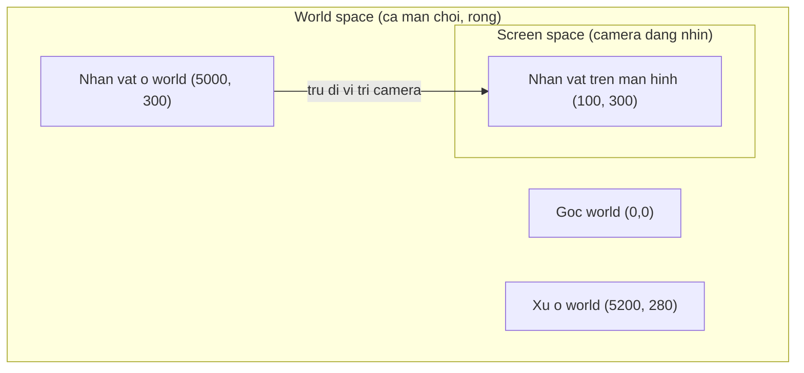
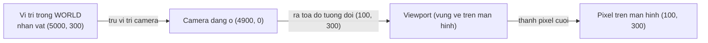
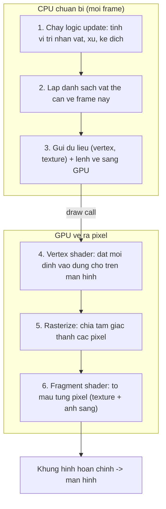

# Đồ hoạ & Rendering cơ bản

> **Tác giả:** Mr.Rom\
> **Phiên bản:** v1.0.0\
> **Tạo lúc:** 22/06/2026\
> **Cập nhật:** 22/06/2026\
> **Level:** Basic\
> **Tags:** game-dev, rendering, graphics, sprite, mesh, shader, gpu, draw-call, coordinate-system\
> **Yêu cầu trước:** [Game Loop & kiến trúc game](01_game-loop-and-architecture.md)

> 🎯 *Bài trước bạn đã dựng được vòng lặp `update → render` chạy đều mỗi frame. Nhưng tới phần `render`, ta mới chỉ nói "vẽ ra màn hình" mà chưa hỏi: **vẽ là vẽ cái gì, ở đâu, bằng cách nào?** Bài này trả lời đúng câu đó — từ hệ toạ độ (gốc ở đâu, trục y hướng nào), sprite vs mesh, animation theo frame, tới cách CPU và GPU bắt tay nhau để biến dữ liệu thành pixel. Cuối bài bạn hiểu vì sao "vẽ quá nhiều thứ rời rạc" làm game giật, và batching cứu ta thế nào. Vẫn bám tình huống quen: một nhân vật chạy trái/phải, nhảy, nhặt xu — nhưng lần này nhìn nó dưới góc "làm sao vẽ ra".*

## 🎯 Sau bài này bạn sẽ

- [ ] Phân biệt **hệ toạ độ màn hình** (gốc góc trên-trái, y hướng xuống) với **hệ toạ độ thế giới** (world space), và vì sao cần cả hai
- [ ] Hiểu **sprite** (ảnh 2D) khác **mesh** (lưới tam giác 3D) ở đâu, khi nào dùng cái nào
- [ ] Vẽ được một sprite, cắt **sprite sheet**, và làm **animation theo frame** cho nhân vật
- [ ] Giải thích ở mức khái niệm 3D làm gì: **vertex**, **texture**, **shader** đóng vai trò gì (không đi sâu toán)
- [ ] Hiểu **camera** và **viewport** quyết định "thấy phần nào của thế giới"
- [ ] Mô tả **rendering pipeline** tổng quan: CPU chuẩn bị dữ liệu → GPU vẽ ra pixel
- [ ] Giải thích **draw call** là gì và vì sao **batching** quyết định hiệu năng

---

## Tình huống — nhân vật của bạn đứng ở đâu trên màn hình?

Quay lại game đang dựng: một nhân vật nhỏ chạy trái/phải, nhảy lên, đi nhặt xu, né chướng ngại. Ở bài game loop, mỗi frame bạn gọi `render()` và nói chung chung "vẽ nhân vật ra". Giờ ngồi xuống làm thật, hàng loạt câu hỏi rất cụ thể hiện ra:

- Bạn bảo "vẽ nhân vật ở vị trí `(100, 200)`". Nhưng `(100, 200)` tính từ **đâu**? Góc trên-trái màn hình? Giữa màn hình? Và `y = 200` là **xuống dưới** hay **lên trên**?
- Nhân vật chạy mãi sang phải, vượt khỏi mép màn hình. Vậy toạ độ của nó vẫn tăng (`x = 5000`), hay nó "đụng tường" ở mép màn hình?
- Lúc đứng yên thì vẽ một hình, lúc chạy thì hai chân phải động đậy. **Một** tấm ảnh làm sao "động đậy" được?
- Màn hình của bạn 60 lần mỗi giây phải vẽ lại từ đầu. Vẽ một nhân vật thì nhẹ. Nhưng nếu màn đầy 500 đồng xu lấp lánh thì sao — máy có gánh nổi không?

Tất cả những câu này gom về một chủ đề: **rendering** (kết xuất) — quá trình biến dữ liệu trong bộ nhớ (vị trí, hình ảnh, màu) thành các **pixel** sáng trên màn hình. Đây là một nửa công việc của game (nửa kia là `update` — logic, ta để dành bài sau). Ta bắt đầu từ câu hỏi nền tảng nhất: hệ toạ độ.

---

## 1️⃣ Hai hệ toạ độ: màn hình và thế giới

Trước khi vẽ bất cứ thứ gì, ta phải thống nhất "vị trí" nghĩa là gì. Mà trong game có **hai loại vị trí khác nhau**, người mới rất hay lẫn.

### Hệ toạ độ màn hình — gốc ở góc trên-trái, y hướng xuống

Đây là điều **gây bất ngờ nhất** cho người mới đến từ toán học phổ thông. Trong toán, mặt phẳng Oxy có gốc ở giữa, trục y hướng **lên**. Trong đồ hoạ máy tính thì **ngược lại**:

- Gốc toạ độ `(0, 0)` nằm ở **góc trên-bên-trái** màn hình.
- Trục `x` tăng dần khi đi sang **phải** (giống toán).
- Trục `y` tăng dần khi đi **xuống dưới** — **ngược** với toán.

🪞 **Ẩn dụ — đọc sách:** *Toạ độ màn hình giống cách bạn đọc một trang sách. Bắt đầu từ góc trên-trái (chữ đầu tiên), đọc sang phải (`x` tăng), hết dòng thì xuống dòng dưới (`y` tăng). Càng xuống cuối trang, `y` càng lớn.* Lý do lịch sử rất đời thường: màn hình CRT ngày xưa quét tia điện tử từ trên xuống, trái sang phải — đúng như đọc sách — nên hệ toạ độ "kế thừa" chiều đó.

Hệ quả thực tế cần nhớ ngay cho game của ta:

- Nhân vật **nhảy lên** thì `y` **giảm** (đi về phía 0), không phải tăng. Đây là lỗi kinh điển của người mới: cộng `y` khi nhảy, kết quả nhân vật "nhảy" xuống đất.
- Trọng lực kéo nhân vật **xuống** thì `y` **tăng**.

> [!NOTE]
> Quy ước "gốc trên-trái, y xuống" đúng với **đa số** API 2D (canvas HTML, SDL, hầu hết engine 2D). Nhưng không phải tuyệt đối: một số hệ (OpenGL gốc, một số chế độ trong Godot, hệ toạ độ toán trong vài framework) lấy y hướng **lên**. Quy tắc sống còn: **luôn kiểm tra tài liệu của công cụ bạn dùng** trước khi giả định chiều của y.

### Hệ toạ độ thế giới — không gian của game, không phải của màn hình

Quay lại câu hỏi "nhân vật chạy mãi sang phải thì sao". Nếu toạ độ chỉ tính theo màn hình, nhân vật sẽ kẹt ở mép. Nhưng màn chơi (level) của ta rộng hơn màn hình rất nhiều — như một bản đồ dài. Ta cần một hệ toạ độ riêng cho **thế giới game**, độc lập với màn hình đang hiển thị phần nào.

- **World space** (không gian thế giới) — vị trí "thật" của vật thể trong màn chơi. Nhân vật ở `world (5000, 300)` nghĩa là nó cách điểm gốc của màn chơi 5000 đơn vị sang phải, dù lúc đó màn hình đang nhìn vào đâu.
- **Screen space** (không gian màn hình) — vị trí pixel cụ thể trên khung hình đang hiển thị, tính từ góc trên-trái màn hình.

🪞 **Ẩn dụ — đoàn phim quay cảnh đường phố:** *World space là **cả con phố thật** — dài hàng cây số, mọi cửa hàng đều có địa chỉ cố định. Screen space là **khung hình máy quay** đang bắt — chỉ thấy một đoạn phố. Diễn viên (nhân vật) có địa chỉ cố định trên phố (world); việc anh ta nằm ở mép trái hay giữa khung hình tuỳ máy quay (camera) đang chĩa vào đâu.*

Mối quan hệ giữa hai hệ này do **camera** quyết định — ta sẽ nói kỹ ở mục 5. Tạm thời chỉ cần nhớ công thức trực giác: `vị trí trên màn hình = vị trí trong thế giới − vị trí của camera`. Nhân vật ở world `x = 5000`, camera đang ở world `x = 4900`, thì trên màn hình nhân vật ở `x = 100`.

Để thấy rõ hai hệ chồng lên nhau, hãy nhìn sơ đồ dưới. Hộp lớn là cả màn chơi (world); khung nhỏ bên trong là phần camera đang cho ta thấy (screen):



→ Mấu chốt: bạn **lưu** vị trí vật thể trong world space (logic game suy nghĩ theo thế giới), nhưng **vẽ** chúng trong screen space (màn hình chỉ hiểu pixel). Cây cầu nối hai bên là camera. Người mới hay trộn lẫn hai hệ — đặt logic va chạm theo pixel màn hình rồi ngạc nhiên khi cuộn camera làm hỏng mọi thứ.

---

## 2️⃣ Sprite vs Mesh — hai cách "nói cho máy biết hình dạng"

Đã có toạ độ, giờ tới câu "vẽ **cái gì** ở toạ độ đó". Có hai cách mô tả hình dạng cho máy, tương ứng với 2D và 3D.

### Sprite — một tấm ảnh 2D

**Sprite** (tinh linh — nhưng trong game-dev cứ giữ nguyên "sprite") là một **ảnh 2D** được vẽ lên màn hình ở một vị trí. Nhân vật của ta, đồng xu, viên gạch nền — trong game 2D tất cả đều là sprite: những tấm ảnh bitmap (PNG có nền trong suốt) được dán lên màn hình.

🪞 **Ẩn dụ — hình dán (sticker):** *Sprite như một tờ **sticker**. Bạn có sẵn hình, chỉ việc dán nó lên vị trí mong muốn, có thể phóng to/thu nhỏ, xoay, lật ngang. Bản thân hình không "có chiều sâu" — nó phẳng lì, chỉ là một mặt ảnh.*

Sprite rất rẻ và nhanh: máy chỉ cần copy một vùng ảnh lên màn hình. Đặc điểm:

- Là **ảnh raster** — gồm các pixel cố định. Phóng to quá sẽ thấy vỡ hạt (pixelated).
- Có thể có **kênh alpha** (độ trong suốt) để nền quanh nhân vật trong veo, không phải hình chữ nhật đặc.
- Mỗi sprite thường gắn với một **texture** (ảnh nguồn) nạp sẵn trong bộ nhớ GPU.

### Mesh — lưới tam giác trong không gian 3D

Khi bước sang 3D, một tấm ảnh phẳng không đủ. Vật thể 3D (một khối hộp, một nhân vật, cả một ngọn núi) được mô tả bằng **mesh** (lưới): một tập hợp các **điểm** trong không gian 3D, nối lại thành các **tam giác**, ghép thành bề mặt.

🪞 **Ẩn dụ — mô hình giấy dán keo:** *Mesh giống một mô hình làm bằng **giấy bồi**: bạn cắt nhiều mảnh tam giác phẳng rồi dán lại thành hình con vật. Càng nhiều tam giác nhỏ, bề mặt càng cong mượt; ít tam giác thì hình bị "gãy góc". Mỗi góc của tam giác là một **vertex** (đỉnh).*

Vì sao lại là **tam giác** mà không phải hình vuông hay tròn? Vì tam giác là đa giác đơn giản nhất luôn **phẳng** (ba điểm bất kỳ luôn nằm trên một mặt phẳng), và GPU được thiết kế tối ưu để vẽ cực nhanh hàng triệu tam giác. Mọi hình 3D phức tạp đều quy về tam giác.

Để thấy khác biệt cốt lõi giữa hai cách, đặt cạnh nhau theo từng tiêu chí. Bảng dưới đọc theo hàng:

| Tiêu chí | Sprite (2D) | Mesh (3D) |
|---|---|---|
| Bản chất | Một ảnh phẳng (raster) | Lưới các tam giác nối từ vertex |
| Chiều | 2 chiều (x, y) | 3 chiều (x, y, z) |
| "Nhìn từ phía sau" | Không có mặt sau — chỉ một mặt phẳng | Có khối thật, xoay quanh nhìn được mọi phía |
| Phóng to | Vỡ hạt khi quá lớn | Vẫn mượt (hình học, không phải pixel) |
| Chi phí | Rất nhẹ — copy ảnh | Nặng hơn — tính toán hình học + ánh sáng |
| Dùng cho | Game 2D, UI, hiệu ứng phẳng | Game 3D, vật thể có khối |

> [!NOTE]
> Hai thế giới không tách biệt tuyệt đối. Game 2D hiện đại (kể cả Godot) bên dưới vẫn dùng GPU vẽ sprite bằng cách dán texture lên một **mesh phẳng hai tam giác** (một hình chữ nhật = hai tam giác ghép lại). Nghĩa là sprite chỉ là một mesh rất đơn giản. Hiểu điều này giúp bạn không thấy 2D và 3D là hai vũ trụ riêng — chúng dùng chung một bộ máy GPU.

→ Game của ta là 2D nền tảng, nên từ đây ta tập trung vào **sprite**: cách vẽ, cách làm nó chuyển động. 3D ta chỉ chạm tới ở mức khái niệm (mục 4).

---

## 3️⃣ Sprite trong thực tế: sprite sheet và animation theo frame

Nhân vật đứng yên thì một tấm ảnh là đủ. Nhưng lúc chạy, hai chân phải động đậy; lúc nhảy, tư thế phải khác. **Một tấm ảnh tĩnh không "động" được** — vậy làm sao có animation?

Câu trả lời đơn giản đến bất ngờ, và nó giống hệt cách hoạt hình truyền thống hoạt động: **vẽ nhiều khung hình (frame) hơi khác nhau, rồi chiếu chúng liên tiếp thật nhanh**, mắt người tự "nối" lại thành chuyển động.

🪞 **Ẩn dụ — sách lật (flipbook):** *Hồi nhỏ bạn vẽ ở mỗi góc trang vở một hình que hơi khác nhau, lật nhanh thì hình que "chạy". Animation sprite y hệt: một chuỗi ảnh tư thế chạy, hiển thị lần lượt mỗi ảnh trong một khoảnh khắc ngắn, mắt thấy nhân vật đang chạy.*

### Sprite sheet — gom nhiều frame vào một tấm

Nếu mỗi tư thế là một file PNG riêng, một nhân vật có thể cần hàng chục file (đứng, chạy 1, chạy 2, chạy 3, nhảy, ngã...). Tải hàng chục file rời rạc rất tốn. Giải pháp tiêu chuẩn: gom tất cả vào **một** tấm ảnh lớn, xếp thành lưới — gọi là **sprite sheet** (bảng sprite, hoặc *texture atlas* khi gom cả nhiều đối tượng khác nhau).

🪞 **Ẩn dụ — tấm tem dán:** *Sprite sheet như một **tờ tem**: nhiều con tem (frame) in chung trên một tờ giấy. Khi cần dùng, bạn không xé cả tờ — bạn chỉ "khoanh vùng" đúng ô con tem cần và dán nó. Việc khoanh vùng đó gọi là cắt frame theo toạ độ.*

Hình dung một sprite sheet cho nhân vật của ta: ảnh `player_run.png` kích thước 256×64 pixel, chứa **4 frame** chạy, mỗi frame 64×64 pixel xếp ngang. Để vẽ frame thứ `i`, ta lấy vùng ảnh bắt đầu từ `x = i * 64`, rộng 64, cao 64.

```text
player_run.png  (256 x 64)
+--------+--------+--------+--------+
| frame0 | frame1 | frame2 | frame3 |   <- moi o 64x64 pixel
+--------+--------+--------+--------+
 x=0      x=64     x=128    x=192
```

### Cho frame chạy theo thời gian

Có 4 frame rồi, giờ phải đổi frame theo thời gian. Ta KHÔNG đổi frame mỗi lần `render` (vì như bài game loop đã nói, frame rate có thể 60 hay 144 — nhanh quá nhân vật sẽ "rung"). Thay vào đó, mỗi frame animation hiển thị trong một khoảng thời gian nhất định, ví dụ **0.1 giây**, rồi mới sang frame kế.

Đoạn giả mã dưới (pseudo-code, không gắn engine cụ thể) cho thấy logic chọn frame nào để vẽ. Nó dùng `dt` (delta time — khoảng thời gian trôi qua giữa hai frame, đã học ở bài game loop) để cộng dồn thời gian:

```text
# Trang thai animation cua nhan vat
frame_hien_tai   = 0        # dang o frame nao (0..3)
thoi_gian_doi    = 0.1      # moi frame song 0.1 giay
bo_dem_thoi_gian = 0.0      # cong don thoi gian da troi

# Goi moi vong lap, dt = thoi gian troi qua tu frame truoc
function cap_nhat_animation(dt):
    bo_dem_thoi_gian = bo_dem_thoi_gian + dt

    # Du thoi gian song cua frame hien tai -> sang frame ke
    if bo_dem_thoi_gian >= thoi_gian_doi:
        bo_dem_thoi_gian = bo_dem_thoi_gian - thoi_gian_doi
        frame_hien_tai   = (frame_hien_tai + 1) % 4    # quay vong 0,1,2,3,0,...

# Trong ham render: ve dung o frame tren sprite sheet
function ve_nhan_vat(x_man_hinh, y_man_hinh):
    nguon_x = frame_hien_tai * 64        # cot frame tren sprite sheet
    ve_mot_phan_anh(
        anh      = "player_run.png",
        vung_cat = (nguon_x, 0, 64, 64), # (x, y, rong, cao) tren sprite sheet
        dat_tai  = (x_man_hinh, y_man_hinh)
    )
```

→ Hai điểm cần khắc sâu từ đoạn giả mã: (1) việc đổi frame tính theo **thời gian thật** (`dt`), không theo số lần vẽ — nên animation chạy đều dù máy mạnh hay yếu; (2) hàm vẽ chỉ "khoanh" đúng một ô trên sprite sheet (`vung_cat`) rồi dán ra màn hình. Đây chính xác là cách engine 2D thật làm animation, chỉ khác là chúng gói sẵn cho bạn.

> [!TIP]
> Khi nhân vật chạy sang **trái**, bạn không cần vẽ thêm một sprite sheet quay ngược. Chỉ cần **lật ảnh theo chiều ngang** (flip horizontal) — hầu hết engine cho phép vẽ sprite với chiều rộng âm hoặc cờ `flip_h = true`. Một bộ frame "chạy phải" dùng được cho cả hai hướng.

---

## 4️⃣ 3D ở mức khái niệm: vertex, texture, shader làm gì

Game của ta là 2D, nhưng bạn sẽ liên tục nghe ba từ **vertex**, **texture**, **shader** ở mọi nơi nói về đồ hoạ — kể cả 2D bên dưới cũng dùng chúng. Phần này giải thích **mỗi thứ đóng vai trò gì**, ở mức khái niệm. Ta **không** đi vào toán ma trận hay code shader — chỉ cần bạn biết "ai làm việc gì".

🪞 **Ẩn dụ tổng — dựng một bức tượng rồi sơn nó:** *Hình dung bạn dựng tượng. **Vertex** là các điểm gắn khung xương — quyết định **hình dáng**. **Texture** là lớp da/áo bạn dán lên khung — quyết định **bề ngoài** (màu, hoa văn). **Shader** là người thợ quyết định **ánh sáng chiếu vào trông ra sao** — chỗ nào sáng, chỗ nào tối, bóng đổ thế nào. Ba khâu, ba việc khác nhau.*

### Vertex — các điểm định hình

Như mục 2 đã nói, mesh 3D gồm nhiều tam giác, mỗi góc tam giác là một **vertex** (đỉnh). Mỗi vertex mang ít nhất một thông tin: **vị trí của nó trong không gian 3D** (`x, y, z`). Ngoài ra nó còn có thể mang thêm dữ liệu phụ như màu, hướng pháp tuyến (để tính ánh sáng), và **toạ độ texture** (điểm này tương ứng với điểm nào trên ảnh texture).

→ Tóm gọn: **vertex định hình dạng**. Bạn cho GPU một danh sách vertex, nói "nối chúng thành tam giác như này", GPU dựng được khung hình học.

### Texture — ảnh dán lên bề mặt

Một mesh trần chỉ là khung tam giác xám xịt. Để nó trông giống gỗ, da, gạch... ta **dán một ảnh** lên bề mặt mesh. Ảnh đó gọi là **texture**. Quá trình "dán" gọi là *texture mapping*: mỗi vertex được gán một toạ độ trên ảnh (gọi là *UV*), GPU "kéo căng" ảnh phủ kín các tam giác.

→ Sprite 2D thực ra chính là texture dán lên một hình chữ nhật. Nên **texture là khái niệm chung** cho cả 2D lẫn 3D: nó là dữ liệu ảnh nạp trong bộ nhớ GPU để "tô màu" cho hình.

### Shader — chương trình nhỏ chạy trên GPU

Đây là phần "ma thuật". **Shader** là một **chương trình nhỏ chạy trực tiếp trên GPU**, quyết định màu cuối cùng của từng phần hình ảnh. Có hai loại shader cơ bản bạn sẽ nghe:

- **Vertex shader** — chạy **một lần cho mỗi vertex**, nhiệm vụ chính: tính xem vertex đó (đang ở world space) sẽ rơi vào **vị trí nào trên màn hình**. Đây là khâu biến toạ độ 3D thành toạ độ 2D màn hình.
- **Fragment shader** (hay *pixel shader*) — chạy **một lần cho mỗi pixel** sắp được tô, nhiệm vụ: tính **màu** của pixel đó (lấy màu từ texture, cộng ánh sáng, bóng, hiệu ứng).

🪞 **Ẩn dụ nối tiếp tượng:** *Vertex shader như thợ **đặt khung tượng vào đúng vị trí** trong phòng trưng bày (đưa hình về đúng chỗ trên màn hình). Fragment shader như thợ **sơn từng điểm** trên bề mặt, quyết định điểm này sáng hay tối tuỳ đèn chiếu.*

→ Điều cần nhớ ở mức Basic: bạn **không cần tự viết shader** để làm game đầu tiên — engine có sẵn shader mặc định lo hết. Nhưng khi muốn hiệu ứng đặc biệt (nhân vật chớp đỏ khi trúng đòn, nước gợn sóng, phát sáng), đó là lúc người ta viết shader riêng. Giờ chỉ cần biết: shader = code nhỏ chạy trên GPU quyết định hình dạng cuối (vertex) và màu cuối (fragment).

---

## 5️⃣ Camera và viewport — quyết định ta thấy phần nào

Quay lại tình huống mục 1: nhân vật chạy mãi sang phải trong một màn chơi rộng, nhưng màn hình chỉ hiển thị một đoạn. Thứ quyết định "đoạn nào được thấy" chính là **camera** (máy quay).

🪞 **Ẩn dụ — máy quay phim trượt ray:** *Camera như một **máy quay đặt trên đường ray**, chĩa vào con phố (world). Nó không làm con phố thay đổi — nó chỉ chọn **góc nhìn**. Trượt máy quay sang phải, ta thấy đoạn phố bên phải. Trong game, thường ta cho camera "bám" theo nhân vật: nhân vật chạy tới đâu, camera trượt theo tới đó, nên nhân vật luôn ở giữa khung hình dù world `x` của nó đã lên tới 5000.*

Phân biệt hai khái niệm hay đi cùng nhau:

- **Camera** — định nghĩa **phần nào của world space** đang được nhìn: vị trí camera trong thế giới, mức phóng to (zoom), đôi khi cả góc xoay. Đây là khái niệm trong **world space**.
- **Viewport** — vùng **chữ nhật trên màn hình thật** mà hình ảnh được vẽ vào. Thường viewport là toàn bộ cửa sổ game. Nhưng trong game chia đôi màn hình (split-screen hai người chơi), có **hai viewport** — nửa trên cho người 1, nửa dưới cho người 2, mỗi viewport có camera riêng.

Mối quan hệ: **camera** nói "nhìn vào đâu trong thế giới", **viewport** nói "vẽ kết quả vào ô nào trên màn hình". Cùng nhau, chúng định nghĩa phép biến đổi từ **world space → screen space** mà mục 1 đã nhắc.

Sơ đồ dưới gói lại toàn bộ chuỗi biến đổi vị trí, từ "vật ở đâu trong thế giới" tới "pixel nào trên màn hình":



→ Điểm rút ra: logic game của bạn chỉ cần quan tâm world space (nhân vật ở đâu, xu ở đâu, va chạm chưa). Toàn bộ chuyện "quy về pixel màn hình" là việc của camera + viewport, và engine làm tự động khi bạn gắn vật thể vào camera. Hiểu sự tách bạch này giúp bạn không nhầm — ví dụ kiểm tra va chạm theo world, không theo pixel màn hình.

---

## 6️⃣ Rendering pipeline — CPU chuẩn bị, GPU vẽ

Giờ ta ráp tất cả lại để trả lời câu lớn nhất: từ "dữ liệu trong bộ nhớ" tới "pixel sáng trên màn hình" diễn ra qua những khâu nào, và **ai làm khâu nào**.

Có hai diễn viên chính, với phân vai rất rõ:

- **CPU** (bộ xử lý trung tâm) — "đạo diễn". Nó chạy logic game, quyết định **vẽ cái gì, ở đâu**: thu thập danh sách vật thể cần vẽ frame này (nhân vật, xu, nền), tính vị trí, rồi **gửi lệnh vẽ** kèm dữ liệu (vertex, texture) sang GPU.
- **GPU** (bộ xử lý đồ hoạ) — "đội thi công". Nó nhận lệnh và dữ liệu, rồi **thực sự tô** hàng triệu pixel song song cực nhanh. GPU sinh ra để làm đúng việc này: làm cùng một phép tính trên rất nhiều điểm cùng lúc.

🪞 **Ẩn dụ — đầu bếp và nhân viên chạy bàn:** *CPU như **bếp trưởng** ra phiếu order ("bàn 5: một sprite nhân vật ở (100,300), một xu ở (200,280)..."). GPU như **đội bếp** nhận phiếu và nấu (tô pixel) cực nhanh. Bếp trưởng không tự nấu từng món — anh ra lệnh; đội bếp đông tay làm song song.*

Mỗi frame, chuỗi công việc lặp lại. Đây là phần trừu tượng nhất của cả bài, nên ta nhìn nó qua sơ đồ. Đọc từ trên xuống — nửa trên (CPU) là chuẩn bị, nửa dưới (GPU) là thi công:



→ Phân tích sơ đồ: ranh giới giữa CPU và GPU (mũi tên `draw call` ở giữa) là chỗ **đắt nhất** cần để ý. CPU và GPU là hai con chip riêng; mỗi lần CPU "ra lệnh" cho GPU là một lần "giao tiếp qua biên giới", tốn thời gian thiết lập. Đây chính là lý do dẫn tới khái niệm cuối cùng — và quan trọng nhất về hiệu năng — của bài: **draw call** và **batching**.

> [!NOTE]
> Ở mức Basic, bạn không tự gọi từng khâu trong pipeline — engine làm hết khi bạn nói "vẽ sprite này". Nhưng hiểu pipeline giúp bạn đọc được lời khuyên hiệu năng kiểu "giảm số draw call", "gộp texture vào atlas" — những lời khuyên sẽ vô nghĩa nếu không biết CPU↔GPU vận hành ra sao.

---

## 7️⃣ Draw call và batching — vì sao 500 đồng xu làm game giật

Đến câu hỏi cuối trong tình huống đầu bài: màn đầy 500 đồng xu lấp lánh, máy có gánh nổi không? Trả lời nó là hiểu được khái niệm hiệu năng quan trọng nhất với người mới: **draw call**.

### Draw call là gì

**Draw call** (lệnh vẽ) là **một lần CPU bảo GPU "vẽ nhóm này đi"**. Mỗi draw call kèm theo việc thiết lập: dùng texture nào, shader nào, rồi mới vẽ. Bản thân GPU vẽ rất nhanh — nhưng **mỗi lần CPU ra lệnh đều có chi phí cố định** (đóng gói lệnh, gửi qua driver, GPU đổi trạng thái). Chi phí đó nhỏ cho **một** lệnh, nhưng nhân lên hàng nghìn lần thì thành gánh nặng.

🪞 **Ẩn dụ — gọi điện đặt hàng:** *Mỗi draw call như một **cuộc gọi điện** tới kho để đặt hàng. Nói chuyện thì nhanh, nhưng mỗi cuộc gọi đều mất công bấm số, chào hỏi, xác nhận. Đặt 500 món bằng **500 cuộc gọi riêng** sẽ tốn cả ngày — phần lớn thời gian là "bấm số, chào hỏi", không phải nội dung. Đặt 500 món trong **một** cuộc gọi thì nhanh hơn hẳn.*

Đây chính là cái bẫy với 500 đồng xu: nếu mỗi xu được vẽ bằng một draw call riêng, CPU phải "gọi điện" 500 lần mỗi frame, 60 lần mỗi giây = 30.000 cuộc gọi mỗi giây — chỉ riêng cho xu. CPU nghẽn ở khâu ra lệnh, GPU thì ngồi chờ, game giật.

### Batching — gộp nhiều vật vào một draw call

**Batching** (gộp lô) là kỹ thuật **gộp nhiều vật thể giống nhau vào một draw call duy nhất**. Nếu 500 đồng xu dùng **chung một texture** (cùng ảnh đồng xu), engine có thể gửi tất cả vị trí trong **một** lệnh: "vẽ cùng ảnh này ở 500 vị trí". Một cuộc gọi thay vì 500.

Để gộp được, các vật thường phải **chia sẻ cùng texture và cùng material/shader**. Đây là lý do người ta gom nhiều ảnh khác nhau vào một **texture atlas** (sprite sheet lớn) — để nhiều loại vật vẫn "dùng chung một texture" và gộp được vào một batch.

So sánh hai cách vẽ 500 đồng xu, đọc theo hàng:

| Khía cạnh | Không batching (500 draw call) | Có batching (1 draw call) |
|---|---|---|
| Số lần CPU ra lệnh GPU | 500 lần / frame | 1 lần / frame |
| Chi phí thiết lập | Trả 500 lần | Trả 1 lần |
| Điều kiện | (không cần — nhưng chậm) | Các xu chung 1 texture + material |
| Kết quả thực tế | CPU nghẽn, dễ giật | Mượt, GPU làm đúng việc của nó |

> [!IMPORTANT]
> Nút thắt hiệu năng đồ hoạ của người mới **gần như luôn** là **số draw call quá cao**, chứ không phải "GPU yếu". Khi game 2D giật dù chỉ vẽ vật đơn giản, câu hỏi đầu tiên cần hỏi là: "mình đang gọi bao nhiêu draw call mỗi frame, có gộp được không?". Dùng chung sprite sheet/atlas và để engine tự batch là cách rẻ nhất để mượt hơn.

→ Đây cũng là sợi dây nối tất cả khái niệm trong bài: ta lưu vật theo **world space**, camera quy về **screen space**, CPU gom danh sách và phát **draw call**, GPU dùng **vertex/texture/shader** tô pixel. Hiểu cả chuỗi, bạn biết chính xác mỗi tối ưu (atlas, batching, giảm draw call) tác động vào khâu nào.

---

## 💡 Cạm bẫy thường gặp & Best practice

### ❌ Cạm bẫy: cộng `y` khi nhân vật nhảy lên

- **Triệu chứng**: bấm nút nhảy, nhân vật lao **xuống đất** thay vì bật lên; hoặc rơi ngược lên trời.
- **Nguyên nhân**: quen hệ toạ độ toán (y hướng lên) nên cộng `y` để "đi lên". Nhưng màn hình có **y hướng xuống** — cộng `y` là đi xuống.
- **Cách tránh**: nhớ quy ước màn hình: lên = `y` **giảm**, xuống = `y` **tăng**. Khi nhảy: `y -= luc_nhay`. Khi trọng lực kéo: `y += trong_luc`. Luôn kiểm tra lại chiều y của engine đang dùng (vài engine ngược lại).

### ❌ Cạm bẫy: đổi frame animation mỗi lần render thay vì theo thời gian

- **Triệu chứng**: trên máy mạnh (144 FPS) nhân vật chạy "rung bần bật"; trên máy yếu (30 FPS) thì như slow-motion.
- **Nguyên nhân**: tăng `frame_hien_tai` mỗi lần `render`, nên tốc độ animation buộc chặt vào frame rate của máy.
- **Cách tránh**: đổi frame theo **thời gian thật** — cộng dồn `dt`, đủ ngưỡng (vd 0.1 giây) mới sang frame kế. Như đoạn giả mã ở mục 3. Animation khi đó chạy đều bất kể máy nhanh hay chậm.

### ❌ Cạm bẫy: vẽ mỗi vật một draw call rồi than "GPU yếu"

- **Triệu chứng**: cảnh đầy vật nhỏ (xu, hạt, gạch nền) làm game giật, dù mỗi vật rất đơn giản.
- **Nguyên nhân**: mỗi vật dùng texture/material riêng → không gộp được → hàng trăm/nghìn draw call mỗi frame, CPU nghẽn ở khâu ra lệnh.
- **Cách tránh**: gom ảnh vào **sprite sheet / texture atlas** để nhiều vật chung một texture; để engine **batch** chúng vào ít draw call. Đo số draw call trước khi đổ lỗi cho phần cứng.

### ✅ Best practice: tách bạch world space và screen space

- **Vì sao**: trộn hai hệ là nguồn bug kinh điển — logic va chạm tính theo pixel màn hình sẽ vỡ ngay khi camera cuộn.
- **Cách áp dụng**: lưu **mọi vị trí logic** (nhân vật, xu, va chạm) trong **world space**. Chỉ để camera + viewport lo việc quy về pixel màn hình lúc vẽ. Đừng bao giờ đặt logic gameplay dựa trên toạ độ pixel màn hình.

### ✅ Best practice: dùng sprite sheet thay vì hàng chục file ảnh rời

- **Vì sao**: vừa giảm số lần tải file, vừa tạo điều kiện cho batching (chung texture), vừa dễ quản lý animation theo lưới frame.
- **Cách áp dụng**: xếp các frame của một animation (và nhiều đối tượng liên quan) vào một tấm atlas; cắt frame theo toạ độ ô lúc vẽ, như mục 3.

---

## 🧠 Tự kiểm tra (Self-check)

**Q1.** Trong hệ toạ độ màn hình, gốc `(0,0)` nằm ở đâu và trục `y` tăng theo chiều nào? Khi nhân vật nhảy lên, `y` tăng hay giảm?

<details>
<summary>💡 Xem giải thích</summary>

Gốc `(0,0)` nằm ở **góc trên-bên-trái** màn hình. Trục `x` tăng khi sang phải; trục `y` tăng khi đi **xuống dưới** (ngược với toán học phổ thông, nơi y hướng lên).

Khi nhân vật **nhảy lên**, `y` **giảm** (tiến về phía 0). Đi xuống/trọng lực kéo thì `y` **tăng**. Lưu ý: đây là quy ước của đa số API 2D, nhưng vài engine lấy y hướng lên — luôn kiểm tra tài liệu công cụ.

</details>

**Q2.** Khác biệt cốt lõi giữa world space và screen space là gì? Vì sao nên lưu vị trí logic theo world space?

<details>
<summary>💡 Xem giải thích</summary>

- **World space** là vị trí "thật" của vật trong cả màn chơi, độc lập với màn hình đang nhìn vào đâu.
- **Screen space** là vị trí pixel cụ thể trên khung hình đang hiển thị, tính từ góc trên-trái màn hình.

Cây cầu nối hai hệ là **camera**: `vị trí màn hình ≈ vị trí world − vị trí camera`. Nên lưu logic theo world space vì màn chơi rộng hơn màn hình; nếu đặt logic (va chạm, vị trí) theo pixel màn hình, mọi thứ sẽ vỡ khi camera cuộn theo nhân vật.

</details>

**Q3.** Sprite khác mesh ở đâu? Vì sao mesh 3D dùng tam giác chứ không phải hình vuông?

<details>
<summary>💡 Xem giải thích</summary>

- **Sprite** là một **ảnh 2D phẳng** (raster), dán lên màn hình — nhẹ, nhanh, nhưng không có chiều sâu, phóng to thì vỡ hạt.
- **Mesh** là **lưới tam giác trong không gian 3D**, nối từ các vertex — có khối thật, xoay nhìn được mọi phía, phóng to vẫn mượt, nhưng nặng hơn.

Mesh dùng **tam giác** vì ba điểm bất kỳ luôn nằm trên một mặt phẳng (tam giác luôn phẳng), và GPU được tối ưu để vẽ cực nhanh hàng triệu tam giác. Mọi hình 3D phức tạp đều quy về tam giác.

</details>

**Q4.** Vì sao không nên đổi frame animation mỗi lần render? Cách đúng là gì?

<details>
<summary>💡 Xem giải thích</summary>

Vì frame rate khác nhau giữa các máy (30, 60, 144 FPS). Nếu đổi frame mỗi lần render, tốc độ animation buộc chặt vào frame rate: máy nhanh thì rung bần bật, máy chậm thì chậm như slow-motion.

Cách đúng: đổi frame theo **thời gian thật**. Cộng dồn `dt` (delta time) vào một bộ đếm; khi đủ ngưỡng (vd 0.1 giây) mới sang frame kế và trừ ngưỡng đi. Như vậy animation chạy đều bất kể tốc độ máy.

</details>

**Q5.** Vertex, texture, shader mỗi thứ làm gì trong việc vẽ một vật?

<details>
<summary>💡 Xem giải thích</summary>

- **Vertex** (đỉnh) — các điểm trong không gian 3D, nối thành tam giác, quyết định **hình dạng** của vật.
- **Texture** — ảnh dán lên bề mặt, quyết định **bề ngoài** (màu, hoa văn). Sprite 2D chính là texture dán lên một hình chữ nhật.
- **Shader** — chương trình nhỏ chạy trên GPU: **vertex shader** đưa mỗi đỉnh về đúng vị trí trên màn hình; **fragment shader** tính **màu** của từng pixel (từ texture + ánh sáng).

Ẩn dụ: vertex = khung xương (hình dáng), texture = lớp da/áo (bề ngoài), shader = thợ quyết định ánh sáng/màu cuối.

</details>

**Q6.** Draw call là gì, và vì sao 500 đồng xu vẽ riêng lẻ có thể làm game giật dù vật rất đơn giản? Batching giúp gì?

<details>
<summary>💡 Xem giải thích</summary>

**Draw call** là một lần CPU bảo GPU "vẽ nhóm này". Mỗi draw call có **chi phí thiết lập cố định** (đóng gói lệnh, gửi qua driver, GPU đổi trạng thái). 500 xu vẽ riêng = 500 draw call/frame × 60 FPS = 30.000 lệnh/giây chỉ cho xu → CPU nghẽn ở khâu ra lệnh, GPU ngồi chờ → giật. Nút thắt là **số draw call**, không phải GPU yếu.

**Batching** gộp nhiều vật chung texture/material vào **một** draw call ("vẽ cùng ảnh này ở 500 vị trí"). Để gộp được, các vật nên chung một texture — lý do dùng texture atlas / sprite sheet.

</details>

---

## ⚡ Tra cứu nhanh (Cheatsheet)

### Hệ toạ độ màn hình (2D)

```text
Goc (0,0)  : goc TREN-TRAI man hinh
Truc x     : tang khi sang PHAI
Truc y     : tang khi xuong DUOI  (nguoc voi toan hoc)
Nhay len   : y GIAM   (y -= luc_nhay)
Trong luc  : y TANG   (y += trong_luc)
```

### Sprite vs Mesh

```text
Sprite : anh 2D phang (raster) -> game 2D, UI, hieu ung phang. Nhe.
Mesh   : luoi tam giac 3D (tu vertex) -> vat the co khoi. Nang hon.
Ghi nho: sprite = texture dan len 2 tam giac (1 hinh chu nhat).
```

### Vai trò trong vẽ 3D (mức khai niem)

```text
Vertex          : cac diem -> quyet dinh HINH DANG
Texture         : anh dan len be mat -> quyet dinh BE NGOAI (mau, hoa van)
Vertex shader   : dat moi dinh vao dung cho tren man hinh
Fragment shader : to MAU tung pixel (texture + anh sang)
```

### Pipeline & hiệu năng

```text
CPU  : "dao dien" - chay logic, lap danh sach, phat DRAW CALL
GPU  : "doi thi cong" - to hang trieu pixel song song
Draw call : 1 lan CPU ra lenh GPU. Co chi phi thiet lap co dinh.
Batching  : gop nhieu vat CHUNG texture vao 1 draw call -> bot nghen CPU.
Quy tac   : game 2D giat -> kiem tra SO DRAW CALL truoc, dung do GPU yeu.
```

### World space vs Screen space

```text
World space  : vi tri "that" trong man choi (luu logic o day)
Screen space : vi tri pixel tren khung hinh dang hien
Cau noi      : screen ~ world - vi tri camera
Camera       : nhin vao DAU trong the gioi
Viewport     : ve ket qua vao O nao tren man hinh
```

---

## 📚 Từ Điển Thuật Ngữ (Glossary)

| EN | VN | Giải thích |
|---|---|---|
| Rendering | Kết xuất | Quá trình biến dữ liệu (vị trí, ảnh, màu) thành pixel trên màn hình |
| Pixel | Điểm ảnh | Một ô màu nhỏ nhất trên màn hình |
| Screen space | Không gian màn hình | Toạ độ pixel trên khung hình, gốc góc trên-trái, y hướng xuống |
| World space | Không gian thế giới | Vị trí "thật" của vật trong màn chơi, độc lập với màn hình |
| Sprite | Sprite | Một ảnh 2D phẳng dán lên màn hình; đơn vị hình cơ bản trong game 2D |
| Raster | Ảnh raster | Ảnh gồm các pixel cố định; phóng to quá sẽ vỡ hạt |
| Alpha channel | Kênh alpha | Kênh độ trong suốt của ảnh, cho nền quanh nhân vật trong veo |
| Sprite sheet | Bảng sprite | Một ảnh lớn chứa nhiều frame xếp thành lưới |
| Texture atlas | Atlas texture | Một ảnh lớn gom nhiều ảnh/đối tượng để dùng chung một texture |
| Frame (animation) | Khung hình | Một tư thế trong chuỗi ảnh tạo thành animation |
| Animation | Hoạt ảnh | Chiếu liên tiếp nhiều frame để mắt thấy chuyển động |
| Mesh | Lưới | Tập tam giác nối từ vertex, mô tả bề mặt vật thể 3D |
| Vertex | Đỉnh | Một điểm trong không gian 3D; góc của tam giác trong mesh |
| Texture | Texture | Dữ liệu ảnh nạp trong bộ nhớ GPU, dùng "tô" bề mặt hình |
| UV mapping | Ánh xạ UV | Gán mỗi vertex một điểm trên ảnh texture để dán ảnh lên bề mặt |
| Shader | Shader | Chương trình nhỏ chạy trên GPU, quyết định hình dạng/màu cuối |
| Vertex shader | Vertex shader | Shader chạy mỗi vertex, đưa đỉnh về đúng vị trí trên màn hình |
| Fragment shader | Fragment shader | Shader chạy mỗi pixel, tính màu cuối (pixel shader) |
| Camera | Camera | Định nghĩa phần nào của world space đang được nhìn |
| Viewport | Viewport | Vùng chữ nhật trên màn hình mà hình ảnh được vẽ vào |
| Rendering pipeline | Đường ống kết xuất | Chuỗi khâu biến dữ liệu thành pixel: CPU chuẩn bị → GPU vẽ |
| GPU | GPU | Bộ xử lý đồ hoạ, tô hàng triệu pixel song song |
| Rasterize | Rời rạc hoá | Chia tam giác thành các pixel để tô màu |
| Draw call | Lệnh vẽ | Một lần CPU bảo GPU vẽ một nhóm; có chi phí thiết lập cố định |
| Batching | Gộp lô | Gộp nhiều vật chung texture vào một draw call để bớt nghẽn CPU |
| Material | Vật liệu | Mô tả cách bề mặt được vẽ (texture + shader + tham số) |
| Delta time (dt) | Delta time | Khoảng thời gian trôi qua giữa hai frame, dùng để chạy đều theo thời gian |

---

## 🔗 Liên kết & Tài nguyên

⬅️ **Bài trước:** [Game Loop & kiến trúc game](01_game-loop-and-architecture.md)\
➡️ **Bài tiếp theo:** [Physics, Input & Audio](03_physics-input-and-audio.md)\
↑ **Về cụm:** [Game Development — README cụm](../../README.md)

### 🧭 Định hướng lộ trình học

- [Game Loop & kiến trúc game](01_game-loop-and-architecture.md) — bài trước: vòng lặp update/render mà rendering nằm trong đó
- [Physics, Input & Audio](03_physics-input-and-audio.md) — bài kế: làm nhân vật di chuyển, nhảy, nghe được input và âm thanh
- [Làm game đầu tiên với Godot](04_building-a-game-with-an-engine.md) — ráp tất cả lại thành game thật trong engine

### 🧩 Các chủ đề có thể bạn quan tâm

- [Phát triển game là gì?](00_what-is-game-development.md) — bức tranh tổng về làm game trước khi đào sâu kỹ thuật
- [Làm game đầu tiên với Godot](04_building-a-game-with-an-engine.md) — nơi sprite, animation, camera được dùng thật bằng công cụ

### 🌐 Tài nguyên tham khảo khác

- [MDN — Basic 2D collision detection / canvas](https://developer.mozilla.org/en-US/docs/Games/Techniques/2D_collision_detection) — nền tảng vẽ và toạ độ 2D trên web, dễ thử ngay trên trình duyệt
- [The Book of Shaders](https://thebookofshaders.com/) — học shader từ số 0 bằng ví dụ tương tác, khi bạn muốn đi sâu hơn fragment shader
- [LearnOpenGL — Hello Triangle](https://learnopengl.com/Getting-started/Hello-Triangle) — xem tận mắt vertex → tam giác → pixel ở mức thấp, để hiểu pipeline rõ hơn

---

> 🎯 *Sau bài này bạn đã biết "vẽ" thực sự nghĩa là gì: hai hệ toạ độ (màn hình y-xuống vs world), sprite vs mesh, animation theo frame từ sprite sheet, vai trò vertex/texture/shader, camera + viewport quyết định ta thấy gì, và chuỗi CPU chuẩn bị → GPU vẽ với draw call/batching là nút thắt hiệu năng. Bài kế tiếp cho nhân vật **cử động thật**: trọng lực kéo xuống, lực nhảy bật lên, bàn phím điều khiển, và âm thanh khi nhặt xu — phần Physics, Input & Audio.*

---

## 📌 Nhật ký thay đổi (Changelog)

- **v1.0.0 (22/06/2026)** — Bản đầu tiên. Cụm `game-dev/` lesson 2/5 (Basic). Cover: hệ toạ độ màn hình (gốc trên-trái, y hướng xuống) vs world space, cây cầu camera; sprite (ảnh 2D raster) vs mesh (lưới tam giác từ vertex); sprite sheet và animation theo frame dựa trên delta time (kèm giả mã); khái niệm 3D ở mức vai trò — vertex (hình dạng), texture (bề ngoài), shader (vertex/fragment, không đi sâu toán); camera vs viewport và phép biến đổi world → screen; rendering pipeline tổng quan CPU chuẩn bị → GPU vẽ; draw call và batching như nút thắt hiệu năng. Bám tình huống xuyên suốt nhân vật 2D chạy/nhảy/nhặt xu. Kèm 3 sơ đồ mermaid (world/screen chồng nhau, phép biến đổi world→screen, pipeline CPU→GPU) + 1 ASCII sprite sheet + 1 đoạn giả mã animation.
