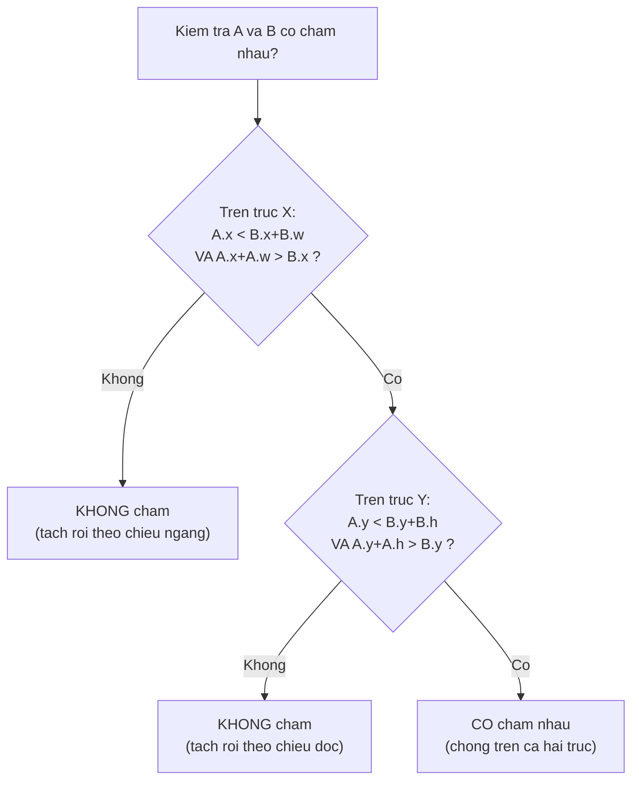

# Physics, Input & Audio

> **Tác giả:** Mr.Rom\
> **Phiên bản:** v1.0.0\
> **Tạo lúc:** 22/06/2026\
> **Cập nhật:** 22/06/2026\
> **Level:** Basic\
> **Tags:** game-dev, physics, collision, aabb, vector-math, input, audio, 2d\
> **Yêu cầu trước:** [Đồ hoạ & Rendering cơ bản](02_graphics-and-rendering-basics.md)

> 🎯 *Bài trước bạn đã vẽ được nhân vật và xu lên màn hình. Nhưng một hình vẽ đứng yên chưa phải game — nó cần **di chuyển đúng**, **biết khi nào chạm vào nhau**, **nghe được lệnh từ tay người chơi**, và **kêu thành tiếng**. Bài này lo bốn việc đó: toán vector 2D tối thiểu để di chuyển mượt, collision detection (AABB và khoảng cách hình tròn) để biết nhân vật nhặt được xu hay đụng chướng ngại, cách engine physics lo gravity giúp ta, cách đọc input (bàn phím/cảm ứng/tay cầm), và cách dùng âm thanh (SFX và nhạc nền) cho đúng. Vẫn bám theo game 2D nhỏ xuyên suốt cụm: một nhân vật chạy trái/phải, nhảy, nhặt xu và tránh chướng ngại.*

## 🎯 Sau bài này bạn sẽ

- [ ] Hiểu **vector 2D** (vị trí, vận tốc), biết **cộng vector** và vì sao phải **chuẩn hoá (normalize)** vector khi di chuyển chéo
- [ ] Viết được **collision detection** cơ bản: **AABB** (axis-aligned bounding box) và **khoảng cách hình tròn**, kèm code JavaScript chạy được
- [ ] Phân biệt **rigidbody / gravity / velocity** mà engine physics lo cho bạn — và phần nào bạn vẫn phải tự viết
- [ ] Xử lý **input** đúng cách: phân biệt **polling vs event**, và biết key / touch / gamepad khác nhau ở đâu
- [ ] Dùng **audio** đúng: tách **SFX** (hiệu ứng) và **nhạc nền**, hiểu vì sao mỗi loại dùng định dạng nén khác nhau

---

## Tình huống — nhân vật của ta vừa "chết cứng" trên màn hình

Cuối bài trước, ta đã vẽ được một nhân vật và vài đồng xu lên màn hình bằng vòng lặp game (game loop) và lệnh vẽ. Trông cũng ra dáng game. Nhưng bấm phím mũi tên — chẳng có gì xảy ra. Nhân vật đứng im như tượng.

Một bức tranh động chưa phải là game. Để biến hình vẽ kia thành thứ chơi được, ta cần trả lời bốn câu hỏi rất đời thường:

- Người chơi giữ phím mũi tên phải — làm sao nhân vật **trượt sang phải đều đặn**, không giật, không phụ thuộc máy nhanh hay chậm? (→ **vector vận tốc**)
- Bấm chéo (lên + phải cùng lúc) — vì sao nhân vật **chạy nhanh hơn** khi đi chéo so với đi thẳng? Đó là bug hay tính năng? (→ **chuẩn hoá vector**)
- Nhân vật chạm vào đồng xu — làm sao game **biết** là "đã chạm" để cộng điểm và làm xu biến mất? (→ **collision detection**)
- Nhảy lên rồi — cái gì kéo nhân vật **rơi xuống lại**? (→ **gravity & physics engine**)

→ Bốn câu hỏi này chính là Physics & Input. Còn câu thứ năm — *"nhặt xu thì nghe tiếng 'keng' ở đâu ra?"* — là phần Audio cuối bài. Ta đi từ viên gạch nền nhất: **vector**.

---

## 1️⃣ Vector 2D — ngôn ngữ để nói "ở đâu" và "đi hướng nào"

Trước khi cho nhân vật di chuyển, ta cần một cách để máy hiểu "nhân vật đang ở chỗ nào" và "đang đi hướng nào, nhanh bao nhiêu". Cả hai đều là **vector 2D**.

Một **vector 2D** (vec-tơ hai chiều) đơn giản là **một cặp số `(x, y)`**. Nhưng cùng một cặp số đó mang hai ý nghĩa khác nhau tuỳ ngữ cảnh:

- **Vị trí (position)** — `(x, y)` là *toạ độ một điểm* trên màn hình. Ví dụ nhân vật ở `(100, 200)` nghĩa là cách mép trái 100 pixel, cách mép trên 200 pixel. (Nhắc lại từ bài rendering: trong game 2D, trục `y` thường tính **từ trên xuống**.)
- **Vận tốc (velocity)** — `(x, y)` là *hướng và độ nhanh* của chuyển động mỗi giây. Ví dụ vận tốc `(200, 0)` nghĩa là "mỗi giây dịch sang phải 200 pixel, không lên xuống".

🪞 **Ẩn dụ:** vị trí giống **địa chỉ nhà bạn** trên bản đồ — một điểm cố định. Vận tốc giống **mũi tên chỉ đường kèm tốc độ** — "đi hướng đông-bắc, 200 mét mỗi phút". Cùng là "một cặp số", nhưng một cái nói *bạn đang ở đâu*, cái kia nói *bạn đang đi thế nào*.

### Cộng vector — cách vật di chuyển qua từng frame

Mỗi frame của game loop, ta cập nhật vị trí bằng một phép cực kỳ đơn giản: **vị trí mới = vị trí cũ + vận tốc × thời gian trôi qua**. Phép "+" ở đây là **cộng vector**: cộng riêng từng thành phần.

Cộng hai vector `(ax, ay)` và `(bx, by)` cho ra `(ax + bx, ay + by)` — cộng `x` với `x`, `y` với `y`. Không có gì bí ẩn.

Đoạn code dưới minh hoạ đúng một bước di chuyển. `dt` (delta time — thời gian trôi qua giữa hai frame, tính bằng giây) là mảnh ghép quan trọng: nhân vận tốc với `dt` để nhân vật đi **cùng quãng đường mỗi giây** dù máy chạy 30 hay 144 FPS (nhắc lại từ bài game loop):

```javascript
// Vị trí (x, y) và vận tốc (vx, vy) đều là vector 2D
let pos = { x: 100, y: 200 };
const vel = { x: 200, y: 0 }; // 200 px/giây sang phải, không lên/xuống

const dt = 1 / 60; // 1 frame ở 60 FPS = 1/60 giây

// Cộng vector: vị trí mới = vị trí cũ + vận tốc * dt
pos.x = pos.x + vel.x * dt;
pos.y = pos.y + vel.y * dt;

console.log(pos); // { x: 103.333..., y: 200 }
```

Sau một frame, nhân vật dịch sang phải khoảng 3.3 pixel. Sau 60 frame (1 giây) sẽ dịch đúng 200 pixel — chính là độ nhanh ta khai báo trong `vel`. Đây là cốt lõi của **mọi chuyển động** trong game: input đổi `vel`, mỗi frame cộng `vel × dt` vào `pos`.

### Vì sao phải chuẩn hoá vector khi đi chéo?

Giờ tới cái bẫy mà gần như mọi người mới đều dính. Giả sử bạn cho phép đi 4 hướng bằng cách cộng/trừ tốc độ vào từng trục:

```javascript
const SPEED = 200; // px/giây
let vx = 0, vy = 0;

if (input.right) vx += SPEED; // (200, 0)
if (input.left)  vx -= SPEED;
if (input.down)  vy += SPEED;
if (input.up)    vy -= SPEED; // y âm = đi lên
```

Đi thẳng sang phải: `(200, 0)`. Độ dài (tốc độ thực) là `200`. Đúng.

Nhưng bấm **chéo** (phải + xuống cùng lúc): vận tốc thành `(200, 200)`. Độ dài của vector này **không phải 200**, mà là:

```text
độ dài = √(200² + 200²) = √80000 ≈ 282.8
```

Nhân vật đi chéo **nhanh hơn ~41%** so với đi thẳng! Người chơi tinh ý sẽ phát hiện ngay, và đây là lỗi kinh điển trong game 2D.

🪞 **Ẩn dụ:** hình dung bạn đi bộ. Bước sang phải một bước, hoặc bước lên một bước — quãng đường như nhau. Nhưng bước **chéo** (vừa sang phải vừa lên) thì chân bạn đi xa hơn, vì đó là cạnh huyền của tam giác vuông. Tốc độ "cảm nhận" tăng lên dù bạn vẫn nghĩ mình bước "một bước".

Cách sửa: **chuẩn hoá (normalize)** vector hướng — biến nó thành vector cùng hướng nhưng **độ dài đúng bằng 1** (gọi là *unit vector* — vector đơn vị), rồi mới nhân với tốc độ mong muốn. Công thức: chia mỗi thành phần cho độ dài của vector.

```javascript
// Chuẩn hoá: trả về vector cùng hướng nhưng độ dài = 1
function normalize(vx, vy) {
  const len = Math.sqrt(vx * vx + vy * vy);
  if (len === 0) return { x: 0, y: 0 }; // tránh chia cho 0 khi đứng yên
  return { x: vx / len, y: vy / len };
}

const SPEED = 200;

// Hướng thô từ input (phải + xuống = chéo)
let dirX = 1, dirY = 1;

// 1. Chuẩn hoá hướng về độ dài 1
const dir = normalize(dirX, dirY); // ≈ { x: 0.7071, y: 0.7071 }

// 2. Nhân hướng đã chuẩn hoá với tốc độ -> vận tốc cuối
const vx = dir.x * SPEED; // ≈ 141.4
const vy = dir.y * SPEED; // ≈ 141.4

// Giờ độ dài luôn = 200 dù đi thẳng hay đi chéo
console.log(Math.sqrt(vx * vx + vy * vy).toFixed(1)); // "200.0"
```

→ Điểm cốt lõi cần khắc sâu: **luôn chuẩn hoá vector hướng trước khi nhân với tốc độ**, đặc biệt khi cho di chuyển 8 hướng. Đi thẳng và đi chéo nhờ vậy có cùng tốc độ. Quy tắc vàng cho người mới: *hướng* và *tốc độ* là hai thứ tách biệt — vector hướng chỉ lo "đi đằng nào" (độ dài 1), con số tốc độ lo "nhanh bao nhiêu".

---

## 2️⃣ Collision detection — làm sao biết hai vật chạm nhau?

Nhân vật giờ di chuyển được. Nhưng game của ta cần biết: nhân vật **chạm xu chưa** (để cộng điểm), **đụng chướng ngại chưa** (để thua hoặc dội lại). Đó là bài toán **collision detection** (phát hiện va chạm).

Vấn đề: hình ảnh nhân vật có thể là một sprite phức tạp với tay chân lởm chởm. Kiểm tra va chạm theo **đúng từng pixel** thì cực kỳ tốn tính toán. Thay vào đó, game gần như luôn dùng một **hình bao đơn giản** (collider) — một hình chữ nhật hoặc hình tròn ôm lấy vật — rồi chỉ kiểm tra va chạm giữa các hình đơn giản đó.

🪞 **Ẩn dụ:** giống như khi gửi hàng, bạn không bọc theo đúng hình thù món đồ. Bạn cho nó vào một **thùng carton hình hộp** vuông vắn. Kiểm tra "hai thùng có chồng lên nhau không" dễ hơn nhiều so với "hai món đồ kỳ dị có chạm nhau không". Collider chính là cái thùng carton đó.

### AABB — hình chữ nhật thẳng trục

Cách phổ biến nhất là **AABB** — *Axis-Aligned Bounding Box* (hộp bao thẳng trục). "Thẳng trục" nghĩa là hình chữ nhật **không xoay** — các cạnh luôn song song với trục `x` và `y`. Đây là giả định khiến phép kiểm tra trở nên cực nhanh.

Một AABB mô tả bằng góc trên-trái `(x, y)` cộng chiều rộng `w` và chiều cao `h`. Hai hộp **không chồng nhau** khi nào? Khi có **ít nhất một trục mà chúng tách rời** — hộp này nằm hẳn bên trái, bên phải, bên trên, hoặc bên dưới hộp kia. Đảo ngược lại: chúng **chồng nhau** chỉ khi chồng trên **cả hai trục cùng lúc**.

Khái niệm "chồng trên cả hai trục" là phần trừu tượng nhất ở đây, nên ta xem qua sơ đồ. Mỗi trục được kiểm tra độc lập; chỉ khi cả hai cùng "có giao nhau" thì hai hộp mới thật sự va chạm:



→ Mấu chốt từ sơ đồ: AABB chỉ va chạm khi **chồng trên cả X lẫn Y**. Chỉ cần một trục tách rời là kết luận ngay "không chạm" — không cần xét trục kia. Đây là lý do AABB nhanh đến vậy: phần lớn cặp vật trong game tách rời ở ít nhất một trục, kiểm tra dừng sớm.

Dịch sơ đồ trên thành code. Hàm `aabbOverlap` trả về `true` nếu hai hộp chồng nhau. Để ý đúng bốn điều kiện — đây là phần dễ viết sai nhất, mỗi điều kiện ứng với một trục một chiều:

```javascript
// Mỗi hộp: { x, y, w, h } — (x,y) là góc trên-trái, w/h là rộng/cao
function aabbOverlap(a, b) {
  return (
    a.x < b.x + b.w &&  // cạnh trái của A nằm trước cạnh phải của B
    a.x + a.w > b.x &&  // cạnh phải của A nằm sau cạnh trái của B
    a.y < b.y + b.h &&  // cạnh trên của A nằm trên cạnh dưới của B
    a.y + a.h > b.y     // cạnh dưới của A nằm dưới cạnh trên của B
  );
}

// Nhân vật, xu, và một bức tường chướng ngại
const player = { x: 50,  y: 80,  w: 32, h: 48 };
const coin   = { x: 70,  y: 100, w: 16, h: 16 };
const wall   = { x: 200, y: 80,  w: 32, h: 48 };

console.log("player vs coin:", aabbOverlap(player, coin)); // true  -> nhặt xu!
console.log("player vs wall:", aabbOverlap(player, wall)); // false -> còn xa
```

Chạy bằng Node.js (lưu thành `aabb-demo.js` rồi `node aabb-demo.js`), kết quả:

```text
player vs coin: true
player vs wall: false
```

Phân tích: nhân vật (`x` từ 50 đến 82, `y` từ 80 đến 128) và xu (`x` từ 70 đến 86, `y` từ 100 đến 116) chồng nhau trên **cả hai trục** → `true`, ta cho cộng điểm và xoá xu. Còn bức tường ở `x = 200` nằm hẳn bên phải, tách rời trên trục `x` → `false` ngay từ điều kiện đầu. Đây chính là cách game biết "nhân vật vừa nhặt được xu".

### Khoảng cách hình tròn — khi vật tròn trịa

Với những vật **tròn** (quả bóng, vụ nổ, tầm đánh hình tròn), dùng hình tròn làm collider tự nhiên hơn. Phép kiểm tra còn đơn giản hơn AABB: **hai hình tròn chồng nhau khi khoảng cách giữa hai tâm nhỏ hơn tổng hai bán kính.**

Có một mẹo tối ưu quan trọng: **so sánh bình phương khoảng cách** thay vì khoảng cách thật, để **tránh phép `Math.sqrt`** (căn bậc hai) tốn kém. Vì cả hai vế đều không âm, so sánh `d² < (r1+r2)²` cho kết quả y hệt `d < r1+r2` nhưng nhanh hơn:

```javascript
// Mỗi hình tròn: { cx, cy, r } — tâm (cx, cy), bán kính r
function circlesOverlap(a, b) {
  const dx = a.cx - b.cx;
  const dy = a.cy - b.cy;
  const distSq = dx * dx + dy * dy;   // bình phương khoảng cách hai tâm
  const rSum = a.r + b.r;
  return distSq < rSum * rSum;        // so sánh bình phương, né Math.sqrt
}

const c1 = { cx: 100, cy: 100, r: 20 };
const c2 = { cx: 130, cy: 100, r: 20 }; // tâm cách 30, tổng bán kính 40
const c3 = { cx: 200, cy: 100, r: 20 }; // tâm cách 100, quá xa

console.log("c1 vs c2:", circlesOverlap(c1, c2)); // true  (30 < 40)
console.log("c1 vs c3:", circlesOverlap(c1, c3)); // false (100 > 40)
```

Kết quả khi chạy:

```text
c1 vs c2: true
c1 vs c3: false
```

→ Quy tắc chọn collider cho người mới: **dùng AABB cho mọi thứ vuông vắn** (nhân vật, gạch, hộp, sàn) vì nó nhanh và đủ tốt; **dùng hình tròn cho thứ tròn** (đạn, vụ nổ, vùng nhặt đồ). Trong game 2D nhỏ của ta, nhân vật và xu đều dùng AABB là gọn nhất.

---

## 3️⃣ Rigidbody, gravity, velocity — phần engine physics lo cho bạn

Ở mục 1, ta tự cộng `vel × dt` vào vị trí. Ở mục 2, ta tự viết hàm kiểm tra va chạm. Làm thủ công như vậy giúp **hiểu bản chất**, nhưng game thật có gravity, va chạm phản hồi (vật dội lại), ma sát, vật chồng vật... viết tay hết thì cực và dễ sai. Đó là lúc **physics engine** (cỗ máy vật lý) vào cuộc.

Một physics engine (như cái tích hợp sẵn trong Godot, Unity, hay thư viện Box2D) lo phần "mô phỏng vật lý" giúp bạn. Bạn chỉ cần **khai báo** vật có những tính chất gì, engine tự tính chuyển động mỗi frame. Ba khái niệm trụ cột:

- **Rigidbody** (vật thể cứng) — thành phần biến một object thành "vật có vật lý". Gắn rigidbody vào nhân vật, engine bắt đầu áp gravity, va chạm, lực lên nó. 🪞 *Giống như tuyên bố "vật này tuân theo luật vật lý" — từ giờ nó rơi, nó va, nó bị đẩy như đồ vật thật.*
- **Gravity** (trọng lực) — lực kéo vật xuống đều đặn. Bản chất là engine **tự cộng một gia tốc** vào vận tốc dọc (`vy`) mỗi frame, đúng kiểu ta làm thủ công ở mục 1 nhưng engine làm tự động. Nhờ gravity mà nhảy lên rồi tự rơi xuống.
- **Velocity** (vận tốc) — vẫn là vector `(vx, vy)` như mục 1. Khác biệt: với rigidbody, bạn thường chỉ **đặt vận tốc** (vd: bấm phải thì `vx = 200`, bấm nhảy thì `vy = -400`), còn việc **cộng vận tốc vào vị trí và xử lý va chạm** thì engine lo.

Để thấy gravity và velocity phối hợp ra sao, đây là một bước cập nhật **đầy đủ** cho nhân vật — đúng những gì physics engine làm bên dưới mỗi frame (ở đây ta viết tay để hiểu, các bài sau dùng Godot sẽ ngắn hơn nhiều):

```javascript
const GRAVITY = 980;        // gia tốc rơi (px/giây^2)
const MOVE_SPEED = 200;     // tốc độ chạy ngang (px/giây)
const JUMP_VELOCITY = -400; // vận tốc nhảy ban đầu (âm = bật lên trên)

function aabbOverlap(a, b) {
  return (
    a.x < b.x + b.w && a.x + a.w > b.x &&
    a.y < b.y + b.h && a.y + a.h > b.y
  );
}

const player = { x: 100, y: 0, w: 32, h: 48, vx: 0, vy: 0, onGround: false };
const ground = { x: 0, y: 400, w: 800, h: 40 };

function update(input, dt) {
  // 1. Input -> vận tốc ngang (đặt lại mỗi frame)
  player.vx = 0;
  if (input.left)  player.vx -= MOVE_SPEED;
  if (input.right) player.vx += MOVE_SPEED;

  // 2. Nhảy: chỉ cho nhảy khi đang đứng trên đất
  if (input.jumpPressed && player.onGround) {
    player.vy = JUMP_VELOCITY;
    player.onGround = false;
  }

  // 3. Gravity: cộng dồn gia tốc rơi vào vận tốc dọc mỗi frame
  player.vy += GRAVITY * dt;

  // 4. Cộng vector: vị trí mới = vị trí cũ + vận tốc * dt
  player.x += player.vx * dt;
  player.y += player.vy * dt;

  // 5. Va chạm đất: nếu đang rơi xuống và chạm sàn -> đặt lại lên mặt sàn
  player.onGround = false;
  if (aabbOverlap(player, ground) && player.vy >= 0) {
    player.y = ground.y - player.h; // đặt sát mặt sàn
    player.vy = 0;                  // dừng rơi
    player.onGround = true;
  }
}
```

→ Đây chính là toàn bộ "physics" của một game platformer 2D đơn giản: input đổi `vx`/`vy`, gravity cộng vào `vy`, cộng vector cập nhật vị trí, AABB chặn không cho lọt sàn. Khi dùng physics engine thật (Godot ở bài kế), bạn **không viết bước 3, 4, 5** — engine lo hết. Bạn chỉ giữ lại bước 1, 2 (đọc input, đặt vận tốc). Hiểu cơ chế thủ công này giúp bạn **không bị engine làm mờ mắt** khi vật chạy sai.

> [!NOTE]
> Vì sao không gắn rigidbody cho nhân vật người chơi và để engine tự lái hoàn toàn? Vì chuyển động nhân vật cần **cảm giác đã tay** (nhảy cao chuẩn, dừng gấp, không trượt như cục đá). Đa số engine có loại body riêng cho nhân vật điều khiển (Godot gọi là `CharacterBody2D`) — bạn tự đặt vận tốc, engine chỉ lo phần va chạm. Rigidbody đầy đủ (tự do rơi, dội, lăn) hợp hơn cho thùng gỗ, quả bóng, mảnh vỡ.

---

## 4️⃣ Input — đọc lệnh từ người chơi

Nhân vật biết di chuyển và rơi rồi. Giờ phải để **người chơi điều khiển** nó. Đây là phần Input. Có một phân biệt nền tảng mà mọi người mới cần nắm: **polling** và **event**.

🪞 **Ẩn dụ:** tưởng tượng bạn trông một đứa trẻ. Có hai cách biết nó muốn gì. **Polling** = cứ mỗi phút bạn quay sang hỏi "giờ con muốn gì?" — bạn chủ động kiểm tra liên tục. **Event** = bạn để yên làm việc, khi nào nó *khóc* thì bạn mới phản ứng — hệ thống báo cho bạn khi có chuyện xảy ra.

### Polling vs Event — hai cách đọc input

Hai cách này không loại trừ nhau; game thật dùng **cả hai**, mỗi loại cho đúng việc:

- **Polling (hỏi liên tục)** — mỗi frame trong game loop, bạn chủ động hỏi "phím phải có **đang được giữ** không?". Hợp với **trạng thái liên tục**: di chuyển (giữ phím để chạy mãi), ngắm bắn (giữ chuột). Đây là lý do ở mục 3, mỗi frame ta đọc `input.left`, `input.right`.
- **Event (báo khi xảy ra)** — hệ thống gọi hàm của bạn **đúng một lần** ngay khoảnh khắc một sự kiện xảy ra (phím *vừa được nhấn xuống*, phím *vừa nhả ra*). Hợp với **hành động một lần**: nhảy (nhấn là bật, không phải giữ để bay), mở menu, bắn một phát.

Bảng dưới đối chiếu hai cách để biết khi nào dùng cái nào. Đọc theo từng hàng:

| Tiêu chí | Polling (hỏi mỗi frame) | Event (báo khi xảy ra) |
|---|---|---|
| Cách hoạt động | Mỗi frame chủ động kiểm tra trạng thái phím | Hệ thống gọi callback khi có sự kiện |
| Trả lời câu hỏi | "Phím này **đang được giữ** không?" | "Phím này **vừa mới** nhấn/nhả?" |
| Hợp với | Di chuyển, giữ để chạy, ngắm liên tục | Nhảy, bắn một phát, mở menu, gõ chữ |
| Rủi ro nếu dùng sai | Khó bắt "vừa nhấn" (dễ kích nhiều lần) | Không hợp cho trạng thái giữ liên tục |

> [!WARNING]
> Cạm bẫy kinh điển: dùng **polling** cho nhảy. Nếu mỗi frame thấy "phím nhảy đang giữ" là cho nhảy, nhân vật sẽ **nhảy liên tục như giật điện** khi người chơi giữ phím (vì một lần nhấn của người kéo dài nhiều frame). Nhảy cần biết khoảnh khắc *vừa nhấn xuống* — đó là việc của event, hoặc một biến `jumpPressed` chỉ `true` đúng frame đầu tiên.

### Bàn phím, cảm ứng, tay cầm — cùng ý đồ, khác nguồn

Người chơi ra cùng một lệnh "đi sang phải", nhưng nguồn vào (input source) khác nhau tuỳ thiết bị:

- **Keyboard (bàn phím)** — phím rời rạc: nhấn/nhả. Phổ biến trên PC. Đơn giản nhất để bắt đầu.
- **Touch (cảm ứng)** — chạm/kéo trên màn hình điện thoại. Không có phím vật lý, nên game mobile thường vẽ **nút ảo trên màn hình** (D-pad ảo, nút nhảy ảo). Có thêm khái niệm vuốt (swipe), chạm nhiều ngón (multi-touch).
- **Gamepad (tay cầm)** — nút bấm + **analog stick** (cần điều khiển nghiêng). Khác biệt lớn: analog stick cho **giá trị liên tục** từ -1 đến 1 (nghiêng nhẹ = đi chậm, nghiêng hết = đi nhanh), không chỉ bật/tắt như phím.

Sự khác biệt này dẫn tới một best practice quan trọng: **đừng đọc thẳng "phím A"** trong code logic. Hãy định nghĩa các **hành động trừu tượng** ("di chuyển ngang", "nhảy") rồi ánh xạ (map) từng thiết bị vào hành động đó. Nhờ vậy đổi từ bàn phím sang tay cầm không phải viết lại logic game.

Đây là pattern "action map" tối giản — mọi engine hiện đại (kể cả Godot ở bài sau với hệ thống Input Map) đều theo ý này:

```javascript
// Định nghĩa hành động trừu tượng, không gắn cứng vào thiết bị
const actions = { moveX: 0, jumpPressed: false };

// Ánh xạ bàn phím -> hành động
function fromKeyboard(keys) {
  actions.moveX = 0;
  if (keys.has("ArrowLeft"))  actions.moveX -= 1; // hướng thô, chưa nhân tốc độ
  if (keys.has("ArrowRight")) actions.moveX += 1;
}

// Ánh xạ tay cầm -> cùng hành động đó (analog: giá trị liên tục -1..1)
function fromGamepad(stickX) {
  actions.moveX = stickX; // vd 0.4 = nghiêng nhẹ sang phải -> đi chậm
}

// Logic game CHỈ đọc actions, không quan tâm nguồn input nào
function applyMovement(player, speed, dt) {
  player.x += actions.moveX * speed * dt;
}
```

→ Quy tắc rút ra: **tách "nguồn input" khỏi "logic game"** bằng một lớp hành động trừu tượng ở giữa. Hôm nay bạn chỉ làm bàn phím, mai thêm tay cầm hay cảm ứng — chỉ cần viết thêm một hàm `fromGamepad` / `fromTouch`, phần logic di chuyển không đụng tới. Đây cũng là cách Godot tổ chức input ở bài kế.

---

## 5️⃣ Audio — SFX và nhạc nền, vì sao dùng định dạng khác nhau

Phần cuối: âm thanh. Game của ta cần tiếng "keng" khi nhặt xu, tiếng "bụp" khi nhảy, và một bản nhạc nền chạy vòng lặp. Âm thanh trong game chia làm hai loại với nhu cầu kỹ thuật **rất khác nhau**.

🪞 **Ẩn dụ:** SFX giống **lời nói chen ngang** trong một cuộc trò chuyện — ngắn, tức thì, có thể nhiều câu cùng lúc, cần phát ra **ngay lập tức** không chờ đợi. Nhạc nền giống **bản nhạc bật trong quán cà phê** — dài, chạy liên tục nền phía sau, không cần "ngay tức khắc" nhưng cần **chất lượng ổn và dung lượng hợp lý** vì nó phát suốt.

### SFX vs nhạc nền

- **SFX** (*sound effects* — hiệu ứng âm thanh) — các tiếng động **ngắn** gắn với hành động: nhặt xu, nhảy, va chạm, bắn. Đặc điểm: rất ngắn (mili-giây tới vài giây), cần phát **độ trễ thấp** (bấm là nghe ngay), thường phát **nhiều cái chồng lên nhau** (nhặt 3 xu liền nhau).
- **Nhạc nền** (*background music* / BGM) — bản nhạc **dài**, chạy vòng lặp (loop) trong suốt màn chơi. Đặc điểm: dài (vài phút), thường chỉ phát **một bản tại một thời điểm**, độ trễ không quan trọng (chậm vài chục mili-giây không ai nhận ra).

### Vì sao mỗi loại dùng định dạng nén khác nhau?

Đây là phần dễ bị bỏ qua nhưng ảnh hưởng thật tới hiệu năng. Hai nhu cầu trên dẫn tới hai lựa chọn định dạng (format) khác nhau — đánh đổi giữa **dung lượng file** và **chi phí giải nén lúc phát**:

- **SFX → định dạng nén nhẹ hoặc không nén** (phổ biến: **WAV**, hoặc **OGG** ngắn). File SFX vốn đã nhỏ nên không cần nén mạnh; quan trọng hơn là **giải nén nhanh / không cần giải nén** để phát tức thì với độ trễ thấp. Engine thường nạp sẵn toàn bộ SFX vào RAM.
- **Nhạc nền → định dạng nén mạnh** (phổ biến: **OGG Vorbis**, **MP3**). Bản nhạc vài phút mà để WAV không nén có thể nặng hàng chục MB — phình dung lượng game. Nén mạnh giảm file xuống nhiều lần. Đổi lại tốn chút CPU để **giải nén dần khi phát** (streaming — phát tới đâu giải nén tới đó, không nạp cả bài vào RAM).

Bảng dưới tóm tắt đánh đổi để bạn chọn nhanh. Đọc theo hàng:

| Tiêu chí | SFX (hiệu ứng) | Nhạc nền (BGM) |
|---|---|---|
| Độ dài | Rất ngắn (ms tới vài giây) | Dài (vài phút), chạy loop |
| Ưu tiên hàng đầu | Độ trễ thấp, phát tức thì | Dung lượng file nhỏ |
| Định dạng hay dùng | WAV (không nén) hoặc OGG ngắn | OGG Vorbis / MP3 (nén mạnh) |
| Cách nạp | Nạp sẵn toàn bộ vào RAM | Stream (giải nén dần khi phát) |
| Phát chồng nhiều cái | Có (nhặt nhiều xu liền) | Không (thường 1 bản một lúc) |

> [!NOTE]
> Vì sao thường khuyên **OGG Vorbis** thay vì MP3 cho game? OGG là định dạng **mở, miễn phí bản quyền**, nén tốt, và được hầu hết engine (Godot, Unity, web) hỗ trợ sẵn. MP3 từng vướng vấn đề bản quyền (đã hết hạn) nhưng OGG vẫn là lựa chọn an toàn và phổ biến nhất trong giới game indie. Quy tắc gọn cho người mới: **SFX dùng WAV, nhạc nền dùng OGG** là cấu hình an toàn.

→ Tóm lại tư duy chọn audio: hỏi "âm thanh này **ngắn và cần ngay** (SFX) hay **dài và chạy nền** (nhạc)?" rồi chọn định dạng theo bảng trên. Trong game 2D nhỏ của ta: tiếng nhặt xu, tiếng nhảy → WAV; nhạc nền màn chơi → OGG loop.

---

## 6️⃣ Ráp lại — game 2D nhỏ của ta giờ có gì

Gộp năm phần trên vào game xuyên suốt cụm, vòng đời một frame giờ trông thế này:

1. **Đọc input** — polling cho di chuyển (`moveX`), event/cờ riêng cho nhảy (`jumpPressed`). Tách nguồn input bằng action map (mục 4).
2. **Cập nhật physics** — chuẩn hoá hướng rồi nhân tốc độ (mục 1), cộng gravity vào `vy`, cộng vector vào vị trí (mục 3).
3. **Kiểm tra va chạm** — AABB nhân vật vs sàn (chặn lọt), AABB nhân vật vs xu (nhặt), AABB nhân vật vs chướng ngại (thua) (mục 2).
4. **Phát âm thanh** — chạm xu → SFX "keng"; nhảy → SFX "bụp"; nhạc nền loop suốt (mục 5).
5. **Vẽ** — render lại toàn cảnh ở vị trí mới (đã học bài rendering trước).

→ Bạn vừa có đủ mảnh ghép cho một game platformer 2D cơ bản: di chuyển mượt và đúng tốc độ, nhảy có trọng lực, nhặt xu và tránh chướng ngại nhờ collision, nghe được âm thanh phản hồi. Cái còn thiếu là **ráp tất cả trong một engine thật** thay vì viết tay từng dòng — đó đúng là nội dung bài kế tiếp với **Godot**.

---

## 💡 Cạm bẫy thường gặp & Best practice

### ❌ Cạm bẫy: quên chuẩn hoá vector khi di chuyển chéo

- **Triệu chứng**: nhân vật đi chéo (lên + phải) nhanh hơn rõ rệt so với đi thẳng; người chơi "lạm dụng" đi chéo để chạy nhanh.
- **Nguyên nhân**: cộng thẳng tốc độ vào cả hai trục → vector `(200, 200)` có độ dài ~282.8, không phải 200.
- **Cách tránh**: luôn **chuẩn hoá vector hướng về độ dài 1 rồi mới nhân với tốc độ**. Tách rõ "hướng" (độ dài 1) và "tốc độ" (con số) thành hai thứ riêng.

### ❌ Cạm bẫy: dùng polling cho hành động nhảy/bắn một phát

- **Triệu chứng**: giữ phím nhảy thì nhân vật nhảy liên tục như giật điện; giữ chuột thì bắn tràn lan ngoài ý muốn.
- **Nguyên nhân**: mỗi frame thấy "phím đang giữ" là kích hành động, mà một lần nhấn kéo dài nhiều frame.
- **Cách tránh**: dùng **event** (hoặc cờ chỉ `true` đúng frame *vừa nhấn xuống*) cho hành động một lần. Dành polling cho trạng thái giữ liên tục (di chuyển).

### ❌ Cạm bẫy: dùng WAV không nén cho nhạc nền dài

- **Triệu chứng**: dung lượng game phình to bất thường, tải lâu, tốn bộ nhớ.
- **Nguyên nhân**: một bản nhạc vài phút ở WAV có thể nặng hàng chục MB; nạp cả bài vào RAM còn tốn thêm.
- **Cách tránh**: nhạc nền dùng định dạng **nén mạnh (OGG/MP3)** và **stream** (giải nén dần khi phát). WAV chỉ để dành cho SFX ngắn cần độ trễ thấp.

### ✅ Best practice: tách nguồn input khỏi logic game bằng action map

- **Vì sao**: gắn cứng "phím mũi tên" vào logic khiến thêm tay cầm/cảm ứng phải viết lại; người chơi cũng không đổi phím được.
- **Cách áp dụng**: định nghĩa **hành động trừu tượng** ("di chuyển ngang", "nhảy"), mỗi thiết bị ánh xạ vào hành động đó. Logic game chỉ đọc hành động. Godot có sẵn Input Map cho việc này.

### ✅ Best practice: so sánh bình phương khoảng cách cho va chạm hình tròn

- **Vì sao**: `Math.sqrt` tốn hơn phép nhân; với nhiều vật kiểm tra mỗi frame, né được căn bậc hai giúp tiết kiệm đáng kể.
- **Cách áp dụng**: thay vì `khoảngCách < r1 + r2`, dùng `khoảngCáchBìnhPhương < (r1 + r2)²`. Hai vế đều không âm nên kết quả y hệt, mà không cần khai căn.

---

## 🧠 Tự kiểm tra (Self-check)

**Q1.** Vector vị trí và vector vận tốc khác nhau ở chỗ nào, dù cả hai đều là cặp `(x, y)`?

<details>
<summary>💡 Xem giải thích</summary>

Cả hai đều là một cặp số `(x, y)` nhưng mang ý nghĩa khác nhau:

- **Vị trí (position)** là toạ độ một **điểm** cố định trên màn hình — "nhân vật đang ở chỗ nào". Ví dụ `(100, 200)`.
- **Vận tốc (velocity)** là **hướng + độ nhanh** của chuyển động mỗi giây — "đang đi thế nào". Ví dụ `(200, 0)` = mỗi giây sang phải 200 pixel.

Mỗi frame, ta cập nhật: `vị trí mới = vị trí cũ + vận tốc × dt` (cộng vector). Input đổi vận tốc; vị trí thay đổi dần theo vận tốc.

</details>

**Q2.** Vì sao đi chéo lại nhanh hơn đi thẳng nếu không chuẩn hoá, và sửa thế nào?

<details>
<summary>💡 Xem giải thích</summary>

Nếu cộng thẳng tốc độ vào cả hai trục, đi chéo cho vector `(200, 200)`. Độ dài của nó là `√(200² + 200²) = √80000 ≈ 282.8` — lớn hơn 200 (tốc độ đi thẳng) khoảng 41%. Vậy nhân vật đi chéo nhanh hơn hẳn.

**Sửa**: chuẩn hoá (normalize) vector hướng về **độ dài 1** trước (chia mỗi thành phần cho độ dài), rồi mới nhân với tốc độ mong muốn. Khi đó độ dài vận tốc luôn = tốc độ khai báo, dù đi thẳng hay chéo.

</details>

**Q3.** Hai AABB va chạm khi nào? Viết điều kiện.

<details>
<summary>💡 Xem giải thích</summary>

Hai AABB va chạm **chỉ khi chồng nhau trên cả hai trục cùng lúc**. Với hai hộp `a` và `b` (mỗi hộp có `x, y, w, h`, gốc trên-trái):

```javascript
a.x < b.x + b.w &&   // A bắt đầu trước khi B kết thúc (trục X)
a.x + a.w > b.x &&   // A kết thúc sau khi B bắt đầu  (trục X)
a.y < b.y + b.h &&   // tương tự cho trục Y
a.y + a.h > b.y
```

Nếu **một trục bất kỳ tách rời** (hộp này nằm hẳn bên trái/phải/trên/dưới hộp kia) thì không va chạm — và kiểm tra dừng sớm. Đó là lý do AABB rất nhanh.

</details>

**Q4.** Trong va chạm hình tròn, vì sao nên so sánh bình phương khoảng cách thay vì khoảng cách thật?

<details>
<summary>💡 Xem giải thích</summary>

Để **tránh phép căn bậc hai** (`Math.sqrt`) vốn tốn kém. Hai hình tròn chồng nhau khi khoảng cách hai tâm `d < r1 + r2`. Vì cả `d` lẫn `r1 + r2` đều không âm, so sánh `d² < (r1 + r2)²` cho kết quả **y hệt** mà chỉ cần phép nhân, không cần khai căn. Tính `d²` bằng `dx*dx + dy*dy` (không lấy căn). Với nhiều vật kiểm tra mỗi frame, đây là tối ưu đáng kể.

</details>

**Q5.** Khi nào dùng polling, khi nào dùng event để đọc input? Cho ví dụ mỗi loại.

<details>
<summary>💡 Xem giải thích</summary>

- **Polling** (mỗi frame chủ động hỏi "phím **đang giữ** không?") — hợp với **trạng thái liên tục**: di chuyển (giữ phím để chạy mãi), ngắm/bắn liên tục.
- **Event** (hệ thống báo đúng một lần khi phím **vừa nhấn/nhả**) — hợp với **hành động một lần**: nhảy, bắn một phát, mở menu.

Cạm bẫy: dùng polling cho nhảy khiến nhân vật nhảy liên tục như giật điện khi giữ phím, vì một lần nhấn kéo dài nhiều frame. Nhảy cần khoảnh khắc *vừa nhấn xuống* → event hoặc cờ `jumpPressed` chỉ `true` ở frame đầu.

</details>

**Q6.** Vì sao SFX và nhạc nền thường dùng định dạng nén khác nhau?

<details>
<summary>💡 Xem giải thích</summary>

Vì hai loại có nhu cầu khác nhau:

- **SFX** ngắn, cần phát **tức thì độ trễ thấp** và phát chồng nhiều cái → dùng **WAV (không nén)** hoặc OGG ngắn, nạp sẵn vào RAM để không tốn thời gian giải nén.
- **Nhạc nền** dài vài phút, chạy loop, độ trễ không quan trọng → dùng định dạng **nén mạnh (OGG Vorbis / MP3)** để file nhỏ, và **stream** (giải nén dần khi phát) để không phình RAM.

Đánh đổi cốt lõi: SFX ưu tiên *tốc độ phát*, nhạc nền ưu tiên *dung lượng nhỏ*.

</details>

---

## ⚡ Tra cứu nhanh (Cheatsheet)

### Vector 2D — phép cơ bản

```text
Vi tri (position) : diem (x, y)        -> "o dau"
Van toc (velocity): huong + do nhanh   -> "di the nao"
Cong vector       : (ax+bx, ay+by)     -> cong rieng tung truc
Di chuyen 1 frame : pos += vel * dt     (dt = thoi gian tu frame truoc, giay)
Do dai vector     : len = sqrt(x*x + y*y)
Chuan hoa         : (x/len, y/len)      -> vector huong do dai 1
```

### Quy tắc di chuyển 8 hướng

```text
1. Lay huong tho tu input  -> vd (1, 1) khi bam cheo
2. CHUAN HOA huong          -> (0.707, 0.707) do dai = 1
3. Nhan voi toc do          -> van toc cuoi, do dai luon = toc do
=> di thang va di cheo CUNG toc do (khong loi nhanh hon)
```

### Collision detection

```text
AABB (hop chu nhat thang truc):
  cham <=> chong tren CA HAI truc
  a.x < b.x+b.w && a.x+a.w > b.x && a.y < b.y+b.h && a.y+a.h > b.y

Hinh tron (so sanh binh phuong, ne sqrt):
  dx=a.cx-b.cx; dy=a.cy-b.cy
  cham <=> dx*dx + dy*dy < (a.r + b.r)^2
```

### Input — polling vs event

```text
Polling (moi frame hoi "dang giu?")  -> di chuyen, ngam, giu de chay
Event   (bao khi "vua nhan/nha")     -> nhay, ban 1 phat, mo menu
=> Tach nguon input khoi logic bang ACTION MAP (moveX, jumpPressed)
```

### Audio — chon dinh dang

```text
SFX  (ngan, can ngay, phat chong): WAV / OGG ngan, nap san vao RAM
Nhac (dai, chay loop)            : OGG Vorbis / MP3 nen manh, STREAM
Quy tac gon: SFX -> WAV, nhac nen -> OGG
```

---

## 📚 Từ Điển Thuật Ngữ (Glossary)

| EN | VN | Giải thích |
|---|---|---|
| Vector (2D) | Vec-tơ hai chiều | Một cặp số `(x, y)`; biểu diễn vị trí (điểm) hoặc vận tốc (hướng + độ nhanh) |
| Position | Vị trí | Toạ độ `(x, y)` của một điểm trên màn hình |
| Velocity | Vận tốc | Vector chỉ hướng và độ nhanh chuyển động mỗi giây |
| Vector addition | Cộng vector | Cộng riêng từng thành phần: `(ax+bx, ay+by)` |
| Magnitude / Length | Độ dài vector | `√(x² + y²)`; "tốc độ thực" của vector vận tốc |
| Normalize | Chuẩn hoá | Biến vector thành vector cùng hướng nhưng độ dài 1 (unit vector) |
| Unit vector | Vector đơn vị | Vector có độ dài đúng bằng 1, chỉ mang thông tin hướng |
| Delta time (dt) | Thời gian trôi giữa frame | Số giây từ frame trước; nhân với vận tốc để chuyển động ổn định mọi FPS |
| Collision detection | Phát hiện va chạm | Kiểm tra hai vật có chạm/chồng nhau không |
| Collider | Hình bao va chạm | Hình đơn giản (hộp/tròn) ôm vật, dùng để kiểm tra va chạm |
| AABB | Hộp bao thẳng trục | Axis-Aligned Bounding Box — hình chữ nhật không xoay, cạnh song song trục |
| Bounding box | Hộp bao | Hình chữ nhật ôm sát một vật |
| Rigidbody | Vật thể cứng | Thành phần biến object thành "vật có vật lý" mà engine mô phỏng |
| Gravity | Trọng lực | Gia tốc engine tự cộng vào vận tốc dọc mỗi frame, kéo vật rơi xuống |
| Physics engine | Cỗ máy vật lý | Hệ thống mô phỏng chuyển động, va chạm, lực giúp lập trình viên |
| Polling | Hỏi liên tục | Mỗi frame chủ động kiểm tra trạng thái input |
| Event | Sự kiện | Hệ thống gọi callback một lần khi có việc xảy ra (phím vừa nhấn/nhả) |
| Input source | Nguồn nhập | Thiết bị tạo input: bàn phím, cảm ứng, tay cầm |
| Gamepad | Tay cầm | Thiết bị có nút + analog stick cho giá trị liên tục -1..1 |
| Analog stick | Cần điều khiển | Cần nghiêng cho giá trị liên tục, không chỉ bật/tắt |
| Action map | Bản đồ hành động | Lớp trung gian ánh xạ nguồn input vào hành động trừu tượng |
| SFX | Hiệu ứng âm thanh | Sound effects — tiếng ngắn gắn hành động (nhặt xu, nhảy) |
| BGM | Nhạc nền | Background music — bản nhạc dài chạy loop nền màn chơi |
| WAV | WAV | Định dạng âm thanh không/ít nén, giải nén nhanh — hợp SFX |
| OGG Vorbis | OGG Vorbis | Định dạng nén mạnh, mở, miễn phí bản quyền — hợp nhạc nền |
| Streaming (audio) | Phát theo luồng | Giải nén dần khi phát thay vì nạp cả file vào RAM |

---

## 🔗 Liên kết & Tài nguyên

⬅️ **Bài trước:** [Đồ hoạ & Rendering cơ bản](02_graphics-and-rendering-basics.md)\
➡️ **Bài tiếp theo:** [Làm game đầu tiên với Godot](04_building-a-game-with-an-engine.md)\
↑ **Về cụm:** [game-dev — README cụm](../../README.md)

### 🧭 Định hướng lộ trình học

- [Game Loop & kiến trúc game](01_game-loop-and-architecture.md) — nơi `dt` (delta time) và vòng update/render được giới thiệu
- [Đồ hoạ & Rendering cơ bản](02_graphics-and-rendering-basics.md) — bài trước: hệ toạ độ, sprite, vẽ lên màn hình
- [Làm game đầu tiên với Godot](04_building-a-game-with-an-engine.md) — bài kế: ráp physics, input, audio thật trong một engine

### 🧩 Các chủ đề có thể bạn quan tâm

- [Phát triển game là gì?](00_what-is-game-development.md) — bức tranh tổng về làm game, định vị bài này trong đó
- [Làm game đầu tiên với Godot](04_building-a-game-with-an-engine.md) — `CharacterBody2D`, Input Map, AudioStreamPlayer trong thực tế

### 🌐 Tài nguyên tham khảo khác

- [MDN — 2D collision detection](https://developer.mozilla.org/en-US/docs/Games/Techniques/2D_collision_detection) — giải thích AABB và va chạm hình tròn rất rõ, kèm demo
- [Godot Docs — Vector math](https://docs.godotengine.org/en/stable/tutorials/math/vector_math.html) — vector cho game viết cho người mới, đúng những gì bài này cover
- [Godot Docs — Using CharacterBody2D](https://docs.godotengine.org/en/stable/tutorials/physics/using_character_body_2d.html) — di chuyển nhân vật + gravity trong engine thật
- [Red Blob Games](https://www.redblobgames.com/) — minh hoạ tương tác tuyệt vời cho toán game (vector, va chạm, lưới)

---

> 🎯 *Sau bài này bạn đã có đủ "cơ bắp và giác quan" cho nhân vật: vector 2D để di chuyển đúng tốc độ (nhớ chuẩn hoá khi đi chéo), AABB và khoảng cách hình tròn để phát hiện va chạm, hiểu rigidbody/gravity/velocity mà engine lo, đọc input đúng cách (polling vs event, key/touch/gamepad), và chọn định dạng audio hợp lý (SFX dùng WAV, nhạc nền dùng OGG). Bài kế tiếp ta gác bút viết tay và ráp tất cả lại trong một engine thật — **Godot** — để có một game 2D chơi được hoàn chỉnh.*

---

## 📌 Nhật ký thay đổi (Changelog)

- **v1.0.0 (22/06/2026)** — Bản đầu tiên. Cụm `game-dev/` lesson 4/5 (01_basic). Cover: vector 2D (vị trí vs vận tốc, cộng vector, chuẩn hoá khi đi chéo) + collision detection (AABB với 4 điều kiện, khoảng cách hình tròn so sánh bình phương né sqrt) kèm code JavaScript chạy được + rigidbody/gravity/velocity do physics engine lo (kèm demo bước update đầy đủ với gravity + AABB ground check) + input (polling vs event, keyboard/touch/gamepad, action map tách nguồn khỏi logic) + audio (SFX vs nhạc nền, vì sao WAV cho SFX và OGG nén mạnh + stream cho nhạc nền). Bám ví dụ xuyên suốt: nhân vật 2D chạy/nhảy/nhặt xu/tránh chướng ngại. Kèm 1 sơ đồ mermaid quyết định AABB overlap (chồng cả hai trục) + lead-in/phân tích từng code block, dẫn sang bài Godot.
