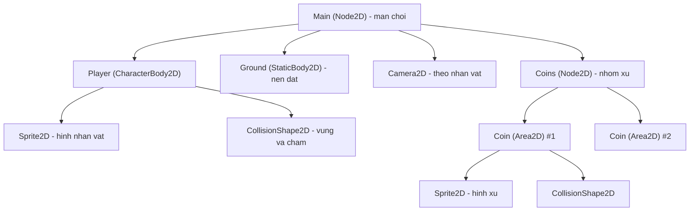
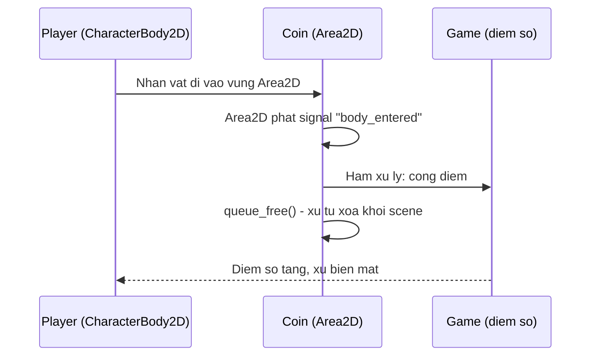
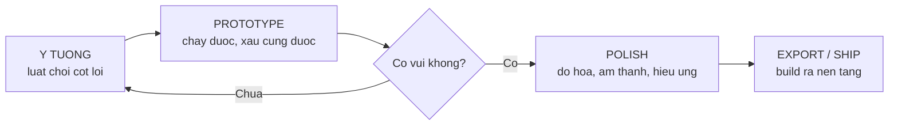

# Làm game đầu tiên với Godot

> **Tác giả:** Mr.Rom\
> **Phiên bản:** v1.0.0\
> **Tạo lúc:** 22/06/2026\
> **Cập nhật:** 22/06/2026\
> **Level:** Basic\
> **Tags:** game-dev, godot, gdscript, game-engine, characterbody2d, scene-tree, signal\
> **Yêu cầu trước:** [Physics, Input & Audio](03_physics-input-and-audio.md)

> 🎯 *Bài cuối của cụm. Ba bài trước bạn đã hiểu **game loop**, **rendering**, và **physics/input/audio** — nhưng tự viết tay từng mảnh đó thì cực và dễ sai. Bài này bạn dùng **game engine** (cụ thể là **Godot**) để ráp tất cả lại thành một game 2D nhỏ chạy được thật: một nhân vật di chuyển trái/phải, nhảy, nhặt xu. Sau bài này bạn hiểu vì sao nên chọn Godot khi mới bắt đầu, đọc được cấu trúc một project Godot (scene tree, node, `_ready()`, `_process(delta)`), viết được một đoạn GDScript điều khiển nhân vật đúng API Godot 4, nắm cách bắt sự kiện nhặt xu bằng signal, và biết lộ trình từ ý tưởng tới game xuất ra được nhiều nền tảng.*

## 🎯 Sau bài này bạn sẽ

- [ ] Giải thích được vì sao **Godot** là lựa chọn tốt cho người mới (free, nhẹ, GDScript giống Python)
- [ ] Đọc được cấu trúc project Godot: **scene tree**, **node**, và hai hàm vòng đời `_ready()` / `_process(delta)`
- [ ] Viết được một script GDScript **đúng cú pháp Godot 4** gắn vào `CharacterBody2D` để nhân vật di chuyển theo input, dùng `delta` đúng cách
- [ ] Hiểu ở mức khái niệm cách bắt sự kiện **nhặt xu** bằng `Area2D` + **signal**
- [ ] Nắm vòng đời làm game: **ý tưởng → prototype → polish** và cách **export/build** ra nền tảng
- [ ] Biết lộ trình học tiếp sau khi đã làm xong game đầu tiên

---

## Tình huống — ba bài vừa rồi, bạn đã tự viết lại cả cái bánh xe

Quay lại hành trình của cụm này. Bài [game loop](01_game-loop-and-architecture.md) bạn tự tay viết vòng lặp `while running:` — đọc input, cập nhật trạng thái, vẽ frame, lặp lại. Bài [rendering](02_graphics-and-rendering-basics.md) bạn lo chuyện vẽ sprite, quản lý toạ độ, frame rate. Bài [physics, input & audio](03_physics-input-and-audio.md) bạn xử lý va chạm, trọng lực, phím bấm, phát âm thanh — mỗi thứ vài chục dòng code, và sai một dấu là nhân vật xuyên tường hoặc rơi tự do mãi mãi.

Tất cả những thứ đó **đều đúng và đáng học** — bạn cần hiểu chúng để biết "bên dưới ngầm chạy gì". Nhưng giờ thử tưởng tượng làm một game thật, dù chỉ nhỏ thôi: bạn còn phải lo cửa sổ, scaling theo độ phân giải, đọc file ảnh đủ định dạng, animation, lưu/tải game, build ra Windows/macOS/Linux/Android/Web... Viết tay tất cả từ con số 0 là việc của **cả một đội**, mất hàng tháng, và chưa chạm tới nội dung game.

Đây chính là lúc câu hỏi tự nhiên xuất hiện: *Có ai làm sẵn phần "khung xương" lặp đi lặp lại đó cho mình chưa, để mình chỉ tập trung vào phần "game" thật sự?*

→ Có — và thứ đó tên là **game engine**. Bài này ta dùng một engine cụ thể, **Godot**, để ráp lại đúng cái game nhỏ đã theo ta suốt cụm: nhân vật di chuyển, nhảy, nhặt xu. Bạn sẽ ngạc nhiên là phần code "tự viết" còn lại ngắn đến mức nào.

---

## 1️⃣ Game engine là gì, và vì sao chọn Godot khi mới bắt đầu?

Trước khi mở Godot, làm rõ **engine** giải quyết bài toán gì.

Ba bài trước, mỗi thứ bạn viết tay — game loop, rendering, physics — là một mảnh **lặp lại ở mọi game**. Game nào cũng cần một vòng lặp, cũng cần vẽ hình, cũng cần phát hiện va chạm. Vậy nên có người gom hết những mảnh lặp-đi-lặp-lại đó thành một bộ công cụ chung, làm sẵn, tối ưu sẵn — để bạn không phải viết lại lần thứ một nghìn.

**Định nghĩa:** *Game engine* (cỗ máy làm game) là một bộ phần mềm cung cấp sẵn các thành phần nền tảng của một game — game loop, hệ thống rendering, physics, xử lý input, âm thanh, quản lý cảnh, và công cụ build ra nhiều nền tảng — để lập trình viên tập trung vào **nội dung và luật chơi** thay vì hạ tầng.

🪞 **Ẩn dụ — engine như một căn bếp có sẵn đồ:**
> Tự viết game từ đầu giống như muốn nấu một bữa ăn nhưng phải tự rèn dao, tự đúc nồi, tự kéo đường ống nước trước đã. Dùng engine giống như bước vào một **căn bếp đầy đủ đồ** — dao, nồi, bếp, nước nóng đều sẵn. Bạn chỉ cần mang nguyên liệu (ý tưởng game, hình ảnh, âm thanh) vào và **nấu**. Engine không nấu hộ bạn, nhưng nó lo toàn bộ phần "hạ tầng bếp núc" mà ai nấu cũng cần.

Có nhiều engine: Unity, Unreal, GameMaker, Godot... Vậy vì sao bài này chọn **Godot** cho người mới? Đây là các lý do thực tế, không phải vì "nó hot":

- **Free và mã nguồn mở thật sự** — Godot phát hành dưới giấy phép MIT. Không phí bản quyền, không chia doanh thu, không "trả tiền khi game kiếm được X đô" như một số engine khác. Bạn làm game thương mại cũng không nợ Godot đồng nào.
- **Nhẹ** — bản tải về chỉ khoảng vài chục MB, chạy được trên máy yếu, mở lên trong vài giây. So với các engine vài chục GB, đây là lợi thế lớn cho người mới chỉ muốn thử nghiệm nhanh.
- **GDScript giống Python** — ngôn ngữ script chính của Godot là *GDScript*, cú pháp rất gần Python: thụt lề thay vì dấu ngoặc nhọn, dễ đọc, dễ viết. Người mới không phải vật lộn với C++ hay C# ngay từ đầu. (Godot vẫn hỗ trợ C# nếu bạn cần.)
- **Thiết kế dựa trên scene + node trực quan** — mọi thứ trong Godot là một **node**, ghép lại thành **scene**. Mô hình này dễ hình dung và dễ tái sử dụng — ta sẽ thấy ngay ở mục sau.

> [!NOTE]
> Bài này dùng **Godot 4** (dòng phiên bản hiện hành năm 2026). Một số API đã đổi so với Godot 3 — ví dụ class điều khiển nhân vật 2D đổi từ `KinematicBody2D` (Godot 3) thành `CharacterBody2D` (Godot 4), và `move_and_slide()` không còn nhận tham số vận tốc nữa. Mọi code trong bài là chuẩn Godot 4; nếu bạn xem tutorial cũ thấy cú pháp khác, nhiều khả năng đó là Godot 3.

→ Hiểu engine là "căn bếp có sẵn đồ" rồi, giờ ta xem cái bếp Godot bày biện thế nào — bắt đầu từ khái niệm trung tâm: scene tree và node.

---

## 2️⃣ Cấu trúc một project Godot: scene, node, scene tree

Mở một project Godot, thứ đầu tiên đập vào mắt không phải code, mà là một **cây các ô vuông có tên** ở góc màn hình. Đó là **scene tree** — và hiểu nó là hiểu 80% cách Godot tổ chức một game.

### Node — viên gạch nhỏ nhất

Trong Godot, **mọi thứ đều là một node** (nút). Một hình ảnh trên màn hình là một node. Một va chạm vật lý là một node. Một nút bấm UI, một nguồn âm thanh, một camera — tất cả đều là node. Mỗi loại node làm **một việc** và có sẵn các thuộc tính/hàm cho việc đó.

🪞 **Ẩn dụ — node như các viên LEGO chuyên dụng:**
> Mỗi node giống một viên LEGO có chức năng riêng: viên thì là "bánh xe", viên là "đèn", viên là "động cơ". Bản thân một viên không làm nên cái xe — nhưng **ghép nhiều viên theo cấu trúc cha-con** thì thành một chiếc xe hoàn chỉnh. Node trong Godot cũng vậy: ghép một node "thân nhân vật" với node con "hình ảnh", node con "vùng va chạm", node con "âm thanh" → thành một nhân vật game hoàn chỉnh.

Vài node thường gặp với game 2D — đây là nhóm node ta sẽ dùng để dựng nhân vật và xu, nên điểm qua từng cái:

- **`Node2D`** — node 2D cơ bản, có vị trí/xoay/co giãn. Là "gốc" cho hầu hết object 2D.
- **`CharacterBody2D`** — thân vật lý cho nhân vật do người chơi điều khiển (di chuyển bằng code, không bị physics đẩy lung tung). Đây là node chính của nhân vật.
- **`Sprite2D`** — hiển thị một hình ảnh (sprite) lên màn hình.
- **`CollisionShape2D`** — định nghĩa **hình dạng va chạm** (hình tròn, chữ nhật...) cho node cha của nó.
- **`Area2D`** — một vùng phát hiện "có gì đi vào/ra" mà **không** chặn vật lý. Dùng cho xu, vùng sát thương, công tắc...

### Scene — một nhóm node ghép lại, có thể tái dùng

Khi bạn ghép vài node theo quan hệ **cha-con** thành một cây nhỏ và lưu lại thành file, bạn có một **scene** (cảnh). Một scene có thể là cả một màn chơi, cũng có thể chỉ là **một object tái sử dụng** — ví dụ scene "Player" gồm thân + hình + va chạm, hay scene "Coin" gồm vùng phát hiện + hình xu.

Điểm mạnh: một scene đã làm xong có thể được **nhúng** vào scene khác như một viên gạch. Làm scene "Coin" một lần, rồi rải 50 đồng xu khắp màn chơi chỉ bằng cách kéo-thả 50 bản sao. Đây gọi là *instancing* (nhân bản scene).

### Scene tree — toàn bộ cây node đang chạy

Khi game chạy, tất cả các scene đang hoạt động ghép thành **một cây node lớn duy nhất** — gọi là **scene tree**. Godot duyệt cây này mỗi frame để cập nhật và vẽ mọi node. Có đúng một node gốc; mọi thứ khác là con cháu của nó.

Đây là phần trừu tượng nhất — "một cây node lồng nhau" — nên ta xem nó qua sơ đồ. Dưới đây là scene tree của chính cái game nhỏ ta sắp dựng: một màn chơi (`Main`) chứa nhân vật (`Player`), vài đồng xu (`Coin`), nền (`Ground`), và camera. Đọc từ trên xuống theo quan hệ cha-con:



→ Điểm cần khắc sâu từ sơ đồ: một node **không sống đơn độc**, nó luôn nằm ở một vị trí trong cây và **thừa hưởng vị trí từ node cha**. Di chuyển `Player`, thì `Sprite2D` và `CollisionShape2D` con của nó **đi theo** — bạn không phải đồng bộ tay. Đây chính là thứ giúp scene tree gọn gàng: bạn gom các mảnh liên quan vào một node cha, rồi thao tác trên node cha.

> [!NOTE]
> Phân biệt nhanh ba loại "body" vật lý 2D trong Godot 4, vì người mới hay nhầm: **`StaticBody2D`** — vật đứng yên (nền, tường); **`CharacterBody2D`** — vật di chuyển bằng code do bạn điều khiển (nhân vật); **`RigidBody2D`** — vật để physics tự lo hoàn toàn (thùng gỗ rơi, bóng nảy). Nhân vật người chơi gần như luôn là `CharacterBody2D`.

---

## 3️⃣ Hai hàm vòng đời cốt lõi: `_ready()` và `_process(delta)`

Nhớ lại bài [game loop](01_game-loop-and-architecture.md): mọi game đều có vòng lặp "cập nhật → vẽ → lặp lại" chạy mỗi frame. Godot **đã viết sẵn** vòng lặp đó cho bạn. Việc của bạn chỉ là **móc** code của mình vào đúng thời điểm trong vòng lặp — và Godot làm điều đó qua các **hàm vòng đời** (lifecycle callback) mà bạn định nghĩa trong script gắn vào node.

Hai hàm quan trọng nhất với người mới:

- **`_ready()`** — Godot gọi **một lần duy nhất**, ngay khi node (và toàn bộ con của nó) đã vào scene tree và sẵn sàng. Đây là nơi đặt code khởi tạo: gán giá trị ban đầu, tìm node khác, kết nối signal...
- **`_process(delta)`** — Godot gọi **mỗi frame**, càng nhiều frame/giây thì gọi càng nhiều lần. Tham số `delta` là **số giây đã trôi qua kể từ frame trước** (ví dụ ~0.0166 giây nếu game chạy 60 FPS). Đây là nơi đặt code chạy liên tục: cập nhật vị trí, kiểm tra trạng thái...

🪞 **Ẩn dụ — `_ready()` là mở màn, `_process()` là từng nhịp diễn:**
> Hình dung node là một diễn viên trên sân khấu. `_ready()` là lúc **đèn vừa bật** — diễn viên vào vị trí, chỉnh trang phục, hít một hơi. Việc này chỉ làm **một lần** đầu vở. `_process(delta)` là **từng nhịp diễn** sau đó — mỗi giây diễn viên nhúc nhích, nói, di chuyển. `delta` cho biết "nhịp này dài bao lâu" để diễn viên bước đúng tốc độ dù sân khấu lúc nhanh lúc chậm.

### Vì sao `delta` quan trọng đến vậy?

Đây là điểm người mới hay bỏ qua và trả giá. Máy mạnh chạy 120 FPS, máy yếu chạy 30 FPS — nghĩa là `_process()` được gọi **số lần khác nhau mỗi giây** trên các máy khác nhau. Nếu bạn di chuyển nhân vật theo kiểu "mỗi frame cộng 5 pixel", thì trên máy 120 FPS nhân vật chạy **nhanh gấp 4 lần** máy 30 FPS — game không công bằng, không kiểm soát được.

Cách đúng: nhân tốc độ với `delta`. Khi đó "5 pixel mỗi frame" thành **"300 pixel mỗi giây"** (vì `300 * delta` cộng dồn qua các frame luôn ra ~300 pixel/giây bất kể FPS). Tốc độ trở nên **độc lập với frame rate** — đây là lý do `delta` xuất hiện ở khắp nơi trong code game.

Để thấy cụ thể, đây là script tối giản nhất gắn vào một node, in ra thứ tự gọi của hai hàm. Mục tiêu là **tận mắt thấy** `_ready()` chạy một lần còn `_process()` chạy liên tục:

```gdscript
# minimal.gd — gắn vào một Node bất kỳ để quan sát vòng đời
extends Node2D

func _ready() -> void:
	# Chạy MỘT lần khi node sẵn sàng
	print("Node san sang! _ready() chi chay 1 lan.")

func _process(delta: float) -> void:
	# Chạy MỖI frame; delta = số giây từ frame trước
	print("Frame moi — delta = ", delta, " giay")
```

Khi chạy scene, Output panel của Godot sẽ in:

```text
Node san sang! _ready() chi chay 1 lan.
Frame moi — delta = 0.016667 giay
Frame moi — delta = 0.016668 giay
Frame moi — delta = 0.016665 giay
...(lặp lại mỗi frame, không dừng)
```

Đọc output này để nắm chắc:

- **Dòng đầu** chỉ xuất hiện **một lần** — đó là `_ready()`. Mọi khởi tạo đặt ở đây.
- **Các dòng sau lặp vô hạn** — đó là `_process()`, mỗi dòng là một frame. Giá trị `delta` quanh `0.0166` nghĩa là game đang chạy ~60 FPS (`1 / 60 ≈ 0.0166`). Nếu máy chậm lại, `delta` sẽ to lên (ví dụ `0.033` cho 30 FPS) — và đó chính là tín hiệu để code dùng `delta` tự bù tốc độ.

> [!TIP]
> Trong GDScript, **thụt lề bằng Tab** (mặc định của Godot editor) và **dấu hai chấm `:` cuối dòng** `func`/`if`/`for` là bắt buộc — giống Python. Code trên dùng Tab để thụt lề. Nếu trộn Tab và Space, Godot sẽ báo lỗi indentation. Phần `-> void` và `delta: float` là **type hint** (gợi ý kiểu) — không bắt buộc nhưng nên dùng vì giúp bắt lỗi sớm và editor gợi ý tốt hơn.

→ Có hai hàm vòng đời rồi, giờ ta dùng `_process`-cùng-họ để làm việc thật sự thú vị: điều khiển nhân vật di chuyển theo phím bấm.

---

## 4️⃣ GDScript thực chiến — điều khiển `CharacterBody2D` di chuyển và nhảy

Đây là trái tim của bài: viết script gắn vào nhân vật `Player` để nó di chuyển trái/phải và nhảy theo input của người chơi. Ta dùng đúng API Godot 4.

### Vài API Godot 4 cần biết trước

Trước khi đọc code, làm rõ bốn thứ then chốt — đây là nhóm khái niệm cả script dựa vào, nên nắm trước:

- **`velocity`** — `CharacterBody2D` có sẵn một thuộc tính `velocity` kiểu `Vector2` (vector 2 chiều: `x` ngang, `y` dọc). Đây là **vận tốc hiện tại** của nhân vật, đơn vị pixel/giây. Bạn chỉ việc gán giá trị mong muốn vào nó.
- **`move_and_slide()`** — hàm của `CharacterBody2D`. Ở Godot 4 nó **không nhận tham số** — nó tự lấy `velocity` hiện tại, di chuyển nhân vật, **tự xử lý va chạm** (trượt dọc tường/sàn thay vì xuyên qua), rồi cập nhật lại `velocity` cho khớp thực tế. Ta chỉ cần gán `velocity` rồi gọi `move_and_slide()`.
- **`Input.get_axis("trai", "phai")`** — hàm tiện lợi đọc input theo **trục**. Nó trả về `-1.0` nếu chỉ phím "trai" được giữ, `+1.0` nếu chỉ "phai", `0.0` nếu không giữ gì hoặc giữ cả hai. Gọn hơn nhiều so với viết `if`/`else` cho từng phím.
- **`is_on_floor()`** — hàm trả về `true` nếu nhân vật đang đứng trên một bề mặt (sàn/đất). Dùng để chỉ cho nhảy **khi đang đứng đất**, tránh nhảy giữa không trung.

> [!NOTE]
> `Input.get_axis()` dùng tên các **input action** (hành động) mà bạn định nghĩa trước trong `Project → Project Settings → Input Map`. Trong ví dụ này mình đặt hai action tên `"move_left"` và `"move_right"` (gán cho phím A/D hoặc mũi tên trái/phải), và một action `"jump"` (gán cho phím Space). Đây là cách Godot tách "ý định" (nhảy, đi trái) khỏi "phím cụ thể" — sau này muốn đổi phím chỉ sửa Input Map, không sửa code.

### Script đầy đủ cho nhân vật

Đoạn code dưới gắn vào node `Player` (loại `CharacterBody2D`). Logic chia rõ thành các bước: tính chuyển động ngang theo input, áp trọng lực, xử lý nhảy, rồi gọi engine di chuyển. Mọi tốc độ đều nhân với `delta` ở đúng chỗ để độc lập frame rate:

```gdscript
# player.gd — gắn vào node Player (CharacterBody2D)
extends CharacterBody2D

# Các hằng số điều chỉnh cảm giác điều khiển (đơn vị pixel)
const SPEED: float = 300.0          # tốc độ chạy ngang (pixel/giây)
const JUMP_VELOCITY: float = -450.0 # lực nhảy: âm vì trục Y hướng XUỐNG
const GRAVITY: float = 980.0        # trọng lực kéo xuống (pixel/giây^2)

func _physics_process(delta: float) -> void:
	# 1. Áp trọng lực khi đang ở trên không
	if not is_on_floor():
		velocity.y += GRAVITY * delta

	# 2. Nhảy — chỉ khi đang đứng trên sàn
	if Input.is_action_just_pressed("jump") and is_on_floor():
		velocity.y = JUMP_VELOCITY

	# 3. Di chuyển ngang theo input (-1 trái, 0 đứng yên, +1 phải)
	var direction: float = Input.get_axis("move_left", "move_right")
	if direction != 0.0:
		velocity.x = direction * SPEED
	else:
		# Không bấm gì -> dừng hẳn (có thể thay bằng giảm dần cho mượt)
		velocity.x = move_toward(velocity.x, 0.0, SPEED)

	# 4. Để engine di chuyển + tự xử lý va chạm
	move_and_slide()
```

Đây là code **chạy được thật** trong Godot 4. Vài điểm cần phân tích kỹ để hiểu chứ không chỉ copy:

- **Trục Y hướng xuống.** Trong Godot (và đa số đồ hoạ 2D), `y` **dương là đi xuống**, âm là đi lên. Vì thế `JUMP_VELOCITY = -450` (số âm) mới làm nhân vật bật **lên**, và trọng lực `+980 * delta` cộng vào `velocity.y` kéo nhân vật **xuống**.
- **Vì sao dùng `_physics_process` chứ không `_process`?** Mọi thứ liên quan tới vật lý/va chạm nên đặt trong `_physics_process(delta)` — nó được gọi ở **nhịp cố định** (mặc định 60 lần/giây) đồng bộ với engine vật lý, nên va chạm ổn định hơn so với `_process` (chạy theo FPS màn hình). Cả hai đều nhận `delta`, dùng giống nhau.
- **`Input.get_axis("move_left", "move_right")`** thay cả khối `if/elif` đọc từng phím. Bấm trái → `-1.0`, bấm phải → `+1.0`. Nhân với `SPEED` ra vận tốc ngang.
- **`GRAVITY * delta` và `direction * SPEED`** — đây là chỗ `delta` "cứu" bạn: gia tốc trọng lực được nhân `delta` nên cộng dồn đúng ~980 pixel/giây² bất kể FPS. (`velocity.x` gán trực tiếp `SPEED` vì bản thân `move_and_slide()` đã tự nhân `delta` khi di chuyển — không nhân hai lần.)
- **`move_toward(velocity.x, 0.0, SPEED)`** — khi thả phím, kéo vận tốc ngang về 0 mượt thay vì khựng đột ngột. `move_toward(a, b, step)` đưa `a` tiến về `b` mỗi lần một bước `step`.

> [!WARNING]
> Lỗi kinh điển khi chuyển từ tutorial Godot 3: viết `move_and_slide(velocity)` (truyền vận tốc làm tham số). Ở **Godot 4 hàm này KHÔNG nhận tham số** — bạn gán `velocity` trước rồi gọi `move_and_slide()` không có gì trong ngoặc. Viết sai sẽ báo lỗi "too many arguments". Đây là một trong những khác biệt Godot 3 → 4 hay gây vấp nhất.

→ Nhân vật đã chạy và nhảy được. Nhưng game của ta còn có **xu để nhặt** — và đó là lúc cần một cơ chế khác: `Area2D` và signal.

---

## 5️⃣ Nhặt xu — `Area2D` + signal (mức khái niệm)

Nhân vật chạm vào xu thì xu biến mất và điểm tăng lên. Câu hỏi: làm sao "biết" lúc nhân vật chạm xu? Ta **không** muốn xu chặn đường nhân vật như tường — xu chỉ cần **phát hiện** có ai đi vào nó. Đó đúng là việc của **`Area2D`**.

🪞 **Ẩn dụ — `Area2D` như cảm biến cửa tự động:**
> `Area2D` giống **cảm biến ở cửa siêu thị tự động**: nó không chặn bạn lại, không đẩy bạn ra, chỉ **phát hiện** "có người vừa bước vào vùng" rồi báo cho hệ thống mở cửa. Đồng xu cũng vậy — nó không cản nhân vật, chỉ phát hiện "nhân vật vừa chạm vào" rồi báo "cho cộng điểm và biến mất".

### Signal — cách các node "báo tin" cho nhau

Khi `Area2D` phát hiện có vật khác đi vào vùng của nó, nó **phát ra một signal** (tín hiệu) tên `body_entered`. **Signal** là cơ chế Godot dùng để một node **thông báo "có chuyện vừa xảy ra"** mà không cần biết ai đang lắng nghe.

🪞 **Ẩn dụ — signal như chuông cửa:**
> Signal giống **cái chuông cửa**. Khi có khách (sự kiện xảy ra), chuông kêu (signal phát ra). Người trong nhà *đăng ký* nghe chuông từ trước (kết nối signal với một hàm) sẽ chạy ra mở cửa (chạy hàm xử lý). Cái chuông không cần biết ai sẽ ra mở — nó chỉ kêu. Ai đã đăng ký thì người đó phản ứng. Đây là kiểu giao tiếp **lỏng lẻo** (loose coupling): node phát signal và node xử lý không phụ thuộc cứng vào nhau.

### Luồng nhặt xu, từng bước

Ở mức khái niệm, một đồng xu là scene `Coin` gồm một `Area2D` (vùng phát hiện) + `Sprite2D` (hình xu) + `CollisionShape2D` (hình dạng vùng). Luồng xử lý nhặt xu diễn ra thế này — đây là chuỗi sự kiện nên đọc tuần tự:



→ Mấu chốt: đồng xu **tự lo phần của nó** — phát hiện va chạm và tự xoá — còn việc cộng điểm được "báo" qua signal. Nhân vật thậm chí **không cần biết** đồng xu tồn tại; nó chỉ chạy, và xu nào nó chạm phải thì xu đó tự xử lý. Đây là sức mạnh của thiết kế node + signal: mỗi mảnh độc lập, ráp lại thành game.

Để cụ thể, đây là script gắn vào node `Coin` (loại `Area2D`). Nó tự kết nối signal `body_entered` của chính mình tới một hàm xử lý ngay trong `_ready()`:

```gdscript
# coin.gd — gắn vào node Coin (Area2D)
extends Area2D

func _ready() -> void:
	# Kết nối signal "body_entered" của chính Area2D này
	# tới hàm _on_body_entered bên dưới
	body_entered.connect(_on_body_entered)

# Godot gọi hàm này khi có một body đi vào vùng Area2D
func _on_body_entered(body: Node2D) -> void:
	# Chỉ phản ứng nếu vật đi vào nằm trong nhóm "player"
	if body.is_in_group("player"):
		print("Nhat duoc 1 xu!")
		# TODO: ở đây sẽ cộng điểm vào hệ thống điểm số của game
		queue_free()  # xoá đồng xu này khỏi scene một cách an toàn
```

Chạy game và cho nhân vật chạm vào xu, Output panel in:

```text
Nhat duoc 1 xu!
```

Và đồng xu biến mất khỏi màn hình. Vài điểm cần làm rõ:

- **`body_entered.connect(_on_body_entered)`** — đây là cách kết nối signal bằng code ở Godot 4 (`signal.connect(ham)`). Bạn cũng có thể kết nối qua giao diện kéo-thả trong tab "Node → Signals" của editor mà không viết dòng này — kết quả như nhau.
- **`body.is_in_group("player")`** — kiểm tra vật vừa chạm có thuộc **group** (nhóm) tên `"player"` không. Group là cách Godot gắn nhãn node để lọc nhanh. Nhờ đó xu chỉ phản ứng với nhân vật, không phản ứng với, ví dụ, một viên đạn bay qua.
- **`queue_free()`** — yêu cầu Godot **xoá node này một cách an toàn** ở cuối frame (không xoá ngay giữa lúc đang xử lý, tránh crash). Đây là cách chuẩn để loại một object khỏi game.

> [!NOTE]
> Phần điểm số (TODO trong code) cố tình để trống vì nó tuỳ cách bạn tổ chức game — thường dùng một node "tự trị" (autoload/singleton) giữ biến `score` để mọi scene truy cập. Ở mức bài Basic này, chỉ cần hiểu **luồng**: `Area2D` phát hiện → signal `body_entered` → hàm xử lý cộng điểm + `queue_free()`. Cách quản lý điểm số chi tiết thuộc phạm vi bài nâng cao hơn.

---

## 6️⃣ Vòng đời làm game: ý tưởng → prototype → polish

Bạn đã có nhân vật chạy/nhảy và xu nhặt được — về mặt kỹ thuật, đủ mảnh để ráp một game. Nhưng "làm game" không chỉ là viết code; nó là một **quy trình** lặp đi lặp lại. Hiểu quy trình này giúp bạn không sa lầy vào việc đánh bóng đồ hoạ trong khi game còn chưa biết có vui không.

Quy trình gọn cho người mới gồm ba giai đoạn nối tiếp. Đây là chuỗi có thứ tự, nên xem qua sơ đồ trước rồi phân tích:



→ Điểm cốt lõi từ sơ đồ: vòng giữa **ý tưởng ↔ prototype** lặp lại nhiều lần *trước khi* đụng tới polish. Đừng vẽ nhân vật đẹp lung linh khi còn chưa biết cơ chế nhảy/nhặt xu có vui không. Cùng phân tích từng giai đoạn:

- **Ý tưởng (idea).** Viết ra **luật chơi cốt lõi** bằng một câu: *"nhân vật chạy qua màn, nhảy tránh chướng ngại, nhặt càng nhiều xu càng tốt"*. Càng gọn càng tốt. Người mới hay chết ở chỗ ôm ý tưởng quá lớn (game open-world!) rồi bỏ cuộc. Một game nhỏ **hoàn thành** giá trị hơn một game lớn dang dở.
- **Prototype.** Dựng nhanh phiên bản **chạy được nhưng xấu** — dùng hình vuông màu thay nhân vật, không âm thanh, không menu. Mục tiêu duy nhất: trả lời câu hỏi *"cơ chế này có vui không?"*. Đây đúng là cái bạn vừa làm với Godot ở các mục trên. Nếu chơi thử thấy nhạt → quay lại sửa ý tưởng, **trước khi** tốn công làm đẹp.
- **Polish (đánh bóng).** Khi cơ chế đã vui, mới đầu tư: thay hình vuông bằng sprite đẹp, thêm âm thanh nhặt xu/nhảy (nhớ bài [physics, input & audio](03_physics-input-and-audio.md)), thêm hiệu ứng, menu, màn chơi. Đây là giai đoạn ngốn nhiều công nhất — nên chỉ làm khi chắc chắn game đáng được đánh bóng.

> [!TIP]
> Quy tắc vàng cho game đầu tay: **làm cái gì đó chơi được trong thời gian ngắn nhất, rồi mới cải thiện.** "Một game tệ đã hoàn thành" dạy bạn nhiều hơn "một game tuyệt vời mãi không xong". Phần lớn người bỏ cuộc làm game không phải vì thiếu kỹ năng, mà vì chọn dự án quá lớn cho lần đầu.

---

## 7️⃣ Export — đưa game ra nhiều nền tảng

Game chạy trong editor mới chỉ là bạn chơi. Để **người khác** chơi, bạn cần **export** (xuất bản) thành file chạy độc lập cho từng nền tảng. Đây là một trong những điểm mạnh nhất của Godot: cùng một project, build ra nhiều nền tảng mà gần như không sửa code.

🪞 **Ẩn dụ — export như đóng gói món ăn mang đi:**
> Trong editor, game giống món ăn bạn nấu và ăn ngay tại bếp. Export giống **đóng hộp món ăn để giao đi** — hộp cho Windows, hộp cho Android, hộp cho web. Cùng một món, nhưng đóng gói khác nhau tuỳ nơi nhận. Godot lo phần đóng gói; bạn chỉ chọn "giao tới đâu".

Cách export trong Godot, ở mức tổng quan:

1. Vào menu **`Project → Export`**.
2. Thêm một **export preset** (cấu hình xuất) cho nền tảng muốn build: Windows Desktop, macOS, Linux, Android, iOS, hoặc **Web (HTML5)**.
3. Lần đầu, Godot yêu cầu tải về **export templates** (gói khuôn xuất bản — các file engine biên dịch sẵn cho từng nền tảng). Tải một lần, dùng cho mọi project.
4. Bấm **Export Project**, chọn nơi lưu → Godot tạo ra file chạy được (`.exe` cho Windows, `.apk` cho Android, một thư mục `.html`+`.wasm` cho Web...).

> [!NOTE]
> Một số nền tảng cần thêm công cụ riêng: build **Android** cần cài Android SDK + Java; build **iOS** cần máy Mac + Xcode; build **Web** thì chạy được ngay trong trình duyệt, không cần cài đặt máy người chơi — rất hợp để chia sẻ game thử nghiệm qua một đường link. Với game đầu tay, **export Web hoặc Desktop** là dễ nhất để bạn bè chơi thử ngay.

→ Điểm đáng nhớ: **"viết một lần, chạy nhiều nơi"** là lợi thế lớn của việc dùng engine. Nếu tự viết game bằng tay như ba bài đầu, mỗi nền tảng bạn phải lo lại từ đầu chuyện cửa sổ, input, đồ hoạ. Godot gánh toàn bộ phần đó.

---

## 8️⃣ Lộ trình học tiếp sau game đầu tiên

Bạn vừa đi hết vòng: hiểu engine, dựng scene tree, viết GDScript điều khiển nhân vật, bắt signal nhặt xu, nắm quy trình và export. Đây là nền vững. Vài hướng đi tiếp, từ gần tới xa:

- **Hoàn thiện chính game này.** Thêm chướng ngại để tránh (như đề bài xuyên suốt cụm), thêm màn thua khi chạm chướng ngại, hiển thị điểm số lên UI (node `Label`/`CanvasLayer`), thêm âm thanh. Đây là cách học tốt nhất — biến prototype thành game thật.
- **Học sâu hệ thống node của Godot.** Tìm hiểu `AnimationPlayer` (hoạt hoạ), `AnimatedSprite2D` (sprite nhiều khung), `Timer`, `TileMap` (dựng màn chơi bằng ô gạch), và **autoload/singleton** để quản lý điểm số/trạng thái game toàn cục.
- **Nắm chắc signal và scene instancing.** Hai khái niệm này là xương sống kiến trúc Godot. Luyện đến mức tự thiết kế được "ai phát signal, ai nghe" cho một game vừa.
- **Làm theo tutorial chính thức.** Godot có series "Your first 2D game" (Dodge the Creeps) trong tài liệu chính thức — làm hết một lần để thấy mọi mảnh ráp vào nhau thành game hoàn chỉnh.
- **Tham gia game jam.** Khi đã tự tin, thử một **game jam** (cuộc thi làm game trong thời gian ngắn) — đây là cách rèn "làm xong một game nhỏ trọn vẹn" nhanh nhất.

→ Khép lại cụm `game-dev`: bạn bắt đầu từ "phát triển game là gì", đi qua game loop, rendering, physics/input/audio — toàn bộ là **hiểu bên dưới ngầm chạy gì** — và đến bài này thì dùng một engine để **ráp tất cả lại thành game thật**. Từ đây trở đi, mỗi game bạn làm chỉ là lặp lại vòng ý tưởng → prototype → polish → export, với công cụ ngày một quen tay.

---

## 💡 Cạm bẫy thường gặp & Best practice

### ❌ Cạm bẫy: di chuyển theo "pixel mỗi frame" thay vì nhân `delta`

- **Triệu chứng**: nhân vật chạy nhanh trên máy mạnh (FPS cao), chậm trên máy yếu (FPS thấp); game "cảm giác" khác nhau mỗi máy.
- **Nguyên nhân**: code kiểu `position.x += 5` cộng cố định mỗi frame, mà số frame/giây lại khác nhau tuỳ máy.
- **Cách tránh**: luôn nhân tốc độ với `delta` cho chuyển động/gia tốc tự code (`velocity.y += GRAVITY * delta`), để tốc độ tính theo **giây** chứ không theo frame. Lưu ý: bản thân `move_and_slide()` đã tự áp `delta` khi di chuyển, nên `velocity.x` gán thẳng `SPEED` là đúng — đừng nhân `delta` hai lần.

### ❌ Cạm bẫy: dùng cú pháp Godot 3 trong Godot 4

- **Triệu chứng**: lỗi "too many arguments" ở `move_and_slide()`, hoặc không tìm thấy class `KinematicBody2D`.
- **Nguyên nhân**: làm theo tutorial cũ. Godot 4 đổi `KinematicBody2D` → `CharacterBody2D`, và `move_and_slide(velocity)` → gán `velocity` rồi gọi `move_and_slide()` không tham số.
- **Cách tránh**: kiểm tra phiên bản tutorial. Khi dùng Godot 4, gán `velocity` (thuộc tính có sẵn) trước, rồi gọi `move_and_slide()` rỗng. Tìm tài liệu ghi rõ "Godot 4".

### ❌ Cạm bẫy: nhầm trục Y, nhân vật "nhảy xuống đất"

- **Triệu chứng**: bấm nhảy nhưng nhân vật lún xuống thay vì bật lên; trọng lực kéo nhân vật bay lên trời.
- **Nguyên nhân**: quên rằng trong Godot **Y dương hướng xuống**. Đặt `JUMP_VELOCITY` dương hoặc trọng lực âm là ngược.
- **Cách tránh**: nhớ quy ước — muốn đi **lên** thì `velocity.y` phải **âm** (`JUMP_VELOCITY = -450`); trọng lực kéo **xuống** nên cộng số **dương** vào `velocity.y`.

### ✅ Best practice: tách input bằng Input Map, đừng hardcode phím

- **Vì sao**: hardcode `KEY_SPACE` trong code khiến đổi phím phải sửa code; cũng khó hỗ trợ nhiều thiết bị (bàn phím + gamepad).
- **Cách áp dụng**: định nghĩa **input action** trong `Project Settings → Input Map` (vd `"jump"`, `"move_left"`), rồi dùng `Input.is_action_pressed("jump")` / `Input.get_axis("move_left", "move_right")`. Muốn đổi phím chỉ sửa Input Map, không đụng code.

### ✅ Best practice: prototype trước, polish sau

- **Vì sao**: đánh bóng đồ hoạ/âm thanh cho một cơ chế chưa chắc vui là lãng phí lớn; nhiều game đầu tay chết vì sa lầy ở polish.
- **Cách áp dụng**: dựng phiên bản "hình vuông màu, không âm thanh" chạy được càng nhanh càng tốt, chơi thử để xác nhận vui, rồi mới đầu tư làm đẹp. Một game nhỏ hoàn thành hơn một game lớn dang dở.

---

## 🧠 Tự kiểm tra (Self-check)

**Q1.** Vì sao Godot là lựa chọn tốt cho người mới làm game? Nêu ít nhất ba lý do.

<details>
<summary>💡 Xem giải thích</summary>

- **Free và mã nguồn mở** (giấy phép MIT) — không phí bản quyền, không chia doanh thu, làm game thương mại cũng không nợ Godot.
- **Nhẹ** — bản tải chỉ vài chục MB, chạy được trên máy yếu, mở nhanh, hợp để thử nghiệm.
- **GDScript giống Python** — cú pháp thụt lề, dễ đọc dễ viết, người mới không phải vật lộn với C++ ngay.
- (Thêm) **Thiết kế scene + node trực quan** — mọi thứ là node ghép thành scene, dễ hình dung và tái sử dụng.

</details>

**Q2.** Phân biệt `_ready()` và `_process(delta)`. `delta` là gì và vì sao quan trọng?

<details>
<summary>💡 Xem giải thích</summary>

- **`_ready()`** — Godot gọi **một lần** khi node sẵn sàng vào scene tree. Nơi đặt code khởi tạo (gán giá trị ban đầu, kết nối signal...).
- **`_process(delta)`** — Godot gọi **mỗi frame**. Nơi đặt code chạy liên tục (cập nhật vị trí, kiểm tra trạng thái...).
- **`delta`** = số giây đã trôi qua kể từ frame trước (~0.0166s ở 60 FPS). Quan trọng vì FPS khác nhau giữa các máy: nếu di chuyển theo "pixel mỗi frame" thì máy nhanh chạy nhanh hơn máy chậm. Nhân tốc độ với `delta` biến nó thành "pixel mỗi giây" — **độc lập frame rate**, công bằng trên mọi máy.

</details>

**Q3.** Trong Godot 4, cách dùng `move_and_slide()` đúng là gì? Khác Godot 3 ra sao?

<details>
<summary>💡 Xem giải thích</summary>

Ở **Godot 4**: gán giá trị vào thuộc tính có sẵn **`velocity`** (kiểu `Vector2`), rồi gọi **`move_and_slide()` KHÔNG tham số**. Hàm tự lấy `velocity`, di chuyển nhân vật, xử lý va chạm (trượt dọc tường/sàn), và cập nhật lại `velocity`.

Khác Godot 3: ở Godot 3 phải truyền vận tốc làm tham số — `move_and_slide(velocity)` — và class nhân vật tên `KinematicBody2D`. Godot 4 đổi class thành `CharacterBody2D` và bỏ tham số của `move_and_slide()`. Viết kiểu cũ trong Godot 4 sẽ báo lỗi "too many arguments".

</details>

**Q4.** Trong Godot, muốn nhân vật **nhảy lên** thì `velocity.y` phải âm hay dương? Vì sao?

<details>
<summary>💡 Xem giải thích</summary>

Phải **âm**. Vì trong Godot (và đa số đồ hoạ 2D), trục **Y dương hướng XUỐNG**, âm hướng lên. Nên `JUMP_VELOCITY = -450` (âm) làm nhân vật bật lên; còn trọng lực kéo xuống nên ta cộng số **dương** (`velocity.y += GRAVITY * delta`) vào `velocity.y`.

</details>

**Q5.** Mô tả luồng nhặt xu dùng `Area2D` + signal. Vì sao dùng `Area2D` chứ không phải một body chặn đường?

<details>
<summary>💡 Xem giải thích</summary>

Đồng xu là `Area2D` — một vùng **phát hiện** vật đi vào mà **không chặn** vật lý (khác `StaticBody2D`/`CharacterBody2D` vốn chặn đường). Luồng:

1. Nhân vật đi vào vùng `Area2D` của xu.
2. `Area2D` phát signal **`body_entered`** kèm thông tin vật vừa vào.
3. Hàm xử lý (đã kết nối với signal) kiểm tra vật có phải nhân vật không (`is_in_group("player")`), nếu đúng thì **cộng điểm** và gọi **`queue_free()`** để xu tự xoá an toàn.

Dùng `Area2D` vì xu chỉ cần **phát hiện** chạm, không được cản đường nhân vật. Signal giúp xu "tự lo phần của nó" mà nhân vật không cần biết xu tồn tại — thiết kế lỏng lẻo, dễ mở rộng.

</details>

**Q6.** Vì sao nên prototype trước rồi mới polish? Quy tắc vàng cho game đầu tay là gì?

<details>
<summary>💡 Xem giải thích</summary>

Prototype trước (phiên bản chạy được nhưng xấu, hình vuông màu, không âm thanh) để **trả lời nhanh "cơ chế này có vui không?"** trước khi tốn công làm đẹp. Nếu polish sớm một cơ chế chưa chắc vui là lãng phí lớn — và nhiều game đầu tay chết vì sa lầy ở polish.

Quy tắc vàng: **làm cái gì đó chơi được trong thời gian ngắn nhất, rồi mới cải thiện.** Một game nhỏ **hoàn thành** dạy bạn nhiều hơn một game lớn mãi không xong. Phần lớn người bỏ cuộc vì chọn dự án quá lớn cho lần đầu, không phải vì thiếu kỹ năng.

</details>

---

## ⚡ Tra cứu nhanh (Cheatsheet)

### Hai hàm vòng đời cốt lõi

```gdscript
func _ready() -> void:
	# chạy MỘT lần khi node sẵn sàng — khởi tạo ở đây
	pass

func _process(delta: float) -> void:
	# chạy MỖI frame (theo FPS màn hình) — delta = giây từ frame trước
	pass

func _physics_process(delta: float) -> void:
	# chạy nhịp cố định (60/giây) — dùng cho vật lý/va chạm
	pass
```

### Di chuyển CharacterBody2D (Godot 4)

```gdscript
extends CharacterBody2D

const SPEED := 300.0
const JUMP_VELOCITY := -450.0   # ÂM = bật lên (Y dương hướng xuống)
const GRAVITY := 980.0

func _physics_process(delta: float) -> void:
	if not is_on_floor():
		velocity.y += GRAVITY * delta
	if Input.is_action_just_pressed("jump") and is_on_floor():
		velocity.y = JUMP_VELOCITY
	velocity.x = Input.get_axis("move_left", "move_right") * SPEED
	move_and_slide()   # Godot 4: KHÔNG truyền tham số
```

### Bắt sự kiện bằng Area2D + signal

```gdscript
extends Area2D

func _ready() -> void:
	body_entered.connect(_on_body_entered)

func _on_body_entered(body: Node2D) -> void:
	if body.is_in_group("player"):
		queue_free()   # xoá node an toàn cuối frame
```

### Đọc input thường dùng

| Mục đích | Cú pháp |
|---|---|
| Đọc trục ngang/dọc (-1..+1) | `Input.get_axis("move_left", "move_right")` |
| Phím đang giữ | `Input.is_action_pressed("jump")` |
| Phím vừa bấm (1 frame) | `Input.is_action_just_pressed("jump")` |
| Phím vừa thả | `Input.is_action_just_released("jump")` |

### Bảng node 2D hay dùng

| Node | Dùng để |
|---|---|
| `CharacterBody2D` | Nhân vật di chuyển bằng code |
| `StaticBody2D` | Nền, tường (đứng yên) |
| `RigidBody2D` | Vật để physics tự lo (thùng rơi, bóng nảy) |
| `Sprite2D` | Hiển thị một hình ảnh |
| `CollisionShape2D` | Hình dạng va chạm cho node cha |
| `Area2D` | Vùng phát hiện (xu, vùng sát thương) |
| `Camera2D` | Camera bám theo nhân vật |

---

## 📚 Từ Điển Thuật Ngữ (Glossary)

| EN | VN | Giải thích |
|---|---|---|
| Game engine | Cỗ máy làm game | Bộ công cụ cung cấp sẵn game loop, rendering, physics, input, build... |
| Godot | Godot | Game engine free, mã nguồn mở (MIT), nhẹ; dùng GDScript |
| GDScript | GDScript | Ngôn ngữ script chính của Godot, cú pháp giống Python |
| Node | Nút | Viên gạch nhỏ nhất trong Godot; mỗi loại làm một việc |
| Scene | Cảnh | Một nhóm node ghép cha-con, lưu lại được, tái sử dụng được |
| Scene tree | Cây cảnh | Toàn bộ cây node đang chạy của game; Godot duyệt mỗi frame |
| Instancing | Nhân bản scene | Nhúng một scene đã làm vào scene khác như một viên gạch |
| `_ready()` | Hàm sẵn sàng | Gọi một lần khi node vào scene tree; nơi khởi tạo |
| `_process(delta)` | Hàm mỗi frame | Gọi mỗi frame theo FPS màn hình; `delta` = giây từ frame trước |
| `_physics_process(delta)` | Hàm mỗi nhịp vật lý | Gọi ở nhịp cố định (60/giây); dùng cho vật lý/va chạm |
| Delta | Delta (bước thời gian) | Số giây trôi qua từ frame trước; nhân với tốc độ để độc lập FPS |
| CharacterBody2D | Thân nhân vật 2D | Body di chuyển bằng code do người chơi điều khiển |
| StaticBody2D | Thân tĩnh 2D | Body đứng yên (nền, tường) |
| RigidBody2D | Thân vật lý 2D | Body để engine vật lý tự lo hoàn toàn |
| Velocity | Vận tốc | Thuộc tính `Vector2` của CharacterBody2D, đơn vị pixel/giây |
| `move_and_slide()` | Di chuyển và trượt | Hàm Godot 4: di chuyển theo `velocity` + tự xử lý va chạm (không tham số) |
| Vector2 | Vector 2 chiều | Cặp giá trị (x, y); dùng cho vị trí, vận tốc trong 2D |
| Input action | Hành động nhập | Tên "ý định" (jump, move_left) gán cho phím trong Input Map |
| Input Map | Bản đồ nhập | Bảng ánh xạ input action → phím/nút cụ thể trong Project Settings |
| Area2D | Vùng 2D | Node phát hiện vật đi vào/ra mà không chặn vật lý |
| Signal | Tín hiệu | Cơ chế node "báo có chuyện vừa xảy ra" cho node khác (như chuông cửa) |
| `body_entered` | Tín hiệu vật vào | Signal Area2D phát khi một body đi vào vùng của nó |
| Group | Nhóm | Nhãn gắn cho node để lọc/tìm nhanh (vd nhóm "player") |
| `queue_free()` | Xoá an toàn | Yêu cầu xoá node ở cuối frame, tránh crash giữa xử lý |
| Prototype | Bản mẫu | Phiên bản chạy được nhưng thô, để kiểm tra cơ chế có vui không |
| Polish | Đánh bóng | Giai đoạn làm đẹp: đồ hoạ, âm thanh, hiệu ứng, menu |
| Export | Xuất bản | Đóng gói project thành file chạy được cho từng nền tảng |
| Export template | Khuôn xuất bản | Gói engine biên dịch sẵn cho từng nền tảng, tải một lần |
| Game jam | Cuộc thi làm game | Cuộc thi làm game hoàn chỉnh trong thời gian ngắn |

---

## 🔗 Liên kết & Tài nguyên

⬅️ **Bài trước:** [Physics, Input & Audio](03_physics-input-and-audio.md)\
↑ **Về cụm:** [game-dev — README cụm](../../README.md)

### 🧭 Định hướng lộ trình học

- [Phát triển game là gì?](00_what-is-game-development.md) — bài mở cụm, bức tranh tổng về làm game
- [Game Loop & kiến trúc game](01_game-loop-and-architecture.md) — vòng lặp mà Godot đã viết sẵn cho bạn
- [Physics, Input & Audio](03_physics-input-and-audio.md) — bài trước, nền tảng physics/input/audio mà engine gói lại

### 🧩 Các chủ đề có thể bạn quan tâm

- [Đồ hoạ & Rendering cơ bản](02_graphics-and-rendering-basics.md) — hiểu sprite/rendering mà `Sprite2D` của Godot lo hộ
- [Game Loop & kiến trúc game](01_game-loop-and-architecture.md) — `_process`/`_physics_process` chính là game loop trong vỏ engine

### 🌐 Tài nguyên tham khảo khác

- [Godot Engine — trang chính thức](https://godotengine.org/) — tải engine (free) và xem giới thiệu
- [Godot Docs — Your first 2D game](https://docs.godotengine.org/en/stable/getting_started/first_2d_game/index.html) — tutorial chính thức làm game 2D đầu tiên từ đầu tới cuối
- [GDScript reference (Godot Docs)](https://docs.godotengine.org/en/stable/tutorials/scripting/gdscript/gdscript_basics.html) — cú pháp GDScript đầy đủ
- [Godot Docs — Using CharacterBody2D](https://docs.godotengine.org/en/stable/tutorials/physics/using_character_body_2d.html) — chi tiết API di chuyển nhân vật Godot 4

---

> 🎯 *Sau bài này bạn đã ráp lại toàn bộ kiến thức cụm thành một game thật bằng Godot: hiểu vì sao chọn engine cho người mới, đọc được scene tree + node, viết GDScript đúng Godot 4 để nhân vật di chuyển/nhảy theo input (dùng `delta`), bắt signal nhặt xu, và nắm quy trình ý tưởng → prototype → polish → export. Đây là bài khép lại cụm `game-dev` — từ đây bạn đã đủ nền để tự làm và hoàn thiện game nhỏ của riêng mình.*

---

## 📌 Nhật ký thay đổi (Changelog)

- **v1.0.0 (22/06/2026)** — Bản đầu tiên. Cụm `game-dev/` lesson 5/5 (bài cuối). Cover: game engine là gì + lý do chọn Godot cho người mới (free/MIT, nhẹ, GDScript giống Python) + cấu trúc project Godot (node, scene, scene tree, phân biệt StaticBody2D/CharacterBody2D/RigidBody2D) + hai hàm vòng đời `_ready()` và `_process(delta)` cùng vai trò của `delta` (kèm demo minimal.gd) + script GDScript đúng API Godot 4 điều khiển CharacterBody2D di chuyển/nhảy (velocity, move_and_slide() không tham số, Input.get_axis, is_on_floor, trục Y hướng xuống) + nhặt xu bằng Area2D + signal body_entered + queue_free (mức khái niệm, có demo coin.gd) + vòng đời ý tưởng → prototype → polish + export ra nhiều nền tảng + lộ trình học tiếp. Bám tình huống xuyên suốt cụm (nhân vật di chuyển, nhảy, nhặt xu) và ráp lại bằng engine. Kèm 3 sơ đồ mermaid (scene tree game, sequence nhặt xu, vòng đời ý tưởng→prototype→polish→ship) và các code block GDScript/text đúng cú pháp Godot 4.
