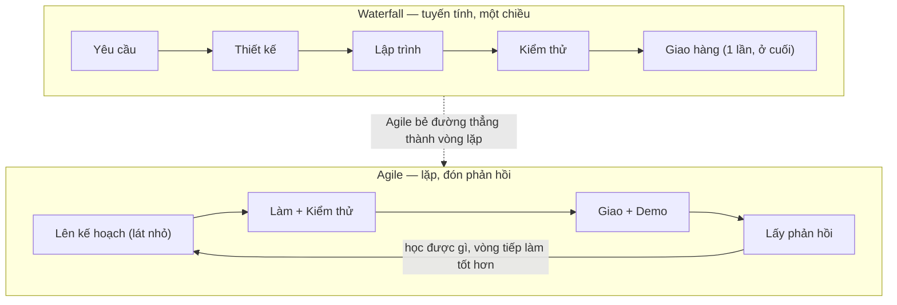

# Agile là gì? — Tư duy & 4 giá trị cốt lõi

> **Tác giả:** Mr.Rom\
> **Phiên bản:** v1.0.0\
> **Tạo lúc:** 13/06/2026\
> **Cập nhật:** 13/06/2026\
> **Level:** Basic\
> **Tags:** agile, mindset, agile-manifesto, waterfall, scrum, kanban, xp, safe, soft-skills\
> **Yêu cầu trước:** (không bắt buộc — có thể đọc đầu tiên)

> 🎯 *Bạn vào team mới, nghe mọi người nói "team mình làm Agile", "chạy sprint", "đẩy vào backlog" — gật gù nhưng trong đầu mù mờ Agile rốt cuộc là cái gì. Bài này dẫn bạn đi từ gốc: vì sao cách làm phần mềm kiểu cũ (Waterfall) gãy khi yêu cầu thay đổi, Agile ra đời để chữa điều đó như thế nào, **4 giá trị + 12 nguyên tắc** trong Agile Manifesto nghĩa là gì (giải thích dễ hiểu, không học vẹt), và bản đồ các framework Agile phổ biến (Scrum, Kanban, XP, SAFe — dùng khi nào). Quan trọng nhất: Agile là một **tư duy**, không phải một quy trình cứng để chép — và "Agile = không cần kế hoạch, không cần tài liệu" là một hiểu lầm tai hại mà bài này sẽ dập tắt.*

## 🎯 Sau bài này bạn sẽ

- [ ] Hiểu Agile là một **mindset** (tư duy), không phải một process cứng hay một công cụ
- [ ] Giải thích được **vì sao Waterfall gãy** khi yêu cầu thay đổi giữa chừng
- [ ] Đọc và hiểu **4 giá trị** của Agile Manifesto theo kiểu "ưu tiên cái nào hơn cái nào"
- [ ] Nắm tinh thần **12 nguyên tắc** (không học thuộc, mà hiểu chúng nói gì)
- [ ] So sánh được **Waterfall vs Agile** qua một bảng và một sơ đồ
- [ ] Phân biệt các framework Agile phổ biến (**Scrum, Kanban, XP, SAFe**) — cái nào dùng khi nào
- [ ] Bác bỏ được ngộ nhận "**Agile = không cần kế hoạch / không cần tài liệu**"

---

## Tình huống — dự án 8 tháng và một bản giao hàng không ai muốn

Hãy hình dung một dự án phần mềm làm theo kiểu kinh điển. Đầu năm, khách hàng và team ngồi lại hai tháng để viết ra một tập **tài liệu yêu cầu** dày cộp — mọi tính năng, mọi nút bấm, mọi luồng đều được chốt trên giấy. Ký xong, "đóng băng" yêu cầu. Rồi team lao vào: thiết kế ba tháng, code ba tháng, test một tháng. Tám tháng sau, sản phẩm hoàn chỉnh được giao cho khách.

Và khách nhìn vào, nói một câu khiến cả team chết lặng: *"Ờ... cái này đúng với những gì mình ghi hồi đầu năm. Nhưng thị trường thay đổi rồi, giờ tụi mình cần thứ khác. Cái nửa số tính năng này tụi mình không dùng tới nữa."*

Tám tháng công sức. Một bản giao hàng "đúng hợp đồng" nhưng **sai nhu cầu thực tế**. Vấn đề không nằm ở việc team code dở — họ làm rất đúng tài liệu. Vấn đề nằm ở một giả định sai ngay từ đầu: **rằng có thể biết hết và chốt cứng mọi yêu cầu ngay từ ngày đầu, và những yêu cầu đó sẽ không đổi trong suốt tám tháng**.

Trong làm phần mềm, giả định đó gần như luôn sai. Khách hàng không thật sự biết mình muốn gì cho tới khi nhìn thấy thứ chạy được. Thị trường đổi. Đối thủ ra tính năng mới. Một quy định pháp lý thay đổi. Càng giao trễ, càng nhiều thứ kịp đổi, và cái team giao ra càng xa cái khách thật sự cần.

Đây chính là bài toán mà **Agile** sinh ra để giải.

---

## 1️⃣ Cách làm cũ gãy ở đâu? — Waterfall và sự "đóng băng yêu cầu"

Cách làm trong tình huống trên có tên: **Waterfall** (mô hình thác nước). Nó chia dự án thành các **pha tuần tự** — phân tích yêu cầu → thiết kế → lập trình → kiểm thử → bàn giao — và mỗi pha phải **xong hẳn** rồi mới được sang pha sau. Như nước chảy từ bậc thác cao xuống bậc thấp: chỉ chảy một chiều, không quay ngược lên được.

🪞 **Ẩn dụ**: Waterfall giống **xây nhà theo bản vẽ đóng dấu**. Kiến trúc sư vẽ xong toàn bộ căn nhà trên giấy, chủ nhà ký duyệt, rồi thợ xây cứ thế thi công từ móng lên mái. Với một căn nhà gạch, cách này hợp lý — vì khi đã đổ móng thì khó mà đổi ý "thôi anh dời cái nhà sang hướng khác". Nhưng phần mềm **không phải gạch**: nó mềm, dễ đổi, và nhu cầu của người dùng cũng đổi liên tục. Bê nguyên cách xây nhà gạch sang làm phần mềm là gốc rễ của thất bại.

Waterfall không phải lúc nào cũng sai. Nó **hợp** khi yêu cầu thật sự ổn định và biết trước được hết — ví dụ làm phần mềm điều khiển cho một thiết bị y tế phải qua kiểm định ngặt nghèo, nơi đổi yêu cầu giữa chừng còn tốn kém và nguy hiểm hơn. Vấn đề là **phần lớn dự án phần mềm thương mại không như vậy**.

Hãy nhìn rõ ba điểm gãy của Waterfall khi yêu cầu thay đổi:

- **Phản hồi đến quá trễ.** Khách chỉ thấy sản phẩm thật ở pha cuối cùng — sau hàng tháng trời. Mọi hiểu lầm, mọi yêu cầu sai từ đầu phải đợi tới tận cuối mới lộ ra, lúc đã quá muộn và quá đắt để sửa.
- **Chi phí thay đổi tăng theo thời gian.** Đổi một yêu cầu ở pha phân tích chỉ tốn sửa vài dòng tài liệu. Đổi cùng yêu cầu đó ở pha kiểm thử có thể kéo theo đập đi làm lại cả module đã code xong. Càng về sau, đổi càng đau.
- **"Đóng băng yêu cầu" chống lại thực tế.** Waterfall cần chốt cứng yêu cầu từ đầu để các pha sau dựa vào. Nhưng thực tế thì yêu cầu *luôn đổi*. Thế là team hoặc phải từ chối thay đổi (giao ra thứ lỗi thời), hoặc chấp nhận thay đổi qua một quy trình "change request" nặng nề, chậm chạp.

> [!NOTE]
> "Agile" như một phong trào có dấu mốc rõ ràng: tháng 2 năm 2001, mười bảy người làm phần mềm họp ở Snowbird, bang Utah (Mỹ), cùng viết ra **Agile Manifesto** (Tuyên ngôn Agile). Họ không phát minh ra ý tưởng làm phần mềm lặp lại từ con số không — nhiều cách làm "nhẹ nhàng" đã tồn tại trước đó — nhưng họ là người đặt cho nó một cái tên chung và một bộ giá trị nền tảng.

→ Hiểu được Waterfall gãy ở đâu rồi, giờ ta xem cái thay thế nó nghĩ khác đi thế nào.

---

## 2️⃣ Vậy Agile là gì? — một tư duy, không phải một quy trình

Trả lời thẳng tình huống đầu bài: **Agile ra đời để chữa cái bệnh "giao trễ, sai nhu cầu" của Waterfall** — bằng cách làm phần mềm theo **những vòng lặp nhỏ**, giao thứ chạy được sớm và thường xuyên, rồi liên tục điều chỉnh theo phản hồi thực tế.

🪞 **Ẩn dụ**: Nếu Waterfall là "xây nhà theo bản vẽ đóng dấu", thì Agile giống **nấu một nồi canh và nêm nếm liên tục**. Bạn không pha sẵn toàn bộ gia vị một lần ngay từ đầu rồi đậy nắp đợi tám tiếng mới mở ra ăn (và cầu trời cho nó vừa miệng). Bạn nêm một ít, **nếm thử**, thấy nhạt thì thêm muối, mặn thì thêm nước — điều chỉnh theo phản hồi của chính lưỡi mình ở mỗi vòng. Cuối cùng nồi canh vừa miệng *vì* bạn đã nếm nhiều lần, không phải vì bạn đoán đúng từ đầu.

**Về mặt định nghĩa**: *Agile* (linh hoạt) là một **tư duy (mindset)** về cách phát triển sản phẩm, đặt trọng tâm vào việc **giao giá trị sớm và liên tục, đón nhận thay đổi, và học từ phản hồi thực tế** thay vì bám cứng một kế hoạch lập từ đầu. Tư duy này được cô đọng trong **Agile Manifesto** (2001) gồm 4 giá trị và 12 nguyên tắc.

Có một điểm cực kỳ quan trọng và hay bị hiểu sai ngay từ câu định nghĩa:

> [!IMPORTANT]
> **Agile là một tư duy, KHÔNG phải một quy trình cứng để chép theo từng bước.** Bạn không thể "cài đặt Agile" như cài một phần mềm. Scrum, Kanban... là các **framework** (khung làm việc) *hiện thực hoá* tư duy Agile theo những cách cụ thể — nhưng bản thân Agile thì ở tầng cao hơn: nó là cách *suy nghĩ*. Một team chạy đủ mọi nghi thức Scrum mà vẫn đóng băng yêu cầu, vẫn sợ thay đổi, thì *không* hề Agile.

Phân biệt ba tầng này giúp bạn không lẫn lộn về sau:

| Tầng | Là gì | Ví dụ |
|---|---|---|
| **Mindset** (tư duy) | Cách *suy nghĩ* về phát triển sản phẩm | Agile — "giao sớm, đón thay đổi, học từ phản hồi" |
| **Framework** (khung làm việc) | Cách *tổ chức* công việc để hiện thực hoá mindset | Scrum, Kanban, XP, SAFe |
| **Practice / Tool** (thực hành / công cụ) | *Việc cụ thể* hằng ngày, hoặc phần mềm hỗ trợ | Daily standup, retrospective, bảng Jira/Trello |

→ Tư duy này không phải lời nói suông — nó được viết ra thành 4 giá trị rất cụ thể. Ta đọc kỹ từng giá trị.

---

## 3️⃣ Agile Manifesto — 4 giá trị cốt lõi

Agile Manifesto mở đầu bằng 4 câu có cùng một khuôn rất đặc trưng: **"A hơn B"**, kèm một dòng ghi chú: *"Tức là, dù B vẫn có giá trị, chúng tôi coi trọng A hơn."*

Đây là chi tiết mà rất nhiều người đọc lướt rồi hiểu sai. **Agile không nói B là vô dụng.** Nó nói: khi phải chọn, **ưu tiên A hơn B**. Cả bốn giá trị đều theo khuôn so sánh "coi trọng hơn", không phải "vứt bỏ".

🪞 **Ẩn dụ**: 4 giá trị giống **bốn câu "ưu tiên ai trước khi cứu hộ"**. Bác sĩ cấp cứu không nói "người bị thương nhẹ thì kệ" — họ nói "khi nguồn lực có hạn, ưu tiên ca nặng trước". Cũng vậy, Agile không nói "tài liệu vô dụng", mà nói "khi phải chọn giữa viết thêm tài liệu và làm ra phần mềm chạy được, hãy ưu tiên phần mềm chạy được".

### Giá trị 1 — Cá nhân & tương tác hơn quy trình & công cụ

*Individuals and interactions over processes and tools.*

Một team mạnh là team mà **con người nói chuyện được với nhau** và tin nhau. Quy trình và công cụ (process & tools) hữu ích, nhưng chúng phục vụ con người, không phải ngược lại. Nếu bạn có công cụ quản lý task xịn nhất thế giới nhưng hai người trong team không bao giờ trao đổi với nhau, dự án vẫn hỏng. Một câu hỏi trực tiếp 30 giây thường giải quyết được thứ mà mười vé Jira qua lại không xong.

→ **Không có nghĩa**: vứt hết quy trình, làm việc hỗn loạn. Quy trình tốt vẫn cần — chỉ là đừng để quy trình bóp nghẹt giao tiếp con người.

### Giá trị 2 — Phần mềm chạy được hơn tài liệu đầy đủ

*Working software over comprehensive documentation.*

Thước đo tiến độ thật sự là **phần mềm chạy được** (working software), không phải số trang tài liệu. Một bản demo nhỏ chạy được nói lên nhiều điều hơn một tập đặc tả 200 trang — vì khách hàng *nhìn thấy và bấm thử* được, từ đó phản hồi chính xác. Tài liệu mô tả thứ "lẽ ra phải vậy"; phần mềm chạy được cho thấy thứ "thật sự là vậy".

> [!WARNING]
> Đây là giá trị bị bóp méo nhiều nhất, đẻ ra ngộ nhận "Agile = không cần tài liệu". Đọc kỹ: nó nói "**hơn** tài liệu **đầy đủ**", không nói "**không cần** tài liệu". Agile chống lại việc viết tài liệu dày cộp *thay cho* việc làm ra sản phẩm — chứ không chống lại tài liệu nói chung. Ta sẽ mổ xẻ ngộ nhận này kỹ ở phần 6.

### Giá trị 3 — Hợp tác với khách hàng hơn đàm phán hợp đồng

*Customer collaboration over contract negotiation.*

Khách hàng nên là **người cùng đội** trong suốt dự án, không phải đối thủ ở hai đầu một bản hợp đồng. Trong tình huống đầu bài, bi kịch xảy ra một phần vì khách chỉ xuất hiện hai lần: lúc ký yêu cầu và lúc nhận hàng. Giữa hai mốc đó, họ bị cắt khỏi quá trình. Agile muốn khách **tham gia liên tục** — xem demo, cho phản hồi, cùng điều chỉnh — để cái giao ra luôn bám sát nhu cầu *hiện tại*, không phải nhu cầu của tám tháng trước.

→ **Không có nghĩa**: bỏ hợp đồng. Hợp đồng vẫn cần để bảo vệ cả hai bên. Chỉ là đừng để nó biến quan hệ thành "anh ký gì thì tôi giao đúng thế, đổi là tính tiền".

### Giá trị 4 — Phản hồi với thay đổi hơn bám theo kế hoạch

*Responding to change over following a plan.*

Kế hoạch (plan) vẫn cần — nhưng kế hoạch là **để định hướng, không phải để xích chân**. Khi thực tế thay đổi (thị trường, phản hồi người dùng, công nghệ), khả năng **xoay theo thay đổi** quý hơn việc bám cứng một kế hoạch đã lỗi thời. Waterfall coi thay đổi là *kẻ thù* cần ngăn chặn; Agile coi thay đổi là *điều bình thường* cần đón nhận và tận dụng.

→ **Không có nghĩa**: làm việc không kế hoạch, gió chiều nào theo chiều ấy. Team Agile vẫn lập kế hoạch — chỉ là lập **ngắn hạn, thường xuyên** và sẵn sàng cập nhật, thay vì một kế hoạch khổng lồ cố định một lần.

Để nhìn cả bốn giá trị cùng lúc, bảng dưới đặt cột "coi trọng hơn" cạnh cột "nhưng vẫn cần" — nhấn mạnh rằng vế phải **không bị vứt bỏ**:

| # | Coi trọng hơn (ưu tiên) | Nhưng vẫn cần (không vứt bỏ) |
|---|---|---|
| 1 | Cá nhân & tương tác | Quy trình & công cụ |
| 2 | Phần mềm chạy được | Tài liệu đầy đủ |
| 3 | Hợp tác với khách hàng | Đàm phán hợp đồng |
| 4 | Phản hồi với thay đổi | Bám theo kế hoạch |

> [!TIP]
> Mẹo nhớ 4 giá trị: cả bốn vế trái đều xoay quanh **con người và thực tế sống động** (người, phần mềm thật, khách thật, thay đổi thật); cả bốn vế phải đều là **thứ tĩnh, viết sẵn trên giấy** (quy trình, tài liệu, hợp đồng, kế hoạch). Agile ưu tiên cái *sống* hơn cái *trên giấy* — nhưng không đốt giấy đi.

---

## 4️⃣ 12 nguyên tắc — tinh thần, không phải bài học thuộc lòng

Sau 4 giá trị, Agile Manifesto liệt kê **12 nguyên tắc** cụ thể hoá tư duy đó vào việc làm hằng ngày. Bạn **không cần học thuộc** — điều đáng làm là hiểu chúng *nói gì*. Để dễ nhớ, ta gom 12 nguyên tắc thành 4 nhóm theo chủ đề:

**Nhóm A — Khách hàng & giá trị (làm ra cái đáng làm):**

1. Ưu tiên cao nhất là **làm khách hài lòng** bằng cách giao phần mềm có giá trị **sớm và liên tục**.
2. **Đón nhận thay đổi yêu cầu**, kể cả muộn — coi đó là lợi thế cạnh tranh cho khách, không phải phiền toái.
3. **Giao phần mềm chạy được thường xuyên** (vài tuần một lần là lý tưởng), ưu tiên chu kỳ ngắn.

**Nhóm B — Hợp tác con người (làm cùng nhau cho tốt):**

4. Người làm kinh doanh và lập trình viên phải **làm việc cùng nhau hằng ngày**.
5. Xây dự án quanh **những con người có động lực** — cho họ môi trường, sự hỗ trợ, và *tin tưởng* để họ hoàn thành việc.
6. Cách truyền đạt hiệu quả nhất trong team là **nói chuyện trực tiếp** (face-to-face).

**Nhóm C — Sản phẩm & chất lượng kỹ thuật (làm cho bền):**

7. **Phần mềm chạy được** là thước đo tiến độ chính.
8. Agile cổ vũ **nhịp độ phát triển bền vững** — team có thể giữ nhịp đó vô thời hạn, không "cày" tới kiệt sức.
9. Liên tục chú ý đến **sự xuất sắc về kỹ thuật và thiết kế tốt** — vì nó làm tăng tính linh hoạt.
10. **Đơn giản** — nghệ thuật tối đa hoá lượng việc *không cần làm* — là cốt lõi.

**Nhóm D — Tự tổ chức & cải tiến (làm ngày càng tốt hơn):**

11. Kiến trúc, yêu cầu và thiết kế tốt nhất nảy sinh từ các **team tự tổ chức** (self-organizing).
12. Đều đặn, team **nhìn lại** xem làm sao cho hiệu quả hơn, rồi *điều chỉnh* cách làm — đây chính là tinh thần của *retrospective*.

> [!NOTE]
> Để ý ba sợi chỉ xuyên suốt cả 12 nguyên tắc: **giao sớm và liên tục** (1, 3, 7), **đón thay đổi** (2), và **con người + cải tiến** (4, 5, 6, 11, 12). Nếu chỉ nhớ được ba ý đó thôi, bạn đã nắm được phần lớn tinh thần Agile rồi.

→ 4 giá trị và 12 nguyên tắc nghe đã rõ về *tư duy*. Nhưng nó khác Waterfall ra sao ở *cách làm thực tế*? Ta đặt hai cái cạnh nhau.

---

## 5️⃣ Waterfall vs Agile — đặt cạnh nhau

Khác biệt cốt lõi giữa hai cách làm nằm ở **hình dạng của dòng công việc**: Waterfall là một đường thẳng chạy một chiều tới đích, còn Agile là những vòng lặp nhỏ quay đi quay lại. Đây là ý trừu tượng nhất của bài, nên ta hình dung qua sơ đồ trước.

Sơ đồ dưới đặt hai mô hình cạnh nhau: nhánh trên là Waterfall tuyến tính (mỗi pha xong mới sang pha sau, giao một lần ở cuối), nhánh dưới là Agile lặp (mỗi vòng làm một lát nhỏ rồi quay lại từ đầu với thứ đã học được):

→ Điểm cốt lõi của sơ đồ: ở Waterfall, mọi mũi tên đi **một chiều tới đích** và khách chỉ thấy sản phẩm ở ô cuối cùng. Ở Agile, có một **mũi tên vòng ngược** từ "phản hồi" về "kế hoạch" — đây chính là thứ Waterfall thiếu. Cái vòng ngược đó cho phép team *học và sửa* sau mỗi vòng, nên cái giao ra ở vòng cuối bám sát nhu cầu thực tế hơn nhiều.

Giờ đặt hai mô hình cạnh nhau theo từng tiêu chí để thấy chúng khác nhau ở *bản chất*, không chỉ ở nhịp giao hàng:

| Tiêu chí | Waterfall | Agile |
|---|---|---|
| **Hình dạng** | Tuyến tính, các pha tuần tự | Lặp (iterative), nhiều vòng ngắn |
| **Yêu cầu** | Chốt cứng từ đầu, "đóng băng" | Tiến hoá dần, đón thay đổi |
| **Giao sản phẩm** | Một lần, ở cuối dự án | Nhiều lần, từng phần nhỏ chạy được |
| **Phản hồi của khách** | Chỉ ở pha cuối — quá trễ | Liên tục sau mỗi vòng |
| **Thái độ với thay đổi** | Kẻ thù cần ngăn chặn | Điều bình thường cần đón nhận |
| **Rủi ro lộ ra khi nào** | Cuối dự án (đắt để sửa) | Sớm, từng chút (rẻ để sửa) |
| **Hợp khi** | Yêu cầu ổn định, biết trước hết (vd thiết bị y tế kiểm định ngặt) | Yêu cầu mơ hồ / dễ đổi (vd sản phẩm thương mại) |

> [!IMPORTANT]
> Bảng này **không** nói "Agile luôn thắng Waterfall". Nó nói hai cái hợp với hai loại bài toán khác nhau. Chọn mô hình theo **độ ổn định của yêu cầu**: yêu cầu càng dễ đổi và càng mơ hồ, Agile càng có lợi; yêu cầu càng cố định và càng phải tuân thủ ngặt, Waterfall (hoặc lai giữa hai) càng hợp lý.

---

## 6️⃣ Bản đồ các framework Agile — Scrum, Kanban, XP, SAFe

Như phần 2 đã nói, Agile là *tư duy* ở tầng cao; còn các **framework** là cách hiện thực hoá tư duy đó vào công việc thật. Beginner hay nhầm "Agile" với "Scrum" như thể là một — thực ra Scrum chỉ là **một trong nhiều** framework Agile.

🪞 **Ẩn dụ**: Agile giống **"ăn uống lành mạnh"** (một triết lý), còn các framework là các **chế độ ăn cụ thể** (Địa Trung Hải, eat-clean, low-carb...). Tất cả đều phục vụ cùng một triết lý "ăn cho khoẻ", nhưng quy tắc cụ thể khác nhau, và mỗi chế độ hợp với một kiểu người / hoàn cảnh khác nhau. Chọn sai chế độ cho hoàn cảnh của mình thì dù triết lý đúng vẫn không hiệu quả.

Dưới đây là bốn framework phổ biến nhất. Đừng cố nhớ chi tiết từng cái (Scrum có bài riêng ngay sau) — mục tiêu phần này chỉ là **nhận ra chúng tồn tại và dùng khi nào**:

| Framework | Cốt lõi (1 dòng) | Hợp khi nào | Bài chi tiết |
|---|---|---|---|
| **Scrum** | Làm theo **sprint** cố định (1-4 tuần), có vai trò + sự kiện + sản phẩm rõ ràng | Team xây tính năng mới, công việc chia được thành đợt; cần khung kỷ luật | Bài 01 trong cụm |
| **Kanban** | **Trực quan hoá** công việc trên bảng, **giới hạn WIP** (việc đang làm), tối ưu dòng chảy | Công việc đến liên tục/khó đoán (support, vận hành, bug fix); muốn cải tiến dần không xáo trộn | Bài 02 trong cụm |
| **XP** (Extreme Programming) | Tập trung **chất lượng kỹ thuật**: pair programming, TDD, continuous integration | Đội đề cao kỹ thuật, code thay đổi nhiều, cần giữ chất lượng cao | — |
| **SAFe** (Scaled Agile Framework) | Khung để áp Agile cho **tổ chức lớn**, nhiều team cùng phối hợp | Doanh nghiệp lớn, hàng chục/trăm người, cần đồng bộ nhiều team Agile | — |

Vài lưu ý để bạn không bị rối khi gặp các tên này ngoài đời:

- **Scrum và Kanban là phổ biến nhất** với team nhỏ và vừa — và rất hay được trộn lại thành "Scrumban" (lấy sprint của Scrum + bảng và giới hạn WIP của Kanban). Đừng ngạc nhiên khi thấy team dùng lai.
- **XP** thiên về *thực hành kỹ thuật* hơn là *quản lý quy trình*. Nhiều thực hành của XP (như continuous integration, refactoring) giờ đã thành chuẩn chung, dù ít ai gọi tên "XP" nữa.
- **SAFe** gây tranh cãi: nó giúp tổ chức lớn áp Agile có trật tự, nhưng cũng bị phê là *nặng nề*, đôi khi đi ngược tinh thần "nhẹ nhàng" gốc của Agile. Là người mới, bạn chỉ cần biết "SAFe = Agile quy mô lớn", chưa cần đi sâu.

> [!TIP]
> Đừng chọn framework theo kiểu "cái nào nổi nhất thì theo". Chọn theo **bản chất công việc của team**: việc đến thành đợt, lên kế hoạch được → nghiêng Scrum; việc đến liên tục, khó đoán → nghiêng Kanban; nhiều team lớn cần đồng bộ → mới tính tới SAFe. Và luôn nhớ: framework chỉ là phương tiện cho mindset, không phải đích đến.

→ Đã biết Agile là gì và các framework hiện thực nó ra sao. Giờ tới phần dễ hiểu sai nhất — và nếu hiểu sai sẽ dẫn team vào "fake agile".

---

## 7️⃣ Ngộ nhận lớn nhất — "Agile = không cần kế hoạch / không cần tài liệu"

Đây là hiểu lầm phổ biến và tai hại nhất về Agile, nên cần dập tắt dứt khoát: **Agile KHÔNG có nghĩa là làm việc không kế hoạch, không tài liệu, không kỷ luật.** Ai nói vậy là đang *hiểu sai* Agile để biện minh cho sự lười và hỗn loạn.

🪞 **Ẩn dụ**: Người nói "Agile nên không cần kế hoạch" giống người nói **"lái xe linh hoạt nên không cần biết mình đi đâu"**. Linh hoạt (agile) là khả năng *bẻ lái nhanh khi đường đổi* — chứ không phải *nhắm mắt đạp ga không đích đến*. Một tay đua giỏi (rất "agile") biết rất rõ đích, có kế hoạch đường đi, và *chính vì* nắm vững nền tảng đó nên mới đủ tự tin bẻ cua linh hoạt. Vô kỷ luật không phải là linh hoạt — đó chỉ là loạn.

Cùng đối chiếu thẳng từng ngộ nhận với sự thật:

| ❌ Ngộ nhận (hiểu sai) | ✅ Sự thật (Agile thật sự nói) |
|---|---|
| "Agile = không cần kế hoạch" | Agile **vẫn lập kế hoạch** — nhưng ngắn hạn, thường xuyên, và cập nhật được. Giá trị 4 là "phản hồi với thay đổi *hơn* bám kế hoạch", không phải "bỏ kế hoạch". |
| "Agile = không cần tài liệu" | Agile chống tài liệu **thừa thãi viết thay cho sản phẩm**, không chống tài liệu. Vẫn viết tài liệu *đủ và đúng lúc* (API doc, kiến trúc, hướng dẫn dùng). |
| "Agile = không có quy trình, làm tự do" | Agile **có quy trình** (sprint, standup, retro của Scrum...). Chỉ là quy trình phục vụ con người, không bóp nghẹt giao tiếp. |
| "Agile = làm nhanh hơn, ít việc hơn" | Agile **không hứa nhanh hơn hay ít việc hơn**. Nó hứa *giao đúng thứ cần hơn* nhờ phản hồi sớm — tức ít làm phí công vào thứ không ai dùng. |
| "Agile = không cam kết thời hạn" | Team Agile **vẫn cam kết** — ở mức từng sprint/từng phần. Chỉ là không vờ cam kết chính xác cho thứ cách đó tám tháng mà ai cũng biết sẽ đổi. |

Vì sao ngộ nhận này nguy hiểm? Vì nó là cái cớ hoàn hảo cho **"fake agile"** (Agile giả): team bỏ hết kế hoạch và tài liệu, gọi sự hỗn loạn của mình là "linh hoạt", rồi khi dự án sụp thì đổ lỗi cho "Agile không hiệu quả". Thực tế họ chưa bao giờ làm Agile — họ chỉ vô kỷ luật và dán nhãn Agile lên đó. (Cụm này có hẳn một bài cuối về cách tránh "fake agile".)

> [!WARNING]
> Một dấu hiệu sớm của hiểu sai Agile: khi ai đó dùng từ "Agile" để **từ chối làm một việc đáng làm** — *"Mình Agile mà, viết tài liệu làm gì"*, *"Agile thì cần gì kế hoạch"*. Agile thật chưa bao giờ là cái cớ để né tránh kỷ luật. Nó đòi hỏi *nhiều* kỷ luật hơn Waterfall, chỉ là kỷ luật đặt vào chỗ khác (giao đều, phản hồi đều, cải tiến đều).

---

## 💡 Cạm bẫy thường gặp & Best practice

### ❌ Cạm bẫy: đánh đồng "làm Scrum" với "đã Agile"

- **Triệu chứng**: team chạy đủ daily standup, sprint, retro... nhưng vẫn đóng băng yêu cầu, vẫn sợ thay đổi, khách vẫn chỉ thấy sản phẩm ở cuối. Mọi *nghi thức* có đủ nhưng *tinh thần* thì không.
- **Nguyên nhân**: nhầm framework (Scrum) với mindset (Agile). Coi việc "làm đúng các buổi họp" là đã Agile, trong khi Agile nằm ở *cách suy nghĩ* phía sau các buổi họp đó.
- **Cách tránh**: luôn quay về 4 giá trị + 12 nguyên tắc làm thước đo. Tự hỏi: "Team mình có thật sự giao sớm, đón thay đổi, học từ phản hồi không?" — chứ không phải "team mình có đủ buổi standup không".

### ❌ Cạm bẫy: dùng "Agile" để biện minh cho hỗn loạn (fake agile)

- **Triệu chứng**: bỏ hết kế hoạch và tài liệu, không ai biết đang đi đâu, mỗi người làm một kiểu — và gọi đó là "linh hoạt". Khi sụp thì đổ cho "Agile không hợp với tụi mình".
- **Nguyên nhân**: hiểu sai "phản hồi với thay đổi *hơn* bám kế hoạch" thành "bỏ luôn kế hoạch", hiểu sai "phần mềm *hơn* tài liệu" thành "không cần tài liệu".
- **Cách tránh**: nhớ cả bốn giá trị đều là "A *hơn* B", **không phải "A, bỏ B"**. Agile vẫn cần kế hoạch (ngắn, đều), vẫn cần tài liệu (đủ, đúng lúc), vẫn cần kỷ luật — chỉ đặt trọng tâm khác đi.

### ✅ Best practice: đọc Agile theo "ưu tiên cái gì hơn cái gì"

- **Vì sao**: cấu trúc "A hơn B" là chìa khoá để không hiểu sai Manifesto. Hiểu đúng cấu trúc này tự động miễn nhiễm với mọi ngộ nhận kiểu "Agile bỏ X".
- **Cách áp dụng**: mỗi khi đọc một giá trị/nguyên tắc Agile, tự diễn lại thành câu "khi phải chọn, mình ưu tiên ... hơn ...". Vế bên phải (tài liệu, kế hoạch, hợp đồng, quy trình) *vẫn giữ*, chỉ xếp sau vế trái.

### ✅ Best practice: chọn framework theo bản chất công việc, không theo trào lưu

- **Vì sao**: framework chỉ là phương tiện. Áp Scrum cho một team support (việc đến liên tục, không chia đợt được) sẽ khổ; áp Kanban cho một team cần kỷ luật giao đợt rõ ràng có thể thiếu khung.
- **Cách áp dụng**: nhìn dòng công việc của team. Việc đến thành đợt, lên kế hoạch được → Scrum. Việc đến liên tục, khó đoán → Kanban. Cần đồng bộ nhiều team lớn → mới tính SAFe. Trộn lai (Scrumban) hoàn toàn hợp lệ.

---

## 🧠 Tự kiểm tra (Self-check)

**Q1.** Một đồng nghiệp nói: *"Team mình Agile nên không cần viết tài liệu gì cả."* Câu này đúng hay sai? Giải thích theo Agile Manifesto.

💡 Xem giải thích

**Sai** — đây là một trong những ngộ nhận phổ biến nhất. Giá trị 2 của Manifesto nói "phần mềm chạy được **hơn** tài liệu **đầy đủ**" — chú ý hai chữ "hơn" và "đầy đủ". Nó là một câu *ưu tiên*, không phải câu *loại bỏ*: khi phải chọn giữa viết thêm tài liệu dày cộp và làm ra sản phẩm chạy được, hãy ưu tiên sản phẩm. Nó **không** nói "không viết tài liệu". Team Agile vẫn viết tài liệu *đủ và đúng lúc* (API doc, kiến trúc, hướng dẫn dùng) — chỉ tránh viết tài liệu thừa thãi *thay cho* việc làm sản phẩm. Dùng "Agile" để né viết tài liệu là dấu hiệu của "fake agile".

**Q2.** Vì sao Waterfall lại "gãy" khi yêu cầu thay đổi giữa chừng, còn Agile thì không?

💡 Xem giải thích

Waterfall **chốt cứng (đóng băng) yêu cầu từ đầu** rồi mới lần lượt thiết kế → code → test → giao một lần ở cuối. Nó dựa trên giả định "biết hết yêu cầu từ ngày đầu và chúng không đổi" — giả định gần như luôn sai trong phần mềm. Khi yêu cầu đổi giữa chừng, Waterfall hoặc phải từ chối (giao ra thứ lỗi thời) hoặc sửa qua một quy trình change-request nặng nề và đắt đỏ (đổi ở pha cuối tốn hơn nhiều lần ở pha đầu). Khách lại chỉ thấy sản phẩm ở pha cuối — quá trễ để sửa.

Agile **bẻ đường thẳng đó thành các vòng lặp ngắn**: làm một lát nhỏ → giao → lấy phản hồi → điều chỉnh ở vòng sau. Nhờ cái "vòng ngược" này, thay đổi được đón nhận liên tục thay vì bị chống lại, và rủi ro/hiểu lầm lộ ra *sớm* khi còn rẻ để sửa.

**Q3.** Cả 4 giá trị Agile đều có dạng "A hơn B". Câu đó có nghĩa B là vô dụng không? Cho một ví dụ.

💡 Xem giải thích

**Không.** Manifesto ghi rõ: *"dù vế bên phải (B) vẫn có giá trị, chúng tôi coi trọng vế bên trái (A) hơn"*. Đây là câu **ưu tiên khi phải chọn**, không phải câu vứt bỏ.

Ví dụ với giá trị 4 ("phản hồi với thay đổi *hơn* bám theo kế hoạch"): kế hoạch (B) **vẫn cần** — để định hướng team. Chỉ là khi thực tế đổi khác kế hoạch, team ưu tiên xoay theo thực tế thay vì bám cứng kế hoạch lỗi thời. Tương tự, hợp đồng vẫn cần (giá trị 3), quy trình vẫn cần (giá trị 1), tài liệu vẫn cần (giá trị 2) — chỉ là xếp sau vế trái khi phải đánh đổi.

**Q4.** Một team chạy đủ daily standup, sprint, retrospective nhưng vẫn không cho khách xem sản phẩm tới tận cuối, và rất ngại thay đổi yêu cầu. Họ có đang "Agile" không?

💡 Xem giải thích

**Không thật sự Agile**, dù họ có đủ các *nghi thức* của Scrum. Lý do: Agile là một **mindset** (tư duy), còn các buổi standup/sprint/retro chỉ là *thực hành* của framework Scrum — phương tiện, không phải đích. Một team Agile thật phải sống đúng tinh thần 4 giá trị: giao sớm và liên tục (họ giao ở cuối — vi phạm), đón nhận thay đổi (họ ngại thay đổi — vi phạm), hợp tác với khách liên tục (khách chỉ thấy sản phẩm ở cuối — vi phạm).

Đây chính là cạm bẫy "có nghi thức nhưng không có tinh thần". Thước đo Agile là *cách suy nghĩ và kết quả*, không phải *số buổi họp*.

**Q5.** Team của bạn làm support/vận hành: ticket và bug đến liên tục, không đoán trước được, khó gom thành đợt 2 tuần. Scrum hay Kanban hợp hơn? Vì sao?

💡 Xem giải thích

**Kanban hợp hơn.** Scrum tổ chức công việc theo **sprint** — các đợt cố định 1-4 tuần, cần lập kế hoạch và cam kết khối lượng cho cả đợt. Điều này hợp khi việc *chia được thành đợt và đoán trước được*. Nhưng công việc support/vận hành đến *liên tục và khó đoán* — cam kết một đợt cố định sẽ liên tục bị phá vỡ bởi việc gấp xen vào.

Kanban không có sprint cố định: nó **trực quan hoá công việc trên bảng, giới hạn WIP** (số việc đang làm cùng lúc), và tối ưu *dòng chảy* công việc. Việc đến lúc nào kéo vào lúc đó, tối ưu tốc độ thông qua. Đây đúng là kiểu công việc Kanban sinh ra để phục vụ. (Nhiều team còn trộn lai thành "Scrumban".)

---

## ⚡ Tra cứu nhanh (Cheatsheet)

### 4 giá trị Agile Manifesto

| # | Coi trọng hơn | Hơn (nhưng vẫn cần) |
|---|---|---|
| 1 | Cá nhân & tương tác | Quy trình & công cụ |
| 2 | Phần mềm chạy được | Tài liệu đầy đủ |
| 3 | Hợp tác với khách hàng | Đàm phán hợp đồng |
| 4 | Phản hồi với thay đổi | Bám theo kế hoạch |

→ Quy tắc đọc: mọi giá trị là "A **hơn** B", **không phải** "A, bỏ B".

### 3 tầng — đừng lẫn lộn

| Tầng | Là gì | Ví dụ |
|---|---|---|
| Mindset | Cách suy nghĩ | Agile |
| Framework | Cách tổ chức việc | Scrum, Kanban, XP, SAFe |
| Practice/Tool | Việc/công cụ cụ thể | Standup, retro, Jira |

### Waterfall vs Agile (rút gọn)

| | Waterfall | Agile |
|---|---|---|
| Hình dạng | Tuyến tính, 1 chiều | Lặp, nhiều vòng |
| Yêu cầu | Đóng băng từ đầu | Tiến hoá, đón thay đổi |
| Giao hàng | 1 lần ở cuối | Nhiều lần, từng phần |
| Phản hồi khách | Trễ (cuối) | Liên tục |
| Hợp khi | Yêu cầu ổn định | Yêu cầu dễ đổi |

### Chọn framework

| Bản chất công việc | Nghiêng về |
|---|---|
| Việc đến thành đợt, lên kế hoạch được | Scrum |
| Việc đến liên tục, khó đoán (support, bug) | Kanban |
| Đề cao chất lượng kỹ thuật (TDD, pair) | XP |
| Tổ chức lớn, nhiều team cần đồng bộ | SAFe |

### Dập 5 ngộ nhận

| Ngộ nhận | Sự thật |
|---|---|
| Không cần kế hoạch | Vẫn lập — ngắn, đều, cập nhật được |
| Không cần tài liệu | Vẫn viết — đủ và đúng lúc |
| Không có quy trình | Vẫn có — phục vụ con người |
| Nhanh hơn / ít việc hơn | Giao đúng thứ cần hơn, không hứa nhanh hơn |
| Không cam kết thời hạn | Cam kết theo từng sprint/phần |

---

## 📚 Từ Điển Thuật Ngữ (Glossary)

| EN | VN | Giải thích |
|---|---|---|
| Agile | Linh hoạt | Tư duy phát triển sản phẩm: giao sớm/liên tục, đón thay đổi, học từ phản hồi |
| Mindset | Tư duy | Cách suy nghĩ nền tảng — Agile ở tầng này, không phải quy trình |
| Waterfall | Mô hình thác nước | Cách làm tuần tự: yêu cầu → thiết kế → code → test → giao 1 lần ở cuối |
| Agile Manifesto | Tuyên ngôn Agile | Văn bản 2001 gồm 4 giá trị + 12 nguyên tắc, nền của phong trào Agile |
| Iterative | Lặp | Làm theo nhiều vòng ngắn, mỗi vòng cải tiến dựa trên phản hồi |
| Working software | Phần mềm chạy được | Sản phẩm dùng được thật — thước đo tiến độ chính trong Agile |
| Framework | Khung làm việc | Cách tổ chức công việc hiện thực hoá mindset (Scrum, Kanban...) |
| Scrum | (giữ EN) | Framework Agile làm theo sprint cố định, có vai trò/sự kiện/sản phẩm rõ |
| Sprint | Đợt làm việc | Chu kỳ cố định (1-4 tuần) trong Scrum để giao một lát sản phẩm |
| Kanban | (giữ EN) | Framework trực quan hoá công việc + giới hạn WIP, tối ưu dòng chảy |
| WIP (Work In Progress) | Việc đang làm | Số việc làm dở cùng lúc; Kanban giới hạn để tránh quá tải |
| XP (Extreme Programming) | (giữ EN) | Framework Agile thiên về chất lượng kỹ thuật (pair, TDD, CI) |
| SAFe (Scaled Agile Framework) | (giữ EN) | Khung áp Agile cho tổ chức lớn, nhiều team |
| Scrumban | (giữ EN) | Cách lai: sprint của Scrum + bảng/giới hạn WIP của Kanban |
| Backlog | Danh sách việc tồn | Danh sách yêu cầu/việc chờ làm, xếp theo độ ưu tiên |
| Retrospective | Buổi nhìn lại | Buổi team xem lại cách làm để cải tiến (nguyên tắc 12) |
| Self-organizing team | Team tự tổ chức | Team tự phân việc và ra quyết định, không cần chỉ đạo từng bước |
| Fake agile | Agile giả | Bỏ kế hoạch/kỷ luật rồi gọi sự hỗn loạn là "linh hoạt" |

---

## 🔗 Liên kết & Tài nguyên

➡️ **Bài tiếp theo:** [Scrum Framework — Roles, Events, Artifacts](01_scrum-framework.md)\
↑ **Về cụm:** [agile-scrum — README](../../README.md)

### 🧭 Định hướng lộ trình học

- [Scrum Framework — Roles, Events, Artifacts](01_scrum-framework.md) — framework Agile phổ biến nhất, hiện thực hoá mindset bài này thành vai trò/sự kiện/sản phẩm cụ thể
- [Kanban & Flow — Trực quan hoá công việc, giới hạn WIP](02_kanban-and-flow.md) — framework Agile cho dòng công việc liên tục, đối trọng với Scrum

### 🧩 Các chủ đề có thể bạn quan tâm

- [User Stories & Ước lượng — Backlog, story point, velocity](03_user-stories-and-estimation.md) — cách Agile mô tả yêu cầu và ước lượng công việc trong backlog
- [Agile thực chiến & cạm bẫy — Tránh "fake agile"](04_agile-in-practice-and-pitfalls.md) — đi sâu vào ngộ nhận và cách tránh Agile giả mà bài này mới chạm tới
- [Họp & giao tiếp trực tiếp — Standup, trình bày, lắng nghe](../../../communication/lessons/01_basic/02_meetings-and-verbal-communication.md) — daily standup là một sự kiện Agile; bài này dạy cách làm standup cho gọn

### 🌐 Tài nguyên tham khảo khác

- [Agile Manifesto (bản gốc)](https://agilemanifesto.org/) — 4 giá trị + 12 nguyên tắc, có sẵn bản dịch tiếng Việt trên chính trang
- [Scrum Guide](https://scrumguides.org/) — tài liệu chính thức, ngắn gọn về Scrum (đọc cho bài 01)
- [Atlassian Agile Coach](https://www.atlassian.com/agile) — hướng dẫn thực dụng về Agile, Scrum, Kanban cho người mới

---

## 📌 Nhật ký thay đổi (Changelog)

- **v1.0.0 (13/06/2026)** — Bản đầu tiên. Bài 00 mở đầu cụm agile-scrum: tình huống mở bài "dự án 8 tháng giao ra thứ không ai muốn" + Waterfall và 3 điểm gãy khi yêu cầu đổi + định nghĩa Agile là mindset (không phải process/tool) qua 3 tầng mindset/framework/practice + 4 giá trị Agile Manifesto theo cấu trúc "A hơn B" (kèm vế "vẫn cần") + 12 nguyên tắc gom thành 4 nhóm + bảng so sánh Waterfall vs Agile + sơ đồ mermaid waterfall tuyến tính vs agile lặp (có vòng phản hồi) + bản đồ framework Scrum/Kanban/XP/SAFe (dùng khi nào) + phần dập 5 ngộ nhận "Agile = không kế hoạch/tài liệu" (fake agile) + ẩn dụ xây nhà gạch/nấu canh nêm nếm/cấp cứu ưu tiên/ăn lành mạnh/lái xe linh hoạt + 2 cạm bẫy + 2 best practice + 5 self-check + cheatsheet + glossary 18 thuật ngữ.
