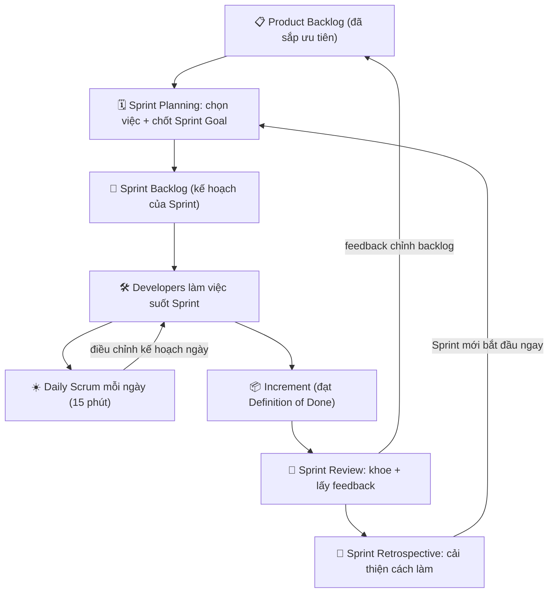

# Scrum Framework — Roles, Events, Artifacts

> **Tác giả:** Mr.Rom\
> **Phiên bản:** v1.0.0\
> **Tạo lúc:** 13/06/2026\
> **Cập nhật:** 13/06/2026\
> **Level:** Basic\
> **Tags:** agile, scrum, sprint, product-owner, scrum-master, developers, ceremonies, backlog, soft-skills\
> **Yêu cầu trước:** [Agile là gì](00_what-is-agile.md)

> 🎯 *Bài trước bạn đã hiểu **Agile** là một tư duy — ưu tiên con người, sản phẩm chạy được, hợp tác và thích nghi hơn là bám cứng kế hoạch. Nhưng "tư duy" thì hơi trừu tượng: sáng mai vào team, bạn sẽ làm gì cho **đúng Agile**? Câu trả lời phổ biến nhất của ngành chính là **Scrum** — một bộ khung cụ thể đóng tư duy Agile thành các vai trò, sự kiện và tài liệu rõ ràng để team chạy theo nhịp. Bài này mổ xẻ trọn vẹn Scrum: **3 roles**, **5 events**, **3 artifacts** cùng các "commitment" đi kèm, và quan trọng nhất — một Sprint diễn ra thế nào từ đầu đến cuối. Đặc biệt, bạn — với tư cách Developer — sẽ thấy rõ chỗ đứng và tiếng nói của mình trong cái khung này. Kết bài bạn sẽ đọc được mọi lịch họp trong Jira/Notion của team và biết chính xác mình nên nói gì ở từng buổi.*

## 🎯 Sau bài này bạn sẽ

- [ ] Giải thích được **Scrum là gì** và vì sao nó là framework Agile phổ biến nhất
- [ ] Phân biệt rõ **3 roles** — Product Owner, Scrum Master, Developers — ai chịu trách nhiệm gì
- [ ] Kể tên và nói đúng mục đích của **5 events** (Sprint, Sprint Planning, Daily Scrum, Sprint Review, Sprint Retrospective) kèm **timebox** mỗi cái
- [ ] Hiểu **3 artifacts** (Product Backlog, Sprint Backlog, Increment) và 3 commitment đi kèm (Product Goal, Sprint Goal, Definition of Done)
- [ ] Mô tả được **một Sprint chạy thế nào từ đầu đến cuối** qua sơ đồ vòng đời
- [ ] Biết **vai trò của Developer trong Scrum** — bạn quyết gì, cam kết gì, nói gì ở mỗi buổi họp

---

## Tình huống — bạn vào team mới và lịch tuần kín mít những cái tên lạ

Tuần đầu ở team mới, bạn mở lịch ra và thấy hàng loạt sự kiện lặp lại: *"Sprint Planning"* thứ Hai, *"Daily"* mỗi sáng 15 phút, *"Sprint Review"* và *"Retro"* vào thứ Sáu cuối kỳ. Trong Slack, người ta nhắc tới *"PO"*, *"Scrum Master"*, *"backlog"*, *"sprint goal"*, *"DoD"*. Ai cũng nói như thể bạn đã hiểu hết — còn bạn thì gật gù mà trong đầu toàn dấu hỏi.

Đến buổi Daily đầu tiên, mọi người lần lượt nói ba câu rồi giải tán sau 12 phút. Bạn chưa kịp hiểu chuyện gì vừa xảy ra. Đến Sprint Planning, có người hỏi bạn *"task này em ước lượng mất bao lâu?"* — bạn không rõ mình có quyền nói "không kịp" hay không. Đến Retro cuối Sprint, bạn ngồi im vì sợ chê quy trình thì bị cho là "khó tính".

Đây là trải nghiệm gần như **mọi developer mới đều gặp**. Vấn đề không phải Scrum khó — nó thực ra rất gọn. Vấn đề là chưa ai ngồi xuống giải thích cho bạn **bộ khung tổng thể**: ai làm gì, mỗi buổi họp để làm gì, và bạn — Developer — có vai trò ra sao trong đó.

Bài này chính là buổi giải thích đó.

> [!NOTE]
> Mọi định nghĩa trong bài bám theo **The Scrum Guide 2020** — tài liệu chính thức do hai người tạo ra Scrum (Ken Schwaber và Jeff Sutherland) biên soạn. Đây là "nguồn sự thật" mà cả ngành tham chiếu, nên bạn đọc xong sẽ nói cùng ngôn ngữ với đồng nghiệp ở bất kỳ công ty nào.

---

## 1️⃣ Scrum là gì, và vì sao nó phổ biến nhất?

Agile (bài trước) cho bạn **bộ giá trị** — nhưng nó cố tình **không nói cách làm cụ thể**. Giống như "ăn uống lành mạnh" là một nguyên tắc tốt, nhưng nó không cho bạn thực đơn từng bữa. Bạn cần một thực đơn cụ thể để bắt tay vào làm sáng mai. **Scrum chính là thực đơn đó.**

**Trả lời tình huống trên**: Scrum là một **framework** (bộ khung làm việc) nhẹ, giúp team giải quyết những bài toán phức tạp bằng cách chia công việc thành các chu kỳ ngắn, lặp lại — gọi là **Sprint** — và sau mỗi chu kỳ lại giao ra một phần sản phẩm dùng được. Thay vì cố vạch sẵn cả năm rồi cắm đầu làm, Scrum bắt team **làm một đoạn ngắn → xem kết quả → điều chỉnh → làm tiếp**.

🪞 **Ẩn dụ**: Scrum giống cách **nấu một nồi canh ngon mà bạn chưa từng nấu**. Bạn không nêm hết gia vị một lần rồi bưng ra (đó là cách làm "kế hoạch cứng" — sai là hỏng cả nồi). Bạn nêm một ít → **nếm thử** → điều chỉnh → nêm tiếp → nếm lại. Mỗi vòng "nêm-nếm-chỉnh" là một **Sprint**. Người ăn thử và bảo bạn mặn nhạt là **Product Owner**. Người canh cho bếp không cháy, lửa đều, dụng cụ đủ là **Scrum Master**. Còn người đứng bếp nấu chính là **Developers** — là bạn.

**Vì sao Scrum phổ biến nhất** trong các framework Agile? Có vài lý do rất thực tế:

- **Cụ thể nhưng nhẹ** — nó cho bạn đúng đủ cấu trúc (vai trò, sự kiện, tài liệu) để bắt đầu, mà không nặng nề như các quy trình kiểu cũ hàng trăm trang.
- **Có nhịp rõ ràng** — Sprint tạo ra một "trái tim đập" đều đặn cho team: cứ mỗi vài tuần lại có một điểm dừng để xem và điều chỉnh.
- **Dễ học, khó thạo** — đọc xong một bài như bài này là nắm được luật chơi, nhưng làm cho *tốt* thì cần luyện. Rào cản vào thấp giúp nó lan rộng.
- **Hệ sinh thái khổng lồ** — Jira, Azure DevOps, hàng triệu bài viết, khóa học, chứng chỉ đều xoay quanh Scrum. Học Scrum là học thứ phần lớn công ty đang dùng.

> [!NOTE]
> Trong các khảo sát ngành nhiều năm liền (vd báo cáo *State of Agile*), Scrum và các biến thể của nó (như Scrumban, Scrum kết hợp Kanban) luôn chiếm tỉ lệ áp dụng cao nhất trong các nhóm phát triển phần mềm. Nói cách khác: học Agile mà bỏ Scrum thì gần như chắc chắn thiếu một mảnh lớn.

Scrum đặt nền trên một ý tưởng cốt lõi gọi là **empiricism** (chủ nghĩa thực nghiệm) — niềm tin rằng kiến thức đến từ **trải nghiệm thực tế** và quyết định nên dựa trên **những gì quan sát được**, không phải phỏng đoán. Empiricism đứng trên ba chân, và đây cũng là ba từ bạn sẽ nghe nhắc đi nhắc lại trong team Scrum:

| Trụ cột (EN) | Tiếng Việt | Nghĩa thực tế trong team |
|---|---|---|
| **Transparency** | Minh bạch | Mọi người nhìn thấy cùng một sự thật: backlog công khai, tiến độ rõ, vấn đề không giấu |
| **Inspection** | Kiểm tra | Thường xuyên xem lại tiến độ + sản phẩm để phát hiện lệch sớm (qua các events) |
| **Adaptation** | Thích nghi | Thấy lệch thì điều chỉnh ngay, không chờ tới cuối dự án |

→ Ba trụ cột này không phải lý thuyết suông — chúng chính là *lý do tồn tại* của từng sự kiện và tài liệu mà ta sắp học. Mỗi event là một dịp **Inspection + Adaptation**; mỗi artifact tồn tại để bảo đảm **Transparency**. Giữ ba từ này trong đầu, phần còn lại của bài sẽ "khớp" lại với nhau rất tự nhiên.

---

## 2️⃣ Ba roles — ai chịu trách nhiệm gì

Một team Scrum (gọi là **Scrum Team**) thường nhỏ, khoảng **10 người trở xuống**, và gồm đúng **ba vai trò** — không hơn không kém. Điểm hay là Scrum không có "sếp" theo nghĩa ra lệnh: ba vai trò này **phối hợp ngang hàng**, mỗi người giữ một mảng trách nhiệm khác nhau.

> [!IMPORTANT]
> Scrum Guide 2020 gọi đây là ba **accountabilities** (trách nhiệm giải trình), không gọi là "roles" hay "chức danh". Khác biệt tinh tế nhưng quan trọng: đó là *mảng trách nhiệm*, không phải cấp bậc. Một Scrum Team **không có hệ thống cấp bậc nội bộ** — không ai "to" hơn ai. Trong bài này mình vẫn dùng quen miệng từ "role" cho dễ, nhưng bạn nhớ tinh thần "ngang hàng" này.

🪞 **Ẩn dụ** (quay lại nồi canh): ba vai trò giống ba người quanh một căn bếp.

- **Product Owner** = người quyết **nấu món gì cho khách thích** và nêm đã vừa miệng chưa.
- **Scrum Master** = người lo **bếp chạy trơn tru** — lửa đều, dụng cụ đủ, không ai cãi nhau, đúng quy trình vệ sinh.
- **Developers** = những người **thực sự đứng nấu** — quyết nấu *thế nào* để ra món ngon.

Ta đi sâu từng vai trò.

### 👑 Product Owner (PO) — chủ giá trị sản phẩm

**Product Owner** chịu trách nhiệm **tối đa hoá giá trị** của sản phẩm mà team tạo ra. Nói gọn: PO trả lời câu hỏi **"làm CÁI GÌ, và làm cái nào TRƯỚC"**.

🪞 **Ẩn dụ**: PO giống **người chỉ huy duy nhất quyết hướng đi của con tàu**. Cả tàu có thể góp ý, nhưng cuối cùng *một người* cầm lái thứ tự ưu tiên — để tránh tình cảnh "mười người chỉ mười hướng" khiến tàu xoay vòng tại chỗ.

Trách nhiệm cụ thể của PO:

- **Quản lý Product Backlog** — danh sách mọi thứ cần làm cho sản phẩm. PO sắp xếp thứ tự (cái nào quan trọng làm trước), viết rõ từng mục, và giữ nó luôn cập nhật.
- **Đặt và truyền đạt Product Goal** — mục tiêu lớn của sản phẩm hướng tới.
- **Là một người duy nhất** — PO là một *cá nhân*, không phải một hội đồng. Người khác muốn đổi ưu tiên trong backlog thì phải thuyết phục PO, chứ không tự sửa.
- **Là cầu nối với stakeholder** — PO hứng nhu cầu từ khách hàng, sếp, các bên liên quan, rồi dịch nó thành các mục trong backlog.

> [!WARNING]
> Cạm bẫy kinh điển: nhiều team biến PO thành "người ghi chép yêu cầu" thụ động — ai nói gì cũng nhét vào backlog. PO thật sự phải **dám nói KHÔNG** và **dám xếp thứ tự**. Nếu mọi thứ đều "ưu tiên cao", thì thực ra chẳng có gì được ưu tiên cả.

### 🛡️ Scrum Master (SM) — người phục vụ quy trình

**Scrum Master** chịu trách nhiệm để Scrum được hiểu đúng và vận hành tốt — cho cả team lẫn cả tổ chức. Đây là vai trò dễ hiểu nhầm nhất, nên cần nói rõ ngay: **Scrum Master KHÔNG phải sếp, KHÔNG phải project manager ra lệnh**. SM là một **servant leader** (lãnh đạo phục vụ) — người dọn đường cho team chạy nhanh, chứ không phải người đốc thúc.

🪞 **Ẩn dụ**: SM giống **trọng tài kiêm người dọn sân trong một trận đấu**. Trọng tài không ghi bàn thay cầu thủ, không quyết đội nào thắng. Việc của họ là **bảo đảm trận đấu diễn ra đúng luật, sân sạch, không ai chơi xấu**, và gỡ mọi thứ cản trở để cầu thủ tập trung đá.

Trách nhiệm cụ thể của SM:

- **Gỡ vướng (remove impediments)** — bất cứ thứ gì cản team tiến (công cụ thiếu, phụ thuộc bên ngoài, xung đột), SM lo tháo gỡ.
- **Bảo vệ team khỏi nhiễu loạn** — chặn việc bị nhồi thêm task giữa Sprint, hay bị kéo họp vô bổ.
- **Huấn luyện (coach) team về Scrum** — giúp mọi người làm các event cho hiệu quả, không biến chúng thành hình thức.
- **Hỗ trợ PO** trong việc quản lý backlog hiệu quả, và **hỗ trợ tổ chức** áp dụng Scrum đúng cách.

> [!IMPORTANT]
> Một câu phân biệt cho dễ nhớ: **PO lo "đúng việc" (right thing), Developers lo "làm đúng" (thing right), Scrum Master lo "guồng máy chạy trơn" (the engine runs smoothly).** Ba người không giẫm chân nhau.

### 🛠️ Developers — những người làm ra Increment

**Developers** là những người trong team **thực sự tạo ra sản phẩm** mỗi Sprint. "Developers" ở đây không chỉ là người code — nó bao gồm **mọi người góp phần làm ra một phần sản phẩm dùng được**: lập trình viên, tester/QA, designer, người viết tài liệu kỹ thuật... Tất cả gộp chung dưới một cái tên.

Đây là vai trò của **bạn**, nên ta sẽ dành hẳn phần 6 để mổ xẻ sâu. Còn ở đây, nắm trách nhiệm cốt lõi:

- **Tạo ra Increment** — phần sản phẩm dùng được mỗi Sprint.
- **Tự lập kế hoạch công việc** — Developers quyết *làm thế nào* để hoàn thành các mục đã chọn (PO không được chỉ đạo cách làm).
- **Tự tổ chức (self-managing)** — không cần ai phân công từng task; team tự chia việc với nhau.
- **Giữ chất lượng** — tuân thủ **Definition of Done** (định nghĩa "thế nào là xong") và liên tục cải thiện cách làm.

Để chốt phần này, đây là bảng so sánh ba vai trò cạnh nhau — dán vào đầu là đủ dùng:

| Vai trò | Trả lời câu hỏi | Quyết định gì | KHÔNG được làm gì |
|---|---|---|---|
| 👑 **Product Owner** | Làm CÁI GÌ + cái nào TRƯỚC | Thứ tự ưu tiên backlog, nội dung từng mục | Không ép Developers *cách* làm |
| 🛡️ **Scrum Master** | Quy trình chạy thế nào cho trơn | Cách gỡ vướng, cách coach team | Không ra lệnh việc kỹ thuật, không phải sếp |
| 🛠️ **Developers** | Làm THẾ NÀO + bao nhiêu là vừa | Cách kỹ thuật, ước lượng, lượng việc nhận | Không tự đổi ưu tiên của PO |

→ Ba vai trò là "ai" của Scrum. Tiếp theo là "khi nào và ở đâu" — các sự kiện mà ba vai trò này gặp nhau để đồng bộ.

---

## 3️⃣ Năm events — và Sprint là cái thùng chứa tất cả

Scrum có **5 events** (sự kiện, hay quen gọi là "ceremonies"). Điểm khiến nhiều người mới rối: **Sprint không phải một buổi họp** — nó là **cái thùng chứa** bọc lấy bốn sự kiện còn lại. Hiểu cấu trúc "thùng chứa" này là chìa khóa.

🪞 **Ẩn dụ**: Một Sprint giống **một chuyến tàu chạy theo lịch cố định**. Tàu khởi hành đúng giờ (Sprint Planning), mỗi sáng trên tàu cả đoàn điểm danh và báo trạng thái (Daily Scrum), tới ga cuối thì khách xuống xem hàng đã giao (Sprint Review), rồi tổ lái họp rút kinh nghiệm cho chuyến sau (Retrospective). Cả hành trình từ ga đầu tới ga cuối — đó chính là **Sprint**.

Trước khi đi từng cái, đây là bảng tổng hợp 5 events kèm **timebox** (giới hạn thời gian tối đa). Mọi mốc dưới đây tính cho Sprint dài **1 tháng**; Sprint ngắn hơn thì các event ngắn lại tương ứng:

| Event | Mục đích một câu | Timebox (Sprint 1 tháng) | Ai bắt buộc có mặt |
|---|---|---|---|
| 🚂 **Sprint** | Thùng chứa — chu kỳ giao một Increment | ≤ **1 tháng** (thường 1-2 tuần) | Cả Scrum Team |
| 🗓️ **Sprint Planning** | Lên kế hoạch Sprint sắp tới | ≤ **8 giờ** | Cả Scrum Team |
| ☀️ **Daily Scrum** | Đồng bộ tiến độ + điều chỉnh trong ngày | ≤ **15 phút** | Developers (PO/SM tùy chọn) |
| 🎁 **Sprint Review** | Khoe Increment + lấy feedback | ≤ **4 giờ** | Cả Scrum Team + stakeholders |
| 🔄 **Sprint Retrospective** | Cải thiện *cách làm việc* của team | ≤ **3 giờ** | Cả Scrum Team |

> [!NOTE]
> "Timebox" nghĩa là **giới hạn tối đa, không phải mục tiêu phải đạt**. Daily Scrum xong trong 7 phút thì cứ giải tán — không cần "đủ 15 phút". Timebox tồn tại để chống họp lê thê, không phải để bắt ngồi đủ giờ.

### 🚂 Sprint — trái tim của Scrum

**Sprint** là một khoảng thời gian cố định (**1 tháng hoặc ngắn hơn**, đa số team chọn **1-2 tuần**) trong đó team biến ý tưởng thành một **Increment** dùng được. Sprint mới bắt đầu **ngay khi** Sprint cũ kết thúc — không có khoảng nghỉ ở giữa. Đặc tính sống còn của Sprint:

- **Độ dài cố định** — chọn 2 tuần thì *luôn* 2 tuần, không co giãn. Nhịp đều giúp team ước lượng và lập kế hoạch tốt dần lên.
- **Không đổi mục tiêu giữa chừng** — trong Sprint, **Sprint Goal không bị thay đổi**, phạm vi có thể được làm rõ/đàm phán lại với PO nhưng không bị nhồi thêm việc phá vỡ mục tiêu.
- **Có thể bị hủy** — chỉ PO mới có quyền hủy một Sprint, và chỉ khi Sprint Goal trở nên vô nghĩa (hiếm khi xảy ra).

> [!TIP]
> Vì sao đa số team chọn Sprint **2 tuần** thay vì 1 tháng? Vòng lặp càng ngắn → càng sớm có feedback → càng sớm phát hiện đi sai hướng. 2 tuần là điểm cân bằng phổ biến: đủ dài để làm ra thứ đáng xem, đủ ngắn để không lạc lối quá xa. Team mới thường nên bắt đầu ngắn.

### 🗓️ Sprint Planning — khởi động chuyến tàu

Mở đầu mỗi Sprint, cả team họp **Sprint Planning** để trả lời ba câu hỏi:

1. **Vì sao Sprint này đáng giá?** → cả team chốt một **Sprint Goal** (mục tiêu của Sprint).
2. **Có thể làm xong gì trong Sprint này?** → Developers chọn các mục từ Product Backlog (PO đã sắp thứ tự sẵn) đưa vào Sprint.
3. **Làm những việc đó thế nào?** → Developers phác kế hoạch để biến các mục thành Increment.

Điểm cốt lõi bạn cần nhớ: **Developers là người quyết nhận BAO NHIÊU việc** — không phải PO áp xuống, không phải sếp giao chỉ tiêu. PO giải thích mục tiêu và độ ưu tiên; Developers nhìn năng lực thực tế của mình mà chọn lượng vừa sức.

### ☀️ Daily Scrum — điểm danh 15 phút mỗi ngày

**Daily Scrum** (hay "standup") là buổi đồng bộ ngắn **15 phút mỗi ngày**, dành cho **Developers**. Mục đích: kiểm tra tiến độ hướng tới Sprint Goal và điều chỉnh kế hoạch cho ngày hôm đó. Đây **không phải** buổi báo cáo cho sếp, cũng **không phải** buổi giải quyết vấn đề kỹ thuật.

Một cấu trúc quen thuộc (Scrum Guide không bắt buộc đúng format này, nhưng nó phổ biến và dễ dùng cho người mới): mỗi người nói gọn **ba câu**:

- Hôm qua tôi làm gì *góp phần cho Sprint Goal*?
- Hôm nay tôi định làm gì?
- Tôi có bị **chặn (blocker)** gì không?

> [!WARNING]
> Cạm bẫy số một của Daily: ai đó nêu một blocker, lập tức hai người nhảy vào bàn cách sửa 15 phút, cả nhóm còn lại đứng ngó. Cách đúng: **ghi nhận blocker rồi hẹn bàn riêng sau Daily** (gọi là "take it offline") — chỉ người liên quan ở lại. Giữ Daily đúng 15 phút là tôn trọng thời gian cả team.

### 🎁 Sprint Review — khoe hàng và lấy feedback

Gần cuối Sprint, team họp **Sprint Review** để **trình diễn Increment** đã làm cho PO và **stakeholders** (các bên liên quan: khách hàng, sếp, team khác), rồi cùng nhau bàn xem **làm gì tiếp theo**. Đây là dịp **Inspection + Adaptation** với *sản phẩm*.

Điểm quan trọng: Sprint Review là một **buổi làm việc (working session)**, không phải buổi "thuyết trình một chiều". Stakeholder dùng thật, hỏi, góp ý — và feedback đó có thể làm thay đổi Product Backlog cho Sprint sau. Đây là lúc tinh thần Agile "phản hồi sớm" phát huy mạnh nhất.

### 🔄 Sprint Retrospective — sửa CÁCH làm, không sửa sản phẩm

Cuối cùng, sau Review và trước khi Sprint mới bắt đầu, cả team họp **Sprint Retrospective** (gọi tắt "Retro"). Khác biệt then chốt: Review xem *sản phẩm*, còn Retro xem **chính cách team làm việc với nhau** — quy trình, công cụ, hợp tác. Câu hỏi trung tâm: *"Cái gì đã chạy tốt? Cái gì vướng? Sprint sau ta đổi gì?"*

Một format Retro đơn giản ai cũng dùng được:

| Cột | Câu hỏi | Ví dụ |
|---|---|---|
| 😀 **Tốt (Keep)** | Cái gì nên giữ? | "Daily đúng giờ, gọn — giữ nguyên" |
| 😟 **Vướng (Problem)** | Cái gì cản trở? | "Môi trường test hay sập, mất giờ chờ" |
| 💡 **Thử (Try)** | Sprint sau đổi gì? | "Dựng môi trường test riêng cho mỗi nhánh" |

> [!IMPORTANT]
> Retro **vô dụng nếu không sinh ra hành động cụ thể**. Mỗi Retro nên chốt **1-2 cải tiến có người chịu trách nhiệm** đưa vào Sprint sau (thậm chí cho hẳn vào Sprint Backlog). "Lần sau cố gắng hơn" không phải hành động — "dựng môi trường test riêng, bạn A làm, xong tuần này" mới là hành động.

---

## 4️⃣ Ba artifacts — và ba commitment đi kèm

**Artifacts** (tài liệu/hiện vật) là những thứ Scrum tạo ra để giữ **Transparency** — để mọi người nhìn cùng một sự thật. Scrum có đúng **3 artifacts**, và điểm tinh tế của Scrum Guide 2020: **mỗi artifact gắn với một "commitment"** (cam kết) — một đích để đo tiến độ và giữ mọi người tập trung.

🪞 **Ẩn dụ**: ba artifacts giống ba lớp của một **đơn đặt hàng nhà hàng**.
- **Product Backlog** = cả **thực đơn** — mọi món có thể nấu, xếp theo món nào nên ra trước.
- **Sprint Backlog** = **phiếu order của bàn này** — đúng những món sẽ nấu ngay trong ca này.
- **Increment** = **các đĩa đã nấu xong, bưng ra được** — thành phẩm thật, ăn được.

Bảng dưới ghép artifact với commitment của nó, rồi ta đi sâu từng cặp:

| Artifact | Commitment (cam kết) đi kèm | Ý nghĩa cam kết |
|---|---|---|
| 📋 **Product Backlog** | 🎯 **Product Goal** | Mục tiêu dài hạn cả backlog hướng tới |
| 📝 **Sprint Backlog** | 🎯 **Sprint Goal** | Mục tiêu duy nhất của Sprint này |
| 📦 **Increment** | ✅ **Definition of Done (DoD)** | Tiêu chuẩn chất lượng để gọi là "xong" |

### 📋 Product Backlog + 🎯 Product Goal

**Product Backlog** là một **danh sách có thứ tự** mọi thứ cần làm để cải thiện sản phẩm — tính năng, sửa lỗi, cải tiến kỹ thuật. Nó là **nguồn công việc duy nhất** cho cả team. PO sở hữu và sắp xếp nó: mục quan trọng/cấp thiết hơn nằm trên, càng lên trên càng được viết rõ và nhỏ (sẵn sàng làm), càng xuống dưới càng to và mơ hồ (bàn sau).

Cam kết đi kèm là **Product Goal** — một mục tiêu dài hạn duy nhất mô tả *sản phẩm muốn trở thành cái gì*. Mọi mục trong backlog tồn tại để phục vụ Product Goal này. Nó là ngôi sao Bắc Đẩu cho cả team.

### 📝 Sprint Backlog + 🎯 Sprint Goal

**Sprint Backlog** là kế hoạch *của riêng Developers* cho Sprint hiện tại. Nó gồm ba thứ: **Sprint Goal** (vì sao), các mục Product Backlog đã chọn cho Sprint này (cái gì), và kế hoạch để giao chúng (thế nào). Đây là tài liệu **sống** — Developers cập nhật nó liên tục suốt Sprint khi hiểu thêm về công việc.

Cam kết đi kèm là **Sprint Goal** — một mục tiêu **duy nhất** cho cả Sprint, tạo sự gắn kết và tập trung. Sprint Goal trả lời câu *"nếu chỉ đạt được một điều trong Sprint này, đó phải là gì?"*. Khi gặp đánh đổi giữa chừng, team bám Sprint Goal để quyết.

### 📦 Increment + ✅ Definition of Done

**Increment** là một bậc thang cụ thể tiến tới Product Goal — một phần sản phẩm **thực sự dùng được**, cộng dồn vào các Increment trước. Điểm sống còn: một mục công việc chỉ được tính là một phần của Increment **khi nó đạt Definition of Done**. Một Sprint có thể tạo ra nhiều Increment.

Cam kết đi kèm là **Definition of Done (DoD)** — một mô tả chính thức về tình trạng "**thế nào là xong**". Đây là thứ bảo đảm chất lượng và sự minh bạch: "xong" với cả team nghĩa là *cùng một thứ*, không phải "xong" theo cảm tính mỗi người.

Một DoD ví dụ cho một team web (chỉ là minh họa — mỗi team tự định nghĩa DoD của mình):

```text
DEFINITION OF DONE — team Web

Một mục được tính là "Done" khi:
  - [ ] Code đã viết xong và tự test ở máy local
  - [ ] Có unit test cho logic chính, test pass
  - [ ] Đã qua code review của ít nhất 1 đồng nghiệp
  - [ ] Merge vào nhánh chính, CI build xanh
  - [ ] Đã deploy lên môi trường staging và chạy được
  - [ ] Tài liệu / changelog cập nhật (nếu cần)
```

> [!WARNING]
> Cạm bẫy "Done giả": team nói "task xong rồi" nhưng chưa test, chưa review, chưa deploy — rồi đến Sprint Review mới lòi ra một đống việc dang dở. DoD tồn tại chính để chặn điều này. **Chưa đạt DoD = chưa xong**, dù code đã chạy trên máy bạn. Không có chuyện "xong 90%".

→ Ba artifacts (cái gì hữu hình), ba commitment (đích để đo). Giờ ta ghép tất cả — roles, events, artifacts — vào một vòng đời để thấy một Sprint chạy thật ra sao.

---

## 5️⃣ Một Sprint chạy thế nào, từ đầu đến cuối

Đây là phần ghép mọi mảnh lại. Một Sprint không phải các sự kiện rời rạc — nó là một **vòng lặp khép kín**: kế hoạch → làm + đồng bộ hằng ngày → khoe + lấy feedback → rút kinh nghiệm → rồi lặp lại. Vì đây là khái niệm trừu tượng nhất của bài, ta hình dung qua sơ đồ vòng đời Sprint.

Sơ đồ dưới mô tả một Sprint chảy từ Product Backlog (đầu vào) qua các sự kiện theo thời gian, sinh ra Increment (đầu ra), rồi quay vòng cho Sprint kế tiếp:



→ Điểm cốt lõi của sơ đồ: chú ý hai **mũi tên quay vòng**. Mũi tên Daily → Work (vòng nhỏ, mỗi ngày) là nhịp điều chỉnh ngắn hạn; mũi tên Retro → Planning (vòng lớn, mỗi Sprint) là nhịp cải thiện dài hạn. Scrum thực chất là **vòng lặp lồng trong vòng lặp** — đó là cách empiricism (kiểm tra rồi thích nghi) được nhúng vào từng nhịp, không phải để dồn tới cuối dự án.

### Kể lại bằng lời — một Sprint 2 tuần điển hình

Để sơ đồ "sống" hơn, đây là câu chuyện một Sprint 2 tuần của một team web, kể theo thứ tự thời gian:

1. **Thứ Hai tuần 1 — Sprint Planning (buổi sáng).** PO mở Product Backlog, giải thích mục tiêu sản phẩm và các mục ưu tiên cao. Cả team chốt **Sprint Goal**: *"Người dùng đăng nhập được bằng email + mật khẩu."* Developers nhìn năng lực, chọn các mục vừa sức kéo vào **Sprint Backlog**, rồi phác cách làm.

2. **Mỗi sáng (tuần 1 và 2) — Daily Scrum (15 phút).** Developers đồng bộ: hôm qua làm gì cho Sprint Goal, hôm nay làm gì, có blocker gì. Một blocker xuất hiện ("môi trường staging sập") → ghi nhận, Scrum Master nhận lo gỡ sau buổi.

3. **Suốt 2 tuần — Developers làm việc.** Viết code, viết test, review lẫn nhau, cập nhật Sprint Backlog. Mỗi mục chỉ tính "xong" khi đạt **Definition of Done**. Increment lớn dần.

4. **Thứ Năm tuần 2 — Sprint Review.** Team demo màn hình đăng nhập chạy thật cho PO và stakeholder. Khách dùng thử, góp ý: *"thêm nút quên mật khẩu nữa nhé"* → PO ghi vào Product Backlog cho Sprint sau.

5. **Thứ Sáu tuần 2 — Sprint Retrospective.** Team nhìn lại *cách làm việc*: Daily gọn (giữ), môi trường test sập nhiều (vướng), Sprint sau thử dựng môi trường riêng mỗi nhánh (hành động, bạn A lo).

6. **Thứ Hai tuần 3 — Sprint mới bắt đầu ngay.** Lại Sprint Planning, lần này backlog đã có thêm "quên mật khẩu" từ feedback. Vòng lặp tiếp tục.

→ Để ý cái đẹp của vòng lặp: feedback từ Review (bước 4) và cải tiến từ Retro (bước 5) **chảy thẳng vào Sprint sau** (bước 6). Mỗi vòng team vừa giao thêm giá trị, vừa làm việc tốt hơn một chút. Đó là "thích nghi liên tục" mà Agile nói tới, được đóng thành nhịp cụ thể.

---

## 6️⃣ Vai trò của Developer trong Scrum — chỗ đứng của bạn

Quay lại tình huống đầu bài: bạn ngồi trong các buổi họp mà không rõ mình có quyền nói gì. Phần này gỡ đúng nỗi băn khoăn đó. Trong Scrum, Developer **không phải "thợ nhận việc"** thụ động — bạn có tiếng nói và quyền quyết định thật sự ở nhiều chỗ. Nắm rõ chúng để bạn chủ động thay vì ngồi im.

🪞 **Ẩn dụ**: Developer trong Scrum giống **đầu bếp trong căn bếp**, không phải robot dây chuyền. PO bảo "khách muốn món gà" (cái gì), nhưng **bạn — đầu bếp — quyết nấu thế nào**: chiên hay nướng, gia vị ra sao, mất bao lâu. Không ai đứng sau lưng chỉ bạn cầm dao thế nào.

### Bạn quyết định và cam kết những gì

Đây là những quyền và trách nhiệm cụ thể của bạn — thứ nhiều dev mới không biết mình có:

- **Bạn quyết CÁCH làm (kỹ thuật).** PO nói *cái gì* và *thứ tự*; *làm thế nào* là quyền của Developers. Chọn thư viện, kiến trúc, cách chia task — đó là sân của bạn.
- **Bạn quyết nhận BAO NHIÊU việc.** Ở Sprint Planning, *bạn* nhìn năng lực thật mà chọn lượng việc, không ai áp chỉ tiêu. Nhận quá tải để rồi không xong là phản tác dụng.
- **Bạn ước lượng (estimate).** Người làm việc là người ước lượng — không phải PO hay sếp đoán hộ. Ước lượng của bạn là dữ liệu để cả team lập kế hoạch (bài sau về story point sẽ đào sâu).
- **Bạn cùng cả team tự tổ chức.** Không cần ai phân từng task; Developers tự chia việc, tự phối hợp. "Self-managing" là một quyền, đi kèm trách nhiệm.
- **Bạn giữ Definition of Done.** Chất lượng là cam kết của bạn — không hạ chuẩn "xong" để chạy cho kịp.
- **Bạn được lên tiếng ở Retro.** Thấy quy trình vướng, công cụ tệ, hợp tác kẹt — Retro là diễn đàn của bạn để nói. Im lặng ở Retro là bỏ phí cơ hội cải thiện chính cuộc sống làm việc của mình.

### Ở mỗi event, bạn nên làm gì

Để cụ thể hơn cả lời khuyên, đây là bảng "việc của Developer" tại từng sự kiện — dùng như kim chỉ nam khi bạn còn mới:

| Event | Việc của bạn (Developer) | Câu nên thoải mái nói |
|---|---|---|
| 🗓️ **Sprint Planning** | Ước lượng, đặt câu hỏi làm rõ, chọn lượng việc vừa sức, phác cách làm | *"Mục này em chưa rõ yêu cầu X — PO làm rõ giúp em nhé."* / *"Với năng lực Sprint này, em nghĩ nhận thêm mục này là quá tải."* |
| ☀️ **Daily Scrum** | Báo tiến độ gọn theo Sprint Goal, nêu blocker | *"Em đang bị chặn vì chưa có quyền truy cập DB staging — ai cấp giúp em?"* |
| 🎁 **Sprint Review** | Demo phần mình làm, lắng nghe feedback | *"Đây là màn hình đăng nhập em làm, mọi người thử và cho em ý kiến."* |
| 🔄 **Sprint Retrospective** | Nói thẳng về quy trình/công cụ, đề xuất cải tiến | *"Môi trường test sập nhiều làm mình mất giờ chờ — mình thử dựng riêng mỗi nhánh xem sao?"* |

> [!TIP]
> Nỗi sợ phổ biến của dev mới ở Retro: *"chê quy trình thì bị cho là khó tính"*. Thực tế ngược lại — Retro **sinh ra để nghe những góp ý đó**. Một góp ý cụ thể, hướng vào *quy trình/công cụ* (không công kích cá nhân) là thứ đáng quý nhất ở Retro. Cứ nói: *"mình thấy bước X tốn thời gian, mình thử cách Y được không?"*.

### Mẫu một mục backlog mà bạn sẽ làm — User Story

Phần lớn mục bạn nhận trong Sprint sẽ được viết dưới dạng **user story** — một câu mô tả nhu cầu *từ góc nhìn người dùng*, kèm **acceptance criteria** (tiêu chí chấp nhận) cho biết "thế nào là làm đúng mục này". Bạn sẽ học sâu cách viết và ước lượng story ở bài sau, nhưng đây là dạng chuẩn để bạn nhận diện ngay:

```text
USER STORY

Là một người dùng chưa đăng nhập,
tôi muốn đăng nhập bằng email + mật khẩu,
để truy cập được trang cá nhân của mình.

Acceptance Criteria (tiêu chí chấp nhận):
  - [ ] Nhập đúng email + mật khẩu → vào được trang cá nhân
  - [ ] Nhập sai → hiện thông báo lỗi rõ ràng, không lộ "sai email" hay "sai mật khẩu"
  - [ ] Sai 5 lần liên tiếp → khóa tạm 1 phút
  - [ ] Mật khẩu được lưu dạng hash, không lưu plaintext
```

→ Để ý: acceptance criteria khác với Definition of Done. **Acceptance criteria** riêng cho *mục này* (đúng nghiệp vụ gì); **DoD** chung cho *mọi mục* (đạt chuẩn chất lượng gì). Một mục "xong" thật sự khi thỏa **cả hai**.

### Mẫu Sprint Board — nơi bạn thấy việc chảy

Hằng ngày, công việc của Developers thường được trực quan trên một **Sprint Board** (bảng Sprint) — như trong Jira/Notion/Trello — chia thành các cột trạng thái. Sơ đồ ASCII dưới mô phỏng một board điển hình giữa Sprint:

```text
┌──────────────┬──────────────┬──────────────┬──────────────┐
│   TODO       │ IN PROGRESS  │  IN REVIEW    │    DONE       │
├──────────────┼──────────────┼──────────────┼──────────────┤
│ Quên mật khẩu│ Form đăng     │ Validate     │ Khung trang   │
│              │ nhập (bạn A)  │ input (bạn B)│ login         │
│ Nhớ đăng nhập│              │              │               │
│              │              │              │ Hash mật khẩu │
└──────────────┴──────────────┴──────────────┴──────────────┘
        ↑ việc kéo từ trái sang phải khi tiến triển ↑
```

→ Board cho cả team **Transparency** tức thì: nhìn một cái là biết việc nào đang làm, việc nào kẹt ở "In Review", việc nào đã chạm "Done". Một mục chỉ được kéo sang "Done" khi đạt **Definition of Done** — không phải khi "code chạy trên máy mình". Cột "Done" trên board chính là Increment đang lớn dần. (Cách thiết kế board, giới hạn việc đồng thời và đo dòng chảy là chủ đề của bài Kanban kế tiếp.)

---

## 💡 Cạm bẫy thường gặp & Best practice

### ❌ Cạm bẫy: Scrum Master trở thành "sếp giao việc"

- **Triệu chứng**: Scrum Master phân task cho từng Developer, đốc thúc tiến độ, quyết cách làm kỹ thuật — y như một project manager kiểu cũ.
- **Nguyên nhân**: hiểu nhầm Scrum Master là "người quản lý team", trong khi đúng ra họ là **servant leader** phục vụ và gỡ vướng.
- **Cách tránh**: nhớ ranh giới — SM lo *quy trình chạy trơn* và *gỡ cản trở*, KHÔNG giao việc hay quyết kỹ thuật. Việc tự chia, Developers lo; việc ưu tiên, PO lo.

### ❌ Cạm bẫy: Daily Scrum biến thành buổi báo cáo / buổi debug

- **Triệu chứng**: Daily kéo dài 30-40 phút; mọi người báo cáo chi tiết cho Scrum Master như báo cáo sếp, hoặc lao vào tranh luận kỹ thuật giữa buổi.
- **Nguyên nhân**: nhầm mục đích Daily (Developers đồng bộ với nhau, hướng tới Sprint Goal) thành báo cáo cấp trên hoặc giải quyết vấn đề.
- **Cách tránh**: giữ đúng 15 phút, nói gọn ba câu hướng tới Sprint Goal; gặp blocker cần đào sâu thì "take it offline" — bàn riêng sau với đúng người.

### ❌ Cạm bẫy: "Done giả" — gọi là xong khi chưa đạt Definition of Done

- **Triệu chứng**: cuối Sprint mới phát hiện hàng loạt việc "đã xong" thật ra chưa test, chưa review, chưa deploy. Increment không thật sự dùng được.
- **Nguyên nhân**: không có Definition of Done rõ, hoặc có mà cả nể bỏ qua để "chạy cho kịp".
- **Cách tránh**: chốt một DoD cụ thể, dán công khai, và **không hạ chuẩn**. Chưa đạt DoD = chưa xong, không có "xong 90%".

### ✅ Best practice: giữ Sprint Goal làm la bàn quyết định

- **Vì sao**: giữa Sprint luôn có đánh đổi (làm thêm cái này hay polish cái kia?). Một Sprint Goal rõ cho cả team một tiêu chí chung để quyết, tránh mỗi người kéo một hướng.
- **Cách áp dụng**: ở Sprint Planning, chốt một câu Sprint Goal ngắn, cụ thể, *duy nhất*. Khi gặp quyết định khó giữa Sprint, hỏi: *"cái nào giúp đạt Sprint Goal hơn?"*.

### ✅ Best practice: biến Retro thành hành động, không thành lời than

- **Vì sao**: Retro chỉ tạo giá trị khi sinh ra cải tiến thật. Nhiều team họp Retro đều đặn nhưng tuần nào cũng than đúng vấn đề cũ — vì không ai biến nó thành hành động.
- **Cách áp dụng**: mỗi Retro chốt **1-2 cải tiến cụ thể, có người chịu trách nhiệm, có hạn**, thậm chí đưa vào Sprint Backlog. Đầu Retro sau, điểm lại các cải tiến cũ trước khi bàn cái mới.

---

## 🧠 Tự kiểm tra (Self-check)

**Q1.** Trong Sprint Planning, PO nói: *"Sprint này phải xong cả 12 mục này, không thiếu mục nào."* Theo đúng Scrum, câu này có vấn đề gì?

<details>
<summary>💡 Xem giải thích</summary>

Có vấn đề. Trong Scrum, **Developers là người quyết nhận bao nhiêu việc** dựa trên năng lực thực tế của mình — PO **không được áp chỉ tiêu**. PO có quyền giải thích *cái gì quan trọng* và *thứ tự ưu tiên*, nhưng *bao nhiêu việc vừa sức* và *làm thế nào* là sân của Developers.

Cách đúng: PO trình bày các mục ưu tiên cao và mục tiêu mong muốn; Developers nhìn năng lực, chọn lượng việc hợp lý kéo vào Sprint Backlog. Nếu 12 mục là quá tải, Developers nói thẳng: *"với Sprint này, bọn em nhận được 8 mục để bảo đảm chất lượng."* Nhận quá tải rồi không xong (hoặc xong ẩu, vi phạm DoD) còn tệ hơn nhận ít mà chắc.

</details>

**Q2.** Một bạn mới nói: *"Sprint là buổi họp đầu mỗi chu kỳ đúng không?"*. Bạn sửa lại thế nào?

<details>
<summary>💡 Xem giải thích</summary>

Không đúng. **Sprint KHÔNG phải một buổi họp** — nó là **cái thùng chứa (container)** bọc lấy cả chu kỳ, bên trong có bốn sự kiện kia. Buổi họp đầu chu kỳ tên là **Sprint Planning**, không phải "Sprint".

Cấu trúc đúng: Sprint là một khoảng thời gian cố định (≤ 1 tháng, thường 1-2 tuần). Bên trong nó diễn ra Sprint Planning (mở đầu), Daily Scrum (mỗi ngày), Sprint Review và Sprint Retrospective (gần cuối). Hết Sprint này thì Sprint kế bắt đầu ngay, không nghỉ giữa.

</details>

**Q3.** Phân biệt **Sprint Review** và **Sprint Retrospective** — hai buổi cuối Sprint này khác nhau ở đâu?

<details>
<summary>💡 Xem giải thích</summary>

Hai buổi xem hai thứ khác nhau:

- **Sprint Review** xem **SẢN PHẨM** — team khoe Increment cho PO + stakeholders, lấy feedback, bàn làm gì tiếp theo. Đây là dịp kiểm tra + thích nghi với *cái team làm ra*.
- **Sprint Retrospective** xem **CÁCH LÀM VIỆC** — team nhìn lại quy trình, công cụ, hợp tác giữa người với người, rồi chốt cải tiến cho Sprint sau. Đây là dịp kiểm tra + thích nghi với *cách team làm việc*.

Cách nhớ gọn: Review = "ta đã làm ra cái gì?"; Retro = "ta đã làm việc với nhau thế nào?". Review hướng ra ngoài (có stakeholder); Retro hướng vào trong (chỉ Scrum Team).

</details>

**Q4.** Bạn (Developer) làm xong code cho một mục, chạy ngon trên máy mình, và muốn kéo nó sang cột "Done". Nhưng chưa có ai review, chưa deploy lên staging. Có nên kéo sang "Done" không?

<details>
<summary>💡 Xem giải thích</summary>

**Không nên.** "Done" phải đạt **Definition of Done (DoD)** — tiêu chuẩn "thế nào là xong" mà cả team thống nhất. Nếu DoD của team yêu cầu *code review + CI xanh + deploy staging*, thì code "chạy trên máy mình" mới chỉ là một phần — chưa đạt DoD nghĩa là **chưa Done**.

Đây chính là cạm bẫy "Done giả": nếu mỗi người tự định nghĩa "xong" theo cảm tính, cuối Sprint sẽ lòi ra một đống việc dang dở và Increment không thật sự dùng được. Giữ kỷ luật DoD là cách bảo đảm "Done" với cả team nghĩa là *cùng một thứ*. Không có "xong 90%".

</details>

**Q5.** Là Developer mới, bạn thấy môi trường test cứ sập làm mất thời gian, nhưng ngại nói vì sợ bị xem là "khó tính". Theo Scrum, bạn nên nêu việc này ở đâu, và vì sao không nên ngại?

<details>
<summary>💡 Xem giải thích</summary>

Nên nêu ở **Sprint Retrospective** — buổi sinh ra *chính để* nghe những góp ý về quy trình/công cụ/hợp tác và biến chúng thành cải tiến. (Nếu nó đang chặn bạn *ngay hôm nay*, cũng có thể nêu nhanh như một **blocker** ở Daily Scrum để được gỡ sớm.)

Không nên ngại vì: Retro không phải chỗ "chê người", mà là chỗ team cùng nhìn lại cách làm để tốt hơn. Một góp ý **cụ thể, hướng vào quy trình** (không công kích cá nhân) là thứ đáng quý nhất ở Retro. Tốt nhất là kèm luôn đề xuất: *"môi trường test sập nhiều làm mình mất giờ chờ — mình thử dựng riêng mỗi nhánh xem sao?"*. Im lặng mới là bỏ phí cơ hội cải thiện chính công việc của bạn.

</details>

---

## ⚡ Tra cứu nhanh (Cheatsheet)

### 3 Roles

| Vai trò | Lo gì | Quyết gì |
|---|---|---|
| 👑 Product Owner | Giá trị sản phẩm | CÁI GÌ + thứ tự ưu tiên (backlog) |
| 🛡️ Scrum Master | Quy trình chạy trơn | Cách gỡ vướng, coach team (không ra lệnh) |
| 🛠️ Developers | Tạo Increment | THẾ NÀO + nhận bao nhiêu việc + ước lượng |

### 5 Events + timebox (Sprint 1 tháng)

| Event | Mục đích | Timebox |
|---|---|---|
| 🚂 Sprint | Thùng chứa, giao 1 Increment | ≤ 1 tháng (thường 1-2 tuần) |
| 🗓️ Sprint Planning | Lên kế hoạch + chốt Sprint Goal | ≤ 8 giờ |
| ☀️ Daily Scrum | Đồng bộ tiến độ hằng ngày | ≤ 15 phút |
| 🎁 Sprint Review | Khoe Increment + lấy feedback | ≤ 4 giờ |
| 🔄 Sprint Retrospective | Cải thiện cách làm việc | ≤ 3 giờ |

### 3 Artifacts + commitment

| Artifact | Là gì | Commitment |
|---|---|---|
| 📋 Product Backlog | Danh sách mọi việc cần làm (PO sắp) | 🎯 Product Goal |
| 📝 Sprint Backlog | Kế hoạch của Developers cho Sprint này | 🎯 Sprint Goal |
| 📦 Increment | Phần sản phẩm dùng được (đạt DoD) | ✅ Definition of Done |

### Việc của Developer ở mỗi event

| Event | Bạn làm gì |
|---|---|
| Planning | Ước lượng, hỏi làm rõ, chọn lượng việc vừa sức |
| Daily | Báo gọn theo Sprint Goal, nêu blocker |
| Review | Demo phần mình làm, nghe feedback |
| Retro | Nói thẳng về quy trình, đề xuất cải tiến |

**Quy tắc vàng:** PO lo "đúng việc", Developers lo "làm đúng", Scrum Master lo "guồng máy trơn". Chưa đạt DoD = chưa xong.

---

## 📚 Từ Điển Thuật Ngữ (Glossary)

| EN | VN | Giải thích |
|---|---|---|
| Scrum | (giữ EN) | Framework Agile chia việc thành các Sprint ngắn, lặp lại, giao Increment dùng được |
| Framework | Bộ khung làm việc | Cấu trúc tối thiểu (vai trò + sự kiện + tài liệu) để team chạy theo |
| Scrum Team | Đội Scrum | Nhóm nhỏ (≤ 10 người) gồm PO + Scrum Master + Developers, không cấp bậc nội bộ |
| Product Owner (PO) | Chủ sản phẩm | Người tối đa hoá giá trị sản phẩm, quản lý + sắp thứ tự Product Backlog |
| Scrum Master (SM) | (giữ EN) | Servant leader, lo Scrum vận hành đúng + gỡ vướng cho team, không ra lệnh |
| Developers | Người phát triển | Mọi người làm ra Increment (lập trình, test, design...), tự tổ chức |
| Servant leader | Lãnh đạo phục vụ | Người dẫn dắt bằng cách phục vụ + dọn đường, không bằng ra lệnh |
| Sprint | (giữ EN) | Chu kỳ cố định ≤ 1 tháng để giao một Increment; thùng chứa các event khác |
| Sprint Planning | Lập kế hoạch Sprint | Buổi mở đầu Sprint: chốt Sprint Goal + chọn việc + phác cách làm |
| Daily Scrum | Họp ngày / standup | Buổi 15 phút mỗi ngày để Developers đồng bộ tiến độ + điều chỉnh |
| Sprint Review | Rà soát Sprint | Buổi khoe Increment cho stakeholder + lấy feedback |
| Sprint Retrospective | Họp rút kinh nghiệm | Buổi cuối Sprint để cải thiện cách team làm việc |
| Timebox | Giới hạn thời gian | Thời lượng tối đa cho một event (không phải mục tiêu phải dùng hết) |
| Product Backlog | Danh sách sản phẩm | Danh sách có thứ tự mọi việc cần làm cho sản phẩm; nguồn việc duy nhất |
| Sprint Backlog | Danh sách Sprint | Kế hoạch của Developers cho Sprint: Sprint Goal + việc chọn + cách làm |
| Increment | Phần tăng tiến | Một phần sản phẩm dùng được, cộng dồn, đạt Definition of Done |
| Product Goal | Mục tiêu sản phẩm | Đích dài hạn duy nhất cả Product Backlog hướng tới |
| Sprint Goal | Mục tiêu Sprint | Đích duy nhất của một Sprint, tạo sự tập trung |
| Definition of Done (DoD) | Định nghĩa Hoàn thành | Tiêu chuẩn chất lượng chung để một mục được tính là "xong" |
| Acceptance criteria | Tiêu chí chấp nhận | Điều kiện cụ thể cho biết một user story đã làm đúng nghiệp vụ |
| User story | (giữ EN) | Mô tả nhu cầu từ góc nhìn người dùng ("Là ... tôi muốn ... để ...") |
| Stakeholder | Bên liên quan | Người quan tâm/bị ảnh hưởng bởi sản phẩm (khách hàng, sếp, team khác) |
| Blocker / Impediment | Điểm chặn / cản trở | Thứ cản team tiến tiếp, cần được gỡ |
| Empiricism | Chủ nghĩa thực nghiệm | Niềm tin: kiến thức đến từ trải nghiệm, quyết định dựa trên quan sát thật |
| Self-managing | Tự tổ chức | Team tự chia + phối hợp công việc, không cần ai phân từng task |
| Sprint Board | Bảng Sprint | Bảng trực quan công việc theo cột trạng thái (Todo → In Progress → Done) |

---

## 🔗 Liên kết & Tài nguyên

⬅️ **Bài trước:** [Agile là gì? — Tư duy & 4 giá trị cốt lõi](00_what-is-agile.md)\
➡️ **Bài tiếp theo:** [Kanban & Flow — Trực quan hoá công việc, giới hạn WIP](02_kanban-and-flow.md)\
↑ **Về cụm:** [agile-scrum — README cụm](../../README.md)

### 🧭 Định hướng lộ trình học

- [Agile là gì? — Tư duy & 4 giá trị cốt lõi](00_what-is-agile.md) — nền tảng tư duy mà Scrum đóng thành khung cụ thể; nên đọc trước bài này
- [User Stories & Ước lượng — Backlog, story point, velocity](03_user-stories-and-estimation.md) — đào sâu cách viết mục backlog và ước lượng mà bài này mới chạm tới

### 🧩 Các chủ đề có thể bạn quan tâm

- [Kanban & Flow — Trực quan hoá công việc, giới hạn WIP](02_kanban-and-flow.md) — cách thiết kế Sprint Board, giới hạn việc đồng thời và đo dòng chảy công việc
- [Agile thực chiến & cạm bẫy — Tránh "fake agile"](04_agile-in-practice-and-pitfalls.md) — khi team làm đủ nghi thức Scrum nhưng mất tinh thần Agile
- [Họp & giao tiếp trực tiếp — Standup, trình bày, lắng nghe](../../../communication/lessons/01_basic/02_meetings-and-verbal-communication.md) — kỹ năng nói/nghe để các event Scrum (nhất là Daily) thật sự hiệu quả

### 🌐 Tài nguyên tham khảo khác

- [The Scrum Guide (scrumguides.org)](https://scrumguides.org/) — tài liệu chính thức 13 trang của hai người tạo ra Scrum; nguồn sự thật của cả ngành
- [Scrum.org — What is Scrum?](https://www.scrum.org/resources/what-scrum-module) — giải thích nền tảng + lộ trình chứng chỉ PSM/PSPO
- [Atlassian Agile Coach — Scrum](https://www.atlassian.com/agile/scrum) — hướng dẫn thực dụng kèm cách áp dụng trong Jira

---

## 📌 Nhật ký thay đổi (Changelog)

- **v1.0.0 (13/06/2026)** — Bản đầu tiên. Bài 01 cụm agile-scrum: định nghĩa Scrum + vì sao phổ biến nhất (empiricism với 3 trụ cột transparency/inspection/adaptation) + 3 roles (Product Owner, Scrum Master, Developers) với trách nhiệm rõ + bảng so sánh ai quyết gì + 5 events (Sprint là container, Sprint Planning, Daily Scrum, Sprint Review, Sprint Retrospective) kèm timebox từng cái + 3 artifacts (Product Backlog, Sprint Backlog, Increment) ghép với 3 commitment (Product Goal, Sprint Goal, Definition of Done) + sơ đồ mermaid vòng đời Sprint (vòng lặp lồng vòng lặp) + kể lại một Sprint 2 tuần từ đầu đến cuối + phần riêng về vai trò Developer (quyết gì, nói gì ở mỗi event) + mẫu user story + acceptance criteria + DoD + ASCII Sprint Board + ẩn dụ nồi canh/chuyến tàu/căn bếp xuyên suốt + 3 cạm bẫy + 2 best practice + 5 self-check + cheatsheet + glossary 27 thuật ngữ.
