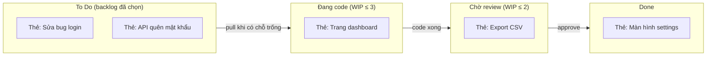

# Kanban & Flow — Trực quan hoá công việc, giới hạn WIP

> **Tác giả:** Mr.Rom\
> **Phiên bản:** v1.0.0\
> **Tạo lúc:** 13/06/2026\
> **Cập nhật:** 13/06/2026\
> **Level:** Basic\
> **Tags:** agile, kanban, flow, wip-limit, lead-time, cycle-time, scrumban, soft-skills\
> **Yêu cầu trước:** [Scrum Framework — Roles, Events, Artifacts](01_scrum-framework.md)

> 🎯 *Bài trước bạn đã học Scrum — một khung làm việc theo **nhịp cố định**: cứ mỗi sprint là một vòng plan → làm → review → retro. Nhưng không phải team nào cũng hợp với nhịp đó. Một team support, một team vận hành, một team mà việc cứ "rơi xuống" bất cứ lúc nào — ép họ đóng gói vào sprint hai tuần nhiều khi gượng gạo. Kanban là một cách tiếp cận Agile khác: thay vì nhịp cố định, nó tối ưu **dòng chảy công việc** (flow) — trực quan hoá mọi việc lên một tấm bảng, giới hạn số việc làm cùng lúc, và đo xem việc đi từ "nhận" tới "xong" mất bao lâu. Bài này dạy bạn Kanban board là gì, vì sao **giới hạn WIP lại làm tăng năng suất** (nghịch lý nhưng có lý), phân biệt lead time với cycle time, đọc được cumulative flow diagram ở mức khái niệm, và biết khi nào chọn Kanban, khi nào chọn Scrum, khi nào trộn cả hai (Scrumban). Kết bài bạn có một template board dùng được ngay.*

## 🎯 Sau bài này bạn sẽ

- [ ] Giải thích được Kanban là gì và vì sao nó tối ưu **flow** (kéo/pull thay vì đẩy/push)
- [ ] Dựng được một **Kanban board** cơ bản (To Do / In Progress / Done) và biết khi nào cần chi tiết hơn
- [ ] Hiểu **WIP limit** là gì và vì sao giới hạn việc đang làm lại *tăng* throughput (qua Little's Law ở mức trực giác)
- [ ] Phân biệt **lead time** với **cycle time** và biết mỗi cái đo điều gì
- [ ] Đọc được một **cumulative flow diagram** ở mức khái niệm (band nào là WIP, khoảng nào là thời gian chờ)
- [ ] Quyết định được khi nào dùng **Kanban**, khi nào dùng **Scrum**, và **Scrumban** là gì

---

## Tình huống — sprint bị "việc từ trên trời rơi xuống" phá nát

Team bạn đang chạy Scrum, sprint hai tuần, mọi thứ đẹp đẽ trên giấy. Nhưng thực tế tuần nào cũng vậy: đang giữa sprint thì một bug production nổ ra, sếp nhảy vào *"cái này gấp, làm ngay"*, một khách hàng lớn đòi một thay đổi nhỏ "trong hôm nay". Sprint backlog bạn cam kết từ đầu tuần giờ thành mớ giấy lộn. Cuối sprint, một nửa story chưa xong, retro lại ngồi than *"vì có nhiều việc đột xuất quá"*.

Đồng thời, bạn để ý một chuyện lạ: cả team ai cũng *"đang bận"*. Mở bảng task lên, mỗi người đang dở dang ba bốn việc cùng lúc — cái này code một nửa thì nhảy sang cái kia, cái kia chờ review thì quay lại cái nọ. Nhìn thì rất "năng suất", ai cũng tay năm tay mười. Nhưng nhìn vào cột "Done", số việc thật sự **hoàn thành** mỗi tuần lại ít đến đáng ngạc nhiên.

Hai vấn đề này — việc đột xuất phá vỡ nhịp cố định, và "ai cũng bận mà chẳng xong việc" — chính là hai thứ mà **Kanban** sinh ra để giải. Kanban không hỏi *"sprint này cam kết bao nhiêu story?"*. Nó hỏi *"việc đang chảy qua team mượt không, hay đang tắc ở đâu?"* và *"mỗi người đang ôm bao nhiêu việc dở dang cùng lúc?"*. Đây là một góc nhìn Agile khác hẳn Scrum — và với nhiều team, nó hợp hơn.

---

## 1️⃣ Kanban là gì? — tối ưu dòng chảy, kéo thay vì đẩy

**Trả lời tình huống trên**: Kanban (tiếng Nhật 看板, nghĩa là "bảng hiệu" / "thẻ báo") là một phương pháp quản lý công việc tập trung vào **dòng chảy** — làm sao để việc đi từ lúc nhận tới lúc xong **mượt mà và nhanh nhất**, thay vì đóng gói vào những lô (sprint) cố định. Nó ra đời ở dây chuyền sản xuất của Toyota từ giữa thế kỷ 20, sau đó được giới phần mềm mượn về và phổ biến qua cuốn sách của David J. Anderson năm 2010.

🪞 **Ẩn dụ**: Kanban giống cách vận hành một **quán phở đông khách**. Người chủ giỏi không nhận đơn của 20 bàn cùng lúc rồi nấu loạn xạ — vì làm thế thì 20 tô cùng dở dang, nguội ngắt, chẳng tô nào ra hồn. Họ giới hạn số tô đang nấu cùng lúc (bếp chỉ kham nổi 5 tô một đợt), và **chỉ bắt đầu tô mới khi có chỗ trống** — tức là khi một tô vừa được bưng ra. Đơn hàng "chảy" qua bếp đều đặn, khách chờ ít hơn, và bếp không bao giờ quá tải. Đó chính xác là tinh thần Kanban.

Hai từ khoá định nghĩa nên Kanban:

- **Flow** (dòng chảy) — Kanban coi công việc như nước chảy qua một đường ống: từ "cần làm" → "đang làm" → "xong". Mục tiêu là làm cho dòng chảy đó **mượt và nhanh**, ít chỗ tắc. Đây là khác biệt cốt lõi với Scrum: Scrum tối ưu theo **lô** (sprint), Kanban tối ưu theo **dòng liên tục**.
- **Pull** (kéo) thay vì **push** (đẩy) — đây là một đảo ngược tư duy quan trọng, đáng dừng lại giải thích kỹ.

### Pull vs Push — vì sao "kéo" tốt hơn "đẩy"

Trong hệ thống **push** (đẩy), việc được "tống" cho người làm bất kể họ có rảnh hay không: sếp giao task, ai đó đẩy thêm việc vào hàng đợi của bạn, bạn nhận thêm dù đang ngập. Kết quả là tình huống đầu bài — ai cũng ôm một đống việc dở dang.

Trong hệ thống **pull** (kéo), ngược lại: bạn chỉ **kéo một việc mới về khi đã làm xong việc cũ** và có "chỗ trống". Việc không bị tống vào, mà được lấy ra khi sẵn sàng. Giống anh đầu bếp chỉ bắc tô mới khi vừa bưng một tô ra. Cơ chế pull này là thứ ngăn quá tải — và nó được thực thi bằng **WIP limit** (sẽ nói ở phần 3).

| | Push (đẩy) | Pull (kéo) |
|---|---|---|
| **Việc mới đến từ** | Bị giao/tống vào, bất kể đang bận | Tự kéo về khi xong việc cũ, có chỗ trống |
| **Hệ quả** | Ai cũng ôm nhiều việc dở dang | Tập trung làm xong từng việc rồi mới lấy việc kế |
| **Khi quá tải** | Việc dồn ứ, không ai thấy giới hạn | Hệ thống "khoá" — không kéo thêm được, lộ ra điểm tắc |

> [!NOTE]
> Kanban là một phương pháp **tiến hoá, không cách mạng**. Bạn không cần đập bỏ quy trình hiện tại để áp Kanban. Nguyên tắc gốc của nó là *"bắt đầu từ chỗ bạn đang đứng"* — cứ trực quan hoá quy trình hiện có lên bảng trước, rồi cải thiện dần. Điều này khác Scrum (vốn yêu cầu áp một bộ role/event mới ngay).

### Bốn thực hành cốt lõi của Kanban

Gói gọn lại, Kanban xoay quanh bốn thực hành mà ta sẽ lần lượt mở ra trong các phần sau. Nhớ bốn cái này là nắm được xương sống của phương pháp:

- **Trực quan hoá công việc** — kéo mọi việc lên một tấm bảng ai cũng thấy (phần 2).
- **Giới hạn WIP** — đặt trần số việc đang làm cùng lúc, tạo cơ chế pull (phần 3).
- **Quản lý dòng chảy** — đo và cải thiện tốc độ việc đi qua hệ thống (phần 4-5).
- **Cải tiến liên tục** — dựa trên số liệu flow, điều chỉnh quy trình dần dần.

→ Tất cả xoay quanh một công cụ trung tâm mà ai cũng nhìn vào hằng ngày: tấm bảng. Ta xem nó trông như thế nào.

---

## 2️⃣ Kanban board — trực quan hoá để "thấy" công việc

Nguyên tắc đầu tiên và nền tảng nhất của Kanban là **trực quan hoá công việc** (visualize the work). Lý do đơn giản: việc nằm trong đầu, trong ticket rải rác, trong Slack — là **việc vô hình**. Mà cái gì vô hình thì không quản được, không thấy được chỗ tắc, không biết ai đang ngập. Kanban board kéo mọi việc ra ánh sáng, lên một mặt phẳng ai cũng nhìn thấy.

🪞 **Ẩn dụ**: Kanban board giống **tấm bảng phân làn xe ở trạm thu phí**. Mỗi làn (cột) là một giai đoạn xe phải qua; mỗi xe (thẻ việc) đi từ trái sang phải. Chỉ cần liếc một cái, người điều phối thấy ngay làn nào đang kẹt xe dài, làn nào thông thoáng — và điều xe cho hợp lý. Không có tấm bảng đó, "kẹt xe" chỉ là cảm giác mơ hồ; có nó, kẹt ở đâu hiện ra rành rành.

### Cấu trúc cơ bản: ba cột

Một Kanban board tối giản chỉ cần ba cột, biểu diễn ba trạng thái của bất kỳ việc nào. Mỗi việc là một **thẻ** (card) chạy từ trái sang phải:

| Cột | Nghĩa | Việc trong cột này |
|---|---|---|
| **To Do** (Cần làm) | Việc đã được chọn, chờ tới lượt | Chưa ai đụng vào |
| **In Progress** (Đang làm) | Việc đang được làm | Có người đang xử lý |
| **Done** (Xong) | Việc đã hoàn thành | Đã đạt "định nghĩa hoàn thành" |

Đây là khái niệm trừu tượng nhất của bài — một tấm bảng với dòng việc chảy qua và giới hạn WIP ở mỗi cột. Sơ đồ dưới mô tả một board thực tế hơn (đã tách "In Progress" thành các giai đoạn nhỏ), kèm con số WIP limit trên đầu mỗi cột:



→ Điểm cốt lõi của sơ đồ: việc **chỉ chảy theo một chiều** từ trái sang phải, và mỗi cột "đang làm" có một con số trần (WIP limit). Khi cột "Đang code" đã đủ 3 thẻ, không ai được kéo thêm thẻ từ "To Do" vào — phải đẩy một thẻ sang "Chờ review" trước. Chính cái trần đó tạo ra cơ chế pull và lộ ra điểm tắc, ta sẽ mổ xẻ ngay phần sau.

### Khi nào cần chi tiết hơn ba cột?

Ba cột là điểm khởi đầu, nhưng thực tế "In Progress" thường che giấu nhiều giai đoạn. Một việc "đang làm" có thể đang ở rất nhiều trạng thái khác nhau: đang code, code xong chờ review, review xong chờ QA test, test xong chờ deploy. Gộp hết vào một cột "In Progress" thì bạn **không thấy được nó tắc ở đâu**.

Vì thế nhiều team tách "In Progress" thành các cột nhỏ hơn phản ánh đúng quy trình của họ, ví dụ:

```text
To Do  →  Đang code  →  Chờ review  →  Đang QA  →  Chờ deploy  →  Done
```

Một mẹo hay: nhiều board còn tách mỗi cột "đang làm" thành hai cột con — **"Doing"** (đang xử lý) và **"Done"** (xong giai đoạn này, chờ giai đoạn sau kéo). Cách này giúp phân biệt rõ "thẻ này đang được ai đó làm" với "thẻ này đã xong bước trước, đang **nằm chờ** bước sau" — và thời gian nằm chờ đó chính là kẻ thù lớn nhất của flow.

> [!TIP]
> Đừng vẽ board theo quy trình "trong mơ". Hãy vẽ theo **quy trình thật sự đang diễn ra** ở team bạn, kể cả những bước xấu xí ("chờ sếp duyệt", "chờ team khác trả lời"). Mục tiêu của board là **phơi bày sự thật** để cải thiện, không phải để trông đẹp. Một cột "chờ" dài thượt là một phát hiện quý, không phải điều phải giấu.

→ Tấm bảng cho ta "thấy" việc. Nhưng phần thú vị nhất của Kanban không nằm ở việc nhìn — mà ở một con số nhỏ ghi trên đầu mỗi cột: WIP limit.

---

## 3️⃣ WIP limit — vì sao giới hạn việc đang làm lại tăng năng suất?

Đây là phần phản trực giác nhất, và cũng là tinh tuý của Kanban. **WIP** viết tắt của **Work In Progress** (việc đang làm dở). **WIP limit** là một con số trần: *"cột này không được có quá N thẻ cùng lúc"*.

Phản ứng đầu tiên của hầu hết mọi người là: *"Giới hạn việc làm cùng lúc? Vậy chẳng phải làm được ít việc hơn sao?"*. Nghe có vẻ ngược đời — nhưng thực tế **giới hạn WIP lại làm việc xong nhanh hơn và nhiều hơn**. Để hiểu vì sao, ta cần một ẩn dụ và một chút lý thuyết.

🪞 **Ẩn dụ**: Hãy nghĩ về **đường cao tốc**. Trực giác nói "càng nhiều xe trên đường thì càng nhiều xe tới đích". Nhưng ai từng kẹt xe đều biết: khi đường **quá đông**, mọi xe đều bò, và **số xe thật sự tới đích mỗi giờ lại giảm**. Đường thông thoáng vừa phải — ít xe hơn nhưng chạy mượt — lại đưa nhiều người tới đích hơn. Việc trong team y hệt: nhồi quá nhiều việc đang làm cùng lúc thì mọi việc đều "bò", và số việc thật sự *xong* lại ít đi.

### Ba lý do giới hạn WIP làm tăng throughput

Tại sao ôm ít việc cùng lúc lại xong nhiều việc hơn? Ba cơ chế cộng hưởng:

- **Giảm chuyển ngữ cảnh (context switching)** — mỗi lần nhảy từ việc này sang việc khác, não bạn tốn thời gian "nạp lại context". Ôm 5 việc cùng lúc nghĩa là bạn liên tục nhảy qua nhảy lại, và phần lớn thời gian tiêu vào việc *chuyển*, không phải việc *làm*.
- **Lộ ra điểm tắc (bottleneck)** — khi một cột đụng trần WIP và không nhận thêm được, nó buộc cả team nhìn vào đó: *"Tại sao cột Review cứ đầy hoài?"*. Điểm tắc bị che giấu trong hệ thống push, giờ hiện ra. Người rảnh ở cột trước sẽ **xúm vào giúp** gỡ tắc thay vì cắm đầu kéo thêm việc mới (làm tắc nặng hơn).
- **Việc xong nhanh hơn** — vì tập trung làm dứt điểm từng việc thay vì rải mỏng, mỗi việc đi qua hệ thống nhanh hơn. Việc xong sớm = giá trị tới tay người dùng sớm = phản hồi sớm.

### Little's Law — lý thuyết đằng sau, ở mức trực giác

Có một định luật toán học chống lưng cho chuyện này: **Little's Law**. Ở dạng đầy đủ nó là công thức của lý thuyết hàng đợi, nhưng với chúng ta chỉ cần hiểu nó ở mức trực giác qua một quan hệ ba đại lượng:

```text
                          WIP (số việc đang làm dở)
Cycle Time (thời gian   = ─────────────────────────────
mỗi việc đi qua)           Throughput (số việc xong / đơn vị thời gian)
```

Đọc công thức này theo ngôn ngữ đời thường: **thời gian một việc đi qua hệ thống** bằng **số việc đang dở** chia cho **tốc độ hoàn thành**. Ý nghĩa thực tế:

- Nếu **throughput** (tốc độ team xong việc) gần như cố định — mà nó thường cố định, vì năng lực team có hạn — thì **WIP càng cao, cycle time càng dài**. Ôm nhiều việc dở = mỗi việc xong càng lâu.
- Đảo lại: **giảm WIP** (ở throughput không đổi) thì **cycle time giảm** — mỗi việc xong nhanh hơn. Mà việc xong nhanh hơn, đều đặn hơn, chính là throughput thực tế tăng lên vì ít việc bị "treo" dở dang.

Một ví dụ con số cho dễ hình dung. Giả sử team xong trung bình 5 việc/tuần (throughput):

| Số việc ôm cùng lúc (WIP) | Cycle time mỗi việc (= WIP / throughput) |
|---|---|
| 5 việc | 5 / 5 = 1 tuần mỗi việc |
| 10 việc | 10 / 5 = 2 tuần mỗi việc |
| 20 việc | 20 / 5 = 4 tuần mỗi việc |

→ Để ý: throughput không đổi (vẫn 5 việc/tuần), nhưng ôm 20 việc thì **mỗi việc mất 4 tuần** mới xong, trong khi ôm 5 việc thì chỉ 1 tuần. Người dùng chờ một feature lâu gấp bốn lần — chỉ vì team nhồi quá nhiều việc dở dang. Đây là lý do toán học vì sao "ít WIP" lại "nhanh hơn".

### WIP limit hoạt động ra sao trong một ngày làm việc

Để thấy WIP limit không phải lý thuyết suông, theo dõi một tình huống thật. Cột "Đang code" của team có WIP limit = 3, hiện đã đủ 3 thẻ:

```text
ĐANG CODE (WIP ≤ 3):  [Thẻ A]  [Thẻ B]  [Thẻ C]   ← đã đầy trần
CHỜ REVIEW (WIP ≤ 2): [Thẻ D]
```

Bạn vừa làm xong Thẻ A, muốn kéo một việc mới từ To Do về. Nhưng theo quy tắc, bạn phải đẩy Thẻ A sang "Chờ review" trước khi kéo việc mới — mà "Chờ review" mới có 1 thẻ (còn chỗ), nên A sang được. Giờ cột "Đang code" còn 2 thẻ, bạn kéo việc mới về:

```text
ĐANG CODE (WIP ≤ 3):  [Thẻ B]  [Thẻ C]  [Thẻ mới]
CHỜ REVIEW (WIP ≤ 2): [Thẻ D]  [Thẻ A]   ← đã đầy trần
```

Bây giờ giả sử "Chờ review" đầy (2 thẻ) mà chưa ai review. Lần tới bạn làm xong một thẻ "Đang code", bạn **không đẩy sang Chờ review được** (đã đầy), cũng **không kéo việc mới** (vì cột mình chưa vơi). Hệ thống "khoá". Tín hiệu lộ ra rõ rành rành: *điểm tắc đang ở khâu review*. Việc đúng đắn lúc này không phải nhồi thêm code, mà là **bỏ code, đi review giúp** để gỡ cột đang nghẽn. Đó chính là cách WIP limit ép cả team cộng tác thay vì mạnh ai nấy chạy.

> [!IMPORTANT]
> WIP limit đặt bao nhiêu là **vừa**? Không có con số vàng. Một điểm khởi đầu phổ biến là *số người trong cột đó + 1* (hoặc thậm chí ít hơn để ép cộng tác). Rồi quan sát: nếu cột luôn đụng trần và có người ngồi chơi → nới lên một chút; nếu việc vẫn dở dang lê thê → siết xuống. WIP limit là một **cái van để chỉnh**, không phải luật bất biến. Quan trọng nhất: **phải có một con số**, vì không có trần thì không có pull, không có pull thì không có Kanban.

→ WIP limit giúp việc chảy nhanh. Nhưng "nhanh" đo bằng gì? Ta cần hai thước đo thời gian — và nhiều người nhầm lẫn chúng.

---

## 4️⃣ Lead time vs Cycle time — hai cái đồng hồ khác nhau

Để biết flow có tốt không, Kanban đo **thời gian**. Có hai thước đo dễ nhầm: **lead time** và **cycle time**. Chúng đo hai khoảng thời gian khác nhau, từ hai mốc bắt đầu khác nhau.

🪞 **Ẩn dụ**: Hình dung bạn **đặt một món ăn giao tận nhà**. Có hai cái đồng hồ:

- **Lead time** = từ lúc bạn **bấm nút đặt món** đến lúc món **tới tay bạn**. Đây là cái đồng hồ *của khách* — khách chỉ quan tâm "tôi đặt rồi, bao giờ có đồ ăn?". Nó tính cả thời gian đơn nằm chờ quán nhận, chứ không chỉ thời gian nấu.
- **Cycle time** = từ lúc **bếp bắt đầu nấu** đến lúc món **xong, sẵn sàng giao**. Đây là cái đồng hồ *của bếp* — đo riêng phần "thật sự làm việc".

Khác biệt nằm ở khoảng **đơn nằm chờ trong hàng đợi trước khi bếp đụng tới**. Lead time bao gồm khoảng chờ đó; cycle time thì không.

### Định nghĩa cho công việc dev

Áp vào một thẻ việc trên Kanban board:

| Thước đo | Bắt đầu tính từ | Kết thúc khi | Đo cái gì |
|---|---|---|---|
| **Lead time** (thời gian giao hàng) | Khi việc được **tạo / yêu cầu** (vào To Do) | Việc **Done** | Tổng trải nghiệm chờ đợi của người yêu cầu — gồm cả thời gian nằm chờ |
| **Cycle time** (thời gian xử lý) | Khi việc **bắt đầu được làm** (vào In Progress) | Việc **Done** | Thời gian team thật sự làm việc đó |

Quan hệ giữa chúng rất quan trọng: **cycle time luôn nằm gọn bên trong lead time**. Lead time = thời gian nằm chờ trong To Do + cycle time. Một sơ đồ dòng thời gian cho rõ:

```text
   Việc được tạo                Bắt đầu làm                 Done
        │                            │                        │
        ▼                            ▼                        ▼
        ├──── nằm chờ trong To Do ───┼──── đang được làm ──────┤
        │                                                     │
        ├─────────────────── LEAD TIME ───────────────────────┤
                                     ├──── CYCLE TIME ─────────┤
```

→ Ý nghĩa thực tế của việc tách hai cái: nếu **cycle time ngắn** (làm nhanh) nhưng **lead time dài** (khách chờ lâu), thì vấn đề **không phải team làm chậm** — mà là việc **nằm xếp hàng quá lâu** trước khi được đụng tới. Lúc đó giải pháp không phải "ép team làm nhanh hơn" (họ đã nhanh rồi) mà là "giảm hàng đợi, bắt đầu việc sớm hơn". Nếu chỉ nhìn một con số, bạn dễ chữa sai bệnh.

> [!NOTE]
> Có một biến thể đáng biết: **flow efficiency** (hiệu suất dòng chảy) = cycle time / lead time. Nếu một việc mất 10 ngày từ lúc tạo tới lúc xong (lead time) nhưng team chỉ thật sự đụng tay 2 ngày (cycle time), thì flow efficiency = 20% — tức 80% thời gian việc chỉ **nằm chờ**. Con số này thường gây sốc khi đo lần đầu, và nó chỉ thẳng vào nơi cần cải thiện: giảm thời gian chờ, không phải ép người làm nhanh hơn.

→ Có board, có WIP limit, có hai thước đo thời gian. Giờ làm sao **nhìn cả ba thứ đó cùng lúc theo thời gian**? Đó là việc của cumulative flow diagram.

---

## 5️⃣ Cumulative flow diagram — bức ảnh sức khoẻ của flow

**Cumulative flow diagram** (CFD — biểu đồ dòng chảy tích luỹ) là một biểu đồ duy nhất gói gọn sức khoẻ của cả hệ thống Kanban theo thời gian. Ở mức Basic, bạn không cần tự vẽ nó — công cụ (Jira, Trello, GitHub Projects) vẽ tự động. Bạn chỉ cần **đọc được** nó.

🪞 **Ẩn dụ**: CFD giống **ảnh chụp X-quang định kỳ** của dòng công việc. Bạn không nhìn từng thẻ riêng lẻ, mà nhìn toàn cảnh: chỗ nào đang "sưng to" (phình), chỗ nào "co lại" — để chẩn đoán sức khoẻ tổng thể của flow theo thời gian.

### Cách đọc một CFD

CFD là một biểu đồ vùng xếp chồng (stacked area). Trục ngang là **thời gian** (theo ngày/tuần). Trục dọc là **tổng số việc tích luỹ**. Mỗi cột trạng thái trên board là một **dải màu** (band) xếp chồng lên nhau. Ba điều cần đọc:

- **Chiều cao của một dải (band)** tại một thời điểm = **số việc đang ở trạng thái đó** lúc ấy. Dải "In Progress" càng dày = WIP càng cao. Dải "In Progress" **phình to dần** là dấu hiệu xấu — việc vào nhiều hơn việc ra, đang dồn ứ.
- **Khoảng cách dọc** giữa đường trên cùng và đường "Done" = tổng việc chưa xong. Khoảng này nở ra = backlog đang phình.
- **Khoảng cách ngang** giữa đường "vào" và đường "ra" (đo cùng một độ cao) ≈ **lead time** trung bình. Khoảng ngang càng rộng = việc đi qua càng lâu.

Một sơ đồ mô tả hình dạng một CFD lành mạnh so với một CFD có vấn đề:

```text
Số việc
tích luỹ
  ▲
  │                                   ┌───────  ← đường "đã tạo" (vào)
  │                            ┌──────┘    ░░░░  ← dải In Progress (WIP)
  │                     ┌──────┘░░░░░░░░░░▒▒▒▒▒  ← dải To Do
  │              ┌──────┘░░░░░▒▒▒▒▒▒▒▒▒███████  ← dải Done (ra)
  │       ┌──────┘░░░▒▒▒▒▒███████████████████
  │ ──────┘▒▒▒███████████████████████████████
  └─────────────────────────────────────────────▶ thời gian
        ◄── khoảng ngang = lead time ──►
```

→ Cách chẩn đoán nhanh: nếu các dải **chạy song song, đều nhau** → flow khoẻ, việc vào và ra cân bằng. Nếu dải "In Progress" **phình to theo thời gian** → WIP đang vượt kiểm soát, sắp tắc (đây chính là lúc WIP limit ở phần 3 phát huy tác dụng — nó chặn dải này phình). Nếu một dải **dẹt lép gần như không cao lên** trong khi dải phía trước phình → đó là điểm tắc, việc bị kẹt không chảy qua được.

> [!TIP]
> Ở Basic, đừng sa đà vào vẽ hay tính toán CFD. Chỉ cần nhớ một câu: **dải In Progress phình to = cảnh báo**. Mỗi tuần liếc CFD một lần (công cụ vẽ sẵn), thấy dải giữa đang dày lên thì đó là tín hiệu siết WIP hoặc xúm vào gỡ tắc — trước khi nó thành khủng hoảng.

---

## 6️⃣ Kanban vs Scrum — khi nào dùng cái nào?

Bài trước bạn học Scrum, bài này học Kanban. Câu hỏi tự nhiên: **chúng khác nhau ở đâu, và team mình nên chọn cái nào?**. Cả hai đều là cách hiện thực hoá tư duy Agile, nhưng triết lý vận hành khác nhau rõ rệt.

🪞 **Ẩn dụ**: Scrum giống **xe buýt chạy theo giờ** — cứ đúng 7h, 7h15, 7h30 là một chuyến rời bến, dù đầy hay vơi. Hành khách (việc) phải canh giờ mà lên. Kanban giống **thang cuốn chạy liên tục** — không có "giờ khởi hành", ai tới thì bước lên, dòng người chảy đều không ngắt quãng. Cả hai đều đưa người tới nơi; chỉ là một cái theo **nhịp cố định**, một cái theo **dòng liên tục**.

### Bảng so sánh

Khác biệt cốt lõi nằm ở cadence, vai trò, và cách thay đổi. Bảng dưới đặt hai bên cạnh nhau:

| Tiêu chí | Scrum | Kanban |
|---|---|---|
| **Nhịp (cadence)** | Cố định — sprint (thường 1-4 tuần) | Liên tục — không có sprint, việc chảy đều |
| **Cam kết** | Cam kết một lô việc cho cả sprint | Không cam kết lô; kéo việc khi có chỗ trống |
| **Vai trò (role)** | Quy định rõ: Product Owner, Scrum Master, Developers | Không quy định role bắt buộc |
| **Sự kiện (event)** | Quy định rõ: Planning, Daily, Review, Retro | Không bắt buộc event nào (nhưng có thể giữ) |
| **Giới hạn việc** | Gián tiếp qua sprint backlog (lô có hạn) | Trực tiếp qua **WIP limit** mỗi cột |
| **Thay đổi giữa chừng** | Hạn chế — không nên đổi sprint backlog giữa sprint | Linh hoạt — đổi ưu tiên bất cứ lúc nào |
| **Thước đo chính** | Velocity (story point/sprint) | Lead time, cycle time, throughput |
| **Áp dụng** | Cách mạng — áp bộ role/event mới | Tiến hoá — bắt đầu từ quy trình hiện có |

### Khi nào chọn cái nào?

Không có cái "tốt hơn" tuyệt đối — chỉ có cái **hợp hơn với loại công việc của team**. Vài tín hiệu định hướng:

| Nghiêng về **Scrum** nếu... | Nghiêng về **Kanban** nếu... |
|---|---|
| Việc **lên kế hoạch trước được** theo từng đợt | Việc **đột xuất nhiều**, khó cam kết trước (support, vận hành) |
| Cần nhịp đều để đồng bộ nhiều bên (stakeholder) | Ưu tiên **thay đổi liên tục**, không muốn bị khoá theo sprint |
| Team mới, cần một khung có sẵn role/event để bám | Team đã có quy trình, chỉ muốn cải thiện dần (tiến hoá) |
| Sản phẩm phát triển feature theo lộ trình | Luồng việc đa dạng kích cỡ, tới bất kỳ lúc nào |

→ Quay lại tình huống đầu bài — team bị bug production và yêu cầu gấp phá nát sprint liên tục. Đó là **tín hiệu mạnh nghiêng về Kanban** (hoặc một biến thể trộn): bản chất việc của họ là dòng liên tục với nhiều đột xuất, không hợp với cam kết cố định theo sprint. Nhưng nhiều team không muốn bỏ hẳn cái hay của Scrum (nhịp retro, planning) — và đó là lúc Scrumban xuất hiện.

---

## 7️⃣ Scrumban — trộn cái hay của cả hai

**Scrumban** đúng như tên gọi: lai giữa **Scrum** và **Kanban**. Ý tưởng là giữ lại bộ khung nhịp điệu hữu ích của Scrum (các buổi họp định kỳ giúp team đồng bộ và cải tiến), nhưng mượn cơ chế **flow + WIP limit + pull** của Kanban để xử lý dòng việc linh hoạt hơn.

🪞 **Ẩn dụ**: Scrumban giống một **xe lai (hybrid)** — chạy điện cho êm và tiết kiệm trong phố (Kanban flow cho việc hằng ngày), nhưng vẫn có động cơ xăng cho những chuyến đi xa cần lực (Scrum cadence cho planning/retro định kỳ). Bạn không phải chọn một trong hai; bạn lấy điểm mạnh của cả hai.

Một cấu hình Scrumban điển hình trông như thế này:

- **Giữ từ Scrum**: vẫn có buổi **retro** định kỳ (để cải tiến), vẫn có **daily** ngắn để đồng bộ, có thể giữ nhịp planning nhẹ.
- **Mượn từ Kanban**: dùng **board có WIP limit**, kéo việc theo **pull** thay vì cam kết cứng một sprint backlog, đo **cycle time / lead time** thay vì (hoặc cùng với) velocity.
- **Bỏ bớt**: không cam kết cứng "sprint này làm đúng N story" — việc chảy liên tục, ưu tiên có thể điều chỉnh khi cần.

> [!NOTE]
> Scrumban đặc biệt hợp với hai tình huống. Một là **team đang chuyển dần từ Scrum sang Kanban** — Scrumban là bước trung gian êm ái, không phải nhảy vực. Hai là **team có cả việc dự án (cần planning) lẫn việc vận hành/support (cần linh hoạt)** — Scrumban dung hoà được cả hai loại trong một quy trình.

→ Ba cách tiếp cận — Scrum, Kanban, Scrumban — không phải ba phe đối địch. Chúng là ba điểm trên một quang phổ từ "nhịp cố định" tới "dòng liên tục". Hiểu cả ba, bạn chọn (và trộn) được cái hợp nhất với team mình, thay vì áp một khuôn cứng rồi than nó không vừa.

---

## 8️⃣ Template board — dùng được ngay

Lý thuyết xong, giờ là thứ bạn mang đi dùng. Dưới đây là một template Kanban board tối giản mà bạn có thể dựng trong 5 phút trên bất kỳ công cụ nào (Trello, Jira, GitHub Projects, hay thậm chí một bảng trắng dán giấy nhớ). Mỗi cột ghi rõ WIP limit và "quy tắc kéo" — tức điều kiện để một thẻ được phép sang cột này:

```text
┌─────────────┬──────────────────┬──────────────────┬───────────────┬──────────┐
│  BACKLOG    │  TO DO           │  ĐANG LÀM        │  CHỜ REVIEW   │  DONE    │
│  (kho việc) │  (WIP: ∞)        │  (WIP ≤ 3)       │  (WIP ≤ 2)    │          │
├─────────────┼──────────────────┼──────────────────┼───────────────┼──────────┤
│ Mọi ý tưởng │ Đã chọn để làm   │ Đang có người    │ Code xong,    │ Đạt      │
│ chưa ưu     │ tới, sắp xếp     │ xử lý. Mỗi thẻ   │ chờ người     │ "Định    │
│ tiên        │ theo ưu tiên     │ phải có 1 người  │ khác review   │ nghĩa    │
│             │ (trên = gấp hơn) │ nhận             │               │ Hoàn     │
│             │                  │                  │               │ thành"   │
└─────────────┴──────────────────┴──────────────────┴───────────────┴──────────┘

QUY TẮC KÉO (pull policy):
- Chỉ kéo thẻ từ TO DO vào ĐANG LÀM khi ĐANG LÀM còn dưới trần (< 3 thẻ).
- Chỉ chuyển sang CHỜ REVIEW khi code thật sự xong (commit + self-test).
- Một thẻ vào DONE chỉ khi đạt đủ "Định nghĩa Hoàn thành" (review pass + test pass).
- Nếu một cột đụng trần: KHÔNG kéo thêm việc mới — xúm vào gỡ cột đó trước.

THƯỚC ĐO THEO DÕI:
- Cycle time: trung bình một thẻ đi từ ĐANG LÀM tới DONE mất bao lâu?
- Lead time: từ lúc thẻ vào TO DO tới DONE mất bao lâu?
- Liếc CFD mỗi tuần: dải ĐANG LÀM có đang phình to không?
```

→ Một lưu ý khi dùng: con số WIP (3 và 2 ở trên) chỉ là **điểm khởi đầu** cho một team nhỏ. Hãy chạy thử vài tuần, nhìn xem cột nào hay đụng trần (cần nới) và cột nào việc cứ dở dang lê thê (cần siết), rồi chỉnh dần. Cái van WIP là để vặn, không phải để đóng khung. Quan trọng là **luôn có một con số** — vì không có trần thì board của bạn chỉ là một danh sách việc đẹp mắt, không phải một hệ thống Kanban thật sự.

---

## 💡 Cạm bẫy thường gặp & Best practice

### ❌ Cạm bẫy: làm Kanban board nhưng không đặt WIP limit

- **Triệu chứng**: team dựng board ba cột đẹp đẽ, dán đủ thẻ, nhưng cột "Đang làm" lúc nào cũng chất đống mười mấy thẻ. Nhìn thì có vẻ Agile, nhưng việc vẫn dở dang lê thê, chẳng cái nào xong nhanh.
- **Nguyên nhân**: tưởng Kanban chỉ là "cái bảng có cột". Bỏ qua phần cốt lõi nhất — giới hạn WIP. Không có trần thì không có cơ chế pull, board chỉ là danh sách việc trang trí.
- **Cách tránh**: đặt một con số WIP limit cho mỗi cột "đang làm" ngay từ đầu (điểm khởi đầu: số người + 1). Khi cột đụng trần, kỷ luật không kéo thêm việc mới — xúm vào gỡ. Đây là thứ phân biệt một Kanban board thật với một bảng to-do.

### ❌ Cạm bẫy: nhầm lead time với cycle time, chữa sai bệnh

- **Triệu chứng**: khách phàn nàn "tính năng đợi mãi mới có" (lead time dài). Team phản xạ "ép nhau code nhanh hơn" — nhưng họ vốn đã code nhanh (cycle time ngắn), nên ép thêm chỉ gây stress mà lead time vẫn dài.
- **Nguyên nhân**: chỉ nhìn một con số, không tách hai thước đo. Việc thật ra **nằm chờ trong hàng đợi** quá lâu trước khi được đụng tới — vấn đề ở khâu chờ, không phải khâu làm.
- **Cách tránh**: đo cả hai. Nếu cycle time ngắn mà lead time dài → bệnh nằm ở hàng đợi (bắt đầu việc sớm hơn, giảm backlog chờ), không phải ở tốc độ làm. Nhìn flow efficiency (cycle/lead) để biết bao nhiêu % thời gian việc chỉ nằm chờ.

### ❌ Cạm bẫy: "ai cũng phải luôn bận 100%"

- **Triệu chứng**: sếp/team thấy ai đó rảnh là khó chịu, lập tức nhồi thêm việc cho "tận dụng hết công suất". Kết quả: WIP tăng vọt, mọi việc chậm lại (đúng nghịch lý đường cao tốc).
- **Nguyên nhân**: nhầm "người bận" với "việc xong". Tối ưu *mức bận của từng người* thay vì tối ưu *dòng chảy của việc*. Một người rảnh đôi khi là điều kiện để họ xúm vào gỡ điểm tắc của người khác.
- **Cách tránh**: tối ưu **flow của việc**, không phải **mức bận của người**. Một chút "chùng" (slack) trong hệ thống là lành mạnh — nó cho phép phản ứng nhanh với đột xuất và gỡ tắc. Đo bằng việc xong (throughput), không bằng số giờ ai cũng cắm mặt.

### ✅ Best practice: trực quan hoá quy trình THẬT, kể cả chỗ xấu

- **Vì sao**: board chỉ có giá trị khi nó phản ánh đúng những gì đang xảy ra. Một board "trong mơ" che giấu các cột chờ xấu xí ("chờ sếp duyệt", "chờ team khác") sẽ giấu luôn điểm tắc thật — đúng thứ cần phơi ra để sửa.
- **Cách áp dụng**: bắt đầu bằng cách vẽ board theo đúng quy trình hiện tại (nguyên tắc "start where you are"), kể cả những bước chờ khó coi. Tách cột "đang làm" thành các giai đoạn nhỏ để thấy việc tắc ở khâu nào. Một cột chờ dài là một phát hiện quý, không phải điều phải giấu.

### ✅ Best practice: chọn phương pháp theo bản chất việc, không theo trào lưu

- **Vì sao**: áp Scrum cho một team support đầy việc đột xuất, hay áp Kanban thuần cho một team cần nhịp đồng bộ chặt với nhiều bên, đều gây gượng gạo. Phương pháp là công cụ phục vụ team, không phải khuôn để ép team vừa vào.
- **Cách áp dụng**: nhìn bản chất việc của team — lên kế hoạch trước được hay đột xuất nhiều? Cần nhịp cố định hay dòng liên tục? Dùng bảng so sánh ở phần 6 để định hướng. Nếu lưng chừng, **Scrumban** là lựa chọn dung hoà an toàn — giữ retro/daily của Scrum, mượn WIP limit/pull của Kanban.

---

## 🧠 Tự kiểm tra (Self-check)

**Q1.** Một đồng nghiệp nói: *"Giới hạn số việc làm cùng lúc thì làm được ít việc hơn chứ sao mà tăng năng suất?"*. Bạn giải thích thế nào?

<details>
<summary>💡 Xem giải thích</summary>

Đây là phản trực giác kinh điển. Thực tế giới hạn WIP **tăng** lượng việc *thật sự xong* vì ba lý do: (1) giảm context switching — nhảy qua lại giữa nhiều việc tốn thời gian nạp lại context, ôm ít việc thì tập trung hơn; (2) lộ ra điểm tắc — khi một cột đụng trần, cả team nhìn vào và xúm gỡ thay vì nhồi thêm việc; (3) việc xong nhanh hơn vì làm dứt điểm từng cái.

Về toán học, theo **Little's Law**: cycle time = WIP / throughput. Throughput (năng lực team) gần như cố định, nên WIP càng cao thì cycle time mỗi việc càng dài — mỗi việc xong càng lâu. Ẩn dụ đường cao tốc: nhồi quá nhiều xe thì mọi xe đều bò, số xe tới đích mỗi giờ lại *giảm*. "Bận" không bằng "xong".

</details>

**Q2.** Lead time và cycle time khác nhau ở điểm nào? Nếu một việc có cycle time ngắn nhưng lead time dài, vấn đề nằm ở đâu?

<details>
<summary>💡 Xem giải thích</summary>

**Lead time** tính từ lúc việc được **tạo/yêu cầu** (vào To Do) tới lúc **Done** — đây là đồng hồ của người yêu cầu, gồm cả thời gian nằm chờ. **Cycle time** tính từ lúc việc **bắt đầu được làm** (vào In Progress) tới **Done** — đồng hồ của team, chỉ đo phần thật sự làm việc. Cycle time luôn nằm gọn bên trong lead time; phần chênh chính là thời gian việc nằm chờ trong hàng đợi.

Nếu cycle time ngắn (team làm nhanh) nhưng lead time dài (khách chờ lâu), vấn đề **không phải team làm chậm** — mà là việc **xếp hàng quá lâu** trước khi được đụng tới. Chữa đúng bệnh: giảm hàng đợi / bắt đầu việc sớm hơn, **không** ép team làm nhanh hơn (họ đã nhanh rồi). Flow efficiency = cycle/lead cho thấy bao nhiêu % thời gian việc chỉ nằm chờ.

</details>

**Q3.** Khác biệt cốt lõi giữa cơ chế "pull" của Kanban và "push" trong cách giao việc thông thường là gì?

<details>
<summary>💡 Xem giải thích</summary>

Trong **push** (đẩy), việc bị tống cho người làm bất kể họ rảnh hay không — sếp giao, hàng đợi của bạn cứ dày lên, dẫn tới ai cũng ôm nhiều việc dở dang. Trong **pull** (kéo), bạn chỉ **kéo một việc mới về khi đã xong việc cũ và có chỗ trống** dưới trần WIP. Việc không bị nhồi vào mà được lấy ra khi sẵn sàng.

Cơ chế pull được thực thi bằng **WIP limit**: cột đầy thì không kéo thêm được, hệ thống tự "khoá" và lộ ra điểm tắc. Ẩn dụ quán phở: đầu bếp chỉ bắc tô mới khi vừa bưng một tô ra — bếp không bao giờ quá tải.

</details>

**Q4.** Nhìn vào một cumulative flow diagram, dấu hiệu nào cho thấy flow đang có vấn đề? Dải "In Progress" phình to nói lên điều gì?

<details>
<summary>💡 Xem giải thích</summary>

Trên CFD, mỗi cột là một dải màu xếp chồng; chiều cao một dải tại một thời điểm = số việc đang ở trạng thái đó. Flow **khoẻ** khi các dải chạy **song song, đều nhau** (việc vào và ra cân bằng).

**Dải "In Progress" phình to dần** là cảnh báo: việc *vào* nhiều hơn việc *ra*, tức WIP đang vượt kiểm soát và sắp tắc. Một dải dẹt lép gần như không cao lên trong khi dải trước nó phình = điểm tắc (việc kẹt không chảy qua). Khoảng cách ngang giữa đường "vào" và đường "ra" ≈ lead time — càng rộng càng chậm. Ở Basic chỉ cần nhớ: **dải In Progress phình = siết WIP hoặc xúm gỡ tắc**.

</details>

**Q5.** Team support của bạn liên tục có việc đột xuất (bug, yêu cầu gấp) phá vỡ sprint. Nên nghiêng về Scrum, Kanban, hay Scrumban? Vì sao?

<details>
<summary>💡 Xem giải thích</summary>

Bản chất việc là **dòng liên tục với nhiều đột xuất**, khó cam kết một lô cố định cho cả sprint — đây là tín hiệu mạnh nghiêng về **Kanban**: việc chảy liên tục, kéo theo pull, đổi ưu tiên bất cứ lúc nào, không bị khoá theo sprint backlog.

Nếu team vẫn muốn giữ vài thứ hay của Scrum (retro để cải tiến, daily để đồng bộ) thì **Scrumban** là lựa chọn dung hoà tốt: giữ nhịp retro/daily, nhưng dùng board có WIP limit + pull + đo cycle/lead time thay vì cam kết cứng N story mỗi sprint. Scrum thuần (nhịp cố định, cam kết lô) ít hợp nhất với loại việc đột xuất này.

</details>

---

## ⚡ Tra cứu nhanh (Cheatsheet)

### Bốn khái niệm cốt lõi Kanban

| Khái niệm | Một câu |
|---|---|
| **Visualize** (trực quan hoá) | Kéo mọi việc lên board ai cũng thấy |
| **WIP limit** | Trần số việc đang làm mỗi cột — tạo cơ chế pull |
| **Flow** | Tối ưu để việc chảy mượt từ trái sang phải |
| **Pull** | Chỉ kéo việc mới khi xong việc cũ + có chỗ trống |

### Little's Law (mức trực giác)

```text
Cycle time = WIP / Throughput
```

| Đại lượng | Nghĩa |
|---|---|
| WIP | Số việc đang làm dở |
| Throughput | Số việc xong / đơn vị thời gian (≈ cố định) |
| Cycle time | Thời gian một việc đi qua hệ thống |

→ Quy tắc vàng: throughput cố định ⇒ **WIP cao = cycle time dài**. Giảm WIP để việc xong nhanh hơn.

### Lead time vs Cycle time

| | Bắt đầu từ | Đo cái gì |
|---|---|---|
| **Lead time** | Việc được tạo (vào To Do) | Trải nghiệm chờ của người yêu cầu (gồm thời gian nằm chờ) |
| **Cycle time** | Việc bắt đầu làm (vào In Progress) | Thời gian team thật sự làm việc |

→ Lead time = thời gian chờ trong queue + cycle time.

### Kanban vs Scrum (rút gọn)

| | Scrum | Kanban |
|---|---|---|
| Nhịp | Cố định (sprint) | Liên tục (flow) |
| Role/Event | Quy định rõ | Không bắt buộc |
| Giới hạn việc | Qua sprint backlog | Qua WIP limit |
| Thước đo | Velocity | Lead/cycle time, throughput |
| Đổi giữa chừng | Hạn chế | Linh hoạt |

→ **Scrumban** = giữ retro/daily của Scrum + WIP limit/pull của Kanban. Hợp khi đang chuyển đổi hoặc trộn việc dự án + vận hành.

### Đọc CFD trong 1 câu

- Các dải **song song, đều** → flow khoẻ.
- Dải **In Progress phình** → WIP vượt kiểm soát, sắp tắc → siết WIP / xúm gỡ.
- Khoảng **ngang** giữa đường vào và ra ≈ lead time.

---

## 📚 Từ Điển Thuật Ngữ (Glossary)

| EN | VN | Giải thích |
|---|---|---|
| Kanban | (giữ EN) | Phương pháp quản lý việc theo dòng chảy, trực quan hoá + giới hạn WIP |
| Flow | Dòng chảy | Việc đi từ "cần làm" tới "xong"; mục tiêu là làm nó mượt và nhanh |
| Pull | Kéo | Chỉ lấy việc mới khi xong việc cũ và có chỗ trống (ngược với push) |
| Push | Đẩy | Việc bị tống vào hàng đợi bất kể người làm có rảnh không |
| Kanban board | Bảng Kanban | Tấm bảng chia cột theo trạng thái; mỗi việc là một thẻ chạy trái → phải |
| Card | Thẻ | Một đơn vị việc trên board |
| WIP | Work In Progress — việc đang làm dở | Số việc đang ở trạng thái "đang làm" cùng lúc |
| WIP limit | Giới hạn WIP | Con số trần: mỗi cột không quá N thẻ; tạo cơ chế pull |
| Throughput | Sản lượng / thông lượng | Số việc hoàn thành trong một đơn vị thời gian |
| Little's Law | Định luật Little | Cycle time = WIP / Throughput — nền toán học cho việc giới hạn WIP |
| Lead time | Thời gian giao hàng | Từ lúc việc được tạo tới lúc xong (gồm cả thời gian nằm chờ) |
| Cycle time | Thời gian xử lý | Từ lúc việc bắt đầu được làm tới lúc xong (chỉ phần thật sự làm) |
| Flow efficiency | Hiệu suất dòng chảy | Cycle time / lead time — % thời gian việc thật sự được làm (phần còn lại là chờ) |
| Bottleneck | Điểm tắc | Khâu mà việc bị kẹt lại, làm chậm cả dòng chảy |
| Context switching | Chuyển ngữ cảnh | Tốn sức não khi nhảy qua lại giữa nhiều việc dở |
| CFD (Cumulative Flow Diagram) | Biểu đồ dòng chảy tích luỹ | Biểu đồ vùng xếp chồng cho thấy sức khoẻ flow theo thời gian |
| Scrum | (giữ EN) | Khung Agile theo nhịp cố định (sprint), có role/event quy định |
| Scrumban | (giữ EN) | Lai Scrum + Kanban: giữ nhịp họp của Scrum, mượn WIP limit/pull của Kanban |
| Velocity | Vận tốc | Lượng story point team xong mỗi sprint (thước đo của Scrum) |
| Cadence | Nhịp / chu kỳ | Tần suất lặp lại của các sự kiện (sprint cố định vs dòng liên tục) |
| Slack | Độ chùng | Một chút thời gian "rảnh" lành mạnh để phản ứng đột xuất và gỡ tắc |

---

## 🔗 Liên kết & Tài nguyên

⬅️ **Bài trước:** [Scrum Framework — Roles, Events, Artifacts](01_scrum-framework.md)\
➡️ **Bài tiếp theo:** [User Stories & Ước lượng — Backlog, story point, velocity](03_user-stories-and-estimation.md)\
↑ **Về cụm:** [agile-scrum — README](../../README.md)

### 🧭 Định hướng lộ trình học

- [Agile là gì? — Tư duy & 4 giá trị cốt lõi](00_what-is-agile.md) — nền tư duy Agile mà cả Kanban lẫn Scrum đều hiện thực hoá
- [Scrum Framework — Roles, Events, Artifacts](01_scrum-framework.md) — đối chiếu trực tiếp với Kanban ở phần 6; hai cách tiếp cận Agile bổ trợ nhau

### 🧩 Các chủ đề có thể bạn quan tâm

- [User Stories & Ước lượng — Backlog, story point, velocity](03_user-stories-and-estimation.md) — backlog là nguồn việc đổ vào board; velocity là thước đo Scrum đối ứng với throughput của Kanban
- [Agile thực chiến & cạm bẫy — Tránh 'fake agile'](04_agile-in-practice-and-pitfalls.md) — "board không có WIP limit" là một dạng fake-agile điển hình bài này cảnh báo
- [Quản lý thời gian — cụm chủ đề](../../../time-management/README.md) — WIP limit ở cấp cá nhân chính là chống làm nhiều việc cùng lúc (chống multitasking)

### 🌐 Tài nguyên tham khảo khác

- [Atlassian — Kanban](https://www.atlassian.com/agile/kanban) — giới thiệu thực dụng về board, WIP limit và flow
- [Kanban University — What is Kanban?](https://kanban.university/kanban-guide/) — nguồn chuẩn về phương pháp Kanban (theo David J. Anderson)
- [Atlassian — Kanban vs Scrum](https://www.atlassian.com/agile/kanban/kanban-vs-scrum) — so sánh chi tiết hai phương pháp và khi nào dùng cái nào

---

## 📌 Nhật ký thay đổi (Changelog)

- **v1.0.0 (13/06/2026)** — Bản đầu tiên. Bài 02 cụm agile-scrum: tình huống mở bài "sprint bị việc đột xuất phá nát + ai cũng bận mà chẳng xong" + định nghĩa Kanban (flow, pull vs push) với ẩn dụ quán phở + Kanban board ba cột và khi nào chi tiết hơn với sơ đồ mermaid board + WIP limit và ba lý do tăng throughput + Little's Law mức trực giác (cycle time = WIP/throughput) với ví dụ con số + lead time vs cycle time với ẩn dụ đặt món + sơ đồ dòng thời gian + cumulative flow diagram mức khái niệm với sơ đồ đọc CFD + Kanban vs Scrum (bảng so sánh + khi nào dùng cái nào) với ẩn dụ xe buýt vs thang cuốn + Scrumban (lai hai phương pháp) với ẩn dụ xe hybrid + template board dùng ngay với pull policy + 3 cạm bẫy + 2 best practice + 5 self-check + cheatsheet + glossary 22 thuật ngữ.
