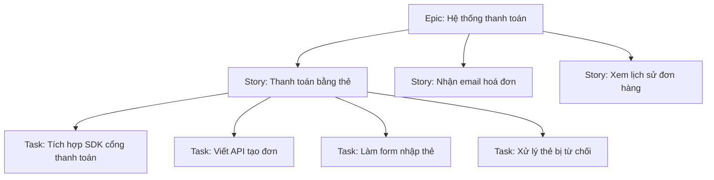

# User Stories & Ước lượng — Backlog, story point, velocity

> **Tác giả:** Mr.Rom\
> **Phiên bản:** v1.0.0\
> **Tạo lúc:** 13/06/2026\
> **Cập nhật:** 13/06/2026\
> **Level:** Basic\
> **Tags:** agile, scrum, user-story, invest, acceptance-criteria, estimation, story-point, planning-poker, velocity, backlog-refinement\
> **Yêu cầu trước:** [Kanban & Flow](02_kanban-and-flow.md)

> 🎯 *Bài trước bạn đã học cách **trực quan hoá luồng công việc** bằng Kanban và giới hạn WIP. Nhưng những "thẻ" chạy trên bảng đó đến từ đâu, và làm sao team biết mỗi thẻ "to" cỡ nào để lên kế hoạch một sprint? Đây là chỗ rất nhiều team trượt: yêu cầu viết kiểu *"làm trang thanh toán"* mơ hồ tới mức ai hiểu một kiểu, sếp hỏi *"khi nào xong?"* thì cả team đoán mò bằng giờ rồi trễ deadline đều đặn. Bài này dạy bạn cách viết một **user story** rõ ràng, gắn **acceptance criteria** để biết thế nào là "xong", phân biệt **epic / story / task**, ước lượng **tương đối bằng story point** (và vì sao điểm tốt hơn giờ), chơi **planning poker** với dãy Fibonacci, đo và dùng **velocity** đúng cách (không so sánh giữa team, không ép), giữ backlog gọn qua **refinement**, và chia nhỏ story khi nó quá to. Kết bài bạn có sẵn một template user story + acceptance criteria dùng được ngay cho ticket tiếp theo.*

## 🎯 Sau bài này bạn sẽ

- [ ] Viết được một **user story** theo mẫu *"Là <ai>, tôi muốn <gì>, để <lợi ích>"* và kiểm nó qua **INVEST**
- [ ] Gắn **acceptance criteria** dạng Given/When/Then để định nghĩa rõ "thế nào là xong"
- [ ] Phân biệt **epic / story / task** và biết cái nào nằm ở đâu trong backlog
- [ ] Hiểu vì sao ước lượng bằng **story point** (tương đối) tốt hơn bằng **giờ** (tuyệt đối)
- [ ] Chơi **planning poker** với dãy Fibonacci để cả team đồng thuận một con số
- [ ] Đo **velocity** và dùng nó để dự báo — **không** so sánh giữa team, **không** ép tăng
- [ ] Giữ backlog luôn sẵn sàng qua **refinement** và biết cách **chia nhỏ** một story quá to

---

## Tình huống — "làm trang thanh toán" và lời hứa "ba ngày"

Sprint planning sáng thứ Hai. PM kéo lên bảng một thẻ ghi đúng bốn chữ: **"Làm trang thanh toán"**. Rồi quay sang hỏi cả team: *"Cái này mất bao lâu?"*.

Im lặng. Một bạn dev đoán *"chắc ba ngày"*. PM gật, ghi vào kế hoạch: thứ Năm xong. Cả team gật theo.

Tới thứ Năm, trang thanh toán... chưa đâu vào đâu. Hoá ra "trang thanh toán" gồm: tích hợp cổng thanh toán, xử lý lỗi thẻ bị từ chối, gửi email hoá đơn, trang xác nhận, và xử lý trường hợp người dùng nhấn nút hai lần. Bạn dev kia khi nói "ba ngày" chỉ hình dung mỗi cái form nhập thẻ. PM thì hiểu là cả luồng hoàn chỉnh. Hai người **nói cùng một câu nhưng nghĩ hai thứ khác nhau** — và không ai nhận ra cho tới khi trễ hạn.

Đây là cảnh quen thuộc tới mức đau lòng. Nó gói gọn ba thất bại cùng lúc:

- **Yêu cầu mơ hồ** — "làm trang thanh toán" không cho ai biết *ai dùng, để làm gì, và thế nào là xong*.
- **Phạm vi (scope) không rõ** — không ai biết "trang thanh toán" thật ra to cỡ nào cho tới khi bắt tay vào.
- **Ước lượng bằng giờ trên một thứ mơ hồ** — "ba ngày" là con số đoán mò trên một khối lượng công việc chưa ai nhìn rõ.

Cả ba thất bại này đều có lời giải, và đó chính là nội dung bài hôm nay. Ta bắt đầu từ gốc rễ: **cách viết yêu cầu sao cho không ai hiểu nhầm**.

---

## 1️⃣ User story — yêu cầu kể từ góc nhìn người dùng

Cách sửa lỗi "làm trang thanh toán" không phải là viết một bản đặc tả 20 trang. Nó là viết yêu cầu theo một góc nhìn khác: **góc nhìn của người sẽ dùng tính năng đó**. Đó chính là **user story**.

**User story** (câu chuyện người dùng) là một mô tả ngắn về một tính năng, viết từ góc nhìn người dùng, tập trung vào *họ muốn gì* và *vì sao họ muốn*. Nó **không phải** một bản đặc tả kỹ thuật chi tiết — nó là một **lời nhắc để trò chuyện**. Tên gốc tiếng Anh là "story" (câu chuyện) chính vì thế: nó mở ra một cuộc nói chuyện giữa team và người đặt hàng, không khoá cứng mọi chi tiết từ đầu.

🪞 **Ẩn dụ**: user story giống **lời nhắn dán trên tủ lạnh của người bạn đời**: *"Đi siêu thị mua sữa để sáng mai con có cái ăn"*. Nó không liệt kê hãng sữa nào, mua ở siêu thị nào, đi xe gì — những chi tiết đó hai người **bàn thêm** khi cần. Nhưng nó nói rõ ba điều cốt lõi: **ai cần** (con), **cần gì** (sữa), **để làm gì** (sáng mai có cái ăn). Biết "để làm gì" cực kỳ quan trọng: nếu siêu thị hết sữa, người đi mua vẫn tự quyết được mua sữa chua thay thế — vì họ hiểu *mục đích*, không chỉ làm theo lệnh.

### Mẫu chuẩn — ba phần không thể thiếu

Một user story chuẩn luôn có ba mảnh, theo một khuôn câu cố định:

```text
Là <vai trò / loại người dùng>,
tôi muốn <một hành động / tính năng>,
để <lợi ích / lý do mình muốn nó>.
```

Ba mảnh này trả lời ba câu hỏi mà "làm trang thanh toán" bỏ trống hoàn toàn:

- **Là <ai>** — ai là người hưởng lợi? Khách mua hàng? Admin? Người dùng chưa đăng nhập? Biết "ai" giúp ta thiết kế đúng cho đúng người.
- **Tôi muốn <gì>** — họ muốn làm được điều gì? Đây là phần "tính năng", nhưng diễn đạt từ góc người dùng chứ không phải góc kỹ thuật.
- **Để <lợi ích>** — *vì sao* họ muốn nó? Đây là phần quan trọng nhất và hay bị bỏ nhất. Nó giúp team hiểu **giá trị thật sự**, để khi có ràng buộc còn biết đường đánh đổi.

Quay lại tình huống đầu bài, thay vì "làm trang thanh toán", ta viết thành các story rõ ràng:

```text
Là một khách đã chọn xong giỏ hàng,
tôi muốn thanh toán bằng thẻ tín dụng,
để hoàn tất đơn hàng mà không cần rời khỏi website.
```

```text
Là một khách vừa thanh toán xong,
tôi muốn nhận email hoá đơn,
để có bằng chứng giao dịch và biết đơn đã được ghi nhận.
```

→ Để ý: hai story trên đã tách "trang thanh toán" mơ hồ thành hai mảnh việc **độc lập, có chủ thể rõ, có mục đích rõ**. Giờ không còn chuyện "tôi nghĩ một kiểu, anh nghĩ một kiểu" — vì mỗi story nói rõ ai, làm gì, để làm gì. Nhưng viết đúng khuôn câu chưa đủ; một story tốt còn phải đạt thêm sáu tiêu chí, gọi tắt là INVEST.

---

## 2️⃣ INVEST — sáu tiêu chí của một story tốt

Viết đúng mẫu "Là... tôi muốn... để..." mới là điều kiện cần. Một story *tốt* còn cần đạt sáu tiêu chí, gói trong từ viết tắt dễ nhớ **INVEST**. Mỗi chữ cái là một tính chất; thiếu chữ nào thì story đó sẽ gây rắc rối ở một khâu cụ thể.

Bảng dưới giải nghĩa từng chữ, kèm "nếu thiếu thì sao" để bạn thấy vì sao tiêu chí đó tồn tại:

| Chữ | EN | Nghĩa | Nếu thiếu thì sao |
|---|---|---|---|
| **I** | Independent | **Độc lập** — làm được không phụ thuộc story khác | Story dính chùm nhau → không thể lên kế hoạch hay ưu tiên linh hoạt |
| **N** | Negotiable | **Có thể thương lượng** — là điểm khởi đầu để bàn, không phải hợp đồng cứng | Khoá chết chi tiết quá sớm → mất sự linh hoạt của Agile |
| **V** | Valuable | **Có giá trị** — mang lại lợi ích rõ cho người dùng/doanh nghiệp | Làm xong chẳng ai dùng → lãng phí công sức |
| **E** | Estimable | **Ước lượng được** — team đủ hiểu để đoán độ lớn | Quá mơ hồ → không ước lượng nổi, không lên kế hoạch được |
| **S** | Small | **Nhỏ** — gọn đủ để xong trong một sprint | Quá to → kéo dài nhiều sprint, khó theo dõi tiến độ |
| **T** | Testable | **Kiểm thử được** — có cách kiểm chứng nó "đã xong" | Không biết khi nào xong → "xong" thành chuyện cãi nhau |

🪞 **Ẩn dụ**: INVEST giống **checklist của thợ làm bánh trước khi nhận đơn**. Trước khi gật đầu "làm được", thợ tự hỏi: cái bánh này có làm độc lập với đơn khác không (I), khách còn đổi ý được không (N), khách có thật sự cần nó không (V), mình ước được cần bao nhiêu bột không (E), nó vừa một mẻ lò không hay phải chia nhiều mẻ (S), và làm xong có cách nào biết bánh đạt chuẩn không (T). Đủ sáu cái gật thì mới nhận đơn yên tâm.

Trong sáu tiêu chí, hai cái mà beginner hay vướng nhất là **S (Small)** và **T (Testable)** — story to đùng và story không có cách kiểm chứng. Cả hai đều có cách xử lý riêng, và ta sẽ quay lại chúng ở phần acceptance criteria (cho chữ T) và phần chia nhỏ story (cho chữ S).

> [!TIP]
> Đừng dùng INVEST như một bài kiểm tra phải-đạt-100%. Nó là một bộ **câu hỏi gợi ý** để soi story: "story này có vẻ to quá (S), chia được không?", "làm xong làm sao biết đúng (T)?". Mục tiêu là phát hiện vấn đề sớm, không phải đánh trượt cho vui.

---

## 3️⃣ Acceptance criteria — định nghĩa "thế nào là xong"

Nhớ chữ **T (Testable)** trong INVEST chứ? Đây là công cụ để đạt nó. Một story nói *"khách thanh toán bằng thẻ"* nghe rõ, nhưng khi nào thì coi như **xong**? Thẻ hết hạn xử lý sao? Thẻ bị từ chối thì hiện gì? Không trả lời được những câu này, "xong" sẽ trở thành cuộc cãi vã giữa dev (*"em làm xong rồi"*) và PM (*"nhưng nó chưa xử lý thẻ lỗi"*).

**Acceptance criteria** (tiêu chí chấp nhận) là danh sách điều kiện mà một story phải thoả để được coi là *hoàn thành*. Nó biến chữ "xong" mơ hồ thành một danh sách kiểm tra cụ thể, ai cũng đối chiếu được.

🪞 **Ẩn dụ**: acceptance criteria giống **danh sách nghiệm thu khi nhận nhà**. Hợp đồng ghi "xây nhà 3 phòng ngủ" (đó là story). Nhưng lúc nhận nhà, bạn cầm một tờ checklist: vòi nước có chảy không, công tắc đèn có sáng không, cửa có khít không, tường có thấm không. Chỉ khi mọi mục tick xong bạn mới ký nhận. Không có tờ checklist đó, "nhà đã xây xong" trở thành tranh cãi vô tận.

### Định dạng Given/When/Then

Cách viết acceptance criteria phổ biến và rõ ràng nhất là theo khuôn **Given/When/Then** (Cho trước / Khi / Thì):

- **Given** (cho trước) — bối cảnh, trạng thái ban đầu trước khi hành động.
- **When** (khi) — hành động mà người dùng thực hiện.
- **Then** (thì) — kết quả mong đợi sau hành động.

Cấu trúc ba mảnh này ép ta nghĩ qua từng kịch bản một cách trọn vẹn: tình huống nào, làm gì, ra sao. Lấy story thanh toán bằng thẻ, ta viết acceptance criteria cho cả trường hợp thành công lẫn thất bại:

```text
Story: Là khách đã chọn xong giỏ hàng, tôi muốn thanh toán bằng thẻ
       tín dụng, để hoàn tất đơn hàng mà không cần rời website.

Acceptance criteria:

  Kịch bản 1 — Thanh toán thành công
    Given  giỏ hàng có ít nhất 1 sản phẩm và khách đã nhập thẻ hợp lệ
    When   khách nhấn nút "Thanh toán"
    Then   hệ thống trừ tiền, tạo đơn hàng, và chuyển sang trang xác nhận

  Kịch bản 2 — Thẻ bị từ chối
    Given  khách nhập một thẻ bị ngân hàng từ chối
    When   khách nhấn nút "Thanh toán"
    Then   hệ thống KHÔNG tạo đơn, hiển thị thông báo lỗi rõ ràng,
           và giữ nguyên giỏ hàng để khách thử thẻ khác

  Kịch bản 3 — Chống nhấn nút hai lần
    Given  khách đã nhấn "Thanh toán" và yêu cầu đang được xử lý
    When   khách nhấn "Thanh toán" lần nữa
    Then   hệ thống chỉ tạo đúng 1 đơn hàng (không tính tiền hai lần)
```

→ Nhìn ba kịch bản này, "trang thanh toán" mơ hồ đầu bài giờ đã hoá thành một danh sách kiểm chứng cụ thể. Khi dev báo "xong", PM chỉ cần chạy qua ba kịch bản — đủ cả ba thì xong thật, thiếu cái nào thì chưa. Đáng chú ý: kịch bản 3 (chống nhấn hai lần) chính là cái mà bạn dev đầu bài *không hề nghĩ tới* khi đoán "ba ngày". Viết acceptance criteria **trước khi code** phơi bày những góc khuất đó ra ngay từ đầu.

> [!IMPORTANT]
> Acceptance criteria nên được viết **trước hoặc trong lúc** team bàn về story, chứ không phải sau khi đã code xong. Viết trước giúp lộ ra các kịch bản phụ (thẻ lỗi, nhấn hai lần...) mà nếu bỏ sót sẽ thành ước lượng sai và trễ hạn — đúng như tình huống đầu bài.

---

## 4️⃣ Epic, Story, Task — ba mức độ to nhỏ

Đến đây một câu hỏi tự nhiên nảy ra: nếu "làm trang thanh toán" tách được thành nhiều story, thì bản thân "trang thanh toán" gọi là gì? Và một story khi bắt tay vào làm lại chia thành những việc nhỏ hơn — những việc đó gọi là gì? Đây là lúc cần ba khái niệm về **mức độ to nhỏ** của công việc: epic, story, task.

🪞 **Ẩn dụ**: hãy hình dung như **kế hoạch một chuyến du lịch**:

- **Epic** = *"Đi du lịch Đà Nẵng"* — một mục tiêu lớn, nhiều việc con, không thể làm trong một buổi.
- **Story** = *"Đặt vé máy bay"*, *"Đặt khách sạn"*, *"Lên lịch tham quan"* — các phần độc lập, mỗi phần làm xong là có giá trị riêng.
- **Task** = *"So sánh giá vé 3 hãng"*, *"Nhập thông tin hành khách"*, *"Thanh toán vé"* — các bước kỹ thuật cụ thể bên trong một story.

Bảng dưới so sánh ba mức một cách hệ thống:

| Mức | Là gì | Độ lớn | Góc nhìn | Ví dụ (e-commerce) |
|---|---|---|---|---|
| **Epic** | Khối tính năng lớn, gom nhiều story | Nhiều sprint | Người dùng / doanh nghiệp | "Hệ thống thanh toán" |
| **Story** | Một tính năng nhỏ có giá trị độc lập | Vừa một sprint | Người dùng | "Thanh toán bằng thẻ tín dụng" |
| **Task** | Một bước kỹ thuật để hoàn thành story | Vừa một ngày | Lập trình viên | "Tích hợp SDK cổng thanh toán" |

Điểm mấu chốt phân biệt **story** với **task**: story viết từ **góc người dùng** và mang **giá trị** cho họ (chữ V trong INVEST), còn task viết từ **góc kỹ thuật** và một mình nó thường *không* mang giá trị cho người dùng. "Tích hợp SDK" thì người dùng chẳng quan tâm; nhưng "thanh toán được bằng thẻ" thì có. Đây là khái niệm trừu tượng nhất của bài, nên ta hình dung quan hệ ba mức qua sơ đồ dưới.



→ Sơ đồ cho thấy quan hệ **cha-con**: một epic nở ra nhiều story, một story nở ra nhiều task. Khi lập kế hoạch sprint, ta kéo các **story** (không phải epic, vì epic quá to) vào sprint, rồi khi làm mới chẻ chúng thành **task** trên bảng Kanban đã học ở bài trước. Hiểu được ba mức này, ta đã sẵn sàng cho câu hỏi gai góc nhất: làm sao **đo độ lớn** của một story?

---

## 5️⃣ Story point — ước lượng tương đối thay vì đếm giờ

Quay lại câu hỏi chí mạng của PM đầu bài: *"Cái này mất bao lâu?"*. Bản năng đầu tiên của ai cũng là trả lời bằng **giờ** hoặc **ngày**: "ba ngày". Nhưng ước lượng bằng thời gian tuyệt đối có một vấn đề sâu xa khiến nó hay sai.

🪞 **Ẩn dụ**: hỏi "việc này mất mấy giờ?" giống hỏi **"đi từ Hà Nội vào Sài Gòn mất bao lâu?"**. Câu trả lời *tuỳ thuộc vào ai đi và đi bằng gì*: đi bộ thì cả tháng, ô tô thì hai ngày, máy bay thì hai tiếng. Con số thời gian phụ thuộc người thực hiện và hoàn cảnh quá nhiều. Nhưng nếu hỏi **"quãng đường đó dài gấp mấy lần Hà Nội - Hải Phòng?"** thì câu trả lời ổn định hơn nhiều — *khoảng 17 lần*, bất kể bạn đi bằng gì. Đó chính là tinh thần của story point: đo **độ lớn tương đối**, không đo thời gian tuyệt đối.

### Vì sao điểm thay vì giờ?

**Story point** (điểm story) là một đơn vị **trừu tượng, tương đối** dùng để ước lượng *độ lớn tổng thể* của một story — gộp cả khối lượng công việc, độ phức tạp, và độ rủi ro/không chắc chắn. Quan trọng: nó **không phải** là giờ trá hình. Vì sao team Agile chuộng điểm hơn giờ? Vài lý do cốt lõi:

| Vấn đề của ước lượng bằng GIỜ | Story point giải quyết thế nào |
|---|---|
| Phụ thuộc *người làm* — junior 3 ngày, senior 1 ngày, cùng một việc | Điểm đo **độ lớn của việc**, không đổi theo ai làm |
| Người ta dở ở việc đoán giờ tuyệt đối, nhưng giỏi **so sánh** to/nhỏ | So sánh tương đối ("cái này gấp đôi cái kia") dễ và chính xác hơn |
| Đoán giờ tạo **cam kết ngầm** dễ bị ép ("đã nói 3 ngày mà chưa xong à?") | Điểm là số trừu tượng, khó dùng để ép cá nhân |
| Giờ bỏ quên **độ phức tạp & rủi ro**, chỉ tính lượng việc | Điểm gộp cả ba: lượng việc + độ khó + độ không chắc |

Điểm cốt lõi để nhớ: con người **rất tệ** ở việc đoán "việc này mất chính xác mấy giờ", nhưng **khá giỏi** ở việc nói "việc này lớn hơn/nhỏ hơn việc kia bao nhiêu lần". Story point khai thác đúng cái ta giỏi và né cái ta dở.

### Cách "cân" tương đối

Cách dùng story point trong thực tế là **chọn một story mốc** (reference story) — thường một story nhỏ, ai cũng hiểu rõ — gán cho nó một con số nhỏ (ví dụ 2 điểm). Sau đó mọi story khác được "cân" so với mốc đó:

```text
Story mốc:  "Thêm nút đăng xuất"              → 2 điểm  (nhỏ, rõ ràng)

So sánh:
  "Sửa lỗi hiển thị ngày sai múi giờ"          → 3 điểm  (hơi lớn hơn mốc một chút)
  "Thanh toán bằng thẻ tín dụng"               → 8 điểm  (lớn gấp ~4 lần mốc, nhiều rủi ro)
  "Làm bộ lọc tìm kiếm nâng cao"               → 5 điểm  (vừa, phức tạp vừa phải)
```

→ Để ý: không ai nói "story này 6 tiếng". Họ nói "story này lớn hơn cái mốc 2 điểm khoảng bốn lần, lại có rủi ro tích hợp bên ngoài, nên cho 8". Số điểm là một *phán đoán so sánh*, không phải một lời hứa thời gian. Nhưng những con số 2, 3, 5, 8 này không phải chọn tuỳ tiện — chúng theo một dãy số đặc biệt.

---

## 6️⃣ Dãy Fibonacci & planning poker — cả team cùng đồng thuận

Bạn vừa thấy các con số 2, 3, 5, 8. Đó không phải ngẫu nhiên — chúng thuộc **dãy Fibonacci** (mỗi số bằng tổng hai số trước): 1, 2, 3, 5, 8, 13, 21... Đa số team Agile dùng một biến thể của dãy này để gán story point.

### Vì sao Fibonacci mà không phải 1, 2, 3, 4, 5?

🪞 **Ẩn dụ**: gán điểm bằng dãy Fibonacci giống **chọn cỡ áo: S, M, L, XL** thay vì đo từng centimet vòng ngực. Khi việc còn nhỏ và rõ, ta phân biệt được "1 và 2 điểm" (như S và M). Nhưng khi việc đã to, sự khác biệt giữa "20 và 21 điểm" là **ảo tưởng chính xác** — không ai đủ tinh để phân biệt nổi. Khoảng cách giãn dần của Fibonacci (1, 2, 3, 5, 8, 13...) phản ánh đúng sự thật này: **việc càng lớn, ta càng kém chắc chắn**, nên các mốc lựa chọn cũng phải thưa dần ra.

Cụ thể, dãy Fibonacci ép ta **không** sa vào tranh cãi vô nghĩa kiểu "5 hay 6 điểm?" — vì 6 không tồn tại, chỉ có 5 hoặc 8. Sự "nhảy bậc" này là một tính năng, không phải khuyết điểm: nó buộc team chọn dứt khoát và thừa nhận độ bất định cố hữu của việc lớn.

| Điểm | Ý nghĩa thô | Cảm giác |
|---|---|---|
| **1, 2** | Rất nhỏ, rõ ràng | "Làm nhoáng cái là xong" |
| **3, 5** | Vừa | "Cần suy nghĩ chút nhưng nắm được" |
| **8, 13** | Lớn | "Khá phức tạp, nên cân nhắc chia nhỏ" |
| **21+** | Quá lớn | "Đây là epic trá hình — phải chia ra" |

> [!TIP]
> Nhiều team thêm hai "lá bài" đặc biệt ngoài dãy số: **? (chấm hỏi)** nghĩa là "tôi chưa đủ hiểu để ước lượng — cần làm rõ thêm", và **☕ (tách cà phê)** nghĩa là "tôi cần nghỉ giải lao". Lá `?` rất giá trị: nó là tín hiệu story cần được **refine** thêm trước khi ước lượng.

### Planning poker — cách cả team cùng cho điểm

Nếu để một người ước lượng, ta lại rơi vào bẫy "một người hiểu một kiểu" của đầu bài. **Planning poker** là một kỹ thuật để *cả team* cùng đồng thuận một con số, đồng thời phơi bày những hiểu lầm về phạm vi ngay tại chỗ.

Cách chơi rất đơn giản, mỗi người có một bộ "bài" mang các số Fibonacci:

```text
1. Người điều phối đọc to một story + acceptance criteria của nó.
2. Team hỏi đáp làm rõ nếu có chỗ chưa rõ.
3. Mỗi người ÂM THẦM chọn một lá bài (số điểm họ nghĩ) — chưa lật.
4. Đếm 1-2-3, tất cả LẬT BÀI cùng lúc.
5. Nếu mọi người gần khớp (vd 5, 5, 8) → bàn nhanh rồi chốt.
6. Nếu lệch xa (vd 2 và 13) → người cho thấp NHẤT và CAO NHẤT
   giải thích vì sao. Thường lộ ra hiểu lầm về phạm vi.
7. Bốc lại vòng nữa. Lặp tới khi cả team đủ gần để chốt một số.
```

→ Bước 3 — *chọn âm thầm trước khi lật* — là tinh hoa của planning poker. Nó tránh hiệu ứng "neo" (anchoring): nếu senior nói "8" trước, mọi người dễ a dua theo 8 mà không suy nghĩ độc lập. Lật cùng lúc buộc mỗi người tự đánh giá. Và bước 6 mới là phần *quý nhất*: khi một người cho 2 còn người khác cho 13, gần như chắc chắn họ đang hiểu story theo hai phạm vi khác nhau — đúng cái lỗi "form nhập thẻ" vs "cả luồng thanh toán" của đầu bài. Cuộc tranh luận để giải thích chênh lệch chính là lúc team **thống nhất hiểu biết**, và đó còn quý hơn cả con số cuối cùng.

> [!NOTE]
> Giá trị lớn nhất của planning poker **không phải** con số điểm cuối cùng, mà là **cuộc trò chuyện** nó tạo ra. Khi điểm lệch xa, team buộc phải nói rõ giả định của mình — và đó là lúc các hiểu lầm về phạm vi bị lộ ra *trước khi* code, chứ không phải lúc đã trễ hạn.

---

## 7️⃣ Velocity — đo năng lực để dự báo, không phải để ép

Giờ team đã gán điểm cho các story. Một câu hỏi mới: trong một sprint, team làm được *bao nhiêu điểm*? Con số đó gọi là **velocity**, và nó là công cụ dự báo mạnh nhất của Scrum — nhưng cũng là thứ **bị lạm dụng** nhiều nhất.

**Velocity** (vận tốc) là **tổng số story point mà team hoàn thành trong một sprint**. Đo qua vài sprint, nó cho team biết "trung bình mỗi sprint tụi mình làm được khoảng bao nhiêu điểm" — và từ đó **dự báo** được sẽ mất mấy sprint để xong một khối lượng việc.

🪞 **Ẩn dụ**: velocity giống **quãng đường trung bình một người chạy bộ mỗi tuần**. Nếu mấy tuần qua bạn chạy đều khoảng 20km/tuần, bạn dự báo được: để chạy đủ 100km thì cần khoảng 5 tuần. Hữu ích để *lập kế hoạch cho chính bạn*. Nhưng sẽ thật vô lý nếu **so sánh** 20km/tuần của bạn với 30km/tuần của người khác để kết luận "bạn lười hơn" — vì đường chạy, thể trạng, mục tiêu của hai người hoàn toàn khác nhau. Và càng vô lý hơn nếu sếp **ép** bạn "tuần sau phải chạy 40km" — bạn sẽ chạy ẩu, chấn thương, rồi nghỉ luôn.

### Cách đo velocity

Velocity được tính đơn giản: cộng điểm của tất cả story **đã hoàn thành** (đạt đủ acceptance criteria) trong sprint. Story làm dở dang *không* được tính. Sau vài sprint, lấy trung bình để có một con số ổn định để dự báo:

```text
Sprint 1: hoàn thành 8 + 5 + 3 + 2          = 18 điểm
Sprint 2: hoàn thành 8 + 8 + 5              = 21 điểm
Sprint 3: hoàn thành 5 + 5 + 3 + 2 + 2      = 17 điểm
Sprint 4: hoàn thành 8 + 5 + 3 + 3          = 19 điểm
-------------------------------------------------------
Velocity trung bình ≈ (18+21+17+19) / 4     ≈ 19 điểm/sprint
```

→ Với velocity ~19 điểm/sprint, nếu backlog còn lại khoảng 95 điểm, team dự báo cần **khoảng 5 sprint** (95 / 19) để xong. Đây là một *dự báo*, không phải *lời hứa chắc nịch* — nó sẽ chính xác dần khi velocity ổn định qua nhiều sprint. Lưu ý sprint 2 cao bất thường (21) — có thể do may mắn hoặc story dễ; chính vì thế ta lấy *trung bình nhiều sprint* thay vì tin vào một con số đơn lẻ.

### Dùng velocity ĐÚNG — và những cách dùng SAI

Đây là phần quan trọng nhất của cả bài, vì velocity bị hiểu sai nhiều tới mức gây hại. Bảng dưới phân định rạch ròi:

| ✅ Dùng velocity ĐÚNG | ❌ Lạm dụng velocity (gây hại) |
|---|---|
| Dự báo "còn mấy sprint nữa thì xong backlog?" | Đặt mục tiêu KPI "sprint này phải đạt X điểm" |
| Giúp *chính team* lên kế hoạch sprint vừa sức | **So sánh** velocity giữa các team ("team A nhanh hơn team B") |
| Phát hiện bất thường để team tự nhìn lại | Dùng để **đánh giá / xếp hạng** cá nhân |
| Một dữ liệu nội bộ của team, do team sở hữu | **Ép tăng** velocity sprint này qua sprint khác |

Hai cái sai chí mạng nhất đáng nói riêng:

- **Không so sánh velocity giữa team.** Story point là đơn vị **tương đối, riêng của mỗi team** — "5 điểm" của team A và "5 điểm" của team B đo bằng hai cái thước hoàn toàn khác nhau (mốc khác, người khác, công việc khác). So sánh chúng vô nghĩa như so "20km của tôi với 30km của bạn". Team có velocity cao hơn *không* có nghĩa là làm việc giỏi hơn — họ chỉ chấm điểm "rộng tay" hơn thôi.

- **Không ép tăng velocity.** Velocity là *kết quả đo*, không phải *mục tiêu để đạt*. Khi bị ép "sprint sau phải đạt nhiều điểm hơn", team có một cách cực kỳ dễ để chiều: **lạm phát điểm** (point inflation) — cùng một việc, trước cho 3 điểm, giờ cho 8. Velocity trên giấy tăng vọt, nhưng *chẳng có việc gì thực sự được làm nhiều hơn*. Tệ hơn, team có thể cắt góc chất lượng (bỏ test, bỏ review) để "đạt chỉ tiêu", tạo nợ kỹ thuật và burnout.

> [!WARNING]
> Khoảnh khắc velocity bị biến từ **công cụ dự báo của team** thành **chỉ tiêu (KPI) do quản lý áp xuống**, nó lập tức hỏng. Theo định luật Goodhart: *"khi một thước đo trở thành mục tiêu, nó thôi là một thước đo tốt"*. Team sẽ tối ưu cho con số (lạm phát điểm) thay vì cho giá trị thật. Velocity phải do **chính team sở hữu**, dùng cho **chính team**.

---

## 8️⃣ Backlog refinement & chia nhỏ story

Còn hai mảnh ghép cuối để khép kín bức tranh: giữ cho backlog luôn *sẵn sàng*, và xử lý những story *quá to* (chữ S trong INVEST).

### Backlog refinement — giữ backlog luôn sẵn sàng

**Product backlog** là danh sách *mọi thứ* team có thể sẽ làm, sắp theo độ ưu tiên (cái quan trọng nhất ở trên). Nhưng một backlog để mặc sẽ nhanh chóng đầy những story mơ hồ, lỗi thời, chưa ai ước lượng — đúng kiểu "làm trang thanh toán". **Backlog refinement** (làm mịn backlog, còn gọi là *grooming*) là hoạt động định kỳ của team để dọn dẹp và chuẩn bị backlog.

🪞 **Ẩn dụ**: refinement giống **việc sơ chế nguyên liệu trước giờ nấu** trong một bếp nhà hàng. Trước giờ cao điểm, đầu bếp đã rửa rau, thái thịt, ướp gia vị sẵn (*mise en place*). Tới lúc khách gọi món (sprint planning), mọi thứ đã sẵn — chỉ việc xào nấu, không cuống cuồng đi nhặt rau. Một backlog đã refine giúp sprint planning trôi chảy thay vì hỗn loạn.

Trong một buổi refinement, team thường làm những việc sau với các story sắp tới (chưa phải sprint này):

- **Làm rõ** story mơ hồ — bổ sung mô tả, thêm acceptance criteria còn thiếu.
- **Ước lượng** story chưa có điểm (chơi planning poker cho các story sắp tới).
- **Chia nhỏ** story quá to thành các story nhỏ hơn.
- **Sắp lại ưu tiên** — kéo cái quan trọng lên, đẩy cái không còn cần xuống (hoặc xoá).

> [!IMPORTANT]
> Refinement chuẩn bị cho **sprint tới**, không cho sprint hiện tại. Mục tiêu là khi bước vào sprint planning, các story ở đầu backlog đã *rõ ràng, đã có acceptance criteria, đã được ước lượng* — sẵn sàng để kéo vào sprint ngay. Backlog mà story đầu bảng vẫn mơ hồ thì sprint planning sẽ biến thành buổi cãi nhau về phạm vi.

### Chia nhỏ story (story splitting)

Khi planning poker cho ra một con số to (8, 13, hay 21+), hoặc khi INVEST gắn cờ "story này không Small", đó là tín hiệu phải **chia nhỏ**. Một story 13 điểm vắt qua nhiều sprint thì khó theo dõi, dễ ngậm rủi ro, và làm bảng Kanban tắc nghẽn.

🪞 **Ẩn dụ**: chia nhỏ story giống **chia một con voi thành nhiều miếng để ăn**. Bạn không thể nuốt cả con voi một lúc (story 21 điểm), nhưng nếu xẻ thành từng phần ăn được, mỗi bữa xử một phần thì cuối cùng vẫn hết. Quan trọng: mỗi miếng phải vẫn là *thức ăn được* — tức mỗi story con vẫn phải có **giá trị độc lập**, không phải cắt bừa thành "phần xương không ăn được".

Vài cách chia nhỏ một story to phổ biến, lấy lại story thanh toán làm ví dụ:

| Cách chia | Story to | Chia thành các story nhỏ |
|---|---|---|
| **Theo bước trong luồng** | "Thanh toán hoàn chỉnh" | "Nhập + xác thực thẻ" → "Xử lý giao dịch" → "Trang xác nhận" |
| **Theo trường hợp đơn giản trước** | "Thanh toán đủ mọi loại thẻ" | "Thẻ Visa trước" → "Thêm Mastercard" → "Thêm ví điện tử" |
| **Theo happy path vs lỗi** | "Thanh toán + mọi xử lý lỗi" | "Luồng thành công" → "Xử lý thẻ từ chối" → "Xử lý timeout" |
| **Theo thao tác CRUD** | "Quản lý địa chỉ giao hàng" | "Xem địa chỉ" → "Thêm địa chỉ" → "Sửa/xoá địa chỉ" |

→ Mẹo chung: chia theo **lát cắt dọc** (vertical slice) — mỗi story con vẫn chạy được trọn từ giao diện tới dữ liệu và mang giá trị thấy được — chứ đừng chia theo **lát cắt ngang** kỹ thuật ("làm hết database", rồi "làm hết API", rồi "làm hết UI"). Lát cắt ngang khiến chẳng có gì *dùng được* cho tới khi xong cả ba — vi phạm chữ V (Valuable). Chia đúng thì mỗi story con xong là người dùng thấy được một mẩu giá trị thật.

---

## 💡 Cạm bẫy thường gặp & Best practice

### ❌ Cạm bẫy: coi story point = giờ

- **Triệu chứng**: team quy ước ngầm "1 điểm = nửa ngày", rồi PM nhân điểm ra ngày để chốt deadline cứng. Mọi lợi thế của ước lượng tương đối biến mất, story point chỉ còn là "giờ đội lốt".
- **Nguyên nhân**: bản năng muốn quy mọi thứ về thời gian quen thuộc; áp lực phải trả lời "khi nào xong?" bằng một mốc ngày cụ thể.
- **Cách tránh**: giữ điểm là đơn vị *tương đối, trừu tượng* — đo độ lớn so với story mốc, không quy đổi sang giờ. Khi cần dự báo lịch, dùng **velocity** (điểm/sprint) chứ không phải "điểm × giờ". Nếu cứ phải quy ra giờ thì đừng dùng story point ngay từ đầu — dùng giờ luôn cho thành thật.

### ❌ Cạm bẫy: ép tăng velocity / dùng velocity làm KPI

- **Triệu chứng**: quản lý đặt mục tiêu "sprint này phải đạt 25 điểm", hoặc treo bảng so sánh velocity giữa các team. Vài sprint sau, velocity tăng đều trên giấy nhưng sản phẩm chẳng nhanh hơn.
- **Nguyên nhân**: hiểu nhầm velocity là *thước đo năng suất* thay vì *công cụ dự báo*. Khi thành mục tiêu, team lạm phát điểm (cùng việc cho điểm cao hơn) hoặc cắt góc chất lượng để "đạt chỉ tiêu".
- **Cách tránh**: velocity do **chính team sở hữu**, dùng để *team tự lập kế hoạch*, không phải để quản lý đánh giá. Tuyệt đối **không so sánh giữa team** (điểm là tương đối, mỗi team một thước) và **không ép tăng** (nó là kết quả đo, không phải mục tiêu).

### ❌ Cạm bẫy: story không có acceptance criteria

- **Triệu chứng**: dev báo "xong rồi", PM kiểm thì "thiếu xử lý lỗi", hai bên cãi nhau về thế nào là "xong". Story bị bật đi bật lại nhiều lần.
- **Nguyên nhân**: viết story chỉ có phần "Là... tôi muốn..." mà bỏ định nghĩa "thế nào là xong" (vi phạm chữ T — Testable).
- **Cách tránh**: mọi story phải có acceptance criteria (Given/When/Then) viết **trước khi code**, phủ cả happy path lẫn các kịch bản lỗi. "Xong" = đủ mọi acceptance criteria, không phải "code chạy được trên máy em".

### ✅ Best practice: viết story theo INVEST + acceptance criteria ngay từ đầu

- **Vì sao**: một story đạt INVEST và có acceptance criteria rõ là một story *ước lượng được, kiểm chứng được, không gây cãi vã*. Nó chặn đứng cả ba thất bại của tình huống đầu bài (mơ hồ, scope không rõ, đoán mò).
- **Cách áp dụng**: dùng mẫu "Là <ai>, tôi muốn <gì>, để <lợi ích>", soi qua sáu chữ INVEST, rồi gắn acceptance criteria Given/When/Then phủ các kịch bản chính + lỗi. Làm việc này trong **refinement**, trước khi story vào sprint.

### ✅ Best practice: ước lượng bằng cả team qua planning poker

- **Vì sao**: ước lượng một mình tái lập đúng lỗi "mỗi người hiểu một kiểu". Planning poker phơi bày hiểu lầm về phạm vi *trước khi* code, và sự đồng thuận tạo cam kết tập thể thay vì lời hứa của một cá nhân.
- **Cách áp dụng**: cả team chọn điểm âm thầm rồi lật cùng lúc (tránh anchoring); khi điểm lệch xa, người thấp nhất và cao nhất giải thích — đó là lúc thống nhất hiểu biết. Dùng dãy Fibonacci để khỏi tranh cãi "5 hay 6".

---

## 🧠 Tự kiểm tra (Self-check)

**Q1.** PM đưa một thẻ ghi *"Làm chức năng tìm kiếm"*. Hãy viết lại nó thành một user story đúng mẫu, và chỉ ra nó thiếu gì để đạt INVEST.

<details>
<summary>💡 Xem giải thích</summary>

Một cách viết lại theo mẫu:

```text
Là một khách đang duyệt cửa hàng,
tôi muốn tìm sản phẩm theo từ khoá,
để nhanh chóng tìm thấy món mình cần mà không phải lướt từng trang.
```

Story này vẫn còn thiếu để đạt INVEST đầy đủ:

- **T (Testable)** — chưa có acceptance criteria: tìm theo tên hay cả mô tả? Không có kết quả thì hiện gì? Phân biệt hoa/thường không? Phải bổ sung Given/When/Then.
- **S (Small)** — "tìm kiếm" có thể rất to (gợi ý tự động, lọc, sắp xếp, sửa lỗi chính tả...). Nên kiểm xem có cần **chia nhỏ** không — ví dụ tách "tìm cơ bản theo tên" làm story đầu, "lọc nâng cao" làm story sau.

Đây chính xác là loại story cần đưa vào **refinement** để làm rõ và ước lượng trước khi vào sprint.

</details>

**Q2.** Một bạn dev nói: *"Story này khoảng 16 giờ, mà em làm thì chắc 12 giờ thôi"*. Vì sao Scrum khuyên ước lượng bằng story point thay vì kiểu này?

<details>
<summary>💡 Xem giải thích</summary>

Câu nói trên lộ đúng vấn đề của ước lượng bằng **giờ**: con số *phụ thuộc vào ai làm* ("em làm thì 12 giờ" — vậy người khác làm thì khác). Khi người ước lượng rời team, hoặc người khác nhận story, con số vô dụng.

**Story point** đo **độ lớn của bản thân công việc** (lượng việc + độ phức tạp + rủi ro), không đổi theo ai làm. Ngoài ra, con người dở ở việc đoán giờ tuyệt đối nhưng giỏi **so sánh tương đối** ("story này lớn gấp đôi cái mốc 2 điểm") — story point khai thác đúng điểm mạnh đó. Và điểm trừu tượng khó bị dùng để **ép cá nhân** ("đã nói 12 giờ mà chưa xong à?") hơn là một con số giờ cụ thể.

</details>

**Q3.** Trong planning poker, một story được cho điểm: 3, 3, 2, **13**. Một người lệch hẳn lên 13. Bạn (người điều phối) nên làm gì, và vì sao đây có thể là tín hiệu tốt?

<details>
<summary>💡 Xem giải thích</summary>

**Không** vội lấy trung bình hay ép người cho 13 hạ xuống. Hãy mời **người cho 13** (cao nhất) và một người cho thấp giải thích lý do của mình.

Sự chênh lệch lớn này gần như luôn nghĩa là họ đang **hiểu phạm vi story khác nhau**. Người cho 13 có thể đã thấy một rủi ro hoặc một kịch bản phụ mà những người khác bỏ sót (ví dụ: "story này còn phải xử lý cả phần migrate dữ liệu cũ"). Đây là **tín hiệu tốt** vì nó phơi bày một hiểu lầm/rủi ro *trước khi* code — đúng lúc còn rẻ để xử lý.

Sau khi nghe giải thích, cả team có thêm thông tin, rồi **bốc lại** vòng nữa. Giá trị nằm ở cuộc trò chuyện thống nhất hiểu biết, không phải ở con số cuối.

</details>

**Q4.** Sếp xem báo cáo và nói: *"Team A velocity 40, team B chỉ 25 — team B làm việc kém hơn, cần đẩy lên 40"*. Sai ở đâu?

<details>
<summary>💡 Xem giải thích</summary>

Sai ở **hai** điểm cốt lõi:

1. **So sánh velocity giữa hai team là vô nghĩa.** Story point là đơn vị *tương đối, riêng của từng team* — "5 điểm" của team A và "5 điểm" của team B được đo bằng hai cái thước hoàn toàn khác (mốc khác, người khác, loại việc khác). Team A có thể chỉ đơn giản chấm điểm "rộng tay" hơn. So sánh chúng giống so "20km/tuần của tôi với 30km/tuần của bạn".

2. **Ép tăng velocity sẽ phản tác dụng.** Velocity là *kết quả đo*, không phải *mục tiêu*. Bị ép, team B chỉ cần **lạm phát điểm** (cùng việc cho điểm cao hơn) là "đạt 40" trên giấy mà chẳng làm được nhiều hơn — hoặc tệ hơn, cắt góc chất lượng để chạy theo con số. Đây là định luật Goodhart: thước đo thành mục tiêu thì thôi là thước đo tốt.

Velocity phải do **chính team sở hữu**, dùng để **team tự dự báo và lập kế hoạch**, không phải để xếp hạng.

</details>

**Q5.** Một story được ước lượng 21 điểm. Đây là tín hiệu gì, và bạn nên làm gì với nó?

<details>
<summary>💡 Xem giải thích</summary>

21 điểm là **quá to** — nó thực chất là một **epic trá hình**, vi phạm chữ **S (Small)** của INVEST. Một story cỡ này sẽ vắt qua nhiều sprint, khó theo dõi, ngậm nhiều rủi ro, và làm bảng Kanban tắc nghẽn.

Việc cần làm: **chia nhỏ** nó thành nhiều story dùng được, mỗi story vẫn có **giá trị độc lập**. Vài cách: chia theo bước trong luồng, làm trường hợp đơn giản trước (Visa trước, thêm loại thẻ sau), tách happy path khỏi xử lý lỗi, hoặc chia theo CRUD.

Nguyên tắc vàng khi chia: cắt theo **lát cắt dọc** (mỗi story con chạy được trọn vẹn và mang giá trị thấy được) chứ không phải lát cắt ngang kỹ thuật ("làm hết DB" → "làm hết API"), vì lát cắt ngang khiến chẳng có gì dùng được cho tới khi xong tất cả.

</details>

---

## ⚡ Tra cứu nhanh (Cheatsheet)

### Template user story + acceptance criteria

```text
[User Story]
Là <vai trò / loại người dùng>,
tôi muốn <hành động / tính năng>,
để <lợi ích / lý do>.

[Acceptance Criteria]
  Kịch bản 1 — <tên kịch bản: happy path>
    Given  <bối cảnh / trạng thái ban đầu>
    When   <hành động người dùng làm>
    Then   <kết quả mong đợi>

  Kịch bản 2 — <tên kịch bản: trường hợp lỗi>
    Given  <bối cảnh lỗi>
    When   <hành động>
    Then   <hệ thống xử lý lỗi ra sao>
```

### INVEST — 6 tiêu chí story tốt

| Chữ | Nghĩa |
|---|---|
| **I**ndependent | Độc lập với story khác |
| **N**egotiable | Có thể thương lượng, không cứng nhắc |
| **V**aluable | Có giá trị cho người dùng |
| **E**stimable | Ước lượng được |
| **S**mall | Đủ nhỏ để xong trong 1 sprint |
| **T**estable | Có cách kiểm chứng "đã xong" |

### Epic / Story / Task

| Mức | Độ lớn | Góc nhìn |
|---|---|---|
| Epic | Nhiều sprint | Người dùng / doanh nghiệp |
| Story | Vừa 1 sprint | Người dùng |
| Task | Vừa 1 ngày | Lập trình viên |

### Story point & Fibonacci

- Dãy: **1, 2, 3, 5, 8, 13, 21...** (khoảng cách giãn dần = việc càng lớn càng kém chắc).
- Đo **độ lớn tương đối**, KHÔNG phải giờ.
- Chọn một **story mốc** nhỏ rồi cân các story khác so với nó.
- `8/13` = cân nhắc chia nhỏ; `21+` = epic trá hình, phải chia.

### Planning poker — các bước

1. Đọc story + acceptance criteria.
2. Hỏi đáp làm rõ.
3. Mỗi người chọn bài **âm thầm**.
4. **Lật cùng lúc**.
5. Gần khớp → chốt. Lệch xa → người thấp & cao nhất giải thích → bốc lại.

### Velocity — đúng vs sai

| ✅ Đúng | ❌ Sai |
|---|---|
| Dự báo "còn mấy sprint" | Đặt KPI "phải đạt X điểm" |
| Team tự lập kế hoạch | So sánh giữa các team |
| Lấy trung bình nhiều sprint | Ép tăng qua từng sprint |

---

## 📚 Từ Điển Thuật Ngữ (Glossary)

| EN | VN | Giải thích |
|---|---|---|
| User story | Câu chuyện người dùng | Mô tả ngắn một tính năng từ góc nhìn người dùng: ai muốn gì, để làm gì |
| INVEST | INVEST | 6 tiêu chí story tốt: Independent, Negotiable, Valuable, Estimable, Small, Testable |
| Acceptance criteria | Tiêu chí chấp nhận | Danh sách điều kiện phải thoả để story được coi là hoàn thành |
| Given/When/Then | Cho trước / Khi / Thì | Khuôn viết acceptance criteria: bối cảnh / hành động / kết quả mong đợi |
| Epic | Epic | Khối tính năng lớn gom nhiều story, kéo dài nhiều sprint |
| Story | Story | Một tính năng nhỏ có giá trị độc lập, vừa một sprint |
| Task | Đầu việc | Một bước kỹ thuật cụ thể để hoàn thành một story |
| Estimation | Ước lượng | Việc đoán độ lớn của công việc trước khi làm |
| Story point | Điểm story | Đơn vị tương đối, trừu tượng đo độ lớn story (việc + phức tạp + rủi ro) |
| Reference story | Story mốc | Story chuẩn dùng làm gốc để cân tương đối các story khác |
| Planning poker | Planning poker | Kỹ thuật cả team cùng cho điểm bằng cách chọn bài âm thầm rồi lật cùng lúc |
| Fibonacci | Dãy Fibonacci | Dãy số 1,2,3,5,8,13... mỗi số = tổng hai số trước, dùng làm thang điểm |
| Anchoring | Hiệu ứng neo | Xu hướng a dua theo con số/ý kiến nói ra đầu tiên |
| Velocity | Vận tốc | Tổng story point team hoàn thành trong một sprint; dùng để dự báo |
| Point inflation | Lạm phát điểm | Cùng một việc nhưng chấm điểm cao hơn để velocity tăng ảo |
| Product backlog | Backlog sản phẩm | Danh sách mọi thứ team có thể làm, sắp theo độ ưu tiên |
| Backlog refinement | Làm mịn backlog | Hoạt động định kỳ dọn dẹp, làm rõ, ước lượng backlog (còn gọi grooming) |
| Grooming | Grooming | Tên gọi khác của backlog refinement |
| Story splitting | Chia nhỏ story | Tách một story quá to thành nhiều story nhỏ vẫn có giá trị độc lập |
| Vertical slice | Lát cắt dọc | Chia story sao cho mỗi phần chạy được trọn từ UI tới dữ liệu, có giá trị riêng |
| Sprint | Sprint | Chu kỳ làm việc cố định ngắn của team Scrum |
| WIP (Work In Progress) | Việc đang làm | Số việc đang xử lý cùng lúc — Kanban giới hạn nó (xem bài trước) |

---

## 🔗 Liên kết & Tài nguyên

⬅️ **Bài trước:** [Kanban & Flow — Trực quan hoá công việc, giới hạn WIP](02_kanban-and-flow.md)\
➡️ **Bài tiếp theo:** [Agile thực chiến & cạm bẫy — Tránh 'fake agile'](04_agile-in-practice-and-pitfalls.md)\
↑ **Về cụm:** [agile-scrum — README](../../README.md)

### 🧭 Định hướng lộ trình học

- [Scrum Framework — Roles, Events, Artifacts](01_scrum-framework.md) — backlog, sprint planning và velocity trong bài này là các artifact/event của Scrum; hai bài bổ trợ nhau
- [Kanban & Flow — Trực quan hoá công việc, giới hạn WIP](02_kanban-and-flow.md) — các story sau khi ước lượng sẽ chạy trên bảng Kanban đã học ở bài trước

### 🧩 Các chủ đề có thể bạn quan tâm

- [Agile là gì? — Tư duy & 4 giá trị cốt lõi](00_what-is-agile.md) — tinh thần "thương lượng được" (chữ N của INVEST) bắt nguồn từ các giá trị Agile
- [Agile thực chiến & cạm bẫy — Tránh 'fake agile'](04_agile-in-practice-and-pitfalls.md) — ép velocity và coi điểm = giờ là hai biểu hiện kinh điển của "fake agile"
- [Họp & giao tiếp trực tiếp — Standup, trình bày, lắng nghe](../../../communication/lessons/01_basic/02_meetings-and-verbal-communication.md) — planning poker và refinement là các buổi họp; kỹ năng điều phối ở đây áp dụng trực tiếp

### 🌐 Tài nguyên tham khảo khác

- [Mountain Goat Software — User Stories (Mike Cohn)](https://www.mountaingoatsoftware.com/agile/user-stories) — nguồn kinh điển về user story và estimation từ một trong những người phổ biến khái niệm
- [Agile Alliance — INVEST](https://www.agilealliance.org/glossary/invest/) — định nghĩa gốc của 6 tiêu chí INVEST
- [Atlassian — Story points and estimation](https://www.atlassian.com/agile/project-management/estimation) — hướng dẫn thực dụng về story point, planning poker và velocity

---

## 📌 Nhật ký thay đổi (Changelog)

- **v1.0.0 (13/06/2026)** — Bản đầu tiên. 8 section + tình huống mở bài "'làm trang thanh toán' và lời hứa 'ba ngày'" + các ẩn dụ lời nhắn trên tủ lạnh / checklist thợ làm bánh / nghiệm thu nhận nhà / kế hoạch du lịch / khoảng cách Hà Nội-Sài Gòn / chọn cỡ áo S-M-L / quãng đường chạy bộ mỗi tuần / sơ chế nguyên liệu (mise en place) / chia voi thành miếng + sơ đồ phân cấp Epic→Story→Task (mermaid) + mẫu user story "Là... tôi muốn... để..." + INVEST 6 tiêu chí + acceptance criteria Given/When/Then với 3 kịch bản (thành công, thẻ từ chối, chống nhấn hai lần) + phân biệt epic/story/task + story point vs giờ (bảng so sánh) + dãy Fibonacci + planning poker 7 bước + velocity (cách đo + dùng đúng/sai, không so sánh giữa team, không ép) + backlog refinement + chia nhỏ story (lát cắt dọc vs ngang) + 3 cạm bẫy (point=giờ, ép velocity, thiếu acceptance criteria) + 2 best practice + 5 self-check + cheatsheet (template story + INVEST + epic/story/task + Fibonacci + planning poker + velocity) + glossary 22 thuật ngữ.
