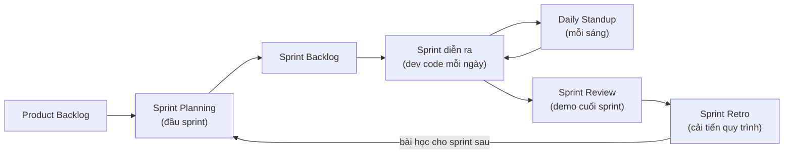

# Agile thực chiến & cạm bẫy — Tránh 'fake agile'

> **Tác giả:** Mr.Rom\
> **Phiên bản:** v1.0.0\
> **Tạo lúc:** 13/06/2026\
> **Cập nhật:** 13/06/2026\
> **Level:** Basic\
> **Tags:** agile, scrum, fake-agile, anti-patterns, ceremonies, metrics, remote-team, kaizen, soft-skills\
> **Yêu cầu trước:** [User Stories & Ước lượng](03_user-stories-and-estimation.md)

> 🎯 *Ba bài trước bạn đã học **lý thuyết** Agile: tư duy & 4 giá trị, khung Scrum (roles/events/artifacts), Kanban & flow, rồi user story + ước lượng. Nhưng có một khoảng cách lớn giữa "biết Scrum trên giấy" và "sống trong một team Agile thật". Rất nhiều công ty treo biển "chúng tôi làm Agile" nhưng bên trong là **'fake agile'** — standup biến thành buổi báo cáo cho sếp, retro tổ chức cho có mà chẳng đổi gì, velocity bị đem ra ép và đánh giá cá nhân, và một sprint thực chất là một mini-waterfall thu nhỏ. Bài này dạy bạn — với tư cách **developer** — cách sống đúng trong từng ceremony (standup nói gì, tham gia planning/retro/review ra sao), cách làm việc với PO và Scrum Master, nhận diện và né các anti-pattern phổ biến, phân biệt metrics lành mạnh với vanity metrics, áp dụng Agile cho team remote/đa múi giờ, và biến cải tiến liên tục (kaizen) thành thói quen. Kết bài bạn có một checklist standup và một checklist retro dùng được ngay.*

## 🎯 Sau bài này bạn sẽ

- [ ] Biết với vai trò **developer**, mỗi ceremony bạn nên **nói gì / làm gì** (standup, planning, review, retro)
- [ ] Làm việc trơn tru với **PO** (Product Owner) và **Scrum Master** — hiểu ranh giới trách nhiệm của từng người
- [ ] Nhận diện **8 anti-pattern 'fake agile'** phổ biến và biết cách né từng cái
- [ ] Phân biệt **metrics lành mạnh** (cải thiện flow) với **vanity metrics** (đẹp báo cáo nhưng vô dụng) — và vì sao tuyệt đối không dùng velocity để đánh giá cá nhân
- [ ] Áp dụng Agile cho team **remote / đa múi giờ**: async-first, overlap window, ceremony điều chỉnh
- [ ] Biến **cải tiến liên tục (kaizen)** thành thói quen — mỗi sprint tốt hơn sprint trước một chút

---

## Tình huống — "Chúng tôi làm Scrum" nhưng sao thấy sai sai?

Bạn vào một team mới. Job description ghi rõ *"môi trường Agile/Scrum"*. Tuần đầu tiên, bạn quan sát:

- Standup 9h sáng. Nhưng không ai nói với nhau — mỗi người lần lượt **nhìn vào sếp** và báo cáo *"hôm qua em làm X, hôm nay em làm Y"*. Sếp gật gù, thỉnh thoảng hỏi *"sao chậm thế?"*. Standup kéo dài 25 phút, ai cũng đứng chờ tới lượt mình rồi tắt não.
- Giữa sprint, sếp nhảy vào Slack: *"Khách hàng cần thêm tính năng này, nhét vào sprint luôn nhé, gấp lắm"*. Sprint backlog phình lên, nhưng deadline không đổi.
- Cuối sprint có retro. Mọi người ngồi than thở 30 phút về cùng những vấn đề **đã than ở retro trước**. Không ai ghi action, và lần sau vẫn y nguyên.
- Cuối quý, bạn nghe sếp nói với một bạn dev khác: *"Velocity của em tháng này thấp hơn người khác, cần cải thiện đấy"*.

Trên giấy, team này có đủ: standup, sprint, retro, velocity. Nhưng trong ruột, **không có gì là Agile cả**. Đây không phải Scrum — đây là **'fake agile'** (Agile giả): mặc đúng đồng phục Scrum nhưng tư duy bên dưới vẫn là *command-and-control* (ra lệnh và kiểm soát) kiểu cũ.

🪞 **Ẩn dụ**: 'fake agile' giống như **một nhà hàng treo biển "ẩm thực Ý" nhưng bên trong nấu mì gói rồi rưới sốt cà chua đóng hộp**. Đủ "hình thức" (biển hiệu, menu tiếng Ý, nến trên bàn), nhưng thiếu cái cốt lõi: nguyên liệu tươi, người đầu bếp hiểu món ăn. Scrum cũng vậy — bạn có thể copy đủ mọi ceremony, nhưng nếu thiếu cái cốt lõi (team tự tổ chức, an toàn để nói thật, cải tiến liên tục) thì đó chỉ là vỏ.

Sự khác biệt giữa Agile thật và Agile giả **không nằm ở việc bạn có làm đủ ceremony hay không** — mà nằm ở **tinh thần bên dưới mỗi ceremony**. Bài này đi qua từng ceremony dưới góc nhìn developer, chỉ ra đâu là bản thật đâu là bản giả, rồi tổng hợp các anti-pattern và cách sống sót (thậm chí cải thiện) trong một team chưa-Agile-lắm.

---

## 1️⃣ Developer trong từng ceremony — nói gì, làm gì

Ba bài trước đã mô tả các Scrum event *từ góc nhìn khung quy trình*. Bài này nhìn lại chúng từ **ghế của bạn — một developer**: trong mỗi buổi, bạn thật sự nên mở miệng nói gì, đóng góp gì, và tránh điều gì.

🪞 **Ẩn dụ**: bốn ceremony của Scrum giống **nhịp thở của một vận động viên chạy bộ**. **Planning** là hít một hơi đầy trước khi xuất phát (nạp việc cho sprint). **Standup** là những nhịp thở đều mỗi ngày để giữ phong độ. **Review** là về đích chặng này và cho khán giả xem thành quả. **Retro** là ngồi lại xoa chân, xem chỗ nào đau để chặng sau chạy tốt hơn. Bỏ một nhịp nào, cơ thể cũng lệch.

Trước khi đi vào chi tiết từng buổi, sơ đồ dưới đặt 4 ceremony vào một vòng sprint khép kín — đây là khái niệm trừu tượng nhất của bài, nên ta hình dung bằng hình trước rồi mới mổ xẻ từng phần:



→ Điểm cốt lõi của sơ đồ: vòng lặp **không kết thúc ở Review** mà khép lại ở **Retro**, và mũi tên từ Retro quay ngược về Planning — nghĩa là mỗi sprint phải **học được gì đó** đưa vào sprint sau. Team nào bỏ Retro hoặc làm Retro hình thức là tự cắt đứt vòng học này — đó là dấu hiệu 'fake agile' rõ nhất.

### Sprint Planning — bạn cam kết, không phải bạn nhận lệnh

**Sprint Planning** (họp lập kế hoạch sprint) là buổi đầu sprint để team chọn xem **sprint này làm những story nào**. Điểm mấu chốt mà developer hay quên: đây là buổi bạn **cùng quyết**, không phải buổi ngồi nghe sếp/PO giao việc.

Với vai trò developer, trong planning bạn nên:

- **Hỏi cho rõ acceptance criteria** — nếu một story mơ hồ, hỏi PO ngay tại đây, đừng đợi tới lúc code mới phát hiện hiểu sai (xem lại bài [User Stories & Ước lượng](03_user-stories-and-estimation.md) về cách viết AC tốt).
- **Tham gia ước lượng thật lòng** — story point là *đồng thuận của team*, không phải con số PO áp xuống. Nếu bạn thấy một story bị ước lượng quá nhẹ, lên tiếng.
- **Bảo vệ năng lực thực tế của team** — nếu velocity trung bình là ~20 điểm mà PO muốn nhét 35 điểm, bạn có quyền (và trách nhiệm) nói *"chừng này là quá khả năng của sprint, ta cắt bớt scope đi"*.

> [!IMPORTANT]
> Dấu hiệu planning lành mạnh: **team quyết lượng việc, không phải sếp ép xuống**. Nếu mọi sprint đều là "sếp bảo phải xong từng này", thì commitment (cam kết) chỉ là hình thức — và khi không kịp, người chịu trận là developer chứ không phải người ép. Một câu đáng thuộc: *"Chúng ta commit dựa trên năng lực, không phải dựa trên mong muốn."*

### Daily Standup — đồng bộ với team, KHÔNG báo cáo cho sếp

Đây là ceremony bị bóp méo nhiều nhất. **Standup** đúng nghĩa là 15 phút để **cả team đồng bộ với nhau** — ai đang làm gì, ai kẹt cần giúp. Nó **không phải** buổi báo cáo tiến độ cho quản lý.

Phần phát biểu của bạn gói trong ba câu (giống cấu trúc trong bài [Họp & giao tiếp trực tiếp](../../../communication/lessons/01_basic/02_meetings-and-verbal-communication.md)), nhưng điểm khác biệt Agile là bạn nói **hướng về đồng đội**, không hướng về sếp:

```text
✅ Standup đúng (nói với team, tập trung vào "mục tiêu sprint"):
"Hôm qua: mình xong API endpoint cho story thanh toán.
 Hôm nay: mình ghép phần UI vào, cần bạn B review giúp cái API trước trưa.
 Blocker: đang chờ key sandbox của cổng thanh toán — ai có thì cho mình xin."

❌ Standup giả (báo cáo cho sếp, phòng thủ):
"Dạ hôm qua em làm cũng nhiều việc lắm ạ, em cố gắng hết sức rồi...
 hôm nay em sẽ tiếp tục cố gắng ạ..."
```

→ Bản đúng có **một lời nhờ cụ thể** ("bạn B review giúp") và **một blocker rõ** ("xin key sandbox") — đó là dấu hiệu standup đang phục vụ team. Bản giả toàn ngôn ngữ phòng thủ ("cố gắng hết sức", "dạ vâng") vì người nói đang sợ bị đánh giá — dấu hiệu standup đã biến thành phiên xử.

> [!WARNING]
> Mẹo nhận diện nhanh standup bị 'fake': để ý **ánh mắt người đang nói**. Nếu ai cũng nhìn vào một người (sếp/manager) khi phát biểu, standup đã thành báo cáo. Standup thật, người ta nhìn nhau và nhìn lên **sprint board**. Nếu sếp có mặt, lý tưởng nhất là sếp **chỉ lắng nghe, không chất vấn từng người** giữa standup.

### Sprint Review — khoe sản phẩm chạy được, lấy phản hồi

**Sprint Review** (họp demo cuối sprint) là buổi team trình bày phần **đã làm xong (Done)** cho các bên liên quan (stakeholder) xem và góp ý. Mục tiêu là **lấy phản hồi sớm về sản phẩm**, không phải để bị "chấm điểm".

Với vai trò developer trong review:

- **Demo trên thứ chạy thật**, không demo trên slide. Agile coi trọng "phần mềm chạy được" hơn tài liệu — review là nơi tinh thần đó hiện rõ nhất.
- **Chỉ demo cái thật sự Done** — đúng Definition of Done (đã test, đã review, đã merge). Demo một thứ "gần xong" rồi nói "còn chút nữa" là gieo kỳ vọng sai.
- **Lắng nghe phản hồi như nguyên liệu, không phải lời chê** — phản hồi của stakeholder ở review chính là đầu vào để PO chỉnh backlog. Đây là vòng học của sản phẩm.

### Sprint Retrospective — cải tiến quy trình, nơi linh hồn Agile sống

**Sprint Retrospective** (họp nhìn lại sprint, gọi tắt **retro**) là buổi team nhìn lại **cách mình làm việc** (không phải sản phẩm) để tìm điều cần cải thiện. Nếu Review soi vào *sản phẩm*, thì Retro soi vào *quy trình + con người*.

Retro là ceremony **dễ làm cho có nhất** và cũng là **quan trọng nhất** — vì nó chính là cơ chế "cải tiến liên tục" của Agile. Một format đơn giản, hiệu quả là **Start / Stop / Continue**:

- **Start** — điều ta *nên bắt đầu* làm (vd: "viết AC rõ hơn trước khi vào sprint").
- **Stop** — điều ta *nên ngừng* làm (vd: "ngừng nhét story giữa sprint").
- **Continue** — điều đang tốt, *nên giữ* (vd: "tiếp tục pair-review những story khó").

Với vai trò developer trong retro, điều quan trọng nhất: **nói thật một cách xây dựng**. Retro chỉ có giá trị khi mọi người dám nêu vấn đề thật. Và quy tắc vàng — **mỗi retro phải đẻ ra ít nhất 1 action item có người chịu trách nhiệm**, nếu không nó chỉ là buổi than thở.

```text
✅ Retro đẻ ra action (cụ thể, có chủ):
Stop: ngừng nhận story mới giữa sprint.
  → Action: Scrum Master + PO thống nhất quy tắc "scope đã chốt thì khoá",
            áp dụng từ sprint sau. (Chủ: Scrum Master)

❌ Retro than thở (không action, sprint sau y nguyên):
"Sprint này nhiều việc quá, mệt ghê." → (im lặng) → buổi sau lại nói y vậy.
```

→ Bản đầu biến một lời phàn nàn thành **một thay đổi cụ thể có người làm**; đó là retro thật. Bản sau dừng ở cảm xúc — và cảm xúc không được hành động hoá thì sprint sau sẽ lặp lại y nguyên.

---

## 2️⃣ Làm việc với PO và Scrum Master — ai lo việc gì

Developer không làm việc trong chân không. Hai vai trò bạn tương tác nhiều nhất là **PO (Product Owner)** và **Scrum Master**. Hiểu sai ranh giới của họ là nguồn gốc của rất nhiều xung đột và 'fake agile'.

🪞 **Ẩn dụ**: hãy hình dung team như **một con thuyền vượt sông**. **PO** là người chỉ tay về bờ bên kia — *quyết đích đến và thứ tự ưu tiên đi qua đâu trước* (làm gì, cho ai, vì sao). **Developer** là người **chèo** — *quyết cách chèo* (kỹ thuật, thiết kế, ước lượng). **Scrum Master** không cầm lái cũng không chèo — họ là người **dọn chướng ngại trên mặt sông và giữ cho cả thuyền chèo đúng nhịp** (gỡ blocker, bảo vệ quy trình, huấn luyện). Lẫn lộn ba vai trò này, thuyền sẽ quay vòng.

Bảng dưới phân định rạch ròi ai chịu trách nhiệm gì — đọc kỹ vì ranh giới này là chìa khoá tránh xung đột:

| Việc | PO (Product Owner) | Developer | Scrum Master |
|---|---|---|---|
| Quyết **làm gì** + thứ tự ưu tiên backlog | ✅ Chủ | góp ý | — |
| Quyết **làm như thế nào** (kỹ thuật, thiết kế) | — | ✅ Chủ | — |
| **Ước lượng** story point | — (không áp đặt) | ✅ Chủ | điều phối |
| Viết / làm rõ **acceptance criteria** | ✅ Chủ | hỏi cho rõ | — |
| **Gỡ blocker** ngoài tầm team | — | nêu blocker | ✅ Chủ |
| **Bảo vệ team** khỏi can thiệp giữa sprint | hỗ trợ | — | ✅ Chủ |
| **Huấn luyện** team về Agile, điều phối ceremony | — | tham gia | ✅ Chủ |

> [!NOTE]
> Một hiểu lầm kinh điển: nghĩ **PO = sếp** và **Scrum Master = sếp**. Cả hai đều **không phải sếp** của developer theo nghĩa quản lý nhân sự. PO sở hữu *cái gì cần làm*, Scrum Master phục vụ *quy trình chạy trơn*. Quyền quyết **cách làm** và **ước lượng** thuộc về developer. Khi PO bắt đầu chỉ đạo "phải code thế này", hoặc Scrum Master bắt đầu giao việc và đánh giá người, đó là ranh giới đã bị phá — một dạng 'fake agile'.

### Khi PO "ép" ước lượng

Tình huống rất thật: bạn ước lượng một story 8 điểm, PO nói *"sao nhiều thế, làm 3 điểm thôi được không, khách giục rồi"*. Đây không phải chuyện thương lượng con số — ước lượng là **đánh giá kỹ thuật của team**, không phải mong muốn của PO. Cách xử lý lành mạnh:

```text
PO:  "Story này 8 điểm nhiều quá, để 3 điểm nhé, khách đang giục."
Dev: "Em hiểu khách giục. Nhưng 8 điểm là độ khó thật của việc — đổi
      con số không làm việc nhẹ đi. Nếu cần giao nhanh hơn, mình có
      thể CẮT SCOPE: làm phần lõi trước (3 điểm), phần phụ để sprint
      sau. Anh thấy phần nào lõi nhất?"
```

→ Mấu chốt: developer **không cãi về con số**, mà chuyển cuộc nói chuyện sang thứ PO thật sự kiểm soát — **scope** (phạm vi). PO có toàn quyền cắt scope; PO **không có quyền** sửa độ khó kỹ thuật của một việc. Đây cũng là kỹ năng giao tiếp top-down + thương lượng mà bạn dùng hằng ngày.

---

## 3️⃣ 'Fake agile' — 8 anti-pattern và cách né

Giờ ta gom các dấu hiệu Agile-giả thành một danh sách bạn có thể dùng để "chẩn bệnh" team mình. Mỗi anti-pattern đều có chung một gốc: **giữ vỏ Scrum, bỏ ruột Agile**.

🪞 **Ẩn dụ**: các anti-pattern này giống **bệnh nghề nghiệp** — chúng len lỏi vào dần, không gây đau ngay, nhưng tích tụ tới lúc team rệu rã thì khó chữa. Nhận biết sớm "triệu chứng" giúp bạn chữa khi còn nhẹ.

Bảng dưới liệt kê 8 anti-pattern phổ biến nhất, kèm triệu chứng dễ nhận và cách né. Đọc và đối chiếu với team của bạn:

| # | Anti-pattern | Triệu chứng dễ nhận | Cách né |
|---|---|---|---|
| 1 | **Standup = báo cáo cho sếp** | Ai cũng nhìn sếp khi nói, ngôn ngữ phòng thủ, kéo dài | Nói hướng về team + sprint board; sếp chỉ lắng nghe |
| 2 | **Retro vô nghĩa** | Than thở rồi thôi, không action, lặp lại vấn đề cũ | Mỗi retro ≥1 action có chủ + hạn; điểm lại action cũ đầu retro |
| 3 | **Scope creep giữa sprint** | Story mới bị nhét vào sprint đang chạy, deadline không đổi | Khoá sprint backlog; việc gấp → bỏ vào sprint sau hoặc đổi ngang (swap) |
| 4 | **Velocity để ép / đánh giá cá nhân** | "Velocity của em thấp hơn người khác" | Velocity là chỉ số *team* để lập kế hoạch, KHÔNG đánh giá người |
| 5 | **Mini-waterfall trong sprint** | Tuần 1 chỉ phân tích, tuần 2 mới code, ngày cuối mới test | Mỗi story đi trọn vòng (code→test→review) liên tục, không xếp lớp |
| 6 | **Scrum Master kiêm sếp** | Người điều phối cũng là người giao việc + chấm điểm | Tách vai; Scrum Master phục vụ quy trình, không quản nhân sự |
| 7 | **PO vắng mặt / ôm việc** | Hỏi AC không ai trả lời; PO tự quyết hết, không lắng nghe team | PO có mặt khi cần làm rõ; quyết "cái gì" nhưng nghe team về "cách" |
| 8 | **Estimation thành cam kết cứng** | Ước lượng bị coi như lời hứa, lệch là bị phạt | Coi point là dự báo, không phải hợp đồng; sai số là bình thường |

Dưới đây ta đào sâu ba cái nguy hiểm nhất — vì chúng phá hỏng team nhanh nhất.

### Anti-pattern 5: Mini-waterfall trong sprint

Đây là cái khó nhận nhất vì nhìn bề ngoài vẫn là "Scrum". **Mini-waterfall** là khi team chia sprint thành các *giai đoạn tuần tự* y như mô hình waterfall cũ — chỉ là thu nhỏ vào 2 tuần:

```text
❌ Mini-waterfall (waterfall thu nhỏ trong 1 sprint):
Tuần 1: chỉ phân tích + thiết kế.
Tuần 2 đầu: mới bắt đầu code.
2 ngày cuối: dồn vào test tất cả → bug nổ ra → không kịp → carry sang sprint sau.

✅ Agile thật (mỗi story đi trọn vòng, xong dần):
Ngày 1-2: story A đi trọn code→test→review→Done.
Ngày 3-4: story B đi trọn vòng.
... mỗi vài ngày có thêm 1 story THẬT SỰ Done, rủi ro lộ sớm.
```

→ Khác biệt cốt lõi: Agile muốn **giá trị xong dần và đều** (story này Done rồi mới sang story kia), không phải **mọi thứ xong cùng lúc ở phút chót**. Mini-waterfall dồn rủi ro vào cuối sprint — đúng thứ Agile sinh ra để tránh.

### Anti-pattern 4: Dùng velocity để ép và đánh giá cá nhân

Đây là anti-pattern **độc hại nhất** vì nó phá thẳng vào lòng tin. Khi velocity (xem bài [User Stories & Ước lượng](03_user-stories-and-estimation.md)) bị đem ra so sánh giữa người với người hoặc bị đặt làm KPI, điều **chắc chắn** xảy ra là **point inflation** (lạm phát điểm): ai cũng ước lượng phồng lên để "velocity đẹp", và con số mất sạch ý nghĩa lập kế hoạch.

```text
❌ Lạm dụng velocity:
Sếp: "Sprint trước team làm 20 điểm, sprint này phải 25 điểm —
      tăng trưởng mà!"
→ Hệ quả: team âm thầm thổi mỗi story từ 3 lên 5 điểm.
   Velocity "tăng" lên 25 nhưng lượng việc thật KHÔNG đổi.
   Con số thành vô nghĩa, kế hoạch sai theo.
```

> [!WARNING]
> Quy tắc sắt: **velocity là công cụ DỰ BÁO của team, KHÔNG phải thước đo năng suất cá nhân.** So sánh velocity giữa hai team cũng vô nghĩa (mỗi team định nghĩa "1 điểm" khác nhau). Dùng velocity để ép tăng hoặc chấm điểm người = giết chết tính trung thực của ước lượng, và đó là dấu hiệu 'fake agile' nặng.

### Anti-pattern 6: Scrum Master kiêm sếp

Khi người điều phối quy trình (Scrum Master) **đồng thời** là người giao việc và đánh giá hiệu suất, team mất đi **an toàn tâm lý** (psychological safety) — không ai dám nói thật ở retro vì "nói ra sếp ghi nhớ". Cả cơ chế cải tiến liên tục sụp đổ. Cách né: tách vai rõ ràng; nếu công ty nhỏ buộc một người kiêm, ít nhất người đó phải **tự ý thức gỡ mũ "sếp"** khi vào retro và tạo không gian an toàn để mọi người nói thẳng.

---

## 4️⃣ Metrics đúng — lành mạnh vs vanity

Agile đo lường để **cải thiện flow**, không phải để **trang trí báo cáo**. Phân biệt được hai loại metrics này giúp bạn không bị cuốn vào trò chơi con số vô nghĩa.

🪞 **Ẩn dụ**: metrics lành mạnh giống **đồng hồ đo nhiên liệu và tốc độ trên xe** — bạn nhìn để *lái tốt hơn* (còn xăng không, đang nhanh hay chậm). **Vanity metrics** giống **dán thêm cánh gió và đề-can lửa lên xe** — nhìn ngầu trong ảnh nhưng chẳng giúp xe chạy tốt hơn chút nào. Câu hỏi sàng lọc: *"Số này có giúp ta ra quyết định để cải thiện không, hay chỉ để khoe?"*

Bảng dưới đối chiếu hai loại — cột trái là số đáng dùng, cột phải là số nghe kêu nhưng dễ đánh lừa:

| ✅ Metrics lành mạnh (giúp cải thiện) | ⚠️ Vanity metrics (đẹp báo cáo, dễ lừa) |
|---|---|
| **Cycle time** — story mất bao lâu từ "bắt đầu" tới "Done" | "Số story đóng tuần này" tách rời chất lượng |
| **Lead time** — từ lúc khách yêu cầu tới lúc nhận được | "Velocity tăng đều" (dễ bị point inflation) |
| **Throughput** — số việc thật sự Done mỗi sprint | "Số dòng code viết" (LOC) — code nhiều ≠ giá trị nhiều |
| **WIP (Work In Progress)** — số việc đang dở cùng lúc | "Số giờ làm thêm" — overtime nhiều = quy trình hỏng, không phải thành tích |
| **Escaped defects** — bug lọt ra production | "% commit của từng người" — khuyến khích cạnh tranh sai chỗ |

> [!TIP]
> Phép thử một câu để phân loại bất kỳ metric nào: **"Nếu số này đẹp lên, sản phẩm và team có thật sự tốt hơn không?"**. Cycle time giảm → giao giá trị nhanh hơn → thật sự tốt hơn (lành mạnh). "Số dòng code" tăng → có thể chỉ là code dài dòng hơn (vanity). Metric tốt là metric mà **không thể "gian lận" mà không thật sự cải thiện**.

### Cảnh báo: định luật Goodhart

Có một quy luật bạn cần khắc cốt: **"Khi một thước đo trở thành mục tiêu, nó thôi là một thước đo tốt"** (Goodhart's Law). Nghĩa là ngay khi bạn lấy *bất kỳ* metric nào ra làm KPI để thưởng/phạt, người ta sẽ tối ưu *con số* thay vì tối ưu *thứ con số đại diện*. Đặt velocity làm KPI → point inflation. Đặt "số bug fix" làm KPI → người ta tạo bug để fix. Vì thế Agile dùng metrics để **team tự soi mình**, hiếm khi để cấp trên chấm điểm cá nhân.

---

## 5️⃣ Agile cho team remote / đa múi giờ

Scrum gốc giả định cả team ngồi cùng phòng, standup mặt-đối-mặt. Nhưng ngày nay rất nhiều team **remote** (làm từ xa) và **đa múi giờ** (members ở các timezone khác nhau). Áp dụng Scrum kiểu sách giáo khoa vào team này sẽ gãy — cần điều chỉnh.

🪞 **Ẩn dụ**: team remote đa múi giờ giống **một dàn nhạc mà các nhạc công ở các thành phố khác nhau**. Không thể bắt tất cả cùng chơi live một lúc (không cùng giờ thức). Cách làm: mỗi người **thu phần của mình rồi gửi** (async-first), và chỉ tụ họp live vào **một khung giờ chung ai cũng thức** (overlap window) cho những gì bắt buộc real-time. Bản nhạc vẫn hoàn chỉnh, chỉ là cách phối khác.

### Nguyên tắc async-first

Với team đa múi giờ, mặc định nên là **async-first**: ưu tiên giao tiếp không cần online cùng lúc, chỉ dùng họp real-time cho thứ thật sự cần. Cụ thể cho từng ceremony:

| Ceremony | Cách làm cho remote / đa múi giờ |
|---|---|
| **Daily Standup** | Chuyển sang **written standup** — mỗi người post 3 câu vào kênh chung trong ngày của họ; ai cũng đọc được dù khác giờ |
| **Sprint Planning** | Đặt trong **overlap window** (giờ ai cũng thức); chuẩn bị backlog kỹ TRƯỚC để buổi live ngắn |
| **Sprint Review** | **Quay video demo** + cho stakeholder xem async, gom feedback bằng comment; hoặc live trong overlap window |
| **Retro** | Thu thập ý kiến async trước (board online: Start/Stop/Continue), buổi live chỉ để thảo luận + chốt action |

> [!NOTE]
> **Overlap window** (khung giờ chồng lấn) là vài tiếng trong ngày mà mọi múi giờ trong team đều đang trong giờ làm. Đây là "vàng" — dành nó cho thứ *bắt buộc* real-time (quyết định cần qua lại nhiều vòng, gỡ bế tắc). Mọi thứ khác đẩy về async. Team đa múi giờ thành công không phải team họp nhiều hơn, mà team **viết rõ hơn** và **họp đúng chỗ hơn**.

### Written standup mẫu

Thay vì đứng họp, mỗi người post một block ngắn vào kênh team. Mẫu này đọc lướt trong vài giây và lưu lại để người ở múi giờ khác đọc sau:

```text
📅 Standup — Bạn A — 13/06
✅ Hôm qua: xong API endpoint thanh toán (story #142).
🎯 Hôm nay: ghép UI + viết unit test cho #142.
🚧 Blocker: cần review PR #88; @bạn-B xem giúp khi bạn online nhé.
```

→ Định dạng cố định (emoji + 3 dòng) khiến cả team scan rất nhanh và **không bỏ sót blocker** — một lời nhờ gắn @tên sẽ chờ sẵn người kia khi họ bắt đầu ngày làm việc. Đây là cách giữ tinh thần standup (đồng bộ + nêu blocker) mà không cần cùng online.

---

## 6️⃣ Cải tiến liên tục (kaizen) — linh hồn của Agile

Nếu phải tóm Agile vào **một** ý duy nhất, đó là: **cải tiến liên tục**. Mọi ceremony, mọi metric, mọi anti-pattern ở trên đều quy về một câu hỏi: *"Sprint sau ta có làm tốt hơn sprint này một chút không?"*.

🪞 **Ẩn dụ**: **kaizen** (改善 — tiếng Nhật nghĩa "thay đổi để tốt hơn") giống việc **mài một con dao mỗi ngày một chút**. Bạn không mài lại toàn bộ một lần cho sắc lịm rồi thôi — bạn vuốt nhẹ vài đường mỗi lần dùng. Từng lần gần như không thấy khác biệt, nhưng sau nhiều tháng, con dao luôn sắc trong khi con dao "để đó không mài" đã cùn. Team Agile cải tiến cũng vậy: **mỗi sprint một cải tiến nhỏ**, không phải "đại tu quy trình" một lần rồi quên.

### Vòng lặp kaizen trong thực tế

Cải tiến liên tục không phải khẩu hiệu — nó là một vòng lặp cụ thể, gắn chặt vào retro:

1. **Quan sát** — sprint vừa rồi chỗ nào đau? (rút ra ở retro)
2. **Chọn MỘT cải tiến nhỏ** — đừng ôm 10 thứ; chọn 1-2 thứ đáng nhất, khả thi.
3. **Thử ở sprint sau** — biến nó thành action có người chịu trách nhiệm.
4. **Đo + nhìn lại** — retro sau kiểm tra: cải tiến đó có hiệu quả không? Giữ hay bỏ.

> [!IMPORTANT]
> Cái bẫy phổ biến: retro đẻ ra **quá nhiều** action ("lần này phải sửa 8 thứ!") → không ai làm nổi → sprint sau y nguyên → mọi người mất niềm tin vào retro. Kaizen mạnh ở chỗ **nhỏ và đều**: một cải tiến *thật sự được làm* mỗi sprint giá trị hơn mười cải tiến trên giấy. Một con dao được vuốt nhẹ mỗi ngày sắc hơn con dao "hẹn cuối tháng mài thật kỹ".

→ Kaizen chính là thứ phân biệt rõ nhất Agile thật với 'fake agile': team giả *làm đủ ceremony nhưng không bao giờ đổi gì*; team thật *mỗi sprint khác sprint trước một chút theo hướng tốt lên*. Nếu sáu tháng nữa team bạn vẫn làm việc y hệt hôm nay, dù có đủ standup/retro, đó vẫn là 'fake agile'.

---

## 💡 Cạm bẫy thường gặp & Best practice

### ❌ Cạm bẫy: làm đủ ceremony nhưng giữ tư duy command-and-control

- **Triệu chứng**: có standup/sprint/retro/velocity đầy đủ, nhưng sếp vẫn ép việc xuống, standup là báo cáo, không ai dám nói thật ở retro, quy trình không bao giờ đổi.
- **Nguyên nhân**: copy *hình thức* Scrum mà không đổi *tư duy* bên dưới — vẫn là ra lệnh và kiểm soát kiểu cũ, chỉ khoác áo Agile.
- **Cách tránh**: nhớ Agile là *tư duy*, ceremony chỉ là công cụ. Soi vào tinh thần mỗi buổi: team có tự quyết lượng việc không? Có an toàn để nói thật không? Quy trình có cải tiến không? Thiếu ba thứ đó thì dù đủ ceremony vẫn là 'fake agile'.

### ❌ Cạm bẫy: nhét việc giữa sprint (scope creep)

- **Triệu chứng**: sprint đang chạy thì story mới liên tục bị nhét vào "vì gấp", nhưng deadline và năng lực không đổi; cuối sprint luôn vỡ kế hoạch.
- **Nguyên nhân**: không tôn trọng ranh giới sprint; coi sprint backlog là danh sách mở thay vì cam kết đã khoá.
- **Cách tránh**: **khoá sprint backlog** sau planning. Việc thật sự khẩn → hoặc đổi ngang (swap: bỏ ra một story tương đương để nhét cái mới), hoặc xếp vào đầu sprint sau. Scrum Master + PO bảo vệ ranh giới này. Nếu việc gấp xảy ra *liên tục*, đó là tín hiệu sprint quá dài hoặc backlog ưu tiên kém — đưa ra retro.

### ❌ Cạm bẫy: retro mà không có action

- **Triệu chứng**: retro thành buổi than thở; cùng vấn đề lặp lại sprint này qua sprint khác; mọi người bắt đầu coi retro là phí thời gian.
- **Nguyên nhân**: dừng ở cảm xúc/than phiền, không biến thành thay đổi cụ thể có người chịu trách nhiệm.
- **Cách tránh**: mỗi retro phải đẻ ra **ít nhất 1 action** với *việc gì / ai làm / khi nào*. Đầu mỗi retro, **điểm lại action của retro trước** — xong chưa, hiệu quả không. Đây là vòng khép kín của kaizen.

### ✅ Best practice: developer chủ động trong ceremony, không thụ động chờ giao việc

- **Vì sao**: Agile dựa trên team **tự tổ chức**. Developer im lặng chờ nhận lệnh là chính bạn đang góp phần tạo ra 'fake agile'. Bạn có quyền và trách nhiệm: bảo vệ ước lượng, hỏi rõ AC, nêu blocker, đề xuất cải tiến ở retro.
- **Cách áp dụng**: trong planning, lên tiếng khi scope quá tải hoặc story mơ hồ. Trong standup, nói hướng về team + nêu lời nhờ cụ thể. Trong retro, nêu một vấn đề thật kèm đề xuất action. Mỗi lần lên tiếng xây dựng là một viên gạch cho Agile thật.

### ✅ Best practice: dùng metrics để team tự soi, không để chấm điểm người

- **Vì sao**: ngay khi một metric thành KPI cá nhân, định luật Goodhart kích hoạt — người ta tối ưu con số thay vì thứ con số đại diện, và metric mất giá trị. Velocity bị ép → point inflation. "Số bug fix" thành KPI → người ta tạo bug để fix.
- **Cách áp dụng**: chọn metrics flow lành mạnh (cycle time, throughput, WIP, escaped defects) và dùng chúng trong retro để *team cùng nhìn và cải thiện*. Tuyệt đối không so velocity giữa người với người hay giữa team với team. Hỏi mỗi metric: "đẹp lên thì sản phẩm/team có thật sự tốt hơn không?".

---

## 🧠 Tự kiểm tra (Self-check)

**Q1.** Team bạn có đủ standup, sprint, retro, và đo velocity. Nhưng sếp ép việc xuống mỗi planning, standup là báo cáo cho sếp, retro không ai dám nói thật, và quy trình sáu tháng không đổi. Team này có đang làm Agile không? Vì sao?

<details>
<summary>💡 Xem giải thích</summary>

**Không** — đây là 'fake agile' điển hình. Có đủ *hình thức* (ceremony, metric) nhưng thiếu hết *cốt lõi*: team không tự quyết lượng việc (sếp ép), không an toàn để nói thật (retro im lặng), và không cải tiến liên tục (quy trình không đổi). Agile là **tư duy**, ceremony chỉ là công cụ. Một team mặc đủ "đồng phục Scrum" mà bên dưới vẫn là command-and-control thì vẫn không phải Agile. Phép thử ba câu: team có tự quyết lượng việc không? Có an toàn nói thật không? Quy trình có tốt lên không? Cả ba đều "không" → 'fake agile'.

</details>

**Q2.** PO nói: *"Story này em ước lượng 8 điểm nhiều quá, để 3 điểm thôi, khách giục rồi."* Bạn nên phản hồi thế nào?

<details>
<summary>💡 Xem giải thích</summary>

Không cãi về con số, và cũng không hạ điểm cho vừa lòng PO — vì **ước lượng là đánh giá kỹ thuật của team, không phải mong muốn của PO**, và đổi con số không làm việc nhẹ đi thật. Cách đúng là chuyển cuộc nói chuyện sang thứ PO *thật sự kiểm soát* — **scope**: *"8 điểm là độ khó thật của việc. Nếu cần giao nhanh hơn, ta cắt scope — làm phần lõi trước (3 điểm), phần phụ để sprint sau. Anh thấy phần nào lõi nhất?"*. PO có quyền cắt scope; PO không có quyền sửa độ khó kỹ thuật. Để PO ép hạ điểm là mở đường cho point inflation và kế hoạch sai.

</details>

**Q3.** Sếp nói: *"Velocity của em sprint này thấp hơn bạn khác, cần cải thiện."* Câu này sai ở đâu, và hệ quả là gì?

<details>
<summary>💡 Xem giải thích</summary>

Sai vì **velocity là chỉ số của TEAM để DỰ BÁO, không phải thước đo năng suất CÁ NHÂN**. So sánh velocity giữa người với người (hoặc giữa team với team) là vô nghĩa vì "1 điểm" mỗi người/team định nghĩa khác nhau. Hệ quả chắc chắn (định luật Goodhart): khi velocity thành KPI, người ta thổi phồng ước lượng để "velocity đẹp" — **point inflation** — và con số mất sạch ý nghĩa lập kế hoạch. Velocity nên dùng để *team tự lập kế hoạch sprint sau*, không để cấp trên chấm điểm. Đây là một trong những anti-pattern độc hại nhất vì nó phá thẳng vào lòng tin và tính trung thực của ước lượng.

</details>

**Q4.** Trong một sprint 2 tuần, team dành tuần 1 chỉ phân tích/thiết kế, đầu tuần 2 mới code, hai ngày cuối dồn vào test tất cả. Đây là pattern gì, và vì sao nó trái tinh thần Agile?

<details>
<summary>💡 Xem giải thích</summary>

Đây là **mini-waterfall** — mô hình waterfall (phân tích → thiết kế → code → test tuần tự) thu nhỏ vào một sprint. Nó trái Agile vì **dồn rủi ro vào cuối sprint**: test ở phút chót, bug nổ ra không kịp xử lý, story phải carry sang sprint sau. Agile muốn **giá trị xong dần và đều** — mỗi story đi trọn vòng (code → test → review → Done) liên tục, để có thứ *thật sự Done* sau vài ngày và rủi ro lộ sớm. Cách sửa: thay vì xếp lớp giai đoạn, cho từng story chạy hết vòng đời một, xong cái này mới sang cái kia.

</details>

**Q5.** Team bạn ở 3 múi giờ khác nhau, gần như không có lúc nào tất cả cùng thức. Standup mặt-đối-mặt là bất khả. Bạn điều chỉnh các ceremony thế nào?

<details>
<summary>💡 Xem giải thích</summary>

Chuyển sang **async-first** và dùng **overlap window** (khung giờ chồng lấn ai cũng thức) cho thứ bắt buộc real-time:
- **Standup** → **written standup**: mỗi người post 3 câu (hôm qua / hôm nay / blocker) vào kênh chung trong ngày của họ; ai cũng đọc được dù khác giờ.
- **Planning** → đặt trong overlap window, chuẩn bị backlog kỹ trước để buổi live ngắn.
- **Review** → quay video demo cho stakeholder xem async + gom feedback bằng comment, hoặc live trong overlap window.
- **Retro** → thu ý kiến async trước (board Start/Stop/Continue online), buổi live chỉ thảo luận + chốt action.

Nguyên tắc: dành overlap window quý giá cho thứ *cần qua lại nhiều vòng*; mọi thứ khác đẩy về async. Team đa múi giờ thành công nhờ **viết rõ hơn**, không nhờ họp nhiều hơn.

</details>

**Q6.** Vì sao một retro mà cuối buổi không có action item nào lại gần như vô dụng?

<details>
<summary>💡 Xem giải thích</summary>

Vì retro là cơ chế **cải tiến liên tục (kaizen)** của Agile, và cải tiến chỉ xảy ra khi cảm xúc/quan sát được **biến thành thay đổi cụ thể có người làm**. Retro không action chỉ dừng ở than thở — sprint sau sẽ lặp lại y nguyên vấn đề, và dần dần mọi người coi retro là phí thời gian. Một retro hiệu quả đẻ ra **ít nhất 1 action** với *việc gì / ai làm / khi nào*, và đầu retro sau **điểm lại action cũ** để khép vòng. Lưu ý kaizen mạnh ở chỗ **nhỏ và đều** — một cải tiến *thật sự được làm* giá trị hơn mười cải tiến trên giấy.

</details>

---

## ⚡ Tra cứu nhanh (Cheatsheet)

### Developer làm gì trong từng ceremony

| Ceremony | Bạn nên làm | Tránh |
|---|---|---|
| **Planning** | Hỏi rõ AC, ước lượng thật, bảo vệ năng lực team | Im lặng nhận lệnh, để PO ép điểm |
| **Standup** | 3 câu hướng về team + nêu blocker/lời nhờ | Báo cáo cho sếp, ngôn ngữ phòng thủ |
| **Review** | Demo thứ chạy thật + đúng Done, nghe feedback | Demo slide, demo thứ "gần xong" |
| **Retro** | Nói thật xây dựng, đề xuất action cụ thể | Than thở suông, không action |

### Checklist standup (mỗi sáng)

- [ ] Mình nói **3 câu**: hôm qua / hôm nay / blocker?
- [ ] Mình nói **hướng về team** (không phải báo cáo sếp)?
- [ ] Có **blocker** thì mình nêu rõ + nhờ đúng người?
- [ ] Mình **không** lao vào debug giữa standup (để "take offline")?
- [ ] Cả buổi gói trong ~15 phút, mọi người nhìn **board** chứ không nhìn sếp?

### Checklist retro (cuối sprint)

- [ ] **Điểm lại action** của retro trước (xong chưa? hiệu quả không?)?
- [ ] Mọi người **an toàn** nói thật (sếp không "ghi sổ")?
- [ ] Dùng format rõ (vd **Start / Stop / Continue**)?
- [ ] Chốt **≥1 action** với *việc gì / ai làm / khi nào*?
- [ ] Chọn **ít, làm được** (kaizen nhỏ + đều) thay vì 10 thứ trên giấy?

### 8 anti-pattern 'fake agile' (chẩn nhanh)

| Anti-pattern | Liều thuốc |
|---|---|
| Standup = báo cáo sếp | Nói hướng team + board; sếp chỉ nghe |
| Retro vô nghĩa | ≥1 action có chủ; điểm lại action cũ |
| Scope creep giữa sprint | Khoá backlog; gấp → swap hoặc sprint sau |
| Velocity ép/chấm cá nhân | Velocity = dự báo team, không chấm người |
| Mini-waterfall trong sprint | Mỗi story đi trọn vòng, Done dần đều |
| Scrum Master kiêm sếp | Tách vai; giữ an toàn tâm lý ở retro |
| PO vắng mặt / ôm việc | PO có mặt làm rõ AC; nghe team về "cách" |
| Estimation thành cam kết cứng | Point là dự báo, không phải hợp đồng |

### Metrics: lành mạnh vs vanity

| ✅ Lành mạnh | ⚠️ Vanity |
|---|---|
| Cycle time, lead time | "Số story đóng" tách chất lượng |
| Throughput (việc Done thật) | Velocity tăng (dễ inflation) |
| WIP, escaped defects | Số dòng code (LOC), giờ làm thêm, % commit/người |

→ Phép thử: *"Số này đẹp lên thì sản phẩm/team có THẬT SỰ tốt hơn không?"* + nhớ **định luật Goodhart**: metric thành mục tiêu thì thôi là metric tốt.

### Team remote / đa múi giờ

| Ceremony | Cách làm |
|---|---|
| Standup | Written standup (post 3 câu async) |
| Planning | Overlap window + chuẩn bị backlog trước |
| Review | Video demo async hoặc live trong overlap |
| Retro | Thu ý kiến async trước → live chốt action |

---

## 📚 Từ Điển Thuật Ngữ (Glossary)

| EN | VN | Giải thích |
|---|---|---|
| Fake agile | Agile giả | Làm đủ hình thức Scrum nhưng giữ tư duy command-and-control, thiếu cốt lõi Agile |
| Anti-pattern | Mẫu phản | Cách làm tưởng đúng nhưng thực ra gây hại, lặp lại phổ biến |
| Ceremony / Event | Nghi thức / Sự kiện | Các buổi định kỳ của Scrum (planning, standup, review, retro) |
| Sprint Planning | Họp lập kế hoạch sprint | Buổi đầu sprint chọn story sẽ làm, ước lượng, cam kết |
| Daily Standup | Họp đứng hằng ngày | 15 phút đồng bộ team mỗi sáng (ai làm gì, có blocker không) |
| Sprint Review | Họp demo cuối sprint | Trình bày phần Done cho stakeholder, lấy phản hồi sản phẩm |
| Sprint Retrospective | Họp nhìn lại sprint | Soi *cách làm việc* để cải tiến quy trình; viết tắt "retro" |
| PO (Product Owner) | Chủ sản phẩm | Người quyết *làm gì* + thứ tự ưu tiên backlog; không quản nhân sự |
| Scrum Master | (giữ EN) | Người phục vụ quy trình: gỡ blocker, bảo vệ team, huấn luyện Agile |
| Acceptance criteria (AC) | Tiêu chí nghiệm thu | Điều kiện cụ thể để một story được coi là hoàn thành |
| Definition of Done (DoD) | Định nghĩa Hoàn thành | Bộ tiêu chí chung một việc phải đạt mới gọi là "Done" |
| Scope creep | Phình phạm vi | Việc bị nhét thêm vào sprint đang chạy mà không đổi deadline/năng lực |
| Swap | Đổi ngang | Bỏ ra một story để nhét story mới tương đương, giữ tổng tải không đổi |
| Mini-waterfall | Waterfall thu nhỏ | Chia sprint thành giai đoạn tuần tự (phân tích→code→test) như waterfall |
| Velocity | Vận tốc | Số story point team Done trung bình mỗi sprint — chỉ số dự báo của *team* |
| Point inflation | Lạm phát điểm | Thổi phồng ước lượng để "velocity đẹp", làm con số mất ý nghĩa |
| Vanity metric | Chỉ số phù phiếm | Số nghe kêu nhưng không giúp ra quyết định cải thiện (LOC, giờ OT...) |
| Cycle time | Thời gian chu kỳ | Thời gian một việc đi từ "bắt đầu làm" tới "Done" |
| Lead time | Thời gian chờ đợi | Thời gian từ lúc khách yêu cầu tới lúc nhận được kết quả |
| Throughput | Sản lượng | Số việc thật sự Done trong một khoảng (vd mỗi sprint) |
| WIP (Work In Progress) | Việc đang làm dở | Số việc cùng lúc đang dang dở; nhiều quá thì flow tắc |
| Escaped defect | Lỗi lọt ra | Bug không bắt được trong sprint, lọt ra tới production |
| Goodhart's Law | Định luật Goodhart | "Khi một thước đo thành mục tiêu, nó thôi là thước đo tốt" |
| Psychological safety | An toàn tâm lý | Cảm giác an toàn để nói thật, nêu vấn đề mà không sợ bị trừng phạt |
| Async-first | Ưu tiên bất đồng bộ | Mặc định giao tiếp không cần online cùng lúc, họp real-time chỉ khi cần |
| Overlap window | Khung giờ chồng lấn | Vài giờ trong ngày mọi múi giờ trong team đều đang làm việc |
| Written standup | Standup viết | Mỗi người post 3 câu standup vào kênh chung thay vì họp trực tiếp |
| Kaizen | Cải tiến liên tục | (改善, tiếng Nhật) thay đổi nhỏ + đều để mỗi lúc tốt hơn một chút |
| Command-and-control | Ra lệnh & kiểm soát | Phong cách quản lý cũ: cấp trên ra lệnh, cấp dưới thực thi — đối lập tự tổ chức |
| Self-organizing team | Team tự tổ chức | Team tự quyết cách làm và phân bổ việc, không bị giao từng bước |

---

## 🔗 Liên kết & Tài nguyên

⬅️ **Bài trước:** [User Stories & Ước lượng — Backlog, story point, velocity](03_user-stories-and-estimation.md)\
↑ **Về cụm:** [agile-scrum — README](../../README.md)

### 🧭 Định hướng lộ trình học

- [Agile là gì? — Tư duy & 4 giá trị cốt lõi](00_what-is-agile.md) — gốc tư duy Agile; mọi anti-pattern ở bài này đều là vi phạm một giá trị cốt lõi nào đó
- [Scrum Framework — Roles, Events, Artifacts](01_scrum-framework.md) — khung lý thuyết của các ceremony và vai trò mà bài này áp dụng vào thực chiến

### 🧩 Các chủ đề có thể bạn quan tâm

- [Kanban & Flow — Trực quan hoá công việc, giới hạn WIP](02_kanban-and-flow.md) — nền tảng của các metrics flow lành mạnh (cycle time, WIP, throughput)
- [User Stories & Ước lượng — Backlog, story point, velocity](03_user-stories-and-estimation.md) — hiểu velocity/point để né anti-pattern "dùng velocity ép người"
- [Họp & giao tiếp trực tiếp — Standup, trình bày, lắng nghe](../../../communication/lessons/01_basic/02_meetings-and-verbal-communication.md) — kỹ năng giao tiếp nền cho mọi ceremony, đặc biệt standup và review

### 🌐 Tài nguyên tham khảo khác

- [Manifesto for Agile Software Development](https://agilemanifesto.org/) — bản gốc 4 giá trị + 12 nguyên tắc; thước đo để phân biệt Agile thật/giả
- [The Scrum Guide](https://scrumguides.org/scrum-guide.html) — định nghĩa chính thức về roles/events/artifacts, miễn phí
- [Goodhart's Law (Wikipedia)](https://en.wikipedia.org/wiki/Goodhart%27s_law) — vì sao biến metric thành KPI lại phá hỏng chính metric đó

---

## 📌 Nhật ký thay đổi (Changelog)

- **v1.0.0 (13/06/2026)** — Bản đầu tiên, đóng cụm agile-scrum. Tình huống mở bài "'chúng tôi làm Scrum' nhưng thấy sai sai" + ẩn dụ nhà hàng Ý nấu mì gói/nhịp thở vận động viên/con thuyền vượt sông/bệnh nghề nghiệp/đồng hồ xe vs đề-can lửa/dàn nhạc đa thành phố/mài dao kaizen + sơ đồ mermaid vòng sprint 4 ceremony khép kín. Cover: developer trong từng ceremony (planning/standup/review/retro — nói gì, làm gì) + làm việc với PO & Scrum Master (bảng phân vai + xử lý PO ép ước lượng) + 8 anti-pattern 'fake agile' (đào sâu mini-waterfall, velocity ép cá nhân, Scrum Master kiêm sếp) + metrics lành mạnh vs vanity (bảng đối chiếu + định luật Goodhart) + Agile cho team remote/đa múi giờ (async-first, overlap window, written standup, 4 ceremony điều chỉnh) + cải tiến liên tục kaizen (vòng lặp 4 bước, "nhỏ và đều") + 3 cạm bẫy + 2 best practice + 6 self-check + cheatsheet (developer/ceremony + checklist standup + checklist retro + 8 anti-pattern + metrics + remote) + glossary 30 thuật ngữ.
