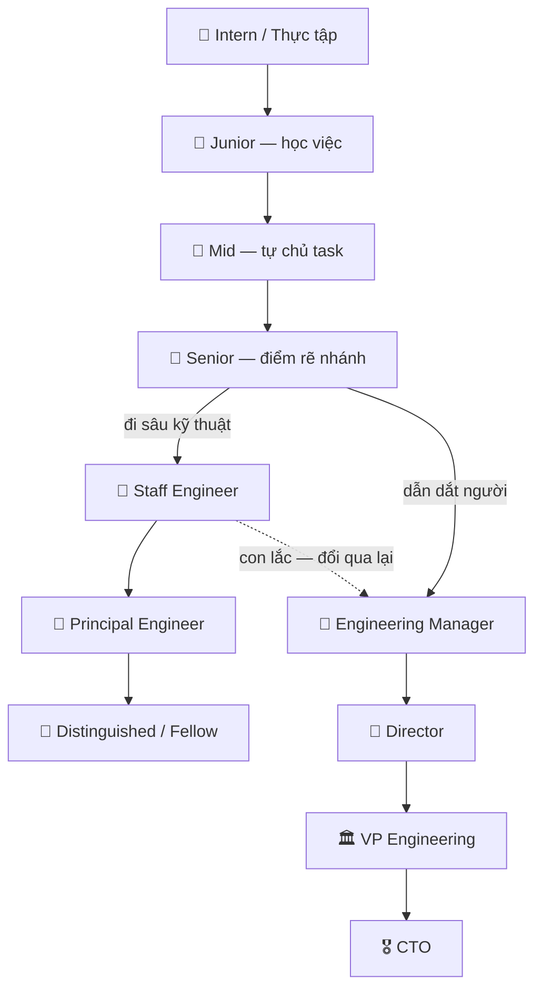

# 🎯 Sự nghiệp trong ngành tech là gì? — Bản đồ vai trò & nấc thang

> **Tác giả:** Mr.Rom\
> **Phiên bản:** v1.0.0\
> **Tạo lúc:** 13/06/2026\
> **Cập nhật:** 13/06/2026\
> **Level:** Basic\
> **Tags:** career, tech-career, ic-vs-management, career-ladder, levels, soft-skills\
> **Yêu cầu trước:** (không bắt buộc — có thể đọc đầu tiên)

> 🎯 *Bạn biết code, biết git, có thể đã đi làm — nhưng "sự nghiệp tech" của bạn sẽ trông như thế nào trong 5-10 năm tới? Bài này dẫn bạn đi 1 vòng bản đồ nghề: các vai trò trong 1 team, 2 hướng phát triển (IC vs Management), các nấc level từ Intern lên Staff/Principal hoặc Manager/Director, và quan trọng nhất — cách tự định vị bạn đang đứng ở đâu để bước tiếp có chủ đích.*

## 🎯 Sau bài này bạn sẽ

- [ ] Vẽ được bản đồ các vai trò chính trong 1 team tech (SWE, FE/BE/Fullstack, SRE/DevOps, Data, Security, QA, PM, EM...)
- [ ] Phân biệt rõ **2 hướng phát triển**: IC track (Individual Contributor) vs Management track
- [ ] Đọc được thang level (Intern → Junior → Mid → Senior → Staff/Principal vs Manager/Director) và kỳ vọng mỗi nấc qua 3 trục: scope, autonomy, impact
- [ ] Tự định vị bản thân đang ở level nào bằng 1 checklist cụ thể
- [ ] Đọc được tín hiệu để chọn đi IC hay Management — và biết quyết định này không vĩnh viễn

---

## Tình huống — bạn vừa nhận review cuối năm

Bạn đã đi làm dev được một thời gian. Ship feature đều, fix bug nhanh, đồng nghiệp quý. Buổi review cuối năm, sếp nói một câu khiến bạn đứng hình:

> *"Em đang làm tốt ở level hiện tại. Năm tới em muốn đi hướng nào — sâu hơn về kỹ thuật, hay bắt đầu dẫn dắt người khác?"*

Bạn ngẩn ra. Từ trước tới giờ bạn chỉ biết "code cho giỏi". Bạn chưa từng nghĩ:

- "Level hiện tại" của mình **tên là gì**? Junior? Mid? Senior?
- "Sâu hơn về kỹ thuật" dẫn tới **đâu**? Còn "dẫn dắt người khác" là **làm gì**?
- Hai hướng đó khác nhau **ở chỗ nào**? Chọn rồi có **đổi lại được không**?
- Làm sao biết mình **hợp** hướng nào?

Đây là khoảnh khắc gần như **mọi developer đều gặp** — thường là khi đã quen việc và bắt đầu tự hỏi "rồi sao nữa?". Vấn đề là phần lớn chúng ta lao vào học kỹ thuật (bài 01 nói về việc đó) mà **chưa bao giờ nhìn bản đồ tổng thể** của chính sự nghiệp mình.

Bài này chính là cái bản đồ đó.

---

## 1️⃣ "Sự nghiệp tech" thật ra là gì?

Trước khi đi vào chi tiết, ta cần một định nghĩa cho gọn — vì từ "sự nghiệp" (career) bị dùng mơ hồ.

**Trả lời tình huống trên**: Sự nghiệp tech không phải là "danh sách công ty bạn từng làm", cũng không phải "số năm kinh nghiệm". Nó là **quỹ đạo tăng dần về phạm vi ảnh hưởng (impact) bạn tạo ra qua thời gian** — và con đường bạn chọn để mở rộng phạm vi đó.

🪞 **Ẩn dụ**: Hãy hình dung sự nghiệp tech như **leo núi**. Có một ngọn núi (ngành tech), nhưng **nhiều con đường lên đỉnh**:

- Bạn đứng ở một **độ cao** nhất định (level — Junior, Mid, Senior...).
- Bạn đi theo một **lối mòn** (track — kỹ thuật hay quản lý).
- Càng lên cao, **tầm nhìn càng rộng** (impact — từ 1 task, lên 1 feature, lên cả hệ thống, lên cả tổ chức).
- Quan trọng: leo cao **không phải lúc nào cũng tốt hơn** với mọi người — có người thích cắm trại ở một độ cao vừa phải và sống tốt ở đó. Đó là lựa chọn hợp lệ.

**Về mặt thực tế**, một sự nghiệp tech gồm 3 thành phần mà bạn cần phân biệt rạch ròi:

| Thành phần | Câu hỏi nó trả lời | Ví dụ |
|---|---|---|
| **Vai trò (role)** | Bạn làm loại việc gì? | Backend Engineer, SRE, Data Engineer, PM... |
| **Track (hướng)** | Bạn phát triển theo nhánh nào? | IC (kỹ thuật) hay Management (quản lý) |
| **Level (nấc)** | Bạn đang ở độ cao nào? | Junior → Mid → Senior → Staff/Manager... |

Ba thứ này **độc lập với nhau**. Một người có thể là *"Senior Backend Engineer trên IC track"*, người khác là *"Engineering Manager quản lý team frontend"*. Cùng vai trò gốc (engineer) nhưng track và level khác nhau hoàn toàn.

→ Phần 2 nói về **vai trò**, phần 3 về **track**, phần 4 về **level**. Hiểu cả ba, bạn sẽ tự đọc được mọi job title trên LinkedIn.

---

## 2️⃣ Bản đồ vai trò — ai làm gì trong 1 team tech

Nếu bạn nhìn vào một sản phẩm tech bất kỳ — một app ngân hàng, một sàn thương mại điện tử, một game — đằng sau nó là **nhiều vai trò khác nhau** phối hợp. Beginner hay nghĩ "ai cũng là dev", nhưng thực tế một frontend engineer và một SRE trong cùng team **làm những việc rất khác nhau**.

🪞 **Ẩn dụ**: Một team tech giống như **một nhà hàng**. Có đầu bếp món chính (backend), người trang trí món ra đĩa cho đẹp mắt (frontend), người lo bếp luôn nóng và điện nước không cúp (SRE/DevOps), người nếm thử trước khi bưng ra (QA), người quản kho nguyên liệu (data), người canh kẻ trộm (security), và người quyết hôm nay bán món gì cho khách thích (PM). Không ai làm hết — họ chia việc.

Dưới đây là các vai trò phổ biến nhất, nhóm theo "phần nào của hệ thống họ chạm vào". Đừng cố nhớ hết — chỉ cần nhận ra "à, ngành này nhiều hơn 1 nghề".

| Vai trò | Tên đầy đủ | Làm gì (1 dòng) | Code? |
|---|---|---|---|
| **SWE** | Software Engineer | Thuật ngữ ô dù cho người viết phần mềm nói chung | ✅✅✅ |
| **Frontend** | Frontend Engineer | Xây giao diện người dùng nhìn thấy + tương tác | ✅✅✅ |
| **Backend** | Backend Engineer | Xây logic, API, xử lý dữ liệu phía server | ✅✅✅ |
| **Fullstack** | Fullstack Engineer | Làm cả frontend lẫn backend | ✅✅✅ |
| **DevOps** | DevOps Engineer | Tự động hoá build/deploy, dựng pipeline CI/CD | ✅✅ |
| **SRE** | Site Reliability Engineer | Đảm bảo hệ thống "sống", đo SLO, trực on-call | ✅✅ |
| **Data Eng** | Data Engineer | Xây pipeline dữ liệu, data warehouse | ✅✅✅ |
| **Data Sci** | Data Scientist | Phân tích dữ liệu, xây model ML | ✅✅✅ |
| **Security** | Security Engineer | Bảo vệ hệ thống khỏi tấn công, pentest | ✅✅ |
| **QA** | QA / SDET | Kiểm thử, viết automation test | ✅✅ |
| **PM** | Product Manager | Quyết sản phẩm làm gì, ưu tiên feature nào | ❌ |
| **EM** | Engineering Manager | Quản lý + phát triển một team engineer | ❌ (ít) |

> [!NOTE]
> Ở công ty **nhỏ (startup)**, một người thường gánh nhiều vai trò — một backend engineer có thể kiêm luôn DevOps và một phần data. Ở công ty **lớn (big tech)**, các vai trò tách bạch rất rõ, thậm chí chia nhỏ hơn nữa (vd: trong backend có người chuyên về payments, người chuyên về search). Hiểu điều này giúp bạn không bối rối khi thấy cùng một job title nhưng mô tả công việc khác nhau giữa các công ty.

Hai vai trò ở cuối bảng — **PM** và **EM** — đáng chú ý: chúng gần như **không code**. Điều này dẫn thẳng tới ý quan trọng nhất của bài: trong tech có **hai hướng phát triển** rất khác nhau.

---

## 3️⃣ Hai hướng phát triển — IC track vs Management track

Đây là kiến thức **quan trọng nhất** của bài, và cũng là thứ ít người được giải thích sớm.

Khi bạn lên đến một mức nhất định (thường là quanh Senior), con đường **rẽ làm hai nhánh**. Đây chính là câu sếp hỏi bạn ở đầu bài: "đi sâu kỹ thuật, hay dẫn dắt người khác?".

🪞 **Ẩn dụ**: Quay lại hình ảnh **leo núi**. Đến một độ cao, lối mòn chia hai:

- **IC track** = bạn tiếp tục **tự leo cao hơn**, trở thành người leo giỏi nhất, mở đường mới mà cả đoàn đi theo. Bạn vẫn tự mình "chạm đá".
- **Management track** = bạn trở thành **trưởng đoàn**. Bạn không nhất thiết là người leo giỏi nhất nữa, nhưng bạn lo cả đoàn an toàn, đủ nước, đi đúng hướng, và **mỗi thành viên đều tiến bộ**.

Cả hai đều dẫn lên cao. Không cái nào "cao quý" hơn cái nào — chỉ là **việc thường ngày khác nhau hoàn toàn**.

### IC track — Individual Contributor

**IC (Individual Contributor)** — người đóng góp cá nhân — là người tạo giá trị **trực tiếp bằng tay mình**: viết code, thiết kế hệ thống, giải bài toán kỹ thuật. IC **không quản lý người** (không ai "report" lên họ về mặt nhân sự).

Điểm nhiều người hiểu nhầm: IC **không có nghĩa là "không lên cao được"**. Một Staff/Principal Engineer là IC, nhưng có thể ảnh hưởng tới kiến trúc của cả công ty và lương ngang (hoặc hơn) một Manager.

### Management track — Quản lý

**Manager** tạo giá trị **gián tiếp qua người khác**. Một Engineering Manager (EM) thành công không phải vì tự viết code giỏi, mà vì **team của họ** ship đều, phát triển tốt, không burnout. Công việc thường ngày của họ là: 1-1 với từng thành viên, gỡ vướng (unblock), tuyển người, đánh giá hiệu suất, lập kế hoạch.

> [!IMPORTANT]
> Lên Management **không phải là "thăng chức" từ Senior IC** — đó là **đổi nghề**. Kỹ năng làm Senior Engineer giỏi (code, design) và kỹ năng làm Manager giỏi (lắng nghe, phản hồi, gỡ xung đột, ra quyết định nhân sự) **gần như tách biệt**. Đây là lý do nhiều dev giỏi lên làm quản lý lại thấy khổ sở — họ giỏi cái cũ, không hợp cái mới.

### So sánh trực tiếp

Bảng dưới đặt hai track cạnh nhau để bạn thấy chúng khác nhau ở **bản chất công việc**, không chỉ ở chức danh.

| Tiêu chí | IC track | Management track |
|---|---|---|
| **Tạo giá trị bằng** | Tay mình (code, design) | Qua người khác (team) |
| **Đo bằng** | Chất lượng kỹ thuật, độ phức tạp bài toán giải được | Sức khoẻ + sản lượng + sự phát triển của team |
| **Việc thường ngày** | Code, review, design doc, gỡ bài toán khó | 1-1, họp, gỡ vướng, tuyển dụng, đánh giá |
| **Quản lý người?** | Không | Có — đây là cốt lõi |
| **Cảm giác "thành công"** | "Mình vừa giải được cái mà cả team bí" | "Người mình mentor vừa được promote" |
| **Đỉnh cao** | Staff → Principal → Distinguished/Fellow | Manager → Director → VP → CTO |
| **Đổi qua lại?** | ✅ Được — nhiều người đổi 1-2 lần trong đời | ✅ Được — con lắc kỹ sư/quản lý |

> [!NOTE]
> Quyết định IC ↔ Management **không vĩnh viễn**. Rất nhiều người đi Management vài năm rồi quay lại IC vì nhớ code (gọi là "the engineer/manager pendulum" — con lắc kỹ sư/quản lý). Đừng coi đây là cánh cửa một chiều. Thử là cách tốt nhất để biết bạn hợp gì.

---

## 4️⃣ Thang level — các nấc và kỳ vọng mỗi nấc

Bây giờ ghép **track** với **level**. Mỗi công ty đặt tên hơi khác (số má như L3/L4/L5 ở Google, hoặc SDE I/II ở Amazon), nhưng **khung chung gần như giống nhau**. Đây là khái niệm trừu tượng nhất của bài, nên ta vẽ sơ đồ trước.

Sơ đồ dưới mô tả thang level hai nhánh: cả hai cùng đi qua các nấc đầu giống nhau, rồi rẽ đôi từ Senior — một bên là IC track, một bên là Management track.



→ Điểm cốt lõi của sơ đồ: từ Intern đến Senior là **một con đường chung** ai cũng đi; chỉ **từ Senior trở lên mới rẽ đôi**. Và mũi tên đứt nét giữa Staff và Manager nhắc lại: hai nhánh **không bị khoá chặt**, bạn có thể nhảy ngang.

### Đọc level qua 3 trục: Scope, Autonomy, Impact

Đừng học thuộc tên level. Hãy hiểu **3 trục** quyết định một người ở level nào. Cùng lên level = cùng tăng trên cả 3 trục.

| Trục | Câu hỏi | Junior | Senior | Staff+ |
|---|---|---|---|---|
| **Scope** (phạm vi) | Bạn lo phần việc lớn cỡ nào? | 1 task | 1 feature / 1 service | Nhiều team / cả hệ thống |
| **Autonomy** (tự chủ) | Cần ai chỉ việc không? | Cần dẫn từng bước | Tự chạy, tự ra quyết định | Tự định nghĩa cả vấn đề cần giải |
| **Impact** (tầm ảnh hưởng) | Việc bạn làm ảnh hưởng tới ai? | Bản thân | Cả team | Cả tổ chức / công ty |

🪞 **Ẩn dụ** (lại là leo núi): **Scope** là vùng đất bạn quản; **Autonomy** là việc bạn có cần trưởng đoàn chỉ đường không; **Impact** là số người được hưởng lợi từ con đường bạn mở. Lên cao = cả ba cùng nở rộng.

### Kỳ vọng cụ thể từng nấc (nhánh IC)

Bảng dưới mô tả "ở nấc này, người ta mong đợi bạn làm được gì". Đọc để **tự đối chiếu** — bạn đang khớp với mô tả nào nhất?

| Level | Scope | Autonomy | Impact — kỳ vọng cốt lõi |
|---|---|---|---|
| 🥚 **Intern** | 1 task nhỏ, có người kèm | Cần hướng dẫn sát | Học cách làm việc thật, không phá hỏng gì |
| 🐣 **Junior** | Task được giao rõ ràng | Hỏi nhiều, cần review kỹ | Hoàn thành task đúng yêu cầu, học nhanh |
| 🐥 **Mid** | Một feature trọn vẹn | Tự chạy task quen, ít cần dẫn | Ship feature ổn định, ít tạo bug |
| 🦅 **Senior** | Một service / một mảng lớn | Tự ra quyết định kỹ thuật, mentor junior | Nâng chất cả team qua review + thiết kế tốt |
| 👑 **Staff** | Nhiều team, vấn đề kỹ thuật xuyên team | Tự tìm ra vấn đề đáng giải | Định hình kiến trúc + chuẩn kỹ thuật chung |
| 🌟 **Principal** | Cả tổ chức / cả công ty | Định nghĩa hướng kỹ thuật dài hạn | Quyết định ảnh hưởng cả công ty nhiều năm |

### Kỳ vọng cụ thể từng nấc (nhánh Management)

Nhánh quản lý đo bằng **team**, không đo bằng code. Để ý cột "Impact" chuyển từ "code/hệ thống" sang "con người + tổ chức".

| Level | Scope | Impact — kỳ vọng cốt lõi |
|---|---|---|
| 👔 **Engineering Manager** | 1 team (5-8 người) | Team ship đều, từng người phát triển, không burnout |
| 🏢 **Director** | Nhiều team (vài chục người) | Tổ chức các team khớp với mục tiêu kinh doanh |
| 🏛️ **VP Engineering** | Cả khối engineering | Chiến lược kỹ thuật + tuyển dụng + văn hoá quy mô lớn |
| 🎖️ **CTO** | Toàn công ty | Tầm nhìn công nghệ + quyết định "xây gì, mua gì" |

> [!WARNING]
> Đừng so sánh level của mình với người khác qua **số năm kinh nghiệm**. Hai người cùng 5 năm có thể ở Mid và Senior khác nhau — vì level đo bằng **scope/autonomy/impact**, không phải bằng thời gian ngồi ghế. "5 năm kinh nghiệm" đôi khi chỉ là "1 năm kinh nghiệm lặp lại 5 lần".

---

## 5️⃣ Tự định vị — bạn đang ở đâu trên bản đồ?

Lý thuyết xong. Giờ là phần thực hành quan trọng nhất: **tự định vị**. Không có HR nào làm việc này thay bạn — bạn phải tự đọc bản đồ và chấm tọa độ của mình.

Dưới đây là một checklist tự đánh giá. Hãy đọc và **tick thật thà** những câu đúng với bạn ở thời điểm hiện tại. Đừng tick theo "mình muốn là", hãy tick theo "mình đang là".

### Checklist định vị Level (nhánh IC)

**Nhóm A — bạn đang ở quanh Junior nếu:**

- [ ] Bạn làm tốt nhất khi task được mô tả rõ ràng, chia nhỏ sẵn
- [ ] Bạn thường cần hỏi đồng nghiệp/senior khi gặp chỗ bí
- [ ] Code của bạn cần được review kỹ trước khi merge
- [ ] Phạm vi bạn lo gói gọn trong task được giao

**Nhóm B — bạn đang ở quanh Mid nếu:**

- [ ] Bạn tự cầm trọn một feature từ đầu đến cuối mà ít cần dẫn
- [ ] Bạn tự debug được phần lớn vấn đề trước khi cầu cứu
- [ ] Review của bạn cho người khác bắt đầu có giá trị
- [ ] Bạn ước lượng được thời gian làm một việc tương đối chuẩn

**Nhóm C — bạn đang ở quanh Senior nếu:**

- [ ] Bạn được giao "một vấn đề" (chưa rõ giải pháp), không phải "một task"
- [ ] Người khác hỏi ý kiến kỹ thuật của bạn trước khi quyết
- [ ] Bạn chủ động mentor người mới, nâng chất cả team qua review
- [ ] Bạn nghĩ tới cả vận hành, bảo trì, edge case — không chỉ "code chạy là xong"

**Nhóm D — bạn đang chạm Staff+ nếu:**

- [ ] Bạn tự phát hiện ra vấn đề đáng giải mà chưa ai chỉ ra
- [ ] Tác động việc bạn làm vượt ra ngoài team của bạn
- [ ] Bạn ảnh hưởng tới chuẩn/kiến trúc kỹ thuật chung

→ **Cách đọc kết quả**: tick được nhiều nhất ở nhóm nào, bạn đang ở quanh level đó. Nếu bạn tick gần hết nhóm A và lác đác nhóm B — bạn là Junior đang tiến tới Mid. Mục tiêu phát triển của bạn chính là **tick được nhóm tiếp theo**.

### Template tự định vị (điền vào sổ tay)

Đừng để việc định vị nằm trong đầu — viết ra. Đây là template ngắn để bạn copy vào sổ/notes và điền lại mỗi 6 tháng:

```text
TỌA ĐỘ SỰ NGHIỆP CỦA TÔI — cập nhật ngày: __/__/____

1. Vai trò hiện tại:        ___________________________
   (vd: Backend Engineer)

2. Track hiện tại:          [ ] IC   [ ] Management   [ ] chưa rõ

3. Level tự đánh giá:       ___________________________
   (vd: Mid, đang tiến tới Senior)

4. Bằng chứng cho level này (3 việc cụ thể tôi đã làm):
   - ___________________________________________
   - ___________________________________________
   - ___________________________________________

5. Khoảng cách tới level kế tiếp (điều tôi CHƯA làm được):
   - ___________________________________________
   - ___________________________________________

6. Hướng tôi muốn thử 12 tháng tới: [ ] sâu IC  [ ] thử Management
```

> [!TIP]
> Điền mục số 4 ("bằng chứng") là phần dễ bị lừa dối bản thân nhất. Nếu bạn tự nhận là Senior nhưng không viết nổi 3 việc cụ thể chứng minh, có thể bạn chưa thật sự ở đó. Ngược lại, nếu bạn viết được nhưng đang nhận lương Mid — đó là tín hiệu tốt để chuẩn bị cho cuộc nói chuyện thăng tiến (bài 04 sẽ đi sâu).

---

## 6️⃣ Tín hiệu chọn IC hay Management

Đến lúc trả lời câu hỏi của sếp ở đầu bài. Không ai chọn thay bạn được, nhưng có những **tín hiệu** giúp bạn nghiêng về một bên. Đọc bảng dưới và để ý xem mô tả nào khiến bạn gật đầu nhiều hơn.

| Bạn có lẽ hợp **IC** nếu... | Bạn có lẽ hợp **Management** nếu... |
|---|---|
| Bạn thấy "đã đời" khi tự giải được bài toán khó | Bạn thấy vui khi giúp người khác gỡ được bài toán của họ |
| Bạn ghét họp, muốn thời gian "deep work" liền mạch | Bạn không ngại họp, thấy 1-1 với người là việc có ý nghĩa |
| Bạn muốn ngày càng giỏi kỹ thuật hơn | Bạn quan tâm sự phát triển + cảm xúc của đồng đội |
| Bạn khó chịu khi không tự tay làm | Bạn thấy ổn khi "buông tay" để người khác làm (kể cả chậm hơn) |
| Bạn thích nói chuyện với máy hơn với người (đùa thôi 😄) | Bạn được tiếp năng lượng từ việc kết nối con người |

→ Quan trọng: **không ai 100% một bên**. Bạn có thể gật đầu cả hai cột — điều đó bình thường. Hãy nhìn xem **bên nào nhiều hơn** và quan trọng hơn cả: **thử**.

### Cách "thử" mà không cần đổi nghề ngay

Bạn không cần nhảy thẳng vào ghế Manager để biết mình có hợp không. Dưới đây là các cách thử "rủi ro thấp" — vẫn ở vai trò IC nhưng nếm trải vị quản lý:

| Thử quản lý ở mức nhỏ | Để biết điều gì |
|---|---|
| Mentor một người mới vào team | Bạn có thấy vui khi họ tiến bộ không? |
| Dẫn dắt một dự án nhỏ (tech lead tạm) | Bạn có chịu được việc gỡ vướng cho người khác thay vì tự code? |
| Onboard intern một mùa | Bạn có kiên nhẫn giải thích lại điều cơ bản không? |
| Chủ trì vài buổi họp kỹ thuật | Bạn có thấy thoải mái khi điều phối người không? |

> [!TIP]
> Nếu sau khi mentor/lead thử mà bạn thấy *"vui hơn cả lúc tự code"* — đó là tín hiệu Management mạnh. Nếu bạn thấy *"sốt ruột, chỉ mong quay về code"* — bạn đang là IC ở trong tim, và đó hoàn toàn ổn. IC track lên Staff/Principal vẫn là một sự nghiệp rực rỡ.

---

## 💡 Cạm bẫy thường gặp & Best practice

### ❌ Cạm bẫy: nghĩ Management là "cấp trên" của IC

- **Triệu chứng**: coi việc lên Manager là "thăng cấp", coi ở lại IC là "kém hơn", thấy áp lực phải đi quản lý dù không thích.
- **Nguyên nhân**: nhiều công ty (nhất là kiểu cũ) chỉ có một con đường thăng tiến qua quản lý, tạo ảo giác Management = đỉnh.
- **Cách tránh**: hiểu rằng các công ty tech hiện đại có **dual ladder** (thang đôi) — Staff/Principal Engineer (IC) ngang hàng Manager/Director về cấp bậc và lương. Chọn theo việc bạn **thích làm hằng ngày**, không theo "cái nào nghe oai hơn".

### ❌ Cạm bẫy: định vị bản thân bằng "số năm"

- **Triệu chứng**: "Tôi đi làm 4 năm rồi, chắc phải là Senior" — nhưng không nêu được bằng chứng về scope/impact.
- **Nguyên nhân**: nhầm thời gian với năng lực. Thời gian chỉ là điều kiện cần, không phải điều kiện đủ.
- **Cách tránh**: dùng checklist phần 5 — định vị bằng **việc bạn làm được**, không bằng lịch. Nếu thiếu bằng chứng cho level mong muốn, đó chính là roadmap phát triển của bạn.

### ❌ Cạm bẫy: chọn track quá sớm và coi là vĩnh viễn

- **Triệu chứng**: từ chối cơ hội mentor vì "tôi là dân kỹ thuật thuần", hoặc lao vào quản lý quá sớm rồi mắc kẹt.
- **Nguyên nhân**: tưởng quyết định IC/Management là cánh cửa một chiều.
- **Cách tránh**: nhớ "con lắc kỹ sư/quản lý" — nhiều người đổi qua lại nhiều lần. Cứ thử ở mức nhỏ (mentor, tech lead tạm) trước khi cam kết hẳn.

### ✅ Best practice: viết "tọa độ sự nghiệp" mỗi 6 tháng

- **Vì sao**: sự nghiệp trôi rất nhanh nếu không có chủ đích. Viết ra giúp bạn thấy mình đang đứng yên hay tiến lên, và phát hiện sớm khi đang "1 năm kinh nghiệm lặp lại".
- **Cách áp dụng**: dùng template phần 5, đặt lịch nhắc 6 tháng/lần. So sánh phiên bản cũ với mới — nếu sau 6 tháng không có gì đổi ở mục "bằng chứng", đã đến lúc cần thay đổi (học kỹ năng mới, đổi dự án, hoặc đổi việc — xem bài 04).

### ✅ Best practice: nói chuyện với người ở level/track bạn nhắm tới

- **Vì sao**: mô tả trên giấy không bằng nghe người thật kể "một ngày của tôi làm gì, ghét nhất cái gì".
- **Cách áp dụng**: xin 30 phút coffee chat với một Staff Engineer và một Engineering Manager. Hỏi thẳng: *"Việc thường ngày của anh/chị là gì? Điều gì làm anh/chị thấy mệt nhất? Điều gì làm anh/chị thấy đáng?"*. Câu trả lời sẽ cho bạn cảm giác thật hơn mọi bài viết.

---

## 🧠 Tự kiểm tra (Self-check)

**Q1.** Một người được giới thiệu là "Staff Engineer". Họ đi theo track nào, và điều đó nói gì về công việc thường ngày của họ?

<details>
<summary>💡 Xem giải thích</summary>

Staff Engineer đi theo **IC track** (Individual Contributor). Điều này nói rằng họ tạo giá trị **trực tiếp bằng kỹ thuật** (thiết kế hệ thống, giải bài toán khó, định hình kiến trúc) chứ **không quản lý người về mặt nhân sự**. Họ ở cấp bậc cao — thường ngang hàng Engineering Manager về level và lương — nhưng việc thường ngày của họ vẫn xoay quanh kỹ thuật và ảnh hưởng kỹ thuật xuyên nhiều team, không phải 1-1 hay đánh giá hiệu suất nhân viên.

</details>

**Q2.** Đồng nghiệp nói: "Tôi đi làm 6 năm rồi nên chắc chắn là Senior." Câu này có vấn đề gì?

<details>
<summary>💡 Xem giải thích</summary>

Câu này nhầm **thời gian** với **level**. Level đo bằng 3 trục **scope, autonomy, impact** — không phải bằng số năm. Một người 6 năm có thể vẫn ở Mid nếu họ chỉ lặp lại cùng một loại task mà chưa bao giờ mở rộng phạm vi (scope), chưa tự ra quyết định kỹ thuật (autonomy), hay chưa ảnh hưởng tới cả team (impact). Đó là tình huống "1 năm kinh nghiệm lặp lại 6 lần". Để xác định Senior, cần nhìn vào **bằng chứng cụ thể** về việc họ làm được, không nhìn vào lịch.

</details>

**Q3.** Bạn vừa lên Senior và đang phân vân giữa IC và Management. Có cách nào "thử" Management mà không phải đổi hẳn sang ghế Manager không?

<details>
<summary>💡 Xem giải thích</summary>

Có — và đây là cách khôn ngoan nhất. Bạn có thể nếm vị quản lý ở **mức rủi ro thấp** trong khi vẫn là IC: mentor một người mới, làm tech lead tạm cho một dự án nhỏ, onboard một intern, hoặc chủ trì vài buổi họp kỹ thuật. Quan sát cảm giác của mình: nếu thấy *vui hơn cả lúc tự code* khi giúp người khác tiến bộ → tín hiệu Management; nếu thấy *sốt ruột chỉ mong quay về code* → bạn hợp IC. Quyết định cũng không vĩnh viễn ("con lắc kỹ sư/quản lý"), nên thử là cách tốt nhất để biết.

</details>

**Q4.** Vì sao một dev code rất giỏi lại có thể trở thành một Manager tệ?

<details>
<summary>💡 Xem giải thích</summary>

Vì lên Management **không phải là thăng chức từ Senior IC — đó là đổi nghề**. Kỹ năng làm IC giỏi (viết code, thiết kế hệ thống, giải bài toán kỹ thuật) và kỹ năng làm Manager giỏi (lắng nghe, phản hồi, gỡ xung đột, ra quyết định nhân sự, kiên nhẫn để người khác làm dù chậm hơn) **gần như tách biệt**. Một người có thể xuất sắc ở bộ kỹ năng thứ nhất nhưng chưa rèn bộ thứ hai. Đó là lý do nhiều công ty hiện đại tạo IC track (Staff/Principal) để giữ người giỏi kỹ thuật mà không ép họ phải đi quản lý.

</details>

**Q5.** Ba thành phần "vai trò", "track", "level" liên quan thế nào? Cho ví dụ một người được mô tả đủ cả ba.

<details>
<summary>💡 Xem giải thích</summary>

Ba thành phần **độc lập** và bổ sung cho nhau: **vai trò** = loại việc (Backend, SRE, Data...); **track** = hướng phát triển (IC hay Management); **level** = độ cao (Junior → Senior → Staff/Director...). Ví dụ mô tả đủ ba: *"Senior (level) Backend Engineer (vai trò) trên IC track (track)"* — hoặc *"Engineering Manager (vai trò + ngụ ý Management track) ở level Director quản lý team data"*. Hiểu cả ba giúp bạn giải mã được mọi job title.

</details>

---

## ⚡ Tra cứu nhanh (Cheatsheet)

**Ba thành phần của sự nghiệp tech:**

| Thành phần | Trả lời câu hỏi | Ví dụ |
|---|---|---|
| Vai trò (role) | Làm loại việc gì? | Backend, SRE, Data, PM... |
| Track (hướng) | Phát triển nhánh nào? | IC vs Management |
| Level (nấc) | Đang ở độ cao nào? | Junior → Senior → Staff/Director |

**Thang level 2 nhánh:**

| Chung | Nhánh IC | Nhánh Management |
|---|---|---|
| Intern → Junior → Mid → **Senior** | Staff → Principal → Distinguished | Manager → Director → VP → CTO |

**3 trục đo level:**

| Trục | Câu hỏi nhanh |
|---|---|
| Scope | Lo phần việc lớn cỡ nào? (task → feature → hệ thống) |
| Autonomy | Cần ai chỉ việc không? (cần dẫn → tự chạy → tự định nghĩa vấn đề) |
| Impact | Ảnh hưởng tới ai? (bản thân → team → tổ chức) |

**Tín hiệu chọn track (chọn bên gật đầu nhiều hơn):**

| IC nếu... | Management nếu... |
|---|---|
| Vui khi tự giải bài toán khó | Vui khi giúp người khác tiến bộ |
| Ghét họp, thích deep work | Thấy 1-1 với người là việc ý nghĩa |
| Muốn giỏi kỹ thuật hơn | Quan tâm sự phát triển của đồng đội |

**Quy tắc vàng:** Level đo bằng scope/autonomy/impact, KHÔNG bằng số năm. Track KHÔNG vĩnh viễn (con lắc kỹ sư/quản lý).

---

## 📚 Từ Điển Thuật Ngữ (Glossary)

| EN | VN | Giải thích |
|---|---|---|
| Career | Sự nghiệp | Quỹ đạo tăng dần về phạm vi ảnh hưởng qua thời gian |
| Role | Vai trò | Loại công việc bạn làm (Backend, SRE, PM...) |
| Track | Hướng / nhánh | Con đường phát triển — IC hoặc Management |
| Level | Nấc / cấp bậc | Độ cao trong thang sự nghiệp (Junior, Senior...) |
| IC | Individual Contributor | Người đóng góp cá nhân — tạo giá trị bằng tay mình, không quản lý người |
| Management track | Hướng quản lý | Con đường tạo giá trị gián tiếp qua việc quản lý + phát triển team |
| SWE | Software Engineer | Thuật ngữ ô dù cho người viết phần mềm |
| SRE | Site Reliability Engineer | Đảm bảo hệ thống ổn định, đo SLO, trực on-call |
| DevOps | (giữ EN) | Kết hợp Development + Operations — tự động hoá build/deploy |
| QA | Quality Assurance | Kiểm thử chất lượng phần mềm |
| SDET | Software Dev Engineer in Test | QA biết code, viết automation test |
| PM | Product Manager | Người quyết sản phẩm làm gì, ưu tiên feature nào |
| EM | Engineering Manager | Người quản lý + phát triển một team engineer |
| Scope | Phạm vi | Độ lớn phần việc bạn chịu trách nhiệm |
| Autonomy | Tự chủ | Mức độ bạn tự chạy mà không cần ai chỉ |
| Impact | Tầm ảnh hưởng | Việc bạn làm ảnh hưởng tới bao nhiêu người |
| Dual ladder | Thang đôi | Hệ thống cho IC và Manager cùng cấp bậc/lương song song |
| Staff / Principal | (giữ EN) | Các nấc cao của IC track — ảnh hưởng kỹ thuật xuyên team/tổ chức |
| Director / VP | (giữ EN) | Các nấc cao của Management track — quản lý nhiều team/cả khối |
| 1-1 | Họp một-một | Buổi nói chuyện riêng định kỳ giữa manager và từng thành viên |
| Burnout | Kiệt sức | Làm quá tải tới mức mất động lực, năng suất sụt |
| On-call | Trực sự cố | Sẵn sàng xử lý khi hệ thống gặp sự cố ngoài giờ |

---

## 🔗 Liên kết & Tài nguyên

### 🧭 Định hướng lộ trình học

- ➡️ **Bài tiếp theo:** [Kỹ năng & Lộ trình học cá nhân — Thoát khỏi tutorial hell](01_skills-and-learning-roadmap.md)
- ↑ **Về cụm:** [career-path — README cụm](../../README.md)

### 🧩 Các chủ đề có thể bạn quan tâm

- [CV & Portfolio cho dev — Vượt ATS, gây ấn tượng 6 giây](02_resume-and-portfolio.md)
- [Tìm việc & Đánh giá offer — Từ apply đến nhận lời mời](03_job-search-and-offer.md)
- [Phát triển & Thăng tiến — Lên level và biết khi nào đổi việc](04_growth-and-leveling-up.md)

### 🌐 Tài nguyên tham khảo khác

- [StaffEng.com](https://staffeng.com/) — câu chuyện thật về con đường lên Staff Engineer (IC track)
- [The Manager's Path — Camille Fournier](https://www.oreilly.com/library/view/the-managers-path/9781491973882/) — sách kinh điển về Management track trong tech
- [levels.fyi](https://www.levels.fyi/) — đối chiếu tên level + lương giữa các công ty tech
- [Will Larson — "An Elegant Puzzle"](https://lethain.com/elegant-puzzle/) — tư duy về engineering management & tổ chức

---

## 📌 Nhật ký thay đổi (Changelog)

- **v1.0.0 (13/06/2026)** — Bản đầu tiên. Bài 00 mở đầu cụm career-path: định nghĩa sự nghiệp tech qua 3 thành phần (vai trò / track / level) + bản đồ vai trò trong team (SWE, FE/BE/Fullstack, SRE/DevOps, Data, Security, QA, PM, EM) + 2 hướng phát triển IC vs Management + thang level 2 nhánh (Intern → Senior → Staff/Principal vs Manager/Director) qua 3 trục scope/autonomy/impact + sơ đồ mermaid career ladder rẽ đôi + checklist tự định vị level + template tọa độ sự nghiệp + tín hiệu chọn track + 4 cách thử Management rủi ro thấp + 5 cạm bẫy/best practice + 5 self-check + cheatsheet + glossary.
