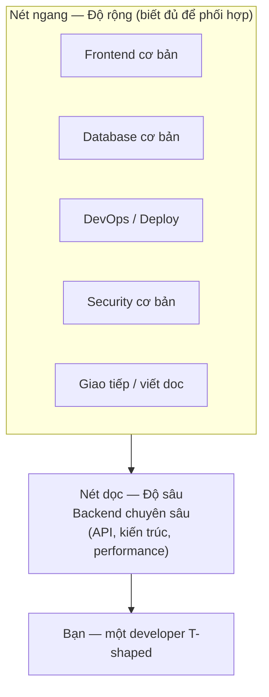
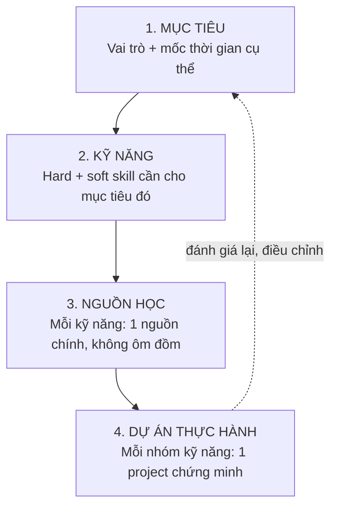

# 🧭 Kỹ năng & Lộ trình học cá nhân — Thoát khỏi tutorial hell

> **Tác giả:** Mr.Rom\
> **Phiên bản:** v1.0.0\
> **Tạo lúc:** 13/06/2026\
> **Cập nhật:** 13/06/2026\
> **Level:** Basic\
> **Tags:** career, learning, soft-skills, roadmap, tutorial-hell\
> **Yêu cầu trước:** [Sự nghiệp trong ngành tech là gì](00_what-is-a-tech-career.md)

> 🎯 *Bài trước bạn đã thấy bản đồ vai trò và nấc thang nghề. Nhưng biết "muốn làm Backend" chưa đủ — câu hỏi tiếp theo là: **học gì, theo thứ tự nào, và làm sao để không xem 200 giờ video mà vẫn không tự build được gì**. Bài này dạy bạn phân biệt hard skill vs soft skill, mô hình T-shaped, cách tự lập một learning roadmap đo lường được, và 4 vũ khí thoát khỏi tutorial hell.*

## 🎯 Sau bài này bạn sẽ

- [ ] Phân biệt rõ **hard skill** và **soft skill**, hiểu vì sao thiếu một bên thì sự nghiệp bị "lệch"
- [ ] Vẽ và áp dụng được mô hình **T-shaped** cho chính bạn (sâu 1 mảng + rộng nhiều mảng)
- [ ] Tự lập một **learning roadmap cá nhân** theo 4 lớp: mục tiêu → kỹ năng → nguồn → dự án
- [ ] Nhận diện và thoát khỏi **tutorial hell** bằng 4 kỹ thuật: build project, spaced repetition, learning in public, project-first
- [ ] Đánh giá tiến độ học bằng tín hiệu thật, không tự lừa bằng cảm giác "đã hiểu"
- [ ] Tránh bẫy chạy theo mọi công nghệ hot mà không có nền

---

## Tình huống — 6 tháng học mà vẫn thấy "chưa biết gì"

Hãy hình dung 6 tháng qua của một người mới vào nghề — rất có thể là chính bạn.

Bạn xem hết 1 khoá "Python full course 40 giờ" trên YouTube, gật gù từng video, code chạy theo giảng viên không lỗi. Xong khoá, bạn mở một khoá khác: "React for beginners". Rồi "Docker crash course". Rồi "SQL trong 4 giờ". Tab trình duyệt lúc nào cũng có 5-6 khoá đang dở.

Đến lúc một người bạn rủ làm chung một web app nhỏ thật, bạn mở editor lên... và đơ. Màn hình trống. Bạn không biết bắt đầu từ file nào, đặt tên thư mục ra sao, kết nối database thế nào cho đúng. Mọi thứ trong video lúc xem thì "hiểu rõ ràng", nhưng tay bạn chưa từng tự gõ ra cái gì từ con số 0.

Đây không phải bạn kém. Đây là một cái bẫy có tên hẳn hoi: **tutorial hell** (địa ngục tutorial) — vòng lặp xem-tutorial-mãi mà không bao giờ tự xây. Và nó có gốc rễ ở việc **học không có lộ trình** và **nhầm "xem hiểu" với "làm được"**.

Bài này không cho bạn thêm một danh sách "100 thứ phải học". Nó cho bạn **một cách tự thiết kế lộ trình** và **một bộ công cụ thoát bẫy** — để 6 tháng tới của bạn khác hẳn 6 tháng vừa rồi.

---

## 1️⃣ Hard skill vs Soft skill — hai chân của một sự nghiệp

Trước khi lập lộ trình, phải biết mình đang xếp loại kỹ năng nào. Người mới thường chỉ nghĩ tới "học code" mà quên một nửa quan trọng không kém.

**Hard skill** (kỹ năng cứng) — là những kỹ năng **kỹ thuật, đo lường được, có thể kiểm tra qua bài test**. Viết được hàm đệ quy, dựng được REST API, query được SQL có JOIN, deploy được container lên cloud — đây đều là hard skill. Chúng đưa bạn **qua được vòng technical interview**.

**Soft skill** (kỹ năng mềm) — là những kỹ năng **làm việc với con người và với chính mình**: giao tiếp, viết rõ ràng, hỏi đúng câu, nhận feedback không tự ái, quản lý thời gian, tự học. Chúng khó test bằng một bài thi, nhưng quyết định bạn **lên Senior hay mắc kẹt ở Junior**.

🪞 **Ẩn dụ**: hard skill và soft skill như **hai chân của một người chạy bộ**. Một chân (hard skill) khoẻ giúp bạn xuất phát nhanh và vào được đường đua. Nhưng nếu chân kia (soft skill) yếu, bạn sẽ khập khiễng và không bao giờ về đích đường dài. Không ai chạy marathon bằng một chân.

Để dễ phân biệt khi tự đánh giá bản thân, bảng dưới đối chiếu trực tiếp hai loại:

| Tiêu chí | Hard skill | Soft skill |
|---|---|---|
| Bản chất | Kỹ năng kỹ thuật cụ thể | Kỹ năng con người / tự quản lý |
| Đo lường | Test được rõ ràng (code chạy hay không) | Khó test, quan sát qua hành vi lâu dài |
| Ví dụ | Python, SQL, Git, dựng API, debug | Giao tiếp, viết doc, nhận feedback, ước lượng thời gian |
| Học từ đâu | Khoá học, doc, build project | Phản hồi từ người khác, làm việc nhóm, đọc, luyện |
| Vai trò trong nghề | Đưa bạn **vào** ngành (qua phỏng vấn) | Đưa bạn **lên** cao (Senior, Lead) |
| Lỗi thời nhanh? | Có — framework đổi liên tục | Hầu như không — giao tiếp 20 năm vẫn cần |

→ Một điểm cực kỳ quan trọng từ bảng trên: **hard skill lỗi thời nhanh, soft skill thì gần như không**. Framework hot năm nay 3 năm sau có thể chẳng ai dùng, nhưng khả năng "viết một message rõ ràng để đồng nghiệp hiểu ngay" thì giá trị suốt đời. Đây là lý do người ta nói: hard skill giúp bạn được tuyển, soft skill giúp bạn được giữ và được thăng tiến.

> [!IMPORTANT]
> Đừng hiểu lầm "soft skill" là thứ học sau khi đã giỏi code. Một Junior biết **hỏi đúng câu** và **viết bug report rõ ràng** được senior quý hơn nhiều so với một Junior code nhanh nhưng hỏi mơ hồ và không bao giờ ghi lại gì. Soft skill bắt đầu luyện từ ngày đầu tiên.

---

## 2️⃣ Mô hình T-shaped — sâu một mảng, rộng nhiều mảng

Khi nhìn bản đồ vai trò ở bài trước, người mới hay rơi vào hai cực sai lầm. Cực thứ nhất: học **rộng mà nông** — biết chút Python, chút React, chút Docker, chút SQL, nhưng không thứ gì đủ sâu để làm việc thật (chính là cái bẫy "tutorial hell" gây ra). Cực thứ hai: chỉ **đào sâu một thứ duy nhất** mà mù tịt mọi thứ xung quanh — viết backend giỏi nhưng không hiểu gì về deploy, database hay frontend, nên không phối hợp được với ai.

Lời giải kinh điển cho thế tiến thoái lưỡng nan này là mô hình **T-shaped** (hình chữ T).

🪞 **Ẩn dụ**: một người T-shaped giống như một **bác sĩ chuyên khoa giỏi**. Họ cực sâu ở chuyên khoa của mình (vd: tim mạch) — đó là **nét dọc của chữ T**. Nhưng họ vẫn nắm cơ bản về toàn bộ cơ thể, biết khi nào phải hội chẩn với khoa khác — đó là **nét ngang**. Một bác sĩ chỉ biết mỗi tim mà không hiểu phổi, gan nằm ở đâu thì không ai dám giao bệnh nhân.

Khái niệm chữ T trừu tượng, nên hình dung bằng sơ đồ sẽ rõ hơn nhiều. Nét ngang là **độ rộng** — những mảng bạn biết đủ để giao tiếp và phối hợp; nét dọc là **độ sâu** — mảng bạn đào tới mức làm việc chuyên nghiệp được.



> 📖 *Nhìn sơ đồ, điểm cốt lõi là: nét ngang và nét dọc **bổ trợ nhau**, không cạnh tranh. Mảng sâu cho bạn giá trị chuyên môn để được tuyển; các mảng rộng cho bạn khả năng làm việc trong một hệ thống thật nơi mọi thứ kết nối với nhau.*

Để áp dụng cho chính bạn, hãy tự trả lời 3 câu hỏi sau:

| Câu hỏi | Mục đích | Ví dụ trả lời |
|---|---|---|
| Nét dọc của mình là gì? | Chọn **1** mảng để đào sâu trong 1-2 năm tới | "Backend với Python + PostgreSQL" |
| Nét ngang gồm những gì? | Liệt kê 3-5 mảng **liền kề** cần biết cơ bản | "Frontend đủ để đọc code FE, Docker đủ để deploy, Git, giao tiếp" |
| Mảng nào đang bị bỏ trống? | Tìm lỗ hổng nguy hiểm | "Mình mù tịt về database indexing — cần lấp" |

> [!TIP]
> Người mới nên **chọn nét dọc TRƯỚC, làm nét ngang SAU**. Lý do: thị trường tuyển người vì độ sâu (cần một người làm tốt một việc), không tuyển vì "biết chút chút mọi thứ". Có nét dọc rồi, các mảng ngang sẽ tự dễ học hơn vì bạn đã có một mental model nền.

---

## 3️⃣ Lập learning roadmap cá nhân — 4 lớp từ trên xuống

Đây là phần "tay làm" quan trọng nhất của bài. Một learning roadmap **không phải** danh sách công nghệ chép từ roadmap.sh. Nó là **bản kế hoạch cá nhân hoá** trả lời được: bạn học cái này **để làm gì**, học **từ nguồn nào**, và **chứng minh đã học được** bằng cái gì.

Cách lập gồm 4 lớp, đi **từ trên xuống** (top-down) — luôn bắt đầu từ mục tiêu, không bao giờ bắt đầu từ "công nghệ nào hot".



> 📖 *Mũi tên đứt nét quay ngược lên trên là điểm hay bị quên: roadmap không phải viết một lần rồi để đó. Sau mỗi project, bạn quay lại đánh giá mục tiêu và điều chỉnh — học là một vòng lặp, không phải đường thẳng.*

### Lớp 1 — Mục tiêu (cụ thể, có thời hạn)

Mục tiêu mơ hồ kiểu "muốn giỏi lập trình" không dùng được vì không đo được. Một mục tiêu tốt phải có **vai trò + mốc thời gian + tiêu chí hoàn thành**.

| ❌ Mục tiêu mơ hồ | ✅ Mục tiêu đo lường được |
|---|---|
| "Học Backend" | "Trong 6 tháng, đủ skill apply vị trí Junior Backend: dựng được REST API có auth + database + test" |
| "Giỏi React" | "Trong 3 tháng, tự build được 1 SPA có routing, gọi API, quản lý state, deploy lên Vercel" |
| "Biết DevOps" | "Trong 4 tháng, tự viết được CI/CD pipeline build + test + deploy 1 app lên cloud" |

### Lớp 2 — Kỹ năng (phân rã từ mục tiêu)

Từ mục tiêu, liệt kê các kỹ năng cần — **cả hard lẫn soft** (đừng quên nửa soft skill như §1 đã nói). Đánh dấu cái nào là nền (phải có trước), cái nào nâng cao (học sau).

Ví dụ phân rã cho mục tiêu "Junior Backend trong 6 tháng":

| Nhóm | Kỹ năng | Ưu tiên |
|---|---|---|
| Hard — nền | Một ngôn ngữ (vd Python), Git cơ bản, SQL cơ bản | 🔴 Phải có trước |
| Hard — chính | REST API, authentication, ORM, viết test | 🟡 Trọng tâm |
| Hard — bổ trợ | Docker cơ bản, deploy lên 1 cloud | 🟢 Học sau khi vững phần chính |
| Soft | Viết README/doc rõ ràng, đọc hiểu doc tiếng Anh, hỏi đúng câu | 🟡 Luyện song song |

### Lớp 3 — Nguồn học (một nguồn chính cho mỗi kỹ năng)

Đây là nơi tutorial hell sinh ra: người ta mở 5 khoá cho cùng một thứ rồi không hoàn thành khoá nào. Quy tắc vàng: **mỗi kỹ năng chọn ĐÚNG MỘT nguồn chính, học hết nó, rồi mới mở nguồn thứ hai**.

| Loại nguồn | Khi nào dùng | Lưu ý |
|---|---|---|
| Doc chính thức | Khi cần tra cứu chính xác, đáng tin nhất | Khô nhưng đúng nhất — luyện đọc từ sớm |
| 1 khoá có cấu trúc | Khi cần lộ trình tuyến tính cho người mới | Chọn 1, học hết, đừng "sưu tầm" khoá |
| Sách nền tảng | Khi cần hiểu sâu nguyên lý, ít lỗi thời | Đọc chậm, ghi chú lại |
| Bài viết / blog | Khi cần giải 1 vấn đề cụ thể | Đừng học nền tảng từ blog rời rạc |

### Lớp 4 — Dự án thực hành (bằng chứng đã học được)

Đây là lớp **bắt buộc** và là điều phân biệt người thoát tutorial hell với người mắc kẹt. Mỗi nhóm kỹ năng phải kết thúc bằng **một project bạn tự build từ đầu**, không nhìn lại tutorial.

| Sau khi học... | Project chứng minh |
|---|---|
| Ngôn ngữ + Git cơ bản | 1 CLI tool nhỏ (vd: app to-do dòng lệnh) đẩy lên GitHub |
| REST API + database | 1 API quản lý dữ liệu (CRUD) có auth, kết nối DB thật |
| Test + Docker | Thêm test cho API trên + đóng gói chạy bằng Docker |
| Toàn bộ | 1 project portfolio hoàn chỉnh có deploy + README đàng hoàng |

> 📖 *Bốn lớp này ghép lại thành một template điền-vào-chỗ-trống — phần [Cheatsheet](#-tra-cứu-nhanh-cheatsheet) cuối bài có sẵn template đó để bạn copy về tự điền.*

---

## 4️⃣ Thoát tutorial hell — 4 vũ khí

Đã có roadmap, giờ là phần thực thi. Tutorial hell không tự biến mất khi bạn "cố gắng hơn" — nó biến mất khi bạn **đổi cách học**. Dưới đây là 4 kỹ thuật, xếp theo độ ưu tiên.

### 4.1 Build project — học bằng tay, không bằng mắt

Gốc rễ của tutorial hell là một sự nhầm lẫn: **xem hiểu ≠ làm được**. Khi xem video, não bạn nhận ra "à hợp lý", và cảm giác đó bị nhầm thành "mình biết làm". Nhưng kỹ năng chỉ hình thành qua **tự tạo ra cái gì đó từ con số 0**, gặp lỗi, và tự sửa.

Quy tắc thực hành đơn giản: **với mỗi giờ xem tutorial, dành ít nhất gấp đôi thời gian tự build một cái tương tự nhưng KHÁC đi** — đổi chủ đề, thêm tính năng, không nhìn lại video.

| ❌ Cách học mắc kẹt | ✅ Cách học thoát bẫy |
|---|---|
| Xem video → code y hệt theo → xem video tiếp | Xem video 1 lần → tắt đi → tự build phiên bản của mình |
| Build app to-do theo đúng từng dòng giảng viên | Xem app to-do → tự build app "ghi chú chi tiêu" tương tự |
| Lỗi là mở lại video tua đúng đoạn đó | Lỗi là tự đọc message, search, thử — chỉ xem lại khi bí thật |

### 4.2 Spaced repetition — chống quên

Bạn học một thứ hôm nay, một tuần sau quên 70%. Đó là quy luật tự nhiên của trí nhớ. **Spaced repetition** (lặp lại ngắt quãng) — ôn lại kiến thức theo các khoảng cách **giãn dần** (1 ngày → 3 ngày → 1 tuần → 2 tuần) — giúp đẩy kiến thức từ trí nhớ ngắn hạn sang dài hạn.

🪞 **Ẩn dụ**: trí nhớ như **một con đường mòn trong rừng**. Đi qua một lần, vết mờ, cỏ mọc lại sau vài ngày. Đi lại đúng lúc cỏ chuẩn bị che lấp, vết đậm dần. Lặp đủ lần, nó thành đường lớn không bao giờ mất. Khoảng cách giãn dần chính là "đi lại đúng lúc cỏ sắp che".

Cách áp dụng cho dev không cần app cầu kỳ:
- Học xong một concept → viết lại bằng lời của mình (không copy) vào một file ghi chú.
- Lên lịch ôn: hôm sau, 3 ngày sau, 1 tuần sau, mở lại file và **tự nhắc lại trước khi đọc**.
- Cách ôn tốt nhất là **dùng lại** — code một ví dụ nhỏ về concept đó, đừng chỉ đọc lại.

### 4.3 Learning in public — học công khai

**Learning in public** (học công khai) — chia sẻ những gì bạn đang học ra ngoài: viết một bài blog ngắn, một bài đăng kỹ thuật, một README giải thích project, hoặc trả lời câu hỏi của người khác.

Vì sao nó mạnh đến vậy:
- **Hiệu ứng dạy lại**: để giải thích cho người khác, bạn buộc phải hiểu thật — lỗ hổng kiến thức lộ ra ngay khi bạn cố viết.
- **Tạo bằng chứng**: bài viết và project công khai chính là portfolio — nhà tuyển dụng thấy được bạn học gì, nghĩ gì.
- **Tạo trách nhiệm**: công khai mục tiêu khiến bạn dễ theo đuổi hơn là giữ trong đầu.

> [!TIP]
> Đừng chờ "đủ giỏi mới chia sẻ". Viết ở đúng trình độ hiện tại có giá trị riêng — người mới hơn bạn một bước sẽ hiểu bạn dễ hơn hiểu một chuyên gia. Bài "tôi mới hiểu được X, ghi lại kẻo quên" hoàn toàn đáng đăng.

### 4.4 Project-first — đảo ngược thứ tự học

Cách học truyền thống: học hết lý thuyết → rồi mới làm project. Cách này nuôi tutorial hell vì "học hết lý thuyết" là một cái đích không bao giờ tới — luôn còn thứ chưa biết.

**Project-first** đảo ngược: **chọn một project trước**, rồi học **đúng cái cần** để hoàn thành nó. Lý thuyết được học **theo nhu cầu** (just-in-time), nên luôn gắn với một việc thật và được áp dụng ngay.

| Cách học | Thứ tự | Rủi ro |
|---|---|---|
| Tutorial-first (truyền thống) | Học hết lý thuyết → mới dám làm | Học mãi không xong, không bao giờ thấy đủ tự tin để bắt đầu |
| Project-first | Chọn project → học đúng phần cần → làm ngay | Phải chịu được cảm giác "chưa biết hết" — nhưng học nhanh và nhớ lâu hơn |

→ Cả 4 vũ khí trên đều xoay quanh một nguyên lý: **dịch chuyển từ tiêu thụ thụ động (xem) sang tạo ra chủ động (build, viết, dạy lại)**. Học là một động từ chủ động.

---

## 5️⃣ Đánh giá tiến độ — đo bằng tín hiệu thật

"Tôi học được bao nhiêu rồi?" là câu hỏi khó vì cảm giác hay đánh lừa. Cảm giác "đã hiểu" sau khi xem video là tín hiệu **giả**. Dưới đây là cách đo bằng tín hiệu **thật**.

| Tín hiệu GIẢ (đừng tin) | Tín hiệu THẬT (đáng tin) |
|---|---|
| "Xem video thấy hợp lý, gật gù liên tục" | Tự build được tính năng đó từ trang trắng, không xem lại |
| "Đã xem hết 40 giờ khoá học" | Giải thích lại concept cho người khác mà họ hiểu |
| "Đã đọc hết doc" | Debug được một lỗi mới chưa từng gặp bằng kiến thức đã học |
| "Code chạy theo tutorial không lỗi" | Sửa được khi đổi yêu cầu so với tutorial gốc |

Một thước đo gọn để tự kiểm mỗi cuối tuần — gọi là **kiểm tra 3 câu**:

1. Tuần này mình đã **tự tạo ra** (build / viết / giải) được gì mà tuần trước chưa làm được?
2. Có concept nào mình **giải thích lại được** cho người khác không?
3. Roadmap còn đúng không, hay cần điều chỉnh mục tiêu/nguồn?

> [!NOTE]
> Tiến độ học **không tuyến tính**. Có những tuần bạn thấy "đứng yên" rồi đột nhiên một concept khó tự dưng vỡ ra — đó là lúc kiến thức rời rạc kết nối lại. Đừng hoảng khi gặp tuần "đứng yên", miễn là tín hiệu thật (tự build được) vẫn tăng dần qua từng tháng.

---

## 6️⃣ Tránh bẫy chạy theo mọi công nghệ hot

Mỗi tuần lại có một framework mới, một ngôn ngữ mới, một "AI tool sẽ thay đổi tất cả". Người mới rất dễ bị cuốn: bỏ dở thứ đang học để nhảy sang thứ vừa trending. Đây là **shiny object syndrome** (hội chứng đồ vật lấp lánh) — và nó là một biến thể khác của tutorial hell.

Vấn đề không phải công nghệ mới là xấu. Vấn đề là: nhảy liên tục khiến bạn **không bao giờ đủ sâu ở thứ gì** — quay lại đúng cái bẫy "rộng mà nông" ở §2.

Cách lọc tỉnh táo: trước khi học một công nghệ hot, hỏi 3 câu:

| Câu hỏi | Nếu trả lời "không" thì... |
|---|---|
| Nó có phục vụ **mục tiêu trong roadmap** của mình không? | Bỏ qua — chỉ lưu lại để ý sau, không học bây giờ |
| Mình đã **vững nền** mà nó dựa lên chưa? (vd học framework trước khi biết ngôn ngữ) | Học nền trước, công nghệ hot sau |
| Nó còn hot sau **1-2 năm** hay chỉ là sóng ngắn? | Chờ thêm — để thị trường lọc, không cần là người đầu tiên |

> [!IMPORTANT]
> Nền tảng (một ngôn ngữ vững, hiểu HTTP, database, Git, tư duy giải bài toán) gần như **không lỗi thời**. Công nghệ hot dựng trên nền đó thì đến rồi đi. Đầu tư 80% thời gian học nền, 20% theo dõi cái mới — không phải ngược lại. Người có nền vững học công nghệ mới trong vài ngày; người chạy theo hot mà không nền thì học cái gì cũng mãi nông.

---

## 💡 Cạm bẫy thường gặp & Best practice

### ❌ Cạm bẫy: collector — sưu tầm khoá học thay vì hoàn thành

- **Triệu chứng**: mua/lưu hàng chục khoá học, bookmark trăm bài viết "để đọc sau", nhưng tỷ lệ hoàn thành gần như bằng 0.
- **Nguyên nhân**: nhầm hành động "thu thập tài nguyên" với hành động "học". Thu thập cho cảm giác tiến bộ giả mà không tốn công thật.
- **Cách tránh**: áp dụng quy tắc "một nguồn chính cho một kỹ năng" ở §3 — học **hết** một nguồn (kèm project) rồi mới cho phép mình mở nguồn tiếp theo.

### ❌ Cạm bẫy: học rộng mà nông để "an toàn"

- **Triệu chứng**: sau nhiều tháng, biết một chút về rất nhiều thứ nhưng không có một mảng nào đủ sâu để qua phỏng vấn hay làm việc thật.
- **Nguyên nhân**: sợ "chọn sai mảng" nên không dám cam kết đào sâu cái gì.
- **Cách tránh**: chọn **một nét dọc** (§2) và đào sâu trong 1-2 năm. Chọn sai cũng không mất gì — nền tảng và tư duy giải bài toán chuyển sang mảng khác được. Cam kết quan trọng hơn chọn đúng từ đầu.

### ✅ Best practice: học theo project, không học theo "chương trình"

- **Vì sao**: kiến thức gắn với một project thật được áp dụng ngay, gặp lỗi thật, nên nhớ lâu và dùng được. Kiến thức học "cho biết" thì bay hơi nhanh.
- **Cách áp dụng**: mỗi lần định học thứ mới, đặt câu hỏi "mình build cái gì với nó?". Nếu không trả lời được, hoãn việc học đó lại cho tới khi có một project cần đến.

### ✅ Best practice: viết lại bằng lời của mình

- **Vì sao**: khi buộc phải diễn đạt lại không copy, lỗ hổng hiểu lộ ra ngay — đây là cách kiểm tra "hiểu thật" rẻ nhất.
- **Cách áp dụng**: học xong mỗi concept, đóng tài liệu lại và viết một đoạn ngắn giải thích nó như đang dạy cho người mới hơn. Đây cũng là nguyên liệu sẵn cho learning in public (§4.3).

---

## 🧠 Tự kiểm tra (Self-check)

**Q1.** Một người bạn nói: "Mình xem hết khoá React 30 giờ rồi, giờ mình biết React rồi." Bạn phản hồi thế nào để giúp bạn ấy?

<details>
<summary>💡 Đáp án</summary>

"Xem hết" là tín hiệu giả — xem hiểu khác với làm được. Cách kiểm tra thật: tắt video, tự build một SPA nhỏ từ trang trắng (có routing, gọi API, quản lý state). Nếu làm được mà không xem lại thì mới thật sự "biết". Nếu đơ ngay từ bước tạo project thì kiến thức mới chỉ ở mức "nhận ra", chưa ở mức "tái tạo được" — cần bù bằng việc build project (§4.1).

</details>

**Q2.** Bạn muốn thành Junior Backend trong 6 tháng. Hãy lập nhanh learning roadmap 4 lớp cho mục tiêu này.

<details>
<summary>💡 Đáp án</summary>

- **Lớp 1 — Mục tiêu**: "6 tháng nữa đủ skill apply Junior Backend: dựng được REST API có auth + database + test."
- **Lớp 2 — Kỹ năng**: nền (1 ngôn ngữ vd Python, Git, SQL); chính (REST API, authentication, ORM, viết test); bổ trợ (Docker, deploy); soft (viết doc, đọc doc EN, hỏi đúng câu).
- **Lớp 3 — Nguồn**: mỗi kỹ năng đúng 1 nguồn chính (vd doc chính thức của framework + 1 khoá có cấu trúc), học hết rồi mới mở nguồn tiếp.
- **Lớp 4 — Dự án**: CLI tool nhỏ → API CRUD có auth + DB thật → thêm test + Docker → 1 project portfolio có deploy + README.

</details>

**Q3.** Có một framework đang cực hot tuần này, ai cũng nói tới. Bạn đang giữa một roadmap học Backend nền tảng. Có nên dừng để học framework hot ngay không?

<details>
<summary>💡 Đáp án</summary>

Mặc định là **không dừng**. Chạy qua 3 câu lọc ở §6: (1) Nó có phục vụ mục tiêu Backend trong roadmap không? (2) Mình đã vững nền mà nó dựa lên chưa? (3) Nó còn hot sau 1-2 năm hay chỉ sóng ngắn? Nếu chưa vững nền hoặc nó không phục vụ mục tiêu, hãy lưu lại để ý sau và tiếp tục roadmap. Nền vững giúp sau này học framework đó trong vài ngày; nhảy ngang bây giờ chỉ đẩy bạn về bẫy "rộng mà nông".

</details>

**Q4.** Phân biệt nét dọc và nét ngang trong mô hình T-shaped, và giải thích vì sao người mới nên ưu tiên nét dọc trước.

<details>
<summary>💡 Đáp án</summary>

Nét dọc là **độ sâu** — một mảng bạn đào tới mức làm việc chuyên nghiệp được (vd Backend với Python). Nét ngang là **độ rộng** — các mảng liền kề bạn biết đủ để phối hợp (frontend cơ bản, deploy, database, giao tiếp). Nên làm nét dọc trước vì thị trường tuyển người vì độ sâu (cần làm tốt một việc), không tuyển vì "biết chút chút mọi thứ". Có nét dọc rồi, các mảng ngang cũng dễ học hơn nhờ đã có mental model nền.

</details>

---

## ⚡ Tra cứu nhanh (Cheatsheet)

**Template learning roadmap cá nhân** — copy về và điền vào chỗ trống:

```text
== LEARNING ROADMAP CỦA TÔI ==

[1] MỤC TIÊU (vai trò + thời hạn + tiêu chí đo được)
    Trong ____ tháng, tôi muốn ____________________________
    Tiêu chí "xong": _____________________________________

[2] KỸ NĂNG (phân rã từ mục tiêu — gồm cả soft skill)
    Hard - nền (phải có trước): _________________________
    Hard - chính (trọng tâm):   _________________________
    Hard - bổ trợ (học sau):    _________________________
    Soft (luyện song song):     _________________________

[3] NGUỒN (mỗi kỹ năng ĐÚNG 1 nguồn chính)
    Kỹ năng ____ → nguồn ____ (học hết rồi mới mở nguồn khác)

[4] DỰ ÁN (mỗi nhóm kỹ năng = 1 project chứng minh)
    Sau nhóm nền:    project ____________________________
    Sau nhóm chính:  project ____________________________
    Portfolio cuối:  project ____________________________
```

**Bảng tra nhanh — khung & checklist trong bài:**

| Mục đích | Khung / công cụ |
|---|---|
| Phân loại kỹ năng | Hard (test được, đưa vào ngành) vs Soft (đưa lên cao) |
| Định hình hướng học | T-shaped: chọn 1 nét dọc + 3-5 nét ngang |
| Lập kế hoạch học | 4 lớp: mục tiêu → kỹ năng → nguồn → dự án |
| Thoát tutorial hell | Build project, spaced repetition, learning in public, project-first |
| Kiểm tiến độ cuối tuần | 3 câu: tự build được gì mới / giải thích lại được không / roadmap còn đúng không |
| Lọc công nghệ hot | 3 câu: phục vụ mục tiêu? / đã vững nền? / còn hot sau 1-2 năm? |

**Checklist "đã thoát tutorial hell chưa?":**

- [ ] Có một roadmap cá nhân viết ra (không chỉ trong đầu)
- [ ] Mỗi kỹ năng đang học chỉ dùng **một** nguồn chính
- [ ] Đang build ít nhất một project KHÔNG nhìn lại tutorial
- [ ] Có thói quen viết lại concept bằng lời của mình
- [ ] Có ít nhất một thứ học công khai (blog/README/post)
- [ ] Đo tiến độ bằng "tự build được gì", không bằng "đã xem bao nhiêu giờ"

---

## 📚 Từ Điển Thuật Ngữ (Glossary)

| EN | VN | Giải thích |
|---|---|---|
| Hard skill | Kỹ năng cứng | Kỹ năng kỹ thuật cụ thể, đo lường được (code, SQL, Git...) |
| Soft skill | Kỹ năng mềm | Kỹ năng làm việc với người và với chính mình (giao tiếp, tự học...) |
| T-shaped | Hình chữ T | Mô hình: sâu 1 mảng (nét dọc) + rộng nhiều mảng (nét ngang) |
| Learning roadmap | Lộ trình học | Kế hoạch học cá nhân hoá theo mục tiêu, kỹ năng, nguồn, dự án |
| Tutorial hell | Địa ngục tutorial | Vòng lặp xem tutorial mãi mà không bao giờ tự build |
| Spaced repetition | Lặp lại ngắt quãng | Ôn kiến thức theo các khoảng cách giãn dần để nhớ lâu |
| Learning in public | Học công khai | Chia sẻ những gì đang học ra ngoài (blog, post, README) |
| Project-first | Học theo dự án trước | Chọn project trước rồi học đúng phần cần để hoàn thành |
| Shiny object syndrome | Hội chứng đồ vật lấp lánh | Xu hướng bỏ dở việc đang làm để nhảy sang thứ mới hot |
| Just-in-time learning | Học theo nhu cầu | Học đúng kiến thức cần đúng lúc cần dùng, không học thừa trước |
| Portfolio | Bộ sản phẩm trưng bày | Tập hợp project/bài viết chứng minh năng lực cho nhà tuyển dụng |

---

## 🔗 Liên kết & Tài nguyên

⬅️ **Bài trước:** [Sự nghiệp trong ngành tech là gì? — Bản đồ vai trò & nấc thang](00_what-is-a-tech-career.md)\
➡️ **Bài tiếp theo:** [CV & Portfolio cho dev — Vượt ATS, gây ấn tượng 6 giây](02_resume-and-portfolio.md)\
↑ **Về cụm:** [career-path — README](../../README.md)

### 🧭 Định hướng lộ trình học

- [Sự nghiệp trong ngành tech là gì? — Bản đồ vai trò & nấc thang](00_what-is-a-tech-career.md) — bản đồ vai trò để chọn nét dọc cho roadmap
- [CV & Portfolio cho dev — Vượt ATS, gây ấn tượng 6 giây](02_resume-and-portfolio.md) — biến project portfolio thành CV gây ấn tượng

### 🧩 Các chủ đề có thể bạn quan tâm

- [Tìm việc & Đánh giá offer — Từ apply đến nhận lời mời](03_job-search-and-offer.md) — bước tiếp sau khi đã có skill + portfolio
- [Phát triển & Thăng tiến — Lên level và biết khi nào đổi việc](04_growth-and-leveling-up.md) — học liên tục để leo nấc thang nghề

### 🌐 Tài nguyên tham khảo khác

- [roadmap.sh](https://roadmap.sh) — visual roadmap cho 20+ nghề, dùng để tham khảo nét dọc/ngang (đừng học hết mọi node)
- [The Pragmatic Programmer (Hunt & Thomas)](https://pragprog.com/titles/tpp20/the-pragmatic-programmer-20th-anniversary-edition/) — sách kinh điển về tư duy học và làm nghề dev
- [Learn In Public (swyx)](https://www.swyx.io/learn-in-public) — bài viết gốc về triết lý learning in public

---

## 📌 Nhật ký thay đổi (Changelog)

- **v1.0.0 (13/06/2026)** — Bản đầu tiên. Phân biệt hard vs soft skill (ẩn dụ "hai chân chạy bộ") + mô hình T-shaped có sơ đồ + cách lập learning roadmap 4 lớp (mục tiêu → kỹ năng → nguồn → dự án) có sơ đồ vòng lặp + 4 vũ khí thoát tutorial hell (build project, spaced repetition, learning in public, project-first) + đánh giá tiến độ bằng tín hiệu thật + cách lọc bẫy công nghệ hot + 2 cạm bẫy + 2 best practice + 4 self-check + template roadmap + checklist + glossary 11 thuật ngữ.
