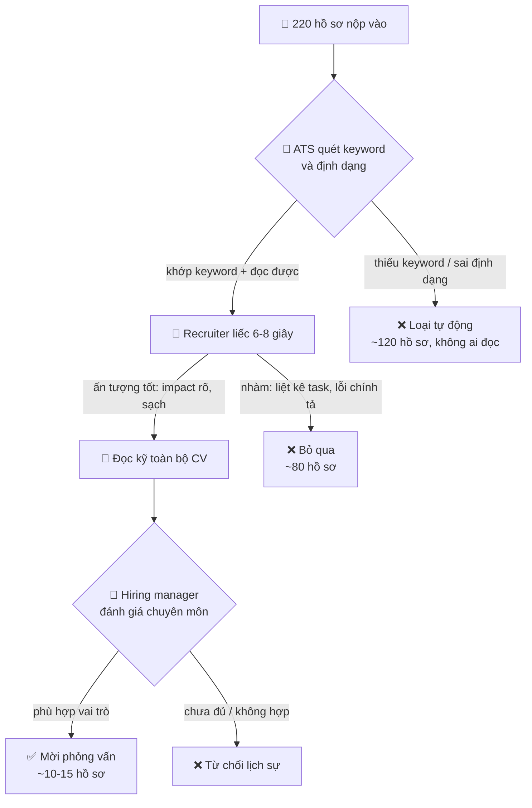

# 📄 CV & Portfolio cho dev — Vượt ATS, gây ấn tượng 6 giây

> **Tác giả:** Mr.Rom\
> **Phiên bản:** v1.0.0\
> **Tạo lúc:** 13/06/2026\
> **Cập nhật:** 13/06/2026\
> **Level:** Basic\
> **Tags:** career, resume, cv, portfolio, ats, github, linkedin, job-search\
> **Yêu cầu trước:** [Kỹ năng & Lộ trình học cá nhân](01_skills-and-learning-roadmap.md)

> 🎯 *Bài trước bạn đã có kỹ năng và một learning roadmap. Nhưng kỹ năng giỏi mà CV viết dở thì không ai gọi bạn đi phỏng vấn — hồ sơ của bạn bị một con robot loại từ trước khi có người đọc, hoặc người tuyển chỉ liếc 6 giây rồi bỏ qua. Bài này dạy bạn viết một CV tech chuẩn 1 trang dùng **action verb + số liệu**, vượt qua hệ thống lọc **ATS**, dựng GitHub/portfolio chỉn chu, và tối ưu LinkedIn — kèm template và checklist review hoàn chỉnh.*

## 🎯 Sau bài này bạn sẽ

- [ ] Viết được một **CV tech 1 trang** đúng cấu trúc, mỗi bullet là **impact đo lường được**, không phải liệt kê task
- [ ] Hiểu **ATS** là gì, vì sao CV bị loại trước khi có người đọc, và cách tối ưu keyword đúng cách
- [ ] Biến **action verb + số liệu định lượng** thành công thức viết bullet point chuẩn
- [ ] Dựng một **GitHub/portfolio** đáng tin: pin project tốt, README chỉn chu, commit history sạch
- [ ] Tối ưu **LinkedIn** profile để recruiter tự tìm tới bạn
- [ ] Tự review CV của mình bằng một checklist 6 giây + tránh các lỗi khiến hồ sơ bị loại ngay

---

## Tình huống — 30 giây quyết định 6 tháng học của bạn

Hãy hình dung một buổi sáng của người tuyển dụng (recruiter) ở một công ty tech tầm trung. Họ vừa đăng một tin tuyển Junior Backend. Trong 48 giờ, có **220 hồ sơ** đổ về hộp thư.

Họ không đọc 220 hồ sơ. Không ai làm được điều đó. Quy trình thực tế diễn ra thế này:

- Một phần mềm tên **ATS** (Applicant Tracking System) tự động quét trước. Nó loại bỏ những CV không khớp đủ keyword, sai định dạng nó không đọc được, hoặc bị nhồi nhét trick. Khoảng **120 hồ sơ rớt ngay tại đây — không một con người nào nhìn thấy chúng.**
- 100 hồ sơ còn lại lọt tới mắt recruiter. Họ **liếc mỗi CV trung bình 6-8 giây** để quyết định "đáng đọc kỹ" hay "bỏ qua". Nghiên cứu eye-tracking của Ladders (2018) đo được con số nổi tiếng: recruiter dành **khoảng 7,4 giây** cho lần nhìn đầu tiên một CV.
- Khoảng 20 hồ sơ "qua vòng liếc" mới được đọc kỹ, rồi chuyển cho **hiring manager** (người quản lý tuyển dụng — sếp trực tiếp của vị trí) xem xét gọi phỏng vấn.

Bạn thấy vấn đề chưa? Bạn bỏ ra 6 tháng học kỹ năng thật. Nhưng số phận của 6 tháng đó được quyết bởi **một con robot quét 1 giây + một con người liếc 7 giây**. Nếu CV của bạn không vượt được hai cửa ải đó, kỹ năng của bạn vô hình.

Tin tốt: cả hai cửa ải này đều có **luật chơi rõ ràng** — và luật chơi học được. Bài này dạy bạn đúng luật chơi đó.

> [!IMPORTANT]
> CV không phải bản tự truyện của bạn. Nó là một **công cụ marketing có một mục tiêu duy nhất**: làm người đọc muốn gọi bạn đi phỏng vấn. Mọi quyết định viết CV đều quy về câu hỏi: "câu này có tăng khả năng được gọi không?". Nếu không — cắt.

---

## 1️⃣ Hành trình một CV: ATS → recruiter → hiring manager

Để viết CV đúng, trước hết phải hiểu **CV của bạn đi qua những ai, theo thứ tự nào**. Mỗi "trạm" có một người (hoặc máy) đọc với mục đích khác nhau, và bạn phải làm hài lòng cả ba.

🪞 **Ẩn dụ**: nộp CV giống như **gửi hành lý qua sân bay**. Đầu tiên hành lý chạy qua **máy soi X-quang** (ATS) — máy không quan tâm vali bạn đẹp hay xấu, nó chỉ kiểm "có đúng thứ được phép mang không". Qua được máy soi, **nhân viên an ninh** (recruiter) liếc nhanh xem có gì khả nghi cần soi kỹ. Cuối cùng, nếu cần, **trưởng ca** (hiring manager) mới mở vali ra xem chi tiết. Vali của bạn phải vừa lọt máy soi, vừa nhìn "sạch sẽ" khi liếc, vừa chứa đồ thật bên trong.

Sơ đồ dưới mô tả hành trình đó cùng tỷ lệ rơi rụng điển hình ở một tin tuyển có nhiều ứng viên — để bạn thấy rõ "khúc nào giết nhiều hồ sơ nhất".



→ Nhìn sơ đồ là thấy ngay: **trạm chết người nhất là ATS** — hơn một nửa hồ sơ rơi ở đây trước khi bất kỳ ai nhìn thấy. Nhưng nhiều người mới chỉ chăm chút "làm CV đẹp" cho người đọc mà quên hẳn con robot đứng gác cổng đầu tiên. Hai mục tiếp theo xử lý đúng thứ tự đó: trước là vượt ATS, sau là gây ấn tượng với người.

---

## 2️⃣ ATS — con robot gác cổng và cách vượt qua

Bạn vừa thấy ATS giết hơn một nửa hồ sơ. Vậy nó thực sự là gì, và vì sao nó loại CV của bạn?

**ATS** (*Applicant Tracking System* — hệ thống quản lý ứng viên) là phần mềm các công ty dùng để **nhận, lưu trữ, phân loại và lọc hàng trăm hồ sơ tự động**. Những tên phổ biến: Greenhouse, Lever, Workday, Taleo, iCIMS. Khi bạn bấm "Apply" trên trang tuyển dụng, gần như chắc chắn CV của bạn rơi vào một ATS chứ không phải hộp mail của người thật.

🪞 **Ẩn dụ**: ATS như một **anh bảo vệ chỉ biết đọc danh sách**. Sếp đưa anh ta tờ giấy ghi "cho vào ai có thẻ ghi các chữ: Python, REST API, PostgreSQL, Docker". Anh bảo vệ không hiểu bạn giỏi cỡ nào, không rung động vì CV bạn đẹp — anh ta chỉ dò xem trên thẻ của bạn có đủ những chữ trong danh sách không. Thiếu chữ → đứng ngoài. Hiểu được "anh bảo vệ chỉ đọc chữ" là hiểu được toàn bộ cách vượt ATS.

### Vì sao CV bị ATS loại

ATS không "ghét" bạn — nó chỉ máy móc. CV bị loại thường vì những lý do rất kỹ thuật mà bạn không hề hay biết:

| Lý do bị loại | Chuyện gì xảy ra |
|---|---|
| Thiếu keyword khớp job description | ATS chấm điểm độ khớp thấp → xếp cuối danh sách hoặc lọc bỏ |
| Định dạng máy không đọc được | CV để chữ trong **ảnh**, **text box**, hoặc bảng nhiều cột phức tạp → ATS đọc ra ký tự lộn xộn |
| Header/footer chứa thông tin quan trọng | Nhiều ATS bỏ qua vùng header/footer → email, số điện thoại của bạn biến mất |
| Font lạ, ký tự đặc biệt, icon | ATS hiện đại đọc tốt hơn, nhưng icon thay chữ ("📧" thay "Email") vẫn dễ thành rác |
| File sai định dạng | An toàn nhất là **PDF** (chữ chọn được, không phải ảnh scan) hoặc `.docx` |
| Nhồi keyword trắng (white text) | Trò viết keyword màu trắng ẩn đi — ATS hiện đại bắt được và **đánh dấu gian lận** |

### Cách tối ưu keyword cho ATS

Quy tắc cốt lõi: **CV phải nói cùng ngôn ngữ với job description (JD)**. ATS so khớp chữ trên CV của bạn với chữ trong JD — nên bạn phải lấy chính từ ngữ trong JD đưa vào CV (một cách trung thực).

Quy trình 4 bước, làm lại cho **mỗi vị trí** bạn apply:

1. **Đọc kỹ JD, gạch chân danh từ kỹ thuật + kỹ năng lặp lại nhiều lần.** Ví dụ JD ghi "experience with REST APIs, PostgreSQL, Docker, CI/CD" → đó là 4 keyword bắt buộc.
2. **Đối chiếu với kinh nghiệm thật của bạn.** Keyword nào bạn thực sự có → đảm bảo nó xuất hiện trong CV với **đúng chữ** JD dùng. JD ghi "PostgreSQL" thì viết "PostgreSQL", đừng chỉ viết "SQL".
3. **Khớp cả dạng đầy đủ lẫn viết tắt.** Lần đầu viết `CI/CD (Continuous Integration / Continuous Deployment)`. ATS tìm "CI/CD" lẫn người tìm "Continuous Integration" đều khớp.
4. **Đặt keyword ở đúng chỗ tự nhiên** — trong phần Skills và trong bullet point kinh nghiệm — chứ không nhồi một danh sách dài vô nghĩa.

> [!WARNING]
> Tuyệt đối **không bịa keyword bạn không có**, và không dùng trò "white text" (viết keyword màu trắng để ATS đếm còn người không thấy). ATS hiện đại phát hiện được, và nếu lọt tới phỏng vấn, người ta hỏi đúng keyword bạn bịa thì bạn lộ ngay. Tối ưu keyword nghĩa là **trình bày kỹ năng thật bằng đúng từ ngữ JD dùng**, không phải nói dối.

Về định dạng an toàn cho ATS, ghi nhớ vài quy tắc đơn giản: dùng layout **một cột** (tránh hai cột phức tạp), font phổ thông (Arial, Calibri, Helvetica, Times New Roman), heading bằng chữ thường rõ ràng (`Experience`, `Education`, `Skills` — không icon thay chữ), và xuất file **PDF có chữ chọn được**. Muốn kiểm tra nhanh: mở PDF của bạn, bôi đen toàn bộ rồi copy-paste sang một file text trống — nếu chữ ra **đúng thứ tự, không lộn xộn**, ATS cũng đọc được như vậy.

---

## 3️⃣ Cấu trúc CV tech chuẩn 1 trang

Vượt được ATS rồi, giờ tới con người. Một CV tech tốt **gọn trong 1 trang** (với fresher đến mid-level; senior 7+ năm có thể 2 trang), sắp xếp theo thứ tự **thứ quan trọng nhất nằm trên cùng** — vì recruiter liếc từ trên xuống và có thể dừng bất cứ lúc nào.

Thứ tự các phần điển hình của một CV dev:

| Thứ tự | Phần | Nội dung |
|---|---|---|
| 1 | **Header** | Tên, chức danh mục tiêu, email, số điện thoại, link GitHub + LinkedIn + portfolio |
| 2 | **Summary** (tuỳ chọn) | 2-3 dòng tóm tắt bạn là ai + mạnh gì + muốn gì. Hữu ích khi chuyển ngành |
| 3 | **Skills** | Nhóm theo loại: Languages, Frameworks, Databases, Tools/DevOps |
| 4 | **Experience** | Kinh nghiệm làm việc, mới nhất trên cùng. Mỗi vị trí 3-5 bullet impact |
| 5 | **Projects** | Cực quan trọng với fresher chưa có kinh nghiệm — thay phần Experience |
| 6 | **Education** | Bằng cấp, khoá học. Fresher để cao hơn; người có kinh nghiệm để cuối |

> [!TIP]
> Với fresher chưa đi làm, **đảo Projects lên trên Experience** (hoặc bỏ hẳn Experience). 2-3 project thật, có demo + source code, thuyết phục hơn nhiều so với một mục Experience trống rỗng. Nhà tuyển dụng tuyển fresher dựa trên **bằng chứng bạn biết build**, không phải số năm.

Vài quy tắc trình bày để CV "sạch khi liếc 6 giây":

- **Một trang.** Cắt không thương tiếc thứ không tăng khả năng được gọi (sở thích chung chung, "tham khảo: sẽ cung cấp khi cần", ảnh thẻ với công ty nước ngoài).
- **Khoảng trắng thoáng.** CV chật chữ kín mít khiến mắt người đọc bỏ chạy. Để lề và khoảng cách dòng dễ thở.
- **Nhất quán.** Ngày tháng cùng một định dạng, chấm câu cuối bullet cùng kiểu, thì động từ cùng thì (quá khứ cho việc đã xong).
- **Tên file chuyên nghiệp.** Đặt `NguyenVanA_Backend_CV.pdf`, đừng để `cv_final_v3_real_final.pdf`.

---

## 4️⃣ Công thức bullet point: action verb + số liệu = impact

Đây là phần **quyết định** chất lượng một CV tech, và cũng là nơi 90% người mới làm sai. Lỗi kinh điển: viết CV như **bản mô tả công việc (job description)** — liệt kê những việc mình "có nhiệm vụ làm" — thay vì **bằng chứng kết quả mình đã tạo ra**.

So sánh trực tiếp hai cách viết cho cùng một công việc:

❌ **Liệt kê task** (mô tả nhiệm vụ — nhàm, không đo được):

```text
- Chịu trách nhiệm phát triển API cho hệ thống.
- Làm việc với database.
- Tham gia fix bug và tối ưu hệ thống.
- Sử dụng Docker để deploy.
```

→ Đọc xong không biết bạn **giỏi cỡ nào**. Ai làm vị trí đó cũng viết được y hệt — bao gồm cả người làm dở. Những bullet này không phân biệt bạn với 219 người còn lại.

✅ **Impact đo lường được** (action verb + con số — ấn tượng, chứng minh năng lực):

```text
- Xây dựng 12 REST API endpoint phục vụ 5.000 request/ngày, đạt p95 latency dưới 120ms.
- Tối ưu truy vấn PostgreSQL chậm, giảm thời gian load trang dashboard từ 4,2s xuống 0,8s (-80%).
- Viết test tự động nâng coverage từ 40% lên 85%, giảm số bug lọt production 60%.
- Container hoá ứng dụng bằng Docker, rút thời gian onboard dev mới từ 2 ngày còn 2 giờ.
```

→ Mỗi dòng trả lời được 3 câu: **Làm gì** (action verb mạnh đầu câu) + **Kết quả ra sao** (con số) + **Bằng công nghệ gì** (keyword cho ATS). Người đọc hình dung ngay năng lực thật.

### Công thức XYZ của Google

Một công thức dễ nhớ do Google phổ biến: viết mỗi bullet theo dạng **"Đạt được [X] bằng cách làm [Y], đo bằng [Z]"** — trong đó X là kết quả, Y là hành động, Z là con số.

```text
[Action verb] + [làm gì cụ thể] + [đo bằng con số] + [bằng công nghệ gì]
```

Ví dụ ráp công thức: *"Tự động hoá (action) quy trình deploy bằng GitHub Actions (công nghệ), giảm thời gian release từ 30 phút xuống 5 phút (con số)."*

### Kho action verb mạnh

Mỗi bullet **bắt đầu bằng một động từ hành động** ở đầu câu, không mở bằng "Chịu trách nhiệm…", "Tham gia…", "Đã làm…". Nhóm động từ theo loại đóng góp:

| Loại đóng góp | Action verb gợi ý |
|---|---|
| Xây mới | Xây dựng, Phát triển, Thiết kế, Triển khai, Khởi tạo |
| Cải thiện | Tối ưu, Cải thiện, Tăng tốc, Refactor, Nâng cấp |
| Giảm thiểu | Giảm, Loại bỏ, Khắc phục, Tinh gọn |
| Tự động hoá | Tự động hoá, Tích hợp, Streamline |
| Dẫn dắt | Dẫn dắt, Mentor, Phối hợp, Review |

### Khi chưa có con số thì sao?

Câu hỏi muôn thuở của fresher: "em chưa đi làm, lấy đâu ra số liệu?". Bạn vẫn có số — chỉ là phải **tự đo project của mình**:

- "Web app phục vụ **bao nhiêu** user / dữ liệu test?" → "Quản lý 500 sản phẩm với chức năng tìm kiếm dưới 200ms."
- "Tối ưu được **bao nhiêu**?" → "Giảm bundle size từ 2MB xuống 600KB nhờ code-splitting."
- "Test bao phủ **bao nhiêu**?" → "Viết 40 unit test đạt coverage 80%."
- "Bao nhiêu **người dùng / lượt sao GitHub**?" → "Project mã nguồn mở đạt 35 sao GitHub, 8 người đóng góp."

→ Con số không cần "khủng". Một con số nhỏ nhưng **cụ thể và thật** mạnh hơn vô vàn tính từ chung chung ("hiệu quả", "tối ưu", "mạnh mẽ").

---

## 5️⃣ GitHub & Portfolio — bằng chứng bạn biết build

Với dev, **CV nói bạn biết làm; GitHub chứng minh điều đó**. Recruiter và đặc biệt hiring manager rất hay bấm vào link GitHub của bạn. Một GitHub trống hoặc bừa bộn xoá tan ấn tượng tốt từ CV; một GitHub gọn gàng làm điều ngược lại.

🪞 **Ẩn dụ**: GitHub của bạn như **cửa hàng trưng bày của một thợ thủ công**. CV là tờ rơi quảng cáo — nói bạn làm được gì. GitHub là cửa hàng thật — khách bước vào sờ tận tay sản phẩm. Cửa hàng bày 2-3 món tinh xảo ở vị trí đẹp **bán chạy hơn** cửa hàng chất đống 50 món dở dang phủ bụi.

### Pin 2-3 project tốt nhất

GitHub cho phép **ghim (pin) tối đa 6 repo** lên đầu trang cá nhân. Đừng để mặc định (GitHub tự hiện repo mới nhất, có thể là bài tập tutorial vớ vẩn). Hãy **chủ động pin** 2-3 project bạn tự hào nhất:

- Project **bạn tự build từ đầu** (không phải clone tutorial), giải một bài toán thật.
- Ưu tiên project có **demo chạy được** (link deploy) — người ta bấm vào dùng thử ngay.
- Đa dạng kỹ năng: ví dụ một full-stack app, một CLI tool, một thư viện nhỏ — cho thấy bạn rộng.

> [!TIP]
> Một project **hoàn chỉnh, có README đẹp, demo chạy được** giá trị hơn mười project dở dang. Nhà tuyển dụng nhìn project dang dở nghĩ "người này hay bỏ cuộc". Hãy ưu tiên **chiều sâu hơn số lượng** khi chọn project để pin.

### README chỉn chu — bộ mặt của project

README là thứ **đầu tiên** người ta thấy khi mở repo. Một project hay với README trống coi như mất một nửa giá trị. Một README tốt cho project portfolio nên có:

```markdown
# Tên Project — một dòng mô tả nó làm gì

[Ảnh chụp màn hình hoặc GIF demo ở đây — quan trọng nhất]

## Demo
🔗 Link live: https://...

## Tính năng chính
- Tính năng 1
- Tính năng 2

## Công nghệ
React, Node.js, PostgreSQL, Docker

## Chạy local
\`\`\`bash
git clone https://github.com/user/project.git
cd project
npm install
npm run dev
\`\`\`

## Kiến trúc / quyết định kỹ thuật
(Giải thích ngắn vì sao chọn cách làm này — phần này gây ấn tượng nhất với senior)
```

→ Phần khiến README của bạn nổi bật so với người khác là mục cuối: **giải thích quyết định kỹ thuật**. Nó cho hiring manager thấy bạn không chỉ code chạy được mà còn **suy nghĩ về thiết kế** — đúng thứ phân biệt một dev biết tư duy với một người copy-paste.

### Commit history sạch

Hiring manager đôi khi mở tab Commits để xem cách bạn làm việc. Vài thói quen tốt:

- **Commit message rõ ràng**, không phải `update`, `fix`, `asdf`. Viết `Add user authentication with JWT` hay `Fix race condition in cart checkout`.
- **Commit nhỏ, logic gom theo từng thay đổi** — không một cú commit khổng lồ "dump toàn bộ code".
- **Lịch sử đều đặn** trong thời gian làm project tốt hơn 1 commit duy nhất "initial commit" chứa cả app — cái sau trông như copy từ đâu về.

> [!WARNING]
> Tuyệt đối không commit **secret** (API key, mật khẩu, file `.env` thật) lên GitHub public. Hiring manager kỹ tính thấy điều này sẽ đánh giá bạn thiếu ý thức bảo mật — một điểm trừ rất nặng. Luôn thêm `.env` vào `.gitignore` ngay từ commit đầu.

### Portfolio website (tuỳ chọn nhưng cộng điểm)

Một trang portfolio đơn giản (có thể deploy free trên GitHub Pages, Vercel, Netlify) gom: giới thiệu ngắn về bạn, 3-4 project nổi bật kèm ảnh + link, và nút tải CV. Với frontend dev, bản thân portfolio đẹp **đã là một sản phẩm chứng minh tay nghề**. Với backend/data, portfolio không bắt buộc — một GitHub gọn là đủ.

---

## 6️⃣ LinkedIn — để recruiter tự tìm tới bạn

CV là thứ bạn **chủ động gửi đi**. LinkedIn là thứ làm recruiter **chủ động tìm tới bạn** — họ search ứng viên ngay trên nền tảng này hằng ngày. Một LinkedIn tối ưu biến bạn từ "người phải đi xin việc" thành "người được mời".

Những phần đáng đầu tư nhất, theo thứ tự tác động:

| Phần LinkedIn | Cách tối ưu |
|---|---|
| **Headline** (dòng dưới tên) | Không để mặc định "Sinh viên tại…". Viết rõ vai trò + tech: "Backend Developer \| Python, FastAPI, PostgreSQL" |
| **Ảnh đại diện** | Ảnh chân dung rõ mặt, nền gọn, ăn mặc lịch sự. Tránh ảnh selfie/du lịch |
| **About** (giới thiệu) | 3-4 đoạn ngắn: bạn là ai, mạnh gì, đang tìm gì. Viết ngôi thứ nhất, tự nhiên |
| **Experience** | Tương tự CV nhưng có thể dài hơn, vẫn ưu tiên bullet impact |
| **Skills** | Thêm đúng các kỹ năng JD hay yêu cầu — recruiter lọc ứng viên theo skill tag |
| **Open to work** | Bật chế độ này (có thể chỉ hiện với recruiter) để báo bạn đang tìm việc |

> [!TIP]
> Keyword trên LinkedIn cũng quan trọng như trên CV — **LinkedIn cũng là một cỗ máy search**. Recruiter gõ "Python developer Hanoi" thì hệ thống lọc theo từ khoá trong Headline, About, Skills của bạn. Rải đúng (và thật) các keyword nghề bạn nhắm vào những phần này để lọt kết quả tìm kiếm.

Một mẹo nhỏ tạo khác biệt: **viết bài / chia sẻ thứ bạn học** trên LinkedIn (chính là "learning in public" ở bài trước). Mỗi bài cho thấy bạn chủ động học, tạo dấu ấn với recruiter ghé profile, và đôi khi chính bài viết kéo cơ hội tới.

---

## 💡 Cạm bẫy thường gặp & Best practice

### ❌ Cạm bẫy: CV viết như bản mô tả công việc

- **Triệu chứng**: mọi bullet bắt đầu bằng "Chịu trách nhiệm…", "Tham gia…", không một con số nào, đọc xong không biết bạn giỏi cỡ nào.
- **Nguyên nhân**: nhầm CV với JD — kể "nhiệm vụ được giao" thay vì "kết quả mình tạo ra". Đây là lỗi tự nhiên vì JD là thứ ta đọc nhiều nhất.
- **Cách tránh**: với **mỗi** bullet, tự hỏi "đo được không?". Nếu không có con số → moi ra một con số (số request, % cải thiện, số user, thời gian giảm). Bắt đầu mỗi câu bằng action verb mạnh.

### ❌ Cạm bẫy: CV dài 3 trang, nhồi mọi thứ

- **Triệu chứng**: liệt kê 25 công nghệ "biết sơ sơ", mọi khoá học online từng xem, sở thích cá nhân, hết 3 trang.
- **Nguyên nhân**: tâm lý "càng nhiều càng oai", sợ thiếu sót khiến mất cơ hội.
- **Cách tránh**: nhớ recruiter chỉ liếc 6-8 giây — họ **không đọc hết 3 trang**. Cắt về 1 trang, chỉ giữ thứ liên quan trực tiếp vị trí apply. Chất lượng tín hiệu quan trọng hơn số lượng.

### ❌ Cạm bẫy: một CV duy nhất rải cho mọi job

- **Triệu chứng**: dùng đúng một file CV gửi cho 50 công ty với 50 JD khác nhau, tỷ lệ được gọi cực thấp.
- **Nguyên nhân**: lười tuỳ chỉnh — nghĩ "CV tốt là tốt cho mọi nơi".
- **Cách tránh**: giữ một **CV gốc đầy đủ**, rồi mỗi lần apply **tinh chỉnh keyword + thứ tự bullet** cho khớp JD đó. Không viết lại từ đầu, chỉ điều chỉnh để khớp ATS và đúng trọng tâm vị trí.

### ✅ Best practice: tailor CV theo từng JD bằng vòng lặp đo-sửa

- **Vì sao**: ATS chấm điểm theo độ khớp JD, và recruiter ấn tượng khi CV "nói đúng thứ vị trí cần". Tailor đúng cách tăng đáng kể tỷ lệ được gọi.
- **Cách áp dụng**: với mỗi job — (1) trích keyword từ JD, (2) đảm bảo keyword thật của bạn xuất hiện đúng chữ, (3) đẩy bullet liên quan nhất lên trên, (4) đổi tên file theo vị trí. Theo dõi tỷ lệ phản hồi: dưới 5% được gọi sau 20-30 đơn là tín hiệu CV cần sửa, không phải apply thêm.

### ✅ Best practice: nhờ người khác review trước khi gửi

- **Vì sao**: bạn quá quen CV của mình nên không thấy lỗi chính tả, câu tối nghĩa, hay bullet "nghe thì kêu mà rỗng". Một đôi mắt mới phát hiện trong 30 giây thứ bạn bỏ sót cả tuần.
- **Cách áp dụng**: nhờ một dev đi làm rồi đọc thử 6 giây và nói "ấn tượng gì đầu tiên". Nếu họ không nói đúng điểm mạnh bạn muốn nổi bật → CV chưa truyền tải được. Sửa rồi nhờ lại.

---

## 🧠 Tự kiểm tra (Self-check)

**Q1.** Trong hành trình một CV, "trạm" nào loại nhiều hồ sơ nhất, và vì sao nhiều người mới bỏ quên trạm này?

<details>
<summary>💡 Đáp án</summary>

**ATS** (hệ thống lọc tự động) — nó loại hơn một nửa hồ sơ trước khi bất kỳ người nào nhìn thấy. Người mới hay bỏ quên vì họ chỉ tập trung "làm CV đẹp cho người đọc", quên rằng cửa ải đầu tiên là một con robot chỉ quét keyword và định dạng. Một CV đẹp với người nhưng máy không đọc được (chữ trong ảnh, layout phức tạp, thiếu keyword JD) sẽ rớt ngay tại ATS.

</details>

**Q2.** Biến bullet sau từ "liệt kê task" thành "impact đo lường được": *"Chịu trách nhiệm tối ưu tốc độ trang web."*

<details>
<summary>💡 Đáp án</summary>

Ví dụ: *"Tối ưu tốc độ trang chủ bằng lazy-loading và nén ảnh, giảm thời gian load từ 5,1s xuống 1,4s (-73%), tăng điểm Lighthouse từ 62 lên 94."*

Công thức: action verb mạnh đầu câu (Tối ưu) + cách làm cụ thể (lazy-loading, nén ảnh) + con số kết quả (giảm 73%, điểm Lighthouse). Bỏ hẳn "Chịu trách nhiệm".

</details>

**Q3.** Một người bạn bảo "cứ nhồi thật nhiều keyword màu trắng (white text) vào CV để qua ATS, người đọc không thấy đâu". Có nên làm không? Vì sao?

<details>
<summary>💡 Đáp án</summary>

**Không nên.** Hai lý do: (1) ATS hiện đại phát hiện được trò white text và đánh dấu hồ sơ gian lận → loại thẳng. (2) Kể cả lọt qua ATS, khi phỏng vấn người ta hỏi đúng keyword bạn nhồi mà không có thật, bạn lộ ngay và mất uy tín. Tối ưu keyword đúng cách là **trình bày kỹ năng thật bằng đúng từ ngữ JD dùng**, không phải nói dối.

</details>

**Q4.** Bạn là fresher chưa đi làm, GitHub có 8 repo: 5 cái là bài tập theo tutorial, 3 cái tự build có demo. Bạn nên pin gì lên trang cá nhân GitHub?

<details>
<summary>💡 Đáp án</summary>

Pin **2-3 project tự build có demo chạy được**, kèm README chỉn chu. Không pin repo bài tập tutorial (người ta nhận ra ngay là clone theo hướng dẫn, không chứng minh năng lực tự build). Một project hoàn chỉnh có demo + README đẹp + giải thích quyết định kỹ thuật giá trị hơn nhiều so với loạt repo tutorial dở dang. Ưu tiên chiều sâu hơn số lượng.

</details>

**Q5.** Vì sao chỉ chăm chút CV thôi chưa đủ, mà nên đầu tư cả LinkedIn?

<details>
<summary>💡 Đáp án</summary>

Vì CV là kênh **bạn chủ động gửi đi** (bạn phải tìm tin tuyển rồi apply), còn LinkedIn là kênh làm recruiter **chủ động tìm tới bạn** — họ search ứng viên trên LinkedIn hằng ngày theo keyword trong Headline/About/Skills. Một LinkedIn tối ưu mở ra cơ hội thụ động (recruiter inbox mời) mà CV không tạo được, đồng thời cho phép "learning in public" để tạo dấu ấn chuyên môn.

</details>

---

## ⚡ Tra cứu nhanh (Cheatsheet)

### Checklist review CV trước khi gửi

| Hạng mục | Kiểm tra |
|---|---|
| Độ dài | ☐ 1 trang (fresher–mid), tối đa 2 trang (senior) |
| ATS đọc được | ☐ PDF chữ chọn được, 1 cột, font phổ thông, không chữ trong ảnh |
| Keyword | ☐ Khớp keyword JD bằng đúng từ ngữ JD dùng (thật, không bịa) |
| Bullet point | ☐ Mỗi câu mở bằng action verb + có con số đo được |
| Không liệt kê task | ☐ Không bullet nào bắt đầu bằng "Chịu trách nhiệm…", "Tham gia…" |
| Link | ☐ GitHub + LinkedIn + portfolio bấm vào hoạt động |
| Lỗi chính tả | ☐ Đọc lại 2 lần + nhờ người khác soát |
| Nhất quán | ☐ Định dạng ngày, dấu câu, thì động từ đồng nhất |
| Tên file | ☐ `Ten_VaiTro_CV.pdf`, không `cv_final_v3.pdf` |
| Tailor | ☐ Đã tinh chỉnh riêng cho JD này |

### Công thức bullet impact

| Thành phần | Ví dụ |
|---|---|
| Action verb (đầu câu) | Xây dựng / Tối ưu / Giảm / Tự động hoá |
| Làm gì cụ thể | "12 REST API endpoint", "truy vấn PostgreSQL chậm" |
| Con số kết quả | "5.000 request/ngày", "giảm 80%", "coverage 85%" |
| Công nghệ (keyword) | Python, FastAPI, Docker, PostgreSQL |

### Checklist GitHub portfolio

| Hạng mục | Kiểm tra |
|---|---|
| Pin project | ☐ 2-3 project tự build, không phải tutorial |
| Demo | ☐ Có link deploy chạy được |
| README | ☐ Mô tả + ảnh demo + cách chạy + quyết định kỹ thuật |
| Commit | ☐ Message rõ ràng, lịch sử đều, commit nhỏ logic |
| Bảo mật | ☐ Không có secret/`.env` thật; có `.gitignore` |

---

## 📚 Từ Điển Thuật Ngữ (Glossary)

| EN | VN | Giải thích |
|---|---|---|
| CV / Resume | Hồ sơ xin việc | Tài liệu tóm tắt kinh nghiệm, kỹ năng để ứng tuyển |
| ATS (Applicant Tracking System) | Hệ thống quản lý ứng viên | Phần mềm tự động nhận, lọc, phân loại hồ sơ trước khi tới người |
| Keyword | Từ khoá | Danh từ kỹ thuật / kỹ năng mà ATS so khớp giữa CV và JD |
| JD (Job Description) | Mô tả công việc | Tin tuyển nêu yêu cầu, kỹ năng, trách nhiệm của vị trí |
| Recruiter | Người tuyển dụng | Người sàng lọc hồ sơ ở vòng đầu, kết nối ứng viên với vị trí |
| Hiring Manager | Quản lý tuyển dụng | Sếp trực tiếp của vị trí, quyết định chuyên môn và gọi phỏng vấn |
| Action verb | Động từ hành động | Động từ mạnh mở đầu bullet (Xây dựng, Tối ưu, Giảm…) |
| Impact | Tác động / kết quả | Kết quả đo lường được mình tạo ra, khác với liệt kê nhiệm vụ |
| Portfolio | Hồ sơ năng lực | Tập hợp project minh chứng kỹ năng (GitHub / website) |
| README | File giới thiệu repo | Tài liệu đầu tiên người ta đọc khi mở một repo GitHub |
| Commit history | Lịch sử commit | Chuỗi các lần lưu thay đổi code, phản ánh cách làm việc |
| Pin (GitHub) | Ghim | Đưa repo nổi bật lên đầu trang cá nhân GitHub (tối đa 6) |
| Headline (LinkedIn) | Dòng tiêu đề | Dòng ngắn dưới tên trên LinkedIn, recruiter search theo nó |
| Tailor CV | Tuỳ chỉnh CV | Điều chỉnh CV cho khớp một JD cụ thể thay vì gửi chung một bản |
| White text trick | Chữ trắng ẩn | Trò nhồi keyword màu trắng để gian lận ATS — bị phát hiện và loại |

---

## 🔗 Liên kết & Tài nguyên

⬅️ **Bài trước:** [Kỹ năng & Lộ trình học cá nhân — Thoát khỏi tutorial hell](01_skills-and-learning-roadmap.md)
➡️ **Bài tiếp theo:** [Tìm việc & Đánh giá offer — Từ apply đến nhận lời mời](03_job-search-and-offer.md)
↑ **Về cụm:** [Career Path — README](../../README.md)

### 🧭 Định hướng lộ trình học

- [Sự nghiệp trong ngành tech là gì? — Bản đồ vai trò & nấc thang](00_what-is-a-tech-career.md) — hiểu bức tranh lớn trước khi nhắm vị trí cho CV
- [Kỹ năng & Lộ trình học cá nhân — Thoát khỏi tutorial hell](01_skills-and-learning-roadmap.md) — có kỹ năng + project thật rồi mới có gì để viết vào CV

### 🧩 Các chủ đề có thể bạn quan tâm

- [Tìm việc & Đánh giá offer — Từ apply đến nhận lời mời](03_job-search-and-offer.md) — bước tiếp theo sau khi CV sẵn sàng
- [Phát triển & Thăng tiến — Lên level và biết khi nào đổi việc](04_growth-and-leveling-up.md) — sau khi vào nghề, cập nhật CV theo từng cột mốc impact

### 🌐 Tài nguyên tham khảo khác

- [Google — Resume tips (XYZ formula)](https://www.youtube.com/watch?v=BYUy1yvjHxE) — video chính chủ Google về công thức viết bullet point
- [The Ladders Eye-Tracking Study](https://www.theladders.com/career-advice/keep-it-simple-recruiters-spend-6-seconds-on-your-resume) — nghiên cứu gốc về "6 giây" recruiter dành cho mỗi CV
- [Jobscan](https://www.jobscan.co/) — công cụ so khớp CV với JD để kiểm tra độ tối ưu ATS
- [GitHub Docs — Pinning items to your profile](https://docs.github.com/en/account-and-profile/setting-up-and-managing-your-github-profile/customizing-your-profile/pinning-items-to-your-profile) — hướng dẫn pin repo nổi bật

---

## 📌 Nhật ký thay đổi (Changelog)

- **v1.0.0 (13/06/2026)** — Bản đầu tiên. Tình huống mở bài "220 hồ sơ, 7 giây quyết định" + sơ đồ mermaid hành trình CV qua ATS → recruiter → hiring manager + ẩn dụ "sân bay/máy soi X-quang" cho ATS + cách ATS loại CV và tối ưu keyword 4 bước + cấu trúc CV 1 trang + công thức bullet "action verb + số liệu" với so sánh ❌ liệt kê task vs ✅ impact + công thức XYZ của Google + kho action verb + cách lấy số liệu cho fresher + GitHub portfolio (pin project, README chỉn chu, commit history sạch) với ẩn dụ "cửa hàng trưng bày" + tối ưu LinkedIn + 3 cạm bẫy + 2 best practice + 5 Self-check + cheatsheet checklist review CV/GitHub + glossary 15 thuật ngữ.
</content>
</invoke>
