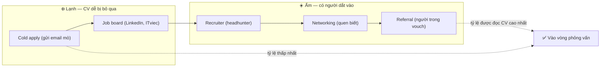
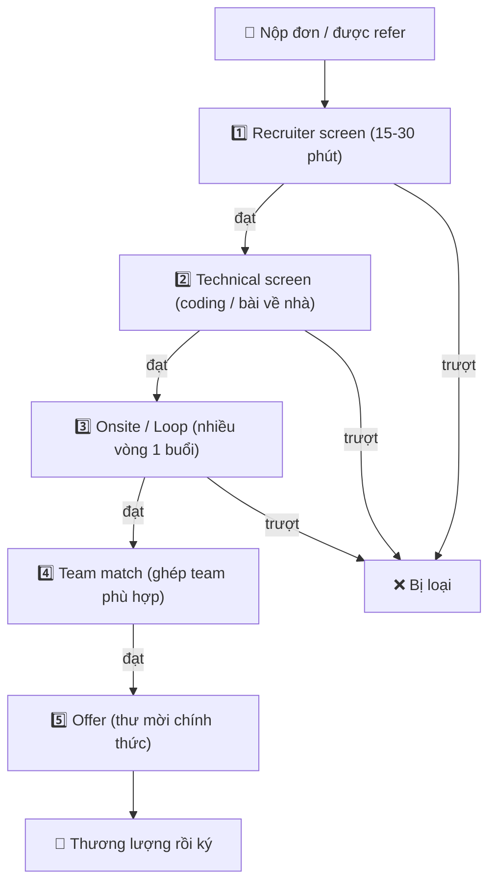
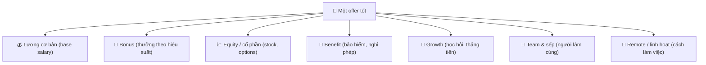

# 🎯 Tìm việc & Đánh giá offer — Từ apply đến nhận lời mời

> **Tác giả:** Mr.Rom\
> **Phiên bản:** v1.0.0\
> **Tạo lúc:** 13/06/2026\
> **Cập nhật:** 13/06/2026\
> **Level:** Basic\
> **Tags:** career, job-search, referral, interview-pipeline, offer, negotiation, red-flags, soft-skills\
> **Yêu cầu trước:** [CV & Portfolio cho dev](02_resume-and-portfolio.md)

> 🎯 *Bạn đã có skill, có portfolio, có CV vượt ATS. Giờ là lúc biến chúng thành một lời mời làm việc thật. Bài này dẫn bạn đi hết hành trình: chọn kênh tìm việc hiệu quả nhất (gợi ý: không phải job board), hiểu quy trình phỏng vấn điển hình để không bị bất ngờ, theo dõi pipeline như một dự án nhỏ, đọc một offer cho đúng (lương chỉ là một phần), và thương lượng một cách lịch sự để không bỏ lại tiền trên bàn. Kết bài bạn sẽ tự tin từ lúc nhấn "Apply" đến lúc ký hợp đồng.*

## 🎯 Sau bài này bạn sẽ

- [ ] Phân biệt 5 kênh tìm việc và biết vì sao **referral** mạnh nhất, **cold apply** yếu nhất
- [ ] Đọc được quy trình tuyển dụng điển hình (recruiter screen → technical screen → onsite/loop → team match → offer) và biết mỗi vòng người ta đánh giá gì
- [ ] Tự dựng một bảng theo dõi pipeline để không bao giờ "quên đã apply chỗ nào tới đâu"
- [ ] Đánh giá một offer trên 7 trục thay vì chỉ nhìn con số lương cơ bản
- [ ] Thương lượng (negotiate) một cách lịch sự, có cơ sở — kể cả khi không có competing offer
- [ ] Nhận diện red flags của công ty ngay từ vòng phỏng vấn, trước khi ký hợp đồng

---

## Tình huống — bạn vừa sẵn sàng đi xin việc

Sau nhiều tháng học và build, bạn đã có portfolio đàng hoàng, CV gọn gàng vượt được vòng quét ATS. Bạn mở một job board lên, thấy 200 tin tuyển dev, và bắt đầu... nộp tất cả.

Hai tuần sau, kết quả: 47 đơn đã nộp, 0 phản hồi. Bạn bắt đầu tự nghi ngờ skill của mình.

Nhưng vấn đề thường **không nằm ở skill**. Nó nằm ở 4 câu hỏi mà gần như mọi người mới đi xin việc đều bỏ qua:

- Mình đang đổ công sức vào **kênh tìm việc yếu nhất** mà không biết?
- Mình có hiểu **người ta sẽ phỏng vấn mình qua mấy vòng**, mỗi vòng để làm gì không?
- Mình có đang **theo dõi** 47 đơn đó một cách có hệ thống, hay nộp xong là quên?
- Lỡ may có offer thật — mình có biết **đánh giá nó** và **thương lượng** không, hay sẽ gật đầu vì sợ mất?

Tìm việc không phải trò may rủi "rải đơn càng nhiều càng tốt". Nó là một **quy trình có cấu trúc** — và khi bạn hiểu cấu trúc đó, tỷ lệ thành công tăng lên rõ rệt mà không cần giỏi code hơn. Bài này là bản đồ của quy trình đó.

---

## 1️⃣ Năm kênh tìm việc — và vì sao chúng KHÔNG ngang nhau

Câu hỏi đầu tiên không phải "apply chỗ nào", mà là "apply **bằng cách nào**". Cùng một công ty, cùng một CV, nhưng đi vào qua các cửa khác nhau thì tỷ lệ được đọc CV chênh nhau gấp nhiều lần.

**Trả lời tình huống trên**: bạn nộp 47 đơn qua job board mà im lặng, không phải vì CV tệ, mà vì job board là cửa đông người nhất và lạnh nhất. Một tin tuyển dev phổ biến có thể nhận hàng trăm tới hàng nghìn đơn — recruiter không thể đọc hết, nên CV của bạn rơi vào đống "chưa kịp xem".

🪞 **Ẩn dụ**: tìm việc giống như **xin vào một bữa tiệc kín**. Có nhiều cách vào:

- **Cold apply** — đứng xếp hàng trước cổng cùng vài trăm người lạ, hy vọng bảo vệ để ý tới mình.
- **Job board** — vẫn xếp hàng, nhưng có bảng hiệu chỉ rõ "tiệc nào đang mở cửa".
- **Recruiter** — có một người môi giới dắt bạn tới đúng bữa tiệc đang cần khách như bạn.
- **Networking** — bạn quen vài người bên trong, họ ra cửa vẫy bạn vào.
- **Referral** — một người bên trong đứng ra bảo lãnh: *"Đây là bạn tôi, để họ vào."* Bảo vệ tin ngay.

Cùng một người (là bạn), nhưng vào qua referral thì gần như chắc chắn được vào trong; vào qua cold apply thì phần lớn đứng ngoài cổng.

Sơ đồ dưới sắp 5 kênh theo trục "độ ấm" — càng ấm (có người quen vouch) thì CV của bạn càng dễ được người thật đọc.

→ Điều quan trọng cần nhớ: hướng đi đúng là **kéo mọi đơn về phía bên phải càng nhiều càng tốt**. Trước khi cold apply một công ty, hãy tự hỏi: "Mình có quen ai trong đó để xin referral không?" Chỉ cần chuyển được một phần số đơn từ cold sang referral, tỷ lệ phản hồi của bạn thay đổi hẳn.

### Bảng so sánh 5 kênh

Mỗi kênh có chỗ mạnh chỗ yếu riêng — không kênh nào nên bỏ hẳn, nhưng nên **phân bổ công sức** theo độ hiệu quả. Bảng dưới so sánh để bạn biết nên dồn sức vào đâu.

| Kênh | Độ hiệu quả | Công sức bỏ ra | Khi nào dùng |
|---|---|---|---|
| **Referral** (người trong giới thiệu) | ⭐ Cao nhất | Cao (phải build quan hệ trước) | Luôn ưu tiên — kể cả quen sơ cũng nên hỏi |
| **Networking** (chủ động quen biết) | Cao | Cao (đầu tư dài hạn) | Đi meetup, đóng góp open-source, kết nối senior |
| **Recruiter** (headhunter, in-house) | Trung bình - cao | Thấp (họ chủ động tìm bạn) | Khi đã có vài năm kinh nghiệm, hồ sơ "săn được" |
| **Job board** (LinkedIn, ITviec, TopDev) | Trung bình | Trung bình | Để biết thị trường + apply chỗ không có người quen |
| **Cold apply** (gửi email mò) | Thấp nhất | Trung bình | Công ty mơ ước mà không có cửa nào khác |

> [!TIP]
> Cách xin referral lịch sự khi quen sơ: đừng nhắn *"cho mình xin referral với"* cộc lốc. Hãy nhắn *"Mình đang ứng tuyển vị trí X ở công ty bạn. Mình gửi kèm CV + link portfolio, nếu thấy phù hợp bạn refer giúp mình nhé, còn không cũng hoàn toàn ổn — cảm ơn bạn nhiều."* Cho người ta đường lùi để họ thoải mái đồng ý.

### Vì sao referral mạnh đến vậy?

Referral không phải "đi cửa sau" hay "quan hệ". Nó mạnh vì giải quyết đúng nỗi đau lớn nhất của nhà tuyển dụng: **rủi ro tuyển nhầm**. Tuyển một người là một canh bạc tốn kém — phỏng vấn mất thời gian cả team, tuyển sai còn tốn hơn. Khi một nhân viên hiện tại bảo lãnh bạn, họ đang đặt uy tín cá nhân ra cược. Tín hiệu đó đáng giá hơn bất kỳ dòng nào trong CV:

- **Đa số công ty** có chương trình referral và **trả thưởng** cho nhân viên giới thiệu thành công → đồng nghiệp tương lai của bạn có động lực thật để vouch.
- CV qua referral thường được **đẩy thẳng tới hiring manager**, bỏ qua đống cold apply.
- Người refer thường kèm một câu *"tôi từng làm/học với bạn này, code chắc tay"* — đây là thứ ATS không bao giờ thấy được.

→ Bài học: **đầu tư xây quan hệ trước khi cần việc**, không phải lúc thất nghiệp mới đi quen người. Networking là referral của tương lai.

---

## 2️⃣ Quy trình tuyển dụng điển hình — bạn sẽ đi qua mấy vòng?

Sau khi CV lọt vào, bạn bước vào một chuỗi vòng phỏng vấn. Nhiều người mới hoảng vì nghĩ "phỏng vấn" là một buổi duy nhất — rồi bất ngờ khi recruiter nói "vòng tiếp theo sẽ là...". Hiểu trước cả pipeline giúp bạn chuẩn bị đúng thứ cho đúng vòng, và quan trọng là **không hoảng** khi nghe có nhiều vòng.

🪞 **Ẩn dụ**: quy trình tuyển dụng như một **chuỗi cửa ải qua nhiều phòng**. Mỗi phòng có một người gác cửa hỏi một loại câu hỏi khác nhau. Qua được phòng này mới mở được phòng sau. Nếu bạn biết trước phòng tiếp theo gác cửa hỏi gì, bạn chuẩn bị được đúng "chìa khoá".

Sơ đồ dưới là pipeline điển hình ở công ty tech tầm trung trở lên. Công ty nhỏ có thể gộp vài vòng làm một; công ty lớn có thể thêm vòng — nhưng bộ khung này gần như luôn đúng.

→ Điểm cần nhận ra: mỗi vòng **lọc một thứ khác nhau**, nên trượt một vòng không có nghĩa "bạn dở". Có thể bạn rất giỏi kỹ thuật nhưng trượt recruiter screen vì kỳ vọng lương lệch — đó là vấn đề thông tin, không phải năng lực. Giờ ta đi qua từng vòng.

### Vòng 1 — Recruiter screen

Đây là cuộc gọi đầu tiên, thường 15-30 phút với một recruiter (người tuyển dụng), **không phải kỹ sư**. Họ ít khi hỏi code. Mục tiêu của họ là sàng lọc nhanh:

- Bạn có **thật sự quan tâm** vị trí này không, hay rải đơn?
- **Kỳ vọng lương** của bạn có nằm trong ngân sách không?
- Bạn có đủ điều kiện cơ bản (visa/work permit, thời gian bắt đầu, on-site hay remote)?
- Giao tiếp của bạn có ổn không?

→ Vòng này trượt nhiều nhất vì lý do "ngớ ngẩn": lệch kỳ vọng lương, không trả lời được "vì sao công ty chúng tôi", hoặc trả lời lan man. Chuẩn bị một câu giới thiệu bản thân ngắn gọn và một con số lương khoảng (range) trước khi bốc máy.

### Vòng 2 — Technical screen

Bây giờ mới tới phần kỹ thuật, nhưng vẫn là **sàng lọc**, chưa phải đánh giá sâu. Thường có một trong hai dạng:

- **Live coding** — bạn giải một bài thuật toán/lập trình trong khi một kỹ sư nhìn (qua share màn hình).
- **Take-home assignment** — bài tập về nhà, bạn nộp code trong vài ngày.

Mục tiêu: lọc ra những người **không thể viết code hoạt động được**. Chưa cần bạn xuất sắc, chỉ cần bạn chứng minh viết được code chạy đúng và giải thích được suy nghĩ.

### Vòng 3 — Onsite / Loop

Đây là vòng nặng nhất: một chuỗi **nhiều buổi phỏng vấn liên tiếp** (thường 3-5 buổi trong một ngày, gọi là "loop"). "Onsite" là tên gọi cũ từ thời phải tới văn phòng; ngày nay nhiều công ty làm loop này qua video. Mỗi buổi do một người khác phụ trách, đánh giá một khía cạnh khác:

| Buổi trong loop | Đánh giá điều gì |
|---|---|
| Coding (1-2 buổi) | Giải bài khó hơn, sạch code, xử lý edge case |
| System design | Thiết kế hệ thống ở mức cao (thường cho mid+ trở lên) |
| Behavioral | Cách bạn làm việc nhóm, xử lý xung đột, kể lại dự án cũ |
| Hiring manager | Sự phù hợp với team, động lực, định hướng |

> [!NOTE]
> Kỹ năng làm tốt từng vòng phỏng vấn (giải coding, system design, behavioral) là một chủ đề lớn — nó được dạy sâu ở cụm **interview-prep** riêng. Bài này chỉ vẽ bản đồ pipeline để bạn biết toàn cảnh; phần "làm sao giải bài tốt" để dành cho cụm đó.

### Vòng 4 — Team match

Ở nhiều công ty (đặc biệt các công ty lớn), bạn qua loop là đã "đạt chuẩn công ty" — nhưng chưa được vào team nào cụ thể. **Team match** là bước ghép bạn với một team đang tuyển. Bạn có thể nói chuyện với 1-2 hiring manager để xem hợp gu không. Đây là cơ hội **hai chiều**: họ chọn bạn, nhưng bạn cũng được chọn team — đừng bỏ phí cơ hội hỏi về công việc thực tế của team đó.

### Vòng 5 — Offer

Bạn qua hết → recruiter gọi báo "chúng tôi muốn mời bạn". Họ sẽ gửi một **offer** (thư mời làm việc) ghi rõ lương, các khoản khác, ngày bắt đầu. **Đây chưa phải lúc gật đầu ngay** — đây là lúc đánh giá và thương lượng (mục 4 và 5). Một offer bằng lời (verbal offer) qua điện thoại nên được xác nhận lại bằng văn bản trước khi bạn quyết định.

---

## 3️⃣ Theo dõi pipeline — đừng để 47 đơn thành một mớ hỗn độn

Khi bạn ứng tuyển nhiều chỗ cùng lúc, mỗi chỗ lại đang ở một vòng khác nhau, trí nhớ sẽ phản bội bạn. Bạn sẽ quên đã hẹn phỏng vấn chỗ nào, quên gửi cảm ơn cho ai, quên follow-up công ty đã im lặng một tuần. Mỗi lần quên là một cơ hội rơi.

🪞 **Ẩn dụ**: quản lý việc xin việc giống như **một người bán hàng quản lý khách hàng**. Người bán giỏi không nhớ khách trong đầu — họ có một bảng ghi rõ ai đang ở giai đoạn nào, lần liên hệ cuối khi nào, bước tiếp theo là gì. Bạn cũng nên coi mỗi công ty như một "khách hàng" trong pipeline của mình.

Giải pháp đơn giản nhất là một bảng tính (Google Sheets / Notion / Excel). Dưới đây là cấu trúc cột tối thiểu nên có — bạn copy vào bảng tính của mình là dùng được ngay.

| Công ty | Vị trí | Kênh vào | Vòng hiện tại | Ngày liên hệ cuối | Bước tiếp theo | Ghi chú |
|---|---|---|---|---|---|---|
| Công ty A | Backend Junior | Referral (bạn B) | Technical screen | 12/06 | Nộp take-home trước 15/06 | Recruiter dễ chịu, team thân thiện |
| Công ty B | Fullstack | Job board | Recruiter screen | 10/06 | Follow-up nếu 17/06 chưa có | Lệch kỳ vọng lương, cần làm rõ |
| Công ty C | Backend | Cold apply | Đã nộp | 05/06 | Im lặng — coi như trượt | Không quen ai trong đó |

→ Phân tích nhanh từ bảng trên: chỉ cần nhìn một cái là biết cần làm gì hôm nay (nộp take-home cho A, follow-up B), chỗ nào nên buông (C). Không còn cảnh "không nhớ đã tới đâu". Cập nhật bảng này **ngay sau mỗi tương tác**, không để dồn.

Vài cột tuỳ chọn rất hữu ích khi bạn tiến xa hơn:

- **Mức lương trao đổi** — ghi lại con số đã nói với recruiter để không "tự mâu thuẫn" giữa các vòng.
- **Người liên hệ** — tên + cách liên lạc của recruiter/hiring manager, để follow-up đúng người.
- **Mức ưu tiên** — bạn thật sự muốn chỗ này tới đâu (cao/vừa/thấp), giúp bạn biết dồn sức vào đâu khi có nhiều offer.

> [!TIP]
> Đặt một quy tắc follow-up: nếu một công ty im lặng quá 7-10 ngày sau vòng gần nhất, gửi một email lịch sự hỏi thăm tiến độ. Im lặng không phải lúc nào cũng là "trượt" — đôi khi recruiter chỉ đang bận, và một email nhắc nhẹ kéo bạn lại vào tầm ngắm.

---

## 4️⃣ Đánh giá offer — lương chỉ là một mảnh ghép

Có offer rồi, nhưng "offer tốt" không đồng nghĩa "lương cao nhất". Một offer lương cao ở một công ty độc hại, không học được gì, sếp tệ — sẽ khiến bạn nghỉ sau vài tháng và mất cả thời gian lẫn động lực. Đánh giá offer cho đúng là nhìn nó trên **nhiều trục**.

🪞 **Ẩn dụ**: đánh giá offer như **chọn nhà để ở**, không chỉ nhìn giá thuê. Giá thuê (lương cơ bản) quan trọng, nhưng còn vị trí (team), hàng xóm (đồng nghiệp), khả năng sửa sang nâng cấp (growth), được làm việc từ xa hay phải tới chỗ (remote)... Một căn rẻ mà ngập nước mỗi mùa mưa thì rẻ cũng không đáng.

7 trục dưới đây là khung để bạn chấm điểm mỗi offer. Đừng chỉ đọc lướt — hãy thật sự cho điểm từng trục.

→ Nhìn sơ đồ, bạn sẽ thấy nếu chỉ tối ưu một nhánh (lương cơ bản) mà bỏ 6 nhánh kia, bạn đang đánh giá offer bằng một con mắt. Giờ ta giải nghĩa từng trục.

### Bảng so sánh offer — chấm điểm thực tế

Cách dùng tốt nhất khi bạn có nhiều offer: kẻ một bảng đặt chúng cạnh nhau, cho điểm mỗi trục. Bảng dưới là một ví dụ cách bạn so 3 offer giả định — hãy tự điền số liệu thật của bạn vào.

| Trục đánh giá | Offer A | Offer B | Offer C |
|---|---|---|---|
| **Lương cơ bản** (base) — tiền cố định hằng tháng | 35M/tháng | 30M/tháng | 40M/tháng |
| **Bonus** — thưởng thêm theo hiệu suất, thường không chắc chắn | 1 tháng lương/năm | 3 tháng lương/năm | Không có |
| **Equity / cổ phần** — sở hữu công ty, có giá nếu công ty lớn lên | Không | Có (startup, rủi ro) | Không |
| **Benefit** — bảo hiểm, nghỉ phép, ngày nghỉ ốm, học phí | Tốt (BH cao cấp, 15 ngày phép) | Cơ bản | Trung bình (12 ngày phép) |
| **Growth** — học được gì, có mentor không, có lộ trình lên không | Cao (team senior, mentor rõ) | Rất cao (làm nhiều mảng) | Thấp (việc lặp lại) |
| **Team & sếp** — cảm nhận qua phỏng vấn | Thân thiện, sếp rõ ràng | Chưa rõ | Hơi lạnh |
| **Remote / linh hoạt** | Hybrid 3 ngày/tuần | Full remote | On-site 100% |

→ Phân tích: thoạt nhìn Offer C lương cao nhất (40M) trông "thắng". Nhưng nhìn cả bảng: C không bonus, không equity, growth thấp, team lạnh, bắt lên văn phòng mỗi ngày. Offer A lương thấp hơn 5M nhưng growth cao, benefit tốt, sếp rõ ràng — về dài hạn A có thể là lựa chọn khôn ngoan hơn nhiều. Đây chính là lý do **không bao giờ so offer chỉ bằng một con số**.

### Giải nghĩa các khoản hay gây nhầm lẫn

Ba khoản dưới đây người mới hay hiểu sai nhất — hiểu đúng để không bị "lóa mắt" bởi con số to:

- **Bonus** (thưởng) — thường là *biến số*, không chắc chắn. "Thưởng tới 3 tháng lương" nghĩa là *tối đa*, thực tế có thể ít hơn nếu công ty/bạn không đạt mục tiêu. Đừng tính bonus như lương cố định.
- **Equity / cổ phần** (stock, options) — phần sở hữu công ty. Ở startup, equity có thể thành rất nhiều tiền nếu công ty thành công, hoặc **bằng 0** nếu công ty thất bại. Đây là khoản rủi ro cao — đừng đánh đổi quá nhiều lương cơ bản chắc chắn để lấy equity mơ hồ, nhất là khi bạn còn mới.
- **Total compensation** (tổng đãi ngộ) — cụm bạn sẽ nghe nhiều: nó là *tổng* của lương cơ bản + bonus + equity quy đổi/năm. Khi so offer, hãy so total comp, nhưng nhớ "chiết khấu" phần bonus/equity không chắc chắn về giá trị thực tế.

> [!IMPORTANT]
> Quy tắc an toàn cho người mới: ưu tiên **lương cơ bản chắc chắn** + **growth** (học được nhiều, có mentor) hơn là bonus/equity hào nhoáng. Ở những năm đầu sự nghiệp, thứ làm bạn giàu nhanh nhất không phải cổ phần một startup may rủi, mà là **năng lực tăng lên** giúp bạn nhảy lên mức lương cao hơn ở lần đổi việc sau.

---

## 5️⃣ Negotiation — vì sao nên thương lượng và làm sao cho lịch sự

Đây là phần nhiều người sợ nhất và bỏ qua nhiều nhất. Bạn vừa được mời, sợ "đòi hỏi" sẽ làm mất offer, nên gật đầu ngay với con số đầu tiên. Đó thường là một sai lầm tốn kém.

### Vì sao nên thương lượng

- **Offer đầu thường không phải con số cao nhất họ sẵn sàng trả.** Công ty thường chừa biên độ để thương lượng. Không hỏi = để lại tiền trên bàn.
- **Họ đã chọn bạn rồi.** Tới bước offer nghĩa là họ đã đầu tư nhiều buổi phỏng vấn và muốn bạn vào. Một câu thương lượng lịch sự gần như **không bao giờ** làm họ rút offer — rút lại sẽ lãng phí toàn bộ công sức tuyển của họ.
- **Chênh lệch cộng dồn theo thời gian.** Lương khởi điểm cao hơn một chút sẽ là nền cho mọi lần tăng lương và mọi offer tương lai. Khoản chênh nhỏ hôm nay lớn dần qua nhiều năm.

🪞 **Ẩn dụ**: thương lượng không phải "đôi co ngoài chợ". Nó giống **chốt điều khoản hợp tác giữa hai bên đều muốn cộng tác** — cả hai đã thích nhau, giờ chỉ tinh chỉnh để cả hai cùng thấy công bằng. Giọng điệu là *cộng tác*, không phải *đối đầu*.

### Cách thương lượng lịch sự — khung 4 bước

Một lời thương lượng tốt luôn gồm 4 phần: cảm ơn, thể hiện hào hứng, đưa con số có cơ sở, để cửa mở. Dưới đây là khung kèm một câu mẫu bạn có thể nói/viết — chỉnh lại cho giọng của bạn.

1. **Cảm ơn + thể hiện hào hứng** — đặt tông tích cực trước.
2. **Đưa ra con số mong muốn + lý do** — dựa trên dữ liệu thị trường hoặc giá trị bạn mang lại, không phải "vì tôi cần tiền".
3. **Hỏi mở** — đừng ra tối hậu thư, hãy hỏi xem có dư địa không.
4. **Khẳng định vẫn muốn vào** — dù kết quả thế nào.

Câu mẫu (email hoặc nói qua điện thoại):

> *"Cảm ơn anh/chị rất nhiều vì lời mời — em thật sự hào hứng với cơ hội làm việc cùng team. Em có tìm hiểu mức thị trường cho vị trí này và dựa trên kinh nghiệm + portfolio của em, em mong mức base ở khoảng [con số]. Không biết bên mình có dư địa để điều chỉnh không ạ? Dù sao em cũng rất mong được gia nhập team."*

→ Để ý: câu này **không ra điều kiện cứng**, không so sánh kiểu trịch thượng, luôn mở đường cho đối phương. Đó là cách thương lượng mà gần như không có rủi ro làm hỏng quan hệ.

### Competing offer — đòn bẩy mạnh nhất (nếu có)

Nếu bạn may mắn có **competing offer** (một offer khác đang cạnh tranh), đây là đòn bẩy mạnh và trung thực nhất. Nó cho công ty biết bạn có lựa chọn khác, nên họ có động lực thật để nâng giá. Cách dùng vẫn phải lịch sự:

> *"Em rất muốn vào team mình. Thành thật chia sẻ là em đang có một offer khác ở mức [con số]. Nếu bên mình có thể cân nhắc điều chỉnh cho gần hơn, em sẽ chọn bên mình ngay."*

> [!WARNING]
> Tuyệt đối **không bịa competing offer**. Một số recruiter sẽ hỏi chi tiết hoặc thậm chí xin xác nhận; bị bắt nói dối sẽ phá huỷ toàn bộ niềm tin và có thể mất offer. Nếu không có competing offer thật, hãy thương lượng bằng giá trị bản thân + dữ liệu thị trường — vẫn hiệu quả mà không rủi ro.

### Có thể thương lượng cả thứ ngoài lương

Khi công ty không nâng được lương cơ bản (vì khung cứng), bạn vẫn có thể thương lượng các khoản khác — đôi khi còn dễ được đồng ý hơn: **signing bonus** (thưởng ký hợp đồng một lần), thêm ngày nghỉ phép, ngày bắt đầu linh hoạt, ngân sách học tập/thiết bị, hoặc số ngày remote. Hãy hỏi: *"Nếu base khó điều chỉnh, mình có thể trao đổi về [khoản khác] không ạ?"*

---

## 6️⃣ Red flags — nhận diện công ty nên tránh ngay từ phỏng vấn

Phỏng vấn là cuộc đánh giá **hai chiều**: họ xem bạn có hợp không, và bạn cũng phải xem công ty có đáng vào không. Một offer hấp dẫn của một công ty độc hại là một cái bẫy đắt giá. May mắn là phần lớn vấn đề **lộ ra ngay từ vòng phỏng vấn** nếu bạn để ý.

🪞 **Ẩn dụ**: phỏng vấn ngược lại cũng giống **đi xem nhà trước khi thuê**. Chủ nhà tô vẽ là chuyện thường, nhưng vết nứt trên tường, mùi ẩm mốc, hàng xóm ồn ào — đều có dấu hiệu nếu bạn chịu quan sát. Đừng chỉ trả lời câu hỏi; hãy quan sát.

Bảng dưới liệt kê các red flag thường gặp + dấu hiệu nhận biết. Gặp một dấu hiệu chưa chắc đã xấu; gặp nhiều dấu hiệu cùng lúc thì nên dè chừng.

| 🚩 Red flag | Dấu hiệu nhận biết trong phỏng vấn |
|---|---|
| **Văn hoá làm quá giờ (overwork)** | Người phỏng vấn khoe "ở đây mọi người rất nhiệt huyết, làm tới khuya", "như một gia đình" |
| **Tỷ lệ nghỉ việc cao (high turnover)** | Cả team toàn người mới, không ai làm trên 1-2 năm; hỏi "vì sao vị trí này trống" mà trả lời lảng tránh |
| **Quy trình mập mờ** | Hỏi về công việc thực tế hằng ngày mà câu trả lời chung chung, mỗi người nói một kiểu |
| **Không tôn trọng thời gian ứng viên** | Lịch phỏng vấn dời liên tục, để bạn chờ lâu, recruiter không phản hồi nhiều ngày |
| **Lương mập mờ / né tránh** | Né nói khoảng lương tới phút chót, hoặc nói "lương cạnh tranh" mà không có con số |
| **Sếp/đồng nghiệp thiếu tôn trọng** | Người phỏng vấn ngắt lời, coi thường câu hỏi của bạn, hoặc nói xấu nhân viên cũ |
| **Không có lộ trình phát triển** | Hỏi "vị trí này lên được tới đâu" mà không ai trả lời rõ |

> [!CAUTION]
> Red flag nguy hiểm nhất là khi bạn **cảm thấy bị thiếu tôn trọng ngay trong vòng phỏng vấn** — vì đây là lúc công ty đang "tỏ ra dễ thương nhất" để chiêu mộ bạn. Nếu họ đã tệ ngay từ lúc tán tỉnh, thực tế lúc bạn vào làm gần như chắc chắn sẽ tệ hơn. Đừng để mức lương hấp dẫn che mất tín hiệu này.

### Câu hỏi bạn nên hỏi ngược lại

Cách tốt nhất để phát hiện red flag là **bạn chủ động hỏi**. Cuối mỗi buổi phỏng vấn luôn có phần "bạn có câu hỏi gì không?" — đừng bỏ phí. Vài câu hỏi sắc bén:

- *"Một ngày làm việc điển hình ở vị trí này như thế nào ạ?"* → đo độ rõ ràng của công việc.
- *"Người làm vị trí này trước đó giờ ra sao? Vì sao vị trí này trống?"* → dò turnover.
- *"Team thường tan làm lúc mấy giờ?"* → dò văn hoá overwork một cách lịch sự.
- *"Lộ trình phát triển cho vị trí này trong 1-2 năm tới là gì ạ?"* → đo cơ hội growth.
- *"Anh/chị thích điều gì nhất và thấy thử thách nhất khi làm ở đây?"* → câu này khiến người phỏng vấn nói thật, lộ ra nhiều thông tin.

→ Người phỏng vấn trả lời các câu này một cách thẳng thắn, cụ thể, thoải mái = tín hiệu tốt. Trả lời lảng tránh, gượng gạo = đáng để bạn suy nghĩ lại.

---

## 💡 Cạm bẫy thường gặp & Best practice

### ❌ Cạm bẫy: chỉ cold apply qua job board và chờ

- **Triệu chứng**: nộp hàng chục, hàng trăm đơn qua job board, gần như không có phản hồi, càng ngày càng nản và nghi ngờ skill.
- **Nguyên nhân**: dồn toàn bộ công sức vào kênh lạnh nhất, nơi CV cạnh tranh với hàng trăm người khác và dễ bị bỏ qua.
- **Cách tránh**: với mỗi công ty muốn vào, tìm xem có quen ai bên trong không để xin referral; đầu tư networking dài hạn (meetup, open-source, LinkedIn). Chuyển trọng tâm từ "rải nhiều" sang "vào ấm".

### ❌ Cạm bẫy: gật đầu ngay với offer đầu vì sợ mất

- **Triệu chứng**: nhận offer là ký liền, không đánh giá đủ trục, không thương lượng, sau vài tháng mới nhận ra lương thấp hơn thị trường hoặc công ty độc hại.
- **Nguyên nhân**: sợ "đòi hỏi" làm mất cơ hội, và không có khung để đánh giá offer cho đúng.
- **Cách tránh**: xin vài ngày để cân nhắc (chuyện hoàn toàn bình thường), đánh giá trên 7 trục, và thương lượng lịch sự ít nhất một lần. Họ đã chọn bạn — một câu hỏi lịch sự gần như không bao giờ làm hỏng offer.

### ✅ Best practice: coi việc tìm việc như một dự án có pipeline

- **Vì sao**: tìm việc nhiều chỗ song song là việc dễ rối; quên một bước follow-up là mất một cơ hội thật. Quản lý có hệ thống biến may rủi thành quy trình.
- **Cách áp dụng**: dựng một bảng theo dõi pipeline (công ty, vòng hiện tại, bước tiếp theo), cập nhật ngay sau mỗi tương tác, đặt quy tắc follow-up sau 7-10 ngày im lặng. Mỗi sáng nhìn bảng là biết hôm nay cần làm gì.

### ✅ Best practice: phỏng vấn ngược lại công ty

- **Vì sao**: bạn sẽ dành phần lớn thời gian thức của mình ở chỗ làm; chọn sai công ty còn tốn hơn chọn sai mức lương. Phỏng vấn là cơ hội thu thập thông tin trước khi cam kết.
- **Cách áp dụng**: chuẩn bị sẵn 3-5 câu hỏi ngược (về công việc hằng ngày, văn hoá, growth, turnover) cho mỗi buổi, và chủ động quan sát cách họ đối xử với bạn trong suốt quy trình.

---

## 🧠 Tự kiểm tra (Self-check)

**Q1.** Bạn rất muốn vào một công ty mơ ước nhưng không quen ai bên trong. Theo thứ tự ưu tiên, bạn nên thử các kênh nào trước khi cold apply?

💡 Xem giải thích

Thứ tự nên là: trước hết **tìm referral gián tiếp** — kiểm tra LinkedIn/cộng đồng xem có quen ai biết người trong công ty không, hoặc tham gia sự kiện/cộng đồng nơi nhân viên công ty đó xuất hiện (networking). Nếu thật sự không có cửa nào, mới **cold apply** — nhưng kèm một email/cover letter cá nhân hoá thật tốt cho riêng công ty đó. Cold apply là phương án cuối, không phải phương án đầu. Mục tiêu luôn là kéo đơn về phía "ấm" nhất có thể.

**Q2.** Bạn vừa qua "recruiter screen" và recruiter nói "vòng tiếp theo là technical screen". Hai vòng này khác nhau ở đâu, người ta đánh giá gì ở mỗi vòng?

💡 Xem giải thích

**Recruiter screen** do một recruiter (không phải kỹ sư) thực hiện, thường 15-30 phút, ít khi hỏi code. Họ sàng lọc: bạn có thật sự quan tâm vị trí, kỳ vọng lương có khớp ngân sách, điều kiện cơ bản (thời gian bắt đầu, remote/on-site), và giao tiếp có ổn không. **Technical screen** do một kỹ sư thực hiện, là vòng kỹ thuật đầu tiên (live coding hoặc bài tập về nhà), nhằm lọc ra ai không viết được code hoạt động. Tóm lại: vòng 1 lọc "phù hợp & nghiêm túc", vòng 2 lọc "biết code thật".

**Q3.** Bạn có 2 offer. Offer A: base 40M, không bonus, không equity, growth thấp, team lạnh, on-site 100%. Offer B: base 33M, bonus 2 tháng/năm, growth cao (mentor rõ), team thân thiện, hybrid. Bạn là người mới đi làm 1 năm. Nên cân nhắc thế nào?

💡 Xem giải thích

Không có đáp án "đúng tuyệt đối", nhưng với một người mới 1 năm kinh nghiệm, **Offer B thường là lựa chọn khôn ngoan hơn** dù base thấp hơn 7M. Lý do: ở những năm đầu, thứ làm bạn giàu nhanh nhất là **năng lực tăng lên** — Offer B có growth cao và mentor rõ, nghĩa là sau 1-2 năm bạn sẽ giỏi hơn nhiều và nhảy lên mức lương cao hơn hẳn. Cộng thêm bonus, team tốt, hybrid linh hoạt. Offer A lương cao hơn chút nhưng growth thấp + team lạnh + on-site 100% có nguy cơ khiến bạn chững lại và burnout. Bài học: đừng so offer chỉ bằng base; với người mới, ưu tiên growth.

**Q4.** Bạn nhận offer ưng ý nhưng muốn lương cao hơn một chút. Bạn KHÔNG có competing offer. Có nên thương lượng không, và nói thế nào?

💡 Xem giải thích

**Vẫn nên thương lượng.** Không cần competing offer mới được thương lượng — bạn có thể dựa trên dữ liệu thị trường và giá trị bản thân (kinh nghiệm, portfolio). Cách nói lịch sự theo khung 4 bước: cảm ơn + hào hứng → đưa con số mong muốn kèm lý do (mức thị trường) → hỏi mở "bên mình có dư địa điều chỉnh không ạ" → khẳng định vẫn rất muốn vào. Tuyệt đối **không bịa** competing offer. Nếu base khó điều chỉnh, có thể chuyển sang thương lượng signing bonus, thêm ngày phép, hoặc số ngày remote. Họ đã chọn bạn rồi — một câu hỏi lịch sự gần như không bao giờ làm mất offer.

**Q5.** Trong một buổi phỏng vấn, người phỏng vấn nhiều lần nhấn mạnh "ở đây như một gia đình, mọi người rất nhiệt huyết và sẵn sàng làm tới khuya". Đây là tín hiệu gì?

💡 Xem giải thích

Đây là một **red flag tiềm năng về văn hoá overwork** (làm quá giờ). Cụm "như một gia đình" + "làm tới khuya" thường là cách tô hồng việc làm thêm giờ không lương thành "nhiệt huyết". Một dấu hiệu chưa chắc chắn xấu, nhưng đáng để hỏi ngược lại lịch sự, ví dụ "Team thường tan làm lúc mấy giờ ạ?" hoặc "Một ngày làm việc điển hình thế nào ạ?" để xác nhận. Nếu kết hợp với các dấu hiệu khác (turnover cao, lương mập mờ) thì nên dè chừng nghiêm túc.

---

## ⚡ Tra cứu nhanh (Cheatsheet)

**Thứ tự ưu tiên kênh tìm việc (mạnh → yếu):**

| Hạng | Kênh | Ghi nhớ |
|---|---|---|
| 1 | Referral | Người trong vouch — luôn ưu tiên |
| 2 | Networking | Referral của tương lai — đầu tư sớm |
| 3 | Recruiter | Họ tìm bạn — hữu ích khi đã có kinh nghiệm |
| 4 | Job board | Biết thị trường + apply chỗ không quen ai |
| 5 | Cold apply | Phương án cuối, cá nhân hoá thật kỹ |

**Pipeline phỏng vấn điển hình:**

| Vòng | Ai phụ trách | Lọc gì |
|---|---|---|
| Recruiter screen | Recruiter | Nghiêm túc + lương khớp + điều kiện cơ bản |
| Technical screen | Kỹ sư | Viết được code hoạt động |
| Onsite / Loop | Nhiều kỹ sư | Coding sâu + design + behavioral + fit |
| Team match | Hiring manager | Ghép với team phù hợp |
| Offer | Recruiter | Đãi ngộ chính thức → thương lượng |

**7 trục đánh giá offer:** base · bonus · equity · benefit · growth · team & sếp · remote/linh hoạt.

**Khung thương lượng 4 bước:** cảm ơn + hào hứng → con số + lý do → hỏi mở → khẳng định muốn vào.

**Red flags cần để ý:** overwork ("như gia đình") · turnover cao · quy trình mập mờ · né nói lương · thiếu tôn trọng ứng viên · không có lộ trình phát triển.

**5 câu hỏi nên hỏi ngược:** một ngày điển hình? · vì sao vị trí trống? · team tan làm mấy giờ? · lộ trình 1-2 năm? · anh/chị thích & thấy khó nhất điều gì?

---

## 📚 Từ Điển Thuật Ngữ (Glossary)

| EN | VN | Giải thích |
|---|---|---|
| Referral | Giới thiệu nội bộ | Người đang làm trong công ty bảo lãnh/giới thiệu bạn ứng tuyển |
| Networking | Xây dựng quan hệ | Chủ động kết nối với người trong ngành để có cơ hội về sau |
| Recruiter | Người tuyển dụng | Người lo quy trình tuyển; có thể là in-house hoặc headhunter |
| Cold apply | Nộp đơn mò | Gửi đơn tới công ty mà không quen ai bên trong |
| Job board | Trang đăng tuyển | Nền tảng đăng tin việc làm (LinkedIn, ITviec, TopDev...) |
| ATS | Hệ thống lọc hồ sơ | Phần mềm tự động quét/lọc CV trước khi tới mắt người thật |
| Recruiter screen | Vòng sàng lọc sơ bộ | Cuộc gọi đầu với recruiter, lọc mức độ phù hợp & nghiêm túc |
| Technical screen | Vòng kỹ thuật sơ bộ | Vòng coding/bài tập đầu tiên, lọc người không viết được code |
| Live coding | Code trực tiếp | Giải bài lập trình ngay trong lúc người phỏng vấn theo dõi |
| Take-home assignment | Bài tập về nhà | Bài lập trình làm tại nhà rồi nộp lại trong vài ngày |
| Onsite / Loop | Chuỗi phỏng vấn chính | Nhiều buổi phỏng vấn liên tiếp, mỗi buổi đánh giá một khía cạnh |
| System design | Thiết kế hệ thống | Vòng đánh giá khả năng thiết kế hệ thống ở mức cao |
| Behavioral | Phỏng vấn hành vi | Vòng hỏi về cách làm việc nhóm, xử lý tình huống thực tế |
| Hiring manager | Quản lý tuyển dụng | Người sẽ là sếp trực tiếp, ra quyết định tuyển cuối cùng |
| Team match | Ghép team | Bước ghép ứng viên đã đạt chuẩn với một team cụ thể |
| Offer | Thư mời làm việc | Đề nghị chính thức kèm lương & điều khoản |
| Verbal offer | Offer bằng lời | Lời mời nói miệng/qua điện thoại, nên xác nhận lại bằng văn bản |
| Base salary | Lương cơ bản | Phần lương cố định, chắc chắn nhận hằng tháng/năm |
| Bonus | Thưởng | Khoản thêm theo hiệu suất, thường không chắc chắn |
| Equity | Cổ phần | Phần sở hữu công ty (stock/options), giá trị tuỳ công ty lớn lên hay không |
| Benefit | Phúc lợi | Bảo hiểm, nghỉ phép, học phí, thiết bị... ngoài lương |
| Total compensation | Tổng đãi ngộ | Tổng base + bonus + equity quy đổi theo năm |
| Signing bonus | Thưởng ký hợp đồng | Khoản thưởng một lần khi nhận việc |
| Negotiation | Thương lượng | Trao đổi để điều chỉnh đãi ngộ trước khi ký |
| Competing offer | Offer cạnh tranh | Một offer khác đang có, dùng làm đòn bẩy thương lượng |
| Red flag | Cờ đỏ cảnh báo | Dấu hiệu cho thấy công ty/môi trường có vấn đề |
| Turnover | Tỷ lệ nghỉ việc | Mức độ nhân viên rời công ty; cao = đáng lo ngại |
| Overwork | Làm quá sức | Văn hoá làm thêm giờ quá mức, thường không lương |
| Follow-up | Theo dõi nhắc lại | Liên hệ lại sau một thời gian im lặng để giữ tiến độ |
| Pipeline | Luồng tiến trình | Tập hợp các đơn ứng tuyển đang ở các giai đoạn khác nhau |

---

## 🔗 Liên kết & Tài nguyên

⬅️ **Bài trước:** [CV & Portfolio cho dev — Vượt ATS, gây ấn tượng 6 giây](02_resume-and-portfolio.md)\
➡️ **Bài tiếp theo:** [Phát triển & Thăng tiến — Lên level và biết khi nào đổi việc](04_growth-and-leveling-up.md)\
↑ **Về cụm:** [career-path — README](../../README.md)

### 🧭 Định hướng lộ trình học

- [CV & Portfolio cho dev — Vượt ATS, gây ấn tượng 6 giây](02_resume-and-portfolio.md) — chuẩn bị "vũ khí" trước khi vào pipeline tìm việc
- [Phát triển & Thăng tiến — Lên level và biết khi nào đổi việc](04_growth-and-leveling-up.md) — sau khi đã vào việc, cách lên level và biết khi nào lại đi tìm offer mới

### 🧩 Các chủ đề có thể bạn quan tâm

- [Sự nghiệp trong ngành tech là gì? — Bản đồ vai trò & nấc thang](00_what-is-a-tech-career.md) — hiểu level & track để đặt kỳ vọng lương cho đúng
- [Kỹ năng & Lộ trình học cá nhân — Thoát khỏi tutorial hell](01_skills-and-learning-roadmap.md) — biến thời gian "growth" trong offer thành kế hoạch học cụ thể

### 🌐 Tài nguyên tham khảo khác

- [levels.fyi](https://www.levels.fyi) — dữ liệu lương theo level & công ty, dùng để chuẩn bị con số khi thương lượng
- [Haseeb Qureshi — "Ten Rules for Negotiating a Job Offer"](https://haseebq.com/my-ten-rules-for-negotiating-a-job-offer/) — bài viết kinh điển, rất chi tiết về cách thương lượng offer dev
- [ITviec](https://itviec.com) · [TopDev](https://topdev.vn) — hai job board lớn cho thị trường dev Việt Nam, tham khảo tin tuyển + khoảng lương

---

## 📌 Nhật ký thay đổi (Changelog)

- **v1.0.0 (13/06/2026)** — Bản đầu tiên. 5 kênh tìm việc xếp theo độ ấm có sơ đồ (referral mạnh nhất, cold apply yếu nhất) + giải thích vì sao referral mạnh + pipeline phỏng vấn 5 vòng có sơ đồ (recruiter screen → technical screen → onsite/loop → team match → offer) với phân tích từng vòng + template bảng theo dõi pipeline + 7 trục đánh giá offer có sơ đồ + bảng so sánh 3 offer + giải nghĩa bonus/equity/total comp + negotiation khung 4 bước + câu mẫu + competing offer + thương lượng ngoài lương + 7 red flags công ty + 5 câu hỏi hỏi ngược + 2 cạm bẫy + 2 best practice + 5 self-check + cheatsheet + glossary 30 thuật ngữ.
