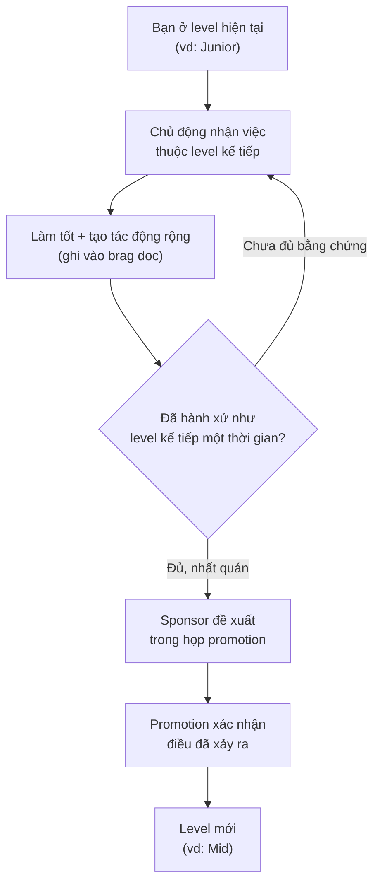

# 📈 Phát triển & Thăng tiến — Lên level và biết khi nào đổi việc

> **Tác giả:** Mr.Rom\
> **Phiên bản:** v1.0.0\
> **Tạo lúc:** 13/06/2026\
> **Cập nhật:** 13/06/2026\
> **Level:** Basic\
> **Tags:** career, growth, promotion, feedback, mentorship, performance-review, burnout, retention\
> **Yêu cầu trước:** [Tìm việc & Đánh giá offer](03_job-search-and-offer.md)

> 🎯 *Bài trước bạn đã nhận việc và ký offer. Nhưng nhận việc không phải đích đến — nó là vạch xuất phát. Bài này dạy bạn cách **lớn lên trong công việc**: xin và nhận feedback đúng cách, dùng 1:1 với sếp hiệu quả, tìm mentor, sống sót qua performance review, và quan trọng nhất — hiểu cơ chế promotion để được lên level đúng lúc. Cuối cùng, bạn sẽ biết đọc các tín hiệu "nên ở hay nên đi" để không mắc kẹt ở một chỗ hết growth, lương lệch thị trường, hay môi trường độc hại.*

## 🎯 Sau bài này bạn sẽ

- [ ] Biết cách **xin feedback** chủ động và **nhận feedback** mà không thủ thế
- [ ] Chạy được một buổi **1:1** với quản lý có chất lượng (không biến nó thành báo cáo trạng thái)
- [ ] Phân biệt vai trò **mentor / sponsor / manager** và biết cách làm một mentee tốt
- [ ] Hiểu **performance review** hoạt động ra sao và chuẩn bị nó bằng **brag document**
- [ ] Nắm nguyên tắc promotion: **làm việc ở level kế tiếp trước khi được promote**
- [ ] Đọc được bảng tín hiệu **nên ở lại / nên đổi việc** và phân biệt với burnout
- [ ] Nhận diện sớm dấu hiệu **burnout** và biết các cách phòng tránh cơ bản

---

## Tình huống — Một năm sau, bạn vẫn ở vạch xuất phát

Bạn vào công ty với rất nhiều năng lượng. Năm đầu bạn cắm đầu code, nhận task nào làm task đó, không phàn nàn, không hỏi nhiều. Bạn nghĩ "cứ làm tốt rồi tự khắc được công nhận".

Một năm trôi qua. Đến kỳ review, bạn ngồi đối diện sếp và nghe một câu khiến bạn hụt hẫng:

> *"Em làm tốt, ổn định. Nhưng để lên Mid thì anh cần thấy em chủ động hơn, dẫn dắt vài việc, có ảnh hưởng ngoài task được giao. Năm tới cố gắng nhé."*

Bạn ngơ ngác. "Chủ động hơn" là sao? "Ảnh hưởng" là gì? Cả năm có ai nói cho bạn biết đâu. Trong khi đó, một bạn vào cùng đợt — code không giỏi hơn bạn — lại vừa được lên Mid. Bạn ấy làm gì khác?

Sự khác biệt không nằm ở việc "code chăm hơn". Nó nằm ở chỗ: bạn ấy **hiểu trò chơi phát triển sự nghiệp** — xin feedback liên tục để biết mình thiếu gì, dùng 1:1 để lái hướng, ghi lại thành quả, và **chủ động làm việc ở level cao hơn** trước khi đòi được công nhận. "Làm tốt rồi tự khắc được thưởng" là một huyền thoại đẹp nhưng sai. Bài này dạy bạn cách chơi đúng trò chơi đó — một cách tử tế, không thủ đoạn.

---

## 1️⃣ Feedback — nhiên liệu của phát triển

Lý do số một khiến người mới giậm chân tại chỗ không phải vì kém — mà vì họ **không biết mình thiếu gì**. Họ làm việc trong một "vùng mù": cứ tưởng mình ổn, đến lúc review mới biết sếp kỳ vọng khác. Feedback chính là thứ xoá vùng mù đó.

🪞 **Ẩn dụ**: feedback giống **gương chiếu hậu của xe**. Bạn lái xe chỉ nhìn phía trước (việc mình đang làm) thì luôn có điểm mù hai bên — nơi tai nạn xảy ra. Gương chiếu hậu cho bạn thấy thứ bản thân không tự thấy. Người lái giỏi liếc gương liên tục, không phải mỗi năm liếc một lần.

Vấn đề: hầu hết feedback **không tự đến**. Sếp bận, đồng nghiệp ngại làm bạn buồn, văn hoá Á Đông lại càng ngại nói thẳng. Nếu bạn ngồi đợi, bạn sẽ chỉ nhận feedback một lần/năm — quá muộn. Người khôn ngoan **đi xin** feedback.

### Cách xin feedback để nhận được câu trả lời thật

Câu hỏi sai sẽ nhận câu trả lời vô dụng. Hỏi *"Em làm ổn không anh?"* hầu như luôn nhận lại *"Ổn em, tốt mà"* — một lời khen lịch sự vô giá trị. Bí quyết là hỏi **cụ thể, hướng tương lai, và cho người ta một lối thoát an toàn để nói thẳng**.

| ❌ Câu hỏi yếu | ✅ Câu hỏi mạnh |
|---|---|
| "Em làm ổn không?" | "Một thứ em có thể làm tốt hơn ở dự án vừa rồi là gì?" |
| "Có gì cần cải thiện không?" | "Nếu em muốn lên Mid trong năm nay, kỹ năng nào anh nghĩ em cần đầu tư nhất?" |
| "Anh thấy sao về em?" | "Lúc em present hôm qua, có chỗ nào khó theo dõi không ạ?" |
| (không hỏi gì) | "Em đang muốn cải thiện kỹ năng review code. Anh để ý giúp em vài lần tới và góp ý được không?" |

→ Điểm khác biệt: câu hỏi mạnh **giả định sẽ có điểm cần cải thiện** (nên người ta dễ nói thật hơn), **giới hạn phạm vi** (một thứ, một buổi present cụ thể) nên dễ trả lời, và **hướng tới hành động** thay vì phán xét con người. Hỏi kiểu này, bạn biến feedback từ "lời phê bình đáng sợ" thành "lời khuyên hữu ích".

### Cách nhận feedback mà không thủ thế

Xin được feedback rồi, phần khó hơn là **nhận** nó. Phản xạ tự nhiên của con người khi nghe điểm yếu là phòng thủ: giải thích, biện minh, hoặc trong lòng phản bác. Nhưng nếu bạn cãi lại, lần sau người ta sẽ không buồn góp ý nữa — và bạn mất luôn nguồn feedback.

Có một quy trình đơn giản để nhận feedback chuyên nghiệp:

1. **Nghe hết, không ngắt lời** — kể cả khi bạn thấy oan. Để người ta nói trọn vẹn.
2. **Cảm ơn trước, phản ứng sau** — *"Cảm ơn anh đã thẳng thắn, điều này hữu ích với em."* Một câu cảm ơn giữ cửa feedback luôn mở.
3. **Hỏi làm rõ, đừng biện minh** — thay vì *"nhưng tại vì..."*, hãy hỏi *"Anh có thể cho em một ví dụ cụ thể không, để em hình dung rõ hơn?"*
4. **Tách feedback ra khỏi cái tôi** — người ta góp ý về **việc bạn làm**, không phải **con người bạn**. "Code này khó đọc" ≠ "bạn là người tệ".
5. **Chọn lọc rồi hành động** — không phải feedback nào cũng đúng. Nghe hết, ngẫm, rồi quyết cái nào đáng sửa. Lần sau cho người ta thấy bạn đã thay đổi — đó là cách xây uy tín mạnh nhất.

> [!TIP]
> Khi nhận một feedback "đau", đừng phản ứng ngay trong cảm xúc nóng. Cứ cảm ơn và nói *"Em xin ngẫm thêm rồi trao đổi lại với anh sau"*. Cho mình một đêm để cái tôi nguội xuống — sáng hôm sau bạn sẽ thấy phần lớn feedback hợp lý hơn bạn tưởng lúc đầu.

---

## 2️⃣ 1:1 với quản lý — cuộc họp quan trọng nhất bạn đang lãng phí

Hầu hết công ty cho bạn một buổi gặp riêng định kỳ với quản lý — gọi là **1:1** (one-on-one). Đây là cuộc họp **của bạn**, không phải của sếp. Nhưng người mới hay biến nó thành buổi báo cáo trạng thái khô khan: *"Tuần này em làm xong task A, đang làm task B"* — những thứ sếp đã thấy trên bảng task rồi. Lãng phí khủng khiếp.

🪞 **Ẩn dụ**: 1:1 giống **buổi khám sức khoẻ định kỳ** với bác sĩ riêng. Bạn không tới đó để đọc lại bệnh án (sếp có sẵn rồi). Bạn tới để nói những thứ **chỉ bạn biết**: chỗ nào đang đau (vướng mắc), bạn lo lắng gì (về dự án, về phát triển), và xin lời khuyên cho chặng đường tới. Bác sĩ giỏi đến mấy cũng không giúp được nếu bạn chỉ ngồi im hoặc đọc lại hồ sơ.

### 1:1 nên nói về gì

Status update chiếm tối đa 20% thời gian. 80% còn lại dành cho những thứ thật sự đáng giá. Bảng dưới gợi ý các chủ đề nên đưa vào, xếp theo mức ưu tiên:

| Chủ đề | Ví dụ câu mở | Vì sao quan trọng |
|---|---|---|
| **Vướng mắc cần gỡ** | "Em đang bị chặn ở X, anh giúp em được không?" | Sếp có quyền/quan hệ gỡ thứ bạn không gỡ được |
| **Phát triển & career** | "Em muốn lên Mid, mình cùng xem em cần gì nhé?" | Lái hướng phát triển — không ai lo việc này thay bạn |
| **Xin feedback** | "Vài tuần qua em làm gì tốt, gì cần cải thiện ạ?" | Biến 1:1 thành nguồn feedback đều đặn |
| **Bối cảnh & ưu tiên** | "Quý này team ưu tiên gì, em nên tập trung vào đâu?" | Hiểu bức tranh lớn để làm đúng việc, không chỉ làm nhiều việc |
| **Quan hệ & môi trường** | "Em thấy hơi căng với cách làm việc của nhóm X..." | Sớm gỡ xung đột trước khi nó thành vấn đề lớn |

> [!IMPORTANT]
> 1:1 là không gian an toàn để nói thật, nhưng vẫn là không gian chuyên nghiệp. Đừng dùng nó để than vãn không có giải pháp, hay nói xấu đồng nghiệp. Khi nêu vấn đề, cố gắng kèm theo một đề xuất: *"Em thấy quy trình review đang chậm, em nghĩ ta thử X — anh thấy sao?"* Người mang giải pháp được nhớ tới khi promotion, người chỉ than phiền thì không.

### Chuẩn bị 1:1 trong 5 phút

Một buổi 1:1 không chuẩn bị sẽ trôi tuột thành chuyện phiếm. Trước mỗi buổi, dành vài phút ghi nhanh một ghi chú đơn giản — bạn có thể giữ một file Google Doc dùng chung với sếp:

```text
1:1 — Tuần 12/06/2026

🔴 Cần gỡ ngay:
- Đang đợi quyền truy cập DB staging 3 ngày rồi, ai duyệt được ạ?

🟡 Phát triển:
- Em muốn nhận một task có phần thiết kế, không chỉ implement. Có việc nào hợp không?

🟢 Cập nhật (ngắn thôi):
- Đã xong feature X, đang làm Y, dự kiến xong thứ Sáu.

❓ Câu hỏi cho anh/chị:
- Quý sau team có dự án lớn nào em nên chuẩn bị trước không?
```

→ Cấu trúc này giúp bạn dùng đúng thứ tự ưu tiên: gỡ vướng trước, phát triển kế, cập nhật cuối (ngắn nhất). Để chung một file ghi chú cũng giúp cả hai theo dõi xem những điều đã hứa có được làm hay không — tránh "nói rồi quên".

---

## 3️⃣ Mentorship — học nhanh hơn bằng vai mượn của người đi trước

Tự học được, nhưng tự học **rất chậm** vì bạn không biết mình không biết gì. Một mentor tốt giúp bạn nhảy cóc qua những cái bẫy họ đã từng sa vào, thấy trước những khúc quanh nghề nghiệp, và cho bạn góc nhìn mà sách vở không có.

🪞 **Ẩn dụ**: mentor giống **người dẫn đường (sherpa) khi leo núi**. Bạn vẫn phải tự leo — không ai leo hộ. Nhưng sherpa biết đường nào tránh vực, chỗ nào nghỉ chân, khi nào bão tới. Đi cùng sherpa, bạn lên đỉnh an toàn và nhanh hơn nhiều so với tự dò đường.

### Phân biệt mentor, sponsor, manager — đừng nhầm vai

Nhiều người gộp ba vai này làm một rồi thất vọng vì kỳ vọng sai chỗ. Chúng khác nhau rõ rệt:

| Vai trò | Họ làm gì | Quan hệ |
|---|---|---|
| **Mentor** | Cho lời khuyên, chia sẻ kinh nghiệm, giúp bạn tự nghĩ | Nói **với** bạn — riêng tư, định kỳ |
| **Sponsor** | Tiến cử bạn trong các cuộc họp bạn không có mặt (vd: đề xuất bạn lên level) | Nói **về** bạn — khi bạn vắng mặt |
| **Manager** | Quản lý công việc, đánh giá, quyết định lương/promotion của bạn | Có quyền lực chính thức trên bạn |

→ Điểm cần nhớ: **manager không tự động là mentor tốt** (họ có thể quá bận hoặc không hợp), và mentor giỏi nhất thường **không phải sếp trực tiếp** của bạn. Đặc biệt, **sponsor** là vai ít người để ý nhưng quyết định promotion mạnh nhất — vì quyết định lên level thường diễn ra trong phòng họp kín, nơi cần một người có tiếng nói **nói tốt cho bạn khi bạn không có mặt**. Để có sponsor, bạn phải làm việc nổi bật đủ để ai đó muốn đặt uy tín ra bảo lãnh bạn.

### Cách tìm mentor (mà không cần "xin nhận làm đệ tử")

Người mới hay nghĩ tìm mentor là phải trịnh trọng nhắn *"Anh nhận em làm học trò được không?"* — câu này gây áp lực và thường bị từ chối. Cách tự nhiên hơn nhiều:

1. **Bắt đầu bằng một câu hỏi nhỏ, cụ thể** — *"Em đọc PR của anh thấy cách anh tách module rất gọn, anh có 15 phút chỉ em cách tư duy đó không ạ?"* Một cuộc trò chuyện hữu ích đáng giá hơn một danh hiệu "mentor".
2. **Để quan hệ lớn dần tự nhiên** — nếu hợp, các cuộc hỏi-đáp lặp lại sẽ tự thành mentorship, không cần dán nhãn.
3. **Tìm nhiều mentor cho nhiều việc** — một người giỏi kỹ thuật, một người giỏi giao tiếp, một người đi trước về career. Không cần một "đại sư phụ" lo hết.
4. **Mentor không nhất thiết ở công ty bạn** — cộng đồng OSS, meetup, người viết blog bạn ngưỡng mộ đều có thể thành mentor.

### Làm một mentee tốt — để mentor muốn giúp tiếp

Mentor cho bạn thời gian miễn phí. Cách bạn dùng thời gian đó quyết định họ có muốn giúp tiếp không. Một mentee tệ hỏi *"Em nên học gì?"* (quá rộng, lười nghĩ); một mentee tốt thì:

- **Đến với câu hỏi đã chuẩn bị**, cụ thể, đã tự nghĩ trước — không bắt mentor làm hộ phần tư duy.
- **Hành động theo lời khuyên**, rồi quay lại báo kết quả: *"Lần trước anh khuyên em X, em làm rồi, kết quả là Y."* Không gì khích lệ mentor bằng việc thấy lời khuyên của họ tạo ra thay đổi.
- **Tôn trọng thời gian** — đến đúng giờ, gói gọn, không lan man.
- **Cho lại khi có thể** — chia sẻ thứ bạn biết, giúp lại người mới hơn. Mentorship tốt là một chuỗi truyền tay.

---

## 4️⃣ Performance review — và brag document cứu bạn

**Performance review** (đánh giá hiệu suất định kỳ) là lúc công ty chính thức nhìn lại bạn đã làm gì trong kỳ qua — thường gắn với tăng lương, thưởng, và promotion. Vấn đề kinh điển: bạn nhớ rõ những gì làm **tháng vừa rồi**, nhưng quên sạch thành tựu **đầu năm**. Còn sếp? Sếp quản lý cả chục người, càng không nhớ chi tiết. Kết quả: bạn bị đánh giá thiếu công bằng chỉ vì không ai nhớ hết việc tốt bạn đã làm.

🪞 **Ẩn dụ**: review giống **một phiên toà mà bạn vừa là bị cáo vừa là luật sư của chính mình**. Nếu bạn không trình ra bằng chứng (những việc đã làm + tác động của chúng), toà chỉ xử dựa trên ấn tượng mơ hồ — thường là ấn tượng của vài tuần gần nhất. Luật sư giỏi không phát biểu ứng khẩu; họ chuẩn bị hồ sơ từ trước.

Hồ sơ đó chính là **brag document** (tài liệu tự ghi thành tích).

### Brag document là gì và vì sao bắt buộc phải có

Brag document là một file bạn **tự duy trì quanh năm**, ghi lại mọi việc đáng kể bạn làm, kèm theo **tác động** của nó. Không phải để khoe khoang — mà để khi review tới, bạn có sẵn bằng chứng thay vì cố nhớ trong hoảng loạn. Nó cũng là nguyên liệu thô để viết self-review, cập nhật CV, và làm cơ sở cho cuộc nói chuyện promotion.

Điểm mấu chốt khi viết brag doc: đừng chỉ ghi **việc đã làm**, hãy ghi **tác động** của việc đó. Bảng dưới cho thấy khác biệt:

| ❌ Chỉ ghi việc làm | ✅ Ghi việc + tác động |
|---|---|
| "Sửa lỗi trang thanh toán" | "Sửa lỗi race condition khiến 2% đơn thanh toán hai lần — giảm số ticket khiếu nại đáng kể" |
| "Viết tài liệu cho service X" | "Viết tài liệu onboarding cho service X — 2 người mới tự setup được mà không cần hỏi, tiết kiệm thời gian cả team" |
| "Tham gia review code" | "Chủ động review code cho 3 thành viên mới, lập checklist review giúp team thống nhất chuẩn" |

→ Khác biệt nằm ở chữ **tác động**: con số (2% đơn, 3 người), kết quả cho người khác (tiết kiệm thời gian, giảm khiếu nại), và phạm vi ảnh hưởng (cả team chứ không chỉ task của mình). Đây cũng chính là thứ chứng minh bạn đang làm việc ở level cao hơn — nền tảng của promotion ở section sau.

### Mẫu một mục trong brag document

Bạn không cần công cụ cầu kỳ — một file Markdown hay Google Doc là đủ. Mỗi khi làm xong việc gì đáng kể, ghi ngay một mục theo khung này:

```text
=== Quý 2/2026 ===

[Tháng 4] Tối ưu truy vấn báo cáo
- Việc làm: viết lại 3 query chậm bằng index phù hợp.
- Tác động: trang báo cáo từ ~8s xuống ~1s — team kinh doanh hết phàn nàn.
- Kỹ năng thể hiện: tối ưu DB, đọc query plan.
- Bằng chứng: PR #482, lời cảm ơn của chị trưởng phòng KD (screenshot).

[Tháng 5] Hỗ trợ 2 thành viên mới
- Việc làm: pair-programming + viết doc onboarding service thanh toán.
- Tác động: cả 2 tự deploy được sau 1 tuần, không cần kèm thêm.
- Kỹ năng thể hiện: mentoring, giao tiếp, viết tài liệu.
- Bằng chứng: link doc, feedback tích cực trong retro.
```

→ Ghi ngay khi việc còn nóng — chi tiết và con số còn tươi. Đợi tới cuối kỳ rồi mới nhớ lại, bạn sẽ mất 80% chi tiết quý giá. Một mục mỗi tuần hoặc mỗi khi xong việc đáng kể là đủ.

> [!TIP]
> Đặt một lời nhắc lặp lại mỗi cuối tuần: *"Tuần này mình làm gì đáng ghi vào brag doc?"* Năm phút mỗi tuần biến kỳ review từ một bài thi trí nhớ đáng sợ thành việc copy-paste một hồ sơ đã sẵn sàng.

### Chuẩn bị review: từ brag doc đến self-review

Khi kỳ review tới, brag doc là nguyên liệu, nhưng bạn vẫn cần xử lý nó thành thông điệp gọn:

1. **Chọn 3-5 thành tựu lớn nhất** — đừng liệt kê tất cả; chọn cái có tác động rõ nhất, gắn với kỳ vọng của level bạn đang nhắm.
2. **Khớp từng thành tựu với tiêu chí level/role** — nếu công ty có career ladder (xem section sau), ánh xạ việc bạn làm vào từng tiêu chí.
3. **Thành thật về điểm yếu + kế hoạch** — review tốt không né điểm yếu mà nêu nó kèm hướng khắc phục. Điều này tạo uy tín, không trừ điểm.
4. **Đừng tự dìm cũng đừng thổi phồng** — văn hoá Á Đông hay khiêm tốn quá mức ("em chỉ làm việc bình thường"). Khiêm tốn quá khiến sếp đánh giá thấp bạn. Trình bày thành tựu một cách điềm tĩnh, dựa trên sự thật.

---

## 5️⃣ Promotion — làm việc ở level kế tiếp trước khi được lên

Đây là hiểu lầm tốn kém nhất về promotion. Người mới nghĩ: *"Làm tốt level hiện tại đủ lâu → được lên level kế tiếp."* Sai. Cơ chế thật ngược lại: **bạn phải đã làm việc ở level kế tiếp một thời gian, rồi promotion mới đến để xác nhận điều đã xảy ra**.

🪞 **Ẩn dụ**: promotion giống **việc được trao bằng lái xe**. Bạn không được cấp bằng rồi mới tập lái — bạn phải lái được an toàn trước, rồi bài thi chỉ **xác nhận** bạn đã lái được. Tương tự, công ty không "ban" cho bạn chức Senior rồi hy vọng bạn xứng đáng; họ chờ thấy bạn **đã hành xử như Senior** rồi mới đóng dấu chính thức.

### Career ladder — cái thang bạn đang leo

Hầu hết công ty có một **career ladder** (thang nghề) định nghĩa các level và kỳ vọng ở mỗi level. Hiểu cái thang này là điều kiện tiên quyết để leo nó. Sơ đồ dưới mô tả cơ chế then chốt — đây là khái niệm trừu tượng nhất của bài, nên ta hình dung nó trước khi đi vào chi tiết:



→ Điểm cốt lõi của sơ đồ: mũi tên đi **từ làm việc ở level cao → tới promotion**, không phải ngược lại. Promotion là **kết quả được xác nhận**, không phải phần thưởng được ban xuống. Nếu bạn ngồi đợi được lên rồi mới chịu làm việc lớn hơn, bạn sẽ đợi mãi — vì không ai có bằng chứng để đề xuất bạn.

### Kỳ vọng tăng theo level — không chỉ là "code giỏi hơn"

Điều khiến người mới bất ngờ: lên level **không phải làm cùng việc nhanh hơn**, mà là **phạm vi ảnh hưởng rộng hơn**. Bảng dưới phác hoạ sự dịch chuyển này (tên level và chi tiết thay đổi theo công ty, nhưng xu hướng giống nhau):

| Level | Phạm vi ảnh hưởng | Câu hỏi định hình |
|---|---|---|
| **Junior** | Hoàn thành **task** được giao, cần hướng dẫn | "Mình làm xong việc được giao chưa?" |
| **Mid** | Tự chủ trên cả **một tính năng**, ít cần kèm | "Mình tự lo trọn một feature được không?" |
| **Senior** | Ảnh hưởng cả **một dự án / nhiều người**, dẫn dắt kỹ thuật | "Mình làm cả team xung quanh tốt hơn chưa?" |
| **Staff+** | Ảnh hưởng nhiều team / hướng kỹ thuật của tổ chức | "Mình định hình hướng đi chứ không chỉ thực thi?" |

→ Cột "Phạm vi ảnh hưởng" là chìa khoá: mỗi nấc, bạn được kỳ vọng **làm người khác xung quanh tốt hơn**, không chỉ bản thân làm nhanh hơn. Một Junior code thần tốc nhưng không nâng được ai khác lên thì vẫn là Junior xuất sắc, chưa phải Senior.

### Quy trình tự thúc đẩy promotion (một cách tử tế)

Promotion không tự rơi xuống. Bạn cần lái nó — nhưng lái bằng công việc thật, không bằng chính trị văn phòng:

1. **Hỏi rõ tiêu chí level kế tiếp** — trong 1:1: *"Để lên Mid, cụ thể anh cần thấy em làm được gì?"* Biến mục tiêu mơ hồ thành danh sách rõ ràng.
2. **Chủ động nhận việc thuộc level đó** — tìm task có phần thiết kế, dẫn dắt, hoặc ảnh hưởng rộng — đừng đợi được giao.
3. **Ghi bằng chứng vào brag doc** — mỗi việc thuộc level cao là một viên gạch trong hồ sơ promotion.
4. **Tìm một sponsor** — đảm bảo có người sẽ nói tốt cho bạn trong phòng họp kín. Thường chính là manager của bạn nếu bạn xây quan hệ tốt.
5. **Kiên nhẫn nhưng có giới hạn** — nếu bạn đã làm việc ở level cao một thời gian dài, có đủ bằng chứng, mà công ty vẫn không công nhận → đó là một tín hiệu quan trọng cho section tiếp theo.

> [!IMPORTANT]
> Đừng nhầm "làm việc ở level cao hơn" với "ôm thêm thật nhiều việc đến kiệt sức". Promotion thưởng cho **tác động và phạm vi**, không thưởng cho **số giờ cày**. Làm 3 việc có ảnh hưởng lớn giá trị hơn làm 30 việc nhỏ lặt vặt. Chất lượng và tầm ảnh hưởng, không phải khối lượng.

---

## 6️⃣ Nên ở hay nên đi — đọc các tín hiệu

Trung thành là tốt, nhưng trung thành mù quáng với một chỗ đã cạn cơ hội là cách tự bóp nghẹt sự nghiệp. Mặt khác, nhảy việc liên tục vì một bực bội nhất thời cũng hại không kém. Chìa khoá là biết **đọc tín hiệu** một cách tỉnh táo, tách biệt vấn đề thật khỏi cảm xúc thoáng qua.

🪞 **Ẩn dụ**: ở lại một công việc giống **trồng một cái cây trong chậu**. Cây lớn thì cần thay chậu lớn hơn (level/cơ hội mới). Nếu chậu đã chật mà bạn không thay, rễ cây sẽ xoắn lại và cây ngừng lớn — dù bạn tưới nước chăm đến đâu. "Đổi việc" đôi khi chỉ là "thay sang cái chậu vừa với mình hơn".

### Bảng tín hiệu nên ở / nên đi

Một quyết định lớn như đổi việc không nên dựa vào cảm giác một ngày xấu trời. Bảng dưới đối chiếu tín hiệu của một nơi đáng ở lại với tín hiệu của một nơi nên cân nhắc rời đi:

| Khía cạnh | 🟢 Tín hiệu nên Ở LẠI | 🔴 Tín hiệu nên cân nhắc ĐI |
|---|---|---|
| **Growth (phát triển)** | Vẫn học được điều mới, có thử thách, lộ trình rõ | 1-2 năm không học được gì mới, làm lặp lại như cái máy |
| **Promotion** | Có cơ chế rõ, bạn thấy người xứng đáng được lên | Đã làm việc ở level cao, đủ bằng chứng, vẫn bị "treo" mãi không lý do |
| **Lương** | Gần hoặc trên mức thị trường cho vai trò + vùng | Lệch hẳn dưới thị trường, xin tăng nhiều lần vẫn bị né |
| **Sếp & team** | Sếp hỗ trợ, đồng nghiệp giỏi, học được từ họ | Sếp tệ, micromanage, môi trường đổ lỗi/độc hại |
| **Văn hoá** | Tôn trọng, minh bạch, ranh giới công việc rõ | OT triền miên không công, "gia đình giả tạo", chính trị nặng |
| **Sản phẩm/định hướng** | Công ty đi lên, sản phẩm có ý nghĩa với bạn | Công ty đi xuống, layoff liên tục, sản phẩm bạn không tin |

> [!WARNING]
> Ba "lằn ranh đỏ" sau, nếu xuất hiện rõ và kéo dài, là lý do chính đáng để nghiêm túc tìm đường đi: **(1) hết growth** — một, hai năm không lớn lên về kỹ năng; **(2) lương lệch hẳn thị trường** và xin tăng nhiều lần vẫn bị né; **(3) môi trường độc hại** — sếp tệ, đổ lỗi, OT vô độ. Một dấu hiệu lẻ chưa đủ; nhưng nhiều dấu hiệu chồng lên nhau, kéo dài, thì ở lại chỉ là tự hại mình.

### Internal move — đổi việc mà không cần đổi công ty

Trước khi nhảy hẳn ra ngoài, có một lựa chọn người mới hay quên: **internal move** (chuyển nội bộ) — đổi sang team khác, dự án khác, hoặc cả vai trò khác trong cùng công ty. Đây thường là nước đi thông minh hơn:

- **Giữ được những thứ bạn đã xây** — quan hệ, hiểu biết hệ thống, uy tín nội bộ — thay vì làm lại từ đầu.
- **Rủi ro thấp hơn** — bạn đã biết văn hoá công ty, không "mua heo trong bao" như khi nhảy ra ngoài.
- **Giải quyết đúng vấn đề** — nếu bạn chán dự án/sếp chứ không chán công ty, đổi team có thể đủ.

→ Nhưng internal move **không cứu được** vấn đề thuộc về toàn công ty: lương lệch thị trường ở mọi team, văn hoá độc hại từ cấp cao, hay công ty đang đi xuống. Khi gốc rễ là toàn cục, đổi team chỉ là đổi chỗ ngồi trên con tàu đang chìm — lúc đó đổi việc thật sự mới là câu trả lời.

> [!CAUTION]
> Đừng bao giờ nghỉ việc trong cơn nóng giận hay ngay sau một ngày tồi tệ. Một quyết định lớn ra trong cảm xúc nóng thường là quyết định sai. Nguyên tắc an toàn: đừng nghỉ khi chưa có việc mới (trừ trường hợp môi trường gây hại sức khoẻ nghiêm trọng) — tìm việc khi đang có việc luôn ở thế mạnh hơn. Quyết định đổi việc nên ra trong đầu tỉnh, có kế hoạch, không ra trong lúc đỏ mặt.

---

## 7️⃣ Tránh burnout — phân biệt "cần đổi việc" với "cần nghỉ ngơi"

Đôi khi cảm giác "muốn bỏ việc" không phải vì công việc tệ — mà vì bạn đang **burnout** (kiệt sức nghề nghiệp). Phân biệt được hai thứ này cực kỳ quan trọng: nếu burnout mà tưởng là chán việc, bạn nhảy sang chỗ mới rồi lại kiệt sức tiếp; nếu chán việc thật mà tưởng là burnout, bạn cố "nghỉ ngơi rồi quay lại" trong khi đáng ra nên đi.

🪞 **Ẩn dụ**: burnout giống **điện thoại tụt pin về 1%**. Lúc đó bạn không cần mua điện thoại mới (đổi việc) — bạn cần **cắm sạc** (nghỉ ngơi, điều chỉnh nhịp). Nhầm "pin yếu" thành "máy hỏng" khiến bạn vứt đi thứ vẫn còn tốt.

### Dấu hiệu burnout

Burnout không đến trong một ngày — nó tích tụ. WHO định nghĩa burnout là hội chứng từ stress công việc kéo dài không được quản lý, với ba nhóm biểu hiện:

| Nhóm dấu hiệu | Biểu hiện cụ thể |
|---|---|
| **Cạn năng lượng** | Mệt mỏi triền miên dù đã ngủ, sáng nào cũng uể oải nghĩ tới việc |
| **Xa cách / hoài nghi** | Trở nên thờ ơ, mỉa mai về công việc, mất cảm giác ý nghĩa |
| **Giảm hiệu quả** | Khó tập trung, năng suất tụt, việc trước làm dễ giờ thấy nặng nề |

→ Điểm phân biệt then chốt: **burnout thường vẫn còn nếu bạn đổi sang công việc khác cùng nhịp độ** — vì gốc rễ là sự kiệt quệ tích luỹ và thiếu phục hồi, không phải bản thân công việc. Còn "chán việc thật" thì cảm giác sẽ **biến mất khi tưởng tượng làm một việc khác hấp dẫn hơn**. Tự hỏi: *"Nếu được nghỉ một tuần thật sự, mình có muốn quay lại không?"* — nếu có, có lẽ là burnout cần phục hồi; nếu kể cả nghỉ xong vẫn không muốn quay lại, có lẽ là vấn đề công việc thật.

### Cách phòng và phục hồi burnout

Burnout dễ phòng hơn chữa. Vài nguyên tắc cơ bản giúp giữ pin không tụt về 1%:

1. **Đặt ranh giới công việc** — có giờ ngắt việc rõ ràng, không kiểm tra tin nhắn công việc lúc nửa đêm. Luôn sẵn sàng 24/7 là con đường ngắn nhất tới kiệt sức.
2. **Nghỉ phép thật sự** — dùng hết ngày phép, và khi nghỉ thì nghỉ hẳn, không "nghỉ mà vẫn online". Phép tồn tại để bạn sạc pin.
3. **Tách giá trị bản thân khỏi công việc** — bạn không phải là job title của mình. Một dự án thất bại không làm bạn thành người thất bại.
4. **Giữ thứ gì đó ngoài code** — bạn bè, vận động, sở thích. Đời sống cân bằng là tấm đệm chống stress.
5. **Nói sớm với sếp** — một sếp tốt thà điều chỉnh tải việc còn hơn mất bạn. Trong 1:1: *"Em đang quá tải, mình cùng xem lại ưu tiên được không?"* — đây không phải dấu hiệu yếu đuối mà là sự trưởng thành.

> [!IMPORTANT]
> Nếu các dấu hiệu kiệt sức kéo dài, ảnh hưởng tới giấc ngủ, sức khoẻ thể chất hoặc tinh thần một cách nghiêm trọng, đừng chỉ tự xoay xở — hãy tìm tới chuyên gia sức khoẻ tâm thần. Sức khoẻ luôn đứng trước bất kỳ deadline hay promotion nào. Không có công việc nào đáng để đánh đổi sức khoẻ của bạn.

---

## 💡 Cạm bẫy thường gặp & Best practice

### ❌ Cạm bẫy: "làm tốt rồi tự khắc được công nhận"

- **Triệu chứng**: cắm đầu làm, không xin feedback, không ghi thành tích, ngạc nhiên khi review không được như kỳ vọng.
- **Nguyên nhân**: tin vào huyền thoại "kết quả tự nói lên tất cả". Thực tế sếp bận, không nhớ hết, và không đọc được suy nghĩ của bạn.
- **Cách tránh**: chủ động xin feedback đều đặn, duy trì brag doc quanh năm, dùng 1:1 để lái hướng phát triển.

### ❌ Cạm bẫy: đợi được promote rồi mới chịu làm việc lớn

- **Triệu chứng**: "Cứ cho tôi lên Senior đi rồi tôi sẽ dẫn dắt" — và cứ đợi mãi.
- **Nguyên nhân**: hiểu sai cơ chế promotion (tưởng level đến trước, hành vi đến sau).
- **Cách tránh**: chủ động làm việc ở level kế tiếp trước, tạo bằng chứng, để promotion đến như sự xác nhận.

### ❌ Cạm bẫy: nhầm burnout với chán việc (hoặc ngược lại)

- **Triệu chứng**: nhảy việc liên tục vì luôn thấy "kiệt sức", hoặc cố cày tiếp ở một chỗ thực sự độc hại vì tưởng "chỉ cần nghỉ phép".
- **Nguyên nhân**: không tách được "cần sạc pin" với "cần đổi máy".
- **Cách tránh**: tự hỏi "nghỉ một tuần xong mình có muốn quay lại không?". Phục hồi trước, rồi mới quyết định lớn trong đầu tỉnh.

### ✅ Best practice: duy trì brag document quanh năm

- **Vì sao**: trí nhớ con người ưu tiên việc gần đây; thành tựu đầu kỳ dễ bị quên sạch — của cả bạn lẫn sếp.
- **Cách áp dụng**: dành 5 phút mỗi tuần ghi việc + tác động + bằng chứng. Tới review chỉ việc tổng hợp lại.

### ✅ Best practice: coi 1:1 là cuộc họp của bạn, không phải báo cáo

- **Vì sao**: status update sếp đã thấy trên bảng task; 1:1 là cơ hội duy nhất để gỡ vướng, lái career, xin feedback riêng tư.
- **Cách áp dụng**: chuẩn bị ghi chú 5 phút trước mỗi buổi, ưu tiên vướng mắc + phát triển trước, status cuối cùng và ngắn nhất.

### ✅ Best practice: ra quyết định đổi việc trong đầu tỉnh

- **Vì sao**: quyết định lớn ra trong cơn nóng giận thường sai và để lại hậu quả dài.
- **Cách áp dụng**: dùng bảng tín hiệu nên ở/đi để đánh giá tỉnh táo; cân nhắc internal move trước; tìm việc mới khi đang còn việc.

---

## 🧠 Tự kiểm tra (Self-check)

**Q1.** Bạn muốn biết mình cần cải thiện gì để lên level. Hỏi sếp *"Em làm ổn không anh?"* có phải cách tốt không? Nếu không, nên hỏi thế nào?

<details>
<summary>💡 Đáp án</summary>

Không tốt — câu hỏi mơ hồ này hầu như luôn nhận lại lời khen lịch sự vô giá trị ("ổn em, tốt mà"). Nên hỏi **cụ thể, hướng tương lai, giả định có điểm cần cải thiện**: *"Nếu em muốn lên Mid trong năm nay, kỹ năng nào anh nghĩ em cần đầu tư nhất?"* hoặc *"Một thứ em có thể làm tốt hơn ở dự án vừa rồi là gì?"*. Câu hỏi giới hạn phạm vi và hướng hành động khiến người ta dễ nói thật và bạn dễ dùng câu trả lời.

</details>

**Q2.** Một đồng nghiệp nói thẳng rằng code của bạn khó đọc. Phản xạ đầu tiên của bạn là giải thích "tại vì lúc đó deadline gấp". Đây có phải cách nhận feedback tốt không?

<details>
<summary>💡 Đáp án</summary>

Không. Biện minh ngay là thủ thế — nó làm người góp ý ngại nói tiếp lần sau, và bạn mất nguồn feedback. Cách tốt: nghe hết, **cảm ơn trước** ("cảm ơn bạn đã thẳng thắn"), rồi **hỏi làm rõ thay vì biện minh** ("bạn chỉ giúp mình chỗ nào khó đọc nhất không?"). Tách feedback ra khỏi cái tôi: người ta góp ý về **code**, không phải về con người bạn. Ngẫm rồi hành động — lần sau cho họ thấy bạn đã cải thiện.

</details>

**Q3.** Bạn nghĩ "cứ làm tốt level Junior thật lâu rồi công ty sẽ tự cho mình lên Mid". Cơ chế promotion thực tế có đúng vậy không?

<details>
<summary>💡 Đáp án</summary>

Không. Cơ chế thật ngược lại: bạn phải **đã làm việc ở level Mid một thời gian** (tự chủ trên cả tính năng, có tác động rộng) rồi promotion mới đến để **xác nhận** điều đã xảy ra. Promotion là kết quả được xác nhận, không phải phần thưởng được ban xuống. Vì vậy cần chủ động nhận việc thuộc level kế tiếp, ghi bằng chứng vào brag doc, và có một sponsor đề xuất cho bạn — thay vì ngồi đợi.

</details>

**Q4.** Bạn thấy mệt mỏi, hoài nghi, mất hứng với công việc. Làm sao biết đây là burnout (cần nghỉ ngơi) hay là dấu hiệu nên đổi việc thật sự?

<details>
<summary>💡 Đáp án</summary>

Tự hỏi: *"Nếu được nghỉ một tuần thật sự (offline hoàn toàn), mình có muốn quay lại công việc này không?"*. Nếu **có** → nhiều khả năng là burnout — cần sạc pin (đặt ranh giới, nghỉ phép thật, nói với sếp điều chỉnh tải việc), không phải đổi việc. Nếu kể cả sau khi nghỉ xong vẫn **không muốn quay lại** → có thể là vấn đề công việc thật (hết growth, lương lệch, môi trường độc hại). Burnout thường theo bạn sang chỗ mới nếu nhịp độ giữ nguyên, nên đổi việc khi đang burnout dễ "kiệt sức tập 2".

</details>

**Q5.** Bạn chán dự án hiện tại và sếp trực tiếp, nhưng vẫn thích công ty và quý nhiều đồng nghiệp. Lựa chọn nào nên cân nhắc trước khi nhảy ra ngoài?

<details>
<summary>💡 Đáp án</summary>

Cân nhắc **internal move** (chuyển nội bộ) — đổi sang team/dự án khác trong cùng công ty. Nó giữ được những thứ bạn đã xây (quan hệ, hiểu hệ thống, uy tín), rủi ro thấp hơn (đã biết văn hoá), và giải quyết đúng vấn đề nếu bạn chán dự án/sếp chứ không chán công ty. Nhưng internal move **không cứu được** vấn đề toàn công ty (lương lệch ở mọi team, văn hoá độc hại từ cấp cao, công ty đi xuống) — khi gốc rễ là toàn cục thì đổi việc thật mới là câu trả lời.

</details>

---

## ⚡ Tra cứu nhanh (Cheatsheet)

### Xin & nhận feedback

| Tình huống | Làm gì |
|---|---|
| Muốn feedback hữu ích | Hỏi cụ thể, hướng tương lai: "Một thứ em cần cải thiện là gì?" |
| Nhận feedback đau | Nghe hết → cảm ơn → hỏi làm rõ (không biện minh) |
| Feedback gây cảm xúc mạnh | "Em xin ngẫm rồi trao đổi lại sau" — cho mình một đêm nguội |

### Chuẩn bị 1:1 (thứ tự ưu tiên)

| Ưu tiên | Nội dung |
|---|---|
| 🔴 1 | Vướng mắc cần sếp gỡ ngay |
| 🟡 2 | Phát triển & career (lái hướng) |
| 🟡 3 | Xin feedback định kỳ |
| 🟢 4 | Status update (ngắn nhất) |

### Brag document — checklist mỗi mục

- [ ] Ghi **việc làm** (làm gì cụ thể)
- [ ] Ghi **tác động** (con số, kết quả cho người khác, phạm vi)
- [ ] Ghi **kỹ năng thể hiện** (ánh xạ vào tiêu chí level)
- [ ] Ghi **bằng chứng** (link PR, screenshot lời cảm ơn, feedback)
- [ ] Cập nhật **đều đặn** (5 phút mỗi tuần, không đợi tới review)

### Kỳ vọng theo level (xu hướng chung)

| Level | Phạm vi ảnh hưởng |
|---|---|
| Junior | Hoàn thành task được giao |
| Mid | Tự chủ một tính năng |
| Senior | Ảnh hưởng cả dự án, dẫn dắt người khác |
| Staff+ | Định hình hướng kỹ thuật nhiều team |

### Bảng tín hiệu nên Ở / nên ĐI

| Khía cạnh | 🟢 Ở lại | 🔴 Cân nhắc đi |
|---|---|---|
| Growth | Vẫn học, có thử thách | 1-2 năm không lớn lên |
| Promotion | Cơ chế rõ, công bằng | Đủ bằng chứng vẫn bị treo mãi |
| Lương | Gần/trên thị trường | Lệch hẳn dưới, xin tăng bị né |
| Sếp & team | Hỗ trợ, học được | Tệ, micromanage, độc hại |
| Văn hoá | Tôn trọng, ranh giới rõ | OT vô độ, chính trị nặng |

### Burnout vs chán việc

| Câu hỏi tự kiểm | Nếu CÓ | Nếu KHÔNG |
|---|---|---|
| "Nghỉ một tuần xong muốn quay lại không?" | → có thể là burnout, cần sạc pin | → có thể là vấn đề công việc thật, cân nhắc đi |

---

## 📚 Từ Điển Thuật Ngữ (Glossary)

| EN | VN | Giải thích |
|---|---|---|
| Feedback | Phản hồi / góp ý | Thông tin về việc bạn làm tốt/cần cải thiện, nhiên liệu để phát triển |
| 1:1 (one-on-one) | Gặp riêng định kỳ | Buổi gặp riêng giữa bạn và quản lý — của bạn, không phải báo cáo |
| Status update | Cập nhật trạng thái | Báo cáo tiến độ task; chỉ nên chiếm phần nhỏ trong 1:1 |
| Mentor | Người cố vấn | Người chia sẻ kinh nghiệm, cho lời khuyên, giúp bạn tự nghĩ |
| Mentee | Người được cố vấn | Người nhận sự cố vấn từ mentor |
| Sponsor | Người bảo trợ | Người tiến cử bạn trong các cuộc họp bạn không có mặt |
| Manager | Quản lý | Người có quyền chính thức: giao việc, đánh giá, quyết promotion/lương |
| Performance review | Đánh giá hiệu suất | Kỳ đánh giá định kỳ, thường gắn tăng lương/thưởng/promotion |
| Self-review | Tự đánh giá | Phần bạn tự viết lại thành tựu + điểm yếu trong kỳ review |
| Brag document | Tài liệu tự ghi thành tích | File ghi việc đã làm + tác động, duy trì quanh năm để chuẩn bị review |
| Impact | Tác động | Kết quả/ảnh hưởng một việc tạo ra (số liệu, lợi ích cho người khác) |
| Promotion | Thăng cấp | Được lên level cao hơn trong career ladder |
| Career ladder | Thang nghề | Bảng định nghĩa các level và kỳ vọng ở mỗi level |
| Level | Cấp bậc | Nấc trên thang nghề (Junior/Mid/Senior/Staff...) |
| Scope | Phạm vi ảnh hưởng | Mức độ rộng của việc bạn tác động (task → feature → dự án → tổ chức) |
| Internal move | Chuyển nội bộ | Đổi team/dự án/vai trò trong cùng công ty thay vì nghỉ hẳn |
| Retention | Giữ chân | Việc công ty giữ nhân viên ở lại; tín hiệu nghỉ liên quan tới đây |
| Micromanage | Quản lý vi mô | Sếp kiểm soát từng chi tiết nhỏ, không tin tưởng giao quyền |
| Burnout | Kiệt sức nghề nghiệp | Hội chứng từ stress công việc kéo dài: cạn năng lượng, hoài nghi, giảm hiệu quả |
| OT (overtime) | Làm thêm giờ | Làm ngoài giờ chính thức, độc hại khi triền miên và không công |
| Boundary | Ranh giới | Giới hạn giữa công việc và đời sống, cần đặt để tránh burnout |

---

## 🔗 Liên kết & Tài nguyên

⬅️ **Bài trước:** [Tìm việc & Đánh giá offer — Từ apply đến nhận lời mời](03_job-search-and-offer.md)\
↑ **Về cụm:** [career-path — README](../../README.md)

### 🧭 Định hướng lộ trình học

- [Sự nghiệp trong ngành tech là gì? — Bản đồ vai trò & nấc thang](00_what-is-a-tech-career.md) — bức tranh tổng vai trò + nấc thang nghề, nền tảng để hiểu career ladder
- [Kỹ năng & Lộ trình học cá nhân — Thoát khỏi tutorial hell](01_skills-and-learning-roadmap.md) — học liên tục là điều kiện để không "hết growth"

### 🧩 Các chủ đề có thể bạn quan tâm

- [Tìm việc & Đánh giá offer — Từ apply đến nhận lời mời](03_job-search-and-offer.md) — khi tín hiệu báo "nên đi", quay lại quy trình tìm việc & đàm phán
- [CV & Portfolio cho dev — Vượt ATS, gây ấn tượng 6 giây](02_resume-and-portfolio.md) — brag document là nguyên liệu cập nhật CV

### 🌐 Tài nguyên tham khảo khác

- [Julia Evans — Get your work recognized: write a brag document](https://jvns.ca/blog/brag-documents/) — bài viết kinh điển về cách viết và dùng brag document
- [WHO — Burn-out an "occupational phenomenon"](https://www.who.int/news/item/28-05-2019-burn-out-an-occupational-phenomenon-international-classification-of-diseases) — định nghĩa chính thức ba nhóm dấu hiệu burnout
- [LeadDev — One-on-ones](https://leaddev.com/one-on-ones) — tuyển tập bài viết về cách dùng 1:1 hiệu quả cho cả nhân viên và quản lý

---

## 📌 Nhật ký thay đổi (Changelog)

- **v1.0.0 (13/06/2026)** — Bản đầu tiên. 7 section + tình huống mở bài "một năm sau vẫn ở vạch xuất phát" + các ẩn dụ gương chiếu hậu/khám sức khoẻ/sherpa/phiên toà/bằng lái/chậu cây/pin điện thoại + sơ đồ cơ chế promotion (mermaid) + bảng câu hỏi xin feedback mạnh/yếu + quy trình nhận feedback 5 bước + bảng chủ đề 1:1 + mẫu ghi chú 1:1 + bảng phân biệt mentor/sponsor/manager + cách làm mentee tốt + brag document (việc vs tác động, mẫu mục, checklist) + nguyên tắc promotion "làm việc ở level kế tiếp trước" + bảng kỳ vọng theo level + bảng tín hiệu nên ở/đi + internal move + phân biệt burnout vs chán việc + cách phòng burnout + 5 câu Self-check + cheatsheet + glossary 21 thuật ngữ. Đóng cụm career-path.
